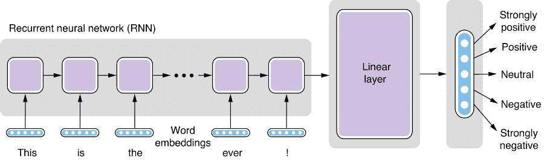
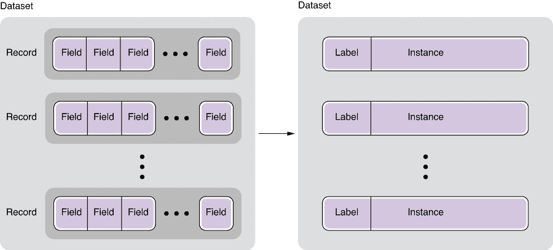
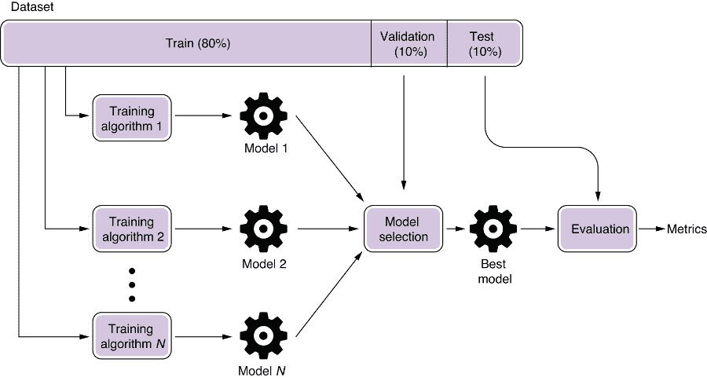
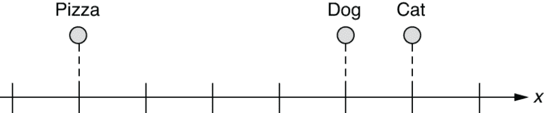
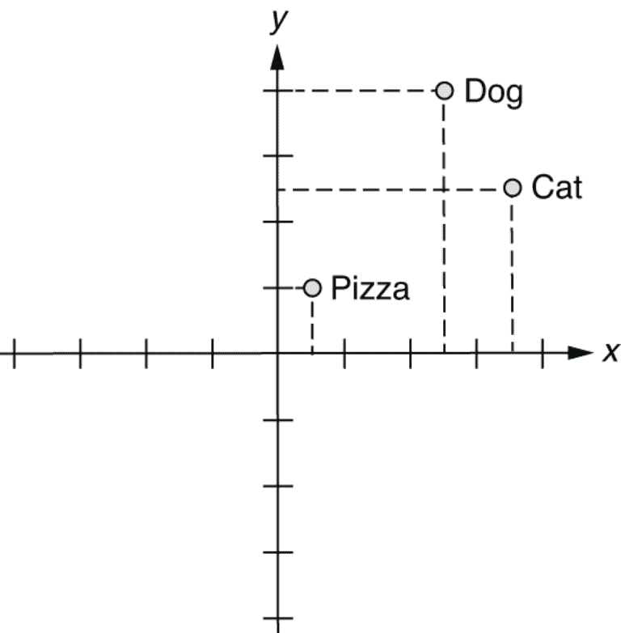
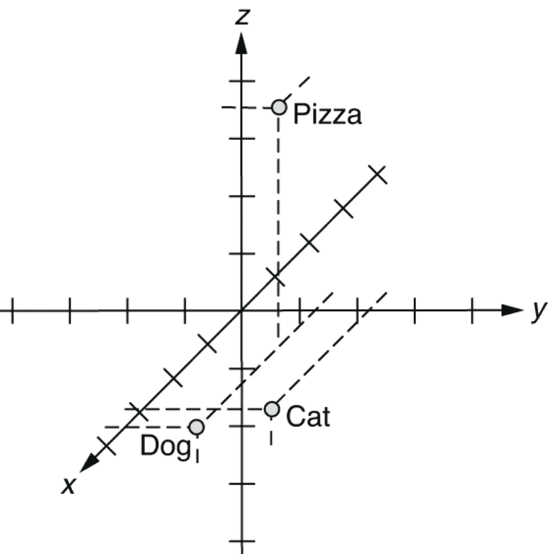
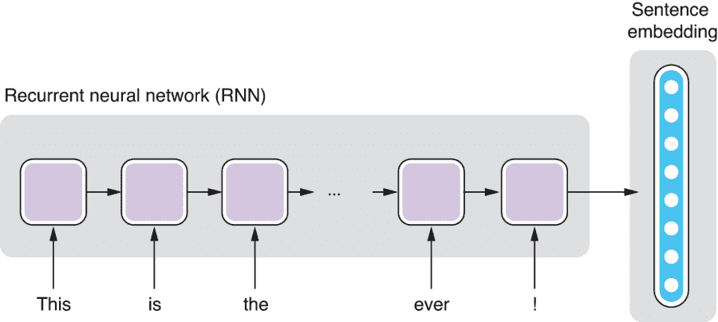
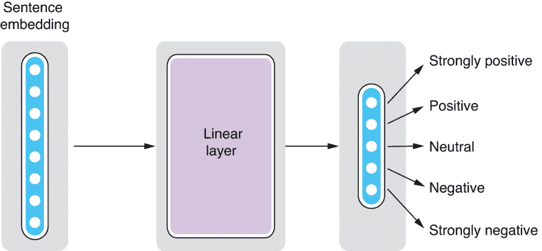
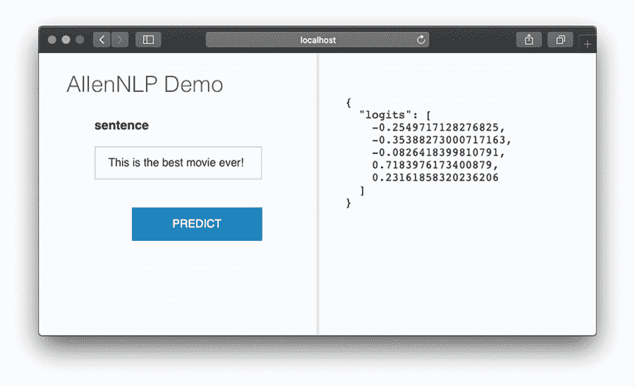

# 第二章：您的第一个 NLP 应用程序

本章内容包括：

+   使用 AllenNLP 构建情感分析器

+   应用基本的机器学习概念（数据集，分类和回归）

+   应用神经网络概念（词嵌入，循环神经网络，线性层）

+   通过减少损失训练模型

+   评估和部署您的模型

在 1.1.2 节中，我们看到了如何使用 NLP。在本章中，我们将讨论如何以更有原则性和现代化的方式进行 NLP。具体而言，我们希望使用神经网络构建一个情感分析器。尽管我们要构建的情感分析器是一个简单的应用程序，并且该库（AllenNLP）会处理大部分工作，但它是一个成熟的 NLP 应用程序，涵盖了许多现代 NLP 和机器学习的基本组件。我将沿途介绍重要的术语和概念。如果您一开始不理解某些概念，请不要担心。我们将在后面的章节中再次讨论在此处介绍的大部分概念。

## 2.1 介绍情感分析

在 1.1.2 节中描述的情景中，您希望从在线调查结果中提取用户的主观意见。您拥有对自由回答问题的文本数据集合，但缺少对“您对我们的产品有何评价？”问题的答案，您希望从文本中恢复它们。这个任务称为*情感分析*，是一种在文本中自动识别和分类主观信息的文本分析技术。该技术广泛应用于量化以非结构化方式书写的意见、情感等方面的文本资源。情感分析应用于各种文本资源，如调查、评论和社交媒体帖子。

在机器学习中，*分类*意味着将某样东西归类为一组预定义的离散类别。情感分析中最基本的任务之一就是*极性*的分类，即将表达的观点分类为正面、负面或中性。您可以使用超过三个类别，例如强正面、正面、中性、负面或强负面。如果您使用过可以使用五级评分表达的网站（如亚马逊），那么这可能听起来很熟悉。

极性分类是一种句子分类任务。另一种句子分类任务是垃圾邮件过滤，其中每个句子被分类为两类——垃圾邮件或非垃圾邮件。如果只有两个类别，则称为*二元分类*。如果有超过两个类别（前面提到的五星级分类系统，例如），则称为*多类分类*。

相反，当预测是连续值而不是离散类别时，称之为 *回归*。如果你想根据房屋的属性来预测房屋的价格，比如它的社区、卧室和浴室的数量以及平方英尺，那就是一个回归问题。如果你尝试根据从新闻文章和社交媒体帖子中收集到的信息来预测股票价格，那也是一个回归问题。（免责声明：我并不是在建议这是预测股价的适当方法。我甚至不确定它是否有效。）正如我之前提到的，大多数语言单位，如字符、单词和词性标签，都是离散的。因此，自然语言处理中大多数使用的机器学习都是分类，而不是回归。

注意 *逻辑回归*，一种广泛使用的统计模型，通常用于分类，尽管它的名字中有“回归”一词。是的，我知道这很令人困惑！

许多现代自然语言处理应用，包括我们将在本章中构建的情感分析器（如图 2.1 所示），都是基于 *监督式机器学习* 范式构建的。监督式机器学习是一种机器学习类型，其中算法是通过具有监督信号的数据进行训练的——对于每个输入都有期望的结果。该算法被训练成尽可能准确地重现这些信号。对于情感分析，这意味着系统是在包含每个输入句子的所需标签的数据上进行训练的。



图 2.1 情感分析流水线

## 2.2 处理自然语言处理数据集

正如我们在上一节中讨论的，许多现代自然语言处理应用都是使用监督式机器学习开发的，其中算法是从标有期望结果的数据中训练出来的，而不是使用手写规则。几乎可以说，数据是机器学习的关键部分，因此了解它是如何结构化并与机器学习算法一起使用的至关重要。

### 2.2.1 什么是数据集？

*数据集* 简单地意味着一组数据。如果你熟悉关系型数据库，你可以将数据集想象成一个表的转储。它由符合相同格式的数据片段组成。在数据库术语中，数据的每个片段对应一个记录，或者表中的一行。记录可以有任意数量的字段，对应数据库中的列。

在自然语言处理中，数据集中的记录通常是某种类型的语言单位，比如单词、句子或文档。自然语言文本的数据集称为 *语料库*（复数形式为 *语料库*）。举个例子，我们来想象一个（假想的）用于垃圾邮件过滤的数据集。该数据集中的每条记录都是一对文本和标签，其中文本是一句话或一段文字（例如，来自一封电子邮件），而标签指定文本是否是垃圾邮件。文本和标签都是记录的字段。

一些自然语言处理数据集和语料库具有更复杂的结构。例如，一个数据集可能包含一系列句子，其中每个句子都用详细的语言信息进行了注释，例如词性标签、句法树、依存结构和语义角色。如果一个数据集包含了一系列句子，并且这些句子带有它们的句法树注释，那么这个数据集被称为*树库*。最著名的例子是宾夕法尼亚树库（Penn Treebank，PTB）([`realworldnlpbook.com/ch2.html#ptb`](http://realworldnlpbook.com/ch2.html#ptb))，它一直作为培训和评估自然语言处理任务（如词性标注和句法分析）的事实标准数据集。

与记录密切相关的术语是*实例*。在机器学习中，实例是进行预测的基本单位。例如，在前面提到的垃圾邮件过滤任务中，一个实例是一段文本，因为对单个文本进行预测（垃圾邮件或非垃圾邮件）。实例通常是从数据集中的记录创建的，就像在垃圾邮件过滤任务中一样，但并非总是如此——例如，如果您拿一个树库来训练一个 NLP 任务，该任务检测句子中的所有名词，那么每个单词，而不是一个句子，就成为一个实例，因为对每个单词进行预测（名词或非名词）。最后，*标签*是附加到数据集中某些语言单位的信息片段。一个垃圾邮件过滤数据集有与每个文本是否为垃圾邮件相对应的标签。一个树库可能具有每个词的词性标签的标签。标签通常在监督式机器学习环境中用作训练信号（即训练算法的答案）。请参见图 2.2，了解数据集的这些部分的描绘。



图 2.2 数据集、记录、字段、实例和标签

### 2.2.2 斯坦福情感树库

为了构建情感分析器，我们将使用斯坦福情感树库（SST；[`nlp.stanford.edu/sentiment/`](https://nlp.stanford.edu/sentiment/)），这是截至目前最广泛使用的情感分析数据集之一。前往链接中的 Train, Dev, Test Splits in PTB Tree Format 下载数据集。SST 与其他数据集的一个不同之处在于，情感标签不仅分配给句子，而且分配给句子中的每个单词和短语。例如，数据集的一些摘录如下：

```py
(4
  (2 (2 Steven) (2 Spielberg))
    (4
      (2 (2 brings) (3 us))
      (4 (2 another) (4 masterpiece))))

(1
  (2 It)
  (1
    (1 (2 (2 's) (1 not))
      (4 (2 a) (4 (4 great) (2 (2 monster) (2 movie)))))
    (2 .)))
```

现在不用担心细节——这些树以人类难以阅读的 S 表达式编写（除非你是 Lisp 程序员）。请注意以下内容：

+   每个句子都带有情感标签（4 和 1）。

+   每个单词也被注释了，例如，（4 masterpiece）和（1 not）。

+   每个短语也被注释了，例如，（4（2 another）（4 masterpiece））。

数据集的这种属性使我们能够研究单词和短语之间的复杂语义交互。 例如，让我们将以下句子的极性作为一个整体来考虑：

这部电影实际上既不是那么有趣，也不是非常机智。

上面的陈述肯定是一个负面的，尽管，如果你专注于单词的个别词语（比如*有趣*、*机智*），你可能会被愚弄成认为它是一个积极的。 如果您构建一个简单的分类器，它从单词的个别“投票”中获取结果（例如，如果其大多数单词为积极，则句子为积极），这样的分类器将难以正确分类此示例。 要正确分类此句子的极性，您需要理解否定“既不…也不”的语义影响。 为了这个属性，SST 已被用作可以捕获句子的句法结构的神经网络模型的标准基准（[`realworldnlpbook.com/ch2.html#socher13`](http://realworldnlpbook.com/ch2.html#socher13)）。 但是，在本章中，我们将忽略分配给内部短语的所有标签，并仅使用句子的标签。

### 2.2.3 训练、验证和测试集

在我们继续展示如何使用 SST 数据集并开始构建我们自己的情感分析器之前，我想简要介绍一些机器学习中的重要概念。 在 NLP 和 ML 中，通常使用几种不同类型的数据集来开发和评估模型是常见的。 一个广泛使用的最佳实践是使用三种不同类型的数据集*拆分*——训练、验证和测试集。

*训练*（或*训练*）集是用于训练 NLP/ML 模型的主要数据集。 通常将来自训练集的实例直接馈送到 ML 训练管道中，并用于学习模型的参数。 训练集通常是这里讨论的三种类型的拆分中最大的。

*验证*集（也称为*开发*或*开发*集）用于*模型选择*。 模型选择是一个过程，在这个过程中，从所有可能使用训练集训练的模型中选择适当的 NLP/ML 模型，并且这是为什么它是必要的。 让我们想象一种情况，在这种情况下，您有两种机器学习算法 A 和 B，您希望用它们来训练一个 NLP 模型。 您同时使用这两个算法，并获得了模型 A 和 B。 现在，您如何知道哪个模型更好呢？

“那很容易，”您可能会说。“在训练集上评估它们两个。”乍一看，这似乎是个好主意。 您在训练集上运行模型 A 和 B，并查看它们在准确度等度量方面的表现。 为什么人们要费心使用单独的验证集来选择模型？

答案是 *过拟合* —— 自然语言处理和机器学习中另一个重要概念。过拟合是指训练模型在训练集上拟合得非常好，以至于失去了其泛化能力的情况。让我们想象一个极端情况来说明这一点。假设算法 B 是一个非常非常强大的算法，可以完全记住所有东西。可以把它想象成一个大的关联数组（或 Python 中的字典），它可以存储它曾经遇到过的所有实例和标签对。对于垃圾邮件过滤任务来说，这意味着模型会以训练时呈现的确切文本及其标签的形式进行存储。如果在评估模型时呈现相同的文本，它将返回存储的标签。另一方面，如果呈现的文本与其记忆中的任何其他文本略有不同，模型就一无所知，因为它以前从未见过。

你认为这个模型在训练集上进行评估时会表现如何？答案是……是的，100%！因为模型记住了训练集中的所有实例，所以它可以简单地“重播”整个数据集并进行完美分类。现在，如果你在电子邮件软件上安装了这个算法，它会成为一个好的垃圾邮件过滤器吗？绝对不会！因为无数的垃圾邮件看起来与现有邮件非常相似，但略有不同，或者完全是新的，所以如果输入的电子邮件与存储在内存中的内容只有一个字符的不同，模型就一无所知，并且在投入生产时将毫无用处。换句话说，它的泛化能力非常差（事实上是零）。

你如何防止选择这样的模型呢？通过使用验证集！验证集由与训练集类似的独立实例组成。因为它们与训练集独立，所以如果你在验证集上运行训练过的模型，你就可以很好地了解模型在训练集之外的表现。换句话说，验证集为模型的泛化能力提供了一个代理。想象一下，如果之前的“记住所有”算法训练的模型在验证集上进行评估。因为验证集中的实例与训练集中的实例类似但独立，所以你会得到非常低的准确率，知道模型的性能会很差，甚至在部署之前。

验证集还用于调整*超参数*。超参数是关于机器学习算法或正在训练的模型的参数。例如，如果你将训练循环（也称为*epoch*，关于更多解释请见后文）重复*N*次，那么这个*N*就是一个超参数。如果你增加神经网络的层数，你就改变了关于模型的一个超参数。机器学习算法和模型通常有许多超参数，调整它们对模型的性能至关重要。你可以通过训练多个具有不同超参数的模型并在验证集上评估它们来做到这一点。事实上，你可以将具有不同超参数的模型视为不同的模型，即使它们具有相同的结构，超参数调整可以被视为一种模型选择。

最后，*测试*集用于使用新的、未见过的数据对模型进行评估。它包含的实例与训练集和验证集是独立的。它可以让你很好地了解模型在“野外”中的表现。

你可能会想知道为什么需要另外一个独立的数据集来评估模型的泛化能力。难道你不能只使用验证集吗？再次强调，你不应该仅仅依赖于训练集和验证集来衡量你的模型的泛化能力，因为你的模型也可能以微妙的方式对验证集进行过拟合。这一点不太直观，但让我举个例子。想象一下，你正在疯狂地尝试大量不同的垃圾邮件过滤模型。你编写了一个脚本，可以自动训练一个垃圾邮件过滤模型。该脚本还会自动在验证集上评估训练好的模型。如果你用不同的算法和超参数组合运行此脚本 1,000 次，并选择在验证集上性能最好的一个模型，那么它是否也会在完全新的、未见过的实例上表现最好呢？可能不会。如果你尝试大量的模型，其中一些可能纯粹是由于偶然性而在验证集上表现相对较好（因为预测本质上存在一些噪音，和/或者因为这些模型恰好具有一些使它们在验证集上表现更好的特性），但这并不能保证这些模型在验证集之外表现良好。换句话说，可能会将模型过度拟合到验证集上。

总之，在训练 NLP 模型时，使用一个训练集来训练你的模型候选者，使用一个验证集来选择好的模型，并使用一个测试集来评估它们。用于 NLP 和 ML 评估的许多公共数据集已经分成了训练/验证/测试集。如果你只有一个数据集，你可以自己将其分成这三个数据集。常用的是 80:10:10 分割。图 2.3 描绘了训练/验证/测试分割以及整个训练流水线。



图 2.3 训练/验证/测试分割和训练流水线

### 2.2.4 使用 AllenNLP 加载 SST 数据集

最后，让我们看看如何在代码中实际加载数据集。在本章的其余部分，我们假设你已经安装了 AllenNLP（版本 2.5.0）和相应版本的 allennlp-models 包，通过运行以下命令： 

```py
pip install allennlp==2.5.0
pip install allennlp-models==2.5.0
```

并导入了如下所示的必要类和模块：

```py
from itertools import chain
from typing import Dict

import numpy as np
import torch
import torch.optim as optim
from allennlp.data.data_loaders import MultiProcessDataLoader
from allennlp.data.samplers import BucketBatchSampler
from allennlp.data.vocabulary import Vocabulary
from allennlp.models import Model
from allennlp.modules.seq2vec_encoders import Seq2VecEncoder, PytorchSeq2VecWrapper
from allennlp.modules.text_field_embedders import TextFieldEmbedder, BasicTextFieldEmbedder
from allennlp.modules.token_embedders import Embedding
from allennlp.nn.util import get_text_field_mask
from allennlp.training import GradientDescentTrainer
from allennlp.training.metrics import CategoricalAccuracy, F1Measure
from allennlp_models.classification.dataset_readers.stanford_sentiment_tree_bank import \    StanfordSentimentTreeBankDatasetReader
```

很遗憾，截至目前为止，AllenNLP 并不官方支持 Windows。但别担心——本章节中的所有代码（实际上，本书中的所有代码）都可以作为 Google Colab 笔记本 ([`www.realworldnlpbook.com/ch2.html#sst-nb`](http://www.realworldnlpbook.com/ch2.html#sst-nb)) 使用，你可以在那里运行和修改代码并查看结果。

你还需要定义以下两个在代码片段中使用的常量：

```py
EMBEDDING_DIM = 128
HIDDEN_DIM = 128
```

AllenNLP 已经支持一个名为 DatasetReader 的抽象，它负责从原始格式（无论是原始文本还是一些奇特的基于 XML 的格式）中读取数据集并将其返回为一组实例。我们将使用 StanfordSentimentTreeBankDatasetReader()，它是一种特定处理 SST 数据集的 DatasetReader，如下所示：

```py
reader = StanfordSentimentTreeBankDatasetReader()
train_path = 'https:/./s3.amazonaws.com/realworldnlpbook/data/stanfordSentimentTreebank/trees/train.txt'
dev_path = 'https:/./s3.amazonaws.com/realworldnlpbook/data/stanfordSentimentTreebank/trees/dev.txt'
```

此片段将为 SST 数据集创建一个数据集读取器，并定义训练和开发文本文件的路径。

## 2.3 使用词嵌入

从这一部分开始，我们将开始构建情感分析器的神经网络架构。*Architecture* 只是神经网络结构的另一个词。构建神经网络很像建造房屋等结构。第一步是弄清楚如何将输入（例如，情感分析的句子）馈送到网络中。

正如我们之前所见，自然语言处理中的所有内容都是离散的，这意味着形式和含义之间没有可预测的关系（记得“rat”和“sat”）。另一方面，神经网络最擅长处理数字和连续的东西，这意味着神经网络中的所有内容都需要是浮点数。我们如何在这两个世界之间“搭桥”——离散和连续？关键在于词嵌入的使用，我们将在本节中详细讨论。

### 2.3.1 什么是词嵌入？

*Word* *embeddings* 是现代自然语言处理中最重要的概念之一。从技术上讲，嵌入是通常离散的东西的连续向量表示。词嵌入是一个词的连续向量表示。如果你对向量的概念不熟悉，*vector* 是数学上对数字的单维数组的名称。简单来说，词嵌入是用一个 300 元素数组（或任何其他大小的数组）填充的非零浮点数来表示每个单词的一种方式。概念上非常简单。那么，为什么它在现代自然语言处理中如此重要和普遍呢？

正如我在第一章中提到的，自然语言处理的历史实际上是对语言“离散性”的持续战斗的历史。在计算机眼中，“猫”和“狗”的距离与它们与“披萨”的距离是相同的。编程上处理离散词的一种方法是为各个词分配索引，如下所示（这里我们简单地假设这些索引按字母顺序分配）：

+   index("cat") = 1

+   index("dog") = 2

+   index("pizza") = 3

+   ...

这些分配通常由查找表管理。一个 NLP 应用或任务处理的整个有限单词集被称为*词汇*。但是这种方法并不比处理原始单词更好。仅仅因为单词现在用数字表示，就不意味着你可以对它们进行算术运算，并得出“猫”与“狗”（1 和 2 之间的差异）同样相似，就像“狗”与“披萨”（2 和 3 之间的差异）一样。这些指数仍然是离散和任意的。

“如果我们可以在数值尺度上表示它们呢？”几十年前，一些自然语言处理研究人员想知道。我们能否想出一种数值尺度，其中单词是

以点表示，以使语义上更接近的词（例如，“狗”和“猫”，它们都是动物）在几何上也更接近？从概念上讲，数值尺度将类似于图 2.4 中所示的尺度。



图 2.4 一维空间中的词嵌入

这是一个进步。现在我们可以表示“猫”和“狗”彼此之间比“披萨”更相似的事实。但是，“披萨”仍然比“猫”更接近“狗”。如果你想把它放在一个距离“猫”和“狗”都一样远的地方怎么办？也许只有一个维度太限制了。在这个基础上再添加一个维度如何，如图 2.5 所示？



图 2.5 二维空间中的词嵌入

许多改进！因为计算机在处理多维空间方面非常擅长（因为你可以简单地用数组表示点），你可以一直这样做，直到你有足够数量的维度。让我们有三个维度。在这个三维空间中，你可以将这三个词表示如下：

+   vec("cat") = [0.7, 0.5, 0.1]

+   vec("dog") = [0.8, 0.3, 0.1]

+   vec("pizza") = [0.1, 0.2, 0.8]

图 2.6 说明了这个三维空间。



图 2.6 三维空间中的词嵌入

这里的 x 轴（第一个元素）表示“动物性”的某种概念，而 z 轴（第三维）对应于“食物性”。（我编造了这些数字，但你明白我的意思。）这就是单词嵌入的本质。您只是将这些单词嵌入到了一个三维空间中。通过使用这些向量，您已经“知道”了语言的基本构建块是如何工作的。例如，如果您想要识别动物名称，那么您只需查看每个单词向量的第一个元素，并查看值是否足够高。与原始单词索引相比，这是一个很好的起点！

你可能会想知道这些数字实际上来自哪里。这些数字实际上是使用一些机器学习算法和大型文本数据集“学习”的。我们将在第三章中进一步讨论这一点。

顺便说一下，我们有一种更简单的方法将单词“嵌入”到多维空间中。想象一个具有与单词数量相同的维度的多维空间。然后，给每个单词一个向量，其中填充了零但只有一个 1，如下所示：

+   vec("cat") = [1, 0, 0]

+   vec("dog") = [0, 1, 0]

+   vec("pizza") = [0, 0, 1]

请注意，每个向量在对应单词的索引位置只有一个 1。这些特殊向量称为*one-hot 向量*。这些向量本身并不非常有用，不能很好地表示这些单词之间的语义关系——这三个单词彼此之间的距离都是相等的——但它们仍然（是一种非常愚蠢的）嵌入。当嵌入不可用时，它们通常被用作机器学习算法的输入。

### 2.3.2 使用单词嵌入进行情感分析

首先，我们创建数据集加载器，负责加载数据并将其传递给训练流水线，如下所示（稍后在本章中对此数据进行更多讨论）：

```py
sampler = BucketBatchSampler(batch_size=32, sorting_keys=["tokens"])
train_data_loader = MultiProcessDataLoader(reader, train_path,
                                           batch_sampler=sampler)
dev_data_loader = MultiProcessDataLoader(reader, dev_path,
                                           batch_sampler=sampler)
```

AllenNLP 提供了一个有用的 Vocabulary 类，管理着一些语言单位（如字符、单词和标签）到它们的 ID 的映射。您可以告诉该类从一组实例中创建一个 Vocabulary 实例，如下所示：

```py
vocab = Vocabulary.from_instances(chain(train_data_loader.iter_instances(),
                                        dev_data_loader.iter_instances()),
                                  min_count={'tokens': 3})
```

然后，您需要初始化一个 Embedding 实例，它负责将 ID 转换为嵌入，如下代码片段所示。嵌入的大小（维度）由 EMBEDDING_DIM 决定：

```py
token_embedding = Embedding(num_embeddings=vocab.get_vocab_size('tokens'),
                            embedding_dim=EMBEDDING_DIM)
```

最后，您需要指定哪些索引名称对应于哪些嵌入，并将其传递给 BasicTextFieldEmbedder，如下所示：

```py
word_embeddings = BasicTextFieldEmbedder({"tokens": token_embedding})
```

现在，您可以使用 word_embeddings 将单词（或更准确地说是标记，我将在第三章中更详细地讨论）转换为它们的嵌入。

## 2.4 神经网络

越来越多的现代自然语言处理应用程序是使用神经网络构建的。你可能已经看到了许多现代神经网络模型在计算机视觉和游戏领域所取得的惊人成就（例如自动驾驶汽车和打败人类冠军的围棋算法），而自然语言处理也不例外。在本书中，我们将使用神经网络来构建大多数自然语言处理示例和应用程序。在本节中，我们讨论了神经网络是什么以及它们为什么如此强大。

### 2.4.1 什么是神经网络？

神经网络是现代自然语言处理（以及许多其他相关人工智能领域，如计算机视觉）的核心。它是如此重要，如此广泛的研究主题，以至于需要一本书（或者可能是几本书）来全面解释它是什么以及所有相关的模型、算法等。在本节中，我将简要解释其要点，并根据需要在后面的章节中详细介绍。

简而言之，*神经网络*（也称为*人工神经网络*）是一个通用的数学模型，它将一个向量转换为另一个向量。就是这样。与你在大众媒体中读到和听到的内容相反，它的本质是简单的。如果你熟悉编程术语，可以将其看作是一个接受一个向量，内部进行一些计算，并将另一个向量作为返回值的函数。那么它为什么如此重要呢？它与编程中的普通函数有何不同呢？

第一个区别在于神经网络是*可训练的*。不要把它仅仅看作是一个固定的函数，而更像是一组相关函数的“模板”。如果你使用编程语言编写了一个包含一些常数的数学方程组的函数，当你输入相同的输入时，你总是会得到相同的结果。相反，神经网络可以接收“反馈”（输出与期望输出的接近程度）并调整其内部常数。那些“神奇”的常数被称为*权重*或更普遍地称为*参数*。下次运行时，你期望它的答案更接近你想要的结果。

第二个区别在于它的数学能力。如果可能的话，如果你要使用你最喜欢的编程语言编写一个执行情感分析等功能的函数，那将会非常复杂。（还记得第一章中那个可怜的软件工程师吗？）理论上，只要有足够的模型能力和训练数据，神经网络就能够近似于任何连续函数。这意味着，无论你的问题是什么，只要输入和输出之间存在关系，并且你为模型提供足够的计算能力和训练数据，神经网络就能够解决它。

神经网络通过学习*非线性*函数来实现这一点。什么是线性函数呢？线性函数是指，如果你将输入改变了 x，输出将始终以 c * x 的常数倍变化，其中 c 是一个常数。例如，2.0 * x 是线性的，因为如果你将 x 改变 1.0，返回值总是增加 2.0。如果你将这个函数画在图上，输入和输出之间的关系形成一条直线，这就是为什么它被称为线性的原因。另一方面，2.0 * x * x 不是线性的，因为返回值的变化量不仅取决于你改变 x 的量，还取决于 x 的值。

这意味着线性函数无法捕捉输入和输出之间以及输入变量之间的更复杂的关系。相反，诸如语言之类的自然现象是高度非线性的。如果你改变了输入 x（例如，句子中的一个词），输出的变化量不仅取决于你改变了多少 x，还取决于许多其他因素，如 x 本身的值（例如，你将 x 改变为什么词）以及其他变量（例如，x 的上下文）是什么。神经网络，这种非线性数学模型，有可能捕捉到这样复杂的相互作用。

### 2.4.2 循环神经网络（RNNs）和线性层

两种特殊类型的神经网络组件对情感分析非常重要——循环神经网络（RNNs）和线性层。我将在后面的章节中详细解释它们，但我会简要描述它们是什么以及它们在情感分析（或一般而言，句子分类）中的作用。

*循环神经网络*（RNN）是一种带有循环的神经网络，如图 2.7 所示。它具有一个内部结构，该结构被一次又一次地应用于输入。用编程的类比来说，这就像编写一个包含 for word in sentence:循环遍历输入句子中的每个单词的函数。它可以输出循环内部变量的中间值，或者循环完成后变量的最终值，或者两者兼而有之。如果你只取最终值，你可以将 RNN 用作将句子转换为具有固定长度的向量的函数。在许多自然语言处理任务中，你可以使用 RNN 将句子转换为句子的嵌入。还记得词嵌入吗？它们是单词的固定长度表示。类似地，RNN 可以产生句子的固定长度表示。



图 2.7 循环神经网络（RNN）

我们在这里将使用的另一种类型的神经网络组件是线性层。*线性层*，也称为*全连接层*，以线性方式将一个向量转换为另一个向量。正如前面提到的，*层*只是神经网络的一个子结构的花哨术语，因为你可以将它们堆叠在一起形成一个更大的结构。

请记住，神经网络可以学习输入和输出之间的非线性关系。为什么我们想要有更受限制（线性）的东西呢？线性层用于通过减少（或增加）维度来压缩（或扩展）向量。例如，假设你从 RNN 接收到一个 64 维的向量（64 个浮点数的数组）作为句子的嵌入，但你只关心对预测有重要作用的少量数值。在情感分析中，你可能只关心与五种不同情感标签对应的五个数值，即极强正面、正面、中性、负面和极强负面。但是你无法从嵌入的 64 个数值中提取出这五个数值。这正是线性层派上用场的地方 - 你可以添加一个层，将一个 64 维的向量转换为一个 5 维的向量，而神经网络会想办法做得很好，如图 2.8 所示。



图 2.8 线性层

### 2.4.3 情感分析的架构

现在，你已经准备好将各个组件组合起来构建情感分析器的神经网络了。首先，你需要按照以下步骤创建 RNN：

```py
encoder = PytorchSeq2VecWrapper(
    torch.nn.LSTM(EMBEDDING_DIM, HIDDEN_DIM, batch_first=True))
```

不要太担心 PytorchSeq2VecWrapper 和 batch_first=True。在这里，你正在创建一个 RNN（或更具体地说，一种叫做 LSTM 的 RNN）。输入向量的大小是 EMBEDDING_DIM，我们之前看到的，而输出向量的大小是 HIDDEN_DIM。

接下来，你需要创建一个线性层，如下所示：

```py
self.linear = torch.nn.Linear(in_features=encoder.get_output_dim(),
                              out_features=vocab.get_vocab_size('labels'))
```

输入向量的大小由 in_features 定义，而输出向量的大小则由 out_features 定义。因为我们要将句子嵌入转换为一个向量，其元素对应于五个情感标签，所以我们需要指定编码器输出的大小，并从词汇表中获取标签的总数。

最后，我们可以连接这些组件并构建一个模型，如下所示的代码。

列表 2.1 构建情感分析模型

```py
class LstmClassifier(Model):
    def __init__(self,
                 word_embeddings: TextFieldEmbedder,
                 encoder: Seq2VecEncoder,
                 vocab: Vocabulary,
                 positive_label: str = '4') -> None:
        super().__init__(vocab)
        self.word_embeddings = word_embeddings

        self.encoder = encoder

        self.linear = torch.nn.Linear(in_features=encoder.get_output_dim(),
                                      out_features=vocab.get_vocab_size('labels'))

        self.loss_function = torch.nn.CrossEntropyLoss()         ❶

    def forward(self,                                            ❷
                tokens: Dict[str, torch.Tensor],
                label: torch.Tensor = None) -> torch.Tensor:
        mask = get_text_field_mask(tokens)

        embeddings = self.word_embeddings(tokens)
        encoder_out = self.encoder(embeddings, mask)
        logits = self.linear(encoder_out)

        output = {"logits": logits}
        if label is not None:
            self.accuracy(logits, label)
            self.f1_measure(logits, label)
            output["loss"] = self.loss_function(logits, label)   ❸

        return output
```

❶ 定义损失函数（交叉熵）

❷ forward() 函数是模型中大部分计算发生的地方。

❸ 计算损失并将其分配给返回字典中的“loss”键

我希望你专注于最重要的函数 forward()，每个神经网络模型都有它。它的作用是接收输入，经过神经网络的子组件处理后，产生输出。虽然这个函数有一些我们尚未涉及的陌生逻辑（例如掩码和损失），但重要的是你可以像将输入（标记）转换的函数一样将模型的子组件（词嵌入，RNN 和线性层）链接在一起，并在管道的末尾得到一些称为*logits*的东西。在统计学中，logit 是一个具有特定含义的术语，但在这里，你可以将其视为类别的分数。对于特定标签的分数越高，表示该标签是正确的信心就越大。

## 2.5 损失函数和优化

神经网络使用有监督学习进行训练。如前所述，有监督学习是一种基于大量标记数据学习将输入映射到输出的机器学习类型。到目前为止，我只介绍了神经网络如何接收输入并生成输出。我们如何才能使神经网络生成我们实际想要的输出呢？

神经网络不仅仅是像常规的编程语言中的函数那样。它们是*可训练的*，意味着它们可以接收一些反馈并调整其内部参数，以便下一次为相同的输入产生更准确的输出。请注意，这包含两个部分-接收反馈和调整参数，分别通过损失函数和优化来实现，下面我将解释它们。

*损失函数*是衡量机器学习模型输出与期望输出之间距离的函数。实际输出与期望输出之间的差异称为*损失*。在某些情况下，损失也称为*成本*。无论哪种情况，损失越大，则模型越差，你希望它尽可能接近零。例如，以情感分析为例。如果模型认为一句话是 100%的负面，但训练数据显示它是非常积极的，那么损失会很大。另一方面，如果模型认为一句话可能是 80%的负面，而训练标签确实是负面的，那么损失会很小。如果两者完全匹配，损失将为零。

PyTorch 提供了广泛的函数来计算损失。我们在这里需要的是*交叉熵损失*，它通常用于分类问题，如下所示：

```py
self.loss_function = torch.nn.CrossEntropyLoss()
```

后续可以通过以下方式将预测和来自训练集的标签传递给它来使用：

```py
output["loss"] = self.loss_function(logits, label)
```

然后，这就是魔术发生的地方。 由于其数学属性，神经网络知道如何改变其内部参数以使损失变小。 在接收到一些大损失后，神经网络会说：“哎呀，抱歉，那是我的错，但我下一轮会做得更好！” 并更改其参数。 记得我说过编写一个具有一些魔术常量的编程语言的函数吗？ 神经网络就像那样的函数，但它们确切地知道如何改变魔术常量以减少损失。 它们对训练数据中的每个实例都这样做，以便尽可能为尽可能多的实例产生更多的正确答案。 当然，它们在调整参数仅一次后就不能达到完美的答案。 需要对训练数据进行多次通过，称为*epochs*。 图 2.9 显示了神经网络的整体训练过程。


图 2.9 神经网络的整体训练过程

神经网络从输入中使用当前参数集计算输出的过程称为*前向传递*。 这就是为什么列表 2.1 中的主要函数被称为 forward()。 将损失反馈给神经网络的方式称为*反向传播*。 通常使用一种称为*随机梯度下降*（SGD）的算法来最小化损失。 将损失最小化的过程称为*优化*，用于实现此目的的算法（例如 SGD）称为*优化器*。 您可以使用 PyTorch 初始化优化器如下：

```py
optimizer = optim.Adam(model.parameters())
```

在这里，我们使用一种称为 Adam 的优化器。 在神经网络社区中提出了许多类型的优化器，但共识是没有一种优化算法适用于任何问题，您应该准备为您自己的问题尝试多种优化算法。

好了，那是很多技术术语。 暂时你不需要了解这些算法的细节，但如果你学习一下这些术语及其大致含义会很有帮助。 如果你用 Python 伪代码来写整个训练过程，它将显示为第 2.2 列表所示。 请注意，有两个嵌套循环，一个是在 epochs 上，另一个是在 instances 上。

第 2.2 列表神经网络训练循环的伪代码

```py
MAX_EPOCHS = 100
model = Model()

for epoch in range(MAX_EPOCHS):
    for instance, label in train_set:
        prediction = model.forward(instance)
        loss = loss_function(prediction, label)
        new_model = optimizer(model, loss)
        model = new_model
```

## 2.6 训练您自己的分类器

在本节中，我们将使用 AllenNLP 的训练框架来训练我们自己的分类器。 我还将简要介绍批处理的概念，这是在训练神经网络模型中使用的重要实用概念。

### 2.6.1 批处理

到目前为止，我忽略了一个细节——批处理。 我们假设每个实例都会进行一次优化步骤，就像您在之前的伪代码中看到的那样。 但实际上，我们通常会将若干个实例分组并将它们馈送到神经网络中，每个组更新模型参数，而不是每个实例。 我们将这组实例称为一个*批次*。

批处理是一个好主意，原因有几个。第一个是稳定性。任何数据都存在噪声。您的数据集可能包含采样和标记错误。如果您为每个实例更新模型参数，并且某些实例包含错误，则更新受到噪声的影响太大。但是，如果您将实例分组为批次，并为整个批次计算损失，而不是为单个实例计算，您可以“平均”小错误，并且反馈到您的模型会稳定下来。

第二个原因是速度。训练神经网络涉及大量的算术操作，如矩阵加法和乘法，并且通常在 GPU（图形处理单元）上进行。因为 GPU 被设计成可以并行处理大量的算术操作，所以如果您一次传递大量数据并一次处理它，而不是逐个传递实例，通常会更有效率。把 GPU 想象成一个海外的工厂，根据您的规格制造产品。因为工厂通常被优化为大量制造少量种类的产品，并且在通信和运输产品方面存在开销，所以如果您为大量产品制造少量订单，而不是为少量产品制造大量订单，即使您希望以任何方式获得相同数量的产品，也更有效率。

使用 AllenNLP 轻松将实例分组成批次。该框架使用 PyTorch 的 DataLoader 抽象，负责接收实例并返回批次。我们将使用一个 BucketBatchSampler，它将实例分组成长度相似的桶，如下代码片段所示。我将在后面的章节中讨论它的重要性：

```py
sampler = BucketBatchSampler(batch_size=32, sorting_keys=["tokens"])
train_data_loader = MultiProcessDataLoader(reader, train_path, batch_sampler=sampler)
dev_data_loader = MultiProcessDataLoader(reader, dev_path, batch_sampler=sampler)
```

参数 batch_size 指定了批量的大小（批量中的实例数）。调整此参数通常有一个“最佳点”。它应该足够大，以产生我之前提到的批处理的任何效果，但也应该足够小，以便批次适合 GPU 内存，因为工厂有一次可以制造的产品的最大容量。

### 2.6.2 将一切放在一起

现在您已经准备好训练情感分析器了。我们假设您已经定义并初始化了您的模型如下：

```py
model = LstmClassifier(word_embeddings, encoder, vocab)
```

查看完整的代码清单（[`www.realworldnlpbook.com/ch2.html#sst-nb`](http://www.realworldnlpbook.com/ch2.html#sst-nb)），了解模型的外观和如何使用它。

AllenNLP 提供了 Trainer 类，它作为将所有组件放在一起并管理训练流水线的框架，如下所示：

```py
trainer = GradientDescentTrainer(
    model=model,
    optimizer=optimizer,
    data_loader=train_data_loader,
    validation_data_loader=dev_data_loader,
    patience=10,
    num_epochs=20,
    cuda_device=-1)

trainer.train()
```

你向训练器提供模型、优化器、迭代器、训练集、开发集和你想要的时期数，并调用 train 方法。最后一个参数，cuda_device，告诉训练器使用哪个设备（CPU 或 GPU）进行训练。在这里，我们明确地使用 CPU。这将运行列在列表 2.2 中的神经网络训练循环，并显示进展情况，包括评估指标。

## 2.7 评估你的分类器

当训练自然语言处理/机器学习模型时，你应该始终监控损失随时间的变化。如果训练正常进行，你应该看到损失随时间而减少。它不一定每个时期都会减少，但作为一般趋势，它应该会减少，因为这正是你告诉优化器要做的事情。如果它在增加或显示出奇怪的值（如 NaN），通常意味着你的模型过于局限或代码中存在错误的迹象。

除了损失之外，监控你在任务中关心的其他评估指标也很重要。损失是一个纯数学概念，衡量了模型与答案之间的接近程度，但较小的损失并不总是能保证在自然语言处理任务中获得更好的性能。

你可以使用许多评估指标，取决于你的自然语言处理任务的性质，但无论你在做什么任务，你都需要了解的一些指标包括准确率、精确率、召回率和 F-度量。粗略地说，这些指标衡量了你的模型预测与数据集定义的预期答案匹配的程度。暂时来说，知道它们用于衡量分类器的好坏就足够了（更多细节将在第四章介绍）。

要在训练期间使用 AllenNLP 监控和报告评估指标，你需要在你的模型类中实现 get_metrics() 方法，该方法返回从指标名称到它们的值的字典，如下所示。

列表 2.3 定义评估指标

```py
   def get_metrics(self, reset: bool = False) -> Dict[str, float]:
        return {'accuracy': self.accuracy.get_metric(reset),
                **self.f1_measure.get_metric(reset)}
```

self.accuracy 和 self.f1_measure 在 __init__() 中定义如下：

```py
    self.accuracy = CategoricalAccuracy()
    self.f1_measure = F1Measure(positive_index)
```

当你使用定义好的指标运行 trainer.train() 时，你会在每个时期后看到类似下面的进度条：

```py
accuracy: 0.7268, precision: 0.8206, recall: 0.8703, f1: 0.8448, batch_loss: 0.7609, loss: 0.7194 ||: 100%|##########| 267/267 [00:13<00:00, 19.28it/s]
accuracy: 0.3460, precision: 0.3476, recall: 0.3939, f1: 0.3693, batch_loss: 1.5834, loss: 1.9942 ||: 100%|##########| 35/35 [00:00<00:00, 119.53it/s]
```

你可以看到训练框架报告了这些指标，分别针对训练集和验证集。这不仅有助于评估模型，还有助于监控训练的进展。如果看到任何异常值，比如极低或极高的数字，你会知道出了问题，甚至在训练完成之前就能发现。

你可能已经注意到训练集和验证集的指标之间存在很大的差距。具体来说，训练集的指标比验证集的指标高得多。这是过拟合的常见症状，我之前提到过，即模型在训练集上拟合得非常好，以至于失去了在外部的泛化能力。这就是为什么监控指标使用验证集也很重要，因为仅仅通过观察训练集的指标，你无法知道它是表现良好还是过拟合！

## 2.8 部署你的应用程序

制作自己的 NLP 应用程序的最后一步是部署它。训练模型只是故事的一半。你需要设置它，以便它可以为它从未见过的新实例进行预测。确保模型提供预测在实际的 NLP 应用程序中是至关重要的，而且在这个阶段可能会投入大量的开发工作。在本节中，我将展示如何使用 AllenNLP 部署我们刚刚训练的模型。这个主题在第十一章中会更详细地讨论。

### 2.8.1 进行预测

要对你的模型从未见过的新实例进行预测（称为*测试实例*），你需要通过与训练相同的神经网络管道来传递它们。它必须完全相同——否则，你将冒着结果扭曲的风险。这被称为*训练-服务偏差*，我将在第十一章中解释。

AllenNLP 提供了一个方便的抽象称为*预测器*，它的工作是接收原始形式的输入（例如，原始字符串），将其通过预处理和神经网络管道传递，并返回结果。我为 SST 编写了一个特定的预测器称为 SentenceClassifierPredictor（[`realworldnlpbook.com/ch2 .html#predictor`](http://realworldnlpbook.com/ch2.html#predictor)），你可以按照以下方式调用它：

```py
predictor = SentenceClassifierPredictor(model, dataset_reader=reader)
logits = predictor.predict('This is the best movie ever!')['logits']
```

注意，预测器返回模型的原始输出，在这种情况下是 logits。记住，logits 是与目标标签对应的一些分数，所以如果你想要预测的标签本身，你需要将其转换为标签。你现在不需要理解所有的细节，但可以通过首先取 logits 的 argmax 来完成这个操作，argmax 返回具有最大值的 logit 的索引，然后通过查找 ID 来获取标签，如下所示：

```py
label_id = np.argmax(logits)
print(model.vocab.get_token_from_index(label_id, 'labels'))
```

如果这个打印出“4”，那么恭喜你！标签“4”对应着“非常积极”，所以你的情感分析器刚刚预测到句子“这是有史以来最好的电影！”是非常积极的，这的确是正确的。

### 2.8.2 提供预测

最后，你可以使用 AllenNLP 轻松部署训练好的模型。如果你使用 JSON 配置文件（我将在第四章中解释），你可以将训练好的模型保存到磁盘上，然后快速启动一个基于 Web 的界面，你可以向你的模型发送请求。要做到这一点，你需要安装 allennlp-server，这是一个为 AllenNLP 提供预测的 Web 接口的插件，如下所示：

```py
git clone https:/./github.com/allenai/allennlp-server
pip install —editable allennlp-server
```

假设你的模型保存在 examples/sentiment/model 下，你可以使用以下 AllenNLP 命令运行一个基于 Python 的 Web 应用程序：

```py
$ allennlp serve \ 
    --archive-path examples/sentiment/model/model.tar.gz \
    --include-package examples.sentiment.sst_classifier \
    --predictor sentence_classifier_predictor \
    --field-name sentence
```

如果你使用浏览器打开 http:/./localhost:8000/，你将看到图 2.10 中显示的界面。



图 2.10 在 Web 浏览器上运行情感分析器

尝试在句子文本框中输入一些句子，然后点击预测。您应该在屏幕右侧看到逻辑值。它们只是一组原始的逻辑值，很难阅读，但您可以看到第四个值（对应标签“非常积极”）是最大的，模型正在按预期工作。

您还可以直接从命令行向后端进行 POST 请求，如下所示：

```py
curl -d '{"sentence": "This is the best movie ever!"}'
    -H "Content-Type: application/json" \
    -X POST http:/./localhost:8000/predict
```

这应该返回与上面看到的相同的 JSON：

```py
{"logits":[-0.2549717128276825,-0.35388273000717163,
-0.0826418399810791,0.7183976173400879,0.23161858320236206]}
```

好了，就到这里吧。在这一章中我们讨论了很多内容，但不要担心——我只是想告诉你，构建一个实际可用的自然语言处理应用程序是很容易的。也许你曾经发现一些关于神经网络和深度学习的书籍或在线教程让人望而生畏，甚至在创建任何实际可用的东西之前就放弃了学习。请注意，我甚至没有提到任何诸如神经元、激活、梯度和偏导数等概念，这些概念通常是其他学习资料在最初阶段教授的。这些概念确实很重要，而且有助于了解，但多亏了强大的框架如 AllenNLP，你也能够构建实用的自然语言处理应用程序，而不必完全了解其细节。在后面的章节中，我将更详细地讨论这些概念。

## 摘要

+   情感分析是一种文本分析技术，用于自动识别文本中的主观信息，如其极性（积极或消极）。

+   训练集、开发集和测试集用于训练、选择和评估机器学习模型。

+   词嵌入使用实数向量表示单词的含义。

+   循环神经网络（RNN）和线性层用于将一个向量转换为另一个不同大小的向量。

+   使用优化器训练神经网络，以使损失（实际输出与期望输出之间的差异）最小化。

+   在训练过程中监视训练集和开发集的指标非常重要，以避免过拟合。
