# 第四章：句子分类

本章内容包括

+   利用循环神经网络（RNN）处理长度可变的输入

+   处理 RNN 及其变体（LSTM 和 GRU）

+   使用常见的分类问题评估指标

+   使用 AllenNLP 开发和配置训练管道

+   将语言识别器构建为句子分类任务

在本章中，我们将研究句子分类任务，其中 NLP 模型接收一个句子并为其分配一些标签。垃圾邮件过滤器是句子分类的一个应用。它接收一封电子邮件并指定它是否为垃圾邮件。如果你想将新闻文章分类到不同的主题（商业、政治、体育等），也是一个句子分类任务。句子分类是最简单的 NLP 任务之一，具有广泛的应用范围，包括文档分类、垃圾邮件过滤和情感分析。具体而言，我们将重新审视第二章中介绍的情感分类器，并详细讨论其组成部分。在本节结束时，我们将研究句子分类的另一个应用——语言检测。

## 4.1 循环神经网络（RNN）

句子分类的第一步是使用神经网络（RNN）表示长度可变的句子。在本节中，我将介绍循环神经网络的概念，这是深度 NLP 中最重要的概念之一。许多现代 NLP 模型以某种方式使用 RNN。我将解释它们为什么很重要，它们的作用是什么，并介绍它们的最简单变体。

### 4.1.1 处理长度可变的输入

上一章中展示的 Skip-gram 网络结构很简单。它接受一个固定大小的词向量，通过线性层运行它，得到所有上下文词之间的分数分布。网络的结构和大小以及输入输出都在训练期间固定。

然而，自然语言处理（NLP）中面临的许多，如果不是大多数情况下，都是长度可变的序列。例如，单词是字符序列，可以短（“a”，“in”）也可以长（“internationalization”）。句子（单词序列）和文档（句子序列）可以是任何长度。即使是字符，如果将它们看作笔画序列，则可以是简单的（如英语中的“O”和“L”）或更复杂的（例如，“鬱”是一个包含 29 个笔画，并表示“抑郁”的中文汉字）。

正如我们在上一章中讨论的那样，神经网络只能处理数字和算术运算。这就是为什么我们需要通过嵌入将单词和文档转换为数字的原因。我们使用线性层将一个固定长度的向量转换为另一个向量。但是，为了处理长度可变的输入，我们需要找到一种处理方法，使得神经网络可以对其进行处理。

一个想法是首先将输入（例如，一系列单词）转换为嵌入，即一系列浮点数向量，然后将它们平均。假设输入句子为 sentence = ["john", "loves", "mary", "."]，并且你已经知道句子中每个单词的单词嵌入 v("john")、v("loves")等。平均值可以用以下代码获得，并在图 4.1 中说明：

```py
result = (v("john") + v("loves") + v("mary") + v(".")) / 
```

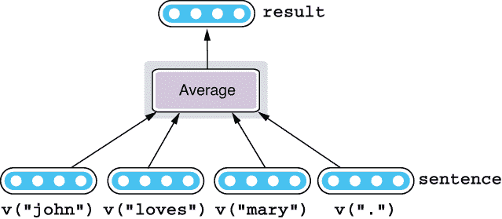

图 4.1 平均嵌入向量

这种方法相当简单，实际上在许多自然语言处理应用中都有使用。然而，它有一个关键问题，即它无法考虑词序。因为输入元素的顺序不影响平均结果，你会得到“Mary loves John”和“John loves Mary”两者相同的向量。尽管它能胜任手头的任务，但很难想象有多少自然语言处理应用会希望这种行为。

如果我们退后一步，思考一下我们人类如何阅读语言，这种“平均”与现实相去甚远。当我们阅读一句话时，我们通常不会孤立地阅读单个单词并首先记住它们，然后再弄清楚句子的含义。我们通常从头开始扫描句子，逐个单词地阅读，同时将“部分”句子在我们的短期记忆中的含义保持住直到你正在阅读的部分。换句话说，你在阅读时保持了一种对句子的心理表征。当你达到句子的末尾时，这种心理表征就是它的含义。

我们是否可以设计一个神经网络结构来模拟这种对输入的逐步阅读？答案是肯定的。这种结构被称为*循环神经网络*（RNNs），我将在接下来详细解释。

### 4.1.2 RNN 抽象

如果你分解前面提到的阅读过程，其核心是以下一系列操作的重复：

1.  阅读一个词。

1.  根据迄今为止所阅读的内容（你的“心理状态”），弄清楚这个词的含义。

1.  更新心理状态。

1.  继续下一个词。

让我们通过一个具体的例子来看看这是如何工作的。如果输入句子是 sentence = ["john", "loves", "mary", "."]，并且每个单词已经表示为单词嵌入向量。另外，让我们将你的“心理状态”表示为 state，它由 init_state()初始化。然后，阅读过程由以下递增操作表示：

```py
state = init_state()
state = update(state, v("john"))
state = update(state, v("loves"))
state = update(state, v("mary"))
state = update(state, v("."))
```

state 的最终值成为此过程中整个句子的表示。请注意，如果你改变这些单词处理的顺序（例如，交换“John”和“Mary”），state 的最终值也会改变，这意味着 state 也编码了一些有关词序的信息。

如果你可以设计一个网络子结构，可以在更新一些内部状态的同时应用于输入的每个元素，那么你可以实现类似的功能。RNNs 就是完全这样做的神经网络结构。简而言之，RNN 是一个带有循环的神经网络。其核心是在输入中的每个元素上应用的操作。如果你用 Python 伪代码来表示 RNN 做了什么，就会像下面这样：

```py
def rnn(words):
    state = init_state()
    for word in words:
        state = update(state, word)
    return state
```

注意这里有一个被初始化并在迭代过程中传递的状态。对于每个输入单词，状态会根据前一个状态和输入使用`update`函数进行更新。对应于这个步骤（循环内的代码块）的网络子结构被称为*单元*。当输入用尽时，这个过程停止，状态的最终值成为该 RNN 的结果。见图 4.2 进行说明。

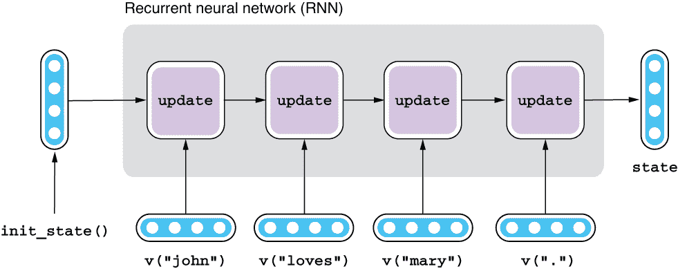

图 4.2 RNN 抽象

在这里你可以看到并行性。当你阅读一个句子（一串单词）时，每读一个单词后你内部心理对句子的表示，即状态，会随之更新。可以假设最终状态编码了整个句子的表示。

唯一剩下的工作是设计两个函数——`init_state()` 和 `update()`。通常，状态初始化为零（即一个填满零的向量），所以你通常不用担心如何定义前者。更重要的是如何设计 `update()`，它决定了 RNN 的特性。

### 4.1.3 简单 RNNs 和非线性

在第 3.4.3 节中，我解释了如何使用任意数量的输入和输出来实现一个线性层。我们是否可以做类似的事情，并实现`update()`，它基本上是一个接受两个输入变量并产生一个输出变量的函数呢？毕竟，一个单元是一个有自己输入和输出的神经网络，对吧？答案是肯定的，它看起来像这样：

```py
def update_simple(state, word):
    return f(w1 * state + w2 * word + b)
```

注意这与第 3.4.3 节中的 `linear2()` 函数非常相似。实际上，如果忽略变量名称的差异，除了 `f()` 函数之外，它们是完全一样的。由此类型的更新函数定义的 RNN 被称为*简单 RNN*或*Elman RNN*，正如其名称所示，它是最简单的 RNN 结构之一。

你可能会想，这里的 `f()` 函数是做什么的？它是什么样的？我们是否需要它？这个函数被称为*激活函数*或*非线性函数*，它接受一个输入（或一个向量）并以非线性方式转换它（或转换向量的每个元素）。存在许多种非线性函数，它们在使神经网络真正强大方面起着不可或缺的作用。它们确切地做什么以及为什么它们重要需要一些数学知识来理解，这超出了本书的范围，但我将尝试用一个简单的例子进行直观解释。

想象一下你正在构建一个识别“语法正确”的英语句子的 RNN。区分语法正确的句子和不正确的句子本身就是一个困难的自然语言处理问题，实际上是一个成熟的研究领域（参见第 1.2.1 节），但在这里，让我们简化它，并考虑主语和动词之间的一致性。让我们进一步简化，并假设这个“语言”中只有四个词——“I”，“you”，“am” 和 “are”。如果句子是“I am” 或 “you are”，那么它就是语法正确的。另外两种组合，“I are” 和 “you am”，是不正确的。你想要构建的是一个 RNN，对于正确的句子输出 1，对于不正确的句子输出 0。你会如何构建这样一个神经网络？

几乎每个现代 NLP 模型的第一步都是用嵌入来表示单词。如前一章所述，它们通常是从大型自然语言文本数据集中学习到的，但在这里，我们只是给它们一些预定义的值，如图 4.3 所示。

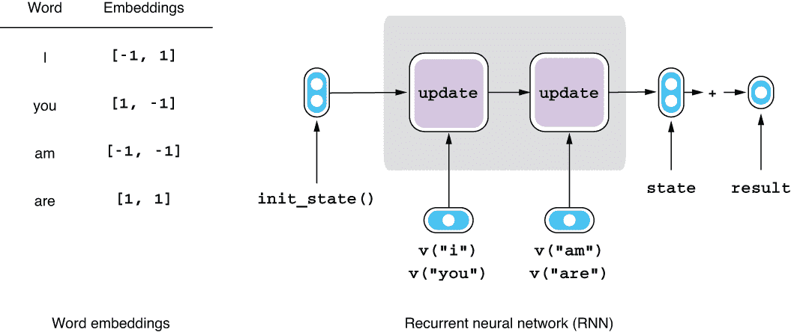

图 4.3 使用 RNN 识别语法正确的英语句子

现在，让我们假设没有激活函数。前面的 update_simple() 函数简化为以下形式：

```py
def update_simple_linear(state, word):
    return w1 * state + w2 * word + b
```

我们将假设状态的初始值简单地为 [0, 0]，因为具体的初始值与此处的讨论无关。RNN 接受第一个单词嵌入 x1，更新状态，接受第二个单词嵌入 x2，然后生成最终状态，即一个二维向量。最后，将这个向量中的两个元素相加并转换为 result。如果 result 接近于 1，则句子是语法正确的。否则，不是。如果你应用 update_simple_linear() 函数两次并稍微简化一下，你会得到以下函数，这就是这个 RNN 的全部功能：

```py
w1 * w2 * x1 + w2 * x2 + w1 * b + b
```

请记住，w1、w2 和 b 是模型的参数（也称为“魔法常数”），需要进行训练（调整）。在这里，我们不是使用训练数据集调整这些参数，而是将一些任意值赋给它们，然后看看会发生什么。例如，当 w1 = [1, 0]，w2 = [0, 1]，b = [0, 0] 时，这个 RNN 的输入和输出如图 4.4 所示。

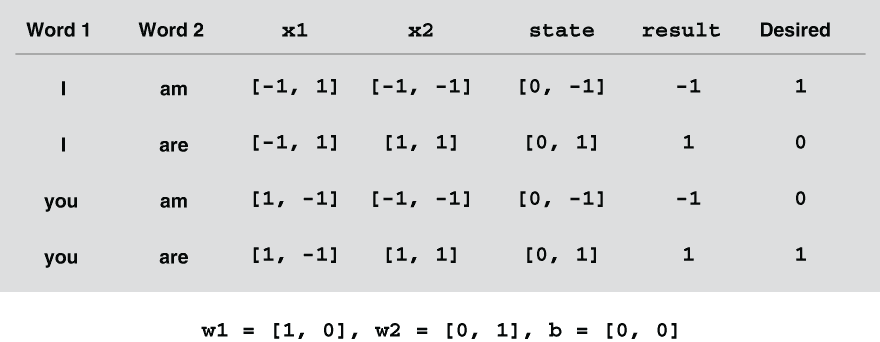

图 4.4 当 w1 = [1, 0]，w2 = [0, 1]，b = [0, 0] 且没有激活函数时的输入和输出

如果你查看结果的值，这个 RNN 将不合语法的句子（例如，“I are”）与合语法的句子（例如，“you are”）分组在一起，这不是我们期望的行为。那么，我们尝试另一组参数值如何？让我们使用 w1 = [1, 0]，w2 = [-1, 0]，b = [0, 0]，看看会发生什么（参见图 4.5 的结果）。

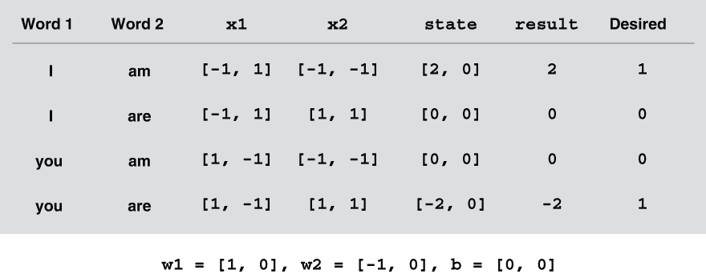

图 4.5 当 w1 = [1, 0]，w2 = [-1, 0]，b = [0, 0] 且没有激活函数时的输入和输出

这好多了，因为 RNN 成功地通过将 “I are” 和 “you am” 都赋值为 0 来将不符合语法的句子分组。然而，它也给语法正确的句子（“I am” 和 “you are”）赋予了完全相反的值（2 和 -2）。

我要在这里停下来，但事实证明，无论你如何努力，都不能使用这个神经网络区分语法正确的句子和不正确的句子。尽管你给参数分配了值，但这个 RNN 无法产生足够接近期望值的结果，因此无法根据它们的语法性将句子分组。

让我们退一步思考为什么会出现这种情况。如果你看一下之前的更新函数，它所做的就是将输入乘以一些值然后相加。更具体地说，它只是*以线性方式*转换输入。当你改变输入的值时，这个神经网络的结果总是会以某个恒定的量变化。但显然这是不可取的——你希望结果只在输入变量是某些特定值时才为 1。换句话说，你不希望这个 RNN 是线性的；你希望它是非线性的。

用类比的方式来说，想象一下，假设你的编程语言只能使用赋值（“=”）、加法（“+”）和乘法（“*”）。你可以在这样受限制的环境中调整输入值以得到结果，但在这样的情况下，你无法编写更复杂的逻辑。

现在让我们把激活函数 f() 加回去，看看会发生什么。我们将使用的具体激活函数称为*双曲正切函数*，或者更常见的是*tanh*，它是神经网络中最常用的激活函数之一。在这个讨论中，这个函数的细节并不重要，但简而言之，它的行为如下：当输入接近零时，tanh 对输入的影响不大，例如，0.3 或 -0.2。换句话说，输入几乎不经过函数而保持不变。当输入远离零时，tanh 试图将其压缩在 -1 和 1 之间。例如，当输入很大（比如，10.0）时，输出变得非常接近 1.0，而当输入很小时（比如，-10.0）时，输出几乎为 -1.0。如果将两个或更多变量输入激活函数，这会产生类似于 OR 逻辑门（或 AND 门，取决于权重）的效果。门的输出根据输入变为开启（~1）和关闭（~-1）。

当 w1 = [-1, 2]，w2 = [-1, 2]，b = [0, 1]，并且使用 tanh 激活函数时，RNN 的结果更接近我们所期望的（见图 4.6）。如果将它们四舍五入为最接近的整数，RNN 成功地通过它们的语法性将句子分组。

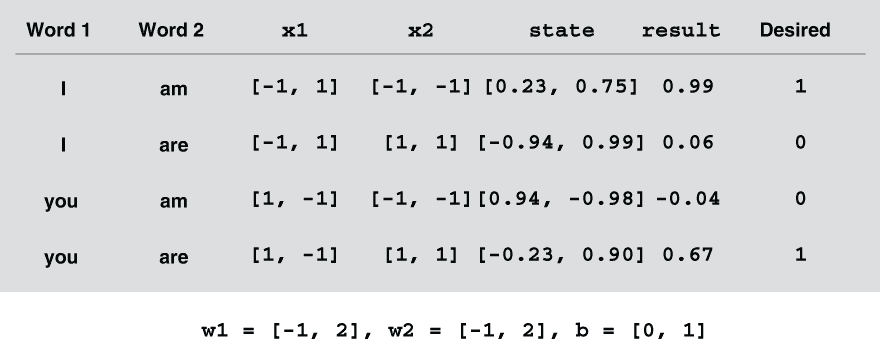

图 4.6 当 w1 = [-1, 2]，w2 = [-1, 2]，b = [0, 1] 且激活函数为时的输入和输出

使用同样的类比，将激活函数应用于你的神经网络就像在你的编程语言中使用 AND、OR 和 IF 以及基本的数学运算，比如加法和乘法一样。通过这种方式，你可以编写复杂的逻辑并模拟输入变量之间的复杂交互，就像本节的例子一样。

注意：本节中我使用的例子是流行的 XOR（或*异或*）例子的一个略微修改版本，通常在深度学习教材中见到。这是神经网络可以解决但其他线性模型无法解决的最基本和最简单的例子。

关于 RNN 的一些最后说明——它们的训练方式与任何其他神经网络相同。最终的结果与期望结果使用损失函数进行比较，然后两者之间的差异——损失——用于更新“魔术常数”。在这种情况下，魔术常数是 update_simple()函数中的 w1、w2 和 b。请注意，更新函数及其魔术常数在循环中的所有时间步中都是相同的。这意味着 RNN 正在学习的是可以应用于任何情况的一般更新形式。

## 4.2 长短期记忆单元（LSTMs）和门控循环单元（GRUs）

实际上，我们之前讨论过的简单 RNN 在真实世界的 NLP 应用中很少使用，因为存在一个称为*梯度消失问题*的问题。在本节中，我将展示与简单 RNN 相关的问题以及更流行的 RNN 架构，即 LSTMs 和 GRUs，如何解决这个特定问题。

### 4.2.1 梯度消失问题

就像任何编程语言一样，如果你知道输入的长度，你可以在不使用循环的情况下重写一个循环。RNN 也可以在不使用循环的情况下重写，这使它看起来就像一个具有许多层的常规神经网络。例如，如果你知道输入中只有六个单词，那么之前的 rnn()可以重写如下：

```py
def rnn(sentence):
    word1, word2, word3, word4, word5, word6 = sentence
    state = init_state()

    state = update(state, word1)
    state = update(state, word2)
    state = update(state, word3)
    state = update(state, word4)
    state = update(state, word5)
    state = update(state, word6)

    return state
```

不带循环的表示 RNN 被称为*展开*。现在我们知道简单 RNN 的 update()是什么样子（update_simple），所以我们可以用其实体替换函数调用，如下所示：

```py
def rnn_simple(sentence):
    word1, word2, word3, word4, word5, word6 = sentence
    state = init_state()

    state = f(w1 * f(w1 * f(w1 * f(w1 * f(w1 * f(w1 * state + w2 * word1 + b) + w2 * word2 + b) + w2 * word3 + b) + w2 * word4 + b) + w2 * word5 + b) + w2 * word6 + b)
    return state
```

这变得有点丑陋，但我只是想让你注意到非常深度嵌套的函数调用和乘法。现在，回想一下我们在上一节中想要完成的任务——通过识别主谓一致来对语法正确的英语句子进行分类。假设输入是 sentence = ["The", "books", "I", "read", "yesterday", "were"]。在这种情况下，最内层的函数调用处理第一个词“The”，下一个处理第二个词“books”，依此类推，一直到最外层的函数调用，处理“were”。如果我们稍微修改前面的伪代码，如下代码片段所示，你就可以更直观地理解它：

```py
def is_grammatical(sentence):
    word1, word2, word3, word4, word5, word6 = sentence
    state = init_state()

    state = process_main_verb(w1 *
        process_adverb(w1 *
            process_relative_clause_verb(w1 *
                process_relative_clause_subject(w1 *
                    process_main_subject(w1 *
                        process_article(w1 * state + w2 * word1 + b) +
                    w2 * word2 + b) +
                w2 * word3 + b) +
            w2 * word4 + b) + 
        w2 * word5 + b) + 
    w2 * word6 + b)

    return state
```

为了识别输入确实是一句语法正确的英语句子（或一句句子的前缀），RNN 需要保留有关主语（“书”）的信息在状态中，直到看到动词（“were”）而不会被中间的任何东西（“我昨天读了”）分散注意力。在先前的伪代码中，状态由函数调用的返回值表示，因此关于主题的信息（process_main_subject 的返回值）需要在链中传播到达最外层函数（process_main_verb）。这开始听起来像是一项困难的任务。

当涉及训练该 RNN 时，情况并不好。 RNN 和其他任何神经网络都使用称为*反向传播*的算法进行训练。反向传播是一种过程，在该过程中，神经网络的组成部分与先前的组成部分通信，以便调整参数以最小化损失。对于这个特定的示例，它是如何工作的。首先，您查看结果，即 is_grammatical 的返回值()并将其与您期望的内容进行比较。这两者之间的差称为*损失*。最外层函数 is_grammatical()基本上有四种方式来减少损失，使其输出更接近所需内容：1)调整 w1，同时固定嵌套函数 process_adverb()的返回值，2)调整 w2，3)调整 b，或 4)调整 process_adverb()的返回值，同时固定参数。调整参数（w1、w2 和 b）很容易，因为函数知道调整每个参数对其返回值的确切影响。然而，调整上一个函数的返回值是不容易的，因为调用者不知道函数内部的工作原理。因此，调用者告诉上一个函数（被调用方）调整其返回值以最小化损失。请参见图 4.7，了解损失如何向后传播到参数和先前的函数。

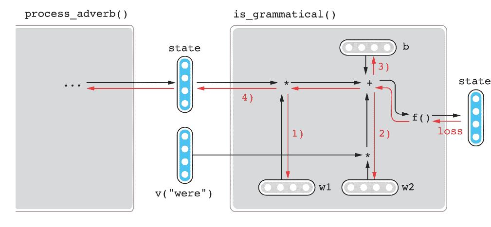

图 4.7 损失的反向传播

嵌套的函数调用重复这个过程并玩转电话游戏，直到消息传递到最内层函数。到那个时候，因为消息需要经过许多层，它变得非常微弱和模糊（或者如果有误解则非常强大和扭曲），以至于内部函数很难弄清楚自己做错了什么。

技术上讲，深度学习文献将此称为*梯度消失问题*。*梯度*是一个数学术语，对应于每个函数从下一个函数接收到的信息信号，该信号指示它们应该如何改进其过程（如何更改其魔法常数）。反向电话游戏，其中消息从最终函数（=损失函数）向后传递，称为反向传播。我不会涉及这些术语的数学细节，但至少在概念上理解它们是有用的。

由于梯度消失问题，简单的循环神经网络（Simple RNNs）难以训练，在实践中现在很少使用。

### 4.2.2 长短期记忆（LSTM）

之前提到的嵌套函数处理语法信息的方式似乎太低效了。毕竟，为什么外部函数（is_grammatical）不直接告诉负责的特定函数（例如，process_main_subject）出了什么问题，而不是玩电话游戏呢？它不能这样做，因为每次函数调用后消息都可以完全改变其形状，这是由于 w2 和 f()。最外层函数无法仅从最终输出中告诉哪个函数负责消息的哪个部分。

我们如何解决这个低效性呢？与其每次通过激活函数传递信息并完全改变其形状，不如在每一步中添加和减去与正在处理的句子部分相关的信息？例如，如果 process_main_subject() 可以直接向某种“记忆”中添加有关主语的信息，并且网络可以确保记忆通过中间函数完整地传递，is_grammatical() 就会更容易告诉前面的函数如何调整其输出。

*长短期记忆*单元（LSTMs）是基于这一观点提出的一种 RNN 单元。LSTM 单元不是传递状态，而是共享“记忆”，每个单元都可以从中删除旧信息并/或添加新信息，有点像制造工厂中的装配线。具体来说，LSTM RNN 使用以下函数来更新状态：

```py
def update_lstm(state, word):
    cell_state, hidden_state = state

    cell_state *= forget(hidden_state, word)
    cell_state += add(hidden_state, word)

    hidden_state = update_hidden(hidden_state, cell_state, word)

    return (cell_state, hidden_state)
```

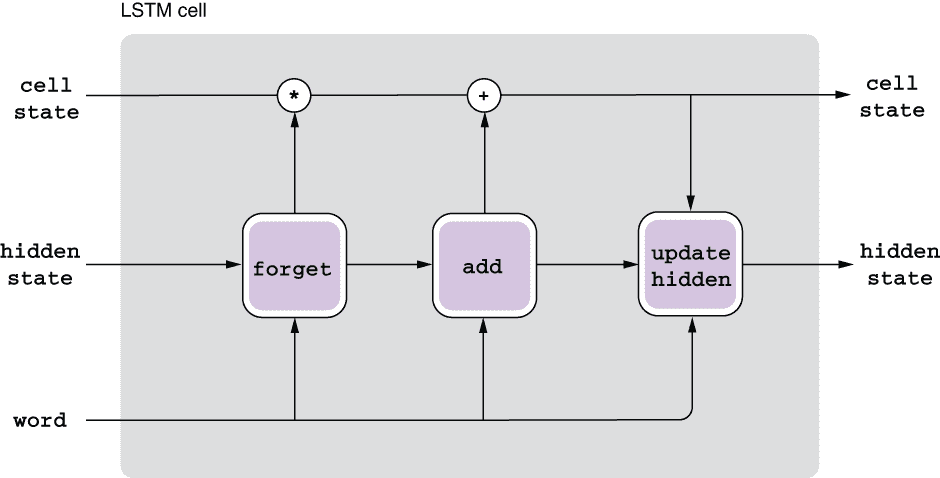

图 4.8 LSTM 更新函数

尽管与其简单版本相比，这看起来相对复杂，但是如果你将其分解为子组件，就不难理解这里正在发生的事情，如下所述并在图 4.8 中显示：

+   LSTM 状态包括两个部分——细胞状态（“记忆”部分）和隐藏状态（“心理表征”部分）。

+   函数 forget() 返回一个介于 0 和 1 之间的值，因此乘以这个数字意味着从 cell_state 中擦除旧的记忆。要擦除多少由 hidden_state 和 word（输入）决定。通过乘以介于 0 和 1 之间的值来控制信息流动称为*门控*。LSTM 是第一个使用这种门控机制的 RNN 架构。

+   函数 add() 返回添加到记忆中的新值。该值再次是由 hidden_state 和 word 决定的。

+   最后，使用一个函数更新 hidden_state，该函数的值是从前一个隐藏状态、更新后的记忆和输入单词计算得出的。

我通过隐藏一些数学细节在 forget()、add() 和 update_hidden() 函数中抽象了更新函数，这些细节对于这里的讨论不重要。如果你对深入了解 LSTM 感兴趣，我建议你阅读克里斯·奥拉在此主题上撰写的精彩博文（[`colah.github.io/posts/2015-08-Understanding-LSTMs/`](http://colah.github.io/posts/2015-08-Understanding-LSTMs/)）。

因为 LSTMs 有一个在不同时间步保持不变的单元状态，除非显式修改，它们更容易训练并且相对表现良好。因为你有一个共享的“记忆”，函数正在添加和删除与输入句子的不同部分相关的信息，所以更容易确定哪个函数做了什么以及出了什么问题。来自最外层函数的错误信号可以更直接地到达负责函数。

术语说明：LSTM 是此处提到的一种特定类型的架构，但人们使用 “LSTMs” 来表示带有 LSTM 单元的 RNN。此外，“RNN” 常常用来指代“简单 RNN”，在第 4.1.3 节中介绍。在文献中看到“RNNs”时，你需要注意它们使用的确切架构。

### 4.2.3 门控循环单元（GRUs）

另一种 RNN 架构称为*门控循环单元*（GRUs），它使用门控机制。GRUs 的理念与 LSTMs 相似，但 GRUs 仅使用一组状态而不是两组。GRUs 的更新函数如下所示：

```py
def update_gru(state, word): 
    new_state = update_hidden(state, word)

    switch = get_switch(state, word)

    state = swtich * new_state + (1 - switch) * state

    return state
```

GRUs 不使用擦除或更新内存，而是使用切换机制。单元首先从旧状态和输入计算出新状态。然后计算切换值，一个介于 0 和 1 之间的值。根据切换值选择新状态和旧状态之间的状态。如果它是 0，旧状态保持不变。如果它是 1，它将被新状态覆盖。如果它在两者之间，状态将是两者的混合。请参见图 4.9，了解 GRU 更新函数的示意图。

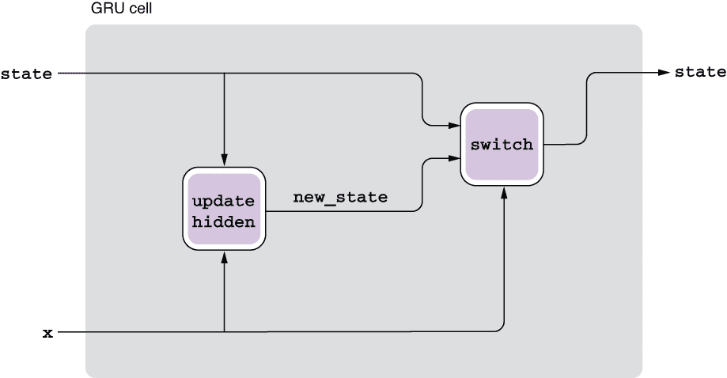

图 4.9 GRU 更新函数

请注意，与 LSTMs 相比，GRUs 的更新函数要简单得多。实际上，它的参数（魔术常数）比 LSTMs 需要训练的参数少。因此，GRUs 比 LSTMs 更快地训练。

最后，尽管我们介绍了两种不同类型的 RNN 架构，即 LSTM 和 GRU，但在社区中并没有一致的共识，哪种类型的架构对于所有应用最好。你通常需要将它们视为超参数，并尝试不同的配置。幸运的是，只要你使用现代深度学习框架如 PyTorch 和 TensorFlow，就很容易尝试不同类型的 RNN 单元。

## 4.3 准确率、精确率、召回率和 F-度量

在第 2.7 节，我简要地讨论了一些我们用于评估分类任务性能的指标。在我们继续实际构建一个句子分类器之前，我想进一步讨论我们将要使用的评估指标——它们的含义以及它们实际上衡量的内容。

### 4.3.1 准确率

准确率可能是我们所讨论的所有评估指标中最简单的。在分类设置中，准确率是你的模型预测正确的实例的比例。例如，如果有 10 封电子邮件，而你的垃圾邮件过滤模型正确地识别了其中的 8 封，那么你的预测准确率就是 0.8，或者 80%（见图 4.10）。

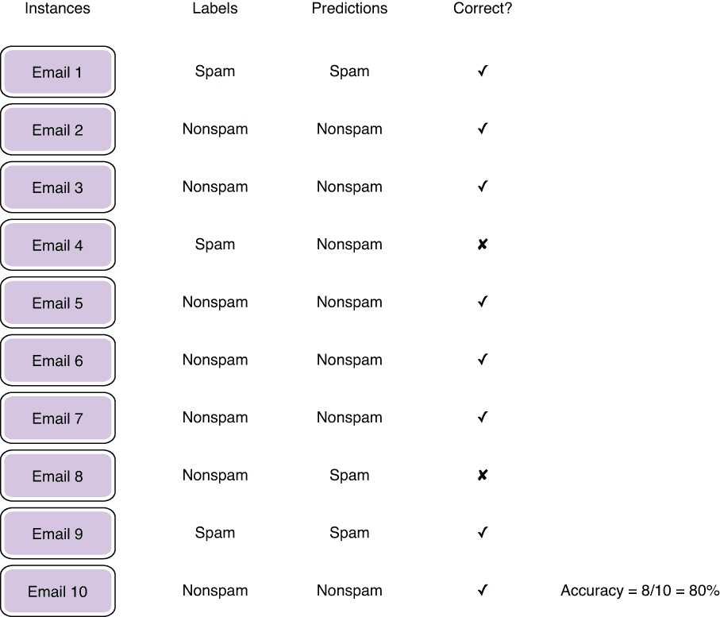

图 4.10 计算准确率

虽然简单，但准确率并不是没有局限性。具体来说，在测试集不平衡时，准确率可能会误导。一个*不平衡*的数据集包含多个类别标签，它们的数量差异很大。例如，如果一个垃圾邮件过滤数据集不平衡，可能包含 90% 的非垃圾邮件和 10% 的垃圾邮件。在这种情况下，即使一个愚蠢的分类器把一切都标记为非垃圾邮件，也能够达到 90% 的准确率。例如，如果一个“愚蠢”的分类器在图 4.10 中将所有内容都分类为“非垃圾邮件”，它仍然会达到 70% 的准确率（10 个实例中的 7 个）。如果你孤立地看这个数字，你可能会被误导以为分类器的性能实际上很好。当你使用准确率作为指标时，将其与假想的、愚蠢的分类器（*多数投票*）作为基准进行比较总是一个好主意。

### 4.3.2 精确率和召回率

剩下的指标——精确率、召回率和 F-度量——是在二元分类设置中使用的。二元分类任务的目标是从另一个类别（称为*负类*）中识别出一个类别（称为*正类*）。在垃圾邮件过滤设置中，正类是垃圾邮件，而负类是非垃圾邮件。

图 4.11 中的维恩图包含四个子区域：真正例、假正例、假负例和真负例。真正例（TP）是被预测为正类（= 垃圾邮件）并且确实属于正类的实例。假正例（FP）是被预测为正类（= 垃圾邮件）但实际上不属于正类的实例。这些是预测中的噪音，也就是被误认为垃圾邮件并最终出现在你的电子邮件客户端的垃圾邮件文件夹中的无辜非垃圾邮件。

另一方面，假阴性（FN）是被预测为负类但实际上属于正类的实例。这些是通过垃圾邮件过滤器漏过的垃圾邮件，最终出现在你的收件箱中。最后，真阴性（TN）是被预测为负类并且确实属于负类的实例（即出现在你的收件箱中的非垃圾邮件）。

精确率是模型将正确分类为正例的实例的比例。例如，如果你的垃圾邮件过滤器将三封邮件标记为垃圾邮件，并且其中有两封确实是垃圾邮件，则精确率将为 2/3，约为 66%。

召回率与精确率有些相反。它是你的模型在数据集中被正确识别为正例的正例占比。再以垃圾邮件过滤为例，如果你的数据集中有三封垃圾邮件，而你的模型成功识别了其中两封邮件为垃圾邮件，则召回率将为 2/3，约为 66%。

图 4.11 显示了预测标签和真实标签之间以及召回率和精确率之间的关系。

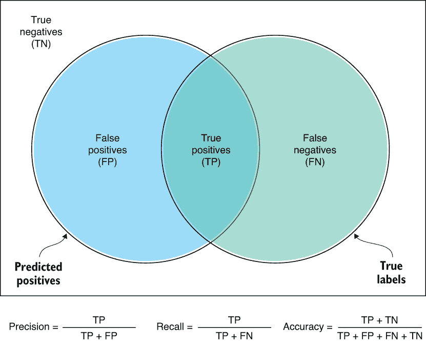

图 4.11 精确率和召回率

### 4.3.3 F-测量

你可能已经注意到了精确率和召回率之间的权衡。想象一下有一个非常谨慎的垃圾邮件过滤器。它只有在几千封邮件中输出一封邮件为垃圾邮件，但当它输出时，它总是正确的。这不是一个困难的任务，因为一些垃圾邮件非常明显 - 如果它们的文本中包含“v1@gra”这个词，并且是从垃圾邮件黑名单中的人发送的，将其标记为垃圾邮件应该是相当安全的。这个垃圾邮件过滤器的精确率是多少？100%。同样，还有另一个非常粗心的垃圾邮件过滤器。它将每封电子邮件都分类为垃圾邮件，包括来自同事和朋友的电子邮件。它的召回率是多少？100%。这两个垃圾邮件过滤器中的任何一个有用吗？几乎没有！

正如你所看到的，只关注精确率或召回率而忽视另一个是不好的做法，因为它们之间存在权衡。这就好比你在节食时只关注体重。你减了 10 磅？太棒了！但是如果你身高是 7 英尺呢？并不是很好。你需要同时考虑身高和体重-太多是多少取决于另一个变量。这就是为什么有像 BMI（身体质量指数）这样的衡量标准，它同时考虑了这两个指标。同样，研究人员提出了一种叫做 F-测量的度量标准，它是精确率和召回率的平均值（更准确地说是调和平均值）。通常使用的是一个叫做 F1-测量的特殊案例，它是 F-测量的等权版本。在分类设置中，衡量并尝试最大化 F-测量是一种很好的做法。

## 4.4 构建 AllenNLP 训练流程

在本节中，我们将重新审视第二章中构建的情感分析器，并详细讨论如何更详细地构建其训练流程。尽管我已经展示了使用 AllenNLP

要运行本节中的代码，您需要导入必要的类和模块，如下面的代码片段所示（本节中的代码示例也可以通过 Google Colab 访问，[`www.realworldnlpbook.com/ch2.html#sst-nb`](http://www.realworldnlpbook.com/ch2.html#sst-nb)）。

```py
from itertools import chain
from typing import Dict

import numpy as np
import torch
import torch.optim as optim
from allennlp.data.data_loaders import MultiProcessDataLoader
from allennlp.data.samplers import BucketBatchSampler
from allennlp.data.vocabulary import Vocabulary
from allennlp.models import Model
from allennlp.modules.seq2vec_encoders import Seq2VecEncoder, PytorchSeq2VecWrapper
from allennlp.modules.text_field_embedders import TextFieldEmbedder, BasicTextFieldEmbedder
from allennlp.modules.token_embedders import Embedding
from allennlp.nn.util import get_text_field_mask
from allennlp.training.metrics import CategoricalAccuracy, F1Measure
from allennlp.training.trainer import GradientDescentTrainer
from allennlp_models.classification.dataset_readers.stanford_sentiment_tree_bank import \
    StanfordSentimentTreeBankDatasetReader
```

### 4.4.1 实例和字段

如第 2.2.1 节所述，实例是机器学习算法进行预测的原子单位。数据集是同一形式实例的集合。大多数 NLP 应用的第一步是读取或接收一些数据（例如从文件或通过网络请求）并将其转换为实例，以便 NLP/ML 算法可以使用它们。

AllenNLP 支持一个称为 DatasetReader 的抽象，它的工作是读取一些输入（原始字符串、CSV 文件、来自网络请求的 JSON 数据结构等）并将其转换为实例。AllenNLP 已经为 NLP 中使用的主要格式提供了广泛的数据集读取器，例如 CoNLL 格式（在语言分析的流行共享任务中使用）和 Penn Treebank（一种流行的用于句法分析的数据集）。要读取 Standard Sentiment Treebank，可以使用内置的 StanfordSentimentTreeBankDatasetReader，我们在第二章中已经使用过了。您还可以通过覆盖 DatasetReader 的一些核心方法来编写自己的数据集阅读器。

AllenNLP 类 Instance 表示一个单独的实例。一个实例可以有一个或多个字段，这些字段保存某种类型的数据。例如，情感分析任务的实例有两个字段——文本内容和标签——可以通过将字段字典传递给其构造函数来创建，如下所示：

```py
Instance({'tokens': TextField(tokens),
          'label': LabelField(sentiment)})
```

在这里，我们假设您已经创建了 tokens（一个标记列表）和 sentiment（一个与情感类别对应的字符串标签），并从读取输入文件中获取了它们。根据任务，AllenNLP 还支持其他类型的字段。

DatasetReader 的 read() 方法返回一个实例迭代器，使您能够枚举生成的实例并对其进行可视化检查，如下面的代码片段所示：

```py
reader = StanfordSentimentTreeBankDatasetReader()

train_dataset = reader.read('path/to/sst/dataset/train.txt')
dev_dataset = reader.read('path/to/sst/dataset/dev.txt')

for inst in train_dataset + dev_dataset:
    print(inst)
```

在许多情况下，您可以通过数据加载器访问数据集阅读器。数据加载器是 AllenNLP 的一个抽象（实际上是 PyTorch 数据加载器的一个薄包装），它处理数据并迭代批量实例。您可以通过提供批量样本器来指定如何对实例进行排序、分组为批次并提供给训练算法。在这里，我们使用了一个 BucketBatchSampler，它通过根据实例的长度对其进行排序，并将长度相似的实例分组到一个批次中，如下所示：

```py
reader = StanfordSentimentTreeBankDatasetReader()

sampler = BucketBatchSampler(batch_size=32, sorting_keys=["tokens"])
train_data_loader = MultiProcessDataLoader(
    reader, train_path, batch_sampler=sampler)
dev_data_loader = MultiProcessDataLoader(
    reader, dev_path, batch_sampler=sampler)
```

### 4.4.2 词汇表和标记索引器

许多 NLP 应用程序的第二个步骤是构建词汇表。在计算机科学中，词汇是一个表示语言中*所有*可能单词的理论概念。在 NLP 中，它通常只是指数据集中出现的所有唯一标记的集合。了解一种语言中所有可能的单词是不可能的，也不是 NLP 应用程序所必需的。词汇表中存储的内容称为*词汇项目*（或仅称为*项目*）。词汇项目通常是一个词，尽管根据手头的任务，它可以是任何形式的语言单位，包括字符、字符 n-gram 和用于语言注释的标签。

AllenNLP 提供了一个名为 Vocabulary 的类。它不仅负责存储数据集中出现的词汇项目，还保存了词汇项目和它们的 ID 之间的映射关系。如前所述，神经网络和一般的机器学习模型只能处理数字，而需要一种将诸如单词之类的离散项目映射到一些数字表示（如单词 ID）的方式。词汇还用于将 NLP 模型的结果映射回原始单词和标签，以便人类实际阅读它们。

您可以按如下方式从实例创建一个 Vocabulary 对象：

```py
vocab = Vocabulary.from_instances(chain(train_data_loader.iter_instances(), 
                                        dev_data_loader.iter_instances()),
                                  min_count={'tokens': 3})
```

这里需要注意几点：首先，因为我们正在处理迭代器（由数据加载器的 iter_instances()方法返回），所以我们需要使用 itertools 的 chain 方法来枚举两个数据集中的所有实例。

其次，AllenNLP 的 Vocabulary 类支持*命名空间*，这是一种将不同的项目集分开的系统，以防它们混淆。这是为什么它们很有用——假设你正在构建一个机器翻译系统，并且刚刚读取了一个包含英语和法语翻译的数据集。如果没有命名空间，你将只有一个包含所有英语和法语单词的集合。在大多数情况下，这通常不是一个大问题，因为英语单词（“hi,” “thank you,” “language”）和法语单词（“bonjour,” “merci,” “langue”）在大多数情况下看起来非常不同。然而，一些单词在两种语言中看起来完全相同。例如，“chat”在英语中意思是“talk”，在法语中是“cat”，但很难想象有人想要混淆这两个词并分配相同的 ID（和嵌入）。为了避免这种冲突，Vocabulary 实现了命名空间并为不同类型的项目分配了单独的集合。

你可能注意到`form_instances()`函数调用有一个`min_count`参数。对于每个命名空间，它指定了数据集中必须出现的最小次数，以便将项目包含在词汇表中。所有出现频率低于此阈值的项目都被视为“未知”项目。这是一个好主意的原因是：在典型的语言中，很少有一些词汇会频繁出现（英语中的“the”，“a”，“of”），而有很多词汇出现的频率很低。这通常表现为词频的长尾分布。但这些频率极低的词汇不太可能对模型有任何有用的信息，并且正因为它们出现频率较低，从中学习有用的模式也很困难。此外，由于这些词汇有很多，它们会增加词汇表的大小和模型参数的数量。在这种情况下，自然语言处理中常见的做法是截去这长尾部分，并将所有出现频率较低的词汇合并为一个单一的实体<UNK>（表示“未知”词汇）。

最后，*令牌索引器*是 AllenNLP 的一个抽象概念，它接收一个令牌并返回其索引，或者返回表示令牌的索引列表。在大多数情况下，独特令牌和其索引之间存在一对一的映射，但根据您的模型，您可能需要更高级的方式来对令牌进行索引（例如使用字符 n-gram）。

创建词汇表后，你可以告诉数据加载器使用指定的词汇表对令牌进行索引，如下代码片段所示。这意味着数据加载器从数据集中读取的令牌会根据词汇表的映射转换为整数 ID：

```py
train_data_loader.index_with(vocab)
dev_data_loader.index_with(vocab)
```

### 4.4.3 令牌嵌入和 RNN

在使用词汇表和令牌索引器索引单词后，需要将它们转换为嵌入。一个名为 TokenEmbedder 的 AllenNLP 抽象来接收单词索引作为输入并将其转换为单词嵌入向量作为输出。你可以使用多种方式嵌入连续向量，但如果你只想将唯一的令牌映射到嵌入向量时，可以使用 Embedding 类，如下所示：

```py
token_embedding = Embedding(
    num_embeddings=vocab.get_vocab_size('tokens'),
    embedding_dim=EMBEDDING_DIM)
```

这将创建一个 Embedding 实例，它接收单词 ID 并以一对一的方式将其转换为定长矢量。该实例支持的唯一单词数量由 num_embeddings 给出，它等于令牌词汇的大小。嵌入的维度（即嵌入矢量的长度）由 embedding_dim 给出。

接下来，让我们定义我们的 RNN，并将变长输入（嵌入词的列表）转换为输入的定长矢量表示。正如我们在第 4.1 节中讨论的那样，你可以将 RNN 看作是一个神经网络结构，它消耗一个序列的事物（词汇）并返回一个定长的矢量。AllenNLP 将这样的模型抽象化为 Seq2VecEncoder 类，你可以通过使用 PytorchSeq2VecWrapper 创建一个 LSTM RNN，如下所示：

```py
encoder = PytorchSeq2VecWrapper(
    torch.nn.LSTM(EMBEDDING_DIM, HIDDEN_DIM, batch_first=True))
```

这里发生了很多事情，但本质上是将 PyTorch 的 LSTM 实现（torch.nn.LSTM）包装起来，使其可以插入到 AllenNLP 流程中。torch.nn.LSTM()的第一个参数是输入向量的维度，第二个参数是 LSTM 的内部状态的维度。最后一个参数 batch_first 指定了用于批处理的输入/输出张量的结构，但只要你使用 AllenNLP，你通常不需要担心其细节。

注意：在 AllenNLP 中，一切都是以批为单位，意味着任何张量的第一个维度始终等于批中实例的数量。

### 4.4.4 构建你自己的模型

现在我们已经定义了所有的子组件，我们准备构建执行预测的模型了。由于 AllenNLP 的良好抽象设计，你可以通过继承 AllenNLP 的 Model 类并覆盖 forward()方法来轻松构建你的模型。通常情况下，你不需要关注张量的形状和维度等细节。以下清单定义了用于分类句子的 LSTM RNN。

清单 4.1 LSTM 句子分类器

```py
@Model.register("lstm_classifier")
class LstmClassifier(Model):                                   ❶
    def __init__(self,
                 embedder: TextFieldEmbedder,
                 encoder: Seq2VecEncoder,
                 vocab: Vocabulary,
                 positive_label: str = '4') -> None:
        super().__init__(vocab)
        self.embedder = embedder
        self.encoder = encoder

        self.linear = torch.nn.Linear(                         ❷
            in_features=encoder.get_output_dim(),
            out_features=vocab.get_vocab_size('labels'))

        positive_index = vocab.get_token_index(
            positive_label, namespace='labels')
        self.accuracy = CategoricalAccuracy()
        self.f1_measure = F1Measure(positive_index)            ❸

        self.loss_function = torch.nn.CrossEntropyLoss()       ❹

    def forward(self,                                          ❺
                tokens: Dict[str, torch.Tensor],
                label: torch.Tensor = None) -> torch.Tensor:
        mask = get_text_field_mask(tokens)

        embeddings = self.embedder(tokens)
        encoder_out = self.encoder(embeddings, mask)
        logits = self.linear(encoder_out)

        output = {"logits": logits}                            ❻
        if label is not None:
            self.accuracy(logits, label)
            self.f1_measure(logits, label)
            output["loss"] = self.loss_function(logits, label)

        return output

    def get_metrics(self, reset: bool = False) -> Dict[str, float]:
        return {'accuracy': self.accuracy.get_metric(reset),   ❼
                **self.f1_measure.get_metric(reset)}
```

❶ AllenNLP 模型继承自 Model。

❷ 创建线性层将 RNN 输出转换为另一个长度的向量

❸ F1Measure()需要正类的标签 ID。'4'表示“非常积极”。

❹ 用于分类任务的交叉熵损失。CrossEntropyLoss 直接接受 logits（不需要 softmax）。

❺ 实例被解构为各个字段并传递给 forward()。

❻ forward()的输出是一个字典，其中包含一个“loss”键。

❼ 返回准确率、精确率、召回率和 F1 分数作为度量标准

每个 AllenNLP 模型都继承自 PyTorch 的 Module 类，这意味着如果需要，你可以使用 PyTorch 的低级操作。这为你在定义模型时提供了很大的灵活性，同时利用了 AllenNLP 的高级抽象。

### 4.4.5 把所有东西都放在一起

最后，我们通过实现整个流程来训练情感分析器，如下所示。

清单 4.2 情感分析器的训练流程

```py
EMBEDDING_DIM = 128
HIDDEN_DIM = 128

reader = StanfordSentimentTreeBankDatasetReader()

train_path = 'path/to/sst/dataset/train.txt'
dev_path = 'path/to/sst/dataset/dev.txt'

sampler = BucketBatchSampler(batch_size=32, sorting_keys=["tokens"])
train_data_loader = MultiProcessDataLoader(                            ❶
    reader, train_path, batch_sampler=sampler)
dev_data_loader = MultiProcessDataLoader(
    reader, dev_path, batch_sampler=sampler)

vocab = Vocabulary.from_instances(chain(train_data_loader.iter_instances(), 
                                        dev_data_loader.iter_instances()),
                                  min_count={'tokens': 3})

train_data_loader.index_with(vocab)
dev_data_loader.index_with(vocab)

token_embedding = Embedding(
    num_embeddings=vocab.get_vocab_size('tokens'),
    embedding_dim=EMBEDDING_DIM)

word_embeddings = BasicTextFieldEmbedder({"tokens": token_embedding})

encoder = PytorchSeq2VecWrapper(
    torch.nn.LSTM(EMBEDDING_DIM, HIDDEN_DIM, batch_first=True))

model = LstmClassifier(word_embeddings, encoder, vocab)               ❷

optimizer = optim.Adam(model.parameters())                            ❸

trainer = GradientDescentTrainer(                                     ❹
    model=model,
    optimizer=optimizer,
    data_loader=train_data_loader,
    validation_data_loader=dev_data_loader,
    patience=10,
    num_epochs=20,
    cuda_device=-1)

trainer.train()
```

❶ 定义如何构造数据加载器

❷ 初始化模型

❸ 定义优化器

❹ 初始化训练器

当创建 Trainer 实例并调用 train()时，训练流程完成。你需要传递所有用于训练的要素，包括模型、优化器、数据加载器、数据集和一堆超参数。

优化器实现了一个调整模型参数以最小化损失的算法。在这里，我们使用一种称为*Adam*的优化器，这是你作为首选项的一个很好的“默认”优化器。然而，正如我在第二章中提到的，你经常需要尝试许多不同的优化器，找出对你的模型效果最好的那一个。

## 4.5 配置 AllenNLP 训练流程

你可能已经注意到，列表 4.2 中很少有实际针对句子分类问题的内容。事实上，加载数据集、初始化模型，并将迭代器和优化器插入训练器是几乎每个 NLP 训练管道中的常见步骤。如果您想要为许多相关任务重复使用相同的训练管道而不必从头编写训练脚本呢？另外，如果您想要尝试不同配置集（例如，不同的超参数、神经网络架构）并保存您尝试过的确切配置呢？

对于这些问题，AllenNLP 提供了一个便捷的框架，您可以在 JSON 格式的配置文件中编写配置。其思想是您在 JSON 格式文件中编写您的训练管道的具体内容——例如要使用哪个数据集读取器、要使用哪些模型及其子组件，以及用于训练的哪些超参数。然后，您将配置文件提供给 AllenNLP 可执行文件，框架会负责运行训练管道。如果您想尝试模型的不同配置，只需更改配置文件（或创建一个新文件），然后再次运行管道，而无需更改 Python 代码。这是一种管理实验并使其可重现的良好实践。您只需管理配置文件及其结果——相同的配置始终产生相同的结果。

典型的 AllenNLP 配置文件由三个主要部分组成——数据集、您的模型和训练管道。下面是第一部分，指定了要使用的数据集文件以及如何使用：

```py
"dataset_reader": {
    "type": "sst_tokens"
  },
  "train_data_path": "https:/./s3.amazonaws.com/realworldnlpbook/data/stanfordSentimentTreebank/trees/train.txt",
  "validation_data_path": "https:/./s3.amazonaws.com/realworldnlpbook/data/stanfordSentimentTreebank/trees/dev.txt"
```

此部分有三个键：dataset_reader、train_data_path 和 validation_data_path。第一个键 dataset_reader 指定要使用哪个 DatasetReader 来读取文件。在 AllenNLP 中，数据集读取器、模型、预测器以及许多其他类型的模块都可以使用装饰器语法注册，并且可以在配置文件中引用。例如，如果您查看下面定义了 StanfordSentimentTreeBankDatasetReader 的代码

```py
@DatasetReader.register("sst_tokens")
class StanfordSentimentTreeBankDatasetReader(DatasetReader): 
    ...
```

你注意到它被 @DatasetReader.register("sst_tokens") 装饰。这将 StanfordSentimentTreeBankDatasetReader 注册为 sst_tokens，使您可以通过配置文件中的 "type": "sst_tokens" 来引用它。

在配置文件的第二部分，您可以如下指定要训练的主要模型：

```py
"model": {
    "type": "lstm_classifier",

    "embedder": {
      "token_embedders": {
        "tokens": {
          "type": "embedding",
          "embedding_dim": embedding_dim
        }
      }
    },

    "encoder": {
      "type": "lstm",
      "input_size": embedding_dim,
      "hidden_size": hidden_dim
    }
}
```

如前所述，AllenNLP 中的模型可以使用装饰器语法注册，并且可以通过 type 键从配置文件中引用。例如，这里引用的 LstmClassifier 类定义如下：

```py
@Model.register("lstm_classifier")
class LstmClassifier(Model):
    def __init__(self,
                 embedder: TextFieldEmbedder,
                 encoder: Seq2VecEncoder,
                 vocab: Vocabulary,
                 positive_label: str = '4') -> None:
```

模型定义 JSON 字典中的其他键对应于模型构造函数的参数名称。在前面的定义中，因为 LstmClassifier 的构造函数接受了两个参数，word_embeddings 和 encoder（除了 vocab，它是默认传递的并且可以省略，以及 positive_label，我们将使用默认值），所以模型定义有两个相应的键，它们的值也是模型定义，并且遵循相同的约定。

在配置文件的最后部分，指定了数据加载器和训练器。这里的约定与模型定义类似——你指定类的类型以及传递给构造函数的其他参数，如下所示：

```py
  "data_loader": {
    "batch_sampler": {
      "type": "bucket",
      "sorting_keys": ["tokens"],
      "padding_noise": 0.1,
      "batch_size" : 32
    }
  },
  "trainer": {
    "optimizer": "adam",
    "num_epochs": 20,
    "patience": 10
  }
```

你可以在代码仓库中查看完整的 JSON 配置文件（[`realworldnlpbook.com/ch4.html#sst-json`](http://realworldnlpbook.com/ch4.html#sst-json)）。一旦你定义了 JSON 配置文件，你就可以简单地将其提供给 allennlp 命令，如下所示：

```py
allennlp train examples/sentiment/sst_classifier.jsonnet \
    --serialization-dir sst-model \
    --include-package examples.sentiment.sst_classifier
```

--serialization-dir 指定了训练模型（以及其他一些信息，如序列化的词汇数据）将要存储的位置。你还需要使用 --include-package 指定到 LstmClassifier 的模块路径，以便配置文件能够找到注册的类。

正如我们在第二章中所看到的，当训练完成时，你可以使用以下命令启动一个简单的基于 web 的演示界面：

```py
$ allennlp serve \ 
    --archive-path sst-model/model.tar.gz \
    --include-package examples.sentiment.sst_classifier \
    --predictor sentence_classifier_predictor \
    --field-name sentence
```

## 4.6 案例研究：语言检测

在本章的最后一节中，我们将讨论另一个场景——语言检测，它也可以被归纳为一个句子分类任务。语言检测系统，给定一段文本，检测文本所写的语言。它在其他自然语言处理应用中有着广泛的用途。例如，一个网络搜索引擎可能会在处理和索引网页之前检测网页所写的语言。Google 翻译还会根据输入文本框中键入的内容自动切换源语言。

让我们看看这实际上是什么样子。你能告诉下面每一句话是哪种语言吗？这些句子都来自 Tatoeba 项目（[`tatoeba.org/`](https://tatoeba.org/)）。

我们需要你的帮助。

请考虑一下。

他们讨论了离开的计划。

我不知道我能不能做到。

昨天你在家，对吗？

它是一种快速而有效的通讯工具。

他讲了一个小时。

我想去喝一杯。

Ttwaliɣ nezmer ad nili d imeddukal.

答案是：西班牙语、德语、土耳其语、法语、葡萄牙语、世界语、意大利语、匈牙利语和柏柏尔语。我从 Tatoeba 上排名前 10 的最受欢迎的使用拉丁字母表的语言中挑选了它们。你可能对这里列出的一些语言不熟悉。对于那些不熟悉的人来说，世界语是一种在 19 世纪末发明的构造辅助语言。柏柏尔语实际上是一组与阿拉伯语等闲语族语言表亲关系的在北非某些地区使用的语言。

或许你能够认出其中一些语言，尽管你实际上并不会说它们。我想让你退后一步思考*你是如何*做到的。很有趣的是，人们可以在不会说这种语言的情况下做到这一点，因为这些语言都是用拉丁字母表写成的，看起来可能非常相似。你可能认出了其中一些语言的独特变音符号（重音符号）——例如，德语的“ü”和葡萄牙语的“ã”。这些对于这些语言来说是一个强有力的线索。或者你只是认识一些单词——例如，西班牙语的“ayuda”（意思是“帮助”）和法语的“pas”（“ne...pas”是法语的否定句语法）。似乎每种语言都有其自己的特点——无论是一些独特的字符还是单词——使得它很容易与其他语言区分开来。这开始听起来很像是机器学习擅长解决的一类问题。我们能否构建一个能够自动执行此操作的 NLP 系统？我们应该如何构建它？

### 4.6.1 使用字符作为输入

语言检测器也可以以类似的方式构建情感分析器。你可以使用 RNN 读取输入文本并将其转换为一些内部表示（隐藏状态）。然后，你可以使用一个线性层将它们转换为一组分数，对应于文本写成每种语言的可能性。最后，你可以使用交叉熵损失来训练模型。

一个主要区别在于情感分析器和语言检测器如何将输入馈送到 RNN 中。构建情感分析器时，我们使用了斯坦福情感树库，并且能够假设输入文本始终为英文且已经被标记化。但是对于语言检测来说情况并非如此。实际上，你甚至不知道输入文本是否是易于标记化的语言所写成——如果句子是用中文写的呢？或者是用芬兰语写的，芬兰语以其复杂的形态而臭名昭著？如果你知道是什么语言，你可以使用特定于该语言的标记器，但我们正在构建语言检测器，因为我们一开始并不知道是什么语言。这听起来像是一个典型的先有鸡还是先有蛋的问题。

为了解决这个问题，我们将使用字符而不是标记作为 RNN 的输入。这个想法是将输入分解为单个字符，甚至包括空格和标点符号，并将它们逐个馈送给 RNN。当输入可以更好地表示为字符序列时（例如中文或未知来源的语言），或者当您希望充分利用单词的内部结构时（例如我们在第三章中提到的 fastText 模型）时，使用字符是一种常见的做法。RNN 的强大表现力仍然可以捕获先前提到的字符和一些常见单词和 n-gram 之间的交互。

### 创建数据集阅读器

对于这个语言检测任务，我从 Tatoeba 项目中创建了 train 和 validation 数据集，方法是选择使用罗马字母的 Tatoeba 上最受欢迎的 10 种语言，并对训练集采样 10,000 个句子，验证集采样 1,000 个句子。以下是该数据集的摘录：

```py
por De entre os designers, ele escolheu um jovem ilustrador e deu-lhe a tarefa.
por A apresentação me fez chorar.
tur Bunu denememize gerek var mı?
tur O korkutucu bir parçaydı.
ber Tebḍamt aɣrum-nni ɣef sin, naɣ?
ber Ad teddud ad twalid taqbuct n umaḍal n tkurt n uḍar deg Brizil?
eng Tom works at Harvard.
eng They fixed the flat tire by themselves.
hun Az arca hirtelen elpirult.
hun Miért aggodalmaskodsz? Hiszen még csak egy óra van!
epo Sidiĝu sur la benko.
epo Tiu ĉi kutime funkcias.
fra Vu d'avion, cette île a l'air très belle.
fra Nous boirons à ta santé.
deu Das Abnehmen fällt ihm schwer.
deu Tom war etwas besorgt um Maria.
ita Sono rimasto a casa per potermi riposare.
ita Le due più grandi invenzioni dell'uomo sono il letto e la bomba atomica: il primo ti tiene lontano dalle noie, la seconda le elimina.
spa He visto la película.
spa Has hecho los deberes.
```

第一个字段是一个三个字母的语言代码，描述了文本所使用的语言。第二个字段是文本本身。字段由制表符分隔。您可以从代码存储库获取数据集（[`github.com/mhagiwara/realworldnlp/tree/master/data/tatoeba`](https://github.com/mhagiwara/realworldnlp/tree/master/data/tatoeba)）。

构建语言检测器的第一步是准备一个能够读取这种格式数据集的数据集阅读器。在之前的例子（情感分析器）中，因为 AllenNLP 已经提供了 StanfordSentimentTreeBankDatasetReader，所以您只需要导入并使用它。然而，在这种情况下，您需要编写自己的数据集阅读器。幸运的是，编写一个能够读取这种特定格式的数据集阅读器并不那么困难。要编写数据集阅读器，您只需要做以下三件事：

+   通过继承 DatasetReader 创建自己的数据集阅读器类。

+   覆盖 text_to_instance()方法，该方法接受原始文本并将其转换为实例对象。

+   覆盖 _read()方法，该方法读取文件的内容并通过调用上面的 text_to_instance()方法生成实例。

语言检测器的完整数据集阅读器如列表 4.3 所示。我们还假设您已经导入了必要的模块和类，如下所示：

```py
from typing import Dict

import numpy as np
import torch
import torch.optim as optim
from allennlp.common.file_utils import cached_path
from allennlp.data.data_loaders import MultiProcessDataLoader
from allennlp.data.dataset_readers import DatasetReader
from allennlp.data.fields import LabelField, TextField
from allennlp.data.instance import Instance
from allennlp.data.samplers import BucketBatchSampler
from allennlp.data.token_indexers import TokenIndexer, SingleIdTokenIndexer
from allennlp.data.tokenizers.character_tokenizer import CharacterTokenizer
from allennlp.data.vocabulary import Vocabulary
from allennlp.modules.seq2vec_encoders import PytorchSeq2VecWrapper
from allennlp.modules.text_field_embedders import BasicTextFieldEmbedder
from allennlp.modules.token_embedders import Embedding
from allennlp.training import GradientDescentTrainer
from overrides import overrides

from examples.sentiment.sst_classifier import LstmClassifier
```

列表 4.3 用于语言检测器的数据集阅读器

```py
class TatoebaSentenceReader(DatasetReader):                    ❶
    def __init__(self,
                 token_indexers: Dict[str, TokenIndexer]=None):
        super().__init__()
        self.tokenizer = CharacterTokenizer()                  ❷
        self.token_indexers = token_indexers or {'tokens': SingleIdTokenIndexer()}

    @overrides
    def text_to_instance(self, tokens, label=None):            ❸
        fields = {}

        fields['tokens'] = TextField(tokens, self.token_indexers)
        if label:
            fields['label'] = LabelField(label)

        return Instance(fields)

    @overrides
    def _read(self, file_path: str):
        file_path = cached_path(file_path)                     ❹
        with open(file_path, "r") as text_file:
            for line in text_file:
                lang_id, sent = line.rstrip().split('\t')

                tokens = self.tokenizer.tokenize(sent)

                yield self.text_to_instance(tokens, lang_id)   ❺
```

❶ 每个新的数据集阅读器都继承自 DatasetReader。

❷ 使用 CharacterTokenizer()将文本标记为字符

❸ 在测试时标签将为 None。

❹ 如果 file_path 是 URL，则返回磁盘上缓存文件的实际路径

❺ 使用之前定义的 text_to_instance()生成实例

请注意，列表 4.3 中的数据集阅读器使用 CharacterTokenizer()将文本标记为字符。它的 tokenize()方法返回一个标记列表，这些标记是 AllenNLP 对象，表示标记，但实际上在这种情况下包含字符。

### 构建训练管道

一旦构建了数据集阅读器，训练流水线的其余部分看起来与情感分析器的类似。 实际上，我们可以在不进行任何修改的情况下重用之前定义的 LstmClassifier 类。 整个训练流水线在列表 4.4 中显示。 您可以从这里访问整个代码的 Google Colab 笔记本：[`realworldnlpbook.com/ch4.html#langdetect`](http://realworldnlpbook.com/ch4.html#langdetect)。

列表 4.4 语言检测器的训练流水线

```py
EMBEDDING_DIM = 16
HIDDEN_DIM = 16

reader = TatoebaSentenceReader()
train_path = 'https:/./s3.amazonaws.com/realworldnlpbook/data/tatoeba/sentences.top10langs.train.tsv'
dev_path = 'https:/./s3.amazonaws.com/realworldnlpbook/data/tatoeba/sentences.top10langs.dev.tsv'

sampler = BucketBatchSampler(batch_size=32, sorting_keys=["tokens"])
train_data_loader = MultiProcessDataLoader(
    reader, train_path, batch_sampler=sampler)
dev_data_loader = MultiProcessDataLoader(
    reader, dev_path, batch_sampler=sampler)

vocab = Vocabulary.from_instances(train_data_loader.iter_instances(),
                                  min_count={'tokens': 3})
train_data_loader.index_with(vocab)
dev_data_loader.index_with(vocab)

token_embedding = Embedding(num_embeddings=vocab.get_vocab_size('tokens'),
                            embedding_dim=EMBEDDING_DIM)
word_embeddings = BasicTextFieldEmbedder({"tokens": token_embedding})
encoder = PytorchSeq2VecWrapper(
    torch.nn.LSTM(EMBEDDING_DIM, HIDDEN_DIM, batch_first=True))

model = LstmClassifier(word_embeddings,
                       encoder,
                       vocab,
                       positive_label='eng')

train_dataset.index_with(vocab)
dev_dataset.index_with(vocab)

optimizer = optim.Adam(model.parameters())

trainer = GradientDescentTrainer(
    model=model,
    optimizer=optimizer,
    data_loader=train_data_loader,
    validation_data_loader=dev_data_loader,
    patience=10,
    num_epochs=20,
    cuda_device=-1)

trainer.train()
```

运行此训练流水线时，您将获得与以下大致相当的开发集上的指标：

```py
accuracy: 0.9461, precision: 0.9481, recall: 0.9490, f1_measure: 0.9485, loss: 0.1560
```

这一点一点也不糟糕！ 这意味着训练过的检测器在约 20 个句子中只犯了一个错误。 0.9481 的精确度意味着在 20 个被分类为英文的实例中只有一个假阳性（非英文句子）。 0.9490 的召回率意味着在 20 个真正的英文实例中只有一个假阴性（被检测器漏掉的英文句子）。

### 4.6.4 在未见过的实例上运行检测器

最后，让我们尝试在一组未见过的实例（既不出现在训练集也不出现在验证集中的实例）上运行我们刚刚训练过的检测器。 尝试向模型提供少量实例并观察其行为始终是一个好主意。

将实例提供给训练过的 AllenNLP 模型的推荐方法是使用预测器，就像我们在第二章中所做的那样。 但在这里，我想做一些更简单的事情，而是编写一个方法，给定一段文本和一个模型，运行预测流水线。 要在任意实例上运行模型，可以调用模型的 forward_on_instances() 方法，如下面的代码片段所示：

```py
def classify(text: str, model: LstmClassifier):
    tokenizer = CharacterTokenizer()
    token_indexers = {'tokens': SingleIdTokenIndexer()}

    tokens = tokenizer.tokenize(text)
    instance = Instance({'tokens': TextField(tokens, token_indexers)})
    logits = model.forward_on_instance(instance)['logits']
    label_id = np.argmax(logits)
    label = model.vocab.get_token_from_index(label_id, 'labels')

    print('text: {}, label: {}'.format(text, label))
```

此方法首先接受输入（文本和模型）并通过分词器将其传递以创建实例对象。 然后，它调用模型的 forward_on_instance() 方法来检索 logits，即目标标签（语言）的分数。 通过调用 np.argmax 获取对应于最大 logit 值的标签 ID，然后通过使用与模型关联的词汇表对象将其转换为标签文本。

当我对一些不在这两个数据集中的句子运行此方法时，我得到了以下结果。 请注意，由于一些随机性，您得到的结果可能与我的不同：

```py
text: Take your raincoat in case it rains., label: fra
text: Tu me recuerdas a mi padre., label: spa
text: Wie organisierst du das Essen am Mittag?, label: deu
text: Il est des cas où cette règle ne s'applique pas., label: fra
text: Estou fazendo um passeio em um parque., label: por
text: Ve, postmorgaŭ jam estas la limdato., label: epo
text: Credevo che sarebbe venuto., label: ita
text: Nem tudja, hogy én egy macska vagyok., label: hun
text: Nella ur nli qrib acemma deg tenwalt., label: ber
text: Kurşun kalemin yok, deǧil mi?, label: tur
```

这些预测几乎完美，除了第一句话——它是英文，而不是法文。 令人惊讶的是，模型在预测更难的语言（如匈牙利语）时完美无误地犯了一个看似简单的错误。 但请记住，对于英语为母语者来说，语言有多难并不意味着计算机分类时有多难。 实际上，一些“困难”的语言，比如匈牙利语和土耳其语，具有非常清晰的信号（重音符号和独特的单词），这使得很容易检测它们。 另一方面，第一句话中缺乏清晰的信号可能使它更难以从其他语言中分类出来。

作为下一步，你可以尝试一些事情：例如，你可以调整一些超参数，看看评估指标和最终预测结果如何变化。你还可以尝试增加测试实例的数量，以了解错误是如何分布的（例如，在哪两种语言之间）。你还可以把注意力集中在一些实例上，看看模型为什么会犯这样的错误。这些都是在处理真实世界的自然语言处理应用时的重要实践。我将在第十章中详细讨论这些话题。

## 摘要

+   循环神经网络（RNN）是一种带有循环的神经网络。它可以将可变长度的输入转换为固定长度的向量。

+   非线性是使神经网络真正强大的关键组成部分。

+   LSTM 和 GRU 是 RNN 单元的两个变体，比原始的 RNN 更容易训练。

+   在分类问题中，你可以使用准确率、精确度、召回率和 F-度量来评估。

+   AllenNLP 提供了有用的自然语言处理抽象，例如数据集读取器、实例和词汇表。它还提供了一种以 JSON 格式配置训练流水线的方法。

+   你可以构建一个类似于情感分析器的句子分类应用来实现语言检测器。
