# 第五章：顺序标注和语言建模

本章涵盖

+   使用顺序标注解决词性标注（POS）和命名实体识别（NER）

+   使 RNNs 更强大——多层和双向循环神经网络（RNNs）

+   使用语言模型捕捉语言的统计特性

+   使用语言模型评估和生成自然语言文本

在本章中，我们将讨论顺序标注——一个重要的自然语言处理框架，系统会为每个单词打上相应的标签。许多自然语言处理应用，如词性标注和命名实体识别，可以被构建为顺序标注任务。在本章的后半部分，我将介绍语言模型的概念，这是自然语言处理中最基本但也最令人兴奋的主题之一。我将谈论它们为何重要以及如何使用它们来评估甚至生成一些自然语言文本。

## 5.1 介绍顺序标注

在上一章中，我们讨论了句子分类，任务是为给定的句子分配一些标签。垃圾邮件过滤、情感分析和语言检测是句子分类的一些具体例子。尽管许多现实世界的自然语言处理问题可以被规约为句子分类任务，但这种方法也可能相当有限，因为根据定义，该模型只允许我们为整个句子分配一个单一的标签。但如果你想要更细粒度的东西呢？例如，如果你想要对单个单词做一些操作，而不仅仅是句子呢？你遇到的最典型的场景是当你想要从句子中提取一些东西时，这并不能很容易地通过句子分类来解决。这就是顺序标注发挥作用的地方。

### 5.1.1 顺序标注是什么？

*顺序标注* 是一种自然语言处理任务，给定一个序列，比如一个句子，NLP 系统会为输入序列的每个元素（比如单词）分配一个标签。这与句子分类形成对比，句子分类仅为输入*句子*分配一个标签。图 5.1 展示了这种对比。

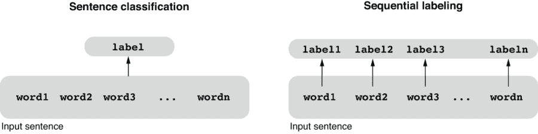

图 5.1 句子分类与顺序标注

但为什么这是个好主意呢？我们什么时候需要每个词都有一个标签？顺序标注非常方便的一个典型场景是当你想要分析一个句子并为每个词生成一些语言学信息。例如，词性标注（POS）就是一个很好的例子，如我在第一章中提到的，它为输入句子中的每个单词生成一个词性标签，比如名词、动词和介词，非常适合顺序标注。请参见图 5.2 进行说明。

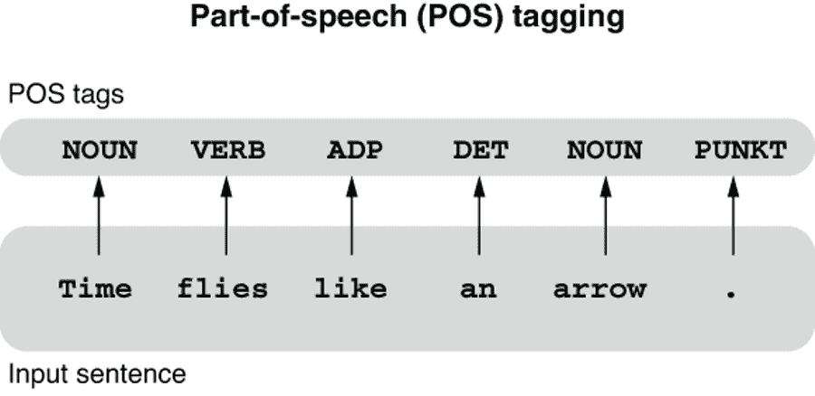

图 5.2 使用顺序标注进行词性标注（POS）

词性标注是最基础、最重要的自然语言处理任务之一。许多英语单词（以及许多其他语言的单词）都是有歧义的，意味着它们有多种可能的解释。例如，单词“book”可以用来描述由页面组成的物理或电子对象（“我读了一本书”），也可以用来描述预订某物的行为（“我需要预订一次航班”）。下游的自然语言处理任务，比如解析和分类，在知道每个“book”的出现实际上意味着什么以便处理输入句子时受益匪浅。如果你要构建一个语音合成系统，你必须知道某些单词的词性才能正确地发音——名词“lead”（一种金属）与“bed”押韵，而动词“lead”（指导，引导）与“bead”押韵。词性标注是解决这种歧义的重要第一步。

另一个场景是当你想要从一个句子中提取一些信息片段时。例如，如果你想要提取名词短语和动词短语等子序列（短语），这也是一个序列标记任务。你如何使用标记来实现提取？这个想法是使用标记来标记所需信息片段的开始和结束（或开始和继续，取决于你如何表示它）。*命名实体识别*（NER）就是一个例子，它是从一个句子中识别真实世界实体的任务，比如专有名词和数字表达式（在图 5.3 中说明）。


图 5.3 使用序列标记的命名实体识别（NER）

注意，所有不属于任何命名实体的单词都被标记为 O（代表“外部”）。目前，你可以忽略图 5.3 中一些神秘的标签，比如 B-GPE 和 I-MONEY。在第 5.4 节中，我会更多地讨论如何将命名实体识别问题制定为一个序列标记问题。

### 5.1.2 使用 RNNs 编码序列

在句子分类中，我们使用递归神经网络（RNNs）将可变长度的输入转换为固定长度的向量。这个固定长度的向量通过一个线性层转换为一组“分数”，捕获了关于输入句子的信息，这对于推导句子标签是必要的。作为提醒，这个 RNN 的作用可以用以下伪代码和图 5.4 中显示的图表来表示：

```py
def rnn_vec(words):
    state = init_state()
    for word in words:
        state = update(state, word)
    return state
```

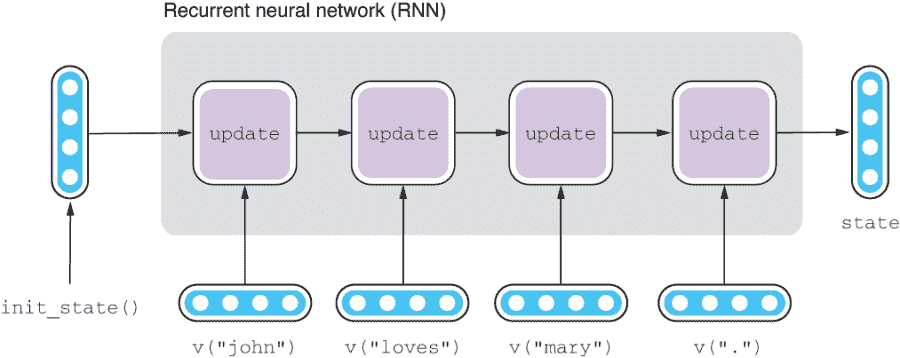

图 5.4 句子分类的递归神经网络（RNN）

什么样的神经网络可以用于序列标记？我们似乎需要句子中每个输入单词的一些信息，而不仅仅是在末尾。如果您仔细查看 rnn_vec()的伪代码，您会注意到我们已经有了输入中每个单词的信息，这些信息由状态捕获。该函数恰好只返回状态的最终值，但我们没有理由不能存储状态的中间值并将它们作为列表返回，就像以下函数一样：

```py
def rnn_seq(words):
    state = init_state()
    states = []
    for word in words:
        state = update(state, word)
        states.append(state)
    return states
```

如果你将此函数应用于图 5.2 中显示的“time flies”示例并展开它——也就是说，不使用循环写出它——它将如下所示：

```py
state = init_state()
states = []
state = update(state, v("time"))
states.append(state)
state = update(state, v("flies"))
states.append(state)
state = update(state, v("like"))
states.append(state)
state = update(state, v("an"))
states.append(state)
state = update(state, v("arrow"))
states.append(state)
state = update(state, v("."))
states.append(state)
```

这里的 v()是一个函数，它返回给定单词的嵌入。这可以通过图 5.5 中所示的方式进行可视化。请注意，对于每个输入单词 word，网络都会产生捕获有关该单词的一些信息的相应状态。状态列表 states 的长度与 words 的长度相同。状态的最终值，即 states[-1]，与先前的 rnn_vec()的返回值相同。

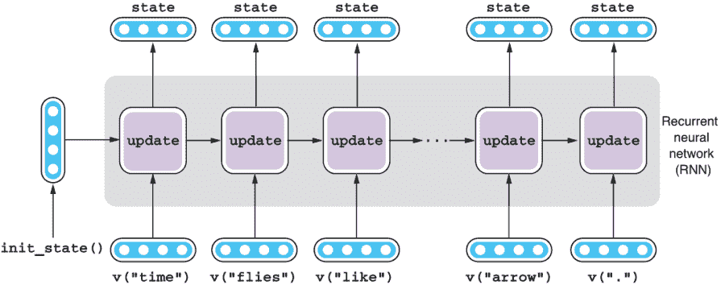

图 5.5 用于序列标记的递归神经网络（RNN）

如果将这个循环神经网络视为一个黑匣子，它接受一系列东西（例如，词嵌入）并将其转换为编码有关输入中各个单词信息的向量序列，因此该架构在 AllenNLP 中被称为*Seq2Seq*（代表“序列到序列”）编码器。

最后一步是将这个 RNN 的每个状态应用于一个线性层，以得到对每个标签的可能性的一组分数。如果这是一个词性标注器，我们

对于标签 NOUN，需要一个分数，对于 VERB，需要另一个分数，以此类推，适用于每个单词。此转换如图 5.6 所示。请注意，相同的线性层（具有相同的参数集）应用于每个状态。

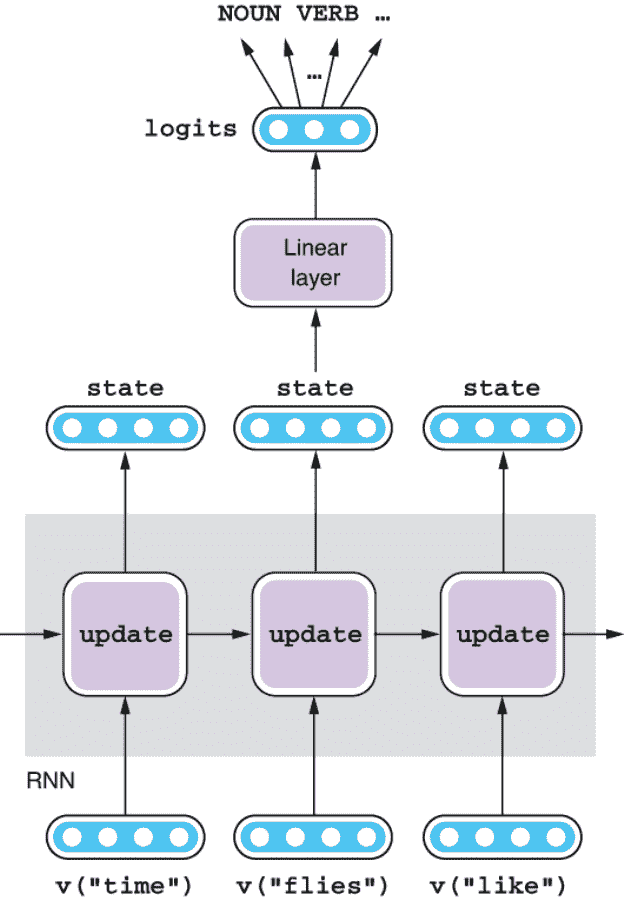

图 5.6 将线性层应用于 RNN

总结一下，我们可以使用几乎与我们用于句子分类相同的结构进行序列标记，唯一的区别是前者为每个单词生成一个隐藏状态，而不仅仅是每个句子。要生成用于确定标签的分数，必须将线性层应用于每个隐藏状态。

### 5.1.3 在 AllenNLP 中实现 Seq2Seq 编码器

AllenNLP 实现了一个称为 Seq2SeqEncoder 的抽象类，用于抽象化所有接受向量序列并返回另一个修改后向量序列的 Seq2Seq 编码器。理论上，您可以继承该类并实现自己的 Seq2Seq 编码器。然而，在实践中，您很可能会使用 PyTorch/AllenNLP 提供的现成实现之一，例如 LSTM 和 GRU。请记住，当我们为情感分析器构建编码器时，我们使用了 PyTorch 的内置 torch.nn.LSTM，并将其包装为 PytorchSeq2VecWrapper，如下所示，这使其与 AllenNLP 的抽象兼容：

```py
encoder = PytorchSeq2VecWrapper(
    torch.nn.LSTM(EMBEDDING_DIM, HIDDEN_DIM, batch_first=True))
```

AllenNLP 还实现了 PytorchSeq2SeqWrapper，它使用 PyTorch 的内置 RNN 实现之一，并使其符合 AllenNLP 的 Seq2SeqEncoder，因此你需要做的很少，只需要像这样初始化一个 Seq2Seq 编码器：

```py
encoder = PytorchSeq2SeqWrapper(
    torch.nn.LSTM(EMBEDDING_DIM, HIDDEN_DIM, batch_first=True))
```

就是这样！还有一些需要注意的地方，但是你会惊奇地发现，为了使其用于顺序标记，你需要进行的更改很少，这得益于 AllenNLP 的强大抽象——大部分时间你只需要关心各个组件如何相互作用，而不需要关心这些组件工作的实现方式。

## 5.2 构建一个词性标注器

在本节中，我们将构建我们的第一个顺序标记应用程序—一个词性（POS）标注器。您可以在 Google Colab 笔记本上查看此部分的全部代码([`realworldnlpbook.com/ch5.html#pos-nb`](http://realworldnlpbook.com/ch5.html#pos-nb))。我们假设您已经导入了所有必要的依赖项，如下所示：

```py
from itertools import chain
from typing import Dict

import numpy as np
import torch
import torch.optim as optim

from allennlp.data.data_loaders import MultiProcessDataLoader
from allennlp.data.samplers import BucketBatchSampler
from allennlp.data.vocabulary import Vocabulary
from allennlp.models import Model
from allennlp.modules.seq2seq_encoders import Seq2SeqEncoder, PytorchSeq2SeqWrapper
from allennlp.modules.text_field_embedders import TextFieldEmbedder, BasicTextFieldEmbedder
from allennlp.modules.token_embedders import Embedding
from allennlp.nn.util import get_text_field_mask, sequence_cross_entropy_with_logits
from allennlp.training.metrics import CategoricalAccuracy
from allennlp.training import GradientDescentTrainer
from allennlp_models.structured_prediction.dataset_readers.universal_dependencies import UniversalDependenciesDatasetReader

from realworldnlp.predictors import UniversalPOSPredictor
```

### 5.2.1 读取数据集

如我们在第一章中所看到的那样，*词性*（POS）是一组共享相似语法属性的词汇类别。词性标注是将句子中的每个单词与相应的词性标记进行标记化的过程。用于 POS 标注的训练集遵循一组预定义的语言 POS 标签集。

要训练一个词性标注器，我们需要一个数据集，其中每个句子中的每个单词都标有相应的词性标记。在这个实验中，我们将使用英语 Universal Dependencies (UD)数据集。Universal Dependencies 是一个由一群研究者开发的语言无关的依存语法框架。UD 还定义了一个标签集，称为*通用词性标记集* ([`realworldnlpbook.com/ch1.html#universal-pos`](http://realworldnlpbook.com/ch1.html#universal-pos))。UD 和 Universal POS 标记集的使用在 NLP 社区中非常流行，尤其是在诸如词性标注和解析等语言无关任务和模型中。

我们将使用 UD 的一个子语料库，名为*"A Gold Standard Universal Dependencies Corpus for English"，该语料库建立在英语 Web Treebank (EWT)之上([`realworldnlpbook.com/ch5.html#ewt`](http://realworldnlpbook.com/ch5.html#ewt))，并可在创作共用许可下使用。如需要，您可以从数据集页面([`realworldnlpbook.com/ch5.html#ewt-data`](http://realworldnlpbook.com/ch5.html#ewt-data))下载整个数据集。

Universal Dependencies 数据集以一种称为*CoNLL-U 格式*（[`universaldependencies.org/docs/format.html`](http://universaldependencies.org/docs/format.html)）的格式分发。AllenNLP 模型包已经实现了一个名为 UniversalDependenciesDatasetReader 的数据集读取器，它以这种格式读取数据集，并返回包含词形、词性标签和依赖关系等信息的实例集合，因此你只需初始化并使用它，如下所示：

```py
reader = UniversalDependenciesDatasetReader()
train_path = ('https:/./s3.amazonaws.com/realworldnlpbook/data/'
              'ud-treebanks-v2.3/UD_English-EWT/en_ewt-ud-train.conllu')
dev_path = ('https:/./s3.amazonaws.com/realworldnlpbook/'
            'data/ud-treebanks-v2.3/UD_English-EWT/en_ewt-ud-dev.conllu')
```

还有，不要忘记初始化数据加载器和一个词汇表实例，如下所示：

```py
sampler = BucketBatchSampler(batch_size=32, sorting_keys=["words"])
train_data_loader = MultiProcessDataLoader(
    reader, train_path, batch_sampler=sampler)
dev_data_loader = MultiProcessDataLoader(
    reader, dev_path, batch_sampler=sampler)

vocab = Vocabulary.from_instances(chain(train_data_loader.iter_instances(),
                                        dev_data_loader.iter_instances()))
train_data_loader.index_with(vocab)
dev_data_loader.index_with(vocab)
```

### 5.2.2 定义模型和损失

构建词性标注器的下一步是定义模型。在前面的部分中，我们已经看到你可以使用 AllenNLP 内置的 PytorchSeq2VecWrapper 很少修改就初始化一个 Seq2Seq 编码器。让我们按照以下方式定义其他组件（词嵌入和 LSTM）以及模型所需的一些变量：

```py
EMBEDDING_SIZE = 128
HIDDEN_SIZE = 128

token_embedding = Embedding(num_embeddings=vocab.get_vocab_size('tokens'),
                            embedding_dim=EMBEDDING_SIZE)
word_embeddings = BasicTextFieldEmbedder({"tokens": token_embedding})

lstm = PytorchSeq2SeqWrapper(
    torch.nn.LSTM(EMBEDDING_SIZE, HIDDEN_SIZE, batch_first=True))
```

现在我们准备定义词性标注器模型的主体，如下所示。

清单 5.1 词性标注器模型

```py
class LstmTagger(Model):
    def __init__(self,
                 embedder: TextFieldEmbedder,
                 encoder: Seq2SeqEncoder,
                 vocab: Vocabulary) -> None:
        super().__init__(vocab)
        self.embedder = embedder
        self.encoder = encoder

        self.linear = torch.nn.Linear(
            in_features=encoder.get_output_dim(),
            out_features=vocab.get_vocab_size('pos'))

        self.accuracy = CategoricalAccuracy()                    ❶

    def forward(self,
                words: Dict[str, torch.Tensor],
                pos_tags: torch.Tensor = None,
                **args) -> Dict[str, torch.Tensor]:              ❷
        mask = get_text_field_mask(words)

        embeddings = self.embedder(words)
        encoder_out = self.encoder(embeddings, mask)
        tag_logits = self.linear(encoder_out)

        output = {"tag_logits": tag_logits}
        if pos_tags is not None:
            self.accuracy(tag_logits, pos_tags, mask)
            output["loss"] = sequence_cross_entropy_with_logits(
                tag_logits, pos_tags, mask)                      ❸

        return output

    def get_metrics(self, reset: bool = False) -> Dict[str, float]:
        return {"accuracy": self.accuracy.get_metric(reset)}
```

❶ 我们使用准确度来评估词性标注器。

❷ 我们需要**args 来捕获 AllenNLP 自动解构的不必要的实例字段。

❸ 使用序列交叉熵损失训练 Seq2Seq 编码器。

注意，清单 5.1 中显示的代码与我们用于构建情感分析器的 LstmClassifier 代码（清单 4.1）非常相似。实际上，除了一些命名差异之外，只存在一个基本差异——损失函数的类型。

回想一下，我们在句子分类任务中使用了一种称为*交叉熵*的损失函数，它基本上衡量了两个分布之间的距离。如果模型产生了真实标签的高概率，损失将很低。否则，它将很高。但是这假设每个句子只有一个标签。当每个词只有一个标签时，我们如何衡量预测与真实标签的差距？

答案是：仍然使用交叉熵，但是将其平均化到输入序列中的所有元素上。对于词性标注，你计算每个词的交叉熵，就像它是一个单独的分类任务一样，将其求和到输入句子中的所有词上，并除以句子的长度。这将给你一个反映你的模型平均预测输入句子的词性标签的好坏程度的数字。查看图 5.7 进行说明。


图 5.7 计算序列的损失

关于评估指标，POS 标注器通常使用准确率进行评估，我们将在这里使用。POS 标注的平均人类表现约为 97%，而最先进的 POS 标注器略高于此（[`realworldnlp book.com/ch5.html#pos-sota`](http://realworldnlpbook.com/ch5.html#pos-sota)）。然而，需要注意准确率并非没有问题——假设存在一个相对罕见的 POS 标签（例如 SCONJ，表示从属连接），它仅占总标记数的 2%，而一个 POS 标注器每次出现都会搞砸它。如果标注器将其余标记都正确识别，则仍可达到 98% 的准确率。

### 5.2.3 构建训练流水线

现在我们准备好开始构建训练流水线了。与之前的任务一样，AllenNLP 中的训练流水线看起来非常相似。请查看下一个清单以查看训练代码。

清单 5.2 POS 标注器的训练流水线

```py
model = LstmTagger(word_embeddings, encoder, vocab)

optimizer = optim.Adam(model.parameters())

trainer = GradientDescentTrainer(
    model=model,
    optimizer=optimizer,
    data_loader=train_data_loader,
    validation_data_loader=dev_data_loader,
    patience=10,
    num_epochs=10,
    cuda_device=-1)

trainer.train()
```

当运行此代码时，AllenNLP 会在两个阶段之间交替进行：1）使用训练集训练模型，2）使用验证集评估每个时代，同时监控两个集合上的损失和准确率。经过几个时代后，验证集的准确率会在约 88% 左右稳定。训练结束后，您可以运行下面显示的模型以查看一个未见过的实例：

```py
predictor = UniversalPOSPredictor(model, reader)
tokens = ['The', 'dog', 'ate', 'the', 'apple', '.']
logits = predictor.predict(tokens)['tag_logits']
tag_ids = np.argmax(logits, axis=-1)

print([vocab.get_token_from_index(tag_id, 'pos') for tag_id in tag_ids])
```

此代码使用了 UniversalPOSPredictor，这是我为这个特定的 POS 标注器编写的一个预测器。虽然其细节并不重要，但如果您感兴趣，可以查看它的代码（[`realworldnlpbook.com/ch5#upos-predictor`](http://realworldnlpbook.com/ch5#upos-predictor)）。如果成功，这将显示一个 POS 标签列表：['DET', 'NOUN', 'VERB', 'DET', 'NOUN', 'PUNCT']，这确实是输入句子的正确 POS 标签序列。

## 5.3 多层和双向 RNN

正如我们迄今所见，RNN 是构建 NLP 应用程序的强大工具。在本节中，我将讨论它们的结构变体——多层和双向 RNN，这些是构建高度准确的 NLP 应用程序的更强大组件。

### 5.3.1 多层 RNN

如果将 RNN 视为黑盒子，则它是一个将一系列向量（单词嵌入）转换为另一系列向量（隐藏状态）的神经网络结构。输入和输出序列的长度相同，通常是输入标记的数量。这意味着您可以通过将 RNN 堆叠在一起多次重复这个“编码”过程。一个 RNN 的输出（隐藏状态）成为上面的另一个 RNN 的输入，这个 RNN 刚好位于前一个 RNN 的上面。较大神经网络的子结构（例如单个 RNN）称为*层*，因为您可以像层一样将它们堆叠在一起。两层 RNN 的结构如图 5.8 所示。

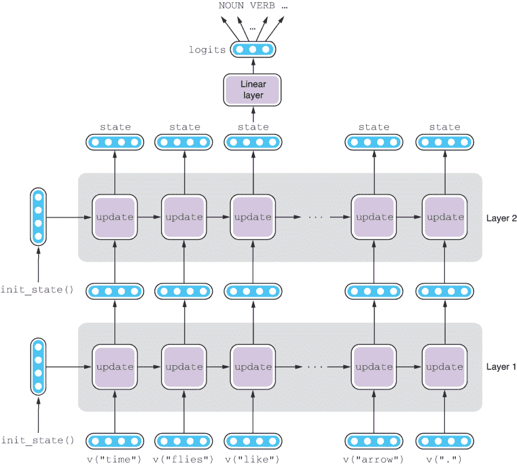

图 5.8 两层 RNN

为什么这是一个好主意呢？如果你将 RNN 的一层看作是一个接受具体输入（例如，单词嵌入）并提取一些抽象概念（例如，POS 标签的得分）的机器，你可以期望，通过重复这个过程，RNN 能够随着层数的增加提取越来越抽象的概念。尽管没有完全经过理论证明，但许多真实世界的 NLP 应用都使用了多层 RNNs。例如，谷歌的神经机器翻译（NMT）系统使用了一个包括八层编码器和解码器的堆叠 RNN（[`realworldnlpbook.com/ch5.html#nmt-paper`](http://realworldnlpbook.com/ch5.html#nmt-paper)）。

要在你的 NLP 应用中使用多层 RNNs，你需要做的只是改变编码器的初始化方式。具体来说，你只需要使用 num_layers 参数指定层数，就像下一个代码片段中所示的那样，而 AllenNLP 会确保训练管道的其余部分按原样工作：

```py
encoder = PytorchSeq2SeqWrapper(
    torch.nn.LSTM(
        EMBEDDING_SIZE, HIDDEN_SIZE, num_layers=2, batch_first=True))
```

如果你更改了这一行并重新运行 POS 标记器训练管道，你会注意到在验证集上的准确率几乎没有变化，或者略低于前一个单层 RNN 模型。这并不奇怪——进行 POS 标记所需的信息大多是表面的，比如被标记的单词的身份和相邻单词。很少情况下需要深入理解输入句子。另一方面，向 RNN 添加层并非没有额外的成本。它会减慢训练和推断的速度，并增加参数的数量，从而使其容易过拟合。对于这个小实验来说，向 RNN 添加层似乎弊大于利。当你改变网络的结构时，一定要记得验证其对验证集的影响。

### 5.3.2 双向 RNNs

到目前为止，我们一直将单词逐个输入 RNN——从句子的开头到结尾。这意味着当 RNN 处理一个单词时，它只能利用到目前为止遇到的信息，也就是单词的左侧上下文。当然，你可以从单词的左侧上下文中获得很多信息。例如，如果一个单词前面是情态动词（例如，“can”），那么下一个单词是动词的信号就很强烈。然而，右侧上下文也包含了很多信息。例如，如果你知道下一个单词是限定词（例如，“a”），那么左侧的“book”是一个动词，而不是名词的信号就很强烈。

双向 RNN（或简称双向 RNN）通过组合两个方向相反的 RNN 来解决这个问题。前向 RNN 是我们在本书中一直使用的正向 RNN，它从左到右扫描输入句子，并使用输入词和在其左侧所有信息来更新状态。而反向 RNN 则按相反的方向扫描输入句子。它使用输入词和在其右侧所有信息来更新状态。这相当于翻转输入句子的顺序并将其馈送给前向 RNN。双向 RNN 产生的最终隐藏状态是来自前向和后向 RNN 的隐藏状态的连接。详见图 5.9。

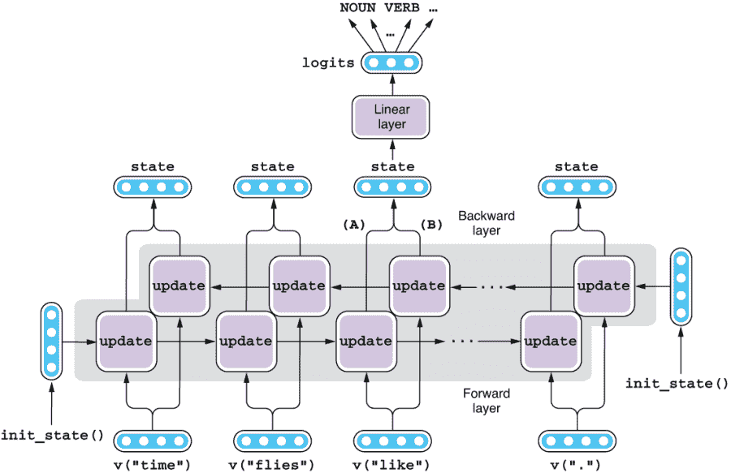

图 5.9 双向 RNN

让我们用具体的例子来说明。假设输入句子是“time flies like an arrow”，你想知道这个句子中间的单词“like”的词性标注。前向 RNN 处理“time”和“flies”，到达“like”时，它的内部状态（图 5.9 中的 A）编码了关于“time flies like”所有的信息。同样地，反向 RNN 处理“arrow”和“an”，到达“like”时，它的内部状态（图 5.9 中的 B）编码了关于“like an arrow”的所有信息。双向 RNN 的“like”的内部状态是这两个状态（A + B）的连接。您只需将两个向量连接在一起——不需要进行数学运算。因此，“like”的内部状态编码了整个句子的信息。这比只知道句子的一半要好得多！

实现双向 RNN 同样容易——您只需要在初始化 RNN 时添加 bidirectional=True 标志，如下所示：

```py
encoder = PytorchSeq2SeqWrapper(
    torch.nn.LSTM(
        EMBEDDING_SIZE, HIDDEN_SIZE, bidirectional=True, batch_first=True))
```

如果你使用这个变化来训练 POS 标注器，验证集的准确率将从 ~88% 跳升到 91%。这意味着将词的两侧信息结合起来对于 POS 标注是有效的。

请注意，您可以通过堆叠双向 RNN 来结合本节介绍的两种技术。双向 RNN 的一层输出（由前向和后向层连接）成为另一层双向 RNN 的输入（见图 5.10）。您可以在初始化 PyTorch/AllenNLP 中的 RNN 时指定 num_layers 和 bidirectional 两个标志来实现此目的。

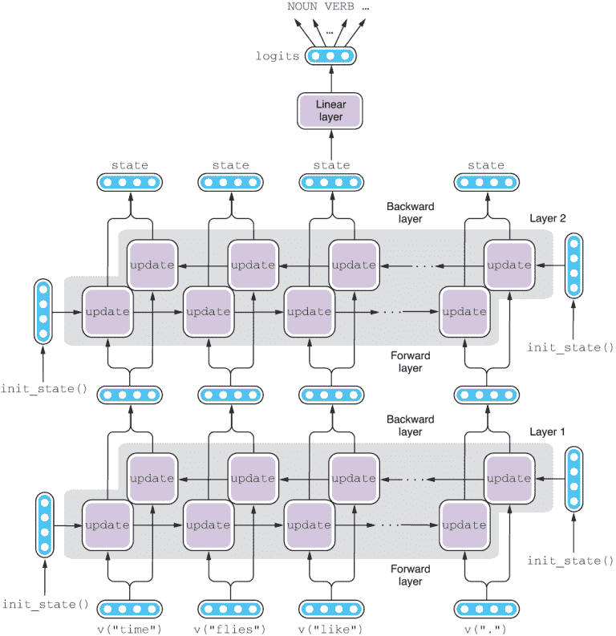

图 5.10 两层双向 RNN

## 5.4 命名实体识别

序列标注可以应用于许多信息提取任务，不仅仅是词性标注。在本节中，我将介绍命名实体识别（NER）的任务，并演示如何使用序列标注构建一个 NER 标注器。此部分的代码可以通过 Google Colab 平台查看和执行（[`realworldnlpbook.com/ch5#ner-nb`](http://realworldnlpbook.com/ch5#ner-nb)）。

### 5.4.1 什么是命名实体识别？

正如前面提到的，命名实体是对现实世界实体的提及，如专有名词。通常由 NER 系统覆盖的常见命名实体包括以下内容：

+   个人姓名（PER）：艾伦·图灵、Lady Gaga、埃隆·马斯克

+   组织（ORG）：谷歌、联合国、巨人

+   位置（LOC）：雷尼尔山、巴厘岛、尼罗河

+   地理政治实体（GPE）：英国、旧金山、东南亚

然而，不同的 NER 系统处理不同的命名实体集合。在 NLP 中，命名实体的概念有点过载，意味着任何对应用程序用户感兴趣的提及。例如，在医学领域，你可能想提取药品和化学化合物的名称提及。在金融领域，公司、产品和股票符号可能是感兴趣的。在许多领域，数字和时间表达式也被视为命名实体。

识别命名实体本身就很重要，因为命名实体（谁、什么、在哪里、什么时候等）通常是大多数人感兴趣的。但是 NER 也是许多其他自然语言处理应用的重要第一步。一个这样的任务是*关系抽取*：从给定的文档中提取所有命名实体之间的关系。例如，给定一个新闻稿件，你可能想提取出其中描述的事件，比如哪家公司以什么价格收购了哪家其他公司。这通常假设所有各方都已通过 NER 识别。与 NER 密切相关的另一个任务是*实体链接*，其中命名实体的提及与某些知识库（如维基百科）相关联。当维基百科被用作知识库时，实体链接也称为*维基化*。

但是你可能会想，仅仅提取命名实体有什么难的？如果它们只是专有名词，你可以简单地编制一个字典，比如所有的名人（或所有的国家，或你感兴趣的任何东西），然后使用它吗？这个想法是，每当系统遇到一个名词，它就会通过这个字典，并标记出现在其中的提及。这样的字典称为*地名词典*，许多 NER 系统确实使用它们作为一个组件。

然而，仅仅依靠这样的字典有一个主要问题——*歧义性*。前面我们看到一个单词类型可能有多个词性（例如，“book”既是名词又是动词），命名实体也不例外。例如，“Georgia”可以是一个国家的名字，也可以是美国的一个州，跨越美国的城镇和社区（乔治亚州，印第安纳州；乔治亚州，内布拉斯加州），一部电影，几首歌曲，船只和一个人名。像“book”这样的简单单词也可能是命名实体，包括：Book（路易斯安那州的一个社区），Book/Books（一个姓氏），The Books（一个美国乐队）等。如果它们是模糊的，简单地将提及与字典进行匹配将告诉你它们的身份。

幸运的是，句子通常提供了可以用于*消歧*提及的线索。 例如，如果句子中读到“我住在乔治亚州”，通常是“乔治亚州”是地点名称，而不是电影或人名的强烈信号。 NER 系统使用关于提及本身的信号（例如，它们是否在预定义字典中）以及关于它们上下文的信号（它们是否由某些词先导或跟随）的组合来确定它们的标记。

### 5.4.2 标记跨度

与词性标注不同，指向命名实体的提及可以跨越多个词，例如，“美国”和“世界贸易组织”。 在 NLP 中，*跨度* 只是一个或多个连续词的范围。 我们如何使用相同的序列标记框架来建模跨度？

NLP 中的一个常见做法是使用某种形式的编码将跨度转换为每个词的标记。 NER 中最常用的编码方案称为*IOB2 标记*。 它通过位置标记和类别标记的组合来表示跨度。 以下是三种类型的位置标记：

+   B（Beginning）：分配给跨度的第一个（或唯一的）标记

+   我（Inside）：分配给跨度的所有标记的第一个标记之外的所有标记

+   O（Outside）：分配给任何跨度之外的所有单词

现在，让我们看一下之前看到的 NER 示例，并显示在图 5.11 中。 标记“Apple”是 ORG（表示“组织”）的第一个（也是唯一的）标记，并分配了一个 B-ORG 标记。 类似地，“UK”是 GPE（表示“地缘政治实体”）的第一个和唯一的标记，并分配了 B-GPE。 对于“$1”和“billion”，表示货币表达式（MONEY）的第一个和第二个标记，分别分配了 B-MONEY 和 I-MONEY。 所有其他标记都被赋予 O。

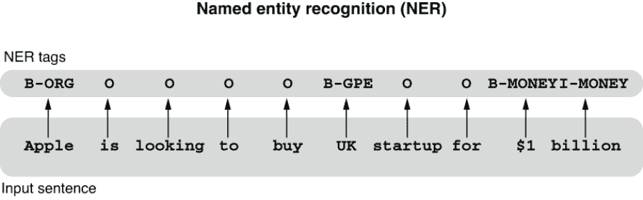

图 5.11 命名实体识别（NER）使用序列标记

解决 NER 的其余管道与解决词性标注非常相似：两者都涉及为每个词分配适当的标记，并且可以通过 RNN 解决。 在接下来的部分中，我们将使用神经网络构建一个简单的 NER 系统。

### 5.4.3 实现命名实体识别器

要构建一个 NER 系统，我们使用由 Abhinav Walia 准备的命名实体识别注释语料库，该语料库已在 Kaggle 上发布（[`realworldnlpbook.com/ch5.html#ner-data`](http://realworldnlpbook.com/ch5.html#ner-data)）。 在接下来的内容中，我假设您已经下载并展开了数据集，并将其放置在 data/entity-annotated-corpus 下。 或者，您可以使用我上传到 S3 的数据集的副本（[`realworldnlpbook.com/ch5.html#ner-data-s3`](http://realworldnlpbook.com/ch5.html#ner-data-s3)），这就是以下代码所做的事情。 我为这个数据集编写了一个数据集读取器（[`realworldnlpbook.com/ch5.html#ner-reader`](http://realworldnlpbook.com/ch5.html#ner-reader)），所以您只需导入（或复制粘贴）它并使用它：

```py
reader = NERDatasetReader('https:/./s3.amazonaws.com/realworldnlpbook/'
                          'data/entity-annotated-corpus/ner_dataset.csv')
```

由于数据集没有分为训练集、验证集和测试集，数据集读取器将为您分离为训练集和验证集。您所需要做的就是在初始化数据加载器时指定您想要的分割方式，如下所示：

```py
sampler = BucketBatchSampler(batch_size=16, sorting_keys=["tokens"])
train_data_loader = MultiProcessDataLoader(
    reader, 'train', batch_sampler=sampler)
dev_data_loader = MultiProcessDataLoader(
    reader, 'dev', batch_sampler=sampler)
```

基于 RNN 的顺序标注模型和训练流程的其余部分与以前的示例（词性标注器）几乎相同。唯一的区别在于我们如何评估我们的 NER 模型。因为典型的 NER 数据集中大多数标签只是“O”，使用标签准确度很容易误导 —— 一个将所有东西标记为“O”的愚蠢系统可以获得非常高的准确度。相反，NER 通常被评估为一项信息提取任务，其目标是从文本中提取命名实体，而不仅仅是标记它们。我们希望基于检索到的命名实体的“干净程度”（有多少是实际实体）和“完整程度”（系统能够检索到多少实际实体）来评估 NER 系统。这些听起来熟悉吗？是的，这些就是我们在第 4.3 节中讨论过的召回率和精确度的定义。由于命名实体通常有多种类型，因此这些指标（精确度、召回率和 F1 度量）是按实体类型计算的。

注意，如果在计算这些指标时忽略实体类型，它被称为*总体平均*。例如，总体平均的精确度是所有类型的真阳性总数除以检索到的命名实体总数，而不管类型如何。另一方面，如果按实体类型计算这些指标，然后对它们进行平均，它被称为*宏平均*。例如，如果 PER 和 GPE 的精确度分别为 80%和 90%，则它的宏平均为 85%。接下来，AllenNLP 所计算的是总体平均。

AllenNLP 实现了 SpanBasedF1Measure，它计算每个类型的指标（精确度、召回率和 F1 度量），以及平均值。你可以在你的模型的 __init__()方法中定义这个指标，如下所示：

```py
self.f1 = SpanBasedF1Measure(vocab, tag_namespace='labels')
```

并使用它在训练和验证过程中获得指标，如下所示：

```py
def get_metrics(self, reset: bool = False) -> Dict[str, float]:
    f1_metrics = self.f1.get_metric(reset)
    return {'accuracy': self.accuracy.get_metric(reset),
            'prec': f1_metrics['precision-overall'],
            'rec': f1_metrics['recall-overall'],
            'f1': f1_metrics['f1-measure-overall']}
```

如果你运行这个训练流程，你会得到大约 0.97 的准确度，而精确度、召回率和 F1 度量将都在 0.83 左右。你还可以使用`predict()`方法来获得未见过的句子的命名实体标签，如下所示：

```py
tokens = ['Apple', 'is', 'looking', 'to', 'buy', 'UK', 'startup',
          'for', '$1', 'billion', '.']
labels = predict(tokens, model)
print(' '.join('{}/{}'.format(token, label)
               for token, label in zip(tokens, labels)))
```

它将生成如下结果：

```py
Apple/B-org is/O looking/O to/O buy/O UK/O startup/O for/O $1/O billion/O ./O
```

这并不完美 —— NER 标注器正确获取了第一个命名实体（“Apple”），但错过了另外两个（“UK”和“10 亿美元”）。如果你查看训练数据，你会发现提及“UK”的情况从未出现过，而且没有标注货币值。系统难以标记它从未见过的实体是毫不奇怪的。在自然语言处理（以及机器学习一般）中，测试实例的特征需要与训练数据匹配，才能使模型完全有效。

## 5.5 语言建模

在这一部分，我将稍微转换一下方向，介绍*语言模型*，这是自然语言处理中最重要的概念之一。我们将讨论它们是什么，它们为什么重要，以及如何使用我们迄今介绍的神经网络组件来训练它们。

### 5.5.1 什么是语言模型？

想象一下，你被要求预测接下来的单词是什么，给出一个部分句子：“My trip to the beach was ruined by bad ___。”接下来可能是什么词？许多事情都可能毁了一次海滩之行，但最有可能的是天气不好。也许是海滩上的没礼貌的人，或者可能是这个人在旅行前吃的不好的食物，但大多数人会同意在这个部分句子之后跟着“weather”是一个可能性很高的词。在这种情况下，很少有其他名词（*people*，*food*，*dogs*）和其他词性的词（*be*，*the*，*run*，*green*）与“weather”一样合适。

刚才你所做的是为一个英文句子分配一些信念（或概率）。你刚刚比较了几个替代方案，并判断它们作为英文句子的可能性有多大。大多数人都会同意，“My trip to the beach was ruined by bad weather”的概率远远高于“My trip to the beach was ruined by bad dogs”。

形式上，*语言模型*是一种给出文本片段概率的统计模型。一个英文语言模型会为看起来像英文的句子分配较高的概率。例如，一个英文语言模型会给“My trip to the beach was ruined by bad weather”比给“My trip to the beach was ruined by bad dogs”或甚至“by weather was trip my bad beach the ruined to.”更高的概率。句子的语法越好，越有“意义”，概率就越高。

### 5.5.2 语言模型有什么用处？

你可能会想知道这样一个统计模型有什么用。虽然在回答填空题时预测下一个单词可能会派上用场，但语言模型在自然语言处理中扮演着什么特殊的角色呢？

答案是，对于生成自然语言的任何系统都是必不可少的。例如，机器翻译系统，它可以根据另一种语言中的句子生成一个语言中的句子，将受益于高质量的语言模型。为什么？假设我们想将一个西班牙语句子“Está lloviendo fuerte”翻译成英语（“It is raining hard”）。最后一个词“fuerte”有几个英语对应词——*strong*、*sharp*、*loud*、*heavy*等等。你如何确定哪个英语对应词在这种情况下是最合适的？解决这个问题的方法有很多种，但最简单的之一是使用英语语言模型并重新排列几个不同的翻译候选项。假设你已经翻译到“It is raining”，你只需要在西班牙语-英语词典中查找所有可能的对应词，并生成“It is raining strong”、“It is raining sharp”、“It is raining loud”、“It is raining hard”。然后，你只需要询问语言模型，这些候选项中哪一个具有最高的概率。

注意 实际上，神经机器翻译模型可以被视为在目标语言中生成句子的语言模型的一种变体，这种语言模型受其输入（源语言中的句子）的影响。这样的语言模型被称为*条件语言模型*，与我们在此讨论的*无条件语言模型*相对。我们将在第六章讨论机器翻译模型。

语音识别中也会出现类似的情况，这是另一个根据口语音频输入生成文本的任务。例如，如果有人说“你是对的”，语音识别系统如何知道实际上是“你是对的”？因为“you're”和“your”可能发音相同，同样，“right”和“write”，甚至“Wright”和“rite”也可能发音相同，系统的输出可能是“You're write”，“You're Wright”，“You're rite”，“Your right”，“Your write”，“Your Wright”等等。再次，解决这种歧义的最简单方法是使用语言模型。英语语言模型会正确重新排序这些候选项，并确定“you're right”是最可能的转录。

实际上，人类一直在做这种类型的消歧义，虽然是无意识的。当你在一个大型聚会上和别人交谈时，你接收到的实际音频信号通常非常嘈杂。大多数人仍然可以毫无问题地相互理解，因为人们的语言模型帮助他们“纠正”你听到的内容并填补任何缺失部分。如果你尝试用不太熟练的第二语言进行交流，你会注意到这一点——在嘈杂的环境中，你会更难以理解对方，因为你的语言模型不如你的第一语言好。

### 训练 RNN 语言模型

此时，你可能想知道预测下一个单词与为句子分配概率之间的联系是什么。这两者实际上是等价的。我不打算解释背后的理论，因为这需要你理解一些数学（尤其是概率论），我将在不涉及数学细节的情况下尝试一个直观的例子。

想象一下，你想要估计明天的天气有雨和地面潮湿的几率。让我们简化一下，假设只有两种天气，晴天和雨天。地面只有两种结果：干燥或潮湿。这相当于估计一个序列的概率：[rain, wet]。

进一步假设某一天下雨的可能性是 50-50。下雨后，地面潮湿的概率是 90%。那么，雨和地面潮湿的概率是多少？简单地是 50%乘以 90%，即 45%，或者 0.45。如果我们知道一个事件在另一个事件之后发生的概率，那么你可以简单地将两个概率相乘得到序列的总概率。这在概率论中被称为*链规则*。

类似地，如果你能正确估计一部分句子后一个词出现的概率，你可以简单地将其与部分句子的概率相乘。从第一个词开始，你可以一直做下去，直到句子的结尾。例如，如果你想计算“去海滩的旅行是……”的概率，你可以将以下内容相乘：

+   句子开头出现“The”的概率

+   “The”之后出现“trip”的概率

+   “旅行”之后出现“去”的概率

+   “去”之后出现“the”的概率

+   依此类推

这意味着要建立一个语言模型，你需要一个能够预测下一个词的概率（或者更准确地说，是概率分布）的模型，考虑到上下文。你可能已经注意到这听起来有点熟悉。确实，在这里所做的事情与本章中我们一直在谈论的顺序标记模型非常相似。例如，一个词性标注模型预测可能的词性标签在给定上下文的情况下的概率分布。一个命名实体识别（NER）模型为可能的命名实体标签做同样的事情。不同之处在于，语言模型是为可能的下一个词做出预测，考虑到模型到目前为止遇到了什么。希望现在开始有些明白为什么我在本章中谈论语言模型了！

总之，要构建一个语言模型，你需要微调一个基于 RNN 的序列标注模型，使其稍微调整，以便它给出下一个单词的估计值，而不是 POS 或 NER 标签。在第三章中，我谈到了 Skip-gram 模型，它根据目标单词预测上下文中的单词。注意这里的相似之处——这两种模型都预测可能单词的概率。Skip-gram 模型的输入只是一个单词，而语言模型的输入是部分序列。你可以使用类似的机制，通过使用线性层将一个向量转换为另一个向量，然后使用 softmax 将其转换为概率分布，正如我们在第三章中讨论的那样。体系结构如图 5.12 所示。

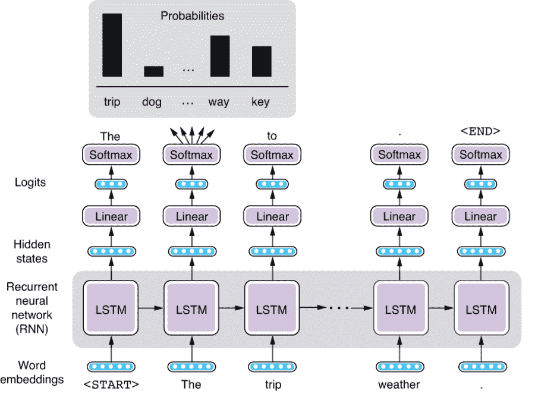

图 5.12 基于 RNN 的语言模型架构

基于 RNN 的语言模型的训练方式与其他序列标注模型类似。我们使用的损失函数是序列交叉熵损失，它度量了预测单词与实际单词之间的“偏差”程度。交叉熵损失是每个单词计算的，并且在句子中的所有单词上进行平均。

## 5.6 使用 RNN 生成文本

我们看到语言模型为自然语言句子给出了概率。但更有趣的部分是，你可以使用语言模型从头开始生成自然语言句子！在本章的最后一节，我们将构建一个语言模型。你可以使用训练好的模型来评估和生成英语句子。你可以在 Google Colab 笔记本上找到此子节的整个脚本（[`realworldnlpbook.com/ch5.html#lm-nb`](http://realworldnlpbook.com/ch5.html#lm-nb)）。

### 5.6.1 将字符馈送到 RNN

在本节的前半部分，我们将构建一个英语语言模型，并使用通用英语语料库对其进行训练。在我们开始之前，我们注意到，本章中构建的 RNN 语言模型是基于 *字符* 而不是基于单词或令牌的。到目前为止，我们所见过的所有 RNN 模型都是基于单词的，这意味着 RNN 的输入始终是单词序列。另一方面，在本节中，我们将使用的 RNN 接受字符序列作为输入。

理论上，RNNs 可以处理任何序列，无论是令牌、字符还是完全不同的东西（例如，语音识别的波形），只要它们可以转换为向量。在构建语言模型时，我们通常将字符作为输入，甚至包括空白和标点，将它们视为长度为 1 的单词。模型的其余部分完全相同——首先将单个字符嵌入（转换为向量），然后将其馈送到 RNN 中，然后训练 RNN，以便它能最好地预测可能出现的下一个字符的分布。

在决定是否应将单词或字符馈送到 RNN 时需要考虑一些因素。使用字符肯定会使 RNN 的效率降低，这意味着它需要更多的计算才能“理解”相同的概念。例如，基于单词的 RNN 可以在一个时间步接收到单词“dog”并更新其内部状态，而基于字符的 RNN 必须等到接收到三个元素 *d*、*o* 和 *g*，以及可能的“_”（空格符）才能做到。基于字符的 RNN 需要“学会”这个由这三个字符组成的序列表示了某个特殊意义（“dog”这个概念）。

另一方面，通过向 RNN 馈送字符，您可以避开许多处理标记的问题。其中一个问题与处理词汇表外（OOV）的单词有关。当训练基于单词的 RNN 时，通常会固定整个词汇表的集合，通常通过枚举在训练集中出现的所有单词来实现。但是，每当在测试集中遇到一个 OOV 单词时，它就不知道如何处理它。通常情况下，它会给所有 OOV 单词分配一个特殊的标记 <UNK> 并以相同的方式处理它们，这并不理想。相反，基于字符的 RNN 仍然可以处理单个字符，因此它可能能够通过观察训练集中的“dog”所学到的规则，推断出“doggy”是什么意思，即使它从未见过确切的单词“doggy”。

### 5.6.2 使用语言模型评估文本

让我们开始构建一个基于字符的语言模型。第一步是读取一个纯文本数据集文件并生成用于训练模型的实例。我将展示如何在不使用数据集读取器的情况下构建实例以进行演示。假设您有一个 Python 字符串对象 text，您想将其转换为用于训练语言模型的实例。首先，您需要使用 CharacterTokenizer 将其分段为字符，如下所示：

```py
from allennlp.data.tokenizers import CharacterTokenizer

tokenizer = CharacterTokenizer()
tokens = tokenizer.tokenize(text)
```

需要注意的是，这里的 tokens 是一个 Token 对象的列表。每个 Token 对象包含一个字符，而不是一个单词。然后，按照下面显示的方式在列表的开头和末尾插入 <START> 和 <END> 符号：

```py
from allennlp.common.util import START_SYMBOL, END_SYMBOL

tokens.insert(0, Token(START_SYMBOL))
tokens.append(Token(END_SYMBOL))
```

在 NLP 中，在每个句子的开头和结尾插入这些特殊符号是一种常见做法。使用这些符号，模型可以区分句子中一个标记在中间出现与一个标记在开头或结尾出现的情况。例如，句点很可能出现在句子的末尾（“. <END>”）而不是开头（“<START> .”），语言模型可以给出两个非常不同的概率，而不使用这些符号是不可能做到的。

最后，您可以通过指定单独的文本字段来构建一个实例。请注意，语言模型的“输出”与输入完全相同，只是偏移了一个标记，如下所示：

```py
from allennlp.data.fields import TextField
from allennlp.data.instance import Instance

input_field = TextField(tokens[:-1], token_indexers)
output_field = TextField(tokens[1:], token_indexers)
instance = Instance({'input_tokens': input_field,
                     'output_tokens': output_field})
```

这里的 token_indexers 指定了如何将各个标记映射到 ID。我们仍然使用迄今为止使用的 SingleIdTokenIndexer，如下所示：

```py
from allennlp.data.token_indexers import TokenIndexer 

token_indexers = {'tokens': SingleIdTokenIndexer()}
```

图 5.13 显示了从该过程创建的实例。

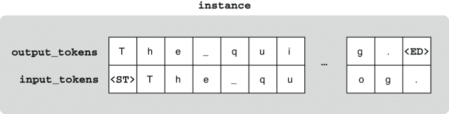

图 5.13 用于训练语言模型的实例

训练流程的其余部分以及模型与本章前面提到的顺序标记模型非常相似。有关更多详细信息，请参见 Colab 笔记本。如下面的代码片段所示，在模型完全训练后，你可以从新的文本中构建实例、将它们转化为实例，并计算损失，该损失基本上衡量了模型在预测下一个字符方面的成功程度：

```py
predict('The trip to the beach was ruined by bad weather.', model)
{'loss': 1.3882852}

predict('The trip to the beach was ruined by bad dogs.', model)
{'loss': 1.5099115}

predict('by weather was trip my bad beach the ruined to.', model)
{'loss': 1.8084583}
```

这里的损失是预测字符与期望字符之间的交叉熵损失。出现较多“不符合预期”的字符，损失值就会越高，因此你可以使用这些值来衡量输入作为英文文本的自然程度。正如预期的那样，自然句子（如第一个句子）得分低于非自然句子（如最后一个句子）。

注意，如果你计算交叉熵的 2 的幂，那么这个值就被称为*困惑度*。对于给定的固定自然语言文本，困惑度会降低，因为语言模型在预测下一个字符方面表现更好，所以它通常用于评估文献中的语言模型的质量。

### 5.6.3 使用语言模型生成文本

(完全训练好的) 语言模型最有趣的方面在于，它们可以根据给定的一些上下文来预测可能出现的下一个字符。具体而言，它们可以给出可能的下一个字符的概率分布，然后根据该分布选择确定下一个字符。例如，如果模型生成了“t”和“h”，并且 LM 是基于通用英文文本训练的，它可能会对字母“e”分配较高的概率，生成常见的英文单词，包括 *the*、*they*、*them* 等。如果你从 <START> 标记开始这个过程，并一直进行下去直到达到句子的结尾（即生成 <END>），你就可以从头开始生成一句英文句子。顺便说一句，这也是为什么像 <START> 和 <END> 这样的标记很有用——你需要将某些内容输入 RNN 以开始生成，并且你还需要知道句子何时结束。

让我们在下面的类似 Python 代码的伪代码中看一下这个过程：

```py
def generate():
    state = init_state()
    token = <START>
    tokens = [<START>]
    while token != <END>:
        state = update(state, token)
        probs = softmax(linear(state))
        token = sample(probs)
        tokens.append(token)
    return tokens
```

这个循环看起来与更新 RNNs 的循环非常相似，但有一个关键区别：在这里，我们不接收任何输入，而是生成字符并将它们作为输入。换句话说，RNN 的操作对象是 RNN 自己迄今为止生成的字符序列。这种在其自身生成的过去序列上操作的模型称为 *自回归模型*。有关此过程的示例，请参见图 5.14。


图 5.14 使用 RNN 生成文本

在上一个代码段中，init_state()和 update()函数是初始化和更新 RNN 隐藏状态的函数，正如我们之前所见。 在生成文本时，我们假设模型及其参数已经训练好了大量的自然语言文本。softmax()函数是在给定向量上运行 Softmax 的函数，而 linear()是扩展/缩小向量大小的线性层。sample()函数根据给定的概率分布返回一个字符。例如，如果分布是“a”：0.6，“b”：0.3，“c”：0.1，则会在 60％的时间内选择“a”，30％的时间选择“b”，10％的时间选择“c”。这确保生成的字符串每次都不同，同时每个字符串看起来都像是英语句子。

注意，您可以使用 PyTorch 的 torch.multinomial()从概率分布中进行抽样。

如果使用 Tatoeba 中的英语句子进行训练，并按照这个算法生成句子，系统将会创建类似于以下举出的例子：

```py
You can say that you don't know it, and why decided of yourself.
Pike of your value is to talk of hubies.
The meeting despoit from a police?
That's a problem, but us?
The sky as going to send nire into better.
We'll be look of the best ever studented.
There's you seen anything every's redusention day.
How a fail is to go there.
It sad not distaples with money.
What you see him go as famous to eat!
```

这不是个坏开端！如果你看看这些句子，有很多词语和短语看起来是合理的英语句子（“You can say that”、“That's a problem”、“to go there”、“see him go”等）。即使系统生成了奇怪的单词（“despoit”、“studented”、“redusention”、“distaples”），它们看起来几乎像真正的英语单词，因为它们基本上遵循英语的形态和音韵规则。这意味着语言模型成功地学习了英语的基本语言要素，如字母排列（拼写）、词形变化（形态学）以及基本句子结构（语法）。

然而，如果你将句子作为一个整体来看，很少有句子是有意义的（例如，*你看到他去当名人吃饭*）。这意味着我们训练的语言模型在建模句子的语义一致性方面存在缺陷。这可能是因为我们的模型不够强大（我们的 LSTM-RNN 需要将句子的所有内容压缩成一个 256 维的向量），或者训练数据集太小（只有 10,000 个句子），或者两者兼而有之。但是你可以轻易想象，如果我们不断增加模型的容量以及训练集的大小，该模型在生成逼真的自然语言文本方面将变得非常出色。2019 年 2 月，OpenAI 宣布开发了一个基于 Transformer 模型的巨型语言模型（我们将在第八章介绍），该模型在 40GB 的互联网文本上进行了训练。该模型显示，它可以在给定提示的情况下生成逼真的文本，展现了几乎完美的语法和长期的主题一致性。事实上，该模型非常出色，以至于 OpenAI 决定不发布他们训练的大型模型，因为他们担心技术可能被用于恶意目的。但是重要的是要记住，无论输出看起来多么智能，他们的模型都是基于我们在本章中的示例玩具模型的相同原理——只是尝试预测下一个字符！

## 总结

+   序列标记模型会给输入中的每个词都打上一个标签，这可以通过递归神经网络（Recurrent Neural Networks, RNNs）来实现。

+   词性标注（Part-of-speech tagging）和命名实体识别（Named Entity Recognition, NER）是序列标记任务的两个实例。

+   多层 RNN 将多个 RNN 层堆叠在一起，而双向 RNN 结合了前向和后向 RNN 来编码整个句子。

+   语言模型为自然语言文本分配概率，这是通过预测下一个词来实现的。

+   你可以使用一个经过训练的语言模型来评估一个自然语言句子的“自然程度”，甚至是从零开始生成看起来逼真的文本。
