# 第六章：序列到序列模型

本章包括

+   使用 Fairseq 构建机器翻译系统

+   使用 Seq2Seq 模型将一句话转换成另一句话

+   使用束搜索解码器生成更好的输出

+   评估机器翻译系统的质量

+   使用 Seq2Seq 模型构建对话系统（聊天机器人）

在本章中，我们将讨论序列到序列（Seq2Seq）模型，这些模型是一些最重要的复杂自然语言处理模型，被用于广泛的应用场景，包括机器翻译。Seq2Seq 模型及其变种已经在许多实际应用中作为基本构建块使用，包括谷歌翻译和语音识别。我们将使用一个强大的框架来构建一个简单的神经机器翻译系统，以了解这些模型的工作原理以及如何使用贪婪和束搜索算法生成输出。在本章的结尾，我们将构建一个聊天机器人——一个可以与之对话的自然语言处理应用。我们还将讨论简单 Seq2Seq 模型的挑战和局限性。

## 6.1 介绍序列到序列模型

在前一章中，我们讨论了两种强大的自然语言处理模型，即序列标记和语言模型。回顾一下，序列标记模型接收一些单元的序列（例如，单词）并为每个单元分配一个标签（例如，词性标注）。而语言模型接收一些单元的序列（例如，单词），并估计给定序列在模型训练的领域中出现的概率。你还可以使用语言模型从零开始生成看起来真实的文本。请参阅图 6.1 以了解这两种模型的概况。

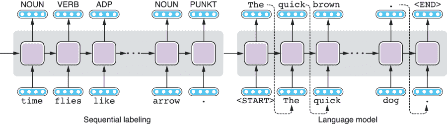

图 6.1 序列标记和语言模型

虽然这两种模型对于许多自然语言处理任务都非常有用，但对于某些任务，你可能希望兼顾这两者——让你的模型接收一些输入（例如，一句句子）并产生另一个东西（例如，另一句句子）作为响应。例如，如果你希望将用一种语言写的文本翻译成另一种语言，你需要让模型接收一个句子并产生另一个句子。你能用序列标记模型实现吗？不能，因为它们只能产生与输入句子中标记数量相同数量的输出标签。这显然对于翻译来说太过有限——一种语言中的表达（比如法语中的“Enchanté”）在另一种语言中可以有任意多或少的单词（比如英语中的“Nice to meet you”）。你能用语言模型实现吗？还是不能。虽然你可以使用语言模型生成看起来真实的文本，但你几乎无法控制它们生成的文本。事实上，语言模型不接受任何输入。

但是如果你仔细看图 6.1，你可能会注意到一些东西。左侧模型（序列标记模型）以句子作为输入，并生成某种形式的表示，而右侧模型则生成一个看起来像自然语言文本的长度可变的句子。我们已经有了构建我们想要的东西所需的组件，即一个接受句子并将其转换为另一个句子的模型。唯一缺失的部分是一种连接这两者的方法，以便我们可以控制语言模型生成什么。

实际上，当左侧模型完成处理输入句子时，循环神经网络已经生成了其抽象表示，该表示被编码在循环神经网络的隐藏状态中。如果你能简单地将这两者连接起来，使得句子表示从左到右传递，并且语言模型可以根据这个表示生成另一个句子，那么似乎你可以实现最初想要做的事情！

序列到序列模型，简称*Seq2Seq*模型，是基于这一见解构建的。Seq2Seq 模型由两个子组件组成，即编码器和解码器。见图 6.2 进行说明。编码器接受一系列单位（例如，一个句子）并将其转换为某种内部表示。另一方面，解码器从内部表示生成一系列单位（例如，一个句子）。总的来说，Seq2Seq 模型接受一个序列并生成另一个序列。与语言模型一样，生成过程在解码器产生一个特殊标记<END>时停止，这使得 Seq2Seq 模型可以生成比输入序列更长或更短的输出。

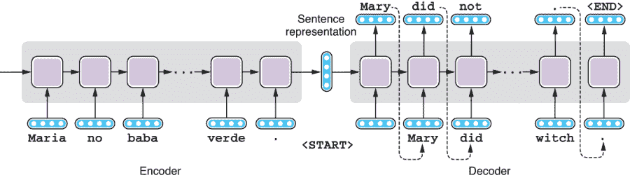

图 6.2 序列到序列模型

有许多 Seq2Seq 模型的变体存在，这取决于你用于编码器的架构，你用于解码器的架构以及两者之间信息流动的方式。本章涵盖了最基本类型的 Seq2Seq 模型——简单地通过句子表示连接两个循环神经网络。我们将在第八章中讨论更高级的变体。

机器翻译是 Seq2Seq 模型的第一个，也是迄今为止最流行的应用。然而，Seq2Seq 架构是一个通用模型，适用于许多自然语言处理任务。在其中一项任务中，摘要生成，一个自然语言处理系统接受长文本（例如新闻文章）并生成其摘要（例如新闻标题）。Seq2Seq 模型可以用来将较长的文本“翻译”成较短的文本。另一个任务是对话系统，或者*聊天机器人*。如果你将用户的话语视为输入，系统的回应视为输出，对话系统的工作就是将前者“翻译”成后者。在本章后面，我们将讨论一个案例研究，在这个案例中，我们实际上使用了 Seq2Seq 模型构建了一个聊天机器人。另一个（有些令人惊讶的）应用是解析——如果你将输入文本视为一种语言，将其语法表示视为另一种语言，你可以使用 Seq2Seq 模型解析自然语言文本。

## 6.2 机器翻译 101

我们在第 1.2.1 节简要提及了机器翻译。简而言之，机器翻译（MT）系统是将给定文本从一种语言翻译成另一种语言的自然语言处理系统。输入文本所用语言称为*源语言*，而输出文本所用语言称为*目标语言*。源语言和目标语言的组合称为*语言对*。

首先，让我们看一些例子，看看是什么样子，以及为什么将外语翻译成英语（或者任何其他你理解的语言）是困难的。在第一个例子中，让我们将一个西班牙句子翻译成英文，即，“Maria no daba una bofetada a la bruja verde.” 翻译成英文对应的是，“Mary did not slap the green witch.” 在说明翻译过程时的一个常见做法是绘制两个句子之间具有相同意思的单词或短语如何映射的图。两个实例之间的语言单位的对应称为*对齐*。图 6.3 显示了西班牙语和英语句子之间的对齐。

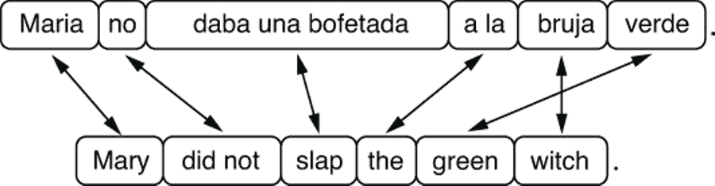

图 6.3 西班牙语和英语之间的翻译和词对齐

一些单词（例如，“Maria” 和 “Mary”，“bruja” 和 “witch”，以及 “verde” 和 “green”）完全一一对应。然而，一些表达（例如，“daba una bofetada” 和 “slap”）在某种程度上有很大不同，以至于你只能在西班牙语和英语之间对齐短语。最后，即使单词之间有一对一的对应关系，单词的排列方式，或者*词序*，在两种语言之间可能也会有所不同。例如，形容词在西班牙语中在名词之后添加（“la bruja verde”），而在英语中，它们在名词之前（“the green witch”）。在语法和词汇方面，西班牙语和英语在某种程度上是相似的，尤其是与中文和英语相比，尽管这个单一的例子显示了在两种语言之间进行翻译可能是一项具有挑战性的任务。

汉语和英语之间的情况开始变得更加复杂。图 6.4 展示了一句汉语句子（“布什与沙龙举行了会谈。”）和其英文翻译（“Bush held a talk with Shalon.”）之间的对齐。尽管汉语使用了自己的表意文字，但我们在这里使用了罗马化的句子以示简便。

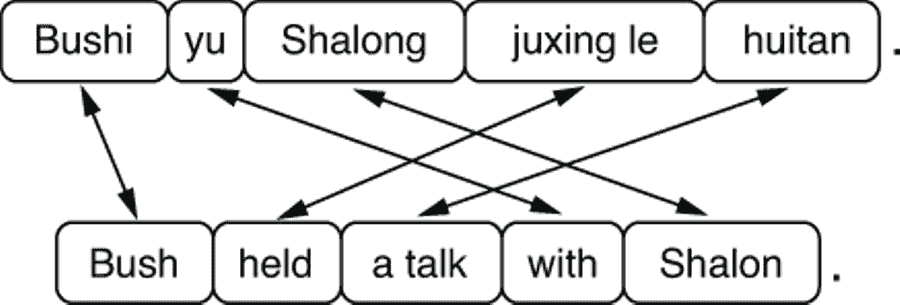

图 6.4 汉语和英语之间的翻译和词对齐

现在你可以在图中看到更多交叉的箭头。与英语不同，汉语介词短语（比如“和沙龙一起”）通常从左边附着在动词上。此外，汉语不明确标记时态，机器翻译系统（以及人工翻译）需要“猜测”英文翻译中应该使用的正确时态。最后，汉译英的机器翻译系统还需要推断每个名词的正确数量（单数或复数），因为汉语名词没有根据数量明确标记（例如，“会谈”只是表示“谈话”，没有明确提及数量）。这是一个很好的例子，说明了翻译的难度取决于语言对。在语言学上不同的语言之间开发机器翻译系统（如中文和英文）通常比在语言学上类似的语言之间（如西班牙语和葡萄牙语）更具挑战性。


图 6.5 日语和英语之间的翻译和词对齐

让我们再看一个例子——从日语翻译成英语，在图 6.5 中有说明。图中所有的箭头都是交叉的，表示这两个句子的词序几乎完全相反。除了日语介词短语（例如“to music”）和关系从句从左边附着，跟汉语一样，宾语（例如例句中的“listening”在“我喜爱听”中）出现在动词之前。换句话说，日语是一种 SOV（主语-宾语-动词）的语言，而到目前为止我们提到的其他语言（英语、西班牙语和汉语）都是 SVO（主语-动词-宾语）的语言。结构上的差异是直接、逐字翻译效果不佳的原因之一。

注 这种语言的词序分类系统（如 SOV 和 SVO）常常用于语言类型学。世界上绝大多数语言都是 SOV（最常见）或 SVO（稍少一些），尽管少数语言遵循其他词序系统，例如阿拉伯语和爱尔兰语使用的 VSO（动词-主语-宾语）。很少一部分语言（不到所有语言的 3%）使用其他类型（VOS、OVS 和 OSV）。

除了前面图示的结构差异之外，许多其他因素也会使机器翻译成为一项困难的任务。其中之一是词汇差异。例如，如果你将日语单词“音楽”翻译成英语“music”，几乎没有歧义。“音楽”几乎总是“music”。然而，如果你将英语单词“brother”翻译成中文，你会面临歧义，因为中文对“哥哥”和“弟弟”使用不同的词语。在更极端的情况下，如果你将“cousin”翻译成中文，你会有八种不同的选择，因为在中国家庭制度中，你需要根据你的表兄弟是母亲的还是父亲的，是女性还是男性，比你大还是小，使用不同的词语。

另一个使机器翻译具有挑战性的因素是省略。你可以在图 6.5 中看到，日语中没有“我”的单词。在诸如中文、日语、西班牙语等许多其他语言中，当主语代词在上下文和/或动词形式中是明确的时候，你可以省略主语代词。这被称为*zero pronoun*，当从一个省略代词的语言翻译成一个省略频率较低的语言时（例如英语），它可能会成为一个问题。

在乔治敦-IBM 实验期间开发的最早的机器翻译系统之一是在冷战期间将俄语句子翻译成英语的。但它所做的不过是不比用双语词典查找每个单词并用其翻译替换它有多不同。上面展示的三个例子应该足以让你相信，简单地逐词替换太过于限制了。后来的系统包含了更大的词典和语法规则，但这些规则是由语言学家手动编写的，并不足以捕捉语言的复杂性（再次记住第一章中可怜的软件工程师）。

在神经机器翻译（NMT）出现之前，在学术界和工业界主导的机器翻译的主要范式称为*统计机器翻译*（SMT）。其背后的理念很简单：通过数据学习如何翻译，而不是通过手工制定规则。具体而言，SMT 系统学习如何从包含源语言文本和其在目标语言中的翻译的数据集中进行翻译。这些数据集称为*平行语料库*（或*平行文本*或*双文本*）。通过查看两种语言中成对句子的集合，算法寻找一种语言中的单词应如何翻译为另一种语言的模式。由此产生的统计模型称为*翻译模型*。同时，通过查看一系列目标句子，算法可以学习目标语言中有效句子的外观。听起来耳熟吗？这正是*语言模型*的全部内容（请参阅前一章）。最终的 SMT 模型结合了这两个模型，并生成一种对输入的合理翻译，并且在目标语言中是一句有效、流畅的句子。

大约在 2015 年，强大的神经机器翻译（NMT）模型的出现颠覆了 SMT 的主导地位。SMT 和 NMT 有两个关键区别。首先，根据定义，NMT 基于神经网络，而神经网络以其准确建模语言的能力而闻名。因此，由 NMT 生成的目标句子往往比由 SMT 生成的句子更流畅和自然。其次，NMT 模型是端到端训练的，正如我在第一章中简要提到的那样。这意味着 NMT 模型由一个单一的神经网络组成，该网络接受输入并直接产生输出，而不是您需要独立训练的子模型和子模块的拼接。因此，与 SMT 模型相比，NMT 模型更容易训练，代码规模更小。

MT 已经在许多不同的行业和我们生活的方方面面得到了应用。将外语文本翻译成您理解的语言以快速抓住其含义的过程称为*摘要*。如果在摘要后认为文本足够重要，则可能会将其发送到正式的手动翻译中。专业翻译人员也使用 MT 进行工作。通常，源文本首先使用 MT 系统翻译为目标语言，然后由人类翻译人员编辑生成的文本。这种编辑称为*后编辑*。使用自动化系统（称为*计算机辅助翻译*或 CAT）可以加速翻译过程并降低成本。

## 6.3 构建你的第一个翻译器

在本节中，我们将构建一个可工作的 MT 系统。我们不会编写任何 Python 代码来实现，而是会充分利用现有的 MT 框架。许多开源框架使构建 MT 系统变得更加容易，包括 Moses（[`www.statmt.org/moses/`](http://www.statmt.org/moses/)）用于 SMT 和 OpenNMT（[`opennmt.net/`](http://opennmt.net/)）用于 NMT。在本节中，我们将使用 Fairseq（[`github.com/pytorch/fairseq`](https://github.com/pytorch/fairseq)），这是 Facebook 开发的一个 NMT 工具包，如今在 NLP 从业者中变得越来越流行。以下几个方面使 Fairseq 成为快速开发 NMT 系统的不错选择：1）它是一个现代化的框架，提供了许多预定义的最先进的 NMT 模型，您可以立即使用；2）它非常可扩展，意味着您可以通过遵循它们的 API 快速实现自己的模型；3）它非常快速，默认支持多 GPU 和分布式训练。由于其强大的模型，您可以在几小时内构建一个质量不错的 NMT 系统。

在开始之前，请在项目目录的根目录中运行`pip install fairseq`来安装 Fairseq。此外，请在您的 shell 中运行以下命令来下载并展开数据集（如果您使用的是 Ubuntu，则可能需要安装 unzip，可以通过运行`sudo apt-get install unzip`来安装）:²

```py
$ mkdir -p data/mt
$ wget https://realworldnlpbook.s3.amazonaws.com/data/mt/tatoeba.eng_spa.zip
$ unzip tatoeba.eng_spa.zip -d data/mt
```

我们将使用 Tatoeba 项目中的西班牙语和英语平行句子来训练一个西班牙语到英语的 MT 系统，这是我们在第四章中已经使用过的。该语料库包含大约 20 万个英语句子及其西班牙语翻译。我已经提前格式化了数据集，这样您就可以在不必担心获取数据、标记文本等方面的情况下使用它。数据集已经分为训练、验证和测试子集。

### 6.3.1 准备数据集

如前所述，MT 系统（包括 SMT 和 NMT）是机器学习模型，因此是根据数据训练的。MT 系统的开发过程看起来与任何其他现代 NLP 系统相似，如图 6.6 所示。首先，对平行语料库的训练部分进行预处理，并用于训练一组 NMT 模型候选者。接下来，使用验证部分来选择所有候选模型中表现最佳的模型。这个过程称为*模型选择*（请参阅第二章进行复习）。最后，最佳模型将在数据集的测试部分上进行测试，以获得反映模型优劣的评估指标。

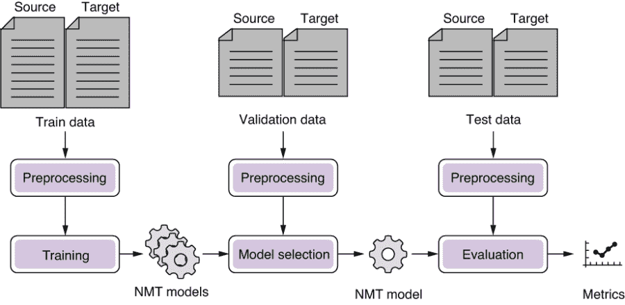

图 6.6 构建 NMT 系统的流水线

MT 开发的第一步是对数据集进行预处理。但在进行预处理之前，你需要将数据集转换为易于使用的格式，通常是自然语言处理中的纯文本格式。实践中，用于训练 MT 系统的原始数据以多种不同格式出现，例如，纯文本文件（如果你很幸运的话）、专有软件的 XML 格式、PDF 文件和数据库记录。你的第一项任务是对原始文件进行格式化，使源句子和它们的目标翻译按句子对齐。结果文件通常是一个 TSV 文件，每行都是一个以制表符分隔的句子对，如下所示：

```py
Let's try something.                   Permíteme intentarlo.
Muiriel is 20 now.                     Ahora, Muiriel tiene 20 años.
I just don't know what to say.         No sé qué decir.
You are in my way.                     Estás en mi camino.
Sometimes he can be a strange guy.     A veces él puede ser un chico raro.
...
```

在翻译对齐后，平行语料被输入到预处理管道中处理。具体的操作因应用程序和语言而异，但以下步骤最为常见：

1.  过滤

1.  清理

1.  分词

在过滤步骤中，将从数据集中移除任何不适合用于训练 MT 系统的句子对。一个句子对是否太长、是否有用等因素影响很大，例如，任何其中一个文本长度过长（例如超过 1000 个单词）的句子对都无用，因为大多数 MT 模型不能建模这样长的句子。此外，任何其中一个句子过长但另一个句子过短的句子对都可能是由于数据处理或对齐错误而引起的噪音。例如，如果一个西班牙语句子有 10 个单词，其英语翻译的长度应该在 5 到 15 个单词之间。最后，如果平行语料库包含除源语言和目标语言之外的任何语言，应该移除这样的句子对。这种情况比你想象的要多得多——许多文档由于引用、解释或代码切换（在一个句子中混合多种语言）而成为多语言文档。语言检测（见第四章）可以帮助检测到这些异常情况。

过滤后，数据集中的句子可以进一步清理。该过程可能包括删除 HTML 标签和任何特殊字符，以及对字符（例如，繁体中文和简体中文）和拼写（例如，美式英语和英式英语）进行归一化。

如果目标语言使用类似于拉丁（a，b，c，...）或西里尔（а，б，в，...）字母表的脚本，区分大小写，您可能需要规范化大小写。通过这样做，您的 MT 系统将“NLP”与“nlp”和“Nlp”分组在一起。通常，这是一件好事，因为通过具有三个不同表示的单一概念，MT 模型必须从数据中学习它们实际上是单一概念。规范化大小写也会减少不同单词的数量，从而使训练和预测更快。但是，这也将“US”和“Us”以及“us”分组在一起，这可能不是一种理想的行为，具体取决于您处理的数据类型和领域。在实践中，这些决策，包括是否规范化大小写，都是通过观察它们对验证数据性能的影响来谨慎做出的。

机器翻译和 NLP 的数据清理

请注意，这里提到的清理技术并不特定于 MT。任何 NLP 应用和任务都可以从经过精心设计的过滤和清理操作的流程中受益。然而，对于 MT 来说，清理训练数据尤为重要，因为翻译的一致性对于构建强大的 MT 模型至关重要。如果您的训练数据在某些情况下使用“NLP”，而在其他情况下使用“nlp”，则模型将难以找到正确翻译该单词的方法，而人类很容易理解这两个单词代表一个概念。

此时，数据集仍然是一堆字符字符串。大多数 MT 系统操作单词，因此您需要对输入进行标记化（第 3.3 节）以识别单词。根据语言，您可能需要运行不同的流程（例如，对于中文和日文，需要进行词段切分）。

您之前下载和展开的 Tatoeba 数据集已经通过了所有这些预处理流程。现在，您已经准备好将数据集交给 Fairseq 了。第一步是告诉 Fairseq 将输入文件转换为二进制格式，以便训练脚本可以轻松读取它们，如下所示：

```py
$ fairseq-preprocess \
      --source-lang es \
      --target-lang en \
      --trainpref data/mt/tatoeba.eng_spa.train.tok \
      --validpref data/mt/tatoeba.eng_spa.valid.tok \
      --testpref data/mt/tatoeba.eng_spa.test.tok \
      --destdir data/mt-bin \
      --thresholdsrc 3 \
      --thresholdtgt 3
```

当成功时，您应该在终端上看到一条“Wrote preprocessed data to data/mt-bin”的消息。您还应该在 data/mt-bin 目录下找到以下一组文件：

```py
dict.en.txt dict.es.txt  test.es-en.en.bin  test.es-en.en.idx  test.es-en.es.bin  test.es-en.es.idx  train.es-en.en.bin  train.es-en.en.idx  train.es-en.es.bin  train.es-en.es.idx  valid.es-en.en.bin  valid.es-en.en.idx  valid.es-en.es.bin  valid.es-en.es.idx
```

此预处理步骤的关键功能之一是构建词汇表（在 Fairseq 中称为*dictionary*），它是从词汇项（通常为单词）到它们的 ID 的映射。注意目录中的两个字典文件 dict.en.txt 和 dict.es.txt。MT 涉及两种语言，因此系统需要维护两个映射，每个语言一个。

### 6.3.2 训练模型

现在，训练数据已转换为二进制格式，您可以准备好训练 MT 模型了。按下面所示使用包含二进制文件的目录以及几个超参数来调用 fairseq-train 命令：

```py
$ fairseq-train \
    data/mt-bin \
    --arch lstm \
    --share-decoder-input-output-embed \
    --optimizer adam \
    --lr 1.0e-3 \
    --max-tokens 4096 \
    --save-dir data/mt-ckpt
```

您不必担心理解大多数参数的含义（至少暂时不用）。此时，您只需要知道使用指定目录中存储的数据（data/mt-bin）使用 LSTM 架构（-arch lstm）和一堆其他超参数来训练模型，并将结果保存在 data/mt-ckpt（checkpoint 的缩写）中即可。

运行此命令时，终端会交替显示两种进度条——一个用于训练，另一个用于验证，如下所示：

```py
| epoch 001:  16%|???▏                | 61/389 [00:13<01:23,  3.91it/s, loss=8.347, ppl=325.58, wps=17473, ups=4, wpb=3740.967, bsz=417.180, num_updates=61, lr=0.001, gnorm=2.099, clip=0.000, oom=0.000, wall=17, train_wall=12]

| epoch 001 | valid on 'valid' subset | loss 4.208 | ppl 18.48 | num_updates 389
```

验证结果对应的行内容很容易区分——它们会说“验证”子集。每个时期，训练过程会轮流进行两个阶段：训练和验证。机器学习中使用的一个概念——一个*时期*，意味着对整个训练数据的一次遍历。在训练阶段，使用训练数据计算损失，然后以使新的参数集降低损失的方式调整模型参数。在验证阶段，模型参数被固定，使用一个单独的数据集（验证集）来衡量模型在该数据集上的表现。

我在第一章中提到过，验证集用于模型选择，这是从单个培训集中选择最佳的机器学习模型的过程。在这里，通过交替进行训练和验证阶段，我们使用验证集来检查所有中间模型（即第一个时期后的模型，第二个时期后的模型，等等）的性能。换言之，我们使用验证阶段来监视培训的进展情况。

为什么这是个好方法？我们通过在每个时期之后插入验证阶段获得了许多好处，但最重要的好处是避免过度拟合——验证数据之所以重要正是因为这个原因。为了进一步说明这一点，让我们看看在我们的西班牙语到英语机器翻译模型的训练过程中，训练集和验证集的损失如何随着时间变化，如图 6.7 所示。

随着训练的进行，训练损失变得越来越小，并逐渐趋近于零，因为这正是我们告诉优化器要做的：使损失尽可能地降低。检查训练损失是否在一个个时期后稳步下降是一个很好的“健全性检查”，可以验证您的模型和培训流水线是否按预期工作。

另一方面，如果您看一下验证损失，它在前几个时期内会下降，但在一定点之后逐渐回升，形成一个 U 形曲线——这是过度拟合的一个典型迹象。经过几个时期的培训后，您的模型在训练集上表现得非常好，开始失去其对验证集的泛化性。

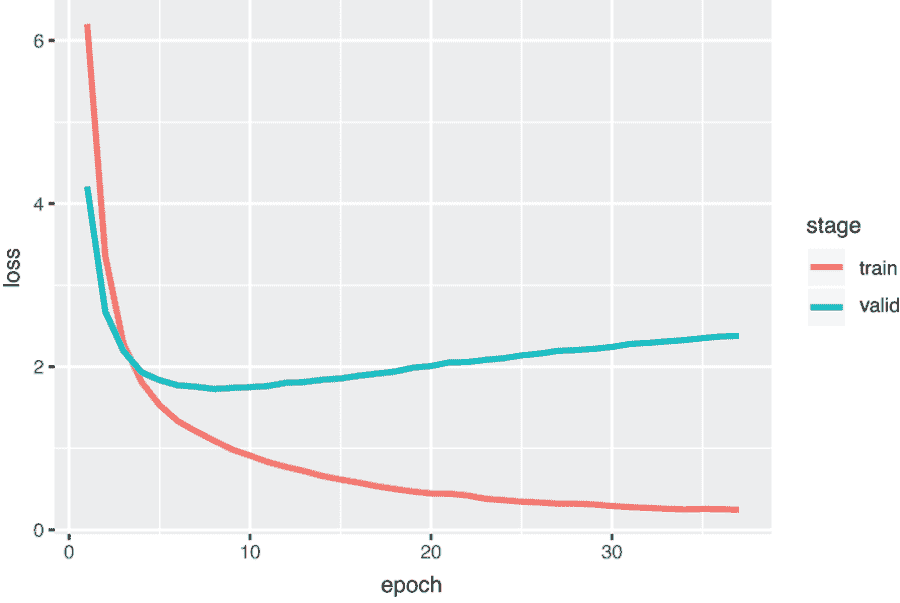

图 6.7 训练和验证损失

让我们用机器翻译中的一个具体例子来说明当模型过度拟合时实际发生了什么。例如，如果您的训练数据包含了英文句子“It is raining hard”及其西班牙语翻译“Esta lloviendo fuerte”，而其他句子中没有包含“hard”一词，那么过拟合的模型可能会认为“fuerte”是“hard”的唯一可能翻译。一个正确拟合的模型可能会留下一些余地，让其他西班牙语单词出现作为“hard”的翻译，但一个过拟合的机器翻译系统总是会将“hard”翻译为“fuerte”，这是根据训练集“正确”的做法，但显然不是您想要构建健壮的机器翻译系统的理想选择。例如，“She is trying hard”中“hard”的最佳翻译方式并不是“fuerte”。

如果您看到验证损失开始上升，那么继续保持训练过程是没有意义的，因为很有可能您的模型已经在某种程度上过度拟合了数据。在这种情况下的一种常见做法，称为*提前停止*，是终止训练。具体来说，如果您的验证损失在一定数量的轮次内没有改善，您就停止训练，并使用验证损失最低时的模型。等待训练终止的轮次数称为*耐心*。在实践中，最关心的指标（例如 BLEU；请参阅第 6.5.2 节）用于提前停止，而不是验证损失。

好了，现在关于训练和验证就说到这里。图 6.7 中的图表表明验证损失在第 8 轮左右最低，所以你可以在大约 10 轮后停止（通过按 Ctrl + C），否则该命令会一直运行下去。Fairseq 将自动将最佳模型参数（根据验证损失）保存到 checkpoint_best.pt 文件中。

警告 如果您只使用 CPU 进行训练，可能需要很长时间。第十一章解释了如何使用 GPU 加速训练。

### 6.3.3 运行翻译器

模型训练完成后，您可以调用 fairseq-interactive 命令以交互方式在任何输入上运行您的机器翻译模型。您可以通过指定二进制文件位置和模型参数文件来运行该命令，如下所示：

```py
$ fairseq-interactive \
    data/mt-bin \
    --path data/mt-ckpt/checkpoint_best.pt \
    --beam 5 \
    --source-lang es \
    --target-lang en
```

看到提示“Type the input sentence and press return”后，尝试逐一输入（或复制粘贴）以下西班牙语句子：

```py
¡ Buenos días !
¡ Hola !
¿ Dónde está el baño ?
¿ Hay habitaciones libres ?
¿ Acepta tarjeta de crédito ?
La cuenta , por favor .
```

请注意这些句子中的标点和空白——Fairseq 假定输入已经进行了分词。您的结果可能会略有不同，这取决于许多因素（深度学习模型的训练通常涉及一些随机性），但您会得到类似以下的结果（我加粗了以示强调）：

```py
¡ Buenos días !
S-0     ¡ Buenos días !
H-0     -0.20546913146972656    Good morning !
P-0     -0.3342 -0.3968 -0.0901 -0.0007
¡ Hola !
S-1     ¡ Hola !
H-1     -0.12050756067037582    Hi !
P-1     -0.3437 -0.0119 -0.0059
¿ Dónde está el baño ?
S-2     ¿ Dónde está el baño ?
H-2     -0.24064254760742188    Where &apos;s the restroom ?
P-2     -0.0036 -0.4080 -0.0012 -1.0285 -0.0024 -0.0002
¿ Hay habitaciones libres ?
S-3     ¿ Hay habitaciones libres ?
H-3     -0.25766071677207947    Is there free rooms ?
P-3     -0.8187 -0.0018 -0.5702 -0.1484 -0.0064 -0.0004
¿ Acepta tarjeta de crédito ?
S-4     ¿ Acepta tarjeta de crédito ?
H-4     -0.10596384853124619    Do you accept credit card ?
P-4     -0.1347 -0.0297 -0.3110 -0.1826 -0.0675 -0.0161 -0.0001
La cuenta , por favor .
S-5     La cuenta , por favor .
H-5     -0.4411449432373047     Check , please .
P-5     -1.9730 -0.1928 -0.0071 -0.0328 -0.0001
```

这里大部分的输出句子都几乎完美，除了第四句（我会翻译成“有免费的房间吗？”）。即使考虑到这些句子都是任何一本旅行西班牙短语书中都可以找到的简单例子，但对于一个在一个小时内构建的系统来说，这并不是一个坏的开始！

## 6.4 Seq2Seq 模型的工作原理

在本节中，我们将深入探讨构成 Seq2Seq 模型的各个组件，包括编码器和解码器。我们还将涵盖用于解码目标句子的算法——贪婪解码和波束搜索解码。

### 6.4.1 编码器

正如我们在本章开始看到的，Seq2Seq 模型的编码器与我们在第五章中讨论的顺序标记模型并没有太大的不同。它的主要工作是接受输入序列（通常是一个句子）并将其转换为固定长度的向量表示。你可以使用像图 6.8 中所示的 LSTM-RNN。

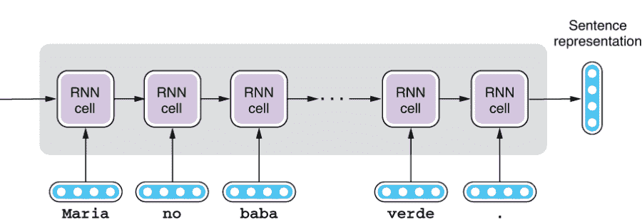

图 6.8 Seq2Seq 模型的编码器

与顺序标记模型不同，我们只需要 RNN 的最终隐藏状态，然后将其传递给解码器生成目标句子。你也可以使用多层 RNN 作为编码器，这种情况下句子表示是每一层输出的串联，如图 6.9 所示。

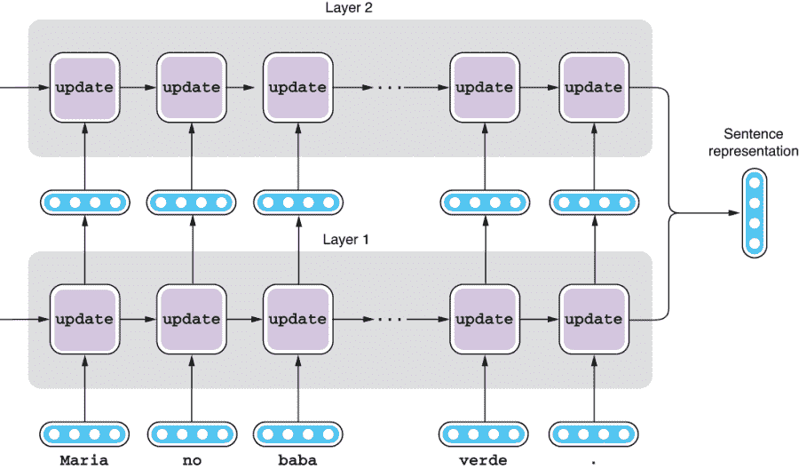

图 6.9 使用多层 RNN 作为编码器

同样地，你可以使用双向（甚至是双向多层）RNN 作为编码器。最终的句子表示是正向层和反向层输出的串联，如图 6.10 所示。

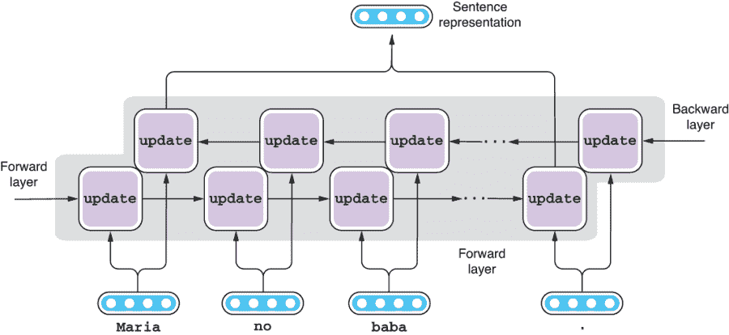

图 6.10 使用双向 RNN 作为编码器

注意 这是一个小细节，但要记得 LSTM 单元产生两种类型的输出：单元状态和隐藏状态（请参阅 4.2.2 节）。在使用 LSTM 编码序列时，我们通常只使用最终隐藏状态，而丢弃单元状态。把单元状态看作是类似于临时循环变量，用于计算最终结果（隐藏状态）。请参见图 6.11 进行说明。

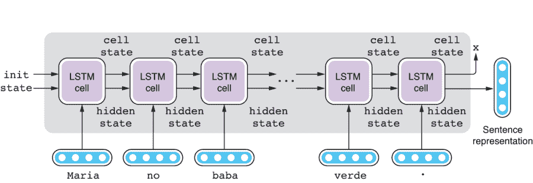

图 6.11 使用 LSTM 单元的编码器

### 6.4.2 解码器

同样，Seq2Seq 模型的解码器与我们在第五章中介绍的语言模型类似。实际上，它们除了一个关键的区别外完全相同——解码器从编码器那里获取输入。我们在第五章中介绍的语言模型称为*无条件语言模型*，因为它们在没有任何输入或前提条件的情况下生成语言。另一方面，根据某些输入（条件）生成语言的语言模型称为*条件语言模型*。Seq2Seq 解码器是一种条件语言模型，其中条件是编码器生成的句子表示。请参见图 6.12，了解 Seq2Seq 解码器的工作原理的示例。

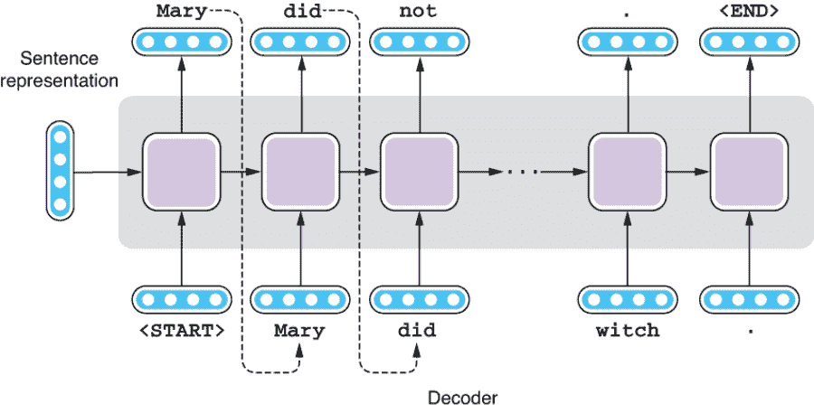

图 6.12 Seq2Seq 模型的解码器

就像语言模型一样，Seq2Seq 解码器从左到右生成文本。与编码器一样，您可以使用 RNN 来实现这一点。解码器也可以是多层 RNN。然而，解码器不能是双向的——你不能从两边生成一个句子。正如第五章中提到的那样，对过去生成的序列进行操作的模型被称为*自回归模型*。

非自回归模型

如果你认为简单地从左到右生成文本太过受限制，那么你有道理。人类也不总是线性地写语言——我们经常在之后修订、添加和删除单词和短语。此外，线性地生成文本并不是很高效。句子的后半部分需要等待直到它的前半部分完成，这使得并行化生成过程非常困难。截至本文撰写时，研究人员正在大力开发非自回归的机器翻译模型，这些模型不会以线性方式生成目标句子（例如，请参阅 Salesforce Research 的这篇论文：[`arxiv.org/abs/1711.02281`](https://arxiv.org/abs/1711.02281)）。然而，它们在翻译质量上还没有超过自回归模型，大多数研究和生产的机器翻译系统仍然采用自回归模型。

解码器在训练阶段和预测阶段的行为略有不同。让我们先看看它是如何训练的。在训练阶段，我们确切地知道源句应该被翻译成目标句。换句话说，我们确切地知道解码器应该逐词生成什么。因此，解码器的训练方式与顺序标记模型的训练方式相似（参见第五章）。

首先，解码器被喂入由编码器产生的句子表示和一个特殊标记<START>，该标记表示句子的开始。 第一个 RNN 单元处理这两个输入并产生第一个隐藏状态。 隐藏状态向量被馈送到一个线性层，该层收缩或扩展此向量以匹配词汇表的大小。 然后得到的向量通过 softmax，将其转换为概率分布。 此分布规定了词汇表中每个单词在接下来出现的可能性。  

然后，这就是训练发生的地方。 如果输入是“Maria no daba una bofetada a la bruja verde”，那么我们希望解码器生成其英文等效句子：“Mary did not slap the green witch.” 这意味着我们希望最大化第一个 RNN 单元生成“Mary”的概率，给定输入句子。 这是本书中我们在很多地方见过的一个多类别分类问题——词嵌入（第三章），句子分类（第四章）和序列标记（第五章）。 您使用交叉熵损失来衡量期望结果与网络实际输出之间的差距有多远。 如果“Mary”的概率很大，那么好——网络会产生较小的损失。 另一方面，如果“Mary”的概率很小，则网络会产生较大的损失，这会鼓励优化算法大幅更改参数（魔法常量）。

然后，我们移动到下一个单元。 下一个单元接收由第一个单元计算的隐藏状态和单词“Mary”，*不管第一个单元生成了什么*。 与使用语言模型生成文本时喂入先前单元生成的标记不同，我们约束解码器的输入，以防止其“偏离”。 第二个单元基于这两个输入产生隐藏状态，然后用于计算第二个单词的概率分布。 我们通过将分布与期望输出“did”进行比较来计算交叉熵损失，并继续移动到下一个单元。 我们一直这样做，直到达到最终标记，即<END>。 句子的总损失是句子中所有单词产生的所有损失的平均值，如图 6.13 所示。

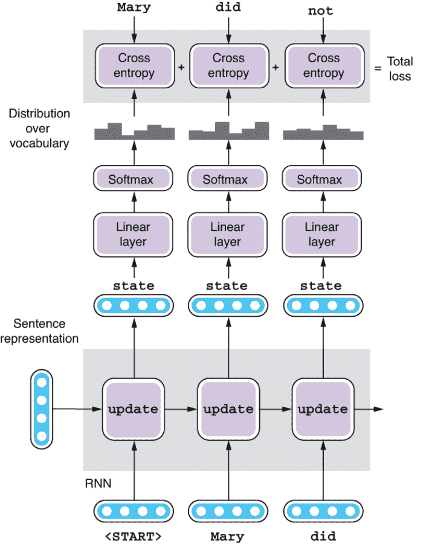

图 6.13 训练 Seq2Seq 解码器

最后，以这种方式计算的损失用于调整解码器的模型参数，以便下一次它能生成期望的输出。 请注意，在此过程中也会调整编码器的参数，因为损失通过句子表示一直传播回编码器。 如果编码器产生的句子表示不好，那么解码器无论如何努力，都无法生成高质量的目标句子。

### 6.4.3 贪婪解码

现在让我们看看解码器在预测阶段的行为，其中给定了一个源句子给网络，但我们不知道正确的翻译应该是什么。在这个阶段，解码器的行为很像我们在第五章讨论过的语言模型。它被提供了由编码器产生的句子表示，以及一个特殊的标记<START>，表示句子的开头。第一个循环神经网络单元处理这两个输入并产生第一个隐藏状态，然后将其馈送到线性层和 softmax 层，以产生目标词汇的概率分布。关键部分来了——与训练阶段不同，你不知道接下来应该出现的正确单词，所以你有多个选项。你可以选择任何一个具有相当高概率的随机单词（比如“dog”），但最好的选择可能是选择概率最高的单词（如果是“Mary”那就太幸运了）。机器翻译系统生成刚刚选择的单词，然后将其馈送到下一个循环神经网络单元。这个过程重复进行，直到遇到特殊标记<END>。图 6.14 说明了这个过程。

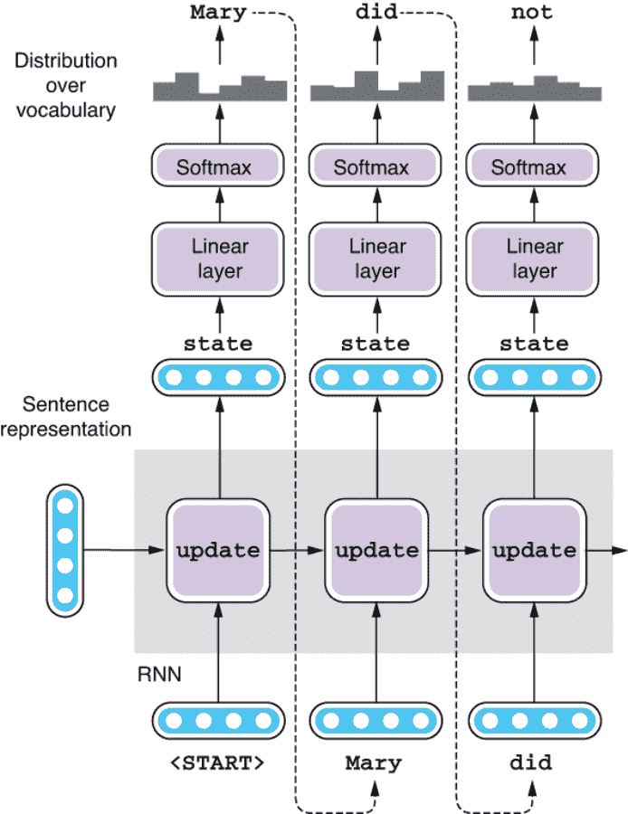

图 6.14 使用 Seq2Seq 解码器进行预测

好的，我们都准备好了吗？我们可以继续评估我们的机器翻译系统了吗，因为它正在尽其所能产生最佳的翻译？不要那么快——在这种方式解码目标句子时可能会出现许多问题。

首先，机器翻译解码的目标是最大化整个目标句子的概率，而不仅仅是单个单词。这正是你训练网络要做的事情——为正确的句子产生最大的概率。然而，前面描述的每一步选择单词的方式是为了最大化该单词的概率。换句话说，这种解码过程只保证了局部最大概率。这种短视、局部最优的算法在计算机科学中被称为*贪婪*，我刚刚解释的解码算法被称为*贪婪解码*。然而，仅仅因为你在每一步都在最大化单词的概率并不意味着你在最大化整个句子的概率。一般来说，贪婪算法不能保证产生全局最优解，而使用贪婪解码可能会让你陷入次优翻译的困境。这并不是很直观，所以让我用一个简单的例子来说明这一点。

当你在每个时间步选择单词时，你有多个单词可以选择。你选择其中一个然后移动到下一个循环神经网络单元，它会产生另一组可能选择的单词，这取决于你之前选择的单词。这可以用一个树状结构来表示，就像图 6.15 所示的那样。该图显示了你在一个时间步选择的单词（例如“did”）如何分支到下一个时间步可以选择的一组可能单词（“you”和“not”）。

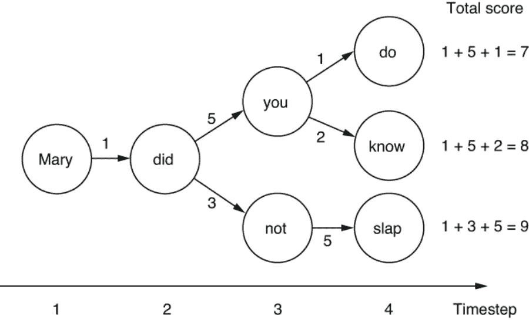

图 6.15 解码决策树

每个单词到单词的转换都加上了一个分数，该分数对应于选择该转换的概率有多大。你的目标是在从时间步 1 到 4 遍历一条路径时最大化得分的总和。在数学上，概率是 0 到 1 之间的实数，并且你应该将（而不是相加）每个概率相乘以获得总数，但我在这里简化了问题。例如，如果你从“Mary”到“did”，然后到“you”和“do”，你刚生成了一个句子“Mary did you do”，总分是 1 + 5 + 1 = 7。

在之前看到的贪婪解码器生成时间步 2 的“did”后，它将面临两个选择：用 5 分数生成“you”或用 3 分数生成“not”。因为它只是选择得分最高的那个，它会选择“you”并继续前进。然后在时间步 3 之后，它将面临另一个分支——用 1 分数生成“do”或用 2 分数生成“know”。同样，它将选择最大的分数，这样你就会得到“Mary did you know”的翻译，其分数为 1+ 5 + 1 = 8。

这并不是一个坏结果。至少，它不像第一条路径一样糟糕，它的总得分为 7。通过在每个分支上选择最大分数，你确保你的最终结果至少是像样的。然而，如果你在时间步 3 选择了“not”呢？乍一看，这似乎不是个好主意，因为你得到的分数只有 3，比你走另一条路径的 5 小。但在下一个时间步，通过生成“slap”，你得到了 5 分的分数。回顾起来，这是正确的决定——总体而言，你得到了 1 + 3 + 5 = 9 分，这比沿着另一个“you”路径得到的分数要高。通过牺牲短期回报，你能够在长期获得更大的回报。但是由于贪婪解码器的近视性质，它永远不会选择这条路径——它无法回溯并改变其心意，一旦选择了一条而不是另一条路径。

如果看一下图 6.15 中的玩具示例，选择哪个方向以最大化总分数似乎很容易，但在现实中，你不能“预见”未来——如果你处于时间步 t，你无法预测在时间步 t + 1 及以后会发生什么，直到你实际选择一个单词并将其馈送到 RNN 中为止。但是，最大化单个概率的路径不一定是最优解。你无法尝试每个可能的路径并查看你得到的分数，因为词汇表通常包含成千上万个独特的单词，这意味着可能的路径数呈指数增长。

令人沮丧的事实是，您无法合理地期望在短时间内找到最大化整个句子概率的最优解路径。但是你可以避免陷入困境（或至少减少陷入困境的可能性），这就是梁搜索解码器的作用。

### 6.4.4 梁搜索解码

让我们想象如果你处于同样的情境下应该怎么做。假设你是一名大学大二的学生，在本学年结束前，你需要决定选择哪个专业。你的目标是在你一生中最大化收入（或幸福或其他你关心的东西），但你不知道哪个专业对于这一目标来说是最好的。你不能尝试每个可能的专业并观察几年后的结果——专业太多，你也无法回到过去。并且仅仅因为有些专业在短期内看起来很有吸引力（例如选择经济学专业可能会带来在大型投资银行的好实习机会），并不意味着这条道路在长期来看是最好的（请看 2008 年发生了什么）。

在这种情况下，你可以做的一件事是通过同时选择多个专业（双专业或辅修）而不是 100%致力于特定的专业，来进行投机。几年后，如果情况与你想象的不同，仍然可以更改主意并追求另一种选择，如果你贪婪地选择专业（即只考虑短期前景），则这是不可能的。

梁搜索解码的主要思想类似于这个——不是只选择一条路径，而是同时追求多条路径（称为*假设*）。这样，你就为“黑马”留下了一些空间，也就是那些在最初得分不高但可能后来表现出色的假设。让我们使用图 6.16 中的示例，这是图 6.15 的略微修改版本。

梁搜索解码的关键思想是使用*梁*（图 6.16 底部），可以将其看作是一种缓冲区，可以同时保留多个假设。梁的大小，即它可以保持的假设数，称为*梁宽度*。让我们使用大小为 2 的梁并看看会发生什么。最初，你的第一个假设只包含一个词“Mary”，得分为 0。当你转向下一个单词时，你选择的单词被附加到假设中，并且得分增加了你刚刚走过的路径的得分。例如，当你转到“did”时，它会生成一个新的假设，包含“Mary did”和得分 1。

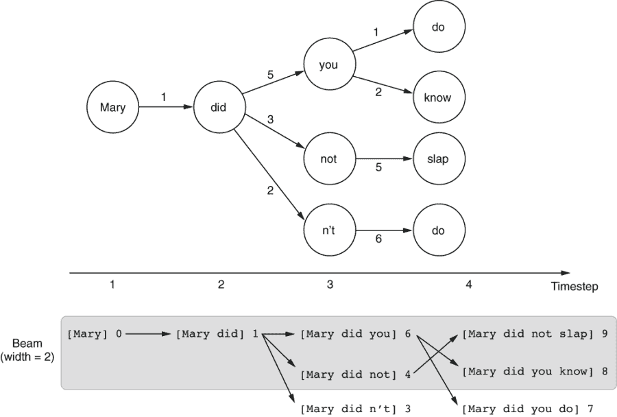

图 6.16 梁搜索解码

如果在任何特定时间步有多个词可供选择，假设可能会产生多个子假设。在时间步 2，你有三个不同的选择——“你”，“不”和“n’t”——这会生成三个新的子假设：[Mary did you] (6)，[Mary did not] (4) 和 [Mary did n’t] (3)。这就是束搜索解码的关键部分：因为束中只有有限的空间，任何不够好的假设在按分数排序后都会从束中掉下来。因为在这个例子中束只能容纳两个假设，除了前两个以外的任何东西都会被挤出束外，这就留下了[Mary did you] (6)和[Mary did not] (4)。

在时间步 3，每个剩余的假设可以产生多达两个子假设。第一个（[Mary did you] (6)）将生成[Mary did you know] (8)和[Mary did you do] (7)，而第二个（[Mary did not] (4)）会变成[Mary did not slap] (9)。这三个假设按分数排序，最好的两个将作为束搜索解码的结果返回。

恭喜——现在你的算法能够找到最大化总分数的路径。通过同时考虑多个假设，束搜索解码可以增加你找到更好解决方案的机会。然而，它永远不是完美的——注意，一个同样好的路径[Mary did n’t do]，得分为 9，在时间步 3 就从束中掉出来了。要“拯救”它，你需要增加束宽度到 3 或更大。一般来说，束宽度越大，翻译结果的期望质量就越高。然而，这是有一个折衷的：因为计算机需要考虑多个假设，随着束宽度的增加，它会线性变慢。

在 Fairseq 中，你可以使用 —beam 选项来改变束大小。在第 6.3.3 节的示例中，我使用了 —beam 5 来使用束宽度为 5。你已经在不知不觉中使用了束搜索。如果你使用相同的命令调用 —beam 1，这意味着你使用的是贪婪解码而不是束搜索，你可能会得到略有不同的结果。当我尝试这样做时，我得到的结果几乎相同，除了最后一个：“counts, please”，这不是“La cuenta, por favor.” 的一个很好的翻译。这意味着使用束搜索确实有助于提高翻译质量！

## 6.5 评估翻译系统

在这一节中，我想简要谈谈评估机器翻译系统的话题。准确评估机器翻译系统是一个重要的话题，无论在理论上还是在实践中。

### 6.5.1 人工评估

评估机器翻译系统输出的最简单、最准确的方法是使用人工评估。毕竟，语言是为人类翻译的。被人类认为好的翻译应该是好的。

正如之前提到的，我们对好的翻译有一些考虑因素。对于这两个方面最重要且常用的概念是充分性(也称为忠实度)和流畅性(也与可理解性密切相关)。充分性是源句子中的信息在翻译中反映的程度。如果通过阅读它的翻译，你可以重构源句子表达的大量信息，那么该翻译具有很高的充分性。流畅性则是翻译在目标语言中的自然程度。例如，如果你正在翻译为英语，“Mary did not slap the green witch”是一种流畅的翻译，而“Mary no had a hit with witch, green”则不是，尽管这两种翻译几乎是同样充分的。请注意，这两个方面在某种程度上是独立的-你可以想象一种流畅但不充分的翻译(例如，“Mary saw a witch in the forest”是一种完全流畅但不充分的翻译)，反之亦然，就像之前的例子一样。能够产生既充分又流畅输出的 MT 系统是有价值的。

MT 系统通常通过将其翻译呈现给人类注释器并要求他们对其每个方面进行 5 或 7 点的评价来进行评估。流畅性更容易判断，因为它只需要目标句子的单语种听众，而充分性需要源语言和目标语言的双语种人员。

### 6.5.2 自动评估

尽管人工评估给出了 MT 系统质量的最准确评估，但并不总是可行的。在大多数情况下，你可能无法负担雇用人类评估员以在你需要时评估 MT 系统的输出。如果你处理的是不常见的语言对，你可能根本找不到双语的说话者来评估其充分性。

但更重要的是，在开发 MT 系统时需要不断地评估和监测其质量。例如，如果你使用 Seq2Seq 模型去训练一个 NMT 系统，你需要每次调整一个超参数就重新评估其性能。否则，你就不知道你的更改对它的最终性能是否有好或坏的影响。更糟糕的是，如果你要做像“early stopping”(见第 6.3.2 节)这样的事情来决定何时停止训练过程，你需要在每个周期之后评估它的性能。你不可能雇用人来在每个周期评估你的中间模型-这将是开发 MT 系统的一个可怕的缓慢的方法。这也是浪费时间，因为最初模型的输出在很大程度上是垃圾，不值得人类评估。中间模型的输出之间存在大量的相关性，人类评估员将花费大量的时间评估非常相似甚至相同的句子。

因此，如果我们能够使用某种自动方式来评估翻译质量，将是可取的。这种工作方式类似于我们之前看到的其他 NLP 任务的一些自动度量，例如分类的准确度、精确度、召回率和 F1 度量。其思想是提前为每个输入实例创建期望的输出，并将系统的输出与之进行比较。通常，这是通过为每个源句准备一组人为创建的翻译（称为*参考*）并计算参考和系统输出之间的某种相似度来完成的。一旦你创建了参考并定义了指标，你就可以根据需要自动评估翻译质量多少次。

计算参考和系统输出之间相似度的最简单方法之一是使用*单词错误率*（WER）。WER 反映系统相对于参考的错误数量，通过插入、删除和替换的相对数量来衡量。该概念类似于编辑距离，不同之处在于 WER 是针对单词而不是字符计数的。例如，当参考句子是“玛丽没有打绿色的女巫”，系统翻译为“玛丽打了绿色的邪恶女巫”时，你需要进行三次“编辑”才能将后者与前者匹配——插入“没有”，用“打”替换“击中”，删除“邪恶”。如果你将三除以参考长度（= 7），就是你的 WER（= 3/7，或 0.43）。WER 越低，翻译质量越好。

尽管 WER 简单易用，但在评估机器翻译系统时如今并不常用。一个原因与多个参考有关。对于单个源句可能有多个同样有效的翻译，但是当存在多个参考时如何应用 WER 并不清楚。对于机器翻译中自动评估最常用的稍微复杂一点的指标是 BLEU（双语评估学习）。BLEU 通过使用*修改后的精确度*来解决多个参考的问题。接下来我将用一个简单的例子来说明这一点。

在以下表格中，我们评估一个候选人（系统的输出）“the the the the the the the”（顺便说一句，这是一个糟糕的翻译）与两个参考：“猫在地毯上”和“地毯上有只猫”。BLEU 的基本思想是计算候选中所有唯一单词的精度。因为候选中只有一个唯一单词“the”，如果计算其精度，它将自动成为候选的分数，即为 1，或 100%。但这似乎有些不对。

| 候选 | the | the | the | the | the | the | the |
| --- | --- | --- | --- | --- | --- | --- | --- |
| 参考 1 | 猫 | 在 | 地毯 | 上 |  |
| 参考 2 | 那里 | 有 | 一只 | 猫 | 在 | 地毯 | 上 |

因为参考译文中只有两个“the”，系统生成的虚假“the”不应该计入精度。换句话说，我们应该将它们视为误报。我们可以通过将精度的分母限制为参考译文中该词的最大出现次数来做到这一点。因为在这种情况下（在参考译文 1 中）是 2，其修改后的精度将为 2/7，约为 29%。在实践中，BLEU 不仅使用唯一的词（即一元词），还使用候选译文和参考译文中长度不超过 4 的所有唯一单词序列（n 元词）。

然而，我们可以通过另一种方式操纵这个指标——因为它基于精度而不是召回率，一个机器翻译系统可以通过产生很少的系统确信的词语来轻松获得高分。在前面的例子中，你只需简单地产生“cat”（甚至更简单地，“the”），BLEU 分数将达到 100%，这显然不是一个好的翻译。BLEU 通过引入简洁惩罚来解决这个问题，如果候选翻译比参考译文短，就会打折扣。

精确自动评估指标的开发是一个活跃的研究领域。许多新的指标被提出并用于解决 BLEU 的缺点。我们在这一部分只是浅尝辄止。虽然新的指标显示与人类评估的相关性更高，并声称更好，但 BLEU 仍然是目前最广泛使用的指标，主要是因为其简单性和悠久的传统。

## 6.6 案例研究：构建聊天机器人

在本节中，我将讨论 Seq2Seq 模型的另一个应用——聊天机器人，这是一种 NLP 应用，你可以与之进行对话。我们将使用 Seq2Seq 模型构建一个非常简单但功能齐全的聊天机器人，并讨论构建智能代理的技术和挑战。

### 6.6.1 引入对话系统

我在第 1.2.1 节简要介绍了对话系统。简而言之，主要有两种类型的对话系统：面向任务和聊天机器人。尽管面向任务的对话系统用于实现一些特定目标，例如在餐厅预订和获取一些信息，但聊天机器人用于与人类进行对话。由于商业对话人工智能系统如亚马逊 Alexa、苹果 Siri 和谷歌助手的成功和大量普及，对话技术目前是自然语言处理从业者的热门话题。

您可能不知道如何开始构建可以进行会话交流的自然语言处理应用程序。我们该如何构建一个“智能”的东西来“思考”，以便它能为人类输入生成有意义的响应？这似乎有些遥远和困难。但是，如果您退后一步，看看我们与其他人的典型对话，有多少实际上是“智能”的呢？如果您像我们大多数人一样，那么您正在进行的会话中有很大一部分都是自动驾驶的：“你好吗？”“我没事，谢谢”“祝你有个愉快的一天”“你也是！”等等。您可能还有一组“模板”回复，对于许多日常问题，例如“你在干什么？”和“你来自哪里？”这些问题可以通过查看输入来回答。甚至更复杂的问题，如“X 中你最喜欢的餐厅是什么？”（其中 X 是您城市的一个地区的名称）和“你最近看过任何 Y 类型的电影吗？”（其中 Y 是一种类型），都可以通过“模式匹配”并从记忆中检索相关信息来回答。

如果您将对话视为一组“回合”，其中响应是通过模式匹配来生成的，那么这看起来与典型的自然语言处理问题非常相似。特别是，如果您认为对话是一个问题，其中 NLP 系统只是将您的问题“翻译”为其响应，那么这正是我们可以使用本章迄今涵盖的 Seq2Seq 模型的地方。我们可以将之前（人类的）话语视为外国语句子，并将聊天机器人“翻译”成另一种语言。尽管在这种情况下，这两种语言都是英语，但是在 NLP 中，通常将输入和输出视为两种不同的语言，并将 Seq2Seq 模型应用于它们，包括摘要（将更长的文本缩短）和语法纠错（将有错误的文本纠正为无错误的文本）。

### 6.6.2 准备数据集

在本案例中，我们将使用自我对话语料库（[`github.com/jfainberg/self_dialogue_corpus`](https://github.com/jfainberg/self_dialogue_corpus)），其中包含 24,165 个对话。这个数据集的特殊之处在于，这些对话并不是两个人之间的实际对话，而是由一人扮演双方所写的虚构对话。虽然还有其他几个基于文本的聊天机器人的对话数据集（例如 OpenSubtitles 数据集，[`opus.nlpl.eu/OpenSubtitles-v2018.php`](http://opus.nlpl.eu/OpenSubtitles-v2018.php)），但这些数据集通常存在噪声并且常常包含粗言秽语。相比之下，通过收集编造的对话，自我对话语料库在仅有一人的情况下提高了一半的质量（因为你只需要一个人而不是两个人！）。

与之前相同，我对语料进行了分词和转换，使其可被 Fairseq 解读。您可以按以下方式获取转换后的数据集：

```py
$ mkdir -p data/chatbot
$ wget https://realworldnlpbook.s3.amazonaws.com/data/chatbot/selfdialog.zip
$ unzip selfdialog.zip -d data/chatbot
```

您可以使用以下 paste 命令的组合（以水平方式拼接文件）和 head 命令来查看训练部分的开头。请注意，我们使用 fr（表示“外语”，而不是“法语”）来表示我们正在从中翻译的“语言”：

```py
$ paste data/chatbot/selfdialog.train.tok.fr data/chatbot/selfdialog.train.tok.en | head 
...
Have you played in a band ?    What type of band ?
What type of band ?    A rock and roll band .
A rock and roll band .    Sure , I played in one for years .
Sure , I played in one for years .    No kidding ?
No kidding ?    I played in rock love love .
I played in rock love love .    You played local ?
You played local ?    Yes
Yes    Would you play again ?
Would you play again ?    Why ?
...
```

如您所见，每一行都包含一个话语（在左侧）和对其的回应（在右侧）。请注意，此数据集与我们在第 6.3.1 节中使用的西班牙语-英语平行语料库具有相同的结构。下一步是运行 fairseq-preprocess 命令将其转换为二进制格式，如下所示：

```py
$ fairseq-preprocess \
    --source-lang fr \
    --target-lang en \
    --trainpref data/chatbot/selfdialog.train.tok \
    --validpref data/chatbot/selfdialog.valid.tok \
    --destdir data/chatbot-bin \
    --thresholdsrc 3 \
    --thresholdtgt 3
```

再次，这与我们为西班牙语翻译器示例运行的内容类似。只需注意您指定的源语言—我们在这里使用的是 fr 而不是 es。

### 6.6.3 训练和运行聊天机器人

现在，聊天机器人的训练数据准备好了，让我们从这些数据中训练一个 Seq2Seq 模型。您可以像下面这样调用 fairseq-train 命令，几乎使用与上次相同的参数：

```py
$ fairseq-train \
    data/chatbot-bin \
    --arch lstm \
    --share-decoder-input-output-embed \
    --optimizer adam \
    --lr 1.0e-3 \
    --max-tokens 4096 \
    --save-dir data/chatbot-ckpt
```

与先前一样，请注意验证损失随每个时代的变化。当我尝试时，验证损失在约五个时代内减小，然后开始缓慢上升。在观察到验证损失趋于稳定后，随时按 Ctrl + C 停止训练命令。Fairseq 将自动将最佳模型（按验证损失测量）保存为 checkpoint_best.pt。

最后，您可以通过调用 fairseq-interactive 命令来运行聊天机器人模型，如下所示：

```py
$ fairseq-interactive \
    data/chatbot-bin \
    --path data/chatbot-ckpt/checkpoint_best.pt \
    --beam 5 \
    --source-lang fr \
    --target-lang en
```

与前面的示例一样，您可以输入源句并与聊天机器人对话，让它将它们“翻译”为另一种语言！以下是我与我训练的模型进行的一部分对话（为了清晰起见，我添加了粗体）。再次强调，您的结果可能不同：

```py
Hi !
S-0     Hi !
H-0     -1.011711835861206      Hey .
P-0     -0.6860 -2.1352 -0.2140
How are you ?
S-1     How are you ?
H-1     -0.6552960276603699     Doing good , you ?
P-1     -0.6472 -0.8651 -1.0960 -0.9257 -0.3337 -0.0640
Good .
S-2     Good .
H-2     -0.8540937900543213     Do you have a favorite team ?
P-2     -2.3027 -0.0550 -1.7088 -0.4403 -0.1763 -2.0262 -0.1150 -0.0085
Yeah I like the Seahawks .
S-3     Yeah I like the Seahawks .
H-3     -0.6036218404769897     Do you have a favorite team ?
P-3     -2.7614 -0.0525 -1.0905 -0.3178 -0.3213 -0.1049 -0.1701 -0.0106
How about you ?
S-4     How about you ?
H-4     -1.2329542636871338     I 'm a big fan of them .
P-4     -0.7648 -1.8435 -1.6808 -1.2868 -0.2102 -0.1362 -3.5273 -1.0031 -0.6438
What 's your favorite movie ?
S-5     What 's your favorite movie ?
H-5     -0.8238655924797058     Oh , that 's a tough one . I 'd have to say Ghost Busters .
P-5     -3.2622 -0.3213 -1.4815 -0.1012 -0.3417 -0.3069 -0.2432 -0.6954 -1.0858 -2.3246 -0.4296 -0.0039 -0.0905 -2.6429 -0.1676 -0.3853 -0.1221
Oh yeah , I like that movie too .
S-6     Oh yeah , I like that movie too .
H-6     -1.0659444332122803     Yeah , that 's a good one .
P-6     -2.0782 -0.1724 -2.5089 -0.9560 -1.5034 -0.9040 -0.4471 -0.5435 -0.4801
```

在这个例子中，对话看起来很自然。因为自我对话语料库是通过限制可能的对话主题集来构建的，所以如果您保持在这些主题（电影、体育、音乐等）上，对话更有可能顺利进行。

然而，一旦您开始谈论不熟悉的话题，聊天机器人就会对其答案失去信心，如下所示：

```py
What 's your name ?
S-0     What 's your name ?
H-0     -0.9807574152946472 I do n't know , but I do n't think I 've                           heard of them .
P-0     -1.4680 -2.2938 -0.0635 -1.0242 -1.2039 -0.5201 -0.3381 -2.2612 -0.1665 -1.6033 -0.6112 -1.5515 -0.8739 -0.8453 -1.0143 -0.4702 -0.3637
What do you do ?
S-1     What do you do ?
H-1     -1.170507788658142 I do n't know .
P-1     -0.9807 -2.1846 -0.3276 -0.9733 -1.3650 -1.1919
Are you a student ?
S-2     Are you a student ?
H-2     -0.9505285024642944 I 'm not sure .
P-2     -1.5676 -1.5270 -0.6944 -0.2493 -0.8445 -0.8204
```

这是一个众所周知的现象—一个简单的基于 Seq2Seq 的聊天机器人很快就会退化到生成“我不知道”和“我不确定”等模板回答，每当被问及它不熟悉的事物时。这与我们训练这个聊天机器人的方式有关。因为我们训练模型是为了使其在训练数据中最小化损失，它能采取的最佳策略是生成适用于尽可能多的输入句子的东西。非常通用的短语，比如“我不知道”，可以成为许多问题的答案，所以这是一个安全的策略，可以减少损失！

### 6.6.4 后续步骤

虽然我们的聊天机器人可以为许多输入产生逼真的响应，但它离完美还有很远的路要走。它处理不好的一个问题是专有名词。当你询问需要具体答案的问题时，就会看到这一点，比如：

```py
What 's your favorite show ?
S-0     What 's your favorite show ?
H-0     -0.9829921722412109     I would have to say <unk> .
P-0     -0.8807 -2.2181 -0.4752 -0.0093 -0.0673 -2.9091 -0.9338 -0.3705
```

这里，<unk>是未知词的通用特殊符号。聊天机器人正在尝试回答某些问题，但该问题在训练数据中出现的频率太低，以至于不能被视为独立的词。这是一般简单 NMT 系统中出现的问题。因为模型需要将有关单词的所有信息压缩成 200 多维的数字向量，所以许多细节和类似单词之间的区别都被牺牲了。想像一下将关于你所在城市所有餐厅的信息压缩成一个 200 维的向量！

此外，我们训练的聊天机器人没有任何 "记忆" 或任何上下文概念。你可以通过问一系列相关问题来测试这一点，如下所示：

```py
Do you like Mexican food ?
S-0     Do you like Mexican food ?
H-0     -0.805641770362854      Yes I do .
P-0     -1.0476 -1.1101 -0.6642 -0.6651 -0.5411
Why do you like it ?
S-1     Why do you like it ?
H-1     -1.2453081607818604     I think it 's a great movie .
P-1     -0.7999 -2.1023 -0.7766 -0.7130 -1.4816 -2.2745 -1.5750 -1.0524 -0.4324
```

在第二个问题中，聊天机器人在理解上下文方面有困难，并产生了完全无关的响应。要正确回答这样的问题，模型需要理解代词 "it" 指的是前面的名词，即本例中的 "Mexican food"。NLP 系统在现实世界中解决哪些提及指向哪些实体的任务被称为*共指消解*。系统还需要维护某种类型的记忆，以跟踪到目前为止在对话中讨论了哪些内容。

最后，在本章中讨论的简单 Seq2Seq 模型在处理长句子方面并不擅长。如果您回顾一下图 6.2，就会理解这一点 - 模型使用 RNN 读取输入语句，并使用固定长度的句子表示向量表示有关句子的所有内容，然后从该向量生成目标语句。无论输入是“Hi！”还是“The quick brown fox jumped over the lazy dog.”，句子表示都会成为瓶颈，特别是对于更长的输入。因此，在 2015 年左右，直到发明了一种称为 *注意力* 的机制来解决这个问题之前，神经 MT 模型无法击败传统的基于短语的统计 MT 模型。我们将在第八章详细讨论注意力。

## 概括

+   Seq2Seq 模型使用编码器和解码器将一个序列转换为另一个序列。

+   你可以使用 fairseq 框架在一小时内构建工作中的翻译系统。

+   Seq2Seq 模型使用解码算法生成目标序列。贪心解码每一步都最大化概率，而束搜索则尝试同时考虑多个假设来寻找更好的解决方案。

+   用于自动评估翻译系统的一个指标叫做 BLEU。

+   通过使用 Seq2Seq 模型和对话数据集，可以构建一个简单的聊天机器人。

^(1.) 详细信息请参阅 Oriol Vinyals 等人的“Grammar as a Foreign Language”（2015 年；[`arxiv.org/abs/1412.7449`](https://arxiv.org/abs/1412.7449)）。

^(2.) 请注意每行开头的 $ 是由 shell 渲染的，您无需输入它。
