# 第七章：卷积神经网络

本章内容包括

+   通过检测模式解决文本分类问题。

+   使用卷积层来检测模式并生成分数。

+   使用池化层来聚合由卷积产生的分数。

+   通过组合卷积和池化来构建卷积神经网络（CNN）。

+   使用 AllenNLP 构建基于 CNN 的文本分类器。

在之前的章节中，我们介绍了线性层和 RNN，这是 NLP 中常用的两种主要神经网络体系结构。在本章中，我们介绍了另一种重要的神经网络类别，称为*卷积神经网络*（CNN）。CNN 具有与 RNN 不同的特征，使它们适用于检测语言模式至关重要的 NLP 任务，例如文本分类。

## 7.1 介绍卷积神经网络（CNN）

本节介绍了另一种类型的神经网络体系结构，称为卷积神经网络（CNN），它以与 RNN 不同的方式运行。CNN 特别擅长于模式匹配任务，在 NLP 社区中越来越受欢迎。

### 7.1.1 循环神经网络及其缺点。

在第四章中，我们讨论了句子分类，这是一个自然语言处理任务，接收一些文本作为输入并为其生成标签。我们还讨论了如何使用循环神经网络（RNN）来完成该任务。作为复习，RNN 是一种具有“循环”的神经网络，它从开头开始逐个元素地处理输入序列直到结束。在每一步更新的内部循环变量称为*隐藏状态*。当 RNN 完成处理整个序列时，最终时间步长处的隐藏状态表示输入序列的压缩内容，可用于包括句子分类在内的 NLP 任务。或者，您可以在每一步之后取出隐藏状态并将其用于为单词分配标签（例如 PoS 和命名实体标签）。在循环中反复应用的结构称为*单元*。具有简单乘法和非线性的 RNN 称为*香草*或*埃尔曼* RNN。另一方面，基于 LSTM 和 GRU 的 RNN 使用更复杂的单元，这些单元使用存储器和门。

RNN 在现代 NLP 中是一种强大的工具，具有广泛的应用范围；但是，它们并非没有缺点。首先，RNN 速度较慢-无论如何都需要逐个元素地扫描输入序列。它们的计算复杂度与输入序列的长度成正比。其次，由于它们的顺序性质，RNN 难以并行化。想象一个多层 RNN，其中多个 RNN 层堆叠在一起（如图 7.1 所示）。在朴素实现中，每一层都需要等到所有下面的层完成对输入的处理。

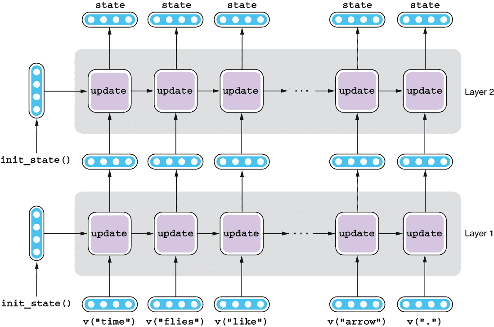

图 7.1 多层 RNN

其次，对于某些任务，RNN 结构过于复杂和低效。例如，在第四章中我们讲解了检测符合语法的句子的任务。在最简单的形式下，任务是在一个两个词组成的句子中识别主谓一致性的正确与否。如果句子包含诸如“I am”和“you are”之类的短语，那么它是符合语法的。如果包含“I are”或“you am”，那么就不符合语法。在第四章，我们构建了一个简单的带非线性的 LSTM-RNN 来识别有四个单词词汇量的两个词组成句子的语法正确性。但是，如果你需要对一个词汇量非常大的任意长度的句子进行分类，这个过程就开始变得非常复杂了。你的 LSTM 需要从大量的噪声（与一致性无关的其他单词和短语）中识别出信号（主谓一致性），同时学习使用更新操作来处理输入的每一个元素。

但是如果你仔细考虑，无论句子有多长或者词汇量有多大，你的网络的任务应该还是相当简单——如果句子包含有效的短语（如“I am”和“you are”），那么它符合语法。否则，不符合语法。实际上，这个任务与我们在第一章中看到的“如果-那么”情感分析器非常相似。很明显，LSTM RNN 的结构对于这个任务来说过于复杂，简单的文字和短语模式匹配就足够了。

### 7.1.2 句子分类的模式匹配

如果你看一下文本分类的一般情况，很多任务可以通过“模式匹配”来有效解决。以垃圾邮件过滤为例：如果你想要检测垃圾邮件，只需要查找像“v1agra”和“商机”这样的词语和短语，甚至不需要读完整封邮件；这些模式出现在什么地方并不重要。如果你想要从电影评论中检测情感，检测到像“amazing”和“awful”这样的积极和消极词语就足够了。换句话说，学习和检测这种本地语言模式，而不考虑它们的位置，对于文本分类任务是一种有效而高效的策略，也可能对其他自然语言处理任务有效。

在第三章，我们学习了 n 元语法的概念，即一个或多个词的连续序列。它们经常被用作自然语言处理中更正式定义的语言单位（如短语和从句）的代理。如果有一种工具能够遍历大量的文本噪声并检测作为信号的 n 元语法，那将非常适合文本分类。

### 7.1.3 卷积神经网络（CNNs）

卷积神经网络（CNN）正是做到这一点的。CNN 是一种神经网络类型，它涉及一种称为*卷积*的数学运算，简单来说，它检测有用于当前任务的局部模式。CNN 通常由一个或多个卷积层和一个或多个池化层组成，卷积层进行卷积操作，池化层负责聚合卷积结果。请参见图 7.2。分别在第 7.2 节和第 7.3 节中详细介绍卷积层和池化层。

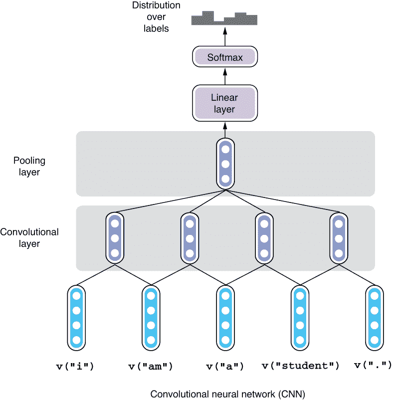

图 7.2 卷积神经网络

CNN 受到人脑视觉系统的启发，在计算机视觉任务（如图像分类和目标检测）中被广泛使用。近年来，CNN 的使用在自然语言处理领域越来越流行，特别是在文本分类、序列标注和机器翻译等任务中。

## 7.2 卷积层

在本节中，我们将讨论卷积层，这是 CNN 架构的核心部分。术语*卷积*听起来可能有点可怕，但本质上它只是一种模式匹配。我们将使用图示和直观的例子来说明它的工作原理。

### 7.2.1 使用滤波器进行模式匹配

卷积层是 CNN 中最重要的组件。如前所述，卷积层将一种称为卷积的数学运算应用于输入向量，并产生输出。但是什么是卷积？理解卷积的严格定义需要了解线性代数，因此我们将使用类比和具体示例来理解它。想象一下，你手里拿着一个带有复杂图案的矩形玻璃块（就像你在教堂里看到的彩色玻璃），在观察它的同时将其滑动到输入序列上。如果输入模式与玻璃块的模式匹配，更多的光线透过玻璃进去，你会得到更大的输出值。如果输入模式看起来不像玻璃块的模式或者相反，你会得到更小的输出值。换句话说，你正在使用带有彩色玻璃块的道具在输入序列中寻找特定的模式。

这个类比比较模糊，所以让我们回顾一下我们在第四章中使用的语法检测的例子，并看看如何将卷积层应用到这个任务上。回顾一下，我们的神经网络接收一个包含两个词的句子作为输入，并需要区分出语法正确的序列和语法错误的序列。词汇表中只有四个词--“I”，“you”，“am”和“are”，它们由单词嵌入表示。类似地，输入句子只有四种可能性--“I am”，“I are”，“you am”和“you are”。你希望网络对前两种情况产生 1，对其他情况产生 0。请参见图 7.3 进行说明。

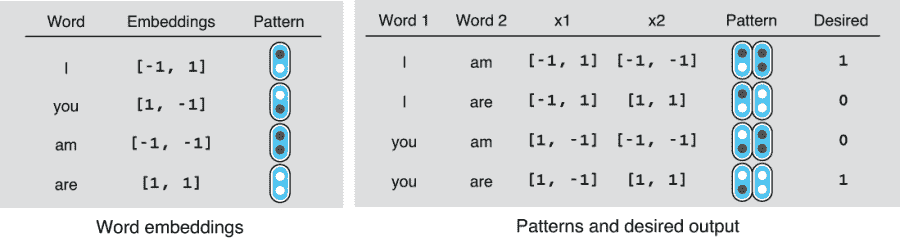

图 7.3 识别英文语法正确的句子

现在，让我们将词嵌入表示为模式。我们用黑色圆表示值-1，白色圆表示 1。然后，您可以将每个单词向量表示为两个圆的一对（请参见图 7.3 左侧的表）。同样，您可以将每个两个词的句子表示为两个向量的小“片段”，或者四个圆（请参见图 7.3 右侧的表）。我们的任务开始看起来更像是一个模式识别任务，网络需要学习对应于语法句子的黑白模式。

然后，让我们想象一个相同大小的“滤波器”（两个圆×两个圆），它充当我们之前讨论过的彩色玻璃。该滤波器的每个圆也是黑色或白色，对应值-1 和 1。您将通过这个滤波器查看一个模式，并确定是否这是您要找的模式。您可以通过将滤波器放在模式上并计算两者之间的颜色匹配数量来执行此操作。对于四个位置中的每一个，如果颜色匹配（黑色-黑色或白色-白色），则得分+1，如果不匹配（黑色-白色或白色-黑色），则得分-1。您的最终得分是四个分数的总和，从-4（无匹配）到+4（四次匹配）。请参见图 7.4 中的一些示例。

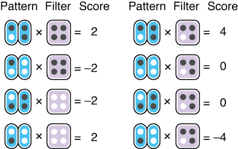

图 7.4 卷积滤波器示例

您得到的分数取决于模式和滤波器，但如图所示，当滤波器与模式相似时，分数变大，当两者不相似时，分数变小。当两者完全匹配时，您获得最大分数（4），当两者完全相反时，您获得最小分数（-4）。该滤波器充当输入的模式检测器。虽然这是一个非常简化的例子，但基本上显示了卷积层在做什么。在卷积神经网络中，这种滤波器称为*核*。

在更一般的设置中，您有一个任意长度的输入句子，并且从左到右将一个核滑过句子。请参见图 7.5 以了解此过程的示意图。该核反复应用于连续的两个词，以生成一系列分数。因为我们在这里使用的核覆盖了两个词，所以它被称为具有*大小*为 2 的核。而且，因为输入嵌入中有两个维度（称为*通道*），所以核的输入通道数量为 2。

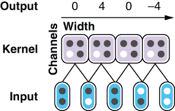

图 7.5 在输入句子上滑动核

注意 嵌入维度被称为通道的原因是因为 CNN 最常应用于计算机视觉任务，其中输入通常是不同通道的 2-D 图像，这些通道对应于不同颜色的强度（如红色、绿色和蓝色）。在计算机视觉中，核是二维的，并在输入的 2-D 图像上移动，这也被称为 *2-D 卷积*。然而，在自然语言处理中，核通常是一维的（1-D 卷积），并且只有一个尺寸。

### 7.2.2 整流线性单元（ReLU）

作为下一步，让我们考虑如何使用核来获得期望的输出（图 7.3 中的 Desired 列）。如果我们使用图 7.4 中第二列所示的滤波器会怎样？从现在开始，我们将这个核称为核 1。这个核完全匹配第一个模式并给它一个高分，同时给其他模式给出零或负分数。图 7.6 显示了将核 1 应用于每个模式时的分数（称为分数 1）。

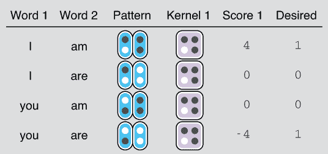

图 7.6 对模式应用核 1

现在让我们忘记分数的大小，专注于它们的符号（正数和负数）。前三个模式的符号在分数 1 和所需之间匹配，但对于最后一个模式则不是。要正确评分，即给出正分数，您需要使用另一个与最后一个模式完全匹配的滤波器。我们称这个核为核 2。图 7.7 显示了应用核 2 到每个模式时的分数（称为分数 2）。

核 2 可以为最后三个模式给出与所需符号匹配的正确分数，但不能为第一个模式。但是，如果仔细观察图 7.6 和 7.7，看起来如果有一种方法可以在核给出负分数时忽略输出，然后组合来自多个核的分数，那么就可以更接近所需的分数。

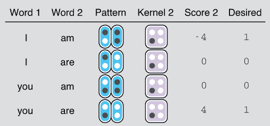

图 7.7 对模式应用核 2

让我们考虑一个函数，它将任何负输入夹紧为零，同时保持任何正值不变。在 Python 中，这个函数可以写成如下：

```py
def f(x):
    if x >= 0:
        return x
    else:
        return 0
```

或者更简单

```py
def f(x):
    return max(0, x)
```

您可以通过将此函数应用于分数 1 和分数 2 来忽略负值，如图 7.8 和 7.9 所示。

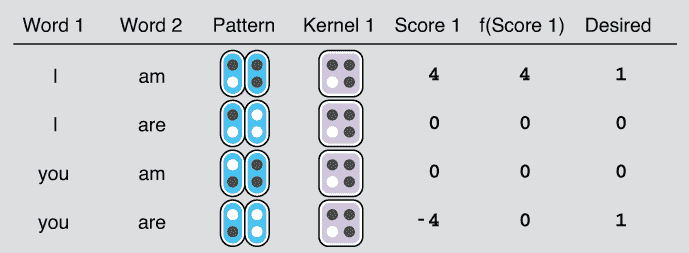

图 7.8 对分数 1 应用 ReLU

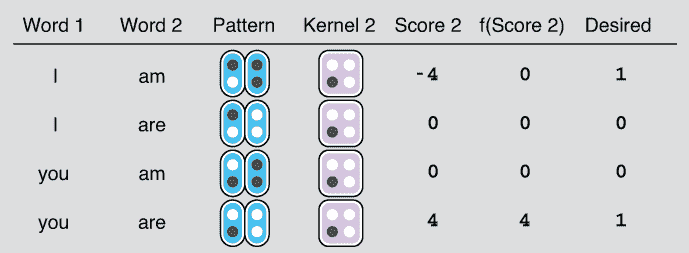

图 7.9 对分数 2 应用 ReLU

这个函数，被称为*修正线性单元*，或称为 ReLU（发音为“rel-you”），是深度学习中最简单但最常用的激活函数之一。 它通常与卷积层一起使用，虽然它非常简单（它只是将负值夹紧为零），但它仍然是一个激活函数，它使神经网络能够学习复杂的非线性函数（参见第四章，了解为什么非线性激活函数很重要）。 它还具有有利的数学属性，使得优化网络变得更容易，尽管理论细节超出了本书的范围。

### 7.2.3 合并分数

如果您查看图 7.8 和图 7.9，所谓的“固定”分数—显示在 f(Score 1) 和 f(Score 2) 列中—至少部分地捕捉到了期望的分数。 您所需做的就是将它们结合在一起（通过求和）并调整范围（通过除以 4）。 图 7.10 展示了这个结果。

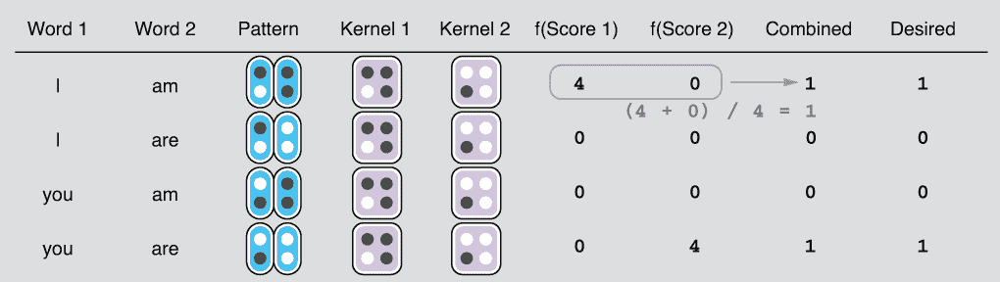

图 7.10 结合两个内核的结果

在合并之后，分数与期望的结果完全匹配。 到目前为止，我们所做的一切都是设计与我们想要检测的模式相匹配的内核，然后简单地组合分数。 比较一下我们在第 4.1.3 节中处理的 RNN 示例，那里我们需要使用一些复杂的数值计算来推导参数。 希望这个例子足以向您展示 CNN 对于文本分类可以有多简单而强大！

我们在本节中处理的示例仅用于介绍 CNN 的基本概念，因此我们偷了很多懒。 首先，在实践中，模式和内核不仅仅是黑白的，而是包含实值数字。 应用内核到模式后的分数不是通过计算颜色匹配次数得到的，而是通过一种称为*内积*的数学运算得到的，它捕捉了两者之间的相似性。 第二，内核产生的分数不是通过某种任意的操作（就像我们在本节中所做的那样）组合在一起的，而通常是通过线性层（见 3.4.3 节）组合在一起的，该线性层可以学习针对输入的线性变换以产生输出。 最后，内核和最终线性层中的权重（魔法常数 w 和 b）都是 CNN 的可训练参数，这意味着它们的值会被调整，以使 CNN 能够产生期望的分数。

## 7.3 池化层

在前一节中，我们假设输入只是两个词——主语和动词的组合，尽管在实践中，CNN 的输入可以是任意长度的。您的 CNN 不仅需要检测模式，还需要在输入中可能存在的大量噪声中找到它们。正如我们在第 7.2 节中看到的，您将一个核从左到右滑过句子，并且核会重复应用于两个连续的单词以产生一系列分数。剩下的问题是如何处理这些产生的分数。具体来说，我们应该在图 7.11 中的“？”位置使用什么操作来获得所需的分数？这个操作需要具有一些属性——它必须是可以应用于任意数量的分数的东西，因为句子可能非常长。它还需要以一种对输入句子中目标模式（“我是”的单词嵌入）的位置不可知的方式聚合分数。您能想出答案吗？

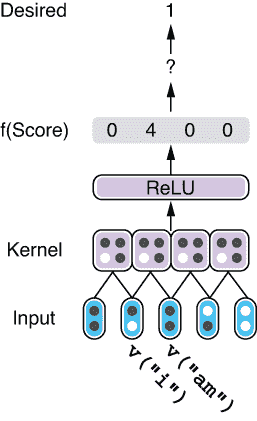

图 7.11 聚合分数以获得所需分数

汇总分数的最简单方法是取它们的最大值。因为图 7.11 中的最大分数为 4，它将成为该层的输出。这种汇总操作称为*池化*，而执行汇总的神经网络子结构称为*池化层*。您还可以执行其他类型的数学运算来进行聚合，例如取平均值，尽管最常用的是取最大值（称为*最大池化*）。

汇总分数将被馈送到一个线性层，可选地与其他核的分数结合，并用作预测分数。整个过程如图 7.12 所示。现在我们有一个完全功能的 CNN！

与我们迄今看到的其他神经网络一样，线性层的输出被馈送到 softmax 以产生标签上的概率分布。然后将这些预测值与真实标签进行比较，以产生损失并用于优化网络。

在我们结束之前，对 CNN 还有几句话：请注意，图 7.12 中的 CNN 无论搜索模式（“我是”）在输入句子中的位置如何，都会产生相同的预测值。这是由于卷积核的局部性以及我们刚刚添加的最大池化层的属性。通常情况下，即使输入句子通过移动几个单词而被修改，CNN 也会产生相同的预测。从技术上讲，CNN 被称为*变换不变*，这是 CNN 的一个重要属性。如果您使用图像识别示例，则该属性可能更直观。猫的图像仍然是猫的图像，无论猫在图像中的位置如何。同样，一个语法正确的英文句子（例如，“我是学生”）仍然是语法正确的，即使句子通过在开头添加几个单词（例如，“那是对的”）而被转换为“那是对的，我是学生”。

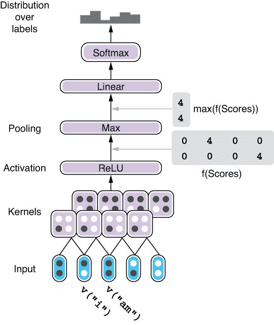

图 7.12 带有多个卷积核的完整 CNN

因为 CNN 中的卷积核不相互依赖（与 RNN 不同，后续单元需要等待所有前面的单元完成输入处理），所以 CNN 计算效率高。GPU 可以并行处理这些卷积核，不用等待其他卷积核的输出。由于这个特性，CNN 通常比大小相似的 RNN 更快。

## 7.4 案例研究：文本分类

现在，我们已经了解了 CNN 的基础知识，在本节中，我们将使用 CNN 构建一个 NLP 应用并看看它在实践中的工作原理。正如之前提到的，CNN 在 NLP 中最受欢迎和直接的应用之一就是文本分类。CNN 擅长检测文本中的模式（如突出的单词和短语），这也是准确文本分类的关键。

### 7.4.1 复习：文本分类

我们已经在第二章和第四章中介绍了文本分类，但是为了回顾一下，文本分类是指一个 NLP 系统给定一段文本分配一个标签的任务。如果文本是一个电子邮件，标签是邮件是否为垃圾邮件，那就是垃圾邮件过滤。如果文本是一个文档（比如新闻文章），标签是它的主题（如政治、商业、技术或体育），那就叫做*文档分类*。根据输入和输出的不同，还存在许多其他变种的文本分类。但是在本节中，我们将再次处理情感分析，它的输入是一些表达作者主观意见的文本（如电影和产品评论），输出是意见的标签（如正面或负面，甚至星级评价），也被称为*极性*。

在第二章和第四章中，我们构建了一个 NLP 系统，使用 Stanford Sentiment Treebank 检测给定电影评论的情感极性，这是一个包含电影评论及其极性（非常正面，正面，中立，负面，非常负面）的数据集。在本节中，我们将构建同样的文本分类器，但是使用 CNN 而不是 RNN。好消息是，我们可以重用第二章编写的大部分代码，在这一部分只需要修改几行代码将 RNN 替换为 CNN。这在很大程度上归功于 AllenNLP 强大而设计良好的抽象，它可以让您通过公共接口与许多具有不同架构的模块一起工作。让我们下面看看它的运行。

### 7.4.2 使用 CnnEncoder

记住，在第 4.4 节中，我们定义了文本分类的 LstmClassifier 如下：

```py
class LstmClassifier(Model):
    def __init__(self,
                 embedder: TextFieldEmbedder,
                 encoder: Seq2VecEncoder,
                 vocab: Vocabulary,
                 positive_label: str = '4') -> None:
    ...
```

我们没有对这个定义进行深入的思考，但是从这个构造函数中，我们可以看到这个模型是建立在两个子组件之上的：一个名为`embedder`的`TextFieldEmbedder`和一个名为`encoder`的`Seq2VecEncoder`，除此之外还有词汇表和正标签的字符串，这些对我们的讨论不相关。我们在第三章详细讨论了词嵌入，尽管我们只是简要涉及了编码器。这个`Seq2VecEncoder`到底是什么意思呢？

在 AllenNLP 中，`Seq2VecEncoder`是一类神经网络架构，它接受一系列向量（或一般张量）并返回一个单个向量。RNN 是其中的一个例子，它接受由多个向量组成的可变长度输入，并在最后一个单元格中将其转换为单个向量。我们使用以下代码基于 LSTM-RNN 创建了一个`Seq2VecEncoder`的实例：

```py
encoder = PytorchSeq2VecWrapper(
    torch.nn.LSTM(EMBEDDING_DIM, HIDDEN_DIM, batch_first=True))
```

但只要你的组件具有相同的输入和输出规范，你就可以使用任何神经网络架构作为`Seq2VecEncoder`。在编程语言中，`Seq2VecEncoder`类似于 Java（以及许多其他语言中的）中的接口——接口定义了你的类是什么样子的，它做什么，但它们不关心你的类是如何做到的。实际上，你的模型可以简单地对所有输入向量求和以产生输出，而不需要任何复杂的变换，比如非线性变换。事实上，这就是`BagOfEmbeddingsEncoder`—AllenNLP 中实现的`Seq2VecEncoder`之一的做法。

接下来，我们使用 CNN 将一系列向量“压缩”为单个向量。在 AllenNLP 中，基于 CNN 的`Seq2VecEncoder`实现为`CnnEncoder`，可以如下实例化：

```py
encoder = CnnEncoder(
    embedding_dim=EMBEDDING_DIM,
    num_filters=8,
    ngram_filter_sizes=(2, 3, 4, 5))
```

在这个例子中，`embedding_dim`指定了输入嵌入的维度。第二个参数`num_filters`告诉我们将使用多少个过滤器（或内核，如第 7.2.1 节所解释的）。最后一个参数`ngram_filter_sizes`指定了 n-gram 大小的列表，即这些内核的大小。在这里，我们使用 2、3、4 和 5 的 n-gram 大小，这意味着有 8 个用于 bigram 的内核，8 个用于 trigram，以此类推，直到 5-gram。总而言之，这个 CNN 可以学习 32 个不同的内核来检测模式。`CnnEncoder`通过一个最大池化层运行这些内核的结果，并得出一个总结输入的单个向量。

训练流水线的其余部分几乎与我们在第二章中看到的 LSTM 版本相同。整个代码都可以在 Google Colab 上找到。[`www.realworldnlpbook.com/ch7.html#cnn-nb`](http://www.realworldnlpbook.com/ch7.html#cnn-nb)。但有一个注意事项：由于一些 n-gram 过滤器具有宽形状（例如，4-gram 和 5-gram），您需要确保每个文本字段至少具有该长度，即使原始文本很短（例如，只有一个或两个单词）。您需要了解 AllenNLP 中的批处理和填充工作原理（我们将在第十章中介绍）才能充分理解如何处理这一问题，但简而言之，您需要在初始化标记索引器时指定 token_min_padding_length 参数，如下所示：

```py
token_indexer = SingleIdTokenIndexer(token_min_padding_length=5)
reader = StanfordSentimentTreeBankDatasetReader(
    token_indexers={'tokens': token_indexer})
```

### 7.4.3 训练和运行分类器

当您运行脚本时，您会在训练结束时看到类似以下日志输出：

```py
{'best_epoch': 1,
 'best_validation_accuracy': 0.40236148955495005,
 'best_validation_f1_measure': 0.37362638115882874,
 'best_validation_loss': 1.346440097263881,
 'best_validation_precision': 0.4722222089767456,
 'best_validation_recall': 0.30909091234207153,
 'epoch': 10,
 'peak_cpu_memory_MB': 601.656,
 'training_accuracy': 0.993562734082397,
 'training_cpu_memory_MB': 601.656,
 'training_duration': '0:01:10.138277',
 'training_epochs': 10,
 'training_f1_measure': 0.994552493095398,
 'training_loss': 0.03471498479299275,
 'training_precision': 0.9968798756599426,
 'training_recall': 0.9922360181808472,
 'training_start_epoch': 0,
 'validation_accuracy': 0.35149863760217986,
 'validation_f1_measure': 0.376996785402298,
 'validation_loss': 3.045241366113935,
 'validation_precision': 0.3986486494541168,
 'validation_recall': 0.35757574439048767}
```

这意味着训练精度达到了约 99%，而验证精度则达到了约 40%。同样，这是过拟合的典型症状，即您的模型非常强大，可以很好地拟合训练数据，但不能很好地泛化到验证和测试数据集。我们的 CNN 具有许多能够记住训练数据中显著模式的过滤器，但这些模式未必有助于预测验证实例的标签。在本章中，我们不太担心过拟合。有关避免过拟合的常见技术，请参见第十章。

如果您想对新实例进行预测，可以使用与第二章相同的预测器。AllenNLP 中的预测器是您训练好的模型的一个轻量级包装器，负责将输入和输出格式化为 JSON 格式并将实例提供给模型。您可以使用以下代码段使用您训练好的 CNN 模型进行预测：

```py
predictor = SentenceClassifierPredictor(model, dataset_reader=reader)
logits = predictor.predict('This is the best movie ever!')['logits']
label_id = np.argmax(logits)

print(model.vocab.get_token_from_index(label_id, 'labels'))
```

## 摘要

+   CNN 使用称为内核的过滤器和称为卷积的操作来检测输入中的局部语言模式。

+   卷积层使用的激活函数称为 ReLU，它将负值截断为零。

+   CNN 然后使用池化层来聚合卷积层的结果。

+   CNN 预测是转换不变的，意味着即使对输入进行线性修改后也保持不变。

+   您可以通过修改文本分类器的几行代码将基于 CNN 的编码器用作 AllenNLP 中的 Seq2VecEncoder。
