# 第九章：使用预训练语言模型进行迁移学习

本章内容包括

+   利用无标签文本数据的知识进行迁移学习

+   使用自监督学习对大型语言模型进行预训练，如 BERT

+   使用 BERT 和 Hugging Face Transformers 库构建情感分析器

+   使用 BERT 和 AllenNLP 构建自然语言推断模型

2018 年通常被称为自然语言处理历史上的“拐点”。一位著名的 NLP 研究者，Sebastian Ruder（[`ruder.io/nlp-imagenet/`](https://ruder.io/nlp-imagenet/)）将这一变化称为“NLP 的 ImageNet 时刻”，他使用了一个流行的计算机视觉数据集的名称以及在其上进行预训练的强大模型，指出 NLP 社区正在进行类似的变革。强大的预训练语言模型，如 ELMo、BERT 和 GPT-2，在许多 NLP 任务上实现了最先进的性能，并在几个月内彻底改变了我们构建 NLP 模型的方式。

这些强大的预训练语言模型背后的一个重要概念是*迁移学习*，一种利用在另一个任务上训练的模型来改善一个任务性能的技术。在本章中，我们首先介绍这个概念，然后介绍 BERT，这是为 NLP 提出的最流行的预训练语言模型。我们将介绍 BERT 的设计和预训练，以及如何将该模型用于下游 NLP 任务，包括情感分析和自然语言推断。我们还将涉及其他流行的预训练模型，包括 ELMo 和 RoBERTa。

## 9.1 迁移学习

我们从介绍*迁移学习*开始这一章，这是本章中许多预训练语言模型（PLM）的基本机器学习概念。

### 9.1.1 传统机器学习

在传统机器学习中，在预训练语言模型出现之前，NLP 模型是根据任务进行训练的，它们仅对它们所训练的任务类型有用（图 9.1）。例如，如果你想要一个情感分析模型，你需要使用带有所需输出的数据集（例如，负面、中性和正面标签），而训练好的模型仅对情感分析有用。如果你需要构建另一个用于词性标注（一种 NLP 任务，用于识别单词的词性；请参阅第 5.2 节进行回顾）的模型，你需要通过收集训练数据并从头开始训练一个词性标注模型来完成。无论你的模型有多好，你都不能将情感分析模型“重用”于词性标注，因为这两者是为两个根本不同的任务而训练的。然而，这些任务都在同一语言上操作，这一切似乎都是浪费的。例如，知道 “wonderful”，“awesome” 和 “great” 都是具有积极意义的形容词，这将有助于情感分析和词性标注。在传统机器学习范式下，我们不仅需要准备足够大的训练数据来向模型教授这种“常识”，而且个别 NLP 模型还需要从给定的数据中学习关于语言的这些事实。

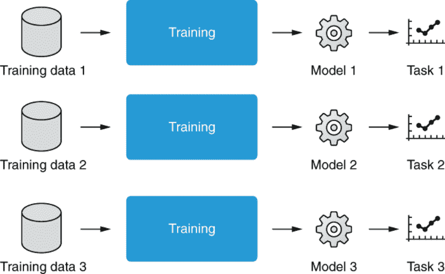

图 9.1 在传统机器学习中，每个训练好的模型仅用于一个任务。

### 9.1.2 词嵌入

在这一点上，你可能会意识到这听起来有些眼熟。回想一下我们在第 3.1 节关于词嵌入以及它们为什么重要的讨论。简而言之，词嵌入是单词的向量表示，这些向量是通过学习得到的，以便语义上相似的单词具有相似的表示。因此，例如，“dog” 和 “cat” 的向量最终会位于高维空间中的接近位置。这些表示是在一个独立的大型文本语料库上进行训练的，没有任何训练信号，使用诸如 Skip-gram 和 CBOW 等算法，通常统称为 *Word2vec*（第 3.4 节）。

在这些词嵌入训练之后，下游 NLP 任务可以将它们作为模型的输入（通常是神经网络，但不一定）。因为这些嵌入已经捕捉到单词之间的语义关系（例如，dogs 和 cats 都是动物），所以这些任务不再需要从头学习语言是如何工作的，这使它们在试图解决的任务中占据了上风。模型现在可以专注于学习无法被词嵌入捕捉到的更高级别概念（例如，短语、句法和语义）以及从给定的注释数据中学到的任务特定模式。这就是为什么使用词嵌入会给许多 NLP 模型带来性能提升的原因。

在第三章中，我们将这比作是教一个婴儿（= 一个自然语言处理模型）如何跳舞。通过让婴儿先学会稳步行走（= 训练词嵌入），舞蹈老师（= 任务特定数据集和训练目标）可以专注于教授具体的舞步，而不必担心婴儿是否能够站立和行走。这种“分阶段训练”方法使得如果你想教婴儿另一种技能（例如，教授武术），一切都变得更容易，因为他们已经对基本技能（行走）有了很好的掌握。

所有这一切的美妙之处在于，词嵌入可以独立于下游任务进行学习。这些词嵌入是*预训练*的，这意味着它们的训练发生在下游自然语言处理任务的训练之前。使用跳舞婴儿的类比，舞蹈老师可以安全地假设所有即将到来的舞蹈学生都已经学会了如何正确站立和行走。由算法开发者创建的预训练词嵌入通常是免费提供的，任何人都可以下载并将其集成到他们的自然语言处理应用程序中。这个过程在图 9.2 中有所说明。

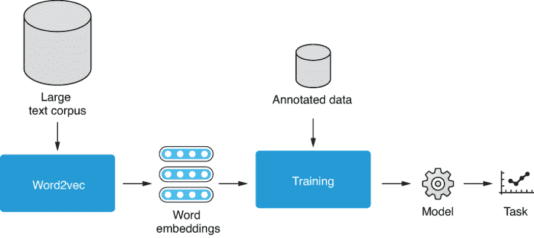

图 9.2 利用词嵌入有助于构建更好的自然语言处理模型。

### 9.1.3 什么是迁移学习？

如果你总结一下之前对词嵌入所做的事情，你会发现你将一个任务的结果（即，用嵌入预测词共现）并将从中获得的知识转移到另一个任务（即，情感分析，或任何其他自然语言处理任务）。在机器学习中，这个过程被称为*迁移学习*，这是一系列相关的技术，用于通过在不同任务上训练的数据和/或模型来提高机器学习模型在某一任务中的性能。迁移学习总是由两个或多个步骤组成—首先为一个任务训练一个机器学习模型（称为*预训练*），然后调整并在另一个任务中使用它（称为*适应*）。如果同一个模型用于两个任务，第二步称为*微调*，因为你稍微调整了同一个模型，但是用于不同的任务。请参见图 9.3，以了解自然语言处理中迁移学习的示意图。

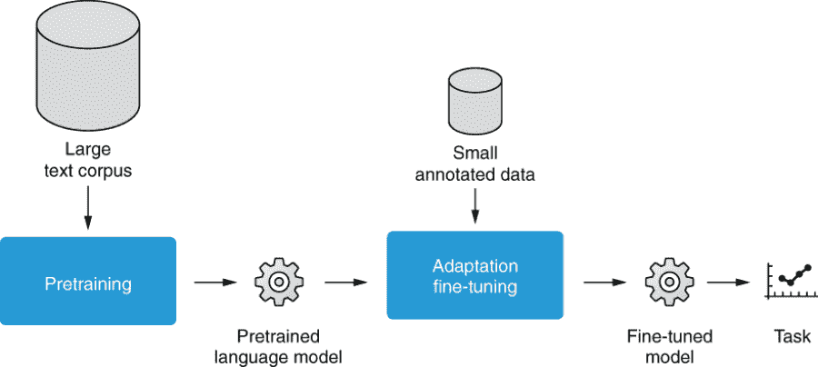

图 9.3 利用迁移学习有助于构建更好的自然语言处理模型。

过去几年中，迁移学习已成为构建高质量自然语言处理模型的主要方法，原因有两个。首先，由于强大的神经网络模型如 Transformer 和自监督学习（见第 9.2.2 节），几乎可以从几乎无限量的自然语言文本中引导出高质量的嵌入。这些嵌入在很大程度上考虑了自然语言文本的结构、上下文和语义。其次，由于迁移学习，任何人都可以将这些强大的预训练语言模型整合到他们的自然语言处理应用程序中，即使没有访问大量的文本资源，如网络规模语料库，或计算资源，如强大的 GPU。这些新技术的出现（Transformer、自监督学习、预训练语言模型和迁移学习）将自然语言处理领域推向了一个全新的阶段，并将许多自然语言处理任务的性能推向了接近人类水平。在接下来的子节中，我们将看到迁移学习在实际构建自然语言处理模型时的应用，同时利用诸如 BERT 等预训练语言模型。

请注意，所谓的*领域自适应*概念与迁移学习密切相关。领域自适应是一种技术，你在一个领域（例如，新闻）训练一个机器学习模型，然后将其调整到另一个领域（例如，社交媒体），但这些领域属于*相同任务*（例如，文本分类）。另一方面，在本章中涵盖的迁移学习应用于*不同任务*（例如，语言建模与文本分类）。你可以利用本章介绍的迁移学习范式来实现相同的效果，我们不会专门涵盖领域自适应作为一个单独的主题。有兴趣的读者可以从最近的一篇评论性文章中了解更多关于领域自适应的信息。¹

## 9.2 BERT

在本节中，我们将详细介绍 BERT。BERT（双向编码器表示转换器）²是迄今为止最流行和最具影响力的预训练语言模型，彻底改变了人们训练和构建自然语言处理模型的方式。我们将首先介绍*上下文化嵌入*及其重要性，然后讨论自监督学习，这是预训练语言模型中的一个重要概念。我们将涵盖 BERT 用于预训练的两个自监督任务，即，掩码语言模型和下一个句子预测，并介绍如何将 BERT 调整到你的应用程序中。

### 9.2.1 词嵌入的局限性

单词嵌入是一个强大的概念，可以提高应用程序的性能，尽管它们也有限制。一个明显的问题是它们无法考虑上下文。在自然语言中看到的单词通常是多义的，意味着它们可能根据上下文有多个含义。然而，由于单词嵌入是按标记类型训练的，所有不同的含义都被压缩成一个单一的向量。例如，为“dog”或“apple”训练一个单一的向量无法处理“热狗”或“大苹果”分别不是动物或水果这一事实。再举一个例子，考虑这些句子中“play”的含义：“They played games,” “I play Chopin,” “We play baseball,” 和 “Hamlet is a play by Shakespeare”（这些句子都来自 Tatoeba.org）。这些“play”的出现有不同的含义，分配一个单一的向量在下游的 NLP 任务中并不会有太大帮助（例如在将主题分类为体育、音乐和艺术方面）。

由于这个限制，自然语言处理（NLP）研究人员开始探索将整个句子转换为一系列考虑上下文的向量的方法，称为*上下文化嵌入*或简称为*上下文化*。有了这些表示，前面示例中“play”的所有出现将被分配不同的向量，帮助下游任务区分单词的不同用法。上下文化嵌入的重要里程碑包括 CoVe³ 和 ELMo（第 9.3.1 节），尽管最大的突破是由 BERT 实现的，这是一个基于 Transformer 的预训练语言模型，是本节的重点。

我们学习到 Transformer 使用一种称为*自注意力*的机制逐渐转换输入序列来总结它。BERT 的核心思想很简单：它使用 Transformer（准确地说是 Transformer 编码器）将输入转换为上下文化嵌入。Transformer 通过一系列层逐渐摘要输入。同样，BERT 通过一系列 Transformer 编码器层对输入进行上下文化处理。这在图 9.4 中有所说明。

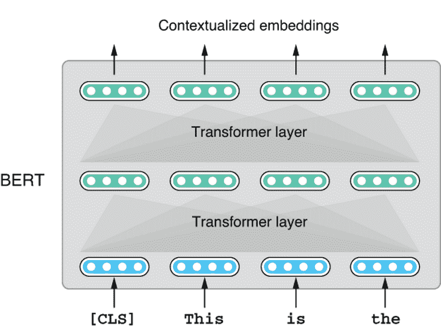

图 9.4 BERT 通过注意力层处理输入以生成上下文化嵌入。

因为 BERT 基于 Transformer 架构，它继承了 Transformer 的所有优点。其自注意力机制使其能够在输入上进行“随机访问”，并捕获输入标记之间的长期依赖关系。与传统的语言模型（例如我们在第 5.5 节中介绍的基于 LSTM 的语言模型）不同，后者只能沿着一个方向进行预测，Transformer 可以在两个方向上考虑上下文。以“哈姆雷特是莎士比亚的一部戏剧”为例，对于“戏剧”这个词的上下文化嵌入可以包含来自“哈姆雷特”和“莎士比亚”的信息，这样就更容易捕捉到“戏剧舞台作品”的意思。

如果这个概念就像“BERT 只是一个 Transformer 编码器”那么简单，为什么它在这里值得有一个完整的章节呢？因为我们还没有回答两个重要的实际问题：如何训练和调整模型。神经网络模型，无论多么强大，如果没有特定的训练策略和获取训练数据的途径，都是无用的。此外，预训练模型没有特定的调整策略也是无用的。我们将在以下小节中讨论这些问题。

### 9.2.2 自监督学习

Transformer 最初是为了机器翻译而提出的，它是使用平行文本进行训练的。它的编码器和解码器被优化以最小化损失函数，即解码器输出和预期正确翻译之间的差异所定义的交叉熵。然而，预训练 BERT 的目的是得到高质量的上下文嵌入，而 BERT 只有一个编码器。我们如何“训练”BERT 以使其对下游自然语言处理任务有用呢？

如果你把 BERT 只看作是另一种得到嵌入的方式，你可以从词嵌入是如何训练的中得到灵感。回想一下，在第 3.4 节中，为了训练词嵌入，我们构造了一个“假”任务，即用词嵌入预测周围的单词。我们对预测本身不感兴趣，而是对训练的“副产品”感兴趣，即作为模型参数的词嵌入。这种数据本身提供训练信号的训练范式称为*自监督学习*，或者简称为*自监督*，在现代机器学习中。从模型的角度来看，自监督学习仍然是监督学习的一种类型——模型被训练以使得它最小化由训练信号定义的损失函数。不同之处在于训练信号的来源。在监督学习中，训练信号通常来自人类注释。在自监督学习中，训练信号来自数据本身，没有人类干预。

在过去的几年中，随着数据集越来越大和模型越来越强大，自监督学习已经成为预训练 NLP 模型的流行方式。但是为什么它能够如此成功呢？其中两个因素起到了作用——一个是这里的自监督类型在创建时非常简单（只需提取周围单词用于 Word2vec），但是解决它需要对语言有深入的理解。例如，重新使用我们在第五章中讨论的语言模型的例子，要回答“我的海滩之行被糟糕的 ___ 毁了”，系统不仅需要理解句子，还需要具备某种“常识”，了解什么样的事情可能会毁了一次海滩之行（例如，糟糕的天气，交通拥堵）。预测周围单词所需的知识范围从简单的搭配/联想（例如，“纽约的 ____ 雕像”），到句法和语法（例如，“我的生日是 ___ 五月”），再到语义（前面的例子）。第二个因素是几乎没有限制用于自监督的数据量，因为你所需要的只是干净的纯文本。你可以下载大型数据集（例如，维基百科转储）或爬取和过滤网页，这是训练许多预训练语言模型的流行方式之一。

### 9.2.3 BERT 预训练

现在我们都明白了自监督学习对于预训练语言模型有多么有用，让我们看看我们如何将其用于预训练 BERT。如前所述，BERT 只是一个将输入转换为考虑上下文的一系列嵌入的 Transformer 编码器。对于预训练词嵌入，你可以根据目标词的嵌入预测周围的单词。对于预训练单向语言模型，你可以根据目标之前的标记预测下一个标记。但是对于诸如 BERT 这样的双向语言模型，你不能使用这些策略，因为用于预测的输入（上下文化的嵌入）还取决于输入之前和之后的内容。这听起来像是一个先有鸡还是先有蛋的问题。

BERT 的发明者们通过一个称为*掩码语言模型*（MLM）的精妙思想来解决这个问题，在给定的句子中随机删除（掩盖）单词，并让模型预测被删除的单词是什么。具体来说，在句子中用一个特殊的占位符替换一小部分单词后，BERT 使用 Transformer 对输入进行编码，然后使用前馈层和 softmax 层推导出可能填充该空白的单词的概率分布。因为你已经知道答案（因为你首先删除了这些单词），所以你可以使用常规的交叉熵来训练模型，如图 9.5 所示。

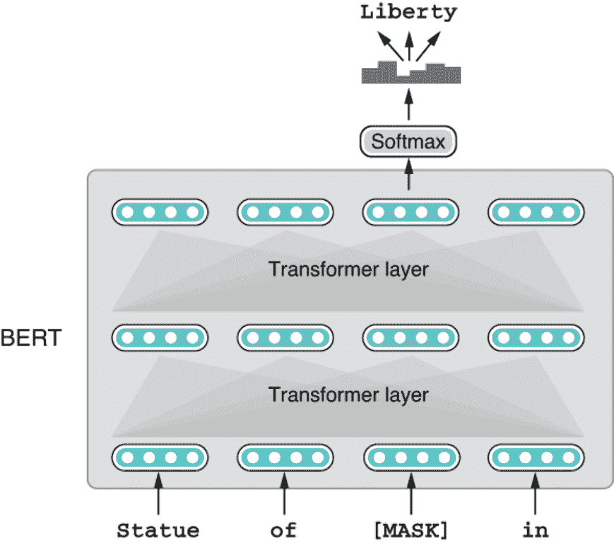

图 9.5 使用掩码语言模型对 BERT 进行预训练

掩码和预测单词并不是一个完全新的想法——它与*填空测试*密切相关，测试者被要求在句子中替换被移除的单词。这种测试形式经常用于评估学生对语言的理解程度。正如我们之前所见，填写自然语言文本中的缺失单词需要对语言的深入理解，从简单的关联到语义关系。因此，通过告诉模型解决这种填空类型的任务，涵盖了大量文本数据，神经网络模型经过训练，使其能够产生融合了深层语言知识的上下文嵌入。

如果你想自己实现 BERT 的预训练，你可能会想知道这个输入[MASK]是什么，以及你实际上需要做什么。在训练神经网络时，人们经常使用特殊的标记，比如我们在这里提到的[MASK]。这些特殊的标记就像其他（自然出现的）标记一样，比如“狗”和“猫”的单词，只是它们在文本中不会自然出现（无论你多么努力，都找不到任何[MASK]在自然语言语料库中），神经网络的设计者定义了它们的含义。模型将学会为这些标记提供表示，以便它可以解决手头的任务。其他特殊标记包括 BOS（句子的开始）、EOS（句子的结束）和 UNK（未知单词），我们在之前的章节中已经遇到过。

最后，BERT 不仅使用掩码语言模型进行预训练，还使用了另一种类型的任务，称为*下一句预测*（NSP），其中向 BERT 提供了两个句子，并要求模型预测第二个句子是否是第一个句子的“真正”下一个句子。这是另一种类型的自监督学习（“伪造”任务），其训练数据可以在很少的人工干预下无限制地创建，因为你可以从任何语料库中提取两个连续的句子（或仅随机拼接两个句子）并为此任务创建训练数据。这个任务背后的原理是通过训练这个目标，模型将学会如何推断两个句子之间的关系。然而，这个任务的有效性一直在积极地讨论中（例如，RoBERTa 放弃了这个任务，而 ALBERT 将其替换为另一个称为*句子顺序预测*的任务），我们将不在这里详细讨论这个任务。

所有这些预训练听起来有些复杂，但好消息是你很少需要自己实现这一步。类似于词嵌入，这些语言模型的开发人员和研究人员在大量自然语言文本上预训练他们的模型（通常是 10 GB 或更多，甚至是 100 GB 或更多的未压缩文本），并使用许多 GPU，并且将预训练模型公开可用，以便任何人都可以使用它们。

### 9.2.4 调整 BERT

在迁移学习的第二（也是最后）阶段，预训练模型被调整以适应目标任务，使后者可以利用前者学到的信号。有两种主要方式可以使 BERT 适应个别下游任务：*微调* 和 *特征提取*。在微调中，神经网络架构稍微修改，以便为所讨论的任务产生类型的预测，并且整个网络在任务的训练数据上持续训练，以使损失函数最小化。这正是你训练 NLP 任务的神经网络的方式，例如情感分析，其中有一个重要的区别—BERT“继承”了通过预训练学到的模型权重，而不是从头开始随机初始化并进行训练。通过这种方式，下游任务可以利用 BERT 通过大量数据预训练学到的强大表示。

BERT 架构修改的确切方式因最终任务而异，但在这里我将描述最简单的情况，即任务是对给定句子预测某种标签。这也被称为 *句子预测任务*，其中包括我们在第二章中介绍的情感分析。为了使下游任务能够提取句子的表示，BERT 在预训练阶段为每个句子添加一个特殊标记[CLS]（用于 *分类*）。您可以使用此标记提取 BERT 的隐藏状态，并将其用作句子的表示。与其他分类任务一样，线性层可以将此表示压缩为一组“分数”，这些分数对应于每个标签是正确答案的可能性。然后，您可以使用 softmax 推导出一个概率分布。例如，如果您正在处理一个情感分析数据集，其中有五个标签（非常负面到非常正面），则您将使用线性层将维度降低到 5。这种线性层与 softmax 结合起来，插入到诸如 BERT 之类的较大的预训练模型中，通常被称为 *头部*。换句话说，我们正在将一个 *分类头* 附加到 BERT 上，以解决句子预测任务。整个网络的权重（头部和 BERT）都会被调整，以使损失函数最小化。这意味着通过反向传播微调 BERT 权重初始化的权重也会被调整。见图 9.6 以示例说明。

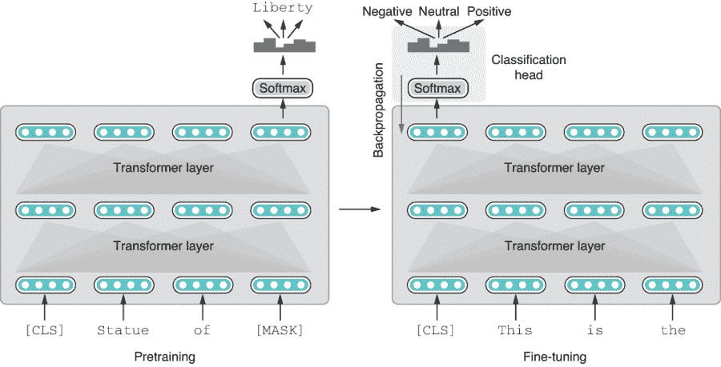

图 9.6 使用附加的分类头对 BERT 进行预训练和微调

另一种微调 BERT 的变体使用了所有嵌入，这些嵌入是在输入令牌上进行平均的。在这种称为 *mean over time* 或 *bag of embeddings* 的方法中，BERT 生成的所有嵌入被求和并除以输入的长度，就像词袋模型一样，以产生一个单一的向量。这种方法不如使用 CLS 特殊令牌那么受欢迎，但根据任务的不同可能效果更好。图 9.7 阐明了这一点。

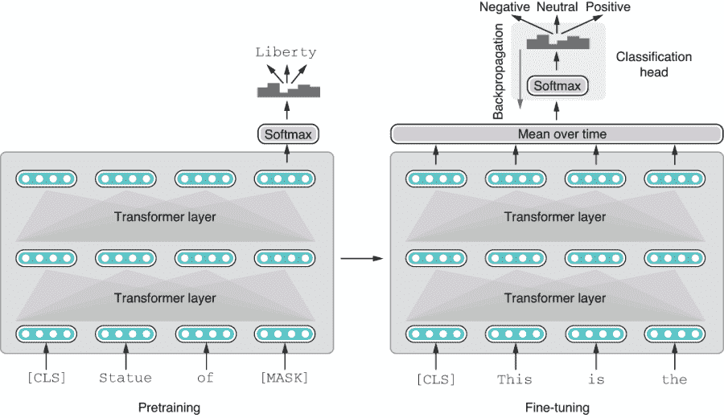

图 9.7 预训练和微调 BERT 使用时间平均和分类头

另一种用于下游 NLP 任务的 BERT 适应方式是 *feature extraction*。在这里，BERT 被用来提取特征，这些特征只是由 BERT 的最终层产生的一系列上下文化嵌入。你可以将这些向量简单地作为特征馈送到另一个机器学习模型中，并进行预测，如图 9.8 所示。

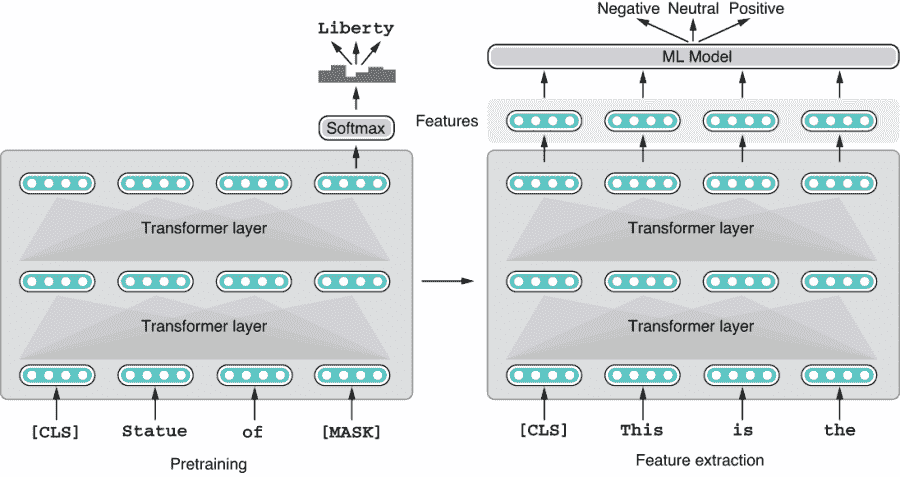

图 9.8 预训练和使用 BERT 进行特征提取

从图形上看，这种方法与微调类似。毕竟，你正在将 BERT 的输出馈送到另一个 ML 模型中。然而，存在两个微妙但重要的区别：首先，因为你不再优化神经网络，第二个 ML 模型不必是神经网络。一些机器学习任务（例如，无监督聚类）不是神经网络擅长解决的，特征提取在这些情况下提供了完美的解决方案。此外，你可以自由使用更“传统”的 ML 算法，如 SVM（支持向量机）、决策树和梯度提升方法（如 GBDT 或梯度提升决策树），这些算法可能在计算成本和性能方面提供更好的折衷方案。其次，因为 BERT 仅用作特征提取器，在适应阶段不会进行反向传播，其内部参数也不会更新。在许多情况下，如果微调 BERT 参数，你可以在下游任务中获得更高的准确性，因为这样做也会教导 BERT 更好地解决手头的任务。

最后，请注意这两种方式不是适应 BERT 的唯一方式。迁移学习是一个正在积极研究的主题，不仅在自然语言处理领域，而且在人工智能的许多领域都是如此，我们有许多其他方法来使用预训练的语言模型以发挥其最佳作用。如果你对此感兴趣，我建议查看在 NAACL 2019（顶级自然语言处理会议之一）上给出的教程，标题为“自然语言处理中的迁移学习”（[`mng.bz/o8qp`](http://mng.bz/o8qp)）。

## 9.3 案例研究 1：使用 BERT 进行情感分析

在本节中，我们将再次构建情感分析器，但这次我们将使用 BERT，而不是 AllenNLP，我们将使用由 Hugging Face 开发的 Transformers 库，在上一章中使用该库进行语言模型预测。这里的所有代码都可以在 Google Colab 笔记本上访问（[`www.realworldnlpbook.com/ch9.html#sst`](http://www.realworldnlpbook.com/ch9.html#sst)）。你在本节中看到的代码片段都假定你按照以下方式导入了相关的模块、类和方法：

```py
import torch
from torch import nn, optim
from transformers import AutoTokenizer, AutoModel, AdamW, get_cosine_schedule_with_warmup
```

在 Transformers 库中，你可以通过他们的名称指定预训练模型。在本节中，我们将一直使用大写的 BERT-base 模型 ('bert-base-cased')，因此让我们首先定义一个常量，如下所示：

```py
BERT_MODEL = 'bert-base-cased'
```

Transformers 库还支持其他预训练的 BERT 模型，你可以在他们的文档（[`huggingface.co/transformers/pretrained_models.html`](https://huggingface.co/transformers/pretrained_models.html)）中看到。如果你想使用其他模型，你可以简单地将这个变量替换为你想要使用的模型名称，代码的其余部分在许多情况下都可以原封不动地工作（但并非总是如此）。

### 9.3.1 将输入划分为单词

我们构建 NLP 模型的第一步是构建一个数据集读取器。虽然 AllenNLP（或更确切地说，allennlp-modules 包）附带了一个用于 Stanford 情感树库的数据集读取器，但是该数据集读取器的输出仅与 AllenNLP 兼容。在本节中，我们将编写一个简单的方法来读取数据集并返回一系列批量输入实例。

在处理自然语言输入时，分词是最重要的步骤之一。正如我们在上一章中看到的那样，Transformers 库中的分词器可以通过 AutoTokenizer.from_pretrained() 类方法进行初始化，如下所示：

```py
tokenizer = AutoTokenizer.from_pretrained(BERT_MODEL)
```

因为不同的预训练模型使用不同的分词器，所以重要的是要通过提供相同的模型名称来初始化与你将要使用的预训练模型匹配的分词器。

你可以使用分词器在字符串和令牌 ID 的列表之间进行转换，如下所示：

```py
>>> token_ids = tokenizer.encode('The best movie ever!')

[101, 1109, 1436, 2523, 1518, 106, 102]

>>> tokenizer.decode(token_ids)

'[CLS] The best movie ever! [SEP]'
```

注意 BERT 的分词器在你的句子中添加了两个特殊的标记——[CLS] 和 [SEP]。正如之前讨论的那样，CLS 是一个特殊的标记，用于提取整个输入的嵌入，而 SEP 用于分隔两个句子，如果你的任务涉及对一对句子进行预测。因为我们在这里对单个句子进行预测，所以不需要过多关注这个标记。我们将在第 9.5 节讨论句子对分类任务。

深度神经网络很少处理单个实例。它们通常通过训练并为实例的批次进行预测以保持稳定性和性能。分词器还支持通过调用 __call__ 方法（即，只需将对象用作方法）将给定输入转换为批次，如下所示：

```py
>>> result = tokenizer(
>>>    ['The best movie ever!', 'Aweful movie'],
>>>    max_length=10,
>>>    pad_to_max_length=True,
>>>    truncation=True,
>>>    return_tensors='pt')
```

运行此代码时，输入列表中的每个字符串都将被标记化，然后生成的张量将用 0 进行*填充*，以使它们具有相同的长度。这里的填充意味着在每个序列的末尾添加 0，以便单个实例具有相同的长度并可以捆绑为单个张量，这对于更有效的计算是必需的（我们将在第十章中更详细地讨论填充）。方法调用包含几个其他参数，用于控制最大长度（max_length=10，表示将所有内容填充到长度为 10），是否填充到最大长度，是否截断过长的序列以及返回张量的类型（return_tensors='pt'，表示它返回 PyTorch 张量）。此 tokenizer()调用的结果是一个包含以下三个键和三种不同类型的打包张量的字典：

```py
>>> result['input_ids']

tensor([[ 101, 1109, 1436, 2523, 1518,  106,  102,    0,    0,    0],
        [ 101,  138, 7921, 2365, 2523,  102,    0,    0,    0,    0]])

>>> result['token_type_ids']

tensor([[0, 0, 0, 0, 0, 0, 0, 0, 0, 0],
        [0, 0, 0, 0, 0, 0, 0, 0, 0, 0]])

>>> result['attention_mask']

tensor([[1, 1, 1, 1, 1, 1, 1, 0, 0, 0],
        [1, 1, 1, 1, 1, 1, 0, 0, 0, 0]])
```

input_ids 张量是从文本转换而来的标记 ID 的打包版本。请注意，每行都是一个矢量化的标记 ID，用 0 进行了填充，以便其长度始终为 10。token_type_ids 张量指定每个标记来自哪个句子。与之前的 SEP 特殊标记一样，只有在处理句对时才相关，因此张量只是简单地填满了 0。attention_mask 张量指定 Transformer 应该关注哪些标记。由于在输入 _ids 中存在填充元素（填充为 0），因此 attention_mask 中的相应元素都为 0，并且对这些标记的关注将被简单地忽略。掩码是神经网络中经常使用的一种常见技术，通常用于忽略类似于这里所示的批量张量中的不相关元素。第十章将更详细地介绍掩码。

正如您在这里看到的，Transformers 库的标记器不仅仅是标记化 - 它们为您创建了一个字符串列表，并为您创建了批量张量，包括辅助张量（token_type_ids 和 attention_mask）。您只需从数据集创建字符串列表，并将它们传递给 tokenizer()以创建传递给模型的批次。这种读取数据集的逻辑相当乏味且有点冗长，因此我将其打包在一个名为 read_dataset 的方法中，这里没有显示。如果您感兴趣，可以检查之前提到的 Google Colab 笔记本。使用此方法，您可以读取数据集并将其转换为批次列表，如下所示：

```py
train_data = read_dataset('train.txt', batch_size=32, tokenizer=tokenizer, max_length=128)
dev_data = read_dataset('dev.txt', batch_size=32, tokenizer=tokenizer, max_length=128)
```

### 9.3.2 构建模型

在下一步中，我们将构建模型，将文本分类到它们的情感标签中。我们在这里构建的模型只是 BERT 的一个薄包装器。它所做的就是将输入通过 BERT 传递，取出其在 CLS 处的嵌入，将其传递到线性层以转换为一组分数（logits），并计算损失。

请注意，我们正在构建一个 PyTorch 模块，而不是 AllenNLP 模型，因此请确保从 nn.Module 继承，尽管这两种类型的模型的结构通常非常相似（因为 AllenNLP 的模型从 PyTorch 模块继承）。您需要实现 __init__()，在其中定义和初始化模型的子模块，以及 forward()，其中进行主要计算（“前向传递”）。下面显示了整个代码片段。

列表 9.1 使用 BERT 的情感分析模型

```py
class BertClassifier(nn.Module):
    def __init__(self, model_name, num_labels):
        super(BertClassifier, self).__init__()
        self.bert_model = AutoModel.from_pretrained(model_name)                ❶

        self.linear = nn.Linear(self.bert_model.config.hidden_size, num_labels)❷

        self.loss_function = nn.CrossEntropyLoss()

    def forward(self, input_ids, attention_mask, token_type_ids, label=None):
        bert_out = self.bert_model(                                            ❸
          input_ids=input_ids,
          attention_mask=attention_mask,
          token_type_ids=token_type_ids)

        logits = self.linear(bert_out.pooler_output)                           ❹

        loss = None
        if label is not None:
            loss = self.loss_function(logits, label)                           ❺

        return loss, logits
```

❶ 初始化 BERT

❷ 定义一个线性层

❸ 应用 BERT

❹ 应用线性层

❺ 计算损失

该模块首先在 __init__()中定义 BERT 模型（通过 AutoModel.from_pretrained()类方法）、一个线性层（nn.Linear）和损失函数（nn.CrossEntropyLoss）。请注意，模块无法知道它需要分类到的标签数量，因此我们将其作为参数传递（num_labels）。

在 forward()方法中，它首先调用 BERT 模型。您可以简单地将三种类型的张量（input_ids、attention_mask 和 token_type_ids）传递给模型。模型返回一个包含 last_hidden_state 和 pooler_output 等内容的数据结构，其中 last_hidden_state 是最后一层的隐藏状态序列，而 pooler_output 是一个汇总输出，基本上是经过线性层转换的 CLS 的嵌入。因为我们只关心代表整个输入的池化输出，所以我们将后者传递给线性层。最后，该方法计算损失（如果提供了标签）并返回它，以及 logits，用于进行预测和衡量准确性。

注意我们设计方法签名的方式——它接受我们之前检查的三个张量，使用它们的确切名称。这样我们可以简单地解构一个批次并将其传递给 forward 方法，如下所示：

```py
>>> model(**train_data[0])

(tensor(1.8050, grad_fn=<NllLossBackward>),
 tensor([[-0.5088,  0.0806, -0.2924, -0.6536, -0.2627],
         [-0.3816,  0.3512, -0.1223, -0.5136, -0.4421],
         ...
         [-0.4220,  0.3026, -0.1723, -0.4913, -0.4106],
         [-0.3354,  0.3871, -0.0787, -0.4673, -0.4169]],
        grad_fn=<AddmmBackward>))
```

注意，forward 传递的返回值是损失和 logits 的元组。现在您已经准备好训练您的模型了！

### 9.3.3 训练模型

在这个案例研究的第三和最后一步中，我们将训练和验证模型。尽管在前几章中，AllenNLP 已经处理了训练过程，但在本节中，我们将从头开始编写自己的训练循环，以便更好地理解自己训练模型所需的工作量。请注意，您也可以选择使用库自己的 Trainer 类([`huggingface.co/transformers/main_classes/trainer.html`](https://huggingface.co/transformers/main_classes/trainer.html))，该类的工作方式类似于 AllenNLP 的 Trainer，通过指定其参数来运行训练循环。

我们在第 2.5 节中介绍了训练循环的基础知识，但是为了回顾一下，现代机器学习中，每个训练循环看起来都有些相似。如果您以伪代码的形式编写它，它将类似于下面显示的内容。

列表 9.2 神经网络训练循环的伪代码

```py
MAX_EPOCHS = 100
model = Model()

for epoch in range(MAX_EPOCHS):
    for batch in train_set:
        loss, prediction = model.forward(**batch)
        new_model = optimizer(model, loss)
        model = new_model
```

这个训练循环几乎与清单 2.2 相同，只是它操作的是批次而不是单个实例。数据集产生一系列批次，然后传递给模型的前向方法。该方法返回损失，然后用于优化模型。通常模型还会返回预测结果，以便调用者可以使用结果计算一些指标，如准确率。

在我们继续编写自己的训练循环之前，我们需要注意两件事——在每个 epoch 中交替进行训练和验证是习惯的。在训练阶段，模型被优化（“魔法常数”被改变）基于损失函数和优化器。在这个阶段使用训练数据。在验证阶段，模型的参数是固定的，并且它的预测准确率是根据验证数据进行测量的。虽然在验证期间不使用损失进行优化，但通常会计算它以监视损失在训练过程中的变化，就像我们在第 6.3 节中所做的那样。

另一个需要注意的是，当训练诸如 BERT 之类的 Transformer 模型时，我们通常使用 *热身*，即在前几千个步骤中逐渐增加学习率（改变“魔法常数”）。这里的步骤只是反向传播的另一个名称，对应于清单 9.2 中的内部循环。这对于稳定训练是有用的。我们不会在这里讨论热身和控制学习率的数学细节——我们只是指出通常会使用学习率调度器来控制整个训练过程中的学习率。使用 Transformers 库，你可以定义一个优化器（AdamW）和一个学习率控制器如下：

```py
optimizer = AdamW(model.parameters(), lr=1e-5)
scheduler = get_cosine_schedule_with_warmup(
    optimizer,
    num_warmup_steps=100,
    num_training_steps=1000)
```

我们在这里使用的控制器（get_cosine_schedule_with_warmup）将学习率从零增加到最大值，在前 100 个步骤内，然后逐渐降低（基于余弦函数，这就是它得名的原因）。如果你绘制学习率随时间变化的图表，它会像图 9.9 中的图表一样。

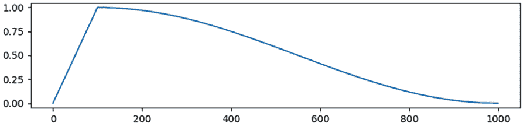

图 9.9 使用余弦学习率调度和热身，学习率首先上升，然后按照余弦函数下降。

现在我们准备训练我们基于 BERT 的情感分析器。接下来的清单展示了我们的训练循环。

清单 9.3 基于 BERT 的情感分析器的训练循环

```py
for epoch in range(epochs):
    print(f'epoch = {epoch}')

    model.train()                                    ❶

    losses = []
    total_instances = 0
    correct_instances = 0
    for batch in train_data:
        batch_size = batch['input_ids'].size(0)
        move_to(batch, device)                       ❷

        optimizer.zero_grad()                        ❸

        loss, logits = model(**batch)                ❹
        loss.backward()                              ❺
        optimizer.step()
        scheduler.step()

        losses.append(loss)

        total_instances += batch_size
        correct_instances += torch.sum(torch.argmax(logits, dim=-1)    == batch['label']).item()                    ❻

    avr_loss = sum(losses) / len(losses)
    accuracy = correct_instances / total_instances
    print(f'train loss = {avr_loss}, accuracy = {accuracy}')
```

❶ 打开训练模式

❷ 将批次移到 GPU（如果可用）

❸ 记得重置梯度（在 PyTorch 中梯度会累积）。

❹ 前向传播

❺ 反向传播

❻ 通过计算正确实例的数量来计算准确率。

当你使用 PyTorch 训练模型时（因此，也是使用 AllenNLP 和 Transformers 两个构建在其上的库），请记得调用 model.train()以打开模型的“训练模式”。这很重要，因为一些层（如 BatchNorm 和 dropout）在训练和评估之间的行为不同（我们将在第十章中涵盖 dropout）。另一方面，在验证或测试模型时，请务必调用 model.eval()。

列表 9.3 中的代码没有显示验证阶段，但验证的代码几乎与训练的代码相同。在验证/测试模型时，请注意以下事项：

+   如前所述，请确保在验证/测试模型之前调用 model.eval()。

+   优化调用（loss.backward()，optimizer.step()和 scheduler.step()）是不必要的，因为您没有更新模型。

+   损失仍然被记录和报告以进行监视。确保将您的前向传递调用包装在 torch.no_grad()中——这将禁用梯度计算并节省内存。

+   精度的计算方式完全相同（这是验证的重点！）。

当我运行这个时，我得到了以下输出到标准输出（省略了中间时期）：

```py
epoch = 0
train loss = 1.5403757095336914, accuracy = 0.31624531835205993
dev loss = 1.7507736682891846, accuracy = 0.2652134423251589
epoch = 1
...
epoch = 8
train loss = 0.4508829712867737, accuracy = 0.8470271535580525
dev loss = 1.687158465385437, accuracy = 0.48319709355131696
epoch = 9
...
```

开发精度在第 8 个时期达到了约 0.483 的峰值，此后没有改善。与我们从 LSTM（开发精度约为 0.35，在第二章中）和 CNN（开发精度约为 0.40，在第七章中）得到的结果相比，这是我们在此数据集上取得的最佳结果。我们做了很少的超参数调整，所以现在就得出 BERT 是我们比较的三个模型中最好的模型的结论还为时过早，但至少我们知道它是一个强大的基准模型！

## 9.4 其他预训练语言模型

BERT 既不是目前 NLP 社区中常用的预训练语言模型（PLMs）中的第一个，也不是最后一个。在本节中，我们将学习其他几个流行的 PLMs 以及它们与 BERT 的区别。这些模型中的大多数已经在 Transformers 库中实现并公开可用，因此您只需更改代码中的几行即可将它们与您的 NLP 应用集成。

### 9.4.1 ELMo

ELMo（来自语言模型的嵌入），于 2018 年初提出⁴，是最早用于从未标记文本中获取上下文嵌入的预训练语言模型之一。其核心思想很简单——训练一个基于 LSTM 的语言模型（类似于我们在第五章中训练的模型），并使用其隐藏状态作为下游自然语言处理任务的额外“特征”。因为语言模型被训练为在给定前文的情况下预测下一个标记，所以隐藏状态可以编码“理解语言”所需的信息。ELMo 还使用另一个反向 LM 执行相同的操作，并结合来自两个方向的嵌入，以便它还可以编码双向信息。请参见图 9.10 进行说明。

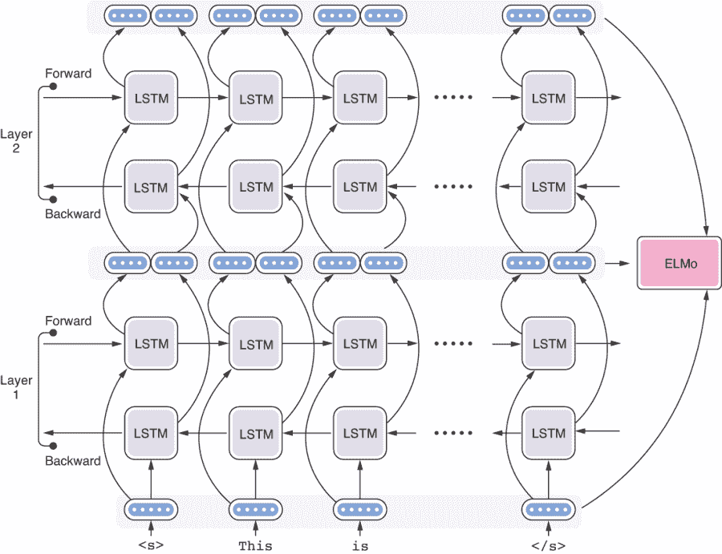

图 9.10 ELMo 通过组合前向和后向 LSTM 计算上下文嵌入。

在两个方向上对 LM 进行预训练之后，下游 NLP 任务可以简单地使用 ELMo 嵌入作为特征。请注意，ELMo 使用多层 LSTM，因此特征是从不同层中取出的隐藏状态的总和，以任务特定的方式加权。ELMo 的发明者们表明，添加这些特征可以提高各种 NLP 任务的性能，包括情感分析、命名实体识别和问答。虽然 ELMo 没有在 Hugging Face 的 Transformers 库中实现，但你可以在 AllenNLP 中相当容易地使用它。

ELMo 是一个历史上重要的 PLM，尽管它今天在研究或生产中不再经常使用——它早于 BERT（和 Transformer 的出现），而且有其他 PLM（包括 BERT）在今天广泛可用并且性能优于 ELMo。

### 9.4.2 XLNet

2019 年提出的 XLNet 是 BERT 的重要后继者，通常被引用为当今最强大的 PLM 之一。XLNet 解决了 BERT 训练中的两个主要问题：训练-测试偏差和掩码的独立性。第一个问题与 BERT 如何使用掩码语言模型（MLM）目标进行预训练有关。在训练时，BERT 被训练以便能够准确预测掩码标记，而在预测时，它只看到输入句子，其中不包含任何掩码。这意味着 BERT 在训练和测试之间暴露给的信息存在差异，从而产生了训练-测试偏差问题。

第二个问题与 BERT 如何对掩码标记进行预测有关。如果输入中有多个[MASK]标记，BERT 会同时对它们进行预测。乍一看，这种方法似乎没有任何问题——例如，如果输入是“The Statue of [MASK] in New [MASK]”，模型不会有困难地回答“Liberty”和“York”。如果输入是“The Statue of [MASK] in Washington, [MASK]”，大多数人（也可能是语言模型）会预测“Lincoln”和“DC”。但是，如果输入是以下内容：

[MASK]雕像位于[MASK][MASK]中

然后没有信息偏向于你的预测。BERT 不会从这个例子的训练中学习到“华盛顿特区的自由女神像”或“纽约的林肯像”这样的事实，因为这些预测都是并行进行的。这是一个很好的例子，表明你不能简单地对标记进行独立的预测，然后将它们组合起来创建一个有意义的句子。

注意 这个问题与自然语言的多模态性有关，这意味着联合概率分布中存在多种模式，并且独立做出的最佳决策的组合并不一定导致全局最佳决策。多模态性是自然语言生成中的一个重大挑战。

为了解决这个问题，你可以将预测顺序改为顺序预测，而不是并行预测。事实上，这正是典型语言模型所做的——逐个从左到右生成标记。然而，在这里，我们有一个插入了屏蔽标记的句子，并且预测不仅依赖于左边的标记（例如，前面示例中的“雕像的”），还依赖于右边的标记（“in”）。XLNet 通过以随机顺序生成缺失的标记来解决这个问题，如图 9.11 所示。例如，您可以选择首先生成“New”，这为下一个单词“York”和“Liberty”提供了强有力的线索，依此类推。请注意，预测仍然基于先前生成的所有标记。如果模型选择首先生成“Washington”，那么模型将继续生成“DC”和“Lincoln”，而不会混淆这两个标记。

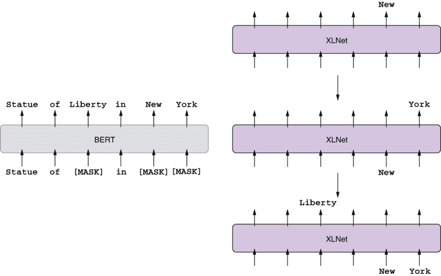

图 9.11 XLNet 以任意顺序生成标记。

XLNet 已经在 Transformers 库中实现，您只需更改几行代码即可使用该模型。

### 9.4.3 RoBERTa

RoBERTa（来自“robustly optimized BERT”）是另一个在研究和工业中常用的重要 PLM。RoBERTa 重新审视并修改了 BERT 的许多训练决策，使其达到甚至超过后 BERT PLMs 的性能，包括我们之前介绍的 XLNet。截至本文撰写时（2020 年中期），我个人的印象是，RoBERTa 在 BERT 之后是被引用最多的第二个 PLM，并且在许多英文下游 NLP 任务中表现出稳健的性能。

RoBERTa 在 BERT 的基础上进行了几项改进，但最重要（也是最直接）的是其训练数据量。RoBERTa 的开发者收集了五个不同大小和领域的英文语料库，总计超过 160 GB 的文本（而训练 BERT 仅使用了 16 GB）。仅仅通过使用更多的数据进行训练，RoBERTa 在微调后的下游任务中超越了一些其他强大的 PLMs，包括 XLNet。第二个修改涉及我们在第 9.2.3 节中提到的下一句预测（NSP）目标，在该目标中，BERT 被预先训练以分类第二个句子是否是跟随语料库中第一个句子的“真实”句子。RoBERTa 的开发者发现，通过移除 NSP（仅使用 MLM 目标进行训练），下游任务的性能保持大致相同或略有提高。除此之外，他们还重新审视了批量大小以及 MLM 的屏蔽方式。综合起来，这个新的预训练语言模型在诸如问答和阅读理解等下游任务中取得了最先进的结果。

因为 RoBERTa 使用与 BERT 相同的架构，并且两者都在 Transformers 中实现，所以如果您的应用程序已经使用 BERT，那么切换到 RoBERTa 将非常容易。

注意与 BERT 与 RoBERTa 类似，跨语言语言模型 XLM（在第 8.4.4 节中介绍）有其“优化鲁棒性”的同类称为 XLM-R（缩写为 XML-RoBERTa）。⁸ XLM-R 对 100 种语言进行了预训练，并在许多跨语言 NLP 任务中表现出竞争力。

### 9.4.4 DistilBERT

尽管诸如 BERT 和 RoBERTa 等预训练模型功能强大，但它们在计算上是昂贵的，不仅用于预训练，而且用于调整和进行预测。例如，BERT-base（常规大小的 BERT）和 BERT-large（较大的对应物）分别具有 1.1 亿和 3.4 亿个参数，几乎每个输入都必须通过这个巨大的网络进行预测。如果您要对基于 BERT 的模型（例如我们在第 9.3 节中构建的模型）进行微调和预测，那么您几乎肯定需要一个 GPU，这并不总是可用的，这取决于您的计算环境。例如，如果您想在手机上运行一些实时文本分析，BERT 将不是一个很好的选择（它甚至可能无法适应内存）。

为了降低现代大型神经网络的计算需求，通常使用*知识蒸馏*（或简称*蒸馏*）。这是一种机器学习技术，其中给定一个大型预训练模型（称为*教师模型*），会训练一个较小的模型（称为*学生模型*）来模仿较大模型的行为。有关更多详细信息，请参见图 9.12。学生模型使用掩码语言模型（MLM）损失（与 BERT 相同），以及教师和学生之间的交叉熵损失。这将推动学生模型产生与教师尽可能相似的预测标记的概率分布。

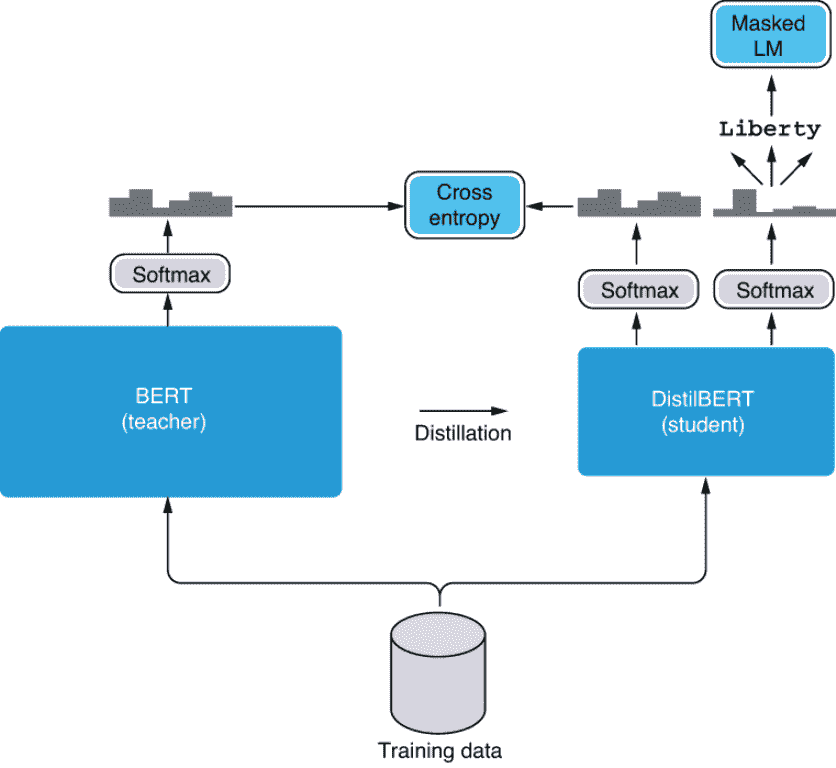

图 9.12 知识蒸馏结合了交叉熵和掩码 LM 目标。

Hugging Face 的研究人员开发了 BERT 的精简版本称为*DistilBERT*，⁹它的大小缩小了 40%，速度提高了 60%，同时与 BERT 相比重新训练了 97%的任务性能。您只需将传递给 AutoModel.from_pretrained()的模型名称（例如，bert-base-cased）替换为精炼版本（例如，distilbert-base-cased），同时保持其余代码不变即可使用 DistilBERT。

### 9.4.5 ALBERT

另一个解决了 BERT 计算复杂性问题的预训练语言模型是 ALBERT，¹⁰简称“轻量 BERT”。与采用知识蒸馏不同，ALBERT 对其模型和训练过程进行了一些修改。

ALBERT 对其模型进行的一个设计变化是它如何处理词嵌入。在大多数深度 NLP 模型中，词嵌入由一个大的查找表表示和存储，该表包含每个词的一个词嵌入向量。这种管理嵌入的方式通常适用于较小的模型，如 RNN 和 CNN。然而，对于基于 Transformer 的模型，如 BERT，输入的维度（即长度）需要与隐藏状态的维度匹配，通常为 768 维。这意味着模型需要维护一个大小为 V 乘以 768 的大查找表，其中 V 是唯一词汇项的数量。因为在许多 NLP 模型中 V 也很大（例如，30,000），所以产生的查找表变得巨大，并且占用了大量的内存和计算。

ALBERT 通过将词嵌入查找分解为两个阶段来解决这个问题，如图 9.13 所示。第一阶段类似于从映射表中检索词嵌入，只是词嵌入向量的输出维度较小（比如，128 维）。在下一个阶段，使用线性层扩展这些较短的向量，使它们与模型的所需输入维度相匹配（比如，768）。这类似于我们如何使用 Skip-gram 模型扩展词嵌入（第 3.4 节）。由于这种分解，ALBERT 只需要存储两个较小的查找表（V × 128，加上 128 × 768），而不是一个大的查找表（V × 768）。

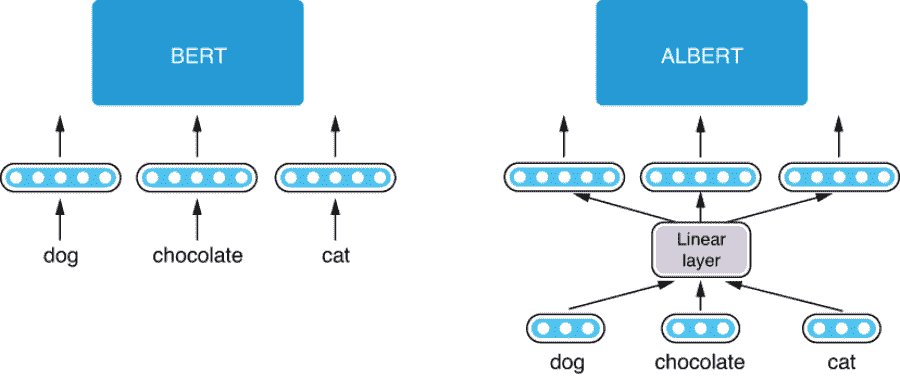

图 9.13 ALBERT（右）将词嵌入分解为两个较小的投影。

ALBERT 实施的另一个设计变化是 Transformer 层之间的参数共享。Transformer 模型使用一系列自注意力层来转换输入向量。这些层将输入转换的方式通常各不相同——第一层可能以一种方式转换输入（例如，捕获基本短语），而第二层可能以另一种方式进行转换（例如，捕获一些句法信息）。然而，这意味着模型需要针对每一层保留所有必要的参数（用于键、查询和值的投影），这是昂贵的，并且占用了大量内存。相反，ALBERT 的所有层都共享相同的参数集，这意味着模型重复应用相同的转换到输入上。这些参数被调整为这样一种方式，即尽管它们相同，一系列转换对于预测目标是有效的。

最后，ALBERT 使用一种称为 *句子顺序预测*（SOP）的训练目标进行预训练，而不是 BERT 采用的下一个句子预测（NSP）。正如前面提到的，RoBERTa 的开发人员和其他一些人发现 NSP 目标基本无用，并决定将其排除。ALBERT 用句子顺序预测 (SOP) 取代了 NSP，在这个任务中，模型被要求预测两个连续文本段落的顺序。例如：¹¹

+   (A) 她和她的男朋友决定去散步。 (B) 走了一英里后，发生了一些事情。

+   (C) 然而，周边区域的一位老师帮助了我站起来。(D) 起初，没有人愿意帮我站起来。

在第一个示例中，你可以知道 A 发生在 B 之前。在第二个示例中，顺序被颠倒，D 应该在 C 之前。这对人类来说很容易，但对机器来说是一个困难的任务——自然语言处理模型需要学会忽略表面主题信号（例如，“去散步”，“步行超过一英里”，“帮我站起来”），并专注于话语级连贯性。使用这种目标进行训练使得模型更加强大且可用于更深入的自然语言理解任务。

因此，ALBERT 能够通过更少的参数扩大其训练并超越 BERT-large。与 DistilBERT 一样，ALBERT 的模型架构与 BERT 几乎完全相同，您只需在调用 AutoModel.from_pretrained() 时提供模型名称即可使用它 （例如，albert-base-v1）。

## 9.5 案例研究 2：BERT 自然语言推理

在本章的最后一部分，我们将构建自然语言推理的 NLP 模型，这是一个预测句子之间逻辑关系的任务。我们将使用 AllenNLP 构建模型，同时演示如何将 BERT（或任何其他基于 Transformer 的预训练模型）集成到你的管道中。

### 9.5.1 什么是自然语言推理？

*自然语言推理*（简称 NLI）是确定一对句子之间逻辑关系的任务。具体而言，给定一个句子（称为*前提*）和另一个句子（称为*假设*），你需要确定假设是否从前提中逻辑推演出来。在以下示例中，这更容易理解。¹²

| 前提 | 假设 | 标签 |
| --- | --- | --- |
| 一名男子查看一个身穿东亚某国制服的人物。 | 男子正在睡觉。 | 矛盾 |
| 一名年长和一名年轻男子微笑着。 | 两名男子对在地板上玩耍的猫笑着。 | 中性 |
| 进行多人踢足球的比赛。 | 一些男人正在运动。 | 蕴涵 |

在第一个例子中，假设（“这个人正在睡觉”）显然与前提（“一个人正在检查…”）相矛盾，因为一个人不能在睡觉时检查某事。在第二个例子中，你无法确定假设是否与前提矛盾或被前提蕴含（特别是“笑猫”的部分），这使得关系是“中性”的。在第三个例子中，你可以从前提中逻辑推断出假设——换句话说，假设被前提蕴含。

正如你猜到的那样，即使对于人类来说，NLI 也可能是棘手的。这项任务不仅需要词汇知识（例如，“人”的复数是“人们”，足球是一种运动），还需要一些“常识”（例如，你不能在睡觉时检查）。NLI 是最典型的自然语言理解（NLU）任务之一。你如何构建一个 NLP 模型来解决这个任务？

幸运的是，NLI 是 NLP 中一个经过深入研究的领域。NLI 最流行的数据集是标准自然语言推理（SNLI）语料库（[`nlp.stanford.edu/projects/snli/`](https://nlp.stanford.edu/projects/snli/)），已被大量用作 NLP 研究的基准。接下来，我们将使用 AllenNLP 构建一个神经 NLI 模型，并学习如何为这个特定任务使用 BERT。

在继续之前，请确保你已经安装了 AllenNLP（我们使用的是版本 2.5.0）和 AllenNLP 模型的模块。你可以通过运行以下代码来安装它们：

```py
pip install allennlp==2.5.0
pip install allennlp-models==2.5.0
```

这也将 Transformers 库安装为一个依赖项。

### 9.5.2 使用 BERT 进行句对分类

在我们开始构建模型之前，请注意，NLI 任务的每个输入都由两部分组成：前提和假设。本书涵盖的大多数 NLP 任务仅有一个部分——通常是模型的输入的一个部分——通常是单个句子。我们如何构建一个可以对句子对进行预测的模型？

我们有多种方法来处理 NLP 模型的多部分输入。我们可以使用编码器对每个句子进行编码，并对结果应用一些数学操作（例如，串联、减法），以得到一对句子的嵌入（顺便说一句，这是孪生网络的基本思想¹³）。研究人员还提出了更复杂的具有注意力的神经网络模型，例如 BiDAF¹⁴。

然而，从本质上讲，没有什么阻止 BERT 接受多个句子。因为 Transformer 接受任何令牌序列，你可以简单地将两个句子串联起来并将它们输入模型。如果你担心模型混淆了两个句子，你可以用一个特殊的令牌，[SEP]，将它们分开。你还可以为每个句子添加不同的值作为模型的额外信号。BERT 使用这两种技术对模型进行了少量修改，以解决句对分类任务，如 NLI。

流水线的其余部分与其他分类任务类似。特殊令牌[CLS]被附加到每个句子对，从中提取输入的最终嵌入。最后，您可以使用分类头将嵌入转换为一组与类相对应的值（称为*logits*）。这在图 9.14 中有所说明。

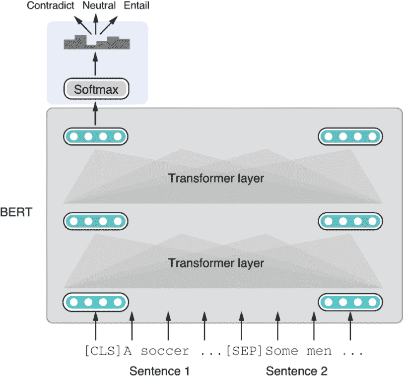

图 9.14 使用 BERT 对一对句子进行馈送和分类

在实践中，连接和插入特殊令牌都是由 SnliReader 处理的，这是专门用于处理 SNLI 数据集的 AllenNLP 数据集读取器。您可以初始化数据集并观察它如何将数据转换为 AllenNLP 实例，代码如下：

```py
from allennlp.data.tokenizers import PretrainedTransformerTokenizer
from allennlp_models.pair_classification.dataset_readers import SnliReader

BERT_MODEL = 'bert-base-cased'
tokenizer = PretrainedTransformerTokenizer(model_name=BERT_MODEL, add_special_tokens=False)

reader = SnliReader(tokenizer=tokenizer)
dataset_url = 'https://realworldnlpbook.s3.amazonaws.com/data/snli/snli_1.0_dev.jsonl'
for instance in reader.read():
    print(instance)
```

数据集读取器从斯坦福 NLI 语料库中获取一个 JSONL（JSON 行）文件，并将其转换为一系列 AllenNLP 实例。我们指定了一个我在线上（S3）放置的数据集文件的 URL。请注意，在初始化分词器时，您需要指定 add_special_tokens=False。这听起来有点奇怪——难道我们不是应该在这里添加特殊令牌吗？这是必需的，因为数据集读取器（SnliReader）而不是分词器会处理特殊令牌。如果您仅使用 Transformer 库（而不是 AllenNLP），则不需要此选项。

前面的代码片段生成了以下生成的实例的转储：

```py
Instance with fields:
         tokens: TextField of length 29 with text:
                [[CLS], Two, women, are, em, ##bracing, while, holding, to, go, packages,
 ., [SEP], The, sisters, are, hugging, goodbye, while, holding, to, go, 
 packages, after, just, eating, lunch, ., [SEP]]
                and TokenIndexers : {'tokens': 'SingleIdTokenIndexer'}
         label: LabelField with label: neutral in namespace: 'labels'.'

Instance with fields:
         tokens: TextField of length 20 with text:
                [[CLS], Two, women, are, em, ##bracing, while, holding, to, go, packages,
 ., [SEP], Two, woman, are, holding, packages, ., [SEP]]
                and TokenIndexers : {'tokens': 'SingleIdTokenIndexer'}
         label: LabelField with label: entailment in namespace: 'labels'.'

Instance with fields:
         tokens: TextField of length 23 with text:
                [[CLS], Two, women, are, em, ##bracing, while, holding, to, go, packages,
 ., [SEP], The, men, are, fighting, outside, a, del, ##i, ., [SEP]]
                and TokenIndexers : {'tokens': 'SingleIdTokenIndexer'}
         label: LabelField with label: contradiction in namespace: 'labels'.'
...
```

请注意，每个句子都经过了标记化，并且句子被连接并由[SEP]特殊令牌分隔。每个实例还有一个包含金标签的标签字段。

注意：您可能已经注意到令牌化结果中出现了一些奇怪的字符，例如##bracing 和##i。这些是字节对编码（BPE）的结果，这是一种将单词分割为所谓的*子词单元*的标记化算法。我们将在第十章中详细介绍 BPE。

### 9.5.3 使用 AllenNLP 与 Transformers

现在我们准备使用 AllenNLP 构建我们的模型。好消息是，由于 AllenNLP 的内置模块，您不需要编写任何 Python 代码来构建 NLI 模型——您只需要编写一个 Jsonnet 配置文件（就像我们在第四章中所做的那样）。AllenNLP 还无缝集成了 Hugging Face 的 Transformer 库，因此即使您想要将基于 Transformer 的模型（如 BERT）集成到现有模型中，通常也只需要进行很少的更改。

当将 BERT 集成到您的模型和流水线中时，您需要对以下四个组件进行更改：

+   *Tokenizer*—就像您在之前的 9.3 节中所做的那样，您需要使用与您正在使用的预训练模型相匹配的分词器。

+   *Token indexer*—Token indexer 将令牌转换为整数索引。由于预训练模型带有其自己预定义的词汇表，因此很重要您使用匹配的令牌索引器。

+   *Token embedder*—Token embedder 将令牌转换为嵌入。这是 BERT 的主要计算发生的地方。

+   *Seq2Vec 编码器*—BERT 的原始输出是一系列嵌入。您需要一个 Seq2Vec 编码器将其转换为单个嵌入向量。

如果这听起来令人生畏，不要担心—在大多数情况下，你只需要记住使用所需模型的名称来初始化正确的模块。接下来我会引导你完成这些步骤。

首先，让我们定义我们用于读取和转换 SNLI 数据集的数据集。我们之前已经用 Python 代码做过这个了，但在这里我们将在 Jsonnet 中编写相应的初始化。首先，让我们使用以下代码定义我们将在整个流水线中使用的模型名称。Jsonnet 相对于普通 JSON 的一个很酷的功能是你可以定义和使用变量：

```py
local bert_model = "bert-base-cased";
```

配置文件中初始化数据集的第一部分看起来像以下内容：

```py
"dataset_reader": {
    "type": "snli",
    "tokenizer": {
        "type": "pretrained_transformer",
        "model_name": bert_model,
        "add_special_tokens": false
    },
    "token_indexers": {
        "bert": {
            "type": "pretrained_transformer",
            "model_name": bert_model,
        }
    }
},
```

在顶层，这是初始化一个由类型 snli 指定的数据集读取器，它是我们之前尝试过的 SnliReader。数据集读取器需要两个参数—tokenizer 和 token_indexers。对于 tokenizer，我们使用一个 PretrainedTransformerTokenizer（类型：pretrained_transformer）并提供一个模型名称。同样，这是我们之前在 Python 代码中初始化和使用的分词器。请注意 Python 代码和 Jsonnet 配置文件之间的良好对应关系。大多数 AllenNLP 模块都设计得非常好，使得这两者之间有着很好的对应关系，如下表所示。

| Python 代码 | Jsonnet 配置 |
| --- | --- |
| tokenizer = PretrainedTransformerTokenizer(model_name=BERT_MODEL,add_special_tokens=False) | "tokenizer": {"type": "pretrained_transformer","model_name": bert_model,"add_special_tokens": false} |

初始化令牌索引器部分可能看起来有点混乱。它正在使用模型名称初始化一个 PretrainedTransformerIndexer（类型：pretrained_transformer）。索引器将把索引结果存储到名为 bert 的部分（对应于令牌索引器的键）。幸运的是，这段代码是一个样板，从一个模型到另一个模型几乎没有变化，很可能当你在一个新的基于 Transformer 的模型上工作时，你可以简单地复制并粘贴这一部分。

至于训练/验证数据，我们可以使用本书的 S3 存储库中的数据，如下所示：

```py
"train_data_path": "https://realworldnlpbook.s3.amazonaws.com/data/snli/snli_1.0_train.jsonl",
"validation_data_path": "https://realworldnlpbook.s3.amazonaws.com/data/snli/snli_1.0_dev.jsonl",
```

现在我们准备开始定义我们的模型：

```py
"model": {
    "type": "basic_classifier",

    "text_field_embedder": {
        "token_embedders": {
            "bert": {
                "type": "pretrained_transformer",
                "model_name": bert_model
            }
        }
    },
    "seq2vec_encoder": {
        "type": "bert_pooler",
        "pretrained_model": bert_model
    }
},
```

在顶层，此部分定义了一个 BasicClassifier 模型（类型：basic_classifier）。它是一个通用的文本分类模型，它嵌入输入，使用 Seq2Vec 编码器对其进行编码，并使用分类头进行分类（带有 softmax 层）。您可以将您选择的嵌入器和编码器作为模型的子组件“插入”。例如，您可以通过单词嵌入嵌入标记，并使用 RNN 对序列进行编码（这是我们在第四章中所做的）。或者，您可以使用 CNN 对序列进行编码，就像我们在第七章中所做的那样。这就是 AllenNLP 设计的优点所在——通用模型仅指定了*什么*（例如，一个 TextFieldEmbedder 和一个 Seq2VecEncoder），但不是确切的*如何*（例如，单词嵌入、RNN、BERT）。您可以使用任何嵌入/编码输入的子模块，只要这些子模块符合指定的接口（即，它们是所需类的子类）。

在这个案例研究中，我们将首先使用 BERT 对输入序列进行嵌入。这是通过一个特殊的标记嵌入器，PretrainedTransformerEmbedder（类型：pretrained_transformer）实现的，它接受 Transformer 分词器的结果，经过预训练的 BERT 模型，并产生嵌入的输入。您需要将此嵌入器作为 token_embedders 参数的 bert 键的值传递（您之前为 token_indexers 指定的那个）。

然而，从 BERT 中得到的原始输出是一系列嵌入。因为我们感兴趣的是对给定的句子对进行分类，我们需要提取整个序列的嵌入，这可以通过提取与 CLS 特殊标记对应的嵌入来完成。AllenNLP 实现了一种称为 BertPooler（类型：bert_pooler）的 Seq2VecEncoder 类型，它正是这样做的。

在嵌入和编码输入之后，基本分类器模型处理剩下的事情——嵌入经过一个线性层，将它们转换为一组 logits，并且整个网络使用交叉熵损失进行训练，就像其他分类模型一样。整个配置文件如下所示。

列表 9.4 使用 BERT 训练 NLI 模型的配置文件

```py
local bert_model = "bert-base-cased";

{
    "dataset_reader": {
        "type": "snli",
        "tokenizer": {
            "type": "pretrained_transformer",
            "model_name": bert_model,
            "add_special_tokens": false
        },
        "token_indexers": {
            "bert": {
                "type": "pretrained_transformer",
                "model_name": bert_model,
            }
        }
    },
    "train_data_path": "https://realworldnlpbook.s3.amazonaws.com/data/snli/snli_1.0_train.jsonl",
    "validation_data_path": "https://realworldnlpbook.s3.amazonaws.com/data/snli/snli_1.0_dev.jsonl",

    "model": {
        "type": "basic_classifier",

        "text_field_embedder": {
            "token_embedders": {
                "bert": {
                    "type": "pretrained_transformer",
                    "model_name": bert_model
                }
            }
        },
        "seq2vec_encoder": {
            "type": "bert_pooler",
            "pretrained_model": bert_model,
        }
    },
    "data_loader": {
        "batch_sampler": {
            "type": "bucket",
            "sorting_keys": ["tokens"],
            "padding_noise": 0.1,
            "batch_size" : 32
        }
    },
    "trainer": {
        "optimizer": {
            "type": "huggingface_adamw",
            "lr": 5.0e-6
        },
        "validation_metric": "+accuracy",
        "num_epochs": 30,
        "patience": 10,
        "cuda_device": 0
    }
}
```

如果您不熟悉数据加载器和训练器部分正在发生的事情也没关系。我们将在第十章讨论这些主题（批处理、填充、优化、超参数调整）。在将此配置文件保存在 examples/nli/snli_transformers.jsonnet 后，您可以通过运行以下代码开始训练过程：

```py
allennlp train examples/nli/snli_transformers.jsonnet --serialization-dir models/snli
```

这将运行一段时间（即使在诸如 Nvidia V100 这样的快速 GPU 上也是如此），并在 stdout 上产生大量的日志消息。以下是我在四个时期后得到的日志消息的片段：

```py
...
allennlp.training.trainer - Epoch 4/29
allennlp.training.trainer - Worker 0 memory usage MB: 6644.208
allennlp.training.trainer - GPU 0 memory usage MB: 8708
allennlp.training.trainer - Training
allennlp.training.trainer - Validating
allennlp.training.tensorboard_writer -                        Training |  Validation
allennlp.training.tensorboard_writer - accuracy           |     0.933  |     0.908
allennlp.training.tensorboard_writer - gpu_0_memory_MB    |  8708.000  |       N/A
allennlp.training.tensorboard_writer - loss               |     0.190  |     0.293
allennlp.training.tensorboard_writer - reg_loss           |     0.000  |     0.000
allennlp.training.tensorboard_writer - worker_0_memory_MB |  6644.208  |       N/A
allennlp.training.checkpointer - Best validation performance so far. Copying weights to 'models/snli/best.th'.
allennlp.training.trainer - Epoch duration: 0:21:39.687226
allennlp.training.trainer - Estimated training time remaining: 9:04:56
...
```

注意验证准确率（0.908）。考虑到这是一个三类分类，随机基线只会是 0.3。相比之下，当我用基于 LSTM 的 RNN 替换 BERT 时，我得到的最佳验证准确率约为~0.68。我们需要更仔细地进行实验，以公平地比较不同模型之间的差异，但这个结果似乎表明 BERT 是解决自然语言理解问题的强大模型。

## 摘要

+   转移学习是一个机器学习概念，其中一个模型学习了一个任务，然后通过在它们之间转移知识来应用到另一个任务上。这是许多现代、强大、预训练模型的基本概念。

+   BERT 是一个使用掩码语言建模和下一句预测目标进行预训练的 Transformer 编码器，以产生上下文化的嵌入，一系列考虑上下文的词嵌入。

+   ELMo、XLNet、RoBERTa、DistilBERT 和 ALBERT 是现代深度自然语言处理中常用的其他流行的预训练模型。

+   你可以直接使用 Hugging Face 的 Transformers 库构建基于 BERT 的 NLP 应用，也可以使用无缝集成 Transformers 库的 AllenNLP。 

^(1.)Ramponi 和 Plank，“NLP 中的神经无监督领域自适应——一项调查”，（2020）。[`arxiv.org/abs/2006.00632`](https://arxiv.org/abs/2006.00632)。

^(2.)Jacob Devlin，Ming-Wei Chang，Kenton Lee 和 Kristina Toutanova，“BERT：用于语言理解的深度双向 Transformer 预训练”，（2018）。[`arxiv.org/abs/1810.04805`](https://arxiv.org/abs/1810.04805)。

^(3.)Bryan McCann，James Bradbury，Caiming Xiong 和 Richard Socher，“翻译中学到的：上下文化的词向量”，2017 年 NIPS 会议。

^(4.)Peters 等人，“深度上下文化的词表示”，（2018）。[`arxiv.org/abs/1802.05365`](https://arxiv.org/abs/1802.05365)。

^(5.)点击这里查看有关如何使用 ELMo 与 AllenNLP 的详细文档：[`allennlp.org/elmo`](https://allennlp.org/elmo)。

^(6.)请参阅[`huggingface.co/transformers/model_doc/xlnet.html`](https://huggingface.co/transformers/model_doc/xlnet.html)以获取文档。

^(7.)Liu 等人，“RoBERTa：一个稳健优化的 BERT 预训练方法，”（2019）。[`arxiv.org/abs/1907.11692`](https://arxiv.org/abs/1907.11692)。

^(8.)Conneau 等人，“规模化的无监督跨语言表示学习”，（2019）。[`arxiv.org/abs/1911.02116`](https://arxiv.org/abs/1911.02116)。

^(9.)Sanh 等人，“DistilBERT，BERT 的精简版：更小、更快、更便宜、更轻”，（2019）。[`arxiv.org/abs/1910.01108`](https://arxiv.org/abs/1910.01108)。

^(10.)Lan 等人，“ALBERT：一种用于自监督学习语言表示的轻量级 BERT”，（2020）。[`arxiv.org/abs/1909.11942`](https://arxiv.org/abs/1909.11942)。

^(11.)这些示例来自 ROCStories：[`cs.rochester.edu/nlp/rocstories/`](https://cs.rochester.edu/nlp/rocstories/)。

^(12.)这些示例来自于[`nlpprogress.com/english/natural_language_inference.html`](http://nlpprogress.com/english/natural_language_inference.html).

^(13.)Reimers 和 Gurevych，“使用 Siamese BERT-Network 的句子嵌入：Sentence-BERT”，(2019)。[`arxiv.org/abs/1908.10084`](https://arxiv.org/abs/1908.10084).

^(14.)Seo 等人，“面向机器理解的双向注意力流”，(2018)。[`arxiv.org/abs/1611.01603`](https://arxiv.org/abs/1611.01603).
