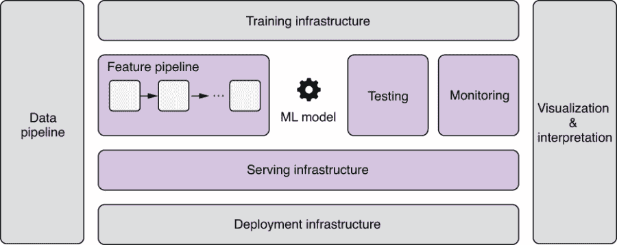
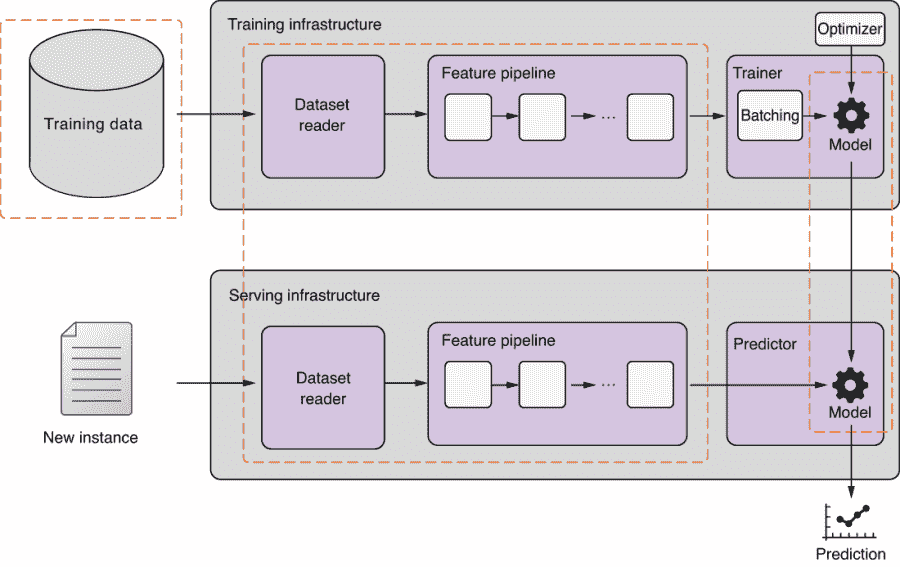
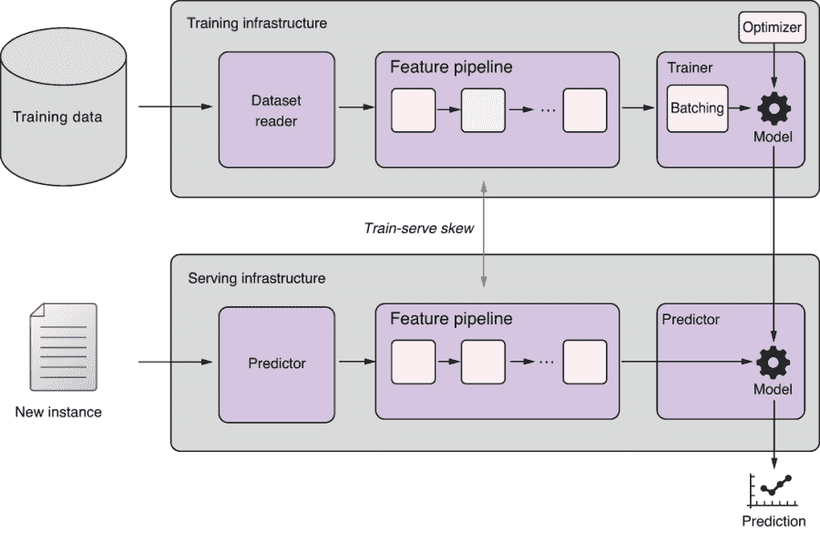
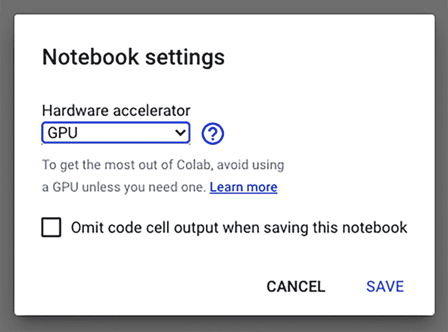
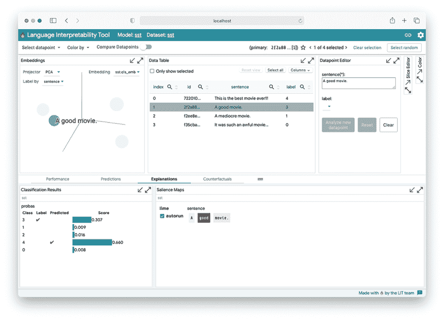

# 第十一章：部署和提供 NLP 应用程序

本章涵盖

+   选择适合您的 NLP 应用程序的正确架构

+   版本控制您的代码、数据和模型

+   部署和提供您的 NLP 模型

+   使用 LIT（Language Interpretability Tool）解释和分析模型预测

本书的第 1 至 10 章是关于构建 NLP 模型的，而本章涵盖的是*不在* NLP 模型之外发生的一切。为什么这很重要？难道 NLP 不都是关于构建高质量的 ML 模型吗？如果您没有太多生产 NLP 系统的经验，这可能会让您感到惊讶，但典型现实世界的 ML 系统的很大一部分与 NLP 几乎没有关系。如图 11.1 所示，典型实际 ML 系统的只有一小部分是 ML 代码，但“ML 代码”部分由提供各种功能的许多组件支持，包括数据收集、特征提取和服务。让我们用核电站作为类比。在操作核电站时，只有一小部分涉及核反应。其他一切都是支持安全有效地生成和传输材料和电力的庞大而复杂的基础设施——如何利用生成的热量转动涡轮发电，如何安全冷却和循环水，如何高效传输电力等等。所有这些支持基础设施与核物理几乎无关。



图 11.1 一个典型的 ML 系统由许多不同的组件组成，而 ML 代码只是其中的一小部分。我们在本章中介绍了突出显示的组件。

部分原因是由于大众媒体上的“人工智能炒作”，我个人认为人们过分关注 ML 建模部分，而对如何以有用的方式为模型提供服务关注不足。毕竟，您的产品的目标是向用户提供价值，而不是仅仅为他们提供模型的原始预测。即使您的模型准确率达到 99%，如果您无法充分利用预测，使用户受益，那么它就没有用。用之前的类比来说，用户想要用电来驱动家用电器并照亮房屋，而不太在意电是如何生成的。

在本章的其余部分，我们将讨论如何构建您的 NLP 应用程序——我们侧重于在可靠和有效的方式设计和开发 NLP 应用程序时的一些最佳实践。然后我们谈论部署您的 NLP 模型——这是我们如何将 NLP 模型投入生产并提供其预测的方法。

## 11.1 构建您的 NLP 应用程序架构

*机器学习工程*仍然是软件工程。所有最佳实践（解耦的软件架构、设计良好的抽象、清晰易读的代码、版本控制、持续集成等）同样适用于 ML 工程。在本节中，我们将讨论一些特定于设计和构建 NLP/ML 应用程序的最佳实践。

### 11.1.1 机器学习之前

我明白这是一本关于 NLP 和 ML 的书，但在您开始着手处理您的 NLP 应用程序之前，您应该认真考虑您是否真的需要 ML 来解决您的产品问题。构建一个 ML 系统并不容易——需要花费大量的时间和金钱来收集数据、训练模型和提供预测。如果您可以通过编写一些规则来解决问题，那就这样做吧。作为一个经验法则，如果深度学习模型可以达到 80% 的准确率，那么一个更简单的基于规则的模型至少可以将您带到一半的路上。

此外，如果有现成的解决方案，您应该考虑使用。许多开源的 NLP 库（包括我们在整本书中广泛使用的 AllenNLP 和 Transformers 两个库）都提供了各种预训练模型。云服务提供商（如 AWS AI 服务 ([`aws.amazon.com/machine-learning/ai-services/`](https://aws.amazon.com/machine-learning/ai-services/))、Google Cloud AutoML ([`cloud.google.com/automl`](https://cloud.google.com/automl)) 和 Microsoft Azure Cognitive Services ([`azure.microsoft.com/en-us/services/cognitive-services/`](https://azure.microsoft.com/en-us/services/cognitive-services/))）为许多领域提供了广泛的与 ML 相关的 API，包括 NLP。如果您的任务可以通过它们提供的解决方案进行零或少量修改来解决，那通常是构建 NLP 应用的一种成本效益较高的方式。毕竟，任何 NLP 应用程序中最昂贵的组件通常是高技能人才（即您的工资），在您全力投入并构建内部 NLP 解决方案之前，您应该三思而后行。

此外，您不应排除“传统”的机器学习方法。在本书中，我们很少关注传统的 ML 模型，但在深度 NLP 方法出现之前，您可以找到丰富的统计 NLP 模型的文献。使用统计特征（例如 n-gram）和 ML 模型（例如 SVM）快速构建原型通常是一个很好的开始。非深度学习算法，例如 *梯度提升决策树*（GBDT），通常以比深度学习方法更低的成本几乎同样有效，如果不是更好。

最后，我始终建议从开发验证集和选择正确的评估指标开始，甚至在开始选择正确的 ML 方法之前。验证集不需要很大，大多数人都可以抽出几个小时手动注释几百个实例。这样做有很多好处——首先，通过手动解决任务，你可以感受到在解决问题时什么是重要的，以及是否真的可以自动解决。其次，通过把自己置于机器的角度，你可以获得许多关于任务的见解（数据是什么样子，输入和输出数据是如何分布的，它们是如何相关的），这在实际设计 ML 系统来解决它时变得有价值。

### 11.1.2 选择正确的架构

除了极少数情况下，ML 系统的输出本身就是最终产品（比如机器翻译）之外，NLP 模块通常与一个更大的系统交互，共同为最终用户提供一些价值。例如，垃圾邮件过滤器通常被实现为嵌入在更大的应用程序（邮件服务）中的模块或微服务。语音助手系统通常是许多 ML/NLP 子组件的大型、复杂组合，包括语音识别、句子意图分类、问答和语音生成，它们相互交互。即使是机器翻译模型，如果包括数据管道、后端和最终用户交互的翻译界面，也可以是更大复杂系统中的一个小组件。

NLP 应用可以采取多种形式。令人惊讶的是，许多 NLP 组件可以被构造为一次性任务，它以一些静态数据作为输入，产生转换后的数据作为输出。例如，如果你有一组文档的静态数据库，并且想要按其主题对它们进行分类，你的 NLP 分类器可以是一个简单的一次性 Python 脚本，运行这个分类任务。如果你想要从同一数据库中提取通用实体（例如公司名称），你可以编写一个 Python 脚本来运行一个命名实体识别（NER）模型来实现。甚至一个基于文本相似度找到对象的文本推荐引擎也可以是一个每日任务，它从数据库读取数据并写入数据。你不需要设计一个复杂的软件系统，其中有许多服务相互交流。

许多其他 NLP 组件可以被构造成批量运行预测的（微）服务，这是我推荐的许多场景的架构。例如，垃圾邮件过滤器并不需要在每封邮件到达时立即对其进行分类 - 系统可以将到达系统的一定数量的邮件排队，并将批处理的邮件传递给分类器服务。NLP 应用程序通常通过某种中介（例如 RESTful API 或排队系统）与系统的其余部分进行通信。这种配置非常适合需要对其预测保持一定新鲜度的应用程序（毕竟，用户不希望等待几个小时直到他们的电子邮件到达收件箱），但要求并不那么严格。

最后，NLP 组件也可以设计成为提供实时预测的方式。例如，当观众需要演讲的实时字幕时，这是必要的。另一个例子是当系统想要根据用户的实时行为显示广告时。对于这些情况，NLP 服务需要接收一系列输入数据（如音频或用户事件），并生成另一系列数据（如转录文本或广告点击概率）。诸如 Apache Flink ([`flink.apache.org/`](https://flink.apache.org/)) 这样的*实时流处理框架*经常用于处理此类流数据。另外，如果您的应用程序基于服务器-客户端架构，例如典型的移动和 Web 应用程序，并且您想向用户显示一些实时预测，您可以选择在客户端上运行 ML/NLP 模型，例如 Web 浏览器或智能手机。诸如 TensorFlow.js ([`www.tensorflow.org/js`](https://www.tensorflow.org/js))、Core ML ([`developer.apple.com/documentation/coreml`](https://developer.apple.com/documentation/coreml)) 和 ML Kit ([`developers.google.com/ml-kit`](https://developers.google.com/ml-kit)) 这样的客户端 ML 框架可用于此类目的。

### 11.1.3 项目结构

许多 NLP 应用程序遵循着类似的项目结构。一个典型的 NLP 项目可能需要管理数据集以从中训练模型，预处理数据生成的中间文件，由训练产生的模型文件，用于训练和推断的源代码，以及存储有关训练和推断的其他信息的日志文件。

因为典型的 NLP 应用程序有许多共同的组件和目录，所以如果您在启动新项目时只是遵循最佳实践作为默认选择，那将是有用的。以下是我为组织您的 NLP 项目提出的建议：

+   *数据管理*—创建一个名为 data 的目录，并将所有数据放入其中。将其进一步细分为原始、中间和结果目录可能也会有所帮助。原始目录包含您外部获取的未经处理的数据集文件（例如我们在本书中一直在使用的斯坦福情感树库）或内部构建的文件。非常重要的一点是*不要手动修改此原始目录中的任何文件*。如果需要进行更改，请编写一个运行一些处理以针对原始文件运行的脚本，然后将结果写入中间目录的脚本，该目录用作中间结果的存储位置。或者创建一个管理您对原始文件进行的“差异”的补丁文件，并将补丁文件进行版本控制。最终的结果，例如预测和指标，应存储在结果目录中。

+   *虚拟环境*—强烈建议您在虚拟环境中工作，以便您的依赖项分开且可重现。您可以使用诸如 Conda ([`docs.conda.io/en/latest/`](https://docs.conda.io/en/latest/))（我推荐的）和 venv ([`docs.python.org/3/library/venv.html`](https://docs.python.org/3/library/venv.html)) 等工具为您的项目设置一个单独的环境，并使用 pip 安装单个软件包。Conda 可以将环境配置导出到一个 environment.yml 文件中，您可以使用该文件来恢复确切的 Conda 环境。您还可以将项目的 pip 包跟踪在一个 requirements.txt 文件中。更好的是，您可以使用 Docker 容器来管理和打包整个 ML 环境。这极大地减少了与依赖项相关的问题，并简化了部署和服务化。

+   *实验管理*—NLP 应用程序的训练和推理管道通常包括多个步骤，例如预处理和连接数据，将其转换为特征，训练和运行模型，以及将结果转换回人类可读格式。如果试图手动记住管理这些步骤，很容易失控。一个好的做法是在一个 shell 脚本文件中跟踪管道的步骤，以便只需一个命令即可重现实验，或者使用依赖管理软件，如 GNU Make、Luigi ([`github.com/spotify/luigi`](https://github.com/spotify/luigi)) 和 Apache Airflow ([`airflow.apache.org/`](https://airflow.apache.org/))。

+   *源代码*—Python 源代码通常放在与项目同名的目录中，该目录进一步细分为诸如 data（用于数据处理代码）、model（用于模型代码）和 scripts（用于放置用于训练和其他一次性任务的脚本）等目录。

### 11.1.4 版本控制

您可能不需要说服您版本控制您的源代码很重要。像 Git 这样的工具帮助您跟踪变更并管理源代码的不同版本。NLP/ML 应用程序的开发通常是一个迭代过程，在此过程中，您（通常与其他人）对源代码进行许多更改，并尝试许多不同的模型。您很容易最终拥有一些略有不同版本的相同代码。

除了对源代码进行版本控制外，对*数据和模型进行版本控制*也很重要。这意味着您应该分别对训练数据、源代码和模型进行版本控制，如图 11.2 中虚线框所示。这是常规软件项目和机器学习应用之间的主要区别之一。机器学习是通过数据改进计算机算法的过程。根据定义，任何机器学习系统的行为都取决于其所接收的数据。这可能会导致即使您使用相同的代码，系统的行为也会有所不同的情况。

工具如 Git Large File Storage ([`git-lfs.github.com/`](https://git-lfs.github.com/))和 DVC ([`dvc.org`](https://dvc.org))可以以无缝的方式对数据和模型进行版本控制。即使您不使用这些工具，您也应该至少将不同版本作为清晰命名的单独文件进行管理。



图 11.2 机器学习组件的版本控制：训练数据、源代码和模型

在一个更大更复杂的机器学习项目中，您可能希望将模型和特征管道的版本控制分开，因为机器学习模型的行为可能会因为您对输入进行预处理的方式不同而不同，即使是相同的模型和输入数据。这也将减轻我们稍后将在 11.3.2 节讨论的训练服务偏差问题。

最后，当您在机器学习应用上工作时，您将尝试许多不同的设置——不同的训练数据集、特征管道、模型和超参数的组合——这可能会很难控制。我建议您使用一些实验管理系统来跟踪训练设置，例如 Weights & Biases ([`wandb.ai/`](https://wandb.ai/))，但您也可以使用像手动输入实验信息的电子表格这样简单的东西。在跟踪实验时，请务必记录每个实验的以下信息：

+   使用的模型代码版本、特征管道和训练数据的版本

+   用于训练模型的超参数

+   训练数据和验证数据的评估指标

像 AllenNLP 这样的平台默认支持实验配置，这使得前两项变得容易。工具如 TensorBoard，它们默认由 AllenNLP 和 Hugging Face 支持，使得跟踪各种指标变得轻而易举。

## 11.2 部署您的 NLP 模型

在本节中，我们将进入部署阶段，将您的 NLP 应用程序放在服务器上，并可供使用。我们将讨论部署 NLP/ML 应用程序时的实际考虑因素。

### 11.2.1 测试

与软件工程一样，测试是构建可靠的 NLP/ML 应用程序的重要组成部分。最基本和重要的测试是单元测试，它们自动检查软件的小单元（如方法和类）是否按预期工作。在 NLP/ML 应用程序中，对功能管道进行单元测试非常重要。例如，如果你编写了一个将原始文本转换为张量表示的方法，请确保它在典型和边界情况下都能正常工作。根据我的经验，这往往是错误 sneak in 的地方。从数据集读取、从语料库构建词汇表、标记化、将标记转换为整数 ID —— 这些都是预处理中必不可少但容易出错的步骤。幸运的是，诸如 AllenNLP 等框架为这些步骤提供了标准化、经过充分测试的组件，这使得构建 NLP 应用程序更加容易和无 bug。

除了单元测试之外，你还需要确保你的模型学到了它应该学到的东西。这对应于测试常规软件工程中的逻辑错误 —— 即软件运行时没有崩溃但产生了不正确的结果的错误类型。这种类型的错误在 NLP/ML 中更难捕捉和修复，因为你需要更多的了解学习算法在数学上是如何工作的。此外，许多 ML 算法涉及一些随机性，如随机初始化和抽样，这使得测试变得更加困难。

一个推荐的测试 NLP/ML 模型的技术是对模型输出进行 sanity checks。你可以从一个小而简单的模型开始，只使用几个带有明显标签的玩具实例。例如，如果你正在测试情感分析模型，可以按照以下步骤进行：

+   为调试创建一个小而简单的模型，比如一个简单的玩具编码器，它只是将输入的单词嵌入平均化，并在顶部使用一个 softmax 层。

+   准备一些玩具实例，比如“最棒的电影！”（积极）和“这是一部糟糕的电影！”（消极）。

+   将这些实例提供给模型，并训练直到收敛。由于我们使用的是一个非常小的数据集，没有验证集，所以模型会严重过拟合到这些实例上，这完全可以接受。检查训练损失是否如预期下降。

+   将相同的实例提供给训练好的模型，检查预测的标签是否与预期的标签匹配。

+   使用更多玩具实例和更大的模型尝试上述步骤。

作为一种相关技术，我总是建议您从较小的数据集开始，特别是如果原始数据集很大。因为训练自然语言处理/机器学习模型需要很长时间（几小时甚至几天），您经常会发现只有在训练完成后才能发现代码中的一些错误。您可以对训练数据进行子采样，例如，只需取出每 10 个实例中的一个，以便整个训练过程能够迅速完成。一旦您确信您的模型按预期工作，您可以逐渐增加用于训练的数据量。这种技术也非常适合快速迭代和尝试许多不同的架构和超参数设置。当您刚开始构建模型时，您通常不清楚最适合您任务的最佳模型。有了较小的数据集，您可以快速验证许多不同的选项（RNN 与 Transformers，不同的分词器等），并缩小最适合的候选模型集。这种方法的一个警告是，最佳模型架构和超参数可能取决于训练数据的大小。因此，请不要忘记针对完整数据集运行验证。

最后，您可以使用集成测试来验证应用程序的各个组件是否结合正常工作。对于自然语言处理（NLP），这通常意味着运行整个流程，以查看预测是否正确。与单元测试类似，您可以准备一小部分实例，其中期望的预测是明确的，并将它们运行到经过训练的模型上。请注意，这些实例不是用于衡量模型的好坏，而是作为一个合理性检查，以确定您的模型是否能够为“显而易见”的情况产生正确的预测。每次部署新模型或代码时运行集成测试是一个好习惯。这通常是用于常规软件工程的*持续集成*（CI）的一部分。

### 11.2.2 训练-服务偏差

机器学习应用中常见的错误来源之一被称为*训练-服务偏差*，即在训练和推理时实例处理方式存在差异的情况。这可能发生在各种情况下，但让我们讨论一个具体的例子。假设您正在使用 AllenNLP 构建一个情感分析系统，并希望将文本转换为实例。您通常首先编写一个数据加载器，它读取数据集并生成实例。然后您编写一个 Python 脚本或配置文件，告诉 AllenNLP 模型应该如何训练。您对模型进行训练和验证。到目前为止，一切顺利。然而，当使用模型进行预测时，情况略有不同。您需要编写一个预测器，它会将输入文本转换为实例，并将其传递给模型的前向方法。请注意，现在您有两个独立的流程来预处理输入——一个用于数据集读取器中的训练，另一个用于预测器中的推理。

如果你想修改输入文本处理的方式会发生什么？例如，假设你发现了你想改进的分词过程中的某些内容，并且你在数据加载器中修改了输入文本的分词方式。你更新了数据加载器代码，重新训练了模型，并部署了模型。然而，你忘记了在预测器中更新相应的分词代码，实际上在训练和服务之间创建了一个输入分词方式不一致的差异。这在图 11.3 中有所说明。



图 11.3 训练-服务偏差是由于训练和服务之间输入处理方式的差异而引起的。

修复这个问题的最佳方法——甚至更好的是，第一次就预防它发生——是在训练和服务基础设施之间尽可能共享特征管道。在 AllenNLP 中的一种常见做法是在数据集读取器中实现一个名为 _text_to_instance()的方法，它接受一个输入并返回一个实例。通过确保数据集读取器和预测器都引用同一个方法，你可以尽量减少管道之间的差异。

在 NLP 中，输入文本被分词并转换为数字值的事实使得调试模型变得更加困难。例如，一个在分词中明显的错误，你可以用肉眼轻松发现，但如果一切都是数字值，那么很难识别。一个好的做法是将一些中间结果记录到一个日志文件中，以便稍后检查。

最后，请注意，神经网络在训练和服务之间的一些行为是不同的。一个显著的例子是**dropout**，一个我们在第 10.3.1 节中简要介绍过的正则化方法。简而言之，dropout 通过在神经网络中随机屏蔽激活值来对模型进行正则化。这在训练中是有道理的，因为通过去除激活，模型学会根据可用值做出稳健的预测。但是，请记住在服务时关闭它，因为你不希望你的模型随机丢弃神经元。PyTorch 模型实现了 train()和 eval()等方法，可以在训练和预测模式之间切换，从而影响像 dropout 这样的层的行为。如果你手动实现了训练循环，请记住调用 model.eval()来禁用 dropout。好消息是，诸如 AllenNLP 之类的框架可以自动处理这个问题，只要你使用它们的默认训练器。

### 11.2.3 监控

与其他软件服务一样，部署的 ML 系统应该持续监控。除了通常的服务器指标（例如，CPU 和内存使用率）之外，您还应该监视与模型的输入和输出相关的指标。具体来说，您可以监视一些高级统计信息，如输入值和输出标签的分布。正如前面提到的，逻辑错误是一种导致模型产生错误结果但不会崩溃的错误类型，在 ML 系统中最常见且最难找到。监控这些高级统计信息可以更容易地找到它们。像 PyTorch Serve 和 Amazon SageMaker（在第 11.3 节讨论）这样的库和平台默认支持监控。

### 11.2.4 使用 GPU

训练大型现代 ML 模型几乎总是需要像 GPU 这样的硬件加速器。回想一下第二章中，我们将海外工厂比作了 GPU 的类比，GPU 设计用于并行执行大量的算术运算，如向量和矩阵的加法和乘法。在本小节中，我们将介绍如何使用 GPU 加速 ML 模型的训练和预测。

如果您没有自己的 GPU 或以前从未使用过基于云的 GPU 解决方案，免费“尝试” GPU 的最简单方法是使用 Google Colab。转到其 URL（[`colab.research.google.com/`](https://colab.research.google.com/)），创建一个新笔记本，转到“运行时”菜单，并选择“更改运行时类型”。这将弹出如图 11.4 所示的对话框。



图 11.4 Google Colab 允许您选择硬件加速器的类型。

选择 GPU 作为硬件加速器的类型，并在代码块中输入 !nvidia-smi 并执行它。将显示一些关于您的 GPU 的详细信息，如下所示：

```py
+-----------------------------------------------------------------------------+
| NVIDIA-SMI 460.56       Driver Version: 460.32.03    CUDA Version: 11.2     |
|-------------------------------+----------------------+----------------------+
| GPU  Name        Persistence-M| Bus-Id        Disp.A | Volatile Uncorr. ECC |
| Fan  Temp  Perf  Pwr:Usage/Cap|         Memory-Usage | GPU-Util  Compute M. |
|                               |                      |               MIG M. |
|===============================+======================+======================|
|   0  Tesla T4            Off  | 00000000:00:04.0 Off |                    0 |
| N/A   39C    P8     9W /  70W |      3MiB / 15109MiB |      0%      Default |
|                               |                      |                  N/A |
+-------------------------------+----------------------+----------------------+

+-----------------------------------------------------------------------------+
| Processes:                                                                  |
|  GPU   GI   CI        PID   Type   Process name                  GPU Memory |
|        ID   ID                                                   Usage      |
|=============================================================================|
|  No running processes found                                                 |
+-----------------------------------------------------------------------------+

```

nvidia-smi 命令（简称 Nvidia 系统管理接口）是一个方便的工具，用于检查机器上 Nvidia GPU 的信息。从上面的代码片段中，您可以看到驱动程序和 CUDA（一种用于与 GPU 交互的 API 和库）的版本、GPU 类型（Tesla T4）、可用和已使用的内存（15109 MiB 和 3 MiB），以及当前使用 GPU 的进程列表（没有）。这个命令的最典型用法是检查当前进程使用了多少内存，因为在 GPU 编程中，如果您的程序使用的内存超过了可用内存，很容易出现内存不足的错误。

如果你使用云基础设施，比如 AWS（Amazon Web Services）和 GCP（Google Cloud Platform），你会发现有很多虚拟机模板，可以用来快速创建支持 GPU 的云实例。例如，GCP 提供了 Nvidia 官方的 GPU 优化图像，可以用作模板来启动 GPU 实例。AWS 提供了深度学习 AMIs（Amazon Machine Images），预先安装了基本的 GPU 库，如 CUDA，以及深度学习库，如 PyTorch。使用这些模板时，你不需要手动安装必要的驱动程序和库——你可以直接开始构建你的 ML 应用程序。请注意，尽管这些模板是免费的，但你需要为基础设施付费。支持 GPU 的虚拟机的价格通常比 CPU 机器高得多。在长时间运行之前，请确保检查它们的价格。

如果你要从头开始设置 GPU 实例，你可以找到详细的说明 ¹ 来设置必要的驱动程序和库。要使用本书中介绍的库（即，AllenNLP 和 Transformers）构建 NLP 应用程序，你需要安装 CUDA 驱动程序和工具包，以及支持 GPU 的 PyTorch 版本。

如果你的机器有 GPU，你可以通过在 AllenNLP 配置文件中指定 cuda_device 来启用 GPU 加速，如下所示：

```py
    "trainer": {
        "optimizer": {
            "type": "huggingface_adamw",
            "lr": 1.0e-5
        },
        "num_epochs": 20,
        "patience": 10,
        "cuda_device": 0
}
```

这告诉训练器使用第一个 GPU 训练和验证 AllenNLP 模型。

如果你要从头开始编写 PyTorch 代码，你需要手动将模型和张量转移到 GPU 上。用比喻来说，这就像是你的材料被运往海外工厂的集装箱船上。首先，你可以指定要使用的设备（GPU ID），并调用张量和模型的 to（）方法在设备之间移动它们。例如，你可以使用以下代码片段在使用 Hugging Face Transformers 的 GPU 上运行文本生成：

```py
device = torch.device('cuda:0')
tokenizer = AutoTokenizer.from_pretrained("gpt2-large")
model = AutoModelWithLMHead.from_pretrained("gpt2-large")

generated = tokenizer.encode("On our way to the beach ")
context = torch.tensor([generated])

model = model.to(device)
context = context.to(device)
```

其余的与我们在第 8.4 节中使用的代码相同。

## 11.3 案例研究：提供和部署 NLP 应用程序

在本节中，我们将对一个案例研究进行概述，在其中，我们使用 Hugging Face 构建了一个 NLP 模型。具体地说，我们将使用预训练的语言生成模型（DistilGPT2），使用 TorchServe 进行服务，并使用 Amazon SageMaker 部署到云服务器。

### 11.3.1 用 TorchServe 提供模型

如你所见，部署 NLP 应用程序不仅仅是编写 ML 模型的 API。你需要考虑许多与生产相关的问题，包括如何使用多个 worker 并行化模型推理来处理高流量，如何存储和管理多个 ML 模型的不同版本，如何一致地处理数据的预处理和后处理，并且如何监视服务器的健康状况以及数据的各种指标。

由于这些问题如此常见，机器学习从业者一直在研究用于服务和部署机器学习模型的通用平台。在本节中，我们将使用 TorchServe ([`github.com/pytorch/serve`](https://github.com/pytorch/serve))，这是一个由 Facebook 和 Amazon 共同开发的用于服务 PyTorch 模型的易于使用的框架。TorchServe 附带了许多功能，可以解决前面提到的问题。

TorchServe 可通过以下方式安装：

```py
pip install torchserve torch-model-archiver
```

在这个案例研究中，我们将使用一个名为 *DistilGPT2* 的预训练语言模型。DistilGPT2 是使用一种称为 *知识蒸馏* 的技术构建的 GPT-2 的较小版本。知识蒸馏（或简称 *蒸馏*）是一种机器学习技术，其中一个较小的模型（称为 *学生*）被训练成以模仿一个较大模型（称为 *教师*）产生的预测。这是训练一个产生高质量输出的较小模型的绝佳方式，通常比从头开始训练一个较小模型产生更好的模型。

首先，让我们通过运行以下命令从 Hugging Face 仓库下载预训练的 DistilGPT2 模型。请注意，您需要安装 Git Large File Storage ([`git-lfs.github.com/`](https://git-lfs.github.com/))，这是一个用于处理 Git 下大文件的 Git 扩展：

```py
git lfs install
git clone https://huggingface.co/distilgpt2
```

这将创建一个名为 distilgpt2 的子目录，其中包含 config.json 和 pytorch_model.bin 等文件。

接下来，您需要为 TorchServe 编写一个处理程序，这是一个轻量级的包装类，指定了如何初始化您的模型、预处理和后处理输入以及对输入进行推断。清单 11.1 显示了用于服务 DistilGPT2 模型的处理程序代码。实际上，处理程序中的任何内容都不特定于我们使用的特定模型（DistilGPT2）。只要使用 Transformers 库，您就可以将相同的代码用于其他类似 GPT-2 的模型，包括原始的 GPT-2 模型。

清单 11.1 TorchServe 的处理程序

```py
from abc import ABC
import logging

import torch
from ts.torch_handler.base_handler import BaseHandler

from transformers import GPT2LMHeadModel, GPT2Tokenizer

logger = logging.getLogger(__name__)

class TransformersLanguageModelHandler(BaseHandler, ABC):
    def __init__(self):
        super(TransformersLanguageModelHandler, self).__init__()
        self.initialized = False
        self.length = 256
        self.top_k = 0
        self.top_p = .9
        self.temperature = 1.
        self.repetition_penalty = 1.

    def initialize(self, ctx):                        ❶
        self.manifest = ctx.manifest
        properties = ctx.system_properties
        model_dir = properties.get("model_dir")
        self.device = torch.device(
            "cuda:" + str(properties.get("gpu_id"))
            if torch.cuda.is_available()
            else "cpu"
        )

        self.model = GPT2LMHeadModel.from_pretrained(model_dir)
        self.tokenizer = GPT2Tokenizer.from_pretrained(model_dir)

        self.model.to(self.device)
        self.model.eval()

        logger.info('Transformer model from path {0} loaded successfully'.format(model_dir))
        self.initialized = True

    def preprocess(self, data):                   ❷
        text = data[0].get("data")
        if text is None:
            text = data[0].get("body")
        text = text.decode('utf-8')

        logger.info("Received text: '%s'", text)

        encoded_text = self.tokenizer.encode(
            text,
            add_special_tokens=False,
            return_tensors="pt")

        return encoded_text

    def inference(self, inputs):                  ❸
        output_sequences = self.model.generate(
            input_ids=inputs.to(self.device),
            max_length=self.length + len(inputs[0]),
            temperature=self.temperature,
            top_k=self.top_k,
            top_p=self.top_p,
            repetition_penalty=self.repetition_penalty,
            do_sample=True,
            num_return_sequences=1,
        )

        text = self.tokenizer.decode(
            output_sequences[0],
            clean_up_tokenization_spaces=True)

        return [text]

    def postprocess(self, inference_output):      ❹
        return inference_output

_service = TransformersLanguageModelHandler()

def handle(data, context):                        ❺
    try:
        if not _service.initialized:
            _service.initialize(context)

        if data is None:
            return None

        data = _service.preprocess(data)
        data = _service.inference(data)
        data = _service.postprocess(data)

        return data
    except Exception as e:
        raise e
```

❶ 初始化模型

❷ 对传入数据进行预处理和标记化

❸ 对数据进行推断

❹ 对预测进行后处理

❺ TorchServe 调用的处理程序方法

您的处理程序需要继承自 BaseHandler 并重写一些方法，包括 initialize() 和 inference()。您的处理程序脚本还包括 handle()，一个顶层方法，其中初始化和调用处理程序。

接下来要做的是运行 torch-model-archiver，这是一个命令行工具，用于打包您的模型和处理程序，具体操作如下：

```py
torch-model-archiver \
    --model-name distilgpt2 \
    --version 1.0 \
    --serialized-file distilgpt2/pytorch_model.bin \
    --extra-files "distilgpt2/config.json,distilgpt2/vocab.json,distilgpt2/tokenizer.json,distilgpt2/merges.txt" \
    --handler ./torchserve_handler.py
```

前两个选项指定了模型的名称和版本。下一个选项 serialized-file 指定了您要打包的 PyTorch 模型的主要权重文件（通常以 .bin 或 .pt 结尾）。您还可以添加任何额外文件（由 extra-files 指定），这些文件是模型运行所需的。最后，您需要将刚编写的处理程序文件传递给 handler 选项。

完成后，这将在相同目录中创建一个名为 distilgpt2.mar（.mar 代表“模型归档”）的文件。让我们创建一个名为 model_store 的新目录，并将 .mar 文件移动到那里，如下所示。该目录用作模型存储库，所有模型文件都存储在其中并从中提供服务：

```py
mkdir model_store
mv distilgpt2.mar model_store
```

现在您已经准备好启动 TorchServe 并开始为您的模型提供服务了！您只需运行以下命令：

```py
torchserve --start --model-store model_store --models distilgpt2=distilgpt2.mar
```

当服务器完全启动后，您可以开始向服务器发出 HTTP 请求。它公开了几个端点，但如果您只想运行推断，您需要像下面这样调用 http://127.0.0.1:8080/predictions/ 并带上模型名称：

```py
curl -d "data=In a shocking finding, scientist discovered a herd of unicorns living in a remote, previously unexplored valley, in the Andes Mountains. Even more surprising to the researchers was the fact that the unicorns spoke perfect English." -X POST http://127.0.0.1:8080/predictions/distilgpt2
```

在这里，我们使用了来自 OpenAI 关于 GPT-2 的原始帖子（[`openai.com/blog/better-language-models/`](https://openai.com/blog/better-language-models/)）的提示。这将返回生成的句子，如下所示。考虑到该模型是精简的、较小版本，生成的文本质量还不错：

*在一个令人震惊的发现中，科学家们发现了一群生活在安第斯山脉一个偏远、以前未被探索过的山谷的独角兽。更让研究人员感到惊讶的是，这些独角兽讲着一口流利的英语。他们在那里工作时曾说加泰罗尼亚语，所以这些独角兽不仅是当地群体的一部分，他们也是一个人口组成与他们以前的国家民族邻居相差不多的人群的一部分，这让人们对他们感到认同。*

*“在某种程度上，他们学得比他们原本可能学得更好，” 加州大学欧文分校的语言副教授安德烈亚·罗德里格斯说。“他们告诉我，其他人比他们想象的还要糟糕。”*

*像大多数研究一样，这些发现只会支持它们的母语。但它突显了独角兽和外国人之间令人难以置信的社会联系，特别是当他们被提供了一个新的困难的平台来研究和创造自己的语言时。*

*“找到这些人意味着了解彼此的细微差别，并更好地处理他们的残疾，” 罗德里格斯说。*

*...*

当您完成时，您可以运行以下命令来停止服务：

```py
torchserve --stop
```

### 11.3.2 使用 SageMaker 部署模型

Amazon SageMaker 是一个用于训练和部署机器学习模型的托管平台。它使您能够启动一个 GPU 服务器，在其中运行一个 Jupyter 笔记本，在那里构建和训练 ML 模型，并直接将它们部署在托管环境中。我们的下一步是将机器学习模型部署为云 SageMaker 端点，以便生产系统可以向其发出请求。使用 SageMaker 部署 ML 模型的具体步骤包括以下内容：

1.  将您的模型上传到 S3。

1.  注册并将推理代码上传到 Amazon Elastic Container Registry（ECR）。

1.  创建一个 SageMaker 模型和一个端点。

1.  向端点发出请求。

我们将按照官方教程（[`mng.bz/p9qK`](http://mng.bz/p9qK)）稍作修改。首先，让我们转到 SageMaker 控制台（[`console.aws.amazon.com/sagemaker/home`](https://console.aws.amazon.com/sagemaker/home)）并启动一个笔记本实例。当您打开笔记本时，请运行以下代码以安装必要的软件包并启动 SageMaker 会话：

```py
!git clone https://github.com/shashankprasanna/torchserve-examples.git
!cd torchserve-examples

!git clone https://github.com/pytorch/serve.git
!pip install serve/model-archiver/

import boto3, time, json
sess    = boto3.Session()
sm      = sess.client('sagemaker')
region  = sess.region_name
account = boto3.client('sts').get_caller_identity().get('Account')

import sagemaker
role = sagemaker.get_execution_role()
sagemaker_session = sagemaker.Session(boto_session=sess)

bucket_name = sagemaker_session.default_bucket()
```

变量 bucket_name 包含一个类似于 sagemaker-xxx-yyy 的字符串，其中 xxx 是地区名称（如 us-east-1）。记下这个名称——您需要它来在下一步中将您的模型上传到 S3。

接下来，您需要通过从刚刚创建 .mar 文件的机器（而不是从 SageMaker 笔记本实例）运行以下命令来将您的模型上传到 S3 存储桶。在上传之前，您首先需要将您的 .mar 文件压缩成一个 tar.gz 文件，这是 SageMaker 支持的一种格式。记得用 bucket_name 指定的实际存储桶名称替换 sagemaker-xxx-yyy：

```py
cd model_store
tar cvfz distilgpt2.tar.gz distilgpt2.mar
aws s3 cp distilgpt2.tar.gz s3://sagemaker-xxx-yyy/torchserve/models/
```

下一步是注册并将 TorchServe 推断代码推送到 ECR。在开始之前，在您的 SageMaker 笔记本实例中，打开 torchserve-examples/Dockerfile 并修改以下行（添加 —no-cache-dir transformers）。

```py
RUN pip install --no-cache-dir psutil \
                --no-cache-dir torch \
                --no-cache-dir torchvision \
                --no-cache-dir transformers
```

现在您可以构建一个 Docker 容器并将其推送到 ECR，如下所示：

```py
registry_name = 'torchserve'
!aws ecr create-repository --repository-name torchserve

image_label = 'v1'
image = f'{account}.dkr.ecr.{region}.amazonaws.com/{registry_name}:{image_label}'

!docker build -t {registry_name}:{image_label} .
!$(aws ecr get-login --no-include-email --region {region})
!docker tag {registry_name}:{image_label} {image}
!docker push {image}
```

现在您可以准备好创建一个 SageMaker 模型并为其创建一个端点，如下所示：

```py
import sagemaker
from sagemaker.model import Model
from sagemaker.predictor import RealTimePredictor
role = sagemaker.get_execution_role()

model_file_name = 'distilgpt2'

model_data = f's3://{bucket_name}/torchserve/models/{model_file_name}.tar.gz'
sm_model_name = 'torchserve-distilgpt2'

torchserve_model = Model(model_data = model_data, 
                         image_uri = image,
                         role = role,
                         predictor_cls=RealTimePredictor,
                         name = sm_model_name)
endpoint_name = 'torchserve-endpoint-' + time.strftime("%Y-%m-%d-%H-%M-%S", time.gmtime())
predictor = torchserve_model.deploy(instance_type='ml.m4.xlarge',
                                    initial_instance_count=1,
                                    endpoint_name = endpoint_name)
```

预测器对象是可以直接调用以运行推断的，如下所示：

```py
response = predictor.predict(data="In a shocking finding, scientist discovered a herd of unicorns living in a remote, previously unexplored valley, in the Andes Mountains. Even more surprising to the researchers was the fact that the unicorns spoke perfect English.")
```

响应内容应该类似于这样：

```py
b'In a shocking finding, scientist discovered a herd of unicorns living in a remote, previously unexplored valley, in the Andes Mountains. Even more surprising to the researchers was the fact that the unicorns spoke perfect English. The unicorns said they would take a stroll in the direction of scientists over the next month or so.\n\n\n\n\nWhen contacted by Animal Life and Crop.com, author Enrique Martinez explained how he was discovered and how the unicorns\' journey has surprised him. According to Martinez, the experience makes him more interested in research and game development.\n"This is really what I want to see this year, and in terms of medical research, I want to see our population increase."<|endoftext|>'
```

恭喜！我们刚刚完成了我们的旅程——我们从第二章开始构建一个 ML 模型，并在本章中一直部署到了云平台。

## 11.4 解释和可视化模型预测

人们经常谈论标准化数据集上的指标和排行榜表现，但分析和可视化模型预测和内部状态对于现实世界中的自然语言处理应用非常重要。尽管深度学习模型在其所做的事情上可能非常出色，在某些自然语言处理任务上甚至达到了人类水平的性能，但这些深度模型是黑盒，很难知道它们为什么会做出某些预测。

因为这种（有些令人不安的）深度学习模型的属性，人工智能中的一个日益增长的领域称为*可解释人工智能*（XAI）正在努力开发方法来解释机器学习模型的预测和行为。解释机器学习模型对于调试非常有用——如果您知道它为什么做出某些预测，它会给您很多线索。在一些领域，如医疗应用和自动驾驶汽车，使机器学习模型可解释对于法律和实际原因至关重要。在本章的最后一节中，我们将介绍一个案例研究，在该案例研究中，我们使用*语言可解释性工具*（LIT）（[`pair-code.github.io/lit/`](https://pair-code.github.io/lit/)）来可视化和解释自然语言处理模型的预测和行为。

LIT 是由 Google 开发的开源工具包，提供了一个基于浏览器的界面，用于解释和可视化 ML 预测。请注意，它是框架不可知的，这意味着它可以与任何选择的基于 Python 的 ML 框架一起使用，包括 AllenNLP 和 Hugging Face Transformers。LIT 提供了一系列功能，包括以下内容：

+   *显著性图*——以彩色可视化输入的哪部分对达到当前预测起到了重要作用

+   *聚合统计信息*——显示诸如数据集指标和混淆矩阵等聚合统计信息

+   *反事实*——观察模型对生成的新样本的预测如何变化

在本节的其余部分，让我们选择我们训练的 AllenNLP 模型之一（第九章中基于 BERT 的情感分析模型）并通过 LIT 进行分析。LIT 提供了一组可扩展的抽象，如数据集和模型，以使使用任何基于 Python 的 ML 模型更加轻松。

首先，让我们安装 LIT。可以通过以下 pip 调用一次性安装它：

```py
pip install lit-nlp
```

接下来，您需要使用 LIT 定义的抽象类包装您的数据集和模型。让我们创建一个名为 run_lit.py 的新脚本，并导入必要的模块和类，如下所示：

```py
import numpy as np

from allennlp.models.archival import load_archive
from allennlp.predictors.predictor import Predictor
from lit_nlp import dev_server
from lit_nlp import server_flags
from lit_nlp.api import dataset as lit_dataset
from lit_nlp.api import model as lit_model
from lit_nlp.api import types as lit_types

from examples.sentiment.sst_classifier import LstmClassifier
from examples.sentiment.sst_reader import StanfordSentimentTreeBankDatasetReaderWithTokenizer
```

下面的代码展示了如何为 LIT 定义一个数据集。在这里，我们创建了一个仅包含四个硬编码示例的玩具数据集，但在实践中，您可能想要读取要探索的真实数据集。记得定义返回数据集类型规范的 spec() 方法：

```py
class SSTData(lit_dataset.Dataset):
    def __init__(self, labels):
        self._labels = labels
        self._examples = [
            {'sentence': 'This is the best movie ever!!!', 'label': '4'},
            {'sentence': 'A good movie.', 'label': '3'},
            {'sentence': 'A mediocre movie.', 'label': '1'},
            {'sentence': 'It was such an awful movie...', 'label': '0'}
        ]

    def spec(self):
        return {
            'sentence': lit_types.TextSegment(),
            'label': lit_types.CategoryLabel(vocab=self._labels)
        }
```

现在，我们已经准备好定义主要模型了，如下所示。

列表 11.2 定义 LIT 的主要模型

```py
class SentimentClassifierModel(lit_model.Model):
    def __init__(self):
        cuda_device = 0
        archive_file = 'model/model.tar.gz'
        predictor_name = 'sentence_classifier_predictor'

        archive = load_archive(                                       ❶
            archive_file=archive_file,
            cuda_device=cuda_device
        )

        predictor = Predictor.from_archive(archive, predictor_name=predictor_name)

        self.predictor = predictor                                    ❷
        label_map = archive.model.vocab.get_index_to_token_vocabulary('labels')
        self.labels = [label for _, label in sorted(label_map.items())]

    def predict_minibatch(self, inputs):
        for inst in inputs:
            pred = self.predictor.predict(inst['sentence'])           ❸
            tokens = self.predictor._tokenizer.tokenize(inst['sentence'])
            yield {
                'tokens': tokens,
                'probas': np.array(pred['probs']),
                'cls_emb': np.array(pred['cls_emb'])
            }

    def input_spec(self):
        return {
            "sentence": lit_types.TextSegment(),
            "label": lit_types.CategoryLabel(vocab=self.labels, required=False)
        }

    def output_spec(self):
        return {
            "tokens": lit_types.Tokens(),
            "probas": lit_types.MulticlassPreds(parent="label", vocab=self.labels),
            "cls_emb": lit_types.Embeddings()
        }
```

❶ 加载 AllenNLP 存档

❷ 提取并设置预测器

❸ 运行预测器的 predict 方法

在构造函数（__init__）中，我们正在从存档文件中加载一个 AllenNLP 模型，并从中创建一个预测器。我们假设您的模型放在 model/model.tar.gz 下，并且硬编码了其路径，但根据您的模型位置随意修改此路径。

模型预测是在 predict_minibatch() 中计算的。给定输入（简单地是数据集实例的数组），它通过预测器运行模型并返回结果。请注意，预测是逐个实例进行的，尽管在实践中，您应考虑批量进行预测，因为这会提高对较大输入数据的吞吐量。该方法还返回用于可视化嵌入的预测类别的嵌入（作为 cls_emb），这将用于可视化嵌入（图 11.5）。



图 11.5 LIT 可以显示显著性图、聚合统计信息和嵌入，以分析您的模型和预测。

最后，这是运行 LIT 服务器的代码：

```py
model = SentimentClassifierModel()
models = {"sst": model}
datasets = {"sst": SSTData(labels=model.labels)}

lit_demo = dev_server.Server(models, datasets, **server_flags.get_flags())
lit_demo.serve()
```

运行上面的脚本后，转到 http:/./localhost:5432/ 在你的浏览器上。你应该会看到一个类似于图 11.5 的屏幕。你可以看到一系列面板，对应于有关数据和预测的各种信息，包括嵌入、数据集表和编辑器、分类结果以及显著性图（显示通过一种名为 *LIME* 的自动方法计算的标记贡献）³。

可视化和与模型预测进行交互是了解模型工作原理以及如何改进的好方法。

## 11.5 从这里开始去哪里

在本书中，我们只是浅尝了这个广阔而悠久的自然语言处理领域的表面。如果你对进一步学习 NLP 的实践方面感兴趣，*Natural Language Processing in Action*，作者是 Hobson Lane 和其他人（Manning Publications，2019），以及 *Practical Natural Language Processing*，作者是 Sowmya Vajjala 和其他人（O’Reilly，2020），可以成为下一个很好的步骤。*Machine Learning Engineering*，作者是 Andriy Burkov（True Positive Inc.，2020），也是学习机器学习工程主题的好书。

如果你对学习 NLP 的数学和理论方面更感兴趣，我建议你尝试一些流行的教材，比如 *Speech and Language Processing*，作者是 Dan Jurafsky 和 James H. Martin（Prentice Hall，2008）⁴，以及 *Introduction to Natural Language Processing*，作者是 Jacob Eisenstein（MIT Press，2019）。虽然 *Foundations of Statistical Natural Language Processing*，作者是 Christopher D. Manning 和 Hinrich Schütze（Cambridge，1999），有点过时，但它也是一本经典教材，可以为你提供广泛的 NLP 方法和模型打下坚实的基础。

也要记住，你通常可以免费在网上找到很棒的资源。一个免费的 AllenNLP 课程，“A Guide to Natural Language Processing with AllenNLP”（[`guide .allennlp.org/`](https://guide.allennlp.org/)），以及 Hugging Face Transformers 的文档（[`huggingface.co/transformers/index.html`](https://huggingface.co/transformers/index.html)）是学习这些库的深入了解的好地方。

最后，学习 NLP 最有效的方法实际上是自己动手。如果您的兴趣、工作或任何涉及处理自然语言文本的事情存在问题，请考虑您在本书中学到的任何技术是否适用。这是一个分类、标记还是序列到序列的问题？您使用哪些模型？您如何获得训练数据？您如何评估您的模型？如果您没有 NLP 问题，不用担心——请前往 Kaggle，在那里您可以找到许多与 NLP 相关的竞赛，您可以在处理真实世界问题时“动手”并获得 NLP 经验。NLP 会议和研讨会经常举办共享任务，参与者可以在共同任务、数据集和评估指标上进行竞争，这也是一个很好的学习方法，如果您想深入研究 NLP 的某个特定领域。

## 概要

+   在现实世界的 NLP/ML 系统中，机器学习代码通常只是一个小部分，支持着复杂的基础设施，用于数据收集、特征提取以及模型服务和监控。

+   NLP 模块可以开发为一次性脚本、批量预测服务或实时预测服务。

+   重要的是要对模型和数据进行版本控制，除了源代码。要注意训练和测试时间之间的训练服务偏差。

+   您可以使用 TorchServe 轻松提供 PyTorch 模型，并将其部署到 Amazon SageMaker。

+   可解释性人工智能是一个新的领域，用于解释和解释机器学习模型及其预测。您可以使用 LIT（语言可解释性工具）来可视化和解释模型预测。

^(1.)GCP: [`cloud.google.com/compute/docs/gpus/install-drivers-gpu;`](https://cloud.google.com/compute/docs/gpus/install-drivers-gpu) AWS: [`docs.aws.amazon.com/AWSEC2/latest/UserGuide/install-nvidia-driver.html`](https://docs.aws.amazon.com/AWSEC2/latest/UserGuide/install-nvidia-driver.html)。

^(2.)还有另一个叫做 AllenNLP Interpret 的工具包（[`allennlp.org/interpret`](https://allennlp.org/interpret)），它提供了一套类似的功能，用于理解 NLP 模型，尽管它专门设计用于与 AllenNLP 模型进行交互。

^(3.)Ribeiro 等人，“‘为什么我要相信你？’: 解释任何分类器的预测”（2016 年）。[`arxiv.org/abs/1602.04938`](https://arxiv.org/abs/1602.04938)。

^(4.)你可以免费阅读第三版（2021 年）的草稿，网址为[`web.stanford.edu/~jurafsky/slp3/`](https://web.stanford.edu/~jurafsky/slp3/)。
