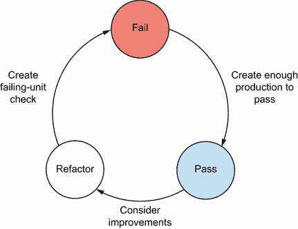

# 第四章：. AI 辅助开发者测试

本章涵盖

+   使用 GitHub Copilot 开发单元测试和生产代码

+   使用 ChatGPT 开发单元测试和生产代码

根据 JetBrains 在 2022 年进行的一项关于开发生态系统的调查，81% 的受访者拥有超过一比一的开发者与质量保证人员（QA）比例。40% 的受访者表示他们“每 10 个开发者只有不到 1 个 QA”，而只有 1% 的受访者表示他们“QA 人员比开发者多”（见 [www.jetbrains.com/lp/devecosystem-2022/testing](https://www.jetbrains.com/lp/devecosystem-2022/testing)）。

理解和构建质量对于向用户提供价值至关重要，然而开发和测试之间的比例几乎总是不平衡，这有多种原因。一些组织领导者选择通过质量教练的支持来教育开发者构建质量，而其他人则根本不想投资于倡导测试和质量的职位。无论如何，这种情况都会给团队中的每个人带来压力，要求他们交付高质量的应用程序。那么，人工智能（AI）工具如何帮助缓解这种压力呢？

本章将特别关注大型语言模型（LLM）AI，如 GitHub Copilot 和 ChatGPT，如何帮助开发者将质量融入我们的工作中。我们不会将这些 AI 工具视为开发者和测试人员的替代品，而是学习它们如何在执行构建质量的活动时引导我们，以及展示我们如何使用 AI 工具在测试资源有限的情况下提高质量并识别风险。

设置 Copilot

在本章中，我们将探讨 GitHub Copilot 的使用示例。在我们尝试这些示例之前，您可以在附录 B 中找到安装和操作说明。

## 4.1 检查自动化开发者的崛起

2023 年 4 月，市场竞争分析公司 Similarweb 报告称，Stack Overflow 在前一个月的流量下降了 14%。根据 Similarweb，原因是开发者从 Stack Overflow 转向 GitHub 的 Copilot 和 ChatGPT 等工具（见 [`mng.bz/5Oy4`](https://mng.bz/5Oy4)）。这究竟是开发者跳槽的持续趋势的迹象，还是最终会平衡的异常情况，此类报告表明基于 LLM 的 AI 工具（LLMs）正在对开发者角色带来广泛的变化。

作为测试人员，看到这种有趣的变化是很吸引人的。多年来，随着测试自动化工具的日益先进，我与开发者们讨论过是否可以用自动化测试工具取代测试。现在，随着训练了来自公共和私有代码库数十亿行代码的大型语言模型（LLM），对话已经转向是否可以自动化开发者的角色。例如，可以将 ChatGPT 发送如下提示：

|


| 写一些 Java 代码，用于向预订 API 发送 HTTP 请求 |
| --- |

然后它将利用其数十亿经过训练的权重和平衡来返回一个像这样的工作代码示例：

|


|

```py
import java.io.BufferedReader;
import java.io.IOException;
import java.io.InputStreamReader;
import java.net.HttpURLConnection;
import java.net.URL;

public class BookingAPIClient {
    public static void main(String[] args) {
        String apiUrl = "https://api.booking.com/endpoint"; // Replace with the actual API endpoint URL

        try {
            URL url = new URL(apiUrl);
            HttpURLConnection connection = (HttpURLConnection) 
            ➥url.openConnection();

            // Set the request method (GET, POST, etc.)
            connection.setRequestMethod("GET");

            // Set request headers if required
            connection.setRequestProperty("Content-Type", 
            "application/json");
            connection.setRequestProperty("Authorization", 
            "Bearer YOUR_ACCESS_TOKEN");

            // Get the response code
            int responseCode = connection.getResponseCode();
            System.out.println("Response Code: " + responseCode);

            // Read the response
            BufferedReader reader = new BufferedReader(new 
            InputStreamReader(connection.getInputStream()));
            String line;
            StringBuilder response = new StringBuilder();
            while ((line = reader.readLine()) != null) {
                response.append(line);
            }
            reader.close();

            // Print the response
            System.out.println("Response: " + response.toString());

            // Close the connection
            connection.disconnect();

        } catch (IOException e) {
            e.printStackTrace();
        }
    }
}
```

|

只需一个基本的提示，我们就可以使用 LLM（大型语言模型）来创建可工作的代码（将`apiUrl`更新为真实的 API 返回了积极的结果）。因此，并不奇怪会有工具结合提示，试图自动化开发工作。例如，AutoGPT ([`github.com/Significant-Gravitas/AutoGPT`](https://github.com/Significant-Gravitas/AutoGPT)) 和 MetaGPT ([`github.com/geekan/MetaGPT`](https://github.com/geekan/MetaGPT)) 作为自主代理出现，根据初始问题生成自己的提示来解决复杂问题。尽管这些工具还处于起步阶段，但很明显为什么开发者被自动化取代的夸张说法会被广泛传播。

作为一位大部分职业生涯都在解释为什么测试自动化不适合作为替代方案的人来说，看到开发者以同样的方式捍卫他们的角色可能会让人感到一种幸灾乐祸的乐趣，但更重要的是从测试人员和自动化主题的经验中学习。正如测试人员的角色不能完全自动化一样，开发者的角色也不能。开发角色不仅仅是产生的代码。开发者创建的解决方案是分析技能、问题解决和设计思维的结果。LLM 工具给人一种拥有这些技能的印象，但这并不真实。

相反，开发者通过使用这些 LLM 工具来增强自己的能力而取得成功：他们可能会使用 Copilot 等工具快速有效地创建他们想要构建的代码，或者向 ChatGPT 寻求帮助以解决问题或学习新的 API。这些原则也可以应用于提高开发者将质量构建到应用程序中的能力。通过结合测试驱动设计（TDD）或 LLM 的力量等技术，开发者可以提高他们的生产力，同时确保他们的分析和设计技能处于领先地位。为了帮助展示这种共生关系，让我们探讨以下两个示例：

+   使用 Copilot 快速生成 TDD 循环的单元测试和生产代码

+   通过模拟开发者的配对，得益于 ChatGPT

通过这些示例，你将学会设置和使用这些 LLM 工具，以及欣赏在 AI 的力量和开发者的能力之间可能达到的平衡。

经验可能有所不同

由于 Copilot 依赖于经常在新增代码和更新的 API/libraries 上进行训练的预测算法，因此值得强调的是，您在遵循即将到来的示例时所获得的输出和体验可能与记录的内容不同。请记住，本章的目标不是 100%复制示例，而是让您熟悉使用 LLMs 以帮助我们以有助于构建质量的方式辅助我们的工作。

## 4.2 与 LLMs 配对

我们已经看到 LLMs 具有概率性本质，因此，将其视为输出角色模拟而不是占据特定角色可能是有用的。LLM 对自己是软件测试员的认识并不比自己是餐厅老板的认识更多。但是，通过提示工程，我们可以创建提示，将 LLM 的概率性输出框架化以模拟角色，帮助我们创建橡皮鸭进行互动。这在测试资源在可用性或能力方面有限的情况下，在开发能力方面非常有用。因此，让我们看看一些我们可以使用的样本提示，以获取有助于我们改进工作质量和产品的反馈。

等等，什么——橡皮鸭？

面对没有解决方案的问题时，向他人口头描述问题以寻找答案可能会有所帮助。通过向另一个人阐述问题，我们有时会发现解决方案自然呈现在我们面前。然而，并不总是有机会与同事交谈；因此，一些开发者会将他们的问题口头描述给橡皮鸭（或其他物品）。尽管我们是在与一个无生命的物体分享我们的挑战，但体验是相同的：口头描述我们的挑战会让我们的大脑找到解决方案。

### 4.2.1 分析想法

我们的第一个提示灵感来源于一些团队采用的左移测试思维模式，以帮助尽早将质量构建到应用程序中。*左移*测试意味着将测试分析提前到开发过程中，理想情况下是在讨论想法和澄清细节的点。这个过程导致我们提出许多问题，帮助我们尽早识别问题，交付有价值的特性，并提高我们产品的质量。左移活动是提高质量的无价方法，应鼓励使用，无论在开发过程中是否使用 AI。然而，通过将 LLM 引入过程，我们可以使用提示生成可能揭示假设或误解或我们可以简单忽略的问题。

让我们看看一个可以快速生成可能有用问题的样本提示。我们使用分隔符来告知 LLM 数据分析的位置：

|


| 你是一位软件测试专家。分析由三个井号分隔的文本，并生成问题以澄清文本中的歧义。 |
| --- |

然后我们设置一系列关于如何提问和输出的规则：

|


| |   使用“什么、哪里、为什么、何时、谁和如何”启发式方法生成问题   *   每个质量特性都可以识别出多个问题   *   我们关心的质量特性是：准确性、安全性和可访问性   *   以“问题 - 解释”的格式输出问题 |
| --- | --- |

少样本提示允许我们创建一个示例，展示我们期望的输出外观：

|


| 示例：什么是相关？验收标准说相关搜索结果，但我们如何确定什么是相关的，什么不是？ |
| --- |

然后我们将用于分析的数据输入到提示词的分隔部分：

|


| ### 作为一家 B&B 的业主，我希望能够管理用户访问，以便我可以允许不同级别的访问权限给多个用户功能：   −   数据库配置了管理员用户   −   客人被要求创建账户以进行预订   −   管理员可以看到平台上创建的账户并可以删除它们### |
| --- |

提示词概述了如何让一个大型语言模型分析用户故事和验收标准，并返回一个我们需要考虑的问题列表。注意我们也在质量特性说明中提供了上下文。如果我们想关注不同的特性，我们也可以更新这些内容。

将此提示输入到 ChatGPT 返回以下结果：

|


| 准确度：1. 确定用户访问管理准确性的标准是什么？说明：文本提到了管理用户访问，但没有具体说明如何确保为多个用户授予不同访问级别时的准确性。2. 系统是如何确保为用户分配正确的访问级别的？说明：文本提到了为多个用户允许不同级别的访问，但没有解释保证访问权限准确性的机制。安全：1. 哪些人可以访问配置了管理员用户的数据库？说明：文本提到了使用管理员用户配置数据库，但没有具体说明谁可以访问这个管理员账户以及如何维护其安全性。2. 平台是如何保护用户账户信息和数据的？说明：文本提到了客人创建账户进行预订，但缺乏关于保护用户数据所采取的安全措施的细节。3. 为了防止未经授权访问用户账户，采取了哪些安全措施？说明：文本提到管理员可以查看和删除账户，但没有解释如何防止对这种账户管理功能的未经授权访问。可访问性：1. 为不同类型的用户提供哪些级别的可访问性？说明：文本提到了使用不同级别的用户访问管理，但没有明确说明这些级别是什么以及它们如何根据用户类型而变化。2. 客人是如何被引导创建预订账户的，这个过程对所有用户都是可访问的吗？说明：文本指出客人被要求创建账户，但没有具体说明这个过程是如何进行的以及它是否符合可访问性标准。3. 为了确保平台对残疾人士的可访问性，采取了哪些措施？说明：文本没有提供有关如何解决残疾人士可访问性的信息，了解为满足他们的需求所采取的措施是至关重要的。4. 我们在哪里可以找到有关平台可访问性功能的信息？说明：文本没有提到有关平台可访问性功能的信息，因此了解这些信息在哪里可以获得将是有帮助的。 |
| --- |

阅读响应后，我们可以看到有一系列有趣的问题，质量参差不齐。例如，考虑以下问题：

|


| 客人是如何被引导创建预订账户的，这个过程对所有用户都是可访问的吗？说明：文本指出客人被要求创建账户，但没有具体说明这个过程是如何进行的以及它是否符合可访问性标准。 |
| --- |

这是一个有助于我们更详细地考虑在用户故事中找到的声明“客人被要求创建账户以进行预订”的问题。我们可以考虑这个问题，并思考我们如何设计预订流程，使其对所有类型的用户都易于访问。

然而，其他问题可能并不完全一样好。例如，

|


| 使用什么标准来确定用户访问管理的准确性？说明：文本提到了管理用户访问，但没有具体说明如何确保向多个用户授予不同访问级别时的准确性。 |
| --- |

使这个问题成为问题的是其对质量特性*准确性*的引用。通常，准确性会更关注处理或存储的数据的准确性（想想银行利率计算）。相反，“用户访问的准确性”这个短语感觉像是一种奇特的方式来描述围绕用户及其可以访问的内容设定的规则。最终，评估每个问题的适宜性和使用取决于我们。一些问题可以鼓励我们构建更符合用户需求的产品，并帮助我们避免错误，而其他生成的问题可能没有意义或覆盖已考虑的主题。

我们将回到这个提示以及我们如何在开发功能时使用它，但首先，让我们看看我们如何重新利用这个提示来审查我们的代码。

### 4.2.2 分析代码

正如我们可以提示一个 LLM 分析写下的想法一样，我们也可以让它审查代码并帮助我们识别风险。使用这种提示类似于模拟你与开发者或测试人员配对时的角色，让他们在你开发过程中分析你的工作，并提出考虑的建议。让我们看看一个可能适用于此类活动的提示。我们使用分隔符来指示代码的位置，以及在没有提供代码的情况下检查假设：

|


| 你是一位软件测试专家。分析由三个井号分隔的代码，并识别可能影响代码的风险。如果没有提供代码，请回答“没有发现风险。” |
| --- |

我们随后提供有关质量特性和输出结构的说明：

|


| |   *   风险必须与质量特性相关：性能、安全性和互操作性   *   每个质量特性都可以识别出多个风险   *   以风险 - 质量特性 - 说明的格式识别出已确定的风险 |
| --- | --- |

少样本提示允许我们给出输出结构的示例：

|


| 示例：溢出 - 安全性 - 将大整数作为参数添加可能会导致方法触发缓冲区溢出。代码在指定的分隔符内提供：

```py
###
public BookingResult createBooking(Booking bookingToCreate) throws
➥SQLException {
    if(dateCheckValidator.isValid(bookingToCreate.getBookingDates())) {
        if (bookingDB.checkForBookingConflict(bookingToCreate)) {
            return new BookingResult(HttpStatus.CONFLICT);
        } else {
            CreatedBooking createdBooking = 
            ➥bookingDB.create(bookingToCreate);

            if(bookingToCreate.getEmail() != null && 
            ➥bookingToCreate.getPhone() != null){
                MessageBuilder messageBuilder = new MessageBuilder();
                Message message = messageBuilder.build(bookingToCreate);

                messageRequests.postMessage(message);
            }

            return new BookingResult(createdBooking, 
         ➥HttpStatus.CREATED);
        }
    } else {
        return new BookingResult(HttpStatus.CONFLICT);
    }
}
###
```

|

在我将带有示例代码和品质特性的提示发送给 ChatGPT 后，返回了以下输出：

|


| 根据提供的代码片段，让我们分析可能影响性能、安全性和互操作性的潜在风险：   •   性能 - 嵌套验证：   −   风险：嵌套验证检查（`dateCheckValidator.isValid`和`bookingDB.checkForBookingConflict`）可能会导致性能问题，尤其是在处理大量预订时。   −   说明：如果系统需要处理大量的预订，嵌套验证可能会导致执行时间增加和资源消耗增加。   •   性能 - 消息发布：   −   风险：消息发布（`messageRequests.postMessage`）可能会引入性能瓶颈，影响整个系统的响应速度。   −   说明：如果消息发布过程涉及网络通信或 I/O 操作，可能会减慢`createBooking`方法的执行速度。   •   安全 - SQL 注入：   −   风险：代码容易受到 SQL 注入攻击，因为它直接在数据库查询中使用`bookingToCreate`对象。   −   说明：`bookingToCreate`对象中的恶意输入可能会操纵 SQL 查询，并危害数据库的完整性和安全性。   •   安全 - 权限不足：   −   风险：代码在创建预订之前没有执行显式的授权检查，可能允许未经授权的用户创建预订。   −   说明：缺乏适当的授权检查可能导致未经授权的访问和系统预订创建功能的滥用。   •   互操作性 - 平台依赖性：   −   风险：代码可能依赖于特定的平台或库，限制了它与其它系统或环境的互操作性。   −   说明：如果`MessageBuilder`或`messageRequests`依赖于特定平台的功能或外部库，可能会在不同环境中运行代码时引起问题。   •   互操作性 - 错误代码：   −   风险：代码直接返回 HTTP 状态码，这可能与期望不同错误代码格式的其他系统不兼容。   −   说明：如果外部系统期望不同的错误代码格式（例如，JSON 或 XML），使用 HTTP 状态码可能会阻碍互操作性。 |
| --- |

与之前的提示类似，它生成了关于书面要求的问题，这些不同风险的质量各不相同。例如，风险“性能 - 消息发布”感觉相当抽象，正如我们可以在其说明中看到的那样：

|


| 如果消息发布过程涉及网络通信或 I/O 操作，可能会减慢`createBooking`方法的执行速度。 |
| --- |

在网络通信或 I/O 操作周围提出风险感觉模糊，因为它可能指代一系列实现，其中一些可能与我们的工作相关，而另一些则可能不相关。

然而，其他风险更具体且可能更有用——例如，“安全 - 授权不足”，它突出了以下内容：

|


| 代码在创建预订之前不执行显式的授权检查，可能允许未经授权的用户创建预订。 |
| --- |

这种风险感觉更具体，因为它指的是在我们方法中执行的动作以及其中可能缺失的重要检查。当然，我们可能在其他地方执行授权检查，但该信息所提供的信息突显了一个可能需要进一步讨论以改进预订功能安全性的明确活动。

生成更多想法

到目前为止，我们一直关注向 LLM 发送的单一提示，这为我们提供了有用的响应以供审查。但如果我们想征求更多问题和风险呢？我们只需提交一个额外的提示，例如“生成更多问题”或“识别进一步的风险”。但请注意，这会带来递减的回报。LLM 会尝试满足我们的请求，但可能会增加幻觉。因此，当选项开始枯竭时，我们可能会看到更多与最初我们想要反馈的想法和代码不太相关的建议。

### 4.2.3 认识到模拟总比没有好

当讨论测试时，重点通常放在测试用例的生产和执行上。但一个训练有素且经验丰富的测试人员通过运用他们的批判性和横向思维技能，提出有助于以新方式看待解决方案并揭示潜在问题的问题。我们已查看的提示可以提供该过程的模拟。然而，重要的是要记住，LLM 没有这些批判性和横向思维技能，而且生成的问题和风险来自我们提示的指令。相反，这类提示可以提供一种轻量级的方式来模拟与测试人员或其他开发人员配对的经验，当没有配对机会时。关键是培养对生成问题的洞察力，以确定哪些是有用的。

## 4.3 使用 AI 辅助构建质量

到目前为止，我们一直将提示视为单一活动，但现在，让我们转向关注我们最近学到的提示和其他 LLM 辅助工具如何与 TDD 结合使用，以帮助我们构建质量。

虽然与其它测试活动相比，TDD 并非严格意义上的测试活动，但正确执行的 TDD 有助于指导开发者将质量融入产品。为了回顾，TDD 的过程是首先使用单元检查工具创建失败的检查，然后编写足够的生产代码以使检查*通过*（并修复可能失败的任何其他检查）。一旦所有我们的检查都通过，我们可以在确保所有检查都是绿色的同时重构我们的生产代码。一旦完成，我们再次开始循环，直到我们的工作完成，如图 4.1 所示。



图 4.1 红绿重构 TDD 循环

所有这些关于检查的讨论是什么意思？

在我们的测试自动化培训中，理查德·布拉德肖和我区分了以人为导向和以工具为导向的测试。我们将后者称为*自动化检查*，因为工具只能断言我们编码到自动化中的明确动作或数据。这种区分帮助我们更好地理解，自动化工具如单元检查框架在快速检查产品中的小而具体的更改方面非常出色，但无法告诉我们关于系统更多超出其断言的信息。然而，人类在测试中较慢且不太确定，尽管我们在识别同时发生的许多事件方面效率更高。因此，这就是为什么工具检查而人类测试的原因。一个并不比另一个更好，希望这本书能证明当我们结合两者时，我们可以取得最佳的成功。

这种方法使我们能够设计高度可测试的产品，同时确保我们交付业务或最终用户所期望的产品。

虽然其好处是多方面的（改进代码设计，使其更易于测试，最重要的是，提高其质量），但一些开发者发现很难采用 TDD 方法，认为它减慢了开发速度，因为我们为系统添加的每个特定部分的生产代码创建单元检查。然而，有了像 Copilot 这样的工具，我们可以学习如何建立平衡，使工具能够快速创建单元检查并构建质量。

设置 Copilot

本章假设您已在您的 IDE 中安装并配置了 Copilot 插件。如果您尚未完成设置过程，您可以在附录 B 中找到安装说明。

## 4.4 使用 LLMs 创建我们的第一个 TDD 循环

为了演示，让我们经历创建样本时间表管理器部分功能的过程：

+   作为时间表用户，我希望能够跟踪特定项目的时间，以便我可以保留我在各个项目上花费的时间历史记录。

+   功能：

    +   时间以半小时为单位进行跟踪。

    +   要完成时间表，必须输入项目和花费的时间。

    +   只有我应该能够看到我跟踪的时间。

您可以在以下 GitHub 仓库中查看本示例中创建的测试和生产代码：[`mng.bz/6YMG`](https://mng.bz/6YMG)。

### 4.4.1 准备工作

在开始创建我的时间表管理功能之前，我想考虑我将如何构建它。为了帮助我进行这个过程并鼓励我从不同角度思考解决方案，我使用了本章早期探索的第一个提示，并将我的上下文输入其中。具体来说，我将质量特性更改为准确性和一致性，并将用户故事添加到提示底部分隔的段落中：

|


| 您是一位软件测试专家。分析由三个井号分隔的文本，并生成将澄清文本中模糊性的问题。   *   问题将通过使用 What（什么）、Where（哪里）、Why（为什么）、When（何时）、Who（谁）和 How（如何）启发式方法生成   *   每个质量特性都可以识别出多个问题   *   我们关心的质量特性是：准确性和一致性   *   以“问题 - 例子”的格式输出问题。示例：什么是相关的意思？验收标准说相关搜索结果，但我们如何确定什么是相关的，什么不是？### 作为时间表用户我想要能够跟踪特定项目的时间，以便我可以记录我在各个项目上花费的时间历史记录功能：   −   时间以半小时为单位跟踪   −   要完成时间表，必须输入项目和时长   −   只有我应该能够看到我跟踪的时间### |
| --- |

将此提示发送到 ChatGPT 返回以下响应：

|


| 准确性：   •   跟踪半小时单位时间所需的精度是多少？ - 文中提到时间是以半小时为单位进行跟踪的。了解这种跟踪所需的精度是很重要的。   •   系统将如何处理无效的时间条目？ - 由于必须输入时间才能完成时间表，有哪些措施可以确保只接受有效的时间条目？   •   有哪些验证机制可以防止用户输入错误的时间数据？ - 为了保持准确性，了解系统将如何验证和处理潜在的数据输入错误是至关重要的。   •   系统将如何处理不同地点的用户的时间区域差异？ - 这对于确保不同时区的用户跟踪的时间一致和准确是很重要的。   |
| --- |

| 一致性：   •   跟踪时间的历史记录将存储在哪里，如何访问？ - 为了确保一致性，了解数据将存储在哪里以及用户如何访问它是很重要的。   •   显示和格式化跟踪时间信息的规则是什么？ - 在整个系统中一致地显示跟踪时间对于无缝的用户体验至关重要。   •   谁负责验证和维护跟踪时间数据的一致性？ - 将数据完整性和一致性责任分配给个人是避免差异的必要条件。   •   时间表数据何时以及多久更新一次？ - 确保实时更新或计划同步的一致性对于避免用户数据之间的差异至关重要。   •   如果多个用户同时尝试更新同一项目的时表，系统将如何处理潜在的冲突？ - 当涉及多个用户时，保持数据更新的致性对于防止数据丢失或不准确至关重要。   •   有哪些安全措施可以保护数据并确保其完整性？ - 一致性还涉及保护数据免受未经授权的访问或篡改。   |

质量对不同的人意味着不同的事情，是一个多方面的概念。因此，当我们试图理解质量对利益相关者或最终用户意味着什么时，我们将对它的思考方式分解为不同的特性。例如，质量特性可能包括外观和感觉、可用性、合规性以及更多。不同的项目将会有不同的质量特性，我们需要优先考虑，并且作为团队，我们需要确定对我们和我们的用户来说哪些质量特性是优先的。

从这里，我阅读了我收到的每一个问题，并记下了那些突出显示了我未曾考虑过的观点。让我们来探讨一些这些问题，并了解我对每个问题的思考：

质量特性是什么？


| 系统将如何处理无效的时间条目？/ 有哪些验证机制可以防止用户输入错误的时间数据？ |
| --- |

这两个问题感觉非常相似，但它们突出了我将在某个时候需要将日期时间处理添加到代码中，以防止无效输入引起的问题。

|


| 对于位于不同位置的用户的时区差异，系统将如何处理？ |
| --- |

这是一个好问题，但与这项工作不相关，因为我计划只跟踪执行的时间量，而不是执行的时间（至少目前是这样）。

|


| 显示和格式化跟踪时间信息的规则是什么？ |
| --- |

连接到前一个问题，我选择简单地跟踪已经过去的时间量，而不是具体发生的时间，这意味着信息的显示相对简单。

|


| 如果多个用户同时尝试更新同一项目的工时表，系统将如何处理潜在的冲突？ |
| --- |

目前，系统中没有多用户功能，尽管它可能以后会被引入，所以我记下在未来的迭代中考虑这一点。

还可以提出和解决更多的问题，但这个过程展示的是，通过生成不同的问题，我需要思考这个功能设计的各个方面。有些我可以选择排除，或者留待以后讨论，而有些则通过提高我对验证和日期时间格式化的认识来帮助我提高功能的品质。

### 4.4.2 循环 1：保存工时条目

在心中想着之前提示中的问题，我开始我的第一个循环，在 IDE 中创建一个空的 maven 项目，然后前往`pom.xml`添加我需要的依赖项。我需要 JUnit 5 来构建我的单元测试，所以我输入了以下注释

|


|

```py
<!--    Junit jupiter engine-->
```

|

Copilot 返回以下代码块：

|


|

```py
<dependencies>
    <dependency>
        <groupId>org.junit.jupiter</groupId>
        <artifactId>junit-jupiter-engine</artifactId>
        <version>5.8.2</version>
        <scope>test</scope>
    </dependency>
</dependencies>
```

|

在撰写本文时，`junit-jupiter-engine`建议的版本是一个较旧的版本，所以我更新到`5.9.2`，如下所示：

|


|

```py
<dependencies>
    <dependency>
        <groupId>org.junit.jupiter</groupId>
        <artifactId>junit-jupiter-engine</artifactId>
        <version>5.9.2</version>
        <scope>test</scope>
    </dependency>
</dependencies>
```

|

这个需要更新的例子很好地说明了数据来源如何影响建议的内容。虽然 Copilot 不断在 GitHub 上推送的代码上进行训练，但它可能会落后于库和 API 的最新版本。因此，当我们通过 AI 代码助手添加依赖项时，我们需要保持警惕，以确保它们建议的是我们想要的版本。

此外，这里展示的是 Copilot IDE 插件如何将我编写的代码（或在这种情况下是一个代码注释）添加到一个提示中，并将其发送到 Copilot LLM 进行处理。LLM 随后将建议的下一步输入发送回 IDE 插件，插件然后向我展示这个建议。我现在可以选择通过按 Tab 键接受建议，或者继续编写我自己的代码。

与其他 LLM 类似，Copilot 通过提示被触发。但与基于聊天的 LLM（如 ChatGPT）不同，Copilot 调整以处理基于代码的提示而不是基于文本的提示。这种区别很重要，因为它突出了不同类型的微调 LLM 对不同活动的益处，以及编写适用于不同提示类型的提示的需要。这就是为什么 TDD 和 AI 助手是一个有趣的组合。我们创建的单元检查不仅框定了我们的工作设计，还作为提示，告诉我们如何实现功能。

例如，对于我们的第一个检查，我提示 Copilot 为我创建第一个单元检查，通过在`src/test/java`中一个名为`TimesheetTest`的新类中添加以下注释：

|


|

```py
// Test that when a timesheet is submitted with a project name
➥and hours it returns true
```

|

这触发了 Copilot 建议以下单元检查：

|


|

```py
@Test
public void testSubmitTimesheetWithProjectNameAndHours() {
    Timesheet timesheet = new Timesheet();
    boolean result = timesheet.submitTimesheet("Project 1", 8);
    assertEquals(true, result);
}
```

|

观察这个建议的检查，我们看到它包含了我们所需要的必要细节。它为我要构建的类提供了一个合理的名称`Timesheet`，并建议了具有正确参数（项目名称和小时数）的`submitTimesheet`方法。这个检查足够作为提示，当我创建一个名为`Timesheet`的新类在`src/main/java`中时，Copilot 建议

|


|

```py
public boolean submitTimesheet(String projectName, int duration) {
    return true;
}
```

|

单元检查作为提示，促使 Copilot 创建我的生产代码，尽管产生的代码并不那么令人兴奋，但检查已经完成。我们还可以看到，Copilot 通过构建提示来达到我们想要的结果。首先，我创建了一个代码注释形式的提示，以帮助 Copilot 为单元检查建议代码，然后这个单元检查作为建议生产代码的提示。随着单元检查的增加，对 Copilot 的提示和构建指导也将增加。现在，让我们看看我是如何使用这个过程来构建`submitTimesheet`方法的。

### 4.4.3 循环 2：检索时间表条目

通过第一个循环，我创建了项目的骨架，但到目前为止，实际的生产代码几乎没有成果。因此，在第二个循环中，我试图向`Timesheet`类添加更多功能，以帮助完善`submitTimesheet`方法。再次，我首先向`TimesheetTest`添加一个新的注释提示：

|


|

```py
// Test that when timesheets are added they can be retrieved as a list
```

|

在创建新行后，Copilot 返回以下检查作为建议：

|


|

```py
@Test
public void testAddTimesheetsToList() {
    Timesheet timesheet = new Timesheet();
    timesheet.submitTimesheet("Project 1", 8);
    timesheet.submitTimesheet("Project 2", 8);
    timesheet.submitTimesheet("Project 3", 8);
    assertEquals(3, timesheet.getTimesheets().size());
}
```

|

这次，生成的检查是通过`submitTimesheet`方法创建一些数据，然后我可以使用新创建的`getTimesheets`方法进行验证。所以，我转向`Timesheet`类，使用 Copilot 生成必要的`getTimesheets`方法，它返回

|


|

```py
public Collection<Timesheet> getTimesheets() {
    return null;
}
```

|

虽然它为我创建了方法签名很有帮助，但方法内部并不那么有用。然而，我在类的顶部添加了以下内容：

|


|

```py
private HashMap<String, Integer> timesheets = new HashMap<>();
```

|

然后，我回到 `submitTimesheet` 方法并从方法内部移除 `return true`。当我将关键字 `if` 输入到语句中时，Copilot 返回

|


|

```py
public boolean submitTimesheet(String projectName, int duration) {
    if (projectName != null && duration > 0) {
        timesheets.put(projectName, duration);
        return true;
    } else {
        return false;
    }
}
```

|

这是一个有用的演示，说明了在 LLM 与 Copilot 一起工作时，项目需要一定的预热过程，才能返回更准确的建议。通过返回到 `submitTimesheet` 方法，移除其内容，然后等待 Copilot 响应，我得到了 Copilot 基于我提供的新细节的刷新响应。正如一个聊天 LLM 需要清晰和明确的信息一样，Copilot 也是如此。Copilot 返回的 `Timesheet` 的初始库存方法可能是因为缺乏上下文。基本上，发送给 Copilot 的提示缺乏信息。但随着我创建新的单元检查和额外的代码来展示我们在代码中的意图，建议变得更加有用。

当我完全删除 `getTimesheets` 方法时，这也得到了演示。随着新添加到类中的 `HashMap`，我的更新代码提示 Copilot 返回方法的更新版本：

|


|

```py
public Collection<Integer> getTimesheets() {
    return timesheets.values();
}
```

|

在这个循环之后运行我的两个单元检查，我可以看到两个检查都通过了，现在有了一个比开始循环时功能更丰富的有效代码。

### 4.4.4 循环 3：计算项目的工时

对于最后的循环，我回到了 ChatGPT 返回的问题，并思考了以下问题：

|


| 如果多个用户同时尝试更新同一项目的工时表，系统将如何处理潜在的冲突？ |
| --- |

虽然在这个项目的这个阶段还没有为多个用户添加功能，但 ChatGPT 提出的问题确实让我思考了如何处理向同一项目提交多个工时表的情况。因此，我创建了第三个单元检查来处理这种情况，再次创建一个代码注释来提示 Copilot 进行另一个单元检查：

|


|

```py
// Test that the total hours worked can be calculated from a list
➥of timesheets from one project
```

|

它返回了以下单元检查：

|


|

```py
@Test
public void testCalculateTotalHoursWorked() {
    Timesheet timesheet = new Timesheet();
    timesheet.submitTimesheet("Project 1", 8);
    timesheet.submitTimesheet("Project 1", 8);
    timesheet.submitTimesheet("Project 1", 8);
    assertEquals(24, timesheet.getTimesheets().stream()
.mapToInt(Integer::intValue)
.sum());
}
```

|

这次，建议的检查很接近，但我希望 `Timesheet` 类返回一个总数，而不是在单元检查本身内部处理总数。因此，我选择更新检查，明确指出有一个获取总工时小时数的方法：

|


|

```py
@Test
public void testCalculateTotalHoursWorked() {
    Timesheet timesheet = new Timesheet();
    timesheet.submitTimesheet("Project 1", 8);
    timesheet.submitTimesheet("Project 1", 8);
    timesheet.submitTimesheet("Project 1", 8);

    int total = timesheet.getTotalTimesheetHours("Project 1");

    assertEquals(24, total);
}
```

|

返回到 `Timesheet` 并等待 Copilot，LLM 返回以下代码：

|


|

```py
public int getTotalTimesheetHours(String projectName) {
    return timesheets.get(projectName);
}
```

|

这允许代码编译，但我的新单元检查失败了，因为项目计数没有被更新。相反，因为我使用了 `HashMap`，计数被覆盖了。我需要更新 `submitTimesheet` 来处理重复的项目，我通过在 `submitTimesheet` 中，初始 `if` 语句之后插入以下注释来完成这项工作：

|


|

```py
// Check to see if project already exists
```

|

添加代码注释返回以下建议的代码：

|


|

```py
if (timesheets.containsKey(projectName)) {
    // If it does, add the new duration to the existing total
    duration += timesheets.get(projectName);
}
```

|

这扩展了`submitTimesheet`函数，使其能够增加时间表中的现有项目的持续时间：

|


|

```py
public boolean submitTimesheet(String projectName, int duration) {
    if (projectName != null && duration > 0) {
        // Check to see if project already exists
        if (timesheets.containsKey(projectName)) {
            // If it does, add the new duration to the existing total
            duration += timesheets.get(projectName);
        }
        timesheets.put(projectName, duration);
        return true;
    } else {
        return false;
    }
}
```

|

我对三个单元检查的最终运行确认它们都通过了，并且我在我的`Timesheet`类中拥有所有我想要的功能。然而，代码开始变得更为复杂，所以我将注意力转向使用 ChatGPT 重构我的代码。

### 4.4.5 代码重构

与他人配对的一个好处是配对伙伴可以看到我们可能看不到的潜在问题和风险。然而，在没有配对伙伴的情况下，我选择了使用本章之前探索的第二个提示——具体来说，是分析代码并返回建议的提示。将提示与我的代码以及质量特性的准确性和一致性结合起来，我向 ChatGPT 发送了以下提示。我稍微更新了说明，使其明确我正在提供 Java 代码：

|


| 你是一位软件测试专家。分析由三个井号分隔的 Java 代码，并识别可能影响代码的风险。如果没有提供代码，则回答“没有找到风险” |
| --- |

我根据我的质量特性更新了附加说明：

|


| |   *   风险必须与质量特性相关：准确性 和 一致性   *   每个质量特性都可以识别出多个风险   *   以“风险 - 质量特性 - 说明”的格式输出识别出的风险 |
| --- | --- |

以下是一个示例，用于展示响应的格式：

|


| 示例：溢出 - 安全 - 将大整数作为参数添加可能会导致方法触发缓冲区溢出。 |
| --- |

我从之前的循环中创建的代码被添加到分隔区域：

|


|

```py
###
public class Timesheet {

    private HashMap<String, Integer> timesheets = new HashMap<>();

    public boolean submitTimesheet(String projectName, int duration) {
        if (projectName != null && duration > 0) {
            // Check to see if project already exists
            if (timesheets.containsKey(projectName)) {
                // If it does, add the new duration to the
                // existing total
                duration += timesheets.get(projectName);
            }
            timesheets.put(projectName, duration);
            return true;
        } else {
            return false;
        }
    }

    public Collection<Integer> getTimesheets() {
        return timesheets.values();
    }

    public int getTotalTimesheetHours(String projectName) {
        return timesheets.get(projectName);
    }
}
###
```

|

发送提示后返回了以下我可能需要考虑的风险：

|


| 风险 1 - 准确性 - `submitTimesheet` 方法可能覆盖现有持续时间：`submitTimesheet` 方法允许在项目已存在于时间表的情况下，向现有项目的总持续时间添加新的持续时间。然而，这种方法并不总是能保证准确性。如果用户打算提交更正或更新特定项目的持续时间，此方法将不会提供准确的结果。它只是将新的持续时间添加到现有的持续时间上，而不考虑编辑或删除先前条目的可能性。风险 2 - 一致性 - 时间表 HashMap 中的空键：时间表 HashMap 允许空键。在按项目名称查询时间表信息时，这可能会导致不一致的问题。如果错误地将一个空名称的项目添加到时间表中，可能会在后续操作中引起问题，导致意外行为。风险 3 - 一致性 - 缺乏对项目名称的验证：`submitTimesheet` 方法在将其添加到时间表 HashMap 之前不验证项目名称。这种缺乏验证可能会导致不一致的数据，例如重复或不正确格式的项目名称。例如，如果添加了同一项目名称的不同变体（例如，`"ProjectA"`和`"projecta"`），系统可能会将它们视为不同的项目，导致报告或查询中的不一致。风险 4 - 准确性 - `getTotalTimesheetHours` 方法可能抛出 `NullPointerException`：`getTotalTimesheetHours` 方法直接调用 `timesheets.get(projectName)`，如果给定的 `projectName` 不存在于时间表 HashMap 中，可能会抛出 `NullPointerException`。如果在调用此方法之前没有检查项目名称是否存在于时间表中，这可能导致不准确的结果。风险 5 - 准确性 - `getTotalTimesheetHours` 方法的返回类型：`getTotalTimesheetHours` 方法返回 int 数据类型，如果实际的总时间表小时数超过 int 可以持有的最大值，可能会导致准确性问题。如果项目的持续时间总和超过 `Integer.MAX_VALUE`，这可能导致溢出，从而造成数据丢失。风险 6 - 一致性 - 多线程环境中的缺乏同步：如果在多线程环境中使用此 `Timesheet` 类，由于此类的方法没有同步，因此存在不一致行为的风险。如果多个线程同时访问和修改时间表 HashMap，可能会导致数据损坏或计算错误。 |
| --- |

与问题提示不同，这个响应似乎指出了我的代码中的具体项目，并给出了可能出错的原因。有了这个响应，我有以下选择：

1.  根据每个案例逐一审查风险，然后减轻我认为重要的风险，忽略其他风险。

1.  完全忽略所提出的风险，或者也许可以向 ChatGPT 发送另一个提示，看看是否有更多的风险。

1.  将 ChatGPT 的响应本身用作提示，以帮助我重构我的代码。

为了演示目的，我选择了第三个选项，并向 ChatGPT 发送了额外的提示：

|


| 重构代码以减轻所建议的风险。在输出解决方案之前，检查每个风险是否已被减轻。 |
| --- |

注意我是如何使用思考时间原则来让 LLM 检查它所建议的重构代码是否实际上减轻了每个风险的。这有助于增加返回的代码有用的可能性。将此提示发送到 ChatGPT 返回了以下代码：

|


|

```py
import java.util.Collection;
import java.util.concurrent.ConcurrentHashMap;

public class Timesheet {

    private ConcurrentHashMap<String, Long> timesheets = 
new ConcurrentHashMap<>();                               ❶

    public boolean submitTimesheet(String projectName, long duration) {
        if (projectName != null && duration > 0) {
            // Perform validation on project name by converting it to
            // lowercase
            projectName = projectName.toLowerCase();     ❷

            // Check to see if project already exists
            timesheets.put(projectName, timesheets
            .getOrDefault(projectName, 0L) + duration);
            return true;
        } else {
            return false;
        }
    }

    public Collection<Long> getTimesheets() {            ❸
        return timesheets.values();
    }

    public long getTotalTimesheetHours(String projectName) {
        return timesheets.getOrDefault(projectName.toLowerCase(), 0L);
    }
}
```

❶ 将 HashMap 改为 ConcurrentHashMap❷ 添加额外的代码将项目名称转换为小写❸ 将 int 数据类型转换为 long |

为了检查这些修改是否有效，我将建议的代码复制到 `Timesheet` 中，将 `TimesheetTest` 中的 `testCalculateTotalHoursWorked` 修改为使用 `long` 而不是 `int`，并发现我的检查仍然通过，并且我已经重构了我的代码。

然而，这有没有改善我的代码？为了确认，我再次运行了带有更新代码的原始代码分析提示，并收到了新的风险：

|


| 风险 - 准确性 - 案例敏感性问题：说明：方法 `submitTimesheet` 在将其用作时间表映射中的键之前将 `projectName` 转换为小写。这种转换可能会导致如果存在具有相同名称但不同字母大小写的项目（例如，`"ProjectA"` 和 `"projecta"` 将被视为同一项目）时数据检索不准确。风险 - 一致性 - 数据输入不一致：说明：`submitTimesheet` 方法不强制执行 `projectName` 值的一致数据输入。如果不同的用户以不同的格式（例如，`"Project A"`、`"project-A"`、`"project_A"`）输入项目名称，则可能导致在时间表映射中为应该是同一项目的多个条目。风险 - 准确性 - 缺少对持续时间的验证：说明：尽管 `submitTimesheet` 方法检查持续时间是否为正数，但它不处理持续时间是 0 或负数的情况。这可能导致在时间表映射中记录错误的数据。风险 - 一致性 - 缺乏输入清理：说明：`submitTimesheet` 方法不清理 `projectName` 输入，这可能导致由于无效字符或意外输入而导致数据不一致。风险 - 准确性 - 可能的数据丢失：说明：`submitTimesheet` 方法返回一个布尔值，但如果提交失败，它不提供任何反馈或错误处理机制。如果提交静默失败且用户未意识到问题，这种缺乏反馈可能导致数据丢失。 |
| --- |

在这个响应中有趣的是，我可以确认一些风险已被减轻，例如

|


| 风险 5 - 准确性 - `getTotalTimesheetHours`方法的返回类型：`getTotalTimesheetHours`方法返回 int 数据类型，如果实际项目总时间表小时数超过 int 可以持有的最大值，可能会导致准确性问题。如果项目持续时间的总和超过`Integer.MAX_VALUE`，这可能导致数据丢失，因为会发生溢出。 |
| --- |

然而，似乎还有一些风险尚未得到缓解。例如，在第一份风险列表中，我收到了以下风险：

|


| 风险 3 - 一致性 - 项目名称验证缺失：`submitTimesheet`方法在将项目名称添加到时间表 HashMap 之前没有进行验证。这种验证缺失可能导致不一致的数据，例如重复或不正确格式的项目名称。例如，如果添加了同一项目名称的不同变体（例如，`"ProjectA"`和`"projecta"`），系统可能会将它们视为不同的项目，导致报告或查询中的不一致。 |
| --- |

这是由 ChatGPT 通过实现一个`lowerCase`方法来帮助清理项目名称来处理的。然而，在第二次分析中，我得到了以下结果：

|


| 风险 - 一致性 - 不一致的数据录入：说明：`submitTimesheet`方法没有强制执行`projectName`值的一致性数据录入。如果不同的用户以不同的格式（例如，`"Project A"`，`"project-A"`，`"project_A"`）输入项目名称，可能会导致在时间表映射中出现多个应属于同一项目的条目。 |
| --- |

这种风险与原始的、据说已经缓解的风险非常相似。感觉这种关于不一致数据录入的额外风险应该在代码重构时得到妥善处理。我再次可以要求 LLM 为我重构代码，但鉴于与 LLM 可能陷入循环的风险，我亲自带头解决问题会更明智。这是需要培养的重要技能——知道何时依赖 LLM，何时亲自负责。

这种选择之所以重要，可以通过分析中提出的其他建议风险之一来强调。具体来说，

|


| 风险 - 准确性 - 持续时间的验证缺失：说明：尽管`submitTimesheet`方法检查持续时间是否为正数，但它没有处理持续时间等于 0 或负数的情况。这可能导致在时间表映射中记录错误的数据。 |
| --- |

这听起来像是一个令人信服的风险，但它却是一个幻觉的展示。按照目前的代码，如果持续时间≥0，该方法将简单地返回 false 并退出时间表存储：

|


|

```py
if (projectName != null && duration > 0)
```

|

有时 LLM 可能会偏向于优先给出答案，而不考虑其质量，这意味着我们要求 LLM 分析我们的代码的次数越多，它就越有可能开始产生幻觉，以给人留下它正在产生有用结果的印象，而不是返回没有有用信息可以分享的响应。这就是为什么我们必须仔细监控何时使用 LLM 是有益的。

在这一点上，我选择停止使用用例，因为我们所涵盖的内容展示了不同类型的 LLM 如何以不同的方式帮助我。Copilot 提供了快速生成代码的能力，但它需要基于代码的提示来帮助它提出建议。这意味着如果我们正在处理一个全新的项目，其中几乎没有用于我们的 LLM 分析的生产代码，那么我们更有可能从 Copilot 那里得到对我们无用的结果。因此，为了提高 Copilot 输出的质量，我们通过单元测试提供更多的上下文。这不仅有助于引导 Copilot 构建我们的代码，还为我们提供了 TDD（测试驱动开发）的好处，包括设计良好的、可测试的代码。

使用 ChatGPT，我们已经证明，当正确提示时，它可以是一个有用的分析工具。构建能够分析想法和代码、提出风险和改进的提示，可以迅速为我们提供考虑的替代视角，我们随后可以选择采取行动或拒绝。利用 LLM 作为倡导质量的角色的模拟可以帮助我们改进我们的工作。

## 4.5 使用 LLM 改进文档和沟通

虽然这可能看起来不太明显，但通过代码注释和发布说明来传达我们所做的工作可以显著提高产品质量。通过分享代码库的新发展和变化，我们可以帮助其他开发者理解我们的工作如何影响他们，指导测试人员在测试我们的工作时关注什么，甚至帮助用户如何看待我们的产品（例如，Slack 的早期发布说明通过清晰的沟通和幽默帮助他们推广工具）。

尽管有这些好处，但文档和发布说明有时会被留到开发周期的最后，或者完全被忽视。考虑到编写和维护有用且相关的代码注释和发布说明所需的时间，这是有道理的，尤其是在有压力不断交付新功能的时候。然而，使用 LLM，我们可以减少这种时间开销，同时确保我们生成对未来的读者有价值的文档。因此，让我们看看一些可以快速为我们生成文档的有用提示。

### 4.5.1 生成代码注释

虽然我们应该始终努力创建流畅且易于解析的代码，无论对代码库的经验如何，代码注释可以提供额外的细节，防止代码误用并加快开发速度。如果我们发布的 API 将被他人使用，这一点尤为重要。（我曾在许多场合浪费时间试图从文档不佳的 API 文档中理解库的工作原理。）挑战在于在代码注释中找到正确的平衡：注释太少，阅读你代码的人将不得不自行应对；注释太多，我们在维护代码和注释以确保它们一致时将产生更多的工作。

因此，让我们看看一个可以为我们处理用注释标注我们工作的过程的提示。我使用检查解决方案的策略来确保代码没有被更改：

|


| 你是一位 Java 开发者。更新由三个井号分隔的代码，并添加代码注释来解释代码的工作原理。在输出完整的带注释代码之前，请检查代码的任何部分都没有被更改。 |
| --- |

接下来，我使用分隔符策略来指出代码的位置：

|


|

```py
###
import java.util.*;
import java.util.concurrent.ConcurrentHashMap;

public class Timesheet {

    private ConcurrentHashMap<String, Long> timesheets = new
    ➥ConcurrentHashMap<>();

    public boolean submitTimesheet(String projectName, long duration) {
        if (projectName != null && duration > 0) {
                    projectName = projectName.toLowerCase();

            timesheets.put(projectName, 
            ➥timesheets.getOrDefault(projectName, 0L) + duration);
            return true;
        } else {
            return false;
        }
    }

    public Collection<Long> getTimesheets() {
        return timesheets.values();
    }

    public long getTotalTimesheetHours(String projectName) {
        return timesheets.getOrDefault(projectName.toLowerCase(), 0L);
    }

}
###
```

|

在这个提示中，我们使用通常的分隔符策略来提供我们希望看到注释的代码，但我们还想要确保大型语言模型（LLM）在输出完整的带注释代码之前不会更改我们的代码以使其与创建的注释相匹配。因此，我们在提示中也明确指出，在输出完整的带注释代码之前，请检查代码的任何部分都没有被更改。将我们之前提供的示例代码发送到 ChatGPT 后，返回了以下带注释的代码：

|


|

```py
import java.util.*;
import java.util.concurrent.ConcurrentHashMap;

public class Timesheet {

    // ConcurrentHashMap to store project timesheets where the key is
    // the project name (in lowercase) and the value is the total duration.
    private ConcurrentHashMap<String, Long> timesheets = new 
    ConcurrentHashMap<>();

    // Method to submit a timesheet entry for a project.
    public boolean submitTimesheet(String projectName, long duration) {
        if (projectName != null && duration > 0) {
            // Normalize the project name to lowercase to ensure case
            // insensitive matching.
            projectName = projectName.toLowerCase();

            // Update the timesheet entry for the project by adding 
            // the submitted duration.
            timesheets.put(projectName, 
            timesheets.getOrDefault(projectName, 0L) + duration);
            return true; // Submission successful
        } else {
            return false; // Invalid input, submission failed
        }
    }

    // Method to retrieve all timesheet durations.
    public Collection<Long> getTimesheets() {
        return timesheets.values();
    }

    // Method to get the total hours for a specific project.
    public long getTotalTimesheetHours(String projectName) {
        // Retrieve the total duration for the specified project 
        // (case-insensitive) or return 0 if not found.
        return timesheets.getOrDefault(projectName.toLowerCase(), 0L);
    }
}
```

|

如我们所见，代码中的方法和代码段现在已经被注释标注，以提供更多细节。最引人注目的是如下注释：

|


|

```py
// ConcurrentHashMap to store project timesheets where the key is the
// project name (in lowercase) and the value is the total duration.
private ConcurrentHashMap<String, Long> timesheets = new 
ConcurrentHashMap<>();
```

|

注释不仅提供了关于`ConcurrentHashMap`用途的参考，还强调了所有项目名称都将存储为小写，这是对`submitTimesheet`内部代码的一部分的引用，这与这些感觉有点不必要的注释形成对比：

|


|

```py
// Method to submit a timesheet entry for a project.
public boolean submitTimesheet(String projectName, long duration)
```

|

再次，我们选择使用什么。虽然我们使用的提示已经为我们提供了注释，但我们观察到其中一些可能比其他的有用。因此，我们的角色从注释的作者转变为编辑，选择和调整看起来最有用的注释。

使用提示维护代码注释

使这个过程如此有用的原因是，当我们不可避免地到达代码更改而注释需要更新的时候，我们只需再次运行提示并使用更新的代码来重新生成注释，以包含我们的更改。

一个最后的观察是，尽管注释对于直接阅读我们代码的人来说可能很有用，但如果我们想以 Javadoc 等形式提供更结构化的文档呢？在这种情况下，我们可以修改提示并使用结构化数据策略来创建一个提示。我们将使用带有结构化数据策略的更新提示来生成 Javadoc：

|


| 你是一位 Java 开发者。更新以下由三个井号分隔的代码，并添加 Javadoc 格式的代码注释来解释代码的工作原理。在输出完整的带注释代码之前，请检查代码的任何部分都没有被更改。 |
| --- |

我们随后提供使用分隔符策略的代码：

|


|

```py
###
import java.util.*;
import java.util.concurrent.ConcurrentHashMap;

public class Timesheet {

    private ConcurrentHashMap<String, Long> timesheets = 
    ➥new ConcurrentHashMap<>();

    public boolean submitTimesheet(String projectName, long duration) {
        if (projectName != null && duration > 0) {
                    projectName = projectName.toLowerCase();

            timesheets.put(projectName, 
            ➥timesheets.getOrDefault(projectName, 0L) + duration);
            return true;
        } else {
            return false;
        }
    }

    public Collection<Long> getTimesheets() {
        return timesheets.values();
    }

    public long getTotalTimesheetHours(String projectName) {
        return timesheets.getOrDefault(projectName.toLowerCase(), 0L);
    }

}
###
```

|

将此提示与我们的示例代码一起发送到 ChatGPT 产生

|


|

```py
import java.util.*;
import java.util.concurrent.ConcurrentHashMap;
/**
 * Represents a timesheet management system for tracking hours spent on
 different projects.
 */
public class Timesheet {

    // A concurrent hash map to store project names and their
    // corresponding total hours
    private ConcurrentHashMap<String, Long> timesheets = new
 ConcurrentHashMap<>();

    /**
     * Submits a timesheet entry for a project.
     *
     * @param projectName The name of the project.
     * @param duration    The duration in hours to be submitted.
     * @return true if the submission was successful, false otherwise.
     */
    public boolean submitTimesheet(String projectName, long duration) {
        if (projectName != null && duration > 0) {
            // Normalize the project name to lowercase for consistency
            projectName = projectName.toLowerCase();

            // Update the total hours for the project or add a new 
            // entry if it doesn't exist
            timesheets.put(projectName, 
timesheets.getOrDefault(projectName, 0L) + duration);
            return true;
        } else {
            return false;
        }
    }

    /**
     * Retrieves a collection of all total timesheet hours for all
     * projects.
     *
     * @return A collection of total hours for all projects.
     */
    public Collection<Long> getTimesheets() {
        return timesheets.values();
    }

    /**
     * Retrieves the total timesheet hours for a specific project.
     *
     * @param projectName The name of the project.
     * @return The total hours spent on the specified project, or 0 
     * if the project is not found.
     */
    public long getTotalTimesheetHours(String projectName) {
        // Normalize the project name to lowercase for consistency 
        // and retrieve the total hours
        return timesheets.getOrDefault(projectName.toLowerCase(), 0L);
    }
}
```

|

使用这个提示，我们提高了某些注释的质量，并创建了 Javadoc 友好的注释，这些注释可以用来为外部用户记录我们的代码。现在我们只需要调整和编辑我们认为合适的地方。

### 4.5.2 生成发布说明

正如我们可以使用大型语言模型（LLM）来修改我们的代码以添加注释一样，我们也可以使用 LLM 将我们的代码库转换成可以被团队内外其他人消费的发布说明。为此，我们创建了一个包含以下细节的新提示；我们检查解决方案策略以确保发布说明可读：

|


| 你是一位 Java 开发者。将以下由三个井号分隔的代码转换为以项目符号形式呈现的发布说明，描述代码的工作原理。在输出之前，请检查发布说明是否可以被没有使用过之前创建的代码的人阅读。 |
| --- |

我们添加了一个额外的指令来减少发布说明的冗长性：

|


| |   *   仅输出发布说明。 |
| --- | --- |

然后我们使用分隔符策略来指明代码的位置：

|


|

```py
###
import java.util.*;
import java.util.concurrent.ConcurrentHashMap;

public class Timesheet {

    private ConcurrentHashMap<String, Long> timesheets = 
    ➥new ConcurrentHashMap<>();

    public boolean submitTimesheet(String projectName, long duration) {
        if (projectName != null && duration > 0) {
                    projectName = projectName.toLowerCase();

            timesheets.put(projectName,
            ➥timesheets.getOrDefault(projectName, 0L) + duration);
            return true;
        } else {
            return false;
        }
    }

    public Collection<Long> getTimesheets() {
        return timesheets.values();
    }

    public long getTotalTimesheetHours(String projectName) {
        return timesheets.getOrDefault(projectName.toLowerCase(), 0L);
    }

}
###
```

|

该提示遵循与之前针对代码注释的提示相似的格式，但这次，我们不是要求它向我们的代码中注入注释，而是指示将代码转换为自然语言的发布说明。例如，将包含示例代码的提示发送到 ChatGPT 返回

|


| 发布说明：   *   该代码定义了一个名为 `Timesheet` 的 Java 类，用于管理时间表数据。   *   它使用 `ConcurrentHashMap` 来存储时间表条目，其中项目名称（小写）与其相应的持续时间（小时）相关联。   *   `submitTimesheet` 方法允许用户提交时间表条目。它需要一个项目名称和正持续时间作为参数。如果满足这些条件，它将在映射中存储与项目名称关联的持续时间。如果不满足，则返回 false。   *   `getTimesheets` 方法返回所有记录的时间表持续时间集合。   *   `getTotalTimesheetHours` 方法允许用户检索特定项目名称的总持续时间（不区分大小写）。如果找不到项目名称，则返回 0。注意：在使用 `submitTimesheet` 方法时，请确保提供小写的项目名称，以避免在检索总时间表小时数时出现大小写敏感问题。 |
| --- |

我们得到的结果与我们的原始代码完全不同的格式，原始代码试图详细说明我们的代码库做了什么。审查输出，它确实感觉相当技术性，这是有道理的，因为我们要求对一小段代码提供详细的说明。然而，即使这些发布说明也可能有用，因为我们可以根据早期提示的风险分析来调整提示。我们使用分隔符来指示发布说明的位置：

|


| 您是一位软件测试专家。分析由三重哈希分隔的发布说明，并识别可能影响代码的风险。如果没有提供代码，请回答“没有找到风险。” |
| --- |

我们随后提供有关质量特性和输出结构的说明：

|


|    *   风险必须与质量特性相关：性能、安全性和互操作性   *   每个质量特性都可以识别出多个风险   *   以“风险 - 质量特性 - 说明”的格式输出已识别的风险 |
| --- |

少样本提示允许我们给出输出结构的示例

|


| 示例：溢出 - 安全性 - 将大整数作为参数添加可能会导致方法触发缓冲区溢出。 |
| --- |

发布说明位于指定的分隔符内：

|


| ### 发布说明：   *   代码定义了一个名为 `Timesheet` 的 Java 类，用于管理考勤数据。   *   它使用 `ConcurrentHashMap` 存储考勤条目，其中项目名称（小写）与其相应的持续时间（小时）相关联。   *   `submitTimesheet` 方法允许用户提交考勤条目。它需要项目名称和正数持续时间作为参数。如果满足这些条件，它将在映射中存储与项目名称关联的持续时间。如果不满足，则返回 false。   *   `getTimesheets` 方法返回所有记录的考勤持续时间集合。   *   `getTotalTimesheetHours` 方法允许用户检索特定项目名称的总持续时间（不区分大小写）。如果找不到项目名称，则返回 0。注意：在使用 `submitTimesheet` 方法时，请确保提供小写项目名称，以避免在检索总考勤小时数时出现大小写敏感问题。### |
| --- |

使用此提示在 ChatGPT 返回以下建议风险：

|


| 并发修改 - 性能 - 使用 `ConcurrentHashMap` 可能不适合高并发访问，如果多个用户同时频繁修改考勤条目，可能会导致性能瓶颈。输入验证不足 - 安全 - `submitTimesheet` 方法缺少适当的输入验证。它只检查正数持续时间，但不验证项目名称，使其容易受到注入攻击或其他恶意输入的攻击。大小写敏感 - 互操作性 - 需要使用小写字母提供项目名称的要求，在集成期望不区分大小写输入或具有不同命名约定的系统时可能导致互操作性问题。无身份验证/授权 - 安全 - 发布说明中没有提及任何身份验证或授权机制，如果未经授权的用户可以提交或访问考勤数据，可能会带来安全风险。数据暴露 - 安全 - `getTimesheets` 方法提供了对所有记录的考勤持续时间的访问，如果不适当限制或验证，可能会暴露敏感信息。 |
| --- |

当然，如果我们可以直接要求大型语言模型（LLM）根据代码直接提出风险，这可能是一个不必要的步骤，但它确实展示了 LLM 将数据从一种格式转换为另一种格式的强大能力。

## 4.6 与代码助手保持平衡

对于像 Copilot 和 ChatGPT 这样的工具所提供的价值的看法取决于个人。对于一些人来说，这意味着开发和许多职位的自动化，而对于另一些人来说，它只是一个随机选择建议代码的高级工具。这一章所展示的是，它们的价值和用途介于这两个极端之间。

这些模型在 Stack Overflow 和 GitHub 存储库的大量数据上训练，在建议生产代码和测试代码方面非常复杂。但它们仍然需要我们人类的指导——这种指导是由我们与利益相关者沟通、分析需求和设计实现的能力所引导的。我们能在多大程度上在开发中使用 AI 工具，取决于我们磨练互补技能的能力，这可以通过图 4.2 所示的影响区域模型来总结。

平衡的方法可以帮助我们更快地交付功能，但仍然确保我们构建的质量。因此，我们的目标是保持这种平衡，在可能需要依赖我们自身能力或工具特性的情况下。有时，代码助手可能无法建议正确的实现，我们需要承担责任。这给了我们更多的控制权，但牺牲了速度。在其他时候，我们可以依赖代码助手工具通过单元检查或对话来参考大量数据，以提出新的设计想法。然而，我们希望确保我们保持 TDD 循环专注于设计，而不是测试覆盖率。单元检查过多，我们就会失去对设计的关注，最终陷入检查框子的活动中。


图 4.2：影响区域模型，更新以展示人类技能和代码助手工具的能力

## 摘要

+   目前市场上大多数生成式 AI 工具都依赖于使用从互联网上抓取的大量数据训练的 LLMs。

+   LLMs 是复杂的算法，它们通过对我们的请求进行统计分析，以确定它们应该响应什么输出。

+   Copilot 是一个使用 OpenAI GPT-4 的编码助手工具，它是在 GitHub 上存储的代码上训练的。

+   Copilot 在 IDE 中工作，并将你的代码作为提示来建议接下来应该添加到测试代码和生产代码中的内容。

+   如 Copilot 之类的工具可以很好地与 TDD 的红色/绿色/重构循环一起工作，帮助我们快速创建单元检查和生产代码。

+   为了帮助 Copilot 返回有价值的代码，我们需要通过提示来引导它。

+   AI 代码助手的成功取决于我们对自身能力和代码助手工具特性的理解。

+   我们主导与工具主导的设计之间存在推拉关系。

+   当平衡从人类转向工具主导时，我们必须意识到其中的权衡。
