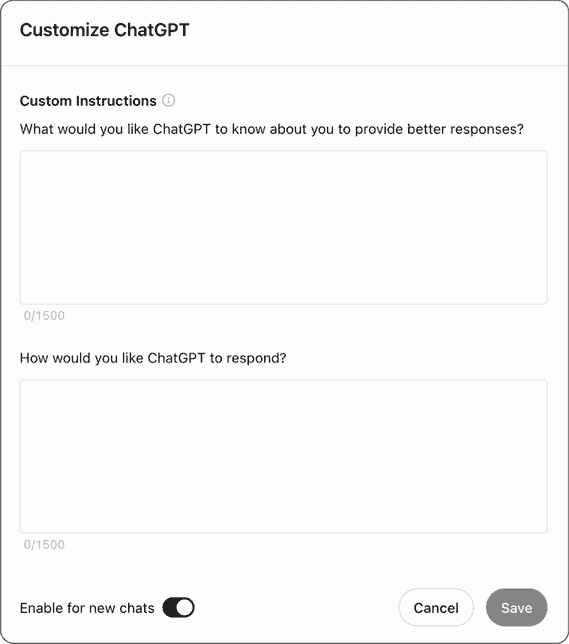

# 附录 A. 设置和使用 ChatGPT

使用 ChatGPT 的过程相对简单。首先，我们在 OpenAI 上创建一个账户，这可以通过登录和注册页面完成，该页面位于[`chat.openai.com/auth/login`](https://chat.openai.com/auth/login)。从那里，我们创建我们的账户，目前主要关注注册一个免费账户。

了解是否购买 ChatGPT Plus

很可能在注册过程中会推销 ChatGPT Plus。在撰写本文时，ChatGPT Plus 每月收费 20 美元，并为您提供访问 ChatGPT 最新版本（与使用 gpt-3.5-turbo 的免费版本相比）以及一系列插件和其他新功能，这些功能扩展了 ChatGPT 的核心提示功能。我们在这本书中不使用 Plus，但活动和示例都可以在 Plus 和免费账户上使用。然而，使用 Plus 时，ChatGPT 的响应可能会不同。

一旦我们注册，我们可以通过[`chat.openai.com/`](https://chat.openai.com/)登录，进入 ChatGPT 主页，在那里我们可以开始发送提示。

要使用 ChatGPT，我们需要提供指令或提示，这些指令我们将输入到页面底部的“发送消息”表单中，如图 A.1 所示。

图 A.1 ChatGPT 消息表单

一旦提交了提示，它将出现在页面顶部，一个新的聊天将被添加到左侧的历史栏中，ChatGPT 将像图 A.2 中所示的那样进行响应。

图 A.2 一个提示和一个响应

我们可以添加额外的提示，之前的提示和响应将被考虑。例如，在图 A.3 中，我们可以看到 ChatGPT 在响应关于城市规模的第二个提示时，考虑了关于英国首都的第一个提示。

图 A.3 额外的提示和响应

我们还可以在发送提示后编辑提示，以从 ChatGPT 生成新的响应。要做到这一点，我们悬停在提示上，并点击左侧的编辑图标，如图 A.4 所示。

图 A.4 带有编辑图标的提示

我们还可以点击“重新生成”按钮，触发 ChatGPT 返回一个替代响应，如图 A.5 所示。

图 A.5 重新生成按钮

对于免费和 Plus 许可证，一个更高级的功能是使用自定义指令。这些指令可以通过将我们的指令添加到我们发送的每个提示中来定制 ChatGPT 对提示的响应方式。要访问指令，我们点击右上角的头像，并选择自定义 ChatGPT，如图 A.6 所示。

为了展示指令是如何工作的，我们可以添加一个指令来确保当 ChatGPT 被要求以代码示例作为回应时，它应该使用 Java 而不是默认的 Python。为此，我们在“你希望 ChatGPT 如何回应？”这一节添加以下指令：

|

| 所有代码示例应以 Java 格式返回 |
| --- |

并保存指令。然后我们可以通过创建一个新的聊天并发送提示来测试指令：

|

| 创建一个函数，用于计算一个数的平方根 |
| --- |

ChatGPT 应该以 Java 编写的代码示例作为回应。我们还可以尝试移除指令再次测试，很可能会收到一个用 Python 编写的新的回应。

图 A.6 自定义指令弹出窗口
