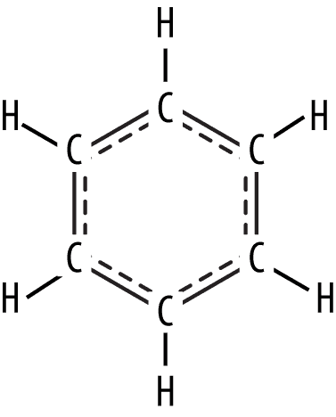
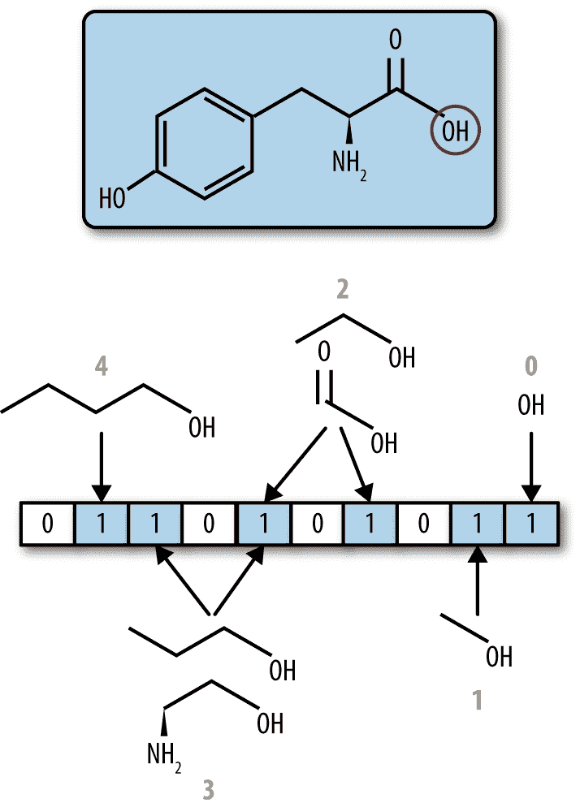
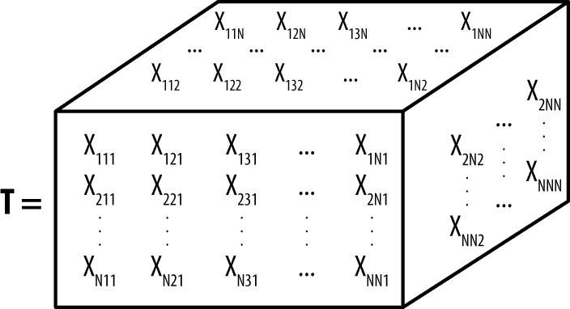
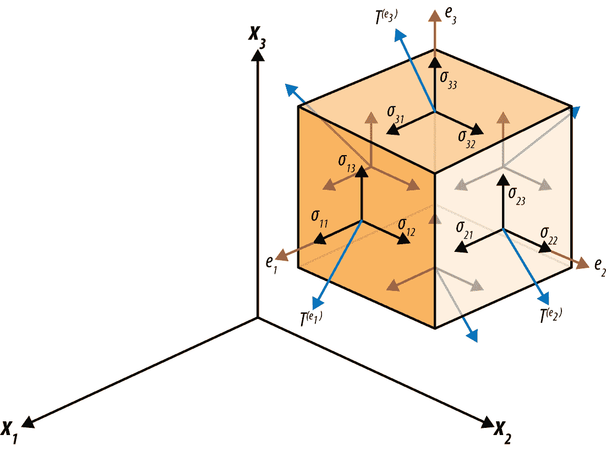

# 第二章：TensorFlow 基本概念介绍

本章将介绍 TensorFlow 的基本概念。特别是，您将学习如何使用 TensorFlow 执行基本计算。本章的大部分内容将用于介绍张量的概念，并讨论在 TensorFlow 中如何表示和操作张量。这个讨论将需要简要概述一些支撑张量数学的数学概念。特别是，我们将简要回顾基本线性代数，并演示如何使用 TensorFlow 执行基本线性代数运算。

我们将在讨论基本数学之后讨论声明式和命令式编程风格之间的区别。与许多编程语言不同，TensorFlow 主要是声明式的。调用 TensorFlow 操作会向 TensorFlow 的“计算图”中添加一个计算的描述。特别是，TensorFlow 代码“描述”计算，实际上并不执行它们。为了运行 TensorFlow 代码，用户需要创建`tf.Session`对象。我们介绍了会话的概念，并描述了用户如何在 TensorFlow 中使用它们进行计算。

我们通过讨论变量的概念来结束本章。TensorFlow 中的变量保存张量，并允许进行有状态的计算以修改变量。我们演示如何通过 TensorFlow 创建变量并更新它们的值。

# 介绍张量

张量是物理和工程等领域中的基本数学构造。然而，从历史上看，张量在计算机科学中的应用较少，计算机科学传统上更多地与离散数学和逻辑相关。随着机器学习的出现及其基础建立在连续的、矢量化的数学上，这种情况已经开始发生显著变化。现代机器学习建立在对张量的操作和微积分之上。

## 标量、向量和矩阵

首先，我们将给出一些您可能熟悉的张量的简单示例。张量的最简单示例是标量，即从实数中取出的单个常数值（请记住，实数是任意精度的十进制数，允许包含正数和负数）。在数学上，我们用<math><mi>ℝ</mi></math>来表示实数。更正式地说，我们将标量称为秩为 0 的张量。

# 关于域的说明

在数学上精通的读者可能会反对基于复数或二进制数定义张量是完全有意义的。更一般地说，只要数字来自一个*域*：一个数学上定义了 0、1、加法、乘法、减法和除法的数字集合。常见的域包括实数<math alttext="double-struck upper R"><mi>ℝ</mi></math>、有理数<math alttext="double-struck upper Q"><mi>ℚ</mi></math>、复数<math alttext="double-struck upper C"><mi>ℂ</mi></math>和有限域，如<math alttext="double-struck upper Z 2"><msub><mi>ℤ</mi> <mn>2</mn></msub></math>。在讨论中，我们将假设张量的值为实数，但是用其他域的值替代是完全合理的。

如果标量是秩为 0 的张量，那么什么构成了秩为 1 的张量？严格来说，秩为 1 的张量是一个向量；一个实数列表。传统上，向量被写成列向量

<math display="block"><mfenced open="(" close=")"><mtable><mtr><mtd><mi>a</mi></mtd></mtr> <mtr><mtd><mi>b</mi></mtd></mtr></mtable></mfenced></math>

或者作为行向量

<math display="block"><mfenced open="(" close=")"><mtable><mtr><mtd><mi>a</mi></mtd> <mtd><mi>b</mi></mtd></mtr></mtable></mfenced></math>

在符号上，长度为 2 的所有列向量表示为<math alttext="double-struck upper R Superscript 2 times 1"><msup><mi>ℝ</mi> <mrow><mn>2</mn><mo>×</mo><mn>1</mn></mrow></msup></math>，而长度为 2 的所有行向量集合是<math alttext="double-struck upper R Superscript 1 times 2"><msup><mi>ℝ</mi> <mrow><mn>1</mn><mo>×</mo><mn>2</mn></mrow></msup></math>。更具体地说，我们可以说列向量的形状是（2, 1），而行向量的形状是（1, 2）。如果我们不想指定一个向量是行向量还是列向量，我们可以说它来自于集合<math alttext="double-struck upper R squared"><msup><mi>ℝ</mi> <mn>2</mn></msup></math>，形状为（2）。这种张量形状的概念对于理解 TensorFlow 计算非常重要，我们将在本章后面再次回到这个概念。

向量最简单的用途之一是表示现实世界中的坐标。假设我们决定一个原点（比如你当前站立的位置）。那么世界上的任何位置都可以用从你当前位置的三个位移值来表示（左右位移、前后位移、上下位移）。因此，向量空间<math alttext="double-struck upper R cubed"><msup><mi>ℝ</mi> <mn>3</mn></msup></math>可以表示世界上的任何位置。

举个不同的例子，假设一只猫由它的身高、体重和颜色描述。那么一个视频游戏中的猫可以被表示为一个向量。

<math display="block"><mfenced open="(" close=")"><mtable><mtr><mtd><mi>height</mi></mtd></mtr> <mtr><mtd><mi>weight</mi></mtd></mtr> <mtr><mtd><mi>color</mi></mtd></mtr></mtable></mfenced></math>

在空间<math><msup><mi>ℝ</mi> <mn>3</mn></msup></math>。这种类型的表示通常被称为*特征化*。也就是说，特征化是将现实世界实体表示为向量（或更一般地表示为张量）。几乎所有的机器学习算法都是在向量或张量上运行的。因此，特征化过程是任何机器学习流程中的关键部分。通常，特征化系统可能是机器学习系统中最复杂的部分。假设我们有一个如图 2-1 所示的苯分子。



###### 图 2-1。苯分子的表示。

我们如何将这个分子转换成适合查询机器学习系统的向量？对于这个问题有许多潜在的解决方案，其中大多数利用了标记分子的亚片段存在的想法。特定亚片段的存在或不存在通过在二进制向量中设置索引（在<math alttext="StartSet 0 comma 1 EndSet Superscript n"><msup><mrow><mo>{</mo><mn>0</mn><mo>,</mo><mn>1</mn><mo>}</mo></mrow> <mi>n</mi></msup></math>）分别设置为 1/0 来标记。这个过程在图 2-2 中有所说明。



###### 图 2-2。将要进行特征化的分子的亚片段被选择（包含 OH 的那些）。这些片段被哈希成固定长度向量中的索引。这些位置被设置为 1，所有其他位置被设置为 0。

请注意，这个过程听起来（也是）相当复杂。事实上，构建一个机器学习系统最具挑战性的方面之一是决定如何将所涉及的数据转换成张量格式。对于某些类型的数据，这种转换是显而易见的。对于其他类型的数据（比如分子），所需的转换可能相当微妙。对于机器学习从业者来说，通常不需要发明新的特征化方法，因为学术文献非常丰富，但通常需要阅读研究论文以了解将新数据流转换的最佳实践。

现在我们已经确定了秩为 0 的张量是标量（<math alttext="双划线上标 R"><mi>ℝ</mi></math>），而秩为 1 的张量是向量（<math alttext="双划线上标 R 上标 n"><msup><mi>ℝ</mi> <mi>n</mi></msup></math>），那么秩为 2 的张量是什么？传统上，秩为 2 的张量被称为矩阵：

<math display="block"><mfenced open="(" close=")"><mtable><mtr><mtd><mi>a</mi></mtd> <mtd><mi>b</mi></mtd></mtr> <mtr><mtd><mi>c</mi></mtd> <mtd><mi>d</mi></mtd></mtr></mtable></mfenced></math>

这个矩阵有两行两列。所有这样的矩阵集合被称为<math alttext="双划线上标 R 2 乘 2"><msup><mi>ℝ</mi> <mrow><mn>2</mn><mo>×</mo><mn>2</mn></mrow></msup></math>。回到我们之前对张量形状的概念，这个矩阵的形状是(2, 2)。矩阵通常用来表示向量的变换。例如，通过矩阵

<math display="block"><mrow><msub><mi>R</mi> <mi>α</mi></msub> <mo>=</mo> <mfenced open="(" close=")"><mtable><mtr><mtd><mrow><mo form="prefix">cos</mo> <mo>(</mo> <mi>α</mi> <mo>)</mo></mrow></mtd> <mtd><mrow><mo form="prefix">–sin</mo> <mo>(</mo> <mi>α</mi> <mo>)</mrow></mtd></mtr> <mtr><mtd><mrow><mo form="prefix">sin</mo> <mo>(</mo> <mi>α</mi> <mo>)</mo></mrow></mtd> <mtd><mrow><mo form="prefix">cos</mo> <mo>(</mo> <mi>α</mi> <mo>)</mo></mrow></mtd></mtr></mtable></mfenced></mrow></math>

要看到这一点，注意*x*单位向量（1, 0）通过矩阵乘法转换为向量（cos(α)，sin(α)）。（我们将在本章后面详细介绍矩阵乘法的定义，但目前只是显示结果）。

<math display="block"><mrow><mfenced open="(" close=")"><mtable><mtr><mtd><mrow><mo form="prefix">cos</mo> <mo>(</mo> <mi>α</mi> <mo>)</mo></mrow></mtd> <mtd><mrow><mo form="prefix">–sin</mo> <mo>(</mo> <mi>α</mi> <mo>)</mrow></mtd></mtr> <mtr><mtd><mrow><mo form="prefix">sin</mo> <mo>(</mo> <mi>α</mi> <mo>)</mo></mrow></mtd> <mtd><mrow><mo form="prefix">cos</mo> <mo>(</mo> <mi>α</mi> <mo>)</mo></mrow></mtd></mtr></mtable></mfenced> <mo>·</mo> <mfenced open="(" close=")"><mtable><mtr><mtd><mn>1</mn></mtd></mtr> <mtr><mtd><mn>0</mn></mtd></mtr></mtable></mfenced> <mo>=</mo> <mfenced open="(" close=")"><mtable><mtr><mtd><mrow><mo form="prefix">cos</mo> <mo>(</mo> <mi>α</mi> <mo>)</mo></mrow></mtd></mtr> <mtr><mtd><mrow><mo form="prefix">sin</mo> <mo>(</mo> <mi>α</mi> <mo>)</mo></mrow></mtd></mtr></mtable></mfenced></mrow></math>

这种转换也可以以图形方式可视化。图 2-3 展示了最终向量如何对应于原始单位向量的旋转。


###### 图 2-3。单位圆上的位置由余弦和正弦参数化。

## 机器学习程序经常使用矩阵的一些标准数学运算。我们将简要回顾其中一些最基本的运算。

在平面上旋转向量的操作可以通过这个矩阵来执行。

矩阵的转置是一个方便的操作，它将矩阵沿对角线翻转。数学上，假设*A*是一个矩阵；那么转置矩阵<math><msup><mi>A</mi> <mi>T</mi></msup></math>由方程<math><mrow><msubsup><mi>A</mi> <mrow><mi>i</mi><mi>j</mi></mrow> <mi>T</mi></msubsup> <mo>=</mo> <msub><mi>A</mi> <mrow><mi>j</mi><mi>i</mi></mrow></msub></mrow></math>定义。例如，旋转矩阵<math alttext="上标 R 下标 alpha"><msub><mi>R</mi> <mi>α</mi></msub></math>的转置是

<math display="block"><mrow><msubsup><mi>R</mi> <mrow><mi>α</mi></mrow> <mi>T</mi></msubsup> <mo>=</mo> <mfenced open="(" close=")"><mtable><mtr><mtd><mrow><mo form="prefix">cos</mo> <mo>(</mo> <mi>α</mi> <mo>)</mo></mrow></mtd> <mtd><mrow><mo form="prefix">sin</mo> <mo>(</mo> <mi>α</mi> <mo>)</mo></mrow></mtd></mtr> <mtr><mtd><mrow><mo form="prefix">–sin</mo> <mo>(</mo> <mi>α</mi> <mo>)</mo></mrow></mtd> <mtd><mrow><mo form="prefix">cos</mo> <mo>(</mo> <mi>α</mi> <mo>)</mo></mrow></mtd></mtr></mtable></mfenced></mrow></math>

矩阵的加法仅对形状相同的矩阵定义，并且仅是逐元素执行。例如：

<math display="block"><mrow><mfenced open="(" close=")"><mtable><mtr><mtd><mn>1</mn></mtd> <mtd><mn>2</mn></mtd></mtr> <mtr><mtd><mn>3</mn></mtd> <mtd><mn>4</mn></mtd></mtr></mtable></mfenced> <mo>+</mo> <mfenced open="(" close=")"><mtable><mtr><mtd><mn>1</mn></mtd> <mtd><mn>1</mn></mtd></mtr> <mtr><mtd><mn>1</mn></mtd> <mtd><mn>1</mn></mtd></mtr></mtable></mfenced> <mo>=</mo> <mfenced open="(" close=")"><mtable><mtr><mtd><mn>2</mn></mtd> <mtd><mn>3</mn></mtd></mtr> <mtr><mtd><mn>4</mn></mtd> <mtd><mn>5</mn></mtd></mtr></mtable></mfenced></mrow></math>

同样，矩阵可以乘以标量。在这种情况下，矩阵的每个元素都简单地逐元素乘以相关的标量：

<math display="block"><mrow><mn>2</mn> <mo>·</mo> <mfenced open="(" close=")"><mtable><mtr><mtd><mn>1</mn></mtd> <mtd><mn>2</mn></mtd></mtr> <mtr><mtd><mn>3</mn></mtd> <mtd><mn>4</mn></mtd></mtr></mtable></mfenced> <mo>=</mo> <mfenced open="(" close=")"><mtable><mtr><mtd><mn>2</mn></mtd> <mtd><mn>4</mn></mtd></mtr> <mtr><mtd><mn>6</mn></mtd> <mtd><mn>8</mn></mtd></mtr></mtable></mfenced></mrow></math>

此外，有时可以直接相乘两个矩阵。矩阵乘法的概念可能是与矩阵相关的最重要的数学概念。特别注意，矩阵乘法不同于矩阵的逐元素乘法！假设我们有一个形状为（*m*，*n*）的矩阵*A*，其中*m*行*n*列。那么，*A*可以右乘任何形状为（*n*，*k*）的矩阵*B*（其中*k*是任意正整数），形成形状为（*m*，*k*）的矩阵*AB*。对于实际的数学描述，假设*A*是形状为（*m*，*n*）的矩阵，*B*是形状为（*n*，*k*）的矩阵。那么*AB*由以下定义：

<math display="block"><mrow><msub><mrow><mo>(</mo><mi>A</mi><mi>B</mi><mo>)</mo></mrow> <mrow><mi>i</mi><mi>j</mi></mrow></msub> <mo>=</mo> <munder><mo>∑</mo> <mi>k</mi></munder> <msub><mi>A</mi> <mrow><mi>i</mi><mi>k</mi></mrow></msub> <msub><mi>B</mi> <mrow><mi>k</mi><mi>j</mi></mrow></msub></mrow></math>

我们之前简要展示了一个矩阵乘法方程。现在让我们扩展这个例子，因为我们有了正式的定义：

<math display="block"><mrow><mfenced open="(" close=")"><mtable><mtr><mtd><mrow><mo form="prefix">cos</mo> <mo>(</mo> <mi>α</mi> <mo>)</mo></mrow></mtd> <mtd><mrow><mo form="prefix">–sin</mo> <mo>(</mo> <mi>α</mi> <mo>)</mo></mrow></mtd></mtr> <mtr><mtd><mrow><mo form="prefix">sin</mo> <mo>(</mo> <mi>α</mi> <mo>)</mo></mrow></mtd> <mtd><mrow><mo form="prefix">cos</mo> <mo>(</mo> <mi>α</mi> <mo>)</mo></mrow></mtd></mtr></mtable></mfenced> <mo>·</mo> <mfenced open="(" close=")"><mtable><mtr><mtd><mn>1</mn></td></mtr> <mtr><mtd><mn>0</mn></mtr></mtable></mfenced> <mo>=</mo> <mfenced open="(" close=")"><mtable><mtr><mtd><mrow><mo form="prefix">cos</mo> <mo>(</mo> <mi>α</mi> <mo>)</mo> <mo>·</mo> <mn>1</mn> <mo>–</mo> <mo form="prefix">sin</mo> <mo>(</mo> <mi>α</mi> <mo>)</mo> <mo>·</mo> <mn>0</mn></mrow></mtd></mtr> <mtr><mtd><mrow><mo form="prefix">sin</mo> <mo>(</mo> <mi>α</mi> <mo>)</mo> <mo>·</mo> <mn>1</mn> <mo>–</mo> <mo form="prefix">cos</mo> <mo>(</mo> <mi>α</mi> <mo>)</mo> <mo>·</mo> <mn>0</mn></mrow></mtd></mtr></mtable></mfenced> <mo>=</mo> <mfenced open="(" close=")"><mtable><mtr><mtd><mrow><mo form="prefix">cos</mo> <mo>(</mo> <mi>α</mi> <mo>)</mo></mrow></mtd></mtr> <mtr><mtd><mrow><mo form="prefix">sin</mo> <mo>(</mo> <mi>α</mi> <mo>)</mo></mrow></mtd></mtr></mtable></mfenced></mrow></math>

基本要点是一个矩阵的行与另一个矩阵的列相乘。

这个定义隐藏了许多微妙之处。首先注意矩阵乘法不是交换的。也就是说，<math><mrow><mi>A</mi> <mi>B</mi> <mo>≠</mo> <mi>B</mi> <mi>A</mi></mrow></math> 通常不成立。实际上，当 *BA* 没有意义时，*AB* 可能存在。例如，假设 *A* 是一个形状为 (2, 3) 的矩阵，*B* 是一个形状为 (3, 4) 的矩阵。那么 *AB* 是一个形状为 (2, 4) 的矩阵。然而，*BA* 没有定义，因为各自的维度（4 和 2）不匹配。另一个微妙之处是，正如旋转示例中所示，一个形状为 (*m*, *n*) 的矩阵可以右乘一个形状为 (*n*, 1) 的矩阵。然而，一个形状为 (*n*, 1) 的矩阵简单地是一个列向量。因此，将矩阵乘以向量是有意义的。矩阵-向量乘法是常见机器学习系统的基本构建块之一。

标准乘法的一个最好的特性是它是一个线性操作。更准确地说，如果一个函数 *f* 被称为线性，那么 <math alttext="f left-parenthesis x plus y right-parenthesis equals f left-parenthesis x right-parenthesis plus f left-parenthesis y right-parenthesis"><mrow><mi>f</mi> <mo>(</mo> <mi>x</mi> <mo>+</mo> <mi>y</mi> <mo>)</mo> <mo>=</mo> <mi>f</mi> <mo>(</mo> <mi>x</mi> <mo>)</mo> <mo>+</mo> <mi>f</mi> <mo>(</mo> <mi>y</mi> <mo>)</mo></mrow></math> 和 <math><mrow><mi>f</mi> <mo>(</mo> <mi>c</mi> <mi>x</mi> <mo>)</mo> <mo>=</mo> <mi>c</mi> <mi>f</mi> <mo>(</mo> <mi>x</mi> <mo>)</mo></mrow></math> 其中 *c* 是一个标量。为了证明标量乘法是线性的，假设 *a*, *b*, *c*, *d* 都是实数。那么我们有

<math display="block"><mrow><mi>a</mi> <mo>·</mo> <mo>(</mo> <mi>b</mi> <mo>·</mo> <mi>c</mi> <mo>)</mo> <mo>=</mo> <mi>b</mi> <mo>·</mo> <mo>(</mo> <mi>a</mi> <mi>c</mi> <mo>)</mo></mrow></math><math display="block"><mrow><mi>a</mi> <mo>·</mo> <mo>(</mo> <mi>c</mi> <mo>+</mo> <mi>d</mi> <mo>)</mo> <mo>=</mo> <mi>a</mi> <mi>c</mi> <mo>+</mo> <mi>a</mi> <mi>d</mi></mrow></math>

我们在这里利用了标量乘法的交换和分配性质。现在假设相反，*A*, *C*, *D* 现在是矩阵，其中 *C*, *D* 的大小相同，并且将 *A* 右乘以 *C* 或 *D* 是有意义的（*b* 仍然是一个实数）。那么矩阵乘法是一个线性操作符：

<math display="block"><mrow><mi>A</mi> <mo>(</mo> <mi>b</mi> <mo>·</mo> <mi>C</mi> <mo>)</mo> <mo>=</mo> <mi>b</mi> <mo>·</mo> <mo>(</mo> <mi>A</mi> <mi>C</mi> <mo>)</mo></mrow></math><math display="block"><mrow><mi>A</mi> <mo>(</mo> <mi>C</mi> <mo>+</mo> <mi>D</mi> <mo>)</mo> <mo>=</mo> <mi>A</mi> <mi>C</mi> <mo>+</mo> <mi>A</mi> <mi>D</mi></mrow></math>

换句话说，矩阵乘法是可分配的，并且与标量乘法交换。事实上，可以证明向量上的任何线性变换对应于矩阵乘法。对于计算机科学的类比，将线性性视为超类中要求的属性。然后标准乘法和矩阵乘法是该抽象方法的具体实现，分别适用于不同子类（实数和矩阵）。

## 张量

在前面的部分中，我们介绍了标量作为秩为 0 的张量，向量作为秩为 1 的张量，矩阵作为秩为 2 的张量。那么什么是秩为 3 的张量呢？在转向一般定义之前，思考一下标量、向量和矩阵之间的共同点可能有所帮助。标量是单个数字。向量是数字列表。要选择向量的任何特定元素，需要知道它的索引。因此，我们需要一个索引元素进入向量（因此是一个秩为 1 的张量）。矩阵是数字表。要选择矩阵的任何特定元素，需要知道它的行和列。因此，我们需要两个索引元素（因此是一个秩为 2 的张量）。很自然地，秩为 3 的张量是一组数字，其中有三个必需的索引。可以将秩为 3 的张量想象为数字的长方体，如图 2-4 所示。



###### 图 2-4。秩为 3 的张量可以被视为数字的长方体。

图中显示的秩为 3 的张量*T*的形状为(*N*, *N*, *N*)。那么张量的任意元素将通过指定(*i*, *j*, *k*)作为索引来选择。

张量和形状之间存在联系。秩为 1 的张量具有 1 维形状，秩为 2 的张量具有 2 维形状，秩为 3 的张量具有 3 维形状。你可能会质疑这与我们之前讨论的行向量和列向量相矛盾。根据我们的定义，列向量的形状是(*n*, 1)。这难道不会使列向量成为一个秩为 2 的张量（或矩阵）吗？这确实发生了。回想一下，未指定为行向量或列向量的向量的形状是(*n*)。当我们指定一个向量是行向量还是列向量时，实际上我们指定了一种将基础向量转换为矩阵的方法。这种维度扩展是张量操作中的常见技巧。

注意，另一种思考秩为 3 的张量的方式是将其视为具有相同形状的矩阵列表。假设*W*是一个形状为(*n*, *n*)的矩阵。那么张量 <math alttext="upper T Subscript i j k Baseline equals left-parenthesis upper W 1 comma ellipsis comma upper W Subscript n Baseline right-parenthesis"><mrow><msub><mi>T</mi> <mrow><mi>i</mi><mi>j</mi><mi>k</mi></mrow></msub> <mo>=</mo> <mrow><mo>(</mo> <msub><mi>W</mi> <mn>1</mn></sub> <mo>,</mo> <mo>⋯</mo> <mo>,</mo> <msub><mi>W</mi> <mi>n</mi></sub> <mo>)</mo></mrow></mrow></math> 包含了*W*的*n*个副本。

请注意，黑白图像可以表示为二阶张量。假设我们有一个 224×224 像素的黑白图像。那么，像素（*i*，*j*）是 1/0 来编码黑/白像素。因此，黑白图像可以表示为形状为(224, 224)的矩阵。现在，考虑一个 224×224 的彩色图像。一个特定像素的颜色通常由三个单独的 RGB 通道表示。也就是说，像素（*i*，*j*）被表示为一个包含三个数字（*r*，*g*，*b*）的元组，分别编码像素中的红色、绿色和蓝色的量。*r*，*g*，*b*通常是从 0 到 255 的整数。因此，彩色图像可以被编码为形状为(224, 224, 3)的三阶张量。继续类比，考虑一个彩色视频。假设视频的每一帧是一个 224×224 的彩色图像。那么一分钟的视频（以 60 帧每秒的速度）将是一个形状为(224, 224, 3, 3600)的四阶张量。进一步地，10 个这样的视频集合将形成一个形状为(10, 224, 224, 3, 3600)的五阶张量。总的来说，张量提供了对数值数据的便捷表示。在实践中，看到高于五阶张量的张量并不常见，但设计任何张量软件以允许任意张量是明智的，因为聪明的用户总会提出设计者没有考虑到的用例。

## 物理学中的张量

张量在物理学中被广泛用于编码基本物理量。例如，应力张量通常用于材料科学中定义材料内某点的应力。从数学上讲，应力张量是一个形状为(3, 3)的二阶张量：

<math display="block"><mrow><mi>σ</mi> <mo>=</mo> <mfenced open="(" close=")"><mtable><mtr><mtd><msub><mi>σ</mi> <mn>11</mn></msub></mtd> <mtd><msub><mi>τ</mi> <mn>12</mn></msub></mtd> <mtd><msub><mi>τ</mi> <mn>13</mn></msub></mtd></mtr> <mtr><mtd><msub><mi>τ</mi> <mn>21</mn></msub></mtd> <mtd><msub><mi>σ</mi> <mn>22</mn></msub></mtd> <mtd><msub><mi>τ</mi> <mn>23</mn></msub></mtd></mtr> <mtr><mtd><msub><mi>τ</mi> <mn>31</mn></msub></mtd> <mtd><msub><mi>τ</mi> <mn>32</mn></msub></mtd> <mtd><msub><mi>σ</mi> <mn>33</mn></msub></mtd></mtr></mtable></mfenced></mrow></math>

然后，假设*n*是一个形状为(3)的向量，编码一个方向。在方向*n*上的应力<math><msup><mi>T</mi> <mi>n</mi></msup></math>由向量<math><mrow><msup><mi>T</mi> <mi>n</mi></msup> <mo>=</mo> <mi>T</mi> <mo>·</mo> <mi>n</mi></mrow></math>（注意矩阵-向量乘法）指定。这种关系在图 2-5 中以图形方式描述。



###### 图 2-5。应力分量的三维图示。

作为另一个物理例子，爱因斯坦的广义相对论场方程通常以张量格式表达：

<math display="block"><mrow><msub><mi>R</mi> <mrow><mi>μ</mi><mi>ν</mi></mrow></msub> <mo>-</mo> <mfrac><mn>1</mn> <mn>2</mn></mfrac> <mi>R</mi> <msub><mi>g</mi> <mrow><mi>μ</mi><mi>ν</mi></mrow></msub> <mo>+</mo> <mi>Λ</mi> <msub><mi>g</mi> <mrow><mi>μ</mi><mi>ν</mi></mrow></msub> <mo>=</mo> <mfrac><mrow><mn>8</mn><mi>π</mi><mi>G</mi></mrow> <msup><mi>c</mi> <mn>4</mn></msup></mfrac> <msub><mi>T</mi> <mrow><mi>μ</mi><mi>ν</mi></mrow></msub></mrow></math>

这里<math alttext="上标 mu nu 的 R"><msub><mi>R</mi> <mrow><mi>μ</mi><mi>ν</mi></mrow></msub></math>是里奇曲率张量，<math><msub><mi>g</mi> <mrow><mi>μ</mi><mi>ν</mi></mrow></msub></math>是度规张量，<math><msub><mi>T</mi> <mrow><mi>μ</mi><mi>ν</mi></mrow></msub></math>是应力能量张量，其余量是标量。然而，需要注意的是，这些张量和我们之前讨论过的其他张量之间有一个重要的微妙区别。像度规张量这样的量为时空中的每个点提供一个单独的张量（在数字数组的意义上，数学上，度规张量是一个张量场）。之前讨论过的应力张量也是如此，这些方程中的其他张量也是如此。在时空中的特定点，这些量中的每一个都变成了一个对称的秩 2 张量，使用我们的符号形状为（4，4）。

现代张量微积分系统（如 TensorFlow）的一部分力量在于，一些长期用于经典物理学的数学机器现在可以被改编用于解决图像处理和语言理解等应用问题。与此同时，今天的张量微积分系统与物理学家的数学机器相比仍然有限。例如，目前还没有简单的方法来使用 TensorFlow 谈论度规张量这样的量。我们希望随着张量微积分对计算机科学变得更加基础，情况会发生变化，像 TensorFlow 这样的系统将成为物理世界和计算世界之间的桥梁。

## 数学细节

到目前为止，在本章中的讨论通过示例和插图非正式地介绍了张量。在我们的定义中，张量简单地是一组数字的数组。通常方便将张量视为一个函数。最常见的定义将张量引入为从向量空间的乘积到实数的多线性函数：

<math display="block"><mrow><mi>T</mi> <mo>:</mo> <msub><mi>V</mi> <mn>1</mn></msub> <mo>×</mo> <msub><mi>V</mi> <mn>2</mn></msub> <mo>×</mo> <mo>⋯</mo> <msub><mi>V</mi> <mi>n</mi></msub> <mo>→</mo> <mi>ℝ</mi></mrow></math>

这个定义使用了一些你没有见过的术语。一个向量空间简单地是向量的集合。你已经见过一些向量空间的例子，比如<math><msup><mi>ℝ</mi> <mn>3</mn></msup></math>或者一般的<math alttext="双击上标 n 的 R"><msup><mi>ℝ</mi> <mi>n</mi></msup></math>。我们可以假设<math alttext="V 下标 i 等于双击上标 d 下标 i 的 R"><mrow><msub><mi>V</mi> <mi>i</mi></msub> <mo>=</mo> <msup><mi>ℝ</mi> <msub><mi>d</mi> <mi>i</mi></msub></msup></mrow></math>而不会失去一般性。正如我们之前定义的，一个函数*f*是线性的，如果<math alttext="f 左括号 x 加 y 右括号等于 f 左括号 x 右括号加 f 左括号 y 右括号"><mrow><mi>f</mi> <mo>(</mo> <mi>x</mi> <mo>+</mo> <mi>y</mi> <mo>)</mo> <mo>=</mo> <mi>f</mi> <mo>(</mo> <mi>x</mi> <mo>)</mo> <mo>+</mo> <mi>f</mi> <mo>(</mo> <mi>y</mi> <mo>)</mo></mrow></math>和<math><mrow><mi>f</mi> <mo>(</mo> <mi>c</mi> <mi>x</mi> <mo>)</mo> <mo>=</mo> <mi>c</mi> <mi>f</mi> <mo>(</mo> <mi>x</mi> <mo>)</mo></mrow></math>。一个多线性函数简单地是一个在每个参数上都是线性的函数。当提供数组索引作为参数时，这个函数可以被看作是给定多维数组的单个条目。

在本书中我们不会经常使用这个更数学化的定义，但它作为一个有用的桥梁，将你将要学习的深度学习概念与物理学和数学界对张量进行的几个世纪的研究联系起来。

# 协变和逆变

我们在这里的定义中忽略了许多需要仔细处理的细节，以进行正式处理。例如，我们在这里没有涉及共变和逆变指数的概念。我们所谓的秩-*n*张量最好描述为一个（*p*，*q*）-张量，其中*n* = *p* + *q*，*p*是逆变指数的数量，*q*是共变指数的数量。例如，矩阵是（1,1）-张量。作为一个微妙之处，有些秩为 2 的张量不是矩阵！我们不会在这里仔细探讨这些主题，因为它们在机器学习中并不经常出现，但我们鼓励您了解协变性和逆变性如何影响您构建的机器学习系统。

# TensorFlow 中的基本计算

在过去的几节中，我们已经涵盖了各种张量的数学定义。现在是时候使用 TensorFlow 创建和操作张量了。对于本节，我们建议您使用交互式 Python 会话（使用 IPython）跟随进行。许多基本的 TensorFlow 概念在直接实验后最容易理解。

## 安装 TensorFlow 并入门

在继续本节之前，您需要在您的计算机上安装 TensorFlow。安装的详细信息将取决于您的特定硬件，因此我们建议您查阅[官方 TensorFlow 文档](https://www.tensorflow.org/api_docs/)以获取更多详细信息。

尽管 TensorFlow 有多种编程语言的前端，但我们将在本书的其余部分中专门使用 TensorFlow Python API。我们建议您安装[Anaconda Python](https://anaconda.org/anaconda/python)，它打包了许多有用的数值库以及基本的 Python 可执行文件。

一旦您安装了 TensorFlow，我们建议您在学习基本 API 时交互地调用它（请参见示例 2-1）。在与 TensorFlow 交互时进行实验时，使用`tf.InteractiveSession()`会很方便。在 IPython（一个交互式 Python shell）中调用此语句将使 TensorFlow 几乎以命令方式运行，使初学者更容易地玩弄张量。稍后在本章中，您将更深入地了解命令式与声明式风格的区别。

##### 示例 2-1。初始化一个交互式 TensorFlow 会话

```py
>>> import tensorflow as tf
>>> tf.InteractiveSession()
<tensorflow.python.client.session.InteractiveSession>
```

本节中的其余代码将假定已加载了一个交互式会话。

## 初始化常量张量

到目前为止，我们已经将张量讨论为抽象的数学实体。然而，像 TensorFlow 这样的系统必须在真实计算机上运行，因此任何张量必须存在于计算机内存中，以便对计算机程序员有用。TensorFlow 提供了许多在内存中实例化基本张量的函数。其中最简单的是`tf.zeros()`和`tf.ones()`。`tf.zeros()`接受一个张量形状（表示为 Python 元组）并返回一个填充有零的该形状的张量。让我们尝试在 shell 中调用此命令（请参见示例 2-2）。

##### 示例 2-2。创建一个零张量

```py
>>> tf.zeros(2)
<tf.Tensor 'zeros:0' shape=(2,) dtype=float32>
```

TensorFlow 返回所需张量的引用，而不是张量本身的值。为了强制返回张量的值，我们将使用张量对象的`tf.Tensor.eval()`方法（请参见示例 2-3）。由于我们已经初始化了`tf.InteractiveSession()`，这个方法将向我们返回零张量的值。

##### 示例 2-3。评估张量的值

```py
>>> a = tf.zeros(2)
>>> a.eval()
array([ 0.,  0.], dtype=float32)
```

请注意，TensorFlow 张量的计算值本身是一个 Python 对象。特别地，`a.eval()`是一个`numpy.ndarray`对象。NumPy 是 Python 的一个复杂数值系统。我们不会在这里尝试对 NumPy 进行深入讨论，只是注意到 TensorFlow 被设计为在很大程度上与 NumPy 约定兼容。

我们可以调用`tf.zeros()`和`tf.ones()`来创建和显示各种大小的张量（请参见示例 2-4）。

##### 示例 2-4。评估和显示张量

```py
>>> a = tf.zeros((2, 3))
>>> a.eval()
array([[ 0.,  0.,  0.],
       [ 0.,  0.,  0.]], dtype=float32)
>>> b = tf.ones((2,2,2))
>>> b.eval()
array([[[ 1.,  1.],
        [ 1.,  1.]],

       [[ 1.,  1.],
        [ 1.,  1.]]], dtype=float32)
```

如果我们想要一个填充有除 0/1 之外的某个数量的张量呢？`tf.fill()`方法提供了一个很好的快捷方式来做到这一点（示例 2-5）。

##### 示例 2-5。用任意值填充张量

```py
>>> b = tf.fill((2, 2), value=5.)
>>> b.eval()
array([[ 5.,  5.],
       [ 5.,  5.]], dtype=float32)
```

`tf.constant`是另一个函数，类似于`tf.fill`，允许在程序执行期间不应更改的张量的构建（示例 2-6）。

##### 示例 2-6。创建常量张量

```py
>>> a = tf.constant(3)
>>> a.eval()
3
```

## 抽样随机张量

尽管使用常量张量方便测试想法，但更常见的是使用随机值初始化张量。这样做的最常见方式是从随机分布中抽样张量中的每个条目。`tf.random_normal`允许从指定均值和标准差的正态分布中抽样指定形状的张量中的每个条目（示例 2-7）。

# 对称性破缺

许多机器学习算法通过对保存权重的一组张量执行更新来学习。这些更新方程通常满足初始化为相同值的权重将继续一起演变的属性。因此，如果初始张量集初始化为一个常量值，模型将无法学习太多。解决这种情况需要*破坏对称性*。打破对称性的最简单方法是随机抽样张量中的每个条目。

##### 示例 2-7。抽样具有随机正态条目的张量

```py
>>> a = tf.random_normal((2, 2), mean=0, stddev=1)
>>> a.eval()
array([[-0.73437649, -0.77678096],
       [ 0.51697761,  1.15063596]], dtype=float32)
```

需要注意的一点是，机器学习系统通常使用具有数千万参数的非常大的张量。当我们从正态分布中抽样数千万个随机值时，几乎可以肯定会有一些抽样值远离均值。这样大的样本可能导致数值不稳定，因此通常使用`tf.truncated_normal()`而不是`tf.random_normal()`进行抽样。这个函数在 API 方面与`tf.random_normal()`相同，但会删除并重新抽样所有距离均值超过两个标准差的值。

`tf.random_uniform()`的行为类似于`tf.random_normal()`，唯一的区别是随机值是从指定范围的均匀分布中抽样的（示例 2-8）。

##### 示例 2-8。抽样具有均匀随机条目的张量

```py
>>> a = tf.random_uniform((2, 2), minval=-2, maxval=2)
>>> a.eval()
array([[-1.90391684,  1.4179163 ],
       [ 0.67762709,  1.07282352]], dtype=float32)
```

## 张量加法和缩放

TensorFlow 利用 Python 的运算符重载，使用标准 Python 运算符使基本张量算术变得简单直观（示例 2-9）。

##### 示例 2-9。将张量相加

```py
>>> c = tf.ones((2, 2))
>>> d = tf.ones((2, 2))
>>> e = c + d
>>> e.eval()
array([[ 2.,  2.],
       [ 2.,  2.]], dtype=float32)
>>> f = 2 * e
>>> f.eval()
array([[ 4.,  4.],
       [ 4.,  4.]], dtype=float32)
```

张量也可以这样相乘。但是请注意，当两个张量相乘时，我们得到的是逐元素乘法而不是矩阵乘法，可以在示例 2-10 中看到。

##### 示例 2-10。逐元素张量乘法

```py
>>> c = tf.fill((2,2), 2.)
>>> d = tf.fill((2,2), 7.)
>>> e = c * d
>>> e.eval()
array([[ 14.,  14.],
       [ 14.,  14.]], dtype=float32)
```

## 矩阵运算

TensorFlow 提供了各种便利设施来处理矩阵。（在实践中，矩阵是最常用的张量类型。）特别是，TensorFlow 提供了快捷方式来创建某些常用矩阵类型。其中最常用的可能是单位矩阵。单位矩阵是指在对角线上除了 1 之外其他地方都是 0 的方阵。`tf.eye()`允许快速构建所需大小的单位矩阵（示例 2-11）。

##### 示例 2-11。创建一个单位矩阵

```py
>>> a = tf.eye(4)
>>> a.eval()
array([[ 1.,  0.,  0.,  0.],
       [ 0.,  1.,  0.,  0.],
       [ 0.,  0.,  1.,  0.],
       [ 0.,  0.,  0.,  1.]], dtype=float32)
```

对角矩阵是另一种常见类型的矩阵。与单位矩阵不同，对角矩阵只在对角线上非零。与单位矩阵不同，它们可以在对角线上取任意值。让我们构造一个沿对角线升序值的对角矩阵（示例 2-12）。首先，我们需要一种方法在 TensorFlow 中构造升序值的向量。这样做的最简单方法是调用`tf.range(start, limit, delta)`。请注意，范围中排除了`limit`，`delta`是遍历的步长。然后，生成的向量可以传递给`tf.diag(diagonal)`，它将构造具有指定对角线的矩阵。

##### 示例 2-12。创建对角矩阵

```py
>>> r = tf.range(1, 5, 1)
>>> r.eval()
array([1, 2, 3, 4], dtype=int32)
>>> d = tf.diag(r)
>>> d.eval()
array([[1, 0, 0, 0],
       [0, 2, 0, 0],
       [0, 0, 3, 0],
       [0, 0, 0, 4]], dtype=int32)
```

现在假设我们在 TensorFlow 中有一个指定的矩阵。如何计算矩阵的转置？`tf.matrix_transpose()`会很好地完成这个任务（示例 2-13）。

##### 示例 2-13。取矩阵转置

```py
>>> a = tf.ones((2, 3))
>>> a.eval()
array([[ 1.,  1.,  1.],
       [ 1.,  1.,  1.]], dtype=float32)
>>> at = tf.matrix_transpose(a)
>>> at.eval()
array([[ 1.,  1.],
       [ 1.,  1.],
       [ 1.,  1.]], dtype=float32)
```

现在，假设我们有一对矩阵，我们想要使用矩阵乘法相乘。最简单的方法是调用`tf.matmul()`（示例 2-14）。

##### 示例 2-14。执行矩阵乘法

```py
>>> a = tf.ones((2, 3))
>>> a.eval()
array([[ 1.,  1.,  1.],
       [ 1.,  1.,  1.]], dtype=float32)
>>> b = tf.ones((3, 4))
>>> b.eval()
array([[ 1.,  1.,  1.,  1.],
       [ 1.,  1.,  1.,  1.],
       [ 1.,  1.,  1.,  1.]], dtype=float32)
>>> c = tf.matmul(a, b)
>>> c.eval()
array([[ 3.,  3.,  3.,  3.],
       [ 3.,  3.,  3.,  3.]], dtype=float32)
```

您可以检查这个答案是否与我们之前提供的矩阵乘法的数学定义相匹配。

## 张量类型

您可能已经注意到了前面示例中的`dtype`表示。TensorFlow 中的张量有各种类型，如`tf.float32`、`tf.float64`、`tf.int32`、`tf.int64`。可以通过在张量构造函数中设置`dtype`来创建指定类型的张量。此外，给定一个张量，可以使用转换函数如`tf.to_double()`、`tf.to_float()`、`tf.to_int32()`、`tf.to_int64()`等来更改其类型（示例 2-15）。

##### 示例 2-15。创建不同类型的张量

```py
>>> a = tf.ones((2,2), dtype=tf.int32)
>>> a.eval()
array([[0, 0],
       [0, 0]], dtype=int32)
>>> b = tf.to_float(a)
>>> b.eval()
array([[ 0.,  0.],
       [ 0.,  0.]], dtype=float32)
```

## 张量形状操作

在 TensorFlow 中，张量只是内存中写入的数字集合。不同的形状是对底层数字集合的视图，提供了与数字集合交互的不同方式。在不同的时间，将相同的数字集合视为具有不同形状的张量可能是有用的。`tf.reshape()`允许将张量转换为具有不同形状的张量（示例 2-16）。

##### 示例 2-16。操作张量形状

```py
>>> a = tf.ones(8)
>>> a.eval()
array([ 1.,  1.,  1.,  1.,  1.,  1.,  1.,  1.], dtype=float32)
>>> b = tf.reshape(a, (4, 2))
>>> b.eval()
array([[ 1.,  1.],
       [ 1.,  1.],
       [ 1.,  1.],
       [ 1.,  1.]], dtype=float32)
>>> c = tf.reshape(a, (2, 2, 2))
>>> c.eval()
array([[[ 1.,  1.],
        [ 1.,  1.]],

       [[ 1.,  1.],
        [ 1.,  1.]]], dtype=float32)
```

注意如何使用`tf.reshape`将原始秩为 1 的张量转换为秩为 2 的张量，然后再转换为秩为 3 的张量。虽然所有必要的形状操作都可以使用`tf.reshape()`执行，但有时使用诸如`tf.expand_dims`或`tf.squeeze`等函数执行更简单的形状操作可能更方便。`tf.expand_dims`向大小为 1 的张量添加额外的维度。它用于通过增加一个维度来增加张量的秩（例如，将秩为 1 的向量转换为秩为 2 的行向量或列向量）。另一方面，`tf.squeeze`从张量中删除所有大小为 1 的维度。这是将行向量或列向量转换为平坦向量的有用方法。

这也是一个方便的机会来介绍`tf.Tensor.get_shape()`方法（示例 2-17）。这个方法允许用户查询张量的形状。

##### 示例 2-17。获取张量的形状

```py
>>> a = tf.ones(2)
>>> a.get_shape()
TensorShape([Dimension(2)])
>>> a.eval()
array([ 1.,  1.], dtype=float32)
>>> b = tf.expand_dims(a, 0)
>>> b.get_shape()
TensorShape([Dimension(1), Dimension(2)])
>>> b.eval()
array([[ 1.,  1.]], dtype=float32)
>>> c = tf.expand_dims(a, 1)
>>> c.get_shape()
TensorShape([Dimension(2), Dimension(1)])
>>> c.eval()
array([[ 1.],
       [ 1.]], dtype=float32)
>>> d = tf.squeeze(b)
>>> d.get_shape()
TensorShape([Dimension(2)])
>>> d.eval()
array([ 1.,  1.], dtype=float32)
```

## 广播简介

广播是一个术语（由 NumPy 引入），用于当张量系统的矩阵和不同大小的向量可以相加时。这些规则允许像将向量添加到矩阵的每一行这样的便利。广播规则可能相当复杂，因此我们不会深入讨论规则。尝试并查看广播的工作方式通常更容易（示例 2-18）。

##### 示例 2-18。广播的示例

```py
>>> a = tf.ones((2, 2))
>>> a.eval()
array([[ 1.,  1.],
       [ 1.,  1.]], dtype=float32)
>>> b = tf.range(0, 2, 1, dtype=tf.float32)
>>> b.eval()
array([ 0.,  1.], dtype=float32)
>>> c = a + b
>>> c.eval()
array([[ 1.,  2.],
       [ 1.,  2.]], dtype=float32)
```

注意向量`b`被添加到矩阵`a`的每一行。注意另一个微妙之处；我们明确为`b`设置了`dtype`。如果没有设置`dtype`，TensorFlow 将报告类型错误。让我们看看如果我们没有设置`dtype`会发生什么（示例 2-19）。

##### 示例 2-19。TensorFlow 不执行隐式类型转换

```py
>>> b = tf.range(0, 2, 1)
>>> b.eval()
array([0, 1], dtype=int32)
>>> c = a + b
ValueError: Tensor conversion requested dtype float32 for Tensor with dtype int32:
'Tensor("range_2:0", shape=(2,), dtype=int32)
```

与 C 语言不同，TensorFlow 在底层不执行隐式类型转换。在进行算术运算时通常需要执行显式类型转换。

# 命令式和声明式编程

计算机科学中的大多数情况涉及命令式编程。考虑一个简单的 Python 程序（示例 2-20）。

##### 示例 2-20。以命令式方式执行加法的 Python 程序

```py
>>> a = 3
>>> b = 4
>>> c = a + b
>>> c
7
```

这个程序，当被翻译成机器码时，指示机器对两个寄存器执行一个原始的加法操作，一个包含 3，另一个包含 4。结果是 7。这种编程风格被称为*命令式*，因为程序明确告诉计算机执行哪些操作。

另一种编程风格是*声明式*。在声明式系统中，计算机程序是要执行的计算的高级描述。它不会明确告诉计算机如何执行计算。示例 2-21 是示例 2-20 的 TensorFlow 等价物。

##### 示例 2-21。以声明式方式执行加法的 TensorFlow 程序

```py
>>> a = tf.constant(3)
>>> b = tf.constant(4)
>>> c = a + b
>>> c
<tf.Tensor 'add_1:0' shape=() dtype=int32>
>>> c.eval()
7
```

注意`c`的值不是`7`！相反，它是一个符号张量。这段代码指定了将两个值相加以创建一个新张量的计算。实际计算直到我们调用`c.eval()`才执行。在之前的部分，我们一直在使用`eval()`方法来模拟 TensorFlow 中的命令式风格，因为一开始理解声明式编程可能会有挑战。

然而，声明式编程对软件工程并不是一个未知的概念。关系数据库和 SQL 提供了一个广泛使用的声明式编程系统的例子。像 SELECT 和 JOIN 这样的命令可以在底层以任意方式实现，只要它们的基本语义得以保留。TensorFlow 代码最好被视为类似于 SQL 程序；TensorFlow 代码指定要执行的计算，细节留给 TensorFlow 处理。TensorFlow 开发人员利用底层缺乏细节来调整执行风格以适应底层硬件，无论是 CPU、GPU 还是移动设备。

值得注意的是，声明式编程的主要弱点是抽象性很差。例如，没有对关系数据库的底层实现有详细了解，长的 SQL 程序可能会变得难以忍受地低效。同样，没有对底层学习算法的理解实现的大型 TensorFlow 程序可能不会运行良好。在本节的其余部分，我们将开始减少抽象，这个过程将贯穿整本书的其余部分。

# TensorFlow Eager

TensorFlow 团队最近添加了一个新的实验模块，TensorFlow Eager，使用户能够以命令式方式运行 TensorFlow 计算。随着时间的推移，这个模块很可能会成为新程序员学习 TensorFlow 的首选入口模式。然而，在撰写时，这个模块仍然非常新，并且存在许多问题。因此，我们不会教授您关于 Eager 模式，但鼓励您自行了解。

重要的是要强调，即使 Eager 成熟后，TensorFlow 的很多部分仍然会保持声明式，所以学习声明式的 TensorFlow 是值得的。

## TensorFlow 图

在 TensorFlow 中，任何计算都表示为`tf.Graph`对象的实例。这样的图由一组`tf.Tensor`对象实例和`tf.Operation`对象实例组成。我们已经详细介绍了`tf.Tensor`，但`tf.Operation`对象是什么？在本章的过程中，您已经看到了它们。对`tf.matmul`等操作的调用会创建一个`tf.Operation`实例，以标记执行矩阵乘法操作的需求。

当未明确指定`tf.Graph`时，TensorFlow 会将张量和操作添加到隐藏的全局`tf.Graph`实例中。可以通过`tf.get_default_graph()`获取此实例（示例 2-22）。

##### 示例 2-22。获取默认的 TensorFlow 图

```py
>>> tf.get_default_graph()
<tensorflow.python.framework.ops.Graph>
```

可以指定 TensorFlow 操作应在除默认之外的图中执行。我们将在未来章节中演示这方面的示例。

## TensorFlow 会话

在 TensorFlow 中，`tf.Session()`对象存储计算执行的上下文。在本章的开头，我们使用`tf.InteractiveSession()`为所有 TensorFlow 计算设置环境。此调用创建了一个隐藏的全局上下文，用于执行所有计算。然后我们使用`tf.Tensor.eval()`来执行我们声明指定的计算。在幕后，此调用在这个隐藏的全局`tf.Session`上下文中进行评估。使用显式上下文进行计算而不是隐藏上下文可能会更方便（通常也更必要）（示例 2-23）。

##### 示例 2-23。显式操作 TensorFlow 会话

```py
>>> sess = tf.Session()
>>> a = tf.ones((2, 2))
>>> b = tf.matmul(a, a)
>>> b.eval(session=sess)
array([[ 2.,  2.],
       [ 2.,  2.]], dtype=float32)
```

此代码在`sess`的上下文中评估`b`，而不是隐藏的全局会话。实际上，我们可以使用另一种符号更明确地表示这一点（示例 2-24）。

##### 示例 2-24。在会话中运行计算

```py
>>> sess.run(b)
array([[ 2.,  2.],
       [ 2.,  2.]], dtype=float32)
```

事实上，调用`b.eval(session=sess)`只是调用`sess.run(b)`的语法糖。

整个讨论可能有点诡辩。鉴于所有不同的方法似乎返回相同的答案，哪个会话正在进行并不重要？直到您开始执行具有状态的计算时，显式会话才能展现其价值，这是您将在下一节中了解的主题。

## TensorFlow 变量

本节中的所有示例代码都使用了常量张量。虽然我们可以以任何方式组合和重组这些张量，但我们永远无法更改张量本身的值（只能创建具有新值的新张量）。到目前为止，编程风格一直是*函数式*而不是*有状态*的。虽然函数式计算非常有用，但机器学习往往严重依赖有状态的计算。学习算法本质上是更新存储的张量以解释提供的数据的规则。如果无法更新这些存储的张量，学习将变得困难。

`tf.Variable()`类提供了一个围绕张量的包装器，允许进行有状态的计算。变量对象充当张量的持有者。创建变量非常容易（示例 2-25）。

##### 示例 2-25。创建 TensorFlow 变量

```py
>>> a = tf.Variable(tf.ones((2, 2)))
>>> a
<tf.Variable 'Variable:0' shape=(2, 2) dtype=float32_ref>
```

当我们尝试评估变量`a`，就像在示例 2-26 中一样，作为张量时会发生什么？

##### 示例 2-26。评估未初始化的变量失败

```py
>>> a.eval()
FailedPreconditionError: Attempting to use uninitialized value Variable
```

评估失败，因为必须显式初始化变量。初始化所有变量的最简单方法是调用`tf.global_variables_initializer`。在会话中运行此操作将初始化程序中的所有变量（示例 2-27）。

##### 示例 2-27。评估初始化的变量

```py
>>> sess = tf.Session()
>>> sess.run(tf.global_variables_initializer())
>>> a.eval(session=sess)
array([[ 1.,  1.],
       [ 1.,  1.]], dtype=float32)
```

初始化后，我们可以获取存储在变量中的值，就像它是一个普通的张量一样。到目前为止，变量没有比普通张量更有趣的地方。只有当我们可以对变量进行赋值时，变量才变得有趣。`tf.assign()`让我们可以做到这一点。使用`tf.assign()`，我们可以更新现有变量的值（示例 2-28）。

##### 示例 2-28。为变量赋值

```py
>>> sess.run(a.assign(tf.zeros((2,2))))
array([[ 0.,  0.],
       [ 0.,  0.]], dtype=float32)
>>> sess.run(a)
array([[ 0.,  0.],
       [ 0.,  0.]], dtype=float32)
```

如果我们尝试为变量`a`分配一个不是形状`(2,2)`的值会发生什么？让我们在示例 2-29 中找出答案。

##### 示例 2-29。当形状不相等时，赋值失败

```py
>>> sess.run(a.assign(tf.zeros((3,3))))
ValueError: Dimension 0 in both shapes must be equal, but are 2 and 3 for 'Assign_3'
(op: 'Assign') with input shapes: [2,2], [3,3].
```

你可以看到 TensorFlow 会抱怨。变量的形状在初始化时是固定的，必须在更新时保持不变。另一个有趣的地方是，`tf.assign`本身是底层全局`tf.Graph`实例的一部分。这使得 TensorFlow 程序可以在每次运行时更新其内部状态。在接下来的章节中，我们将大量使用这个特性。

# 回顾

在这一章中，我们介绍了张量的数学概念，并简要回顾了与张量相关的一些数学概念。然后我们演示了如何在 TensorFlow 中创建张量并在 TensorFlow 中执行相同的数学运算。我们还简要介绍了一些底层的 TensorFlow 结构，比如计算图、会话和变量。如果你还没有完全掌握本章讨论的概念，不要太担心。在本书的剩余部分中，我们将反复使用这些概念，所以会有很多机会让这些想法深入人心。

在下一章中，我们将教你如何使用 TensorFlow 为线性回归和逻辑回归构建简单的学习模型。随后的章节将在这些基础上构建，教你如何训练更复杂的模型。
