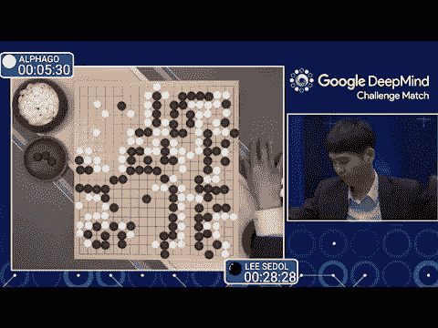
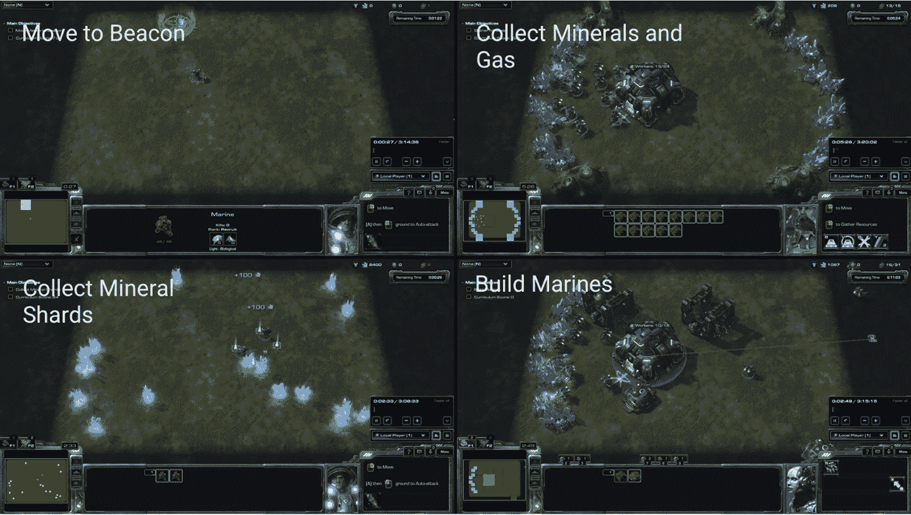

# 第八章：强化学习

到目前为止，我们在本书中介绍的学习技术属于监督学习或无监督学习的范畴。在这两种情况下，解决给定问题需要数据科学家设计一个处理和处理输入数据的深度架构，并将架构的输出连接到适合当前问题的损失函数。这个框架是广泛适用的，但并非所有应用都能很好地适应这种思维方式。让我们考虑训练一个机器学习模型赢得国际象棋比赛的挑战。将棋盘作为空间输入使用卷积网络处理似乎是合理的，但损失会是什么？我们的标准损失函数如交叉熵或 *L*² 损失似乎都不太适用。

强化学习提供了一个数学框架，非常适合解决游戏问题。中心数学概念是 *马尔可夫决策过程*，这是一个用于建模与提供在完成某些 *动作* 后提供 *奖励* 的 *环境* 互动的 AI 代理的工具。这个框架被证明是灵活和通用的，并在近年来找到了许多应用。值得注意的是，强化学习作为一个领域已经相当成熟，自上世纪 70 年代以来就以可识别的形式存在。然而，直到最近，大多数强化学习系统只能解决玩具问题。最近的工作揭示了这些限制可能是由于缺乏复杂的数据输入机制；许多游戏或机器人环境的手工设计特征通常不足。在现代硬件上进行端到端训练的深度表示提取似乎突破了早期强化学习系统的障碍，并在近年取得了显著的成果。

可以说，深度强化学习的第一次突破是在 ATARI 街机游戏上取得的。ATARI 街机游戏传统上是在游戏机厅玩的，提供给用户简单的游戏，通常不需要复杂的策略，但可能需要良好的反应能力。图 8-1 展示了流行的 ATARI 游戏 Breakout 的截图。近年来，由于良好的 ATARI 模拟软件的开发，ATARI 游戏已成为游戏算法的测试平台。最初，应用于 ATARI 的强化学习算法并没有取得出色的结果；算法理解视觉游戏状态的要求使大多数尝试受挫。然而，随着卷积网络的成熟，DeepMind 的研究人员意识到卷积网络可以与现有的强化学习技术结合，并进行端到端训练。


###### 图 8-1\. ATARI 街机游戏 Breakout 的截图。玩家必须使用屏幕底部的挡板弹球，打破屏幕顶部的砖块。

结果系统取得了出色的成绩，并学会了以超人标准玩许多 ATARI 游戏（尤其是那些依赖快速反应的游戏）。图 8-2 列出了 DeepMind 的 DQN 算法在 ATARI 游戏中取得的得分。这一突破性成果推动了深度强化学习领域的巨大增长，并激发了无数研究人员探索深度强化学习技术的潜力。与此同时，DeepMind 的 ATARI 结果显示，强化学习技术能够解决依赖短期动作的系统。这些结果并没有表明深度强化学习系统能够解决需要更大战略规划的游戏。


###### 图 8-2\. DeepMind 的 DQN 强化学习算法在各种 ATARI 游戏中的结果。100% 是一个强大的人类玩家的得分。请注意，DQN 在许多游戏中取得了超人类表现，但在其他游戏中表现相当糟糕。

# 计算机围棋

1994 年，IBM 推出了 Deep Blue 系统，后来成功击败了加里·卡斯帕罗夫在备受瞩目的国际象棋比赛中。该系统依靠蛮力计算来扩展可能的国际象棋走法树（在一定程度上借助手工制作的国际象棋启发式方法）来进行大师级别的国际象棋对局。

计算机科学家尝试将类似的技术应用于其他游戏，如围棋。不幸的是，对于早期的实验者来说，围棋的 19×19 棋盘比国际象棋的 8×8 棋盘大得多。因此，可能移动的树比国际象棋快速扩展得多，简单的粗略计算表明，根据摩尔定律，要以 Deep Blue 的风格实现围棋的蛮力解决方案需要很长时间。使事情复杂化的是，在半局围棋游戏中不存在简单的评估谁领先的启发式方法（确定黑色还是白色领先对于最好的人类分析师来说是一个臭名昭著的嘈杂艺术）。因此，直到最近，许多著名的计算机科学家认为，强大的计算机围棋游戏至少还需要十年的时间。

为了展示其强化学习算法的威力，DeepMind 接受了学习玩围棋的挑战，这是一个需要复杂战略规划的游戏。在一篇引人注目的论文中，DeepMind 展示了其深度强化学习引擎 AlphaGo，它将卷积网络与基于树的搜索相结合，击败了人类围棋大师李世石（图 8-3）。



###### 图 8-3\. 人类围棋冠军李世石与 AlphaGo 对战。李世石最终以 1-4 输掉比赛，但成功赢得了一局。这种胜利不太可能在 AlphaGo 的改进后继者（如 AlphaZero）面前复制。

AlphaGo 令人信服地证明了深度强化学习技术能够学习解决复杂的战略游戏。突破的核心是意识到卷积网络可以学习估计在半局游戏中黑色或白色领先，这使得游戏树可以在合理的深度上被截断。（AlphaGo 还估计哪些移动最有成效，从而使游戏树空间得以第二次修剪。）AlphaGo 的胜利真正将深度强化学习推向了前台，许多研究人员正在努力将 AlphaGo 风格的系统转变为实际应用。

在本章中，我们讨论强化学习算法，特别是深度强化学习架构。然后，我们向读者展示如何成功地将强化学习应用于井字棋游戏。尽管游戏很简单，但训练一个成功的强化学习者来玩井字棋需要相当大的复杂性，您很快就会看到。

本章的代码改编自 DeepChem 强化学习库，特别是由 Peter Eastman 和 Karl Leswing 创建的示例代码。感谢 Peter 在本章示例代码的调试和调优方面提供的帮助。

# 马尔可夫决策过程

在讨论强化学习算法之前，确定强化学习方法试图解决的问题族将非常有用。马尔可夫决策过程（MDPs）的数学框架非常适用于制定强化学习方法。传统上，MDPs 是用一系列希腊符号介绍的，但我们将尝试通过提供一些基本直觉来进行讨论。

MDPs 的核心是一个*环境*和一个*代理*的组合。环境编码了代理寻求行动的“世界”。示例环境可以包括游戏世界。例如，围棋棋盘上，对面坐着李世石大师，这是一个有效的环境。另一个潜在的环境可能是围绕着一架小型机器人直升机的环境。在斯坦福大学的一个著名的早期强化学习成功中，由安德鲁·吴领导的团队训练了一架直升机使用强化学习倒飞，如图 8-4 所示。


###### 图 8-4. 安德鲁·吴在斯坦福大学的团队，从 2004 年到 2010 年，训练了一架直升机学会使用强化学习倒飞。这项工作需要建立一个复杂而准确的物理模拟器。

代理是在环境中行动的学习实体。在我们的第一个例子中，AlphaGo 本身就是代理。在第二个例子中，机器人直升机（或更准确地说，机器人直升机中的控制算法）是代理。每个代理都有一组可以在环境中采取的行动。对于 AlphaGo，这些构成有效的围棋着法。对于机器人直升机，这些包括控制主旋翼和副旋翼。

代理所采取的行动被认为会对环境产生影响。在 AlphaGo 的情况下，这种影响是确定性的（AlphaGo 决定放置一个围棋子导致该子被放置）。在直升机的情况下，影响可能是概率性的（直升机位置的变化可能取决于风况，这不能有效地建模）。

模型的最后一部分是奖励的概念。与监督学习不同，监督学习中存在明确的标签供学习，或者无监督学习中的挑战是学习数据的潜在结构，强化学习在部分、稀疏奖励的环境中运作。在围棋中，奖励是在游戏结束时获得的，无论是胜利还是失败，而在直升机飞行中，奖励可能是为成功飞行或完成特技动作而给出的。

# 奖励函数的设计很困难

强化学习中最大的挑战之一是设计奖励，以促使代理人学习所需的行为。即使是简单的赢/输游戏，如围棋或井字棋，这也可能非常困难。输掉应该受到多少惩罚，赢得应该受到多少奖励？目前还没有好的答案。

对于更复杂的行为，这可能非常具有挑战性。许多研究表明，简单的奖励可能导致代理学习出人意料的甚至可能有害的行为。这些系统引发了对未来代理人具有更大自主权的担忧，当它们在真实世界中被释放后，经过训练以优化不良奖励函数时，可能会造成混乱。

总的来说，强化学习比监督学习技术不够成熟，我们警告应该非常谨慎地决定在生产系统中部署强化学习。考虑到对学习行为的不确定性，请确保彻底测试任何部署的强化学习系统。

# 强化学习算法

现在我们已经向您介绍了强化学习的核心数学结构，让我们考虑如何设计算法来学习强化学习代理的智能行为。在高层次上，强化学习算法可以分为*基于模型*和*无模型*算法。中心区别在于算法是否试图学习其环境如何行动的内部模型。对于简单的环境，如井字棋，模型动态是微不足道的。对于更复杂的环境，如直升机飞行甚至 ATARI 游戏，底层环境可能非常复杂。避免构建环境的显式模型，而是采用隐式模型来指导代理如何行动可能更为实际。

# 模拟和强化学习

任何强化学习算法都需要通过评估代理当前行为并改变以改善获得的奖励来迭代地提高当前代理的性能。这些对代理结构的更新通常包括一些梯度下降更新，我们将在接下来的章节中看到。然而，正如您从之前的章节中熟知的那样，梯度下降是一种缓慢的训练算法！可能需要数百万甚至数十亿次梯度下降步骤才能学习到有效的模型。

这在学习环境是真实世界时会带来问题；一个代理如何能与真实世界互动数百万次？在大多数情况下是不可能的。因此，大多数复杂的强化学习系统在很大程度上依赖于模拟器，这些模拟器允许与环境的计算版本进行交互。对于直升机飞行环境，研究人员面临的最大挑战之一是构建一个准确的直升机物理模拟器，以便计算学习有效的飞行策略。

## Q-Learning

在马尔可夫决策过程的框架中，代理在环境中采取行动并获得与代理行动相关的奖励。*Q*函数预测在特定环境状态下采取特定行动的预期奖励。这个概念似乎非常简单，但当这个预期奖励包括来自未来行动的折扣奖励时，就会变得棘手。

# 折扣奖励

折扣奖励的概念很普遍，并且通常在财务领域引入。假设一个朋友说他下周会给你 10 美元。那未来的 10 美元对你来说不如手头上的 10 美元值钱（如果支付没有发生呢？）。因此，在数学上，引入一个降低未来支付“现值”的折扣因子 γ（通常在 0 和 1 之间）是常见做法。例如，假设你的朋友有点不太可靠。你可能决定设置 γ = 0.5，并将你朋友的承诺价值设为 10γ = 5 美元今天，以考虑奖励的不确定性。

然而，这些未来的奖励取决于代理未来采取的行动。因此，*Q*函数必须以递归的方式根据自身进行公式化，因为一个状态的预期奖励取决于另一个状态的奖励。这种递归定义使得学习*Q*函数变得棘手。这种递归关系可以在具有离散状态空间的简单环境中明确表达，并且可以用动态规划方法解决。对于更一般的环境，*Q*-learning 方法直到最近才变得有用。

最近，Deep *Q*-networks（DQN）由 DeepMind 引入，并被用于解决 ATARI 游戏，如前面提到的。DQN 背后的关键见解再次是通用逼近定理；由于*Q*可能是任意复杂的，我们应该用一个通用逼近器，如深度网络来建模它。虽然以前已经使用神经网络来建模*Q*，但 DeepMind 还为这些网络引入了经验重播的概念，这让它们能够有效地大规模训练 DQN 模型。经验重播存储观察到的游戏结果和过去游戏的转换，并在训练时重新采样它们（除了在新游戏上训练）以确保网络不会忘记过去的教训。

# 灾难性遗忘

神经网络很快忘记过去。事实上，这种现象被称为*灾难性遗忘*，可以非常迅速地发生；几个小批量更新就足以使网络忘记它先前知道的复杂行为。因此，如果没有像经验重播这样的技术，确保网络始终在过去比赛的情节上训练，就不可能学习复杂的行为。

设计一个不会遭受灾难性遗忘的深度网络训练算法仍然是一个当今的主要开放问题。人类明显不会遭受灾难性遗忘；即使多年没有骑自行车，您仍然可能记得如何骑。创建一个具有类似韧性的神经网络可能涉及添加长期外部记忆，类似于神经图灵机。不幸的是，迄今为止设计具有韧性架构的尝试都没有真正取得良好的效果。

## 策略学习

在前一节中，您了解了*Q*-learning，它旨在了解在给定环境状态下采取特定动作的预期奖励。策略学习是一种学习代理行为的替代数学框架。它引入了策略函数π，为代理在给定状态下可以采取的每个动作分配概率。

请注意，策略足以完全定义代理行为。给定一个策略，代理可以通过为当前环境状态抽样一个合适的动作来行动。策略学习很方便，因为策略可以通过称为策略梯度的算法直接学习。这个算法使用一些数学技巧，通过反向传播来计算深度网络的策略梯度。关键概念是*展开*。让一个代理根据其当前策略在环境中行动，并观察所有获得的奖励。然后反向传播，增加那些导致更有益奖励的动作的可能性。这个描述在高层次上是准确的，但我们将在本章后面看到更多的实现细节。

策略通常与*值函数* *V*相关联。这个函数返回从环境的当前状态开始遵循策略π的预期折扣奖励。*V*和*Q*是密切相关的函数，因为两者都提供了从当前状态开始估计未来奖励的估计，但*V*不指定要采取的动作，而是假设动作是从π中抽样的。

另一个常见定义的函数是*优势* *A*。这个函数定义了由于在给定环境状态*s*中采取特定动作*a*而预期奖励的差异，与遵循基本策略π相比。在数学上，*A*是根据*Q*和*V*定义的：

<math display="block"><mrow><mi>A</mi> <mo>(</mo> <mi>s</mi> <mo>,</mo> <mi>a</mi> <mo>)</mo> <mo>=</mo> <mi>Q</mi> <mo>(</mo> <mi>s</mi> <mo>,</mo> <mi>a</mi> <mo>)</mo> <mo>-</mo> <mi>V</mi> <mo>(</mo> <mi>s</mi> <mo>)</mo></mrow></math>

优势在策略学习算法中很有用，因为它让算法能够量化一个特定动作可能比策略当前推荐更合适的程度。

# 策略梯度在强化学习之外

尽管我们已经将策略梯度介绍为一种强化学习算法，但它同样可以被视为一种学习具有不可微子模块的深度网络的工具。当我们解开数学术语时，这意味着什么？

假设我们有一个深度网络，在网络内部调用一个外部程序。这个外部程序是一个黑匣子；它可能是一个网络调用，也可能是对 1970 年代 COBOL 例程的调用。当这个模块没有梯度时，我们如何学习深度网络的其余部分？

事实证明，策略梯度可以被重新用于估计系统的“有效”梯度。简单的直觉是可以运行多个“rollouts”，用于估计梯度。预计在未来几年会看到研究将这个想法扩展到创建具有不可微分模块的大型网络。

## 异步训练

在前一节介绍的策略梯度方法的一个缺点是，执行 rollout 操作需要评估代理在某个（可能是模拟的）环境中的行为。大多数模拟器都是复杂的软件，无法在 GPU 上运行。因此，进行单个学习步骤将需要运行长时间的 CPU 绑定计算。这可能导致训练速度过慢。

异步强化学习方法通过使用多个异步 CPU 线程独立执行 rollouts 来加速这个过程。这些工作线程将执行 rollouts，本地估计策略的梯度更新，然后定期与全局参数集进行同步。从经验上看，异步训练似乎显著加速了强化学习，并允许在笔记本电脑上学习相当复杂的策略。（没有 GPU！大部分计算能力用于 rollouts，因此梯度更新步骤通常不是强化学习训练的速度限制因素。）目前最流行的异步强化学习算法是异步演员优势评论家（A3C）算法。

# CPU 还是 GPU？

大多数大型深度学习应用都需要 GPU，但目前强化学习似乎是一个例外。强化学习算法依赖于执行许多 rollouts，目前似乎偏向于多核 CPU 系统。在特定应用中，个别模拟器可能会被移植到 GPU 上更快地运行，但基于 CPU 的模拟器可能会在不久的将来继续占主导地位。

# 强化学习的局限性

马尔可夫决策过程的框架是非常普遍的。例如，行为科学家通常使用马尔可夫决策过程来理解和建模人类决策过程。这个框架的数学普遍性促使科学家们提出，解决强化学习可能会促使人工通用智能（AGI）的创造。AlphaGo 对李世石的惊人成功加强了这种信念，事实上，像 OpenAI 和 DeepMind 这样的研究团队致力于构建 AGI，他们大部分的努力都集中在开发新的强化学习技术上。

尽管如此，强化学习目前存在重大弱点。仔细的基准测试工作表明，强化学习技术对超参数的选择非常敏感（即使按照深度学习的标准，它已经比其他技术如随机森林更加挑剔）。正如我们所提到的，奖励函数工程非常不成熟。人类能够内部设计自己的奖励函数，或者有效地学习从观察中复制奖励函数。虽然已经提出了直接学习奖励函数的“逆强化学习”算法，但这些算法在实践中存在许多限制。

除了这些基本限制外，仍然存在许多实际的扩展问题。人类能够玩那些将高级战略与成千上万的“微”动作结合在一起的游戏。例如，玩策略游戏星际争霸的大师级水平（参见图 8-5）需要复杂的战略策略，结合对数百个单位的精心控制。游戏可能需要数千次局部移动才能完成。此外，与围棋或国际象棋不同，星际争霸有一个“战争迷雾”，玩家无法看到整个游戏状态。这种大规模游戏状态和不确定性的结合使得强化学习在星际争霸上的尝试失败。因此，DeepMind 和其他团队的 AI 研究人员正在集中精力用深度强化学习方法解决星际争霸。尽管付出了一些努力，但最好的星际争霸机器人仍停留在业余水平。



###### 图 8-5. 为玩实时战略游戏星际争霸所需的一系列子任务。在这个游戏中，玩家必须建立一个可以用来击败对方的军队。成功的星际争霸游戏需要掌握资源规划、探索和复杂策略。最好的计算机星际争霸代理仍停留在业余水平。

总的来说，人们普遍认为强化学习是一种有用的技术，可能在未来几十年内产生深远影响，但也清楚强化学习方法的许多实际限制意味着大部分工作在短期内仍将继续在研究实验室中进行。

# 玩井字棋

井字棋是一种简单的双人游戏。玩家在一个 3×3 的游戏棋盘上放置 X 和 O，直到一名玩家成功地将她的三个棋子排成一行。首先完成这个目标的玩家获胜。如果在棋盘填满之前没有玩家成功排成三个一行，游戏以平局结束。图 8-6 展示了一个井字棋游戏棋盘。


###### 图 8-6. 一个井字棋游戏棋盘。

井字棋是强化学习技术的一个很好的测试平台。这个游戏足够简单，不需要大量的计算能力来训练有效的代理程序。与此同时，尽管井字棋很简单，学习一个有效的代理程序需要相当的复杂性。本节中的 TensorFlow 代码可以说是本书中最复杂的例子。在本节的其余部分，我们将带领你设计一个 TensorFlow 井字棋异步强化学习代理程序。

## 面向对象

到目前为止，在本书中介绍的代码主要由脚本和较小的辅助函数组成。然而，在本章中，我们将转向面向对象的编程风格。如果你来自科学界而不是技术界，这种编程风格可能对你来说是新的。简而言之，面向对象的程序定义了*对象*，这些对象模拟了世界的各个方面。例如，你可能想要定义`Environment`、`Agent`或`Reward`对象，这些对象直接对应这些数学概念。*类*是用于*实例化*（或创建）许多新对象的对象模板。例如，你很快就会看到一个`Environment`类定义，我们将用它来定义许多特定的`Environment`对象。

面向对象是构建复杂系统的特别强大的工具，因此我们将使用它来简化我们的强化学习系统的设计。实际上，你的现实世界深度学习（或强化学习）系统很可能也需要是面向对象的，因此我们鼓励你花一些时间来掌握面向对象设计。有许多优秀的书籍涵盖了面向对象设计的基础知识，我们建议你在需要时查阅。

## 抽象环境

让我们从定义一个抽象的`Environment`对象开始，它将系统的状态编码为 NumPy 对象的列表（示例 8-1）。这个`Environment`对象非常通用（改编自 DeepChem 的强化学习引擎），因此它可以很容易地作为您可能想要实现的其他强化学习项目的模板。

##### 示例 8-1。这个类定义了构建新环境的模板

```py
class Environment(object):
  """An environment in which an actor performs actions to accomplish a task.

 An environment has a current state, which is represented as either a single NumPy
 array, or optionally a list of NumPy arrays.  When an action is taken, that causes
 the state to be updated.  Exactly what is meant by an "action" is defined by each
 subclass.  As far as this interface is concerned, it is simply an arbitrary object.
 The environment also computes a reward for each action, and reports when the task
 has been terminated (meaning that no more actions may be taken).
 """

  def __init__(self, state_shape, n_actions, state_dtype=None):
    """Subclasses should call the superclass constructor in addition to doing their
 own initialization."""
    self.state_shape = state_shape
    self.n_actions = n_actions
    if state_dtype is None:
      # Assume all arrays are float32.
      if isinstance(state_shape[0], collections.Sequence):
        self.state_dtype = [np.float32] * len(state_shape)
      else:
        self.state_dtype = np.float32
    else:
      self.state_dtype = state_dtype
```

## 井字棋环境

我们需要专门化`Environment`类以创建一个适合我们需求的`TicTacToeEnvironment`。为此，我们构建一个`Environment`的*子类*，添加更多功能，同时保留原始*超类*的核心功能。在示例 8-2 中，我们将`TicTacToeEnvironment`定义为`Environment`的子类，添加了特定于井字棋的细节。

##### 示例 8-2。TicTacToeEnvironment 类定义了构建新井字棋环境的模板

```py
class TicTacToeEnvironment(dc.rl.Environment):
  """
 Play tictactoe against a randomly acting opponent
 """
  X = np.array([1.0, 0.0])
  O = np.array([0.0, 1.0])
  EMPTY = np.array([0.0, 0.0])

  ILLEGAL_MOVE_PENALTY = -3.0
  LOSS_PENALTY = -3.0
  NOT_LOSS = 0.1
  DRAW_REWARD = 5.0
  WIN_REWARD = 10.0

  def __init__(self):
    super(TicTacToeEnvironment, self).__init__([(3, 3, 2)], 9)
    self.terminated = None
    self.reset()
```

这里要注意的第一个有趣的细节是，我们将棋盘状态定义为形状为`(3, 3, 2)`的 NumPy 数组。我们使用了`X`和`O`的独热编码（独热编码不仅在自然语言处理中有用！）。

第二个需要注意的重要事情是，环境通过设置违规移动和失败的惩罚以及平局和胜利的奖励来明确定义奖励函数。这段代码强有力地说明了奖励函数工程的任意性。为什么是这些特定的数字？

从经验上看，这些选择似乎导致了稳定的行为，但我们鼓励您尝试使用替代奖励设置来观察结果。在这个实现中，我们指定代理始终扮演`X`，但随机确定是`X`还是`O`先走。函数`get_O_move()`简单地在游戏棋盘上的随机空格上放置一个`O`。`TicTacToeEnvironment`编码了一个扮演`O`的对手，总是选择一个随机移动。`reset()`函数简单地清空棋盘，并在这个游戏中`O`先走时随机放置一个`O`。参见示例 8-3。

##### 示例 8-3。TicTacToeEnvironment 类的更多方法

```py
def reset(self):
  self.terminated = False
  self.state = [np.zeros(shape=(3, 3, 2), dtype=np.float32)]

  # Randomize who goes first
  if random.randint(0, 1) == 1:
    move = self.get_O_move()
    self.state[0][move[0]][move[1]] = TicTacToeEnvironment.O

def get_O_move(self):
  empty_squares = []
  for row in range(3):
    for col in range(3):
      if np.all(self.state[0][row][col] == TicTacToeEnvironment.EMPTY):
        empty_squares.append((row, col))
  return random.choice(empty_squares)
```

实用函数`game_over()`报告游戏是否结束，如果所有方块都填满。`check_winner()`检查指定的玩家是否取得了三连胜并赢得了比赛（示例 8-4）。

##### 示例 8-4。TicTacToeEnvironment 类的用于检测游戏是否结束以及谁赢得比赛的实用方法

```py
def check_winner(self, player):
  for i in range(3):
    row = np.sum(self.state[0][i][:], axis=0)
    if np.all(row == player * 3):
      return True
    col = np.sum(self.state[0][:][i], axis=0)
    if np.all(col == player * 3):
      return True

  diag1 = self.state[0][0][0] + self.state[0][1][1] + self.state[0][2][2]
  if np.all(diag1 == player * 3):
    return True
  diag2 = self.state[0][0][2] + self.state[0][1][1] + self.state[0][2][0]
  if np.all(diag2 == player * 3):
    return True
  return False

def game_over(self):
  for i in range(3):
    for j in range(3):
      if np.all(self.state[0][i][j] == TicTacToeEnvironment.EMPTY):
        return False
  return True
```

在我们的实现中，一个动作只是一个介于 0 和 8 之间的数字，指定`X`方块放置的位置。`step()`方法检查这个位置是否被占用（如果是，则返回惩罚），然后放置方块。如果`X`赢了，就会返回奖励。否则，允许随机的`O`对手进行移动。如果`O`赢了，就会返回惩罚。如果游戏以平局结束，就会返回惩罚。否则，游戏将继续进行，获得一个`NOT_LOSS`奖励。参见示例 8-5。

##### 示例 8-5。这个方法执行模拟的一步

```py
def step(self, action):
  self.state = copy.deepcopy(self.state)
  row = action // 3
  col = action % 3

  # Illegal move -- the square is not empty
  if not np.all(self.state[0][row][col] == TicTacToeEnvironment.EMPTY):
    self.terminated = True
    return TicTacToeEnvironment.ILLEGAL_MOVE_PENALTY

  # Move X
  self.state[0][row][col] = TicTacToeEnvironment.X

  # Did X Win
  if self.check_winner(TicTacToeEnvironment.X):
    self.terminated = True
    return TicTacToeEnvironment.WIN_REWARD

  if self.game_over():
    self.terminated = True
    return TicTacToeEnvironment.DRAW_REWARD

  move = self.get_O_move()
  self.state[0][move[0]][move[1]] = TicTacToeEnvironment.O

  # Did O Win
  if self.check_winner(TicTacToeEnvironment.O):
    self.terminated = True
    return TicTacToeEnvironment.LOSS_PENALTY

  if self.game_over():
    self.terminated = True
    return TicTacToeEnvironment.DRAW_REWARD

  return TicTacToeEnvironment.NOT_LOSS
```

## 层次抽象

运行异步强化学习算法，如 A3C，需要每个线程都能访问一个策略模型的单独副本。这些模型的副本必须定期与彼此重新同步，以便进行训练。我们可以构建多个 TensorFlow 图的最简单方法是什么？

一个简单的可能性是创建一个函数，在一个单独的 TensorFlow 图中创建模型的副本。这种方法效果很好，但对于复杂的网络来说会变得有点混乱。使用一点面向对象的方法可以显著简化这个过程。由于我们的强化学习代码是从 DeepChem 库中改编而来的，我们使用了 DeepChem 中的 TensorGraph 框架的简化版本（请参阅 [*https://deepchem.io*](https://deepchem.io) 获取信息和文档）。这个框架类似于其他高级 TensorFlow 框架，比如 Keras。所有这些模型中的核心抽象是引入一个 `Layer` 对象，它封装了深度网络的一部分。

`Layer` 是 TensorFlow 图中的一个部分，接受输入层列表 `in_layers`。在这个抽象中，深度架构由层的 *有向图* 组成。有向图类似于您在第六章中看到的无向图，但是它们的边上有方向。在这种情况下，`in_layers` 有边指向新的 `Layer`，方向指向新层。您将在下一节中了解更多关于这个概念的内容。

我们使用 `tf.register_tensor_conversion_function`，这是一个允许任意类注册为可转换为张量的实用程序。这个注册意味着一个 `Layer` 可以通过调用 `tf.convert_to_tensor` 被转换为 TensorFlow 张量。`_get_input_tensors()` 私有方法是一个实用程序，它使用 `tf.convert_to_tensor` 将输入层转换为输入张量。每个 `Layer` 负责实现一个 `create_tensor()` 方法，该方法指定要添加到 TensorFlow 计算图中的操作。请参见 示例 8-6。

##### 示例 8-6\. Layer 对象是面向对象深度架构中的基本抽象。它封装了网络的一部分，比如全连接层或卷积层。这个示例定义了所有这些层的通用超类。

```py
class Layer(object):

  def __init__(self, in_layers=None, **kwargs):
    if "name" in kwargs:
      self.name = kwargs["name"]
    else:
      self.name = None
    if in_layers is None:
      in_layers = list()
    if not isinstance(in_layers, Sequence):
      in_layers = [in_layers]
    self.in_layers = in_layers
    self.variable_scope = ""
    self.tb_input = None

  def create_tensor(self, in_layers=None, **kwargs):
    raise NotImplementedError("Subclasses must implement for themselves")

  def _get_input_tensors(self, in_layers):
    """Get the input tensors to his layer.

 Parameters
 ----------
 in_layers: list of Layers or tensors
 the inputs passed to create_tensor().  If None, this layer's inputs will
 be used instead.
 """
    if in_layers is None:
      in_layers = self.in_layers
    if not isinstance(in_layers, Sequence):
      in_layers = [in_layers]
    tensors = []
    for input in in_layers:
      tensors.append(tf.convert_to_tensor(input))
    return tensors

def _convert_layer_to_tensor(value, dtype=None, name=None, as_ref=False):
  return tf.convert_to_tensor(value.out_tensor, dtype=dtype, name=name)

tf.register_tensor_conversion_function(Layer, _convert_layer_to_tensor)
```

前面的描述是抽象的，但在实践中很容易使用。示例 8-7 展示了一个 `Squeeze` 层，它使用 `Layer` 包装了 `tf.squeeze`（您稍后会发现这个类很方便）。请注意，`Squeeze` 是 `Layer` 的子类。

##### 示例 8-7\. Squeeze 层压缩其输入

```py
class Squeeze(Layer):

  def __init__(self, in_layers=None, squeeze_dims=None, **kwargs):
    self.squeeze_dims = squeeze_dims
    super(Squeeze, self).__init__(in_layers, **kwargs)

  def create_tensor(self, in_layers=None, **kwargs):
    inputs = self._get_input_tensors(in_layers)
    parent_tensor = inputs[0]
    out_tensor = tf.squeeze(parent_tensor, squeeze_dims=self.squeeze_dims)
    self.out_tensor = out_tensor
    return out_tensor
```

`Input` 层为方便起见包装了占位符（示例 8-8）。请注意，必须为我们使用的每个层调用 `Layer.create_tensor` 方法，以构建 TensorFlow 计算图。

##### 示例 8-8\. Input 层向计算图添加占位符

```py
class Input(Layer):

  def __init__(self, shape, dtype=tf.float32, **kwargs):
    self._shape = tuple(shape)
    self.dtype = dtype
    super(Input, self).__init__(**kwargs)

  def create_tensor(self, in_layers=None, **kwargs):
    if in_layers is None:
      in_layers = self.in_layers
    out_tensor = tf.placeholder(dtype=self.dtype, shape=self._shape)
    self.out_tensor = out_tensor
    return out_tensor
```

# tf.keras 和 tf.estimator

TensorFlow 现在将流行的 Keras 面向对象前端集成到核心 TensorFlow 库中。Keras 包括一个 `Layer` 类定义，与本节中刚学到的 `Layer` 对象非常相似。事实上，这里的 `Layer` 对象是从 DeepChem 库中改编的，而 DeepChem 又是从较早版本的 Keras 改编而来的。

值得注意的是，`tf.keras` 还没有成为 TensorFlow 的标准高级接口。`tf.estimator` 模块提供了一个替代（尽管不那么丰富）的高级接口到原始 TensorFlow。

无论最终哪个前端成为标准，我们认为理解构建自己前端的基本设计原则是有益且值得的。您可能需要为您的组织构建一个需要另一种设计的新系统，因此对设计原则的扎实掌握将对您有所帮助。

## 定义层的图

我们在前一节中简要提到，一个深度架构可以被视为 `Layer` 对象的有向图。在本节中，我们将这种直觉转化为 `TensorGraph` 对象。这些对象负责构建底层的 TensorFlow 计算图。

`TensorGraph`对象负责在内部维护一个`tf.Graph`、一个`tf.Session`和一个层列表（`self.layers`）（示例 8-9）。有向图通过每个`Layer`对象的`in_layers`隐式表示。`TensorGraph`还包含用于将这个`tf.Graph`实例保存到磁盘的实用程序，并因此为自己分配一个目录（如果没有指定，则使用`tempfile.mkdtemp()`）来存储与其底层 TensorFlow 图相关的权重的检查点。

##### 示例 8-9。TensorGraph 包含一组层的图；TensorGraph 对象可以被视为持有您想要训练的深度架构的“模型”对象

```py
class TensorGraph(object):

  def __init__(self,
               batch_size=100,
               random_seed=None,
               graph=None,
               learning_rate=0.001,
               model_dir=None,
               **kwargs):
    """
 Parameters
 ----------
 batch_size: int
 default batch size for training and evaluating
 graph: tensorflow.Graph
 the Graph in which to create Tensorflow objects.  If None, a new Graph
 is created.
 learning_rate: float or LearningRateSchedule
 the learning rate to use for optimization
 kwargs
 """

    # Layer Management
    self.layers = dict()
    self.features = list()
    self.labels = list()
    self.outputs = list()
    self.task_weights = list()
    self.loss = None
    self.built = False
    self.optimizer = None
    self.learning_rate = learning_rate

    # Singular place to hold Tensor objects which don't serialize
    # See TensorGraph._get_tf() for more details on lazy construction
    self.tensor_objects = {
        "Graph": graph,
        #"train_op": None,
    }
    self.global_step = 0
    self.batch_size = batch_size
    self.random_seed = random_seed
    if model_dir is not None:
      if not os.path.exists(model_dir):
        os.makedirs(model_dir)
    else:
      model_dir = tempfile.mkdtemp()
      self.model_dir_is_temp = True
    self.model_dir = model_dir
    self.save_file = "%s/%s" % (self.model_dir, "model")
    self.model_class = None
```

私有方法`_add_layer`执行一些工作，将一个新的`Layer`对象添加到`TensorGraph`中（示例 8-10）。

##### 示例 8-10。_add_layer 方法添加一个新的 Layer 对象

```py
def _add_layer(self, layer):
  if layer.name is None:
    layer.name = "%s_%s" % (layer.__class__.__name__, len(self.layers) + 1)
  if layer.name in self.layers:
    return
  if isinstance(layer, Input):
    self.features.append(layer)
  self.layers[layer.name] = layer
  for in_layer in layer.in_layers:
    self._add_layer(in_layer)
```

`TensorGraph`中的层必须形成一个有向无环图（图中不能有循环）。因此，我们可以对这些层进行拓扑排序。直观地说，拓扑排序“排序”图中的层，以便每个`Layer`对象的`in_layers`在有序列表中位于它之前。这种拓扑排序是必要的，以确保给定层的所有输入层在该层本身之前添加到图中（示例 8-11）。

##### 示例 8-11。topsort 方法对 TensorGraph 中的层进行排序

```py
def topsort(self):

  def add_layers_to_list(layer, sorted_layers):
    if layer in sorted_layers:
      return
    for in_layer in layer.in_layers:
      add_layers_to_list(in_layer, sorted_layers)
    sorted_layers.append(layer)

  sorted_layers = []
  for l in self.features + self.labels + self.task_weights + self.outputs:
    add_layers_to_list(l, sorted_layers)
  add_layers_to_list(self.loss, sorted_layers)
  return sorted_layers
```

`build()`方法负责通过按照拓扑顺序调用`layer.create_tensor`来填充`tf.Graph`实例（示例 8-12）。

##### 示例 8-12。build 方法填充底层的 TensorFlow 图

```py
def build(self):
  if self.built:
    return
  with self._get_tf("Graph").as_default():
    self._training_placeholder = tf.placeholder(dtype=tf.float32, shape=())
    if self.random_seed is not None:
      tf.set_random_seed(self.random_seed)
    for layer in self.topsort():
      with tf.name_scope(layer.name):
        layer.create_tensor(training=self._training_placeholder)
    self.session = tf.Session()

    self.built = True
```

`set_loss()`方法为训练向图中添加损失。`add_output()`指定所讨论的层可能从图中获取。`set_optimizer()`指定用于训练的优化器（示例 8-13）。

##### 示例 8-13。这些方法向计算图中添加必要的损失、输出和优化器

```py
def set_loss(self, layer):
  self._add_layer(layer)
  self.loss = layer

def add_output(self, layer):
  self._add_layer(layer)
  self.outputs.append(layer)

def set_optimizer(self, optimizer):
  """Set the optimizer to use for fitting."""
  self.optimizer = optimizer
```

`get_layer_variables()`方法用于获取层创建的可学习`tf.Variable`对象。私有方法`_get_tf`用于获取支持`TensorGraph`的`tf.Graph`和优化器实例。`get_global_step`是一个方便的方法，用于获取训练过程中的当前步骤（从构造时的 0 开始）。参见示例 8-14。

##### 示例 8-14。获取与每个层相关的可学习变量

```py
def get_layer_variables(self, layer):
  """Get the list of trainable variables in a layer of the graph."""
  if not self.built:
    self.build()
  with self._get_tf("Graph").as_default():
    if layer.variable_scope == "":
      return []
    return tf.get_collection(
        tf.GraphKeys.TRAINABLE_VARIABLES, scope=layer.variable_scope)

def get_global_step(self):
  return self._get_tf("GlobalStep")

def _get_tf(self, obj):
  """Fetches underlying TensorFlow primitives.

 Parameters
 ----------
 obj: str
 If "Graph", returns tf.Graph instance. If "Optimizer", returns the
 optimizer. If "train_op", returns the train operation. If "GlobalStep" returns
 the global step.
 Returns
 -------
 TensorFlow Object
 """

  if obj in self.tensor_objects and self.tensor_objects[obj] is not None:
    return self.tensor_objects[obj]
  if obj == "Graph":
    self.tensor_objects["Graph"] = tf.Graph()
  elif obj == "Optimizer":
    self.tensor_objects["Optimizer"] = tf.train.AdamOptimizer(
        learning_rate=self.learning_rate,
        beta1=0.9,
        beta2=0.999,
        epsilon=1e-7)
  elif obj == "GlobalStep":
    with self._get_tf("Graph").as_default():
      self.tensor_objects["GlobalStep"] = tf.Variable(0, trainable=False)
  return self._get_tf(obj)
```

最后，`restore()`方法从磁盘恢复保存的`TensorGraph`（示例 8-15）。（正如您将在后面看到的，`TensorGraph`在训练期间会自动保存。）

##### 示例 8-15。从磁盘恢复训练模型

```py
def restore(self):
  """Reload the values of all variables from the most recent checkpoint file."""
  if not self.built:
    self.build()
  last_checkpoint = tf.train.latest_checkpoint(self.model_dir)
  if last_checkpoint is None:
    raise ValueError("No checkpoint found")
  with self._get_tf("Graph").as_default():
    saver = tf.train.Saver()
    saver.restore(self.session, last_checkpoint)
```

# A3C 算法

在本节中，您将学习如何实现 A3C，即您在本章前面看到的异步强化学习算法。A3C 是一个比您之前看到的训练算法复杂得多的算法。该算法需要在多个线程中运行梯度下降，与游戏回合代码交替进行，并异步更新学习权重。由于这种额外的复杂性，我们将以面向对象的方式定义 A3C 算法。让我们从定义一个`A3C`对象开始。

`A3C`类实现了 A3C 算法（示例 8-16）。在基本算法上添加了一些额外的功能，以鼓励学习，特别是熵项和对广义优势估计的支持。我们不会涵盖所有这些细节，但鼓励您查阅研究文献（在文档中列出）以了解更多。

##### 示例 8-16。定义封装异步 A3C 训练算法的 A3C 类

```py
class A3C(object):
  """
 Implements the Asynchronous Advantage Actor-Critic (A3C) algorithm.

 The algorithm is described in Mnih et al, "Asynchronous Methods for Deep
 Reinforcement Learning" (https://arxiv.org/abs/1602.01783).  This class
 requires the policy to output two quantities: a vector giving the probability
 of taking each action, and an estimate of the value function for the current
 state.  It optimizes both outputs at once using a loss that is the sum of three
 terms:

 1\. The policy loss, which seeks to maximize the discounted reward for each action.
 2\. The value loss, which tries to make the value estimate match the actual
 discounted reward that was attained at each step.
 3\. An entropy term to encourage exploration.

 This class only supports environments with discrete action spaces, not
 continuous ones.  The "action" argument passed to the environment is an
 integer, giving the index of the action to perform.

 This class supports Generalized Advantage Estimation as described in Schulman
 et al., "High-Dimensional Continuous Control Using Generalized Advantage
 Estimation" (https://arxiv.org/abs/1506.02438).  This is a method of trading
 off bias and variance in the advantage estimate, which can sometimes improve
 the rate of convergence.  Use the advantage_lambda parameter to adjust the
 tradeoff.
 """
  self._env = env
  self.max_rollout_length = max_rollout_length
  self.discount_factor = discount_factor
  self.advantage_lambda = advantage_lambda
  self.value_weight = value_weight
  self.entropy_weight = entropy_weight
  self._optimizer = None
  (self._graph, self._features, self._rewards, self._actions,
   self._action_prob, self._value, self._advantages) = self.build_graph(
       None, "global", model_dir)
  with self._graph._get_tf("Graph").as_default():
    self._session = tf.Session()
```

A3C 类的核心在于`build_graph()`方法（示例 8-17），它构建了一个`TensorGraph`实例（在其下面是一个 TensorFlow 计算图），编码了模型学习的策略。请注意，与之前看到的其他定义相比，这个定义是多么简洁！使用面向对象有很多优势。

##### 示例 8-17。这个方法构建了 A3C 算法的计算图。请注意，策略网络是在这里使用您之前看到的 Layer 抽象定义的。

```py
def build_graph(self, tf_graph, scope, model_dir):
  """Construct a TensorGraph containing the policy and loss calculations."""
  state_shape = self._env.state_shape
  features = []
  for s in state_shape:
    features.append(Input(shape=[None] + list(s), dtype=tf.float32))
  d1 = Flatten(in_layers=features)
  d2 = Dense(
      in_layers=[d1],
      activation_fn=tf.nn.relu,
      normalizer_fn=tf.nn.l2_normalize,
      normalizer_params={"dim": 1},
      out_channels=64)
  d3 = Dense(
      in_layers=[d2],
      activation_fn=tf.nn.relu,
      normalizer_fn=tf.nn.l2_normalize,
      normalizer_params={"dim": 1},
      out_channels=32)
  d4 = Dense(
      in_layers=[d3],
      activation_fn=tf.nn.relu,
      normalizer_fn=tf.nn.l2_normalize,
      normalizer_params={"dim": 1},
      out_channels=16)
  d4 = BatchNorm(in_layers=[d4])
  d5 = Dense(in_layers=[d4], activation_fn=None, out_channels=9)
  value = Dense(in_layers=[d4], activation_fn=None, out_channels=1)
  value = Squeeze(squeeze_dims=1, in_layers=[value])
  action_prob = SoftMax(in_layers=[d5])

  rewards = Input(shape=(None,))
  advantages = Input(shape=(None,))
  actions = Input(shape=(None, self._env.n_actions))
  loss = A3CLoss(
      self.value_weight,
      self.entropy_weight,
      in_layers=[rewards, actions, action_prob, value, advantages])
  graph = TensorGraph(
      batch_size=self.max_rollout_length,
      graph=tf_graph,
      model_dir=model_dir)
  for f in features:
    graph._add_layer(f)
  graph.add_output(action_prob)
  graph.add_output(value)
  graph.set_loss(loss)
  graph.set_optimizer(self._optimizer)
  with graph._get_tf("Graph").as_default():
    with tf.variable_scope(scope):
      graph.build()
  return graph, features, rewards, actions, action_prob, value, advantages
```

这个示例中有很多代码。让我们将其拆分成多个示例，并更仔细地讨论。示例 8-18 将`TicTacToeEnvironment`的数组编码输入到图的`Input`实例中。

##### 示例 8-18。这段代码从 build_graph()方法中输入了 TicTacToeEnvironment 的数组编码。

```py
state_shape = self._env.state_shape
features = []
for s in state_shape:
  features.append(Input(shape=[None] + list(s), dtype=tf.float32))
```

示例 8-19 显示了用于从环境中构建奖励、观察到的优势和采取的行动的输入的代码。

##### 示例 8-19。这段代码从 build_graph()方法中定义了奖励、优势和行动的输入对象

```py
rewards = Input(shape=(None,))
advantages = Input(shape=(None,))
actions = Input(shape=(None, self._env.n_actions))
```

策略网络负责学习策略。在示例 8-20 中，输入的棋盘状态首先被展平为输入特征向量。一系列全连接（或`Dense`）变换被应用于展平的棋盘。最后，使用`Softmax`层来从`d5`预测动作概率（请注意，`out_channels`设置为 9，对应井字棋棋盘上的每个可能移动）。

##### 示例 8-20。这段代码从 build_graph()方法中定义了策略网络

```py
d1 = Flatten(in_layers=features)
d2 = Dense(
    in_layers=[d1],
    activation_fn=tf.nn.relu,
    normalizer_fn=tf.nn.l2_normalize,
    normalizer_params={"dim": 1},
    out_channels=64)
d3 = Dense(
    in_layers=[d2],
    activation_fn=tf.nn.relu,
    normalizer_fn=tf.nn.l2_normalize,
    normalizer_params={"dim": 1},
    out_channels=32)
d4 = Dense(
    in_layers=[d3],
    activation_fn=tf.nn.relu,
    normalizer_fn=tf.nn.l2_normalize,
    normalizer_params={"dim": 1},
    out_channels=16)
d4 = BatchNorm(in_layers=[d4])
d5 = Dense(in_layers=[d4], activation_fn=None, out_channels=9)
value = Dense(in_layers=[d4], activation_fn=None, out_channels=1)
value = Squeeze(squeeze_dims=1, in_layers=[value])
action_prob = SoftMax(in_layers=[d5])
```

# 特征工程是否已经过时？

在这一部分中，我们将原始的井字棋游戏棋盘输入到 TensorFlow 中，用于训练策略。然而，值得注意的是，对于比井字棋更复杂的游戏，这种方法可能不会产生令人满意的结果。关于 AlphaGo 的一个较少为人知的事实是，DeepMind 进行了复杂的特征工程，以提取棋盘上的“有趣”棋子模式，以便让 AlphaGo 的学习更容易。（这个事实被藏在 DeepMind 论文的补充信息中。）

事实仍然是，强化学习（以及深度学习方法广泛地）通常仍然需要人为引导的特征工程来提取有意义的信息，以便学习算法能够学习有效的策略和模型。随着硬件进步提供更多的计算能力，这种对特征工程的需求可能会减少，但在短期内，计划手动提取关于系统的信息以提高性能。

## A3C 损失函数

我们现在已经设置好了面向对象的机制，用于为 A3C 策略网络定义损失。这个损失函数本身将被实现为一个`Layer`对象（这是一个方便的抽象，深度架构的所有部分都只是层）。`A3CLoss`对象实现了一个数学损失，包括三个项的总和：`policy_loss`、`value_loss`和用于探索的`entropy`项。参见示例 8-21。

##### 示例 8-21。这个层实现了 A3C 的损失函数

```py
class A3CLoss(Layer):
  """This layer computes the loss function for A3C."""

  def __init__(self, value_weight, entropy_weight, **kwargs):
    super(A3CLoss, self).__init__(**kwargs)
    self.value_weight = value_weight
    self.entropy_weight = entropy_weight

  def create_tensor(self, **kwargs):
    reward, action, prob, value, advantage = [
        layer.out_tensor for layer in self.in_layers
    ]
    prob = prob + np.finfo(np.float32).eps
    log_prob = tf.log(prob)
    policy_loss = -tf.reduce_mean(
        advantage * tf.reduce_sum(action * log_prob, axis=1))
    value_loss = tf.reduce_mean(tf.square(reward - value))
    entropy = -tf.reduce_mean(tf.reduce_sum(prob * log_prob, axis=1))
    self.out_tensor = policy_loss + self.value_weight * value_loss
    - self.entropy_weight * entropy
    return self.out_tensor
```

这个定义有很多部分，让我们提取代码片段并检查。`A3CLoss`层将`reward, action, prob, value, advantage`层作为输入。为了数学稳定性，我们将概率转换为对数概率（这在数值上更稳定）。参见示例 8-22。

##### 示例 8-22。这段代码从 A3CLoss 中获取奖励、动作、概率、价值、优势作为输入层，并计算对数概率

```py
reward, action, prob, value, advantage = [
    layer.out_tensor for layer in self.in_layers
]
prob = prob + np.finfo(np.float32).eps
log_prob = tf.log(prob)
```

策略损失计算所有观察到的优势的总和，加权为所采取动作的对数概率。（请记住，优势是采取给定动作与从原始策略获得该状态的预期奖励之间的差异）。这里的直觉是，`policy_loss`提供了哪些动作是有益的信号，哪些是无益的（示例 8-23）。

##### 示例 8-23。A3CLoss 中的此代码段定义了策略损失

```py
policy_loss = -tf.reduce_mean(
    advantage * tf.reduce_sum(action * log_prob, axis=1))
```

值损失计算我们对*V*（`reward`）的估计值与观察到的*V*的实际值（`value`）之间的差异。请注意这里使用的*L*²损失（示例 8-24）。

##### 示例 8-24。A3CLoss 中的此代码段定义了值损失

```py
value_loss = tf.reduce_mean(tf.square(reward - value))
```

熵项是一个附加项，通过添加一些噪音来鼓励策略进一步探索。这个项实际上是 A3C 网络的一种正则化形式。由`A3CLoss`计算的最终损失是这些组件损失的线性组合。请参阅示例 8-25。

##### 示例 8-25。A3CLoss 中的此代码段定义了添加到损失中的熵项

```py
entropy = -tf.reduce_mean(tf.reduce_sum(prob * log_prob, axis=1))
```

## 定义工作者

到目前为止，您已经看到了如何构建策略网络，但尚未看到异步训练过程是如何实现的。从概念上讲，异步训练包括各个工作者在本地模拟游戏展开上运行梯度下降，并定期将学到的知识贡献给全局一组权重。继续我们的面向对象设计，让我们介绍`Worker`类。

每个`Worker`实例都持有一个模型的副本，该模型在单独的线程上异步训练（示例 8-26）。请注意，“a3c.build_graph（）”用于为相关线程构建 TensorFlow 计算图的本地副本。在这里特别注意`local_vars`和`global_vars`。我们需要确保仅训练与此 Worker 策略副本相关的变量，而不是全局变量的副本（用于在线程之间共享信息）。因此，`gradients`使用`tf.gradients`仅对`local_vars`的损失梯度进行计算。

##### 示例 8-26。Worker 类实现每个线程执行的计算

```py
class Worker(object):
  """A Worker object is created for each training thread."""

  def __init__(self, a3c, index):
    self.a3c = a3c
    self.index = index
    self.scope = "worker%d" % index
    self.env = copy.deepcopy(a3c._env)
    self.env.reset()
    (self.graph, self.features, self.rewards, self.actions, self.action_prob,
     self.value, self.advantages) = a3c.build_graph(
        a3c._graph._get_tf("Graph"), self.scope, None)
    with a3c._graph._get_tf("Graph").as_default():
      local_vars = tf.get_collection(tf.GraphKeys.TRAINABLE_VARIABLES,
                                     self.scope)
      global_vars = tf.get_collection(tf.GraphKeys.TRAINABLE_VARIABLES,
                                      "global")
      gradients = tf.gradients(self.graph.loss.out_tensor, local_vars)
      grads_and_vars = list(zip(gradients, global_vars))
      self.train_op = a3c._graph._get_tf("Optimizer").apply_gradients(
          grads_and_vars)
      self.update_local_variables = tf.group(
          * [tf.assign(v1, v2) for v1, v2 in zip(local_vars, global_vars)])
      self.global_step = self.graph.get_global_step()
```

### 工作者展开

每个`Worker`负责在本地模拟游戏展开。“create_rollout（）”方法使用`session.run`从 TensorFlow 图中获取动作概率（示例 8-27）。然后使用`np.random.choice`从该策略中加权采样一个动作，权重为每个类别的概率。所采取动作的奖励是通过调用`self.env.step(action)`从`TicTacToeEnvironment`计算的。

##### 示例 8-27。create_rollout 方法在本地模拟游戏展开

```py
def create_rollout(self):
  """Generate a rollout."""
  n_actions = self.env.n_actions
  session = self.a3c._session
  states = []
  actions = []
  rewards = []
  values = []

  # Generate the rollout.
  for i in range(self.a3c.max_rollout_length):
    if self.env.terminated:
      break
    state = self.env.state
    states.append(state)
    feed_dict = self.create_feed_dict(state)
    results = session.run(
        [self.action_prob.out_tensor, self.value.out_tensor],
        feed_dict=feed_dict)
    probabilities, value = results[:2]
    action = np.random.choice(np.arange(n_actions), p=probabilities[0])
    actions.append(action)
    values.append(float(value))
    rewards.append(self.env.step(action))

  # Compute an estimate of the reward for the rest of the episode.
  if not self.env.terminated:
    feed_dict = self.create_feed_dict(self.env.state)
    final_value = self.a3c.discount_factor * float(
        session.run(self.value.out_tensor, feed_dict))
  else:
    final_value = 0.0
  values.append(final_value)
  if self.env.terminated:
    self.env.reset()
  return states, actions, np.array(rewards), np.array(values)
```

“process_rollouts（）”方法执行计算折扣奖励、值、动作和优势所需的预处理（示例 8-28）。

##### 示例 8-28。process_rollout 方法计算奖励、值、动作和优势，然后针对损失采取梯度下降步骤

```py
def process_rollout(self, states, actions, rewards, values, step_count):
  """Train the network based on a rollout."""

  # Compute the discounted rewards and advantages.
  if len(states) == 0:
    # Rollout creation sometimes fails in multithreaded environment.
    # Don't process if malformed
    print("Rollout creation failed. Skipping")
    return

  discounted_rewards = rewards.copy()
  discounted_rewards[-1] += values[-1]
  advantages = rewards - values[:-1] + self.a3c.discount_factor * np.array(
      values[1:])
  for j in range(len(rewards) - 1, 0, -1):
    discounted_rewards[j-1] += self.a3c.discount_factor * discounted_rewards[j]
    advantages[j-1] += (
        self.a3c.discount_factor * self.a3c.advantage_lambda * advantages[j])
   # Convert the actions to one-hot.
  n_actions = self.env.n_actions
  actions_matrix = []
  for action in actions:
    a = np.zeros(n_actions)
    a[action] = 1.0
    actions_matrix.append(a)

  # Rearrange the states into the proper set of arrays.
  state_arrays = [[] for i in range(len(self.features))]
  for state in states:
    for j in range(len(state)):
      state_arrays[j].append(state[j])

  # Build the feed dict and apply gradients.
  feed_dict = {}
  for f, s in zip(self.features, state_arrays):
    feed_dict[f.out_tensor] = s
  feed_dict[self.rewards.out_tensor] = discounted_rewards
  feed_dict[self.actions.out_tensor] = actions_matrix
  feed_dict[self.advantages.out_tensor] = advantages
  feed_dict[self.global_step] = step_count
  self.a3c._session.run(self.train_op, feed_dict=feed_dict)
```

“Worker.run（）”方法执行`Worker`的训练步骤，依赖于“process_rollouts（）”在底层发出实际调用“self.a3c._session.run（）”（示例 8-29）。

##### 示例 8-29。run（）方法是 Worker 的顶层调用

```py
def run(self, step_count, total_steps):
  with self.graph._get_tf("Graph").as_default():
    while step_count[0] < total_steps:
      self.a3c._session.run(self.update_local_variables)
      states, actions, rewards, values = self.create_rollout()
      self.process_rollout(states, actions, rewards, values, step_count[0])
      step_count[0] += len(actions)
```

## 训练策略

“A3C.fit（）”方法将引入的所有不同部分汇集在一起，以训练模型。该“fit（）”方法负责使用 Python`threading`库定期生成`Worker`线程。由于每个`Worker`负责自己的训练，因此“fit（）”方法只负责定期将训练好的模型保存到磁盘。请参阅示例 8-30。

##### 示例 8-30。fit（）方法将所有内容汇集在一起，并运行 A3C 训练算法

```py
def fit(self,
        total_steps,
        max_checkpoints_to_keep=5,
        checkpoint_interval=600,
        restore=False):
  """Train the policy.

 Parameters
 ----------
 total_steps: int
 the total number of time steps to perform on the environment, across all
 rollouts on all threads
 max_checkpoints_to_keep: int
 the maximum number of checkpoint files to keep.  When this number is
 reached, older files are deleted.
 checkpoint_interval: float
 the time interval at which to save checkpoints, measured in seconds
 restore: bool
 if True, restore the model from the most recent checkpoint and continue
 training from there.  If False, retrain the model from scratch.
 """
  with self._graph._get_tf("Graph").as_default():
    step_count = [0]
    workers = []
    threads = []
    for i in range(multiprocessing.cpu_count()):
      workers.append(Worker(self, i))
    self._session.run(tf.global_variables_initializer())
    if restore:
      self.restore()
    for worker in workers:
      thread = threading.Thread(
          name=worker.scope,
          target=lambda: worker.run(step_count, total_steps))
      threads.append(thread)
      thread.start()
    variables = tf.get_collection(
        tf.GraphKeys.GLOBAL_VARIABLES, scope="global")
    saver = tf.train.Saver(variables, max_to_keep=max_checkpoints_to_keep)
    checkpoint_index = 0
    while True:
      threads = [t for t in threads if t.isAlive()]
      if len(threads) > 0:
        threads[0].join(checkpoint_interval)
      checkpoint_index += 1
      saver.save(
          self._session, self._graph.save_file, global_step=checkpoint_index)
      if len(threads) == 0:
        break
```

## 读者的挑战

我们强烈建议您尝试为自己训练井字游戏模型！请注意，这个例子比书中的其他例子更复杂，需要更大的计算能力。我们建议使用至少几个 CPU 核心的机器。这个要求并不过分；一台好的笔记本电脑应该足够。尝试使用类似`htop`这样的工具来检查代码是否确实是多线程的。看看您能训练出多好的模型！您应该能大部分时间击败随机基线，但这个基本实现不会给您一个总是赢的模型。我们建议探索强化学习文献，并在基础实现的基础上进行扩展，看看您能做得多好。

# 回顾

在本章中，我们向您介绍了强化学习（RL）的核心概念。我们带您了解了 RL 方法在 ATARI、倒立直升机飞行和计算机围棋上取得的一些最近的成功。然后，我们教授了您马尔可夫决策过程的数学框架。我们通过一个详细的案例研究，带您了解了如何构建一个井字游戏代理。这个算法使用了一种复杂的训练方法 A3C，利用多个 CPU 核心加快训练速度。在第九章中，您将学习更多关于使用多个 GPU 训练模型的知识。
