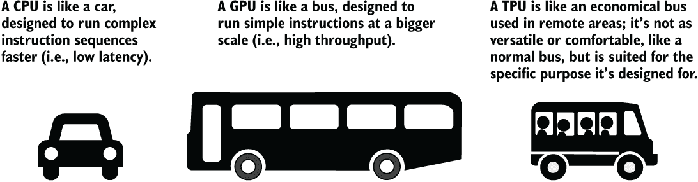
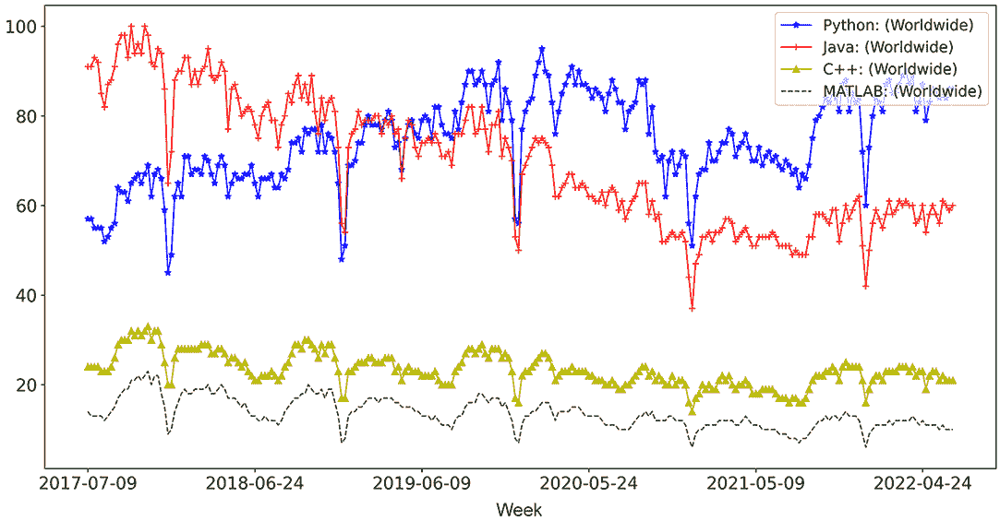
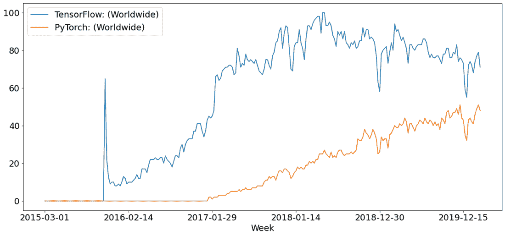
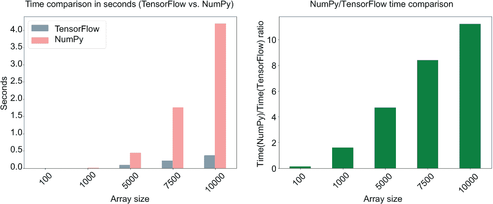

# 第一章：TensorFlow 的惊人世界

本章涵盖的内容

+   TensorFlow 是什么

+   机器学习中的硬件：GPU 和 CPU

+   何时以及何时不使用 TensorFlow

+   本书教授的内容

+   本书适合谁

+   为什么我们应该关注 TensorFlow

到 2025 年，每秒预计将产生超过 5 百万吉字节的数据（[`www.weforum.org`](https://www.weforum.org)）。我们通过 Google 搜索查询、推特、Facebook 照片和对 Alexa 的语音命令所做出的微小贡献将积累成空前数量的数据。因此，现在正是在人工智能前沿进行斗争、理解并利用不断增长的数字数据宇宙的最佳时机。毫无疑问，数据本身在我们从中提取信息之前并不是非常有用。例如，如果机器知道图像中有什么，图像就会更有用；如果机器能够表达/转录出说过的话，语音命令就会更有用。机器学习是让你从数据世界跨入信息领域（例如，可操作的见解、有用的模式）的门卫，通过允许机器从数据中学习。机器学习，特别是深度学习方法，在充足的数据存在的情况下提供了无与伦比的性能。随着数据的爆炸式增长，越来越多的用例将出现，可以应用深度学习。当然，我们不能忽视更好的技术淹没了流行的深度学习方法的可能性。然而，无可辩驳的现实是，迄今为止，深度学习一直在不断地胜过其他算法，特别是在充足的数据存在时。

什么是机器学习？

机器学习是一个过程，我们在给定数据作为输入的情况下训练和部署一个计算模型来预测一些输出。机器学习问题通常包括以下步骤：

1.  *理解/探索性数据分析*——这是您将要探索的提供给您的数据的地方（例如，了解因变量/自变量）。

1.  *清理数据*——现实世界的数据通常是混乱的，因此数据清理对确保模型看到高质量数据至关重要。

1.  *特征工程*——需要从现有特征或原始数据中构建新特征。

1.  *建模*——在这个阶段，您使用选定的特征和相应的目标来训练模型。

1.  *评估*——在训练模型之后，您必须确保它是可靠的，并且可以在未见过的数据（例如，测试数据）上表现良好。

1.  *为利益相关者创建用户界面以使用该模型*——在大多数情况下，您需要为用户提供一个仪表板/用户界面，让他们与模型进行交互。

尽管看起来像是一套明确定义的步骤，但典型的机器学习问题并不是从 A 到 B 的直线路径，而是由重复的循环或迭代组成的错综复杂的路径。例如，在特征工程阶段，您可能会意识到您尚未探索某些数据方面，这需要更多的数据探索。

深度学习模型很容易超过数百万（最近甚至数十亿）的参数（即权重和偏差），它们对数据有很大的需求。这意味着我们需要框架来有效地训练和推断深度学习模型，同时利用优化的硬件，如图形处理单元（GPU）或张量处理单元（TPU） ([`mng.bz/4j0g`](http://mng.bz/4j0g))。实现这一目标的一方面是开发高度可扩展的数据管道，可以高效地读取和处理数据。

## 1.1 什么是 TensorFlow？

TensorFlow 是一个机器学习框架，在机器学习社区中已经留下了近五年的烙印。它是一个端到端的机器学习框架，旨在在优化的硬件上（例如 GPU 和 TPU）运行得更快。一个机器学习框架提供了实现机器学习解决方案所需的工具和操作。尽管 TensorFlow 不局限于实现深度神经网络，但这一直是它的主要用途。TensorFlow 还支持以下内容：

+   实现概率机器学习模型 ([`www.tensorflow.org/probability`](https://www.tensorflow.org/probability))

+   与计算机图形相关的计算 ([`www.tensorflow.org/graphics`](https://www.tensorflow.org/graphics))

+   重复使用（预训练）模型 ([`www.tensorflow.org/hub`](https://www.tensorflow.org/hub))

+   可视化/调试 TensorFlow 模型 ([`www.tensorflow.org/tensorboard`](https://www.tensorflow.org/tensorboard))

TensorFlow 是最早进入繁荣的机器学习市场的框架之一。由 Google 开发和维护，TensorFlow 已发布了 100 多个版本，拥有约 2500 名贡献者，使产品日益壮大和改进。它已经发展成为一个从早期原型制作阶段到模型产业化阶段的整体生态系统。在这些阶段之间，TensorFlow 支持一系列功能：

+   *模型开发* —— 通过堆叠预定义的层或创建自定义层来轻松构建深度学习模型

+   *性能监控* —— 在模型训练时监控模型的性能

+   *模型调试* —— 调试模型训练/预测过程中出现的任何问题，如数值错误

+   *模型服务* —— 模型训练完成后，将模型部署到更广泛的公众中，以便在真实世界中使用

正如您所看到的，TensorFlow 几乎支持构建机器学习解决方案的所有阶段，并最终将其提供给实际用户。所有这些服务都被制作成一个单一便捷的包，并通过一条安装说明即可随时使用。

其他深度学习框架

市场上有几个竞争激烈的深度学习框架，它们使您能够轻松实现和生产化深度学习模型：

+   *PyTorch* ([`pytorch.org`](https://pytorch.org/))—PyTorch 是一个框架，主要是使用一个名为 Torch 的机器库实现的，该机器库是基于 Lua 编程语言构建的。PyTorch 和 TensorFlow 具有类似的功能。

+   *MXNet* ([`mxnet.apache.org`](https://mxnet.apache.org))—MXNet 是由 Apache 软件基金会维护的另一个机器学习框架。

+   *DeepLearning4J* ([`deeplearning4j.konduit.ai/`](https://deeplearning4j.konduit.ai/))—DeepLearning4J 是一个基于 Java 的深度学习框架。

解决 ML 问题所需的各种组件将在接下来的章节中详细讨论。

接下来，我们将讨论 TensorFlow 的不同组件。这些组件将从原始数据一直到部署模型供客户访问。

### 1.1.1 TensorFlow 热门组件概览

正如先前提到的，TensorFlow 是一个端到端的机器学习框架。这意味着 TensorFlow 需要支持机器学习项目的许多不同能力和阶段。在确定了业务问题之后，任何机器学习项目都是从数据开始的。一个重要的步骤是进行探索性数据分析。通常情况下，这是通过使用 TensorFlow 和其他数据操作库（例如，pandas、NumPy）的组合来完成的。在这一步中，我们试图理解我们的数据，因为这将决定我们能够多好地使用它来解决问题。通过对数据有扎实的理解（例如，数据类型、数据特定属性、在将数据提供给模型之前需要进行的各种清理/处理），下一步是找到一种有效的方式来使用数据。TensorFlow 提供了一个全面的 API（应用程序编程接口），称为 tf.data API（或 tensorflow.data API）（[`www.tensorflow.org/guide/data`](https://www.tensorflow.org/guide/data)），它使您能够利用野外发现的数据。具体来说，这个 API 提供了各种对象和函数来开发高度灵活的自定义输入数据管道。根据您的需求，您在 TensorFlow 中有几种其他检索数据的选项：

+   tensorflow-datasets—提供访问一系列流行的机器学习数据集的方法，只需一行代码即可下载。

+   Keras 数据生成器—Keras 是 TensorFlow 的一个子模块，并提供了基于 TensorFlow 低级 API 构建的各种高级功能。数据生成器提供了从各种来源（例如磁盘）加载特定类型的数据（例如图像或时间序列数据）的方法。

Keras 简史

Keras 最初由 François Chollet 创建，作为一个与平台无关的高级 API，可以同时使用两种流行的低级符号数学库之一：TensorFlow 或 Theano。具体来说，Keras 提供了层（例如全连接层、卷积层等），这些层封装了神经网络的核心计算。

此外，Keras 提供了可下载并方便使用的预训练模型。由于 Theano 在 2017 年退出，TensorFlow 成为 Keras 的首选后端。在 2017 年（TensorFlow v1.4 及以上版本），Keras 被整合到 TensorFlow 中，现在是 TensorFlow 的一个子模块，提供了各种可重复使用的层，可用于构建深度学习模型以及预训练模型。

使用这些元素中的任何一个（或它们的组合），您可以编写一个数据处理流水线（例如一个 Python 脚本）。数据会根据您试图解决的问题而变化。例如，在图像识别任务中，数据将是图像及其相应的类别（例如，狗/猫）。对于情感分析任务，数据将是电影评论及其相应的情感（例如，积极/消极/中性）。该流水线的目的是从这些数据集中产生一批数据。通常馈送给深度学习模型的数据集可能有数万（甚至更多）个数据点，并且永远不会完全适合有限的计算机内存，因此我们一次馈送一小批数据（例如，几百个数据点），并以批次方式遍历整个数据集。

接下来是模型构建阶段。深度学习模型有许多不同的类型和规模。有四种主要类型的深度网络：全连接、卷积神经、循环神经和 Transformer。正如您将在后续章节中看到的，这些模型具有不同的能力、优势和劣势。TensorFlow 还提供了不同的 API，用于构建模型的控制程度各不相同。首先，在其最原始的形式中，TensorFlow 提供了各种基本操作（例如矩阵乘法）和用于存储模型输入和输出的数据结构（例如 n 维张量）。这些可以用作构建块，从零开始实现任何深度学习模型。

然而，使用低级 TensorFlow API 构建模型可能会相当麻烦，因为您需要反复使用 TensorFlow 中的各种低级操作，并确保模型中正在进行的计算的正确性。这就是 Keras 的用武之地。Keras（现在是 TensorFlow 的一个子模块）相比 TensorFlow API 提供了几个优势：

+   *它提供* 封装了神经网络中经常发生的各种常见功能的层对象。我们将在接下来的章节中更详细地了解可用的层。

+   它提供了几种高级模型构建 API（例如，Sequential、functional 和 subclassing）。例如，Sequential API 适用于构建从输入到输出经过一系列层的简单模型，而 functional API 更适用于处理更复杂的模型。我们将在第三章中更详细地讨论这些 API。

正如您可以想象的那样，这些功能大大降低了使用 TensorFlow 的障碍。例如，如果您需要实现一个标准的神经网络，您只需要堆叠几个标准的 Keras 层，而如果您要使用低级 TensorFlow API 做同样的事情，那将会花费您数百行代码。但是，如果您需要灵活性来实现复杂的模型，您仍然有自由去这样做。

最后，TensorFlow 提供了其最抽象的 API，称为 Estimator API（[`www.tensorflow.org/guide/estimator`](https://www.tensorflow.org/guide/estimator)）。这个 API 的设计非常健壮，能够抵御任何用户引起的错误。这种健壮性是通过一个非常受限的 API 来保证的，向用户公开了训练、预测和评估模型的最低功能。

当您构建模型时，TensorFlow 将创建所谓的数据流图。这个图是您的模型的表示以及它执行的操作。然后，如果您有优化的硬件（例如，GPU），TensorFlow 将识别出这些设备，并将此图的部分放置在该特殊硬件上，以便您对模型执行的任何操作尽可能快地执行。附录 A 提供了设置 TensorFlow 和其他所需依赖项以运行代码的详细说明。

### 1.1.2 构建和部署机器学习模型

在构建模型之后，你可以使用准备好的数据通过 tf.data API 对其进行训练。模型的训练过程非常重要，对于深度学习模型来说，它非常耗时，所以你需要一种方式来定期监视模型的进展，并确保在训练过程中性能保持在合理水平。为此，我们会记录 loss 值，这是对训练和验证数据性能的评估指标，因此如果出现问题，你可以尽快介入。TensorFlow 中有更高级的工具，可以让你以更多选项和便利的方式监视模型的性能和健康状况。TensorBoard（[`www.tensorflow.org/tensorboard`](https://www.tensorflow.org/tensorboard)）是一个随 TensorFlow 一起提供的可视化工具，可以用于可视化模型的各种指标（例如准确率、精确度等）在训练过程中的变化。你只需要将你想要可视化的指标记录到一个目录中，然后启动 TensorBoard 服务器，并提供该目录作为参数。TensorBoard 将自动在一个仪表盘上可视化记录的指标。这样，如果出现问题，你将很快注意到，并且记录的指标将帮助你定位模型中的问题。

在训练过程中（甚至在训练过程期间），你需要保存模型，否则在退出 Python 程序后模型将被销毁。此外，如果训练过程在训练中断时被中断，你可以恢复模型并继续训练（如果你已经保存了它）。在 TensorFlow 中，可以以几种方式保存模型。你可以简单地将模型保存为 HDF5 格式（即用于大型文件存储的格式）。另一种推荐的方法是将其保存为 SavedModel（[`www.tensorflow.org/guide/saved_model`](https://www.tensorflow.org/guide/saved_model)），这是 TensorFlow 采用的保存模型的标准方式。在接下来的章节中，我们将看到如何保存不同的格式。

你所完成的所有出色工作都已经得到了回报。现在，你想要欢快地向世界展示你构建的非常聪明的机器学习模型。你希望用户使用这个模型并对其感到惊叹，并且希望它能够成为关于人工智能的新闻标题。为了将模型介绍给用户，你需要提供一个 API。为此，TensorFlow 提供了称为 TensorFlow Serving 的功能（[`www.tensorflow.org/tfx/guide/serving`](https://www.tensorflow.org/tfx/guide/serving)）。TensorFlow Serving 帮助你部署训练好的模型并为用户和客户提供 API。这是一个复杂的主题，涉及许多不同的子主题，我们将在另一章中讨论它。

我们已经从单纯的数据出发，进行了一次漫长的旅程，最终将模型部署和提供给客户使用。接下来，我们将比较在机器学习中使用的几种流行硬件选择。

## 1.2 GPU vs. CPU

如果你实现过简单的计算机程序（例如商业网站）或者使用过标准数据科学工具如 NumPy、pandas 或者 scikit-learn，你应该听过 *GPU* 这个术语。为了获得真正的好处，TensorFlow 依赖于特殊的硬件，比如 GPU。事实上，我们在深度神经网络方面取得的进展很大程度上归功于过去几年 GPU 的进步。GPU 有何特殊之处？它们与计算机的大脑、*中央处理单元*（CPU）有何不同？

让我们通过类比来理解这一点。想想你通勤上班的方式。如果你早早准备好并有些时间可以浪费，你可能会坐公交车。但是如果你只有 10 分钟的时间参加早上 9 点的重要会议，你可能会决定开车。这两种交通方式有什么不同？它们分别有什么不同的用途？汽车的设计是为了快速将少数人（例如四个）送到目的地（即低延迟）。另一方面，公共汽车慢但可以在一次行程中运载更多人（例如 60 人）（即高吞吐量）。此外，汽车配备了各种传感器和设备，使您的驾驶/乘车更加舒适（例如停车传感器、车道检测、座椅加热器等）。但公共汽车的设计更注重为大量乘客提供基本需求（例如座位、停车按钮等），选项有限使您的乘车愉快（见图 1.1）。

图 1.1 比较 CPU、GPU 和 TPU。CPU 就像一辆汽车，设计用于快速运输少数人。GPU 就像一辆公共汽车，慢慢地运输许多人。TPU 也像一辆公共汽车，但只在特定场景下运行良好。

CPU 就像一辆汽车，GPU 就像一辆公共汽车。一个典型的 CPU 有少数核心（例如，八个）。CPU 核心快速地执行多种任务（例如 I/O 操作，协调不同设备之间的通信等），但规模较小。为了支持各种操作，CPU 需要支持大量指令。为了使这些指令运行得快，CPU 依赖昂贵的基础设施（例如更多的晶体管、不同级别的缓存等）。总之，CPU 在小规模上快速执行大量指令。相反，一个典型的 GPU 有许多核心（例如，一千多个）。但是 GPU 核心支持有限的指令集，不太注重快速执行它们。

在机器学习的背景下，特别是在深度学习中，我们大多需要重复执行大量的矩阵乘法来训练和推断模型。矩阵乘法是 GPU 高度优化的功能，这使得 GPU 成为理想选择。

我们不应忘记我们的朋友 TPU，它们是优化硬件清单的最新知名添加。TPU 由 Google 发明，可以被视为简化的 GPU。它们是专门针对机器学习和人工智能应用的应用特定集成电路（ASIC）。它们被设计用于低精度高容量运算。例如，GPU 通常使用 32 位精度，而 TPU 使用一种称为 *bfloat16* 的特殊数据类型（使用 16 位）（[`mng.bz/QWAe`](http://mng.bz/QWAe)）。此外，TPU 缺乏图形处理功能，如光栅化/纹理映射。TPU 的另一个区别特征是它们比 GPU 要小得多，意味着可以在更小的物理空间内容纳更多的 TPU。

将我们的汽车-公交车类比扩展到 TPU，你可以将 TPU 视为经济型公交车，设计用于在偏远地区短距离旅行。它不能像普通公交车那样舒适地长途旅行或适应各种道路/天气条件，但它可以将你从 A 点运送到 B 点，因此可以完成任务。

## 1.3 TensorFlow 的使用时机

了解或学习 TensorFlow 的关键组成部分是知道何时以及何时不应该使用 TensorFlow。让我们通过深度学习的视角来看一下这一点。

### 1.3.1 TensorFlow 的使用时机

TensorFlow 绝不是任何机器学习问题的万能解决方案。只有了解 TensorFlow 的适用范围，才能获得最佳效果。

深度学习模型的原型设计

TensorFlow 是原型设计模型的绝佳工具（例如，全连接网络、卷积神经网络、长短期记忆网络），因为它提供了层对象（在 Keras 中），例如以下内容：

+   全连接网络的密集层

+   卷积神经网络的卷积层

+   用于顺序模型的 RNN（循环神经网络）/ LSTM（长短期记忆）/ GRU（门控循环单元）层

（你不需要了解这些层的底层机制，因为它们将在后面的章节中深入讨论。）TensorFlow 甚至提供了一套预训练模型，因此你可以用更少的代码开发一个简单的模型，包括几个层，或者一个由许多模型组成的复杂集成模型。

实现可以在优化硬件上更快运行的模型

TensorFlow 包含核心（各种低级操作的实现；例如，矩阵乘法）进行了优化，以便在 GPU 和 TPU 上更快地运行。因此，如果你的模型可以利用这些优化的操作（例如，线性回归），并且需要重复运行大量数据的模型，TensorFlow 将有助于更快地运行模型。

控制 TensorFlow 代码在硬件上的运行

尽管利用 GPU/TPU 运行 TensorFlow 代码非常重要，但同样重要的是我们可以在运行代码时控制资源利用（例如，内存）。以下是运行 TensorFlow 代码时可以控制的主要方面：

+   *特定 TensorFlow 操作的运行位置* —— 通常情况下你不需要这样做，但是你可以指定某个操作应在 CPU/GPU/TPU 上运行，或者指定使用哪个 GPU/TPU，特别是当你拥有多个 GPU/TPU 时。

+   *GPU 中的内存使用量* —— 你可以告诉 TensorFlow 只分配总 GPU 内存的一定百分比。这对确保 GPU 内存中有一个用于任何涉及图形处理的进程（例如操作系统使用）非常方便。

在云上运行模型/服务化

机器学习模型的最常见目标是为解决现实世界的问题服务；因此，模型需要通过仪表板或 API 向感兴趣的利益相关者提供预测。TensorFlow 的一个独特优势是，当模型达到这个阶段时，你不需要离开它。换句话说，你可以通过 TensorFlow 开发你的模型服务 API。此外，如果你有豪华的硬件（例如 GPU/TPU），TensorFlow 在进行预测时会利用它。

监控模型的训练过程中的模型性能。

在模型训练期间，关注模型性能以防止过度拟合或欠拟合非常关键。即使有 GPU 的帮助，训练深度学习模型仍然可能很繁琐，因为它们的计算需求很高。这使得监控这些模型比运行几分钟的简单模型更加困难。如果要监视运行几分钟的模型，可以将指标打印到控制台并记录到文件中以供参考。

但是，由于深度学习模型经历了大量的训练迭代，当这些指标以图形方式可视化时更容易吸收信息。TensorBoard 正是提供这种功能。你只需要在 TensorFlow 中记录和保持你的性能指标，并将 TensorBoard 指向该记录目录。TensorBoard 将通过自动将此信息转换为图形来处理此操作目录中的信息，我们可以用来分析模型的质量。

创建重型数据管道

我们已经多次指出，深度学习模型对数据有很大的需求量。通常，深度学习模型所依赖的数据集不适合内存。这意味着我们需要以更小、更易处理的数据批次，以低延迟的方式提供大量的数据。正如我们已经看到的，TensorFlow 提供了丰富的 API 来向深度学习模型流式传输数据。我们所需要做的就是理解所提供函数的语法并适当地使用它们。此类数据管道的一些示例情景包括以下内容：

+   一个消费大量图像并对其进行预处理的管道

+   一个消费大量以标准格式（例如 CSV [逗号分隔值]）呈现的结构化数据并执行标准预处理（例如归一化）的管道。

+   一个处理大量文本数据并执行简单预处理（例如，文本小写化，去除标点符号）的流水线

### 1.3.2 不适用 TensorFlow 的情况

掌握工具或框架时了解不应该做什么同样重要。在这一部分，我们将讨论其他工具可能比 TensorFlow 更高效的一些领域。

实现传统的机器学习模型

机器学习拥有大量的模型（例如，线性/逻辑回归、支持向量机、决策树、K 均值），这些模型属于不同类别（例如，监督与非监督学习），并且具有不同的动机、方法、优势和劣势。有许多模型被使用，您不会看到太多性能提升使用优化的硬件（例如，决策树、K 均值等），因为这些模型不具有固有的可并行性。有时您需要运行这些算法作为您开发的新算法的基准，或者以了解机器学习问题的难易程度。

使用 TensorFlow 实现这些方法将会花费比应该更多的时间。在这种情况下，scikit-learn ([`scikit-learn.org/stable/`](https://scikit-learn.org/stable/)) 是一个更好的选择，因为该库提供了大量已实现的模型。TensorFlow 确实支持一些算法，如基于提升树的模型 ([`mng.bz/KxPn`](http://mng.bz/KxPn))。但根据我的经验，使用 XGBoost (极端梯度提升) ([`xgboost.readthedocs.io/en/latest/`](https://xgboost.readthedocs.io/en/latest/)) 实现提升树更加方便，因为它受到其他库的更广泛支持。此外，如果您需要 GPU 优化版本的 scikit-learn 算法，NVIDIA 也提供了一些适用于 GPU 的算法 ([`rapids.ai/`](https://rapids.ai/))。

操纵和分析小规模结构化数据

有时我们将使用相对较小结构的数据集（例如，10,000 个样本），这些数据集可以轻松放入内存。如果数据可以完全加载到内存中，pandas 和 NumPy 是探索和分析数据的更好选择。这些是配备有高度优化的 C/C++ 实现的各种数据操作（例如，索引、过滤、分组）和统计相关操作（例如，平均值、总和）的库。对于小数据集，TensorFlow 可能会造成显著的开销（在 CPU 和 GPU 之间传输数据，在 GPU 上启动计算内核），特别是如果运行大量较小、成本较低的操作。此外，pandas/NumPy 在如何操作数据方面更具表现力，因为这是它们的主要关注点。

创建复杂的自然语言处理流水线

如果您正在开发自然语言处理（NLP）模型，则很少会将数据传递给模型而不对数据进行至少简单的预处理（例如，文本小写化、去除标点符号）。但指导您的预处理流水线的实际步骤将取决于您的用例和您的模型。例如，有时会有一些简单步骤（例如，小写化、去除标点符号），或者您可能有一个完整的预处理流水线，需要进行复杂的任务（例如，词干提取、词形还原、拼写纠正）。在前一种情况下，TensorFlow 是一个不错的选择，因为它提供了一些简单的文本预处理功能（例如，小写化、替换文本、字符串分割等）。然而，在后一种情况下，如果诸如词形还原、词干提取、拼写纠正等昂贵步骤主导着预处理流水线，TensorFlow 将阻碍您的进展。对此，spaCy ([`spacy.io/`](https://spacy.io/)) 是一个更强大的选择，因为它提供了直观的界面和可用的模型，用于执行标准的 NLP 处理任务。

spaCy 在定义流水线时支持包含 TensorFlow 模型（通过一个特殊包装器）。但作为一个经验法则，在可能的情况下尽量避免这样做。不同库之间的集成通常耗时，并且在复杂设置中甚至可能出错。

表 1.1 总结了 TensorFlow 的各种优点和缺点。

表 1.1 TensorFlow 优缺点总结

| **任务** | **是** | **否** |
| --- | --- | --- |
| 原型化深度学习模型 | X |  |
| 实现在优化硬件上运行更快的模型（包括非深度学习） | X |  |
| 在云端将模型投入生产/服务 | X |  |
| 在模型训练期间监控模型 | X |  |
| 创建重型数据流水线 | X |  |
| 实现传统机器学习模型 |  | X |
| 操纵和分析小规模结构化数据 |  | X |
| 创建复杂的自然语言处理流水线 |  | X |

## 1.4 本书将教授您什么？

在接下来的章节中，本书将教授您一些至关重要的技能，这些技能将帮助您主要且有效地解决研究问题。

### 1.4.1 TensorFlow 基础知识

首先，我们将学习 TensorFlow 的基础知识。我们将学习它提供的不同执行方式，用于实现任何 TensorFlow 解决方案的主要构建模块（例如，tf.Variable、tf.Operation），以及各种低级操作的功能。然后我们将探索由 Keras（TensorFlow 的一个子模块）向用户公开的各种模型构建 API，以及它们的优点和局限性，这将有助于做出何时使用特定模型构建 API 的决定。我们还将研究我们可以为 TensorFlow 模型获取数据的各种方法。与传统方法不同，深度学习模型消耗大量数据，因此拥有高效且可扩展的数据摄入管道（即输入管道）至关重要。

### 1.4.2 深度学习算法

实现高效的深度学习模型是 TensorFlow 的主要目的之一。因此，我们将讨论各种深度学习算法的架构细节，如全连接神经网络、卷积神经网络（CNN）和循环神经网络（RNN）。请注意，研究这些模型的理论不是本书的目标。我们将只讨论这些模型，以便帮助我们理解如何在 TensorFlow/Keras 中舒适地实现它们。

通过实施和应用这些模型到流行的计算机视觉和 NLP 应用程序，如图像分类、图像分割、情感分析和机器翻译，我们将进一步磨练我们对这些模型的理解。看到这些模型在这些任务上的表现如何，没有人工设计的特征将会很有趣。

接着，我们将讨论一类新的模型，称为 Transformers。Transformers 与卷积神经网络和循环神经网络非常不同。与 CNN 和 RNN 不同，它们每次可以看到完整的时间序列数据，从而导致更好的性能。事实上，Transformers 在许多 NLP 任务上已经超过了以前记录的最先进模型。我们将学习如何在 TensorFlow 中引入这些模型，以提高各种下游任务的性能。

### 1.4.3 监控和优化

知道如何在 TensorFlow 中实现模型是不够的。仔细检查和监视模型性能是创建可靠机器学习模型的重要步骤。使用可视化工具，如 TensorBoard 来可视化性能指标和特征表示是必备的技能。模型可解释性也已经成为一个重要的话题，因为像神经网络这样的黑盒模型正在成为机器学习中的常见商品。TensorBoard 有一些工具来解释模型或解释为什么模型做出了某个决定。

接下来，我们将探讨如何使模型训练速度更快。训练时间是使用深度学习模型中最突出的瓶颈之一，因此我们将讨论一些使模型训练更快的技术！

## 1.5 这本书是为谁写的？

本书是为机器学习社区中更广泛的读者群写的，旨在为初学者提供一个相对容易的入门，以及具有基本到中等知识/经验的机器学习从业者，以进一步推动他们的 TensorFlow 技能。为了充分利用本书，您需要以下内容：

+   通过研究/行业项目在模型开发生命周期中的经验

+   对 Python 和面向对象编程（OOP）的中等知识（例如，类/生成器/列表推导式）

+   NumPy/pandas 库的基本知识（例如，计算摘要统计信息，pandas series DataFrame 对象是什么）

+   对线性代数有基本的了解（例如，基本数学，向量，矩阵，n 维张量，张量操作等）

+   对不同的深度神经网络有基本的熟悉

如果你是以下的人，那么你将会从这本书中受益匪浅

+   至少有几个月的机器学习研究员，数据科学家，机器学习工程师，甚至是在大学/学校项目中作为学生拥有使用机器学习的经验

+   与其他机器学习库密切合作（例如，scikit-learn），并听说过深度学习的惊人成绩，并渴望学习如何实现它们

+   对基本的 TensorFlow 功能有所了解，但希望写出更好的 TensorFlow 代码

你可能在想，在有着大量资源可用的情况下（例如 TensorFlow 文档，StackOverFlow.com 等），学习 TensorFlow 不是很容易（且免费）吗？是和不。如果你只是需要针对问题工作的“一些”解决方案，你可能能够使用现有的资源进行 hack。但很可能这将是一个次优解，因为为了提出一个有效的解决方案，你需要建立对 TensorFlow 执行代码的强大心理形象，理解 API 中提供的功能，理解限制等。同时，逐渐有序地了解 TensorFlow 并理解它也非常困难，而仅仅是随机阅读免费资料是无法做到的。坚实的心理形象和牢固的知识来自于多年的经验（并密切关注新功能，GitHub 问题和 [stackoverflow.com](http://stackoverflow.com) 问题），或者来自于一位具有多年经验的作者编写的书籍。这里的重要问题不是“我该如何使用 TensorFlow 解决我的问题？”，而是“我该如何*有效地*使用 TensorFlow 解决我的问题？”提出一个有效的解决方案需要对 TensorFlow 有扎实的理解。在我看来，一个有效的解决方案可以做到（但不限于）以下几点：

+   保持相对简洁的代码，同时又不牺牲可读性太多（例如，避免冗余操作，在可能的情况下聚合操作）

+   使用 API 中最新最棒的特性，避免重复发明轮子，节省时间

+   尽可能利用优化（例如，避免循环，使用矢量化操作）

如果你让我用几个词来概括这本书，我会说“让读者能够编写有效的 TensorFlow 解决方案”。

## 1.6 我们真的应该关心 Python 和 TensorFlow 2 吗？

这里我们将了解到你将会大量学习的两项最重要的技术：Python 和 TensorFlow。Python 是我们将使用来实现各种 TensorFlow 解决方案的基础编程语言。但重要的是要知道，TensorFlow 支持许多不同的语言，比如 C++，Go，JavaScript 等等。

我们应该试图回答的第一个问题是：“为什么我们选择 Python 作为我们的编程语言？” Python 的流行度近年来有所增加，特别是在科学界，这是因为大量的库加强了 Python（例如 pandas、NumPy、scikit-learn），这使得进行科学实验/模拟以及记录/可视化/报告结果变得更加容易。在图 1.2 中，您可以看到 Python 如何成为最受欢迎的搜索词（至少在 Google 搜索引擎中是如此）。如果将结果仅限于机器学习社区，您将看到更高的差距。

图 1.2 不同编程语言的流行程度（2015-2020）

下一个要回答的问题是：“我们为什么选择 TensorFlow？” TensorFlow 几乎从深度学习开始流行就一直存在([`mng.bz/95P8`](http://mng.bz/95P8))。 TensorFlow 在大约五年的时间里不断改进和修订，随着时间的推移变得越来越稳定。此外，与其他类似的库不同，TensorFlow 提供了一个生态系统的工具，以满足您的机器学习需求，从原型设计到模型训练再到模型。在图 1.3 中，您可以看到 TensorFlow 与其一个流行竞争对手 PyTorch 的比较。

图 1.3 TensorFlow 和 PyTorch 的流行程度（2015-2020）

我们也值得检查随着数据量的增长，我们所获得的性能增长有多大。图 1.4 比较了一个流行的科学计算库（NumPy）与 TensorFlow 在矩阵乘法任务中的表现。这是在 Intel i5 第九代处理器和 NVIDIA 2070 RTX 8 GB GPU 上测试的。在这里，我们正在乘以两个随机初始化的矩阵（每个矩阵大小为 n × n）。我们记录了 n = 100、1000、5000、7500、1000 时所花费的时间。在图的左侧，您可以看到时间增长的差异。NumPy 显示随着矩阵大小的增长，所花费时间呈指数增长。但是，TensorFlow 显示出大致线性的增长。在图的右侧，您可以看到如果 TensorFlow 操作需要一秒钟需要多少秒。这一信息很清楚：随着数据量的增长，TensorFlow 比 NumPy 做得更好。

图 1.4 在矩阵乘法任务中比较 NumPy 和 TensorFlow 计算库

## 摘要

+   由于提供了大量数据时提供的卓越性能，深度学习已成为一个热门话题。

+   TensorFlow 是一个端到端的机器学习框架，提供生态系统支持的模型原型设计、模型构建、模型监控、模型服务等。

+   TensorFlow 和任何其他工具一样，都有优势和劣势。因此，用户需要权衡这些因素，以解决他们试图解决的问题。

+   TensorFlow 是一个非常好的工具，可以快速原型设计各种复杂度的深度学习模型。

+   TensorFlow 并不适合分析/操作小型数据集或开发复杂的文本处理数据管道。

+   本书不仅教读者如何实现某些 TensorFlow 解决方案，更教授读者如何在最小化工作量的情况下实现*有效的*解决方案，同时减少错误的可能性。
