# 第二章：TensorFlow 2

本章介绍了

+   TensorFlow 2 是什么

+   TensorFlow 中的重要数据结构和操作

+   TensorFlow 中常见的与神经网络相关的操作

在上一章中，我们了解到 TensorFlow 是一种端到端的机器学习框架，主要用于实现深度神经网络。TensorFlow 擅长将这些深度神经网络转换为在优化硬件上（例如 GPU 和 TPU）运行更快的计算图。但请记住，这不是 TensorFlow 的唯一用途。表 2.1 概述了 TensorFlow 支持的其他领域。

表 2.1 TensorFlow 提供的各种功能

| 概率机器学习 | TensorFlow 支持实现概率机器学习模型。例如，可以使用 TensorFlow API 实现贝叶斯神经网络等模型（[`www.tensorflow.org/probability`](https://www.tensorflow.org/probability)）。 |
| --- | --- |
| 与计算机图形有关的计算 | 计算机图形计算大部分可以使用 GPU 实现（例如模拟各种光照效果、光线追踪；[`www.tensorflow.org/graphics`](https://www.tensorflow.org/graphics)）。 |
| TensorFlow Hub：可重用（预训练的）模型 | 在深度学习中，我们通常试图利用已经在大量数据上训练过的模型来解决我们感兴趣的下游任务。TensorFlow Hub 是一个存放这种用 TensorFlow 实现的模型的仓库（[`www.tensorflow.org/hub`](https://www.tensorflow.org/hub)）。 |
| 可视化/调试 TensorFlow 模型 | TensorFlow 提供了一个仪表板，用于可视化和监控模型性能，甚至可视化数据（[`www.tensorflow.org/tensorboard`](https://www.tensorflow.org/tensorboard)）。 |

在接下来的章节中，我们将展开一次充满惊喜的旅程，探索 TensorFlow 中的花里胡哨的东西，并学习如何在 TensorFlow 擅长的领域中表现出色。换句话说，我们将学习如何使用 TensorFlow 解决现实世界的问题，例如图像分类（即在图像中识别对象）、情感分析（即识别评论/意见中的正面/负面情绪）等等。在解决这些任务的同时，您将学习如何克服过拟合和类别不平衡等现实世界中可能会出现的挑战，这些问题很容易妨碍我们的进展。本章将特别关注在我们进入可以使用深度网络解决的复杂问题之前，为 TensorFlow 提供扎实的基础知识。

首先，我们将在 TensorFlow 2 和 TensorFlow 1 中实现一个神经网络，看看 TensorFlow 在用户友好性方面发展了多少。然后，我们将了解 TensorFlow 提供的基本单元（例如变量、张量和操作），我们必须对此有很好的理解才能开发解决方案。最后，我们将通过一系列有趣的计算机视觉练习来理解几个复杂的数学操作的细节。

## 2.1 TensorFlow 2 初步

假设你正在参加一门机器学习课程，并被要求使用 TensorFlow 实现一个*多层感知机*（MLP）（即一种神经网络类型），并针对给定的数据点计算最终输出。你对 TensorFlow 还不熟悉，所以你去图书馆开始研究 TensorFlow 是什么。在研究过程中，你意识到 TensorFlow 有两个主要版本（1 和 2），决定使用最新最好的：TensorFlow 2\. 你已经按附录 A 中的要求安装了所需的库。

在继续之前，让我们了解一下 MLP。MLP（图 2.1）是一个简单的神经网络，它有一个输入层，一个或多个隐藏层和一个输出层。这些网络也被称为*全连接网络*。

注 Some research only uses the term MLP to refer to a network made of multiple perceptrons ([`mng.bz/y4lE`](http://mng.bz/y4lE)) organized in a hierarchical structure. However, in this book, we will use the terms MLP and fully connected network interchangeably.

在每一层中，我们有权重和偏置，用于计算该层的输出。在我们的例子中，我们有一个大小为 4 的输入，一个具有三个节点的隐藏层和一个大小为 2 的输出层。


图 2.1 多层感知机（MLP）或全连接网络的示意图。有三层：一个输入层，一个隐藏层（带有权重和偏置），一个输出层。输出层使用 softmax 激活产生归一化的概率作为输出。

输入值(*x*)经过以下计算转换为隐藏值(*h*)：

*h* = *σ*(*x W*[1] + *b*[1])

其中*σ*是 sigmoid 函数。Sigmoid 函数是一个简单的非线性逐元素变换，如图 2.2 所示。

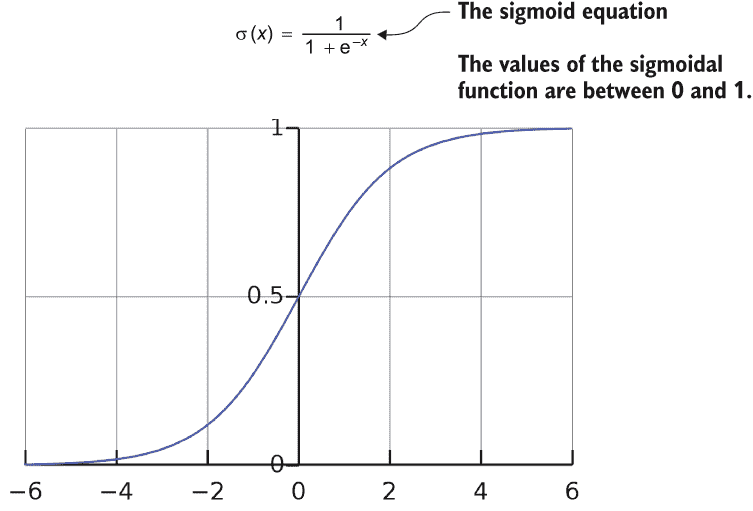

图 2.2 sigmoid 激活函数对不同输入的可视化

*x*是一个大小为 1 × 4 的矩阵（即一行四列），*W*[1]是一个大小为 4 × 3 的矩阵（即四行三列），*b*[1]是 1 × 4 的矩阵（即一行四列）。这给出了一个大小为 1 × 3 的*h*。最后，输出计算为

*y* = *softmax*(*h W*[2] + *b*[2])

这里，*W*[2]是一个 3 × 2 的矩阵，*b*[2]是一个 1 × 2 的矩阵。Softmax 激活将最后一层的线性分数（即*h W*[2] + *b*[2]）归一化为实际概率（即沿列求和的值等于 1）。假设输入向量*x*的长度为*K*，softmax 激活产生一个*K*长的向量*y*。*y*的第*i*个元素计算如下：

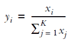

其中*y[i]*是第*i*个输出元素，*x*[i]是第*i*个输入元素。作为一个具体的例子，假设最终层没有 softmax 激活产生，

```py
[16, 4]
```

应用 softmax 归一化将这些值转换为

```py
[16/(16+4), 4/(16+4)] = [0.8, 0.2]
```

让我们看看如何在 TensorFlow 2 中实现这一点。您可以在 Jupyter 笔记本（Ch02-Fundamentals-of-TensorFlow-2/2.1.Tensorflow_Fundamentals.ipynb）中找到代码。如何安装必要的库和设置开发环境在附录 A 中描述。最初，我们需要使用导入语句导入所需的库：

```py
import numpy as np
import tensorflow as tf
```

然后，我们定义网络的输入（*x*）和变量（或参数）（即*w*[1]、*b*[1]、*w*[2]和*b*[2]）：

```py
x = np.random.normal(size=[1,4]).astype('float32')

init = tf.keras.initializers.RandomNormal()

w1 = tf.Variable(init(shape=[4,3])) 
b1 = tf.Variable(init(shape=[1,3])) 

w2 = tf.Variable(init(shape=[3,2])) 
b2 = tf.Variable(init(shape=[1,2])) 
```

在这里，*x*是一个大小为 1×4（即一行四列）的简单 NumPy 数组，其值来自正常分布。然后，我们将网络的参数（即权重和偏差）定义为 TensorFlow 变量。tf.Variable 的行为类似于典型的 Python 变量。在定义时会附加一些值，并且随着时间的推移可能会发生变化。tf.Variable 用于表示神经网络的权重和偏差，在优化或训练过程中会更改这些参数。定义 TensorFlow 变量时，需要为变量提供一个初始化器和一个形状。在这里，我们使用从正态分布随机抽样值的初始化器。请记住，*W*[1]大小为 4×3，*b*[1]大小为 1×3，*W*[2]大小为 3×2，*b*[2]大小为 1×2，每个参数的形状参数都相应地进行了设置。接下来，我们将多层感知器网络的核心计算定义为一个漂亮的模块化函数。这样，我们可以轻松地重用该函数来计算多层的隐藏层输出：

```py
@tf.function
def forward(x, W, b, act):
    return act(tf.matmul(x,W)+b)
```

在这里，act 是您选择的任何非线性激活函数（例如 tf.nn.sigmoid）。（您可以在此处查看各种激活函数：[`www.tensorflow.org/api_docs/python/tf/nn`](https://www.tensorflow.org/api_docs/python/tf/nn)。要注意的是，并非所有函数都是激活函数。表达式 tf.matmul(x,W)+b 优雅地封装了我们之前看到的核心计算（即*x W*[1]+ *b*[1]和 *h W*[2]+*b*[2]）到可重用的表达式中。在这里，tf.matmul 执行矩阵乘法运算。该计算在图 2.3 中说明。

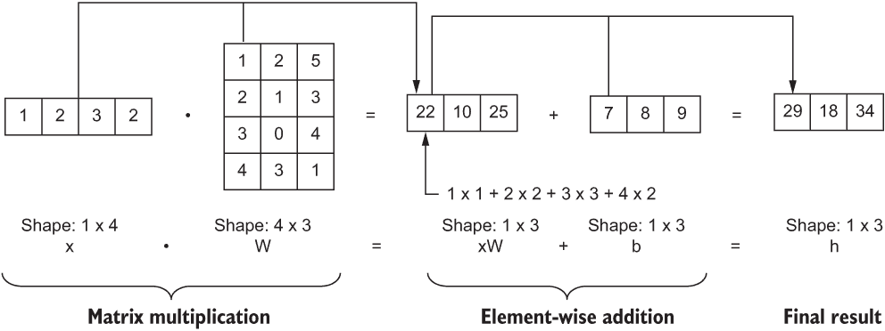

图 2.3 矩阵乘法和偏置加法的示例输入、权重和偏差说明

将@tf.function 放在函数的顶部是 TensorFlow 知道该函数包含 TensorFlow 代码的一种方式。我们将在下一部分更详细地讨论@tf.function 的目的。这将带我们进入代码的最后部分。由于我们已经定义了输入、所有参数和核心计算，因此可以计算网络的最终输出。

```py
# Computing h
h = forward(x, w1, b1, tf.nn.sigmoid)

# Computing y
y = forward(h, w2, b2, tf.nn.softmax)

print(y)
```

输出将会是：

```py
tf.Tensor([[0.4912673 0.5087327]], shape=(1, 2), dtype=float32)
```

这里，h 和 y 是各种 TensorFlow 操作（例如 tf.matmul）的结果张量（类型为 tf.Tensor）。输出中的确切值可能会略有不同（请见下面的列表）。

列表 2.1 使用 TensorFlow 2 的多层感知器网络

```py
import numpy as np                                  ❶
import tensorflow as tf                             ❶

x = np.random.normal(size=[1,4]).astype('float32')  ❷

init = tf.keras.initializers.RandomNormal()         ❸

w1 = tf.Variable(init(shape=[4,3]))                 ❹
b1 = tf.Variable(init(shape=[1,3]))                 ❹

w2 = tf.Variable(init(shape=[3,2]))                 ❹
b2 = tf.Variable(init(shape=[1,2]))                 ❹

@tf.function                                        ❺
def forward(x, W, b, act):                          ❻
    return act(tf.matmul(x,W)+b)                    ❻

h = forward(x, w1, b1, tf.nn.sigmoid)               ❼

y = forward(h, w2, b2, tf.nn.softmax)               ❽

print(y)
```

❶导入 NumPy 和 TensorFlow 库

❷ MLP 的输入（一个 NumPy 数组）

❸ 用于初始化变量的初始化器

❹ 第一层（w1 和 b2）和第二层（w2 和 b2）的参数

❺ 这行告诉 TensorFlow 的 AutoGraph 构建图形。

❻ MLP 层计算，它接受输入、权重、偏置和非线性激活

❼ 计算第一个隐藏层的输出 h

❽ 计算最终输出 y

接下来，我们将看看 TensorFlow 运行代码时背后发生了什么。

### 2.1.1 TensorFlow 在底层是如何运行的？

在典型的 TensorFlow 程序中，有两个主要步骤：

1.  定义一个涵盖输入、操作和输出的数据流图。在我们的练习中，数据流图将表示 x、w1、b1、w2、b2、h 和 y 之间的关系。

1.  通过为输入提供值并计算输出来执行图形。例如，如果我们需要计算 h，则将一个值（例如 NumPy 数组）馈送到 x 并获取 h 的值。

TensorFlow 2 使用一种称为*命令式执行*的执行样式。在命令式执行中，声明（定义图形）和执行同时发生。这也被称为*急切执行*代码。

您可能想知道数据流图是什么样的。这是 TensorFlow 用来描述您定义的计算流程的术语，并表示为*有向无环图*（DAG）：箭头表示数据，节点表示操作。换句话说，tf.Variable 和 tf.Tensor 对象表示图中的边，而操作（例如 tf.matmul）表示节点。例如，对于

*h = x W*[1] + *b*[1]

将看起来像图 2.4。然后，在运行时，您可以通过向 x 提供值来获取 y 的值，因为 y 依赖于输入 x。

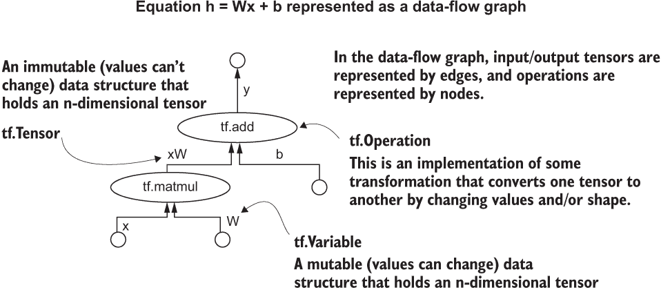

图 2.4 一个示例计算图。这里的各个元素将在 2.2 节中更详细地讨论。

TensorFlow 如何知道创建数据流图？您可能已经注意到以@符号开头的行悬挂在 forward(...) 函数的顶部。这在 Python 语言中称为*装饰器*。@tf.function 装饰器接受执行各种 TensorFlow 操作的函数，跟踪所有步骤，并将其转换为数据流图。这是多么酷？这鼓励用户编写模块化代码，同时实现数据流图的计算优势。TensorFlow 2 中这个功能被称为 AutoGraph（[`www.tensorflow.org/guide/function`](https://www.tensorflow.org/guide/function)）。

什么是装饰器？

装饰器通过包装函数来修改函数的行为，这发生在函数被调用之前/之后。一个很好的装饰器示例是在每次调用函数时记录输入和输出。下面是如何使用装饰器的示例：

```py
def log_io(func):
    def wrapper(*args, **kwargs):
        print("args: ", args)
        print(“kwargs: “, kwargs)
        out = func(*args, **kwargs)
        print("return: ", out)
    return wrapper

@log_io
def easy_math(x, y):
    return x + y + ( x * y)

res = easy_math(2,3)
```

这将输出

```py
args:  (2, 3)
kwargs:  {}
return:  11
```

预期的。因此，当您添加 @tf.function 装饰器时，它实际上修改了调用函数的行为，通过构建给定函数内发生的计算的计算图。

图 2.5 中的图解描述了 TensorFlow 2 程序的执行路径。第一次调用函数 a(...) 和 b(...) 时，将创建数据流图。然后，将输入传递给函数，以将输入传递给图并获取您感兴趣的输出。

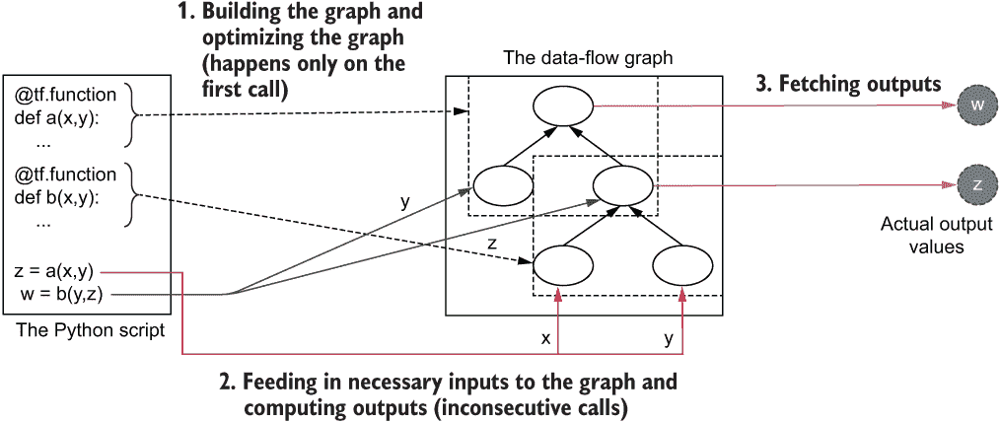

图 2.5 TensorFlow 2 程序的典型执行。在第一次运行时，TensorFlow 会跟踪所有使用 @tf.function 注释的函数，并构建数据流图。在后续运行中，根据函数调用传递相应的值给图，并检索结果。

AutoGraph

AutoGraph 是 TensorFlow 中的一个很棒的功能，通过在幕后努力工作，减轻了开发者的工作量。要真正欣赏这个功能，请阅读更多内容请访问[`www.tensorflow.org/guide/function`](https://www.tensorflow.org/guide/function)。虽然它相当令人惊叹，但 AutoGraph 不是万能药。因此，了解其优点以及限制和注意事项非常重要：

+   如果您的代码包含大量重复操作（例如，多次迭代训练神经网络），AutoGraph 将提供性能提升。

+   如果您运行多个仅运行一次的不同操作，则 AutoGraph 可能会减慢您的速度；因为您仅运行一次操作，构建图仅是一种开销。

+   要注意将什么包含在您向 AutoGraph 公开的函数内。例如

    +   NumPy 数组和 Python 列表将被转换为 tf.constant 对象。

    +   在函数跟踪期间将展开 for 循环，这可能导致大型图最终耗尽内存。

TensorFlow 1，TensorFlow 2 的前身，使用了一种称为*声明式基于图的执行*的执行风格，它包含两个步骤：

1.  明确定义一个数据流图，使用各种符号元素（例如占位符输入、变量和操作），以实现你所需的功能。与 TensorFlow 2 不同，这些在声明时不会保存值。

1.  明确编写代码来运行定义的图，并获取或评估结果。您可以在运行时向先前定义的符号元素提供实际值，并执行图。

这与 TensorFlow 2 非常不同，后者隐藏了数据流图的所有复杂性，通过自动在后台构建它。在 TensorFlow 1 中，您必须显式构建图，然后执行它，导致代码更加复杂且难以阅读。表 2.2 总结了 TensorFlow 1 和 TensorFlow 2 之间的区别。

表 2.2 TensorFlow 1 和 TensorFlow 2 之间的区别

| **TensorFlow 1** | **TensorFlow 2** |
| --- | --- |
| 默认情况下不使用急切执行 | 默认情况下使用急切执行 |
| 使用符号占位符表示图形的输入 | 直接将实际数据（例如，NumPy 数组）提供给数据流图 |
| 由于结果不是按命令式评估，因此难以调试 | 由于操作是按命令式评估的，因此易于调试 |
| 需要显式手动创建数据流图 | 具有 AutoGraph 功能，可以跟踪 TensorFlow 操作并自动创建图形 |
| 不鼓励面向对象编程，因为它强制您提前定义计算图 | 鼓励面向对象编程 |
| 由于具有单独的图形定义和运行时代码，代码的可读性较差 | 具有更好的代码可读性 |

在下一节中，我们将讨论 TensorFlow 的基本构建模块，为编写 TensorFlow 程序奠定基础。

练习 1

给定以下代码，

```py
# A
import tensorflow as tf
# B
def f1(x, y, z):
    return tf.math.add(tf.matmul(x, y) , z)
#C
w = f1(x, y, z)
```

tf.function 装饰器应该放在哪里？

1.  A

1.  B

1.  C

1.  以上任何一项

## 2.2 TensorFlow 构建模块

我们已经看到了 TensorFlow 1 和 TensorFlow 2 之间的核心差异。在此过程中，您接触到了 TensorFlow API 公开的各种数据结构（例如，tf.Variable）和操作（例如，tf.matmul）。现在让我们看看在哪里以及如何使用这些数据结构和操作。

在 TensorFlow 2 中，我们需要了解三个主要的基本元素：

+   tf.Variable

+   tf.Tensor

+   tf.Operation

你已经看到所有这些被使用了。例如，从前面的 MLP 示例中，我们有这些元素，如表 2.3 所示。了解这些基本组件有助于理解更抽象的组件，例如 Keras 层和模型对象，稍后将进行讨论。

表 2.3 MLP 示例中的 tf.Variable、tf.Tensor 和 tf.Operation 实体

| **元素** | **示例** |
| --- | --- |
| tf.Variable | w1*,* b1*,* w2 和 b2 |
| tf.Tensor | h 和 y |
| tf.Operation | tf.matmul |

牢牢掌握 TensorFlow 的这些基本元素非常重要，原因有几个。主要原因是，从现在开始，您在本书中看到的所有内容都是基于这些元素构建的。例如，如果您使用像 Keras 这样的高级 API 构建模型，它仍然使用 tf.Variable、tf.Tensor 和 tf.Operation 实体来进行计算。因此，了解如何使用这些元素以及您可以实现什么和不能实现什么非常重要。另一个好处是，TensorFlow 返回的错误通常使用这些元素呈现给您。因此，这些知识还将帮助我们理解错误并在开发更复杂的模型时迅速解决它们。

### 2.2.1 理解 tf.Variable

构建典型的机器学习模型时，您有两种类型的数据：

+   模型参数随时间变化（可变），因为模型针对所选损失函数进行了优化。

+   模型输出是给定数据和模型参数的静态值（不可变）

tf.Variable 是定义模型参数的理想选择，因为它们被初始化为某个值，并且可以随着时间改变其值。一个 TensorFlow 变量必须具有以下内容：

+   形状（变量的每个维度的大小）

+   初始值（例如，从正态分布中抽样的随机初始化）

+   数据类型（例如 int32、float32）

你可以如下定义一个 TensorFlow 变量

```py
tf.Variable(initial_value=None, trainable=None, dtype=None)
```

其中

+   初始值包含提供给模型的初始值。通常使用 tf.keras.initializers 子模块中提供的变量初始化器提供（完整的初始化器列表可以在 [`mng.bz/M2Nm`](http://mng.bz/M2Nm) 找到）。例如，如果你想使用均匀分布随机初始化一个包含四行三列的二维矩阵的变量，你可以传递 tf.keras.initializers.RandomUniform()([4,3])。你必须为 initial_value 参数提供一个值。

+   trainable 参数接受布尔值（即 True 或 False）作为输入。将 trainable 参数设置为 True 允许通过梯度下降更改模型参数。将 trainable 参数设置为 False 将冻结层，以使值不能使用梯度下降进行更改。

+   dtype 指定变量中包含的数据的数据类型。如果未指定，这将默认为提供给 initial_value 参数的数据类型（通常为 float32）。

让我们看看如何定义 TensorFlow 变量。首先，请确保已导入以下库：

```py
import tensorflow as tf
import numpy as np
```

你可以如下定义一个大小为 4 的一维 TensorFlow 变量，其常量值为 2：

```py
v1 = tf.Variable(tf.constant(2.0, shape=[4]), dtype='float32')
print(v1)

>>> <tf.Variable 'Variable:0' shape=(4,) dtype=float32, numpy=array([2., 2., 2., 2.], dtype=float32)>
```

在这里，tf.constant(2.0, shape=[4]) 生成一个有四个元素且值为 2.0 的向量，然后将其用作 tf.Variable 的初始值。你也可以使用 NumPy 数组定义一个 TensorFlow 变量：

```py
v2 = tf.Variable(np.ones(shape=[4,3]), dtype='float32')
print(v2)

>>> <tf.Variable 'Variable:0' shape=(4, 3) dtype=float32, numpy=
array([[1., 1., 1.],
       [1., 1., 1.],
       [1., 1., 1.],
       [1., 1., 1.]], dtype=float32)>
```

在这里，np.ones(shape=[4,3]) 生成一个形状为 [4,3] 的矩阵，所有元素的值都为 1。下一个代码片段定义了一个具有随机正态初始化的三维（3×4×5） TensorFlow 变量：

```py
v3 = tf.Variable(tf.keras.initializers.RandomNormal()(shape=[3,4,5]), dtype='float32')
print(v3)

>>> <tf.Variable 'Variable:0' shape=(3, 4, 5) dtype=float32, numpy=
array([[[-0.00599647, -0.04389469, -0.03364765, -0.0044175 ,
          0.01199682],
        [ 0.05423453, -0.02812728, -0.00572744, -0.08236874,
         -0.07564012],
        [ 0.0283042 , -0.05198685,  0.04385028,  0.02636188,
          0.02409425],
        [-0.04051876,  0.03284673, -0.00593955,  0.04204708,
         -0.05000611]],

       ...

       [[-0.00781542, -0.03068716,  0.04313354, -0.08717368,
          0.07951441],
        [ 0.00467467,  0.00154883, -0.03209472, -0.00158945,
          0.03176221],
        [ 0.0317267 ,  0.00167555,  0.02544901, -0.06183815,
          0.01649506],
        [ 0.06924769,  0.02057942,  0.01060928, -0.00929202,
          0.04461157]]], dtype=float32)>
```

在这里，你可以看到如果我们打印一个 tf.Variable，可以看到它的属性，如下所示：

+   变量的名称

+   变量的形状

+   变量的数据类型

+   变量的初始值

你还可以使用一行代码将你的 tf.Variable 转换为 NumPy 数组

```py
arr = v1.numpy()
```

然后，你可以通过打印 Python 变量 arr 来验证结果

```py
print(arr) 
```

将返回

```py
>>> [2\. 2\. 2\. 2.]
```

tf.Variable 的一个关键特点是，即使在初始化后，你也可以根据需要更改其元素的值。例如，要操作 tf.Variable 的单个元素或片段，你可以使用 assign() 操作如下。

为了本练习的目的，让我们假设以下 TensorFlow 变量，它是一个由零初始化的矩阵，有四行三列：

```py
v = tf.Variable(np.zeros(shape=[4,3]), dtype='float32')
```

你可以如下更改第一行（即索引为 0）和第三列（即索引为 2）中的元素：

```py
v = v[0,2].assign(1)
```

这会产生下列数组：

```py
>>> [[0\. 0\. 1.]
     [0\. 0\. 0.]
     [0\. 0\. 0.]
     [0\. 0\. 0.]]
```

请注意，Python 使用以零为基数的索引。这意味着索引从零开始（而不是从一开始）。例如，如果你要获取向量 vec 的第二个元素，你应该使用 vec[1]。

你也可以使用切片改变数值。例如，下面我们就将最后两行和前两列的数值改为另外一些数：

```py
v = v[2:, :2].assign([[3,3],[3,3]])
```

结果如下：

```py
>>> [[0\. 0\. 1.]
     [0\. 0\. 0.]
     [3\. 3\. 0.]
     [3\. 3\. 0.]]
```

练习 2

请编写代码创建一个 tf.Variable，其数值为下面的数值，并且类型为 int16。你可以使用 np.array() 来完成该任务。

```py
1 2 3
4 3 2
```

### 2.2.2 理解 tf.Tensor

正如我们所见，tf.Tensor 是对某些数据进行 TensorFlow 操作后得到的输出（例如，对 tf.Variable 或者 tf.Tensor 进行操作）。在定义机器学习模型时，tf.Tensor 对象广泛应用于存储输入、层的中间输出、以及模型的最终输出。到目前为止，我们主要看了向量（一维）和矩阵（二维）。但是，我们也可以创建 n 维数据结构。这样的一个 n 维数据结构被称为一个 *张量*。表 2.4 展示了一些张量的示例。

表 2.4 张量的示例

| **描述** | **示例** |
| --- | --- |
| 一个 2 × 4 的二维张量 |

```py
[
 [1,3,5,7],
 [2,4,6,8]
]
```

|

| 一个大小为 2 × 3 × 2 × 1 的四维张量 |
| --- |

```py
[
  [
    [[1],[2]],
    [[2],[3]],
    [[3],[4]]
  ],
  [
    [[1],[2]],
    [[2],[3]],
    [[3],[4]]
  ]
]
```

|

张量也有轴，张量的每个维度都被认为是一个轴。图 2.6 描述了一个 3D 张量的轴。

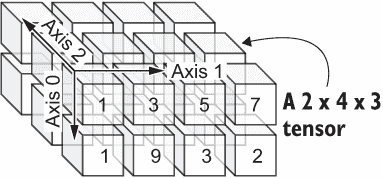

图 2.6 一个 2 × 4 × 3 张量，包含三个轴。第一个轴（axis 0）是行维度，第二个轴（axis 1）是列维度，最后一个轴（axis 2）是深度维度。

严格来说，张量也可以只有一个维度（即向量）或者只是一个标量。但是需要区分 *tensor* 和 tf.Tensor。在讨论模型的数学方面时我们会使用 *tensor/vector/scalar*，而我们在提到 TensorFlow 代码所输出的任何数据相关输出时都会使用 tf.Tensor。

下面我们将讨论一些会产生 tf.Tensor 的情况。例如，你可以通过一个 tf.Variable 和一个常数相乘来产生一个 tf.Tensor：

```py
v = tf.Variable(np.ones(shape=[4,3]), dtype='float32')
b = v * 3.0
```

如果你使用 print(type(b).__name__) 分析前面操作生成的对象类型，你会看到下面的输出：

```py
>>> EagerTensor
```

EagerTensor 是从 tf.Tensor 继承而来的一个类。它是一种特殊类型的 tf.Tensor，其值在定义后会立即得到计算。你可以通过执行下列命令验证 EagerTensor 实际上是 tf.Tensor：

```py
assert isinstance(b, tf.Tensor)
```

也可以通过将一个 tf.Tensor 加上另一个 tf.Tensor 来创建一个 tf.Tensor。

```py
a = tf.constant(2, shape=[4], dtype='float32')
b = tf.constant(3, shape=[4], dtype='float32')
c = tf.add(a,b)
```

print(c) 将打印出下列结果：

```py
>>> [5\. 5\. 5\. 5]
```

在这个例子中，tf.constant() 用于创建 tf.Tensor 对象 a 和 b。通过将 a 和 b 加在一起，你将得到一个类型为 tf.Tensor 的张量 c。如之前所述，可以通过运行如下代码验证该张量：

```py
assert isinstance(c, tf.Tensor)
```

tf.Variable 和 tf.Tensor 之间的关键区别在于，tf.Variable 允许其值在变量初始化后发生更改（称为可变结构）。然而，一旦您初始化了一个 tf.Tensor，在执行的生命周期中您就无法更改它（称为*不可变数据结构*）。tf.Variable 是一种可变数据结构，而 tf.Tensor 是一种不可变数据结构。

让我们看看如果尝试在初始化后更改 tf.Tensor 的值会发生什么：

```py
a = tf.constant(2, shape=[4], dtype='float32')
a = a[0].assign(2.0)
```

您将收到以下错误：

```py
---------------------------------------------------------------------------

AttributeError                            Traceback (most recent call last)

<ipython-input-19-6e4e6e519741> in <module>()
      1 a = tf.constant(2, shape=[4], dtype='float32')
----> 2 a = a[0].assign(2.0)

AttributeError: 'tensorflow.python.framework.ops.EagerTensor' object has no attribute 'assign'
```

显然，TensorFlow 对我们尝试修改 tf.Tensor 对象的叛逆行为并不感兴趣。

张量动物园

TensorFlow 有各种不同的张量类型，用于解决各种问题。以下是 TensorFlow 中可用的一些不同的张量类型：

RaggedTensor——一种用于不能有效表示为矩阵的可变序列长度数据集的数据类型

TensorArray——一种动态大小的数据结构，可以从小开始，并随着添加更多数据而伸展（类似于 Python 列表）

SparseTensor——一种用于表示稀疏数据的数据类型（例如，用户-电影评分矩阵）

在下一小节中，我们将讨论一些流行的 TensorFlow 操作。

练习 3

你能写出创建初始化为从正态分布中抽样的值并且形状为 4 × 1 × 5 的 tf.Tensor 的代码吗？您可以使用 np.random.normal()来实现这个目的。

### 2.2.3 理解 tf.Operation

TensorFlow 的骨干是操作，它允许您对数据进行有用的操作。例如，深度网络中的核心操作之一是矩阵乘法，这使得 TensorFlow 成为实现核心操作的强大工具。就像矩阵乘法一样，TensorFlow 提供了许多低级操作，可用于 TensorFlow。可以在[TensorFlow API](http://mng.bz/aDWY)中找到可用操作的完整列表。

让我们讨论一些您可以使用的流行算术操作。首先，您有基本的算术操作，如加法、减法、乘法和除法。您可以像对待普通 Python 变量一样执行这些操作。为了演示这一点，让我们假设以下向量：

```py
import tensorflow as tf
import numpy as np

a = tf.constant(4, shape=[4], dtype='float32')
b = tf.constant(2, shape=[4], dtype='float32')
```

我们可以通过执行以下操作来查看 a 和 b 的样子

```py
print(a)
print(b)
```

这给出

```py
>>> tf.Tensor([4\. 4\. 4\. 4.], shape=(4,), dtype=float32)
>>> tf.Tensor([2\. 2\. 2\. 2.], shape=(4,), dtype=float32)
```

对 a 和 b 执行加法

```py
c = a+b
print(c)
```

提供

```py
>>> tf.Tensor([6\. 6\. 6\. 6.], shape=(4,), dtype=float32)
```

对 a 和 b 执行乘法

```py
e = a*b
print(e)
```

提供

```py
>>> tf.Tensor([8\. 8\. 8\. 8.], shape=(4,), dtype=float32)
```

您还可以在张量之间进行逻辑比较。假设

```py
a = tf.constant([[1,2,3],[4,5,6]])
b = tf.constant([[5,4,3],[3,2,1]])
```

并检查逐元素相等性

```py
equal_check = (a==b)
print(equal_check)
```

提供

```py
>>> tf.Tensor(
    [[False False  True]
     [False False False]], shape=(2, 3), dtype=bool) 
```

检查小于或等于元素

```py
leq_check = (a<=b)
print(leq_check)
```

提供

```py
>>> tf.Tensor(
    [[ True  True  True]
     [False False False]], shape=(2, 3), dtype=bool)
```

接下来，您有减少运算符，允许您在特定轴或所有轴上减少张量（例如，最小值/最大值/和/乘积）：

```py
a = tf.constant(np.random.normal(size=[5,4,3]), dtype='float32')
```

这里，a 是一个看起来像这样的 tf.Tensor：

```py
>>> tf.Tensor(
    [[[-0.7665215   0.9611947   1.456347  ]
      [-0.52979267 -0.2647674  -0.57217133]
      [-0.7511135   2.2282166   0.6573406 ]
      [-1.1323775   0.3301812   0.1310132 ]]
     ...
     [[ 0.42760614  0.17308706 -0.90879506]
      [ 0.5347165   2.569637    1.3013649 ]
      [ 0.95198756 -0.74183583 -1.2316796 ]
      [-0.03830088  1.1367576  -1.2704859 ]]], shape=(5, 4, 3), dtype=float32)
```

让我们首先获取此张量的所有元素的总和。换句话说，在所有轴上减少张量：

```py
red_a1 = tf.reduce_sum(a)
```

这产生

```py
>>> -4.504758
```

接下来，让我们在轴 0 上获取产品（即，对 a 的每一行进行逐元素乘积）：

```py
red_a2 = tf.reduce_prod(a, axis=0)
```

这产生

```py
>>> [[-0.04612858  0.45068324  0.02033644]
     [-0.27674386 -0.03757533 -0.33719817]
     [-1.4913832  -2.1016302  -0.39335614]
     [-0.00213956  0.14960718  0.01671476]]
```

现在我们将在多个轴（即 0 和 1）上获取最小值：

```py
red_a3 = tf.reduce_min(a, axis=[0,1])
```

这产生

```py
>>> [-1.6531237 -1.6245098 -1.4723392]
```

你可以看到，无论何时在某个维度上执行缩减操作，你都会失去该维度。例如，如果你有一个大小为[6,4,2]的张量，并且在轴 1 上缩减该张量（即第二个轴），你将得到一个大小为[6,2]的张量。在某些情况下，你需要在缩减张量的同时保留该维度（导致一个[6,1,2]形状的张量）。一个这样的情况是使你的张量广播兼容另一个张量（[`mng.bz/g4Zn`](http://mng.bz/g4Zn)）。*广播*是一个术语，用来描述科学计算工具（例如 NumPy/TensorFlow）在算术操作期间如何处理张量。在这种情况下，你可以将 keepdims 参数设置为 True（默认为 False）。你可以看到最终输出的形状的差异

```py
# Reducing with keepdims=False
red_a1 = tf.reduce_min(a, axis=1)
print(red_a1.shape)
```

这产生

```py
>>> [5,3]

# Reducing with keepdims=True
red_a2 = tf.reduce_min(a, axis=1, keepdims=True)
print(red_a2.shape)
```

这产生

```py
>>> red_a2.shape = [5,1,3]
```

表 2.5 中概述了其他几个重要的函数。

表 2.5 TensorFlow 提供的数学函数

| tf.argmax | 描述 | 计算给定轴上最大值的索引。例如，以下示例显示了如何在轴 0 上计算 tf.argmax。 |
| --- | --- | --- |
| 用法 | d = tf.constant([[1,2,3],[3,4,5],[6,5,4]])d_max1 = tf.argmax(d, axis=0) |
| 结果 | tf.Tensor ([2,2,0]) |
| tf.argmin | 描述 | 计算给定轴上最小值的索引。例如，以下示例显示了如何在轴 1 上计算 tf.argmin。 |
| 用法 | d = tf.constant([[1,2,3],[3,4,5],[6,5,4]])d_min1 = tf.argmin(d, axis=1) |
| 结果 | tf.Tensor([[0],[0],[0]]) |
| tf.cumsum | 描述 | 计算给定轴上向量或张量的累积和 |
| 用法 | e = tf.constant([1,2,3,4,5])e_cumsum = tf.cumsum(e) |
| 结果 | tf.Tensor([1,3,6,10,15]) |

我们在这里结束了对 TensorFlow 基本原语的讨论。接下来我们将讨论在神经网络模型中常用的一些计算。

练习 4

还有另一个计算平均值的函数叫做 tf.reduce_mean()。给定包含以下值的 tf.Tensor 对象 a，你能计算每列的平均值吗？

```py
0.5 0.2 0.7
0.2 0.3 0.4
0.9 0.1 0.1
```

## 2.3 TensorFlow 中与神经网络相关的计算

这里我们将讨论一些支撑深度神经网络的关键低级操作。假设你在学校学习计算机视觉课程。对于你的作业，你必须使用各种数学运算来操作图像，以实现各种效果。我们将使用一张著名的狒狒图像（图 2.7），这是计算机视觉问题的常见选择。


图 2.7 狒狒的图像

### 2.3.1 矩阵乘法

你的第一个任务是将图像从 RGB 转换为灰度。为此，你必须使用矩阵乘法。让我们首先了解什么是矩阵乘法。

Lena 的故事

尽管我们在练习中使用了狒狒的图像，但长期以来，一直有一个传统，即使用 Lena（一位瑞典模特）的照片来演示各种计算机视觉算法。关于这是如何成为计算机视觉问题的规范的背后有一个非常有趣的故事，您可以在[`mng.bz/enrZ`](http://mng.bz/enrZ)上阅读。

使用 tf.matmul()函数在两个张量之间执行矩阵乘法。对于两个矩阵，tf.matmul()执行矩阵乘法（例如，如果您有大小为[4,3]和大小为[3,2]的矩阵，矩阵乘法将得到一个[4,2]张量）。图 2.8 说明了矩阵乘法操作。

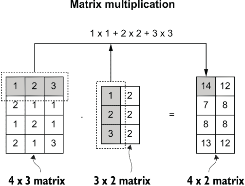

图 2.8 在一个 4×3 矩阵和一个 3×2 矩阵之间进行矩阵乘法，得到一个 4×2 矩阵。

更一般地说，如果您有一个 n×m 矩阵（a）和一个 m×p 矩阵（b），则矩阵乘法 c 的结果如下：

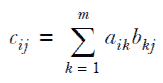

但是，如果您有高维张量 a 和 b，则将在 a 的最后一个轴上和 b 的倒数第二个轴上执行总乘积。a 和 b 张量的维度除了最后两个轴外都需要相同。例如，如果您有一个大小为[3,5,7]的张量 a 和大小为[3,7,8]的张量 b，则结果将是一个大小为[3,5,8]的张量。

回到我们的问题，给定三个 RGB 像素，您可以使用以下方法将其转换为灰度像素。

0.3 * R + 0.59 * G + 0.11 * B

这是将任何 RGB 图像转换为灰度图像的常见操作（[`mng.bz/p2M0`](http://mng.bz/p2M0)），这取决于手头的问题是否重要。例如，要从图像中识别数字，颜色并不那么重要。通过将图像转换为灰度，您实质上通过减少输入的大小（一个通道而不是三个）并去除噪声特征（即，颜色信息），从而帮助模型。

给定一个 512×512×3 的图像，如果您将其与代表所提供权重的 3×1 数组相乘，您将得到大小为 512×512×1 的灰度图像。然后，我们需要删除灰度图像的最后一个维度（因为它是一个），最终得到大小为 512×512 的矩阵。对此，您可以使用 tf.squeeze()函数，该函数删除大小为一的任何维度（请参阅下一个列表）。

列表 2.2 使用矩阵乘法将 RGB 图像转换为灰度图像

```py
from PIL import Image                                          ❶
import tensorflow as tf
import numpy as np

x_rgb = np.array(Image.open("baboon.jpg")).astype('float32')   ❷
x_rgb = tf.constant(x_rgb)                                     ❸

grays = tf.constant([[0.3], [0.59] ,[0.11]])                   ❹

x = tf.matmul(x_rgb, grays)                                    ❺
x = tf.squeeze(x)                                              ❻
```

❶ PIL 是用于基本图像处理的 Python 库。

❷ 大小为 512×512×3 的 RGB 图像被加载为 NumPy 数组。

❸ 将 NumPy 数组转换为 tf.Tensor。

❹ 作为一个 3×1 数组的 RGB 权重

❺ 执行矩阵乘法以获得黑白图像

❻ 去掉最后一个维度，即 1

矩阵乘法在全连接网络中也是一项重要操作。为了从输入层到隐藏层，我们需要使用矩阵乘法和加法。暂时忽略非线性激活，因为它只是一个逐元素的转换。图 2.9 可视化了您之前构建的 MLP 的隐藏层计算。

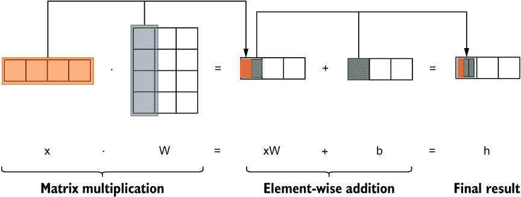

图 2.9 计算发生在隐藏层的插图。x 是输入（1×4），W 是权重矩阵（4×3），b 是偏差（1×3），最终，h 是输出（1×3）。

### 2.3.2 卷积操作

接下来的任务是实现边缘检测算法。知道可以使用卷积操作检测边缘后，您还想使用 TensorFlow 展示自己的技能。好消息是，您可以做到！

卷积操作在卷积神经网络中非常重要，卷积神经网络是用于图像相关的机器学习任务（例如图像分类、物体检测）的深度网络。卷积操作将 *窗口*（也称为*filter*或*kernel*）移动到数据上，同时在每个位置产生单个值。卷积窗口在每个位置都有一些值。对于给定位置，卷积窗口中的值是元素乘积并与数据中与该窗口重叠的部分相加，以产生该位置的最终值。卷积操作如图 2.10 所示。

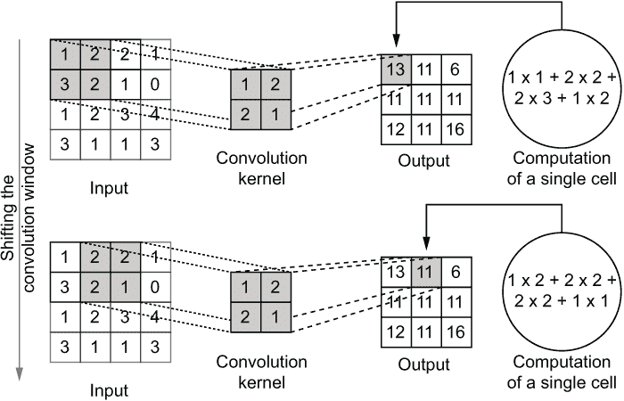

图 2.10 卷积操作的计算步骤

根据您选择的卷积窗口的值，您可以产生一些独特的效果。您可以尝试在[`setosa.io/ev/image-kernels/`](https://setosa.io/ev/image-kernels/)上尝试一些流行的核。边缘检测也是一种流行的计算机视觉技术，可以使用卷积操作来实现。TensorFlow 提供了 tf.nn.convolution()函数来执行卷积。

首先，我们将黑白狒狒图片存储在 tf.Tensor 中，并将其输入变量命名为 x，x 是一个大小为 512×512 的矩阵。现在，让我们从中创建一个名为 y 的新变量：

```py
y = tf.constant(x)
```

接下来，让我们定义我们的边缘检测 filter。我们将使用一种名为 *近似拉普拉斯滤波器* 的边缘检测滤波器，它是一个填有 -1 值的 3 × 3 矩阵，除了最中间的值是 8 外。请注意，内核的总和为零：

```py
filter = tf.Variable(np.array([[-1,-1,-1],[-1,8,-1],[-1,-1,-1]]).astype('float32'))
```

接下来我们需要对 y 和 filter 进行 reshape，因为 tf.nn.convolution() 函数接受具有非常特定形状的输入和 filter。第一个约束是 y 和 filter 应具有相同的 rank。在这里，rank 指数据中的维数个数。我们这里有 rank2 的张量，将进行二维卷积。要执行 2D 卷积，输入和 kernel 都需要是 rank 4。因此我们需要对输入和 kernel 进行几步重塑：

1.  在输入的开始和结尾添加两个更多的维度。开始的维度表示批量维度，最后的维度表示通道维度（例如，图像的 RGB 通道）。虽然在我们的示例中值为 1，但我们仍然需要这些维度存在（例如，一个大小为[512,512]的图像将重塑为[1,512,512,1]）。

1.  在 filter 的末尾添加两个大小为 1 的额外维度。这些新维度表示输入和输出通道。我们有一个单通道（即灰度）输入，我们也希望产生一个单通道（即灰度）的输出（例如，一个大小为[3,3]的核将被重塑为[3,3,1,1]）。

注意 张量的阶数是指该张量的维数。这与矩阵的秩不同。

如果你不完全明白为什么我们添加了这些额外的维度，不要担心。当我们在后面的章节中讨论卷积神经网络中的卷积操作时，这将更有意义。现在，你只需要理解卷积操作的高级行为就可以了。在 TensorFlow 中，你可以按如下方式重塑 y 和 filter：

```py
y_reshaped = tf.reshape(y, [1,512,512,1])
filter_reshaped = tf.reshape(filter, [3,3,1,1])
```

这里，y 是一个 512×512 的张量。表达式 tf.reshape(y, [1,512,512,1])将 y（即一个 2D 张量）重塑为一个 4D 张量，大小为 1×512×512×1。同样，filter（即一个大小为 3×3 的 2D 张量）被重塑为一个 4D 张量，大小为 3×3×1×1。请注意，在重塑过程中元素的总数保持不变。现在你可以计算卷积输出如下：

```py
y_conv = tf.nn.convolution(y_reshaped, filter_reshaped)
```

你可以将边缘检测的结果可视化并将其与原始图像进行比较，如图 2.11 所示。

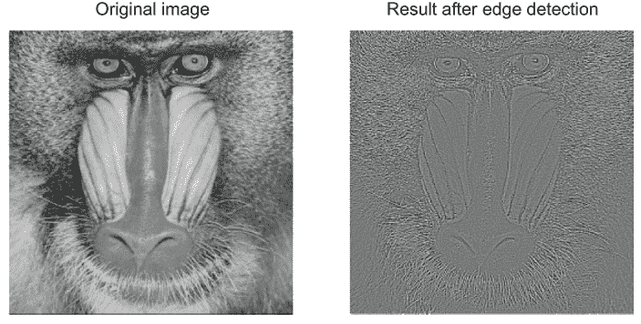

图 2.11 原始黑白图像与边缘检测结果的比较

在下一节中，我们将讨论另一种操作，即 pooling 操作。

### 2.3.3 Pooling 操作

我们接下来的任务是将经过边缘检测后的图像的宽度和高度减半。例如，如果我们有一个 512×512 的图像，并且需要将其调整为 256×256，*pooling 操作*是实现这一目标的最佳方式。出于这个原因，*pooling（或子采样）操作*在卷积神经网络中常被用于减小输出的尺寸，以便可以使用更少的参数从数据中学习。

为什么它被称为 pooling 操作？

子采样操作之所以也被称为“pooling”可能是因为这个词的含义以及统计学的原因。*pooling*一词用于描述将事物合并为一个单一实体，这也正是此操作所做的（例如通过平均值或取最大值）。在统计学中，你会发现术语*pooled variance*，它是两个群体之间方差的加权平均值（[`mng.bz/OGdO`](http://mng.bz/OGdO)），本质上将两个方差合并为一个方差。

在 TensorFlow 中，您可以调用 tf.nn.max_pool()函数进行最大池化，调用 tf.nn.avg_pool()函数进行平均池化：

```py
z_avg = tf.nn.avg_pool(y_conv, (1,2,2,1), strides=(1,2,2,1), padding='VALID')
z_max = tf.nn.max_pool(y_conv, (1,2,2,1), strides=(1,2,2,1), padding='VALID')
```

池化操作是卷积神经网络中常见的另一种操作，它的工作原理与卷积操作类似。但与卷积操作不同的是，池化操作的内核中没有值。在给定位置，池化操作取得与数据中内核重叠的部分的平均值或最大值。在给定位置产生平均值的操作称为平均池化，而产生最大值的操作称为最大池化。图 2.12 说明了最大池化操作。

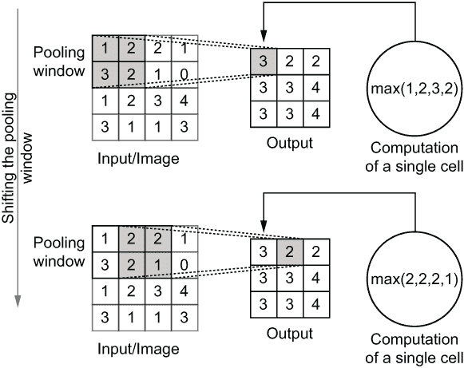

图 2.12：最大池化操作。池化窗口在图像上从一个位置移动到另一个位置，同时一次产生一个值（即与池化窗口重叠的图像中的最大值）。

我们有一个形状为[1,510,510,1]的 4D 张量 y_conv。你可能会注意到，这些维度略小于原始图像的大小（即 512）。这是因为，在对具有 h 高度和 w 宽度的图像进行没有额外填充的大小为 c×c 的窗口卷积时，得到的图像的维度为 h-c+1 和 w-c+1。我们可以进行如下所示的池化操作。您可以使用以下函数进行平均池化或最大池化：

```py
z_avg = tf.nn.avg_pool(y_conv, (1,2,2,1), strides=(1,2,2,1), padding='VALID')
z_max = tf.nn.max_pool(y_conv, (1,2,2,1), strides=(1,2,2,1), padding='VALID')
```

这将得到两个图像，z_avg 和 z_max；它们的形状都是[1,255,255,1]。为了仅保留高度和宽度维度并移除大小为 1 的冗余维度，我们使用 tf.squeeze()函数：

```py
z_avg = np.squeeze(z_avg.numpy())
z_max = np.squeeze(z_max.numpy())
```

您可以使用 Python 的绘图库 matplotlib 绘制 z_avg 和 z_max 并获得图 2.13 中所示的结果。代码已在笔记本中提供。

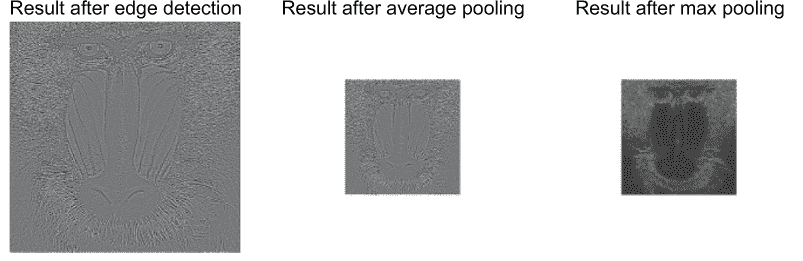

图 2.13：边缘检测后的结果与平均或最大池化后的结果

图 2.13 显示了不同类型池化的效果。仔细观察，您会看到平均池化结果更加一致和连续，而最大池化结果则更加嘈杂。

请注意，与卷积操作不同，我们没有提供滤波器（或内核），因为池化操作没有滤波器。但是我们需要传递窗口的维度。这些维度表示输入的相应维度（即它是一个[batch 维度、高度、宽度、通道]的窗口）。除此之外，我们还传递了两个参数：stride 和 padding。我们将在后面的章节中详细讨论这些参数。

练习 5

给定一个大小为 256×256 的灰度图像 img 和一个大小为 5×5 的卷积滤波器 f。你能编写 tf.reshape()函数调用和 tf.nn.convolution()操作吗？输出的大小会是多少？

很好！现在你已经了解了深度学习网络中最常用的操作。我们将在此结束关于 TensorFlow 基础知识的讨论。在下一章中，我们将讨论 TensorFlow 中提供的一个高级 API，称为 Keras，它对于模型构建特别有用。

## 摘要

+   TensorFlow 是一个端到端的机器学习框架。

+   TensorFlow 提供了一个生态系统，便于模型原型设计、模型构建、模型监控和模型提供。

+   TensorFlow 1 使用声明式图执行风格（先定义，然后运行），而 TensorFlow 2 使用命令式图执行风格（运行时定义）。

+   TensorFlow 提供了三个主要构建模块：tf.Variable（用于随时间变化的值）、tf.Tensor（随时间固定的值）和 tf.Operation（对 tf.Variable 和 tf.Tensor 对象执行的转换）。

+   TensorFlow 提供了几个用于构建神经网络的操作，如 tf.matmul、tf.nn.convolution 和 tf.nn.max_pool。

+   您可以使用 tf.matmul 将 RGB 图像转换为灰度图像。

+   您可以使用 tf.nn.convolution 来检测图像中的边缘。

+   您可以使用 tf.nn.max_pool 来调整图像大小。

## 练习答案

**练习 1：** 2

**练习 2：** tf.Variable(np.array([[1,2,3],[4,3,2]], dtype=”int16”)

**练习 3：** tf.constant(np.random.normal(size=[4,1,5]))

**练习 4：** tf.reduce_mean(a, axis=1)

**练习 5：**

```py
img_reshaped = tf.reshape(img, [1,256,256,1])
f_reshaped = tf.reshape(f, [5,5,1,1])
y = tf.nn.convolution(img_reshaped, f_reshaped)
```

最终输出的形状将是 [1,252,252,1]。卷积操作的结果大小为图像大小 - 卷积窗口大小 + 1。
