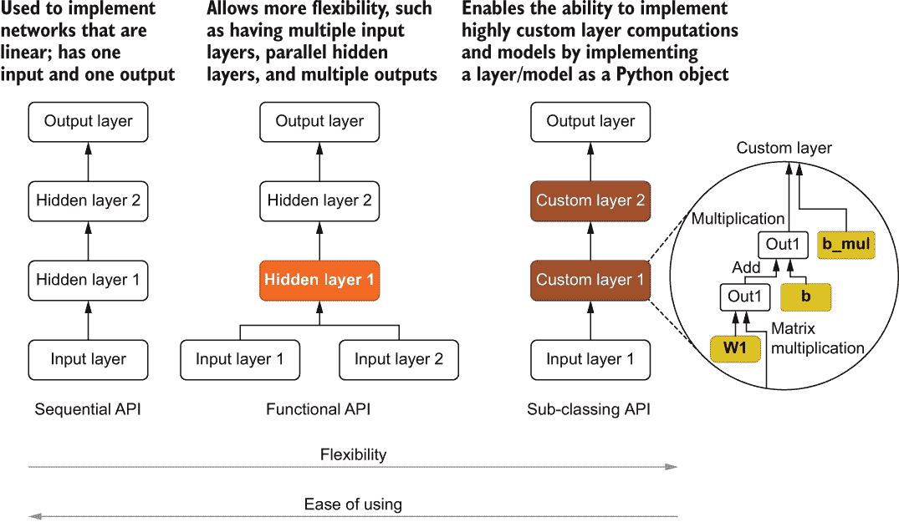
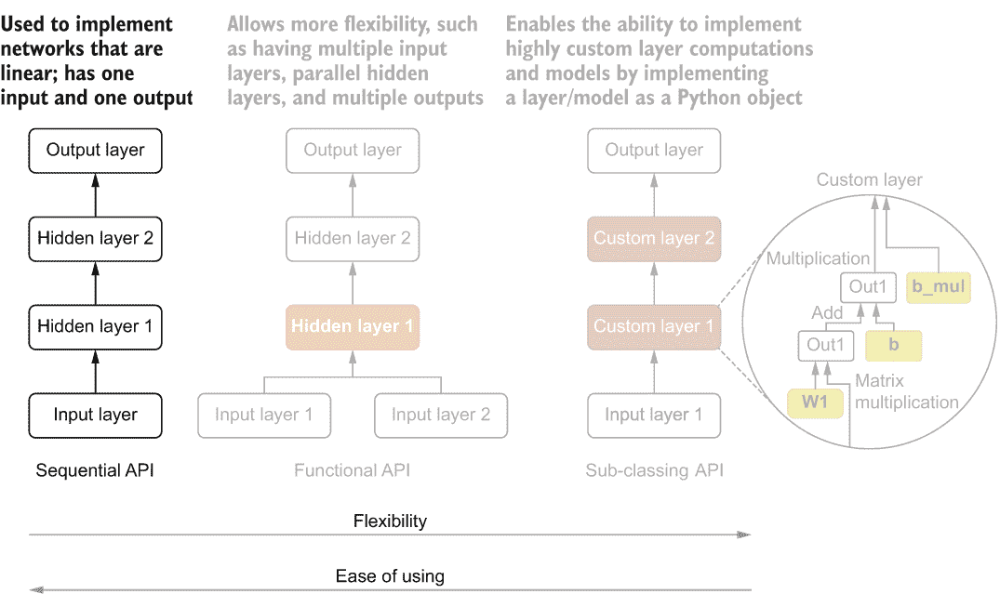
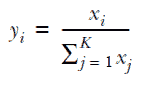
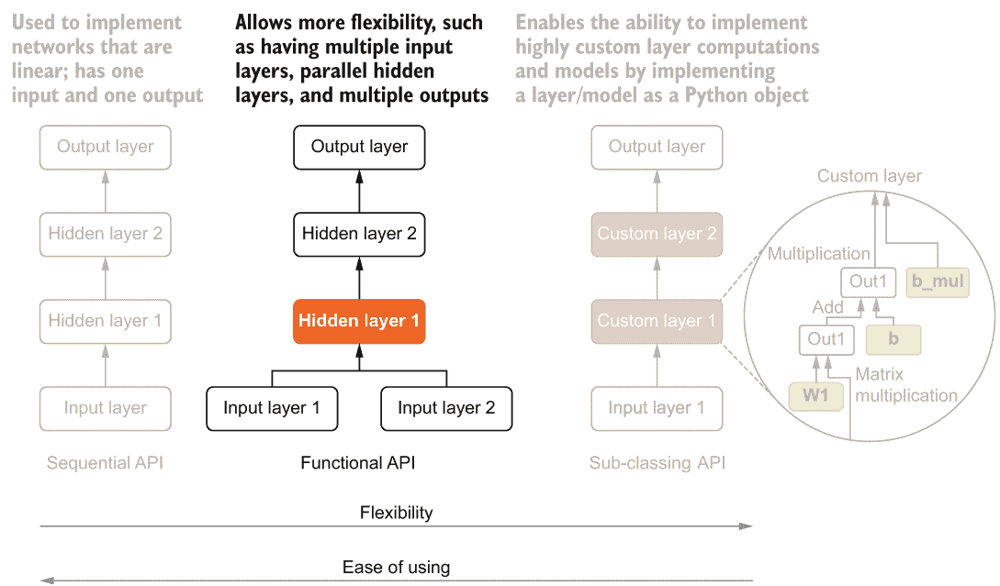
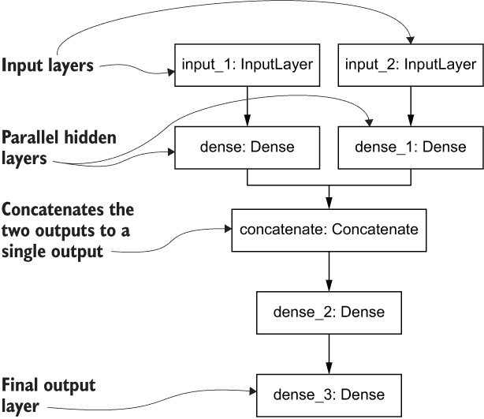
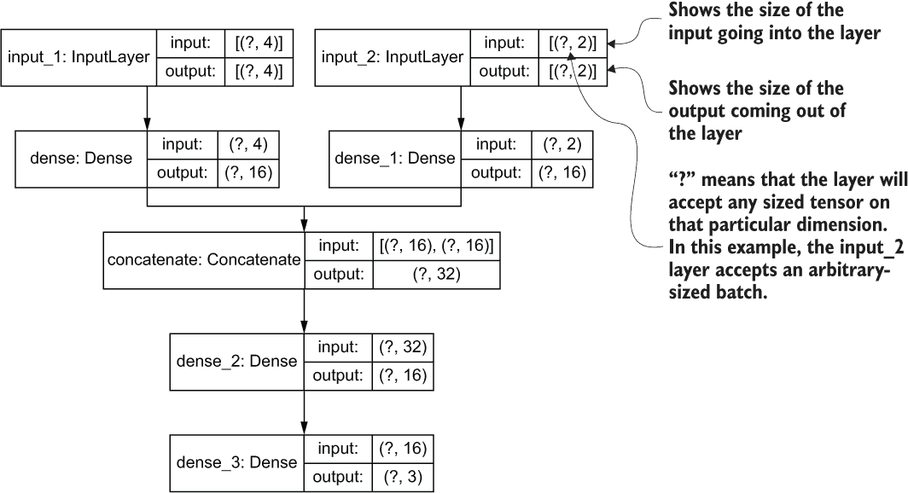
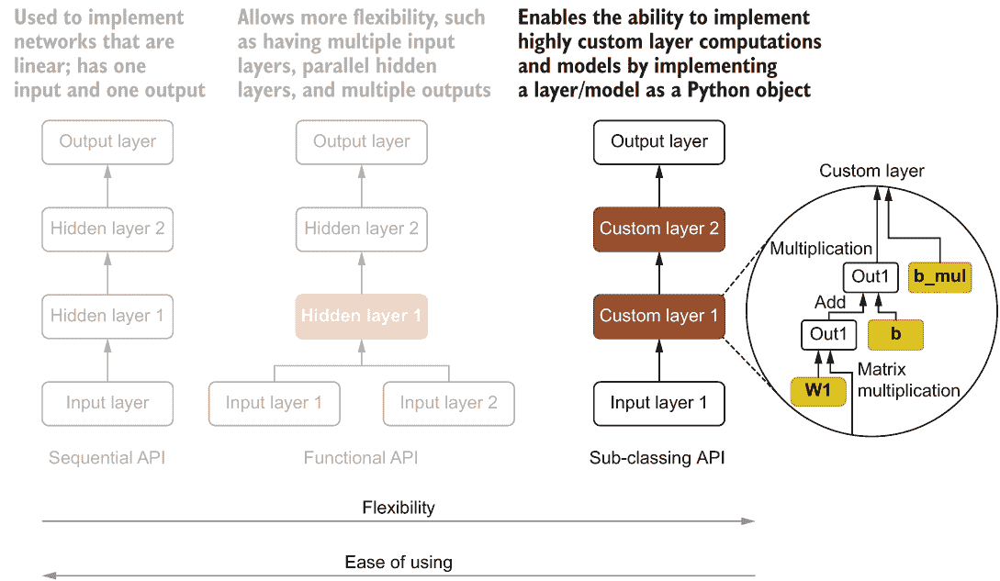
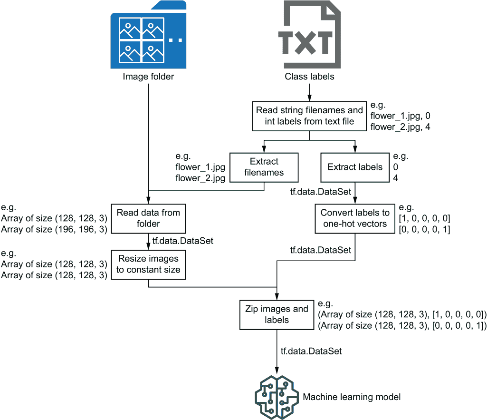

# 第三章：Keras 和 TensorFlow 2 中的数据检索

本章涵盖的内容

+   Keras 中用于构建模型的不同 API

+   检索和操作持久化数据

我们已经探讨了低级 TensorFlow API 的细节，比如定义 tf.Variable 对象和 tf.Tensor 对象，这些对象可以用来存储数字和字符串等。我们还查看了 TensorFlow 提供的一些常用功能，如 tf.Operation。最后，我们详细讨论了一些复杂的操作，比如矩阵乘法和卷积。如果你分析任何标准的深度神经网络，你会发现它由矩阵乘法和卷积等标准数学操作构成。

然而，如果你要使用低级别的 TensorFlow API 实现这些网络，你会发现自己在代码中多次复制这些操作，这将耗费宝贵的时间，并使代码难以维护。但好消息是你不需要这样做。TensorFlow 提供了一个名为 Keras 的子模块，它解决了这个问题，这也是本章的重点。Keras 是 TensorFlow 中的一个子库，它隐藏了构建模块，并为开发机器学习模型提供了高级 API。在本章中，我们将看到 Keras 提供了几种不同的 API，可以根据解决方案的复杂性来选择使用。

我们将通过讨论机器学习的另一个重要方面来结束本章：向模型提供数据。通常，我们需要从磁盘（或网络）中检索数据，并在将其提供给模型之前清理和处理数据。我们将讨论 TensorFlow 中几种不同的数据检索工具，如 tf.data 和 tensorflow-datasets API，以及它们如何简化读取和操作最终输入模型的数据。

## 3.1 Keras 模型构建 API

作为黑客马拉松的一部分，您正在开发一个花卉物种分类器。您的团队将创建几个不同的多层感知器变体，以便将它们的性能与花卉物种识别数据集进行比较。目标是训练能够在给定花卉的多个测量值的情况下输出花卉物种的模型。您需要开发的模型如下：

+   *模型 A*——仅从提供的特征中学习的模型（基线）

+   *模型 B*——除了使用特征本身外，还使用特征的主成分（详见 3.1.3 节）

+   *模型 C*——一个使用非常规隐藏层计算的模型，它使用了一个乘法偏差，除了传统的加法偏差之外，这在神经网络中通常是找不到的（详见 3.1.4 节）

您计划使用 Keras，并且知道它提供了多个模型构建 API。为了快速提供结果，您需要知道在哪个模型中使用哪个 Keras API。

Keras ([`keras.io/`](https://keras.io/)) 最初是作为一个高级 API 启动的，可以使用多个低级后端（例如，TensorFlow、Theano），并允许开发人员轻松构建机器学习模型。换句话说，Keras 隐藏了低级操作的细节，并提供了一个直观的 API，您可以用几行代码构建模型。自从 TensorFlow 1.4 以来，Keras 已经集成到了 TensorFlow 中（[`www.tensorflow.org/guide/keras/overview`](https://www.tensorflow.org/guide/keras/overview)）。您可以使用`import tensorflow.keras`导入 Keras。Keras 有三个主要的 API：

+   顺序式

+   函数式

+   子类化

顺序式 API 是最容易使用的。然而，它是一个非常受限制的 API，只允许您创建一个以一个输入开始，经过一系列层，以及以一个输出结束的网络。接下来，函数式 API 需要更多的工作才能使用。但它也提供了更多的灵活性，例如具有多个输入、并行层和多个输出。最后，子类化 API 可以被认为是最难驾驭的。其思想是创建一个代表您的模型或模型中的一层的 Python 对象，同时使用 TensorFlow 提供的低级功能来实现所需的功能。让我们简要地介绍一下如何使用这些 API。但我们不会止步于此；在接下来的章节中，我们将更详细地了解这些 API。图 3.1 突出显示了 API 之间的主要区别。



图 3.1 顺序式、函数式和子类化 API 的比较。

在这里，对于模型 A，我们将使用顺序式 API，因为它是最简单的。要实现模型 B，其中将有两个输入层，我们将使用函数式 API。最后，要实现模型 C，其中我们需要实现一个自定义层，我们将使用子类化 API。

### 3.1.1 引入数据集

假设您决定使用一个名为鸢尾花数据集（[`archive.ics.uci.edu/ml/datasets/Iris`](https://archive.ics.uci.edu/ml/datasets/Iris)）的流行机器学习数据集。这个数据集记录了几种不同种类的鸢尾花（Iris-setosa、Iris-versicolor 和 Iris-virginica）的萼片长度、萼片宽度、花瓣长度和花瓣宽度。对于每朵花，我们都有萼片长度/宽度和花瓣长度/宽度。正如您所看到的，每个输入都有四个特征，每个输入都可以属于三个类别之一。首先，让我们下载数据，对其进行快速分析，并将其格式化为我们可以方便地用于模型训练的格式。

首先，您需要确保环境设置正确，并且已安装所需的库，如附录 A 中所述。接下来，打开位于 Ch03-Keras-and-Data-Retrieval/3.1.Keras_APIs.ipynb 的 Jupyter 笔记本。现在，如笔记本中的代码所示，我们需要导入 requests 库来下载数据，导入 pandas 来操作该数据，当然，还有 TensorFlow：

```py
import requests
import pandas as pd
import tensorflow as tf
```

现在我们将下载数据并将数据保存到文件中：

```py
url = "https:/ /archive.ics.uci.edu/ml/machine-learning-databases/iris/iris.data"
r = requests.get(url)

# Writing data to a file
with open('iris.data', 'wb') as f:
  f.write(r.content)
```

然后，我们使用 pandas 库的 read_csv() 函数读取数据 ([`mng.bz/j2Op`](https://pandas.pydata.org/pandas-docs/stable/reference/api/pandas.read_csv.xhtml))：

```py
iris_df = pd.read_csv('iris.data', header=None)
```

这里，iris_df 是一个 pandas DataFrame ([`mng.bz/Wxaw`](https://pandas.pydata.org/pandas-docs/stable/reference/api/pandas.DataFrame.xhtml))。在最简单的形式下，数据帧可以被认为是一个按行和列组织的信息矩阵。您可以使用 iris_df.head() 命令检查数据的前几行，其结果如下：

```py
0     1       2       3       4
0     5.1     3.5     1.4     0.2     Iris-setosa
1     4.9     3.0     1.4     0.2     Iris-setosa
2     4.7     3.2     1.3     0.2     Iris-setosa
```

然后，我们将对数据进行一些装饰性修改，使其看起来更好。我们将提供适当的列名称（可从数据集的网页中获取）

```py
iris_df.columns = ['sepal_length', 'sepal_width', 'petal_width', 'petal_length', 'label']
```

并将字符串标签映射为整数：

```py
iris_df["label"] = iris_df["label"].map({'Iris-setosa':0, 'Iris-versicolor':1, 'Iris-virginica':2})
```

我们得到了以下改进后的 pandas DataFrame：

```py
      sepal_length   sepal_width   petal_width   petal_length   label
0     5.1             3.5           1.4           0.2            0
1     4.9             3.0           1.4           0.2            0
2     4.7             3.2           1.3           0.2            0
```

作为最后一步，我们将通过从每列中减去均值来将数据居中，因为这通常会导致更好的性能：

```py
iris_df = iris_df.sample(frac=1.0, random_state=4321)
x = iris_df[["sepal_length", "sepal_width", "petal_width", "petal_length"]]
x = x - x.mean(axis=0)
y = tf.one_hot(iris_df["label"], depth=3)
```

在这里，print(x) 将输出

```py
        sepal_length  sepal_width  petal_width  petal_length
31      -0.443333        0.346    -2.258667     -0.798667
23      -0.743333        0.246    -2.058667     -0.698667
70       0.056667        0.146     1.041333      0.601333
100      0.456667        0.246     2.241333      1.301333
44      -0.743333        0.746    -1.858667     -0.798667
..            ...          ...          ...           ...
```

注意 在对数据进行洗牌后，索引不再按顺序排列。print(y) 将输出

```py
tf.Tensor(
    [[1\. 0\. 0.]
     [1\. 0\. 0.]
     [0\. 1\. 0.]
     ...
     [0\. 0\. 1.]
     [0\. 0\. 1.]
     [0\. 1\. 0.]], 
shape=(150, 3), dtype=float32)
```

对数据进行洗牌是一个重要的步骤：数据是按特定顺序排列的，每个类别都紧跟在另一个后面。但是当数据被洗牌时，每个被呈现给网络的批次都有所有类别的良好混合，这样可以获得最佳结果。您还可以看到我们对 y（或标签）使用了一种称为 *独热编码* 的转换。独热编码将每个标签转换为唯一的零向量，其中一个元素为一。例如，标签 0、1 和 2 被转换为以下独热编码向量：

0 → [1, 0, 0]

1 → [0, 1, 0]

2 → [0, 0, 1]

### 3.1.2 顺序 API

数据准备就绪后，是时候实现模型 A 了，这是第一个神经网络。第一个模型非常简单，只需要提供的特征并预测花的种类。您可以使用 Keras 顺序 API，因为它是最简单的，我们所需要做的就是将几个层顺序堆叠在一起。图 3.2 描述了顺序 API 与其他 API 的比较。



图 3.2 顺序 API 与其他 API 的比较（被标记为灰色）

让我们创建一个具有以下特点的网络：

+   一个具有 4 个节点的输入层

+   一个具有 32 个节点的隐藏层

+   一个具有 16 个节点的隐藏层

+   一个 3 节点输出层

注意 每层节点数是模型的超参数。在这种情况下，我们任意选择了这些值。但为了获得最佳结果，我们应该使用一个超参数优化算法 ([`mng.bz/8MJB`](http://mng.bz/8MJB)) 来找到给定问题的最佳超参数。

在定义模型之前，我们需要导入 TensorFlow 中的某些层和顺序模型。然后，您可以使用一行代码即可实现该模型（见下一个清单）。

利用 Sequential API 实现的模型 A，如 3.1 清单所示。

```py
from tensorflow.keras.layers import Dense            ❶
from tensorflow.keras.models import Sequential       ❶
import tensorflow.keras.backend as K                 ❶

K.clear_session()                                    ❷
model = Sequential([                                 ❸
    Dense(32, activation='relu', input_shape=(4,)),  ❸
    Dense(16, activation='relu'),                    ❸
    Dense(3, activation='softmax')                   ❸
])
```

❶导入必要的模块和类。

❷在创建模型之前清除 TensorFlow 计算图。

❸使用 Sequential API 定义模型。

让我们分析一下我们刚刚做的。您可以使用 Sequential 对象创建一个顺序模型，然后传递一个层的序列，例如 Dense 层。一个层封装了神经网络中可以找到的典型的可重复使用的计算（例如隐藏层计算，卷积操作）。

Dense 层提供了全连接网络中所发生的核心计算（即通过 *h* *=* *activation*(*xW* *+* *b*)从输入（x）到隐藏输出（h））。Dense 层有两个重要参数：隐藏单元的数量和非线性激活函数。通过堆叠一组 Dense 层，您可以构建一个多层的全连接网络。我们正在使用以下层构建网络：

+   Dense(32, activation='relu', input_shape=(4,))

+   Dense(16, activation='relu')

+   Dense(3, activation='softmax')

在第一个 Dense 层中，可以看到传递了一个额外的参数 input_shape。input_shape 是使用 TensorFlow 创建的任何模型的关键属性。您必须确切地知道要传递给模型的输入的形状，因为随后的所有层的输出都取决于输入的形状。实际上，某些层只能处理某些特定的输入形状。

在这个例子中，我们说输入的形状将是[None, 4]。虽然我们只在形状中指定了 4，但 Keras 会自动添加一个未指定的（即 None）维度到 input_shape 中，它表示输入的批次维度。正如您可能已经知道的，深度神经网络以批次的方式处理数据（即一次处理多个示例）。另一个尺寸（大小为 4）是特征维度，意味着网络可以接受具有四个特征的输入。将批次维度设为 None 将批次维度未指定，允许您在模型训练/推断时传递任意数量的示例。

一个层的另一个重要方面是层中使用的非线性激活函数。在这里，我们可以看到前两个层使用了 ReLU（修正线性单元）激活函数。它是前馈模型中非常简单但功能强大的激活函数。ReLU 具有以下功能：

*y* = max (0, *x*)

最后一层使用了 softmax 激活函数。正如之前讨论的，softmax 激活函数将最后一层（即 logits）的得分归一化为一个有效的概率分布。具体来说，



以一个示例为例，假设最后一层没有使用 softmax 激活函数产生了

```py
[15, 30, 5]
```

应用 softmax 归一化将这些值转换为

```py
[15/(15+30+5), 30/(15+30+5), 5/(15+30+5)]
= [0.3, 0.6, 0.1]
```

现在模型已经定义好了，我们需要执行一个关键步骤，称为*模型编译*，如果我们要成功地使用它的话。对于我们的模型，我们将使用

```py
model.compile(loss='categorical_crossentropy', optimizer='adam', metrics=['acc'])
```

在这里，我们设置了模型的损失函数、优化器和度量标准。损失函数表示模型在给定数据上的表现如何（例如，分类交叉熵）。损失越低，模型就越好。除了损失函数之外，我们还使用了一个优化器，它知道如何改变模型的权重和偏差，以使损失减少。在这里，我们选择了损失函数 categorical_crossentropy（[`mng.bz/EWej`](http://mng.bz/EWej)），这通常在多类别分类问题中效果良好，以及优化器 adam（[`arxiv.org/pdf/1412.6980.pdf`](https://arxiv.org/pdf/1412.6980.pdf)），由于其在各种问题中的出色表现，是一个常见的选择。我们还可以选择性地定义度量标准来关注模型（例如，模型准确率）。最后，我们可以使用以下方法检查您刚刚创建的模型

```py
model.summary()
```

输出

```py
Model: "sequential"
_________________________________________________________________
Layer (type)                 Output Shape              Param #   
=================================================================
dense_3 (Dense)              (None, 32)                160       
_________________________________________________________________
dense_4 (Dense)              (None, 16)                528       
_________________________________________________________________
dense_5 (Dense)              (None, 3)                 51        
=================================================================
Total params: 739
Trainable params: 739
Non-trainable params: 0
_________________________________________________________________
```

模型摘要清晰地显示了层数、每个层的类型、每个层的输出形状以及每个层的参数数量。让我们使用之前准备好的数据集来训练这个模型，以对各种鸢尾花进行分类。我们使用方便的 fit()函数来训练一个 Keras 模型：

```py
model.fit(x, y, batch_size=64, epochs=25)
```

fit()函数接受许多不同的参数：

+   X—数据特征

+   Y—数据标签（独热编码）

+   批处理大小（可选）—单个批次中的数据点数量

+   epochs（可选）—模型训练期间重复数据集的次数

像 batch_size 和 epochs 这样的值是经验性地选择的。如果你运行前面的代码，你将得到以下结果：

```py
Train on 150 samples
Epoch 1/25
150/150 [==============================] - 0s 2ms/sample - loss: 1.1773 - acc: 0.2667
Epoch 2/25
150/150 [==============================] - 0s 148us/sample - loss: 1.1388 - acc: 0.2933
...
Epoch 24/25
150/150 [==============================] - 0s 104us/sample - loss: 0.6254 - acc: 0.7400
Epoch 25/25
150/150 [==============================] - 0s 208us/sample - loss: 0.6078 - acc: 0.7400
```

看起来我们的小型项目相当成功，因为我们观察到训练准确率（“acc”）在只有 25 个 epochs 的情况下稳步增长到了 74%。然而，仅仅依靠训练准确率来决定一个模型是否表现更好是不明智的。有各种技术可以做到这一点，我们将在接下来的章节中进行回顾。

机器学习中的可重现性

可重现性是机器学习中的一个重要概念。可重现性意味着你可以运行一个实验，发布结果，并确保对你的研究感兴趣的人可以复现结果。它还意味着你将在多次试验中得到相同的结果。如果你看一下笔记本 ch02/1.Tensorflow_ Fundamentals.ipynb，你会看到我们已经采取的一项措施，以确保结果在多次试验中保持一致。你将在“Library imports and some setups”部分看到以下代码：

```py
def fix_random_seed(seed):
    try:
        np.random.seed(seed)
    except NameError:
        print("Warning: Numpy is not imported. Setting the seed for Numpy failed.")
    try:
        tf.random.set_seed(seed)
    except NameError:
        print("Warning: TensorFlow is not imported. Setting the seed for TensorFlow failed.")
    try:
        random.seed(seed)
    except NameError:
        print("Warning: random module is not imported. Setting the seed for random failed.")

# Fixing the random seed
fix_random_seed(4321)
```

随机种子是影响研究可重复性的一个常见因素，因为神经网络普遍使用随机初始化。通过固定种子，你可以确保每次运行代码时都会得到相同的随机数序列。这意味着在多次试验中，模型的权重和偏置初始化是相同的，前提是其他条件没有改变。

为了确保你的代码能够产生一致的结果，请在尝试代码练习时调用 fix_random_seed 函数（通过运行第一个代码单元格）。

### 3.1.3 函数式 API

现在是时候实现第二个模型（即，模型 B）了，该模型使用主成分作为额外的输入。希望这个额外输入（主成分）能为模型提供额外的特征，从而提高模型的性能。主成分是使用一种称为*主成分分析*（PCA）的算法提取出来的。PCA 是一种降维技术，它会将高维数据投影到一个较低维度的空间中，同时努力保留数据中存在的方差。现在你需要创建一个模型，该模型接受两个不同的输入特征集。

你不能再使用 Sequential API，因为它只能处理顺序模型（即，单输入层通过一系列层产生单输出）。在这里，我们有两个不同的输入：花卉的原始特征和 PCA 特征。这意味着两个层以并行方式工作，产生两个不同的隐藏表示，并将它们连接起来，最后为输入产生类别概率，如图 3.3 所示。函数式 API 对于这种类型的模型是一个很好的选择，因为它可以用于定义具有多个输入或多个输出的模型。



图 3.3 函数式 API 与其他 API 的对比（灰色块为无法使用的功能）

让我们开始吧。首先，我们需要导入以下层和模型对象，因为它们将成为我们模型的核心：

```py
from tensorflow.keras.layers import Input, Dense, Concatenate
from tensorflow.keras.models import Model
```

接下来，我们需要创建两个 Input 层（用于原始输入特征和 PCA 特征）：

```py
inp1 = Input(shape=(4,))
inp2 = Input(shape=(2,))
```

原始输入特征的 Input 层将有四个特征列，而 PCA 特征的 Input 层将只有两个特征列（因为我们只保留了前两个主成分）。如果回顾一下我们如何使用 Sequential API 定义模型，你会注意到我们没有使用 Input 层。但在使用函数式 API 时，我们需要明确指定我们需要包含在模型中的 Input 层。

定义了两个 Input 层后，我们现在可以计算这些层的单独隐藏表示：

```py
out1 = Dense(16, activation='relu')(inp1)
out2 = Dense(16, activation='relu')(inp2)
```

这里，out1 表示 inp1 的隐藏表示（即原始特征），out2 是 inp2 的隐藏表示（即 PCA 特征）。然后我们连接这两个隐藏表示：

```py
out = Concatenate(axis=1)([out1,out2])
```

让我们更详细地了解在使用 Concatenate 层时会发生什么。Concatenate 层只是沿着给定的轴连接两个或多个输入。在此示例中，我们有两个输入传递给 Concatenate 层（即 [None, 16] 和 [None, 16]），并希望沿着第二个轴（即 axis=1）进行连接。请记住，当您指定 shape 参数时，Keras 会向输入/输出张量添加一个额外的批次维度。这个操作的结果是一个大小为 [None, 32] 的张量。从这一点开始，您只有一个序列的层。我们将定义一个具有 relu 激活函数的 16 节点 Dense 层，最后是一个具有 softmax 归一化的三节点输出层：

```py
out = Dense(16, activation='relu')(out)
out = Dense(3, activation='softmax')(out)
```

我们需要做一步额外的工作：创建一个 Model 对象，说明输入和输出是什么。现在，我们有一堆层和没有 Model 对象。最后，我们像之前一样编译模型。我们选择 categorical_crossentropy 作为损失函数，adam 作为优化器，像之前一样。我们还将监控训练准确率：

```py
model = Model(inputs=[inp1, inp2], outputs=out)
model.compile(loss='categorical_crossentropy', optimizer='adam', metrics=['acc'])
```

这个模型的完整代码在以下清单中提供。

列表 3.2 使用 Keras 函数式 API 实现的模型 B

```py
from tensorflow.keras.layers import Input, Dense, Concatenate
from tensorflow.keras.models import Model
import tensorflow.keras.backend as K

K.clear_session()                                                                ❶

inp1 = Input(shape=(4,))                                                         ❷
inp2 = Input(shape=(2,))                                                         ❷

out1 = Dense(16, activation='relu')(inp1)                                        ❸
out2 = Dense(16, activation='relu')(inp2)                                        ❸

out = Concatenate(axis=1)([out1,out2])                                           ❹

out = Dense(16, activation='relu')(out)
out = Dense(3, activation='softmax')(out) 

model = Model(inputs=[inp1, inp2], outputs=out)                                  ❺
model.compile(loss='categorical_crossentropy', optimizer='adam', metrics=['acc'])❻
```

❶ 确保清除 TensorFlow 图

❷ 两个输入层。一个输入层具有四个特征，另一个输入层具有两个特征。

❸ 两个并行隐藏层

❹ 负责将两个并行输出 out1 和 out2 进行拼接的连接层

❺ 模型定义

❻ 使用损失函数、优化器和评估指标编译模型

现在你可以打印模型的摘要了

```py
model.summary()
```

得到的结果为

```py
Model: "model"
_____________________________________________________________________________________
Layer (type)                    Output Shape         Param #     Connected to 
=====================================================================================
input_1 (InputLayer)            [(None, 4)]          0 
_____________________________________________________________________________________
input_2 (InputLayer)            [(None, 2)]          0 
_____________________________________________________________________________________
dense (Dense)                   (None, 16)           80          input_1[0][0]  
_____________________________________________________________________________________
dense_1 (Dense)                 (None, 16)           48          input_2[0][0]  
_____________________________________________________________________________________
concatenate (Concatenate)       (None, 32)           0           dense[0][0]        
                                                                 dense_1[0][0]      
_____________________________________________________________________________________
dense_2 (Dense)                 (None, 16)           528         concatenate[0][0]  
_____________________________________________________________________________________
dense_3 (Dense)                 (None, 3)            51          dense_2[0][0] 
=====================================================================================
Total params: 707
Trainable params: 707
Non-trainable params: 0
_____________________________________________________________________________________
```

对于这个摘要表示，你觉得怎么样？你能从这个摘要中推断出它是什么样的模型吗？很遗憾，不能。虽然我们的模型有并行层，但是摘要看起来似乎我们有一系列按顺序处理输入和输出的层。我们有没有办法获得比这更好的表示呢？是的，我们有！

Keras 还提供了以网络图的形式可视化模型的能力。您可以使用下面的代码实现：

```py
tf.keras.utils.plot_model(model)
```

如果您在 Jupyter 笔记本上运行此命令，您将获得以下图形的内联输出（图 3.4）。现在我们的模型的运行情况更加清晰了。



图 3.4 使用函数式 API 创建的模型示例。可以在顶部看到并行的输入层和隐藏层。最终的输出层位于底部。

如果您需要将此图保存到文件中，只需执行以下操作：

```py
tf.keras.utils.plot_model(model, to_file='model.png’)
```

如果您需要在层的名称和类型之外查看输入/输出大小，可以通过将 show_shapes 参数设置为 True 来实现

```py
tf.keras.utils.plot_model(model, show_shapes=True)
```

这将返回图 3.5。



图 3.5 使用 show_shapes=True 绘制的 Keras 模型图

请记住我们有两个输入，原始特征（x）和 x 的前两个主成分（我们称之为 x_pca）。您可以如下计算前两个主成分（使用 scikit-learn 库）：

```py
from sklearn.decomposition import PCA

pca_model = PCA(n_components=2, random_state=4321)

x_pca = pca_model.fit_transform(x)
```

PCA 已经在 scikit-learn 中实现。你定义一个 PCA 对象，并将值 2 传递给 n_components 参数。你也固定了随机种子，以确保在各个试验中保持一致性。然后你可以调用 fit_transform(x) 方法来获得最终的 PCA 特征。你可以像之前一样训练这个模型，调用

```py
model.fit([x, x_pca], y, batch_size=64, epochs=10)
```

遗憾的是，你不会看到很大的准确率提升。结果将与您之前达到的相当。在给定的代码示例中，使用这个模型时你会有大约 6% 的准确率提升。然而，你会发现，如果增加迭代次数，这个差距会变得越来越小。这主要是因为添加 PCA 特征并没有真正增加多少价值。我们将四个维度减少到两个，这不太可能产生比我们已经拥有的更好的特征。让我们在下一个练习中试试运气。

### 3.1.4 子类化 API

回到研究实验室，看到添加主成分并没有改善结果有点令人沮丧。然而，团队对于你对于在给定模型中使用哪个 API 的了解却印象深刻。一位团队成员建议了一个最终模型。当前，密集层是通过以下方式计算其输出的

*h* = α(*xW + b*)

其中 α 是某种非线性。你想看看是否通过添加另一个偏差（即，除了加性偏差外，我们添加了一个乘法偏差）可以改善结果，使得方程变为

*h* = α([*xW + b*] × *b*[mul])

这就是层子类化会拯救一切的地方，因为在 Keras 中没有预先构建的层能够提供这种功能。Keras 提供的最终 API 是子类化 API（见图 3.6），它将允许我们将所需的计算定义为一个计算单元（即，一个层），并在定义模型时轻松重用它。子类化来自软件工程概念中的*继承*。其思想是你有一个提供某种对象一般功能的超类（例如，一个 Layer 类），然后你从该层中派生（或继承），创建一个更具体的层，实现特定功能。



图 3.6 子类化 API 与其他 API 的比较（已灰显）

子类化 API 与顺序 API 和函数 API 有着截然不同的风格。在这里，你正在创建一个 Python 类，该类定义了层或模型的基本操作。在本书中，我们将专注于子类化层（即不包括模型）。在我看来，更多的情况下你会对层进行子类化而不是模型，因为层的子类化更加方便，可能在你只有一个模型或多个模型的情况下需要。然而，只有当你创建由许多较小模型组成的更大的复合模型时，才需要模型的子类化。值得注意的是，一旦你学会了层的子类化，扩展到模型的子类化相对容易。

当子类化层时，有三个重要的函数需要从你继承的 Layer 基类中重写：

+   __init__() — 使用任何它接受的参数初始化层

+   build() — 模型的参数将在这里创建

+   call() — 定义了正向传播期间需要进行的计算

这是你会写的新层。我们将适当地称呼我们的自定义层为 MulBiasDense。注意这一层是如何继承自位于 tensorflow.keras.layers 子模块中的基础层 Layer 的。

列表 3.3 使用 Keras 子类化新层

```py
from tensorflow.keras import layers

class MulBiasDense(layers.Layer):

    def __init__(self, units=32, input_dim=32, activation=None):              ❶
        super(MulBiasDense, self).__init__()                                  ❶
        self.units = units                                                    ❶
        self.activation = activation                                          ❶

    def build(self, input_shape):                                             ❷
        self.w = self.add_weight(shape=(input_shape[-1], self.units),         ❷
                                 initializer='glorot_uniform', trainable=True)❷
        self.b = self.add_weight(shape=(self.units,),                         ❷
                                 initializer='glorot_uniform', trainable=True)❷
        self.b_mul = self.add_weight(shape=(self.units,),                     ❷
                                 initializer='glorot_uniform', trainable=True)❷

    def call(self, inputs):                                                   ❸
        out = (tf.matmul(inputs, self.w) + self.b) * self.b_mul               ❸
        return layers.Activation(self.activation)(out)                        ❸
```

❶ 定义了定义层所需的各种超参数

❷ 将层中的所有参数定义为 tf.Variable 对象。self.b_mul 代表了乘法偏置。

❸ 定义了在向层馈送数据时需要进行的计算

首先，我们有 __init__() 函数。层有两个参数：隐藏单元的数量和激活类型。激活默认为 None，意味着如果未指定，则没有非线性激活（即仅进行线性转换）：

```py
def __init__(self, units=32, activation=None):
    super(MulBiasDense, self).__init__()
    self.units = units
    self.activation = activation
```

接下来，我们实现 build() 函数，这是子类化中的一个重要的拼图。所有参数（例如权重和偏置）都是在这个函数内创建的：

```py
def build(self, input_shape):
    self.w = self.add_weight(shape=(input_shape[-1], self.units),
                             initializer='glorot_uniform', trainable=True)
    self.b = self.add_weight(shape=(self.units,),
                             initializer='glorot_uniform', trainable=True)
    self.b_mul = self.add_weight(shape=(self.units,),
                                 initializer='glorot_uniform', trainable=True)
```

在这里，参数 w、b 和 b_mul 分别指代方程中的 *W*、*b* 和 *b*[mul]。对于每个参数，我们提供了形状、初始化器和一个布尔值以指示可训练性。此处使用的初始化器 'glorot_uniform'（[`mng.bz/N6A7`](http://mng.bz/N6A7)）是一种流行的神经网络初始化器。最后，我们需要编写 call() 函数，它定义了输入将如何转换为输出：

```py
def call(self, inputs):
    out = (tf.matmul(inputs, self.w) + self.b) * self.b_mul
    return layers.Activation(self.activation)(out)
```

就是这样：我们的第一个子类化层。值得注意的是，在子类化层时，你需要了解的其他几个函数还有：

+   compute_output_shape() — 通常，Keras 会自动推断出层的输出形状。但是，如果你进行了太多复杂的转换，Keras 可能会迷失方向，你将需要使用这个函数明确地定义输出形状。

+   get_config() - 如果您计划在训练后将模型保存到磁盘，则需要实现此函数，该函数返回由图层使用的参数的字典。

定义了新的层后，可以像以下清单展示的那样使用函数式 API 创建模型。

清单 3.4 使用 Keras 子类化 API 实现的模型 C

```py
from tensorflow.keras.layers import Input, Dense, Concatenate                    ❶
from tensorflow.keras.models import Model                                        ❶
import tensorflow.keras.backend as K                                             ❶
import tensorflow as tf                                                          ❶

K.clear_session()                                                                ❷

inp = Input(shape=(4,))                                                          ❸
out = MulBiasDense(units=32, activation='relu')(inp)                             ❹
out = MulBiasDense(units=16, activation='relu')(out)                             ❹
out = Dense(3, activation='softmax')(out)                                        ❺

model = Model(inputs=inp, outputs=out)                                           ❻
model.compile(loss='categorical_crossentropy', optimizer='adam', metrics=['acc'])❼
```

❶ 导入必要的模块和类

❷ 确保我们清除 TensorFlow 图

❸ 定义输入层

❹ 使用新的子类化层 MulBiasDense 定义两个层

❺ 定义 softmax 输出层

❻ 定义最终模型

❼ 使用损失函数、优化器和准确率作为指标编译模型

不幸的是，在我们的实验中，我们尝试的所有架构改进都没有带来明显的改进。但是，您通过知道针对哪个模型使用哪个 API 使同事们感到印象深刻，使小组能够在提交论文的截止日期前准备好结果。表 3.1 进一步总结了我们讨论的 API 的主要优缺点。

表 3.1 使用不同 Keras APIs 的优缺点

| Sequential API | Pros | 使用顺序 API 实现的模型易于理解、简洁。 |
| --- | --- | --- |
| Cons | 无法实现具有多输入/输出等复杂架构特性的模型。 |
| Functional API | Pros | 可用于实现具有多输入/输出等复杂架构元素的模型。 |
| Cons | 开发人员需要手动正确连接各种层并创建模型。 |
| Sub-classing API | Pros | 可以创建不作为标准层提供的自定义层和模型。 |
| Cons | 需要深入理解 TensorFlow 提供的底层功能。 |
| 由于用户定义的性质，可能会导致不稳定性和调试困难。 |

在下一节中，我们将讨论您可以在 TensorFlow 中导入和摄入数据的不同方式。

练习 1

假设您需要创建一个具有单个输入层和两个输出层的全连接神经网络。您认为哪个 API 最适合这项任务？

## 3.2 获取 TensorFlow/Keras 模型的数据

到目前为止，我们已经看过了如何使用不同的 Keras APIs 实现各种模型。此时，您应该已经知道何时使用哪种 API（有时甚至知道不该使用哪种 API）来查看模型的架构。接下来，我们将学习如何使用 TensorFlow/Keras 读取数据来训练这些模型。

假设您最近加入了一家初创公司，作为一名数据科学家，正在尝试使用包含机器学习模型的软件来识别花的品种（使用图像）。他们已经有一个可以接受一批图像和一批标签并训练模型的自定义数据管道。然而，这个数据管道相当隐晦且难以维护。您的任务是实现一个易于理解和维护的替代数据管道。这是一个通过使用 TensorFlow 快速原型设计数据管道来给您的老板留下深刻印象的绝佳机会。

除非经过数据训练，否则模型没有任何价值。更多（高质量）的数据意味着更好的性能，因此将数据以可伸缩和高效的方式提供给模型非常重要。现在是时候探索 TensorFlow 的特性，以创建实现此目的的输入管道。有两种流行的获取数据的替代方法：

+   tf.data API

+   Keras 数据生成器

您将要处理的数据集（从 [`mng.bz/DgVa`](http://mng.bz/DgVa) 下载）包含一个包含文件名和标签的 CSV（逗号分隔值）文件以及一个包含 210 个花卉图像（.png 格式）的集合。

注意 还有第三种方法，那就是使用 Python 包访问流行的机器学习数据集。这个包被称为 tensorflow-datasets。这意味着只有当您想要使用包已支持的数据集时，此方法才有效。

现在是时候伸展一下手指，开始实现数据管道了。

### 3.2.1 tf.data API

让我们看看输入管道可能是什么样子。例如，用于您的图像分类任务的输入管道可能看起来像图 3.7。首先，从文本文件中读取整数标签（存储为 [文件名、标签] 记录）。接下来，读取与文件名对应的图像并将其调整为固定的高度和宽度。然后，将标签转换为 one-hot 编码表示。One-hot 编码表示将整数转换为由零和一组成的向量。然后，将图像和 one-hot 编码标签压缩在一起，以保持图像与其相应标签之间的正确对应关系。现在，这些数据可以直接馈送到 Keras 模型中。



图 3.7 您将使用 tf.data API 开发的输入管道

在我们的数据集中，我们有一组花卉图像和一个包含文件名及其对应标签的 CSV 文件。我们将按照以下步骤创建数据管道：

+   将 CSV 文件读取为 tf.data.Dataset。

+   将文件名和标签作为单独的数据集提取出来。

+   读取与文件名数据集中的文件名对应的图像文件。

+   解码图像数据并将其转换为 float32 张量。

+   将图像调整为 64 × 64 像素。

+   将标签转换为 one-hot 编码向量。

+   将图像数据集和 one-hot 向量数据集压缩在一起。

+   将数据集分批为五个样本的批次。

为了将 CSV 文件读取为一个数据集实体，我们将使用方便的 tf.data.experimental.CsvDataset 对象。您可能会发现，实际上，这是一个实验性的对象。这意味着它的测试程度没有 tf.data API 中的其他功能那么多，并且在某些情况下可能会出现问题。但对于我们的小而简单的示例，不会出现任何问题：

```py
import os # Provides various os related functions

data_dir = os.path.join('data','flower_images') + os.path.sep
csv_ds = tf.data.experimental.CsvDataset(
    os.path.join(data_dir,'flower_labels.csv') , record_defaults=("",-1), header=True
)
```

tf.data.experimental.CsvDataset 对象需要两个强制参数：一个或多个文件名和一个默认记录，如果记录损坏或不可读，将使用默认记录。在我们的案例中，默认记录是一个空文件名（“”）和标签 -1。您可以通过调用 tf.data.Dataset 打印一些记录

```py
for item in csv_ds.take(5):
    print(item)
```

在这里，take() 是一个函数，它以数字作为参数，并从数据集中返回那么多的记录。这将输出以下内容：

```py
(<tf.Tensor: shape=(), dtype=string, numpy=b'0001.png'>, <tf.Tensor: shape=(), dtype=int32, numpy=0>)
(<tf.Tensor: shape=(), dtype=string, numpy=b'0002.png'>, <tf.Tensor: shape=(), dtype=int32, numpy=0>)
(<tf.Tensor: shape=(), dtype=string, numpy=b'0003.png'>, <tf.Tensor: shape=(), dtype=int32, numpy=2>)
(<tf.Tensor: shape=(), dtype=string, numpy=b'0004.png'>, <tf.Tensor: shape=(), dtype=int32, numpy=0>)
(<tf.Tensor: shape=(), dtype=string, numpy=b'0005.png'>, <tf.Tensor: shape=(), dtype=int32, numpy=0>)
```

如果你还记得，flower_labels.csv 文件包含两列：文件名和相应的标签。您可以在数据集输出中看到，每个元组都包含两个元素：文件名和标签。接下来，我们将这两列拆分为两个单独的数据集。这可以很容易地通过使用 map() 函数来完成，该函数将一个给定的函数应用于数据集中的所有记录：

```py
fname_ds = csv_ds.map(lambda a,b: a)
label_ds = csv_ds.map(lambda a,b: b)
```

Lambda 表达式

Lambda 表达式是一个很棒的工具，它使您可以在代码中使用匿名函数。就像普通函数一样，它们接受参数并返回一些输出。例如，以下函数将添加两个给定值（x 和 y）：

```py
lambda x, y : x + y
```

Lambda 表达式是一种很好的写函数的方式，如果它们只被使用一次，因此不需要名称。学会有效使用 lambda 表达式将使您的代码清晰而简洁。

在这里，我们使用简洁的 lambda 表达式告诉 map() 函数我们想要实现什么。现在，我们可以专注于获取图像数据。为了做到这一点，我们将再次使用 map() 函数。但这一次，我们将编写一个单独的函数来定义需要发生的事情：

```py
import tensorflow as tf

def get_image(file_path):

    # loading the image from disk as a byte string
    img = tf.io.read_file(data_dir + file_path)
    # convert the compressed string to a 3D uint8 tensor
    img = tf.image.decode_png(img, channels=3)
    # Use `convert_image_dtype` to convert to floats in the [0,1] range.
    img = tf.image.convert_image_dtype(img, tf.float32)
    # resize the image to the desired size.
    return tf.image.resize(img, [64, 64])
```

要从文件名中获取图像张量，我们所需要做的就是将该函数应用于 fname_ds 中的所有文件名：

```py
image_ds = fname_ds.map(get_image)
```

随着图像数据集的读取，让我们将标签数据转换为独热编码向量：

```py
label_ds = label_ds.map(lambda x: tf.one_hot(x, depth=10))
```

为了训练图像分类器，我们需要两个项目：一个图像和一个标签。我们确实有这两个作为两个单独的数据集。但是，我们需要将它们合并为一个数据集，以确保一致性。例如，如果我们需要对数据进行洗牌，将数据集合并成一个非常重要，以避免不同的随机洗牌状态，这将破坏数据中的图像到标签的对应关系。tf.data.Dataset.zip() 函数让您可以轻松地做到这一点：

```py
data_ds = tf.data.Dataset.zip((image_ds, label_ds))
```

我们已经做了大量工作。让我们回顾一下：

+   读取一个包含文件名和标签的 CSV 文件作为 tf.data.Dataset

+   将文件名（fname_ds）和标签（label_ds）分开为两个单独的数据集

+   从文件名加载图像作为数据集（images_ds）同时进行一些预处理

+   将标签转换为独热编码向量

+   使用 zip() 函数创建了一个组合数据集

让我们花点时间看看我们创建了什么。tf.data.Dataset 的行为类似于普通的 python 迭代器。这意味着你可以使用循环（例如 for/while）轻松地迭代项，也可以使用 next() 等函数获取项。让我们看看如何在 for 循环中迭代数据：

```py
for item in data_ds:
    print(item)
```

这会返回以下内容：

```py
>>> (<tf.Tensor: shape=(64, 64, 3), dtype=float32, numpy=
array([[[0.05490196, 0.0872549 , 0.0372549 ],
        [0.06764706, 0.09705883, 0.04411765],
        [0.06862745, 0.09901962, 0.04509804],
        ...,
        [0.3362745 , 0.25686276, 0.21274512],
        [0.26568627, 0.18823531, 0.16176471],
        [0.2627451 , 0.18627453, 0.16960786]]], dtype=float32)>, <tf.Tensor: shape=(10,), dtype=float32, numpy=array([1., 0., 0., 0., 0., 0., 0., 0., 0., 0.], dtype=float32)>)
```

如你所见，item 是一个元组，第一个元素是图像张量（大小为 64 × 64 × 3），第二个元素是一个独热编码向量（大小为 10）。还有一些工作要做。首先，让我们对数据集进行洗牌，以确保在馈送给模型之前不引入任何有序数据：

```py
data_ds = data_ds.shuffle(buffer_size= 20)
```

buffer_size 参数起着重要作用。它在运行时指定了加载到内存中用于洗牌的元素数量。在本例中，输入管道将加载 20 条记录到内存中，并在迭代数据时从中随机抽样。较大的 buffer_size 可以提供更好的随机化，但会增加内存需求。接下来，我们将讨论如何从数据集中创建数据批次。

请记住，我们说过 Keras 在创建模型时，如果指定了 input_shape（Sequential API）或 shape（functional API），会自动添加批次维度。这就是深度网络处理数据的方式：作为数据批次（即，不是单个样本）。因此，在将数据馈送到模型之前进行批处理非常重要。例如，如果使用批次大小为 5，如果迭代之前的数据集，你将得到一个大小为 5 × 64 × 64 × 3 的图像张量和一个大小为 5 × 10 的标签张量。使用 tf.data.Dataset API 对数据进行批处理非常简单：

```py
data_ds = data_ds.batch(5)
```

你可以使用以下方式打印其中一个元素：

```py
for item in data_ds:
    print(item)
    break
```

运行这个命令后，你将得到以下结果：

```py
(
    <tf.Tensor: shape=(5, 64, 64, 3), dtype=float32, numpy=
    array(
        [
            [
                [
                    [0.5852941 , 0.5088236 , 0.39411768],
                    [0.5852941 , 0.50980395, 0.4009804 ],
                    [0.5862745 , 0.51176476, 0.40490198],
                    ...,
                    [0.82156867, 0.7294118 , 0.62352943],
                    [0.82745105, 0.74509805, 0.6392157 ],
                    [0.8284314 , 0.75098044, 0.64509803]
                ],  

                [
                    [0.07647059, 0.10784315, 0.05882353],
                    [0.07843138, 0.11078432, 0.05882353],
                    [0.11862746, 0.16078432, 0.0892157 ],
                    ...,
                    [0.17745098, 0.23529413, 0.12450981],
                    [0.2019608 , 0.27549022, 0.14509805],
                    [0.22450982, 0.28921568, 0.16470589]
                ]
            ]
        ], 
        dtype=float32
    )>, 
    <tf.Tensor: shape=(5, 10), dtype=float32, numpy=
    array(
        [
            [0., 1., 0., 0., 0., 0., 0., 0., 0., 0.],
            [1., 0., 0., 0., 0., 0., 0., 0., 0., 0.],
            [1., 0., 0., 0., 0., 0., 0., 0., 0., 0.],
            [0., 0., 1., 0., 0., 0., 0., 0., 0., 0.],
            [0., 0., 1., 0., 0., 0., 0., 0., 0., 0.]
        ], 
        dtype=float32
    )>
)
```

这就是本练习的结束。下面的代码展示了最终的代码的样子。

代码清单 3.5 tf.data 用于花朵图像数据集的输入管道

```py
import tensorflow as tf
import os

data_dir = os.path.join('data','flower_images', 'flower_images') + os.path.sep 
csv_ds = tf.data.experimental.CsvDataset(                               ❶
    os.path.join(data_dir,'flower_labels.csv') , ("",-1), header=True   ❶
)                                                                       ❶
fname_ds = csv_ds.map(lambda a,b: a)                                    ❷
label_ds = csv_ds.map(lambda a,b: b)                                    ❷

def get_image(file_path):

    img = tf.io.read_file(data_dir + file_path)
    # convert the compressed string to a 3D uint8 tensor
    img = tf.image.decode_png(img, channels=3)
    # Use `convert_image_dtype` to convert to floats in the [0,1] range.
    img = tf.image.convert_image_dtype(img, tf.float32)
    # resize the image to the desired size.
    return tf.image.resize(img, [64, 64])

image_ds = fname_ds.map(get_image)                                      ❸
label_ds = label_ds.map(lambda x: tf.one_hot(x, depth=10))              ❹
data_ds = tf.data.Dataset.zip((image_ds, label_ds))                     ❺

data_ds = data_ds.shuffle(buffer_size= 20)                              ❻
data_ds = data_ds.batch(5)                                              ❻
```

❶ 使用 TensorFlow 从 CSV 文件中读取数据。

❷ 将文件名和整数标签分开为两个数据集对象

❸ 从文件名中读取图像

❹ 将整数标签转换为独热编码标签

❺ 将图像和标签合并为一个数据集

❻ 对数据进行洗牌和分批处理，为模型做准备。

注意，你无法使用我们在鸢尾花数据集练习中创建的模型，因为那些是全连接网络。我们需要使用卷积神经网络来处理图像数据。为了让你有所了解，练习笔记本 3.2.Creating_Input_ Pipelines.ipynb 中提供了一个非常简单的卷积神经网络模型。不用担心这里使用的各种层和它们的参数，我们将在下一章详细讨论卷积神经网络。

```py
model = Sequential([
    Conv2D(64,(5,5), activation='relu', input_shape=(64,64,3)),
    Flatten(),
    Dense(10, activation='softmax')
])

model.compile(loss='categorical_crossentropy', optimizer='adam', metrics=['acc'])
```

使用此输入管道，你可以方便地使用适当的模型馈送数据：

```py
model.fit(data_ds, epochs=10)
```

运行此命令后，你将获得以下结果：

```py
Epoch 1/10
42/42 [==============================] - 1s 24ms/step - loss: 3.1604 - acc: 0.2571
Epoch 2/10
42/42 [==============================] - 1s 14ms/step - loss: 1.4359 - acc: 0.5190
...
Epoch 9/10
42/42 [==============================] - 1s 14ms/step - loss: 0.0126 - acc: 1.0000
Epoch 10/10
42/42 [==============================] - 1s 15ms/step - loss: 0.0019 - acc: 1.0000
```

在你上任的第一个星期里迅速取得了一些很好的成果，你自豪地走到老板面前展示你所做的工作。他对你建立的流程的清晰性和高效性感到非常印象深刻。然而，你开始思考，我能用 Keras 数据生成器做得更好吗？

练习 2

想象一下你有一个标签数据集叫 labels_ds（即一个整数标签序列），并且有一些值为 -1 的损坏标签。你能写一个 lambda 函数并将其与 tf.Dataset.map() 函数一起使用来删除这些标签吗？

### 3.2.2 Keras 数据生成器

另一个获取图像数据的途径是使用 Keras 提供的数据生成器。目前，Keras 提供了两个数据生成器：

```py
tf.keras.preprocessing.image.ImageDataGenerator
tf.keras.preprocessing.sequence.TimeSeriesDataGenerator
```

虽然不像 tf.data API 那样可定制，但这些生成器仍然提供了一种快速简便的方式将数据输入模型。我们来看看如何使用 ImageDataGenerator 将这些数据提供给模型。ImageDataGenerator ([`mng.bz/lxpB`](http://mng.bz/lxpB)) 有一个非常长的允许参数列表。在这里，我们只关注如何使 ImageDataGenerator 适应我们所拥有的数据。

然后，为了获取数据，Keras ImageDataGenerator 提供了 flow_from_dataframe() 函数。这个函数对我们来说非常理想，因为我们有一个包含文件名和它们关联标签的 CSV 文件，可以表示为一个 pandas DataFrame。让我们从一些变量定义开始：

```py
data_dir = os.path.join('data','flower_images', 'flower_images')
```

接下来，我们将使用默认参数定义一个 ImageDataGenerator：

```py
img_gen = ImageDataGenerator()
```

现在我们可以使用 flow_from_dataframe() 函数：

```py
labels_df = pd.read_csv(os.path.join(data_dir, 'flower_labels.csv'), header=0)
gen_iter = img_gen.flow_from_dataframe(
    dataframe=labels_df, 
    directory=data_dir, 
    x_col='file', 
    y_col='label', 
    class_mode='raw', 
    batch_size=5, 
    target_size=(64,64)
)
```

我们首先加载包含两列的 CSV 文件：file（文件名）和 label（整数标签）。接下来，我们调用 flow_from_dataframe() 函数，同时还有以下重要参数：

+   dataframe—包含标签信息的数据框

+   directory—定位图像的目录

+   x_col—数据框中包含文件名的列的名称

+   y_col—包含标签的列的名称

+   class_mode—标签的性质（由于我们有原始标签，class_mode 设置为原始）

你可以通过运行下面的代码来查看第一个样本是什么样子的

```py
for item in gen_iter:
    print(item)
    break
```

这将输出

```py
(
    array([[[[ 10.,  11.,  11.],
             [ 51.,  74.,  46.],
             [ 36.,  56.,  32.],
             ...,
             [  4.,   4.,   3.],
             [ 16.,  25.,  11.],
             [ 17.,  18.,  13.]],
            ...

            [[197., 199., 174.],
             [162., 160., 137.],
             [227., 222., 207.],
             ...,
             [ 57.,  58.,  50.],
             [ 33.,  34.,  27.],
             [ 55.,  54.,  43.]]]], dtype=float32
    ), 
    array([5, 6], dtype=int64)
)
```

再次，使用批量大小为 5，你会看到一个图像批（即大小为 5 × 64 × 64 × 3）和一个 one-hot 编码的标签批（大小为 5 × 6）生成为一个元组。完整的代码如下所示。

图 3.6 Keras ImageDataGenerator 用于花卉图像数据集

```py
from tensorflow.keras.preprocessing.image import ImageDataGenerator           ❶
import os                                                                     ❶
import pandas as pd                                                           ❶

data_dir = os.path.join('data','flower_images', 'flower_images')              ❷

img_gen = ImageDataGenerator()                                                ❸

print(os.path.join(data_dir, 'flower_labels.csv'))
labels_df = pd.read_csv(os.path.join(data_dir, 'flower_labels.csv'), header=0)❹

gen_iter = img_gen.flow_from_dataframe(                                       ❺
    dataframe=labels_df, directory=data_dir, x_col='file', y_col='label',     ❺
    class_mode='raw', batch_size=2, target_size=(64,64))                      ❺
```

❶ 导入必要的模块

❷ 定义数据目录

❸ 定义 ImageDataGenerator 来处理图像和标签

❹ 通过读取 CSV 文件作为数据框来定义标签

❺ 从数据框中的文件名和标签读取图像和标签

这看起来比之前的流程更好。你仅用三行代码就创建了一个数据流程。你的知识肯定让你的老板印象深刻，你正在走上快速晋升的道路。

我们将在后面的章节详细讨论 ImageDataGenerator 的参数以及它支持的其他数据检索函数。

然而，要记住简洁并不总是好的。通常，简洁意味着你可以通过这种方法实现的功能有限。对于 tf.data API 和 Keras 数据生成器来说也是如此。tf.data API 尽管需要比 Keras 数据生成器更多的工作，但比 Keras 数据生成器更灵活（并且可以提高效率）。

### 3.2.3 tensorflow-datasets 包

在 TensorFlow 中检索数据的最简单方法是使用 tensorflow-datasets ([`www.tensorflow.org/datasets/overview`](https://www.tensorflow.org/datasets/overview)) 包。然而，一个关键的限制是 tensorflow-datasets 只支持一组定义好的数据集，而不像 tf.data API 或 Keras 数据生成器可以用于从自定义数据集中获取数据。这是一个单独的包，不是官方 TensorFlow 包的一部分。如果你按照说明设置了 Python 环境，你已经在你的环境中安装了这个包。如果没有，你可以通过执行以下命令轻松安装它：

```py
pip install tensorflow-datasets
```

在你的虚拟 Python 环境的终端（例如，Anaconda 命令提示符）中执行上述命令。为了确保软件包安装正确，运行以下行在你的 Jupyter 笔记本中，确保没有出现任何错误：

```py
import tensorflow_datasets as tfds
```

tensorflow-datasets 提供了许多不同类别的数据集。你可以在[`www.tensorflow.org/datasets/catalog`](https://www.tensorflow.org/datasets/catalog)找到一个全面的可用列表。表 3.2 还概述了一些在 tensorflow-datasets 中可用的热门数据集。

表 3.2 tensorflow-datasets 中可用的几个数据集

| **数据类型** | **数据集名称** | **任务** |
| --- | --- | --- |
| Audio | librispeech | 语音识别 |
| ljspeech | 语音识别 |
| Images | caltech101 | 图像分类 |
| cifar10 和 cifar100 | 图像分类 |
| imagenet2012 | 图像分类 |
| Text | imdb_reviews | 情感分析 |
| tiny_shakespeare | 语言模型 |
| wmt14_translate | 机器翻译 |

让我们使用 tensorflow-datasets 来检索 cifar10 数据集，这是一个广泛使用的图像分类数据集，其中包含属于 10 个类别（例如汽车、船、猫、马等）的 32×32 大小的 RGB 图像。首先，让我们确保它作为一个数据集可用。在 Jupyter 笔记本上执行以下操作：

```py
tfds.list_builders()
```

我们可以看到 cifar10 是其中一个数据集，正如我们所期望的那样。让我们使用 tfds.load()函数加载数据集。当你首次调用这个方法时，TensorFlow 会先下载数据集，然后为你加载它：

```py
data, info = tfds.load("cifar10", with_info=True)
```

当它成功下载后，查看（info）变量中可用的信息：

```py
print(info)

>>> tfds.core.DatasetInfo(
    name='cifar10',
    version=3.0.0,
    description='The CIFAR-10 dataset consists of 60000 32x32 colour images in 10 classes, with 6000 images per class. There are 50000 training images and 10000 test images.',
    homepage='https:/ /www.cs.toronto.edu/~kriz/cifar.xhtml',
    features=FeaturesDict({
        'image': Image(shape=(32, 32, 3), dtype=tf.uint8),
        'label': ClassLabel(shape=(), dtype=tf.int64, num_classes=10),
    }),
    total_num_examples=60000,
    splits={
        'test': 10000,
        'train': 50000,
    },
    supervised_keys=('image', 'label'),
    citation="""@TECHREPORT{Krizhevsky09learningmultiple,
        author = {Alex Krizhevsky},
        title = {Learning multiple layers of features from tiny images},
        institution = {},
        year = {2009}
    }""",
    redistribution_info=,
)
```

这非常有信息量。我们现在知道有 60,000 个 32 × 32 的彩色图像属于 10 个类别。数据集分为 50,000（训练）和 10,000（测试）。现在让我们看看数据变量：

```py
print(data)

>>> {'test': <DatasetV1Adapter 
        shapes: {image: (32, 32, 3), label: ()}, 
        types: {image: tf.uint8, label: tf.int64}>, 
     'train': <DatasetV1Adapter 
        shapes: {image: (32, 32, 3), label: ()}, 
        types: {image: tf.uint8, label: tf.int64}>
    }
```

我们可以看到它是一个包含键“train”和“test”的字典，每个键都有一个 tf.data.Dataset。幸运的是，我们已经学习了 tf.data.Dataset 的工作原理，所以我们可以快速了解如何准备数据。让我们看一下训练数据。你可以通过以下方式访问这个训练数据集。

```py
train_ds = data["train"]
```

然而，如果你尝试迭代这个数据集，你会注意到数据并没有被分批。换句话说，数据是一次检索一个样本。但是，正如我们已经说过很多次的那样，我们需要批量数据。修复方法很简单：

```py
train_ds = data["train"].batch(16)
```

现在，为了看一下 train_ds 中的一批数据是什么样子，你可以执行以下操作：

```py
for item in train_ds:
    print(item)
    break
```

这将输出

```py
{
    'id': <tf.Tensor: shape=(16,), dtype=string, numpy=
          array(
              [
                  b'train_16399', b'train_01680', b'train_47917', b'train_17307',
                  b'train_27051', b'train_48736', b'train_26263', b'train_01456',
                  b'train_19135', b'train_31598', b'train_12970', b'train_04223',
                  b'train_27152', b'train_49635', b'train_04093', b'train_17537'
              ], 
              dtype=object
          )>, 
    'image': <tf.Tensor: shape=(16, 32, 32, 3), dtype=uint8, numpy=
          array(
              [
                  [
                      [
                          [143,  96,  70],
                          [141,  96,  72],
                          [135,  93,  72],
                          ...,         
                          [128,  93,  60],
                          [129,  94,  61],
                          [123,  91,  58]
                      ]
                  ]
              ], 
              dtype=uint8
          )>, 
    'label': <tf.Tensor: shape=(16,), dtype=int64, numpy=
          array(
              [7, 8, 4, 4, 6, 5, 2, 9, 6, 6, 9, 9, 3, 0, 8, 7], 
              dtype=int64
          )>
}
```

它将是一个包含三个键的字典：id、image 和 label。id 是每个训练记录的唯一标识。image 将有一个大小为 16 × 32 × 32 × 3 的张量，而 label 将有一个大小为 16 的张量（即整数标签）。当将 tf.data.Dataset 传递给 Keras 模型时，模型期望数据集对象产生一个元组 (x,y)，其中 x 是一批图像，y 是标签（例如，one-hot 编码）。因此，我们需要编写一个额外的函数，将数据放入正确的格式：

```py
def format_data(x):
    return (x["image"], tf.one_hot(x["label"], depth=10))

train_ds = train_ds.map(format_data)
```

通过这个简单的转换，你可以将这个数据集馈送给一个模型，方法如下：

```py
model.fit(train_ds, epochs=25)
```

这是令人惊讶的工作。现在你知道了为模型检索数据的三种不同方法：tf.data API、Keras 数据生成器和 tensorflow-datasets 包。我们将在这里结束对 Keras API 和不同数据导入 API 的讨论。

练习 3

你能写一行代码导入 caltech101 数据集吗？在你这样做之后，探索这个数据集。

## 摘要

+   Keras，现在已经集成到 TensorFlow 中，提供了几种高级模型构建 API：串行 API、功能 API 和子类化 API。这些 API 有不同的优缺点。

+   串行 API 是使用最简单的，但只能用于实现简单的模型。

+   功能和子类化 API 可能难以使用，但允许开发人员实现复杂的模型。

+   TensorFlow 包含几种获取数据的方法：tf.data API、Keras 数据生成器和 tensorflow-datasets。tf.data。

+   API 提供了向模型提供数据的最可定制方式，但需要更多的工作来获取数据。

+   tensorflow-datasets 是使用最简单的，但是它有限，因为它只支持有限的数据集。

## 练习答案

**练习 1:** 功能 API。由于有两个输出层，我们不能使用串行 API。没有必要使用子类化 API，因为我们需要的一切都可以使用 Keras 层完成。

**练习 2:** labels_ds.map(lambda x: x if x != -1). 你也可以使用 tf.Dataset .filter() 方法（即 labels_ds.filter(lambda x: x != -1)）。

**练习 3:** tfds.load("caltech101", with_info=True)
