# 第四章：涉足深度学习

本章涵盖

+   使用 Keras 实现和训练全连接神经网络

+   实现和训练卷积神经网络以对图像进行分类

+   实现和训练递归神经网络以解决时间序列问题

在第三章，您了解了 TensorFlow 提供的不同模型构建 API 及其优缺点。您还了解了 TensorFlow 中一些检索和操作数据的选项。在本章中，您将学习如何利用这些知识来构建深度神经网络，并使用它们来解决问题。

*深度学习*是一个广泛的术语，它包含许多不同的算法。深度学习算法有许多不同的类型和颜色，可以根据许多标准进行分类：它们消耗的数据类型（例如，结构化数据、图像、时间序列数据）、深度（浅层、深层和非常深层）等等。我们将要讨论和实现的主要深度网络类型如下：

+   全连接网络（FCNs）

+   卷积神经网络（CNNs）

+   递归神经网络（RNNs）

能够熟练实现这些神经网络是在该领域取得成功的关键技能，无论你是研究生、数据科学家还是研究科学家。这些知识直接延伸到如何熟练实现更复杂的深度神经网络，这些网络在各种问题领域提供了最先进的性能。

在第二章中，我们讨论了 FCN 和 CNN 中的各种操作，例如卷积和池化操作。在本章中，您将再次看到 FCNs，以及 CNNs 的整体实现，展示了卷积和池化操作如何合并形成 CNN。最后，您将了解一个新类型的模型：RNNs。RNNs 通常用于解决时间序列问题，其中的任务是学习数据随时间变化的模式，以便通过查看过去的模式来预测未来。我们还将看到 RNNs 如何用于解决一个有趣的现实世界时间序列问题。

## 4.1 全连接网络

*当您在阁楼找到一些存储盒时，里面有一些珍贵的祖母的照片。不幸的是，它们已经过时了。大多数照片都被划痕、污迹和甚至撕裂了。您知道最近已经使用了深度网络来恢复旧照片和视频。希望能恢复这些照片，您决定使用 TensorFlow 实现图像恢复模型*。您首先将开发一个可以恢复手写数字损坏图像的模型，因为这个数据集是 readily available，以便了解模型和训练过程。您认为自动编码器模型（一种 FCN）将是一个很好的起点。这个自动编码器将具有以下规格：

+   具有 784 个节点的输入层

+   具有 64 个节点的隐藏层，采用 ReLU 激活

+   一个包含 32 个节点的隐藏层，使用 ReLU 激活函数

+   一个包含 64 个节点的隐藏层，使用 ReLU 激活函数

+   一个包含 784 个节点的输出层，使用 tanh 激活函数

深度学习的超参数优化

你可能已经注意到，在定义神经网络时，我们选择结构超参数（例如，隐藏层中的单元数）有些是凭空选择的。实际上，这些值是通过几轮试错经验选择的。

通常，在机器学习中，这些超参数是使用基于原则的方法选择的，例如超参数优化。但是，超参数优化是一个昂贵的过程，需要评估具有不同超参数选择的数百个模型，以选择最佳的超参数集。这使得它非常难以用于深度学习方法，因为这些方法通常涉及大型、复杂的模型和大量的数据。

因此，在深度学习中，为了限制在超参数优化上花费的时间，你通常会看到以下趋势：

+   优化一部分超参数以限制探索空间（例如，激活类型而不是隐藏单元数量，正则化参数等）。

+   使用健壮的优化器、早停、学习率衰减等方法，旨在减少或预防过拟合

+   使用已发表的模型规范，这些模型提供了最先进的性能

+   遵循一些经验法则，例如随着网络深入减少输出大小

在本章中，我们将使用经验选择的模型架构。本章的重点是展示如何使用 TensorFlow 2 实现给定的架构，而不是找到架构本身。

让我们检查一下我们将用于实现 FCN 的数据。

### 4.1.1 理解数据

对于这种情况，我们将使用 MNIST 数字数据集，这是一个简单的数据集，包含手写数字的黑白图像以及表示数字的对应标签。每个图像都有一个数字，从 0 到 9。因此，数据集有 10 个不同的类别。图 4.1 显示了数据集中的几个样本及其表示的数字。

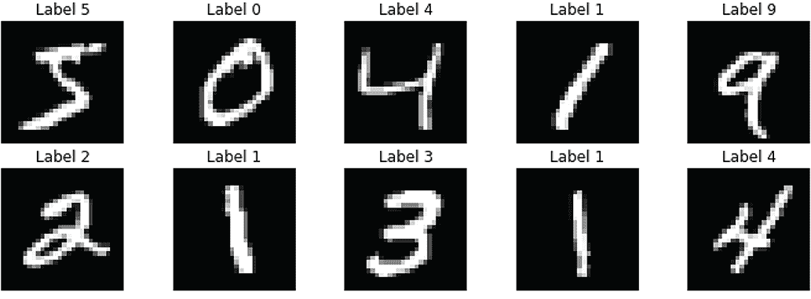

图 4.1 样本数字图像。每个图像包含一个从 0 到 9 的数字。

在 TensorFlow 中，你可以用一行代码加载 MNIST 数据集。由于其极为常见的用法，加载此数据集已成为各种机器学习库（包括 TensorFlow）的重要组成部分：

```py
from tensorflow.keras.datasets.mnist import load_data
(x_train, y_train), (x_test, y_test) = load_data()
```

`load_data()`方法返回两个元组：训练数据和测试数据。在这里，我们只会使用训练图像（即，x_train）数据集。正如我们之前介绍的，这是一个无监督任务。因此，我们不需要图像的标签（即，y_train）来完成这个任务。

比 MNIST 好吗？

请注意，由于过去十年计算机视觉领域的进展，MNIST 被认为过于简单，简单的逻辑回归模型就可以实现超过 92%的测试准确率（[`mng.bz/j2l9`](http://mng.bz/j2l9)），而最先进的模型则可以达到 99.84%的准确率（[`mng.bz/d2Pv`](http://mng.bz/d2Pv)）。此外，它在计算机视觉社区中被过度使用。因此，一个名为 Fashion-MNIST（[`github.com/zalandoresearch/fashion-mnist`](https://github.com/zalandoresearch/fashion-mnist)）的新数据集应运而生。这是一个包含属于 10 个类别的图像的黑白数据集。与数字不同，它包含各种时尚类别的图像（例如 T 恤、凉鞋、包等），这比识别数字要困难得多。

你可以打印 x_train 和 y_train 来更好地了解这些数组，使用

```py
print(x_train)
print('x_train has shape: {}'.format(x_train.shape))
```

这将产生

```py
[[[0 0 0 ... 0 0 0]
  [0 0 0 ... 0 0 0]
  [0 0 0 ... 0 0 0]
  ...
  [0 0 0 ... 0 0 0]
  [0 0 0 ... 0 0 0]
  [0 0 0 ... 0 0 0]]

 ...

 [[0 0 0 ... 0 0 0]
  [0 0 0 ... 0 0 0]
  [0 0 0 ... 0 0 0]
  ...
  [0 0 0 ... 0 0 0]
  [0 0 0 ... 0 0 0]
  [0 0 0 ... 0 0 0]]]

x_train has shape: (60000, 28, 28)
```

对 y_train 执行相同的操作：

```py
print(y_train)
print('y_train has shape: {}'.format(y_train.shape))
```

这将得到

```py
[5 0 4 ... 5 6 8]

y_train has shape: (60000,)
```

然后我们将进行一些基本的数据预处理。我们将通过将它们的像素值从[0, 255]归一化到[-1, 1]来规范化数据集中的所有样本。这是通过减去 128 并逐元素除以 128 来完成的。这很重要，因为自动编码器的最后一层具有 tanh 激活函数，其取值范围为(-1, 1)。tanh 是一个非线性激活函数，类似于 sigmoid 函数，对于给定的输入*x*，计算如下：

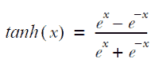

因此，我们需要确保向模型提供的内容在最终层可以生成的值范围内。另外，如果您查看 x_train 的形状，您将看到它的形状为(60000, 28, 28)。自动编码器接受一维输入，因此我们需要将图像重塑为大小为 784 的一维向量。这两种转换可以通过以下行来实现:

```py
norm_x_train = ((x_train - 128.0)/128.0).reshape([-1,784])
```

在这里，reshape([-1, 784])将数据集中的二维图像（大小为 28×28）展开为一个单一维度的向量（大小为 784）。在进行重塑时，您不需要提供重塑张量的所有维度。如果您仅提供除一个维度外的所有维度的大小，NumPy 仍然可以推断出缺失维度的大小，因为它知道原始张量的维度。您希望 NumPy 推断的维度用-1 表示。

也许你会想：“这些图像看起来清晰干净。我们如何训练模型来恢复损坏的图像？” 这很容易解决。我们只需要从原始图像中合成一组相应的损坏图像集。为此，我们将定义 generate_masked_inputs(...)函数：

```py
import numpy as np

def generate_masked_inputs(x, p, seed=None):
    if seed:
        np.random.seed(seed)
    mask = np.random.binomial(n=1, p=p, size=x.shape).astype('float32')
    return x * mask

masked_x_train = generate_masked_inputs(norm_x_train, 0.5)
```

这个函数将随机（有 50%的概率）将像素设置为零。但让我们更详细地检查我们正在做什么。首先，我们将提供设置随机种子的选项，以便我们可以确定性地改变生成的随机掩码。我们使用二项分布创建一个与 norm_x_train 大小相同的 1 和 0 的掩码。简单来说，二项分布表示如果你多次抛硬币，出现正面（1）或反面（0）的概率。二项分布有几个重要参数：

+   N—试验次数

+   P—成功的概率（1）

+   Size—测试的数量（即，试验集）

在这里，我们有 x.shape 个测试，在每个测试中有一个 50%的成功概率。然后将此掩码与原始张量进行逐元素相乘。这将导致随机分布在图像上的黑色像素（图 4.2）。

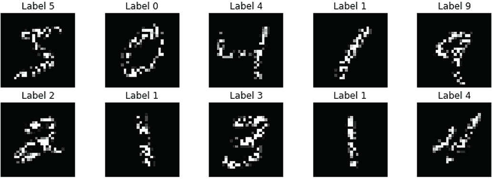

图 4.2 一些合成损坏的图像

接下来，让我们讨论我们将要实现的全连接网络。它被称为自动编码器模型。

### 4.1.2 自动编码器模型

自动编码器模型和多层感知机（MLP）模型（来自第一章）都是全连接网络（FCN）。之所以称为 FCN，是因为网络中的每一层都将所有输入节点连接到所有输出节点。自动编码器的操作方式与多层感知机类似。换句话说，在自动编码器中看到的计算（例如，正向传播）与 MLP 中完全相同。然而，两者的最终目标不同。MLP 被训练来解决监督任务（例如，分类花的品种），而自动编码器被训练来解决无监督任务（例如，在给定损坏/嘈杂图像的情况下重建原始图像）。现在让我们深入了解自动编码器实际上是做什么的。

监督学习与无监督学习

在监督学习中，模型使用带标签的数据集进行训练。每个输入（例如，图像/音频/电影评论）都有一个相应的标签（例如，图像的对象类别、评论的情感）或连续值（例如，图像对象的边界框）。监督任务的一些示例包括图像分类、目标检测、语音识别和情感分析。

在无监督学习中，模型使用未标记的数据进行训练（例如，从网站提取的没有任何标签的图像/音频/文本）。训练过程根据最终预期结果而显著变化。例如，自动编码器被训练为重建图像，作为基于图像的监督学习任务的预训练步骤。无监督任务的一些示例包括图像重构、使用生成对抗网络生成图像、文本聚类和语言建模。

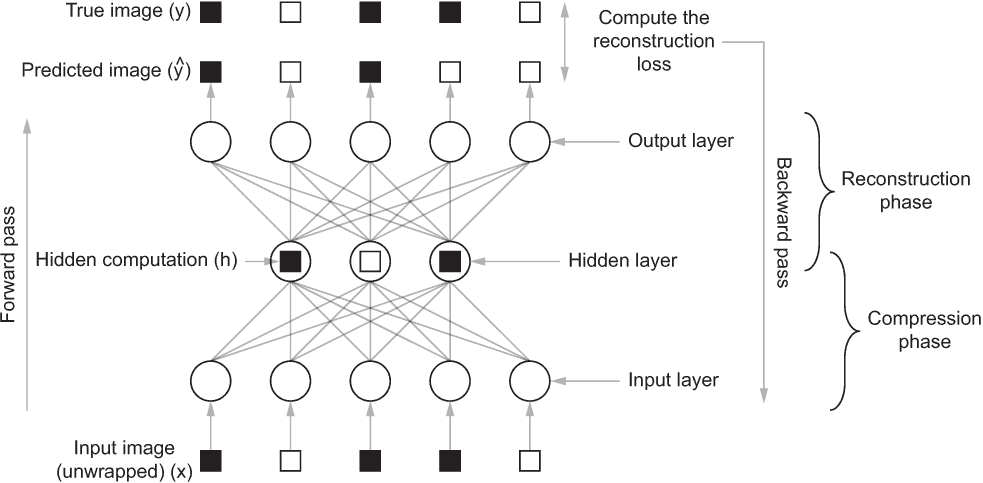

图 4.3 一个简单的自动编码器，其中一个层用于压缩，另一个层用于重构。输入图像中的黑色和白色矩形是图像中存在的像素。

图 4.3 描绘了一个具有两层的简单自编码器。自编码器在其功能上有两个阶段：

+   *压缩阶段*—将给定图像（即损坏的图像）压缩为压缩的隐藏（即潜在）表示。

+   *重构阶段*—从隐藏表示中重构原始图像。

在压缩阶段，计算压缩的隐藏表示如下所示。

*h*[1] = *ReLU*(*xW*[1] + *b*[1])

其中*W*[1]，*b*[1]是第一压缩层的权重和偏置，*h*[1]是层的最终隐藏表示。

类似地，我们计算重构层的输出：

*ŷ* = *ReLU*(*h*[1] *W*[2] + *b*[2])

这被称为前向传播，因为您从输入到输出。然后，您计算预期输出（即目标）和预测之间的损失（例如，均方误差[MSE]）。例如，单个图像的均方误差计算为

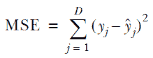

其中*D*是数据的维度（在我们的示例中为 784），*y*[j]是我们图像中的第*j*个像素，(*ŷ*[j])是预测图像的第*j*个像素。我们为每批图像计算此损失，并优化模型参数以最小化计算的损失。这被称为向后传递。

您可以有任意数量的压缩和重构层。在我们的任务中，我们需要两个压缩层和两个重构层（见下一个列表）。

列表 4.1 去噪自编码器模型。

```py
from tensorflow.keras import layers, models

autoencoder = models.Sequential(
    [layers.Dense(64, activation='relu', input_shape=(784,)),  ❶
    layers.Dense(32, activation='relu'),                       ❶
    layers.Dense(64, activation='relu'),                       ❶
    layers.Dense(784, activation='tanh')]                      ❶
)
autoencoder.compile(loss='mse', optimizer='adam')              ❷
autoencoder.summary()                                          ❸
```

❶ 定义四个稠密层，其中三个使用 ReLU 激活，一个使用 tanh 激活。

❷ 使用损失函数和优化器编译模型。

❸ 打印摘要。

让我们更详细地讨论我们所做的事情。您应该注意到的第一件事是，我们在这个任务中使用了 Keras Sequential API。这是有道理的，因为这是一个非常简单的深度学习模型。接下来，我们添加了四个稠密层。第一个稠密层接受具有 784 个特征的输入，并产生一个 64 元素的向量。然后第二层接受 64 元素的向量并产生一个 32 元素的向量。第三个稠密层接受 32 元素的向量并产生一个 64 元素的向量，将其传递给最终层，该层产生一个 784 元素的向量（即输入的大小）。前三层使用 ReLU 激活，最后一层使用 tanh 激活，因为最后一层需要产生在(-1, 1)之间的值。让我们再次提醒自己如何计算 ReLU 和 tanh 激活：

*ReLU*(*x*) = max (0, *x*)

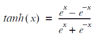

最后，我们使用均方误差作为损失函数，使用 adam 作为优化器编译模型。我们刚刚描述的模型具有我们在本节开头定义的规格。有了定义好的模型，现在您可以训练模型了。您将使用 64 个大小的批次训练模型 10 个时期：

```py
history = autoencoder.fit(masked_x_train, norm_x_train, batch_size=64, epochs=10)
```

我们生成的遮罩输入成为输入，原始图像将成为地面真相。当你训练模型时，你会看到随时间推移损失下降：

```py
Train on 60000 samples
Epoch 1/10
60000/60000 [==============================] - 4s 72us/sample - loss: 0.1496
Epoch 2/10
60000/60000 [==============================] - 4s 67us/sample - loss: 0.0992
Epoch 3/10
...
60000/60000 [==============================] - 4s 66us/sample - loss: 0.0821
Epoch 8/10
60000/60000 [==============================] - 4s 66us/sample - loss: 0.0801
Epoch 9/10
60000/60000 [==============================] - 4s 67us/sample - loss: 0.0787
Epoch 10/10
60000/60000 [==============================] - 4s 67us/sample - loss: 0.0777
```

看起来误差（即，损失值）从大约 0.15 下降到大约 0.078。这是模型正在学习重建图像的一个强有力的指示。你可以通过设置种子来获得类似的结果，使用我们在第二章中使用的 fix_random_seed(...) 函数（提供在笔记本中）。请注意，对于这个任务，我们无法定义像准确度这样的指标，因为这是一个无监督的任务。

去噪自动编码器

通常，自动编码器将给定的输入映射到一个小的潜在空间，然后再返回到原始输入空间以重建原始图像。然而，在这里，我们将自动编码器用于一个特殊目的：还原原始图像或去噪原始图像。这样的自动编码器被称为 *去噪*。在[`mng.bz/WxyX`](http://mng.bz/WxyX)上阅读更多关于去噪自动编码器的信息。

现在让我们看看训练好的模型能做什么！它现在应该能够还原一个受损数字的图像了。为了让事情变得有趣，让我们确保我们生成的遮罩是训练数据没有见过的：

```py
x_train_sample = x_train[:10]
y_train_sample = y_train[:10]

masked_x_train_sample = generate_masked_inputs(x_train_sample, 0.5, seed=2048)
norm_masked_x = ((x_train - 128.0)/128.0).reshape(-1, 784)

y_pred = autoencoder.predict(norm_masked_x)
```

在这里，我们将使用数据集中的前 10 张图像来测试我们刚刚训练的模型。然而，我们通过更改种子确保了随机遮罩不同。你可以使用以下代码显示关于 y_pred 的一些信息

```py
print(y_pred)
print('y_pred has shape: {}'.format(y_pred.shape))
```

将会给出

```py
[[-0.99999976 -0.99999976 -0.99999976 ... -0.99999976 -0.99999976
  -0.99999976]
 [-0.99999976 -0.99999976 -0.99999976 ... -0.99999976 -0.99999976
  -0.99999976]
 [-0.99999976 -0.99999976 -0.99999976 ... -0.99999976 -0.99999976
  -0.99999976]
 ...
 [-0.99999976 -0.99999976 -0.9999996  ... -0.99999946 -0.99999976
  -0.99999976]
 [-0.99999976 -0.99999976 -0.99999976 ... -0.99999976 -0.99999976
  -0.99999976]
 [-0.99999976 -0.99999976 -0.99999976 ... -0.99999976 -0.99999976
  -0.99999976]]

y_pred has shape: (60000, 784)
```

最后，你可以通过绘制图像来可视化模型的作用（在笔记本中提供的代码）。图 4.4 说明了损坏的图像（顶行）和模型的输出（底行）。虽然你还没有恢复你祖母的真实照片，但这是一个很好的开始，因为现在你知道了要遵循的方法。


图 4.4 模型恢复的图像。看起来我们的模型做得很好。

你可能会想，“自动编码器通常能帮你实现什么？”自动编码器是从未标记数据中学习无监督特征的好工具，这在解决更有趣的下游任务时非常方便，比如图像分类。当自动编码器在无监督任务上进行训练时，它们学习了其他任务（例如，图像分类）的有用特征。因此，训练一个自动编码器模型来对图像进行分类将比从头开始训练模型更快地获得性能良好的模型，并且所需的标记数据更少。正如你可能知道的，世界上的未标记数据要比标记数据多得多，因为标记通常需要人为干预，这是耗时且昂贵的。自动编码器的另一个用途是它产生的隐藏表示可以用作聚类图像的低维代理。

在本节中，你学习了自动编码器模型，它是一种 FCN 类型，用于以无监督的方式重构/恢复损坏的图像。这是一种利用大量未标记数据来预训练模型的好方法，这在更下游的有趣任务（如图像分类）中非常有用。你首先学习了架构，然后学习了如何使用 Keras Sequential API 实现自动编码器模型。最后，你对手写图像数据集（MNIST）进行了模型训练以重构数据集中的图像。在训练过程中，为了确保模型在学习，你监控了损失以确保随着时间的推移减少。最后，你使用模型预测了损坏图像的恢复，并确保模型表现良好。

在下一节中，我们将讨论一种不同类型的深度学习网络，它彻底改变了计算机视觉领域：CNN。

练习 1

实现一个接受 512 元素长向量的自动编码器模型。网络有一个 32 节点层，一个 16 节点层，最后是一个输出层。总共有三层。所有这些层都具有 sigmoid 激活。

## 4.2 卷积神经网络

你一直在一家初创公司担任数据科学家，试图对道路上的交通拥堵建模。公司解决方案中的一个重要模型是构建一个模型，以预测在给定的图像或图像块中是否存在车辆，作为更大计划的一部分。你计划首先在 cifar-10 数据集上开发一个模型，并查看它在分类车辆方面的效果如何。这是一个很好的主意，因为它将在最小的时间和金钱上为自定义数据标记提供一个粗略的近似值。如果我们在这个数据集上能够达到较高的准确度，那是一个非常积极的信号。你了解到 CNN 对于计算机视觉任务非常有效。因此，你计划实现一个 CNN。

### 4.2.1 理解数据

我们将使用的是 cifar-10 数据集。我们在上一章节简要地查看过这个数据集，它是这项任务的重要基石。它包含各种交通工具（如汽车、卡车）和其他物体（如狗、猫）作为类别。图 4.5 展示了一些类别及其对应的样本。

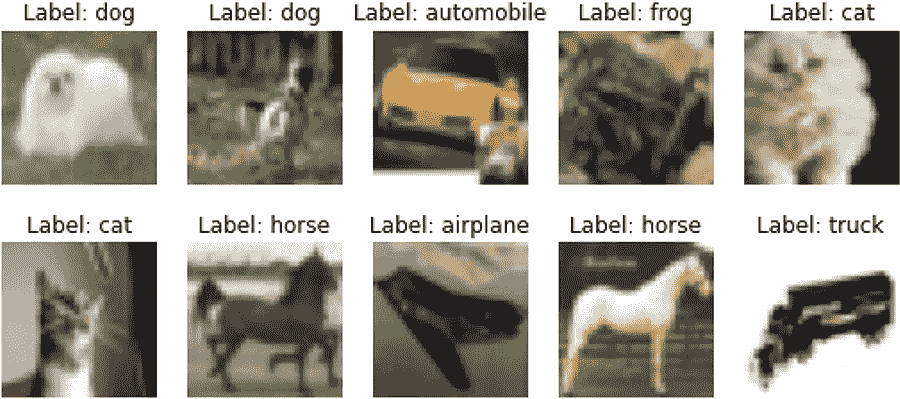

图 4.5 cifar-10 数据集的样本图像及其标签

数据集包含 50,000 个训练实例和 10,000 个测试实例。每个实例是一个 32 × 32 的 RGB 图像。这个数据集中有 10 个不同的对象类别。

让我们首先通过执行以下行来加载数据：

```py
import tensorflow_datasets as tfds
data = tfds.load('cifar10')
```

执行 print(data) 将产生

```py
{'test': <PrefetchDataset 
➥ shapes: {id: (), image: (32, 32, 3), label: ()}, 
➥ types: {id: tf.string, image: tf.uint8, label: tf.int64}>, 'train': <PrefetchDataset 
➥ shapes: {id: (), image: (32, 32, 3), label: ()}, 
➥ types: {id: tf.string, image: tf.uint8, label: tf.int64}>}
```

如果你稍微探索一下数据，你会意识到

+   图像以无符号的八位整数类型提供。

+   标签以整数标签提供（即，未进行 one-hot 编码）。

因此，我们将编写一个非常简单的函数，将图像转换为 float32 数据类型（使数据类型与模型参数一致），并将标签转换为独热编码向量：

```py
import tensorflow as tf

def format_data(x, depth):
    return (tf.cast(x["image"], 'float32'), tf.one_hot(x["label"], depth=depth))
```

最后，我们将通过将此函数应用于所有训练数据来创建一个批处理数据集：

```py
tr_data = data["train"].map(lambda x: format_data(x, depth=10)).batch(32)
```

我们可以再次查看数据

```py
for d in tr_data.take(1):
    print(d)
```

这将产生

```py
(
    <tf.Tensor: shape=(32, 32, 32, 3), dtype=float32, numpy=
    array(
        [[[[143.,  96.,  70.],
           [141.,  96.,  72.],
           [135.,  93.,  72.],
           ...,     
           [ 52.,  34.,  31.],
           [ 91.,  74.,  59.],
           [126., 110.,  88.]]]], 
        dtype=float32)
    >, 
    <tf.Tensor: shape=(32, 10), dtype=float32, numpy=
    array(
        [[0., 0., 0., 0., 0., 0., 0., 1., 0., 0.],
         [0., 0., 0., 0., 0., 0., 0., 0., 1., 0.],
         [0., 0., 0., 0., 1., 0., 0., 0., 0., 0.],
         ... 
         [0., 0., 0., 0., 1., 0., 0., 0., 0., 0.],
         [0., 0., 1., 0., 0., 0., 0., 0., 0., 0.]], 
        dtype=float32)
    >
)
```

现在我们的数据准备好输入模型了。

### 4.2.2 实现网络

为了对这些图像进行分类，我们将采用 CNN。CNN 以解决计算机视觉任务而闻名，并且是处理图像相关任务的流行选择，原因有两个主要方面：

+   CNN 在处理图像时保留它们的空间信息（即保持高度和宽度维度不变），而全连接层则需要将高度和宽度维度展开为一个单一维度，从而丢失宝贵的局部信息。

+   不同于全连接层，其中每个输入都连接到每个输出，卷积操作将一个较小的核移动到整个图像上，每层只需少量参数，使得 CNN 非常高效。

CNN 由一组交错的卷积和池化层以及几个全连接层组成。这意味着 CNN 中有三种主要类型的层：

+   卷积层

+   池化层

+   全连接层

一个卷积层由多个滤波器（即卷积核）组成，这些滤波器在图像上进行卷积以生成*特征图*。特征图是一个表示给定滤波器在图像中存在程度的表示。例如，如果滤波器表示垂直边缘，则特征图表示图像中垂直边缘存在的位置（以及强度）。再举一个例子，想象一个训练用于识别人脸的神经网络。一个滤波器可能表示眼睛的形状，并且在给定图像中存在眼睛时会高度激活相应区域的输出（见图 4.6）。我们将在本章后面更详细地讨论卷积操作。

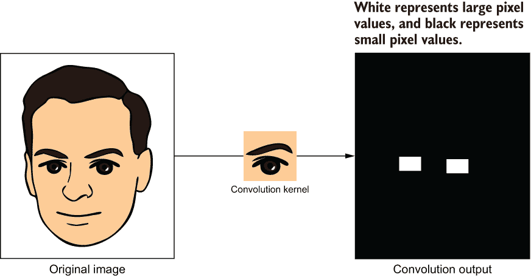

图 4.6 卷积操作的结果，非常抽象。如果我们有一个人脸图像和一个表示眼睛形状/颜色的卷积核，那么卷积结果可以粗略地被认为是该特征（即眼睛）在图像中存在的热图。

卷积层的另一个重要特性是，网络越深（即离输入越远），层学习的高级特征就越多。回到我们的人脸识别例子，较低的层可能学习到各种边缘的存在；下一层学习到眼睛、耳朵和鼻子的形状；下一层学习到两只眼睛的位置、鼻子和嘴巴的对齐等（见图 4.7）。

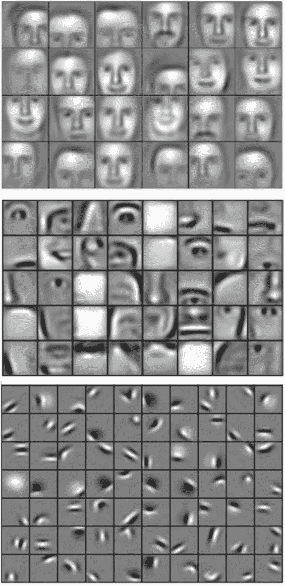

图 4.7 卷积神经网络学习到的特征。较低的层（离输入最近）学习到的是边缘/线条，而较高的层（离输入最远）学习到的是更高级的特征。（来源：[`mng.bz/8MPg`](http://mng.bz/8MPg)）

接下来，池化层接收卷积层生成的特征图并减少它们的高度和宽度维度。为什么减少特征图的高度和宽度有用？它帮助模型在机器学习任务中具有平移不变性。例如，如果任务是图像分类，即使物体在训练期间看到的几个像素偏移，该网络仍然能够识别出物体。

最终，为了获得最终的概率分布，你有多个全连接层。但你可能已经怀疑我们在这里面临的问题。卷积/池化层产生三维输出（即高度、宽度和通道维度）。但全连接层接受一维输入。我们如何将卷积/池化层的三维输出连接到一维的全连接层呢？这个问题有一个简单的答案。你将所有三个维度压缩成一个维度。换句话说，这类似于将二维的 RGB 图像展开成一维向量。这为全连接层提供了一维输入。最后，对最后一个全连接层的输出（即网络的得分）应用 softmax 激活，以获得有效的概率分布。图 4.8 描述了一个简单的 CNN。

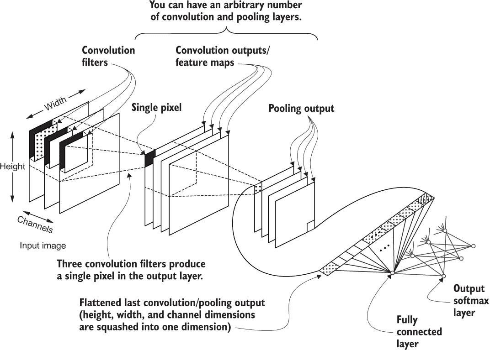

图 4.8 一个简单的 CNN。首先，我们有一个带有高度、宽度和通道维度的图像，然后是一个卷积和池化层。最后，最后一个卷积/池化层的输出被展平，并输入到一组全连接层中。

通过深入了解 CNN 的构成，我们将使用 Keras Sequential API 创建以下 CNN。然而，如果你运行此代码，你将会收到一个错误。我们将在接下来的部分调查并修复这个错误（参见下一个列表）。

列表 4.2 使用 Keras Sequential API 定义 CNN

```py
from tensorflow.keras import layers, models
import tensorflow.keras.backend as K

K.clear_session()                                                          ❶
cnn = models.Sequential(
    [layers.Conv2D(
        filters=16, kernel_size= (9,9), strides=(2,2), activation='relu',  ❷
           padding=’valid’, input_shape=(32,32,3)
        ),                                                                 ❷
     layers.Conv2D(
         filters=32, kernel_size= (7,7), activation='relu', padding=’valid’
     ), 
     layers.Conv2D(
         filters=64, kernel_size= (7,7), activation='relu', padding=’valid’
     ), 
     layers.Flatten(),                                                     ❸
     layers.Dense(64, activation='relu'),                                  ❹
     layers.Dense(10, activation='softmax')]                               ❺
)
```

❶ 清除任何现有的 Keras 状态（例如模型）以重新开始

❷ 定义卷积层；它接受过滤器、内核大小、步幅、激活和填充等参数。

❸ 在将数据输入全连接层之前，我们需要展平最后一个卷积层的输出。

❹ 创建一个中间的全连接层

❺ 最终预测层

你可以看到，该网络由三个卷积层和两个全连接层组成。Keras 提供了你实现 CNN 所需的所有层。如你所见，我们的图像分类网络只需一行代码即可完成。让我们更详细地探索一下这个模型中发生了什么。第一层定义如下：

```py
layers.Conv2D(filters=16,kernel_size=(9,9), strides=(2,2), activation='relu', input_shape=(32,32,3))
```

卷积神经网络的超参数

在列表 4.2 中的 CNN 网络中，Conv2D 层的 filters、kernel_size 和 strides，Dense 层（除了输出层）中的隐藏单元数以及激活函数被称为模型的超参数。理想情况下，这些超参数需要使用超参数优化算法进行选择，该算法会运行数百（如果不是数千）个具有不同超参数值的模型，并选择最大化预定义度量（例如，模型准确性）的那个。然而，这里我们已经根据经验选择了这些超参数的值，并且不会使用超参数优化。

首先，Conv2D 层是 2D 卷积操作的 Keras 实现。正如您在第一章中记得的那样，我们使用了 tf.nn.convolution 操作来实现这一点。Conv2D 层在幕后执行相同的功能。但是，它隐藏了一些直接使用 tf.nn.convolution 操作时遇到的复杂性（例如，显式定义层参数）。您需要为这一层提供几个重要的参数：

+   过滤器—输出中将存在的通道数。

+   核大小—高度和宽度维度上的卷积窗口大小，按顺序。

+   步长—表示在每次卷积窗口在输入上移动时，跳过的高度和宽度像素数量（按顺序）。在这里有较高的值有助于随着深入，快速减小卷积输出的尺寸。

+   激活—卷积层的非线性激活。

+   填充—在执行卷积操作时用于边界的填充类型。填充边界可以更好地控制输出的大小。

+   input_shape—表示（高度，宽度，通道）维度上的输入大小的三维元组。请记住，当使用此参数指定数据的形状时，Keras 会自动添加一个未指定的批量维度。

现在让我们更详细地介绍卷积函数及其参数。我们已经知道，卷积操作将一个卷积窗口（即一个核）在图像上移动，同时取得与图像部分与核重叠的元素的乘积之和（图 4.9）。从数学上讲，卷积操作可以表示为

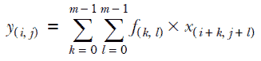

其中*x*是*n* × *n*的输入矩阵，*f*是*m* × *m*的过滤器，*y*是输出。


图 4.9 在移动窗口时进行卷积操作的计算

除了卷积操作期间发生的计算外，在使用 Keras 中的 Conv2D 层时产生的大小和值时，还有四个重要的超参数：

+   滤波器数量

+   核高度和宽度

+   核步长（高度和宽度）

+   填充类型

我们将讨论的第一个方面是层中滤波器的数量。通常，单个卷积层有多个滤波器。例如，想象一个训练用于识别人脸的神经网络。网络中的一个层可能会学习识别眼睛的形状，鼻子的形状等等。每个这些特征可能由层中的单个滤波器学习。

卷积层接收一个图像，这是一个具有某些高度、宽度和通道的三维张量。例如，如果图像是 RGB 图像，则会有三个通道。如果图像是灰度图像，则通道数将为一。然后，将该张量与 n 个滤波器卷积将导致一个具有某些高度、宽度和 n 个通道的三维输出。这在图 4.10 中显示。在 CNN 中使用时，滤波器是卷积层的参数。这些滤波器被随机初始化，随着时间的推移，它们会演变成有助于解决手头任务的有意义特征。

正如我们之前所说，深度神经网络以批量方式处理数据。CNN 也不例外。您可以看到，我们将 input_shape 参数设置为 (32, 32, 3)，其中自动添加了一个未指定的批量维度，使其为 (None, 32, 32, 3)。未指定的维度用 None 表示，意味着模型可以在该维度上取任意数量的项目。这意味着在向模型提供数据时，一个数据批次可以有 3、4、100 或任意数量的图像（根据计算机内存的情况）。因此，Conv2D 层的输入/输出实际上是一个四维张量，具有批量、高度、宽度和通道维度。然后，滤波器将是另一个四维张量，具有核高度、宽度、输入通道和输出通道维度。表 4.1 总结了这些信息。

表 4.1 卷积层的输入、滤波器和输出的维度

|  | **维度** | **示例** |
| --- | --- | --- |
| 输入 | [批量大小，高度，宽度，输入通道] | [32, 64, 64, 3]（即，一批 32 个，64 × 64 的 RGB 图像） |
| 卷积滤波器 | [高度，宽度，输入通道，输出通道] | [5, 5, 3, 16]（即，大小为 5 × 5 的 16 个输入通道的卷积滤波器） |
| 输出 | [批量大小，高度，宽度，输出通道] | [32, 64, 64, 16]（即，一批 32 个，64 × 64 × 16 的张量） |

图 4.10 描述了卷积层中输入和输出的外观。

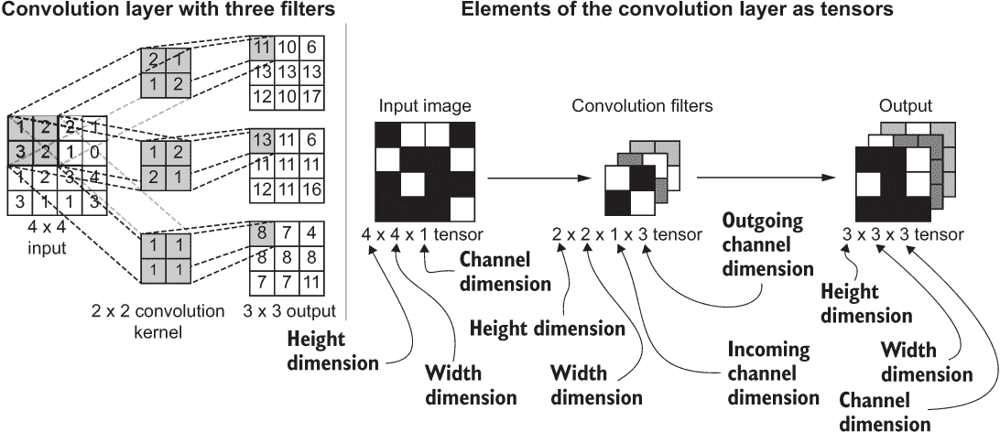

图 4.10 多个滤波器（随机初始化）的卷积层的计算。我们保留了张量表示的批量维度以避免混乱。

接下来，内核的高度和宽度是在高度和宽度维度上的滤波器大小。图 4.11 描述了不同内核大小导致不同输出的情况。通常，在实现 CNN 时，我们保持内核的高度和宽度相等。因此，我们将内核的高度和宽度维度统称为*内核大小*。我们可以将输出大小计算为内核和输入大小的函数，如下所示：

*size*(*y*) = *size*(*x*) - *size*(*f*) + 1

例如，如果图像是一个 7 × 7 的矩阵，滤波器是一个 3 × 3 的矩阵，那么输出将是一个 (7 - 3 + 1, 7 - 3 + 1) = 5 × 5 的矩阵。或者，如果图像是一个 7 × 7 的矩阵，滤波器是一个 5 × 5 的矩阵，那么输出将是一个 3 × 3 的矩阵。

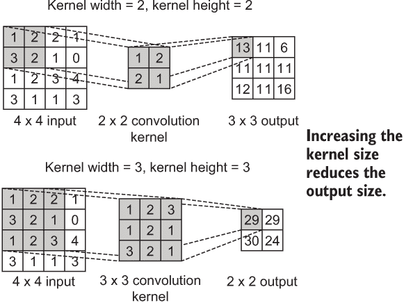

图 4.11 使用 2 和 3 的内核大小的卷积操作。增加内核大小会导致减小输出大小。

从建模的角度来看，增加内核大小（即滤波器大小）意味着增加参数的数量。通常，您应该尝试减少网络中的参数数量并针对较小的内核大小。使用小内核大小鼓励模型使用少量参数学习更健壮的特征，从而更好地泛化模型。

下一个重要参数是步幅。与内核大小类似，步幅有两个组成部分：高度和宽度。直觉上，步幅定义了在进行卷积操作时跳过多少像素/值。图 4.12 说明了没有步幅和步幅 = 2 之间的区别。与之前一样，我们可以将输出大小指定为输入大小、内核大小和步幅的函数：

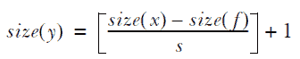

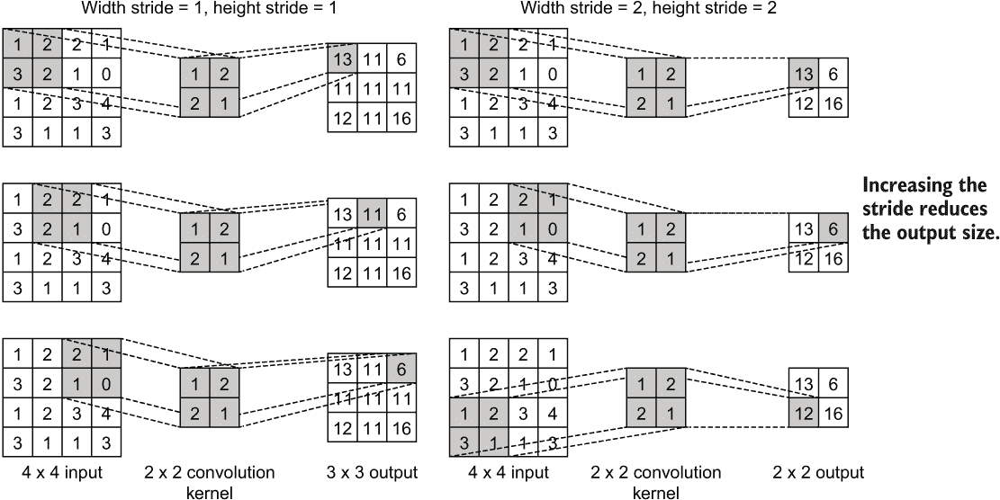

图 4.12 步幅为 1（即无步幅）与步幅为 2 的卷积操作。增加步幅会导致较小的输出。

从建模的角度来看，步幅是有益的，因为它帮助您控制输出中需要减少的量。您可能已经注意到，即使在没有步幅的情况下，卷积过程中仍会自动减少维度。但是，当使用步幅时，您可以控制要获得的减少而不影响内核大小。

最终，填充决定了图像边界附近发生的情况。正如你已经看到的，当你对图像进行卷积时，你得不到与输入尺寸相同的输出。例如，如果你有一个 4 × 4 的矩阵和一个 2 × 2 的核，你会得到一个 3 × 3 的输出（即，根据我们之前看到的方程*size*(*y*) = *size*(*x*) - *size*(*f* ) + 1，其中*x*是输入尺寸，*f*是滤波器尺寸）。这种自动降维会在创建深度模型时产生问题。具体来说，它限制了你可以拥有的层数，因为在某些时候，输入会由于这种自动尺寸减小而变成 1 × 1 像素。因此，这将在将信息传递给随后的全连接层时创建一个非常窄的瓶颈，导致大量信息丢失。

你可以使用填充来缓解这个问题。通过填充，你在图像周围创建一个零边框，以便获得与输入相同大小的输出。更具体地说，你在周围附加一个大小为*size*(*f* ) - 1 的零边框，以获得与输入相同大小的输出。例如，如果你有一个大小为 4 × 4 的输入和一个大小为 2 × 2 的核，那么你将垂直和水平应用大小为 2 - 1 = 1 的边框。这意味着核实际上正在处理一个 5 × 5 的输入（即，(4 + 1) × (4 + 1)-大小的输入），结果是一个 4 × 4 的输出。这被称为*same padding*。注意，你填充的不总是零。虽然目前 Keras 不支持，但有不同的填充策略（一些示例可以在这里找到：[`www.tensorflow.org/api_docs/python/tf/pad`](https://www.tensorflow.org/api_docs/python/tf/pad)），例如填充

+   一个常量值

+   输入的反射

+   最近的值

如果你不应用填充，那就是*valid padding*。不应用填充会导致我们之前讨论过的标准卷积操作。填充的差异如图 4.13 所示。

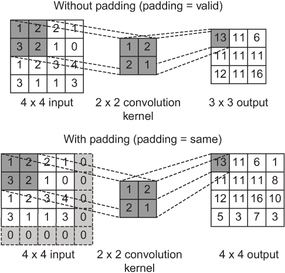

图 4.13 有效填充与相同填充。有效填充导致输出尺寸减小，而相同填充导致输出与输入尺寸相等。

通过这个，我们结束了对 Conv2D 层的各种超参数的讨论。现在让我们回到我们实现的网络。不幸的是，如果你尝试运行我们讨论过的代码，你会看到一个有些晦涩的错误，就像这样：

```py
---------------------------------------------------------------------------
...

InvalidArgumentError: Negative dimension size caused by subtracting 7 from 6 for 'conv2d_2/Conv2D' (op: 'Conv2D') with input shapes: [?,6,6,32], [7,7,32,64].
```

我们在这里做错了什么？TensorFlow 似乎在尝试计算卷积层输出时抱怨负尺寸。由于我们已经学会了在各种情况下计算输出大小（例如，带有步幅，带有填充等），我们将计算卷积层的最终输出。我们有以下层：

```py
layers.Conv2D(16,(9,9), strides=(2,2), activation='relu', padding=’valid’, input_shape=(32,32,3))
```

我们从尺寸为 32×32×3 的输入开始。然后，经过具有 16 个过滤器、卷积核尺寸为 9 和步幅为 2 的卷积操作后，我们得到一个尺寸为（高度和宽度）的输出。

```py
(⌊(32 - 9) / 2⌋ + 1 = 12
```

这里，我们只关注高度和宽度维度。下一层有 32 个过滤器，卷积核尺寸为 7，没有步幅：

```py
     layers.Conv2D(32, (7,7), activation='relu', padding=’valid’)
```

该层产生一个尺寸为的输出。

```py
12 - 7 + 1 = 6
```

最后的卷积层有 64 个过滤器，卷积核尺寸为 7，没有步幅。

```py
     layers.Conv2D(64, (7,7), activation='relu', padding=’valid’), 
```

这将产生一个尺寸为的输出。

6 - 7 + 1 = 0

我们找到了解决办法！通过我们选择的配置，我们的 CNN 产生了一个无效的零尺寸输出。错误中的“负尺寸”一词指的是产生具有无效尺寸（即小于 1）的输出。输出总是需要大于或等于 1。

让我们通过确保输出永远不会具有负尺寸来修正这个网络。此外，我们将在 CNN 中引入几个交错的最大池化层，这有助于网络学习平移不变特征（参见下一列表）。

列表 4.3 已修正的具有正尺寸的 CNN 模型。

```py
from tensorflow.keras import layers, models
import tensorflow.keras.backend as K

K.clear_session()

cnn = models.Sequential([
     layers.Conv2D(                                                      ❶
         filters=16,kernel_size=(3,3), strides=(2,2), activation='relu', ❶
         padding='same', input_shape=(32,32,3)),                         ❶
     layers.MaxPool2D(pool_size=(2,2), strides=(2,2), padding='same'),   ❷
     layers.Conv2D(32, (3,3), activation='relu', padding='same'),        ❸
     layers.MaxPool2D(pool_size=(2,2), strides=(2,2), padding='same'),   ❹
     layers.Flatten(),                                                   ❺
     layers.Dense(64, activation='relu'),                                ❻
     layers.Dense(32, activation='relu'),                                ❻
     layers.Dense(10, activation='softmax')]                             ❼
)
```

❶ 第一个卷积层。输出尺寸从 32 减小到 16。

❷ 第一个最大池化层。输出尺寸从 16 减小到 8。

❸ 第二个卷积层。由于没有步幅，输出尺寸保持不变。

❹ 第二个最大池化层。输出尺寸从 8 减小到 4。

❺ 将高度、宽度和通道维度压缩为单一维度。

❻ 两个中间的具有 ReLU 激活函数的密集层。

❼ 使用 softmax 激活的最终输出层。

最大池化由 tensorflow.keras.layers.MaxPool2D 层提供。该层的超参数与 tensorflow.keras.layers.Conv2D 非常相似：

+   pool_size——这类似于 Conv2D 层的卷积核尺寸参数。它是一个表示（窗口高度，窗口宽度）的元组，按照那个顺序。

+   步幅——这类似于 Conv2D 层的步幅参数。它是一个表示（高度步幅，宽度步幅）的元组，按照那个顺序。

+   填充——填充可以是 same 或 valid，并且具有与 Conv2D 层中相同的效果。

让我们分析一下我们对 CNN 所做的更改：

+   我们对所有 Conv2D 和 MaxPool2D 层都使用了 padding='same'，这意味着不会自动减小输出尺寸。这消除了意外进入负尺寸的风险。

+   我们使用步幅参数来控制随着模型深入而输出尺寸的减小。

您可以按照列表 4.1 中的输出尺寸，并确保对于我们拥有的输入图像，输出永远不会小于或等于零。

在 Conv2D 和 MaxPool2D 层之后，我们必须至少有一个全连接层，因为我们正在解决图像分类任务。为了获得最终的预测概率（即给定输入属于输出类的概率），一个全连接层是必不可少的。但在拥有全连接层之前，我们需要将 Conv2D 或 MaxPool2D 层的四维输出（即[batch, height, width, channel]形状）展平为全连接层的二维输入（即[batch, features]形状）。也就是说，除了批处理维度之外，其他所有维度都被压缩为单个维度。为此，我们使用由 Keras 提供的 tensorflow.keras.layers.Flatten 层。例如，如果我们最后一个 Conv2D 层的输出是[None, 4, 4, 64]，那么 Flatten 层将这个输出展平为一个[None, 1024]大小的张量。最后，我们添加三个全连接层，其中前两个全连接层具有 64 和 32 个输出节点，并且使用 ReLU 类型的激活函数。最后一个全连接层将有 10 个节点（每个类一个）和 softmax 激活函数。

CNN 的性能瓶颈

通常，在 CNN 中，卷积/池化层之后的第一个全连接层被认为是*性能瓶颈*。这是因为这一层通常包含网络参数的很大一部分。假设您有一个 CNN，其中最后一个池化层产生一个 8 × 8 × 256 的输出，后面是一个具有 1,024 个节点的全连接层。这个全连接层将包含 16,778,240（超过 1600 万）个参数。如果您不注意 CNN 的第一个全连接层，您很容易在运行模型时遇到内存不足的错误。

是时候在数据上测试我们的第一个 CNN 了。但在此之前，我们必须用适当的参数编译模型。在这里，我们将监视模型的训练准确率：

```py
cnn.compile(loss='categorical_crossentropy', optimizer='adam', metrics=['acc'])
```

最后，您可以使用我们之前创建的训练数据，并通过调用数据训练模型。

```py
history = cnn.fit(tr_data,epochs=25)
```

您应该得到以下输出：

```py
Epoch 1/25
1563/1563 [==============================] - 23s 15ms/step - loss: 2.0566 - acc: 0.3195
Epoch 2/25
1563/1563 [==============================] - 13s 8ms/step - loss: 1.4664 - acc: 0.4699
...
Epoch 24/25
1563/1563 [==============================] - 13s 8ms/step - loss: 0.8070 - acc: 0.7174
Epoch 25/25
1563/1563 [==============================] - 13s 8ms/step - loss: 0.7874 - acc: 0.7227
```

看起来我们在训练准确率（以 acc 表示）方面做得不错，并且在识别车辆任务的训练损失（以 loss 表示）上保持稳定的降低（约为 72.2% 的准确率）。但是通过采用各种技术，我们可以获得更好的准确率，您将在后面的章节中看到。对于团队来说，这是一个非常令人兴奋的消息，因为这意味着他们可以继续努力完成他们的全面解决方案。

在本节中，我们研究了 CNNs。CNNs 在解决计算机视觉问题时表现得非常好。在这个实例中，我们研究了使用 CNN 对图像进行分类到各种类别（例如，动物、车辆等）作为模型检测车辆能力的可行性研究。我们详细研究了 CNN 的技术方面，同时仔细检查了各种操作，如卷积和池化，以及与这些操作相关的参数的影响（例如，窗口大小、步长、填充）。我们发现，如果我们在使用这些参数时不注意输出的变化，可能会导致代码错误。接下来，我们修复了错误并在数据集上训练了模型。最后，我们发现模型显示出有希望的结果，迅速达到了 70%以上的训练准确度。接下来，我们将讨论 RNNs，它们在解决时间序列问题方面投入了大量的投资。

练习 2

考虑以下网络：

```py
from tensorflow.keras import layers, models

models.Sequential([
layers.Conv2D(                                                     
         filters=16, kernel_size=(5,5), padding='valid', input_shape=(64,64,3)
),                        
layers.MaxPool2D(pool_size=(3,3), strides=(2,2), padding='same'),  
layers.Conv2D(32, (3,3), activation='relu', padding='same'),       
layers.MaxPool2D(pool_size=(2,2), strides=(2,2), padding='same'),  
layers.Conv2D(32, (3,3), strides=(2,2), activation='relu', padding='same')
])       
```

最终的输出大小是多少（忽略批次维度）？

## 4.3 一步一步地：递归神经网络（RNNs）

您是国家气象局的机器学习顾问。他们拥有过去三十年的 CO2 浓度数据。您被委托开发一个机器学习模型，预测未来五年的 CO2 浓度。您计划实现一个简单的 RNN，它接受 CO2 浓度序列（在本例中，过去 12 个月的值）并预测序列中的下一个值。

很明显，我们面对的是一个时间序列问题。这与我们以往解决的任务非常不同。在以前的任务中，一个输入不依赖于先前的输入。换句话说，您认为每个输入都是 *i.i.d*（独立同分布）的输入。然而，在这个问题中，情况并非如此。今天的 CO2 浓度将取决于过去几个月的 CO2 浓度。

典型的前馈网络（即全连接网络、CNNs）在没有特殊适应的情况下无法从时间序列数据中学习。然而，有一种特殊类型的神经网络专门设计用于从时间序列数据中学习。这些网络通常被称为 RNNs。RNNs 不仅使用当前输入进行预测，而且在给定时间步长时还使用网络的*记忆*，从过去的时间步长。图 4.14 描述了前馈网络和 RNN 在预测几个月内 CO2 浓度时的差异。正如您所看到的，如果您使用前馈网络，它必须仅基于上个月来预测下个月的 CO2 水平，而 RNN 则会查看所有以前的月份。

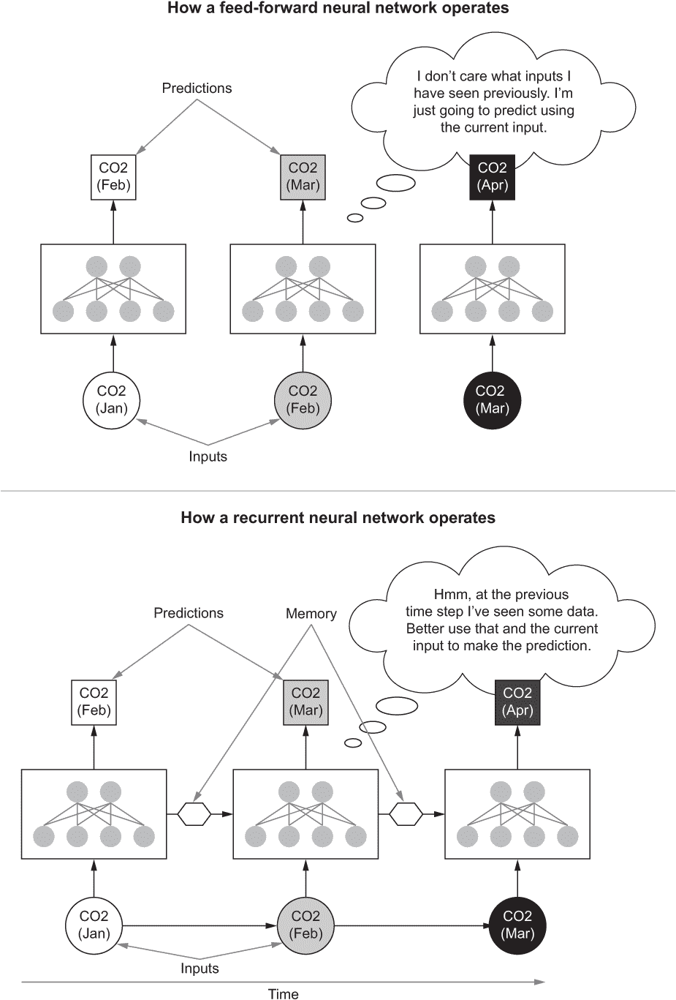

图 4.14 以 CO2 浓度水平预测任务为例，前馈网络和 RNN 之间的操作差异

### 4.3.1 理解数据

数据集非常简单（从[`datahub.io/core/co2-ppm/r/co2-mm-gl.csv`](https://datahub.io/core/co2-ppm/r/co2-mm-gl.csv)下载）。每个数据点都有一个日期（YYYY-MM-DD 格式）和一个浮点值，表示 CSV 格式中的 CO2 浓度。数据以 CSV 文件的形式提供给我们。让我们按如下方式下载文件：

```py
import requests
import os

def download_data():
    """ This function downloads the CO2 data from 
    https:/ /datahub.io/core/co2-ppm/r/co2-mm-gl.csv
    if the file doesn't already exist
    """
    save_dir = "data"
    save_path = os.path.join(save_dir, 'co2-mm-gl.csv')

    # Create directories if they are not there
    if not os.path.exists(save_dir):
        os.makedirs(save_dir)

    # Download the data and save
    if not os.path.exists(save_path):
        url = "https:/ /datahub.io/core/co2-ppm/r/co2-mm-gl.csv"
        r = requests.get(url)
        with open(save_path, 'wb') as f:
            f.write(r.content)
    else:
        print("co2-mm-gl.csv already exists. Not downloading.")
    return save_path

# Downloading the data
save_path = download_data()
```

我们可以使用 pandas 轻松加载这个数据集：

```py
import pandas as pd
data = pd.read_csv(save_path)
```

现在我们可以看一下数据的样子，使用 head() 操作，它将提供数据框中的前几个条目：

```py
data.head()
```

这将得到类似图 4.15 的东西。

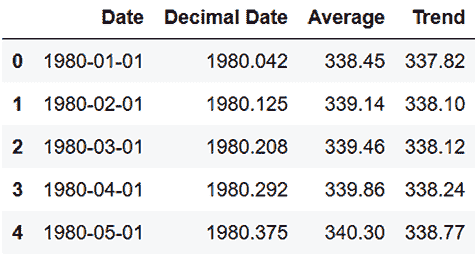

图 4.15 数据集中的示例数据

在这个数据集中，我们唯一感兴趣的两列是日期列和平均列。其中，日期列仅用于可视化目的。让我们将日期列设置为数据框的索引。这样，当我们绘制数据时，*x* 轴将自动注释相应的日期：

```py
data = data.set_index('Date')
```

现在我们可以通过创建一条线图来可视化数据（图 4.16）：

```py
data[["Average"]].plot(figsize=(12,6))
```

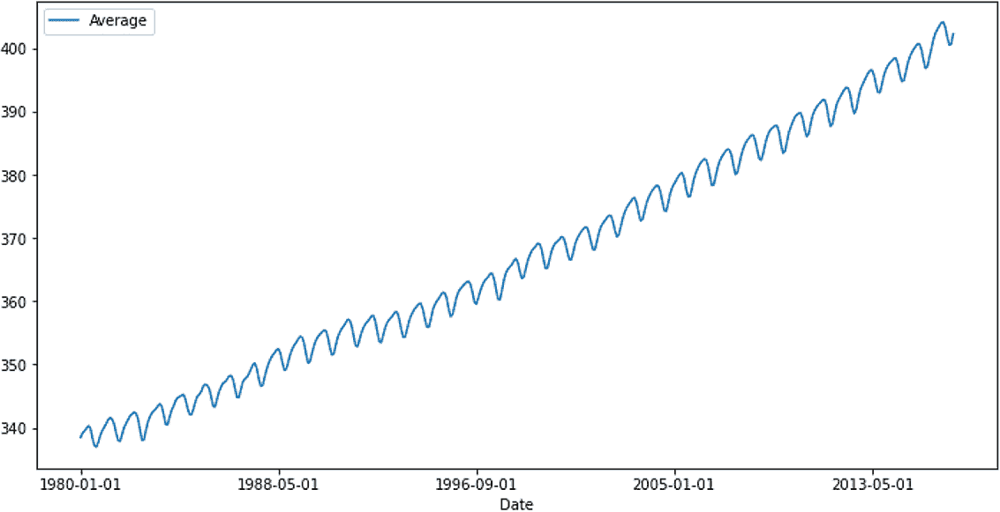

图 4.16 CO2 浓度随时间变化的图示

数据的明显特征是它呈上升趋势和短周期性重复。让我们看看我们可以对这些数据做什么样的改进。数据明显的上升趋势构成了一个问题。这意味着数据在一个一致的范围内没有分布。随着时间线的推移，范围不断增加。如果你把数据直接输入模型，通常模型的性能会下降，因为模型必须预测的任何新数据都超出了训练期间看到的数据范围。但是如果你忘记绝对值，思考这些数据与前一个值的相对关系，你会发现它在一个非常小的值范围内波动（大约为-2.0 到+1.5）。事实上，我们可以很容易地测试这个想法。我们将创建一个名为 Average Diff 的新列，其中将包含两个连续时间步之间的相对差异：

```py
data["Average Diff"]=data["Average"] - data["Average"].shift(1).fillna(method='bfill')
```

如果你在这个阶段执行 data.head()，你会看到类似表 4.2 的东西。

表 4.2 引入平均差异列后数据集中的示例数据

| **日期** | **十进制日期** | **平均值** | **趋势** | **平均差异** |
| --- | --- | --- | --- | --- |
| 1980-01-01 | 1980.042 | 338.45 | 337.83 | 0.00 |
| 1980-02-01 | 1980.125 | 339.15 | 338.10 | 0.70 |
| 1980-03-01 | 1980.208 | 339.48 | 338.13 | 0.33 |
| 1980-04-01 | 1980.292 | 339.87 | 338.25 | 0.39 |
| 1980-05-01 | 1980.375 | 340.30 | 338.78 | 0.43 |

这里，我们正在从原始平均列中减去一个平移一个时间步长的值的版本的平均列。图 4.17 在视觉上描述了这个操作。


图 4.17 从原始平均系列到平均差异系列的转换

最后，我们可以可视化值的行为（图 4.18）使用 data["Average Diff"].plot(figsize=(12,6)) 行。

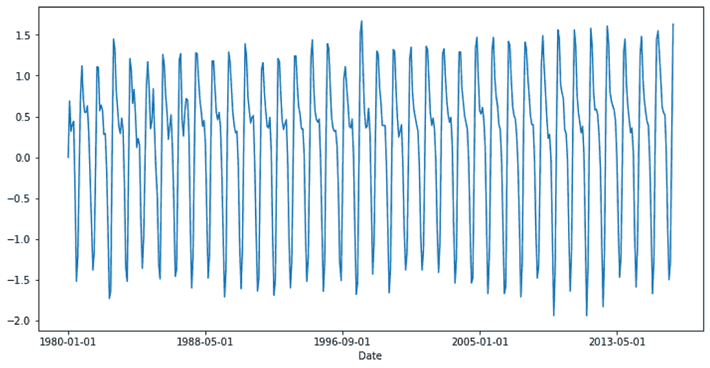

图 4.18 CO2 浓度值的相对变化（即，Average[t]-Average[t-1]）随时间的变化

你能看到区别吗？从不断增长的数据流中，我们已经转变成了在短时间内发生变化的数据流。下一步是为模型创建数据批处理。我们如何为时间序列问题创建数据批处理呢？请记住，我们不能简单地随机采样数据，因为每个输入都取决于其前序输入。

假设我们想要使用过去 12 个 CO2 浓度值（即 12 个时间步）来预测当前的 CO2 浓度值。时间步数是一个必须仔细选择的超参数。为了自信地选择这个超参数，你必须对数据和所使用的模型的内存限制有扎实的了解。

我们首先随机选择序列中的一个位置，并从该位置开始取 12 个值作为输入，并将第 13 个值作为我们感兴趣的要预测的输出，以便每次采样的总序列长度（n_seq）为 13。如果你这样做 10 次，你将得到一个具有 10 个元素的数据批处理。正如你所看到的，这个过程利用了随机性，同时保留了数据的时间特性，并向模型提供数据。图 4.19 对这个过程进行了可视化描述。

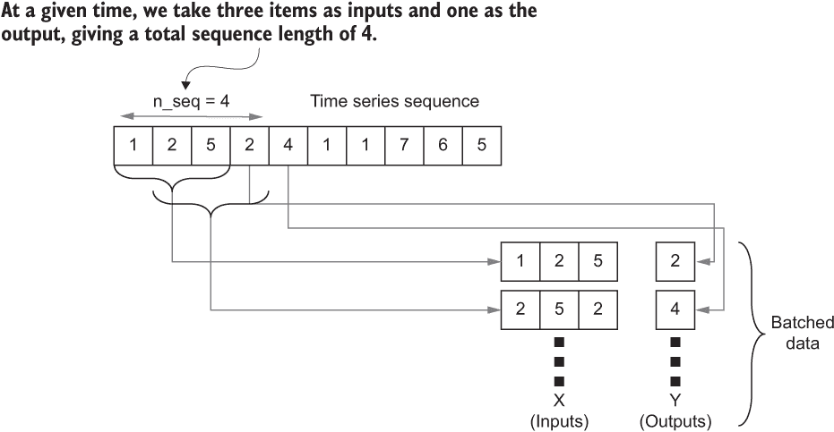

图 4.19 批处理时间序列数据。n_seq 表示我们在给定时间内看到的时间步数，以创建单个输入和输出。

要在 Python 中执行此操作，让我们编写一个函数，以单个数据集的形式给出所有位置的数据。换句话说，该函数返回所有可能的具有 12 个元素的连续序列作为 x，并将每个序列的相应下一个值作为 y。在将数据提供给模型时可以执行洗牌操作，如下一个清单所示。

清单 4.4 用于为模型生成时间序列数据序列的代码

```py
import numpy as np

def generate_data(co2_arr,n_seq):
    x, y = [],[]
    for i in range(co2_arr.shape[0]-n_seq):
        x.append(co2_arr[i:i+n_seq-1])         ❶
        y.append(co2_arr[i+n_seq-1:i+n_seq])   ❷
    x = np.array(x)                            ❸
    y = np.array(y)                            ❸
    return x,y
```

❶ 提取长度为 n_seq 的值序列

❷ 将序列中的下一个值提取为输出

❸ 将所有内容组合成一个数组

### 4.3.2 实现模型

了解数据后，我们可以开始实现网络。我们将实现一个具有以下内容的网络：

+   具有 64 个隐藏单元的 rnn 层

+   具有 64 个隐藏单元和 ReLU 激活的密集层

+   具有单输出和线性激活的密集层

```py
from tensorflow.keras import layers, models

rnn = models.Sequential([
    layers.SimpleRNN(64),
    layers.Dense(64, activation='relu'),
    layers.Dense(1)
])
```

请注意，网络的超参数（例如，隐藏单元的数量）已经经验性地选择，以便在给定问题上良好地工作。第一层是网络中最关键的组件，因为它是从时间序列数据中学习的要素。SimpleRNN 层封装了图 4.20 中所示的功能。

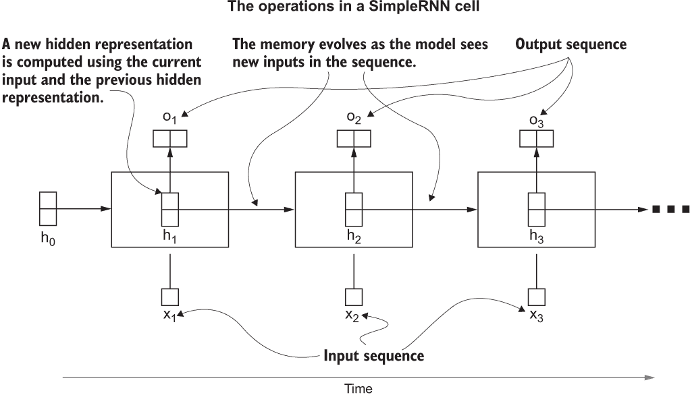

图 4.20 SimpleRNN 单元的功能。该单元在每个时间步长产生一个内存，从一个输入到另一个输入。下一步会消耗当前输入以及上一个时间步长的内存。

在 RNN 中发生的计算比在 FCN 中更复杂。RNN 按给定顺序（即 x1、x2、x3）从一个输入到另一个输入。在每个步骤中，递归层产生一个输出（即 o1、o2、o3），并将隐藏计算（h0、h1、h2、h3）传递到下一个时间步长。在这里，第一个隐藏状态（h0）通常设为零。

在给定的时间步长上，递归层计算一个隐藏状态，就像 Dense 层一样。然而，涉及的具体计算更加复杂，超出了本书的范围。隐藏状态的大小是递归层的另一个超参数。递归层接受当前输入以及细胞计算的先前隐藏状态。更大尺寸的隐藏状态有助于保持更多内存，但增加了网络的内存需求。由于隐藏状态依赖于上一个时间步长的自身，这些网络被称为 RNNs。

使用 SimpleRNN 的算法

SimpleRNN 层模仿的计算也称为*Elman 网络*。要了解递归层中发生的具体计算，你可以阅读 J.L. Elman（1990）的论文“Finding Structure in Time”。要了解 RNN 的后续变体及其区别的更高级概述，请参阅[`mng.bz/xnJg`](http://mng.bz/xnJg)和[`mng.bz/Ay2g`](http://mng.bz/Ay2g)。

默认情况下，SimpleRNN 不会将隐藏状态暴露给开发者，并且会在时间步长之间自动传播。对于这个任务，我们只需要每个时间步长产生的最终输出，这默认情况下是该层的输出。因此，你可以简单地将 SimpleRNN 连接到 Sequential API 中的一个 Dense 层，而无需进行任何额外的工作。

你是否注意到我们没有为第一层提供 input_shape？只要你在模型拟合期间提供正确形状的数据即可。Keras 会懒惰地构建层，因此在你向模型提供数据之前，模型不需要知道输入大小。但为了避免错误，最好在模型的第一层设置 input_shape 参数。例如，在我们定义的模型中，第一层（即 SimpleRNN 层）可以更改为 layers.SimpleRNN(64, input_shape=x)，其中 x 是包含模型接受的数据形状的元组。

这个模型的另一个重要区别是它是一个回归模型，而不是分类模型。在分类模型中，有不同的类别（由输出节点表示），我们尝试将给定的输入与不同的类别（或节点）关联起来。回归模型预测一个连续的值作为输出。在我们的回归模型中，输出中没有类的概念，而是表示 CO2 浓度的实际连续值。因此，我们必须适当地选择损失函数。在这种情况下，我们将使用均方误差（MSE）作为损失。MSE 是回归问题的非常常见的损失函数。我们将使用 MSE 损失和 adam 优化器编译 rnn：

```py
rnn.compile(loss='mse', optimizer='adam')
```

让我们祈祷并训练我们的模型：

```py
x, y = generate_data(data[“Average Diff”], n_seq=13)
rnn.fit(x, y, shuffle=True, batch_size=64, epochs=25)
```

你将得到以下异常：

```py
ValueError: 
➥ Input 0 of layer sequential_1 is incompatible with the layer: 
➥ expected ndim=3, found ndim=2\. Full shape received: [None, 12]
```

看起来我们做错了什么。我们刚刚运行的那行导致了一个异常，它说给层 sequential_1（即 SimpleRNN 层）提供的数据的维度出了问题。具体来说，sequential_1 层期望一个三维输入，但却有一个二维输入。我们需要调查这里发生了什么，并解决这个问题。

问题在于 SimpleRNN（或 tf.keras 中的任何其他顺序层）只接受非常特定格式的数据。数据需要是三维的，按照以下顺序的维度：

1.  批处理维度

1.  时间维度

1.  特征维度

即使对于这些维度中的任何一个，你只有一个元素，它们也需要以大小为 1 的维度存在于数据中。让我们通过打印 x.shape 来查看 x 的维度。你将会得到 x.shape = (429, 12)。现在我们知道了问题所在。我们尝试传递一个二维数据集，但我们应该传递一个三维数据集。在这种情况下，我们需要将 x 重塑为形状为 (492, 12, 1) 的张量。让我们修改我们的 generate_data(...) 函数以反映以下清单中的这种变化。

列表 4.5 具有正确形状数据的先前 generate_data() 函数

```py
import numpy as np

def generate_data(co2_arr,n_seq):
    x, y = [],[]                              ❶
    for i in range(co2_arr.shape[0]-n_seq):   ❷
        x.append(co2_arr[i:i+n_seq-1])        ❸
        y.append(co2_arr[i+n_seq-1:i+n_seq])  ❸
    x = np.array(x).reshape(-1,n_seq-1,1)     ❹
    y = np.array(y) 
    return x,y
```

❶ 创建两个列表来保存输入序列和标量输出目标。

❷ 遍历数据中所有可能的起始点，以用作输入序列。

❸ 创建第 i 个位置的输入序列和输出目标。

❹ 将 x 从列表转换为数组，并使 x 成为 RNN 可接受的 3D 张量。

现在让我们尝试训练我们的模型：

```py
x, y = generate_data(data[“Average Diff”], n_seq=13)
rnn.fit(x, y, shuffle=True, batch_size=64, epochs=25)
```

你应该看到模型的 MSE 在下降：

```py
Train on 429 samples
Epoch 1/25
429/429 [==============================] - 1s 2ms/sample - loss: 0.4951
Epoch 2/25
429/429 [==============================] - 0s 234us/sample - loss: 0.0776
...
Epoch 24/25
429/429 [==============================] - 0s 234us/sample - loss: 0.0153
Epoch 25/25
429/429 [==============================] - 0s 234us/sample - loss: 0.0152
```

我们从大约 0.5 的损失开始，最终损失大约为 0.015。这是一个非常积极的迹象，因为它表明模型正在学习数据中存在的趋势。

### 4.3.3 使用经过训练的模型预测未来的 CO2 值

到目前为止，我们已经专注于分类任务。对于分类任务，评估模型要比回归任务容易得多。在分类任务中（假设数据集平衡），通过计算数据的总体准确性，我们可以得到一个体现模型表现的不错的代表性数字。在回归任务中，情况并不那么简单。我们无法对回归值进行准确度测量，因为预测的是实际值，而不是类别。例如，均方损失的大小取决于我们正在回归的值，这使它们难以客观解释。为了解决这个问题，我们预测未来五年的数值，并直观地检查模型的预测情况（见下一列表）。

列表 4.6 使用训练模型的未来 CO2 水平预测逻辑

```py
history = data["Average Diff"].values[-12:].reshape(1,-1,1)     ❶
true_vals = []
prev_true = data["Average"].values[-1]                          ❷
for i in range(60):                                             ❸
    p_diff = rnn.predict(history).reshape(1,-1,1)               ❹
    history = np.concatenate((history[:,1:,:],p_diff),axis=1)   ❺
    true_vals.append(prev_true+p_diff[0,0,0])                   ❻
    prev_true = true_vals[-1]                                   ❼
```

❶ 从中获取开始预测的第一个数据序列，重塑为 SimpleRNN 接受的正确形状

❷ 保存最后一个绝对 CO2 浓度值，以计算相对预测的实际值。

❸ 预测接下来的 60 个月。

❹ 使用数据序列进行预测。

❺ 修改历史记录，以包括最新的预测。

❻ 计算绝对 CO2 浓度。

❼ 更新 prev_true，以便在下一个时间步骤中计算绝对 CO2 浓度。

让我们回顾一下我们所做的事情。首先，我们从我们的训练数据中提取最后 12 个 CO2 值（从平均差值列中）来预测第一个未来的 CO2 值，并将其重塑为模型期望数据的正确形状：

```py
history = data["Average Diff"].values[-12:].reshape(1,-1,1)
```

然后，我们将预测的 CO2 值记录在 true_vals 列表中。请记住，我们的模型只预测 CO2 值相对于先前 CO2 值的相对运动。因此，在模型预测之后，为了得到绝对 CO2 值，我们需要最后一个 CO2 值。prev_true 捕获了这一信息，最初包含数据的平均列中的最后一个值：

```py
prev_true = data["Average"].values[-1]
```

现在，接下来的 60 个月（或 5 年），我们可以递归预测 CO2 值，同时使最后预测的值成为网络的下一个输入。要做到这一点，我们首先使用 Keras 提供的 predict(...)方法预测一个值。然后，我们需要确保预测也是一个三维张量（尽管它只是一个单一值）。然后我们修改 history 变量：

```py
history = np.concatenate((history[:,1:,:],p_diff),axis=1)
```

我们把历史中除了第一个值之外的所有值，并将最后预测的值附加到末尾。然后，我们通过添加 prev_true 值到 p_diff 来附加绝对预测的 CO2 值：

```py
true_vals.append(prev_true+p_diff[0,0,0])
```

最后，我们将 prev_true 更新为我们预测的最后一个绝对 CO2 值：

```py
prev_true = true_vals[-1]
```

通过递归执行这组操作，我们可以获得接下来 60 个月的预测值（保存在 true_vals 变量中）。如果我们可视化预测的值，它们应该看起来像图 4.21。

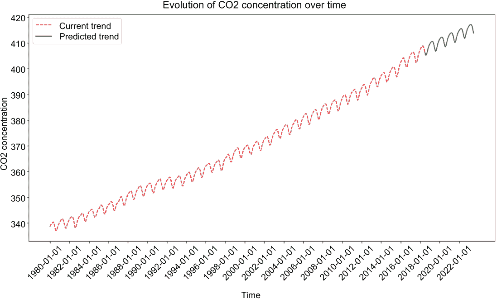

图 4.21 在接下来的五年里预测的 CO2 浓度。虚线代表当前数据的趋势，实线代表预测的趋势。

做得好！考虑到模型的简单性，预测看起来非常有前景。该模型肯定捕捉到了二氧化碳浓度的年度趋势，并学会了二氧化碳水平将继续上升。你现在可以去找你的老板，事实性地解释为什么我们应该担心未来气候变化和危险水平的二氧化碳。我们在这里结束了对不同神经网络的讨论。

练习 3

受到你在预测二氧化碳浓度方面工作的印象，你的老板给了你数据，并要求你改进模型以预测二氧化碳和温度值。保持其他超参数不变，你会如何改变模型以完成这个任务？确保指定第一层的 input_shape 参数。

## 总结

+   完全连接网络（FCNs）是最简单直接的神经网络之一。

+   FCNs 可以使用 Keras Dense 层来实现。

+   卷积神经网络（CNNs）是计算机视觉任务的热门选择。

+   TensorFlow 提供了各种层，如 Conv2D、MaxPool2D 和 Flatten，这些层帮助我们快速实现 CNNs。

+   CNNs 有一些参数，如卷积核大小、步幅和填充，必须小心设置。如果不小心，这可能导致张量形状不正确和运行时错误。

+   循环神经网络（RNNs）主要用于学习时间序列数据。

+   典型的 RNN 期望数据组织成具有批次、时间和特征维度的三维张量。

+   RNN 看的时间步数是一个重要的超参数，应该根据数据进行选择。

## 练习答案

**练习 1：** 你可以使用 Sequential API 来做到这一点，你只需要使用 Dense 层。

**练习 2**

```py
autoencoder = models.Sequential(
    [layers.Dense(32, activation='sigmoid', input_shape=(512,)),
    layers.Dense(16, activation='sigmoid'),
    layers.Dense(512, activation='sigmoid')]
)
```

**练习 3**

```py
rnn = models.Sequential([
    layers.SimpleRNN(64, input_shape=(12, 2)),
    layers.Dense(64, activation='relu'),
    layers.Dense(2)
])
```
