# 第五章：深度学习的最新技术：Transformer

本章内容包括：

+   为机器学习模型以数值形式表示文本

+   使用 Keras sub-classing API 构建 Transformer 模型

到目前为止，我们已经看到了许多不同的深度学习模型，包括全连接网络、卷积神经网络和循环神经网络。我们使用全连接网络来重建受损图像，使用卷积神经网络来对车辆进行分类，最后使用 RNN 来预测未来的 CO2 浓度值。在本章中，我们将讨论一种新型的模型，即 Transformer。

Transformer 是最新一代的深度网络。瓦斯瓦尼等人在他们的论文《Attention Is All You Need》（[`arxiv.org/pdf/1706.03762.pdf`](https://arxiv.org/pdf/1706.03762.pdf)）中普及了这个想法。他们创造了“Transformer”这个术语，并解释了它在未来有很大潜力。在随后的几年里，谷歌、OpenAI 和 Facebook 等领先的科技公司实施了更大更好的 Transformer 模型，这些模型在 NLP 领域显著优于其他模型。在这里，我们将参考瓦斯瓦尼等人在论文中介绍的模型来学习它。虽然 Transformer 也存在于其他领域（例如计算机视觉），我们将重点介绍 Transformer 在 NLP 领域中的应用，特别是在机器翻译任务中（即使用机器学习模型进行语言翻译）。本章将省略原始 Transformer 论文中的一些细节，以提高清晰度，但这些细节将在后面的章节中进行介绍。

想要在使用深度学习模型解决实际问题时出类拔萃，了解 Transformer 模型的内部工作原理是必不可少的。如前所述，Transformer 模型在机器学习领域迅速普及。这主要是因为它在解决复杂机器学习问题方面展现出的性能。

## 5.1 将文本表示为数字

假设你正在参加一个游戏节目。游戏中的一个挑战叫做单词盒子。有一个由透明盒子组成的矩阵（3 行，5 列，10 深度）。你也有一些上面涂有 0 或 1 的球。你被给予了三个句子，你的任务是用 1 和 0 填充所有的盒子来表示这些句子。此外，你可以在一分钟内写一条简短的信息，帮助其他人在以后破译这一信息。之后，另一个队员看着盒子，写下最初给你的原始句子中的尽可能多的单词。

这个挑战本质上是如何将文本转换成数字，用于机器翻译模型。这也是在了解任何 NLP 模型之前需要解决的重要问题。到目前为止我们看到的数据都是数值型数据结构。例如，一张图像可以被表示为一个 3D 数组（高度，宽度和通道维度），其中每个值表示像素强度（即，取值范围在 0 至 255 之间）。但文本呢？我们怎么让计算机理解字符、单词或句子呢？我们将在自然语言处理（NLP）的情境中学习如何用 Transformer 完成这一点。

您有以下一组句子：

+   我去了海滩。

+   天气很冷。

+   我回到了房子。

你要做的第一件事是给词汇表中的每个单词分配一个从 1 开始的 ID。我们将保留数字 0 给我们稍后会看到的特殊标记。假设你分配了以下 ID：

+   I → 1

+   went → 2

+   to → 3

+   the → 4

+   beach → 5

+   它 → 6

+   was → 7

+   cold → 8

+   came → 9

+   back → 10

+   house → 11

将单词映射到相应的 ID 后，我们的句子变为了下面这个样子：

+   [1, 2, 3, 4, 5]

+   [6, 7, 8]

+   [1, 9, 10, 3, 4, 11]

请记住，您需要填写所有方框，并且最多长度为 5。请注意我们的最后一句有六个单词。这意味着所有句子都需要表示为固定长度。深度学习模型面临类似的问题。它们以批处理的方式处理数据，并且为了高效处理数据，批处理的序列长度需要是固定的。真实世界的句子在长度上可能差异很大。因此，我们需要

+   用特殊标记<PAD>（ID 为 0）填充短句

+   截断长句

使它们具有相同的长度。如果我们填充短句并截断长句，使长度为 5，我们得到以下结果：

+   [1, 2, 3, 4, 5]

+   [6, 7, 8, 0, 0]

+   [1, 9, 10, 3, 4]

这里，我们有一个大小为 3×5 的 2D 矩阵，它表示我们的一批句子。最后要做的一件事是将这些 ID 表示为向量。因为我们的球有 1 和 0，你可以用 11 个球（我们有 10 个不同的单词和特殊标记<PAD>）代表每个单词，其中由单词 ID 指示的位置上的球为 1，其余为 0。这种方法称为 one-hot 编码。例如，

以下分别代表着各自的 ID：

1 → [0, 1, 0, 0, 0, 0, 0, 0, 0, 0, 0]

。 。 。

10 → [0, 0, 0, 0, 0, 0, 0, 0, 0, 1, 0]

11 → [0, 0, 0, 0, 0, 0, 0, 0, 0, 0, 1]

现在你可以用 1 和 0 填写方框，使得你得到类似图 5.1 的结果。这样，任何一位有这些 ID 映射的人（提供在一张纸上）都可以解密最初所提供的大部分单词（除了被截断的单词）。

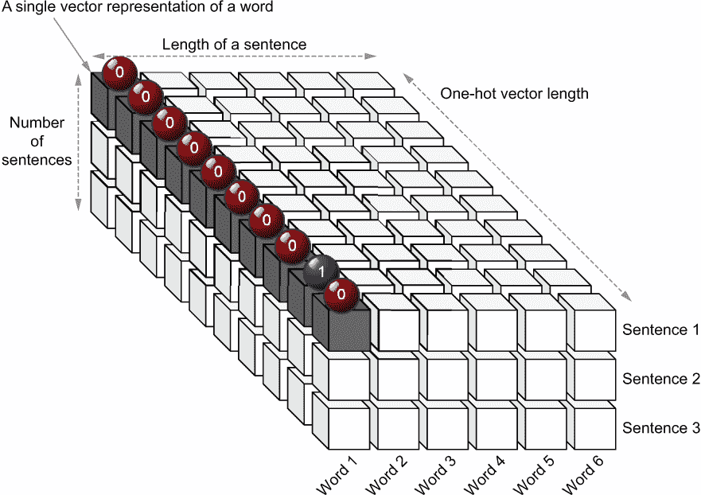

图 5.1 词盒游戏中的方框。阴影方框代表一个词（即第一个句子中的第一个词“I”，它的 ID 是 1）。你可以看到它被一个 1 和九个 0 所表示。

同样，这是在 NLP 问题中对单词进行的转换。你可能会问：“为什么不直接提供单词 ID？”存在两个问题：

+   神经网络看到的值范围非常大（0-100,000+）对于一个现实世界的问题。这会导致不稳定性并使训练困难。

+   输入 ID 会错误地表明具有相似 ID 的单词应该是相似的（例如，单词 ID 4 和 5）。这从未发生过，会使模型混淆并导致性能下降。

因此，将单词转换为某种向量表示是很重要的。有许多将单词转换为向量的方法，例如独热编码和词嵌入。你已经看到了独热编码的工作原理，我们将稍后详细讨论词嵌入。当我们将单词表示为向量时，我们的 2D 矩阵变为 3D 矩阵。例如，如果我们将向量长度设置为 4，你将得到一个 3 × 6 × 4 的 3D 张量。图 5.2 描述了最终矩阵的外观。

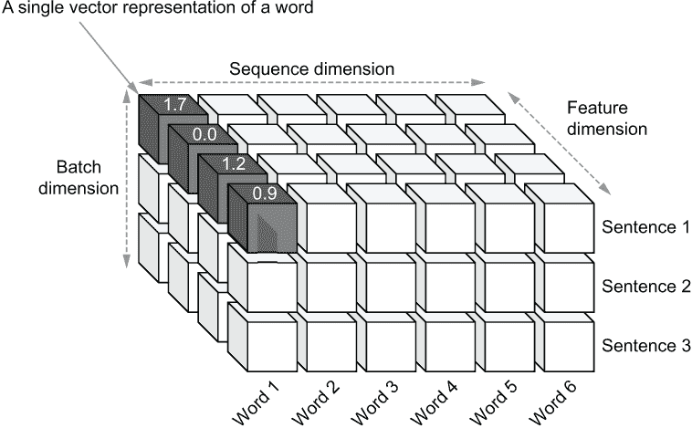

图 5.2 表示一个单词序列批次的 3D 矩阵，其中每个单词由一个向量表示（即矩阵中的阴影块）。有三个维度：批次、序列（时间）和特征。

接下来，我们将讨论流行的 Transformer 模型的各个组成部分，这将为我们提供对这些模型内部执行的基础。

## 5.2 理解 Transformer 模型

你目前是一名深度学习研究科学家，并最近受邀在当地 TensorFlow 大会上进行有关 Transformer 的研讨会。Transformer 是一类新型的深度学习模型，在众多任务中已经超越了它们的老对手。你计划首先解释 Transformer 网络的架构，然后带领参与者完成几个练习，在这些练习中，他们将使用 Keras 的子类化层实现在 Transformers 中找到的基本计算，最后使用这些计算来实现一个基本的小规模 Transformer。

### 5.2.1 Transformer 的编码器-解码器视图

Transformer 网络基于编码器-解码器架构。编码器-解码器模式在某些类型的深度学习任务中很常见（例如，机器翻译、问答、无监督图像重建）。其思想是编码器将输入映射到某种潜在（或隐藏）表示（通常较小），而解码器使用潜在表示构建有意义的输出。例如，在机器翻译中，语言 A 的句子被映射到一个潜在向量，解码器从中构建语言 B 中该句子的翻译。你可以将编码器和解码器视为两个独立的机器学习模型，其中解码器依赖于编码器的输出。这个过程如图 5.3 所示。在给定的时间点，编码器和解码器同时处理一批词序列（例如，一批句子）。由于机器学习模型不理解文本，因此该批次中的每个单词都由一个数字向量表示。这是通过一种过程来实现的，例如独热编码，类似于我们在第 5.1 节中讨论的内容。

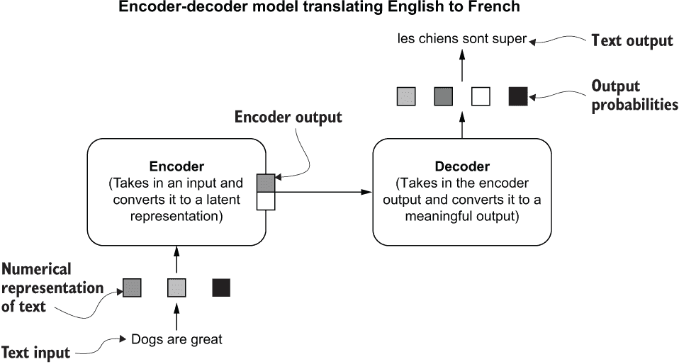

图 5.3 机器翻译任务的编码器-解码器架构

编码器-解码器模式在现实生活中也很常见。假设你是法国的导游，带着一群游客去一家餐厅。服务员用法语解释菜单，你需要为团队将其翻译成英语。想象一下你会如何做。当服务员用法语解释菜肴时，你处理这些词语并创建出菜肴的心理图像，然后将该心理图像翻译成一系列英语词语。

现在让我们更深入地了解各个组件及其构成。

### 5.2.2 更深入地探讨

自然地，你可能会问自己：“编码器和解码器由什么组成？”这是本节的主题。请注意，此处讨论的编码器和解码器与你在第三章中看到的自编码器模型有很大不同。正如之前所述，编码器和解码器分别像多层深度神经网络一样工作。它们由多个层组成，每个层包含子层，封装了对输入进行的某些计算以产生输出。前一层的输出作为下一层的输入。还需要注意的是，编码器和解码器的输入和输出是序列，例如句子。这些模型中的每个层都接收一个元素序列并输出另一个元素序列。那么，编码器和解码器中的单个层包含什么？

每个编码器层包含两个子层：

+   自注意力层

+   全连接层

自注意力层的最终输出与全连接层类似（即使用矩阵乘法和激活函数）。典型的全连接层将处理输入序列中的所有元素，并分别处理它们，然后输出一个元素以替换每个输入元素。但自注意力层可以选择和组合输入序列中的不同元素以输出给定元素。这使得自注意力层比典型的全连接层更加强大（见图 5.4）。

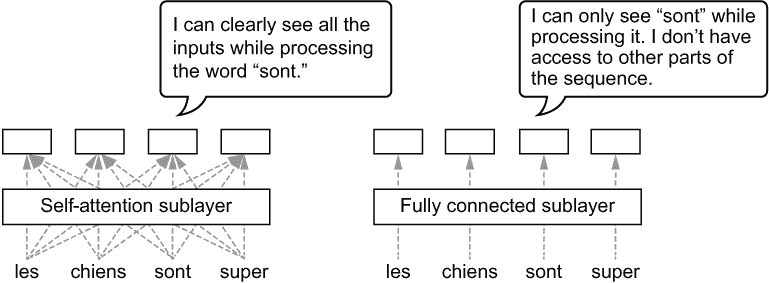

图 5.4 自注意力子层和全连接子层之间的区别。自注意力子层查看序列中的所有输入，而全连接子层只查看正在处理的输入。

为什么以这种方式选择和组合不同的输入元素有好处？在自然语言处理的上下文中，自注意力层使模型在处理某个单词时能够查看其他单词。但这对模型意味着什么？这意味着在编码器处理句子“I kicked the *ball* and *it* disappeared”中的单词“it”时，模型可以关注单词“ball”。通过同时看到“ball”和“it”两个单词（学习依赖关系），消除歧义的单词变得更容易。这样的能力对语言理解至关重要。

我们可以通过一个现实世界的例子了解自注意力如何方便地帮助我们解决任务。假设你正在和两个人玩游戏：A 和 B。A 手持写有问题的板子，你需要说出答案。假设 A 一次只透露一个单词，直到问题的最后一个单词被揭示，才揭示你正在回答问题。对于长而复杂的问题，这是具有挑战性的，因为你不能物理上看到完整的问题，必须严重依赖记忆来回答问题。这就是没有自注意力时的感觉。另一方面，假设 B 将整个问题一次性展示在板上，而不是逐字逐句地展示。现在回答问题要容易得多，因为你可以一次看到整个问题。如果问题很复杂，需要复杂的答案，你可以在提供完整答案的各个部分时查看问题的不同部分。这就是自注意力层的作用。

接下来，全连接层以逐元素的方式接受自注意力子层产生的输出元素，并为每个输出元素生成一个隐藏表示。这使得模型更加深入，从而表现更好。

让我们更详细地看一下数据如何通过模型流动，以更好地理解层和子层的组织。假设要将句子“Dogs are great”（英语）翻译成“*Les chiens sont super*”（法语）。首先，编码器接收完整的句子“Dogs are great”，并为句子中的每个单词生成一个输出。自注意力层选择每个位置的最重要的单词，计算一个输出，并将该信息发送到全连接层以产生更深层的表示。解码器迭代地生成输出单词，一个接着一个。为此，解码器查看编码器的最终输出序列以及解码器预测的所有先前单词。假设最终预测是 <SOS> *les chiens sont super* <EOS>。这里，<SOS> 标记了句子的开始，<EOS> 标记了句子的结束。它接收的第一个输入是一个特殊标记，表示句子的开始（<SOS>），以及编码器的输出，并产生翻译中的下一个单词：“*les*”。然后解码器消耗 <SOS> 和 “*les*” 作为输入，生成单词“*chiens*”，并继续直到模型达到翻译的末尾（由 <EOS> 标记）。图 5.5 描述了这个过程。

在原始的 Transformer 论文中，编码器有六个层，并且一个单层有一个自注意力子层和一个全连接子层，按顺序排列。首先，自注意力层将英文单词作为时间序列输入。然而，在将这些单词馈送到编码器之前，您需要为每个单词创建一个数值表示，如前面所讨论的。在论文中，词嵌入（附加一些编码）用于表示这些单词。每个嵌入都是一个 512 长的向量。然后自注意力层计算输入句子中每个单词的隐藏表示。如果我们忽略一些实现细节，这个时间步长 *t* 的隐藏表示可以被看作是所有输入的加权和（在一个单一序列中），其中输入位置 *i* 的权重由在处理编码器输入中的单词 *ew*[t] 时选择（或关注）编码器单词 *ew*[i] 在输入序列中的重要性来确定。编码器在输入序列中的每个位置 *t* 上都做出这样的决定。例如，在处理句子“我踢了 *球* 并且 *它* 消失了”中的单词“它”时，编码器需要更多地关注单词“球”而不是单词“the”。自注意力子层中的权重被训练以展示这样的属性。这样，自注意力层为每个编码器输入生成了一个隐藏表示。我们称之为 *关注表示/输出*。

全连接子层然后接管并且非常直观。它有两个线性层，并且在这两个层之间有一个 ReLU 激活函数。它接收自注意力层的输出，并将其转换为隐藏输出使用。

*h*[1] = *ReLU*(*xW*[1] + *b*[1])

*h*[2] = *h*[1]*W*[2] + *b*[2]

请注意，第二层没有非线性激活函数。接下来，解码器也有六个层，每个层都有三个子层：

+   一个掩码自注意力层

+   一个编码器-解码器注意力层

+   一个全连接层

掩码自注意力层的操作方式与自注意力层类似。然而，在处理第 *s* 个单词（即*dw*[s]）时，它会屏蔽 *dw*[s] 之前的单词。例如，在处理单词“*chiens*”时，它只能关注单词“<sos>”和“*les*”。这很重要，因为解码器必须能够预测正确的单词，只给出它先前预测的单词，所以强制解码器只关注它已经看到的单词是有意义的。

接下来，编码器-解码器注意力层获取编码器输出和掩码自注意力层产生的输出，并产生一系列输出。该层的目的是计算时间 *s* 处的隐藏表示（即一个受关注的表示），作为编码器输入的加权和，其中位置 *j* 的权重由处理解码器单词 *dw*[s] 时关注编码器输入 *e w*[j]的重要性确定。

最后，与编码器层相同的全连接层接收自注意力层的输出以生成层的最终输出。图 5.5 以高层次描述了本节讨论的层和操作。

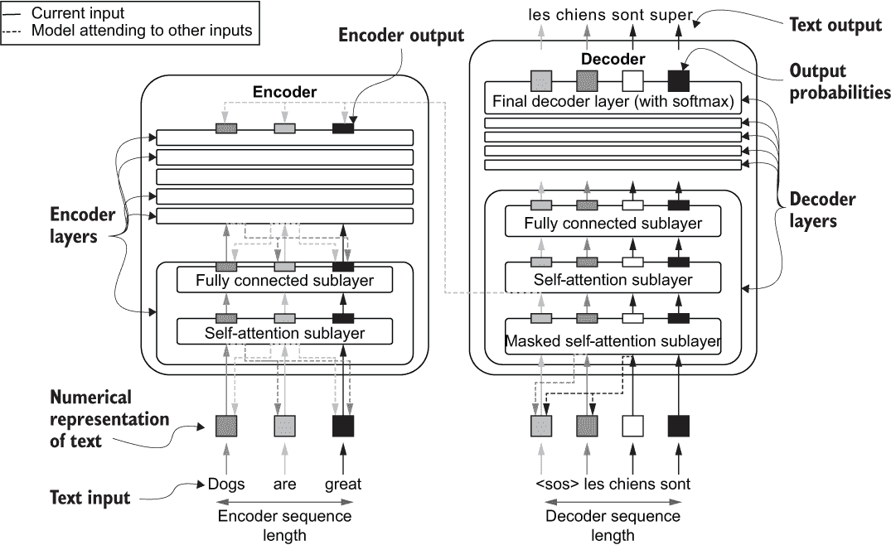

图 5.5 编码器和解码器中的各个层以及编码器内部、解码器内部和编码器与解码器之间形成的各种连接。方框表示模型的输入和输出。长方形阴影框表示子层的临时输出。

在下一节中，我们将讨论自注意力层的外观。

### 5.2.3 自注意力层

我们已经在抽象级别上介绍了自注意力层的目的。在处理时间步 *t* 的单词*w*[t]时，其目的是确定关注输入序列中的第 *i* 个单词（即*w*[i]）对理解当前单词有多重要。换句话说，该层需要确定对于每个单词（由 *t* 索引）所有其他单词（由 *i* 索引）的重要性。现在让我们以更细粒度的方式理解涉及此过程的计算。

首先，计算涉及三个不同的实体：

+   *查询* — 查询的目的是表示当前正在处理的单词。

+   *键* — 键的目的是表示在处理当前单词时要关注的候选单词。

+   *值* — 值的目的是计算序列中所有单词的加权和，其中每个单词的权重基于它对理解当前单词的重要性。

对于给定的输入序列，需要为输入的每个位置计算查询、键和值。这些是由与每个实体相关联的权重矩阵计算的。

请注意，这是它们关系的简化，实际关系有些复杂和混乱。但这种理解为什么我们需要三个不同的实体来计算自注意力输出提供了动机。

接下来，我们将了解自注意力层如何从输入序列到查询、键和值张量，最终到输出序列。首先，将输入的单词序列使用单词嵌入查找转换为数值表示。单词嵌入本质上是一个巨大的矩阵，其中词汇表中的每个单词都有一个浮点向量（即嵌入向量）。通常，这些嵌入是几百个元素长。对于给定的输入序列，我们假设输入序列的长度为 *n* 元素，并且每个单词向量的长度为 *d*[model] 元素。然后我们有一个 *n* × *d*[model] 矩阵。在原始 Transformer 论文中，单词向量长度为 512 个元素。

自注意力层中有三个权重矩阵：查询权重（*W*[q]）、键权重（*W*[k]）和值权重（*W*[v]），分别用于计算查询、键和值向量。*W*[q] 是 *d*[model] × *d*[q]，*W*[k] 是 *d*[model] × *d*[k]，*W*[v] 是 *d*[model] × *d*[v]。让我们假设这些元素在 TensorFlow 中的维度为 512，就像原始 Transformer 论文中一样。即，

*d*[model] = *d*[q] = *d*[k] = *d*[v] = 512

我们首先将我们的输入 x 定义为一个 tf.constant，它有三个维度（批量、时间、特征）。Wq、Wk 和 Wv 声明为 tf.Variable 对象，因为这些是自注意力层的参数。

```py
import tensorflow as tf
import numpy as np

n_seq = 7
x = tf.constant(np.random.normal(size=(1,n_seq,512)))
Wq = tf.Variable(np.random.normal(size=(512,512)))
Wk = tf.Variable (np.random.normal(size=(512,512)))
Wv = tf.Variable (np.random.normal(size=(512,512)))
```

其形状为

```py
>>> x.shape=(1, 7, 512)
>>> Wq.shape=(1, 512)
>>> Wk.shape=(1, 512)
>>> Wv.shape=(1, 512)
```

接下来，*q*、*k* 和 *v* 计算如下：

*q* = *xW*[q]；形状变换：*n* × *d*[model]。*d*[model] × *d*[q] = *n × d*[q]

*k* = *xW*[k]；形状变换：*n* × *d*[model]。*d*[model] × *d*[k] = *n × d*[k]

*v* = *xW*[v]；形状变换：*n* × *d*[model]。*d*[model] × *d*[v] = *n × d*[v]

很明显，计算 *q*、*k* 和 *v* 只是一个简单的矩阵乘法。请记住，所有输入（即 x）和输出张量（即 q、k 和 v）前面都有一个批处理维度，因为我们处理数据批次。但为了避免混乱，我们将忽略批处理维度。然后我们按以下方式计算自注意力层的最终输出：

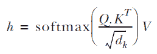

在这里，组件 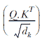（将被称为 *P*）是一个概率矩阵。这就是自注意力层的全部内容。使用 TensorFlow 实现自注意力非常简单。作为优秀的数据科学家，让我们将其创建为可重复使用的 Keras 层，如下所示。

列表 5.1 自注意力子层

```py
import tensorflow as tf
import tensorflow.keras.layers as layers

class SelfAttentionLayer(layers.Layer):

    def __init__(self, d):
        super(SelfAttentionLayer, self).__init__()
        self.d = d                                                                ❶

    def build(self, input_shape):
        self.Wq = self.add_weight(                                                ❷
            shape=(input_shape[-1], self.d), initializer='glorot_uniform',        ❷
            trainable=True, dtype='float32'                                       ❷
        )        
        self.Wk = self.add_weight(                                                ❷
            shape=(input_shape[-1], self.d), initializer='glorot_uniform',        ❷
            trainable=True, dtype='float32'                                       ❷
        )
        self.Wv = self.add_weight(                                                ❷
            shape=(input_shape[-1], self.d), initializer='glorot_uniform',        ❷
            trainable=True, dtype='float32'                                       ❷
        )

    def call(self, q_x, k_x, v_x):
        q = tf.matmul(q_x,self.Wq)                                                ❸
        k = tf.matmul(k_x,self.Wk)                                                ❸
        v = tf.matmul(v_x,self.Wv)                                                ❸

        p = tf.nn.softmax(tf.matmul(q, k, transpose_b=True)/math.sqrt(self.d))    ❹
        h = tf.matmul(p, v)                                                       ❺
        return h,p
```

❶ 定义自注意力输出的输出维度

❷ 定义计算查询、键和值实体的变量

❸ 计算查询、键和值张量

❹ 计算概率矩阵

❺ 计算最终输出

这是一个快速的复习：

+   __init__(self, d)—定义层的任何超参数

+   build(self, input_shape)—创建层的参数作为变量

+   call(self, v_x, k_x, q_x)—定义层中发生的计算

如果你看一下 call(self, v_x, k_x, q_x) 函数，它接受三个输入：分别用于计算值、键和查询。在大多数情况下，这些输入是相同的。然而，也有一些情况下，不同的输入被用于这些计算（例如，解码器中的一些计算）。此外，请注意我们同时返回 h（即最终输出）和 p（即概率矩阵）。概率矩阵是一个重要的视觉辅助工具，它帮助我们理解模型何时以及在哪里关注了单词。如果你想获取层的输出，可以执行以下操作

```py
layer = SelfAttentionLayer(512)
h, p = layer(x, x, x)
print(h.shape)
```

将返回

```py
>>> (1, 7, 512)
```

练习 1

给定以下输入

```py
x = tf.constant(np.random.normal(size=(1,10,256)))
```

并假设我们需要一个大小为 512 的输出，编写代码创建 Wq、Wk 和 Wv 作为 tf.Variable 对象。使用 np.random.normal() 函数设置初始值。

### 5.2.4 使用标量理解自注意力

目前还不太清楚为什么设计了这样的计算方式。为了理解和可视化这个层正在做什么，我们将假设特征维度为 1\. 也就是说，一个单词由一个值（即标量）表示。图 5.6 可视化了如果我们假设单一输入序列和输入的维度（*d*[model]）、查询长度（*d*[q]）、键长度（*d*[k]）和值长度（*d*[v]）的维度都为 1\. 在我们所做的假设下，*W*[q]、*W*[k] 和 *W*[v] 将是标量。用于计算 *q*、*k* 和 *v* 的矩阵乘法本质上变成了标量乘法：

*q* = (*q*[1], *q*[2],..., *q*[7])，其中 *q*[i] = *x*[i] *W*[q]

*k* = (*k*[1], *k*[2],..., *k*[7])，其中 *k*[i] = *x*[i] *W*[k]

*v* = (*v*[1], *v*[2],..., *v*[7])，其中 *v*[i] = *x*[i] *W*[v]

接下来，我们需要计算 *P* = softmax ((*Q.K*^T) / √(*d*[k])) 组件。*Q.K*^T 本质上是一个 *n* × *n* 的矩阵，它代表了每个查询和键组合的项（图 5.6）。*Q.K*[(i,j)]^T 的第 *i* 行和第 *j* 列是按如下计算的

*Q.K*[(i,j)]^T =*q* [i] × *k* [j]

然后，通过应用 softmax 函数，该矩阵被转换为行向量的概率分布。你可能已经注意到 softmax 转换中出现了一个常数 √(*d*[k])。这是一个归一化常数，有助于防止梯度值过大并实现稳定的梯度。在我们的示例中，你可以忽略这个因为 √(*d*[k]) = 1。

最后，我们计算最终输出 *h* = (*h*[1],*h*[2],...,*h*[7])，其中

*h*[i] = *P*[(i],[1)] *v*[1] + *P*[(i],[2)] *v*[2] +...+ *P*[(i],[7)] *v*[7]

在这里，我们可以更清楚地看到 *q*、*k* 和 *v* 之间的关系。当计算最终输出时，*q* 和 *k* 被用于计算 *v* 的软索引机制。例如，当计算第四个输出（即 *h*[4]）时，我们首先对第四行进行硬索引（跟随 *q*[4]），然后根据该行的列（即 *k* 值）给出的软索引（即概率），混合各种 *v* 值。现在更清楚 *q*、*k* 和 *v* 的作用是什么了：

+   *查询*—帮助构建最终用于索引值（v）的概率矩阵。查询影响矩阵的行，并表示正在处理的当前单词的索引。

+   *键*—帮助构建最终用于索引值（v）的概率矩阵。键影响矩阵的列，并表示根据查询单词需要混合的候选单词。

+   *值*—通过使用查询和键创建的概率矩阵进行索引，用于计算最终输出的隐藏（即关注）表示。

您可以轻松地将图 5.6 中的大灰色框放置在自注意子层上，并仍然产生输出形状（如图 5.5 中所示）（图 5.7）。

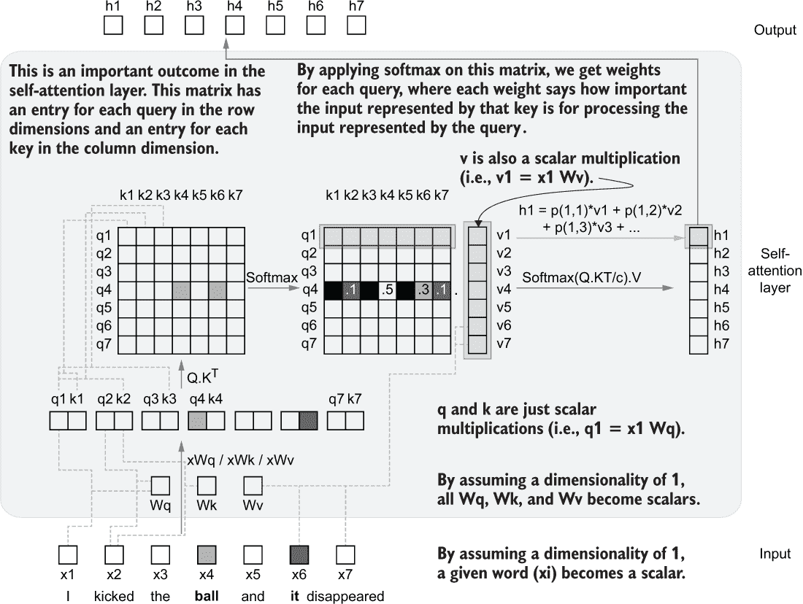

图 5.6 自注意层中的计算。自注意层从输入序列开始，并计算查询、键和值向量的序列。然后将查询和键转换为概率矩阵，该矩阵用于计算值的加权和。

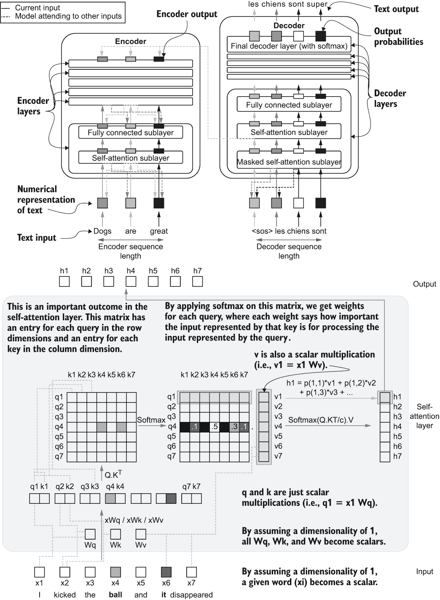

图 5.7（顶部）和图 5.6（底部）。您可以从底部获取灰色框，并将其插入到顶部的自注意子层中，然后可以看到产生相同的输出序列。

现在让我们扩展我们的自注意层，并重新审视其背后的具体计算及其重要性。回到我们先前的表示法，我们从一个具有 *n* 个元素的单词序列开始。然后，在嵌入查找之后，为每个单词检索一个嵌入向量，我们有一个大小为 *n* × *d*[model] 的矩阵。接下来，我们有权重和偏差来计算每个查询、键和值向量：

*q* = *xW*[q]，其中 *x* ∈ ℝ^(n×dmodel)。*W*[q] ∈ ℝ^(dmodel×*dq*)，而 *q* ∈ ℝ^(n×d)*q*

*k* = *xW*[k]，其中 *x* ∈ ℝ^(n×dmodel)。*W*[k] ∈ ℝ^(dmodel×*dk*)，而 *k* ∈ ℝ^(n×d)*k*

*v* = *xW*[v]，其中 *x* ∈ ℝ^(n×dmodel)。*W*[v] ∈ ℝ^(dmodel×*dv*)，而 *v* ∈ ℝ^(n×d)*v*

例如，查询，或 *q*，是一个大小为 n × *d*[q] 的向量，通过将大小为 *n* × *d*[model] 的输入 *x* 与大小为 *d*[model] × *d*[q] 的权重矩阵 *W*[q] 相乘获得。还要记住，正如在原始 Transformer 论文中一样，我们确保查询、键和值向量的所有输入嵌入大小相同。换句话说，

*d*[model] = *d*[q] = *d*[k] = *d*[v] = 512

接下来，我们使用我们获得的 q 和 k 值计算概率矩阵：

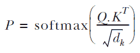

最后，我们将这个概率矩阵与我们的值矩阵相乘，以获得自注意力层的最终输出：

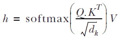

自注意力层接受一批词序列（例如，一批具有固定长度的句子），其中每个词由一个向量表示，并产生一批隐藏输出序列，其中每个隐藏输出是一个向量。

自注意力与循环神经网络（RNNs）相比如何？

在 Transformer 模型出现之前，RNNs 主导了自然语言处理的领域。RNNs 在 NLP 问题中很受欢迎，因为大多数问题本质上都是时间序列问题。你可以将句子/短语视为一系列单词（即每个单词由一个特征向量表示）在时间上的分布。RNN 通过这个序列，一次消耗一个单词（同时保持一个记忆/状态向量），并在最后产生一些输出（或一系列输出）。但是你会发现，随着序列长度的增加，RNN 的表现越来越差。这是因为当 RNN 到达序列末尾时，它可能已经忘记了开始时看到的内容。

你可以看到，自注意力机制缓解了这个问题，它允许模型在给定时间内查看完整的序列。这使得 Transformer 模型比基于 RNN 的模型表现得好得多。

### 5.2.5 自注意力作为烹饪比赛

自注意力的概念可能仍然有点难以捉摸，这使得理解自注意力子层中究竟发生了什么变得困难。以下类比可能会减轻负担并使其更容易理解。假设你参加了一个与其他六位选手（总共七位选手）一起的烹饪节目。游戏如下。

你在超市里拿到一件印有号码（从 1 到 7）的 T 恤和一个手推车。超市有七个过道。你必须飞奔到印有 T 恤上号码的过道，墙上会贴着某种饮料的名称（例如，苹果汁，橙汁，酸橙汁）。你需要挑选制作该饮料所需的物品，然后飞奔到你分配的桌子上，制作那种饮料。

假设你是号码 4 并且拿到了橙汁，所以你会前往 4 号过道并收集橙子，一点盐，一颗酸橙，糖等等。现在假设你旁边的对手（编号 3）要制作酸橙汁；他们会挑选酸橙，糖和盐。正如你所看到的，你们选取了不同的物品以及相同物品的不同数量。例如，你的对手没有选择橙子，但你选择了，并且你可能选择了较少的酸橙，与你正在制作酸橙汁的对手相比。

这与自注意力层中发生的情况非常相似。你和你的竞争对手是模型的输入（在一个时间步上）。通道是查询，你需要选择的货品是键。就像通过查询和键来索引概率矩阵以获得“混合系数”（即注意力权重）来获取值一样，你可以通过分配给你的通道号（即查询）和通道中每个货品的数量（即键）来索引你所需要的货品。最后，你制作的饮料就是值。请注意，这个类比并不完全对应于自注意力子层中的计算。然而，你可以在抽象层面上发现这两个过程之间的显著相似之处。我们发现的相似之处如图 5.8 所示。

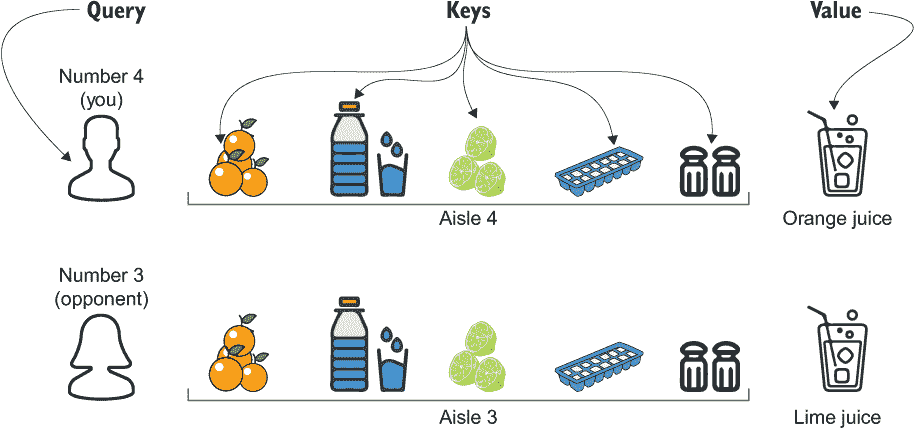

图 5.8 以烹饪比赛为背景描述的自注意力。选手是查询，货品是你需要选择的食材，值是你制作的最终饮料。

接下来我们将讨论什么是蒙版自注意力层。

### 5.2.6 蒙版自注意力层

正如你已经看到的，解码器有一个特殊的额外的自注意子层，称为*蒙版自注意力*。正如我们已经提到的，这个想法是防止模型通过关注不应关注的单词（也就是模型预测位置之前的单词）来“作弊”。为了更好地理解这一点，假设有两个人在教一个学生从英语翻译成法语。第一个人给出一个英语句子，要求学生逐词翻译，同时给出到目前为止已经翻译的反馈。第二个人给出一个英语句子，要求学生翻译，但提前提供完整的翻译。在第二种情况下，学生很容易作弊，提供高质量的翻译，虽然对语言几乎一无所知。现在让我们从机器学习的角度来理解关注不应关注的单词的潜在危险。

假设我们要将句子 “dogs are great” 翻译为 “*les chiens sont super*。” 当处理句子 “Dogs are great” 时，模型应该能够关注该句子中的任何单词，因为这是模型在任何给定时间完全可用的输入。但是，在处理句子 “*Les chiens sont super*” 时，我们需要注意向模型展示什么和不展示什么。例如，在训练模型时，我们通常一次性提供完整的输出序列，而不是逐字节地提供单词，以增强计算效率。在向解码器提供完整输出序列时，我们必须屏蔽当前正在处理的单词之前的所有单词，因为让模型在看到该单词之后的所有内容后预测单词 “*chiens*” 是不公平的。这是必须做的。如果不这样做，代码会正常运行。但最终，当你将其带到现实世界时，性能会非常差。强制执行这一点的方法是将概率矩阵 p 设为下三角矩阵。这将在注意力/输出计算期间基本上为混合输入的任何内容赋予零概率。标准自注意力和蒙版自注意力之间的差异如图 5.9 所示。

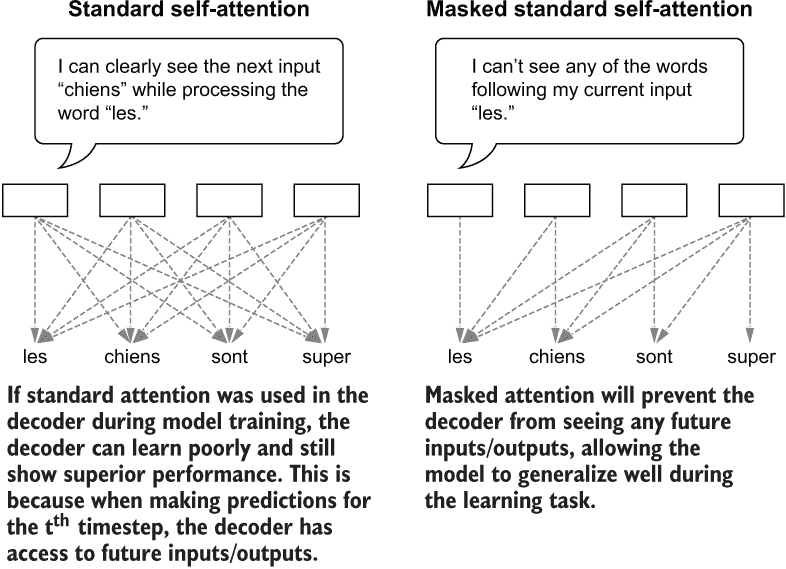

图 5.9 标准自注意力与蒙版自注意力方法。在标准注意力方法中，给定步骤可以看到来自当前时间步之前或之后的任何其他时间步的输入。然而，在蒙版自注意力方法中，当前时间步只能看到当前输入和之前的时间步。

让我们学习如何在 TensorFlow 中实现这一点。我们对 call() 函数进行了非常简单的更改，引入了一个新参数 mask，该参数表示模型不应该看到的项目，用 1 表示，其余项目用 0 表示。然后，对于模型不应该看到的元素，我们添加一个非常大的负数（即 - 10⁹），以便在应用 softmax 时它们变成零（见清单 5.2）。

清单 5.2 蒙版自注意力子层

```py
import tensorflow as tf

class SelfAttentionLayer(layers.Layer):

    def __init__(self, d):
        ...

    def build(self, input_shape):
        ...

    def call(self, q_x, k_x, v_x, mask=None):   ❶
        q = tf.matmul(x,self.Wq)
        k = tf.matmul(x,self.Wk)
        v = tf.matmul(x,self.Wv)

        p = tf.matmul(q, k, transpose_b=True)/math.sqrt(self.d)
        p = tf.squeeze(p)
        if mask is None:
            p = tf.nn.softmax(p)                ❷
        else:
            p += mask * -1e9                    ❸
            p = tf.nn.softmax(p)                ❸

        h = tf.matmul(p, v)
        return h,p
```

❶ call 函数接受额外的蒙版参数（即 0 和 1 的矩阵）。

❷ 现在，SelfAttentionLayer 支持蒙版和非蒙版输入。

❸ 如果提供了蒙版，添加一个大的负值以使最终概率为零，以防止看到的单词。

创建蒙版很容易；您可以使用 tf.linalg.band_part() 函数创建三角矩阵

```py
mask = 1 - tf.linalg.band_part(tf.ones((7, 7)), -1, 0)
```

给出

```py
>>> tf.Tensor(
    [[0\. 1\. 1\. 1\. 1\. 1\. 1.]
     [0\. 0\. 1\. 1\. 1\. 1\. 1.]
     [0\. 0\. 0\. 1\. 1\. 1\. 1.]
     [0\. 0\. 0\. 0\. 1\. 1\. 1.]
     [0\. 0\. 0\. 0\. 0\. 1\. 1.]
     [0\. 0\. 0\. 0\. 0\. 0\. 1.]
     [0\. 0\. 0\. 0\. 0\. 0\. 0.]], shape=(7, 7), dtype=float32)
```

我们可以通过查看概率矩阵 p 来轻松验证屏蔽是否起作用。它必须是一个下三角矩阵

```py
layer = SelfAttentionLayer(512)
h, p = layer(x, x, x, mask)
print(p.numpy())
```

给出

```py
>>> [[1\.    0\.    0\.    0\.    0\.    0\.    0\.   ]
     [0.37  0.63  0\.    0\.    0\.    0\.    0\.   ]
     [0.051 0.764 0.185 0\.    0\.    0\.    0\.   ]
     [0.138 0.263 0.072 0.526 0\.    0\.    0\.   ]
     [0.298 0.099 0.201 0.11  0.293 0\.    0\.   ]
     [0.18  0.344 0.087 0.25  0.029 0.108 0\.   ]
     [0.044 0.044 0.125 0.284 0.351 0.106 0.045]]
```

现在，在计算值时，模型无法看到或关注到它在处理当前单词时尚未看到的单词。

### 5.2.7 多头注意力

原始 Transformer 论文中讨论了一种称为多头注意力的方法，它是自注意力层的扩展。一旦理解了自注意机制，这个想法就很简单。多头注意力创建多个并行的自注意力头。这样做的动机是，当模型有机会为输入序列学习多个注意力模式（即多组权重）时，它的性能更好。

记住，在单个注意力头中，所有的查询、键和值的维度都设置为 512。换句话说，

*d*[q] = *d*[k] = *d*[v] = 512

使用多头注意力，假设我们使用八个注意力头，

*d*[q] = *d*[k] = *d*[v] = 512/8 = 64

然后将所有注意力头的最终输出连接起来，形成最终输出，它的维度将为 64 × 8 = 512

*H* = *Concat* (*h*¹, *h*², ... , *h*⁸)

其中*h*^i 是第*i*个注意力头的输出。使用刚刚实现的 SelfAttentionLayer，代码变为

```py
multi_attn_head = [SelfAttentionLayer(64) for i in range(8)]
outputs = [head(x, x, x)[0] for head in multi_attn_head]
outputs = tf.concat(outputs, axis=-1)
print(outputs.shape)
```

得到

```py
>>> (1, 7, 512)
```

如你所见，它仍然具有之前的相同形状（没有多个头）。然而，此输出是使用多个头进行计算的，这些头的维度比原始的自注意层要小。

### 5.2.8 全连接层

与我们刚刚学习的内容相比，全连接层更加简单。到目前为止，自注意力层产生了一个*n*×*d*[v]大小的输出（忽略批处理维度）。全连接层将输入数据进行以下转换

*h*[1] = *ReLU*(*xW*[1] + *b*[1])

这里，*W*[1]是一个*d*[v] × *d*[ff1]的矩阵，*b*[1]是一个*d*[ff1]大小的向量。因此，这个操作产生一个*n*×*d*[ff1]大小的张量。结果输出传递到另一层，进行以下计算

*h*[2] = *h*[1] *W*[2] + *b* [2]

这里*W*[2]是一个*d*[ff1] × *d*[ff2]大小的矩阵，*b*[2]是一个*d*[ff2]大小的向量。该操作得到一个大小为*n*×*d*[ff2]的张量。在 TensorFlow 中，我们可以将这些计算再次封装成一个可重用的 Keras 层（见下一个列表）。

列表 5.3 全连接子层

```py
import tensorflow as tf

class FCLayer(layers.Layer):
    def __init__(self, d1, d2):
        super(FCLayer, self).__init__()
        self.d1 = d1                                                       ❶
        self.d2 = d2                                                       ❷

    def build(self, input_shape):
        self.W1 = self.add_weight(                                         ❸
            shape=(input_shape[-1], self.d1), initializer='glorot_uniform',❸
            trainable=True, dtype='float32'                                ❸
        )
        self.b1 = self.add_weight(                                         ❸
            shape=(self.d1,), initializer='glorot_uniform',                ❸
            trainable=True, dtype='float32'                                ❸
        )        
        self.W2 = self.add_weight(                                         ❸
            shape=(input_shape[-1], self.d2), initializer='glorot_uniform',❸
            trainable=True, dtype='float32'                                ❸
        )
        self.b2 = self.add_weight(                                         ❸
            shape=(self.d2,), initializer='glorot_uniform',                ❸
            trainable=True, dtype='float32'                                ❸
        )  

    def call(self, x):
        ff1 = tf.nn.relu(tf.matmul(x,self.W1)+self.b1)                     ❹
        ff2 = tf.matmul(ff1,self.W2)+self.b2                               ❺
        return ff2
```

❶ 第一个全连接计算的输出维度

❷ 第二个全连接计算的输出维度

❸ 分别定义 W1、b1、W2 和 b2。我们使用 glorot_uniform 作为初始化器。

❹ 计算第一个全连接计算

❺ 计算第二个全连接计算

在这里，你可以使用 tensorflow.keras.layers.Dense()层来实现此功能。然而，我们将使用原始的 TensorFlow 操作进行练习，以熟悉低级 TensorFlow。在这个设置中，我们将改变 FCLayer，如下面的列表所示。

列表 5.4 使用 Keras Dense 层实现的全连接层

```py
import tensorflow as tf
import tensorflow.keras.layers as layers

class FCLayer(layers.Layer):

    def __init__(self, d1, d2):
        super(FCLayer, self).__init__()
        self.dense_layer_1 = layer.Dense(d1, activation='relu')  ❶
        self.dense_layer_2 = layers.Dense(d2)                    ❷

    def call(self, x):
        ff1 = self.dense_layer_1(x)                              ❸
        ff2 = self.dense_layer_2(ff1)                            ❹
        return ff2
```

❶ 在子类化层的 __init__ 函数中定义第一个全连接层

❷ 定义第二个稠密层。注意我们没有指定激活函数。

❸ 调用第一个稠密层以获取输出

❹ 使用第一个稠密层的输出调用第二个稠密层以获取最终输出

现在你知道了 Transformer 架构中进行的计算以及如何使用 TensorFlow 实现它们。但请记住，原始 Transformer 论文中解释了各种细微的细节，我们还没有讨论。这些细节大多将在后面的章节中讨论。

练习 2

假设你被要求尝试一种新型的多头注意力机制。与其将较小头的输出（大小为 64）连接起来，而是将输出（大小为 512）相加。使用 SelfAttentionLayer 编写 TensorFlow 代码以实现此效果。您可以使用 tf.math.add_n() 函数按元素对张量列表求和。

### 将所有内容放在一起 5.2.9

让我们将所有这些元素放在一起创建一个 Transformer 网络。首先让我们创建一个编码器层，其中包含一组 SelfAttentionLayer 对象（每个头一个）和一个 FCLayer（请参阅下一个列表）。

**列表 5.5 编码器层**

```py
import tensorflow as tf

class EncoderLayer(layers.Layer):

    def __init__(self, d, n_heads):
        super(EncoderLayer, self).__init__()
        self.d = d
        self.d_head = int(d/n_heads) 
        self.n_heads = n_heads
        self.attn_heads = [
            SelfAttentionLayer(self.d_head) for i in range(self.n_heads)
        ]                                           ❶
        self.fc_layer = FCLayer(2048, self.d)       ❷

    def call(self, x):
        def compute_multihead_output(x):            ❸
            outputs = [head(x, x, x)[0] for head in self.attn_heads] 
            outputs = tf.concat(outputs, axis=-1)
            return outputs

        h1 = compute_multihead_output(x)            ❹
        y = self.fc_layer(h1)                       ❺

        return y
```

❶ 创建多个注意力头。每个注意力头具有 d/n_heads 大小的特征维度。

❷ 创建完全连接的层，其中中间层有 2,048 个节点，最终子层有 d 个节点。

❸ 创建一个函数，给定一个输入来计算多头注意力输出。

❹ 使用定义的函数计算多头注意力。

❺ 获取层的最终输出。

在初始化 EncoderLayer 时，EncoderLayer 接受两个参数：d（输出的维度）和 n_heads（注意力头的数量）。然后，在调用层时，传递一个单一的输入 x。首先计算注意力头（SelfAttentionLayer）的关注输出，然后是完全连接层（FCLayer）的输出。这就包装了编码器层的关键点。接下来，我们创建一个解码器层（请参阅下一个列表）。

**列表 5.6 解码器层**

```py
import tensorflow as tf

class DecoderLayer(layers.Layer):

    def __init__(self, d, n_heads):
        super(DecoderLayer, self).__init__()
        self.d = d
        self.d_head = int(d/n_heads)
        self.dec_attn_heads = [
            SelfAttentionLayer(self.d_head) for i in range(n_heads)
        ]                                                           ❶
        self.attn_heads = [
            SelfAttentionLayer(self.d_head) for i in range(n_heads)
        ]                                                           ❷
        self.fc_layer = FCLayer(2048, self.d)                       ❸

    def call(self, de_x, en_x, mask=None):
        def compute_multihead_output(de_x, en_x, mask=None):        ❹
            outputs = [
                head(en_x, en_x, de_x, mask)[0] for head in 
➥ self.attn_heads]                                                 ❺
            outputs = tf.concat(outputs, axis=-1)
            return outputs

        h1 = compute_multihead_output(de_x, de_x, mask)             ❻
        h2 = compute_multihead_output(h1, en_x)                     ❼
        y = self.fc_layer(h2)                                       ❽
        return y
```

❶ 创建处理解码器输入的注意力头。

❷ 创建同时处理编码器输出和解码器输入的注意力头。

❸ 最终完全连接的子层

❹ 计算多头注意力的函数。此函数接受三个输入（解码器的先前输出、编码器输出和可选的掩码）。

❺ 每个头将函数的第一个参数作为查询和键，并将函数的第二个参数作为值。

❻ 计算第一个受关注的输出。这仅查看解码器输入。

❼ 计算第二个受关注的输出。这将查看先前的解码器输出和编码器输出。

❽ 通过完全连接的子层将输出计算为层的最终输出。

解码器层与编码器层相比有几个不同之处。它包含两个多头注意力层（一个被屏蔽，一个未被屏蔽）和一个全连接层。首先计算第一个多头注意力层（被屏蔽）的输出。请记住，我们会屏蔽任何超出当前已处理的解码器输入的解码器输入。我们使用解码器输入来计算第一个注意力层的输出。然而，第二层中发生的计算有点棘手。做好准备！第二个注意力层将编码器网络的最后一个被关注的输出作为查询和键；然后，为了计算值，使用第一个注意力层的输出。将这一层看作是一个混合器，它混合了被关注的编码器输出和被关注的解码器输入。

有了这个，我们可以用两个编码器层和两个解码器层创建一个简单的 Transformer 模型）。我们将使用 Keras 函数式 API（见下一个列表）。

列表 5.7 完整的 Transformer 模型

```py
import tensorflow as tf

n_steps = 25                                                              ❶
n_en_vocab = 300                                                          ❶
n_de_vocab = 400                                                          ❶
n_heads = 8                                                               ❶
d = 512                                                                   ❶
mask = 1 - tf.linalg.band_part(tf.ones((n_steps, n_steps)), -1, 0)        ❷

en_inp = layers.Input(shape=(n_steps,))                                   ❸
en_emb = layers.Embedding(n_en_vocab, 512, input_length=n_steps)(en_inp)  ❹
en_out1 = EncoderLayer(d, n_heads)(en_emb)                                ❺
en_out2 = EncoderLayer(d, n_heads)(en_out1)

de_inp = layers.Input(shape=(n_steps,))                                   ❻
de_emb = layers.Embedding(n_de_vocab, 512, input_length=n_steps)(de_inp)  ❼
de_out1 = DecoderLayer(d, n_heads)(de_emb, en_out2, mask)                 ❽
de_out2 = DecoderLayer(d, n_heads)(de_out1, en_out2, mask)
de_pred = layers.Dense(n_de_vocab, activation='softmax')(de_out2)         ❾

transformer = models.Model(
    inputs=[en_inp, de_inp], outputs=de_pred, name='MinTransformer'       ❿
)
transformer.compile(
    loss='categorical_crossentropy', optimizer='adam', metrics=['acc']
)
```

❶ Transformer 模型的超参数

❷ 用于屏蔽解码器输入的掩码

❸ 编码器的输入层。它接受一个批量的单词 ID 序列。

❹ 嵌入层将查找单词 ID 并返回该 ID 的嵌入向量。

❺ 计算第一个编码器层的输出。

❻ 解码器的输入层。它接受一个批量的单词 ID 序列。

❼ 解码器的嵌入层

❽ 计算第一个解码器层的输出。

❾ 预测正确输出序列的最终预测层

❿ 定义模型。注意我们为模型提供了一个名称。

在深入细节之前，让我们回顾一下 Transformer 架构的外观（图 5.10）。

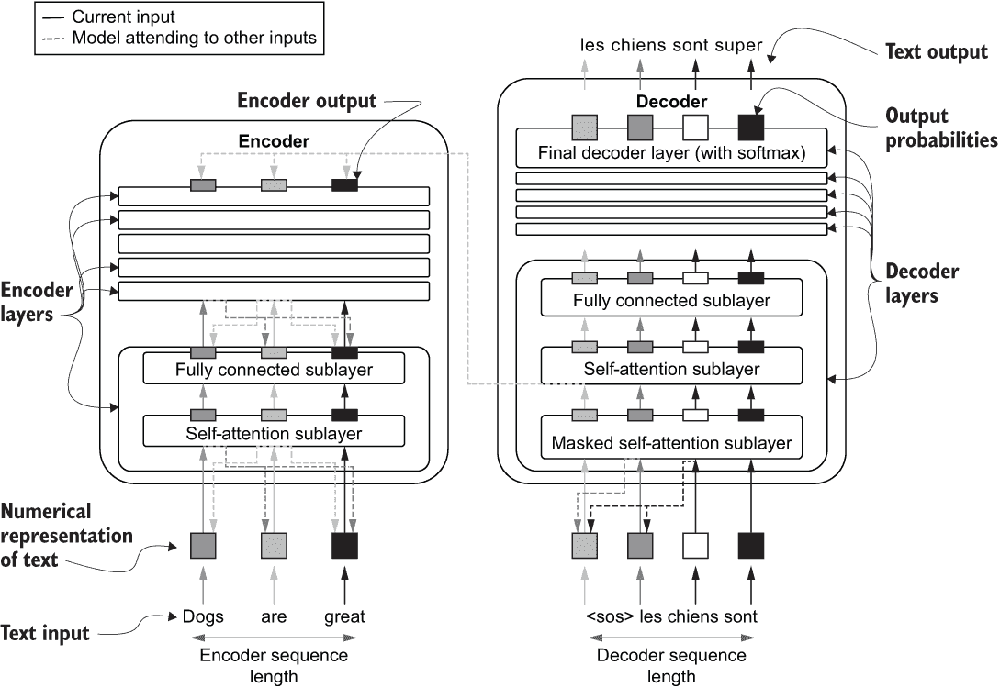

图 5.10 Transformer 模型架构

由于我们已经相当深入地探讨了底层元素，因此网络应该非常易于理解。我们所要做的就是设置编码器模型，设置解码器模型，并通过创建一个 Model 对象来适当地组合这些内容。最初我们定义了几个超参数。我们的模型接受长度为 n_steps 的句子。这意味着如果给定句子的长度小于 n_steps，则我们将填充一个特殊的标记使其长度为 n_steps。如果给定句子的长度大于 n_steps，则我们将截断句子至 n_steps 个词。n_steps 值越大，句子中保留的信息就越多，但模型消耗的内存也越多。接下来，我们有编码器输入的词汇表大小（即，馈送给编码器的数据集中唯一单词的数量）（n_en_vocab）、解码器输入的词汇表大小（n_de_vocab）、头数（n_heads）和输出维度（d）。

有了这个，我们定义了编码器输入层，它接受一个批次的 n_steps 长句子。在这些句子中，每个词都将由一个唯一的 ID 表示。例如，句子“The cat sat on the mat”将被转换为[1, 2, 3, 4, 1, 5]。接下来，我们有一个称为嵌入（Embedding）的特殊层，它为每个词提供了一个 d 元素长的表示（即，词向量）。在这个转换之后，您将得到一个大小为（批量大小，n_steps，d）的输出，这是应该进入自注意力层的输出格式。我们在第三章（第 3.4.3 节）中简要讨论了这种转换。嵌入层本质上是一个查找表。给定一个唯一的 ID（每个 ID 代表一个词），它会给出一个 d 元素长的向量。换句话说，这一层封装了一个大小为（词汇量大小，d）的大矩阵。当定义嵌入层时，您可以看到：

```py
layers.Embedding(n_en_vocab, 512, input_length=n_steps)
```

我们需要提供词汇量大小（第一个参数）和输出维度（第二个参数），最后，由于我们正在处理长度为 n_steps 的输入序列，我们需要指定 input_length 参数。有了这个，我们就可以将嵌入层的输出（en_emb）传递给一个编码器层。您可以看到我们的模型中有两个编码器层。

下一步，转向解码器，从高层面看，一切都与编码器相同，除了两个不同之处：

+   解码器层将编码器输出（en_out2）和解码器输入（de_emb 或 de_out1）作为输入。

+   解码器层还有一个最终的稠密层，用于生成正确的输出序列（例如，在机器翻译任务中，这些将是每个时间步长的翻译词的概率）。

您现在可以定义和编译模型为

```py
transformer = models.Model(
    inputs=[en_inp, de_inp], outputs=de_pred, name=’MinTransformer’
)
transformer.compile(
    loss='categorical_crossentropy', optimizer='adam', metrics=['acc']
)
```

请注意，在定义模型时，我们可以为其提供一个名称。我们将我们的模型命名为“MinTransformer”。作为最后一步，让我们看一下模型摘要，

```py
transformer.summary()
```

这将提供以下输出：

```py
Model: "MinTransformer"
_____________________________________________________________________________________________
Layer (type)                    Output Shape         Param #     Connected to                
=============================================================================================
input_1 (InputLayer)            [(None, 25)]         0                                       
_____________________________________________________________________________________________
embedding (Embedding)           (None, 25, 512)      153600      input_1[0][0]               
_____________________________________________________________________________________________
input_2 (InputLayer)            [(None, 25)]         0                                       
_____________________________________________________________________________________________
encoder_layer (EncoderLayer)    (None, 25, 512)      2886144     embedding[0][0]             
_____________________________________________________________________________________________
embedding_1 (Embedding)         (None, 25, 512)      204800      input_2[0][0]               
_____________________________________________________________________________________________
encoder_layer_1 (EncoderLayer)  (None, 25, 512)      2886144     encoder_layer[0][0]         
_____________________________________________________________________________________________
decoder_layer (DecoderLayer)    (None, 25, 512)      3672576     embedding_1[0][0]           
                                                                 encoder_layer_1[0][0]       
_____________________________________________________________________________________________
decoder_layer_1 (DecoderLayer)  (None, 25, 512)      3672576     decoder_layer[0][0]         
                                                                 encoder_layer_1[0][0]       
_____________________________________________________________________________________________
dense (Dense)                   (None, 25, 400)      205200      decoder_layer_1[0][0]       
=============================================================================================
Total params: 13,681,040
Trainable params: 13,681,040
Non-trainable params: 0
_____________________________________________________________________________________________
```

工作坊参与者将高高兴兴地离开这个工作坊。您已经介绍了 Transformer 网络的基本要点，同时教导参与者实现自己的网络。我们首先解释了 Transformer 具有编码器-解码器架构。然后，我们看了编码器和解码器的组成，它们由自注意力层和全连接层组成。自注意力层允许模型在处理给定输入词时关注其他输入词，这在处理自然语言时非常重要。我们还看到，在实践中，模型在单个注意力层中使用多个注意力头以提高性能。接下来，全连接层创建了所关注输出的非线性表示。在理解基本要素之后，我们使用我们为自注意力层（SelfAttentionLayer）和全连接层（FCLayer）创建的可重用自定义层实现了一个基本的小规模 Transformer 网络。

下一步是在 NLP 数据集上训练这个模型（例如机器翻译）。然而，训练这些模型是一个单独章节的主题。 Transformers 比我们讨论的还要复杂得多。例如，有预训练的基于 Transformer 的模型，你可以随时使用它们来解决 NLP 任务。我们将在后面的章节再次讨论 Transformers。

## 总结

+   Transformer 网络在几乎所有 NLP 任务中都表现优于其他模型。

+   Transformer 是一种主要用于学习 NLP 任务的编码器 - 解码器型神经网络。

+   使用 Transformer，编码器和解码器由两个计算子层组成：自我注意层和完全连接层。

+   自我注意层根据处理当前位置时，与序列中其他位置之间的相对重要性产生一个给定时间步长的输入的加权和。

+   完全连接层对自我注意层产生的注意输出进行了非线性表示。

+   解码器在其自我注意层中使用掩码，以确保在产生当前预测时，解码器不会看到任何未来的预测。

## 练习答案

**练习 1**

```py
Wq = tf.Variable(np.random.normal(size=(256,512)))
Wk = tf.Variable (np.random.normal(size=(256,512)))
Wv = tf.Variable (np.random.normal(size=(256,512)))
```

**练习 2**

```py
multi_attn_head = [SelfAttentionLayer(512) for i in range(8)]
outputs = [head(x)[0] for head in multi_attn_head]
outputs = tf.math.add_n(outputs)
```
