# 第六章：教机器看图像分类和 CNN

本章涵盖内容

+   在 Python 中对图像数据进行探索性数据分析

+   预处理和通过图像流水线提供数据

+   使用 Keras 功能 API 实现复杂的 CNN 模型

+   训练和评估 CNN 模型

我们已经对 CNN 做了相当多的工作。CNN 是一种可以处理二维数据（如图像）的网络类型。CNN 使用卷积操作通过在图像上移动一个核（即一个小的值网格）来创建图像（即像素的网格）的特征图，从而产生新的值。CNN 具有多个这样的层，随着它们的深入，它们生成越来越高级的特征图。您还可以在卷积层之间使用最大或平均汇聚层来减少特征图的维数。汇聚层也会在特征图上移动核以创建输入的较小表示。最终的特征图连接到一系列完全连接的层，其中最后一层产生预测结果（例如，图像属于某个类别的概率）。

我们使用 Keras Sequential API 实现了 CNN。我们使用了各种 Keras 层，如 Conv2D、MaxPool2D 和 Dense，以便轻松地实现 CNN。我们已经学习了与 Conv2D 和 MaxPool2D 层相关的各种参数，如窗口大小、步幅和填充方式。

在本章中，我们将更接近地看到卷积神经网络（CNN）在解决令人兴奋的问题时在真实世界数据上的表现。机器学习不仅仅是实现一个简单的 CNN 来学习高度策划的数据集，因为真实世界的数据往往是杂乱无序的。您将学习到探索性数据分析，这是机器学习生命周期的核心。您将探索一个图像数据集，目标是识别图像中的对象（称为*图像分类*）。然后，我们将深入研究计算机视觉领域的一个最先进的模型，即 inception 模型。在深度学习中，广泛认可的神经网络架构（或模板）在特定任务上表现良好。inception 模型是一种在图像数据上表现出色的模型之一。我们将研究模型的架构以及其中使用的几个新颖设计概念的动机。最后，我们将训练在我们探索过的数据集上的模型，并依靠准确性等指标分析模型的性能。

我们走了很长一段路。我们理解了那里存在的主要深度学习算法的技术方面，并且对我们正确执行探索性数据分析的能力充满信心，因此以信心进入模型阶段。然而，深度网络很快就会变得非常庞大。复杂的网络会牵扯到各种计算和性能问题。因此，任何希望在实际问题中使用这些算法的人都需要学习那些在复杂学习任务中已被证明执行良好的现有模型。

## 6.1 将数据置于显微镜下：探索性数据分析

你正在与一组数据科学家合作构建一个多才多艺的图像分类模型。最终目标是将此模型用作智能购物助手的一部分。用户可以上传家里内部的照片，助手将根据他们的风格找到合适的产品。团队决定从图像分类模型开始。你需要回到团队，拿到一个很棒的数据集并解释数据的样子以及为什么这个数据集很棒。数据集包含在现实世界中拍摄的日常物品，你将进行探索性数据分析并查看数据集的各种属性（例如，可用类别，数据集大小，图像属性）来了解数据，并识别和解决潜在问题。

探索性数据分析（EDA）是数据科学项目中你将要做的技术发展的基石。该过程的主要目标是通过消除离群值和噪音等烦人问题，最终获得高质量干净的数据集。为了拥有这样的数据集，你需要仔细审查数据，并找出是否存在

+   类别不平衡（在分类问题中）

+   损坏的数据

+   缺失的特征

+   离群值

+   需要各种转换的特征（例如，标准化，独热编码）

这绝不是一份详尽的需要注意的事项清单。你进行的探索越多，数据质量就会越好。

在进行探索性数据分析之前发生了什么？

机器学习问题总是源于业务问题。一旦问题得到适当的确认和理解，你可以开始考虑数据：我们有什么数据？我们训练模型来预测什么？这些预测如何转化为为公司带来好处的可操作见解？在勾选这些问题之后，你可以通过探索性数据分析来检索并开始处理数据。毕竟，机器学习项目中的每一步都需要有目的性地完成。

你已经花了几天时间研究，找到了一个适合你问题的数据集。为了开发一个能够理解客户风格偏好的智能购物助手，它应该能够从客户上传的照片中识别尽可能多的家居物品。为此，你计划使用 tiny-imagenet-200 ([`www.kaggle.com/c/tiny-imagenet`](https://www.kaggle.com/c/tiny-imagenet))数据集。

ImageNet 数据集

Tiny ImageNet 是原始 ImageNet 数据集（[`www.kaggle.com/competitions/imagenet-object-localization-challenge`](https://www.kaggle.com/competitions/imagenet-object-localization-challenge)）的一个规模较小的重制版，它是年度 ImageNet 大规模视觉识别挑战(ILSVRC)的一部分。每年，全球各地的研究团队竞争开发最先进的图像分类和检测模型。这个数据集拥有大约 1.2 百万张标记的图像，分布在 1,000 个类别中，已成为计算机视觉领域最大的标记图像数据集之一。

这个数据集包含属于 200 个不同类别的图像。图 6.1 展示了一些可用类别的图像。


图 6.1 tiny-imagenet-200 的一些样本图像。你可以看到这些图像属于各种不同的类别。

首先，我们需要下载数据集。下面的代码将在你的工作目录中创建一个名为 data 的文件夹，下载包含数据的 zip 文件，并为你解压缩。最终，你应该在 data 文件夹中有一个名为 tiny-imagenet-200 的文件夹：

```py
import os
import requests
import zipfile
if not os.path.exists(os.path.join('data','tiny-imagenet-200.zip')):
    url = "http:/ /cs231n.stanford.edu/tiny-imagenet-200.zip"
    r = requests.get(url)

    if not os.path.exists('data'):
        os.mkdir('data')

    with open(os.path.join('data','tiny-imagenet-200.zip'), 'wb') as f:
        f.write(r.content)

    with zipfile.ZipFile(
        os.path.join('data','tiny-imagenet-200.zip'), 'r'
    ) as zip_ref:
        zip_ref.extractall('data')
else:
    print("The file already exists.")
```

### 6.1.1 文件夹/文件结构

数据现在应该在 Ch06/data 文件夹中可用了。现在是时候探索数据集了。我们将首先手动浏览提供给我们的文件夹中的数据。你会注意到有三个文件夹和两个文件（图 6.2）。四处看看并探索一下。

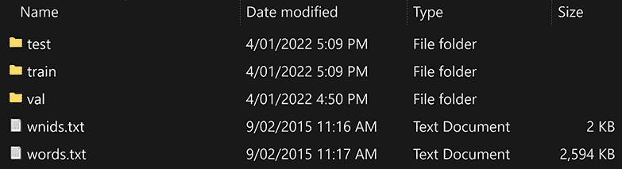

图 6.2 tiny-imagenet-200 数据集中找到的文件夹和文件

文件 wnids.txt 包含一组 200 个 ID（称为*wnids*或 WordNet IDs，基于词汇数据库 WordNet [[`wordnet.princeton.edu/`](https://wordnet.princeton.edu/)]; 图 6.3)。每个 ID 代表一个图像类别（例如，金鱼类）。

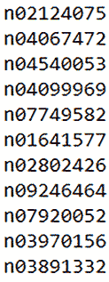

图 6.3 来自 wnids.txt 的示例内容。每行包含一个 wnid（WordNet ID）。

文件 words.txt 以制表符分隔值（TSV）格式提供了对这些 ID 的人性化描述（表 6.1）。请注意，这个文件包含超过 82,000 行（远超过我们的 200 个类别）并来自一个更大的数据集。

表 6.1 来自 words.txt 的示例内容。其中包含数据集中的 wnids 以及它们的描述。

| n00001740 | entity |
| --- | --- |
| n00001930 | physical entity |
| n00002137 | 抽象，抽象实体 |
| n00002452 | 东西 |
| n00002684 | 物体，实物 |
| n00003553 | 整体，单位 |
| n00003993 | 同种异体 |
| n00004258 | 生物，有机物 |
| n00004475 | 有机体，存在 |
| n00005787 | 底栖生物 |
| n00005930 | 矮人 |
| n00006024 | 异养生物 |
| n00006150 | 父母 |
| n00006269 | 生命 |
| n00006400 | 生物体 |

训练文件夹包含训练数据。它包含一个名为 images 的子文件夹，在其中，您可以找到 200 个文件夹，每个都有一个标签（即 wnid）。在每个这些子文件夹中，您将找到代表该类别的一系列图像。每个以其名称作为 wnid 的子文件夹包含每类 500 张图像，总共有 100,000 张（在所有子文件夹中）。图 6.4 描述了这种结构，以及训练文件夹中找到的一些数据。

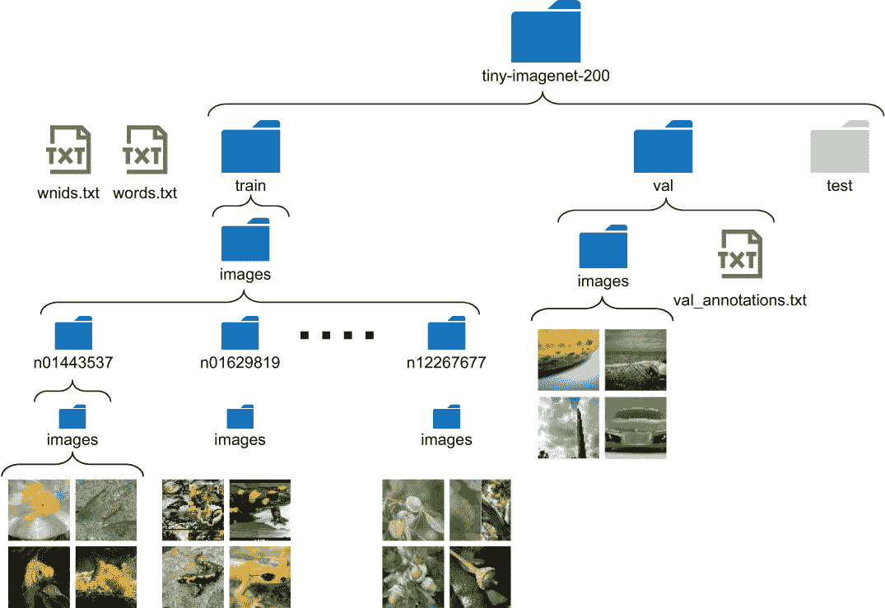

图 6.4 tiny-imagenet-200 数据集的总体结构。它有三个文本文件（wnids.txt、words.txt 和 val/val_annotations.txt）和三个文件夹（train、val 和 test）。我们只使用 train 和 val 文件夹。

val 文件夹包含一个名为 images 的子文件夹和一组图像（这些图像不像在 train 文件夹中那样被进一步分成子文件夹）。这些图像的标签（或 wnids）可以在 val 文件夹中的 val_annotations.txt 文件中找到。

最后一个文件夹称为测试文件夹，在本章中我们将忽略它。该数据集是竞赛的一部分，数据用于评分提交的模型。我们没有这个测试集的标签。

### 6.1.2 理解数据集中的类别

我们已经了解了我们拥有的数据的类型以及其可用性。接下来，让我们识别一些数据中的类别。为此，我们将定义一个名为 get_tiny_imagenet_classes() 的函数，该函数读取 wnids.txt 和 words.txt 文件，并创建一个包含两列的 pd.DataFrame（即 pandas DataFrame）：wnid 及其相应的类别描述（见下一个列表）。

列表 6.1 获取数据集中类别的类别描述

```py
import pandas as pd                                                      ❶
import os                                                                ❶

data_dir = os.path.join('data', 'tiny-imagenet-200')                     ❷
wnids_path = os.path.join(data_dir, 'wnids.txt')                         ❷
words_path = os.path.join(data_dir, 'words.txt')                         ❷

def get_tiny_imagenet_classes(wnids_path, words_path):                   ❸
    wnids = pd.read_csv(wnids_path, header=None, squeeze=True)           ❹
    words = pd.read_csv(words_path, sep='\t', index_col=0, header=None)  ❹
    words_200 = words.loc[wnids].rename({1:'class'}, axis=1)             ❺
    words_200.index.name = 'wnid'                                        ❻
    return words_200.reset_index()                                       ❼

labels = get_tiny_imagenet_classes(wnids_path, words_path)               ❽
labels.head(n=25)                                                        ❾
```

❶ 导入 pandas 和 os 包

❷ 定义数据目录、wnids.txt 和 words.txt 文件的路径

❸ 定义一个函数来读取 tiny_imagenet 类别的类别描述

❹ 使用 pandas 读取 wnids.txt 和 words.txt 作为 CSV 文件

❺ 仅获取 tiny-imagenet-200 数据集中存在的类别

❻ 将数据框的索引名称设置为“wnid”

❼ 重置索引，使其成为数据框中的一列（该列的列名为“wnid”）

❽ 执行函数以获取类别描述

❾ 检查数据框的头部（前 25 个条目）

此函数首先读取包含 wnids 列表的 wnids.txt 文件，该列表对应于数据集中可用的类别，作为 pd.Series（即 pandas series）对象。 接下来，它将 words.txt 文件读取为 pd.DataFrame（即 pandas DataFrame），其中包含 wnid 到类别描述的映射，并将其分配给 words。 然后，它选择在 wnids pandas 系列中存在 wnid 的项目。 这将返回一个包含 200 行的 pd.DataFrame（表 6.2）。 请记住，words.txt 中的项数远远大于实际数据集，因此我们只需要选择与我们相关的项。

表 6.2 使用 get_tiny_imagenet_classes()函数生成的标签 ID 及其描述的示例

|  | **风** | **课程** |
| --- | --- | --- |
| 0 | n02124075 | 埃及猫 |
| 1 | n04067472 | 卷轴 |
| 2 | n04540053 | 排球 |
| 3 | n04099969 | 摇椅，摇椅 |
| 4 | n07749582 | 柠檬 |
| 5 | n01641577 | 牛蛙，美洲牛蛙 |
| 6 | n02802426 | 篮球 |
| 7 | n09246464 | 悬崖，跌落，坠落 |
| 8 | n07920052 | 浓缩咖啡 |
| 9 | n03970156 | 吸盘，管道工的助手 |
| 10 | n03891332 | 停车计时器 |
| 11 | n02106662 | 德国牧羊犬，德国牧羊犬，德国牧羊犬... |
| 12 | n03201208 | 餐桌，板 |
| 13 | n02279972 | 帝王蝴蝶，帝王蝴蝶，小米蝴蝶 |
| 14 | n02132136 | 棕熊，棕熊，北极熊 |
| 15 | n041146614 | 校车 |

然后我们将计算每个类别的数据点（即图像）的数量：

```py
def get_image_count(data_dir):    
    # Get the count of JPEG files in a given folder (data_dir)
    return len(
        [f for f in os.listdir(data_dir) if f.lower().endswith('jpeg')]
    )

   # Apply the function above to all the subdirectories in the train folder 
labels["n_train"] = labels["wnid"].apply(
    lambda x: get_image_count(os.path.join(data_dir, 'train', x, 'images'))
)
# Get the top 10 entries in the labels dataframe
labels.head(n=10)
```

此代码创建一个名为 n_train 的新列，显示每个 wnid 找到了多少个数据点（即图像）。 这可以通过 pandas pd.Series .apply()函数来实现，该函数将 get_image_count()应用于系列 labels[“wnid”]中的每个项目。 具体来说，get_image_count()接受一个路径并返回该文件夹中找到的 JPEG 文件的数量。 当您将此 get_image_count()函数与 pd.Series.apply()结合使用时，它会进入 train 文件夹中的每个文件夹，并计算图像的数量。 一旦运行了标签.head(n=10)行，您应该会得到表 6.3 中显示的结果。

表 6.3 计算了 n_train（训练样本数）的数据示例

|  | **风** | **课程** | **n_train** |
| --- | --- | --- | --- |
| 0 | n02124075 | 埃及猫 | 500 |
| 1 | n04067472 | 卷轴 | 500 |
| 2 | n04540053 | 排球 | 500 |
| 3 | n04099969 | 摇椅，摇椅 | 500 |
| 4 | n07749582 | 柠檬 | 500 |
| 5 | n01641577 | 牛蛙，美洲牛蛙 | 500 |
| 6 | n02802426 | 篮球 | 500 |
| 7 | n09246464 | 悬崖，跌落，坠落 | 500 |
| 8 | n07920052 | 浓缩咖啡 | 500 |
| 9 | n03970156 | 吸盘，管道工的助手 | 500 |

让我们快速验证结果是否正确。 进入 train 文件夹中的 n02802426 子目录，其中应该包含篮球的图像。 图 6.5 显示了几个示例图像。


图 6.5 wnid 类别 n02802426（即篮球）的样本图像

你可能会发现这些图像与你预期的截然不同。你可能期望看到清晰放大的篮球图像。但在现实世界中，永远不会出现这种情况。真实数据集是有噪声的。你可以看到以下图像：

+   篮球几乎看不见（左上角）。

+   篮球是绿色的（左下角）。

+   篮球在婴儿旁边（即上下文无关）（中间上方）。

这会让你更加欣赏深度网络，因为这对一堆堆叠的矩阵乘法（即深度网络）是一个困难的问题。需要精确的场景理解才能成功解决此任务。尽管困难，但奖励很大。我们开发的模型最终将用于识别各种背景和上下文中的物体，例如客厅、厨房和室外。这正是这个数据集为模型训练的目的：在各种情境中理解/检测物体。你可能可以想象为什么现代 CAPTCHA 越来越聪明，并且可以跟上能够更准确地分类对象的算法。对于受过适当训练的 CNN 来说，识别具有混乱背景或小遮挡的 CAPTCHA 并不困难。

你还可以快速检查我们生成的 n_train 列的摘要统计数据（例如，平均值、标准差等）。这提供了比查看所有 200 行更容易消化的列的摘要。这是使用 pandas 描述() 函数完成的：

```py
labels["n_train"].describe()
```

执行此操作将返回以下系列：

```py
count    200.0
mean     500.0
std        0.0
min      500.0
25%      500.0
50%      500.0
75%      500.0
max      500.0
Name: n_train, dtype: float64
```

你可以看到它返回了列的重要统计信息，如平均值、标准差、最小值和最大值。每个类别都有 500 张图像，这意味着数据集完美地平衡了类别。这是验证我们有一个类平衡数据集的有用方法。

### 6.1.3 计算数据集上的简单统计量

分析数据的各种属性也是一个重要步骤。根据你处理的数据类型，分析类型会发生变化。在这里，我们将找出图像的平均大小（甚至是 25/50/75 百分位数）。

在实际模型中准备好这些信息可以节省很多时间，因为你必须了解图像大小（高度和宽度）的基本统计信息，以裁剪或填充图像到固定大小，因为图像分类 CNN 只能处理固定大小的图像（见下一个列表）。

列表 6.2 计算图像宽度和高度统计数据

```py
import os                                                                 ❶
from PIL import Image                                                     ❶
import pandas as pd                                                       ❶

image_sizes = []                                                          ❷
for wnid in labels["wnid"].iloc[:25]:                                     ❸
    img_dir = os.path.join(
        'data', 'tiny-imagenet-200', 'train', wnid, 'images'
    )                                                                     ❹
    for f in os.listdir(img_dir):                                         ❺
        if f.endswith('JPEG'):                                            ❺
            image_sizes.append(Image.open(os.path.join(img_dir, f)).size) ❻

img_df = pd.DataFrame.from_records(image_sizes)                           ❼
img_df.columns = ["width", "height"]                                      ❽
img_df.describe()                                                         ❾
```

❶ 导入 os、PIL 和 pandas 包

❷ 定义一个列表来保存图像大小

❸ 在数据集中循环前 25 类

❹ 在循环中为特定类别定义图像目录

❺ 在该目录中循环所有具有扩展名 JPEG 的图像

❻ 将每个图像的大小（即 (宽度、高度) 元组）添加到 image_sizes 中

❼ 从 image_sizes 中的元组创建数据框架

❽ 适当设置列名

❾ 获取我们获取的图像的宽度和高度的摘要统计信息

在这里，我们从之前创建的标签 DataFrame 中获取前 25 个 wnid（处理所有 wnid 会花费太多时间）。然后，对于每个 wnid，我们进入包含属于它的数据的子文件夹，并使用以下方法获取每个图像的宽度和高度信息

```py
Image.open(os.path.join(img_dir, f)).size 
```

使用`Image.open(<path>).size`函数返回给定图像的元组（宽度，高度）。我们将遇到的所有图像的宽度和高度记录在`image_sizes`列表中。最后，`image_sizes`列表如下所示：

```py
image_sizes = [(image_1.width, image_1.height), (image_2.width, image_2.height), ..., (image_n.width, image_n.height)]
```

对于这种格式的数据，我们可以使用`pd.DataFrame.from_records()`函数将此列表创建为`pd.DataFrame`。`image_sizes`中的单个元素是一条记录。例如，`(image_1.width, image_1.height)`是一条记录。因此，`image_sizes`是一组记录的列表。当您从记录列表创建`pd.DataFrame`时，每条记录都变为`pandas DataFrame`中的一行，其中每条记录中的每个元素都变为列。例如，由于每条记录中都有图像宽度和图像高度作为元素，因此宽度和高度成为`pandas DataFrame`中的列。最后，我们执行`img_df.describe()`以获取我们读取的图像的宽度和高度的基本统计信息（表 6.4）。

表 6.4 图像的宽度和高度统计信息

|  | **宽度** | **高度** |
| --- | --- | --- |
| count | 12500.0 | 12500.0 |
| mean | 64.0 | 64.0 |
| std | 0.0 | 0.0 |
| min | 64.0 | 64.0 |
| 25% | 64.0 | 64.0 |
| 50% | 64.0 | 64.0 |
| 75% | 64.0 | 64.0 |
| max | 64.0 | 64.0 |

接下来，我们将讨论如何创建数据管道来摄取我们刚刚讨论的图像数据。

练习 1

假设在浏览数据集时，您遇到了一些损坏的图像（即，它们具有负值像素）。假设您已经有了一个名为`df`的`pd.DataFrame()`，其中包含一个带有图像文件路径的单列（称为`filepath`），请使用`pandas apply()`函数读取每个图像的最小值，并将其分配给名为`minimum`的列。要读取图像，您可以假设已完成`from PIL import Image`和`import numpy as np`，您还可以使用`np.array(<Image>)`将`PIL.Image`转换为数组。

## 6.2 使用 Keras ImageDataGenerator 创建数据管道

您已经很好地探索了数据集，并了解了诸如有多少类别、存在什么样的对象以及图像的大小等信息。现在，您将为三个不同的数据集创建三个数据生成器：训练、验证和测试。这些数据生成器以批量从磁盘中检索数据，并执行任何所需的预处理。这样，数据就可以被模型轻松消耗。为此，我们将使用方便的`tensorflow.keras.preprocessing.image.ImageDataGenerator`。

我们将从定义一个 Keras ImageDataGenerator()开始，以在构建模型时提供数据：

```py
from tensorflow.keras.preprocessing.image import ImageDataGenerator
import os

random_seed = 4321
batch_size = 128
image_gen = ImageDataGenerator(samplewise_center=True, validation_split=0.1)
```

设置 samplewise_center=True，生成的图像将具有归一化的值。每个图像将通过减去该图像的平均像素值来居中。validation_split 参数在训练数据中扮演着重要的角色。这让我们将训练数据分成两个子集，训练集和验证集，通过从训练数据中分离出一部分（在本例中为 10%）。在机器学习问题中，通常应该有三个数据集：

+   *训练数据*—通常是最大的数据集。我们用它来训练模型。

+   *验证数据*—保留数据集。它不用于训练模型，而是用于在训练过程中监视模型的性能。请注意，此验证集在训练过程中必须保持固定（不应更改）。

+   *测试数据*—保留数据集。与验证数据集不同，这仅在模型训练完成后使用。这表示模型在未见的真实世界数据上的表现。这是因为模型在测试时间之前没有以任何方式与测试数据集交互（与训练和验证数据集不同）。

我们还将为稍后的数据生成定义一个随机种子和批量大小。

创建一个 ImageDataGenerator 后，您可以使用其中的一个 flow 函数来读取来自异构源的数据。例如，Keras 目前提供了以下方法：

+   flow()—从 NumPy 数组或 pandas DataFrame 中读取数据

+   flow_from_dataframe()—从包含文件名和它们关联标签的文件中读取数据

+   flow_from_directory()—从文件夹中读取数据，该文件夹中的图像根据它们所属的类别组织到子文件夹中。

首先，我们将查看 flow_from_directory()，因为我们的训练目录以 flow_from_directory()函数期望数据的确切格式存储。具体来说，flow_from_directory()期望数据的格式如图 6.6 所示。

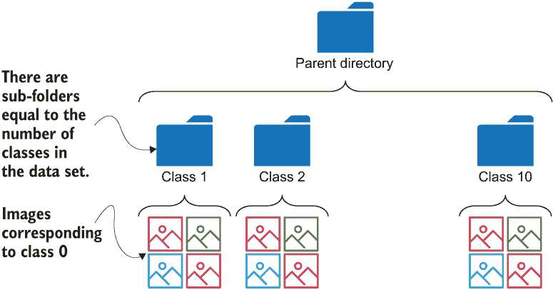

图 6.6 流从目录方法所预期的文件夹结构

流方法返回数据生成器，这些生成器是 Python 生成器。生成器本质上是一个返回迭代器（称为*generator-iterator*）的函数。但为了保持我们的讨论简单，我们将生成器和迭代器都称为生成器。您可以像处理列表一样迭代生成器，并以顺序方式返回项目。这里是一个生成器的例子：

```py
def simple_generator():
    for i in range(0, 100):
        yield (i, i*2)
```

请注意使用关键字 yield，您可以将其视为 return 关键字。但是，与 return 不同，yield 不会在执行该行后立即退出函数。现在您可以将迭代器定义为

```py
iterator = simple_generator()
```

您可以将迭代器视为包含[(0, 0), (1, 2), (2, 4), ...，(98, 196), (99, 198)]的列表。然而，在幕后，生成器比列表对象更节省内存。在我们的情况下，数据生成器将在单次迭代中返回一批图像和目标（即，图像和标签的元组）。您可以直接将这些生成器提供给像`tf.keras.models.Model.fit()`这样的方法，以训练模型。`flow_from_directory()`方法用于检索数据：

```py
target_size = (56,56)

train_gen = image_gen.flow_from_directory(
    directory=os.path.join('data','tiny-imagenet-200', 'train'), 
    target_size=target_size, classes=None,
    class_mode='categorical', batch_size=batch_size, 
    shuffle=True, seed=random_seed, subset='training'
)
valid_gen = image_gen.flow_from_directory (
    directory=os.path.join('data','tiny-imagenet-200', 'train'), 
    target_size=target_size, classes=None,
    class_mode='categorical', batch_size=batch_size, 
    shuffle=True, seed=random_seed, subset='validation'
)
```

您可以看到已为这些函数设置了许多参数。需要注意的最重要的参数是`subset`参数，对于`train_gen`设置为“training”，对于`valid_gen`设置为“validation”。其他参数如下：

+   目录（string）—父目录的位置，在这里数据进一步分成表示类别的子文件夹。

+   目标大小（int 元组）—图像的目标大小，表示为（高度，宽度）的元组。图像将被调整为指定的高度和宽度。

+   类别模式（string）—我们将要提供给模型的目标类型。因为我们希望目标是表示每个类别的独热编码向量，所以我们将其设置为'categorical'。可用类型包括“categorical”（默认值）、“binary”（对于只有两类（0 或 1）的数据集）、“sparse”（数值标签而不是独热编码向量）、“input”或 None（没有标签）、以及“raw”或“multi_output”（仅在特殊情况下可用）。

+   批量大小（int）—单个数据批次的大小。

+   是否在获取时对数据进行洗牌（bool）—是否在获取时对数据进行洗牌。

+   随机种子（int）—数据洗牌的随机种子，因此我们每次运行时都能获得一致的结果。

+   子集（string）—如果`validation_split > 0`，则需要哪个子集。这需要设置为“training”或“validation”之一。

请注意，即使我们有 64 × 64 的图像，我们也将它们调整为 56 × 56。这是因为我们将使用的模型设计用于 224 × 224 的图像。具有 224 × 224 尺寸的图像使得将模型适应我们的数据变得更加容易。

我们可以让我们的解决方案变得更加闪亮！您可以看到，在`train_gen`和`valid_gen`之间，使用的参数有很多重复。实际上，除了`subset`之外，所有参数都相同。这种重复会使代码变得凌乱，并为错误留下余地（如果需要更改参数，则可能会设置一个而忘记另一个）。您可以在 Python 中使用偏函数来创建具有重复参数的偏函数，然后使用它来创建`train_gen`和`valid_gen`：

```py
from functools import partial
target_size = (56,56)

partial_flow_func = partial(
        image_gen.flow_from_directory, 
        directory=os.path.join('data','tiny-imagenet-200', 'train'), 
        target_size=target_size, classes=None,
        class_mode='categorical', batch_size=batch_size, 
        shuffle=True, seed=random_seed)

train_gen = partial_flow_func(subset='training')
valid_gen = partial_flow_func(subset='validation')
```

这里，我们首先创建一个`partial_flow_function`（一个 Python 函数），它实质上是`flow_from_directory`函数，有一些参数已经填充。然后，为了创建`train_gen`和`valid_gen`，我们只传递了`subset`参数。这样可以使代码更加清晰。

验证数据检查：不要期望框架为您处理事务

现在我们有了一个训练数据生成器和一个验证数据生成器，我们不应该盲目地承诺使用它们。我们必须确保我们从训练数据随机采样的验证数据在每次遍历训练数据集时保持一致。这似乎是一个应该由框架本身处理的微不足道的事情，但最好不要认为这是理所当然的。如果你这样做

如果不执行此检查，最终你会付出代价，因此最好确保我们在不同试验中获得一致的结果。

为此，你可以对验证数据生成器的输出进行多次迭代，进行固定次数的迭代，并确保每次试验中都获得相同的标签序列。此代码在笔记本中可用（在“验证验证数据的一致性”部分下）。

我们还没有完成。我们需要对 flow_from_directory() 函数返回的生成器进行轻微修改。如果你查看数据生成器中的项，你会看到它是一个元组（x，y），其中 x 是一批图像，y 是一批 one-hot 编码的目标。我们在这里使用的模型有一个最终预测层和两个额外的辅助预测层。总共，该模型有三个输出层，因此我们需要返回（x，（y，y，y））而不是一个元组（x，y），通过三次复制 y。我们可以通过定义一个新的生成器 data_gen_aux() 来修复这个问题，该生成器接受现有的生成器并修改其输出，如所示。这需要对训练数据生成器和验证数据生成器都进行修复：

```py
def data_gen_aux(gen):
    for x,y in gen:
        yield x,(y,y,y)

train_gen_aux = data_gen_aux(train_gen)
valid_gen_aux = data_gen_aux(valid_gen)
```

是时候为测试数据创建一个数据生成器了。回想一下，我们说过我们正在使用的测试数据（即 val 目录）的结构与训练和 tran_val 数据文件夹不同。因此，它需要特殊处理。类标签存储在一个名为 val_annotations.txt 的文件中，并且图像放置在一个具有扁平结构的单个文件夹中。不用担心；Keras 也为这种情况提供了一个函数。在这种情况下，我们将首先使用 get_test_labels_df() 函数将 val_annotations.txt 读取为一个 pd.DataFrame。该函数简单地读取 val_annotations.txt 文件，并创建一个具有两列的 pd.DataFrame，即图像的文件名和类标签：

```py
def get_test_labels_df(test_labels_path):
    test_df = pd.read_csv(test_labels_path, sep='\t', index_col=None, header=None)
    test_df = test_df.iloc[:,[0,1]].rename({0:"filename", 1:"class"}, axis=1)
    return test_df

test_df = get_test_labels_df(os.path.join('data','tiny-imagenet-200',  'val', 'val_annotations.txt'))
```

接下来，我们将使用 flow_from_dataframe() 函数创建我们的测试数据生成器。你只需要传递我们之前创建的 test_df（作为 dataframe 参数）和指向图像所在目录的目录参数。请注意，我们为测试数据设置了 shuffle=False，因为我们希望以相同的顺序输入测试数据，以便我们监视的性能指标将保持不变，除非我们更改模型：

```py
    test_gen = image_gen.flow_from_dataframe(
        dataframe=test_df, directory=os.path.join('data','tiny-imagenet-
➥ 200',  'val', 'images'), target_size=target_size, 
➥ class_mode='categorical', batch_size=batch_size, shuffle=False
    )
```

接下来，我们将使用 Keras 定义一个复杂的计算机视觉模型，并最终在我们准备好的数据上对其进行训练。

练习 2

作为测试过程的一部分，假设你想要查看模型对训练数据中损坏标签的鲁棒性如何。为此，你计划创建一个生成器，以 50% 的概率将标签设置为 0。你将如何修改以下生成器以实现此目的？你可以使用 **np.random.normal()** 从具有零均值和单位方差的正态分布中随机抽取一个值：

```py
def data_gen_corrupt(gen):
    for x,y in gen:
        yield x,(y,y,y)
```

## 6.3 Inception net：实现最先进的图像分类器

你已经分析了数据集，并对数据的外观有了全面的了解。对于图像，你无疑会转向卷积神经网络（**CNNs**），因为它们是业内最好的。现在是构建一个模型来学习客户个人喜好的时候了。在这里，我们将使用 **Keras functional API** 复制一个最先进的 CNN 模型（称为 *Inception net*）。

Inception 网络是一个复杂的 CNN，以其提供的最先进性能而著称。Inception 网络的名字来源于流行的互联网梗“我们需要更深入”，该梗以电影 *Inception* 中的莱昂纳多·迪卡普里奥为特色。

Inception 模型在短时间内推出了六个不同版本（大约在 2015-2016 年之间）。这证明了该模型在计算机视觉研究人员中有多受欢迎。为了纪念过去，我们将实现首个推出的 Inception 模型（即 Inception 网络 v1），并随后将其与其他模型进行比较。由于这是一个高级 CNN，对其架构和一些设计决策的深入了解至关重要。让我们来看看 Inception 模型，它与典型 CNN 有何不同，最重要的是，它为什么不同。

Inception 模型（或 Inception 网络）不是典型的 CNN。它的主要特点是复杂性，因为模型越复杂（即参数越多），准确率就越高。例如，Inception 网络 v1 几乎有 20 层。但是当涉及到复杂模型时，会出现两个主要问题：

+   如果你没有足够大的数据集用于一个复杂模型，那么很可能模型会对训练数据过拟合，导致在真实世界数据上的整体性能不佳。

+   复杂的模型导致更多的训练时间和更多的工程努力来将这些模型适配到相对较小的 GPU 内存中。

这要求以更加务实的方式来解决这个问题，比如回答“我们如何在深度模型中引入*稀疏性*，以减少过拟合风险以及对内存的需求？”这是 Inception 网络模型中回答的主要问题。

什么是过拟合？

过拟合是机器学习中的一个重要概念，而且常常难以避免。过拟合是指模型学习很好地表示训练数据（即高训练精度），但在未见过的数据上表现不佳（即低测试精度）的现象。当模型试图记住训练样本而不是从数据中学习可泛化的特征时，就会发生这种情况。这在深度网络中很普遍，因为它们通常比数据量更多的参数。过拟合将在下一章中更详细地讨论。

让我们再次回顾 CNN 的基础知识。

### 6.3.1 CNN 回顾

CNN 主要用于处理图像和解决计算机视觉问题（例如图像分类、目标检测等）。如图 6.7 所示，CNN 有三个组成部分：

+   卷积层

+   池化层全连接层

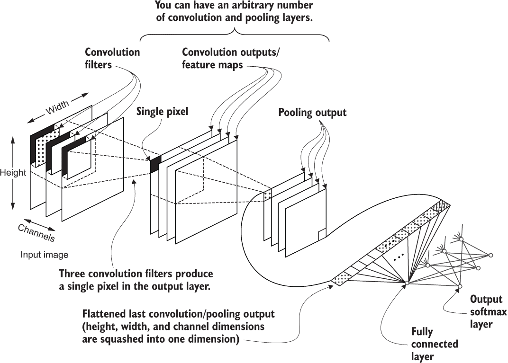

图 6.7 一个简单的卷积神经网络。首先，我们有一个具有高度、宽度和通道维度的图像，然后是一个卷积和一个池化层。最后，最后一个卷积/池化层的输出被展平并馈送到一组全连接层。

卷积操作将一个固定大小的小核（也称为过滤器）沿输入的宽度和高度维度移动。在这样做时，它在每个位置产生一个单一值。卷积操作使用具有一定宽度、高度和若干通道的输入，并产生具有一定宽度、高度和单一通道的输出。为了产生多通道输出，卷积层堆叠许多这些过滤器，导致与过滤器数量相同数量的输出。卷积层具有以下重要参数：

+   *过滤器数量* — 决定卷积层产生的输出的通道深度（或特征图的数量）

+   *核大小* — 也称为感受野，它决定了过滤器的大小（即高度和宽度）。核大小越大，模型在一次观察中看到的图像部分就越多。但更大的过滤器会导致更长的训练时间和更大的内存需求。

+   *步长* — 决定在卷积图像时跳过多少像素。更高的步长导致较小的输出大小（步长通常仅用于高度和宽度维度）。

+   *填充* — 通过添加零值的虚拟边界来防止卷积操作期间自动降低维度，从而使输出具有与输入相同的高度和宽度。

图 6.8 展示了卷积操作的工作原理。


图 6.8 在卷积操作中移动窗口时发生的计算

当处理输入时，池化操作表现出与卷积操作相同的行为。但是，所涉及的确切计算是不同的。池化有两种不同的类型：最大池化和平均池化。最大池化在图 6.9 中显示的深灰色框中找到的最大值作为窗口移过输入时的输出。平均池化在窗口移过输入时取深灰色框的平均值作为输出。

注意 CNNs 在输出处使用平均池化，并在其他地方使用最大池化层。已发现该配置提供了更好的性能。

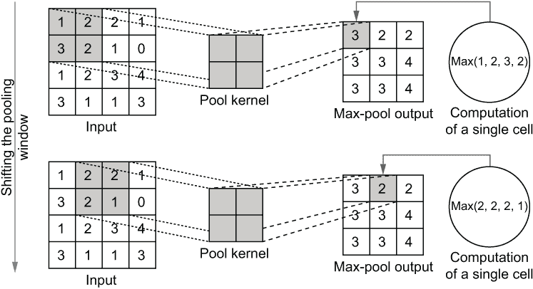

图 6.9 池化操作如何计算输出。它查看一个小窗口，并将该窗口中的输入最大值作为相应单元的输出。

池化操作的好处在于它使得 CNN 具有平移不变性。平移不变性意味着模型可以识别物体，而不管它出现在何处。由于最大池化的计算方式，生成的特征图是相似的，即使对象/特征与模型训练的位置相差几个像素。这意味着，如果你正在训练一个分类狗的模型，网络将对狗出现的确切位置具有弹性（只有在一定程度上）。

最后，你有一个全连接层。由于我们目前主要关注分类模型，我们需要为任何给定的图像输出一个类别的概率分布。我们通过将少量的全连接层连接到 CNNs 的末尾来实现这一点。全连接层将最后的卷积/池化输出作为输入，并在分类问题中生成类别的概率分布。

正如你所见，CNNs 有许多超参数（例如，层数、卷积窗口大小、步幅、全连接隐藏层大小等）。为了获得最佳结果，需要使用超参数优化技术（例如，网格搜索、随机搜索）来选择它们。

### 6.3.2 Inception 网络 v1

Inception 网络 v1（也称为 GoogLeNet）([`mng.bz/R4GD`](http://mng.bz/R4GD)) 将 CNNs 带入了另一个层次。它不是一个典型的 CNN，与标准 CNN 相比，需要更多的实现工作。乍一看，Inception 网络可能看起来有点可怕（见图 6.10）。但是你只需要理解几个新概念，就可以理解这个模型。主要是这些概念的重复应用使模型变得复杂。

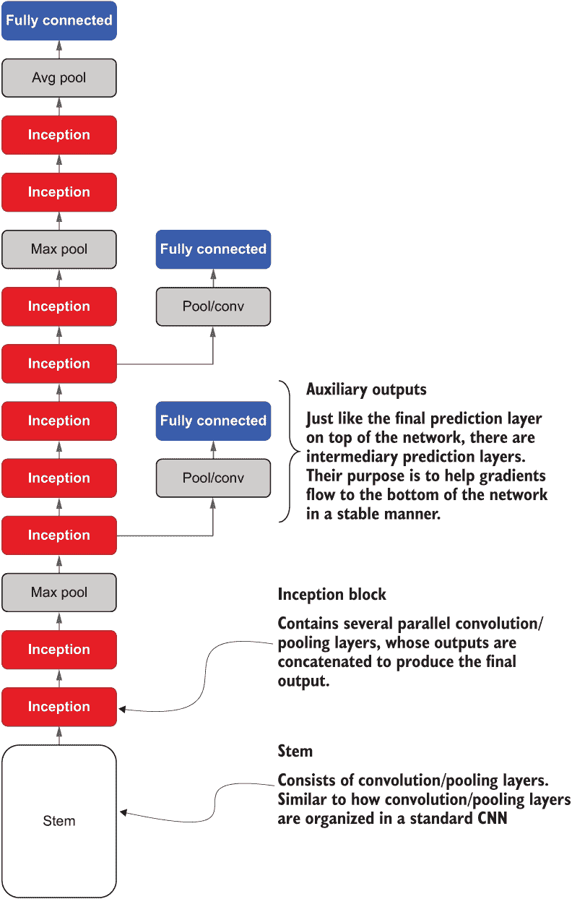

图 6.10 Inception 网络 v1 的抽象架构。Inception 网络从一个称为干扰的起始开始，这是一个在典型 CNN 中找到的普通卷积/池化层序列。然后，Inception 网络引入了一个称为 Inception 块的新组件。最后，Inception 网络还使用了辅助输出层。

让我们首先在宏观层面理解 Inception 模型中的内容，如图 6.10 所示，暂时忽略诸如层和它们的参数之类的细节。我们将在开发出强大的宏观水平理解后详细阐述这些细节。

Inception 网络以称为*stem*的东西开始。stem 包含与典型 CNN 的卷积和池化层相同的卷积和池化层。换句话说，stem 是按特定顺序组织的卷积和池化层的序列。

接下来，你有几个*Inception blocks*，这些块被 max pooling 层交错。一个 Inception block 包含一组并行的具有不同核大小的子卷积层。这使得模型能够在给定深度上以不同大小的感受野查看输入。我们将详细研究这背后的细节和动机。

最后，你有一个全连接层，它类似于典型 CNN 中的最终预测层。你还可以看到还有两个更多的临时全连接层。这些被称为*辅助输出层*。与最终预测层一样，它们由全连接层和 softmax 激活组成，输出数据集中类别的概率分布。尽管它们与最终预测层具有相同的外观，但它们不会对模型的最终输出做出贡献，但在训练过程中起着重要作用，稳定训练变得越来越艰难，因为模型变得越来越深（主要是由于计算机中数值的有限精度）。

让我们从头开始实现原始的 Inception 网络的一个版本。在此过程中，我们将讨论我们遇到的任何新概念。

注意！我们将构建一个略有不同的 Inception 网络 v1。

我们正在实现与原始 Inception 网络 v1 模型略有不同的东西，以应对某种实际限制。原始 Inception 网络设计用于处理尺寸为 224 × 224 × 3 的输入，属于 1,000 个类别，而我们有尺寸为 64 × 64 × 3 的输入，属于 200 个类别，我们将其调整为 56 × 56 × 3，以便其是 224 的因数（即，56 × 4 = 224）。因此，我们将对原始 Inception 网络进行一些修改。如果你愿意，你可以暂时忽略以下细节。但是如果你感兴趣，我们具体进行以下更改：

+   使前三个具有步长 2 的层（在 stem 中）的步长为 1，以便我们在拥有较小输入图像时享受模型的全部深度。

+   将最后一个全连接分类层的大小从 1,000 更改为 200，因为我们只有 200 个类别。

+   移除一些正则化（即，dropout、loss weighting；这些将在下一章重新引入）。

如果你对这里讨论的模型感到舒适，理解原始的 Inception v1 模型将不会有问题。

首先，我们定义一个创建 Inception net v1 干部结构的函数。干部结构是 Inception 网络的前几层，看起来不过是典型卷积/池化层，但有一个新的层（称为 *lambda 层*），执行一些称为 *局部响应归一化*（LRN）的功能。我们将在稍后更详细地讨论该层的目的（请参见下一个清单）。

代码清单 6.3 Inception 网络中的干部结构的定义

```py
def stem(inp):
    conv1 = Conv2D(
        64, (7,7), strides=(1,1), activation='relu', padding='same'
    )(inp)                                                                ❶
maxpool2 = MaxPool2D((3,3), strides=(2,2), padding='same')(conv1)         ❷
lrn3 = Lambda(
    lambda x: tf.nn.local_response_normalization(x)
)(maxpool2)                                                               ❸

conv4 = Conv2D(
    64, (1,1), strides=(1,1), padding='same'
)(lrn3)                                                                   ❹
conv5 = Conv2D(
    192, (3,3), strides=(1,1), activation='relu', padding='same'
)(conv4)                                                                  ❹
    lrn6 = Lambda(lambda x: tf.nn.local_response_normalization(x))(conv5) ❺

    maxpool7 = MaxPool2D((3,3), strides=(1,1), padding='same')(lrn6)      ❻

    return maxpool7                                                       ❼
```

❶ 第一个卷积层的输出

❷ 第一个最大池化层的输出

❸ 第一个局部响应归一化层。我们定义一个封装了 LRN 功能的 lambda 函数。

❹ 后续的卷积层

❺ 第二个 LRN 层

❻ 最大池化层

❼ 返回最终输出（即最大池化层的输出）

到目前为止，这段代码中的大部分应该已经非常熟悉了。它是一系列层，从输入开始生成输出。

Lambda 层（tf.keras.layers.Lambda）

Keras 中的 lambda 层与标准的 Python lambda 函数具有相似的目的。当用标准 lambda 函数编写时，它们封装了一些通常不可用作 Keras 标准层的计算。例如，您可以如下定义一个 Keras 层，该层取轴上的最大值。但是，您只能在 Keras lambda 函数中使用 TensorFlow / Keras 计算：

```py
x = tf.keras.layers.Input(shape=(10,))
max_out = tf.keras.layers.Lambda(lambda x: tf.reduce_max(x, axis=1))(x)
```

您可能会注意到 lambda 层的作用与 Keras 的子类化 API 几乎相同。是的，但是 lambda 层不需要子类化 API 中所需的代码支架。对于具有复杂操作的图层（例如 if-else 条件，for 循环等），您可能会发现子类化 API 更容易。

具体来说，我们定义了以下层：

+   一个卷积层

    +   64 个过滤器，(7,7) 卷积核大小，(2,2) 步长，激活 ReLU，相同填充

+   一个局部响应归一化层

    +   这是通过使用 tf.keras.layers.Lambda 层来指定的。该层为您提供了一种方便的方法，可以定义一个封装了不容易获得的 TensorFlow / Keras 计算的 Keras 层。局部响应归一化是一种归一化给定输入的技术。

+   第二个卷积层

    +   192 个过滤器，(3,3) 卷积核大小，(2，2) 步长，ReLU 激活，相同填充

+   一个局部响应归一化层

+   一个最大池化层

    +   (3,3) 卷积核大小，(2,2) 步长以及相同填充

局部响应归一化

局部响应归一化（LRN）是早期的归一化技术，介绍在论文 “ImageNet Classification with Deep CNNs” ([`mng.bz/EWPr`](http://mng.bz/EWPr)) 中。

这项技术受到了生物系统中表现出的横向抑制（[`mng.bz/N6PX`](http://mng.bz/N6PX)）的启发。这指的是激活的神经元抑制邻近神经元的活动的现象（例如，在视网膜感受器中观察到）。本质上，LRN 层通过将卷积输出的每个值除以其邻域中的值（邻域由半径参数化，这是该层的超参数）来标准化每个值。这种规范化创建了神经元之间的竞争，并导致略微更好的性能。我们将不讨论涉及此计算的确切方程，因为这种方法已经过时，并且更好、更有前途的正则化技术，如批量标准化，已经取代了它。

更深入地了解 Inception 块

正如前面所述，Inception 网中的主要突破之一是 Inception 块。与具有固定核大小的典型卷积层不同，Inception 块是具有不同核大小的并行卷积层的集合。具体来说，在 Inception v1 中的 Inception 块包含 1 × 1 卷积、3 × 3 卷积、5 × 5 卷积和池化。图 6.11 显示了 Inception 块的架构。

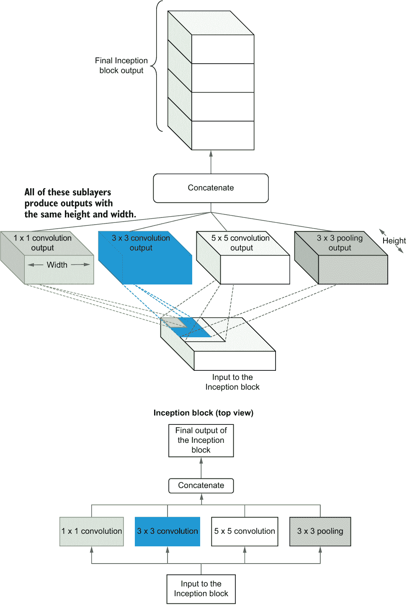

图 6.11 Inception 块中的计算，本质上是一组具有不同核大小的并行卷积/池化层

让我们了解为什么这些并行卷积层比具有相同核大小的巨型卷积滤波器块更好。主要优势在于 Inception 块与单个卷积块相比具有高度参数效率。我们可以通过一些数字来确保这一点。假设我们有两个卷积块：一个是 Inception 块，一个是标准卷积块。假设 Inception 块具有以下参数：

+   一个具有 32 个滤波器的 1 × 1 卷积层

+   一个具有 16 个滤波器的 3 × 3 卷积层

+   一个具有 16 个滤波器的 5 × 5 卷积层

如果你要设计一个具有 Inception 块表示能力的标准卷积层，你会需要

+   一个具有 64 个滤波器的 5 × 5 卷积层

假设我们正在处理一个单通道的输入，Inception 块的参数为 576，由以下给出

1 × 1 × 1 × 32 + 3 × 3 × 1 × 16 + 5 × 5 × 1 × 16 = 576

标准卷积块具有 1,600 个参数：

5 × 5 × 1 × 64 = 1,600

换句话说，与具有 Inception 块表示能力的标准卷积层相比，Inception 块减少了 64% 的参数数量。

Inception 块与稀疏性之间的联系

对于好奇的人们，可能还有一个持续存在的问题：Inception 块是如何引入稀疏性的？想象一下以下两种情况，你有三个卷积滤波器。在一个场景中，你有三个 5 × 5 卷积滤波器，而在另一个场景中，你有一个 1 × 1、3 × 3 和 5 × 5 卷积滤波器。图 6.12 展示了这两种情景之间的差异。

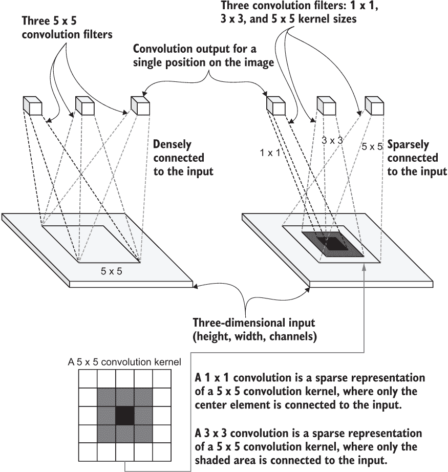

图 6.12 Inception 块如何促进模型的稀疏性。你可以将 1 × 1 卷积看作是一个高度稀疏的 5 × 5 卷积。

不难看出，当你有三个 5 × 5 卷积滤波器时，它会在卷积层和输入之间创建非常密集的连接。然而，当你有一个 1 × 1、3 × 3 和 5 × 5 卷积层时，输入和层之间的连接更加稀疏。另一种思考方式是，1 × 1 卷积本质上是一个 5 × 5 卷积层，其中除了中心元素外，所有元素都关闭了。因此，1 × 1 卷积是一个高度稀疏的 5 × 5 卷积层。类似地，3 × 3 卷积是一个稀疏的 5 × 5 卷积层。通过引入稀疏性，我们使 CNN 参数高效，并减少了过拟合的可能性。这个解释受到了 [`mng.bz/Pn8g`](http://mng.bz/Pn8g) 中讨论的启发。

1 × 1 卷积作为降维方法

通常，你的模型越深，性能越高（假设你有足够的数据）。正如我们已经知道的，CNN 的深度是有代价的。层数越多，参数就越多。因此，你需要特别注意深度模型的参数数量。

作为一个深度模型，Inception 网络利用 Inception 块内的 1 × 1 卷积滤波器来抑制参数的大幅增加。通过使用 1 × 1 卷积层，将较大的输入产生较小的输出，并将这些较小的输出作为输入传递给 Inception 块中的卷积子层（图 6.13）。例如，如果你有一个 10 × 10 × 256 大小的输入，通过将其与具有 32 个滤波器的 1 × 1 卷积层进行卷积，你将得到一个 10 × 10 × 32 大小的输出。这个输出比原始输入小了八倍。换句话说，1 × 1 卷积减小了大输入的通道深度/维度。

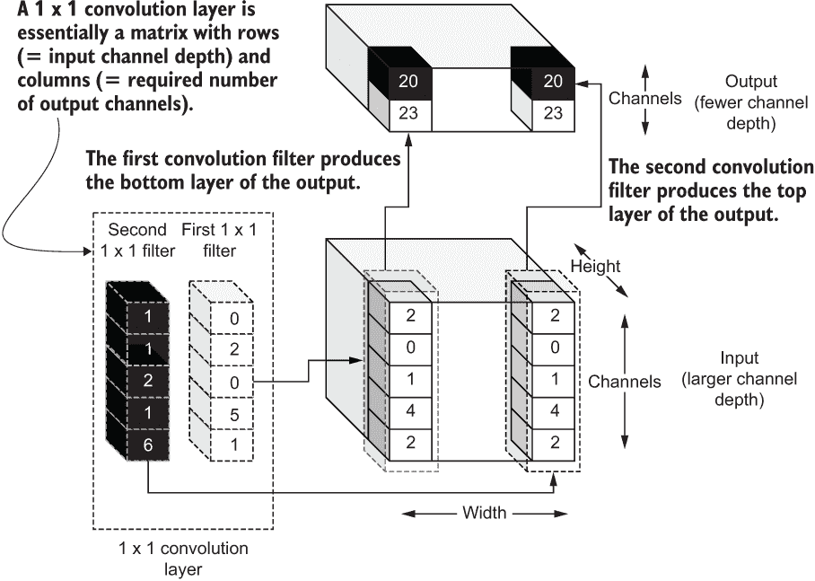

图 6.13 1 × 1 卷积的计算以及它如何实现输入通道维度的降维

因此，它被认为是一种降维方法。这些 1 × 1 卷积的权重可以被视为网络的参数，并且让网络学习这些滤波器的最佳值来解决给定的任务。

现在是时候定义一个函数，代表这个新的、改进的 Inception 块了，如下清单所示。

代码清单 6.4 定义 Inception 网络的 Inception 块

```py
def inception(inp, n_filters):

    # 1x1 layer
    out1 = Conv2D(
        n_filters[0][0], (1,1), strides=(1,1), activation='relu', 
➥ padding='same'
    )(inp)

    # 1x1 followed by 3x3
    out2_1 = Conv2D(
        n_filters[1][0], (1,1), strides=(1,1), activation='relu', 
➥ padding='same')
(inp)
    out2_2 = Conv2D(
        n_filters[1][1], (3,3), strides=(1,1), activation='relu', 
➥ padding='same'
)(out2_1)

# 1x1 followed by 5x5
out3_1 = Conv2D(
    n_filters[2][0], (1,1), strides=(1,1), activation='relu', 
➥ padding='same'
)(inp)
out3_2 = Conv2D(
    n_filters[2][1], (5,5), strides=(1,1), activation='relu', 
➥ padding='same'
)(out3_1)

# 3x3 (pool) followed by 1x1
out4_1 = MaxPool2D(
    (3,3), strides=(1,1), padding='same'
)(inp)
out4_2 = Conv2D(
    n_filters[3][0], (1,1), strides=(1,1), activation='relu', 
➥ padding='same'
)(out4_1)

out = Concatenate(axis=-1)([out1, out2_2, out3_2, out4_2])
return out
```

inception() 函数接受一些输入（四维：批次、高度、宽度、通道、维度）和 Inception 块中卷积子层的过滤器尺寸列表。 此列表应按照以下格式具有过滤器尺寸：

```py
[(1x1 filters), (1x1 filters, 3x3 filters), (1x1 filters, 5x5 filters), (1x1 filters)]
```

外循环对应 Inception 块中的垂直柱，内循环对应每个柱中的卷积层（*图 6.14*）。

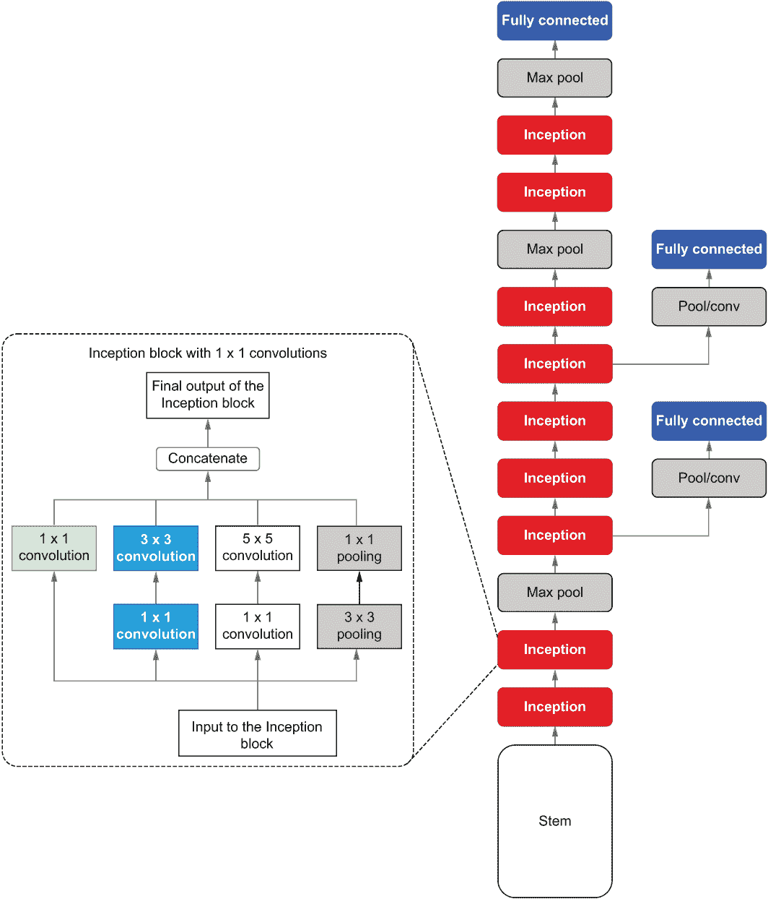

图 6.14 Inception 块与 Inception 网模型的完整架构并排

然后，我们定义了四个垂直计算流，最后在末端连接到一个：

+   1 × 1 卷积

+   1 × 1 卷积接着是一个 3 × 3 卷积

+   1 × 1 卷积接着是一个 5 × 5 卷积

+   3 × 3 池化层接着是一个 1 × 1 卷积

使用 1 × 1 卷积进行尺寸缩减的数学视图

如果您不喜欢生动的方法，这里是更简洁和数学化的视图，说明 1 × 1 卷积如何减少维度。 假设您有尺寸为 10 × 10 × 256 的输入。 假设您有尺寸为 1 × 1 × 32 的卷积层：

+   尺寸（输入）= 10 × 10 × 256

+   尺寸（层）= 1 × 1 × 32

您可以将您的卷积层表示为 1 × 32 矩阵。 接下来，在 axis = 0（即行维度）上重复列，重复 256 次，得到我们

+   尺寸（输入）= 10 × 10 × 256

+   尺寸（层）= 256 × 32

现在您可以将输入与卷积滤波器相乘

+   尺寸（输出）=（10 × 10 × 256）（256 × 32）

这给我们一个尺寸为

+   尺寸（输出）= 10 × 10 × 32

比原始输入小得多。

最后，我们将所有这些流的输出连接到最后一个轴上（由 axis = -1 表示）。 请注意，最后一个维度是所有输出的通道维度。 换句话说，我们在通道维度上堆叠这些输出。 图 6.14 说明了 Inception 块如何在整体 Inception 网模型中定位。 接下来，我们将讨论 Inception 网模型的另一个组件，称为辅助输出层。

辅助输出层

最后，我们有两个辅助输出层，帮助稳定我们的深度 CNN。 正如前面提到的，辅助输出存在是为了稳定深度网络的训练。 在 Inception 网中，辅助输出层具有以下（图 6.15）。

+   一个 5 × 5 平均池化层

+   一个 1 × 1 卷积层

+   一个具有 ReLU 激活的 Dense 层，从 1 × 1 卷积层接收平铺输出

+   一个具有 softmax 的 Dense 层，输出类别的概率


图 6.15 辅助输出层与完整的 Inception 网架构并排

我们定义一个函数，按如下方式产生辅助输出预测（清单 6.5）。

清单 6.5 定义辅助输出作为 Python 函数

```py
def aux_out(inp,name=None):    
    avgpool1 = AvgPool2D((5,5), strides=(3,3), padding='valid')(inp)       ❶
    conv1 = Conv2D(128, (1,1), activation='relu', padding='same')(avgpool1)❷
    flat = Flatten()(conv1)                                                ❸
    dense1 = Dense(1024, activation='relu')(flat)                          ❹
    aux_out = Dense(200, activation='softmax', name=name)(dense1)          ❺
    return aux_out
```

❶ 平均池化层的输出。 请注意，它使用有效池化，这导致下一层的输出为 4 × 4 大小。

❷ 1 × 1 卷积层的输出

❸ 将卷积层的输出展平，以便馈送到 Dense 层中

❹ 第一个 Dense 层的输出

❺ 最终预测 Dense 层的输出

aux_out() 函数定义了辅助输出层。它以一个核大小为(5,5) 和步长为(3,3) 的平均池化层开始，以及有效的填充。这意味着该层不会尝试纠正池化引入的维度减少（与相同填充相反）。然后，它后面跟着一个具有 128 个滤波器的卷积层，(1,1) 核大小，ReLU 激活和相同填充。然后，需要一个 Flatten() 层，然后将输出馈送到一个 Dense 层。请记住，Flatten() 层将高度、宽度和通道维度展平为一个单一维度。最后，应用一个具有 200 个节点和 softmax 激活的 Dense 层。有了这些，我们就有了构建自己的 Inception 网络的所有构建模块。

### 6.3.3 将所有内容整合在一起

我们已经走了很长的路。让我们喘口气，回顾一下我们迄今为止取得的成就：

+   Inception 网络模型的抽象架构和组件包括一个干扰块、Inception 块和辅助输出。

+   这些组件的详细信息。干扰块类似于标准 CNN 的干扰块（除了全连接层）。Inception 块携带具有不同核大小的子卷积层，这些卷积层鼓励稀疏性并减少过拟合。

+   辅助输出使网络训练更加平滑，并消除了训练过程中的任何不良数值错误。

我们还定义了封装这些的方法，以便我们可以调用这些方法并构建完整的 Inception 网络。现在我们可以定义完整的 Inception 模型（请参阅下一个列表）。此外，您可以在表 6.5 中找到精确的 Inception 块规范（按照原始论文）的摘要。

列表 6.6 定义完整的 Inception 网络模型

```py
def inception_v1():

    K.clear_session()

    inp = Input(shape=(56,56,3))                                          ❶
    stem_out = stem(inp)                                                  ❷
    inc_3a = inception(stem_out, [(64,),(96,128),(16,32),(32,)])          ❸
    inc_3b = inception(inc_3a, [(128,),(128,192),(32,96),(64,)])          ❸

    maxpool = MaxPool2D((3,3), strides=(2,2), padding='same')(inc_3b)

    inc_4a = inception(maxpool, [(192,),(96,208),(16,48),(64,)])          ❸
    inc_4b = inception(inc_4a, [(160,),(112,224),(24,64),(64,)])          ❸

    aux_out1 = aux_out(inc_4a, name='aux1')                               ❹

    inc_4c = inception(inc_4b, [(128,),(128,256),(24,64),(64,)])
    inc_4d = inception(inc_4c, [(112,),(144,288),(32,64),(64,)])
    inc_4e = inception(inc_4d, [(256,),(160,320),(32,128),(128,)])

    maxpool = MaxPool2D((3,3), strides=(2,2), padding='same')(inc_4e)

    aux_out2 = aux_out(inc_4d, name='aux2')                               ❹

    inc_5a = inception(maxpool, [(256,),(160,320),(32,128),(128,)])
    inc_5b = inception(inc_5a, [(384,),(192,384),(48,128),(128,)])
    avgpool1 = AvgPool2D((7,7), strides=(1,1), padding='valid')(inc_5b)   ❺

    flat_out = Flatten()(avgpool1)                                        ❻
    out_main = Dense(200, activation='softmax', name='final')(flat_out)   ❼

    model = Model(inputs=inp, outputs=[out_main, aux_out1, aux_out2])   
    model.compile(loss='categorical_crossentropy', 
                       optimizer='adam', metrics=['accuracy'])            ❽
    return model
```

❶ 定义一个输入层。它接收一个大小为 64 × 64 × 3 的批处理输入。

❷ 要定义干扰块，我们使用了之前定义的干扰块() 函数。

❸ 定义 Inception 块。请注意，每个 Inception 块具有不同数量的滤波器。

❹ 定义辅助输出

❺ 最终池化层被定义为一个平均池化层。

❻ Flatten 层将平均池化层展平，并为全连接层做好准备。

❼ 最终预测层，具有 200 个输出节点（每个类别一个）

❽ 在编译模型时，我们对所有输出层和优化器 adam 使用分类交叉熵损失。

您可以看到该模型按照原始论文的规定有九个 Inception 块。此外，它还具有干扰块、辅助输出和最终输出层。层的具体规格列在表 6.5 中。

表 6.5 Inception 网络 v1 模型中 Inception 模块的滤波器计数摘要。C(nxn) 表示 nxn 卷积层，而 MaxP(mxm) 表示 mxm 最大池化层。

| **Inception 层** | **C(1 × 1)** | **C(1 × 1); 在 C(3 × 3) 之前** | **C(3 × 3)** | **C(1 × 1); 在 C(5 × 5) 之前** | **C(5 × 5)** | **C(1 × 1); 在 MaxP(3 × 3) 之后** |
| --- | --- | --- | --- | --- | --- | --- |
| Inc_3a | 64 | 96 | 128 | 16 | 32 | 32 |
| Inc_3b | 128 | 128 | 192 | 32 | 96 | 64 |
| Inc_4a | 192 | 96 | 208 | 16 | 48 | 64 |
| Inc_4b | 160 | 112 | 224 | 24 | 64 | 64 |
| Inc_4c | 128 | 128 | 256 | 24 | 64 | 64 |
| Inc_4d | 112 | 144 | 288 | 32 | 64 | 64 |
| Inc_4e | 256 | 160 | 320 | 32 | 128 | 128 |
| Inc_5a | 256 | 160 | 320 | 32 | 128 | 128 |
| Inc_5b | 384 | 192 | 384 | 48 | 128 | 128 |

层的定义将与您已经看到的相当相似。然而，我们定义模型和编译模型的方式对于一些人来说可能是新的。正如我们讨论的那样，Inception 网络是一个多输出模型。您可以通过传递输出列表而不是单个输出来定义具有多个输出的 Keras 模型：

```py
model = Model(inputs=inp, outputs=[out_main, aux_out1, aux_out2])
```

在编译模型时，您可以将损失定义为一个字符串列表。如果定义一个字符串，那么该损失将用于所有输出。我们使用分类交叉熵损失（对于最终输出层和辅助输出层）和优化器 adam 来编译模型，adam 是一种广泛用于优化模型的先进优化器，它可以随着模型训练适当地调整学习率。此外，我们将检查模型的准确性：

```py
model.compile(loss='categorical_crossentropy', optimizer='adam', metrics=['accuracy'])
```

通过定义 inception_v1() 函数，您可以创建一个模型如下：

```py
model = inception_v1()
```

让我们花点时间回顾一下我们迄今为止所取得的成就。我们已经下载了数据，剖析了数据，并分析了数据以了解具体情况。然后，我们使用 tensorflow.keras.preprocessing.image.ImageDataGenerator 创建了一个图像数据管道。我们将数据分成了三部分：训练、验证和测试。最后，我们定义了我们的模型，这是一个被称为 Inception 网络的最先进的图像分类器。现在我们将看看多年来出现的其他 Inception 模型。

### 6.3.4 其他 Inception 模型

我们成功地实现了一个 Inception 网络模型，它涵盖了我们需要理解其他 Inception 模型的大部分基础知识。自 v1 模型以来已经有五个更多的 Inception 网络。让我们简要地了解一下 Inception 网络的演变。

Inception v1

我们已经深入讨论了 Inception 网络 v1。Inception 网络 v1 中引入的最大突破如下：

+   Inception 块的概念允许 CNN 在模型的相同深度拥有不同的感受野（即，卷积核大小）。这鼓励模型的稀疏性，导致参数更少，过拟合的机会也更少。

+   在 Inception 模型的 20 层中，如果不小心，现代 GPU 的内存可能会被耗尽。Inception 网络通过使用 1 × 1 卷积层来减少输出通道深度，以缓解这个问题。

+   网络越深，在模型训练过程中，梯度不稳定的可能性就越大。这是因为梯度必须经过很长的路径（从顶部到最底部），这可能导致梯度不稳定。在网络中间引入辅助输出层作为正则化器可以缓解这个问题，从而导致梯度稳定。

Inception v2

Inception net v2 出现在 Inception net v1 发布后不久（“Rethinking the Inception Architecture for Computer Vision”，[`arxiv.org/pdf/1512.00567.pdf`](https://arxiv.org/pdf/1512.00567.pdf)）。这个模型的主要贡献如下。

当层的容量（即参数）不足以学习输入的良好表示时，就会发生表示瓶颈。如果在深度递减时层的大小减小得太快，这种情况可能会发生。Inception v2 重新设计了架构，以确保模型中不存在表示瓶颈。这主要通过改变层大小而保持其他细节不变来实现。

进一步减少网络参数以减少过拟合被强化。这是通过用 3 × 3 卷积（也称为因式分解大卷积层）替换更高阶的卷积（例如，5 × 5 和 7 × 7）来实现的。这是如何可能的？让我为您说明一下（图 6.16）。

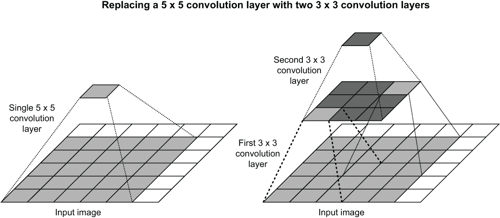

图 6.16 一个 5 × 5 卷积层（左）和两个 3 × 3 卷积层（右）

将 5 × 5 卷积表示为两个更小的 3 × 3 卷积操作，我们可以减少 28% 的参数。图 6.17 对比了 Inception v1 块和 Inception v2 块。

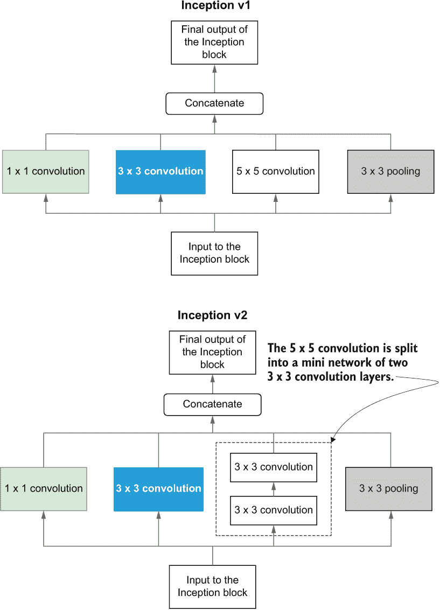

图 6.17 Inception net v1 中的 Inception 块（左）与 Inception net v2 中的 Inception 块（右）

TensorFlow 代码如下：

```py
# 1x1 layer
out1 = Conv2D(64, (1,1), strides=(1,1), activation='relu', padding='same')(inp)
# 1x1 followed by 3x3
out2_1 = Conv2D(
    96, (1,1), strides=(1,1), activation='relu', padding='same'
)(inp)
out2_2 = Conv2D(
    128, (3,3), strides=(1,1), activation='relu', padding='same'
)(out2_1)

# 1x1 followed by 5x5
# Here 5x5 is represented by two 3x3 convolution layers
out3_1 = Conv2D(
    16, (1,1), strides=(1,1), activation='relu', padding='same'
)(inp)
out3_2 = Conv2D(
    32, (3,3), strides=(1,1), activation='relu', padding='same'
)(out3_1)
out3_3 = Conv2D(
    32, (3,3), strides=(1,1), activation='relu', padding='same'
)(out3_2)

# 3x3 (pool) followed by 1x1
out4_1 = MaxPool2D((3,3), strides=(1,1), padding='same')(inp)
out4_2 = Conv2D(
    32, (1,1), strides=(1,1), activation='relu', padding='same'
)(out4_1)

out = Concatenate(axis=-1)([out1, out2_2, out3_3, out4_2])
```

但我们不必止步于此。我们可以将任何 n × n 卷积操作因式分解为两个 1 × n 和 n × 1 卷积层，例如，对于 3 × 3 卷积层，可以减少 33% 的参数（图 6.18）。经验上发现，将 n × n 操作分解为两个 1 × n 和 n × 1 操作仅在更高层中有用。您可以参考论文以了解这些类型的因式分解何时以及在哪里使用。

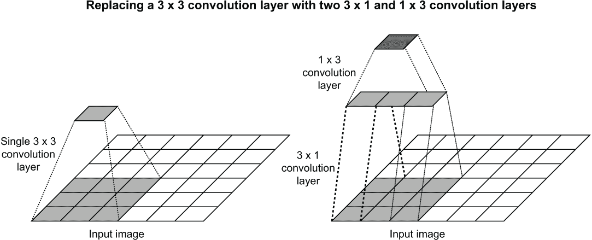

图 6.18 一个 3 × 3 卷积层（左）和一个 3 × 1 和一个 1 × 3 卷积层（右）

Inception v3

Inception v3 是在同一篇论文中引入的 Inception net v2\. 与 v2 不同的主要贡献是使用批量标准化层。批量标准化（“Batch Normalization: Accelerating Deep Network Training by Reducing Internal Covariate Shift”，[`proceedings.mlr.press/v37/ioffe15.pdf`](http://proceedings.mlr.press/v37/ioffe15.pdf)）通过减去给定层 *x* 的平均值（*E*(*x*)）和标准差（√(*Var*(*x*))）来标准化给定层的输出：

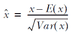

这个过程帮助网络稳定其输出值，而不让它们变得太大或太小。接下来，它有两个可训练参数，*γ* 和 *β*，用于缩放和偏移归一化输出：

y = *γ* *x̂* + *β*

这样，网络就可以通过学习 *γ* 和 *β* 的最佳化来学习归一化的自己变化，以防 *x̂* 不是最佳的归一化配置。此时，你只需要理解批归一化归一化给定层的输出。我们将在下一章更详细地讨论批归一化在 Inception 网模型中的使用方式。

Inception v4

Inception-v4 是在论文“Inception-v4, Inception-ResNet and the Impact of Residual Connections on Learning”([`mng.bz/J28P`](http://mng.bz/J28P)) 中引入的，并没有引入任何新的概念，而是专注于使模型更简单，而不会牺牲性能。主要是，v4 简化了网络的干部和其他元素。由于这主要是为了更好地调整网络的超参数以获得更好的性能，而不是引入任何新的概念，所以我们不会深入研究这个模型。

Inception-ResNet v1 和 Inception-ResNet v2

Inception-ResNet v1 和 v2 在同一篇论文中被介绍，并且是其主要贡献。Inception-ResNet 简化了该模型中使用的 Inception 块，并删除了一些杂乱的细节。更重要的是，它引入了残差连接。*残差连接*（或 *跳过连接*）是由 Kaiming He 等人在题为“Deep Residual Learning for Image Recognition”的论文中介绍的 ([`arxiv.org/ pdf/1512.03385.pdf`](https://arxiv.org/pdf/1512.03385.pdf))。这是一个简单而优雅的概念，却非常强大，它已经成为许多不同领域中表现最佳的模型的原因之一。

如图 6.19 所示，残差连接简单地将较低层（靠近输入）的输入添加到较高层（远离输入）的输入中。这样就在较低层和较高层之间创建了一条捷径，实质上是在结果输出与较低层之间创建了另一个捷径。我们不会在这里深入讨论太多细节，因为我们将在下一章详细讨论 Inception-ResNet 模型。接下来，我们将训练我们刚刚定义的模型，使用我们准备的图像数据。

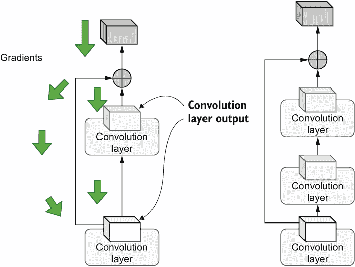

图 6.19 残差连接是如何引入到网络中的。这是一个简单的操作，其中你将一层的较低输出（更接近输入）添加到一层的较高输出（远离输入）中。跳过连接可以设计成跳过您喜欢的任意数量的层。图还突出了梯度的流动；您可以看到跳过连接如何允许梯度绕过某些层并传播到较低层。

练习 3

作为研究的一部分，您正在测试一种称为*poolception*的新技术。概念上类似于 Inception 块，poolception 具有三个并行的池化层，具有以下规格：

+   一个带有步长为 2 和相同填充的 3×3 最大池化层

+   一个带有步长为 2 和相同填充的 5×5 最大池化层

+   一个带有步长为 2 和相同填充的 3×3 平均池化层

最后，这些层的输出在通道轴上串联起来。您能将此实现为一个名为 poolception 的 Python 函数，该函数以前一层的输入 x 作为参数吗？

## 6.4 训练模型和评估性能

很棒！您已经定义了一个在类似（更大）数据集上表现良好的最先进模型架构之一。您的下一个任务是训练此模型并分析其性能。

模型训练是一个必不可少的步骤，如果您需要一个性能良好的模型，一旦到了使用它的时候。训练模型会优化（即更改）模型的参数，使其能够在给定输入时产生正确的预测。通常，模型训练是在多个时期进行的，其中每个时期可以包含数千个迭代。这个过程可能需要数小时甚至数周，这取决于数据集的大小和模型。正如我们已经讨论过的，由于其众所周知的内存需求，深度神经网络以小批量方式消耗数据。优化模型与单个数据批次的步骤称为*迭代*。当您以这种批量方式遍历整个数据集时，它被称为*时期*。

最后，一旦训练完成，您需要确保模型在未见过的数据上表现良好。这些未见过的数据在训练过程中不得与模型发生任何交互。深度学习网络最常见的评估指标是准确率。因此，我们测量测试准确率以确保模型的稳健性。

为了训练模型，让我们首先定义一个函数，该函数计算每个时期的步数或迭代次数，给定数据集的大小和批量大小。对于每个时期都运行预定义数量的步骤总是一个好主意。有些情况下，Keras 无法确定步骤的数量，这种情况下，它可能会使模型运行，直到您停止它：

```py
def get_steps_per_epoch(n_data, batch_size):
    if n_data%batch_size==0:
        return int(n_data/batch_size)
    else:
        return int(n_data*1.0/batch_size)+1
```

这是一个非常简单的计算。每个时期的步数是数据点数（n_data）除以批量大小（batch_size）。如果 n_data 不可被 batch_size 整除，则需要将返回值加 1，以确保不会丢失任何数据。现在让我们在下面的列表中训练模型。

列表 6.7 训练 Inception 网络

```py
from tensorflow.keras.callbacks import CSVLogger
import time
import os

if not os.path.exists('eval'):
    os.mkdir('eval')                                               ❶

csv_logger = CSVLogger(os.path.join('eval','1_eval_base.log'))     ❷

history = model.fit(
    x=train_gen_aux,                                               ❸
    validation_data=valid_gen_aux,                                 ❸
    steps_per_epoch=get_steps_per_epoch(0.9*500*200,batch_size),   ❸
    validation_steps=get_steps_per_epoch(0.1*500*200,batch_size),  ❸
    epochs=50, 
    callbacks=[csv_logger]                                         ❸
)                                                                  ❸

if not os.path.exists('models'):
    os.mkdir("models")
model.save(os.path.join('models', 'inception_v1_base.h5'))         ❹
```

❶ 创建一个名为 eval 的目录来存储性能结果

❷ 这是一个您传递给 fit() 函数的 Keras 回调函数。它将指标数据写入 CSV 文件。

❸ 通过拟合模型，您可以看到我们正在将训练和验证数据生成器传递给函数。

❹ 将模型保存到磁盘上，以便在需要时重新加载

训练模型时，通常会遵循以下步骤：

+   为一定数量的周期训练模型。

+   每个训练周期结束时，在验证数据集上测量性能。

+   所有训练周期结束后，对测试集的性能进行测量。

当在代码中调用 model.fit()时，它会处理前两个步骤。我们将更详细地查看 model.fit()函数。我们向函数传递以下参数：

+   X—将训练数据生成器传递给模型，其中包含输入（x）和目标（y）。

+   y—通常接收目标值。在这里，我们不指定 y，因为 x 已经包含了目标。

+   validation_data—接收验证数据生成器。

+   steps_per_epoch—训练中每个周期的步数（迭代次数）。

+   validation_steps—验证中每个周期的步数（迭代次数）。

+   epochs—周期数。

+   回调函数—需要传递给模型的任何回调函数（有关回调函数的完整列表，请访问[`mng.bz/woEW`](http://mng.bz/woEW)）。

在训练模型后，您应该会得到以下结果之类的内容：

```py
Train for 704 steps, validate for 79 steps
Epoch 1/50
704/704 [==============================] - 196s 279ms/step - loss: 14.6223 
➥ - final_loss: 4.9449 - aux1_loss: 4.8074 - aux2_loss: 4.8700 - 
➥ final_accuracy: 0.0252 - aux1_accuracy: 0.0411 - aux2_accuracy: 0.0347 
➥ - val_loss: 13.3207 - val_final_loss: 4.5473 - val_aux1_loss: 4.3426 - 
➥ val_aux2_loss: 4.4308 - val_final_accuracy: 0.0595 - val_aux1_accuracy: 
➥ 0.0860 - val_aux2_accuracy: 0.0765
...
Epoch 50/50
704/704 [==============================] - 196s 279ms/step - loss: 0.6361 - 
➥ final_loss: 0.2271 - aux1_loss: 0.1816 - aux2_loss: 0.2274 - 
➥ final_accuracy: 0.9296 - aux1_accuracy: 0.9411 - aux2_accuracy: 0.9264 
➥ - val_loss: 27.6959 - val_final_loss: 7.9506 - val_aux1_loss: 10.4079 - 
➥ val_aux2_loss: 9.3375 - val_final_accuracy: 0.2703 - val_aux1_accuracy: 
➥ 0.2318 - val_aux2_accuracy: 0.2361
```

注意 在一台配备 Intel Core i5 处理器和 NVIDIA GeForce RTX 2070 8GB 显卡的机器上，训练大约需要 2 小时 45 分钟。您可以通过减少训练周期的数量来减少训练时间。

最后，我们将在测试数据上测试训练好的模型（即 val 文件夹中的数据）。您可以通过调用 model.evaluate()并传递测试数据生成器（test_gen_aux）和测试集的步数（迭代次数）来轻松获取模型的测试性能：

```py
model = load_model(os.path.join('models','inception_v1_base.h5'))
test_res = model.evaluate(test_gen_aux, steps=get_steps_per_epoch(200*50, 
➥ batch_size))
test_res_dict = dict(zip(model.metrics_names, test_res))
```

您将会得到以下输出：

```py
196/196 [==============================] - 17s 88ms/step - loss: 27.7303 - 
➥ final_loss: 7.9470 - aux1_loss: 10.3892 - aux2_loss: 9.3941 - 
➥ final_accuracy: 0.2700 - aux1_accuracy: 0.2307 - aux2_accuracy: 0.2367
```

我们可以看到模型达到了约 30%的验证和测试准确率以及惊人的约 94%的训练准确率。这清楚地表明我们没有完全避免过拟合。但这并不完全是坏消息。三十％的准确率意味着模型在验证和测试集中识别了约 3,000/10,000 张图像。就纯粹的数据量而言，这相当于 200 个类别中的 60 个。

注意 过拟合的模型就像一个把所有答案都背下来的学生，而泛化的模型是一个努力理解将在考试中测试的概念的学生。背诵答案的学生只会在考试中表现良好，在现实世界中会失败，而理解概念的学生可以将他们的知识推广到考试和现实世界中。

过度拟合可能会出现几种原因：

+   模型架构对我们拥有的数据集来说并不是最佳的。

+   需要更多的正则化来减少过拟合，比如 dropout 和批归一化。

+   我们没有使用已经在类似数据上训练过的预训练模型。

我们将在下一章中解决这些问题，看到事情会有多大改善将会令人兴奋。

练习 4

如果用一个包含 50,000 个样本且批次大小为 250 的数据集训练模型 10 个周期，那么你会训练模型多少次迭代？假设输入和标签分别存储在变量 x 和 y 中，填写 model.fit() 中的必要参数以根据这个规范训练模型。在不使用数据生成器时，可以使用 batch_size 参数设置批次大小，并在 model.fit() 中忽略 steps_per_epoch 参数（自动推断）。

## 总结

+   探索性数据分析（EDA）是机器学习生命周期中必须在开始任何建模之前执行的关键步骤。

+   分析数据的方面越多，效果越好。

+   Keras 数据生成器可以用来从磁盘读取图像并将它们加载到内存中以训练模型。

+   Inception 网络 v1 是用于图像分类的最新计算机视觉模型之一，旨在减少过拟合和深度模型的内存需求。

+   Inception 网络 v1 包括一个 stem、若干 inception 块和辅助输出。

+   Inception 块是 Inception 网络中的一层，包含多个具有不同卷积核大小的子卷积层，而辅助输出确保模型训练的平稳性。

+   训练模型时，会使用三个数据集：训练集、验证集和测试集。

+   通常情况下，我们会在训练数据上训练模型多个周期，在每个周期结束时在验证集上评估性能。最后，在训练结束后，我们会在测试数据集上评估性能。

+   过拟合的模型就像一个把所有答案都记住的学生，它在训练数据上表现很好，但在将知识概括应用于未见数据分析时效果很差。

## 练习答案

**练习 1**

```py
def get_img_minimum(path):
    img = np.array(Image.open(path))
    return np.min(img)

df[“minimum”] = df[“filepath”].apply(lambda x: get_img_minimum(x))
```

**练习 2**

```py
def data_gen_corrupt(gen):
    for x,y in gen:
        if np.random.normal()>0:
            y = 0
        yield x,(y,y,y)

```

**练习 3**

```py
def poolception(x):
    out1 = MaxPool2D(pool_size=(3,3), strides=(2,2), padding=’same’)(x)
    out2 = MaxPool2D(pool_size=(5,5), strides=(2,2), padding=’same’)(out1)
    out3 = AvgPool2D(pool_size=(3,3), strides=(2,2), padding=’same’)(out2)
    out = Concatenate(axis=-1)([out1, out2, out3])
    return out
```

**练习 4：** 总迭代次数 = （数据集大小/批次大小）* 周期数 = （50,000/250）* 10 = 2,000

```py
model.fit(x=x, y=y, batch_size=250, epochs=10)
```
