# 第七章：教会机器更好地看：改善 CNNs 并让它们承认

本章内容包括

+   减少图像分类器的过拟合

+   通过更好的模型架构提升模型性能

+   使用预训练模型和迁移学习进行图像分类

+   现代 ML 解释技术来解剖图像分类器

我们已经开发并训练了一款名为 Inception net v1 的最先进的图像分类器，它在一个物体分类数据集上进行了训练。Inception net v1 是计算机视觉中一个广为人知的图像分类模型。你学习了 Inception 块是如何通过在多个尺度上聚合卷积窗口来创建的，这鼓励了模型中的稀疏性。你还看到了如何使用 1 × 1 卷积来保持层的维度最小。最后，我们观察到 Inception net v1 如何在网络中部使用辅助分类层来稳定和维持整个网络中的梯度流。然而，结果并没有真正达到模型的声誉，它在验证和测试准确性上过度拟合，验证和测试准确率约为 30%，而训练准确率则高达约 94%。在本章中，我们将讨论通过减少过拟合和提高验证和测试准确率来改善模型，最终将使我们得到一个在验证和测试集上达到约 80% 准确率（相当于能够准确识别 160/200 类物体）的模型。此外，我们还将研究允许我们探索模型思维的技术，以获得洞察。

本章将带你走过一个激动人心的旅程，在这个旅程中，我们将把一个次优的机器学习模型变成一个显著优秀的模型。这个过程将使人联想起我们在上一章所做的事情。我们将增加一个额外的步骤来解释/解读模型所做的决策。我们将使用特殊的技术来看看模型在做出预测时对图像的哪个部分支付了最多的注意力。这有助于我们对模型建立信任。在这个过程中，我们识别出模型中潜藏的问题，并系统地修复它们以提高性能。我们将讨论几种重要的技术，包括以下内容：

+   通过使用各种图像变换技术如亮度/对比度调整、旋转和平移来增广数据，为模型创建更多标记数据

+   实现一个更适合所使用的数据大小和类型的 Inception net 变体

+   使用迁移学习来利用已经在更大数据集上训练过的模型，并对其进行微调，以在我们拥有的数据集上表现良好

如果你曾经需要为不熟悉的问题实施深度学习解决方案，那么这一章可能会与你产生共鸣。通常，仅仅实施“某些”深度网络并不会让你登上成功的顶峰。如果问题的新颖性或手头问题的定制性质没有处理好，它会阻碍你的进展。这样的难题会把你带入未知领域，你需要小心行事，找到解决方案而不至于筋疲力尽。本章将为任何可能在计算机视觉领域面对类似情况的人提供指导。

## 7.1 减少过拟合的技术

我们正在追求一个雄心勃勃的目标，即开发一个智能购物助手应用程序，其中会使用图像/物体分类器作为重要组件。为此，我们将使用数据集 tiny-imagenet-200，它是大型 ImageNet 图像分类数据集的一个较小版本，由图像和表示该图像中存在的对象类别组成。该数据集有一个训练子集和一个测试子集。你进一步将训练子集分成训练集（原始的 90%）和验证集（原始的 10%）。

你已经基于著名的 Inception 网络模型开发了一个模型，但它严重过拟合。需要缓解过拟合，因为它会导致模型在训练数据上表现非常好，但在测试/真实世界数据上表现不佳。你知道几种减少过拟合的技术，即数据增强（从现有数据中创建更多数据；对于图像，这包括通过引入随机亮度/对比度调整、平移、旋转等方式创建相同图像的变体）、随机失活（即在训练期间随机关闭网络中的节点）以及提前停止（即在过拟合发生前终止模型训练）。你希望利用 Keras API 来减少过拟合。

通常，减少过拟合需要仔细检查整个机器学习流程。这涉及到输入的数据、模型结构和模型训练。在这一节中，我们将看看所有这些方面，并了解如何防止过拟合。此部分的代码可在 Ch07-Improving-CNNs-and-Explaining/7.1.Image_Classification_Advance.ipynb 中找到。

### 7.1.1 使用 Keras 进行图像数据增强

首先是在训练集中增加数据。 数据增强是一种常见的方法，可以增加深度学习网络可用的数据量，而无需对新数据进行标记。 例如，在图像分类问题中，您可以通过创建同一图像的多个变换版本（例如，移动图像，更改亮度）并具有与原始图像相同的标签（图 7.1）来从单个图像创建多个数据点。 如前所述，更多数据通过增加泛化能力（减少过拟合）来增强深度学习模型的强度，从而在实际应用中实现可靠的性能。 对于图像数据，您可以使用许多不同的增强技术：

+   随机调整亮度、对比度等

+   随机缩放、旋转、平移等

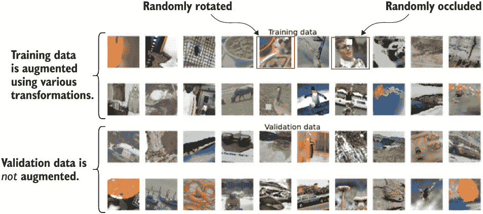

图 7.1 在增强步骤之后的训练数据和验证数据之间的差异。 图清楚地显示了对训练数据应用的各种转换，而对验证数据未应用，正如我们所预期的那样。

通过向我们之前使用的 ImageDataGenerator 提供几个额外参数，可以轻松地实现这种增强。 让我们定义一个新的 Keras ImageDataGenerator，具有数据增强功能。 在 Keras 中，您可以执行大多数这些增强，几乎不需要去其他地方寻找。 让我们看看 ImageDataGenerator 提供的各种选项（仅显示了最重要的参数）。 图 7.2 说明了此处列出的不同参数的效果。

```py
data_gen = tf.keras.preprocessing.image.ImageDataGenerator(
    featurewise_center=False, samplewise_center=False,
    featurewise_std_normalization=False, samplewise_std_normalization=False,
    zca_whitening=False, rotation_range=0, width_shift_range=0.0,
    height_shift_range=0.0, brightness_range=None, shear_range=0.0, 
➥ zoom_range=0.0,
    channel_shift_range=0.0, horizontal_flip=False, 
    vertical_flip=False, fill_mode=”nearest”, rescale=None,
    preprocessing_function=None, validation_split=0.0
)
```

其中

+   featurewise_center 指定是否通过减去整个数据集的平均值来使图像居中（例如，True/False）。

+   samplewise_center 指定是否通过减去每个图像的单个平均值来使图像居中（例如，True/False）。

+   featurewise_std_normalization 与 featurewise_center 相同，但是将图像除以标准偏差而不是减去平均值（True/False）。

+   samplewise_std_normalization 与 samplewise_center 相同，但是将图像除以标准偏差而不是减去平均值（True/False）。

+   zca_whitening 是一种特殊类型的图像归一化，旨在减少图像像素中存在的相关性（请参阅[`mng.bz/DgP0`](http://mng.bz/DgP0)）（True/False）。

+   rotation_range 指定在数据增强期间进行的随机图像旋转的边界（以度为单位）。 具有值在(0, 360)之间的浮点数； 例如，30 表示-30 到 30 的范围； 0 禁用。

+   width_shift_range 指定在数据增强期间在宽度轴上进行的随机移位的边界（作为比例或像素）。

+   值在(-1, 1)之间的元组被视为宽度的比例（例如，(-0.4, 0.3)）。

+   像素的值在(-inf, inf)之间的元组被视为像素（例如，(-150, 250)）。

+   height_shift_range 与 width_shift_range 相同，只是针对高度维度。

+   `brightness_range`指定在数据增强期间对数据进行的随机亮度调整的范围。

+   元组中的值介于（-inf，inf）之间，例如，（-0.2，0.5）或（-5，10）；0 表示禁用。

+   `shear_range`与`brightness_range`相同，但用于在数据增强期间剪切（即倾斜）图像。

+   以度为单位的浮点数，例如，30.0。

+   `zoom_range`与`brightness_range`相同，除了在数据增强期间对图像进行缩放。

+   `horizontal_flip`指定在数据增强期间是否随机水平翻转图像（是/否）。

+   `vertical_flip`与`horizontal_flip`相同，但垂直翻转（是/否）。

+   `fill_mode`定义了通过各种图像变换（例如，将图像向左移动会在右侧创建空白空间）创建的空白空间如何处理。可能的选项是“reflect”，“nearest”和“constant”。图 7.2 的最后一行显示了差异。

+   `rescale`通过常量值重新缩放输入。

+   `preprocessing_function`接受一个 Python 函数，该函数可用于引入额外的数据增强/预处理步骤，这些步骤不容易获得。

+   `validation_split`解决了应该将多少数据用作验证数据的问题。我们不使用此参数，因为我们单独为验证集创建数据生成器，因为我们不希望有增强应用。一个浮点数，例如，0.2。

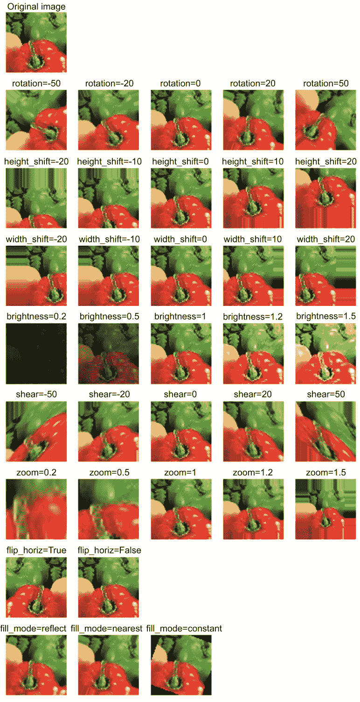

图 7.2 不同增强参数及其`ImageDataGenerator`的值的效果。

通过对不同参数有良好的理解，我们将定义两个图像数据生成器：一个用于数据增强（训练数据），另一个不用于数据增强（测试数据）。对于我们的项目，我们将以以下方式增强数据：

+   随机旋转图像。

+   在宽度维度上随机平移。

+   在高度维度上随机平移。

+   随机调整亮度。

+   随机剪切。

+   随机缩放。

+   随机水平翻转图像。

+   随机伽马校正（自定义实现）。

+   随机遮挡（自定义实现）。

以下列表显示了如何使用验证分割定义`ImageDataGenerator`。

列表 7.1 定义了具有验证分割的`ImageDataGenerator`。

```py
image_gen_aug = ImageDataGenerator(                     ❶
        samplewise_center=False,                        ❷
        rotation_range=30,                              ❸
        width_shift_range=0.2, height_shift_range=0.2,  ❸
        brightness_range=(0.5,1.5),                     ❸
        shear_range=5,                                  ❸
        zoom_range=0.2,                                 ❸
        horizontal_flip=True,                           ❸
        fill_mode='reflect',                            ❸
        validation_split=0.1                            ❹
)
image_gen = ImageDataGenerator(samplewise_center=False) ❺
```

❶ 定义用于训练/验证数据的`ImageDataGenerator`。

❷ 我们将暂时关闭`samplewise_center`并稍后重新引入它。

❸ 先前讨论的各种增强参数（经验设置）。

❹ 将训练数据的 10% 部分用作验证数据。

❺ 定义了用于测试数据的单独`ImageDataGenerator`。

我们经验地选择了这些参数的参数。随意尝试其他参数，并查看它们对模型性能的影响。一个重要的事情要注意的是，与以前的例子不同，我们设置了 samplewise_center=False。这是因为我们计划在标准化之前进行少量自定义预处理步骤。因此，我们将关闭 ImageDataGenerator 中的标准化，并稍后重新引入它（通过自定义函数）。接下来，我们将定义训练和测试数据生成器（使用流函数）。与上一章类似的模式，我们将通过同一数据生成器（使用 validation_split 和 subset 参数）获取训练和验证数据生成器（参见下一个列表）。

列表 7.2：定义训练、验证和测试集的数据生成器

```py
partial_flow_func = partial(                                ❶
        image_gen_aug.flow_from_directory, 
        directory=os.path.join('data','tiny-imagenet-200', 'train'), 
        target_size=target_size, classes=None,
        class_mode='categorical', batch_size=batch_size, 
        shuffle=True, seed=random_seed
)

train_gen = partial_flow_func(subset='training')            ❷

valid_gen = partial_flow_func(subset='validation')          ❸

test_df = get_test_labels_df(                               ❹
        os.path.join('data','tiny-imagenet-200',  'val', 
➥ 'val_annotations.txt')
)
test_gen = image_gen.flow_from_dataframe(                   ❺
        test_df, directory=os.path.join('data','tiny-imagenet-200',  'val', 
➥ 'images'),
        target_size=target_size, classes=None,
        class_mode='categorical', batch_size=batch_size, shuffle=False
)
```

❶ 定义一个偏函数，除了子集参数之外所有参数都已固定。

❷ 获取训练数据子集。

❸ 获取验证数据子集。

❹ 读取存储在 txt 文件中的测试标签。

❺ 定义测试数据生成器。

为了恢复我们的记忆，flow_from_directory(...)具有以下函数签名：

```py
image_gen.flow_from_directory (
    directory=<directory where the images are>, 
    target_size=<height and width or target image>, 
    classes=None,
    class_mode=<type of targets generated such as one hot encoded, sparse, etc.>,
    batch_size=<size of a single batch>, 
    shuffle=<whether to shuffle data or not>, 
    seed=<random seed to be used in shuffling>, 
    subset=<set to training or validation>
)
```

train_gen 和 valid_gen 使用 image_gen_aug（进行数据增强）来获取数据。train_gen 和 valid_gen 被定义为原始 image_gen.flow_from_directory()的偏函数，它们共享除子集参数之外的所有参数。但是，重要的是要记住，增强仅应用于训练数据，不得应用于验证子集。这是我们需要的期望行为，因为我们希望验证数据集跨多个周期保持固定。接下来，test_gen 使用 image_gen（无数据增强）。

为什么不应该增强验证/测试数据？

在进行数据增强时，应该只对训练数据集进行增强，不要对验证和测试集进行增强。在验证和测试集上进行增强会导致不同测试/运行之间结果不一致（因为数据增强引入了随机修改）。我们希望保持验证和测试数据集在训练期间始终保持一致。因此，数据增强只针对训练数据进行。

记住，Inception Net v1 有三个输出层；因此，生成器的输出需要是一个输入和三个输出。我们通过定义一个新的 Python 生成器，修改内容以实现这一点（见下一个列表）。

列表 7.3：定义带有几个修饰的数据生成器

```py
def data_gen_augmented_inceptionnet_v1(gen, random_gamma=False, 
➥ random_occlude=False):                                                  ❶
    for x,y in gen: 
        if random_gamma:                                                   ❷
            # Gamma correction
            # Doing this in the image process fn doesn't help improve 
➥ performance
            rand_gamma = np.random.uniform(0.9, 1.08, (x.shape[0],1,1,1))  ❸
            x = x**rand_gamma                                              ❸

        if random_occlude:                                                 ❹
            # Randomly occluding sections in the image
            occ_size = 10
            occ_h, occ_w = np.random.randint(0, x.shape[1]-occ_size), 
➥ np.random.randint(0, x.shape[2]-occ_size)                               ❺
            x[:,occ_h:occ_h+occ_size,occ_w:occ_w+occ_size,:] = 
➥ np.random.choice([0.,128.,255.])                                        ❻

        # Image centering
        x -= np.mean(x, axis=(1,2,3), keepdims=True)                       ❼

        yield x,(y,y,y)                                                    ❽

train_gen_aux = data_gen_augmented_inceptionnet_v1(
    train_gen, random_gamma=True, random_occlude=True                      ❾
)
valid_gen_aux = data_gen_augmented_inceptionnet_v1(valid_gen)              ❿
test_gen_aux = data_gen_augmented_inceptionnet_v1(test_gen)                ❿
```

❶ 定义一个新的函数，引入两种新的增强技术，并修改最终输出的格式。

❷ 检查是否需要伽马校正增强。

❸ 执行伽马校正相关的数据增强。

❹ 检查是否需要随机遮挡数据增强。

❺ 随机定义遮挡的起始 x/y 像素。

❻ 随机为遮挡覆盖添加白色/灰色/黑色。

❼ 对之前关闭的样本居中进行样本级居中。

❽ 确保我们复制目标（y）三次

❾ 训练数据使用随机 gamma 校正和遮挡进行增强。

❿ 验证/测试集不进行增强。

你可以看到`data_gen_augmented_inceptionnet_v1`返回单个输入（x）和相同输出的三个副本（y）。除了修改输出的格式外，`data_gen_augmented_inceptionnet_v1`还将使用自定义实现包括两个额外的数据增强步骤（这些步骤不是内置的）：

+   *Gamma 校正*—标准的计算机视觉转换，通过将像素值提高到某个值的幂次方来执行（[`mng.bz/lxdz`](http://mng.bz/lxdz)）。在我们的情况下，我们在 0.9 和 1.08 之间随机选择这个值。

+   *随机遮挡*—我们将在图像上随机遮挡一个随机的补丁（10 × 10），用白色、灰色或黑色像素（随机选择）。

当我们定义 ImageDataGenerator 时，也需要对图像进行居中处理，因为我们将 samplewise_center 参数设置为 False。这通过从每个图像的像素中减去其平均像素值来完成。定义了 data_gen_augmented_inceptionnet_v1 函数后，我们可以为训练/验证/测试数据分别创建修改后的数据生成器 train_gen_aux、valid_gen_aux 和 test_gen_aux。

检查，检查，检查以避免模型性能缺陷

如果你不检查只有训练数据是否被增强，那你可能会陷入麻烦。如果它不能按预期工作，它很容易被忽视。从技术上讲，你的代码是正常工作的，并且没有功能性的 bug。但这会让你在实际情况下不断琢磨为什么模型没有按预期执行。

最后，这个过程中最重要的步骤是验证数据增强是否按照我们的期望进行，而不会以意想不到的方式破坏图像，这会妨碍模型的学习。为此，我们可以绘制由训练数据生成器生成的一些样本以及验证数据生成器生成的样本。我们不仅需要确保数据增强正常工作，还需要确保验证集中不存在数据增强。图 7.3 确保了这一点。


图 7.3 在增强步骤之后训练数据和验证数据之间的差异。该图清楚地显示了应用于训练数据但未应用于验证数据的各种变换，正如我们所预期的那样。

接下来，我们讨论另一种正则化技术称为 dropout。

### 7.1.2 Dropout：随机关闭网络的部分以提高泛化能力

现在我们将学习一种称为*dropout*的技术，以进一步减少过拟合。 Dropout 是 Inception net v1 的一部分，但在前一章中，我们避免使用 dropout 以提高清晰度。

Dropout 是一种用于深度网络的正则化技术。正则化技术的作用是控制深度网络，使其在训练过程中摆脱数值错误或者像过拟合这样的麻烦现象。本质上，正则化使深度网络行为良好。

辍学在每次训练迭代期间随机关闭输出神经元。这有助于模型在训练期间学习冗余特征，因为它不总是能够使用先前学到的特征。换句话说，网络在任何给定时间只有部分参数的全网络可学习，并迫使网络学习多个（即冗余的）特征来分类对象。例如，如果网络试图识别猫，那么在第一次迭代中它可能学习关于胡须的知识。然后，如果与胡须知识相关的节点被关闭，它可能学习关于猫耳朵的知识（见图 7.4）。这导致网络学习了冗余/不同的特征，如胡须、两只尖耳朵等，从而在测试时间表现更好。

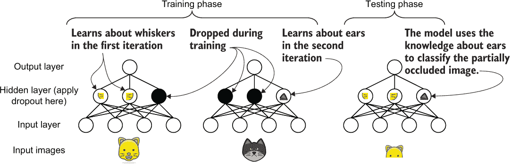

图 7.4 当学习分类猫图像时，辍学如何改变网络。在第一次迭代中，它可能学习有关胡须的知识。在第二次迭代中，由于包含有关胡须信息的部分被关闭，网络可能学习有关尖耳朵的知识。这使网络在测试时具有关于胡须和耳朵的知识。在这种情况下是好的，因为在测试图像中，你看不到猫的胡须！

在每个要应用辍学的层上应用随机的 1 和 0 掩码关闭节点（见图 7.5）。在训练过程中，您还需要对活动节点进行重要的规范化步骤。假设我们正在训练一个辍学率为 50% 的网络（即在每次迭代中关闭一半的节点）。当你的网络关闭了 50% 时，从概念上讲，你的网络总输出会减少一半，与完整网络相比。因此，您需要将输出乘以一个因子 2，以确保总输出保持不变。辍学的这些计算细节在图 7.5 中突出显示。好消息是，您不必实现任何计算细节，因为 TensorFlow 中提供了辍学作为一个层。

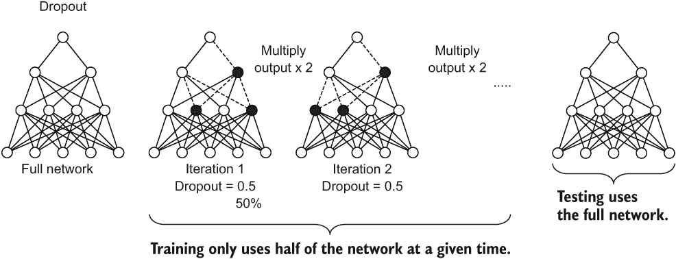

图 7.5 辍学如何运作的计算视角。如果辍学设置为 50%，则每个层中的一半节点（除了最后一层）将被关闭。但在测试时，所有节点都被打开。

Inception 网 v1（见图 7.6）只对全连接层和最后一个平均池化层应用辍学。记住不要在最后一层（即提供最终预测的层）上使用辍学。要执行两个更改：

+   在辅助输出中的中间全连接层应用 70% 的辍学。

+   对最后一个平均池化层的输出应用 40% 的 dropout。

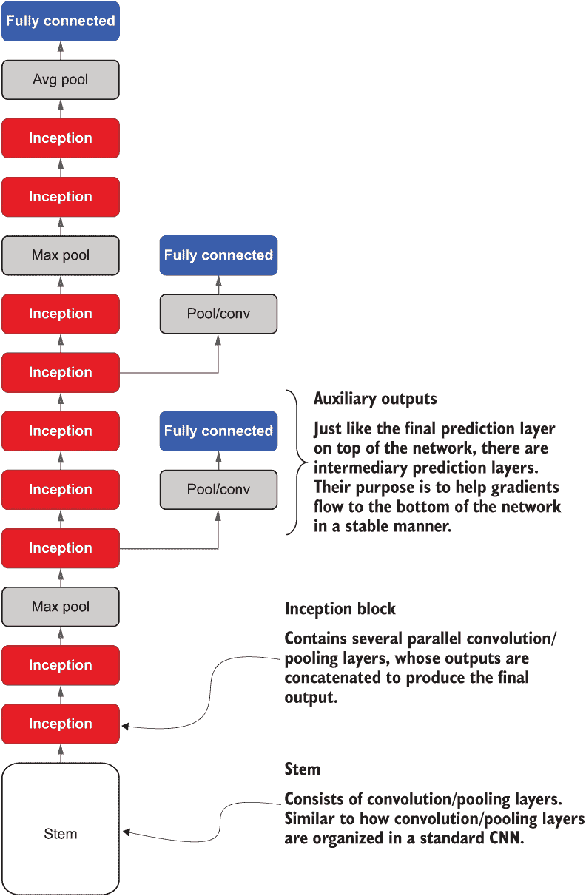

图 7.6 Inception 网络 v1 的抽象架构。Inception 网络以一个称为干线的组件开始，这是一个典型 CNN 中会找到的普通的卷积/池化层序列。然后 Inception 网络引入了一个称为 Inception 块的新组件。最后，Inception 网络还利用了辅助输出层。

在 TensorFlow 中，应用 dropout 就像写一行代码一样简单。一旦你得到了全连接层 dense1 的输出，你就可以使用以下方法应用 dropout：

```py
dense1 = Dropout(0.7)(dense1)
```

在这里，我们使用了 70% 的 dropout 率（正如原始 Inception 网络 v1 论文中建议的）用于辅助输出。

卷积层上的 dropout

Dropout 主要应用在密集层上，所以人们不禁会想，“为什么我们不在卷积层上应用 dropout 呢？”这仍然是一个争论未决的问题。例如，Nitish Srivastava 等人的原始 dropout 论文（[`mng.bz/o2Nv`](http://mng.bz/o2Nv)）认为，在低卷积层上使用 dropout 可以提高性能。相反，Yarin Gal 等人的论文“具有伯努利近似变分推断的贝叶斯 CNN”（[`arxiv.org/pdf/1506.02158v6.pdf`](https://arxiv.org/pdf/1506.02158v6.pdf)）认为，在卷积层上应用 dropout 并不会有太大帮助，因为它们的参数数量较低（与密集层相比），已经很好地被正则化了。因此，dropout 可以阻碍卷积层的学习。你需要考虑的一件事是出版时间。dropout 论文是在贝叶斯 CNN 论文之前两年写的。在那段时间内引入的正则化和其他改进可能对改进深度网络产生了重大影响，因此，在卷积层中使用 dropout 的好处可能变得微不足道。你可以在 [`mng.bz/nNQ4`](http://mng.bz/nNQ4) 找到更多非正式的讨论。

辅助输出的最终代码如下列表所示。

列表 7.4 修改了 Inception 网络的辅助输出

```py
def aux_out(inp,name=None):    
    avgpool1 = AvgPool2D((5,5), strides=(3,3), padding='valid')(inp)
    conv1 = Conv2D(128, (1,1), activation='relu', padding='same')(avgpool1)
    flat = Flatten()(conv1)
    dense1 = Dense(1024, activation='relu')(flat) 
    dense1 = Dropout(0.7)(dense1)                     ❶
    aux_out = Dense(200, activation='softmax', name=name)(dense1)
    return aux_out
```

❶ 应用了 70% 的 dropout 层

接下来，我们将在最后一个平均池化层的输出上应用 dropout，然后是最后的预测层。在将平均池化层的输出（flat_out）馈送到全连接（即密集）层之前，我们必须将其展平。然后，使用以下方法在 flat_out 上应用 dropout：

```py
flat_out = Dropout(0.4)(flat_out)
```

对于这一层，我们使用了 40% 的 dropout 率，正如论文中所建议的一样。最终的代码（从平均池化层开始）如下所示：

```py
avgpool1 = AvgPool2D((7,7), strides=(1,1), padding='valid')(inc_5b)

flat_out = Flatten()(avgpool1)
flat_out = Dropout(0.4)(flat_out)
out_main = Dense(200, activation='softmax', name='final')(flat_out)
```

这就结束了对 dropout 的讨论。要牢记的最后一点是，你不应该简单地设置 dropout 率。应该通过超参数优化技术来选择。非常高的 dropout 率会严重削弱你的网络，而非常低的 dropout 率则不会有助于减少过拟合。

### 7.1.3 早停：如果网络开始表现不佳，则停止训练过程

我们将要介绍的最后一种技术叫做早停（early stopping）。顾名思义，早停会在验证准确度不再提高时停止模型训练。你可能会想：“什么？我以为训练越多越好。”在达到某一点之前，训练得越多越好，但是之后，训练开始降低模型的泛化能力。图 7.7 展示了在训练模型过程中你会获得的典型训练准确度和验证准确度曲线。你可以看到，在某一点之后，验证准确度停止提高并开始下降。这标志着过拟合的开始。你可以看到，无论验证准确度如何，训练准确度都在持续上升。这是因为现代深度学习模型具有足够多的参数来“记住”数据，而不是学习数据中存在的特征和模式。

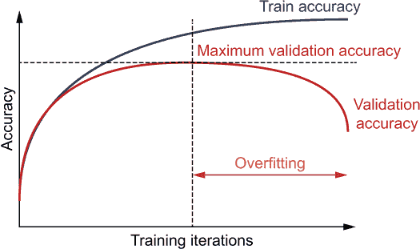

图 7.7：过拟合的示意图。在开始时，随着训练迭代次数的增加，训练和验证准确度都会提高。但是在某个时刻之后，验证准确度会趋于平稳并开始下降，而训练准确度则持续上升。这种行为称为过拟合，应该避免。

早停过程非常简单易懂。首先，你定义一个最大的训练轮数。然后模型训练一轮。训练之后，使用评估指标（例如准确度）在验证集上评估模型。如果验证准确度提高了并且还没有达到最大 epoch，则继续训练。否则，停止训练，并完成模型。图 7.8 描述了早停的工作流程。

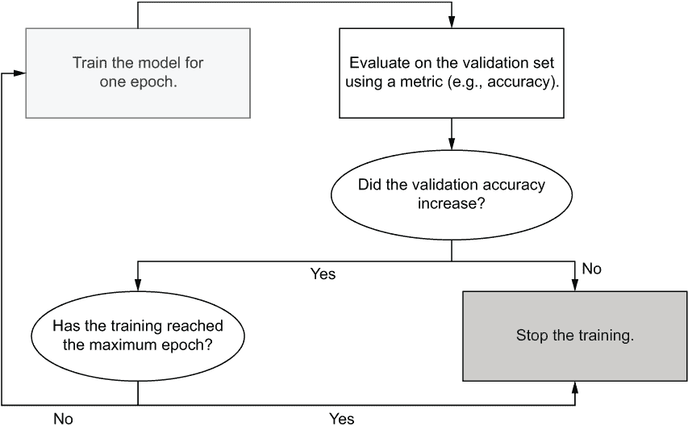

图 7.8：早停期间的工作流程。首先，模型训练一轮。然后，测量验证准确度。如果验证准确度提高了并且训练还没有达到最大 epoch，则继续训练。否则，停止训练。

实施早停需要对你的代码进行最小的更改。首先，和之前一样，我们将建立一个计算步数的函数：

```py
def get_steps_per_epoch(n_data, batch_size):
    """ Given the data size and batch size, gives the number of steps to 
➥ travers the full dataset """
    if n_data%batch_size==0:
        return int(n_data/batch_size)
    else:
        return int(n_data*1.0/batch_size)+1
```

接下来，我们将使用 Keras 提供的 EarlyStopping 回调（[`mng.bz/v6lr`](http://mng.bz/v6lr)）来在训练过程中启用早停。Keras 回调是在每个 epoch 结束时让某些事情发生的简单方法。例如，对于早停，我们只需在每个 epoch 结束时分析验证准确度，如果没有显示任何改善，就终止训练。回调是实现这一目标的理想选择。我们已经使用了 CSVLogger 回调来记录每个 epoch 的指标数量。EarlyStopping 回调有几个参数：

+   monitor—需要监测的指标以终止训练。可以使用 Keras 模型的 model.metric_names 属性获取定义的指标名称列表。在我们的示例中，这将设置为 val_loss（即在验证数据上计算的损失值）。

+   min_delta—被监测指标所需的最小改变，以被视为改进（即任何改进<min_delta 将被视为“没有改进” [默认为零]）。

+   patience—如果在这么多个 epochs 之后没有改进，则训练将停止（默认为零）。

+   mode—可以是 auto/min/max。在 min 中，如果指标停止减少（如损失），则训练将停止。在 max 中，如果指标停止增加（如准确度），则训练将停止。该模式将自动从指标名称中推断（默认为 auto）。

+   baseline—指标的基准值。如果指标未超出基准值，则训练将停止（默认为无）。

+   restore_best_weights—在训练开始和终止之间恢复显示选择指标的最佳权重结果（默认为 false）。

首先，如果不存在，我们将创建一个名为 eval 的目录。这将用于存储由 CSVLogger 返回的 CSV 文件：

```py
# Create a directory called eval which stores model performance
if not os.path.exists('eval'):
    os.mkdir('eval')
# Logging the performance metrics to a CSV file
csv_logger = CSVLogger(os.path.join('eval','2_eval_data_aug_early_stopping.log'))
```

然后我们定义 EarlyStopping 回调函数。我们选择 val_loss 作为监测的指标，以及五个 epochs 的耐心。这意味着在五个 epochs 内训练将容忍“没有改进”。我们将保留其他参数为默认值：

```py
# Early stopping callback
es_callback = EarlyStopping(monitor='val_loss', patience=5)
```

最后使用数据和适当的回调函数调用 model.fit()。在这里，我们使用先前定义的 train_gen_aux 和 valid_gen_aux 作为训练和验证数据（分别）。我们还将 epochs 设置为 50，并使用 get_steps_per_epoch 函数设置训练步数和验证步数。最后，我们提供 EarlyStopping 和 CSVLogger 回调函数，所以在指定条件下没有改进时训练停止：

```py
history = model.fit(
    train_gen_aux, validation_data=valid_gen_aux, 
    steps_per_epoch=get_steps_per_epoch(int(0.9*(500*200)),batch_size),
    validation_steps=get_steps_per_epoch(int(0.1*(500*200)),batch_size),
    epochs=50, callbacks=[es_callback, csv_logger]
)
```

下一个清单展示了训练日志的摘要。

列表 7.5 在训练模型期间提供的训练日志

```py
Train for 703 steps, validate for 78 steps
Epoch 1/50
WARNING:tensorflow:Large dropout rate: 0.7 (>0.5). In TensorFlow 2.x, 
➥ dropout() uses dropout rate instead of keep_prob. Please ensure that 
➥ this is intended.                                                      ❶
WARNING:tensorflow:Large dropout rate: 0.7 (>0.5). In TensorFlow 2.x, 
➥ dropout() uses dropout rate instead of keep_prob. Please ensure that 
➥ this is intended.                                                      ❶
WARNING:tensorflow:Large dropout rate: 0.7 (>0.5). In TensorFlow 2.x, 
➥ dropout() uses dropout rate instead of keep_prob. Please ensure that 
➥ this is intended.                                                      ❶
703/703 [==============================] - 196s 279ms/step - loss: 15.4462 
➥ - final_loss: 5.1507 - aux1_loss: 5.1369 - aux2_loss: 5.1586 - 
➥ final_accuracy: 0.0124 - aux1_accuracy: 0.0140 - aux2_accuracy: 0.0119 
➥ - val_loss: 14.8221 - val_final_loss: 4.9696 - val_aux1_loss: 4.8943 - 
➥ val_aux2_loss: 4.9582 - val_final_accuracy: 0.0259 - val_aux1_accuracy: 
➥ 0.0340 - val_aux2_accuracy: 0.0274
...
Epoch 38/50
703/703 [==============================] - 194s 276ms/step - loss: 
➥ 9.4647 - final_loss: 2.8825 - aux1_loss: 3.3037 - aux2_loss: 3.2785 - 
➥ final_accuracy: 0.3278 - aux1_accuracy: 0.2530 - aux2_accuracy: 0.2572 
➥ - val_loss: 9.7963 - val_final_loss: 3.1555 - val_aux1_loss: 3.3244 - 
➥ val_aux2_loss: 3.3164 - val_final_accuracy: 0.2940 - val_aux1_accuracy: 
➥ 0.2599 - val_aux2_accuracy: 0.2590
```

❶ 因为我们对一些层使用了高达 70%的丢失率，TensorFlow 会对此进行警告，因为意外的高丢失率可能会影响模型的性能。

看起来模型没有在 50 个 epochs 中训练到利益。在第 38 个 epoch 之后，它决定终止训练。这在于训练在达到第 50 个 epoch 之前停止（如第 38/50 行所示）。另一个重要的观察结果是，你可以看到训练准确度没有像我们在上一章中看到的那样激增到很高的值。训练准确度一直与验证准确度（~30%）相当接近。尽管我们没有看到很大的性能提升，但我们成功地显著减少了过拟合。因此，我们可以着重提高准确度。

注意 在一台配备 Intel Core i5 处理器和 NVIDIA GeForce RTX 2070 8GB 显卡的机器上，训练大约需要 1 小时 30 分钟才能完成 38 个周期。

接下来，我们将重新审视我们的模型。我们将深入研究一些研究，并实现一个已经被证明在这个特定分类问题上运行良好的模型。

练习 1

你手头有一个模型呈现给你，你发现它严重欠拟合。欠拟合发生在你的模型没有足够近似数据分布时。建议你如何改变 dropout 层以减少欠拟合。你可以选择 20%、50%和 80%作为 dropout 率：

```py
model = tf.keras.models.Sequential([
tf.keras.layers.Dense(100, activation=’relu’, input_shape=(250,)),
tf.keras.layers.Dropout(0.5), 
tf.keras.layers.Dense(10, activation=’softmax’)
])
model.compile
    (loss=’categorical_crossentropy’, optimizer=’adam’, metrics=[‘accuracy’])
model.fit(X, y, epochs=25)
```

练习 2

定义一个早停回调函数，如果验证损失值（即 val_loss）在五个周期后没有增加 0.01，则终止训练。为此目的使用 tf.keras.callbacks.EarlyStopping 回调函数。

## 7.2 朝向极简主义：Minception 而不是 Inception

我们现在有一个几乎不存在过拟合的模型。然而，模型的测试性能仍然没有达到我们想要的水平。你觉得你需要对这个问题有一个新的视角，并咨询团队中的一位高级数据科学家。你解释了你如何在 tiny-imagenet-200 图像分类数据集上训练了一个 Inception net v1 模型，以及模型的性能不佳。他提到他最近读过一篇论文（[cs231n.stanford.edu/reports/2017/pdfs/930.pdf](http://cs231n.stanford.edu/reports/2017/pdfs/930.pdf)），该论文使用了一个受 Inception-ResNet v2 启发的修改版本的 Inception 网络，在数据集上取得了更好的性能。

他进一步解释了两种新技术，批量标准化和残差连接（它们在修改后的 Inception 网络以及 Inception-ResNet v2 中使用），以及它们在帮助模型训练方面产生的重大影响，特别是在深度模型中。现在，你将实现这个新的修改后的模型，看看它是否会提高性能。

我们看到验证和测试准确率略有提高。但是在性能方面，我们仍然只是触及到了表面。例如，有关这个数据集的测试准确率约为 85%（[`mng.bz/44ev`](http://mng.bz/44ev)）。因此，我们需要寻找其他提高模型性能的方法。

你与团队中的高级数据科学家进行的那次会议简直再好不过了。我们将尝试他所读过的新网络。

这个网络主要受到了前一章节简要提及的 Inception-Resnet-v2 网络的启发。这个新网络（我们将其称为 Minception）利用了 Inception-ResNet v2 模型中使用的所有最先进的组件，并对它们进行了修改以适应手头的问题。在本节中，你将深入了解这个新模型。特别是，Minception 网络具有以下元素：

+   一个干扰项

+   Inception-ResNet 块 A

+   Inception-ResNet 块 B

+   减少块（一种新的用于减少输出大小的块）

+   平均池化层

+   最终预测层

与其他 Inception 模型一样，这个模型也有一个干部和 Inception 块。但是，Minception 与 Inception Net v1 不同，因为它没有辅助输出，因为它们有其他稳定训练的技术。另一个值得注意的区别是，Minception 有两种类型的 Inception 块，而 Inception Net v1 在整个网络中重用相同的格式。在讨论 Minception 的不同方面时，我们将更详细地与我们实现的 Inception Net v1 进行比较。在后面的章节中，我们将更详细地讨论 Inception-ResNet v2 模型的架构，并将其与 Minception 进行比较。此代码可在 Ch07-Improving-CNNs-and-Explaining/7.1.Image_Classification_Advance.ipynb 中找到。

### 7.2.1 实施干部

首先，我们应该关注模型的干部。为了更新我们的知识，干部是一系列卷积和池化层，类似于典型的 CNN。然而，Minception 的布局更加复杂，如图 7.9 所示。

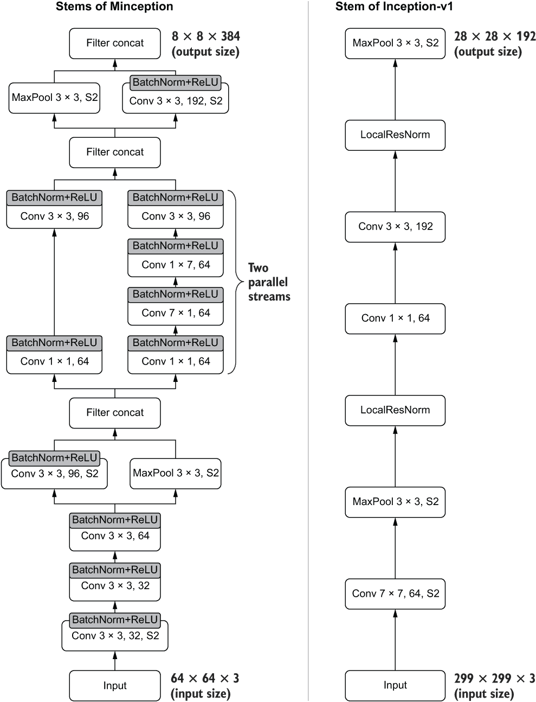

图 7.9 比较 Minception 和 Inception-v1 的干部。请注意 Minception 如何分离卷积层的非线性激活。这是因为批量归一化必须插入到卷积输出和非线性激活之间。

您可以看到它在干部上有并行的卷积层流。Minception 的干部与 Inception Net v1 相比非常不同。另一个关键区别是 Minception 不使用局部响应归一化（LRN），而是使用更强大的批量归一化。

Batch normalization：一种多功能的归一化技术，用于稳定和加速深度网络的训练。

批量归一化（BN）是由 Sergey Ioffe 等人在论文“Batch Normalization: Accelerating Deep Network Training by Reducing Internal Covariate Shift”中引入的。正如其名称所示，它是一种归一化技术，用于归一化深度网络的中间输出。([`proceedings.mlr.press/v37/ioffe15.pdf`](http://proceedings.mlr.press/v37/ioffe15.pdf))

“你可能会问，这很重要吗？” 结果深度网络如果没有得到正确的关注，可能会导致严重的头痛。例如，在训练期间，一批未正确缩放/异常输入或不正确的权重初始化可能导致模型不佳。此外，此类问题可能会随着网络深度或时间的推移而放大，导致每个层接收到的输入分布随时间而改变。输入分布随时间发生变化的现象称为*协变量转移*。这在流数据问题中非常常见。批量归一化是为了解决这个问题而发明的。让我们了解一下 BN 如何解决这个问题。批量归一化层执行以下操作：

+   使用 *x*^((k))，网络的第 *k*^(th) 层的输出进行归一化

+   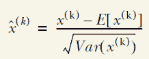

+   这里，*E*[*x*^((k))] 表示输出的平均值，*Var*[*x*^((k))] 表示输出的方差。*E*[*x*^((k))] 和 *Var*[*x*^((k))] 都是向量。对于具有 n 个节点的全连接层，*E*[*x*^((k))] 和 *Var*[*x*^((k))] 都是长度为 n 的向量（通过对批次维度求平均计算）。对于具有 f 个滤波器/卷积核的卷积层，*E*[*x*^((k))] 和 *Var*[*x*^((k))] 将是长度为 f 的向量（通过对批次、高度和宽度维度求平均计算）。

+   使用两个可训练的超参数 *γ* 和 *β*（分别针对每一层）来缩放和偏移归一化后的输出，如下所示：

+   *y*^((k)) = *γ*^((k))*x̂*^((k)) + *β^((k))*

+   在这个过程中，计算 *E*(*x*) 和 *Var*(*x*) 会有些棘手，因为在训练和测试阶段需要对它们进行不同处理。

+   在训练过程中，根据训练的随机性（即一次只查看一个随机数据批次而不是整个数据集），对于每个批次，只使用该批次的数据计算 *E*(*x*)（平均值）和 *Var*(*x*)（方差）。因此，对于每个批次，你可以计算出 *E*(*x*) 和 *Var*(*x*)（不必担心除了当前批次以外的任何事情）。

+   然后，利用每个数据批次计算出的 *E*(*x*) 和 *Var*(*x*)，我们估算出了总体的 *E*(*x*) 和 *Var*(*x*)。这是通过计算 *E*(*x*) 和 *Var*(*x*) 的运行均值来实现的。我们不会讨论运行均值的工作原理。但你可以想象运行均值是对大数据集的真实均值的高效计算的近似表示。

+   在测试阶段，我们使用之前计算出的基于总体的 *E*(*x*) 和 *Var*(*x*)，并执行之前定义的计算以获得 *y*^((k))。

由于批归一化涉及的步骤复杂，从头开始实现会需要相当多的工作。幸运的是，你不必这样做。TensorFlow 提供了一个批归一化层（[`mng.bz/Qv0Q`](http://mng.bz/Qv0Q)）。如果你有某些密集层的输出（我们称之为 dense1）要应用批归一化，你只需要

```py
dense1_bn = BatchNormalization()(dense1)
```

然后 TensorFlow 将自动处理批归一化需要在内部发生的所有复杂计算。现在是时候在我们的 Minception 模型中使用这一强大的技术了。在下一个列表中，你可以看到 Minception 网络的基干的实现。我们将编写一个名为 stem 的函数，它允许我们随意开启/关闭批归一化。

列表 7.6 定义 Minception 的基干

```py
def stem(inp, activation='relu', bn=True):                              ❶

    conv1_1 = Conv2D(
        32, (3,3), strides=(2,2), activation=None,                      ❷
        kernel_initializer=init, padding='same'
    )(inp) #62x62
    if bn:
        conv1_1 = BatchNormalization()(conv1_1)                         ❸
    conv1_1 = Activation(activation)(conv1_1)                           ❹

    conv1_2 = Conv2D(
        32, (3,3), strides=(1,1), activation=None,                      ❷
        kernel_initializer=init, padding='same'
    )(conv1_1) # 31x31
    if bn:
        conv1_2 = BatchNormalization()(conv1_2)
    conv1_2 = Activation(activation)(conv1_2)

    conv1_3 = Conv2D(
        64, (3,3), strides=(1,1), activation=None,                      ❷
           kernel_initializer=init, padding='same'
       )(conv1_2) # 31x31
    if bn:
        conv1_3 = BatchNormalization()(conv1_3)
    conv1_3 = Activation(activation)(conv1_3)

    maxpool2_1 = MaxPool2D((3,3), strides=(2,2), 
➥ padding='same')(conv1_3)                                             ❺

    conv2_2 = Conv2D(
        96, (3,3), strides=(2,2), activation=None,
        kernel_initializer=init, padding='same'
    )(conv1_3)                  
    if bn:
        conv2_2 = BatchNormalization()(conv2_2)
    conv2_2 = Activation(activation)(conv2_2)                           ❺

    out2 = Concatenate(axis=-1)([maxpool2_1, conv2_2])                  ❻

    conv3_1 = Conv2D(
        64, (1,1), strides=(1,1), activation=None, 
        kernel_initializer=init, padding='same'
    )(out2)                                                             ❼
    if bn:
        conv3_1 = BatchNormalization()(conv3_1)
    conv3_1 = Activation(activation)(conv3_1)

    conv3_2 = Conv2D(
        96, (3,3), strides=(1,1), activation=None, 
        kernel_initializer=init, padding='same'
    )(conv3_1)                                                          ❼
    if bn:
        conv3_2 = BatchNormalization()(conv3_2)
    conv3_2 = Activation(activation)(conv3_2)

    conv4_1 = Conv2D(
        64, (1,1), strides=(1,1), activation=None, 
        kernel_initializer=init, padding='same'
    )(out2)                                                             ❽
    if bn:
        conv4_1 = BatchNormalization()(conv4_1)
    conv4_1 = Activation(activation)(conv4_1)

    conv4_2 = Conv2D(
        64, (7,1), strides=(1,1), activation=None, 
        kernel_initializer=init, padding='same'
    )(conv4_1)                                                          ❽
    if bn:
        conv4_2 = BatchNormalization()(conv4_2)

    conv4_3 = Conv2D(
        64, (1,7), strides=(1,1), activation=None, 
        kernel_initializer=init, padding='same'
    )(conv4_2)                                                          ❽
    if bn:
        conv4_3 = BatchNormalization()(conv4_3)
    conv4_3 = Activation(activation)(conv4_3)

    conv4_4 = Conv2D(
        96, (3,3), strides=(1,1), activation=None, 
        kernel_initializer=init, padding='same'
    )(conv4_3)                                                          ❽
    if bn:
        conv4_4 = BatchNormalization()(conv4_4)
    conv4_4 = Activation(activation)(conv4_4)

    out34 = Concatenate(axis=-1)([conv3_2, conv4_4])                    ❾

    maxpool5_1 = MaxPool2D((3,3), strides=(2,2), padding='same')(out34) ❿
    conv6_1 = Conv2D(
        192, (3,3), strides=(2,2), activation=None,       
        kernel_initializer=init, padding='same'
    )(out34)                                                            ❿
    if bn:
        conv6_1 = BatchNormalization()(conv6_1)
    conv6_1 = Activation(activation)(conv6_1)

    out56 = Concatenate(axis=-1)([maxpool5_1, conv6_1])                 ❿

    return out56
```

❶ 定义函数。请注意我们可以随时开启/关闭批归一化。

❷ 到第一个分支的基干的第一部分

❸ 请注意，在应用非线性激活之前，先应用第一个批归一化。

❹ 非线性激活应用于批归一化步骤后的层。

❺ 第一个分支的两个平行流

❻ 连接第一个分割的两个并行流的输出

❼ 第二个分割的第一个流

❽ 第二个分割的第二个流

❾ 连接第二个分割的两个流的输出

❿ 第三个（最终分割）和输出的连接

一个关键变化需要注意，即每一层的非线性激活与层本身分开。这样做是为了能够在层的输出和非线性激活之间插入批量归一化。这是应用批量归一化的原始方式，正如原始论文中所讨论的那样。但是批量归一化应该在非线性激活之前还是之后是一个持续讨论的问题。您可以在[`mng.bz/XZpp`](http://mng.bz/XZpp)上找到关于这个主题的非正式讨论。

### 7.2.2 实现 Inception-ResNet 类型 A 块

在我们已经讨论了网络的干部后，让我们继续看看在 Minception 网络中 Inception 块是什么样子的。让我们快速回顾一下 Inception 块是什么以及为什么会开发它。Inception 块的开发旨在最大化卷积层的表示能力，同时鼓励模型参数的稀疏性，而不会使内存需求激增。它通过具有不同感知域大小（即内核大小）的几个并行卷积层来实现这一点。Minception 网络中的 Inception 块主要使用相同的框架。但是，它引入了一个新概念，称为*残差连接*。

残差/跳过连接：稳定梯度的捷径

我们已经简要讨论了残差连接，它引入了数学中可以想象的最简单的操作之一：将输入逐元素添加到输出中。换句话说，您取网络的前一个输出（称为 x）并将其添加到当前输出（称为 y）中，因此您得到最终输出 z 为 z = x + y。

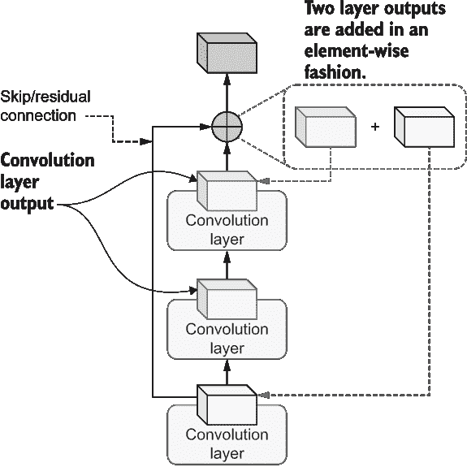

如何在卷积层之间添加跳过/残差连接

在实现残差连接时需要注意的一点是确保它们的尺寸匹配，因为这是逐元素的加法。

残差连接的数学观点是什么？

起初可能不太明显，但是跳过连接中的残差之处并不清楚。假设以下情景。您有一个输入 x；接下来您有一些层，F(x) = y，它将输入 x 映射到 y。您实现了以下网络。

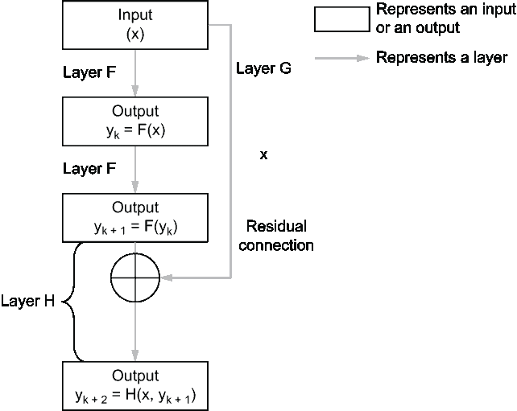

残差连接的数学观点

y[k] = F(x)

y[k] [+ 1] = F(y[k])

y[k] [+ 2] = y[k] [+ 1] + x

y[k] [+ 2] = y[k] [+ 1] + G(x); 让我们将残差连接视为一个执行恒等映射的层，并将其称为 G。

y[k] [+ 2] - y[k] [+ 1] = G(x) 或

G(x) = y[k] [+ 2] - y[k] [+ 1]; 实际上，G 代表了最终输出和前一个输出之间的残差。

通过将最终输出视为一个将 x 和 y[k] [+ 1] 作为输入的层 H，我们得到以下方程：

G(x) = H(x, y[k] [+ 1]) - F(y[k])

你可以看到残差是如何发挥作用的。本质上，G(x) 是最终层输出与上一层输出之间的残差

实现残差连接再简单不过了。假设你有以下网络：

```py
from tensorflow.keras.layers import Dense, Input, Add

inp = Input(shape=(10,))
d1 = Dense(20, activation='relu')(inp)
d2 = Dense(20, activation='relu')(d1)
d3 = Dense(20, activation='relu')(d2)
```

你想要从 d1 到 d3 创建一个残差连接。你所需要做的就是

```py
d4 = d3 + d1
```

或者，如果你想使用一个 Keras 层（与上一个操作等效），你可以这样做

```py
d4 = Add()([d3, d1])
```

现在你明白了：d4 是一个残差连接的输出。你可能还记得我说过，为了添加残差连接，输出尺寸必须匹配。我们尝试添加两个不兼容的形状。例如，让我们将 Dense 层的节点数从 20 改为 30：

```py
inp = Input(shape=(10,))
d1 = Dense(20, activation='relu')(inp)
d2 = Dense(20, activation='relu')(d1)
d3 = Dense(30, activation='relu')(d2)
d4 = Add()([d3, d1])
```

如果你尝试运行这段代码，你将会得到以下错误：

```py
---------------------------------------------------------------------------
ValueError                                Traceback (most recent call last)
...
----> d4 = Add()([d3, d1])
...
ValueError: Operands could not be broadcast together with shapes (30,) (20,)
```

正如你所看到的，TensorFlow 抱怨它无法广播（在这种情况下，这意味着执行逐元素加法）两个形状分别为 30 和 20 的张量。这是因为 TensorFlow 不知道如何将一个形状为（batch_size，20）的张量与一个形状为（batch_size，30）的张量相加。如果在尝试实现残差连接时出现类似的错误，你应该检查网络输出，并确保它们匹配。要消除此错误，你所需要做的就是按照以下方式更改代码：

```py
inp = Input(shape=(10,))
d1 = Dense(20, activation='relu')(inp)
d2 = Dense(20, activation='relu')(d1)
d3 = Dense(20, activation='relu')(d2)
d4 = Add()([d3, d1])
```

Minception 有两种类型的 Inception 块（类型 A 和类型 B）。现在让我们将 Inception-ResNet 块（类型 A）写成一个名为 inception_resnet_a 的函数。与之前实现的 Inception 块相比，这个新的 inception 块有以下增加：

+   使用批量归一化

+   使用一个从输入到块的最终输出的残差连接

图 7.10 比较 Minception 的 Inception-ResNet 块类型 A 与 Inception Net v1。一个明显的区别是 Inception Net v1 不利用残差连接的优势。

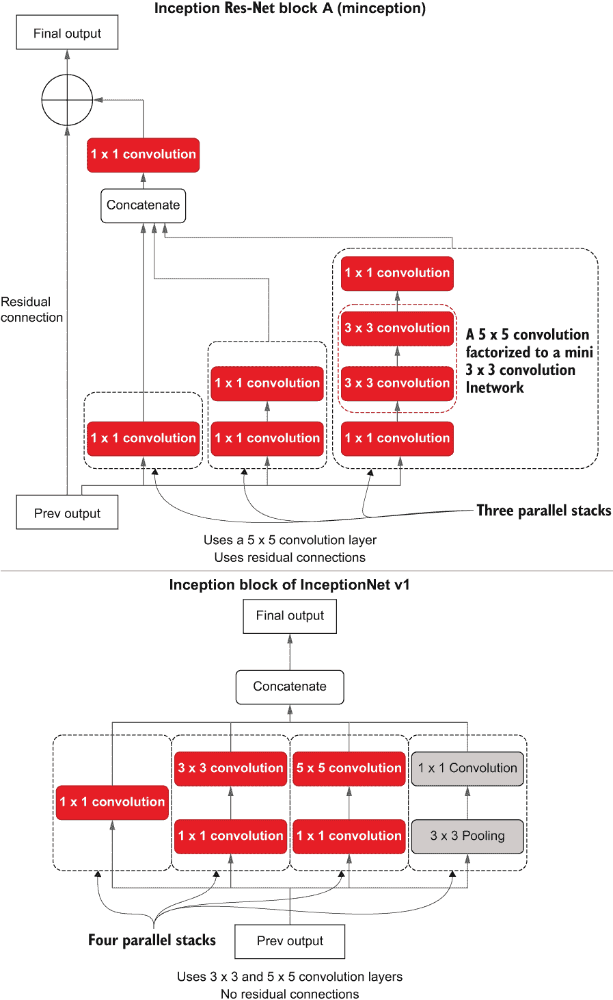

图 7.10 比较 Inception-ResNet 块 A（Minception）和 Inception 网 v1 的 Inception 块

现在让我们实现 Minception-ResNet 块 A。图 7.11 显示了需要实现的计算类型及其连接性（清单 7.7）。

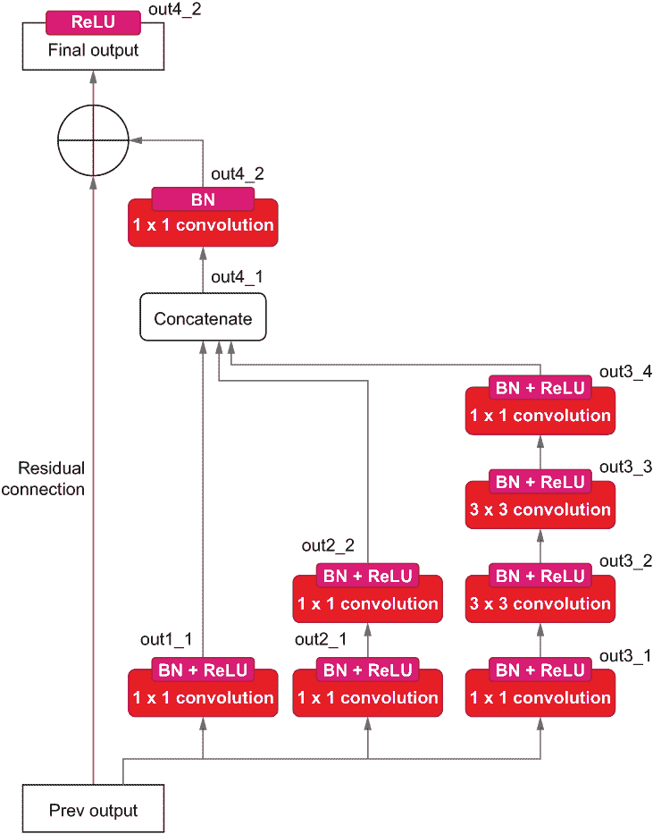

图 7.11 Minception-ResNet 块 A 的示意图，带有代码清单 7.7 的注释

清单 7.7 Minception-ResNet 块 A 的实现

```py
def inception_resnet_a(inp, n_filters, initializer, activation='relu', 
➥ bn=True, res_w=0.1):
    out1_1 = Conv2D(
        n_filters[0][0], (1,1), strides=(1,1), 
➥ activation=None, 
        kernel_initializer=initializer, 
➥ padding='same'
    )(inp)                                                        ❶
    if bn:
        out1_1 = BatchNormalization()(out1_1)
    out1_1 = Activation(activation)(out1_1)                       ❶

    out2_1 = Conv2D(
        n_filters[1][0], (1,1), strides=(1,1), 
➥ activation=None, 
        kernel_initializer=initializer, padding='same'
    )(inp)                                                        ❷
    if bn:
        out2_1 = BatchNormalization()(out2_1)
    out2_1 = Activation(activation)(out2_1)                       ❷

    out2_2 = Conv2D(
        n_filters[1][1], (1,1), strides=(1,1), activation=None, 
        kernel_initializer=initializer, padding='same'
    )(out2_1)                                                     ❷
    if bn:
        out2_2 = BatchNormalization()(out2_2)
    out2_2 = Activation(activation)(out2_2)                       ❷

    out2_3 = Conv2D(
        n_filters[1][2], (1,1), strides=(1,1), activation=None, 
        kernel_initializer=initializer, padding='same'
    )(out2_2)                                                     ❷

    out3_1 = Conv2D(
        n_filters[2][0], (1,1), strides=(1,1), activation=None, 
        kernel_initializer=initializer, padding='same'
    )(inp)                                                        ❸
    if bn:
        out3_1 = BatchNormalization()(out3_1)
    out3_1 = Activation(activation)(out3_1)                       ❸

    out3_2 = Conv2D(
        n_filters[2][1], (3,3), strides=(1,1), activation=None, 
        kernel_initializer=initializer, padding='same'
    )(out3_1)                                                     ❸
    if bn:
        out3_2 = BatchNormalization()(out3_2)
    out3_2 = Activation(activation)(out3_2)                       ❸

    out3_3 = Conv2D(
        n_filters[2][2], (3,3), strides=(1,1), activation=None, 
        kernel_initializer=initializer, padding='same'
    )(out3_2)                                                     ❸
    if bn:
        out3_3 = BatchNormalization()(out3_3)
    out3_3 = Activation(activation)(out3_3)                       ❸

    out3_4 = Conv2D(
        n_filters[2][3], (1,1), strides=(1,1), activation=None, 
        kernel_initializer=initializer, padding='same'
    )(out3_3)                                                     ❸
    if bn:
        out3_4 = BatchNormalization()(out3_4)
    out3_4 = Activation(activation)(out3_4)                       ❸

    out4_1 = Concatenate(axis=-1)([out1_1, out2_2, out3_4])       ❹
    out4_2 = Conv2D(
        n_filters[3][0], (1,1), strides=(1,1), activation=None, 
        kernel_initializer=initializer, padding='same'
    )(out4_1)
    if bn:
        out4_2 = BatchNormalization()(out4_2)                               

    out4_2 += res_w * inp                                         ❺
    out4_2 = Activation(activation)(out4_2)                       ❺

        return out4_2
```

❶ 块中的第一个并行流

❷ 块中的第二个并行流

❸ 块中的第三个并行流

❹ 将三个独立流的输出连接起来。

❺ 合并残差连接（乘以一个因子以改善梯度流动）。

尽管函数看起来很长，但主要是使用卷积层进行乐高堆砌。 图 7.11 为您提供了视觉 Inception 层与代码之间的思维映射。 一个关键观察是批量标准化和非线性激活（ReLU）如何应用于块的顶部部分。 最后的 1×1 卷积使用批量标准化，而不是非线性激活。 非线性激活仅在残余连接之后应用。

现在我们要看看如何实现 Inception-ResNet B 块。

### 7.2.3 实现 Inception-ResNet 类型 B 块

接下来是 Minception 网络中的 Inception-ResNet 类型 B 块。 我们不会详细讨论这个，因为它与 Inception-ResNet A 块非常相似。 图 7.12 描述了 Inception-ResNet B 块并将其与 Inception-ResNet A 块进行了比较。 块 B 看起来相对简单，只有两个并行流。 代码相关的注释帮助您将 Inception 块的思维模型映射到代码中，如下列表所示。

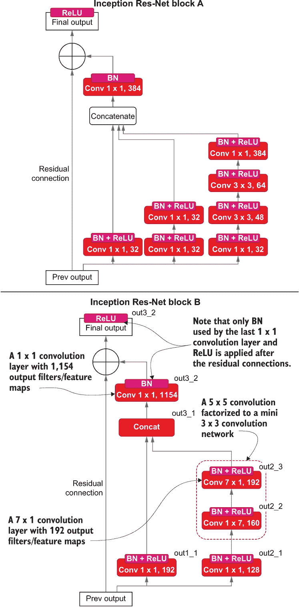

图 7.12 Minception 的 Inception-ResNet 块 B（左）和 Minception 的 Inception-ResNet 块 A（右）并排放在一起

列表 7.8 Minception-ResNet 块 B 的实现

```py
def inception_resnet_b(inp, n_filters, initializer, activation='relu', 
➥ bn=True, res_w=0.1):
    out1_1 = Conv2D(
        n_filters[0][0], (1,1), strides=(1,1), activation=None, 
        kernel_initializer=initializer, padding='same'
    )(inp)
    if bn:
        out1_1 = BatchNormalization()(out1_1) 
    out1_1 = Activation(activation)(out1_1)                      ❶

    out2_1 = Conv2D(
        n_filters[1][0], (1,1), strides=(1,1), activation=activation, 
        kernel_initializer=initializer, padding='same'
    )(inp)
    if bn:
        out2_1 = BatchNormalization()(out2_1)
    out2_1 = Activation(activation)(out2_1)                      ❷

    out2_2 = Conv2D(
        n_filters[1][1], (1,7), strides=(1,1), activation=None, 
        kernel_initializer=initializer, padding='same'
    )(out2_1)
    if bn:
        out2_2 = BatchNormalization()(out2_2)
    out2_2 = Activation(activation)(out2_2)                      ❷

    out2_3 = Conv2D(
        n_filters[1][2], (7,1), strides=(1,1), activation=None, 
        kernel_initializer=initializer, padding='same'
    )(out2_2)
    if bn:
        out2_3 = BatchNormalization()(out2_3)
    out2_3 = Activation(activation)(out2_3)                      ❷

    out3_1 = Concatenate(axis=-1)([out1_1, out2_3])              ❸
    out3_2 = Conv2D(
        n_filters[2][0], (1,1), strides=(1,1), activation=None, 
        kernel_initializer=initializer, padding='same'
    )(out3_1)
    if bn:
        out3_2 = BatchNormalization()(out3_2)                    ❹

    out3_2 += res_w * inp                                        ❺
    out3_2 = Activation(activation)(out3_2)

    return out3_2
```

❶ 块中的第一个并行流

❷ 块中的第二个并行流

❸ 将来自两个并行流的结果连接起来。

❹ 连接结果顶部的最终卷积层

❺ 应用了加权残差连接

这与函数 inception_resnet_a（...）非常相似，具有两个并行流和残余连接。 需要注意的区别是类型 A 块的卷积层数量比类型 B 块多。 另外，类型 A 块使用 5×5 卷积（分解为两个 3×3 卷积层），而类型 B 使用 7×7 卷积（分解为 1×7 和 7×1 卷积层）。 我将让读者自行详细了解该函数。

### 7.2.4 实现减少块

受 Inception-ResNet 模型的启发，Minception 也使用减少块。 减少块与 ResNet 块非常相似，唯一的区别是块中没有残余连接（见下一列表）。

列表 7.9 Minception 的减少块的实现

```py
def reduction(inp, n_filters, initializer, activation='relu', bn=True):
    # Split to three branches
    # Branch 1
    out1_1 = Conv2D(
        n_filters[0][0], (3,3), strides=(2,2), 
        kernel_initializer=initializer, padding='same'
    )(inp)  
    if bn:
        out1_1 = BatchNormalization()(out1_1)
    out1_1 = Activation(activation)(out1_1)                         ❶

    out1_2 = Conv2D(
        n_filters[0][1], (3,3), strides=(1,1), 
        kernel_initializer=initializer, padding='same'
    )(out1_1)
    if bn:
        out1_2 = BatchNormalization()(out1_2)
    out1_2 = Activation(activation)(out1_2)                         ❶

    out1_3 = Conv2D(
        n_filters[0][2], (3,3), strides=(1,1), 
        kernel_initializer=initializer, padding='same'
    )(out1_2)
    if bn:
        out1_3 = BatchNormalization()(out1_3)
    out1_3 = Activation(activation)(out1_3)                         ❶

    # Branch 2
    out2_1 = Conv2D(
        n_filters[1][0], (3,3), strides=(2,2), 
        kernel_initializer=initializer, padding='same'
    )(inp)
    if bn:
        out2_1 = BatchNormalization()(out2_1)
    out2_1 = Activation(activation)(out2_1)                         ❷

    # Branch 3
    out3_1 = MaxPool2D((3,3), strides=(2,2), padding='same')(inp)   ❸

    # Concat the results from 3 branches
    out = Concatenate(axis=-1)([out1_3, out2_1, out3_1])            ❹

    return out
```

❶ 卷积的第一个并行流

❷ 卷积的第二个并行流

❸ 池化的第三个并行流

❹ 将所有输出连接起来

我将让图 7.13 自己说明列表 7.9。但正如你所看到的，在抽象层面上，它使用了我们讨论过的 Inception 块相同类型的连接和层。

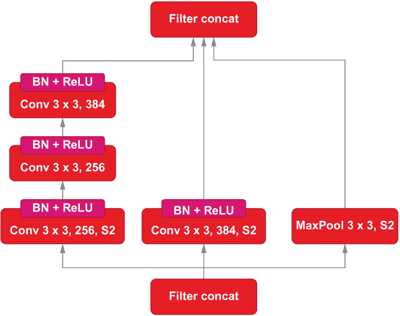

图 7.13 减少块的示意图

现在我们要看看如何通过汇总到目前为止实现的所有不同元素来完成 Minception 的拼图。

### 7.2.5 将所有内容组合在一起

到目前为止，工作进行得很顺利。随着所有基本块准备就绪，我们的 Minception 模型正在成形。接下来，将事物放在它们应该放置的地方就是问题。最终模型使用以下组件：

+   单个干部

+   1x Inception-ResNet 块 A

+   2x Inception-ResNet 块 B

+   平均池化

+   Dropout

+   具有 200 个节点和 softmax 激活的最终预测层

此外，我们将对模型的输入进行一些更改。根据原始论文，该模型接收的是 56 × 56 × 3 大小的输入，而不是 64 × 64 × 3 大小的输入。通过以下方式实现：

+   *训练阶段* — 从原始 64 × 64 × 3 大小的图像中随机裁剪一个 56 × 56 × 3 大小的图像

+   *验证/测试阶段* — 从原始图像中心裁剪一个 56 × 56 × 3 大小的图像

此外，我们将在训练期间引入另一个增强步骤，随机对比图像（与论文中使用的相同）。不幸的是，您无法使用 ImageDataGenerator 实现这两个步骤中的任何一个。好消息是，自 TensorFlow 2.2 以来，引入了几个新的图像预处理层（[`mng.bz/yvzy`](http://mng.bz/yvzy)）。我们可以像模型中的任何其他层一样使用这些层。例如，我们像以前一样从输入开始：

```py
inp = Input(shape=(64,64,3))
```

然后导入 RandomCrop 和 RandomContrast 层，并按如下方式使用它们：

```py
from tensorflow.keras.layers.experimental.preprocessing import RandomCrop, 
➥ RandomContrast
# Cropping the image to a 56x56 sized image
crop_inp = RandomCrop(56, 56, seed=random_seed)(inp)
# Provide a random contrast between 0.7 and 1.3 where 1.0 is the original 
➥ contrast
crop_inp = RandomContrast(0.3, seed=random_seed)(crop_inp)
```

最终模型如下所示。

列表 7.10 最终 Minception 模型

```py
import tensorflow as tf
from tensorflow.keras.layers import Input, Conv2D, MaxPool2D, Dropout, 
➥ AvgPool2D, Dense, Concatenate, Flatten, BatchNormalization, Activation
➥ from tensorflow.keras.layers.experimental.preprocessing import RandomCrop, 
➥ RandomContrast
from tensorflow.keras.models import Model
from tensorflow.keras.losses import CategoricalCrossentropy
import tensorflow.keras.backend as K
from tensorflow.keras.callbacks import EarlyStopping, CSVLogger

inp = Input(shape=(64,64,3))                                       ❶

crop_inp = RandomCrop(56, 56, seed=random_seed)(inp)               ❷
crop_inp = RandomContrast(0.3, seed=random_seed)(crop_inp)         ❸

stem_out = stem(crop_inp)                                          ❹

inc_a = inception_resnet_a(stem_out, [(32,),(32,32), (32, 48, 64, 
➥ 384),(384,)], initializer=init)                                 ❺

red = reduction(inc_a, [(256,256,384),(384,)], initializer=init)   ❻

inc_b1 = inception_resnet_b(red, [(192,),(128,160,192),(1152,)], 
➥ initializer=init)                                               ❼
inc_b2 = inception_resnet_b(inc_b1,  [(192,),(128,160,192),(1152,)], 
➥ initializer=init)                                               ❼

avgpool1 = AvgPool2D((4,4), strides=(1,1), padding='valid')(inc_b2)
flat_out = Flatten()(avgpool1)
dropout1 = Dropout(0.5)(flat_out)
out_main = Dense(200, activation='softmax',  kernel_initializer=init, 
➥ name='final')(flat_out)                                         ❽

minception_resnet_v2 = Model(inputs=inp, outputs=out_main)         ❾
minception_resnet_v2.compile(loss=’categorical_crossentropy’, 
➥ optimizer='adam', metrics=['accuracy'])                         ❿
```

❶ 定义 64 × 64 输入层。

❷ 对输入进行随机裁剪（仅在训练期间激活随机性）。

❸ 在输入上执行随机对比度调整（仅在训练期间激活随机性）。

❹ 定义干部的输出。

❺ 定义 Inception-ResNet 块（类型 A）。

❻ 定义减少层。

❼ 定义 2 个 Inception-ResNet 块（类型 B）。

❽ 定义最终预测层。

❾ 定义模型。

❿ 使用分类交叉熵损失和 adam 优化器编译模型。

最后，我们的 Minception 模型已经准备就绪。它接收一个 64 × 64 × 3 大小的输入（与我们实现的其他模型相同）。然后在训练期间随机（在验证/测试期间居中）裁剪图像并应用随机对比度调整（在训练期间）。这些都会自动处理。接下来，处理后的输入进入网络的干部部分，产生输出干部输出，然后进入类型 A 的 Inception-ResNet 块并流入减少块。接下来，我们有两个连续的 Inception-ResNet 类型 B 块。然后是一个平均池化层，一个扁平化层，将除批次维度之外的所有维度压缩为 1。然后在输出上应用 50% 丢失率的 dropout 层。最后，具有 softmax 激活的 200 个节点的密集层生成最终输出。最后，使用分类交叉熵损失和 adam 优化器编译模型。

这结束了我们对 Minception 模型的讨论。您想知道这将如何提升我们模型的性能吗？在下一节中，我们将训练我们定义的 Minception 模型。

### 7.2.6 训练 Minception

现在我们开始训练模型了。训练过程与您已经为 Inception Net v1 模型所做的非常相似，只有一个区别。我们将使用学习率缩减计划进一步减少过拟合并改善泛化能力。在此示例中，如果模型的性能在预定义的持续时间内没有改善，学习率调度器将减少学习率（请参见下一个清单）。

清单 7.11 训练 Minception 模型

```py
import time
from tensorflow.keras.callbacks import EarlyStopping, CSVLogger
from functools import partial

n_epochs=50

es_callback = EarlyStopping(monitor='val_loss', patience=10)              ❶
csv_logger = CSVLogger(os.path.join('eval','3_eval_minception.log'))      ❷
lr_callback = tf.keras.callbacks.ReduceLROnPlateau(
    monitor='val_loss', factor=0.1, patience=5, verbose=1, mode='auto'    ❸
)

history = model.fit(                                                      ❹
    train_gen_aux, validation_data=valid_gen_aux, 
    steps_per_epoch=get_steps_per_epoch(int(0.9*(500*200)), batch_size),
    validation_steps=get_steps_per_epoch(int(0.1*(500*200)), batch_size),
    epochs=n_epochs, 
    callbacks=[es_callback, csv_logger, lr_callback]
)
```

❶ 设置了早停回调

❷ 设置了 CSV 记录器以记录指标

❸ 设置学习率控制回调

❹ 训练模型

在训练深度网络时，使用学习率计划而不是固定学习率非常常见。通常，我们通过在模型训练开始时使用较高的学习率，然后随着模型的进展逐渐减小学习率来获得更好的性能。这是因为，在优化过程中，当模型收敛时，您应该使步长变小（即学习率）。否则，较大的步长会使模型表现不稳定。我们可以在观察到指标没有增加时智能地执行此过程，并在固定间隔内减小学习率。在 Keras 中，您可以通过回调 ReduceLROnPlateau ([`mng.bz/M5Oo`](http://mng.bz/M5Oo)) 轻松将此纳入模型训练中：

```py
lr_callback = tf.keras.callbacks.ReduceLROnPlateau(
    monitor='val_loss', factor=0.1, patience=5, verbose=1, mode='auto'
)
```

使用回调时，您需要设置以下关键字参数：

+   monitor——定义观察的指标。在我们的示例中，我们将根据验证损失决定何时降低学习率。

+   factor——减少学习率的乘法因子。如果学习率为 0.01，0.1 的因子，这意味着在减少时学习率将为 0.001。

+   沉着——与早停类似，等待多少个时期在指标没有改善的情况下降低学习率。

+   mode——与早停类似，指标的最小化/最大化是否应被视为改进。

当您训练模型时，您应该得到以下输出：

```py
Train for 703 steps, validate for 78 steps
Epoch 1/50
703/703 [==============================] - 158s 224ms/step - loss: 4.9362 - 
➥ accuracy: 0.0544 - val_loss: 13.1802 - val_accuracy: 0.0246
...
Epoch 41/50
702/703 [============================>.] - ETA: 0s - loss: 2.5830 - 
➥ accuracy: 0.6828
Epoch 00041: ReduceLROnPlateau reducing learning rate to 0.00010000000474974513.
703/703 [==============================] - 136s 194ms/step - loss: 2.5831 - 
➥ accuracy: 0.6827 - val_loss: 3.4446 - val_accuracy: 0.4316
...
Epoch 47/50
702/703 [============================>.] - ETA: 0s - loss: 2.3371 - 
➥ accuracy: 0.7859
Epoch 00047: ReduceLROnPlateau reducing learning rate to 1.0000000474974514e-05.
703/703 [==============================] - 139s 197ms/step - loss: 2.3372 - 
➥ accuracy: 0.7859 - val_loss: 3.2988 - val_accuracy: 0.4720
...
Epoch 50/50
703/703 [==============================] - 137s 194ms/step - loss: 2.3124 - 
➥ accuracy: 0.7959 - val_loss: 3.3133 - val_accuracy: 0.4792
```

太棒了！通过调整模型架构，我们获得了巨大的准确性提升。我们现在有一个模型，在验证集上的准确率约为 50%（相当于准确识别了 100/200 个类别的对象，或者每个类别的图像有 50% 被准确分类）。您可以在输出中看到 ReduceLROnPlateau 回调所进行的干预。

最后，我们使用以下方式保存模型

```py
if not os.path.exists('models'):
    os.mkdir("models")
model.save(os.path.join('models', 'minception_resnet_v2.h5'))
```

接下来，我们可以在测试集上衡量模型的性能：

```py
# Load the model from disk
model = load_model(os.path.join('models','minception_resnet_v2.h5'))

# Evaluate the model
test_res = model.evaluate(test_gen_aux, steps=get_steps_per_epoch(500*50, 
➥ batch_size))
```

这应该在测试集上达到 51%的准确率。这是非常令人兴奋的消息。通过更多关注模型结构，我们几乎将之前模型的性能提升了一倍。

这是一个很好的教训，教会了我们模型架构在深度学习中的至关重要的作用。有一个误解认为深度学习是解决一切问题的灵丹妙药。不是的。例如，你不应该期望任何随意组合在一起的架构能够像一些公开发表的最新技术结果那样好。获得一个表现良好的深度网络可能是对超参数进行了数天甚至数周的优化和凭经验的选择的结果。

在下一节中，我们将利用迁移学习更快地达到更高程度的准确性。我们将下载一个预训练模型，并在特定数据集上进行微调。

注意 在一台配备 Intel Core i5 和 NVIDIA GeForce RTX 2070 8GB 的机器上，训练大约需要 1 小时 54 分钟来运行 50 个 epoch。

练习 3

你有以下卷积块，用于实现图像分类器：

```py
def my_conv_block(input, activation): 
    out_1 = tf.keras.layers.Conv2D(n_filters[0][2], (3,3), strides=(1,1), 
                    kernel_initializer=initializer, padding='same')(input)
    out_final = tf.keras.layers.BatchNormalization()(out_1)
    out_final = tf.keras.layers.Activation(activation)(out_final)
    return out_final  
```

你想做以下两个改变：

+   在应用激活后引入批标准化

+   从卷积层的输出到批标准化层的输出创建一个残差连接。

## 7.3 如果你无法击败它们，就加入它们：使用预训练网络增强性能

到目前为止，你已经开发了一个很好的图像分类模型，它使用各种方法防止过拟合。公司一直很满意，直到你的老板宣布镇上出现了一个表现比你开发的模型更好的新竞争对手的消息。传言是他们有一个大约 70%准确率的模型。所以，你和你的同事又回到了起点。你相信一种特殊的技术，称为迁移学习，可以帮助。具体来说，你打算使用一个在原始 ImageNet 图像分类数据集上已经训练过的 Inception-ResNet v2 的预训练版本；在 tiny-imagenet-200 数据集上对这个模型进行微调将比到目前为止实现的所有模型都提供更高的准确性。

如果你想接近最新技术水平，你必须尽一切可能获得帮助。开始这个探索的一个好方法是使用预训练模型，然后针对你的任务进行微调。预训练模型是已经在类似任务上训练过的模型。这个过程属于*迁移学习*的概念。例如，你可以很容易找到在 ILSVRC 任务上预训练过的模型。

### 7.3.1 迁移学习：在深度神经网络中重用现有知识

迁移学习是一个庞大的话题，需要单独的章节（甚至一本书）来讨论。迁移学习有许多变体。要理解迁移学习的不同方面，请参考[`ruder.io/transfer-learning/`](https://ruder.io/transfer-learning/)。一种方法是使用预训练模型并针对要解决的任务进行微调。该过程如图 7.14 所示。

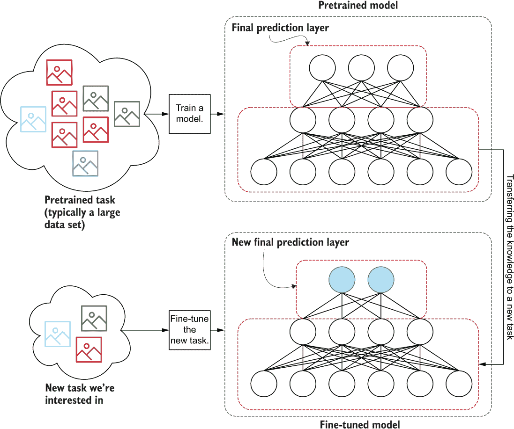

图 7.14 迁移学习的工作原理。首先，我们从一个在解决与我们感兴趣的任务类似/相关的较大数据集上预训练的模型开始。然后，我们传输模型权重（除了最后一层），并在现有权重之上拟合一个新的预测层。最后，我们在新任务上进行微调。

首先，你在一个你已经拥有大型标记数据集的任务上训练模型（称为预训练任务）。例如，在图像分类中，你有几个大型标记数据集，包括 ImageNet 数据集。一旦你在大型数据集上训练了一个模型，你就会得到网络的权重（除了最后的预测层），并拟合一个匹配新任务的新预测层。这给了网络解决新任务的一个非常好的起点。然后，你可以用较小的数据集解决新任务，因为你已经在类似的较大数据集上训练了模型。

我们如何使用迁移学习来解决我们的问题？这并不难。Keras 为图像分类任务提供了一个巨大的模型库（[`mng.bz/aJdo`](http://mng.bz/aJdo)）。这些模型主要是在 ImageNet 图像分类任务上进行训练的。让我们驯服 Inception 网络系列中产生的野兽：Inception-ResNet v2。请注意，本节的代码可以在 Ch07-Improving-CNNs-and-Explaining/7.2.Transfer_Learning.ipynb 中找到。

Inception-ResNet v2

我们简要讨论了 Inception-ResNet v2 模型。这是最后一个生产的 Inception 模型。Inception-ResNet v2 具有以下特点，使其与其他 Inception 模型区别开来：

+   重新设计的起始模块，消除了任何表征瓶颈

+   使用残差连接的 Inception 块

+   减少输入高度/宽度维度的减少模块

+   不像早期的 Inception 网络那样使用辅助输出

正如你所看到的，Minception 模型中使用了重新设计的起始模块、Inception-ResNet 块和减少模块。如果你比较一下 Minception 的图表与原始论文中提供的图表，你会看到它们有多么相似。因此，我们不会重复讨论这些组件。如果你仍然想看到不同组件的具体细节和插图，请参考原始论文（[`arxiv.org/pdf/1602.07261.pdf`](https://arxiv.org/pdf/1602.07261.pdf)）。然而，Inception-ResNet v2 的高层架构如下图所示。

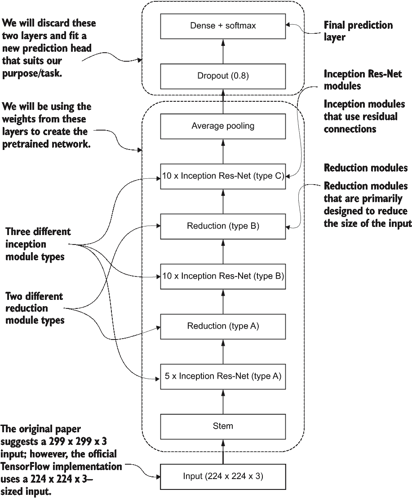

Inception-ResNet v2 的整体架构

您可以使用一行代码下载 Inception-ResNet v2 模型：

```py
    InceptionResNetV2(include_top=False, pooling='avg')
```

这里 include_top=False 意味着最终的预测层将被丢弃。这是必要的，因为原始的 inception 网络是为 1000 类设计的。但是，我们只有 200 类。pooling=‘avg’ 确保模型中的最后一个汇合层是平均汇合层。接下来，我们将创建一个新模型，将预训练的 Inception-ResNet v2 模型作为核心，但修改为解决 Tiny ImageNet 分类任务，如下图所示。

列出了基于预训练 Inception-ResNet v2 模型的模型实现

```py
from tensorflow.keras.applications import InceptionResNetV2   ❶
from tensorflow.keras.models import Sequential                ❶
from tensorflow.keras.layers import Input, Dense, Dropout     ❶

model = Sequential([
    Input(shape=(224,224,3)),                                 ❷
    InceptionResNetV2(include_top=False, pooling='avg'),      ❸
    Dropout(0.4),                                             ❹
    Dense(200, activation='softmax')                          ❺
])

adam = tf.keras.optimizers.Adam(learning_rate=0.0001)         ❻
model.compile(loss=’categorical_crossentropy’, optimizer=adam, 
➥ metrics=['accuracy'])
model.summary()
```

❶ 一些重要的导入

❷ 为 224 × 224 的图像定义输入层

❸ Inception-ResNet v2 模型的预训练权重

❹ 应用了 40% 的 dropout

❺ 最终的预测层有 200 个类

❻ 由于网络已经在 ImageNet 数据上进行了训练，所以使用较小的学习率（经验选择）

在这里，我们定义了一个顺序模型，

+   首先定义了一个大小为 224 × 224 × 3 的输入层（即，高度 = 224，宽度 = 224，通道 = 3）

+   将 Inception-ResNet v2 模型定义为一个层

+   在最后一个平均汇合层上使用 40% 的 dropout

+   定义了一个使用 Softmax 激活的密集层，具有 200 个节点

我们需要应对的一个关键挑战是，原始的 Inception-ResNet v2 输入大小为 224 × 224 × 3。因此，我们需要找到一种方法来呈现我们的输入（即，64 × 64 × 3）以符合 Inception-ResNet v2 的要求。为了做到这一点，我们将对 ImageDataGenerator 进行一些更改，如下面的列表所示。

列出了生成 224 × 224 图像的修改版 ImageDataGenerator。

```py
def get_train_valid_test_data_generators(batch_size, target_size):

    image_gen_aug = ImageDataGenerator(
        samplewise_center=False, rotation_range=30, width_shift_range=0.2,
        height_shift_range=0.2, brightness_range=(0.5,1.5), shear_range=5, 
        zoom_range=0.2, horizontal_flip=True, validation_split=0.1
    )                                                         ❶
    image_gen = ImageDataGenerator(samplewise_center=False)   ❶

    partial_flow_func = partial(                              ❷
        image_gen_aug.flow_from_directory, 
        directory=os.path.join('data','tiny-imagenet-200', 'train'), 
        target_size=target_size,                              ❸
        classes=None,
        class_mode='categorical', 
        interpolation='bilinear',                             ❹
        batch_size=batch_size, 
        shuffle=True, 
        seed=random_seed)                                        

    # Get the training data subset
    train_gen = partial_flow_func(subset='training')          ❺
    # Get the validation data subset
    valid_gen = partial_flow_func(subset='validation')        ❺

    # Defining the test data generator
    test_df = get_test_labels_df(os.path.join('data','tiny-imagenet-200',  
➥ 'val', 'val_annotations.txt'))                             ❻
    test_gen = image_gen.flow_from_dataframe(
        test_df, 
        directory=os.path.join('data','tiny-imagenet-200',  'val', 'images'), 
        target_size=target_size,                              ❼
        classes=None,
        class_mode='categorical', 
        interpolation='bilinear',                             ❼
        batch_size=batch_size,  
        shuffle=False
    )
    return train_gen, valid_gen, test_gen

batch_size = 32                                               ❽
target_size = (224,224)                                       ❽

# Getting the train,valid, test data generators
train_gen, valid_gen, test_gen = 
➥ get_train_valid_test_data_generators(batch_size, target_size)

train_gen_aux = data_gen_augmented(train_gen, random_gamma=True, 
➥ random_occlude=True)                                       ❾

valid_gen_aux = data_gen_augmented(valid_gen)                 ❾
test_gen_aux = data_gen_augmented(test_gen)                   ❾
```

❶ 定义了一个数据增广的图片数据生成器和一个标准的图片数据生成器

❷ 定义了部分函数以避免重复参数

❸ 使用 224 × 224 的目标大小

❹ 使用双线性插值使图像变大

❺ 定义了训练和验证集的数据生成器

❻ 定义了测试数据生成器

❼ 使用双线性插值的 224 × 224 目标大小

❽ 定义了批量大小和目标大小

❾ 使用 data_gen_augmented 函数获得训练集/验证集/测试集的修改过的数据生成器

最终，是时候展示我们最好的模型了：

```py
from tensorflow.keras.callbacks import EarlyStopping, CSVLogger
es_callback = EarlyStopping(monitor='val_loss', patience=10)
csv_logger = CSVLogger(os.path.join('eval','4_eval_resnet_pretrained.log'))
n_epochs=30
lr_callback = tf.keras.callbacks.ReduceLROnPlateau(
    monitor='val_loss', factor=0.1, patience=5, verbose=1, mode='auto'
)

history = model.fit(
    train_gen_aux, validation_data=valid_gen_aux, 
    steps_per_epoch=int(0.9*(500*200)/batch_size), validation_steps=int(0.1*(500*200)/batch_size),
    epochs=n_epochs, callbacks=[es_callback, csv_logger, lr_callback]
)
```

训练将与先前训练 Miniception 模型所使用的训练配置相同。我们不会重复细节。我们使用以下内容：

+   记录指标

+   早期停止

+   学习率调整

注意，在一台配有 NVIDIA GeForce RTX 2070 8GB 的 Intel Core i5 机器上，训练 23 epoch 大约需要 9 小时 20 分钟。

您应该得到类似以下的结果：

```py
Epoch 1/50
2813/2813 [==============================] - 1465s 521ms/step - loss: 
➥ 2.0031 - accuracy: 0.5557 - val_loss: 1.5206 - val_accuracy: 0.6418
...
Epoch 23/50
2813/2813 [==============================] - ETA: 0s - loss: 0.1268 - 
➥ accuracy: 0.9644
Epoch 00023: ReduceLROnPlateau reducing learning rate to 
➥ 9.999999974752428e-08.
2813/2813 [==============================] - 1456s 518ms/step - loss: 
➥ 0.1268 - accuracy: 0.9644 - val_loss: 1.2681 - val_accuracy: 0.7420
```

这不是好消息吗？通过结合我们所学的所有知识，我们已经达到了约 74% 的验证准确率。让我们快速看一下模型的测试准确率：

```py
# Evaluate the model
test_res = model.evaluate(test_gen_aux, steps=get_steps_per_epoch(500*50, 
➥ batch_size))
```

这应该显示大约 79% 的准确率。这不是一次轻松的旅程，但显然你已经超过了竞争对手的约 70% 准确率的模型。

在下一节中，我们将看看模型可解释性的重要性。我们将学习一种技术，可以用来解释嵌入模型的知识。

Inception-ResNet v2 对比 Minception

Minception 和 Inception-Resnet-v2 的茎在引入的创新方面是相同的（例如，Inception-ResNet 块，缩减块等）。然而，存在以下低级差异：

+   Inception-ResNet v2 有三种不同的 Inception 块类型；Minception 只有两种。

+   Inception-ResNet v2 有两种不同类型的缩减块；Minception 只有一个。

+   Inception-ResNet v2 有 25 个 Inception 层，但我们实现的 Minception（版本）只有三个。

还有其他一些小的差异，例如 Inception-ResNet v2 在模型的几个层中使用有效填充。如果你想了解详情，请参阅 Inception-ResNet v2 论文。另一个值得注意的观察是，Minception 和 Inception-ResNet v2 都没有使用局部响应归一化（LRN），因为它们使用了更强大的东西：批归一化。

练习 4

你想使用另一个名为 VGGNet（16 层）的不同预训练网络实现一个网络。你可以从 tf.keras.applications.VGG16 获取预训练网络。接下来，你丢弃顶层并在顶部引入一个最大池化层。然后你想在预训练网络的顶部添加两个具有 100（ReLU 激活）和 50（Softmax 激活）个节点的稠密层。实现这个网络。

## 7.4 Grad-CAM: 让 CNN 供认

公司对你为他们所做的一切感到非常高兴。你成功地建立了一个不仅击败了竞争对手的性能，而且是生产中最好的模型。然而，你的老板希望在发布任何消息之前确认模型是可信的。仅准确性是不够的！你决定演示模型如何进行预测，使用一种名为*Grad-CAM*的最新模型解释技术。Grad-CAM 使用相对于模型预测而生成的给定输入的梯度的大小来提供模型关注的可视化。图像中某一区域的梯度大小较大意味着图像更关注该区域。通过将梯度大小叠加成热图，你能够产生一个有吸引力的可视化，显示模型在给定输入中关注的内容。

Grad-CAM（梯度类激活映射）是由 Ramprasaath R. Selvaraju 等人在“Grad-CAM: Visual Explanations from Deep Networks via Gradient-based Localization”中为深度神经网络引入的一种模型解释技术（[`arxiv.org/pdf/1610.02391.pdf`](https://arxiv.org/pdf/1610.02391.pdf)）。深度网络因其不可解释性而臭名昭著，因此被称为*黑匣子*。因此，我们必须进行一些分析，确保模型正常运行。

下面的代码详细说明了 Grad-CAM 如何发挥其作用，并且实现代码在笔记本 Ch07-Improving-CNNs-and-Explaining/7.3 .Interpreting_CNNs_GradCAM.ipynb 中可用。为了节省本章的篇幅，我们将仅讨论该方法的伪代码，技术细节留给附录 B（参见下一个清单）。

清单 7.14 Grad-CAM 计算的伪代码

```py
Define: model (Trained Inception Resnet V2 model)
Define: probe_ds (A list of image, class(integer) tuples e.g. [(image, 
➥ class-int), (image, class-int), ...]) that we will use to interpret the model
Define: last_conv (Last convolution layer of the model - closest to the 
➥ prediction layer)
Load the model (inceptionnet_resnet_v2.h5)

For img, cls in probe_ds:

    # Computing the gradient map and its associated weights
    Compute the model’s final output (out) and last_conv layer’s output 
➥ (conv_out)
    Compute the gradient d (out[cls]) / d (conv_out) and assign to grad
    Compute channel weights by taking the mean of grad over width and 
➥ height dimensions (Results in a [batch size(=1), 1, 1, # channels in 
➥ last_conv] tensor)

    # Creating the final gradient heatmap
    grad = grad * weights # Multiply grad with weights
    grad = tf.reduce_sum(grad, axis=-1) # Take sum over channels
    grad = tf.nn.relu(grad) # Apply ReLU activation to obtain the gradient 
➥ heatmap

    # Visualizing the gradient heatmap
    Resize the gradient heatmap to a size of 224x224
    Superimpose the gradient heatmap on the original image (img)
    Plot the image and the image with the gradient heatmap superimposed 
➥ side by side
```

Grad-CAM 执行的关键计算是，给定输入图像，计算与图像真实类别相对应的节点对模型的最后卷积输出的梯度。

图像中每个像素的梯度大小代表了该像素对最终结果的贡献。因此，通过将 Grad-CAM 输出表示为热图，调整大小以匹配原始图像，并将其叠加在原始图像上，你可以获得一个非常引人注目和信息丰富的图，显示了模型关注的不同对象的位置。这些图解释性强，显示了模型是否专注于正确的对象以产生期望的预测。在图 7.15 中，我们展示了模型强烈关注的区域（红色/黑色 = 最高关注，蓝色/浅色 = 较少关注）。

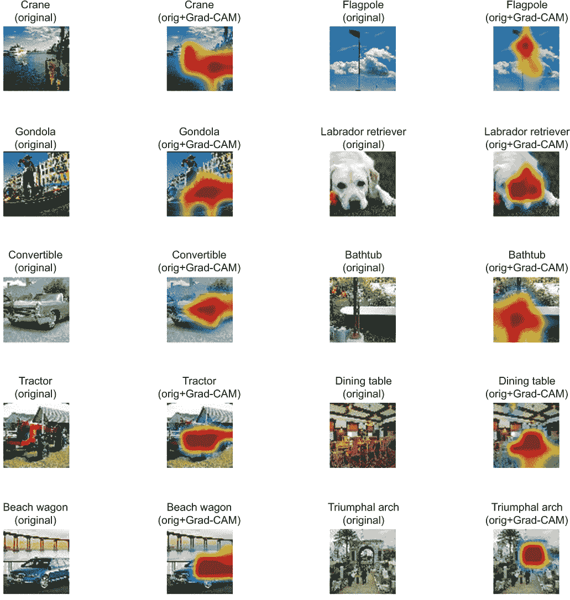

图 7.15 展示了几个探测图像的 Grad-CAM 输出的可视化。图像中越红/越暗的区域，模型对该部分的关注越多。你可以看到我们的模型已经学会了理解一些复杂的场景，并将其需要关注的模型分开。

图 7.15（即 Grad-CAM 的可视化）显示了我们的模型确实是一个智能模型。它知道在混乱的环境中（例如，对餐桌进行分类）要关注哪些地方以找到给定的对象。如前所述，区域越红/越暗，模型就越专注于该区域进行预测。现在是时候向你的老板展示结果，建立必要的信心，公开新模型了！

我们将在此结束对图像分类的讨论。我们已经学习了许多可以有效解决问题的不同模型和技术。在下一章中，我们将讨论计算机视觉的另一个方面，即图像分割。

## 总结

+   图像增强、dropout 和提前停止是在视觉深度网络中防止过拟合的一些常见技术。

+   大多数常见的图像增强步骤可以通过 Keras ImageDataGenerator 实现。

+   对于所选问题，重要的是要注意所选择模型的架构。我们不应随意选择一个架构，而是要研究并确定一个在类似问题上已经奏效的架构。否则，可以通过超参数优化来选择架构。Minception 模型的架构已经被证明在我们本章使用的相同数据上表现良好。

+   迁移学习使我们能够利用已经训练好的模型来解决新任务，从而获得更好的准确性。

+   在 Keras 中，你可以用一行代码获得给定模型，并将其调整到新的任务中。

+   在 [`mng.bz/M5Oo`](http://mng.bz/M5Oo) 上有各种预训练网络可供选择。

+   Grad-CAM（梯度类激活映射）是解释你的 CNN 的有效方法。

+   根据模型对预测产生的梯度大小，Grad-CAM 计算出模型关注最多的地方。

## 练习答案

**练习 1**

1.  如果出现欠拟合，你应该降低 dropout 率，以保持更多节点在训练过程中保持开启状态：

    ```py
    model = tf.keras.models.Sequential([
    tf.keras.layers.Dense(100, activation=’relu’, input_shape=(250,)), 
    tf.keras.layers.Dropout(0.2), 
    tf.keras.layers.Dense(10, activation=’softmax’)
    ])
    model.compile(loss=’categorical_crossentropy’, optimizer=’adam’, 
    ➥ metrics=[‘accuracy’])
    model.fit(X, y, epochs=25)
    ```

1.  提前停止是通过使用 EarlyStopping 回调引入的：

    ```py
    es_callback = tf.keras.callbacks.EarlyStopping(monitor='val_loss', 
    ➥ patience=5, min_delta=0.1)
    model.fit(X, y, epochs=25, callbacks=[es_callback])
    ```

**练习 2**

```py
tf.keras.callbacks.EarlyStopping(monitor='val_loss', min_delta=0.01, patience=5)
```

**练习 3**

```py
def my_conv_block(input, activation): 
    out_1 = tf.keras.layers.Conv2D(n_filters[0][2], (3,3), strides=(1,1), 
                   kernel_initializer=initializer, activation=activation,
                   padding='same')(input)

    out_final = tf.keras.layers.BatchNormalization()(out_1)

    out = out_final + out_1 
    return out

```

**练习 4**

```py
model = tf.keras.models.Sequential([
    tf.keras.layers.Input(shape=(224,224,3)),                                      
    tf.keras.applications.VGG16(include_top=False, pooling='max'),
    tf.keras.layers.Dense(100, activation=’relu’),                    
    tf.keras.layers.Dense(50, activation='softmax') 
])
```
