# 第八章：区分事物：图像分割

本章内容涵盖

+   了解分割数据并在 Python 中处理它

+   实现一个完整的分割数据管道

+   实现高级分割模型（DeepLab v3）

+   使用自定义构建的图像分割损失函数/度量编译模型

+   对清洁和处理后的图像数据进行图像分割模型训练

+   评估经过训练的分割模型

在上一章中，我们学习了各种先进的计算机视觉模型和技术，以提高图像分类器的性能。我们了解了 Inception net v1 的架构以及它的后继者（例如 Inception net v2、v3 和 v4）。我们的目标是提高模型在一个包含 200 个不同类别的对象的 64×64 大小的 RGB 图像的图像分类数据集上的性能。在尝试在此数据集上训练模型时，我们学到了许多重要的概念：

+   *Inception blocks*—一种将具有不同尺寸窗口（或核）的卷积层分组在一起的方法，以鼓励学习不同尺度的特征，同时由于更小尺寸的核而使模型参数高效。

+   *辅助输出*—Inception net 不仅在网络末端使用分类层（即具有 softmax 激活的完全连接层），而且还在网络中间使用。这使得从最终层到第一层的梯度能够强劲地传播。

+   *数据增强*—使用各种图像转换技术（调整亮度/对比度、旋转、平移等）使用 tf.keras.preprocessing.image.ImageDataGenerator 增加标记数据的数量。

+   *Dropout*—随机打开和关闭层中的节点。这迫使神经网络学习更健壮的特征，因为网络并不总是激活所有节点。

+   *提前停止*—使用验证数据集上的性能作为控制训练何时停止的方法。如果在一定数量的 epochs 中验证性能没有提高，则停止训练。

+   *迁移学习*—下载并使用在更大、类似数据集上训练的预训练模型（例如 Inception-ResNet v2）作为初始化，并对其进行微调以在手头的任务上表现良好。

在本章中，我们将学习计算机视觉中另一个重要任务：图像分割。在图像分类中，我们只关心给定图像中是否存在对象。另一方面，图像分割不仅识别同一图像中的多个对象，还识别它们在图像中的位置。这是计算机视觉的一个非常重要的主题，像自动驾驶汽车这样的应用程序依赖于图像分割模型。自动驾驶汽车需要精确定位其周围的物体，这就是图像分割发挥作用的地方。你可能已经猜到，它们在许多其他应用程序中也有它们的根基：

+   图像检索

+   识别星系 ([`mng.bz/gwVx`](http://mng.bz/gwVx))

+   医学图像分析

如果您是从事与图像相关问题的计算机视觉/深度学习工程师/研究人员，您的道路很可能会与图像分割相交。图像分割模型将图像中的每个像素分类为预定义的一组对象类别之一。图像分割与我们之前看到的图像分类任务有关。两者都解决了一个分类任务。此外，预训练的图像分类模型被用作分割模型的骨干，因为它们可以提供不同粒度的关键图像特征，以更好更快地解决分割任务。一个关键区别是图像分类器解决了一个稀疏预测任务，其中每个图像都有一个与之关联的单个类标签，而分割模型解决了一个密集预测任务，其中图像中的每个像素都有一个与之关联的类标签。

任何图像分割算法都可以分类为以下类型之一：

+   *语义分割*—该算法仅对图像中存在的不同类别的对象感兴趣。例如，如果图像中有多个人，则与所有人对应的像素将被标记为相同的类。

+   *实例分割*—该算法对单独识别不同对象感兴趣。例如，如果图像中有多个人，属于每个人的像素将被表示为唯一的类。与语义分割相比，实例分割被认为更难。

图 8.1 描述了语义分割任务中找到的数据与实例分割任务中找到的数据之间的区别。在本章中，我们将重点关注语义分割 ([`mng.bz/5QAZ`](http://mng.bz/5QAZ))。

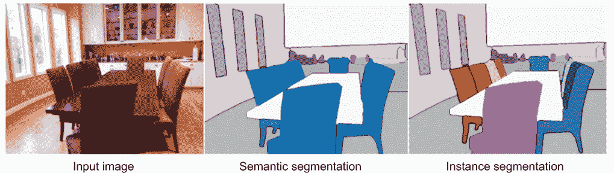

图 8.1 语义分割与实例分割的比较

在下一节中，我们将更仔细地研究我们正在处理的数据。

## 8.1 理解数据

您正在尝试一个创业想法。这个想法是为小型遥控（RC）玩具开发一种导航算法。用户可以选择导航需要多安全或者冒险。作为第一步，您计划开发一个图像分割模型。图像分割模型的输出将稍后馈送到另一个模型，该模型将根据用户的请求预测导航路径。

对于这个任务，您觉得 Pascal VOC 2012 数据集会是一个很好的选择，因为它主要包含了城市/家庭环境中的室内和室外图像。它包含图像对：一个包含一些对象的输入图像和一个带有注释的图像。在注释图像中，每个像素都有一个分配的颜色，取决于该像素属于哪个对象。在这里，您计划下载数据集并成功将数据加载到 Python 中。

在深入了解/界定您想解决的问题之后，下一个重点应该是了解和探索数据。分割数据与我们迄今为止见过的图像分类数据集不同。一个主要的区别是输入和目标都是图像。输入图像是一个标准图像，类似于您在图像分类任务中找到的图像。与图像分类不同，目标不是标签，而是图像，其中每个像素都有来自预定义颜色调色板的颜色。换句话说，我们感兴趣的每个对象都被分配了一种颜色。然后，在输入图像中对应于该对象的像素以该颜色着色。可用颜色的数量与您想要识别的不同对象（加上背景）的数量相同（图 8.2）。

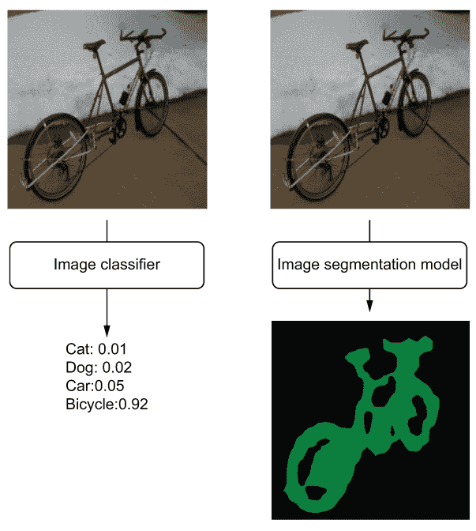

图 8.2 图像分类器与图像分割模型的输入和输出

对于这个任务，我们将使用流行的 PASCAL VOC 2012 数据集，该数据集由真实场景组成。数据集为 22 个不同类别提供了标签，如表 8.1 所述。

表 8.1 PASCAL VOC 2012 数据集中的不同类别及其相应的标签

| **类别** | **指定标签** | **类别** | **指定标签** |
| --- | --- | --- | --- |
| 背景 | 0 | 餐桌 | 11 |
| 飞机 | 1 | 狗 | 12 |
| 自行车 | 2 | 马 | 13 |
| 鸟 | 3 | 摩托车 | 14 |
| 船 | 4 | 人 | 15 |
| 瓶子 | 5 | 盆栽植物 | 16 |
| 公共汽车 | 6 | 羊 | 17 |
| 汽车 | 7 | 沙发 | 18 |
| 猫 | 8 | 火车 | 19 |
| 椅子 | 9 | 电视/显示器 | 20 |
| 牛 | 10 | 边界/未知对象 | 255 |

白色像素代表对象边界或未知对象。图 8.3 通过显示每个单独的对象类别的样本来说明数据集。

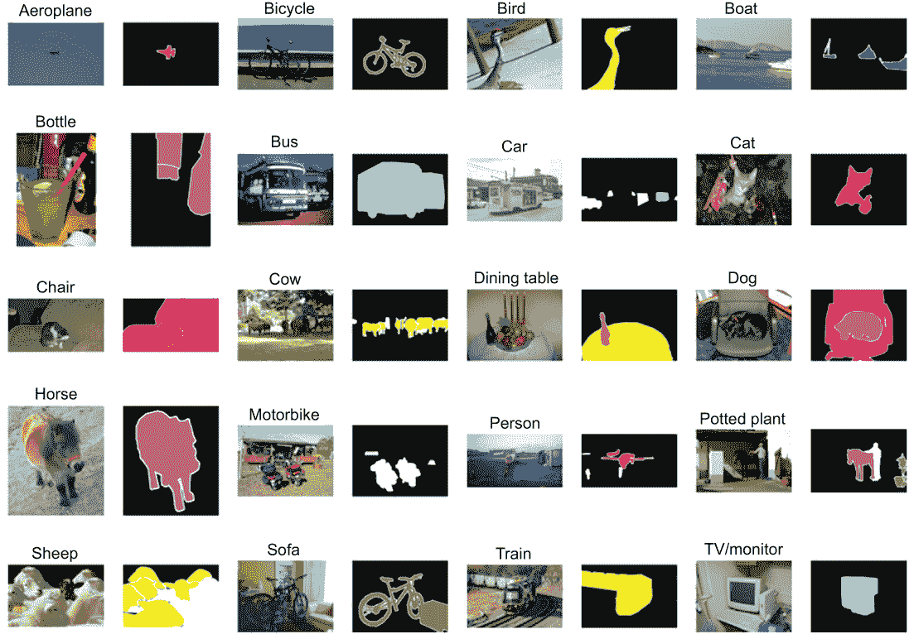

图 8.3 PASCAL VOC 2012 数据集的样本。数据集显示了单个示例图像，以及用于 20 种不同对象类别的注释分割。

在图 8.4 中，深入挖掘一下，你可以近距离看到单个样本数据点（最好是以彩色视图查看）。它有两个对象：一把椅子和一只狗。正如所示，不同的颜色分配给不同的对象类别。虽然最好以彩色查看图像，但您仍然可以通过注意在图像中勾勒对象的白色边框来区分不同的对象。

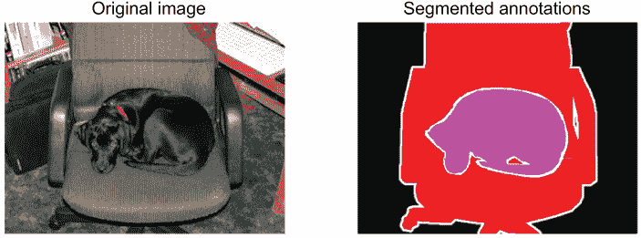

图 8.4 图像分割中的原始输入图像及其相应的目标标注/分割图像

首先，我们将从[`mng.bz/6XwZ`](http://mng.bz/6XwZ)下载数据集（请参阅下一个清单）。

清单 8.1 下载数据

```py
import os
import requests
import tarfile

# Retrieve the data
if *not* os.path.exists(os.path.join('data','VOCtrainval_11-May-2012.tar')): ❶
    url = "http:/ /host.robots.ox.ac.uk/pascal/VOC/voc2012/VOCtrainval_11-
➥ May-2012.tar"
    # Get the file from web
    r = requests.get(url)                                                  ❷

    if *not* os.path.exists('data'):
        os.mkdir('data')

    # Write to a file
    with open(os.path.join('data','VOCtrainval_11-May-2012.tar'), 'wb') as f:
        f.write(r.content)                                                 ❸
else:
    print("The tar file already exists.")

if *not* os.path.exists(os.path.join('data', 'VOCtrainval_11-May-2012')):    ❹
    with tarfile.open(os.path.join('data','VOCtrainval_11-May-2012.tar'), 'r') as tar:
        tar.extractall('data')
else:
    print("The extracted data already exists")
```

❶ 检查文件是否已经下载。如果已下载，则不要重新下载。

❷ 从 URL 获取内容。

❸ 将文件保存到磁盘。

❹ 如果文件存在但尚未提取，则提取文件。

数据集的下载与我们以前的经验非常相似。数据作为 tar 文件存在。如果文件不存在，我们会下载文件并解压缩。接下来，我们将讨论如何使用图像库 Pillow 和 NumPy 将图像加载到内存中。在这里，目标图像将需要特殊处理，因为您将看到它们不是使用常规方法存储的。加载输入图像到内存中没有任何意外情况。使用 PIL（即 Pillow）库，可以通过一行代码加载它们：

```py
from PIL import Image

orig_image_path = os.path.join('data', 'VOCtrainval_11-May-2012', 
➥ 'VOCdevkit', 'VOC2012', 'JPEGImages', '2007_000661.jpg')

orig_image = Image.open(orig_image_path)
```

接下来，您可以检查图像的属性：

```py
print("The format of the data {}".format(orig_image.format))
>>> The format of the data JPEG

print("This image is of size: {}".format(orig_image.shape))
>>> This image is of size: (375, 500, 3)
```

是时候加载相应的注释/分割的目标图像了。如前所述，目标图像需要特殊关注。目标图像不是作为标准图像存储的，而是作为*调色板化*图像存储的。调色板化是一种在图像中存储具有固定颜色数量的图像时减少内存占用的技术。该方法的关键在于维护一个颜色调色板。调色板被存储为整数序列，其长度为颜色数量或通道数量（例如，对于 RGB 的情况，一个像素由三个值对应于红、绿和蓝，通道数量为三。灰度图像具有单个通道，其中每个像素由单个值组成）。然后，图像本身存储了一个索引数组（大小为高度×宽度），其中每个索引映射到调色板中的一种颜色。最后，通过将图像中的调色板索引映射到调色板颜色，可以计算出原始图像。图 8.5 提供了这个讨论的视觉展示。

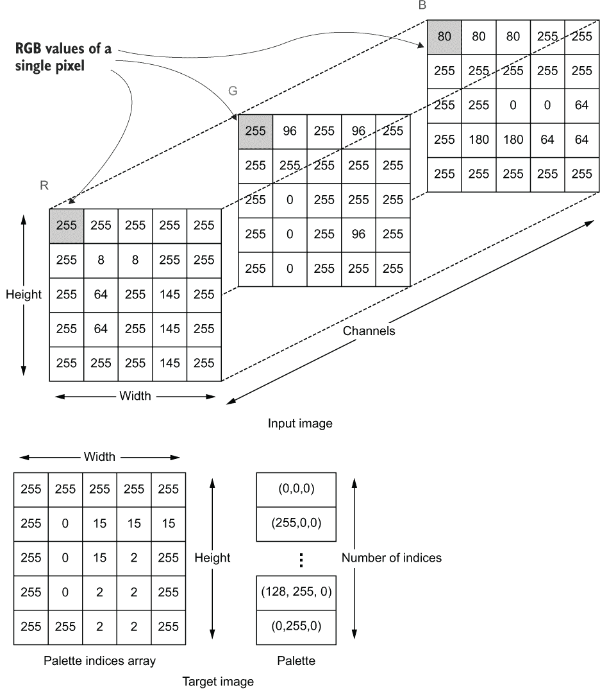

图 8.5 显示了 PASCAL VOC 2012 数据集中输入图像和目标图像的数值表示。

下一个清单展示了从调色板图像中重新构造原始图像像素的代码。

代码清单 8.2 从调色板图像中重建原始图像

```py
def rgb_image_from_palette(image):

    """ This function restores the RGB values form a palletted PNG image """
    palette = image.get_palette()                                         ❶

    palette = np.array(pallette).reshape(-1,3)                            ❷
    if isinstance(image, PngImageFile):
        h, w = image.height, image.width                                  ❸
        # Squash height and width dimensions (makes slicing easier)
        image = np.array(image).reshape(-1)                               ❹
    elif isinstance(image, np.ndarray):                                   ❺
        h, w = image.shape[0], image.shape[1]
        image = image.reshape(-1)

    rgb_image = np.zeros(shape=(image.shape[0],3))                        ❻
    rgb_image[(image != 0),:] = pallette[image[(image != 0)], :]          ❻
    rgb_image = rgb_image.reshape(h, w, 3)                                ❼

    return rgb_image
```

❶ 从图像中获取颜色调色板。

❷ 调色板以向量形式存储。我们将其重新整形为一个数组，其中每一行表示一个单独的 RGB 颜色。

❸ 获取图像的高度和宽度。

❹ 将以数组形式存储的调色板图像转换为向量（有助于接下来的步骤）。

❺ 如果图像是以数组而不是 Pillow 图像提供的，将图像作为向量获取。

❻ 首先，我们定义一个与图像长度相同的零向量。然后，对于图像中的所有索引，我们从调色板中获取相应的颜色，并将其分配到 rgb_image 的相同位置。

❼ 恢复原始形状。

在这里，我们首先使用 get_palette()函数获取图像的调色板。这将作为一个一维数组存在（长度为类别数×通道数）。接下来，我们需要将数组重塑为一个（类别数，通道数）大小的数组。在我们的情况下，这将转换为一个（22,3）大小的数组。由于我们将重塑的第一维定义为-1，它将从原始数据的大小和重塑操作的其他维度中自动推断出来。最后，我们定义一个全零数组，它最终将存储图像中找到的索引的实际颜色。为此，我们使用图像（包含索引）索引 rgb_image 向量，并将调色板中匹配的颜色分配给这些索引。

利用我们迄今为止看到的数据，让我们定义一个 TensorFlow 数据管道，将数据转换和转换为模型可接受的格式。

练习 1

你已经提供了一个以 RGB 格式表示的 rgb_image，其中每个像素属于 n 种独特的颜色之一，并且已经给出了一个称为调色板的调色板，它是一个[n,3]大小的数组。你将如何将 rgb_image 转换为调色板图像？

提示 你可以通过使用三个 for 循环来创建一个简单的解决方案：两个循环用于获取 rgb_image 的单个像素，然后最后一个循环用于遍历调色板中的每种颜色。

## 8.2 认真对待：定义一个 TensorFlow 数据管道

到目前为止，我们已经讨论了将帮助我们为 RC 玩具构建导航算法的数据。在构建模型之前，一个重要的任务是完成从磁盘到模型的可扩展数据摄取方法。提前完成这项工作将节省大量时间，当我们准备扩展或投产时。你认为最好的方法是实现一个 tf.data 管道，从磁盘中检索图像，对它们进行预处理、转换，并使其准备好供模型获取。该管道应该读取图像，将它们重塑为固定大小（对于变尺寸图像），对它们进行数据增强（在训练阶段），分批处理它们，并为所需的 epoch 数重复此过程。最后，我们将定义三个管道：一个训练数据管道，一个验证数据管道和一个测试数据管道。

在数据探索阶段结束时，我们的目标应该是建立一个从磁盘到模型的可靠数据管道。这就是我们将在这里看到的。从高层次来看，我们将建立一个 TensorFlow 数据管道，执行以下任务：

+   获取属于某个子集（例如，训练、验证或测试）的文件名。

+   从磁盘中读取指定的图像。

+   预处理图像（包括对图像进行归一化/调整大小/裁剪）。

+   对图像执行增强以增加数据量。

+   将数据分批处理成小批次。

+   使用几种内置优化技术优化数据检索。

作为第一步，我们将编写一个函数，返回一个生成器，该生成器将生成我们要获取的数据的文件名。我们还将提供指定用户想要获取的子集（例如，训练、验证或测试）的能力。通过生成器返回数据将使编写`tf.data`流水线更容易（参见下面的代码清单）。

图 8.3 检索给定数据子集的文件名列表

```py
def get_subset_filenames(orig_dir, seg_dir, subset_dir, subset):
    """ Get the filenames for a given subset (train/valid/test)"""

    if subset.startswith('train'):
        ser = pd.read_csv(                                            ❶
            os.path.join(subset_dir, "train.txt"), 
            index_col=None, header=None, squeeze=True
        ).tolist()
        elif subset.startswith('val') or subset.startswith('test'):

        random.seed(random_seed)                                      ❷

        ser = pd.read_csv(                                            ❸
            os.path.join(subset_dir, "val.txt"), 
            index_col=None, header=None, squeeze=True
        ).tolist()

        random.shuffle(ser)                                           ❹

        if subset.startswith('val'):
            ser = ser[:len(ser)//2]                                   ❺
        else:
            ser = ser[len(ser)//2:]                                   ❻
    else:
        raise NotImplementedError("Subset={} is not recognized".format(subset))

    orig_filenames = [os.path.join(orig_dir,f+'.jpg') for f in ser]   ❼
    seg_filenames = [os.path.join(seg_dir, f+'.png') for f in ser]    ❽

    for o, s in zip(orig_filenames, seg_filenames):
        yield o, s                                                    ❾
```

❶ 读取包含训练实例文件名的 CSV 文件。

❷ 对验证/测试子集执行一次洗牌，以确保我们使用固定的种子得到良好的混合。

❸ 读取包含验证/测试文件名的 CSV 文件。

❹ 修复种子后对数据进行洗牌。

❺ 将第一半部分作为验证集。

❻ 将第二半部分作为测试集。

❼ 形成我们捕获的输入图像文件的绝对路径（取决于子集参数）。

❽ 将文件名对（输入和注释）作为生成器返回。

❾ 形成分段图像文件的绝对路径。

您可以看到，在读取 CSV 文件时我们传递了一些参数。这些参数描述了我们正在读取的文件。这些文件非常简单，每行只包含一个图像文件名。`index_col=None`表示文件没有索引列，`header=None`表示文件没有标题，`squeeze=True`表示输出将被呈现为 pandas Series，而不是 pandas Dataframe。有了这些，我们可以定义一个 TensorFlow 数据集（`tf.data.Dataset`），如下所示：

```py
filename_ds = tf.data.Dataset.from_generator(
        subset_filename_gen_func, output_types=(tf.string, tf.string)
    )
```

TensorFlow 有几个不同的函数，用于使用不同的来源生成数据集。由于我们已经定义了函数`get_subset_filenames()`来返回一个生成器，我们将使用`tf.data.Dataset.from_generator()`函数。注意，我们需要提供返回数据的格式和数据类型，通过生成器使用`output_types`参数。函数`subset_filename_gen_func`返回两个字符串；因此，我们将输出类型定义为两个`tf.string`元素的元组。

另一个重要方面是我们根据子集从不同的 txt 文件中读取的情况。在相对路径中有三个不同的文件：`data\VOCtrainval_11-May-2012\VOCdevkit\VOC2012\ImageSets\Segmentation` 文件夹；`train.txt`、`val.txt` 和 `trainval.txt`。在这里，`train.txt` 包含训练图像的文件名，而 `val.txt` 包含验证/测试图像的文件名。我们将使用这些文件创建不同的流水线，产生不同的数据。

`tf.data` 是从哪里来的？

TensorFlow 的`tf.data`流水线可以从各种来源消耗数据。以下是一些常用的检索数据的方法：

`tf.data.Dataset.from_generator(gen_fn)` ——你已经在实际操作中见过这个函数。如果你有一个生成器（即 `gen_fn`）产生数据，你希望它通过一个 `tf.data` 流水线进行处理。这是使用的最简单的方法。

tf.data.Dataset.from_tensor_slices(t)——如果你已经将数据加载为一个大矩阵，这是一个非常有用的函数。t 可以是一个 N 维矩阵，这个函数将在第一个维度上逐个元素地提取。例如，假设你已经将一个大小为 3 × 4 的张量 t 加载到内存中：

```py
t = [ [1,2,3,4],
      [2,3,4,5],
      [6,7,8,9] ]
```

然后，你可以轻松地设置一个 tf.data 管道，如下所示。tf.data.Dataset.from_tensor_slices(t) *将返回* [1,2,3,4]，*然后* [2,3,4,5]，*最后* [6,7,8,9] 当你迭代这个数据管道时。换句话说，你每次看到一行（即从批处理维度中切片，因此称为 from_tensor_slices）。

现在是时候读取我们在上一步获取的文件路径中找到的图像了。TensorFlow 提供了支持，可以轻松加载图像，其中文件名路径为 img_filename，使用函数 tf.io.read_file 和 tf.image.decode_image。在这里，img_filename 是一个 tf.string（即 TensorFlow 中的字符串）：

```py
tf.image.decode_jpeg(tf.io.read_file(image_filename))
```

我们将使用这种模式来加载输入图像。然而，我们需要实现一个自定义图像加载函数来加载目标图像。如果你使用前面的方法，它将自动将图像转换为具有像素值的数组（而不是调色板索引）。但如果我们不执行该转换，我们将得到一个精确符合我们需要的格式的目标数组，因为目标图像中的调色板索引是输入图像中每个对应像素的实际类标签。我们将在 TensorFlow 数据管道中使用 PIL.Image 来加载图像作为调色板图像，并避免将其转换为 RGB：

```py
from PIL import Image

def load_image_func(image):
    """ Load the image given a filename """

    img =  np.array(Image.open(image))        
    return img
```

然而，你还不能将自定义函数作为 tf.data 管道的一部分使用。它们需要通过将其包装为 TensorFlow 操作来与数据管道的数据流图相协调。这可以通过使用 tf.numpy_function 操作轻松实现，它允许你将返回 NumPy 数组的自定义函数包装为 TensorFlow 操作。如果我们用 y 表示目标图像的文件路径，你可以使用以下代码将图像加载到 TensorFlow 中并使用自定义图像加载函数：

```py
tf.numpy_function(load_image_func, inp=[y], Tout=[tf.uint8])
```

**tf.numpy_function** 的黑暗面

NumPy 对各种科学计算有比 TensorFlow 更广泛的覆盖，所以你可能会认为 tf.numpy_function 让事情变得非常方便。但事实并非如此，因为你可能会在 TensorFlow 代码中引入可怕的性能下降。当 TensorFlow 执行 NumPy 代码时，它可能会创建非常低效的数据流图并引入开销。因此，尽量坚持使用 TensorFlow 操作，并且只在必要时使用自定义的 NumPy 代码。在我们的情况下，由于没有其他方法可以加载调色板图像而不将调色板值映射到实际的 RGB，我们使用了一个自定义函数。

请注意，我们将输入（即，inp=[y]）和其数据类型（即，Tout=[tf.uint8]）都传递给此函数。它们都需要以 Python 列表的形式存在。最后，让我们把我们讨论的所有内容都整理到一个地方：

```py
def load_image_func(image):
    """ Load the image given a filename """

    img =  np.array(Image.open(image))        
    return img

# Load the images from the filenames returned by the above step
    image_ds = filename_ds.map(lambda x,y: (
        tf.image.decode_jpeg(tf.io.read_file(x)), 
        tf.numpy_function(load_image_func, [y], [tf.uint8])
    ))
```

tf.data.Dataset.map() 函数将在本讨论中大量使用。您可以在侧边栏中找到 map() 函数的详细解释。

刷新器：tf.data.Dataset.map() 函数

此 tf.data 管道将大量使用 tf.data.Dataset.map() 函数。因此，我们提醒自己此函数实现了什么功能是非常有帮助的。

td.data.Dataset.map() 函数将给定的函数或多个函数应用于数据集中的所有记录。换句话说，它使用指定的转换来转换数据集中的数据点。例如，假设 tf.data.Dataset

```py
  dataset = tf.data.Dataset.from_tensor_slices([1, 2, 3, 4])
```

要获取每个元素的平方，可以使用 map 函数如下

```py
  dataset = dataset.map(lambda x: x**2)
```

如果在单个记录中有多个元素，则可以利用 map()的灵活性来分别转换它们：

```py
  dataset = tf.data.Dataset.from_tensor_slices([[1,3], [2,4], [3,5], [4,6]])
  dataset = dataset.map(lambda x, y: (x**2, y+x))
which will return,
[[1, 4], [4, 6], [9, 8], [16, 10]]
```

作为规范化步骤，我们将通过使用将像素值带到 [0,1] 范围的方法

```py
image_ds = image_ds.map(lambda x, y: (tf.cast(x, 'float32')/255.0, y))
```

请注意，我们保留了目标图像（y）。在我们的管道中继续进行更多步骤之前，我想引起您的注意。这是一个相当常见的警告，因此值得注意。在我们刚刚完成的步骤之后，您可能会觉得，如果您愿意，您可以将数据进行批处理并将其馈送到模型中。例如

```py
image_ds = image_ds.batch(10)
```

如果您对此数据集进行此操作，将会收到以下错误：

```py
InvalidArgumentError: Cannot batch tensors with different shapes in 
➥ component 0\. First element had shape [375,500,3] and element 1 had 
➥ shape [333,500,3]. [Op:IteratorGetNext]
```

这是因为您忽略了数据集的一个关键特征和一个健全性检查。除非您使用的是经过筛选的数据集，否则您不太可能找到具有相同尺寸的图像。如果您查看数据集中的图像，您会注意到它们的尺寸不同；它们具有不同的高度和宽度。在 TensorFlow 中，除非您使用像 tf.RaggedTensor 这样的特殊数据结构，否则无法将大小不同的图像一起进行批处理。这正是 TensorFlow 在错误中抱怨的内容。

为了缓解问题，我们需要将所有图像调整为标准大小（请参见列表 8.4）。为此，我们将定义以下函数。它将

+   将图像调整为较大的尺寸（resize_to_before_crop），然后将图像裁剪为所需大小（input_size），或者

+   将图像调整为所需大小（input_size）

列表 8.4 使用随机裁剪或调整大小将图像调整为固定大小

```py
def randomly_crop_or_resize(x,y):
    """ Randomly crops or resizes the images """

    def rand_crop(x, y):                                                  ❶
        """ Randomly crop images after enlarging them """
        x = tf.image.resize(x, resize_to_before_crop, method='bilinear')  ❷
        y = tf.cast(                                                      ❸
                tf.image.resize(
                    tf.transpose(y,[1,2,0]),                              ❹
                    resize_to_before_crop, method='nearest'
                ),
                'float32'
            )          

        offset_h = tf.random.uniform(
            [], 0, x.shape[0]-input_size[0], dtype='int32'
        )                                                                 ❺
        offset_w = tf.random.uniform(
            [], 0, x.shape[1]-input_size[1], dtype='int32'
        )                                                                 ❻
        x = tf.image.crop_to_bounding_box(
            image=x, 
            offset_height=offset_h, offset_width=offset_w,
            target_height=input_size[0], target_width=input_size[1]       ❼
        )
        y = tf.image.crop_to_bounding_box(
            image=y, 
            offset_height=offset_h, offset_width=offset_w,
            target_height=input_size[0], target_width=input_size[1]       ❼
        )

        return x, y

    def resize(x, y):
        """ Resize images to a desired size """
        x = tf.image.resize(x, input_size, method='bilinear')             ❽
        y = tf.cast(
                tf.image.resize(
                    tf.transpose(y,[1,2,0]),                                        
                    input_size, method='nearest'                          ❽
                ),
                'float32'
            )          

        return x, y

    rand = tf.random.uniform([], 0.0,1.0)                                 ❾

    if augmentation and \                                                 ❿
        (input_size[0] < resize_to_before_crop[0] or \
         input_size[1] < resize_to_before_crop[1]):
        x, y = tf.cond(
                rand < 0.5,                                               ⓫
                lambda: rand_crop(x, y),
                 lambda: resize(x, y)
                )
        else:
            x, y = resize(x, y)                                           ⓬

        return x, y
```

❶ 定义一个函数，在调整大小后随机裁剪图像。

❷ 使用双线性插值将输入图像调整为较大的尺寸。

❸ 使用最近邻插值将目标图像调整为较大的尺寸。

❹ 要调整大小，我们首先交换 y 轴的轴，因为它的形状为 [1, height, width]。我们使用 tf.transpose() 函数将其转换回 [height, width, 1]（即，单通道图像）。

❺ 定义一个随机变量，在裁剪期间偏移图像的高度。

❻ 定义一个随机变量，在裁剪期间在宽度上对图像进行偏移。

❼ 使用相同的裁剪参数裁剪输入图像和目标图像。

❽ 将输入图像和目标图像都调整为所需大小（不裁剪）。

❾ 定义一个随机变量（用于执行增强）。

❿ 如果启用增强并且调整大小后的图像大于我们请求的输入大小，则执行增强。

⓫ 在增强期间，随机执行 rand_crop 或 resize 函数。

⓬ 如果禁用增强，则只调整大小。

这里，我们定义了一个名为 randomly_crop_or_resize 的函数，其中包含两个嵌套函数 rand_crop 和 resize。rand_crop 首先将图像调整为 resize_to_before_crop 中指定的大小，并创建一个随机裁剪。务必检查是否对输入和目标应用了完全相同的裁剪。例如，应使用相同的裁剪参数对输入和目标进行裁剪。为了裁剪图像，我们使用

```py
x = tf.image.crop_to_bounding_box(
    image=x, 
    offset_height=offset_h, offset_width=offset_w,
    target_height=input_size[0], target_width=input_size[1]                 
)
y = tf.image.crop_to_bounding_box(
    image=y, 
    offset_height=offset_h, offset_width=offset_w,
    target_height=input_size[0], target_width=input_size[1]               
)
```

参数的含义不言而喻：image 接受要裁剪的图像，offset_height 和 offset_width 决定裁剪的起点，target_height 和 target_width 指定裁剪后的最终大小。resize 函数将使用 tf.image.resize 操作简单地将输入和目标调整为指定大小。

在调整大小时，我们对输入图像使用*双线性插值*，对目标使用*最近邻插值*。双线性插值通过计算结果像素的邻近像素的平均值来调整图像大小，而最近邻插值通过从邻居中选择最近的常见像素来计算输出像素。双线性插值在调整大小后会导致更平滑的结果。然而，必须对目标图像使用最近邻插值，因为双线性插值会导致分数输出，破坏基于整数的注释。图 8.6 可视化了所描述的插值技术。

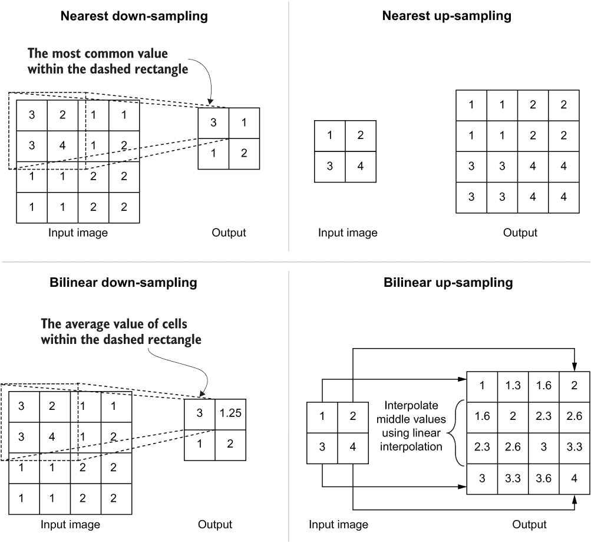

图 8.6 最近邻插值和双线性插值用于上采样和下采样任务

接下来，我们将在使用这两个嵌套函数的方式上引入一个额外的步骤。如果启用了增强，我们希望裁剪或调整大小在管道中随机地发生。我们将定义一个随机变量（从介于 0 和 1 之间的均匀分布中抽取）并根据随机变量的值在给定时间内执行裁剪或调整大小。可以使用 tf.cond 函数实现这种条件，该函数接受三个参数，并根据这些参数返回输出：

+   Condition——这是一个计算结果为布尔值的计算（即随机变量 rand 是否大于 0.5）。

+   true_fn——如果条件为真，则执行此函数（即对 x 和 y 执行 rand_crop）

+   false_fn——如果条件为假，则执行此函数（即对 x 和 y 执行调整大小）

如果禁用了增强（即通过将`augmentation`变量设置为`False`），则仅执行调整大小操作。详细信息澄清后，我们可以在我们的数据管道中使用`randomly_crop_or_resize`函数如下：

```py
    image_ds = image_ds.map(lambda x,y: randomly_crop_or_resize(x,y))
```

此时，我们的管道中出现了一个全局固定大小的图像。接下来我们要处理的事情非常重要。诸如图像大小可变和用于加载图像的自定义 NumPy 函数等因素使得 TensorFlow 在几个步骤之后无法推断其最终张量的形状（尽管它是一个固定大小的张量）。如果您检查此时产生的张量的形状，您可能会将它们视为

```py
(None, None, None)
```

这意味着 TensorFlow 无法推断张量的形状。为了避免任何歧义或问题，我们将设置管道中输出的形状。对于张量`t`，如果形状不明确但您知道形状，您可以使用手动设置形状

```py
t.set_shape([<shape of the tensor>])
```

在我们的数据管道中，我们可以设置形状为

```py
def fix_shape(x, y, size):
    """ Set the shape of the input/target tensors """

    x.set_shape((size[0], size[1], 3))
    y.set_shape((size[0], size[1], 1))

    return x, y

image_ds = image_ds.map(lambda x,y: fix_shape(x,y, target_size=input_size))
```

我们知道跟随调整大小或裁剪的输出将会是

+   *输入图像* —— 一个具有`input_size`高度和宽度的 RGB 图像

+   *目标图像* —— 一个具有`input_size`高度和宽度的单通道图像

我们将使用`tf.data.Dataset.map()`函数相应地设置形状。不能低估数据增强的威力，因此我们将向我们的数据管道引入几个数据增强步骤（见下一篇列表）。

列表 8.5 用于图像随机增强的函数

```py
def randomly_flip_horizontal(x, y):
    """ Randomly flip images horizontally. """

    rand = tf.random.uniform([], 0.0,1.0)                                           ❶

    def flip(x, y):
        return tf.image.flip_left_right(x), tf.image.flip_left_right(y)             ❷

    x, y = tf.cond(rand < 0.5, lambda: flip(x, y), lambda: (x, y))                  ❸

    return x, y

if augmentation:    
    image_ds = image_ds.map(lambda x, y: randomly_flip_horizontal(x,y))             ❹

    image_ds = image_ds.map(lambda x, y: (tf.image.random_hue(x, 0.1), y))          ❺

    image_ds = image_ds.map(lambda x, y: (tf.image.random_brightness(x, 0.1), y))   ❻

    image_ds = image_ds.map(lambda x, y: (tf.image.random_contrast(x, 0.8, 1.2), y))❼
```

❶ 定义一个随机变量。

❷ 定义一个函数来确定性地翻转图像。

❸ 使用与之前相同的模式，我们使用`tf.cond`随机执行水平翻转。

❹ 在数据集中随机翻转图像。

❺ 随机调整输入图像的色调（即颜色）（目标保持不变）。

❻ 随机调整输入图像的亮度（目标保持不变）。

❼ 随机调整输入图像的对比度（目标保持不变）。

在列表 8.5 中，我们执行以下翻译：

+   随机水平翻转图像

+   随机改变图像的色调（最多 10%）

+   随机改变图像的亮度（最多 10%）

+   随机改变图像的对比度（最多 20%）

通过使用`tf.data.Dataset.map()`函数，我们可以在管道中轻松执行指定的随机增强步骤，如果用户在管道中启用了增强（即通过将`augmentation`变量设置为`True`）。请注意，我们仅对输入图像执行一些增强（例如，随机色调、亮度和对比度调整）。我们还将给用户提供具有不同尺寸的输入和目标（即输出）的选项。这通过将输出调整为由`output_size`参数定义的所需大小来实现。我们用于此任务的模型具有不同尺寸的输入和输出维度：

```py
if output_size:
    image_ds = image_ds.map(
                   lambda x, y: (
                       x, 
                       tf.image.resize(y, output_size, method='nearest')
                   )
    )
```

再次，这里我们使用最近邻插值来调整目标的大小。接下来，我们将对数据进行洗牌（如果用户将`shuffle`参数设置为`True`）：

```py
if shuffle:
    image_ds = image_ds.shuffle(buffer_size=batch_size*5)
```

混洗函数有一个重要参数称为`buffer_size`，它确定了加载到内存中以随机选择样本的样本数量。`buffer_size`越高，引入的随机性就越多。另一方面，较高的`buffer_size`意味着更高的内存消耗。现在是批处理数据的时候了，所以在迭代时不是单个数据点，而是当我们迭代时获得一批数据：

```py
image_ds = image_ds.batch(batch_size).repeat(epochs)
```

这是使用`tf.data.Dataset.batch()`函数完成的，将所需的批次大小作为参数传递。在使用`tf.data`管道时，如果要运行多个周期，还需要使用`tf.data.Dataset.repeat()`函数重复管道给定次数的周期。

我们为什么需要`tf.data.Dataset.repeat()`？

`tf.data.Dataset`是一个生成器。生成器的一个独特特点是您只能迭代一次。当生成器到达正在迭代的序列的末尾时，它将通过抛出异常退出。因此，如果您需要多次迭代生成器，您需要根据需要重新定义生成器。通过添加`tf.data.Dataset.repeat(epochs)`，生成器将根据需要重新定义（在此示例中为 epochs 次）。

在我们的`tf.data`管道完成之前，还需要一步。如果查看目标（y）输出的形状，您将看到它具有通道维度为 1。但是，对于我们将要使用的损失函数，我们需要摆脱该维度：

```py
image_ds = image_ds.map(lambda x, y: (x, tf.squeeze(y)))
```

对此，我们将使用`tf.squeeze()`操作，该操作会删除尺寸为 1 的任何维度并返回一个张量。例如，如果您压缩一个尺寸为`[1,3,2,1,5]`的张量，您将得到一个尺寸为`[3,2,5]`的张量。最终的代码在清单 8.6 中提供。您可能会注意到两个突出显示的步骤。这是两个流行的优化步骤：缓存和预提取。

清单 8.6 最终的`tf.data`管道

```py
def get_subset_tf_dataset(
    subset_filename_gen_func, batch_size, epochs, 
    input_size=(256, 256), output_size=None, resize_to_before_crop=None, 
    augmentation=False, shuffle=False
):

    if augmentation and not resize_to_before_crop:
        raise RuntimeError(                                                          ❶
            "You must define resize_to_before_crop when augmentation is enabled."
        )

    filename_ds = tf.data.Dataset.from_generator(
        subset_filename_gen_func, output_types=(tf.string, tf.string)                ❷
    )

 image_ds = filename_ds.map(lambda x,y: (
 tf.image.decode_jpeg(tf.io.read_file(x)),                                   ❸
 tf.numpy_function(load_image_func, [y], [tf.uint8])
 )).cache()

    image_ds = image_ds.map(lambda x, y: (tf.cast(x, 'float32')/255.0, y))           ❹

    def randomly_crop_or_resize(x,y):                                                ❺
        """ Randomly crops or resizes the images """
        ...

        def rand_crop(x, y):
            """ Randomly crop images after enlarging them """
            ...

        def resize(x, y):
            """ Resize images to a desired size """
            ...

    image_ds = image_ds.map(lambda x,y: randomly_crop_or_resize(x,y))                ❻
    image_ds = image_ds.map(lambda x,y: fix_shape(x,y, target_size=input_size))      ❼

    if augmentation:    
        image_ds = image_ds.map(lambda x, y: randomly_flip_horizontal(x,y))          ❽
        image_ds = image_ds.map(lambda x, y: (tf.image.random_hue(x, 0.1), y))       ❽
        image_ds = image_ds.map(lambda x, y: (tf.image.random_brightness(x, 0.1), y))❽
        image_ds = image_ds.map(
            lambda x, y: (tf.image.random_contrast(x, 0.8, 1.2), y)                  ❽
        )

    if output_size:
        image_ds = image_ds.map(
            lambda x, y: (x, tf.image.resize(y, output_size,  method='nearest'))     ❾
        )

    if shuffle:
        image_ds = image_ds.shuffle(buffer_size=batch_size*5)                        ❿
    image_ds = image_ds.batch(batch_size).repeat(epochs)                             ⓫

    image_ds = image_ds.prefetch(tf.data.experimental.AUTOTUNE)                      ⓬

    image_ds = image_ds.map(lambda x, y: (x, tf.squeeze(y)))                         ⓭

    return image_ds                                                                  ⓮
```

❶ 如果启用了增强，则需要定义`resize_to_before_crop`。

❷ 根据所请求的数据子集返回文件名列表。

❸ 将图像加载到内存中。`cache()`是一个优化步骤，将在文本中讨论。

❹ 规范化输入图像。

❺ 随机裁剪或调整图像大小的函数

❻ 在图像上执行随机裁剪或调整大小。

❼ 设置结果图像的形状。

❽ 在数据上随机执行各种增强。

❾ 根据需要调整输出图像的大小。

❿ 使用缓冲区对数据进行随机混洗。

⓫ 批处理数据并为所需的周期重复该过程。

⓬ 这是文本中详细讨论的优化步骤。

⓭ 从目标图像中删除不必要的维度。

⓮ 获取最终的`tf.data`管道。

这不是一次轻松的旅程，但却是一次有益的旅程。我们学到了一些定义数据管道的重要技能：

+   定义一个生成器，返回要获取的数据的文件名

+   在`tf.data`管道中加载图像

+   操作图像（调整大小、裁剪、亮度调整等）

+   数据批处理和重复

+   为不同数据集定义多个流水线，这些数据集具有不同的要求

接下来，我们将查看一些优化技术，将我们平庸的数据流水线转变为令人印象深刻的数据高速公路。

### 8.2.1 优化 tf.data 流水线

TensorFlow 是一个用于消耗大型数据集的框架，高效地消耗数据是一个关键优先事项。我们对 tf.data 流水线的讨论中仍然缺少一件事，即 tf.data 流水线可用的优化步骤。在列表 8.6 中，缓存和预取两个步骤被加粗设置。如果您对其他优化技术感兴趣，可以在 [`www.tensorflow.org/guide/data_performance`](https://www.tensorflow.org/guide/data_performance) 上阅读更多。

缓存将在数据通过流水线时将其存储在内存中。这意味着当缓存时，该步骤（例如，从磁盘加载数据）仅在第一个时期发生。随后的时期将从内存中保存的缓存数据中读取。在这里，您可以看到我们将图像加载到内存后进行缓存。这样，TensorFlow 仅在第一个时期加载图像：

```py
image_ds = filename_ds.map(lambda x,y: (
 tf.image.decode_jpeg(tf.io.read_file(x)), 
 tf.numpy_function(load_image_func, [y], [tf.uint8])
)).cache()
```

Prefetching 是你可以使用的另一个强大武器，它允许你利用设备的多进程能力：

```py
image_ds = image_ds.prefetch(tf.data.experimental.AUTOTUNE)
```

提供给函数的参数决定了预取多少数据。通过将其设置为 AUTOTUNE，TensorFlow 将根据可用资源决定要获取的最佳数据量。假设一个简单的数据流水线从磁盘加载图像并训练模型。然后，数据读取和模型训练将交替进行。这导致了显着的空闲时间，因为模型在数据加载时空闲，反之亦然。

然而，多亏了预取，情况就不一样了。预取利用后台线程和内部缓冲区，在模型训练时提前加载数据。当下一次迭代到来时，模型可以无缝地继续训练，因为数据已经被提前加载到内存中。图 8.7 显示了顺序执行和预取之间的差异。

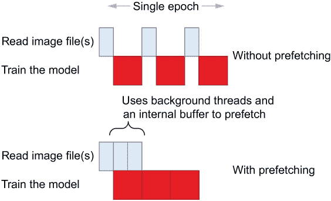

图 8.7 模型训练中的顺序执行与基于预取的执行的区别

接下来，我们将查看图像分割问题的完整 tf.data 流水线。

### 8.2.2 最终的 tf.data 流水线

最后，您可以使用我们迄今为止定义的函数来定义数据流水线（们）。在这里，我们为三个不同的目的定义了三种不同的数据流水线：训练、验证和测试（见下面的列表）。

列表 8.7 创建训练/验证/测试数据流水线实例

```py
orig_dir = os.path.join(
    'data', 'VOCtrainval_11-May-2012', 'VOCdevkit', 'VOC2012', 'JPEGImages'                 ❶
)
seg_dir = os.path.join(
    'data', 'VOCtrainval_11-May-2012', 'VOCdevkit', 'VOC2012', 'SegmentationClass'          ❷
)
subset_dir = os.path.join(
    'data', 'VOCtrainval_11-May-2012', 'VOCdevkit', 'VOC2012', 'ImageSets',                 ❸
    'Segmentation'
)

partial_subset_fn = partial(
    get_subset_filenames, orig_dir=orig_dir, seg_dir=seg_dir, subset_dir=subset_dir         ❹
)
train_subset_fn = partial(partial_subset_fn, subset='train')                                ❺
val_subset_fn = partial(partial_subset_fn, subset='val')                                    ❺
test_subset_fn = partial(partial_subset_fn, subset='test')                                  ❺

input_size = (384, 384)                                                                     ❻

tr_image_ds = get_subset_tf_dataset(                                                        ❼
    train_subset_fn, batch_size, epochs, 
    input_size=input_size, resize_to_before_crop=(444,444),
    augmentation=True, shuffle=True
)
val_image_ds = get_subset_tf_dataset(                                                       ❽
    val_subset_fn, batch_size, epochs, 
    input_size=input_size, 
    shuffle=False
)
test_image_ds = get_subset_tf_dataset(                                                      ❾
    test_subset_fn, batch_size, 1, 
    input_size=input_size, 
    shuffle=False
)
```

❶ 包含输入图像的目录

❷ 包含注释图像（目标）的目录

❸ 包含训练/验证/测试文件名的文本文件所在的目录

❹ 从 get_subset_filenames 定义一个可重用的部分函数。

❺ 为训练/验证/测试数据定义三个生成器。

❻ 定义输入图像尺寸。

❼ 定义一个使用数据增强和洗牌的训练数据流水线。

❽ 定义一个不使用数据增强或洗牌的验证数据流水线。

❾ 定义一个测试数据流水线。

首先，我们定义了几个重要的路径：

+   orig_dir—包含输入图像的目录

+   seg_dir—包含目标图像的目录

+   subset_dir—包含列出训练和验证实例的文本文件（train.txt、val.txt）的目录

然后我们将从我们之前定义的 get_subset_filenames() 函数定义一个偏函数，以便我们可以通过设置函数的 subset 参数来获取一个生成器。利用这种技术，我们将定义三个生成器：train_subset_fn、val_subset_fn 和 test_subset_fn。最后，我们将使用 get_subset_tf_dataset() 函数定义三个 tf.data.Datasets。我们的流水线将具有以下特征：

+   *训练流水线*—在每个 epoch 上执行数据增强和数据洗牌

+   *验证流水线和测试流水线*—无增强或洗牌

我们将定义的模型期望一个 384 × 384 大小的输入和一个输出。在训练数据流水线中，我们将图像调整大小为 444 × 444，然后随机裁剪一个 384 × 384 大小的图像。接下来，我们将看一下解决方案的核心部分：定义图像分割模型。

练习 2

您已经获得了一个包含两个张量的小数据集：张量 a 包含 100 个大小为 64 × 64 × 3 的图像（即，100 × 64 × 64 × 3 的形状），张量 b 包含 100 个大小为 32 × 32 × 1 的分割蒙版（即，100 × 32 × 32 × 1 的形状）。您被要求使用讨论过的函数定义一个 tf.data.Dataset，它将

+   将分割蒙版调整大小以匹配输入图像大小（使用最近的插值）

+   使用转换（x - 128）/255 对输入图像进行标准化，其中单个图像是 x

+   将数据批处理为大小为 32 的批次，并重复五个 epochs

+   使用自动调优功能预取数据

## 8.3 DeepLabv3：使用预训练网络对图像进行分割

现在是创建流水线的核心部分的时候了：深度学习模型。根据一位在类似问题上工作的自动驾驶汽车公司同事的反馈，您将实现一个 DeepLab v3 模型。这是一个建立在预训练的 ResNet 50 模型（在图像分类上训练）的基础上的模型，但最后几层被改为执行 *空洞卷积* 而不是标准卷积。它使用金字塔聚合模块，在不同尺度上使用空洞卷积来生成不同尺度上的图像特征，以产生最终输出。最后，它使用双线性插值层将最终输出调整大小为所需大小。您相信 DeepLab v3 能够提供良好的初始结果。

基于深度神经网络的分割模型可以广泛分为两类：

+   编码器解码器模型（例如，U-Net 模型）

+   完全卷积网络（FCN）后跟金字塔聚合模块（例如，DeepLab v3 模型）

编码器-解码器模型的一个著名例子是 U-Net 模型。换句话说，U-Net 具有逐渐创建输入的较小、更粗略表示的编码器。然后，解码器接收编码器生成的表示，并逐渐上采样（即增加输出的大小）直到达到输入图像的大小为止。上采样是通过一种称为*转置卷积*的操作实现的。最后，你以端到端的方式训练整个结构，其中输入是输入图像，目标是相应图像的分割掩码。我们不会在本章讨论这种类型的模型。然而，我在附录 B 中包含了一个详细的步骤说明（以及模型的实现）。

另一种分割模型引入了一个特殊的模块来替换解码器。我们称之为*金字塔聚合模块*。它的目的是在不同尺度上收集空间信息（例如来自各种中间卷积层的不同大小的输出），以提供关于图像中存在的对象的细粒度上下文信息。DeepLab v3 是这种方法的一个典型示例。我们将对 DeepLab v3 模型进行详细分析，并借此在分割任务上取得卓越成果。

研究人员和工程师更倾向于使用金字塔聚合模块的方法。可能有很多原因。一个有利可图的原因是，使用金字塔聚合的网络参数较少，比采用基于编码器-解码器的对应网络更少。另一个原因可能是，通常引入新模块（与编码器-解码器相比）提供更多灵活性，可以在多个尺度上设计高效准确的特征提取方法。

金字塔聚合模块有多重要？为了了解这一点，我们首先必须了解完全卷积网络的结构是什么样的。图 8.8 说明了这种分割模型的通用结构。

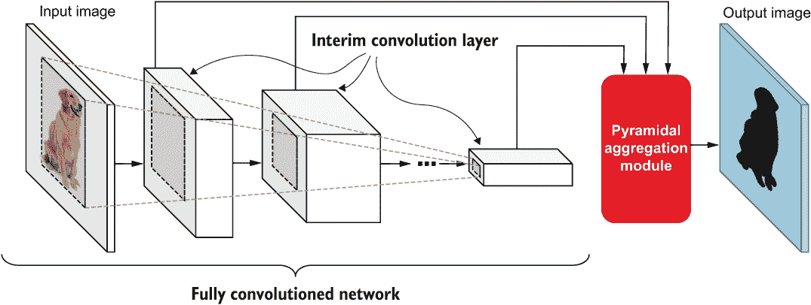

图 8.8 全卷积网络使用金字塔聚合模块的一般结构和组织方式

了解金字塔聚合模块的重要性的最佳方式是看看如果没有它会发生什么。如果是这种情况，那么最后一个卷积层将承担建立最终分割掩码（通常是最后一层输出的 16-32 倍大）的巨大且不切实际的责任。毫不奇怪，在最终卷积层和最终分割掩码之间存在巨大的表征瓶颈，从而导致性能不佳。在卷积神经网络中通常强制执行的金字塔结构导致最后一层的输出宽度和高度非常小。

金字塔聚合模块弥合了这一差距。 它通过组合几个不同的中间输出来做到这一点。 这样，网络就有了充足的细粒度（来自较早层）和粗糙的（来自更深层）细节，以构建所需的分割掩模。 细粒度的表示提供了关于图像的空间/上下文信息，而粗糙的表示提供了关于图像的高级信息（例如，存在哪些对象）。 通过融合这两种类型的表示，生成最终输出的任务变得更加可行。

为什么不是金字塔而是摩天大楼呢？

你可能会想，如果随着时间的推移使输出变小会导致信息的丢失，“为什么不保持相同的大小呢？”（因此有了*摩天大楼*这个术语）。 这是一个不切实际的解决方案，主要有两个原因。

首先，通过池化或步幅减小输出大小是一种重要的正则化方法，它迫使网络学习平移不变特征（正如我们在第六章讨论的那样）。 如果去掉这个过程，我们就会阻碍网络的泛化能力。

其次，不减小输出大小将显著增加模型的内存占用。 这反过来会极大地限制网络的深度，使得创建更深层次的网络更加困难。

DeepLab v3 是一系列模型的金童，这些模型起源于并且是由来自谷歌的几位研究人员在论文“重新思考用于语义图像分割的空洞卷积”（[`arxiv.org/pdf/1706.05587.pdf`](https://arxiv.org/pdf/1706.05587.pdf)）中提出的。

大多数分割模型都面临着由常见且有益的设计原则引起的不利副作用。 视觉模型将步幅/池化结合起来，使网络平移不变。 但这个设计思想的一个不受欢迎的结果是输出大小的不断减小。 这通常导致最终输出比输入小 16-32 倍。 作为密集预测任务，图像分割任务严重受到这种设计思想的影响。 因此，大多数涌现出来的具有突破性的网络都是为了解决这个问题。 DeepLab 模型就是为了解决这个问题而诞生的。 现在让我们看看 DeepLab v3 是如何解决这个问题的。

DeepLab v3 使用在 ImageNet 图像分类数据集上预训练的 ResNet-50（[`arxiv.org/pdf/1512.03385.pdf`](https://arxiv.org/pdf/1512.03385.pdf)）作为提取图像特征的主干。 几年前，它是计算机视觉社区中引起轰动的开创性残差网络之一。 DeepLab v3 对模型进行了几个架构上的改变，以缓解这个问题。 此外，DeepLab v3 引入了一个全新的组件，称为*空洞空间金字塔池化*（ASPP）。 我们将在接下来的章节中更详细地讨论每个组件。

### 8.3.1 ResNet-50 模型的快速概述

ResNet-50 模型由多个卷积块组成，后跟一个全局平均池化层和一个具有 softmax 激活的完全连接的最终预测层。卷积块是模型的创新部分。原始模型有 16 个卷积块，组织成五个组。一个单独的块由三个卷积层组成（1 × 1 卷积层，步长为 2，3 × 3 卷积层，1 × 1 卷积层），批量归一化和残差连接。我们在第七章深入讨论了残差连接。接下来，我们将讨论模型中始终使用的核心计算，称为孔卷积。

### 8.3.2 孔卷积：用孔扩大卷积层的感受野

与标准 ResNet-50 相比，DeepLab v3 骄傲地使用孔卷积的主要变化。孔（法语意为“孔”）卷积，也称为扩张卷积，是标准卷积的变体。孔卷积通过在卷积参数之间插入“孔”来工作。感受野的增加由一个称为 *扩张率* 的参数控制。更高的扩张率意味着卷积中实际参数之间有更多的孔。孔卷积的一个主要好处是能够增加感受野的大小，而不会损害卷积层的参数效率。

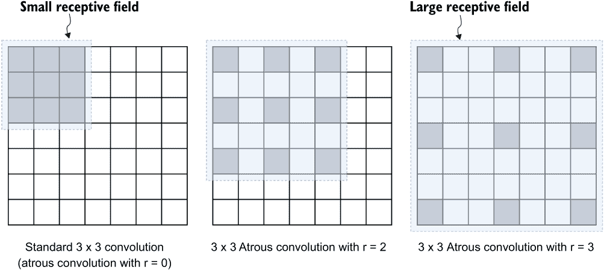

图 8.9 孔卷积与标准卷积的比较。标准卷积是孔卷积的特例，其中速率为 1。随着扩张率的增加，层的感受野也会增加。

图 8.9 显示了较大的扩张率导致更大的感受野。阴影灰色框的数量表示参数数量，而虚线，轻微阴影的框表示感受野的大小。正如你所见，参数数量保持不变，而感受野增加。从计算上讲，将标准卷积扩展到孔卷积非常简单。你所需要做的就是在孔卷积操作中插入零。

等等！孔卷积如何帮助分割模型？

正如我们讨论的那样，CNN 的金字塔结构提出的主要问题是输出逐渐变小。最简单的解决方案，不改变学习的参数，是减小层的步幅。尽管技术上会增加输出大小，但在概念上存在问题。

要理解这一点，假设 CNN 的第 i 层的步长为 2，并且获得了 h × w 大小的输入。然后，第 i+1 层获得了 h/2 × w/2 大小的输入。通过移除第 i 层的步长，它获得了 h × w 大小的输出。然而，第 i+1 层的核已经被训练成看到一个更小的输出，所以通过增加输入的大小，我们破坏了（或减少了）层的感受野。通过引入空洞卷积，我们补偿了该感受野的减小。

现在让我们看看 ResNet-50 如何被重新用于图像分割。首先，我们从`tf.keras.applications`模块下载它。ResNet-50 模型的架构如下所示。首先，它有一个步幅为 2 的卷积层和一个步幅为 2 的池化层。之后，它有一系列卷积块，最后是一个平均池化层和完全连接的输出层。这些卷积块具有卷积层的分层组织。每个卷积块由几个子块组成，每个子块由三个卷积层组成（即 1 × 1 卷积、3 × 3 卷积和 1 × 1 卷积），以及批量归一化。

### 使用 Keras 函数 API 实现 DeepLab v3

从输入开始直到`conv4`块的网络保持不变。根据原始 ResNet 论文的符号，这些块被标识为`conv2`、`conv3`和`conv4`块组。我们的第一个任务是创建一个包含输入层到原始 ResNet-50 模型的`conv4`块的模型。之后，我们将专注于根据 DeepLab v3 论文重新创建最终卷积块（即`conv5`）：

```py
# Pretrained model and the input
inp = layers.Input(shape=target_size+(3,))
resnet50 = tf.keras.applications.ResNet50(
    include_top=False, input_tensor=inp,pooling=None
)

for layer *in* resnet50.layers:
    if layer.name == "conv5_block1_1_conv":
        break
    out = layer.output

resnet50_upto_conv4 = models.Model(resnet50.input, out)
```

如图所示，我们找到了 ResNet-50 模型中位于“conv5_block1_1_conv”之前的最后一层，这将是`conv4`块组的最后一层。有了这个，我们可以定义一个临时模型，该模型包含从输入到`conv4`块组的最终输出的层。后来，我们将专注于通过引入论文中的修改和新组件来增强这个模型。我们将使用扩张卷积重新定义`conv5`块。为此，我们需要了解 ResNet 块的构成（图 8.10）。我们可以假设它有三个不同的级别。

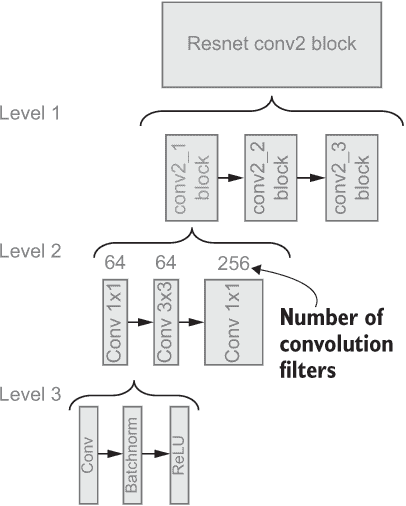

图 8.10 ResNet-50 中卷积块的解剖。对于这个示例，我们展示了 ResNet-50 的第一个卷积块。卷积块组的组织包括三个不同的级别。

现在让我们实现一个函数来表示使用扩张卷积时的每个级别。为了将标准卷积层转换为扩张卷积，我们只需将所需的速率传递给`tf.keras.layers.Conv2D`层的`dilation_rate`参数即可。首先，我们将实现一个表示级别 3 块的函数，如下清单所示。

清单 8.8 ResNet-50 中的级别 3 卷积块

```py
def block_level3(
    inp, filters, kernel_size, rate, block_id, convlayer_id, activation=True           ❶
):
    """ A single convolution layer with atrous convolution and batch normalization 
    inp: 4-D tensor having shape [batch_size, height, width, channels]
    filters: number of output filters
    kernel_size: The size of the convolution kernel
    rate: dilation rate for atrous convolution
    block_id, convlayer_id - IDs to distinguish different convolution blocks and layers
    activation: If true ReLU is applied, if False no activation is applied
    """

    conv5_block_conv_out = layers.Conv2D(
        filters, kernel_size, dilation_rate=rate, padding='same',                      ❷
        name='conv5_block{}_{}_conv'.format(block_id, convlayer_id)
    )(inp)

    conv5_block_bn_out = layers.BatchNormalization(
        name='conv5_block{}_{}_bn'.format(block_id, convlayer_id)                      ❸
    )(conv5_block_conv_out)

    if activation:
        conv5_block_relu_out = layers.Activation(
            'relu', name='conv5_block{}_{}_relu'.format(block_id, convlayer_id)        ❹
        )(conv5_block_bn_out)

        return conv5_block_relu_out
    else:
        return conv5_block_bn_out                                                      ❺
```

❶ 在这里，inp 接受具有形状 [批量大小，高度，宽度，通道] 的 4D 输入。

❷ 对输入执行二维卷积，使用给定数量的滤波器、内核大小和扩张率。

❸ 对卷积层的输出执行批量归一化。

❹ 如果激活设置为 True，则应用 ReLU 激活。

❺ 如果激活设置为 False，则返回输出而不进行激活。

级别 3 块具有一个单独的卷积层，具有所需的扩张率和批量归一化层，随后是非线性 ReLU 激活层。接下来，我们将为级别 2 块编写一个函数（见下一个清单）。

清单 8.9 在 ResNet-50 中的 2 级卷积块

```py
def block_level2(inp, rate, block_id):
    """ A level 2 resnet block that consists of three level 3 blocks """

    block_1_out = block_level3(inp, 512, (1,1), rate, block_id, 1)
    block_2_out = block_level3(block_1_out, 512, (3,3), rate, block_id, 2)
    block_3_out = block_level3(
        block_2_out, 2048, (1,1), rate, block_id, 3, activation=False
    )

    return block_3_out
```

一个 2 级块由具有给定扩张率的三个级别 3 块组成，这些块具有以下规格的卷积层：

+   1 × 1 卷积层，具有 512 个滤波器和所需的扩张率

+   3 × 3 卷积层，具有 512 个滤波器和所需的扩张率

+   1 × 1 卷积层，具有 2048 个滤波器和所需的扩张率

除了使用空洞卷积外，这与 ResNet-50 模型中原始 conv5 块的 2 级块完全相同。所有构建块准备就绪后，我们可以使用空洞卷积实现完整的 conv5 块（见下一个清单）。

清单 8.10 实现最终的 ResNet-50 卷积块组（级别 1）

```py
def resnet_block(inp, rate):
    """ Redefining a resnet block with atrous convolution """

    block0_out = block_level3(
        inp, 2048, (1,1), 1, block_id=1, convlayer_id=0, activation=False ❶
    )
    block1_out = block_level2(inp, 2, block_id=1)                         ❷
    block1_add = layers.Add(
        name='conv5_block{}_add'.format(1))([block0_out, block1_out]      ❸
    )
    block1_relu = layers.Activation(
        'relu', name='conv5_block{}_relu'.format(1)                       ❹
    )(block1_add)
    block2_out = block_level2 (block1_relu, 2, block_id=2) # no relu      ❺
    block2_add = layers.Add(
        name='conv5_block{}_add'.format(2)                                ❻
    )([block1_add, block2_out])
    block2_relu = layers.Activation(
        'relu', name='conv5_block{}_relu'.format(2)                       ❼
    )(block2_add)

    block3_out = block_level2 (block2_relu, 2, block_id=3)                ❽
    block3_add = layers.Add(
        name='conv5_block{}_add'.format(3)                                ❽
    )([block2_add, block3_out])
    block3_relu = layers.Activation(
        'relu', name='conv5_block{}_relu'.format(3)                       ❽
    )(block3_add)

     return block3_relu
```

❶ 创建一个级别 3 块（block0），为第一个块创建残差连接。

❷ 定义第一个具有扩张率为 2 的 2 级块（block1）。

❸ 从 block0 到 block1 创建一个残差连接。

❹ 对结果应用 ReLU 激活。

❺ 具有扩张率为 2 的第二级 2 块（block2）

❻ 从 block1 到 block2 创建一个残差连接。

❼ 应用 ReLU 激活。

❽ 对 block1 和 block2 应用类似的过程以创建 block3。

这里没有黑魔法。函数 resnet_block 将我们已经讨论的函数的输出放置在一起以组装最终的卷积块。特别地，它具有三个级别 2 块，其残差连接从前一个块到下一个块。最后，我们可以通过使用我们定义的中间模型的输出（resnet50_ upto_conv4）作为输入并使用扩张率为 2 调用 resnet_block 函数来获得 conv5 块的最终输出：

```py
resnet_block4_out = resnet_block(resnet50_upto_conv4.output, 2)
```

### 8.3.4 实现空洞空间金字塔池化模块

在这里，我们将讨论 DeepLab v3 模型最令人兴奋的创新。空洞空间金字塔池化（ASPP）模块有两个目的：

+   聚合通过使用不同扩张率产生的输出获得的图像的多尺度信息

+   结合通过全局平均池化获得的高度摘要的信息

ASPP 模块通过在最后一个 ResNet-50 输出上执行不同的卷积来收集多尺度信息。具体来说，ASPP 模块执行 1 × 1 卷积、3 × 3 卷积（r = 6）、3 × 3 卷积（r = 12）和 3 × 3 卷积（r = 18），其中 r 是 dilation 率。所有这些卷积都有 256 个输出通道，并实现为级别 3 的块（由函数 block_level3() 提供）。

ASRP 通过执行全局平均池化来捕获高级信息，然后进行 1 × 1 卷积，输出通道为 256，以匹配多尺度输出的输出大小，最后是一个双线性上采样层，用于上采样全局平均池化所缩小的高度和宽度维度。记住，双线性插值通过计算相邻像素的平均值来上采样图像。图 8.11 说明了 ASPP 模块。

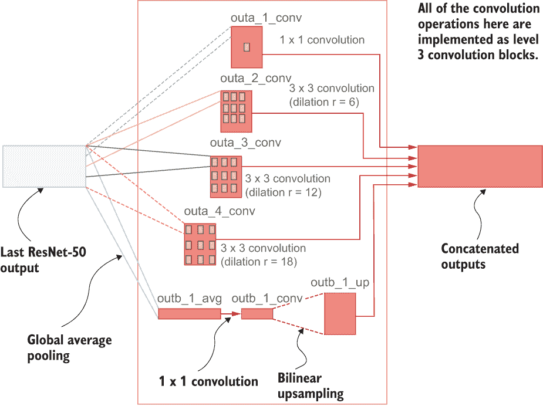

图 8.11 DeepLab v3 模型中使用的 ASPP 模块

ASPP 模块的任务可以概括为一个简明的函数。我们从之前完成的工作中已经拥有了实现此函数所需的所有工具（请参阅下面的清单）。

清单 8.11 实现 ASPP

```py
def atrous_spatial_pyramid_pooling(inp):
    """ Defining the ASPP (Atrous spatial pyramid pooling) module """

    # Part A: 1x1 and atrous convolutions
    outa_1_conv = block_level3(
        inp, 256, (1,1), 1, '_aspp_a', 1, activation='relu'
    )                                                                                 ❶
    outa_2_conv = block_level3(
        inp, 256, (3,3), 6, '_aspp_a', 2, activation='relu'
    )                                                                                 ❷
    outa_3_conv = block_level3(
        inp, 256, (3,3), 12, '_aspp_a', 3, activation='relu'
    )                                                                                 ❸
    outa_4_conv = block_level3(
        inp, 256, (3,3), 18, '_aspp_a', 4, activation='relu'
    )                                                                                 ❹

    # Part B: global pooling
    outb_1_avg = layers.Lambda(
        lambda x: K.mean(x, axis=[1,2], keepdims=True)
    )(inp)                                                                            ❺
    outb_1_conv = block_level3(
        outb_1_avg, 256, (1,1), 1, '_aspp_b', 1, activation='relu'                    ❻
    )
    outb_1_up = layers.UpSampling2D((24,24), interpolation='bilinear')(outb_1_avg)    ❼
    out_aspp = layers.Concatenate()(
        [outa_1_conv, outa_2_conv, outa_3_conv, outa_4_conv, outb_1_up]               ❽
    )   

    return out_aspp

out_aspp = atrous_spatial_pyramid_pooling(resnet_block4_out)                          ❾
```

❶ 定义一个 1 × 1 卷积。

❷ 定义一个带有 256 个滤波器和 dilation 率为 6 的 3 × 3 卷积。

❸ 定义一个带有 256 个滤波器和 dilation 率为 12 的 3 × 3 卷积。

❹ 定义一个带有 256 个滤波器和 dilation 率为 18 的 3 × 3 卷积。

❺ 定义一个全局平均池化层。

❻ 定义一个带有 256 个滤波器的 1 × 1 卷积。

❼ 使用双线性插值上采样输出。

❽ 连接所有的输出。

❾ 创建一个 ASPP 的实例。

ASPP 模块由四个级别 3 的块组成，如代码所示。第一个块包括一个 1 × 1 卷积，带有 256 个无 dilation 的滤波器（这产生了 outa_1_conv）。后三个块包括 3 × 3 卷积，带有 256 个滤波器，但具有不同的 dilation 率（即 6、12、18；它们分别产生 outa_2_conv、outa_3_conv 和 outa_4_conv）。这涵盖了从图像中聚合多个尺度的特征。然而，我们还需要保留关于图像的全局信息，类似于全局平均池化层（outb_1_avg）。这通过一个 lambda 层实现，该层将输入在高度和宽度维度上进行平均：

```py
outb_1_avg = layers.Lambda(lambda x: K.mean(x, axis=[1,2], keepdims=True))(inp)
```

平均值的输出接着是一个带有 256 个滤波器的 1 × 1 卷积滤波器。然后，为了将输出大小与以前的输出相同，使用双线性插值的上采样层（这产生 outb_1_up）：

```py
outb_1_up = layers.UpSampling2D((24,24), interpolation='bilinear')(outb_1_avg)
```

最后，所有这些输出都通过 Concatenate 层连接到单个输出中，以产生最终输出 out_aspp。

### 8.3.5 将所有内容放在一起

现在是时候整合所有不同的组件，创建一个宏伟的分割模型了。接下来的清单概述了构建最终模型所需的步骤。

清单 8.12 最终的 DeepLab v3 模型

```py
inp = layers.Input(shape=target_size+(3,))                               ❶

resnet50= tf.keras.applications.ResNet50(
    include_top=False, input_tensor=inp,pooling=None                     ❷
)

for layer *in* resnet50.layers:
    if layer.name == "conv5_block1_1_conv":
        break
    out = layer.output                                                   ❸

resnet50_upto_conv4 = models.Model(resnet50.input, out)                  ❹

resnet_block4_out = resnet_block(resnet50_upto_conv4.output, 2)          ❺

out_aspp = atrous_spatial_pyramid_pooling(resnet_block4_out)             ❻

out = layers.Conv2D(21, (1,1), padding='same')(out_aspp)                 ❼
final_out = layers.UpSampling2D((16,16), interpolation='bilinear')(out)  ❼

deeplabv3 = models.Model(resnet50_upto_conv4.input, final_out)           ❽
```

❶ 定义 RGB 输入层。

❷ 下载并定义 ResNet50。

❸ 获取我们感兴趣的最后一层的输出。

❹ 从输入定义一个中间模型，到 conv4 块的最后一层。

❺ 定义删除的 conv5 ResNet 块。

❻ 定义 ASPP 模块。

❼ 定义最终输出。

❽ 定义最终模型。

注意观察模型中的线性层，它没有任何激活函数（例如 sigmoid 或 softmax）。这是因为我们计划使用一种特殊的损失函数，该函数使用 logits（在应用 softmax 之前从最后一层获得的未归一化分数）而不是归一化的概率分数。因此，我们将保持最后一层为线性输出，没有激活函数。

我们还需要执行最后一步操作：将原始 conv5 块的权重复制到我们的模型中新创建的 conv5 块。为此，首先需要将原始模型的权重存储如下：

```py
w_dict = {}
for l *in* ["conv5_block1_0_conv", "conv5_block1_0_bn", 
          "conv5_block1_1_conv", "conv5_block1_1_bn", 
          "conv5_block1_2_conv", "conv5_block1_2_bn", 
          "conv5_block1_3_conv", "conv5_block1_3_bn"]:
    w_dict[l] = resnet50.get_layer(l).get_weights()
```

在编译模型之前，我们无法将权重复制到新模型中，因为在编译模型之前权重不会被初始化。在这之前，我们需要学习在分割任务中使用的损失函数和评估指标。为此，我们需要实现自定义损失函数和指标，并使用它们编译模型。这将在下一节中讨论。

练习 3

您想要创建一个新的金字塔聚合模块称为 aug-ASPP。这个想法与我们之前实现的 ASPP 模块类似，但有一些区别。假设您已经从模型中获得了两个中间输出：out_1 和 out_2（大小相同）。您必须编写一个函数，aug_aspp，它将获取这两个输出并执行以下操作：

+   对 out_1 进行 atrous 卷积，r=16，128 个过滤器，3×3 卷积，步幅为 1，并应用 ReLU 激活函数（输出将被称为 atrous_out_1）

+   对 out_1 和 out_2 进行 atrous 卷积，r=8，128 个过滤器，3×3 卷积，步幅为 1，并对两者应用 ReLU 激活函数（输出将被称为 atrous_out_2_1 和 atrous_out_2_2）

+   拼接 atrous_out_2_1 和 atrous_out_2_2（输出将被称为 atrous_out_2）

+   对 atrous_out_1 和 atrous_out_2 进行 1×1 卷积，使用 64 个过滤器并进行拼接（输出将被称为 conv_out）

+   使用双线性上采样将 conv_out 的大小加倍（在高度和宽度尺寸上），并应用 sigmoid 激活函数

## 8.4 编译模型：图像分割中的损失函数和评估指标

为了完成 DeepLab v3 模型的最终构建（主要采用 ResNet-50 结构和 ASPP 模块），我们必须定义适当的损失函数和度量来衡量模型的性能。图像分割与图像分类任务有很大的不同，因此损失函数和度量不一定适用于分割问题。一个关键的区别是，在分割数据中通常存在较大的类别不平衡，因为与其他与对象相关的像素相比，“背景”类通常占据了图像的主导地位。为了开始，您阅读了几篇博客文章和研究论文，并将加权分类交叉熵损失和 Dice 损失视为很好的候选项。您专注于三个不同的度量：像素精度，平均（类别加权）精度和平均 IoU。

图像分割模型中使用的损失函数和评估指标与图像分类器中使用的不同。首先，图像分类器接受单个图像的单个类标签，而分割模型预测图像中每个单个像素的类别。这凸显了不仅需要重新构想现有的损失函数和评估指标，而且需要发明适用于分割模型产生的输出的新的损失和评估指标。我们首先讨论损失函数，然后是指标。

### 8.4.1 损失函数

*损失函数*是用于优化其目的是找到最小化定义的损失的参数的模型的。深度网络中使用的损失函数必须是可微分的，因为损失的最小化是通过梯度进行的。我们将使用的损失函数包含两个损失函数：

+   交叉熵损失

+   Dice 损失

交叉熵损失

交叉熵损失是分割任务中最常用的损失之一，可以在 Keras 中仅用一行代码实现。我们已经使用了交叉熵损失很多次，但没有详细分析它。然而，回顾支配交叉熵损失的基础机制是值得的。

对于交叉熵损失函数，需要输入预测目标和真实目标。这两个张量都具有[batch size, height, width, object classes]的形状。对象类维度是给定像素属于哪个对象类别的一种独热编码表示。然后，对每个像素独立地计算交叉熵损失。

8_11a

其中*CE*（*i, j*）表示图像位置（*i, j*）处像素的交叉熵损失，*c*是类别数，*y*[k]和*ŷ*[k]分别表示该像素的独热编码向量中元素和预测概率分布的元素。然后在所有像素上求和以获得最终损失。

在这种方法的简单背后，隐藏着一个关键问题。在图像分割问题中，类别不平衡几乎肯定会出现。你几乎找不到每个对象在图像中占据相等面积的真实世界图像。好消息是，处理这个问题并不是很困难。这可以通过为图像中的每个像素分配一个权重来缓解，这个权重取决于它所代表的类别的显 dominance。属于大对象的像素将具有较小的权重，而属于较小对象的像素将具有较大的权重，尽管在最终损失中大小相等。接下来的列表显示了如何在 TensorFlow 中执行此操作。

列表 8.13 计算给定数据批次的标签权重

```py
def get_label_weights(y_true, y_pred):

    weights = tf.reduce_sum(tf.one_hot(y_true, num_classes), axis=[1,2])  ❶

    tot = tf.reduce_sum(weights, axis=-1, keepdims=True)                  ❷

    weights = (tot - weights) / tot  # [b, classes]                       ❸

    y_true = tf.reshape(y_true, [-1, y_pred.shape[1]*y_pred.shape[2]])    ❹

    y_weights = tf.gather(params=weights, indices=y_true, batch_dims=1)   ❺
    y_weights = tf.reshape(y_weights, [-1])                               ❻

    return y_weights
```

❶ 获取 y_true 中每个类别的总像素数。

❷ 获取 y_true 中的总像素数。

❸ 计算每个类别的权重。更稀有的类别获得更多的权重。

❹ 将 y_true 重塑为 [batch size, height*width] 大小的张量。

❺ 通过收集与 y_true 中索引对应的权重来创建权重向量。

❻ 使 y_weights 成为一个向量。

在这里，对于给定的批次，我们将权重计算为一个序列/向量，其元素数量等于 y_true。首先，我们通过计算 one-hot 编码的 y_true（即具有批次、高度、宽度和类别维度的尺寸）的宽度和高度上的总和来获取每个类别的像素总数。在这里，值大于 num_classes 的类将被忽略。接下来，我们通过对类维度求和来计算每个样本的像素总数，得到 *tot*（一个 [batch size, 1] 大小的张量）。现在可以计算每个样本和每个类别的权重。

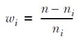

其中 *n* 是像素的总数，*n*^i 是属于第 *i* 个类的像素的总数。之后，我们将 y_true 重塑为形状 [batch size, -1]，为权重计算的重要步骤做准备。作为最终输出，我们希望从 y_weights 中创建一个张量，其中我们从 y_true 中提取对应于 y_weights 中元素的元素。换句话说，我们从 y_weights 中获取值，其中给定索引由 y_true 中的值给出。最后，结果将与 y_true 的形状和大小相同。这就是我们需要加权样本的全部内容：对每个像素的损失值逐元素乘以权重。为了实现这一点，我们将使用函数 tf.gather()，该函数从给定的张量（params）中收集元素，同时获取表示索引的张量（indices），并返回与索引相同形状的张量：

```py
y_weights = tf.gather(params=weights, indices=y_true, batch_dims=1)
```

在这里，在执行 gather 时忽略批次维度，我们传递了参数 batch_dims，指示我们有多少批次维度。有了这个，我们将定义一个函数，给出一批预测和真实目标，输出加权交叉熵损失。

现在权重准备好了，我们可以实现第一个分割损失函数。我们将实现加权交叉熵损失。一眼看去，该函数会屏蔽不相关的像素（例如属于未知对象的像素），并展开预测标签和真实标签以消除高度和宽度维度。最后，我们可以使用 TensorFlow 中的内置函数计算交叉熵损失（请参见下一个清单）。

清单 8.14 实现加权交叉熵损失

```py
def ce_weighted_from_logits(num_classes):

    def loss_fn(y_true, y_pred):
        """ Defining cross entropy weighted loss """

        valid_mask = tf.cast(
            tf.reshape((y_true <= num_classes - 1), [-1,1]), 'int32'
        )                                                                ❶

        y_true = tf.cast(y_true, 'int32')                                ❷
        y_true.set_shape([None, y_pred.shape[1], y_pred.shape[2]])       ❷

        y_weights = get_label_weights(y_true, y_pred)                    ❸
        y_pred_unwrap = tf.reshape(y_pred, [-1, num_classes])            ❹
        y_true_unwrap = tf.reshape(y_true, [-1])                         ❹

        return tf.reduce_mean(
            y_weights * tf.nn.sparse_softmax_cross_entropy_with_logits(  ❺
                y_true_unwrap * tf.squeeze(valid_mask), 
                y_pred_unwrap * tf.cast(valid_mask, 'float32')) 
        )

    return loss_fn                                                       ❻
```

❶ 定义有效掩码，用于屏蔽不必要的像素。

❷ 对 y_true 进行了一些初步设置，将其转换为 int 并设置形状。

❸ 获取标签权重。

❹ 展开 y_pred 和 y_true，以消除批处理、高度和宽度维度。

❺ 使用 y_true、y_pred 和掩码计算交叉熵损失。

❻ 返回计算损失的函数。

你可能会想，“为什么将损失定义为嵌套函数？”如果我们需要向损失函数中包含额外的参数（例如 num_classes），则必须遵循此标准模式。我们正在将损失函数的计算捕获在 loss_fn 函数中，然后创建一个外部函数 ce_weighted_from_logits()，该函数将返回封装损失计算（即 loss_fn）的函数。

具体地，创建有效掩码以指示 y_true 中的标签是否小于类数。任何值大于类数的标签都会被忽略（例如未知对象）。接下来，我们获取权重向量，并使用 get_label_weights() 函数为每个像素指定权重。我们将 y_pred 展开成 [-1, num_classes] 大小的张量，因为 y_pred 包含数据集中所有类别的 logits（即模型输出的未归一化概率分数）。y_true 将展开为一个向量（也就是单维），因为 y_true 只包含类别标签。最后，我们使用 tf.nn.sparse_softmax_cross_entropy_with_logits() 来计算掩码预测和真实目标的损失。该函数有两个参数，标签和 logits，很容易理解。我们可以得出两个重要的观察结果：

+   我们正在计算稀疏交叉熵损失（而不是标准交叉熵损失）。

+   我们从 logits 中计算交叉熵损失。

当使用稀疏交叉熵时，我们不需要对标签进行独热编码，因此可以跳过此步骤，这会导致数据管道更具内存效率。这是因为独热编码在模型内部处理。通过使用稀疏损失，我们需要担心的东西就更少了。

从 logits（即未归一化分数）而不是从归一化概率计算损失会导致更好、更稳定的渐变。因此，尽可能地使用 logits 而不是归一化概率。

Dice 损失

我们将讨论的第二种损失函数称为 Dice 损失，其计算方式如下：

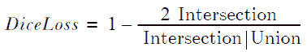

在这里，可以通过逐元素乘法计算预测和目标张量之间的交集，而可以通过逐元素加法计算预测和目标张量之间的并集。你可能会觉得使用逐元素操作来计算交集和并集是一种奇怪的方式。为了理解背后的原因，我想引用之前提到过的一句话：深度网络中使用的损失函数必须是*可微分的*。

这意味着我们不能使用我们通常用来计算交集和并集的标准方法。相反，我们需要采用可微分计算的方法，得到两个张量之间的交集和并集。交集可以通过预测值和真实目标之间的逐元素乘法来计算。并集可以通过预测值和真实目标之间的逐元素加法来计算。图 8.12 阐明了这些操作如何导致两个张量之间的交集和并集。

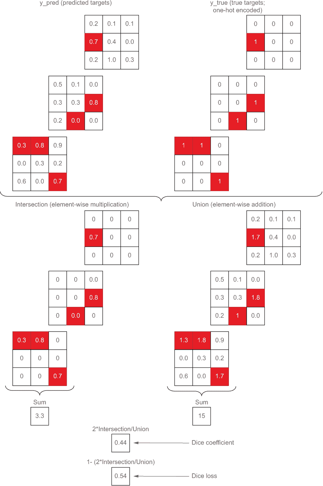

图 8.12 显示了 dice 损失中涉及的计算。交集可以通过逐元素乘法计算为一个可微分函数，而并集可以通过逐元素求和计算。

这个损失函数主要关注最大化预测值和真实目标之间的交集。乘数 2 的使用是为了平衡来自交集和并集之间重叠的值的重复，其出现在分母中（参见下面的列表）。

列表 8.15 实现 dice 损失

```py
def dice_loss_from_logits(num_classes):
    """ Defining the dice loss 1 - [(2* i + 1)/(u + i)]"""    

    def loss_fn(y_true, y_pred):

        smooth = 1.

        # Convert y_true to int and set shape
        y_true = tf.cast(y_true, 'int32')                                      ❶
        y_true.set_shape([None, y_pred.shape[1], y_pred.shape[2]])             ❶

        # Get pixel weights
        y_weights = tf.reshape(get_label_weights(y_true, y_pred), [-1, 1])     ❷

        # Apply softmax to logits      
        y_pred = tf.nn.softmax(y_pred)                                         ❸

        y_true_unwrap = tf.reshape(y_true, [-1])                               ❹
        y_true_unwrap = tf.cast(
            tf.one_hot(tf.cast(y_true_unwrap, 'int32'), num_classes), 
➥ 'float32'
        )                                                                      ❹
        y_pred_unwrap = tf.reshape(y_pred, [-1, num_classes])                  ❹

        intersection = tf.reduce_sum(y_true_unwrap * y_pred_unwrap * y_weights)❺

        union = tf.reduce_sum((y_true_unwrap + y_pred_unwrap) * y_weights)     ❻

        score = (2\. * intersection + smooth) / ( union + smooth)               ❼

        loss = 1 - score                                                       ❽

        return loss

    return loss_fn
```

❶ y_true 的初始设置

❷ 获取标签权重并将其重塑为 [-1, 1] 的形状。

❸ 对 y_pred 应用 softmax 函数以得到归一化概率。

❹ 将 y_pred 和 one-hot 编码的 y_true 展开为 [-1, num_classes] 的形状。

❺ 使用逐元素乘法计算交集。

❻ 使用逐元素加法计算并集。

❼ 计算 dice 系数。

❽ 计算 dice 损失。

在这里，smooth 是一个平滑参数，我们将用它来避免可能导致除以零而产生 NaN 值的情况。然后我们进行以下操作：

+   获取每个 y_true 标签的权重

+   对 y_pred 应用 softmax 激活函数

+   将 y_pred 展开为 [-1, num_classes] 的张量，将 y_true 展开为大小为 [-1] 的向量

然后计算 y_pred 和 y_true 的交集和并集。具体来说，交集是通过 y_pred 和 y_true 的逐元素乘法计算出来的，而并集是通过 y_pred 和 y_true 的逐元素加法计算出来的。

焦点损失

*焦点损失*是一种相对较新的损失，它在论文“用于密集目标预测的焦点损失”中介绍（[`arxiv.org/pdf/1708.02002.pdf`](https://arxiv.org/pdf/1708.02002.pdf)）。焦点损失是为了应对分割任务中发现的严重类别不平衡而引入的。具体地，它解决了许多简单示例（例如，来自具有较小损失的常见类的样本）过多的问题，而不是强大的少数困难示例（例如，来自具有较大损失的稀有类的样本）。焦点损失通过引入调制因子来解决这个问题，该调制因子将减小简单示例的权重，因此，损失函数自然更多地关注学习困难示例。

我们将用于优化分割模型的损失函数将是由稀疏交叉熵损失和 Dice 损失相加而得到的损失（见下一列表）。

列表 8.16 最终组合损失函数

```py
def ce_dice_loss_from_logits(num_classes):

    def loss_fn(y_true, y_pred):
        # Sum of cross entropy and dice losses
        loss = ce_weighted_from_logits(num_classes)(
            tf.cast(y_true, 'int32'), y_pred
        ) + dice_loss_from_logits(num_classes)(
            y_true, y_pred
        )    

        return loss

    return loss_fn 
```

接下来，我们将讨论评估指标。

### 8.4.2 评估指标

评估指标在模型训练中扮演着重要角色，作为模型的健康检查。这意味着可以通过确保评估指标的行为合理快速识别性能低下或问题。在这里，我们将讨论三种不同的指标：

+   像素

+   平均准确率

+   均交并比

我们将通过利用 TensorFlow 中的一些现有指标来实现这些自定义指标，在这些指标中，你必须从 tf.keras.metrics.Metric 类或其中一个现有指标的基类派生子类。这意味着你需要创建一个新的 Python 类，它继承自其中一个现有具体指标类的基类 tf.keras.metrics.Metric：

```py
class MyMetric(tf.keras.metrics.Metric):

  def __init__(self, name='binary_true_positives', **kwargs):
    super(MyMetric, self).__init__(name=name, **kwargs)

    # Create state related variables

  def update_state(self, y_true, y_pred, sample_weight=None):

    # update state in this function

  def result(self):

    # We return the result computed from the state

  def reset_states():
    # Do what’s required to reset the maintained states
    # This function is called between epochs     
```

关于指标，你需要了解的第一件事是它是一个有状态的对象，这意味着它维护着一个状态。例如，一个单独的周期有多个迭代，假设你对计算准确率感兴趣。指标需要累积计算准确率所需的值，以便在结束时，它可以计算该周期的平均准确率。在定义指标时，你需要注意三个函数：__init__、update_state 和 result，以及 reset_states。

让我们具体点，假设我们正在实现一个准确率指标（即 y_pred 中匹配 y_true 元素的百分比）。它需要维护一个总数：我们传递的所有准确率值的总和和计数（我们传递的准确率值的数量）。有了这两个状态元素，我们可以随时计算平均准确率。当实现准确率指标时，你需要实现这些函数：

+   __init__—定义了两个状态；总数和计数

+   update_state—基于 y_true 和 y_pred 更新总数和计数

+   result—计算平均准确率为总数/计数

+   reset_states—重置总数和计数（这需要在周期开始时发生）

让我们看看这些知识如何转化为我们感兴趣的评估指标。

像素和平均准确率

像素准确度是你可以想到的最简单的指标。它衡量了预测和真实目标之间的像素精度（见下一个清单）。

清单 8.17 实现像素准确度指标

```py
class PixelAccuracyMetric(tf.keras.metrics.Accuracy):

  def __init__(self, num_classes, name='pixel_accuracy', **kwargs):
    super(PixelAccuracyMetric, self).__init__(name=name, **kwargs)    

  def update_state(self, y_true, y_pred, sample_weight=None):

    y_true.set_shape([None, y_pred.shape[1], y_pred.shape[2]])      ❶
    y_true = tf.reshape(y_true, [-1])                               ❷

    y_pred = tf.reshape(tf.argmax(y_pred, axis=-1),[-1])            ❸

    valid_mask = tf.reshape((y_true <= num_classes - 1), [-1])      ❹

    y_true = tf.boolean_mask(y_true, valid_mask)                    ❺
    y_pred = tf.boolean_mask(y_pred, valid_mask)                    ❺

    super(PixelAccuracyMetric, self).update_state(y_true, y_pred)   ❻
```

❶ 设置 y_true 的形状（以防未定义）。

❷ 将 y_true 重新调整为向量。

❸ 将 y_pred 取 argmax 后重新调整形状为向量。

❹ 定义一个有效的掩码（屏蔽不必要的像素）。

❺ 收集满足 valid_mask 条件的像素/标签。

❻ 使用处理过的 y_true 和 y_pred，使用 update_state()函数计算准确度。

像素准确度计算预测像素和真实像素之间的一一匹配。为了计算这个指标，我们从 tf.keras.metrics.Accuracy 进行子类化，因为它具有我们需要的所有计算。为此，我们重写 update_state 函数如下所示。我们需要注意以下几点：

+   我们需要作为预防措施设置 y_true 的形状。这是因为在处理 tf.data.Dataset 时，有时会丢失形状。

+   将 y_true 重新调整为向量。

+   通过执行 tf.argmax()获取 y_pred 的类别标签，并将其重新调整为向量。

+   定义一个有效的掩码，忽略不需要的类别（例如，未知对象）。

+   获取仅满足 valid_mask 过滤器的像素。

一旦完成这些任务，我们只需调用父对象（即，tf.keras.metrics.Accuracy）的 update_state 方法，并传递相应的参数。我们不需要重写 result()和 reset_states()函数，因为它们已经包含了正确的计算。

我们说图像分割问题中普遍存在类别不平衡。通常，背景像素将在图像的大区域中散布，可能导致错误的结论。因此，稍微更好的方法可能是分别计算每个类别的准确度，然后取平均值。这就是平均准确度的作用，它防止了像素准确度的不良特性（见下一个清单）。

清单 8.18 实现平均准确度指标

```py
class MeanAccuracyMetric(tf.keras.metrics.Mean):

  def __init__(self, num_classes, name='mean_accuracy', **kwargs):
    super(MeanAccuracyMetric, self).__init__(name=name, **kwargs)    

  def update_state(self, y_true, y_pred, sample_weight=None):

    smooth = 1            

    y_true.set_shape([None, y_pred.shape[1], y_pred.shape[2]])             ❶

    y_true = tf.reshape(y_true, [-1])                                      ❶
    y_pred = tf.reshape(tf.argmax(y_pred, axis=-1),[-1])                   ❶

    valid_mask = tf.reshape((y_true <= num_classes - 1), [-1])             ❶

    y_true = tf.boolean_mask(y_true, valid_mask)                           ❶
    y_pred = tf.boolean_mask(y_pred, valid_mask)                           ❶

    conf_matrix = tf.cast(                                                            
        tf.math.confusion_matrix(y_true, y_pred, num_classes=num_classes), 
➥ 'float32'                                                               ❷
    )
    true_pos = tf.linalg.diag_part(conf_matrix)                            ❸

    mean_accuracy = tf.reduce_mean(
        (true_pos + smooth)/(tf.reduce_sum(conf_matrix, axis=1) + smooth)  ❹
    )

    super(MeanAccuracyMetric, self).update_state(mean_accuracy)            ❺
```

❶ 初始设置

❷ 使用 y_true 和 y_pred 计算混淆矩阵。

❸ 获取真正的正例（对角线上的元素）。

❹ 使用每个类别的真正正例和真正类别计数计算平均准确度。

❺ 使用 update_state()函数计算 mean_accuracy 的平均值。

MeanAccuracyMetric 将从 tf.keras.metrics.Mean 分支出来，它计算给定值序列的平均值。计划是在 update_state()函数中计算 mean_accuracy，然后将该值传递给父类的 update_state()函数，以便得到平均准确度的平均值。首先，我们执行我们之前讨论的 y_true 和 y_pred 的初始设置和清理。

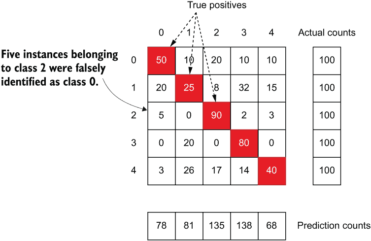

图 8.13 五类分类问题的混淆矩阵示意图。阴影区域表示真正的正例。

然后，从预测和真实目标计算混淆矩阵（图 8.13）。对于一种*n*种分类问题（即，具有*n*个可能类别的分类问题），混淆矩阵被定义为一个*n*×*n*矩阵。这里，位置（*i*，*j*）处的元素表示预测为属于第*i*个类别的实例实际上属于第*j*个类别。图 8.13 描绘了这种类型的混淆矩阵。我们可以通过提取对角线（即，所有 1 <= *i* <= *n*的矩阵中的(*i*，*i*)元素）来获取真阳性。现在我们可以通过两个步骤计算平均准确度：

1.  对于所有类别，对真阳性计数进行逐元素除法。这将产生一个向量，其元素表示每个类别的准确性。

1.  计算步骤 1 产生的向量平均值。

最后，我们将平均准确度传递给其父对象的 update_state()函数。

平均交并比

*平均交并比*(mean intersection over union)是用于分割任务的流行评估度量，与我们之前讨论的 Dice loss 密切相关，因为它们都使用交和并的概念来计算最终结果（见下一个列表）。

列表 8.19 实现平均交并比度量

```py
class MeanIoUMetric(tf.keras.metrics.MeanIoU):

  def __init__(self, num_classes, name='mean_iou', **kwargs):
    super(MeanIoUMetric, self).__init__(num_classes=num_classes, name=name, **kwargs)    

  def update_state(self, y_true, y_pred, sample_weight=None):

    y_true.set_shape([None, y_pred.shape[1], y_pred.shape[2]])
    y_true = tf.reshape(y_true, [-1])

    y_pred = tf.reshape(tf.argmax(y_pred, axis=-1),[-1])

    valid_mask = tf.reshape((y_true <= num_classes - 1), [-1])

    # Get pixels corresponding to valid mask
    y_true = tf.boolean_mask(y_true, valid_mask)
    y_pred = tf.boolean_mask(y_pred, valid_mask)

    super(MeanIoUMetric, self).update_state(y_true, y_pred)    ❶
```

❶ 在 y_true 和 y_pred 的初始设置之后，我们只需调用父对象的 update_state()函数即可。

平均交并比的计算已经在 tf.keras.metrics.MeanIoU 中找到。因此，我们将使用它作为我们的父类。我们所需做的就是为 y_true 和 y_pred 进行前述设置，然后调用父对象的 update_state()函数。平均交并比计算为

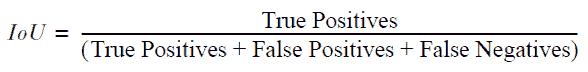

在该计算中使用的各种元素如图 8.14 所示。


图 8.14 混淆矩阵，以及如何用它来计算假阳性，假阴性和真阳性

我们现在理解了可用于我们的损失函数和评估指标，并已经实现了它们。我们可以将这些损失编译到模型中：

```py
deeplabv3.compile(
    loss=ce_dice_loss_from_logits(num_classes), 
    optimizer=optimizer, 
    metrics=[
        MeanIoUMetric(num_classes), 
        MeanAccuracyMetric(num_classes), 
        PixelAccuracyMetric(num_classes)
    ])
```

记住，我们从前面删除的卷积块中存储了权重。现在我们已经编译了模型，我们可以使用以下语法将权重复制到新模型中：

```py
# Setting weights for newly added layers
for k, w *in* w_dict.items():    
    deeplabv3.get_layer(k).set_weights(w)
```

我们现在开始使用数据管道和我们定义的模型来训练模型。

练习 4

您正在设计一个新的损失函数，用于计算 y_true 和 y_pred 之间的不相交并集。两个集合 A 和 B 之间的不相交并集是在 A 或 B 中但不在交集中的元素的集合。您知道可以通过 y_true 和 y_pred 的元素乘法计算交并通过 y_true 和 y_pred 的元素加法计算。编写函数的等式，以根据 y_true 和 y_pred 计算不相交并集。

## 8.5 训练模型

您已经进入产品第一次迭代的最后阶段。现在是时候充分利用您获得的数据和知识了（即，训练模型）。我们将训练模型进行 25 个周期，并监视像素精度、平均精度和平均 IoU 指标。在训练过程中，我们将衡量验证数据集的性能。

训练模型是最容易的部分，因为我们已经完成了导致训练的艰苦工作。现在只需要在我们刚刚定义的 DeepLab v3 上使用正确的参数调用 fit()，如下面的列表所示。

图 8.20 训练模型

```py
if *not* os.path.exists('eval'):
    os.mkdir('eval')

csv_logger = tf.keras.callbacks.CSVLogger(
    os.path.join('eval','1_pretrained_deeplabv3.log')                      ❶

monitor_metric = 'val_loss'
mode = 'min' if 'loss' *in* monitor_metric else 'max'                        ❷
print("Using metric={} and mode={} for EarlyStopping".format(monitor_metric, mode))
lr_callback = tf.keras.callbacks.ReduceLROnPlateau(
    monitor=monitor_metric, factor=0.1, patience=3, mode=mode, min_lr=1e-8 ❸
)
es_callback = tf.keras.callbacks.EarlyStopping(
    monitor=monitor_metric, patience=6, mode=mode                          ❹
)

# Train the model
deeplabv3.fit(                                                             ❺
    x=tr_image_ds, steps_per_epoch=n_train,
    validation_data=val_image_ds, validation_steps=n_valid, 
    epochs=epochs, callbacks=[lr_callback, csv_logger, es_callback])
```

❶ 训练记录器

❷ 自动根据指标名称设置后续回调函数的模式。

❸ 学习率调度器

❹ 提前停止回调

❺ 在使用验证集进行学习率调整和提前停止的同时训练模型。

首先，如果不存在，我们将定义一个名为 eval 的目录。训练日志将保存在这个目录中。接下来，我们定义三个不同的回调函数在训练过程中使用：

+   csv_logger—记录训练损失/指标和验证损失/指标

+   lr_callback—如果验证损失在三个周期内没有减少，则将学习率减小 10 倍

+   es_callback—如果验证损失在六个周期内没有减少，则执行提前停止

注意 在一台配备英特尔 Core i5 处理器和 NVIDIA GeForce RTX 2070 8GB 显卡的机器上，训练大约需要 45 分钟来运行 25 个周期。

有了这个，我们使用以下参数调用 deeplabv3.fit()：

+   x—生成训练实例的 tf.data 流水线（设置为 tr_image_ds）。

+   steps_per_epoch—每个周期的步数。这是通过计算训练实例的数量并将其除以批次大小获得的（设置为 n_train）。

+   validation_data—生成验证实例的 tf.data 流水线。这是通过计算验证实例的数量并将其除以批次大小来获得的（设置为 val_image_ds）。

+   epochs—周期数（设置为 epochs）。

+   callbacks—我们之前设置的回调函数（设置为 [lr_callback, csv_logger, es_callback]）。

在模型训练完成后，我们将在测试集上进行评估。我们还将可视化模型生成的分割结果。

练习 5

您有一个包含 10,000 个样本的数据集，并将其分成 90% 的训练数据和 10% 的验证数据。您使用的训练批次大小为 10，验证批次大小为 20。单个周期中将有多少个训练和验证步骤？

## 8.6 评估模型

让我们花点时间回顾一下我们到目前为止所做的事情。我们定义了一个数据管道来读取图像并将它们准备为模型的输入和目标。然后我们定义了一个称为 DeepLab v3 的模型，它使用预训练的 ResNet-50 作为其主干网络，并使用称为空洞空间金字塔池的特殊模块来预测最终的分割掩模。然后我们定义了任务特定的损失和指标，以确保我们可以使用各种指标评估模型。之后，我们对模型进行了训练。现在是最终揭晓的时候了。我们将在一个未见过的测试数据集上评估性能，看看模型的表现如何。我们还将可视化模型输出，并将其与真实目标进行比较，将它们并排绘制出来。

我们可以在未见过的测试图像上运行模型，并评估其性能。为此，我们执行以下操作：

```py
deeplabv3.evaluate(test_image_ds, steps=n_valid)
```

测试集的大小与验证集相同，因为我们将在 val.txt 中列出的图像分成两个相等的验证集和测试集。这将返回大约

+   62% 的平均 IoU

+   87% 的平均准确率

+   91% 的像素准确率

考虑到我们的情况，这些得分非常可观。我们的训练数据集包含不到 1500 张分割图像。使用这些数据，我们能够训练出一个在大小约为 725 的测试数据集上达到约 62% 平均 IoU 的模型。

什么是技术发展的最新成果？

Pascal VOC 2012 的最新性能报告显示约 90% 的平均 IoU ([`mng.bz/o2m2`](http://mng.bz/o2m2))。然而，这些模型比我们在这里使用的模型要大得多且复杂得多。此外，它们通常使用一个称为语义边界数据集（SBD）的辅助数据集进行训练（该数据集在论文 [`mng.bz/nNve`](http://mng.bz/nNve) 中介绍）。这将使训练数据点数量增加到 10000 多个（几乎是我们当前训练集大小的七倍）。

您可以通过直观检查模块生成的一些结果来进一步研究模型。毕竟，我们正在开发一种视觉模型。因此，我们不应仅仅依靠数字来做出决定和结论。在确定结论之前，我们还应该对结果进行视觉分析。

基于 U-Net 的网络的结果会是什么样的呢？

在为 DeepLab v3 模型提供类似条件的情况下，使用预训练的 ResNet-50 模型作为编码器构建的 U-Net 模型仅能达到约 32.5% 的平均 IoU、78.5% 的平均准确率和 81.5% 的像素准确率。实现细节在 ch08 文件夹的 Jupyter 笔记本中提供。

在一台搭载 Intel Core i5 处理器和 NVIDIA GeForce RTX 2070 8GB 显卡的机器上，训练 25 个周期大约需要 55 分钟。

U-Net 模型的详细解释见附录 B。

为了完成这个调查，我们将从测试集中随机选择一些样本，并要求模型对每个图像进行分割地图的预测。然后我们将将结果并排绘制在一起，以确保我们的模型工作得很好（图 8.15）。

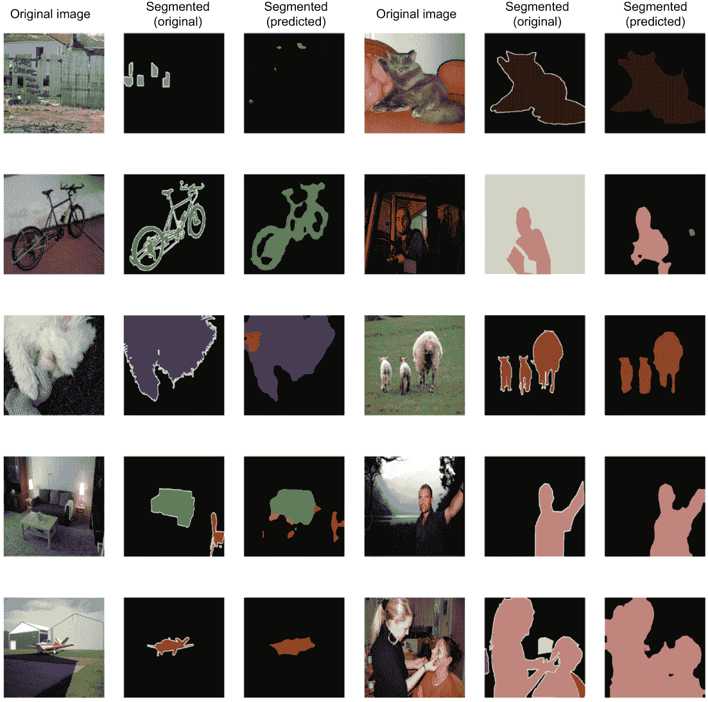

图 8.15 对比真实标注目标和模型预测结果。可以看出，该模型在将不同背景的物体分离方面表现很好。

我们可以看到，除非是一张非常困难的图像（例如左上角的图像，其中有一个被栅栏遮挡的汽车），我们的模型表现得非常好。它可以以高准确率识别我们分析的样本中几乎所有的图像。可在笔记本中找到显示图像的代码。

这就是我们关于图像分割的讨论。在接下来的几章中，我们将讨论几个自然语言处理问题。

练习 6

您被给予的是

+   一个模型（称为 model）

+   名为 batch_image 的图像批次（已预处理并准备好馈送给模型）

+   相应的目标批次，batch_targets（以独热编码格式表示的真实分割掩码）

编写一个名为 get_top_bad_examples(model, batch_images, batch_targets, n) 的函数，它将返回批次图像中损失最高（最难的）图像的前 n 个索引。对于给定的预测掩码和目标掩码，可以将元素逐个相乘的和作为给定图像的损失。

您可以使用 model.predict() 函数对 batch_images 进行预测，并返回与 batch_targets 相同大小的预测掩码。一旦计算出批次的损失（batch_loss），您可以使用 tf.math.top_k(batch_loss, n) 函数获取具有最高值的元素的索引。 tf.math .top_k() 返回一个元组，包含给定向量的前 n 个值和索引，按顺序排列。

## 总结

+   分割模型分为两大类别：语义分割和实例分割。

+   tf.data API 提供了多种功能来实现复杂的数据流水线，例如使用自定义的 NumPy 函数，使用 tf.data.Dataset.map() 执行快速转换以及使用 prefetch 和 cache 等 I/O 优化技术。

+   DeepLab v3 是一种常用的分割模型，它使用了预训练的 ResNet-50 模型作为骨干网络，并通过在卷积操作的权重之间插入孔（即零）来增加感受野。

+   DeepLab v3 模型使用称为空洞空间金字塔池化（atrous spatial pyramid pooling）的模块来在多个尺度上聚合信息，以生成精细分割的输出。

+   在分割任务中，交叉熵损失和 dice 损失是两种常用的损失函数，而像素准确率、平均准确率和平均 IoU 是常用的评估指标。

+   在 TensorFlow 中，损失函数可以实现为无状态函数。但是度量指标必须通过从 tf.keras.metrics.Metric 基类或适当的类中继承来实现为具有状态的对象。

+   DeepLab v3 模型在 Pascal VOC 2010 数据集上达到了 62%的平均 IoU 精度。

## 练习答案

**练习 1**

```py
palettized_image = np.zeros(shape=rgb_image.shape[:-1])
for i in range(rgb_image.shape[0]):
    for j in range(rgb_image.shape[1]):
        for k in range(palette.shape[0]):
            if (palette[k] == rgb_image[i,j]).all():
                palettized_image[i,j] = k
                break
```

**练习 2**

```py
dataset_a = tf.data.Dataset.from_tensor_slices(a)
dataset_b = tf.data.Dataset.from_tensor_slices(b)

image_ds = tf.data.Dataset.zip((dataset_a, dataset_b))

image_ds = image_ds.map(
            lambda x, y: (x, tf.image.resize(y, (64,64),  method='nearest'))
        )

image_ds = image_ds.map(
            lambda x, y: ((x-128.0)/255.0, tf.image.resize(y, (64,64),  method='nearest'))
        )

image_ds = image_ds.batch(32).repeat(5).prefetch(tf.data.experimental.AUTOTUNE)
```

**练习 3**

```py
import tensorflow.keras.layers as layers

def aug_aspp(out_1, out_2):

    atrous_out_1 = layers.Conv2D(128, (3,3), dilation_rate=16, 
➥ padding='same', activation='relu')(out_1)

    atrous_out_2_1 = layers.Conv2D(128, (3,3), dilation_rate=8, 
➥ padding='same', activation='relu')(out_1)
    atrous_out_2_2 = layers.Conv2D(128, (3,3), dilation_rate=8, 
➥ padding='same', activation='relu')(out_2)
    atrous_out_2 = layers.Concatenate()([atrous_out_2_1, atrous_out_2_2])

    tmp1 = layers.Conv2D(64, (1,1), padding='same', activation='relu')(atrous_out_1)
    tmp2 = layers.Conv2D(64, (1,1), padding='same', activation='relu')(atrous_out_2)
    conv_out = layers.Concatenate()([tmp1,tmp2])

    out = layers.UpSampling2D((2,2), interpolation='bilinear')(conv_out)
    out = layers.Activation('sigmoid')(out)

    return out
```

**练习 4**

```py
out = (y_pred - (y_pred * y_true)) + (y_true - (y_pred * y_true))
```

**练习 5**

**练习 6**

```py
def get_top_n_bad_examples(model, batch_images, batch_targets, n):

    batch_pred = model.predict(batch_images)

    batch_loss = tf.reduce_sum(batch_pred*batch_targets, axis=[1,2,3])

    _, hard_inds = tf.math.top_k(batch_loss, n)

    return hard_inds
```
