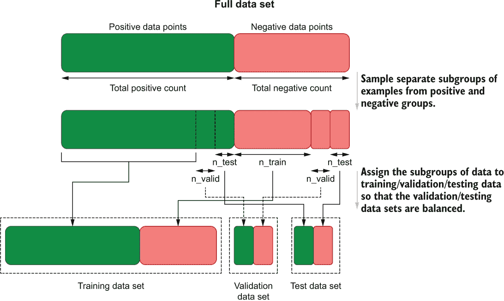
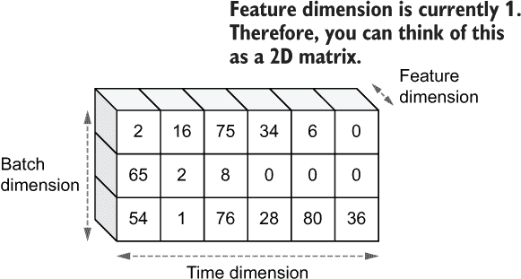
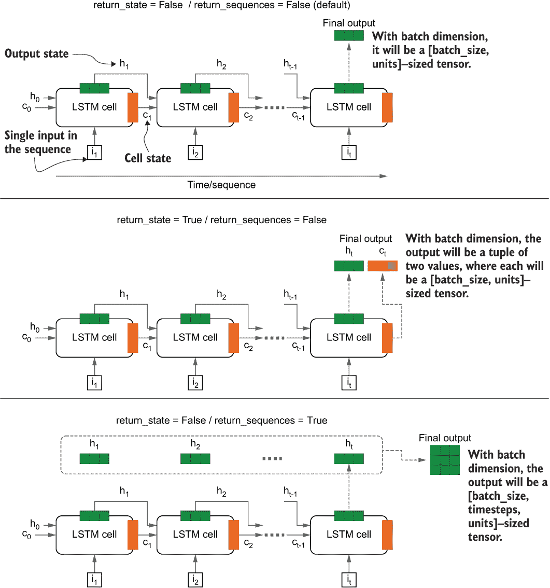
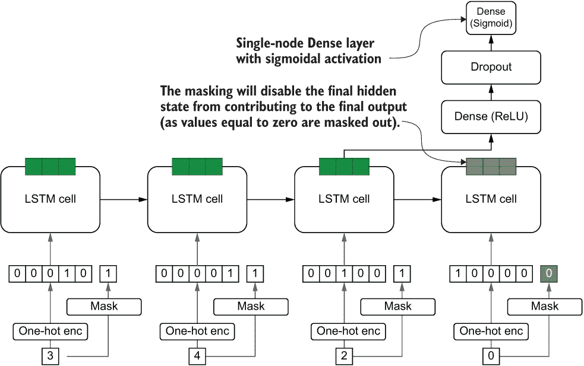
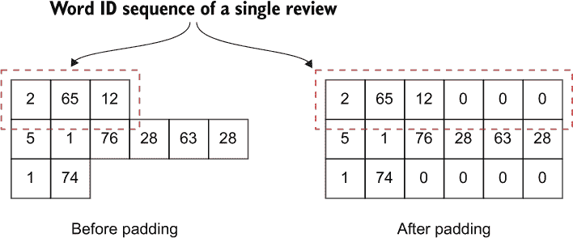
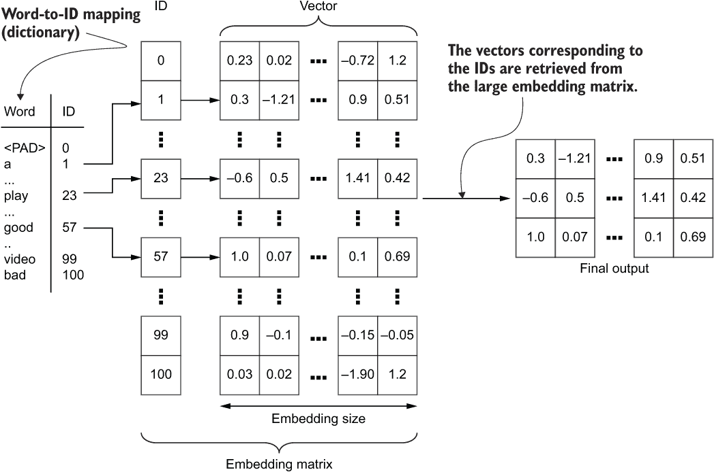

# 第九章：使用 TensorFlow 进行自然语言处理：情感分析

本章涵盖内容

+   使用 Python 对文本进行预处理

+   分析对模型重要的文本特定属性

+   使用 TensorFlow 创建处理文本序列的数据管道

+   使用递归深度学习模型（LSTM）进行情感分析

+   对不平衡的产品评论进行模型训练

+   实现词嵌入以提高模型性能

在之前的章节中，我们看了两个与计算机视觉相关的应用程序：图像分类和图像分割。图像分类侧重于识别图像中是否存在属于某个类别的对象。图像分割任务不仅关注于识别图像中存在的对象，还关注于图像中哪些像素属于某个对象。我们还围绕学习复杂卷积神经网络的基础展开了讨论，比如 Inception net（图像分类）和 DeepLab v3（图像分割）模型。如果我们超越图像，文本数据也是一种重要的数据形式。例如，全球范围内的网络充斥着文本数据。我们可以有把握地认为，它是网络上最常见的数据形式。因此，自然语言处理（NLP）一直是一个根深蒂固的主题，使我们能够利用免费的文本（例如，通过语言建模）的力量，并构建能够利用文本数据产生有意义结果的机器学习产品（例如，情感分析）。

*自然语言处理*是一个概括性概念，涵盖了与文本相关的各种任务。从简单的任务，比如改变文本的大小写（例如，将大写转换为小写），到复杂的任务，比如翻译语言和词义消歧（根据上下文推断具有相同拼写的单词的含义）都属于自然语言处理的范畴。以下是您在进入自然语言处理领域时将遇到的一些显著任务：

+   *停用词去除*——停用词是频繁出现在文本语料库中的无信息词（例如，“and”，“it”，“the”，“am”等）。通常情况下，这些词对文本的语义（或含义）几乎没有或没有任何贡献。为了减少特征空间，许多任务在将文本馈送到模型之前的早期阶段去除停用词。

+   *词形还原*——这是另一种减少模型需要处理的特征空间的技术。词形还原将给定单词转换为其基本形式（例如，将 buses 转换为 bus，walked 转换为 walk，went 转换为 go 等），从而减少词汇表的大小，进而减少模型需要学习的数据的维度。

+   *词性标注（PoS）*—PoS 标注就是标注给定文本中的每个单词的词性（例如名词、动词、形容词等）。Penn Treebank 项目提供了最流行和最全面的 PoS 标签列表之一。要查看完整列表，请访问[`mng.bz/mO1W`](http://mng.bz/mO1W)。

+   *命名实体识别（NER）*—NER 负责从文本中提取各种实体（例如人名/公司名、地理位置等）。

+   *语言建模*—语言建模的任务是预测第*n*（n>1）个单词，给定前面 1 至*w*-1 个单词。通过在相关数据上训练模型，可以使用语言建模生成歌曲、电影脚本、故事等。由于语言建模所需的数据具有高度的可访问性（即不需要任何标记数据），因此通常作为预训练方法用于为决策支持 NLP 模型注入语言理解。

+   *情感分析*—情感分析是根据一段文本的情感来进行评价的任务。例如，情感分析器可以分析产品/电影评论并自动生成一个得分来表示产品质量。

+   *机器翻译*—机器翻译是将源语言中的短语/句子翻译为目标语言中的短语/句子的任务。这些模型是使用双语平行文本语料库进行训练的。

作为数据科学家或 ML 研究人员，几乎不可能不遇到 NLP 任务。要快速而成功地解决 NLP 任务，重要的是要了解处理数据、使用标准模型等等。

在本章中，您将学习如何为视频游戏评论分类开发情感分析器。您将开始探索数据，并了解一些常见的 NLP 预处理步骤。您还将注意到数据集不平衡（即对于所有的类别数量不大致相等），并学习该怎么做。然后，我们将开发一个 TensorFlow 数据管道，通过该管道，我们将向模型输入数据进行训练。在这里，您将遇到一种在 NLP 领域中有影响的新型机器学习模型，即*长期短期记忆*（LSTM）模型。LSTM 模型可以通过迭代地处理序列（例如，句子中以特定顺序排列的一串单词）来生成最终结果。在这个任务中，模型将输出一个二进制值（0 表示负面评价，1 表示正面评价）。在遍历序列时，LSTM 模型保持迄今为止所见到的部分的记忆。这使得 LSTM 模型非常强大，能够处理长序列并学习其中的模式。训练模型后，我们将在某些测试数据上对其进行评估以确保其表现良好，然后保存它。我们将遵循以下高级步骤来开发此模型：

1.  下载数据。我们将使用 Amazon 的一个视频游戏评论语料库。

1.  探索并清理数据。加入一些文本清理步骤（例如，词形还原）来清理数据并为建模任务准备语料库。

1.  创建一个数据管道，将原始文本转换为机器学习模型理解的数值格式。

1.  在数据管道生成的数据上训练模型。

1.  在验证集和测试集上评估模型，以确保模型的泛化能力。

1.  保存训练好的模型，并写下性能结果。

## 9.1 这段文字是什么？探索和处理文字

你正在为一个流行的在线视频游戏商店构建情感分析器。他们希望比星级数量更多一些，因为星级数量可能由于星级的主观性而不能准确反映情感。高管们相信文字比星级更有价值。你被要求开发一个情感分析器，可以根据文本确定评论的积极或消极程度。

你决定使用亚马逊视频游戏评论数据集。它包含用户发布的各种评论以及星级数量。由于语言的复杂性、拼写错误等原因，文本可能会非常嘈杂。因此，某种类型的预处理将充当生成干净数据的守门人。在本节中，我们将检查数据和一些基本统计数据。然后，我们将执行几个预处理步骤：包括、转换为小写（例如，将“约翰”转换为“john”）、删除标点符号/数字、删除停用词（即无信息的词，如“to”、“the”、“a”等）和词形还原（将单词转换为其基本形式；例如，“walking”转换为“walk”）。

作为第一步，让我们在下一个清单中下载数据集。

清单 9.1 下载亚马逊评论数据集

```py
import os
import requests
import gzip
import shutil

# Retrieve the data
if not os.path.exists(os.path.join('data','Video_Games_5.json.gz')):      ❶
    url = 
➥ "http:/ /deepyeti.ucsd.edu/jianmo/amazon/categoryFilesSmall/Video_Games_
➥ 5.json.gz"
    # Get the file from web
    r = requests.get(url)

    if not os.path.exists('data'):
        os.mkdir('data')

    # Write to a file
    with open(os.path.join('data','Video_Games_5.json.gz'), 'wb') as f:
        f.write(r.content)
else:                                                                     ❷
    print("The tar file already exists.")

if not os.path.exists(os.path.join('data', 'Video_Games_5.json')):        ❸
    with gzip.open(os.path.join('data','Video_Games_5.json.gz'), 'rb') as f_in:
        with open(os.path.join('data','Video_Games_5.json'), 'wb') as f_out:
            shutil.copyfileobj(f_in, f_out)
else:
    print("The extracted data already exists")
```

❶ 如果 gzip 文件尚未下载，请下载并保存到磁盘上。

❷ 如果 gzip 文件位于本地磁盘中，则无需下载。

❸ 如果 gzip 文件存在但尚未解压，请解压它。

这段代码将数据下载到本地文件夹（如果尚未存在）并提取内容。它将包含一个包含数据的 JSON 文件。 JSON 是一种用于表示数据的格式，主要用于在 Web 请求中传输数据。它允许我们将数据定义为键值对。如果你查看 JSON 文件，你会看到每行有一条记录，每条记录都是一组键值对，键是列名，值是该记录的该列的值。你可以从数据中提取出几条记录：

```py
{"overall": 5.0, "verified": true, "reviewTime": "10 17, 2015", 
➥ "reviewerID": "xxx", "asin": "0700026657", "reviewerName": "xxx", 
➥ "reviewText": "This game is a bit hard to get the hang of, but when you 
➥ do it's great.", "summary": "but when you do it's great.", 
➥ "unixReviewTime": 1445040000}
{"overall": 4.0, "verified": false, "reviewTime": "07 27, 2015", 
➥ "reviewerID": "xxx", "asin": "0700026657", "reviewerName": "xxx", 
➥ "reviewText": "I played it a while but it was alright. The steam was a 
➥ bit of trouble. The more they move ... looking forward to anno 2205 I 
➥ really want to play my way to the moon.", "summary": "But in spite of 
➥ that it was fun, I liked it", "unixReviewTime": 1437955200}
{"overall": 3.0, "verified": true, "reviewTime": "02 23, 2015", 
➥ "reviewerID": "xxx", "asin": "0700026657", "reviewerName": "xxx", 
➥ "reviewText": "ok game.", "summary": "Three Stars", "unixReviewTime": 
➥ 1424649600}
```

接下来，我们将进一步探索我们拥有的数据：

```py
import pandas as pd

# Read the JSON file
review_df = pd.read_json(
    os.path.join('data', 'Video_Games_5.json'), lines=True, orient='records'
)
# Select on the columns we're interested in 
review_df = review_df[["overall", "verified", "reviewTime", "reviewText"]]
review_df.head()
```

数据是以 JSON 格式呈现的。pandas 提供了一个 pd.read_json()函数来轻松读取 JSON 数据。在读取 JSON 数据时，你必须确保正确设置 orient 参数。这是因为 orient 参数使 pandas 能够理解 JSON 数据的结构。与具有更一致结构的 CSV 文件相比，JSON 数据是非结构化的。设置 orient='records'将使 pandas 能够正确读取以这种方式结构化的数据（每行一个记录）到一个 pandas DataFrame 中。运行上述代码片段将产生表 9.1 中所示的输出。

表 9.1 Amazon 评论数据集的示例数据

|  | **整体** | **验证** | **评论时间** | **评论文本** |
| --- | --- | --- | --- | --- |
| 0 | 5 | True | 10 17, 2015 | 这个游戏有点难以掌握，但... |
| 1 | 4 | False | 07 27, 2015 | 我玩了一会儿，还行。... |
| 2 | 3 | True | 02 23, 2015 | 好吧，游戏还可以。 |
| 3 | 2 | True | 02 20, 2015 | 觉得这个游戏有点太复杂，不是我想要的... |
| 4 | 5 | True | 12 25, 2014 | 好游戏，我喜欢它，从那时起就一直在玩... |

我们现在将删除评论文本列中的任何空值或 null 值记录：

```py
review_df = review_df[~review_df["reviewText"].isna()]
review_df = review_df[review_df["reviewText"].str.strip().str.len()>0]
```

正如你可能已经注意到的，有一列显示评论是否来自验证购买者。为了保护我们数据的完整性，让我们只考虑来自验证购买者的评论。但在此之前，我们必须确保在过滤未经验证的评论后有足够的数据。为此，让我们看看不同值（即 True 和 False）的验证列有多少记录。为此，我们将使用 pandas 的内置 value_counts()函数，如下所示：

```py
review_df["verified"].value_counts()
```

这将会返回

```py
True     332504
False    164915
Name: verified, dtype: int64
```

这是个好消息。看起来我们从验证购买者那里得到的数据比未验证用户的数据要多。让我们创建一个名为 verified_df 的新 DataFrame，其中只包含验证过的评论：

```py
verified_df = review_df.loc[review_df["verified"], :]
```

接下来，我们将评估整体列中每个不同评分的评论数量：

```py
verified_df["overall"].value_counts()
```

这将会给出

```py
5    222335
4     54878
3     27973
1     15200
2     12118
Name: overall, dtype: int64
```

这是一个有趣的发现。通常，我们希望对每种不同的评分有相等数量的数据。但这在现实世界中从来都不是这样的。例如，在这里，我们有比 4 星评价多四倍的 5 星评价。这被称为*类别不平衡*。现实世界的数据通常是嘈杂的、不平衡的和肮脏的。当我们进一步研究数据时，我们将看到这些特征。在开发我们的模型时，我们将回到数据中类别不平衡的问题。 

Sentiment analysis 被设计为一个分类问题。给定评论（例如，作为单词序列），模型预测一组离散类别中的一个类别。我们将专注于两个类别：积极或消极。我们将假设 5 或 4 星表示积极情感，而 3、2 或 1 星表示消极情感。精明的问题形式化，比如减少类别数量，可以使分类任务变得更容易。为此，我们可以使用方便的内置 pandas 函数 map()。map() 接受一个字典，其中键表示当前值，值表示当前值需要映射到的值：

```py
verified_df["label"]=verified_df["overall"].map({5:1, 4:1, 3:0, 2:0, 1:0})
```

现在让我们在转换后检查每个类别的实例数量

```py
verified_df["label"].value_counts()
```

将返回

```py
1    277213
0     55291
Name: label, dtype: int64
```

积极样本约占 83%，消极样本约占 17%。这在样本数量上存在明显的不一致。我们简单的数据探索的最后一步是确保数据没有顺序。为了对数据进行洗牌，我们将使用 pandas 的 sample() 函数。sample() 技术上是用于从大数据集中抽样一小部分数据的。但通过设置 frac=1.0 和固定的随机种子，我们可以以随机的方式获取全部数据集的洗牌：

```py
verified_df = verified_df.sample(frac=1.0, random_state=random_seed)
```

最后，我们将输入和标签分别分开成两个变量，因为这将使下一步的处理更容易：

```py
inputs, labels = verified_df["reviewText"], verified_df["label"]
```

接下来，我们将专注于一项关键任务，这将最终改善进入模型的数据的质量：清理和预处理文本。在这里，我们将专注于执行以下子任务。您将在接下来的讨论中了解每个子任务的更多细节：

+   将单词的大小写转换为小写。

+   处理单词的缩写形式（例如，“aren’t”、“you’ll”等）。

+   将文本标记为单词（称为 *分词*）。

+   移除不相关的文本，如数字、标点和停用词。停用词是文本语料库中频繁出现但对于大多数自然语言处理任务来说其存在的价值不足以证明的单词（例如，“and”、“the”、“am”、“are”、“it”、“he”、“she”等）。

+   Lemmatize words. 词形还原是将单词转换为其基本形式的过程（例如，将复数名词转换为单数名词，将过去式动词转换为现在式动词）。

要执行大多数这些任务，我们将依赖于一个著名且广为人知的用于文本处理的 Python 库，称为 NLTK（自然语言工具包）。如果您已设置开发环境，应该已安装 NLTK 库。但我们的工作还没有完成。为了执行一些子任务，我们需要下载 NLTK 提供的几个外部资源：

+   averaged_perceptron_tagger—用于识别词性

+   wordnet *和* omw-1.4-_ 将被用于词形还原（即，将单词转换为其基本形式）

+   stopwords—提供各种语言的停用词列表

+   punkt—用于将文本标记为较小的组件（例如，单词、句子等）

首先让我们这样做：

```py
import nltk

nltk.download('averaged_perceptron_tagger', download_dir='nltk')
nltk.download('wordnet', download_dir='nltk')
nltk.download('omw-1.4', download_dir='nltk')
nltk.download('stopwords', download_dir='nltk')
nltk.download('punkt', download_dir='nltk')
nltk.data.path.append(os.path.abspath('nltk'))
```

现在我们可以继续我们的项目了。为了理解这里列出的各种预处理步骤，我们将放大一个单独的评价，它只是一个 Python 字符串（即字符序列）。让我们将这个单独的评价称为 doc。

首先，我们可以通过在字符串上调用 lower()函数将字符串转换为小写。lower()是 Python 中的一个内置函数，可用于将给定字符串中的字符转换为小写字符：

```py
    doc = doc.lower()
```

接下来，如果存在"n't"，我们将将其扩展为"not"：

```py
import re

doc = re.sub(pattern=r"\w+n\'t ", repl="not ", string=doc)
```

为了实现这一点，我们将使用正则表达式。正则表达式使我们能够匹配任意模式并以各种方式操纵它们。Python 有一个用于处理正则表达式的内置库，称为 re。在这里，re.sub()将用作 repl 参数（即“not ”）中的字符串替换符合某个模式的单词（即任何字母字符序列后跟“n't；例如，“don’t”，“can’t”），并将它们替换为字符串 doc 中的字符串。例如，“won’t”将被替换为“not”。我们不关心前缀“will”，因为在稍后我们将执行的停用词移除过程中它将被移除。如果你感兴趣，可以在[`www.rexegg.com/regex-quickstart.xhtml`](https://www.rexegg.com/regex-quickstart.xhtml)了解更多关于正则表达式语法的信息。

我们将删除如'll、're、'd 和've 等缩写形式。你可能会注意到，这将导致不太完整的词组，比如“wo”（即“won’t”变成“wo”+“not”）；但我们可以放心地忽略它们。请注意，我们对“not”的缩写形式处理与其他缩写形式有所不同。这是因为与其他缩写形式不同，如果存在，“not”可以对评价实际传达的意义产生重要影响。我们稍后将再次讨论这个问题：

```py
doc = re.sub(pattern=r"(?:\'ll |\'re |\'d |\'ve )", repl=" ", string=doc)
```

在这里，为了替换'll、're、'd 和've 的缩写形式，我们再次使用正则表达式。在这里，r"(?:\'ll|\'re|\'d|\'ve)"是 Python 中的一个正则表达式，它主要识别出 doc 中的任何出现的'll/'re/'d/'ve。然后我们将使用 re.sub()函数如前所述删除 doc 中的任何数字：

```py
    doc = re.sub(pattern=r"/d+", repl="", string=doc)
```

接下来的步骤中，我们将删除停用词和任何标点符号。如前所述，停用词是出现在文本中但对文本的含义几乎没有贡献的词。换句话说，即使文本中没有停用词，你仍然能够推断出所说内容的意义。NLTK 库提供了一个停用词列表，因此我们不必自己编写停用词：

```py
from nltk.corpus import stopwords
from nltk import word_tokenize
import string

EN_STOPWORDS = set(stopwords.words('english')) - {'not', 'no'}

(doc) if w not in EN_STOPWORDS and w not in string.punctuation]  
```

要访问停用词，您只需调用 nltk.corpus 中的 stopwords 并调用 stopwords.words('english')。这将返回一个列表。如果您查看停用词列表中的单词，您会发现几乎所有常见单词（例如，“I”，“you”，“a”，“the”，“am”，“are”等），这些单词在阅读文本时都会遇到。但正如我们之前强调的，词“not”是一个特殊的词，特别是在情感分析的背景下。诸如“no”和“not”之类的单词的存在可以完全改变我们情况下文本的含义。

还要注意一下函数 word_tokenize()的使用。这是一种特殊的处理步骤，称为*标记化*。在这里，将字符串传递给 word_tokenize()会返回一个列表，其中每个单词都是一个元素。对于像英语这样的语言，单词是由空格字符或句号分隔的，单词标记化可能看起来非常微不足道。但是在其他语言（例如，日语）中，标记之间的分隔并不明显，这可能是一个复杂的任务。

不要让停用词愚弄你！

如果您查看大多数停用词列表，您会发现单词“no”和“not”被视为停用词，因为它们是在文本语料库中常见的单词。但是，对于我们的情感分析任务，这些单词在改变评价的含义（以及可能的标签）方面起着重要作用。评价“这是一个很棒的视频游戏”的含义与“这不是一个很棒的视频游戏”或“这个游戏不好”相反。因此，我们特别从停用词列表中删除单词“no”和“not”。

接下来，我们有另一种称为*词形还原*的处理方法。词形还原将给定的单词截断/变形为基本形式，例如将复数名词转换为单数名词或将过去时动词转换为现在时，等等。这可以通过 NLTK 包中附带的一个词形还原器对象轻松完成：

```py
lemmatizer = WordNetLemmatizer()
```

在这里，我们正在下载 WordNetLemmatizer。WordNetLemmatizer 是建立在著名的 WordNet 数据库上的词形还原器。如果您还没有听说过 WordNet，那么它是一个著名的词汇数据库（以网络/图形的形式），您可以将其用于信息检索、机器翻译、文本摘要等任务。WordNet 有多种大小和口味（例如，多语言 WordNet，非英语 WordNet 等）。您可以在线探索 WordNet 并浏览数据库[`wordnet.princeton.edu/`](https://wordnet.princeton.edu/)。

```py
pos_tags = nltk.pos_tag(tokens)
    clean_text = [
        lemmatizer.lemmatize(w, pos=p[0].lower()) \
        if p[0]=='N' or p[0]=='V' else w \
        for (w, p) in pos_tags
    ]
```

通过调用 lemmatizer.lemmatize()函数，您可以将任何给定的单词转换为其基本形式（如果尚未处于基本形式）。但是在调用函数时，您需要传递一个重要的参数，称为 pos。pos 是该单词的词性标签（part-of-speech tag）的缩写。词性标注是一项特殊的自然语言处理任务，任务是从给定的一组离散的词性标签中将给定的单词分类到一个词性标签中。以下是一些词性标签的示例：

+   *DT*—限定词（例如，a，the）

+   *JJ*—形容词（例如，beautiful，delicious）

+   *NN*—名词，单数或质量（例如，person，dog）

+   *NNS* — 名词，复数（例如，people，dogs）

+   *NNP* — 专有名词，单数（例如，我，他，她）

+   *NNPS* — 专有名词，复数（例如，we，they）

+   *VB* — 动词，基本形式（例如，go，eat，walk）

+   *VBD* — 动词，过去时（例如，went，ate，walked）

+   *VBG* — 动词，动名词或现在分词（例如，going，eating，walking）

+   *VBN* — 动词，过去分词（例如，gone，eaten，walked）

+   *VBP* — 动词，第三人称单数现在时

+   *VBZ* — 动词，第三人称单数现在时

您可以在 [`mng.bz/mO1W`](http://mng.bz/mO1W) 找到完整的词性标签列表。值得注意的是标签是如何组织的。您可以看到，如果只考虑标签的前两个字符，您会得到一个更广泛的类别集（例如，NN，VB），其中所有名词都将被分类为 NN，动词将被分类为 VB，以此类推。我们将利用这一特性来简化我们的生活。

回到我们的代码：让我们看看我们如何使用词性标签来将词形还原。在将词形还原为词时，您必须传递该词的词性标签。这一点很重要，因为不同类型的词的词形还原逻辑是不同的。我们首先会得到一个列表，其中包含 tokens（由分词过程返回）中的单词的（<word>，<pos>）元素。然后，我们遍历 pos_tags 列表并调用 lemmatizer.lemmatize() 函数，传入单词和词性标签。我们只会将动词和名词进行词形还原，以节省计算时间。

关于 WordNet 的更多信息

WordNet 是一个以互联网络形式存在的词汇数据库（有时称为词汇本体论）。这些连接基于两个词的相似程度。例如，单词“car”和“automobile”的距离较近，而“dog”和“volcano”则相距甚远。

WordNet 中的单词被分组为*同义词集*（简称为 synsets）。一个同义词集包含共享共同含义的单词（例如，dog，cat，hamster）。每个单词可以属于一个或多个同义词集。每个同义词集都有*词条*，这些词条是该同义词集中的单词。

向上一层，词集之间存在关系。有四种不同的关系：

+   *超类词* — 超类词集是比给定词集更一般的词集。例如，“动物”是“宠物”的超类词集。

+   *下义词* — 下义词集是比给定词集更具体的词集。例如，“car”是“vehicle”词集的下义词集。

+   *部分词* — 部分词集是给定词集的一部分（是-部分-关系）。例如，“engine”是“car”词集的部分词集。

+   *成员词* — 成员词集是给定词集所构成的词集（是-构成-关系）。例如，“leaf”是“plant”词集的成员词集。

由于这种互联词集的组织，使用 WordNet 还可以测量两个词之间的距离。相似的词将具有较小的距离，而不同的词将具有较大的距离。

您可以通过从 nltk.corpus 导入 WordNet 来在 NLTK 中尝试这些想法。有关更多信息，请参阅 [`www.nltk.org/howto/wordnet.xhtml`](https://www.nltk.org/howto/wordnet.xhtml)。

这结束了我们正在合并的一系列步骤，以构建我们文本的预处理工作流程。我们将这些步骤封装在一个名为 clean_ text() 的函数中，如下所示。

列表 9.2 数据集中评论的预处理逻辑

```py
def clean_text(doc):
    """ A function that cleans a given document (i.e. a text string)"""

    doc = doc.lower()                                        ❶
    doc = doc.replace("n\'t ", ' not ')                      ❷
    doc = re.sub(r"(?:\'ll |\'re |\'d |\'ve )", " ", doc)    ❸
    doc = re.sub(r"/d+","", doc)                             ❹

    tokens = [
        w for w in word_tokenize(doc) if w not in EN_STOPWORDS and w not in 
➥ string.punctuation
    ]                                                        ❺

    pos_tags = nltk.pos_tag(tokens)                          ❻
    clean_text = [
        lemmatizer.lemmatize(w, pos=p[0].lower()) \          ❼
        if p[0]=='N' or p[0]=='V' else w \                   ❼
        for (w, p) in pos_tags                               ❼
    ]

    return clean_text
```

❶ 转换为小写。

❷ 将缩写形式 n’t 扩展为“not”。

❸ 删除缩写形式，如’ll，’re，’d，’ve，因为它们对此任务没有太多价值。

❹ 删除数字。

❺ 将文本分解为标记（或单词）；在此过程中，忽略结果中的停用词。

❻ 获取字符串中标记的词性标签。

❼ 对于每个标记，获取其词性标签；如果是名词（N）或动词（V），则进行词形还原，否则保留原始形式。

你可以通过在示例文本上调用函数来检查函数中完成的处理。

```py
sample_doc = 'She sells seashells by the seashore.'
print("Before clean: {}".format(sample_doc))
print("After clean: {}".format(clean_text(sample_doc)))
```

返回

```py
Before clean: She sells seashells by the seashore.
After clean: [“sell”, “seashell”, “seashore”]
```

我们将利用此函数以及 panda 的 apply 函数，在我们的数据 DataFrame 中的每一行文本上应用此处理管道：

```py
inputs = inputs.apply(lambda x: clean_text(x))
```

你可能想离开电脑一会儿去喝咖啡或看看朋友。运行这个一行代码可能需要接近一个小时。最终结果看起来像表 9.2。

表 9.2 原始文本与预处理文本

| **原始文本** | **清理文本（标记化）** |
| --- | --- |
| 在 Wii 和 GameCube 上完美运行。与兼容性或内存丢失无关的问题。 | ['work', 'perfectly', 'wii', 'gamecube', ‘no’, 'issue', 'compatibility', 'loss', 'memory'] |
| 喜欢这款游戏，而且其他附带的收藏品做得很好。面具很大，几乎适合我的脸，所以令人印象深刻。 | ['loved', 'game', 'collectible', 'come', 'well', 'make', 'mask', 'big', 'almost', 'fit', 'face', 'impressive'] |
| 这是一个可以的游戏。说实话，我对这类游戏很差劲，对我来说这很困难！我总是死去，这让我沮丧。也许如果我更有技巧，我会更喜欢这款游戏！ | ["'s", 'okay', 'game', 'honest', 'bad', 'type', 'game', '--', "'s", 'difficult', 'always', 'die', 'depresses', 'maybe', 'skill', 'would', 'enjoy', 'game'] |
| 产品描述很好。 | ['excellent', 'product', 'describe'] |
| 细节水平很高；你可以感受到这款游戏对汽车的热爱。 | ['level', 'detail', 'great', 'feel', 'love', 'car', 'game'] |
| 我不能玩这个游戏。 | ['not', 'play', 'game'] |

最后，为了避免因运行次数过多而过度依赖咖啡或打扰朋友，我们将数据保存到磁盘上：

```py
inputs.to_pickle(os.path.join('data','sentiment_inputs.pkl'))
labels.to_pickle(os.path.join('data','sentiment_labels.pkl'))
```

现在，我们将定义一个数据管道，将数据转换为模型理解的格式，并用于训练和评估模型。

练习 1

给定字符串 s，“i-purchased-this-game-for-99-i-want-a-refund”，你想用空格替换短横线“-”，然后仅对文本中的动词进行词形还原。你会如何做？

## 准备模型的文本

你有一个干净的数据集，其中的文本已经剥离了任何不必要或不合理的语言复杂性，以解决我们正在解决的问题。此外，二元标签是根据每条评论给出的星级生成的。在继续进行模型训练和评估之前，我们必须对数据集进行进一步处理。具体来说，我们将创建三个数据子集——训练、验证和测试——用于训练和评估模型。接下来，我们将查看数据集的两个重要特征：词汇量和示例中序列长度（即单词数量）的分布。最后，你将把单词转换为数字（或数字 ID），因为机器学习模型不理解字符串而理解数字。

在本节中，我们将进一步准备数据以供模型使用。现在，我们有一个非常好的处理步骤布局，可以从杂乱、不一致的评论转变为保留评论语义的简单、一致的文本字符串。但是，我们还没有解决问题的关键！也就是说，机器学习模型理解的是数值数据，而不是文本数据。如果你直接呈现字符串“not a great game”，对模型来说没有任何意义。我们必须进一步完善我们的数据，以便最终得到一系列数字，而不是单词序列。在准备好数据供模型使用的过程中，我们将执行以下子任务：

+   在预处理后检查词汇表/单词频率的大小。这将稍后用作模型的超参数。

+   检查序列长度的摘要统计信息（均值、中位数和标准偏差）。这将稍后用作模型的超参数。

+   创建一个字典，将每个唯一的单词映射到一个唯一的 ID（我们将其称为分词器）。

### 分割训练/验证和测试数据

警告！在执行这些任务时，你可能会无意中在我们的模型中创建渗漏数据泄露。我们必须确保我们只使用训练数据集来执行这些任务，并将验证和测试数据保持分开。因此，我们的第一个目标应该是分离训练/验证/测试数据。

潜在的自然语言处理数据泄漏

你可能会想：“太好了！我只需加载处理过的文本语料库并在上面执行分析或任务。”不要那么快！这是错误的做法。在执行任何特定于数据的处理/分析之前，如计算词汇量或开发分词器，你必须将数据分割成训练/验证和测试集，然后在训练数据上执行此处理/分析。

验证数据的目的是作为选择超参数的指南，并确定何时停止训练。测试数据集是你的基准，用于评估模型在实际世界中的表现。考虑到验证/测试数据的用途性质，它们不应该成为你分析的一部分，而只应该用于评估性能。在你的分析中使用验证/测试数据来开发模型会给你一个不公平的优势，并导致所谓的*数据泄漏*。数据泄漏是指直接或间接提供访问你在模型上评估的示例。如果验证/测试数据在我们进行任何分析时被使用，我们在评估阶段之前提供了对这些数据集的访问。带有数据泄漏的模型可能导致在实际世界中性能不佳。

我们知道我们有一个不均衡的数据集。尽管有一个不均衡的数据集，我们必须确保我们的模型能够很好地识别出积极和消极的评论。这意味着我们将要评估的数据集需要是平衡的。为了实现这一点，我们将做以下操作：

+   创建平衡的（即正负样本数量相等的）验证集和测试集

+   将剩余的数据点分配给训练集

图 9.1 描述了这个过程。



图 9.1 分割训练/验证/测试数据的过程

现在我们将看看如何在 Python 中实现这一点。首先，我们分别识别对应于正标签和负标签的索引：

```py
neg_indices = pd.Series(labels.loc[(labels==0)].index)
pos_indices = pd.Series(labels.loc[(labels==1)].index)
```

分层抽样：不均衡数据集的替代方法

你对验证和测试集的设计将决定你如何定义性能指标来评估训练模型。如果你创建了同样平衡的验证/测试集，那么你可以安全地使用准确率作为评估训练模型的指标。这就是我们将要做的：创建平衡的验证/测试数据集，然后使用准确率作为评估模型的指标。但你可能并不总是那么幸运。有时候可能会出现少数类别非常恐怖，你无法承担创建平衡数据集的情况。

在这种情况下，你可以使用*分层抽样*。分层抽样创建单独的数据集，大致保持完整数据集中原始类别比例。在这种情况下，你必须谨慎选择你的度量标准，因为标准准确率不能再被信任。例如，如果你关心以高准确率识别正样本而牺牲一些误报率，那么你应该使用召回率（或 F1 分数，对召回率给予更高的权重）作为性能指标。

接下来，我们将定义我们的验证/测试集的大小作为 train_fraction 的函数（一个用户定义的参数，确定留给训练集的数据量）。我们将使用 train_fraction 的默认值 0.8：

```py
n_valid = int(
    min([len(neg_indices), len(pos_indices)]) * ((1-train_fraction)/2.0)
)
```

它可能看起来像是一个复杂的计算，但事实上，它是一个简单的计算。我们将使用有效分数作为留给训练数据的数据分数的一半（另一半用于测试集）。最后，为了将分数值转换为实际样本数，我们将分数乘以正样本和负样本计数中较小的那个。通过这种方式，我们确保少数类在数据拆分过程中保持为焦点。我们保持验证集和测试集相等。所以

```py
n_test = n_valid
```

接下来，我们为每种标签类型（正和负）定义三组索引（用于训练/验证/测试数据集）。我们将创建一个漏斗过程来将数据点分配到不同的数据集中。首先，我们执行以下操作：

1.  从负索引（neg_ test_indices）中随机抽样 n_test 个索引。

1.  然后从剩余的索引中随机抽样 n_valid 个索引（neg_ valid_inds）。

1.  剩余的索引被保留为训练实例（neg_train_inds）。

然后，对正索引重复相同的过程，以创建用于训练/验证/测试数据集的三个索引集：

```py
neg_test_inds = neg_indices.sample(n=n_test, random_state=random_seed)
neg_valid_inds = neg_indices.loc[
    ~neg_indices.isin(neg_test_inds)
].sample(n=n_test, random_state=random_seed)
neg_train_inds = neg_indices.loc[
    ~neg_indices.isin(neg_test_inds.tolist()+neg_valid_inds.tolist())
]

pos_test_inds = pos_indices.sample(n=n_test, random_state=random_seed
)
pos_valid_inds = pos_indices.loc[
    ~pos_indices.isin(pos_test_inds)
].sample(n=n_test, random_state=random_seed)
pos_train_inds = pos_indices.loc[        
    ~pos_indices.isin(pos_test_inds.tolist()+pos_valid_inds.tolist())
]
```

使用负索引和正索引来切片输入和标签，现在是时候创建实际的数据集了：

```py
tr_x = inputs.loc[
    neg_train_inds.tolist() + pos_train_inds.tolist()
].sample(frac=1.0, random_state=random_seed)
tr_y = labels.loc[
    neg_train_inds.tolist() + pos_train_inds.tolist()
].sample(frac=1.0, random_state=random_seed)

v_x = inputs.loc[
    neg_valid_inds.tolist() + pos_valid_inds.tolist()
].sample(frac=1.0, random_state=random_seed)
v_y = labels.loc[
    neg_valid_inds.tolist() + pos_valid_inds.tolist()
].sample(frac=1.0, random_state=random_seed)

ts_x = inputs.loc[
    neg_test_inds.tolist() + pos_test_inds.tolist()
].sample(frac=1.0, random_state=random_seed)
ts_y = labels.loc[
    neg_test_inds.tolist() + pos_test_inds.tolist()
].sample(frac=1.0, random_state=random_seed)
```

在这里，（tr_x，tr_y），（v_x，v_y）和（ts_x，ts_y）分别代表训练，验证和测试数据集。在这里，以 _x 结尾的数据集来自输入，以 _y 结尾的数据集来自标签。最后，我们可以将我们讨论的逻辑包装在一个单独的函数中，如下面的清单所示。

清单 9.3 拆分训练/验证/测试数据集

```py
def train_valid_test_split(inputs, labels, train_fraction=0.8):
    """ Splits a given dataset into three sets; training, validation and test """

    neg_indices = pd.Series(labels.loc[(labels==0)].index)                   ❶
    pos_indices = pd.Series(labels.loc[(labels==1)].index)                   ❶

    n_valid = int(min([len(neg_indices), len(pos_indices)]) 
       * ((1-train_fraction)/2.0))                                           ❷
    n_test = n_valid                                                         ❷

    neg_test_inds = neg_indices.sample(n=n_test, random_state=random_seed)   ❸
    neg_valid_inds = neg_indices.loc[~neg_indices.isin(
       neg_test_inds)].sample(n=n_test, random_state=random_seed)            ❹
    neg_train_inds = neg_indices.loc[~neg_indices.isin(
        neg_test_inds.tolist()+neg_valid_inds.tolist())]                     ❺

    pos_test_inds = pos_indices.sample(n=n_test)                             ❻
    pos_valid_inds = pos_indices.loc[
        ~pos_indices.isin(pos_test_inds)].sample(n=n_test)                   ❻
    pos_train_inds = pos_indices.loc[
        ~pos_indices.isin(pos_test_inds.tolist()+pos_valid_inds.tolist())    ❻
    ]

    tr_x = inputs.loc[neg_train_inds.tolist() + 
➥ pos_train_inds.tolist()].sample(frac=1.0, random_state=random_seed)       ❼
    tr_y = labels.loc[neg_train_inds.tolist() + 
➥ pos_train_inds.tolist()].sample(frac=1.0, random_state=random_seed)       ❼
    v_x = inputs.loc[neg_valid_inds.tolist() + 
➥ pos_valid_inds.tolist()].sample(frac=1.0, random_state=random_seed)       ❼
    v_y = labels.loc[neg_valid_inds.tolist() + 
➥ pos_valid_inds.tolist()].sample(frac=1.0, random_state=random_seed)       ❼
    ts_x = inputs.loc[neg_test_inds.tolist() + 
➥ pos_test_inds.tolist()].sample(frac=1.0, random_state=random_seed)        ❼
    ts_y = labels.loc[neg_test_inds.tolist() + 
➥ pos_test_inds.tolist()].sample(frac=1.0, random_state=random_seed)        ❼

    print('Training data: {}'.format(len(tr_x)))
    print('Validation data: {}'.format(len(v_x)))
    print('Test data: {}'.format(len(ts_x)))

    return (tr_x, tr_y), (v_x, v_y), (ts_x, ts_y)
```

❶ 将负数据点和正数据点的索引分开。

❷ 计算有效和测试数据集的大小（针对少数类）。

❸ 获取进入测试集的少数类索引。

❹ 获取进入验证集的少数类索引。

❺ 少数类中其余的索引属于训练集。

❻ 计算用于测试/验证/训练集的多数类索引

❼ 使用创建的索引获取训练/验证/测试数据集。

然后只需调用函数来生成训练/验证/测试数据：

```py
(tr_x, tr_y), (v_x, v_y), (ts_x, ts_y) = train_valid_test_split(data, labels)
```

接下来，我们将进一步检查语料库，以探索与我们在训练集中拥有的评论相关的词汇量和序列长度。稍后这些将作为模型的超参数。

### 9.2.2 分析词汇

词汇量是模型的重要超参数。因此，我们必须找到最佳的词汇量，以便能够捕获足够的信息以准确解决任务。为此，我们首先会创建一个长列表，其中每个元素都是一个单词：

```py
data_list = [w for doc in tr_x for w in doc]
```

此行遍历 tr_x 中的每个文档，然后遍历该文档中的每个单词（w），并创建一个展平的序列，其中包含所有文档中存在的单词。由于我们有一个 Python 列表，其中每个元素都是一个单词，我们可以利用 Python 的内置 Counter 对象来获取一个字典，其中每个单词都映射到一个键，该值表示该单词在语料库中的频率。请注意，我们仅在此分析中使用训练数据集，以避免数据泄漏：

```py
from collections import Counter
cnt = Counter(data_list)
```

有了我们的单词频率字典，让我们来看看我们语料库中一些最常见的单词：

```py
freq_df = pd.Series(
    list(cnt.values()), 
    index=list(cnt.keys())
).sort_values(ascending=False)

print(freq_df.head(n=10))
```

这将返回以下结果，您可以看到出现在文本中的最常见的单词。从结果来看，这是合理的。毫不奇怪，像 “game”、“like” 和 “play” 这样的词在频率上优先于其他单词：

```py
game     407818
not      248244
play     128235
's       127844
get      108819
like     100279
great     97041
one       89948
good      77212
time      63450
dtype: int64
```

更进一步，让我们对文本语料库进行摘要统计。通过这样做，我们可以看到单词的平均频率、标准偏差、最小值、最大值等：

```py
print(freq_df.describe())
```

这将提供有关单词频率的一些重要基本统计信息。例如，从中我们可以说单词的平均频率是约为 ~76，标准偏差为 ~1754：

```py
count    133714.000000
mean         75.768207
std        1754.508881
min           1.000000
25%           1.000000
50%           1.000000
75%           4.000000
max      408819.000000
dtype: float64
```

然后，我们将创建一个名为 n_vocab 的变量，该变量将保存在语料库中至少出现 25 次的单词的词汇量的大小。您应该得到接近 11,800 的 n_vocab 值：

```py
n_vocab = (freq_df >= 25).sum()
```

### 9.2.3 分析序列长度

请记住，tr_x 是一个 pandas Series 对象，其中每一行都包含一条评论，每个评论都是一个单词列表。当数据处于这种格式时，我们可以使用 pd.Series.str.len() 函数来获取每行的长度（或每条评论中的单词数）：

```py
seq_length_ser = tr_x.str.len()
```

在计算基本统计量时，我们将采取一些不同的方法。我们的目标是找到三个序列长度的区间，以便将它们分为短、中、长序列。我们将在定义 TensorFlow 数据流水线时使用这些桶边界。为此，我们将首先确定截断点（或分位数），以去除数据的前 10% 和后 10%。这是因为顶部和底部切片都充满了异常值，正如你所知，它们会使诸如均值之类的统计量产生偏差。在 pandas 中，您可以使用 quantile() 函数获取分位数，其中您传递一个分数值来指示您感兴趣的分位数：

```py
p_10 = seq_length_ser.quantile(0.1)
p_90 = seq_length_ser.quantile(0.9)
```

然后，您只需在这些分位数之间过滤数据。接下来，我们使用 describe 函数，其中包含 33% 分位数和 66% 分位数，因为我们希望将其分为三个不同的类别：

```py
seq_length_ser[(seq_length_ser >= p_10) & (seq_length_ser < p_90)].describe(percentiles=[0.33, 0.66])
```

如果运行此代码，您将得到以下输出：

```py
count    278675.000000
mean         15.422596
std          16.258732
min           1.000000
33%           5.000000
50%          10.000000
66%          16.000000
max          74.000000
Name: reviewText, dtype: float64
```

根据结果，我们将使用 5 和 15 作为我们的桶边界。换句话说，评论按照以下逻辑进行分类：

+   长度在 [0, 5) 的评论为短评论。

+   长度在 [5, 15) 的评论为中等评论。

+   长度在 [15, inf) 的评论为长评论。

最后两个小节总结了我们分析以找到词汇表大小和序列长度的过程。这里呈现的输出提供了所有信息，以便以有原则的态度选择我们的超参数。

### 9.2.4 使用 Keras 将文本转换为单词，然后转换为数字

我们有一段干净的、经过处理的文本语料库，以及我们稍后将使用的词汇表大小和序列长度参数。我们的下一个任务是将文本转换为数字。将文本转换为数字有两个标准步骤：

1.  将文本拆分为标记（例如，字符/单词/句子）。

1.  创建一个将每个唯一标记映射到唯一 ID 的字典。

例如，如果您有以下句子

```py
the cat sat on the mat
```

我们将首先将其标记化为单词，得到

```py
[the, cat, sat, on, the, mat]
```

并且有字典

```py
{the: 1, cat: 2, sat: 3, on: 4, mat: 5}
```

然后，您可以创建以下序列来表示原始文本：

```py
[1,2,3,4,1,5]
```

Keras Tokenizer 对象支持这种功能。它接受一段文本语料库，使用一些用户定义的参数进行标记化，自动构建词典，并将其保存为状态。这样，您可以使用 Tokenizer 将任意文本转换为数字，次数不限。让我们看看如何使用 Keras Tokenizer 完成这个过程：

```py
from tensorflow.keras.preprocessing.text import Tokenizer

tokenizer = Tokenizer(
    num_words=n_vocab, 
    oov_token='unk', 
    lower=False, 
    filters='!"#$%&()*+,-./:;<=>?@[\\]^_`{|}~\t\n',
    split=' ', 
    char_level=False
)
```

您可以看到 Tokenizer 传递了几个参数。让我们稍微详细地看看这些参数：

+   num_words——这定义了词汇表大小，以限制字典的大小。如果 num_words 设置为 1,000，则会考虑语料库中最常见的 1,000 个单词，并为它们分配唯一的 ID。

+   oov_token——这个参数处理落在定义的词汇表大小之外的词。出现在语料库中但未包含在最常见的 num_words 个词中的单词将被替换为此标记。

+   lower——这确定是否对文本进行大小写转换。由于我们已经做过了，我们将其设置为 False。

+   filter——这定义了在标记化文本之前要删除的任何字符。

+   split——这是用于标记化文本的分隔符字符。我们希望单词是标记，因此我们将使用空格，因为单词通常用空格分隔。

+   char_level——这指示是否执行字符级标记化（即，每个字符都是一个标记）。

在我们继续之前，让我们回顾一下我们的数据在当前状态下是什么样子。请记住，我们有

+   清理后的数据

+   预处理数据

+   将每个评论拆分为单独的单词

在这个过程结束时，我们的数据如下所示。首先，我们有输入，它是一个 pd.Series 对象，包含一系列干净的单词列表。文本前面的数字是该记录在 pd.Series 对象中的索引：

```py
122143    [work, perfectly, wii, gamecube, issue, compat...
444818    [loved, game, collectible, come, well, make, m...
79331     ['s, okay, game, honest, bad, type, game, --, ...
97250                        [excellent, product, describe]
324411        [level, detail, great, feel, love, car, game]
...
34481     [not, actually, believe, write, review, produc...
258474    [good, game, us, like, movie, franchise, hard,...
466203    [fun, first, person, shooter, nice, combinatio...
414288                       [love, amiibo, classic, color]
162670    [fan, halo, series, start, enjoy, game, overal...
Name: reviewText, dtype: object
```

接下来，我们有标签，其中每个标签都是一个二进制标签，用于指示评论是正面评论还是负面评论：

```py
122143    1
444818    1
79331     0
97250     1
324411    1
...
34481     1
258474    1
466203    1
414288    1
162670    0
Name: label, dtype: int64
```

从某种意义上说，标记文本的第一步已经完成了。如果已经完成了这一步，那么 Keras Tokenizer 足够智能，会跳过这一步。要构建 Tokenizer 的字典，可以调用 tf.keras.preprocessing.text.Tokenizer.fit_on_texts() 函数，如下所示：

```py
tokenizer.fit_on_texts(tr_x.tolist())
```

fit_on_texts() 函数接受一个字符串列表，其中每个字符串是你正在处理的单个实体（例如，一个句子、一个评论、一个段落等），或者是一个标记列表的列表，其中标记可以是一个单词、一个字符，甚至是一个句子。当你将 Tokenizer 拟合到某些文本时，你可以检查一些内部状态变量。你可以使用以下方式检查单词到 ID 的映射：

```py
tokenizer.word_index[“game”]
```

这将返回

```py
2
```

你还可以使用以下方式检查 ID 到单词的映射（即将单词映射到 ID 的反向操作）：

```py
tokenizer.index_word[4]
```

这将返回

```py
“play”
```

要将文本语料库转换为索引序列，你可以使用 texts_to_sequences() 函数。它接受一个标记列表的列表，并返回一个 ID 列表的列表：

```py
tr_x = tokenizer.texts_to_sequences(tr_x.tolist())
v_x = tokenizer.texts_to_sequences(v_x.tolist())
ts_x = tokenizer.texts_to_sequences(ts_x.tolist())
```

让我们看一下 text_to_sequences() 函数转换的一些样本的结果：

```py
Text: ['work', 'perfectly', 'wii', 'gamecube', 'issue', 'compatibility', 
➥ 'loss', 'memory']
Sequence: [14, 295, 83, 572, 121, 1974, 2223, 345]
Text: ['loved', 'game', 'collectible', 'come', 'well', 'make', 'mask', 
➥ 'big', 'almost', 'fit', 'face', 'impressive']
Sequence: [1592, 2, 2031, 32, 23, 16, 2345, 153, 200, 155, 599, 1133]

Text: ["'s", 'okay', 'game', 'honest', 'bad', 'type', 'game', '--', "'s", 
➥ 'difficult', 'always', 'die', 'depresses', 'maybe', 'skill', 'would', 
➥ 'enjoy', 'game']
Sequence: [5, 574, 2, 1264, 105, 197, 2, 112, 5, 274, 150, 354, 1, 290, 
➥ 400, 19, 67, 2]

Text: ['excellent', 'product', 'describe']
Sequence: [109, 55, 501]

Text: ['level', 'detail', 'great', 'feel', 'love', 'car', 'game']
Sequence: [60, 419, 8, 42, 13, 265, 2]
```

太棒了！我们可以看到文本完美地转换为了 ID 序列。我们现在将继续使用 Keras Tokenizer 返回的数据定义 TensorFlow 管道。

练习 2

给定字符串 s，“a_b_B_c_d_a_D_b_d_d”，你能否定义一个 tokenizer，tok，将文本转换为小写形式，按下划线字符“_”拆分，具有 3 个词汇大小，并将 Tokenizer 拟合到 s 上。如果 Tokenizer 忽略从 1 开始的词汇索引词，那么如果你调用 tok.texts_to_sequences([s])，输出会是什么？

## 9.3 使用 TensorFlow 定义端到端的 NLP 管道

你已经定义了一个干净的数据集，它是模型期望的数字格式。在这里，我们将定义一个 TensorFlow 数据集管道，以从我们定义的数据中生成数据批次。在数据管道中，你将生成一批数据，其中批次由元组（x，y）组成。x 表示一批文本序列，其中每个文本序列都是一个任意长的标记 ID 序列。y 是与批次中的文本序列对应的标签批次。在生成一批示例时，首先根据序列长度将文本序列分配到桶中。每个桶都有一个预定义的允许序列长度间隔。批次中的示例仅由同一桶中的示例组成。

我们现在处于一个很好的位置。我们已经对数据进行了相当多的预处理，并将文本转换为了机器可读的数字。在下一步中，我们将构建一个 tf.data 管道，将 Tokenizer 的输出转换为适合模型的输出。

作为第一步，我们将目标标签（具有值 0/1）连接到输入。这样，我们可以以任何我们想要的方式对数据进行洗牌，并仍然保持输入和目标标签之间的关系：

```py
    data_seq = [[b]+a for a,b in zip(text_seq, labels) ]
```

接下来，我们将创建一种特殊类型的 tf.Tensor 对象，称为*ragged tensor*（即 tf.RaggedTensor）。在标准张量中，您具有固定的维度。例如，如果您定义了一个 3×4 大小的张量，则每行都需要有四列（即四个值）。Ragged tensors 是一种支持可变大小的张量的特殊类型。例如，可以将以下数据作为 ragged tensor：

```py
[
  [1,2],
  [3,2,5,9,10],
  [3,2,3]
]
```

此张量有三行，其中第一行有两个值，第二行有五个值，最后一行有三个值。换句话说，它具有可变的第二维。由于每篇评论的字数不同，因此导致与每篇评论对应的变大小的 ID 序列，这是我们问题的完美数据结构：

```py
max_length = 50    
tf_data = tf.ragged.constant(data_seq)[:,:max_length]
```

对 tf.RaggedTensor 的初步了解

tf.RaggedTensor 对象是一种特殊类型的张量，可以具有可变大小的维度。您可以在[`mng.bz/5QZ8`](http://mng.bz/5QZ8)了解更多关于 ragged tensors 的信息。有许多方法来定义一个 ragged tensor。

我们可以通过传递包含值的嵌套列表来定义 ragged tensor，以 tf.ragged.constant()函数：

```py
a = tf.ragged.constant([[1, 2, 3], [1,2], [1]])
```

您还可以定义一系列值并定义分割行的位置：

```py
b = tf.RaggedTensor.from_row_splits([1,2,3,4,5,6,7], row_splits=[0, 3, 3, 6, 7])
```

在这里，row_splits 参数中的每个值定义了结果张量中随后的行结束在哪里。例如，第一行将包含从索引 0 到 3（即 0, 1, 2）的元素。 这将输出

```py
<tf.RaggedTensor [[1, 2, 3], [], [4, 5, 6], [7]]>
```

您可以使用 b.shape 获取张量的形状，这将返回

```py
[4, None]
```

您甚至可以拥有多维的 ragged tensors，其中有多个可变大小的维度，如下所示：

```py
c = tf.RaggedTensor.from_nested_row_splits(
    flat_values=[1,2,3,4,5,6,7,8,9], 
    nested_row_splits=([0,2,3],[0,4,6,9]))
```

在这里，nested_row_splits 是 1D 张量的列表，其中第 i 个张量表示第 i 个维度的行拆分。c 如下所示：

```py
<tf.RaggedTensor [[[1, 2, 3, 4], [5, 6]], [[7, 8, 9]]]>
```

您可以在 ragged tensors 上执行切片和索引操作，类似于在普通张量上的操作：

```py
print(c[:1, :, :])
```

这将返回

```py
<tf.RaggedTensor [[[1, 2, 3, 4], [5, 6]]]>
```

在这里

```py
print(c[:,:1,:])
```

这将返回

```py
<tf.RaggedTensor [[[1, 2, 3, 4]], [[7, 8, 9]]]>
```

最后，随着

```py
print(c[:, :, :2])
```

您将获得

```py
<tf.RaggedTensor [[[1, 2], [5, 6]], [[7, 8]]]>
```

我们将限制评论的最大长度为 max_length。这是在假设 max_length 个字足以捕获给定评论中的情感的情况下完成的。这样，我们可以避免由于数据中存在一两个极长的评论而导致最终数据过长。最大长度越高，就能更好地捕获评论中的信息。但是，更高的 max_length 值会带来极大的计算开销：

```py
    text_ds = tf.data.Dataset.from_tensor_slices(tf_data)
```

我们将使用 tf.data.Dataset.from_tensor_slices()函数创建一个数据集。该函数在我们刚创建的 ragged tensor 上将逐一提取一行（即一篇评论）。重要的是要记住每行的大小都不同。我们将过滤掉任何空评论。您可以使用 tf.data.Dataset.filter()函数来做到这一点：

```py
text_ds = text_ds.filter(lambda x: tf.size(x)>1)
```

基本上，我们在这里说的是任何大小小于或等于 1 的评论将被丢弃。记住，每条记录至少会有一个元素（即标签）。这是一个重要的步骤，因为空评论会在模型后续处理中引起问题。

接下来，我们将解决一个极其重要的步骤，以及我们令人印象深刻的数据管道的重点。在序列处理过程中，你可能听过*分桶*（或*分箱*）这个术语。分桶是指在批处理数据时，使用相似大小的输入。换句话说，一批数据包括长度相似的评论，不会在同一批中有长度差距悬殊的评论。下面的侧栏更详细地解释了分桶的过程。

分桶：相似长度的序列聚集在一起！

让我们来看一个例子。假设你有一个评论列表，[r1(5), r2(11), r3(6), r4(4), r5(15), r6(18), r7(25), r8(29), r9(30)]，其中代码 rx 代表评论 ID，括号内的数字代表评论中的单词数。如果你选择批量大小为 3，那么以下列方式分组数据是有意义的：

```py
[r1, r3, r4]
[r2, r5, r6]
[r7, r8, r9]
```

你可以看到长度相近的评论被分组在一起。这实际上是通过一个称为分桶的过程来实现的。首先，我们创建几个预定义边界的桶。例如，在我们的示例中，可能有三个间隔如下的桶：

```py
[[0,11), [11, 21), [21, inf)) 
```

然后，根据评论的长度，每个评论被分配到一个桶中。最后，在获取数据批次时，从一个随机选择的桶中随机采样批次数据。

在确定桶之后，我们必须将数据分组，使得最终得到固定序列长度。这是通过在序列的末尾填充零直到我们在该批次中拥有长度相等的所有序列来实现的。假设评论 r1、r3 和 r4 有以下单词 ID 序列：

```py
[10, 12, 48, 21,  5]
[ 1, 93, 28,  8, 20, 10]
[32, 20,  1,  2]
```

为了将这些序列分组，我们将在短序列的末尾填充零，结果是

```py
[10, 12, 48, 21,  5,  0]
[ 1, 93, 28,  8, 20, 10]
[32, 20,  1,  2,  0,  0]
```

你可以看到，现在我们有一批数据，具有固定序列长度，可以转换为 tf.Tensor。

幸运的是，为了使用桶化，我们需要关心的只是理解一个方便的 TensorFlow 函数 tf.data.experimental.bucket_by_sequence_length()的语法。实验性命名空间是为尚未完全测试的 TensorFlow 功能分配的特殊命名空间。换句话说，可能存在这些函数可能失败的边缘情况。一旦功能经过充分测试，这些情况将从实验性命名空间移出，进入稳定的命名空间。请注意，该函数返回另一个在数据集上执行桶化的函数。因此，你必须将此函数与 tf.data.Dataset.apply()一起使用，以执行返回的函数。这个语法乍一看可能有点晦涩。但当我们深入研究参数时，事情会变得更清晰。你可以看到，当分析评价的序列长度时，我们正在使用我们之前确定的桶边界：

```py
bucket_boundaries=[5,15]
batch_size = 64
bucket_fn = tf.data.experimental.bucket_by_sequence_length(
        element_length_func = lambda x: tf.cast(tf.shape(x)[0],'int32'), 
        bucket_boundaries=bucket_boundaries, 
        bucket_batch_sizes=[batch_size,batch_size,batch_size], 
        padding_values=0, 
        pad_to_bucket_boundary=False
    )
```

让我们来检查该函数提供的参数：

+   elment_length_func—这是桶函数的核心，因为它告诉函数如何计算单个记录或实例的长度。如果没有记录的长度，桶是无法实现的。

+   bucket_boundaries—定义桶边界的上限。该参数接受一个按升序排列的值列表。如果你提供了 bucket_bounderies [x, y, z]，其中 x < y < z，那么桶的间隔将是[0, x)，[x, y)，[y, z)，[z, inf)。

+   bucket_batch_sizes—每个桶的批次大小。你可以看到，我们为所有桶定义了相同的批次大小。但你也可以使用其他策略，比如更短序列的更大批次大小。

+   padded_values—当将序列调整为相同长度时，定义短序列应该用什么填充。用零填充是一种非常常见的方法。我们将坚持使用这种方法。

+   pad_to_bucket_boundary—这是一个特殊的布尔参数，将决定每个批次的变量维度的最终大小。例如，假设你有一个区间为[0, 11)的桶和一批序列长度为[4, 8, 5]。如果 pad_to_bucket_boundary=True，最终批次将具有变量维度为 10，这意味着每个序列都被填充到最大限制。如果 pad_to_bucket_boundary=False，你将得到变量维度为 8（即批次中最长序列的长度）。

请记住，最初传递给 tf.data.Dataset.from_tensor_slices 函数的是 tf.RaggedTensor。在返回切片时，它将返回相同的数据类型的切片。不幸的是，tf.RaggedTensor 对象与桶函数不兼容。因此，我们执行以下方法将切片转换回 tf.Tensor 对象。我们只需使用 lambda 函数 lambda x: x 调用 map 函数。通过这样做，你可以使用 tf.data.Dataset.apply()函数，并将桶函数作为参数来调用它：

```py
text_ds = text_ds.map(lambda x: x).apply(bucket_fn)
```

到这一步，我们已经完成了所有的工作。到目前为止，您已经实现了接受任意长度序列数据集的功能，以及使用分桶策略从中抽取一批序列的功能。这里使用的分桶策略确保我们不会将长度差异很大的序列分组在一起，这将导致过多的填充。

如同我们之前做过很多次一样，让我们打乱数据，以确保在训练阶段观察到足够的随机性：

```py
if shuffle:
    text_ds = text_ds.shuffle(buffer_size=10*batch_size)
```

请记住，我们将目标标签和输入结合在一起，以确保输入和目标之间的对应关系。现在，我们可以使用张量切片语法将目标和输入安全地分割成两个独立的张量，如下所示：

```py
text_ds = text_ds.map(lambda x: (x[:,1:], x[:,0]))    
```

现在我们可以松口气了。我们已经完成了从原始杂乱的文本到可以被我们的模型消化的干净半结构化文本的旅程。让我们把它封装成一个名为 get_tf_pipeline()的函数，该函数接受一个 text_seq（单词 ID 列表的列表）、标签（整数列表）、批处理大小（整数）、桶边界（整数列表）、最大长度（整数）和随机混洗（布尔值）的参数（参见下面的列表）。

列表 9.4 tf.data 数据管道

```py
def get_tf_pipeline(
    text_seq, labels, batch_size=64, bucket_boundaries=[5,15], 
➥ max_length=50, shuffle=False
):
    """ Define a data pipeline that converts sequences to batches of data """

    data_seq = [[b]+a for a,b in zip(text_seq, labels) ]               ❶

    tf_data = tf.ragged.constant(data_seq)[:,:max_length]              ❷

    text_ds = tf.data.Dataset.from_tensor_slices(tf_data)              ❸

    bucket_fn = tf.data.experimental.bucket_by_sequence_length(        ❹
        lambda x: tf.cast(tf.shape(x)[0],'int32'), 
        bucket_boundaries=bucket_boundaries,                           ❺
        bucket_batch_sizes=[batch_size,batch_size,batch_size], 
        padded_shapes=None,
        padding_values=0, 
        pad_to_bucket_boundary=False
    )

    text_ds = text_ds.map(lambda x: x).apply(bucket_fn)                ❻

    if shuffle:
        text_ds = text_ds.shuffle(buffer_size=10*batch_size)           ❼

    text_ds = text_ds.map(lambda x: (x[:,1:], x[:,0]))                 ❽

    return text_ds
```

❶ 连接标签和输入序列，以防止洗牌时混乱顺序。

❷ 将变量序列数据集定义为不规则张量。

❸ 从不规则张量创建数据集。

❹ 对数据进行分桶（根据长度将每个序列分配到不同的分桶中）。

❺ 例如，对于分桶边界[5, 15]，您可以得到分桶[0, 5]、[5, 15]、[15, 无穷大]。

❻ 应用分桶技术。

❼ 打乱数据。

❽ 将数据分割为输入和标签。

这是一个漫长的旅程。让我们回顾一下我们迄今为止所做的事情。数据管道已经完成并且稳定，现在让我们了解一下可以使用这种类型的顺序数据的模型。接下来，我们��定义情感分析器模型，这是我们一直在等待实现的模型。

练习 3

如果您希望有桶(0, 10]、(10, 25]、(25, 50]、[50, 无穷大)并且始终返回填充到桶的边界上，您将如何修改这个分桶函数？请注意，桶的数量已从文本中的数量发生了变化。

## 9.4 快乐的评论意味着快乐的顾客：情感分析

想象一下，您已经将评论转换为数字，并定义了一个数据管道，生成输入和标签的批处理。现在是时候使用模型来处理它们，以训练一个能够准确识别发布的评论情感的模型。您听说过长短期记忆模型（LSTMs）是处理文本数据的一个很好的起点。目标是基于 LSTMs 实现一个模型，针对给定的评论产生两种可能的结果之一：负面情感或积极情感。

如果您已经到达这一步，您应该会感到快乐。您已经完成了很多工作。现在是时候奖励自己获取关于一个称为深度顺序模型的引人注目的模型家族的信息。该家族的一些示例模型如下：

+   简单循环神经网络（RNNs）

+   长短期记忆（LSTM）网络

+   门控循环单元（GRUs）

### 9.4.1 LSTM 网络

之前我们讨论了简单的循环神经网络及其在预测未来 CO2 浓度水平中的应用。在本章中，我们将探讨 LSTM 网络的机制。LSTM 模型在近十年间非常流行。它们是处理序列数据的绝佳选择，通常具有三个重要的维度：

+   一个批量维度

+   一个时间维度

+   一个特征维度

如果你考虑我们讨论的 NLP 管道返回的数据，它具有所有这些维度。批量维度由采样到该批量中的每个不同评论来表示。时间维度由单个评论中出现的词 ID 序列表示。最后，你可以将特征维度看作为 1，因为一个单一的特征由一个单一的数值（即一个 ID）表示（参见图 9.2）。特征维度具有对应于该维度上的特征的值。例如，如果你有一个包含三个特征的天气模型（例如，温度、降水、风速），那么模型的输入将是大小为[<批量大小>, <序列长度>, 3]的输入。



图 9.2 序列数据的三维视图。通常，序列数据具有三个维度：批量大小、序列/时间和特征。

LSTM 采用了讨论的三个维度的输入。让我们更深入地了解一下 LSTM 是如何在这样的数据上运作的。为了简化讨论，假设批量大小为 1 或仅有一个评论。如果我们假设有一个包含*n*个词的单一评论*r*，可以表示为

*r* = *w*[1,]*w*[2,...,]*w*[t,...,]*w*[n]，其中*w*[t]表示第*t*个位置的词的 ID。

在时间步*t*，LSTM 模型从以下状态开始

+   上一个输出状态向量*h*[t-1]

+   上一个单元状态向量*c*[t-1]

并计算

+   使用当前输入*w*[t]和上一个单元状态*c*[t-1]以及输出状态*h*[t-1]来计算当前单元状态*c*[t]

+   使用当前输入*w*[t]、上一个状态*h*[t-1]和当前单元状态*c*[t]来计算当前输出状态*h*[t]

这样，模型就会持续迭代所有时间步（在我们的示例中，它是序列中的单词 ID），直到到达末尾。在这种迭代过程中，模型会持续产生一个单元状态和一个输出状态（图 9.3）。


图 9.3 LSTM 单元的高层纵向视图。在给定的时间步*t*，LSTM 单元接收两个先前状态（*h*[t-1]和*c*[t-1]），以及输入，并产生两个状态（*h*[t]和*c*[t]）。

有了对 LSTM 单元的良好高层次理解，让我们来看看推动该模型齿轮的方程式。LSTM 接受三个输入：

+   *x*[t]—时间步*t*处的输入

+   *h*[t-1]—时间步*t*-1 处的输出状态

+   *c*[t-1]—时间步*t*-1 处的单元状态

有了这个，LSTM 会产生两个输出：

+   (*c*[t])—时刻 *t* 的单元状态

+   (*h*[t])—时刻 *t* 的输出状态

为了产生这些输出，LSTM 模型利用了一个门控机制。这些门控机制决定了多少信息通过它们流向计算的下一阶段。LSTM 单元有三个门控：

+   *一个输入门* (*i*[t])—确定当前输入对后续计算的影响程度

+   *一个遗忘门* (*f*[t])—确定在计算新单元状态时有多少先前单元状态被丢弃

+   *一个输出门* (*o*[t])—确定当前单元状态对最终输出的贡献程度

这些门由可训练的权重构成。这意味着当在特定任务上训练 LSTM 模型时，门控机制将进行联合优化，以产生解决该任务所需的最佳信息流动。

在 LSTM 中，长期记忆和短期记忆是由什么承载的？

单元状态在模型在时间维度上进展的过程中保留了长期信息和关系。事实上，研究发现 LSTM 在学习时间序列问题时可以记住长达数百个时间步骤。

另一方面，输出状态可以被看作是短期记忆，它会查看输入、存储在单元状态中的长期记忆，并决定计算阶段所需的最佳信息量。

你可能还会想，“这个门控机制到底实现了什么？”让我用一个句子来说明。为了解决几乎所有的自然语言处理任务，捕捉句子中的句法和语义信息以及正确解析依赖关系是至关重要的。让我们看看 LSTM 如何帮助我们实现这一目标。假设你获得了以下句子：

狗追着绿球跑，它累了并朝飞机狂吠

在你的脑海中，想象一个 LSTM 模型从一个词跳到另一个词，逐个处理它们。然后假设你在处理句子的各个阶段向模型提问。例如你问“谁跑了？”当它处理短语“狗跑了”时。模型可能会广泛打开输入门来吸收尽可能多的信息，因为模型开始时对语言的外观一无所知。而且如果你仔细考虑，模型实际上不需要关注它的记忆，因为答案离“跑”这个词只有一个词的距离。

接下来，你问“谁累了？”在处理“它累了”时，模型可能希望利用它的单元状态而不是关注输入，因为这个短语中唯一的线索是“它”。如果模型要识别它和狗之间的关系，它将需要稍微关闭输入门并打开遗忘门，以使更多的信息从过去的记忆（关于狗的记忆）流入当前记忆中。

最后，假设当模型达到“对飞机吠叫”的部分时，你问：“被吠叫了什么？”为了产生最终输出，你不需要太多来自过去记忆的信息，因此你可能会紧缩输出门，以避免过多来自过去记忆的信息。我希望这些演示对理解这些门的目的有所帮助。请记住，这只是一种理解这些门目的的比喻。但在实践中，实际行为可能会有所不同。值得注意的是，这些门不是二进制的；相反，门的输出由一个 S 型函数控制，这意味着它在给定时间上产生软开/关状态，而不是硬开/关状态。

为了完成我们的讨论，让我们检查驱动 LSTM 单元中计算的方程式。但你不必详细记忆或理解这些方程式，因为使用 LSTM 不需要这样做。但为了使我们的讨论全面，让我们来看看它们。第一个计算计算输入门：

*i*[t] *= σ*(*W*[ih]*h*[t-1] *+ W*[ix]*x*[t] *+ b*[f])

这里，*W*[ih] 和 *W*[ix] 是可训练的权重，产生门值，其中 *b*[i] 是偏置。这里的计算与完全连接层的计算非常相似。该门产生了一个向量，其值介于 0 和 1 之间。你可以看到它与门的相似性（假设 0 表示关闭，1 表示打开）。其余的门遵循类似的计算模式。遗忘门计算为

*f*[t] *= σ*(*W*[fh]*h*[t-1] *+ W*[fx]*x*[t] *+ b*[f])

然后计算单元状态。单元状态是从两重计算中计算得到的：

*C̃*[t] = tanh(*W*[ch] *h*[t][-1] + *W*[cx]*x*[t] = *b*[c])

*c*[t] = *f*[t]*h*[t][-1] + *i*[t]*C̃*[t]

计算相当直观。它使用遗忘门来控制先前的单元状态，其中使用输入门来控制使用 *x*[t]（当前输入）计算的 *C̃*[t]。最后，输出门和状态计算如下

*o*[t] *= σ*(*W*[oh]*h*[t-1] *+ W*[ox]*x*[t] *+ b*[0])

*h*[t] *= o*[t]*tanh*(*c*[t])

这里，*c*[t] 是使用通过遗忘门和输入门控制的输入计算得到的。因此，在某种程度上，*o*[t] 控制着当前输入、当前单元状态、上一个单元状态和上一个输出状态对 LSTM 单元最终状态输出的贡献。在 TensorFlow 和 Keras 中，你可以这样定义一个 LSTM：

```py
import tensorflow as tf
tf.keras.layers.LSTM(units=128, return_state=False, return_sequences=False)
```

第一个参数 units 是 LSTM 层的超参数。类似于单位数定义了完全连接层的输出大小，units 参数定义了输出、状态和门向量的维度。这个数字越高，模型的代表能力就越强。接下来，return_state=False 表示当在输入上调用该层时，只返回输出状态。如果 return_state=True，则同时返回细胞状态和输出状态。最后，return_sequences=False 表示只返回处理整个序列后的最终状态。如果 return_sequences=True，则在处理序列中的每个元素时返回所有状态。图 9.4 描述了这些参数结果的差异。



图 9.4 LSTM 层输出的更改导致了 return_state 和 return_sequences 参数的更改。

接下来，让我们定义最终模型。

### 9.4.2 定义最终模型

我们将使用 Sequential API 定义最终模型。我们的模型将包含以下层（图 9.5）：

+   *一个屏蔽层* —— 这一层在决定序列中的哪些输入元素将有助于训练方面起着重要作用。我们很快将学到更多相关内容。

+   *一个独热编码层* —— 这一层将把单词 ID 转换为独热编码序列。这是在将输入馈送给模型之前必须执行的重要转换。

+   *一个 LSTM 层* —— LSTM 层将最终输出状态作为输出返回。

+   *一个具有 512 个节点（ReLU 激活）的 Dense 层* —— Dense 层接收 LSTM 单元的输出，并产生一个临时的隐藏输出。

+   *一个* Dropout *层* —— Dropout 是一种在训练过程中随机关闭输出的正则化技术。我们在第七章中讨论了 Dropout 的目的和工作原理。

+   *具有单个节点（sigmoid 激活）的最终输出层* —— 注意，我们只需要一个节点来表示输出。如果输出值为 0，则是负面情感。如果值为 1，则是正面情感。



图 9.5 情感分析器的高层模型架构

我们的 tf.data pipeline 生成一个 [<batch size>, <sequence length>] 形状的二维张量。在实践中，它们都可以是 None。换句话说，它将是一个 [None, None] 大小的张量，因为我们必须支持模型中可变大小的批次和可变大小的序列长度。大小为 None 的维度意味着模型可以在该维度上接受任何大小的张量。例如，对于一个 [None, None] 张量，当实际数据被检索时，它可以是一个 [5, 10]、[12, 54] 或 [102, 14] 大小的张量。作为模型的入口点，我们将使用一个重塑层包装在 lambda 层中，如下所示：

```py
tf.keras.layers.Lambda(lambda x: tf.expand_dims(x, axis=-1), input_shape=(None,)),
```

这一层接收到数据管道生成的 [None, None] 输入，并将其重新塑造成一个 [None, None, 1] 大小的张量。这种重新塑造对于接下来的层来说是必要的，这也是讨论下一层的一个绝佳机会。接下来的层是一个特殊用途的遮罩层。我们在之前的章节中没有看到过遮罩层的使用。然而，在自然语言处理问题中，遮罩是常用的。遮罩的需求源自我们在输入序列进行桶装过程中执行的填充操作。在自然语言处理数据集中，很少会看到文本以固定长度出现。通常，每个文本记录的长度都不同。为了将这些大小不同的文本记录批量处理给模型，填充起着至关重要的作用。图 9.6 展示了填充后数据的样子。



图 9.6 填充前后的文本序列

但是这会引入额外的负担。填充引入的值（通常为零）不携带任何信息。因此，在模型中进行的任何计算都应该忽略它们。例如，当输入中使用填充时，LSTM 模型应该停止处理，并在遇到填充值之前返回最后一个状态。tf.keras.layers.Masking 层帮助我们做到了这一点。遮罩层的输入必须是一个 [批量大小，序列长度，特征维度] 大小的三维张量。这暗示了我们最后一点，即将我们的 tf.data 管道的输出重新塑造为三维张量。在 TensorFlow 中，您可以按如下方式定义一个遮罩：

```py
tf.keras.layers.Masking(mask_value=0)
```

遮罩层创建了一个特殊的遮罩，并且这个遮罩被传递到模型中的后续层。像 LSTM 层这样的层知道如果从下面的一层传递了一个遮罩，它应该做什么。更具体地说，如果提供了一个遮罩，LSTM 模型将输出它遇到零值之前的状态值。此外，还值得注意 input_shape 参数。我们模型的输入将是一个二维张量：一个任意大小的批次，以及一个任意大小的序列长度（由于桶装）。因此，我们无法在 input_shape 参数中指定一个序列长度，所以模型期望的输入是一个 (None, None, 1) 大小的张量（额外的 None 自动添加以表示批次维度）。

定义了遮罩后，我们将使用自定义层将单词 ID 转换为独热向量。在将数据馈送到 LSTM 之前，这是一个关键步骤。这可以通过以下方式实现：

```py
class OnehotEncoder(tf.keras.layers.Layer):
    def __init__(self, depth, **kwargs):
        super(OnehotEncoder, self).__init__(**kwargs)
        self.depth = depth

    def build(self, input_shape):
        pass

    def call(self, inputs):        

        inputs = tf.cast(inputs, 'int32')

        if len(inputs.shape) == 3:
            inputs = inputs[:,:,0]

        return tf.one_hot(inputs, depth=self.depth)

    def compute_mask(self, inputs, mask=None):
        return mask

    def get_config(self):
        config = super().get_config().copy()
        config.update({'depth': self.depth})
        return config
```

然后使用以下方式调用它

```py
OnehotEncoder(depth=n_vocab),
```

这个层有点复杂，所以让我们一步步来。首先，您定义一个称为 depth 的用户定义参数。这定义了最终结果的特征维度。接下来，您必须定义 call() 函数。call() 函数接受输入，将它们转换为'int32'，然后如果输入是三维的，则移除最终维度。这是因为我们定义的遮罩层具有大小为 1 的维度来表示特征维度。这个维度在我们用来生成一位热编码向量的 tf.one_hot() 函数中不被理解。因此，它必须被移除。最后，我们返回 tf.one_hot() 函数的结果。记住在使用 tf.one_hot() 时提供 depth 参数。如果没有提供，TensorFlow 尝试自动推断值，这会导致不同批次之间的张量大小不一致。我们定义 compute_mask() 函数来确保我们将遮罩传播到下一层。该层只是获取遮罩并将其传递给下一层。最后，我们定义一个 get_config() 函数来更新该层中的参数。正确返回一组参数对于配置来说是至关重要的；否则，您将在保存模型时遇到问题。我们将 LSTM 层定义为模型的下一层：

```py
tf.keras.layers.LSTM(units=128, return_state=False, return_sequences=False)
```

关于在模型中传播遮罩的更多信息

当使用遮罩层时，记住一些重要事项是很重要的。首先，在使用遮罩时最好避免使用 lambda 层。这是因为在使用遮罩与 lambda 层同时存在时可能会出现一些问题（例如，[`github.com/tensorflow/tensorflow/issues/40085`](https://github.com/tensorflow/tensorflow/issues/40085)）。最佳选择是编写自定义层，就像我们所做的那样。在定义了自定义层之后，您必须重写 compute_mask() 函数以返回（如果需要的话进行修改的）下一层的遮罩。

我们在这里必须特别小心。根据您在定义此层时提供的参数，您将得到截然不同的输出。为了定义我们的情感分析器，我们只想要模型的最终输出状态。这意味着我们对单元状态不感兴趣，也不关心在处理序列期间计算的所有输出状态。因此，我们必须相应地设置参数。根据我们的要求，我们必须设置 return_state=False 和 return_sequences=False。最后，最终状态输出进入一个具有 512 个单位和 ReLU 激活的密集层：

```py
tf.keras.layers.Dense(512, activation='relu'),
```

密集层后跟一个 Dropout 层，该层在训练期间会丢弃前一个密集层的 50% 输入。

```py
tf.keras.layers.Dropout(0.5)
```

最后，模型被一个具有单个单元和 sigmoid 激活的密集层加冕，这将产生最终的预测。如果生成的值小于 0.5，则被认为是标签 0，否则为标签 1：

```py
tf.keras.layers.Dense(1, activation='sigmoid')
```

我们可以按照下一个清单中所示定义完整的模型。

清单 9.5 完整情感分析模型的实现

```py
model = tf.keras.models.Sequential([

    tf.keras.layers.Masking(mask_value=0.0, input_shape=(None,1)),         ❶
    OnehotEncoder(depth=n_vocab),                                          ❷
    tf.keras.layers.LSTM(128, return_state=False, return_sequences=False), ❸
    tf.keras.layers.Dense(512, activation='relu'),                         ❹
    tf.keras.layers.Dropout(0.5),                                          ❺
    tf.keras.layers.Dense(1, activation='sigmoid')                         ❻
])
```

❶ 创建一个遮罩来屏蔽零输入。

❷ 创建掩码后，将输入转换为 one-hot 编码的输入。

❸ 定义一个 LSTM 层，返回最后一个状态输出向量（从未掩码输入中）。

❹ 用 ReLU 激活函数来定义一个 Dense 层。

❺ 用 50% 的 dropout 率定义一个 Dropout 层。

❻ 用一个节点和 sigmoid 激活函数来定义最终的预测层。

接下来，我们要编译模型。再次，我们必须小心使用的损失函数。到目前为止，我们使用的是 categorical_crossentropy 损失函数。该损失函数用于多类别分类问题（大于两类）。由于我们解决的是二分类问题，我们必须改用 binary_crossentropy 损失函数。使用错误的损失函数可能导致数值不稳定和训练不准确的模型：

```py
model.compile(loss='binary_crossentropy', optimizer='adam', metrics=['accuracy'])
```

最后，让我们通过运行 model.summary() 来查看模型的概述：

```py
Model: "sequential"
_________________________________________________________________
Layer (type)                 Output Shape              Param #   
=================================================================
masking (Masking)            (None, None)              0         
_________________________________________________________________
lambda (Lambda)              (None, None, 11865)       0         
_________________________________________________________________
lstm (LSTM)                  (None, 128)               6140928   
_________________________________________________________________
dense (Dense)                (None, 512)               66048     
_________________________________________________________________
dropout (Dropout)            (None, 512)               0         
_________________________________________________________________
dense_1 (Dense)              (None, 1)                 513       
=================================================================
Total params: 6,207,489
Trainable params: 6,207,489
Non-trainable params: 0
_________________________________________________________________
```

这是我们第一次遇到顺序模型。让我们更详细地复习一下模型概述。首先，我们有一个返回与输入相同大小的输出的掩码层（即，[None, None] 大小的张量）。然后一个 one-hot 编码层返回一个具有 11865 个特征维度（即词汇表大小）的张量。这是因为，与单个整数表示的输入不同，one-hot 编码将其转换为一个大小为词汇表大小的零向量，并将由单词 ID 索引的值设置为 1。LSTM 层返回一个 [None, 128] 大小的张量。记住，我们只获取最终状态输出向量，它将是一个大小为 [None, 128] 的张量，其中 128 是单元数。LSTM 返回的最后一个输出传递到一个具有 512 个节点和 ReLU 激活函数的 Dense 层。接下来是一个 50% 的 dropout 层。最后，一个具有一个节点的 Dense 层产生最终的预测结果：一个介于 0 和 1 之间的值。

在接下来的部分，我们将在训练数据上训练模型，并在验证和测试数据上评估模型的性能。

练习 4

定义一个模型，该模型只有一个 LSTM 层和一个 Dense 层。LSTM 模型有 32 个单元，并接受一个大小为 (None, None, 30) 的输入（包括批次维度），并输出所有状态输出（而不是最终输出）。接下来，一个 lambda 层应该在时间维度上对状态进行求和，得到一个大小为 (None, 32) 的输出。这个输出传递到具有 10 个节点和 softmax 激活函数的 Dense 层。你可以使用 tf.keras.layers.Add 层对状态向量进行求和。你需要使用功能 API 来实现这个模型。

## 9.5 训练和评估模型

我们已经准备好训练刚刚定义的模型了。作为第一步，让我们定义两个 pipeline：一个用于训练数据，一个用于验证数据。记住，我们分割了数据并创建了三个不同的集合：训练集（tr_x 和 tr_y），验证集（v_x 和 v_y）和测试集（ts_x 和 ts_y）。我们将使用批量大小为 128：

```py
# Using a batch size of 128
batch_size =128

train_ds = get_tf_pipeline(tr_x, tr_y, batch_size=batch_size, shuffle=True)
valid_ds = get_tf_pipeline(v_x, v_y, batch_size=batch_size)
```

然后是一个非常重要的计算。实际上，做或不做这个计算可以决定你的模型是否能够工作。记住，在第 9.1 节我们注意到数据集中存在显着的类别不平衡。具体来说，数据集中的正类比负类更多。在这里，我们将定义一个加权因子，以在计算损失和更新模型权重时为负样本分配更大的权重。为此，我们将定义加权因子：

*weight*[neg]*= count(正样本)/count(负样本)*

这将导致一个 > 1 的因子，因为正样本比负样本多。我们可以使用以下逻辑轻松计算：

```py
neg_weight = (tr_y==1).sum()/(tr_y==0).sum()
```

这导致 *weight*[neg]~6（即约为 6）。接下来，我们将定义训练步骤如下：

```py
model.fit(
    x=train_ds, 
    validation_data=valid_ds, 
    epochs=10, 
    class_weight={0:neg_weight, 1:1.0}
)
```

这里，train_ds 被传递给 x，但实际上包含了输入和目标。valid_ds，包含验证样本，被传递给 validation_data 参数。我们将运行这个 10 次迭代。最后，注意我们使用 class_weight 参数告诉模型负样本必须优先于正样本（因为数据集中的不足表示）。class_weight 被定义为一个字典，其中键是类标签，值表示给定该类样本的权重。当传递时，在损失计算期间，由于负类而导致的损失将乘以 neg_weight 因子，导致在优化过程中更多地关注负样本。实践中，我们将遵循与其他章节相同的模式并使用三个回调运行训练过程：

+   CSV 记录器

+   学习率调度程序

+   早停

完整代码如下所示。

列表 9.6 情感分析器的训练过程

```py
os.makedirs('eval', exist_ok=True)

csv_logger = tf.keras.callbacks.CSVLogger(
       os.path.join('eval','1_sentiment_analysis.log'))                       ❶

monitor_metric = 'val_loss'
mode = 'min'
print("Using metric={} and mode={} for EarlyStopping".format(monitor_metric, mode))

lr_callback = tf.keras.callbacks.ReduceLROnPlateau(
    monitor=monitor_metric, factor=0.1, patience=3, mode=mode, min_lr=1e-8    ❷
) 

es_callback = tf.keras.callbacks.EarlyStopping(
    monitor=monitor_metric, patience=6, mode=mode, restore_best_weights=False ❸
)

model.fit(
    train_ds,                                                                 ❹
    validation_data=valid_ds, 
    epochs=10, 
    class_weight={0:neg_weight, 1:1.0}, 
    callbacks=[es_callback, lr_callback, csv_logger])
```

❶ 将性能指标记录到 CSV 文件中。

❷ 学习率降低回调

❸ 早停回调

❹ 训练模型。

你应该得到类似的结果：

```py
Using metric=val_loss and mode=min for EarlyStopping
Epoch 1/10
2427/2427 [==============================] - 72s 30ms/step - loss: 0.7640 - accuracy: 0.7976 - val_loss: 0.4061 - val_accuracy: 0.8193 - lr: 0.0010

...

Epoch 7/10
2427/2427 [==============================] - 73s 30ms/step - loss: 0.2752 - accuracy: 0.9393 - val_loss: 0.7474 - val_accuracy: 0.8026 - lr: 1.0000e-04
Epoch 8/10
2427/2427 [==============================] - 74s 30ms/step - loss: 0.2576 - accuracy: 0.9439 - val_loss: 0.8398 - val_accuracy: 0.8041 - lr: 1.0000e-04
```

看起来在训练结束时，我们已经达到了超过 80% 的验证准确率。这是个好消息，因为我们确保验证数据集是一个平衡的数据集。但我们不能太肯定。我们需要在模型没有见过的数据集上测试我们的模型：测试集。在此之前，让我们保存模型：

```py
os.makedirs('models', exist_ok=True)
tf.keras.models.save_model(model, os.path.join('models', '1_sentiment_analysis.h5'))
```

我们已经创建了测试数据集，并已经定义了处理数据的 NLP 管道，所以只需调用 get_tf_pipeline() 函数与数据：

```py
test_ds = get_tf_pipeline(ts_x, ts_y, batch_size=batch_size)
```

现在只需调用以下一行代码即可获得模型的测试性能：

```py
model.evaluate(test_ds)
```

最终结果如下所示：

```py
87/87 [==============================] - 2s 27ms/step - loss: 0.8678 - accuracy: 0.8038
```

我们现在可以安心地睡觉，知道我们的模型在未见数据上的性能与训练期间看到的验证性能相当。

仅仅好的准确率是我们追求的吗？

简短的答案是否定的。解决一个机器学习任务涉及到许多任务的和谐工作。在执行这些任务的过程中，我们对输入和输出进行各种转换/计算。整个过程的复杂性意味着出错的机会更多。因此，在整个过程中我们应该尽可能检查尽可能多的事情。

单单谈论测试，我们必须确保测试数据在通过数据管道时被正确处理。此外，我们还应该检查最终的预测结果。除了许多其他检查之外，你可以检查最顶部的正面预测和负面预测，以确保模型的决策是合理的。你只需简单地视觉检查输入文本和相应的预测。我们将在下一节中讨论具体内容。

这只会略微增加你的模型时间。但它也可以为你节省数小时的调试时间，以及因发布不准确的模型而导致的尴尬或声誉损失。

在接下来的章节中，我们将通过使用词向量来表示输入模型的标记来进一步增强我们的模型。词向量有助于机器学习模型更好地理解语言。

练习 5

假设你的训练数据集中有三个类别：A、B 和 C。你有 10 条 A 类的记录，25 条 B 类的记录和 50 条 C 类的记录。你认为这三个类别的权重会是多少？记住，大多数类别应该获得较小的权重。

## 9.6 用词向量注入语义

你已经建立了一个可以以约 80%的准确率测量情绪的模型，但你希望进一步改进。你相信词嵌入将提供所需的优势以达到更高的准确率。词嵌入是将单词编码为特征向量的一种方法。词嵌入与模型训练一起学习词汇表中单词的特征向量。嵌入层引入了一个可训练矩阵，其中每一行表示词汇表中单词的一个可训练向量。这比独热编码要好得多，因为独热编码受到维度灾难的困扰，这意味着随着单词数量的增加，输入模型的维度也会增加。

你应该为拥有一个可以准确分类正面和负面情绪的合理模型感到自豪；80%的准确率是一个很好的起点。但让我们看看我们已经拥有的优秀模型中可以改进的地方。

正面对着我们的一个瓶颈是我们模型中的单热编码层。尽管单热编码很简单，但它是一种非常低效的单词表示。它是单词的局部表示，意味着表示中只有一个元素（设为值 1）携带信息。换句话说，这是一种非常稀疏的表示，其中有大量元素被设置为零且不贡献信息。单热编码还受到维度诅咒的影响。最后，单热编码完全忽略了文本中存在的宝贵语义。使用单热编码，你不能说一只猫和一只狗更相似还是更相似于一座火山。现在的问题是，是否有更好的表示单词的方法？

### 9.6.1 词嵌入

是时候迎来一个称为*词嵌入*的新时代的单词表示了。词嵌入，有时也称为词向量，是一种非常丰富和高效的单词表示。与像单热向量这样的局部表示相反，词向量提供了一种分布式表示。这意味着向量中的所有元素都在定义向量所表示的词中发挥作用。换句话说，词向量具有密集的表示，与单热向量的稀疏表示相反。词向量的维度不取决于词汇量的大小，这使你可以节省内存和计算时间。最重要的是，词向量捕捉到了词的语义或相似性。使用词向量，你知道猫更类似于狗而不是火山。在理解词向量之前，你必须理解上下文在单词周围扮演的重要角色。词向量在很大程度上依赖于单词的上下文来生成丰富的单词表示。上下文的重要性被一位英国语言学家 J.R.弗斯的一句名言潜移默化地捕捉到：

你可以通过一个词的周围环境来了解它。

再深入一点，一个词的上下文在定义该词的语义中起着重要作用。例如，看看下面这个句子：

我们的宠物托比是一只 ____；他喜欢玩球。

你认为这里应该填什么词？我们在上下文中看到了“宠物”、“玩耍”和“球”这样的词。很可能是猫或狗。这意味着只有某种类型的词（即某种宠物）会出现在这个上下文中。利用这个特性，词向量可以生成保留文本语义的向量。在这个例子中，词向量将捕捉到猫和狗非常相似（当然，不是生物学上的相似，而是我们与它们互动或感知的方式）。从更技术的角度来看，词向量算法的目标如下：如果词*w*[i]和*w*[j]出现在同样的上下文中，对于某个距离度量*Dist(a,b)*，它测量两个向量*a*和*b*之间的距离：

*Dist*(*w*[i]*, w*[j]) *~* 0

实际的词向量算法超出了本书的范围。一些值得注意的算法包括 Skip-gram、CBoW（Continuous Bag-of-Words）、GloVe（全局向量）和 ELMo（来自语言模型的嵌入）。您可以通过阅读 Tomas Mikolov 等人的论文“Efficient Estimation of Word Representations in Vector Space” ([`arxiv.org/pdf/1301.3781.pdf`](https://arxiv.org/pdf/1301.3781.pdf)) 了解更多关于 Skip-gram 和 CBoW 算法的细节。

展示给我词向量算法

词向量算法以无监督的方式训练。训练算法的具体细节会根据算法而异。Skip-gram 算法通过选择一个探针单词作为输入，上下文单词作为目标生成输入目标对。例如，从句子“I went to buy flowers”中，它将生成如下输入目标对：[(went, I), (went, to), (to, went), (to, buy), . . . ]。然后，它将解决预测探测单词的上下文的分类任务，这将导致识别出良好的词向量。然而，像 Skip-gram 这样的词向量算法遭受语料库全局视图的缺乏，因为该算法只考虑单词周围的小上下文。

另一方面，GloVe 使用局部和全局信息生成词向量。为了提取语料库的全局信息，它利用了一个共现矩阵，其中包含单词“i”在语料库中与“j”上下文中出现的次数。您可以在 Pennington 等人的论文“GloVe: Global Representations for Word Vectors” ([`nlp.stanford.edu/pubs/glove.pdf`](https://nlp.stanford.edu/pubs/glove.pdf)) 中了解更多信息。GloVe 仍然没有解决模糊词的问题。所谓的模糊词是指根据上下文具有不同含义的词。例如，在句子“I went to the bank to deposit money”和“I walked on the river bank”中，“bank”这个词有完全不同的含义。GloVe 会为这两种情况给出相同的向量，这是不准确的。

进入 ELMo！ELMo 是由 Peters 等人在论文“深度上下文化的词表示”中介绍的 ([`arxiv.org/pdf/1802.05365.pdf`](https://arxiv.org/pdf/1802.05365.pdf))。ELMo 使用双向 LSTM 模型生成词向量。双向 LSTM 类似于标准 LSTM，但同时正向和反向读取序列。

词向量算法的最终输出是一个 V × d 大小的嵌入矩阵。这个矩阵的第 *i* 行表示由 ID *i* 表示的单词的词向量。*d* 通常 < 300，并使用超参数算法选择。图 9.7 描述了词嵌入矩阵。



图 9.7 概述了如何使用嵌入矩阵获取词向量。使用输入单词 ID 进行查找以获取对应这些索引的向量。这些向量的实际值在模型训练期间学习。

现在，我们将用单词嵌入增强我们的情感分析器模型。

### 9.6.2 使用单词嵌入定义最终模型

一般来说，任何深度序列模型都可以从单词嵌入中受益。作为额外的好处，大多数情况下，您不需要担心单词向量算法本身，可以通过引入一个随机初始化的嵌入空间来获得良好的性能。然后，这些嵌入可以与模型的其他部分一起在解决特定 NLP 任务时进行联合训练。按照同样的模式，让我们向我们的情感分析器引入一个随机初始化的嵌入空间。

让我们回顾一下我们之前实现的模型。该模型由一个掩码层、一个独热编码器层和一个 LSTM 层，后面跟着两个 Dense 层（之间有丢弃）组成：

```py
model = tf.keras.models.Sequential([
    # Create a mask to mask out zero inputs
    tf.keras.layers.Masking(mask_value=0.0, input_shape=(None,1)),
    # After creating the mask, convert inputs to onehot encoded inputs
    OnehotEncoder(depth=n_vocab),
    # Defining an LSTM layer
    tf.keras.layers.LSTM(128, return_state=False, return_sequences=False),
    # Defining a Dense layer
    tf.keras.layers.Dense(512, activation='relu'),
    tf.keras.layers.Dropout(0.5),
    tf.keras.layers.Dense(1, activation='sigmoid')
])
```

除了两个改变外，模型将保持不变：

+   我们将用 tf.keras.layers.Embedding 层替换独热编码器层。

+   通过在层中设置 mask_zero=True，掩码功能将被吸收到 tf.keras.layers.Embedding 层中。

tf.keras.layers.Embeddings 层将一个大的可训练矩阵引入模型。该矩阵是一个 (V+1) x d 大小的矩阵，其中 V 是词汇表的大小。额外的一个是因为我们使用了特殊的保留 ID 零。d 是通过超参数优化算法选择的。在下面的模型中，我们将 d = 128 设置为经验值。已经在列表中用粗体标出了已更改的行。

列表 9.7 使用单词嵌入实现情感分析器

```py
model = tf.keras.models.Sequential([                                               ❶

    tf.keras.layers.Embedding(input_dim=n_vocab+1, output_dim=128, mask_zero=True),❷

    tf.keras.layers.LSTM(128, return_state=False, return_sequences=False),         ❸
    tf.keras.layers.Dense(512, activation='relu'),                                 ❹
    tf.keras.layers.Dropout(0.5),                                                  ❺
    tf.keras.layers.Dense(1, activation='sigmoid')                                 ❻
])

model.compile(loss='binary_crossentropy', optimizer='adam', metrics=['accuracy'])  ❼
model.summary()
```

❶ 创建一个掩码以屏蔽零输入。

❷ 添加一个嵌入层。它将查找作为输入传递的单词 ID 的单词向量。

❸ 定义一个 LSTM 层。

❹ 定义 Dense 层。

❺ 定义一个 Dropout 层。

❻ 使用 S 型激活函数定义最终的 Dense 层。

❼ 使用二元交叉熵编译模型。

空输入、掩码和 LSTM 层

我们通过引入一个过滤器来过滤掉数据集中的空评论，以确保我们的数据集中没有任何空评论。理解我们这样做的原因非常重要。除了起到数据清洗的作用外，它还具有重要的目的。在数据集中有空评论会导致我们的数据流水线中出现全零向量。例如，如果序列长度为 5，则空评论将返回 [0,0,0,0,0]。当使用掩码层时，所有输入将被忽略。这对于 LSTM 层是一个问题性的边缘情况，并将引发以下错误：

```py
UnknownError:  [_Derived_]  CUDNN_STATUS_BAD_PARAM
in tensorflow/stream_executor/cuda/cuda_dnn.cc(1496): 
➥ 'cudnnSetRNNDataDescriptor( data_desc.get(), data_type, layout, 
➥ max_seq_length, batch_size, data_size, seq_lengths_array, 
➥ (void*)&padding_fill)'
         [[{{node cond_38/then/_0/CudnnRNNV3}}]]
         [[sequential/lstm/StatefulPartitionedCall]]
         [[gradient_tape/sequential/embedding/embedding_lookup/Reshape/_42]] 
➥ [Op:__inference_train_function_8225]

Function call stack:
train_function -> train_function -> train_function
```

由于这个原因，在将数据提供给模型之前，您必须确保从数据中过滤掉空评论。

有了这个，我们将训练我们定义的模型。

### 9.6.3 训练和评估模型

训练和评估代码与我们之前讨论的实现相同。因此，我们将不再赘述讨论。当您训练新模型时，您将看到类似于以下的结果。

当你训练模型时，你将达到略高于我们以前体验到的验证准确性的验证准确性：

```py
Epoch 1/25
2427/2427 [==============================] - 30s 12ms/step - loss: 0.7552 - 
➥ accuracy: 0.7949 - val_loss: 0.3942 - val_accuracy: 0.8277 - lr: 0.0010
Epoch 2/25

...

Epoch 8/25
2427/2427 [==============================] - 29s 12ms/step - loss: 0.3059 - 
➥ accuracy: 0.9312 - val_loss: 0.6839 - val_accuracy: 0.8130 - lr: 1.0000e-04
```

评估模型可以通过运行以下代码完成：

```py
test_ds = get_tf_pipeline(ts_x, ts_y, batch_size=128)
model.evaluate(test_ds)
```

看起来添加一个嵌入层也会导致稍微更高的测试性能：

```py
87/87 [==============================] - 0s 5ms/step - loss: 0.7214 - accuracy: 0.8111
```

记住我们说过不应该单凭准确性来信任模型。现在让我们深入一点，看看我们的模型是否在做出合理的预测。一个简单的方法是检查测试集中前 k 个正面评价和前 k 个负面评价，并进行视觉检查。当我们完成评估时，我们耗尽了 tf.data 流水线。因此，我们需要重新定义数据流水线：

```py
test_ds = get_tf_pipeline(ts_x, ts_y, batch_size=128)
```

然后，我们将逐批次进行，并且对于每个批次，我们将把输入、预测和目标分别存储在三个单独的列表中：test_x，test_pred 和 test_y：

```py
test_x = []
test_pred = []
test_y = []
for x, y in test_ds:
    test_x.append(x)    
    test_pred.append(model.predict(x))
    test_y.append(y)
test_x = [doc for t in test_x for doc in t.numpy().tolist()]
test_pred = tf.concat(test_pred, axis=0).numpy()
test_y = tf.concat(test_y, axis=0).numpy()
```

我们将使用 argsort 来获取排序预测数组的索引。这样，数组的开头将包含最负面的评价的索引，而数组的末尾将包含最正面的评价的索引。让我们取最上面的五个和最下面的五个评价来进行视觉检查：

```py
sorted_pred = np.argsort(test_pred.flatten())
min_pred = sorted_pred[:5]
max_pred = sorted_pred[-5:]

print("Most negative reviews\n")
print("="*50)
for i in min_pred:    
    print(" ".join(tokenizer.sequences_to_texts([test_x[i]])), '\n')

print("\nMost positive reviews\n")
print("="*50)
for i in max_pred:
    print(" ".join(tokenizer.sequences_to_texts([test_x[i]])), '\n')
```

让我们来检查结果：

```py
Most negative reviews
==================================================
buy game high rating promise gameplay saw youtube story so-so graphic 
➥ mediocre control terrible could not adjust control option preference ...

attempt install game quad core windows 7 pc zero luck go back forth try 
➥ every suggestion rockstar support absolutely useless game ... 

way product 5 star 28 review write tone lot review similar play 2 song 
➥ expert drum say unless play tennis shoe fact screw not flush mean feel 
➥ every kick specifically two screw leave plus pedal completely torn 
➥ mount screw something actually go wrong pedal instal unscrew send back 
➥ ea 

unk interactive stranger unk unk genre develop operation flashpoint various 
➥ real-life computer sims military folk unk know come deliver good 
➥ recreation ultra deadly unk modern combat engagement arma attempt 
➥ simulate `` unk firepower '' soldier combine arm warfare set fictional 
➥ sprawl island nation conveniently mirror terrain middle eastern country 

not cup tea 

Most positive reviews
==================================================
find something love every final fantasy game play thus far ff13 different 
➥ really appreciate square enix 's latest trend shake gameplay new 
➥ release still hammer best look ... 
know little squad base game genre know game fun not unk fun obliterate 
➥ enemy mobile suit satisfy blow zombie head resident evil graphic 
➥ presentation solid best franchise yes ... 

okay hdtv monitor cause ps3 switch game movie widescreen fullscreen every 5 
➥ minute someone tell need get hd component cable look price saw brand 
➥ name sony much money basically name brand pay fancy retail packaging 
➥ generic cable get quality without fancy packaging name brand embed 
➥ cable favor save money 

absolutely phenomenal gaming mouse love programmable size button mouse 
➥ surprising ergonomic design ... 

first motorstorm come unk racing type one pioneer physic base race every 
➥ track lot branch path every branch suitable different class vehicle 
➥ take next level race much bigger apart mud also obstacles individual 
➥ vehicle class small vehicle get stuck plant unk hazard time lot physic 
➥ people complain vehicle slide 
```

我们可以自信地说，我们的情感分析器取得了成功！模型识别出的负面和正面评价似乎都放在了正确的位置。我们不得不克服许多与数据质量、数据准备和模型设计有关的障碍。在所有这些困难中，我们都坚持了下来！在下一章中，我们将讨论另一个被称为语言建模的 NLP 任务。

练习 6

Skip-gram 等词向量算法使用直接连接到与词汇表大小相同的密集层的嵌入层。如果你有一个大小为 500 的词汇表，想要生成 32 维的词向量，并且有一个具有 500 个单元和 softmax 激活的密集层，你会如何实现一个模型？该模型接受大小为（None，500）的（批量维度为 None）one-hot 编码的单词向量。

## 摘要

+   NLTK 库提供了一个 API 来执行各种文本预处理任务，例如将文本标记为单词、删除停用词、词形还原等等。

+   预处理任务需要谨慎处理。例如，在删除停用词时，单词“not”不应该被删除。这是因为在情感分析任务中，“not”这个词承载着非常重要的信息。

+   tensorflow.keras.preprocessing.text.Tokenizer 可以用来将文本转换为数字。这是通过 Tokenizer 首先构建一个将每个唯一单词映射到唯一 ID 的字典。然后给定的文本可以被转换为一系列 ID。

+   填充是一种将可变长度文本转换为相同长度的技术。

+   填充工作是通过在给定文本语料库中将所有序列填充到固定长度，通过在末尾或开头插入零来完成的。

+   在处理文本等变长序列时，还有一种称为“桶装”（bucketing）的策略，用于将相似长度的文本序列一起进行批处理。这有助于模型保持内存占用小，同时不浪费在过多填充上的计算。

+   在 TensorFlow 中，你可以使用 tf.data.experimental.bucket_by_sequence_length() *来对文本序列进行桶装*。

+   LSTM（长短期记忆）模型在解决自然语言处理任务方面表现出卓越的性能。

+   LSTM 模型通过从一个时间步到下一个时间步，同时处理该时间步的输入以产生每个时间步的输出来工作。

+   LSTM 模型具有存储长期和短期记忆的机制。这是通过控制 LSTM 单元中信息流动的门控机制实现的。

+   单词嵌入是一种文本编码方法，优于一热编码，并且在生成单词的数值表示时具有保留单词语义的能力。

## 练习答案

**练习 1**

```py
s = s.replace("-", ' ')
   tokens = word_tokenize(s)                                                             
pos_tags = nltk.pos_tag(tokens)
clean_text = [
        lemmatizer.lemmatize(w, pos=p[0].lower()) if p[0]=='V' else w
        for (w, p) in pos_tags
]
```

**练习 2**

```py
s = “a_b_B_c_d_a_D_b_d_d”
tok = Tokenizer(num_words = 3, split=”_”, lower=True)
tok.fit_on_texts([s])

Most common words get the lowest word ID (starting from 1). 
➥ tok.texts_to_sequences([s]) will produce [[3,2,2,1,3,1,2,1,1]]
```

**练习 3**

```py
bucket_fn = tf.data.experimental.bucket_by_sequence_length(
        lambda x: tf.cast(tf.shape(x)[0],'int32'), 
        bucket_boundaries=[10, 25, 30], 
        bucket_batch_sizes=[batch_size,batch_size,batch_size, batch_size], 
        padded_shapes=None,
        padding_values=0, 
        pad_to_bucket_boundary=True
    )
```

**练习 4**

```py
inp = tf.keras.layers.Input(shape=(None, 30))
lstm_out = tf.keras.layers.LSTM(32, return_sequences=True)(inp)
sum_out = tf.keras.layers.Add(axis=1)(lstm_out)
dense_out = tf.keras.layers.Dense(10, activation=’softmax’)(sum_out)
```

**练习 5**

```py
A - (25+50)/(10+25+50)
B - (10+50)/(10+25+50)
C - (10+25)/(10+25+50)
```

**练习 6**

```py
tf.keras.models.Sequential(
[
    tf.keras.layers.Embedding(input_dim=500, output_dim=32, input_shape=(500,)),
    tf.keras.layers.Dense(500, activation=’softmax’)
])
```
