# 第十章：用 TensorFlow 进行自然语言处理：语言建模

本章涵盖

+   使用 TensorFlow 构建自然语言处理数据管道

+   实现基于 GRU 的语言模型

+   使用困惑度指标评估语言模型

+   定义一个推断模型，从训练好的模型中生成新的文本

+   实现束搜索以提升生成文本的质量

在上一章中，我们讨论了一个重要的自然语言处理任务，称为情感分析。在那一章中，你使用了一个视频游戏评论数据集，并训练了一个模型来分析文本，预测评论是否带有负面或正面情感。你学习了各种预处理步骤，可以执行这些步骤以提高文本的质量，例如去除停用词和词形还原（即将单词转换为基本形式；例如，将复数转换为单数）。你使用了一种特殊类型的模型，称为长短期记忆（LSTM）。LSTM 模型可以处理诸如句子之类的序列，并学习它们之间的关系和依赖以产生结果。LSTM 模型通过保持一个包含有关过去信息的状态（或记忆）来执行这一任务，因为它逐个元素地处理序列。LSTM 模型可以使用它已经看到的过去输入的记忆以及当前输入，在任何给定时间产生一个输出。

在本章中，我们将讨论一项称为*语言建模*的新任务。语言建模一直是自然语言处理的核心。语言建模是指在给定一系列先前单词的情况下预测下一个单词的任务。例如，给定句子“I went swimming in the ____”，模型将预测单词“pool”。像 BERT（双向编码器表示来自 Transformers 的模型，这是一种基于 Transformer 的模型）这样的开创性模型是使用语言建模任务进行训练的。这是语言建模如何帮助实现创新模型，并在各种领域和用例中得到应用的一个典型例子。

在我看来，语言建模在自然语言处理领域是一个被忽视的角色。它没有得到足够的重视，主要是因为该任务本身的使用案例有限。然而，语言建模可以为解决其他下游使用案例（例如信息检索、问答、机器翻译等）提供急需的语言知识（例如语义、语法、依赖解析等）。因此，作为一个自然语言处理从业者，你必须理解语言建模任务。

在本章中，您将构建一个语言模型。您将学习有关各种预处理步骤的知识，例如使用 n-grams 而不是完整单词作为模型的特征来减小词汇量的大小。您可以通过每 n 个字符分割文本来将任何文本转换为 n-grams（例如，如果使用 bi-grams，则 aabbbccd 变为 aa、bb、bc 和 cd）。您将定义一个 tf.data 数据流水线，它将为我们完成大部分预处理工作。接下来，您将使用一种被称为门控循环单元（GRU）的 LSTM 模型的密切关联方法来执行语言建模任务。GRU 比 LSTM 模型简单得多，训练速度更快，同时保持与 LSTM 模型相似的性能。我们将使用一种称为困惑度的特殊度量标准来衡量模型的好坏。困惑度衡量了模型在给定前几个词的情况下看到下一个词时的惊讶程度。在本章后面的部分，您将更多地了解这个度量标准。最后，您将学习一种称为波束搜索的技术，可以显著提高模型生成的文本的质量。

## 10.1 处理数据

您一直在密切关注一批新一代的深度学习模型，被称为 Transformer。这些模型是使用语言建模进行训练的。这是一种可以用来训练自然语言处理模型以生成故事/Python 代码/电影剧本的技术，具体取决于使用的训练数据。其思想是当一个由 n 个单词组成的序列中，预测第 n+1 个单词。训练数据可以从文本语料库中轻松生成，只需将一个文本序列作为输入，将其向右移动 1 位以生成目标序列。这可以在字符级、单词级或 n-gram 级别上进行。我们将使用两个连续的单词作为语言建模任务的 n-gram。我们将使用 Facebook 的一个名为 bAbI 的儿童故事数据集（[`research.fb.com/downloads/babi/`](https://research.fb.com/downloads/babi/)）。您将创建一个 TensorFlow 数据流水线，用于执行这些转换以生成输入和目标序列。

### 10.1.1 什么是语言建模？

我们已经简要讨论了语言建模的任务。简而言之，语言建模对于文本*w*[1]、*w*[2]，...、*w*[n][-1]、*w*[n]，其中*w*[i]是文本中的第*i*个词，计算给定*w*[1]、*w*[2]，...、*w*[n][-1]时，*w*[n]的概率。在数学上表示为：

*P*(*w* [n]|*w*[1], *w*[2], ..., *w*[n][-1])

换句话说，它预测给定*w*[1]、*w*[2]，...、*w*[n][-1]时的*w*[n]。在训练模型时，我们训练它最大化这个概率；换句话说：

argmax[W] *P*(*w* [n]|*w*[1], *w*[2], ..., *w*[n][-1])

在这种概率计算中，使用了具有可训练权重/参数`W`的模型。对于大文本来说，这种计算变得计算上不可行，因为我们需要从当前单词一直回溯到第一个单词。为了使其计算可行，让我们使用*马尔科夫性质*，它指出你可以使用有限的历史来近似这个序列；换句话说

*P*(*w* [n]|*w*[1], *w*[2], ..., *w*[n][-1]) ≈ *P*(*w* [n]|*w*[k], *w*[k+1], ..., *w*[n][-1]) for some *k*

如您所想象的那样，*k*越小，近似效果越好。

闭合任务

类似 BERT 的 Transformer 模型使用了一种称为*m*asked language modeling*的语言模型变体。蒙面语言建模受到了*闭合*任务或者填空测试的启发。这个想法是在给出一个带有一个或多个空白处的句子时，要求学生填写空白处的单词。这在语言评估测试中被用来衡量学生的语言能力。在蒙面语言建模中，模型变成了学生。单词随机地从输入中删除，并且要求模型预测缺失的单词。这构成了像 BERT 这样的模型中使用的训练过程的基础。

### 10.1.2 下载和玩弄数据

作为第一步，让我们使用以下列表中的代码下载数据集。

列表 10.1 下载亚马逊评论数据集

```py
import os
import requests
import tarfile

import shutil
# Retrieve the data
if not os.path.exists(os.path.join('data', 'lm','CBTest.tgz')):      ❶
    url = "http:/ /www.thespermwhale.com/jaseweston/babi/CBTest.tgz"
    # Get the file from web
    r = requests.get(url)

    if not os.path.exists(os.path.join('data','lm')):
        os.mkdir(os.path.join('data','lm'))

    # Write to a file
    with open(os.path.join('data', 'lm', 'CBTest.tgz'), 'wb') as f:  ❷
        f.write(r.content)

else:
    print("The tar file already exists.")

if not os.path.exists(os.path.join('data', 'lm', 'CBTest')):         ❸
    # Write to a file
    tarf = tarfile.open(os.path.join("data","lm","CBTest.tgz"))
    tarf.extractall(os.path.join("data","lm"))  
else:
    print("The extracted data already exists")
```

❶ 如果尚未下载包含数据的`tgz`文件，则下载数据。

❷ 将下载的数据写入磁盘。

❸ 如果`tgz`文件可用但尚未解压缩，则将其解压缩到给定的目录。

如果数据不存在，列表 10.1 将会下载到本地文件夹并解压缩内容。如果您查看数据文件夹（具体地说，data/lm/CBTest/data），您会看到它有三个文本文件：cbt_train.txt，cbt_valid.txt 和 cbt_test.txt。每个文件包含一组故事。我们将在内存中读取这些文件。我们将在下一个列表中定义一个简单的函数来将这些文件读入内存。

列表 10.2 在 Python 中读取故事

```py
def read_data(path):
    stories = []                                           ❶

    with open(path, 'r') as f:    
        s = []                                             ❷
        for row in f:

            if row.startswith("_BOOK_TITLE_"):             ❸
                if len(s)>0:
                    stories.append(' '.join(s).lower())    ❹
                s = []                                     ❺

            s.append(row)                                  ❻

    if len(s)>0:
        stories.append(' '.join(s).lower())                ❼

    return stories
```

❶ 定义一个列表来保存所有的故事。

❷ 定义一个列表来保存一个故事。

❸ 当我们遇到以 _BOOK_TITLE 开头的行时，它是一个新的故事。

❹ 如果我们看到了一个新故事的开始，将已存在的故事添加到故事列表中。

❺ 重置包含当前故事的列表。

❻ 将当前文本行添加到列表`s`中。

❼ 在循环结束后处理最后一个故事仍然存在于`s`中的边界情况。

这段代码打开给定的文件并逐行读取它。我们还有一些额外的逻辑来将文本分割成单独的故事。正如前面所说，每个文件包含多个故事。我们想在最后创建一个字符串列表，其中每个字符串是一个单独的故事。前一个函数就是这样做的。接下来，我们可以读取文本文件并将它们存储在变量中，如下所示：

```py
stories = read_data(os.path.join('data','lm','CBTest','data','cbt_train.txt'))
val_stories = read_data(os.path.join('data','lm','CBTest','data','cbt_valid.txt'))
test_stories = read_data(os.path.join('data','lm','CBTest','data','cbt_test.txt'))
```

这里，故事将包含训练数据，val_stories 将包含验证数据，最后，test_stories 将包含测试数据。让我们快速查看一些关于数据集的高级信息：

```py
print("Collected {} stories (train)".format(len(stories)))
print("Collected {} stories (valid)".format(len(val_stories)))
print("Collected {} stories (test)".format(len(test_stories)))
print(stories[0][:100])
print('\n', stories[10][:100])
```

此代码检查每个数据集中有多少个故事，并打印训练集中第 11 个故事的前 100 个字符：

```py
Collected 98 stories (train)
Collected 5 stories (valid)
Collected 5 stories (test)

chapter i. -lcb- chapter heading picture : p1.jpg -rcb- how the fairies 
➥ were not invited to court .

 a tale of the tontlawald long , long ago there stood in the midst of a 
➥ country covered with lakes a 
```

出于好奇，让我们也分析一下我们要处理的词汇量。为了分析词汇量，我们将首先将我们的字符串列表转换为字符串列表的列表，其中每个字符串都是一个单词。然后，我们可以利用内置的 Counter 对象来获取文本语料库的单词频率。之后，我们将创建一个 pandas Series 对象，其中频率作为值，单词作为索引，并查看有多少单词出现超过 10 次：

```py
from collections import Counter
# Create a large list which contains all the words in all the reviews
data_list = [w for doc in stories for w in doc.split(' ')]

# Create a Counter object from that list
# Counter returns a dictionary, where key is a word and the value is the frequency
cnt = Counter(data_list)

# Convert the result to a pd.Series 
freq_df = pd.Series(
    list(cnt.values()), index=list(cnt.keys())
).sort_values(ascending=False)

# Count of words >= n frequent
n=10
print("Vocabulary size (>={} frequent): {}".format(n, (freq_df>=n).sum()))
```

这将返回

```py
,      348650
the    242890
.\n    192549
and    179205
to     120821
a      101990
of      96748
i       79780
he      78129
was     66593
dtype: int64

Vocabulary size (>=10 frequent): 14473
```

近 15,000 个单词；这是相当大的词汇量——而且这只是出现超过 10 次的单词。在上一章中，我们处理了大约 11,000 个单词的词汇。那么为什么我们应该担心额外的 4,000 个单词呢？因为更多的单词意味着模型的特征更多，这意味着参数的数量更多，过拟合的机会也更多。简短的答案是这取决于你的用例。

例如，在上一章中我们拥有的情感分析模型中，最终预测层是一个单节点完全连接层，而不管词汇量大小如何。然而，在语言建模中，最终预测层的维度取决于词汇量大小，因为最终目标是预测下一个单词。这是通过一个 softmax 层来完成的，它表示在给定单词序列的情况下，下一个单词在整个词汇表中的概率似然。随着 softmax 层的增长，不仅内存要求增加，计算时间也要增加。因此，值得研究其他减少词汇量的技术。

大词汇量是 softmax 层的最终弱点吗？

softmax 层的一个主要弱点是其计算复杂度。softmax 层首先需要执行矩阵乘法以获取 logits（即网络最终层输出的未归一化分数）。然后，它需要对最后一个轴进行求和以计算输出的 softmax 概率。具体来说，对于输入 h，softmax 层的 logits 计算为

*s* = *h*。*W* + *b* 其中 *W* ∈ *R*^(|h|×|V|) [∧] *b* [∈] *R*^(|V|)

其中 W 是权重矩阵，b 是该最终层的偏置，|h| 是输入的大小，|V| 是词汇量的大小。然后应用 softmax 归一化

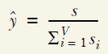

这些计算应该使您明白，大词汇量（对于现实世界的应用程序，其大小很容易达到数十万）将在模型训练期间的有限时间内执行此计算时会产生问题。在数千批数据上执行此操作会使问题变得更加严重。因此，已经出现了更好的技术来计算损失，而无需使用所有 logit。两种流行选择是

+   噪声对比估计（NCE）损失

+   分层 softmax

**噪声对比估计（NCE）**

我们将研究驱动这些方法的主要动机，但不会深入探讨具体细节，因为这被认为超出了本书的范围。有关这些主题的详细信息，请参阅[`ruder.io/word-embeddings-softmax`](https://ruder.io/word-embeddings-softmax)。NCE 仅使用由真实目标和 k 个随机 logit 样本（称为*噪声*）索引的 logit 来计算损失。您在噪声样本中匹配真实数据分布的越多，结果就越好。具体来说，如果真实目标是*s*，并且在索引*s*处的 logit 称为*s*[i]，则使用以下损失：

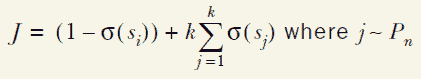

在这里，*σ*表示 sigmoid 激活是神经网络中常用的激活函数，并且计算为*σ* (*x*) = 1/(1 + *e*^(-x))，其中*s*[i]表示真实目标 i 的 logit 值，j 表示从词汇表*P*[n]上的预定义分布中采样的索引。

**分层 softmax**

与标准 softmax 不同，其中每个节点代表词汇表中的一个元素的平坦结构相比，分层 softmax 将词汇表中的单词表示为二叉树中的叶节点，并且任务变成选择向左还是向右以达到正确的节点。以下图示了形成过程

使用分层 softmax 时，计算层的最大层数。显然，为了推断给定前一序列的单词的概率，该层最多只需进行三步计算（由黑色路径表示），而不是评估所有七个可能的单词。

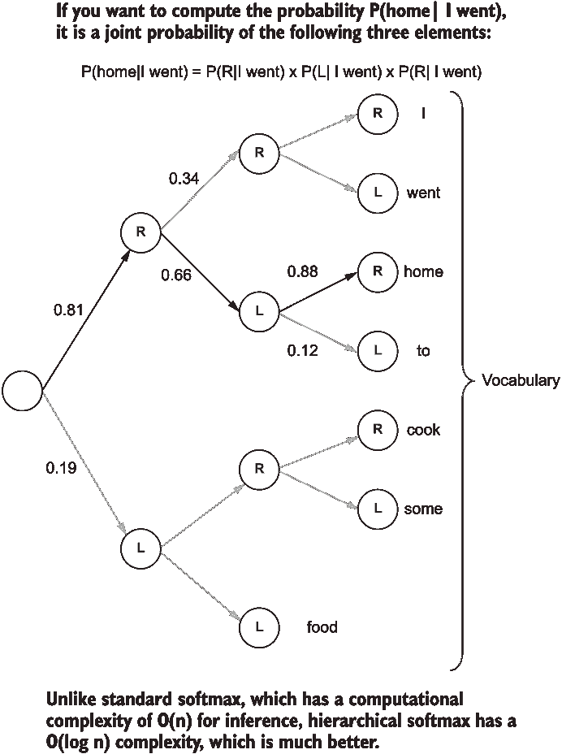

最终层的分层 softmax 表示。黑色路径表示模型必须遵循的路径，以计算 P(home| I went)的概率。

接下来，我们将看到如何在词汇量很大的情况下处理语言。

### 10.1.3 词汇量太大？N-gram 拯救

在这里，我们开始定义各种文本预处理器和数据流水线的第一步。我们怀疑在大词汇量的情况下继续前进会对我们的建模之旅产生不利影响。让我们找到一些减少词汇量的方法。鉴于儿童故事使用相对简单的语言风格，我们可以将文本表示为 n-gram（以牺牲我们模型的表达能力为代价）。 N-grams 是一种方法，其中单词被分解为固定长度的更细的子单词。例如，句子的二元组（或二元组）

```py
I went to the bookshop
```

是

```py
"I ", " w", "we", "en", "nt", "t ", " t", "to", "o ", "th", "he", "e ", " b", "bo", "oo", "ok", "ks", "sh", "ho", "op"
```

三个元组将是

```py
"I w", " we", "wen", "ent", "nt ", "t t", " to", "to ", "o t", " th", "the", "he ", "e b", " bo", "boo", "ook", "oks", "ksh", "sho", "hop"
```

单元组（或一元组）将简单地是各个字符。换句话说，我们正在移动一个固定长度的窗口（步长为 1），同时每次读取该窗口内的字符。您也可以通过将窗口移动到长度相等的步长来生成没有重叠的 n-gram。例如，没有重叠的二元组将是

```py
"I ", "we", "nt", " t", "o ", "th", "e ", "bo", "ok", "sh", "op"
```

使用哪种方法取决于您的用例。对于语言建模任务，使用非重叠方法是有意义的。这是因为通过连接我们生成的 n-gram，我们可以轻松生成可读的文本。对于某些用例，非重叠方法可能不利，因为它导致文本的表示更粗糙，因为它没有捕获文本中出现的所有不同的 n-gram。

通过使用二元组而不是单词来开发您的词汇表，您可以将词汇表的大小减少到一个显著的因子。随着我们很快会看到的 n-gram 方法的许多其他优势。我们将编写一个函数来生成给定文本字符串的 n-gram：

```py
def get_ngrams(text, n):
    return [text[i:i+n] for i in range(0,len(text),n)]
```

我们在这里所做的一切就是从文本的开头到结尾以步长 n 进行移动，并从位置 i 到 i+n 读取字符序列。我们可以测试这在样本文本上的表现如何：

```py
test_string = "I like chocolates"
print("Original: {}".format(test_string))
for i in list(range(3)):
    print("\t{}-grams: {}".format(i+1, get_ngrams(test_string, i+1)))
```

这将打印以下输出：

```py
Original: I like chocolates
    1-grams: ['I', ' ', 'l', 'i', 'k', 'e', ' ', 'c', 'h', 'o', 'c', 
➥ 'o', 'l', 'a', 't', 'e', 's']
    2-grams: ['I ', 'li', 'ke', ' c', 'ho', 'co', 'la', 'te', 's']
    3-grams: ['I l', 'ike', ' ch', 'oco', 'lat', 'es']
```

现在让我们重复使用 n-gram 而不是单词来分析词汇量的过程：

```py
from itertools import chain
from collections import Counter

# Create a counter with the bi-grams
ngrams = 2

text = chain(*[get_ngrams(s, ngrams) for s in stories])
cnt = Counter(text)

# Create a pandas series with the counter results
freq_df = pd.Series(list(cnt.values()), index=list(cnt.keys())).sort_values(ascending=False)
```

现在，如果我们检查文本中至少出现 10 次的单词数

```py
n_vocab = (freq_df>=10).sum()
print("Size of vocabulary: {}".format(n_vocab))
```

我们将会看到

```py
Size of vocabulary: 735
```

哇！与我们有的 15,000 个单词相比，735 个要小得多，更易于管理。

n-gram 的优势

这是使用 n-gram 而不是单词的主要优势之一：

+   对于小 n 的有限数量的 n-gram 限制了词汇表的大小，从而导致了记忆和计算优势。

+   N-grams 导致词汇表外单词的机会减少，因为通常可以使用过去看到的 n-grams 构造看不见的单词。

### 10.1.4 文本分词

我们现在将*对文本进行分词*（即，将字符串拆分为一组较小的标记——单词）。在本节结束时，您将已经为文本生成的二元组定义并拟合了一个标记生成器。首先，让我们从 TensorFlow 中导入 Tokenizer：

```py
from tensorflow.keras.preprocessing.text import Tokenizer
```

我们不需要进行任何预处理，希望将文本按原样转换为单词 ID。我们将定义 num_words 参数来限制词汇表的大小，以及一个 oov_token，该 token 将用于替换训练语料库中出现次数少于 10 次的所有 n-gram：

```py
tokenizer = Tokenizer(num_words=n_vocab, oov_token='unk', lower=False)
```

让我们从训练数据的故事中生成 n-gram。train_ngram_stories 将是一个字符串列表的列表，其中内部列表表示单个故事的二元组列表，外部列表表示训练数据集中的所有故事：

```py
train_ngram_stories = [get_ngrams(s,ngrams) for s in stories]
```

我们将在训练故事的二元组上拟合 Tokenizer：

```py
tokenizer.fit_on_texts(train_ngram_stories)
```

现在使用已经拟合 Tokenizer，该 Tokenizer 使用训练数据的二元组将所有训练、验证和测试故事转换为 ID 序列：

```py
train_data_seq = tokenizer.texts_to_sequences(train_ngram_stories)

val_ngram_stories = [get_ngrams(s,ngrams) for s in val_stories]
val_data_seq = tokenizer.texts_to_sequences(val_ngram_stories)

test_ngram_stories = [get_ngrams(s,ngrams) for s in test_stories]
test_data_seq = tokenizer.texts_to_sequences(test_ngram_stories)
```

通过打印一些测试数据来分析转换为单词 ID 后数据的样子。具体来说，我们将打印前三个故事字符串（test_stories）、n-gram 字符串（test_ngram_stories）和单词 ID 序列（test_data_seq）：

```py
Original: the yellow fairy book the cat and the mouse in par
n-grams: ['th', 'e ', 'ye', 'll', 'ow', ' f', 'ai', 'ry', ' b', 'oo', 'k ', 
➥ 'th', 'e ', 'ca', 't ', 'an', 'd ', 'th', 'e ', 'mo', 'us', 'e ', 'in', 
➥ ' p', 'ar']
Word ID sequence: [6, 2, 215, 54, 84, 35, 95, 146, 26, 97, 123, 6, 2, 128, 
➥ 8, 15, 5, 6, 2, 147, 114, 2, 17, 65, 52]

Original: chapter i. down the rabbit-hole alice was beginnin
n-grams: ['ch', 'ap', 'te', 'r ', 'i.', ' d', 'ow', 'n ', 'th', 'e ', 'ra', 
➥ 'bb', 'it', '-h', 'ol', 'e ', 'al', 'ic', 'e ', 'wa', 's ', 'be', 'gi', 
➥ 'nn', 'in']
Word ID sequence: [93, 207, 57, 19, 545, 47, 84, 18, 6, 2, 126, 344, 
➥ 38, 400, 136, 2, 70, 142, 2, 66, 9, 71, 218, 251, 17]

Original: a patent medicine testimonial `` you might as well
n-grams: ['a ', 'pa', 'te', 'nt', ' m', 'ed', 'ic', 'in', 'e ', 'te', 'st', 
➥ 'im', 'on', 'ia', 'l ', '``', ' y', 'ou', ' m', 'ig', 'ht', ' a', 's ', 
➥ 'we', 'll']
Word ID sequence: [60, 179, 57, 78, 33, 31, 142, 17, 2, 57, 50, 125, 43, 
➥ 266, 56, 122, 92, 29, 33, 152, 149, 7, 9, 103, 54]
```

### 10.1.5 定义一个 tf.data pipeline

现在预处理已经完成，我们将文本转换为单词 ID 序列。我们可以定义 tf.data pipeline，该 pipeline 将提供最终处理好的数据，准备好被模型使用。流程中涉及的主要步骤如图 10.1 所示。

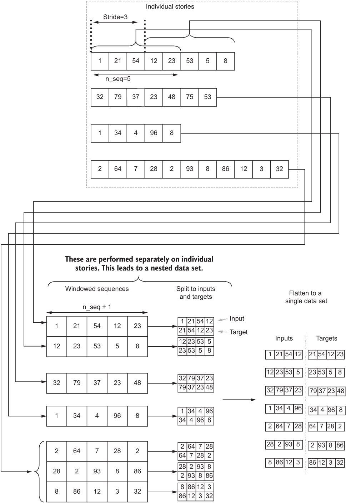

图 10.1 数据 pipeline 的高级步骤。首先将单个故事分解为固定长度的序列（或窗口）。然后，从窗口化的序列中生成输入和目标。

与之前一样，让我们将单词 ID 语料库定义为 tf.RaggedTensor 对象，因为语料库中的句子具有可变的序列长度：

```py
text_ds = tf.data.Dataset.from_tensor_slices(tf.ragged.constant(data_seq))     
```

请记住，不规则张量是具有可变大小维度的张量。然后，如果 shuffle 设置为 True（例如，训练时间），我们将对数据进行洗牌，以便故事以随机顺序出现：

```py
if shuffle:
    text_ds = text_ds.shuffle(buffer_size=len(data_seq)//2)    
```

现在来看棘手的部分。在本节中，我们将看到如何从任意长的文本中生成固定大小的窗口化序列。我们将通过一系列步骤来实现这一点。与 pipeline 的其余部分相比，本节可能略微复杂。这是因为将会有中间步骤导致三级嵌套的数据集。让我们尽可能详细地了解一下这一点。

首先，让我们清楚我们需要实现什么。我们需要为每个单独的故事 S 执行以下步骤：

+   创建一个包含故事 S 的单词 ID 的 tf.data.Dataset() 对象作为其项。

+   使用 n_seq+1 大小的窗口和预定义的移位调用 tf.data.Dataset.window() 函数来窗口化单词 ID，窗口() 函数为每个故事 S 返回一个 WindowDataset 对象。

之后，您将获得一个三级嵌套的数据结构，其规范为

```py
tf.data.Dataset(              # <- From the original dataset
  tf.data.Dataset(    # <- From inner dataset containing word IDs of story S only
    tf.data.WindowDataset(...)  # <- Dataset returned by the window() function
  )
)
```

我们需要展开这个数据集并解开数据集中的嵌套，最终得到一个平坦的 tf.data.Dataset。您可以使用 tf.data.Dataset.flat_map()函数来去除这些内部嵌套。我们将很快看到如何使用 flat_map()函数。具体来说，我们需要使用两个 flat_map 调用来去除两层嵌套，以便最终得到只包含简单张量作为元素的平坦原始数据集。在 TensorFlow 中，可以使用以下代码行来实现此过程：

```py
    text_ds = text_ds.flat_map(
        lambda x: tf.data.Dataset.from_tensor_slices(
            x
        ).window(
            n_seq+1,shift=shift
        ).flat_map(
            lambda window: window.batch(n_seq+1, drop_remainder=True)
        )
    )
    )
```

这里我们所做的是：首先，我们从一个单一的故事(x)创建一个 tf.data.Dataset 对象，然后在此上调用 tf.data.Dataset.window()函数以创建窗口序列。此窗口序列包含窗口，其中每个窗口都是故事 x 中 n_seq+1 个连续元素的序列。

然后我们调用 tf.data.Dataset.flat_map()函数，在每个窗口元素上，我们将所有单独的 ID 作为一个批次。换句话说，单个窗口元素会产生一个包含该窗口中所有元素的单个批次。确保使用 drop_remainder=True；否则，数据集将返回该窗口中包含较少元素的较小子窗口。使用 tf.data.Dataset.flat_map()而不是 map，确保去除最内层的嵌套。这整个过程称为 tf.data.Dataset.flat_map()调用，该调用立即消除了我们所删除的最内层嵌套后面的下一层嵌套。对于一行代码来说，这是一个相当复杂的过程。如果您还没有完全理解这个过程，我建议您再次仔细阅读一下。

您可能会注意到，我们把窗口大小定义为 n_seq+1 而不是 n_seq。稍后会看到这样做的原因，但是当我们需要从窗口序列生成输入和目标时，使用 n_seq+1 会让我们的生活变得更加容易。

tf.data.Dataset 中 map 和 flat_map 的区别

tf.data.Dataset.map()和 tf.data.Dataset.flat_map()这两个函数可以实现同样的结果，但具有不同的数据集规范。例如，假设数据集

```py
ds = tf.data.Dataset.from_tensor_slices([[1,2,3], [5,6,7]])
```

使用 tf.data.Dataset.map()函数对元素进行平方

```py
ds = ds.map(lambda x: x**2) 
```

将导致一个具有元素的数据集

```py
[[1, 4, 9], [25, 36, 49]]
```

如您所见，结果与原始张量具有相同的结构。使用 tf.data.Dataset.flat_map()函数对元素进行平方

```py
ds = ds.flat_map(lambda x: x**2)
```

将导致一个具有的数据集

```py
[1,4,9,25,36,49]
```

如您所见，该最内层嵌套已被展平，产生了一个平坦的元素序列。

我们数据管道中最困难的部分已经完成。现在，您已经有了一个平坦的数据集，每个项目都是属于单个故事的 n_seq+1 个连续单词 ID。接下来，我们将在数据上执行窗口级别的洗牌。这与我们进行的第一个洗牌不同，因为那是在故事级别上进行的（即不是窗口级别）：

```py
    # Shuffle the data (shuffle the order of n_seq+1 long sequences)
    if shuffle:
        text_ds = text_ds.shuffle(buffer_size=10*batch_size)    
```

然后，我们将批处理数据，以便每次迭代数据集时都会获得一批窗口：

```py
    # Batch the data
    text_ds = text_ds.batch(batch_size)    
```

最后，我们选择序列长度为 n_seq+1 的原因将变得更清晰。现在我们将序列分为两个版本，其中一个序列将是另一个向右移动 1 位的序列。换句话说，该模型的目标将是向右移动 1 位的输入。例如，如果序列是[0,1,2,3,4]，那么得到的两个序列将是[0,1,2,3]和[1,2,3,4]。此外，我们将使用预取来加速数据摄取：

```py
    # Split each sequence to an input and a target
    text_ds = tf.data.Dataset.zip(
        text_ds.map(lambda x: (x[:,:-1], x[:, 1:]))
    ).prefetch(buffer_size=tf.data.experimental.AUTOTUNE)    
```

最后，完整的代码可以封装在下一个清单中的函数中。

图 10.3 从自由文本序列创建的 tf.data 管道

```py
def get_tf_pipeline(data_seq, n_seq, batch_size=64, shift=1, shuffle=True):
    """ Define a tf.data pipeline that takes a set of sequences of text and 
    convert them to fixed length sequences for the model """

    text_ds = tf.data.Dataset.from_tensor_slices(tf.ragged.constant(data_seq))❶

    if shuffle:
        text_ds = text_ds.shuffle(buffer_size=len(data_seq)//2)               ❷

    text_ds = text_ds.flat_map(                                               ❸
        lambda x: tf.data.Dataset.from_tensor_slices(
            x
        ).window(
            n_seq+1, shift=shift
        ).flat_map(
            lambda window: window.batch(n_seq+1, drop_remainder=True)
        )
    ) 

    if shuffle:
        text_ds = text_ds.shuffle(buffer_size=10*batch_size)                  ❹

    text_ds = text_ds.batch(batch_size)                                       ❺

    text_ds = tf.data.Dataset.zip(
        text_ds.map(lambda x: (x[:,:-1], x[:, 1:]))
    ).prefetch(buffer_size=tf.data.experimental.AUTOTUNE)                     ❻

    return text_ds   
```

❶ 从数据 _seq 创建的不规则张量定义一个 tf.dataset。

❷ 如果设置了 shuffle，对数据进行洗牌（洗牌故事顺序）。

❸ 在这里，我们从更长的序列中创建窗口，给定窗口大小和偏移量，然后使用一系列 flat_map 操作来删除在此过程中创建的嵌套。

❹ 对数据进行洗牌（洗牌窗口生成的顺序）。

❺ 批量处理数据。

❻ 将每个序列拆分为输入和目标，并启用预取。

所有这些辛勤工作，如果不看生成的数据，就不会有太多意义。

```py
ds = get_tf_pipeline(train_data_seq, 5, batch_size=6)

for a in ds.take(1):
    print(a)
```

这将向您展示

```py
(
<tf.Tensor: shape=(6, 5), dtype=int32, numpy=
array([[161,  12,  69, 396,  17],
       [  2,  72,  77,  84,  24],
       [ 87,   6,   2,  72,  77],
       [276, 484,  57,   5,  15],
       [ 75, 150,   3,   4,  11],
       [ 11,  73, 211,  35, 141]])>, 
<tf.Tensor: shape=(6, 5), dtype=int32, numpy=
array([[ 12,  69, 396,  17,  44],
       [ 72,  77,  84,  24,  51],
       [  6,   2,  72,  77,  84],
       [484,  57,   5,  15,  67],
       [150,   3,   4,  11,  73],
       [ 73, 211,  35, 141,  98]])>
)
```

很好，你可以看到我们得到了一个张量元组作为单个批处理：输入和目标。此外，您可以验证结果的正确性，因为我们清楚地看到目标是向右移动 1 位的输入。最后一件事：我们将将相同的超参数保存到磁盘上。

+   n-gram 中的 n

+   词汇量大小

+   序列长度

```py
print("n_grams uses n={}".format(ngrams))
print("Vocabulary size: {}".format(n_vocab))

n_seq=100
print("Sequence length for model: {}".format(n_seq))

with open(os.path.join('models', 'text_hyperparams.pkl'), 'wb') as f:
    pickle.dump({'n_vocab': n_vocab, 'ngrams':ngrams, 'n_seq': n_seq}, f)
```

在这里，我们定义序列长度 n_seq=100；这是单个输入/标签序列中我们将拥有的二元组数目。

在本节中，我们了解了用于语言建模的数据，并定义了一个强大的 tf.data 管道，该管道可以将文本序列转换为可直接用于训练模型的输入标签序列。接下来，我们将定义一个用于生成文本的机器学习模型。

练习 1

你有一个序列 x，其值为[1,2,3,4,5,6,7,8,9,0]。你被要求编写一个 tf.data 管道，该管道生成一个输入和目标元组，其中目标是将输入向右移动两个元素（即，输入 1 的目标是 3）。你必须这样做，以便一个单独的输入/目标具有三个元素，并且连续输入序列之间没有重叠。对于前面的序列，它应该生成[([1,2,3], [3,4,5]), ([6,7,8], [8,9,0])]。

## 10.2 仙境中的 GRU：使用深度学习生成文本

现在我们来到了有奖励的部分：实现一个酷炫的机器学习模型。在上一章中，我们讨论了深度时序模型。鉴于数据的时序性，你可能已经猜到我们将使用其中之一深度时序模型，比如 LSTMs。在本章中，我们将使用一个略有不同的模型，称为*门控循环单元*（GRUs）。驱动该模型计算的原理与 LSTMs 相同。为了保持我们讨论的清晰度，值得提醒自己 LSTM 模型是如何工作的。

LSTM 是一类专门设计用于处理时序数据的深度神经网络。它们逐个输入地处理一系列输入。LSTM 单元从一个输入到下一个输入，同时在每个时间步产生输出（或状态）（图 10.2）。此外，为了产生给定时间步的输出，LSTMs 使用了它产生的先前输出（或状态）。这个属性对于 LSTMs 非常重要，使它们能够随时间记忆事物。

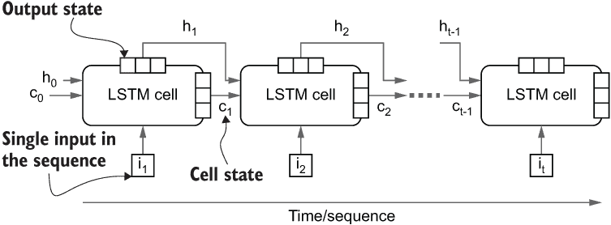

图 10.2 LSTM 模型概述以及它如何处理随时间展开的输入序列

让我们总结一下我们在上一章中学到的关于 LSTMs 的知识，因为这将帮助我们比较 LSTMs 和 GRUs。一个 LSTM 有两个状态，称为单元状态和输出状态。单元状态负责维护长期记忆，而输出状态可以被视为短期记忆。在 LSTM 单元内部，输出和中间结果受三个门的控制：

+   *输入门*——控制了在给定时间步中当前输入的多少会对最终输出产生影响

+   *遗忘门*——控制了多少先前的单元状态影响当前单元状态的计算

+   *输出门*——控制了当前单元状态对 LSTM 模型产生的最终输出的贡献

GRU 模型是在 Cho 等人的论文“Learning Phrase Representations using RNN Encoder-Decoder for Statistical Machine Translation”中介绍的（[`arxiv.org/pdf/1406.1078v3.pdf`](https://arxiv.org/pdf/1406.1078v3.pdf)）。GRU 模型可以被认为是 LSTM 模型的简化，同时保持了相当的性能。GRU 单元有两个门：

+   *更新门*（*z*[t]）——控制了多少先前的隐藏状态传递到当前的隐藏状态

+   *重置门*（*r*[t]）——控制了多少隐藏状态与新输入一起被重置

与 LSTM 单元不同，GRU 单元只有一个状态向量。总的来说，与 LSTM 模型相比，GRU 有两个主要变化：

+   输入门和遗忘门被合并成一个称为更新门的门（*z*[t]）。输入门被计算为（1-*z*[t]），而遗忘门保持*z*[t]。

+   与 LSMT 单元中的两个状态（即单元状态和输出状态）相比，这里只有一个状态（*h*[t]）。

图 10.3 描述了 GRU 单元的各个组件。以下是构成 GRU 单元的方程式的完整列表：

*r*[t] = σ(*W*[rh]*h*[t-1] + *W*[rx]*x*[t] + *b*[r])

*z*[t] = σ(*W*[zh]*h*[t-1] + *W*[zx]*x*[t] + *b*[z])

*h̃*[t] = tanh(*W*[h]*(rh*[t-1]) + *W*[x]*x*[t] + *b*)

*h*[t] = (*z*[th]*h*[t-1] + (1 - *z*[t] )*h̃*[t]

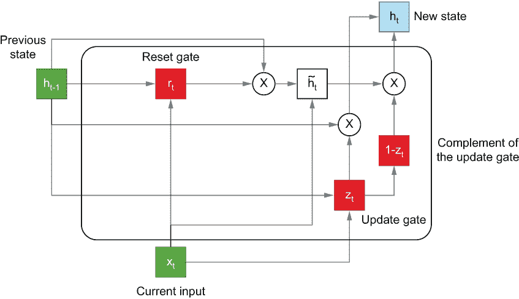

图 10.3 GRU 单元中发生的计算概览

这次讨论对于理解 GRU 模型不仅非常有帮助，还有助于了解它与 LSTM 单元的区别。你可以在 TensorFlow 中如下定义一个 GRU 单元：

```py
tf.keras.layers.GRU(units=1024, return_state=False, return_sequences=True)
```

参数 units、return_state 和 return_sequences 的含义与 LSTM 单元的上下文中相同。然而，注意 GRU 单元只有一个状态；因此，如果 return_state=true，则会将相同的状态复制以模拟 LSTM 层的输出状态和单元状态。图 10.4 显示了这些参数对于 GRU 层的作用。

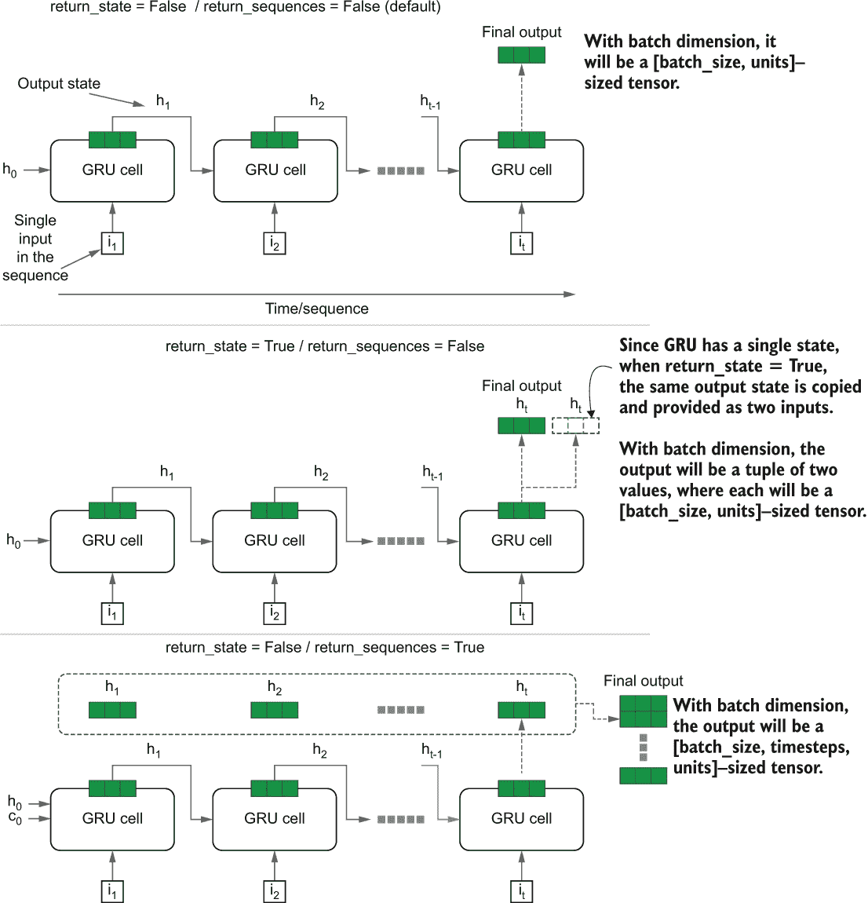

图 10.4 根据 GRU 单元的 return_state 和 return_sequences 参数的不同返回结果的变化

我们现在知道了定义最终模型所需的一切（清单 10.4）。我们的最终模型将包括

+   一个嵌入层

+   一个 GRU 层（1,024 个单元），将所有最终状态向量作为一个形状为 [批量大小，序列长度，单元数] 的张量返回

+   一个具有 512 个单元和 ReLU 激活的 Dense 层

+   一个具有 n_vocab 个单元和 softmax 激活的 Dense 层

清单 10.4 实现语言模型

```py
model = tf.keras.models.Sequential([
    tf.keras.layers.Embedding(
        input_dim=n_vocab+1, output_dim=512,input_shape=(None,)           ❶
    ),

    tf.keras.layers.GRU(1024, return_state=False, return_sequences=True), ❷

    tf.keras.layers.Dense(512, activation='relu'),                        ❸

    tf.keras.layers.Dense(n_vocab, name='final_out'),                     ❹
    tf.keras.layers.Activation(activation='softmax')                      ❹
])
```

❶ 定义一个嵌入层以学习 bigrams 的单词向量。

❷ 定义一个 LSTM 层。

❸ 定义一个 Dense 层。

❹ 定义一个最终的 Dense 层和 softmax 激活。

你会注意到，在 GRU 后的 Dense 层接收到一个三维张量（而不是传递给 Dense 层的典型二维张量）。Dense 层足够智能，能够处理二维和三维输入。如果输入是三维的（就像在我们的情况下），那么将一个接受 [批量大小，单元数] 张量的 Dense 层通过所有步骤传递序列以生成 Dense 层的输出。还要注意我们是如何将 softmax 激活与 Dense 层分开的。这实际上等价于

```py
.Dense(n_vocab, activation=’softmax’, name=’final_out’)
```

我们不会通过重复在清单 10.4 中显示的内容来拖延对话，因为这已经是不言而喻的。

练习 2

你已经获得了以下模型，并被要求在现有的 GRU 层之上添加另一个具有 512 个单元并返回所有状态输出的 GRU 层。你将对以下代码做出什么改变？

```py
model = tf.keras.models.Sequential([
    tf.keras.layers.Embedding(
        input_dim=n_vocab+1, output_dim=512,input_shape=(None,)   
    ),
    tf.keras.layers.GRU(1024, return_state=False, return_sequences=True),   
    tf.keras.layers.Dense(n_vocab, activation=’softmax’, name='final_out'), ])
```

在这一节中，我们学习了门控循环单元（GRUs）以及它们与 LSTMs 的比较。最后，我们定义了一个可以在我们之前下载并处理的数据上进行训练的语言模型。在下一节中，我们将学习用于评估生成文本质量的评估指标。

## 10.3 测量生成文本的质量

性能监控已经成为我们在每一章节模型之旅中不可或缺的一部分。在这里也不例外。性能监控是我们语言模型的一个重要方面，我们需要找到适合语言模型的度量标准。自然地，考虑到这是一个分类任务，你可能会想，“准确率不是一个很好的度量标准吗？”嗯，在这个任务中不完全是这样。

例如，如果语言模型得到了句子“I like my pet dog”，然后当要求预测给定“我喜欢我的宠物 ____”时缺失的单词，模型可能会预测“猫”，准确率为零。但这是不正确的；在这个例子中，“猫”和“狗”一样有意义。这里有更好的解决方案吗？

这就是困惑度！直观地，*困惑度* 衡量了模型看到前一个词序列后看到目标词时的“惊讶程度”。在理解困惑度之前，你需要了解“熵”是什么意思。

*熵* 是由著名的克劳德·香农创造的一个术语，他被认为是信息论之父。熵度量了事件的惊奇程度/不确定性/随机性。事件可以由概率分布生成所有可能的结果之一。例如，如果你考虑抛硬币（以概率 p 出现正面）是一个事件，如果 p = 0.5，那么你将有最大的熵，因为这是抛硬币最不确定的情况。如果 p = 1 或 p = 0，则熵最小，因为在抛硬币之前你知道结果是什么。

熵的原始解释是发送信号或消息通知事件所需的位数的期望值。位是内存的单位，可以是 1 或 0。例如，你是一支与 A 国和 B 国交战的军队的指挥官。现在有四种可能性：A 和 B 都投降，A 赢了 B 输了，A 输了 B 赢了，以及 A 和 B 都赢了。如果所有这些事件发生的可能性都是相等的，你需要两位来发送消息，其中每一位表示那个国家是否获胜。随机变量 X 的熵由方程式量化

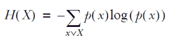

其中 *x* 是 *X* 的一个结果。信不信由你，每次我们使用分类交叉熵损失时，我们都在不知不觉中使用了这个方程式。分类交叉熵的关键就在于这个方程式。回到困惑度度量，困惑度就是简单地

*困惑度 =* 2^(H(X))

由于困惑度是熵的一个函数，它衡量了模型看到目标词时的惊讶程度/不确定性，考虑了前一个词序列。困惑度也可以被认为是给定信号的所有可能组合的数量。例如，假设你发送一个带有两位的消息，所有事件都是等可能的；那么熵 = 2，这意味着困惑度 = 2² = 4。换句话说，两位可以有四种组合：00、01、10 和 11。

从建模角度来看，你可以将困惑度理解为在给定一系列前序词的情况下，模型认为有多少不同的目标适合作为下一个词的空白。这个数字越小越好，因为这意味着模型试图从更小的子集中找到一个词，表明语言理解的迹象。

要实现困惑度，我们将定义一个自定义指标。计算非常简单。我们计算分类交叉熵，然后对其进行指数化以获得困惑度。分类交叉熵简单地是熵的扩展，用于在具有两个以上类别的分类问题中测量熵。对于输入示例（*x*[i],*y*[i]），它通常定义为

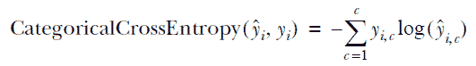

其中*y[i]*表示真实类别示例所属的独热编码向量，*ŷ*[i]是*C*个元素的预测类别概率向量，其中*ŷ*[i,c]表示示例属于类别*c*的概率。请注意，在实践中，计算更快的是使用指数（自然）基数，而不是使用 2 作为基数。以下清单描述了这个过程。

10.5 实现困惑度指标

```py
import tensorflow.keras.backend as K

class PerplexityMetric(tf.keras.metrics.Mean):

    def __init__(self, name='perplexity', **kwargs):
      super().__init__(name=name, **kwargs)
      self.cross_entropy = tf.keras.losses.SparseCategoricalCrossentropy(
         from_logits=False, reduction='none'
       )

    def _calculate_perplexity(self, real, pred):   ❶

      loss_ = self.cross_entropy(real, pred)       ❷

      mean_loss = K.mean(loss_, axis=-1)           ❸
      perplexity = K.exp(mean_loss)                ❹

      return perplexity 

    def update_state(self, y_true, y_pred, sample_weight=None):            
      perplexity = self._calculate_perplexity(y_true, y_pred)
      super().update_state(perplexity)
```

❶ 定义一个函数来计算给定真实和预测目标的困惑度。

❷ 计算分类交叉熵损失。

❸ 计算损失的均值。

❹ 计算均值损失的指数（困惑度）。

我们正在做的事情非常简单。首先，我们对 tf.keras.metrics.Mean 类进行子类化。tf.keras.metrics.Mean 类将跟踪传递给其 update_state()函数的任何输出指标的均值。换句话说，当我们对 tf.keras.metrics.Mean 类进行子类化时，我们不需要手动计算累积困惑度指标的均值，因为训练继续进行。这将由该父类自动完成。我们将定义我们将在 self.cross_entropy 变量中使用的损失函数。然后，我们编写函数 _calculate_perplexity()，该函数接受模型的真实目标和预测。我们计算逐样本损失，然后计算均值。最后，为了得到困惑度，我们对均值损失进行指数化。有了这个，我们可以编译模型：

```py
model.compile(
    loss='sparse_categorical_crossentropy', 
    optimizer='adam', 
    metrics=['accuracy', PerplexityMetric()]
)
```

在本节中，我们学习了用于评估语言模型的性能指标，如熵和困惑度。此外，我们实现了一个自定义的困惑度指标，用于编译最终模型。接下来，我们将在准备好的数据上训练我们的模型，并评估生成文本的质量。

练习 3

想象一个有三个输出的分类问题。有两种不同预测的情况：

情景 A：标签 [0, 2, 1]

预测：[[0.6, 0.2, 0.2], [0.1, 0.1, 0.8], [0.3, 0.5, 0.2]]

情景 B：标签 [0, 2, 1]

预测：[[0.3, 0.3, 0.4], [0.4, 0.3, 0.3], [0.3, 0.3, 0.4]]

哪一个会有最低的困惑度？

## 10.4 训练和评估语言模型

在这一部分中，我们将训练模型。在训练模型之前，让我们使用之前实现的 get_tf_pipeline()函数来实例化训练和验证数据集。我们将只使用前 50 个故事（共 98 个）作为训练集，以节省时间。我们每次取 100 个二元组作为一个序列，通过移动窗口来跳过故事，每次移动 25 个二元组。这意味着单个故事序列的起始索引是 0、25、50 等等。我们将使用批大小为 128：

```py
n_seq = 100
train_ds = get_tf_pipeline(
    train_data_seq[:50], n_seq, stride=25, batch_size=128
)
valid_ds = get_tf_pipeline(
    val_data_seq, n_seq, stride=n_seq, batch_size=128
)
```

要训练模型，我们将像以前一样定义回调。我们将定义

+   一个 CSV 记录器，将在训练期间记录性能

+   一个学习率调度器，当性能达到平台期时会减小学习率

+   如果性能没有提高，则使用早期停止回调来终止训练。

```py
os.makedirs('eval', exist_ok=True)

csv_logger = 
➥ tf.keras.callbacks.CSVLogger(os.path.join('eval','1_language_modelling.
➥ log'))

monitor_metric = 'val_perplexity'
mode = 'min' 
print("Using metric={} and mode={} for EarlyStopping".format(monitor_metric, mode))

lr_callback = tf.keras.callbacks.ReduceLROnPlateau(
    monitor=monitor_metric, factor=0.1, patience=2, mode=mode, min_lr=1e-8
)

es_callback = tf.keras.callbacks.EarlyStopping(
    monitor=monitor_metric, patience=5, mode=mode, 
➥ restore_best_weights=False
)
```

最后，是时候训练模型了。我想知道我能从训练好的模型中挤出什么样的酷故事：

```py
model.fit(train_ds, epochs=50,  validation_data = valid_ds, 
➥ callbacks=[es_callback, lr_callback, csv_logger])
```

注意 在配有 NVIDIA GeForce RTX 2070 8 GB 的 Intel Core i5 机器上，训练大约需要 1 小时 45 分钟运行 25 个 epochs。

训练模型后，您将看到接近 9.5 的验证困惑度。换句话说，这意味着对于给定的单词序列，模型认为可能有 9.5 个不同的下一个单词是正确的单词（不完全准确，但是这是一个足够接近的近似值）。困惑度需要仔细判断，因为其好坏倾向于主观。例如，随着词汇量的增加，这个数字可能会上升。但这并不一定意味着模型不好。数字之所以上升是因为模型看到了更多适合场合的词汇，与词汇量较小时相比。

我们将在测试数据上评估模型，以了解我们的模型可以多大程度地预测一些未见的故事，而不会感到惊讶：

```py
batch_size = 128
test_ds = get_tf_pipeline(
    test_data_seq, n_seq, shift=n_seq, batch_size=batch_size
)
model.evaluate(test_ds)
```

这将给您约

```py
61/61 [==============================] - 2s 39ms/step - loss: 2.2620 - 
➥ accuracy: 0.4574 - perplexity: 10.5495
```

与我们看到的验证性能相当。最后，保存模型

```py
os.makedirs('models', exist_ok=True)
tf.keras.models.save_model(model, os.path.join('models', '2_gram_lm.h5'))
```

在本节中，您学习了如何训练和评估模型。您在训练数据集上训练了模型，并在验证和测试集上评估了模型。在接下来的部分中，您将学习如何使用训练好的模型生成新的儿童故事。然后，在接下来的部分中，您将学习如何使用我们刚刚训练的模型生成文本。

练习 4

假设您想使用验证准确性（val_accuracy）而不是验证困惑度（val_perplexity）来定义早期停止回调。您将如何更改以下回调？

```py
es_callback = tf.keras.callbacks.EarlyStopping(
    monitor=’val_perlexity’, patience=5, mode=’min’, 
➥ restore_best_weights=False
)
```

## 10.5 从语言模型生成新文本：贪婪解码

语言模型最酷的一点是其具有的生成特性。这意味着模型可以生成新数据。在我们的情况下，语言模型可以利用从训练阶段获取的知识生成新的儿童故事。

但要这么做，我们必须付出额外的努力。文本生成过程与训练过程不同。训练期间我们拥有完整的序列，可以一次性处理任意长度的序列。但是在生成新的文本时，你没有一个可用的文本序列；事实上，你正在尝试生成一个。你从一个随机的词开始，得到一个输出词，然后递归地将当前输出作为下一个输入来生成新的文本。为了促进这个过程，我们需要定义训练模型的一个新版本。让我们更详细地阐述生成过程。图 10.5 比较了训练过程和生成/推理过程。

+   定义一个初始单词*w*t。

+   定义一个初始状态向量*h*t。

+   定义一个列表 words，用于保存预测的单词，并将其初始化为初始单词。

+   对于 t 从 1 到 n：

    +   从模型中获取下一个单词(*w*[t+1])和状态向量(*h*[t+1])并分别赋值给*w*[t]和*h*[t]，这样就创建了一个递归过程，使我们能够生成尽可能多的单词。

    +   将新单词添加到 words 中。

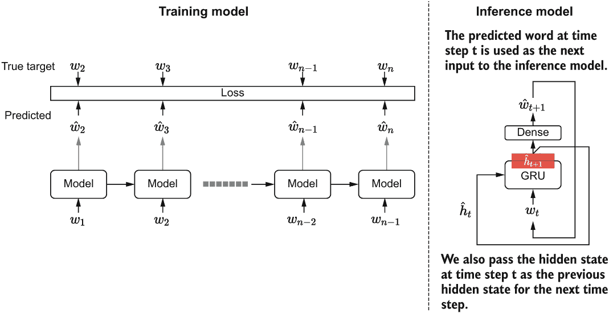

图 10.5 训练时间和推断/解码阶段的语言模型比较。在推断阶段，我们逐个时间步预测。在每个时间步中，我们将预测的单词作为输入，将新的隐藏状态作为下一个时间步的先前隐藏状态。

我们将使用 Keras 的函数式 API 构建这个模型，如下一个列表所示。首先，让我们定义两个输入。

列表 10.6 是推断/解码语言模型的实现。

```py
inp = tf.keras.layers.Input(shape=(None,))                                 ❶
inp_state = tf.keras.layers.Input(shape=(1024,))                           ❷

emb_layer = tf.keras.layers.Embedding(
    input_dim=n_vocab+1, output_dim=512, input_shape=(None,)
)                                                                          ❸
emb_out = emb_layer(inp)                                                   ❹

gru_layer = tf.keras.layers.GRU(
    1024, return_state=True, return_sequences=True
)
gru_out, gru_state = gru_layer(emb_out, initial_state=inp_state)         ❺❻

dense_layer = tf.keras.layers.Dense(512, activation='relu')                ❼
dense_out = dense_layer(gru_out)                                           ❼

final_layer = tf.keras.layers.Dense(n_vocab, name='final_out')             ❽
final_out = final_layer(dense_out)                                         ❽
softmax_out = tf.keras.layers.Activation(activation='softmax')(final_out)  ❽

infer_model = tf.keras.models.Model(
    inputs=[inp, inp_state], outputs=[softmax_out, gru_state]
)                                                                          ❾
```

❶ 定义一个能够接受任意长度的单词 ID 序列的输入。

❷ 定义另一个输入，将上一个状态输入进去。

❸ 定义一个嵌入层。

❹ 从输入的单词 ID 中获取嵌入向量。

❺ 定义一个 GRU 层，返回输出和状态。但要注意，对于 GRU 来说它们是相同的。

❻ 从模型中获取 GRU 输出和状态。

❼ 计算第一个全连接层的输出。

❽ 定义一个与词汇表大小相同的最终层，并获取模型的最终输出。

❾ 定义最终模型，该模型接受一个输入和一个状态向量作为输入，并产生下一个单词预测和新的状态向量作为输出。

在定义模型之后，我们必须执行一个重要的步骤。我们必须将训练模型的权重转移到新定义的推断模型中。为此，我们必须识别具有可训练权重的层，从训练模型中获取这些层的权重，并将它们分配给新模型：

```py
# Copy the weights from the original model
emb_layer.set_weights(model.get_layer('embedding').get_weights())
gru_layer.set_weights(model.get_layer('gru').get_weights())
dense_layer.set_weights(model.get_layer('dense').get_weights())
final_layer.set_weights(model.get_layer('final_out').get_weights())
```

要获取训练模型中特定层的权重，可以调用

```py
model.get_layer(<layer name>).get_weights()
```

将返回一个带有权重的 NumPy 数组。接下来，为了将这些权重分配给一个层，调用

```py
layer.set_weights(<weight matrix>)
```

现在我们可以递归地调用新定义的模型来生成任意数量的 bigram。我们将更详细地讨论如何进行这个过程。我们将不再从一个随机单词开始，而是从一段文本序列开始。我们将使用 Tokenizer 将文本转换为 bigrams，然后再转换为单词 ID：

```py
text = get_ngrams(
    "CHAPTER I. Down the Rabbit-Hole Alice was beginning to get very tired 
➥ of sitting by her sister on the bank ,".lower(), 
    ngrams
)

seq = tokenizer.texts_to_sequences([text])
```

接下来，让我们重置模型的状态（这在这里不是必需的，因为我们是从头开始，但了解我们可以这样做很好）。我们将定义一个全零的状态向量：

```py
# Reset the state of the model initially
model.reset_states()
# Defining the initial state as all zeros
state = np.zeros(shape=(1,1024))
```

然后，我们将递归地对 seq 变量中的每个 bigram 进行预测，以更新 GRU 模型的状态。一旦我们遍历整个序列，我们将得到最终预测的 bigram（它将成为我们的第一个预测的 bigram），并将其附加到原始的 bigram 序列中：

```py
# Recursively update the model by assining new state to state
for c in seq[0]:    
    out, state = infer_model.predict([np.array([[c]]), state])

# Get final prediction after feeding the input string
wid = int(np.argmax(out[0],axis=-1).ravel())
word = tokenizer.index_word[wid]
text.append(word)
```

我们将使用上一个预测的最后一个单词的 ID 来定义一个新的输入 x：

```py
# Define first input to generate text recursively from
x = np.array([[wid]])
```

现在开始有趣的部分。我们将使用之前讨论的方法来预测 500 个 bigram（即 1,000 个字符）。在每次迭代中，我们使用输入 x 和状态向量 state，通过 infer_model 来预测一个新的 bigram 和一个新的状态。然后，我们将这些新的输出递归地替换 x 和 state 变量（请参见下一个列表）。

列表 10.7 使用先前的单词作为输入递归预测新单词

```py
for _ in range(500):

    out, state = infer_model.predict([x, state])                   ❶

    out_argsort = np.argsort(out[0], axis=-1).ravel()              ❷
    wid = int(out_argsort[-1])                                     ❷
    word = tokenizer.index_word[wid]                               ❷

    if word.endswith(' '):                                         ❸
        if np.random.normal()>0.5:
            width = 3                                              ❹
            i = np.random.choice(                                  ❹
                list(range(-width,0)), 
                p=out_argsort[-width:]/out_argsort[-width:].sum()
            )    
            wid = int(out_argsort[i])                              ❹
            word = tokenizer.index_word[wid]                       ❹
    text.append(word)                                              ❺

    x = np.array([[wid]])                                          ❻
```

❶ 获取下一个输出和状态。

❷ 从输出中获取单词 ID 和单词。

❸ 如果单词以空格结尾，我们引入了一点随机性来打破重复文本。

❹ 根据它们的可能性，从该时间步的前三个输出中选择一个输出。

❺ 累积地将预测附加到文本中。

❻ 递归地将当前预测作为下一个输入。

请注意，需要一些工作才能得到 x 的最终值，因为模型预测的是一个概率预测（赋值给 out），而不是一个单词 ID。此外，我们将使用一些附加的逻辑来提高生成文本中的随机性（或者可以说是熵），通过从前三个单词中随机选择一个单词。但我们不以相等的概率选择它们。相反，让我们使用它们的预测概率来预测单词。为了确保我们不会获得过多的随机性，并避免在单词中间获得随机调整，只有当最后一个字符是空格字符时，才这样做。最终的单词 ID（可以是具有最高概率的单词或随机选择的单词）被赋值给变量 x。这个过程将重复进行 500 步，到最后，你将拥有一个酷炫的机器生成的故事。你可以打印出最终的文本查看其效果。要做到这一点，只需将 bigrams 按照下面的方式连接在文本序列中：

```py
# Print the final output    
print('\n')
print('='*60)
print("Final text: ")
print(''.join(text))
```

这将显示

```py
Final text: 
chapter i. down the rabbit-hole alice was beginning to get very tired of 
➥ sitting by her sister on the bank , and then they went to the shore , 
➥ and then the princess was so stilling that he was a little girl , 

...

 it 's all right , and i 'll tell you how young things would n't be able to 
➥ do it .
 i 'm not goin ' to think of itself , and i 'm going to be sure to see you .
 i 'm sure i can notice them .
 i 'm going to see you again , and i 'll tell you what i 've got , '
```

对于简单的单层 GRU 模型来说，这当然不算差。 大多数情况下，模型会输出实际单词。 但是偶尔会出现拼写错误和更频繁的语法错误困扰文本。 我们能做得更好吗？ 在下一节中，我们将学习一种称为光束搜索的新技术，用于生成文本。

练习 5

假设您有以下代码，该代码选择下一个单词时没有随机性。 您运行此代码并意识到结果非常糟糕：

```py
for _ in range(500):

    out, new_s = infer_model.predict([x, s])                                    

    out_argsort = np.argsort(out[0], axis=-1).ravel()                               
    wid = int(out_argsort[-1])                                                      
    word = tokenizer.index_word[wid]

    text.append(word)                                                               

    x = np.array([[wid]])       
```

你认为性能不佳的原因是什么？

## 10.6 光束搜索：增强序列模型的预测能力

我们可以比贪婪解码做得更好。 光束搜索是一种流行的解码算法，用于像这样的序列/时间序列任务中生成更准确的预测。 光束搜索背后的思想非常简单。 与贪婪解码不同，贪婪解码预测单个时间步长，而光束搜索预测多个时间步长。 在每个时间步长，您获得前 k 个预测并从中分支出。 光束搜索具有两个重要参数：光束宽度和光束深度。 光束宽度控制每个步骤考虑的候选项数，而光束深度确定要搜索的步骤数。 例如，对于光束宽度为 3 和光束深度为 5，可能的选项数为 3⁵ = 243。 图 10.6 进一步说明了光束搜索的工作原理。

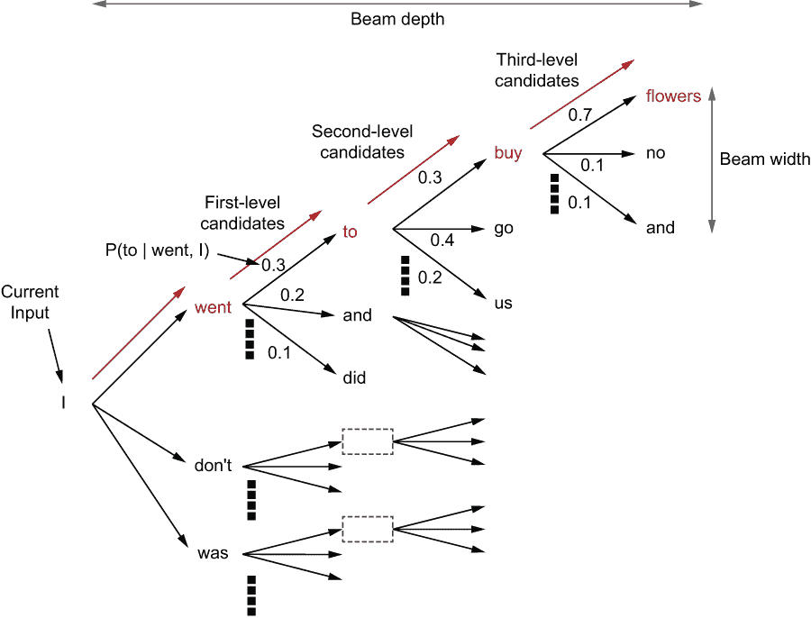

图 10.6 光束搜索的示例。 光束搜索会预测未来几步以进行预测，从而导致更好的解决方案。 在这里，我们正在执行光束搜索，光束宽度为 3，光束深度为 5。

首先，让我们定义一个函数，该函数将接受模型、输入和状态，并返回输出和新状态：

```py
def beam_one_step(model, input_, state):    
    """ Perform the model update and output for one step"""
    output, new_state = model.predict([input_, state])
    return output, new_state
```

然后，使用这个函数，我们将定义一个递归函数（recursive_fn），该函数将从预定义深度（由 beam_depth 定义）递归地预测前一次预测的下一个单词。在每个时间步长，我们考虑从中分支出的前 k 个候选项（由 beam_width 定义）。递归函数将填充一个名为 results 的变量。results 将包含一个元组列表，其中每个元组表示搜索中的单个路径。具体来说，每个元组包含

+   路径中的元素

+   该序列的联合对数概率

+   传递给 GRU 的最终状态向量

这个函数在下面的列表中概述。

将束搜索实现为递归函数的列表 10.8

```py
def beam_search(
    model, input_, state, beam_depth=5, beam_width=3, ignore_blank=True
):                                                                           ❶
    """ Defines an outer wrapper for the computational function of beam 
➥ search """

    def recursive_fn(input_, state, sequence, log_prob, i):                  ❷
        """ This function performs actual recursive computation of the long 
➥ string"""

        if i == beam_depth:                                                  ❸
            """ Base case: Terminate the beam search """
            results.append((list(sequence), state, np.exp(log_prob)))        ❹
            return sequence, log_prob, state                                 ❹
        else:
            """ Recursive case: Keep computing the output using the 
➥ previous outputs"""
            output, new_state = beam_one_step(model, input_, state)          ❺

            # Get the top beam_widht candidates for the given depth
            top_probs, top_ids = tf.nn.top_k(output, k=beam_width)           ❻
            top_probs, top_ids = top_probs.numpy().ravel(), 
➥ top_ids.numpy().ravel()                                                   ❻

            # For each candidate compute the next prediction
            for p, wid in zip(top_probs, top_ids):                           ❼
                new_log_prob = log_prob + np.log(p)                          ❼
                if len(sequence)>0 and wid == sequence[-1]:                  ❽
                    new_log_prob = new_log_prob + np.log(1e-1)               ❽

                sequence.append(wid)                                         ❾
                _ = recursive_fn(
                    np.array([[wid]]), new_state, sequence, new_log_prob, i+1❿
                )                                         
                sequence.pop()

    results = []
    sequence = []
    log_prob = 0.0
    recursive_fn(input_, state, sequence, log_prob, 0)                       ⓫

    results = sorted(results, key=lambda x: x[2], reverse=True)              ⓬

    return results
```

❶ 为光束搜索的计算函数定义一个外部包装器。

❷ 定义一个内部函数，该函数递归调用以找到光束路径。

❸ 定义递归终止的基本情况。

❹ 将终止时得到的结果追加到结果中，以便稍后使用。

❺ 在递归过程中，通过调用模型获取输出单词和状态。

❻ 获取该步骤的前 k 个候选项。

❼ 对于每个候选项，计算联合概率。 为了具有数值稳定性，我们将在对数空间中执行此操作。

❽ 每当相同的符号重复时，惩罚联合概率。

❾ 将当前候选项追加到维护当前搜索路径的序列中。

❿ 递归调用函数以找到下一个候选项。

⓫ 调用递归函数以触发递归。

⓬ 根据对数概率对结果进行排序。

最后，我们可以使用这个 beam_search 函数如下：我们将使用 7 的束深度和 2 的束宽。直到 for 循环之前，事情都与我们使用贪婪解码时完全相同。在 for 循环中，我们得到结果列表（按联合概率从高到低排序）。然后，类似于我们以前做的，我们将基于它们的可能性作为下一个预测从前 10 个预测中随机获取下一个预测。以下清单详细说明了这样做的代码。

清单 10.9 实现束搜索解码以生成新故事

```py
text = get_ngrams(
    "CHAPTER I. Down the Rabbit-Hole Alice was beginning to get very tired 
➥ of sitting by her sister on the bank ,".lower(),     
    ngrams
)                                                                ❶

seq = tokenizer.texts_to_sequences([text])                       ❷

state = np.zeros(shape=(1,1024))
for c in seq[0]:    
    out, state = infer_model.predict([np.array([[c]]), state     ❸

wid = int(np.argmax(out[0],axis=-1).ravel())                     ❹
word = tokenizer.index_word[wid]                                 ❹
text.append(word)                                                ❹

x = np.array([[wid]])

for i in range(100):                                             ❺

    result = beam_search(infer_model, x, state, 7, 2)            ❻

    n_probs = np.array([p for _,_,p in result[:10                ❼
    p_j = np.random.choice(list(range(
       n_probs.size)), p=n_probs/n_probs.sum())                  ❼

    best_beam_ids, state, _ = result[p_j]                        ❽
    x = np.array([[best_beam_ids[-1]]])                          ❽

    text.extend([tokenizer.index_word[w] for w in best_beam_ids])

print('\n')
print('='*60)
print("Final text: ")
print(''.join(text))
```

❶ 从初始文本序列中定义一系列 n 元组。

❷ 将二元组转换为单词 ID。

❸ 使用给定字符串建立模型状态。

❹ 处理序列后获取预测的单词。

❺ 预测 100 个时间步长。

❻ 从束搜索中获取结果。

❼ 基于它们的可能性获取前 10 个结果中的一个。

❽ 用计算出的新值替换 x 和状态。

运行代码清单 10.9，你应该会得到类似以下的文本：

```py
Final text: 

chapter i. down the rabbit-hole alice was beginning to get very tired of 
➥ sitting by her sister on the bank , and there was no reason that her 
➥ father had brought him the story girl 's face .
 `` i 'm going to bed , '' said the prince , `` and you can not be able 
➥ to do it . ''
 `` i 'm sure i shall have to go to bed , '' he answered , with a smile 
➥ .
 `` i 'm so happy , '' she said .
 `` i do n't know how to bring you into the world , and i 'll be sure 
➥ that you would have thought that it would have been a long time .
 there was no time to be able to do it , and it would have been a 
➥ little thing . ''
 `` i do n't know , '' she said .

...

 `` what is the matter ? ''
 `` no , '' said anne , with a smile .
 `` i do n't know what to do , '' said mary .
 `` i 'm so glad you come back , '' said mrs. march , with
```

用束搜索生成的文本读起来比我们用贪婪解码看到的文本要好得多。当文本是用束搜索生成时，语法更好，拼写错误更少。

多样化的束搜索

随着时间的推移，出现了各种不同的束搜索替代方案。其中一种流行的替代方案称为*多样化束搜索*，介绍在 Vijayakumar 等人的论文“Diverse Beam Search: Decoding Diverse Solutions from Neural Sequence Models”中([`arxiv.org/pdf/1610.02424.pdf`](https://arxiv.org/pdf/1610.02424.pdf))。多样化束搜索克服了普通束搜索的一个关键局限性。也就是说，如果你分析束搜索提出的最优候选序列，你会发现它们之间仅有少数元素的差异。这也可能导致缺乏变化的重复文本。多样化束搜索提出了一个优化问题，在搜索过程中激励所提出的候选者的多样性。你可以在论文中进一步了解这一点。

这就结束了我们对语言建模的讨论。在下一章中，我们将学习一种称为序列到序列问题的新型 NLP 问题。让我们总结一下本章的重点。

练习 6

你使用了行 result = beam_search(infer_model, x, state, 7, 2) 来执行束搜索。你希望每次考虑五个候选项，并且只在搜索空间中搜索三层深度。你会如何更改这行？

## 总结

+   语言建模是在给定一系列单词的情况下预测下一个单词的任务。

+   语言建模是一些领域中表现最佳的模型的核心工作，例如 BERT（一种基于 Transformer 的模型）。

+   为了限制词汇表的大小并避免计算问题，可以使用 n-gram 表示。

+   在 n-gram 表示中，文本被分割为固定长度的标记，而不是进行字符级或词级的标记化。然后，一个固定大小的窗口在文本序列上移动，以生成模型的输入和目标。在 TensorFlow 中，您可以使用 tf.data.Dataset.window() 函数来实现这种功能。

+   门控循环单元（GRU）是一种顺序模型，其操作类似于 LSTM，它在生成每个时间步的状态的同时跳转到序列中的下一个输入。

+   GRU 是 LSTM 模型的紧凑版本，它维护单个状态和两个门，但提供了与之相当的性能。

+   困惑度量衡量模型看到目标词时对输入序列的惊讶程度。

+   困惑度量的计算受信息论的启发，其中熵度量用于量化代表事件的随机变量的不确定性，其中结果是根据某些潜在的概率分布生成的。

+   训练后的语言模型可以用于生成新文本。有两种流行的技术——贪婪解码和束搜索解码：

    +   贪婪解码一次预测一个词，其中预测的词被用作下一个时间步的输入。

    +   束搜索解码预测未来的几个步骤，并选择给出最高联合概率的序列。

## 练习答案

**练习 1**

```py
ds = tf.data.Dataset.from_tensor_slices(x)
ds = ds.window(5,shift=5).flat_map(
    lambda window: window.batch(5, drop_remainder=True)
)
ds = ds.map(lambda xx: (xx[:-2], xx[2:]))
```

**练习 2**

```py
model = tf.keras.models.Sequential([
    tf.keras.layers.Embedding(
        input_dim=n_vocab+1, output_dim=512,input_shape=(None,)   
    ),

    tf.keras.layers.GRU(1024, return_state=False, return_sequences=True), 
    tf.keras.layers.GRU(512, return_state=False, return_sequences=True), 
    tf.keras.layers.Dense(n_vocab, activation=’softmax’, name='final_out'),
])
```

**练习 3**

场景 A 将具有最低的困惑度。

**练习 4**

```py
es_callback = tf.keras.callbacks.EarlyStopping(
    monitor=’val_accuracy’, patience=5, mode=’max’, restore_best_weights=False
)
```

**练习 5**

该行 out, new_s = infer_model.predict([x, s]) 是错误的。在推断模型中，状态没有递归更新。这将导致一个工作模型，但性能较差。应该更正为 out, s = infer_model.predict([x, s])。

**练习 6**

```py
result = beam_search(infer_model, x, state, 3, 5)
```
