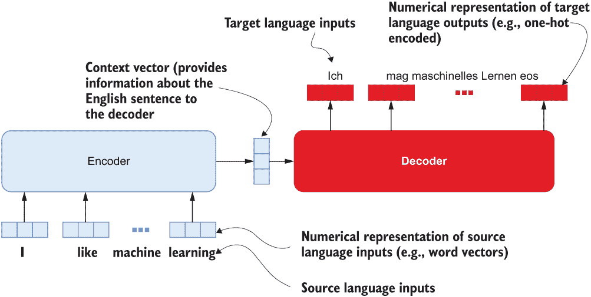
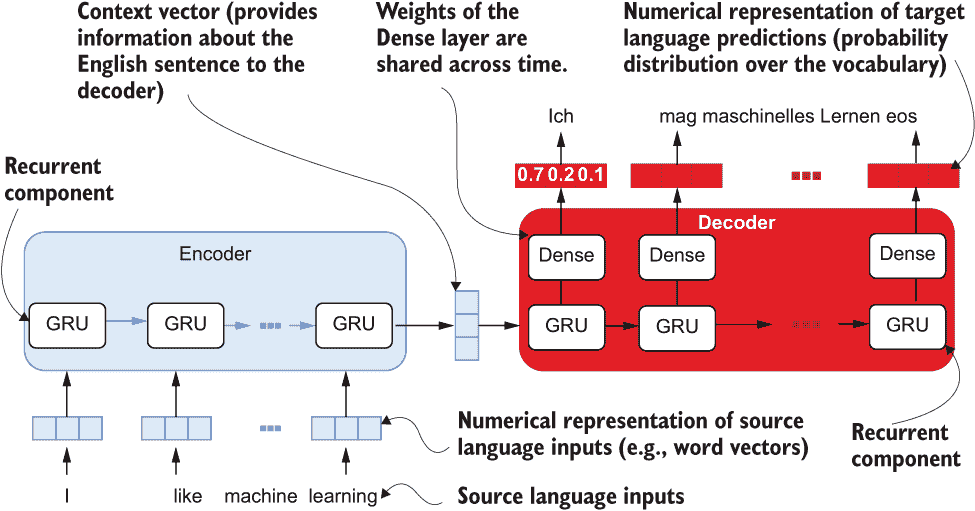
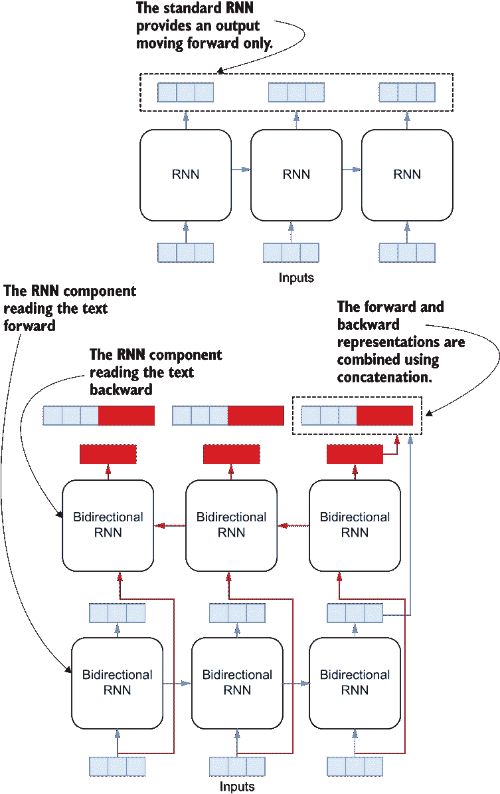
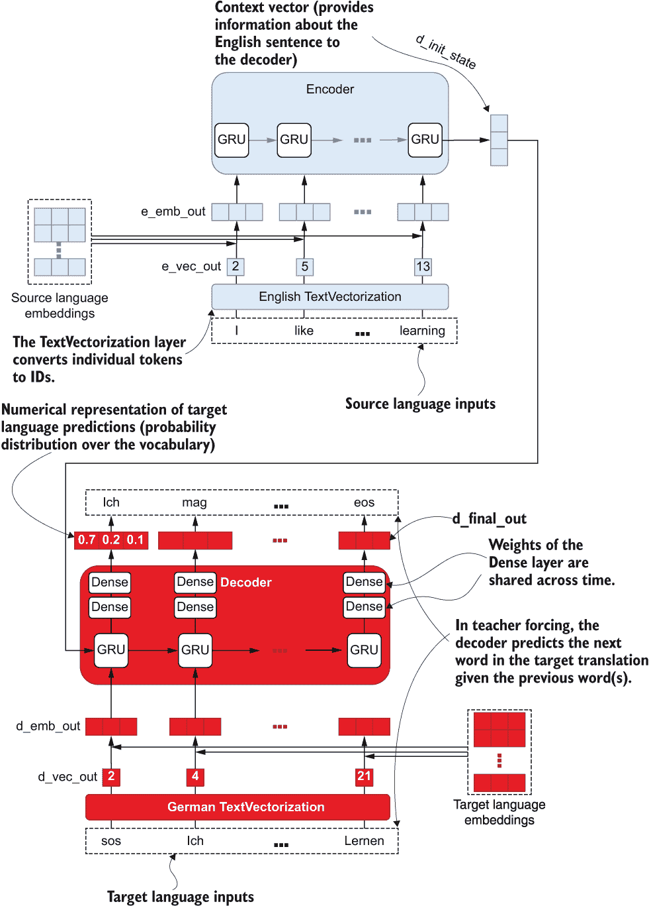
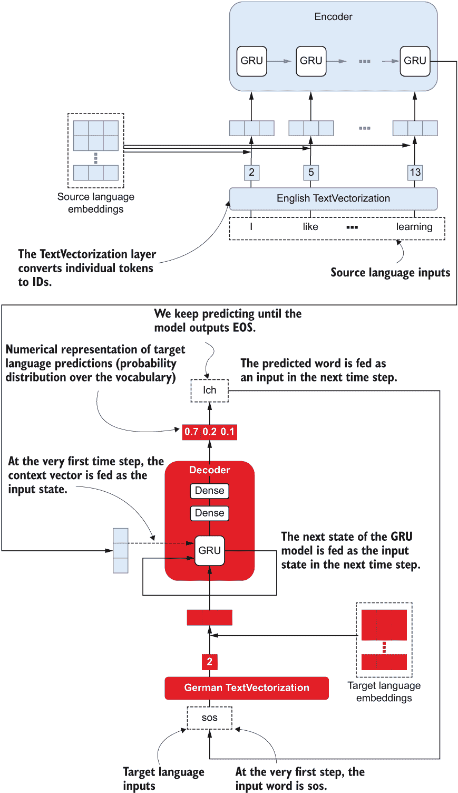

# 第十一章：序列到序列学习：第一部分

本章内容包括：

+   理解序列到序列数据

+   构建序列到序列机器翻译模型

+   训练和评估序列到序列模型

+   将训练的模型用于生成未见过的文本的翻译

在上一章中，我们探讨了使用深度递归神经网络解决自然语言处理任务的语言建模。在本章中，我们将进一步探讨如何使用递归神经网络解决更复杂的任务。我们将学习各种任务，其中任意长度的输入序列映射到另一个任意长度的序列。机器翻译是这种情况的一个非常适当的例子，它涉及将一种语言中的单词序列转换为另一种语言的单词序列。

此章节的主要目的是构建一个英德机器翻译器。我们首先需要下载一个机器翻译数据集，了解该数据集的结构并进行一些处理以准备好模型。接下来我们将定义一个可以将任意长的序列映射到另一个任意长的序列的机器翻译模型，这是一个基于编码器-解码器的模型，意味着有一个编码器将一个序列（例如一个英语短语）输出为一个潜在表示，并且有一个解码器来解码这个信息以生成目标序列（例如一个德语短语）。此模型的一个特殊特点是其能够内部将原始字符串转换为数值表示。因此，与我们在先前章节创建的其他自然语言处理模型相比，此模型更为全面。定义好模型后，我们将使用处理过的数据集进行训练，并评估其生成序列的每个单词的准确性以及 BLEU（双语评估研究）。BLEU 是一种比准确性更高级的度量，可以模拟人类评估翻译质量的方式。最后，我们将定义一个略微修改过的解码器，该解码器可以递归地生成单词（从一个初始种子开始），同时将前一个预测作为当前时间步的输入。在第一部分中，我们将讨论机器翻译数据，然后深入探讨建模。

## 11.1 理解机器翻译数据

您正在为前往德国的游客开发一项机器翻译服务。您找到了一份包含英语和德语文本的双语平行语料库（可在[`www.manythings.org/anki/deu-eng.zip`](http://www.manythings.org/anki/deu-eng.zip)找到）。它在文本文件中并排包含英语文本和相应的德语翻译。这个想法是使用它来训练一个序列到序列模型，在这之前，您必须了解数据的组织方式，将其加载到内存中，并分析词汇量和序列长度。此外，您将处理文本，使其在德语翻译的开头具有特殊标记“sos”（表示“句子开始”）并在翻译的结尾具有“eos”（表示“句子结束”）。这些是重要的标记，在生成模型的翻译时将对我们有所帮助。

让我们首先下载数据集并对其进行浏览。您需要手动下载此数据集（可在[`www.manythings.org/anki/deu-eng.zip`](http://www.manythings.org/anki/deu-eng.zip)找到），因为此网页不支持通过脚本进行自动检索。下载后，我们将提取包含数据的文本文件：

```py
import os
import requests
import zipfile

# Make sure the zip file has been downloaded
if not os.path.exists(os.path.join('data','deu-eng.zip')):
    raise FileNotFoundError(
        "Uh oh! Did you download the deu-eng.zip from 
➥ http:/ /www.manythings.org/anki/deu-eng.zip manually and place it in the 
➥ Ch11/data folder?"
    )

else:
    if not os.path.exists(os.path.join('data', 'deu.txt')):
        with zipfile.ZipFile(os.path.join('data','deu-eng.zip'), 'r') as zip_ref:
            zip_ref.extractall('data')
    else:
        print("The extracted data already exists")
```

如果你打开文本文件，它将有以下条目：

```py
Go.    Geh.    CC-BY 2.0 (France) Attribution: tatoeba.org 
➥ #2877272 (CM) & #8597805 (Roujin)
Hi.    Hallo!    CC-BY 2.0 (France) Attribution: tatoeba.org 
➥ #538123 (CM) & #380701 (cburgmer)
Hi.    Grüß Gott!    CC-BY 2.0 (France) Attribution: 
➥ tatoeba.org #538123 (CM) & #659813 (Esperantostern)
...
If someone who doesn't know your background says that you sound like 
➥ a native speaker, ... . In other words, you don't really sound like 
➥ a native speaker.    Wenn jemand, der nicht weiß, woher man 
➥ kommt, sagt, man erwecke doch den Eindruck, Muttersprachler zu sein, 
➥ ... - dass man diesen Eindruck mit anderen Worten eigentlich nicht 
➥ erweckt.    CC-BY 2.0 (France) Attribution: tatoeba.org #953936 
➥  (CK) & #8836704 (Pfirsichbaeumchen)
Doubtless there exists in this world precisely the right woman for 
➥ any given man to marry and vice versa; ..., that probably, since 
➥ the earth was created, the right man has never yet met the right 
➥ woman.    Ohne Zweifel findet sich auf dieser Welt zu jedem Mann 
➥ genau die richtige Ehefrau und umgekehrt; ..., dass seit Erschaffung 
➥ ebenderselben wohl noch nie der richtige Mann der richtigen Frau 
➥ begegnet ist.    CC-BY 2.0 (France) Attribution: tatoeba.org 
➥ #7697649 (RM) & #7729416 (Pfirsichbaeumchen)
```

数据以制表符分隔的格式呈现，并具有<德语短语><制表符><英语短语><制表符><归属>格式。我们真正关心记录中的前两个以制表符分隔的值。一旦数据下载完成，我们就可以轻松地将数据加载到 pandas DataFrame 中。在这里，我们将加载数据，设置列名，并提取我们感兴趣的列：

```py
import pandas as pd

# Read the csv file
df = pd.read_csv(
    os.path.join('data', 'deu.txt'), delimiter='\t', header=None
)
# Set column names
df.columns = ["EN", "DE", "Attribution"]
df = df[["EN", "DE"]]
```

我们还可以通过以下方式计算 DataFrame 的大小

```py
print('df.shape = {}'.format(df.shape))
```

这将返回

```py
df.shape = (227080, 2)
```

注意：这里的数据会随着时间而更新。因此，您可能会得到与此处显示的略有不同的结果（例如，数据集大小，词汇量，词汇分布等）。

我们的数据集中有约 227,000 个示例。每个示例都包含一个英语短语/句子/段落和相应的德语翻译。我们将再进行一次清理步骤。看起来文本文件中的一些条目存在一些 Unicode 问题。这些问题对于 pandas 来说处理得很好，但对于一些下游 TensorFlow 组件来说会有问题。因此，让我们运行以下清理步骤来忽略数据中的这些问题行：

```py
clean_inds = [i for i in range(len(df)) if b"\xc2" not in df.iloc[i]["DE"].encode("utf-8")]

df = df.iloc[clean_inds]
```

让我们通过调用 df.head()（表 11.1）和 df.tail()（表 11.2）来分析一些示例。df.head()返回表 11.1 的内容，而 df.tail()生成表 11.2 的内容。

表 11.1 数据开头的一些示例

|  | **EN** | **DE** |
| --- | --- | --- |
| 0 | Go. | Geh. |
| 1 | Hi. | Hallo! |
| 2 | Hi. | Grüß Gott! |
| 3 | Run! | Lauf! |
| 4 | Run. | Lauf! |

表 11.2 数据结尾的一些示例

|  | **EN** | **DE** |
| --- | --- | --- |
| 227075 | Even if some by non-native speakers... | Auch wenn Sätze von Nichtmuttersprachlern mitu... |
| 227076 | 如果一个不了解你的背景的人... | 如果一个不了解你的背景的人... |
| 227077 | 如果一个不了解你的背景的人... | 如果一个陌生人告诉你要按照他们... |
| 227078 | 如果一个不了解你的背景的人... | 如果一个不知道你来自哪里的人... |
| 227079 | 这个世界上肯定存在... | 毫无疑问，这个世界上肯定存在... |

示例按长度排序，你可以看到它们从一个单词的示例开始，然后以大约 50 个单词的示例结束。我们将只使用来自该数据集的 50,000 个短语的样本来加快工作流程：

```py
n_samples = 50000
df = df.sample(n=n_samples, random_state=random_seed)
```

我们设置随机种子为 random_seed=4321。

最后，我们将在德语翻译中引入两个特殊标记：sos 和 eos。sos 标记翻译的开始，eos 标记翻译的结束。正如您将看到的，这些标记在训练后生成翻译时起着重要作用。但为了在训练和推断（或生成）期间保持一致，我们将这些标记引入到所有示例中。可以使用以下方式轻松完成此操作：

```py
start_token = 'sos'
end_token = 'eos'
df["DE"] = start_token + ' ' + df["DE"] + ' ' + end_token
```

SOS 和 EOS 标记

SOS 和 EOS 的选择只是一种便利，从技术上讲，它们可以由任何两个唯一的标记表示，只要它们不是语料库本身的词汇。使这些标记唯一是重要的，因为当从以前未见过的英文句子生成翻译时，它们起着重要作用。这些作用的具体细节将在后面的部分中讨论。

这是一个非常直接的转换。这将把短语“Grüß Gott！”转换为“sos Grüß Gott！eos”。接下来，我们将从我们抽样的数据中生成一个训练/验证/测试子集：

```py
# Randomly sample 10% examples from the total 50000 randomly
test_df = df.sample(n=n=int(n_samples/10), random_state=random_seed)
# Randomly sample 10% examples from the remaining randomly
valid_df = df.loc[~df.index.isin(test_df.index)].sample(
    n=n=int(n_samples/10), random_state=random_seed
)
# Assign the rest to training data
train_df = df.loc[~(df.index.isin(test_df.index) | 
➥ df.index.isin(valid_df.index))]
```

我们将把数据的 10%保留为测试数据，另外 10%保留为验证数据，剩下的 80%作为训练数据。数据集将随机抽样（无替换）以得到数据集。然后我们继续分析文本数据集的两个重要特征，就像我们一遍又一遍地做的那样：词汇大小（列表 11.1）和序列长度（列表 11.2）。

列表 11.1 分析词汇大小

```py
from collections import Counter

en_words = train_df["EN"].str.split().sum()                    ❶
de_words = train_df["DE"].str.split().sum()                    ❷

n=10                                                           ❸

def get_vocabulary_size_greater_than(words, n, verbose=True):

    """ Get the vocabulary size above a certain threshold """

    counter = Counter(words)                                   ❹

    freq_df = pd.Series(                                       ❺
        list(counter.values()), 
        index=list(counter.keys())
    ).sort_values(ascending=False)

    if verbose:
        print(freq_df.head(n=10))                              ❻

    n_vocab = (freq_df>=n).sum()                               ❼

    if verbose:
        print("\nVocabulary size (>={} frequent): {}".format(n, n_vocab))

    return n_vocab

print("English corpus")
print('='*50)
en_vocab = get_vocabulary_size_greater_than(en_words, n)

print("\nGerman corpus")
print('='*50)
de_vocab = get_vocabulary_size_greater_than(de_words, n)
```

❶ 从英文单词中创建一个扁平化列表。

❷ 创建一个扁平化的德文单词列表。

❸ 获取出现次数大于或等于 10 次的单词的词汇大小。

❹ 生成一个计数器对象（即 dict word -> frequency）。

❺ 从计数器创建一个 pandas 系列，然后按最频繁到最不频繁排序。

❻ 打印最常见的单词。

❼ 获取至少出现 10 次的单词的计数。

这将返回

```py
English corpus
==================================================
Tom    9427
to     8673
I      8436
the    6999
you    6125
a      5680
is     4374
in     2664
of     2613
was    2298
dtype: int64

Vocabulary size (>=10 frequent): 2238
German corpus
==================================================
sos      40000
eos      40000
Tom       9928
Ich       7749
ist       4753
nicht     4414
zu        3583
Sie       3465
du        3112
das       2909
dtype: int64

Vocabulary size (>=10 frequent): 2497
```

接下来，在以下函数中进行序列分析。

列表 11.2 分析序列长度

```py
def print_sequence_length(str_ser):

    """ Print the summary stats of the sequence length """

    seq_length_ser = str_ser.str.split(' ').str.len()             ❶

    print("\nSome summary statistics")                            ❷
    print("Median length: {}\n".format(seq_length_ser.median()))  ❷
    print(seq_length_ser.describe())                              ❷

    print(
        "\nComputing the statistics between the 1% and 99% quantiles (to 
➥ ignore outliers)"
    )
    p_01 = seq_length_ser.quantile(0.01)                          ❸
    p_99 = seq_length_ser.quantile(0.99)                          ❸

    print(
        seq_length_ser[
            (seq_length_ser >= p_01) & (seq_length_ser < p_99)
        ].describe()                                              ❹
    )
```

❶ 创建包含每个评论的序列长度的 pd.Series。

❷ 获取序列长度的中位数以及摘要统计信息。

❸ 获取给定标记（即 1％和 99％的百分位）的分位数。

❹ 打印定义的分位数之间的数据的摘要统计信息。

接下来，对数据调用此函数以获取统计信息：

```py
print("English corpus")
print('='*50)
print_sequence_length(train_df["EN"])

print("\nGerman corpus")
print('='*50)
print_sequence_length(train_df["DE"])
```

这产生

```py
English corpus
==================================================
Some summary statistics
Median length: 6.0

count    40000.000000
mean         6.360650
std          2.667726
min          1.000000
25%          5.000000
50%          6.000000
75%          8.000000
max        101.000000
Name: EN, dtype: float64

Computing the statistics between the 1% and 99% quantiles (to ignore outliers)
count    39504.000000
mean         6.228002
std          2.328172
min          2.000000
25%          5.000000
50%          6.000000
75%          8.000000
max         14.000000
Name: EN, dtype: float64

German corpus
==================================================

Some summary statistics
Median length: 8.0

count    40000.000000
mean         8.397875
std          2.652027
min          3.000000
25%          7.000000
50%          8.000000
75%         10.000000
max         77.000000
Name: DE, dtype: float64

Computing the statistics between the 1% and 99% quantiles (to ignore outliers)
count    39166.000000
mean         8.299035
std          2.291474
min          5.000000
25%          7.000000
50%          8.000000
75%         10.000000
max         16.000000
Name: DE, dtype: float64
```

接下来，让我们打印出两种语言的词汇量和序列长度参数：

```py
print("EN vocabulary size: {}".format(en_vocab))
print("DE vocabulary size: {}".format(de_vocab))

# Define sequence lengths with some extra space for longer sequences
en_seq_length = 19
de_seq_length = 21

print("EN max sequence length: {}".format(en_seq_length))
print("DE max sequence length: {}".format(de_seq_length))
```

这将返回

```py
EN vocabulary size: 359
DE vocabulary size: 336
EN max sequence length: 19
DE max sequence length: 21
```

现在我们有了定义模型所需的语言特定参数。在下一节中，我们将看看如何定义一个能够在语言之间进行翻译的模型。

练习 1

您已经获得了以下格式的 pandas Series ser：

```py
0       [a, b, c]
1          [d, e]
2    [f, g, h, i]
...

dtype: object
```

编写一个名为 vocab_size(ser)的函数来返回词汇量。

## 11.2 编写英语-德语 seq2seq 机器翻译器

您有一个准备进入模型的干净数据集。您将使用一个序列到序列的深度学习模型作为机器翻译模型。它由两部分组成：一个编码器，用于生成英文（源）文本的隐藏表示，以及一个解码器，用于解码该表示以生成德文（目标）文本。编码器和解码器都是循环神经网络。此外，模型将接受原始文本，并使用 TensorFlow 提供的 TextVectorization 层将原始文本转换为令牌 ID。这些令牌 ID 将传递给一个嵌入层，该层将返回令牌 ID 的单词向量。

我们已经准备好并准备好使用的数据。现在让我们了解一下可以使用此数据的模型。序列到序列学习将任意长的序列映射到另一个任意长的序列。对于我们来说，这提出了一个独特的挑战，因为模型不仅需要能够消耗任意长度的序列，还需要能够生成任意长度的序列作为输出。例如，在机器翻译中，翻译通常比输入的单词少或多。因此，它们需要一种特殊类型的模型。这些模型被称为*编码器-解码器*或*seq2seq*（缩写为序列到序列）模型。

编码器-解码器模型实际上是两个不同的模型以某种方式相互连接起来。在概念上，编码器接受一个序列并产生一个上下文向量（或思考向量），其中嵌入了输入序列中的信息。解码器接受编码器产生的表示，并对其进行解码以生成另一个序列。由于两个部分（即编码器和解码器）分别在不同的事物上操作（即编码器消耗输入序列，而解码器生成输出序列），因此编码器-解码器模型非常适合解决序列到序列的任务。理解编码器和解码器的另一种方式是：编码器处理源语言输入（即要翻译的语言），解码器处理目标语言输入（即要翻译成的语言）。如图 11.1 所示。



图 11.1 编码器-解码器架构在机器翻译环境中的高级组件

特别地，编码器包含一个循环神经网络。我们将使用门控循环单元（GRU）模型。它通过输入序列并产生一个最终输出，这是在处理输入序列中的最后一个元素之后 GRU 单元的最终输出。

思想向量

*思想向量* 是由深度学习领域的泰斗杰弗里·亨滕（Geoffery Hinten）推广的一个术语，他从深度学习的起源就参与其中。思想向量指的是思想的向量化表示。生成准确的思想数值表示将彻底改变我们搜索文档或在网络上搜索（例如，谷歌）的方式。这类似于数值表示单词被称为 *单词向量* 的方式。在机器翻译的背景下，上下文向量可以称为思想向量，因为它在一个向量中捕捉了句子或短语的本质。

您可以在[`wiki.pathmind.com/thought-vectors`](https://wiki.pathmind.com/thought-vectors)阅读更多关于此的信息。

接下来，我们有解码器，它也由一个 GRU 模型和几个密集层组成。密集层的目的是生成最终的预测（目标词汇中的一个词）。解码器中存在的密集层的权重在时间上是共享的。这意味着，正如 GRU 层在从一个输入移动到另一个输入时更新相同的权重一样，密集层在时间步上重复使用相同的权重。这个过程在图 11.2 中有所描述。



图 11.2 编码器和解码器模块中的特定组件。编码器有一个 GRU 层，解码器由一个或多个密集层后跟的 GRU 层组成，其权重在时间上是共享的。

到目前为止，在解决 NLP 任务时，将字符串标记转换为数值 ID 被认为是预处理步骤。换句话说，我们会执行标记到 ID 的转换，并将 ID 输入模型。但它并不一定要这样。我们可以定义更加灵活的模型，让这种文本处理在内部完成并学会解决任务。Keras 提供了一些层，可以插入到您的模型中，以使其更加端到端。tensorflow.keras.layers.experimental.preprocessing.TextVectorization 层就是这样一种层。让我们来看看这个层的用法。

### 11.2.1 文本矢量化层

文本矢量化层接受一个字符串，对其进行标记化，并通过词汇表（或字典）查找将标记转换为 ID。它以字符串列表（或字符串数组）作为输入，其中每个字符串可以是单词/短语/句子（等等）。然后它从语料库中学习词汇。最后，该层可以用于将字符串列表转换为包含该列表中每个字符串的标记 ID 序列的张量。让我们看看这个层的作用。首先，导入该层：

```py
from tensorflow.keras.layers.experimental.preprocessing import 
➥ TextVectorization
```

然后，按以下方式定义该层。在这里，我们为英语定义了该层。请记住，我们的模型中需要两个 TextVectorization 层，一个用于英语，一个用于德语：

```py
en_vectorize_layer = TextVectorization(
    max_tokens=en_vocab,
    output_mode='int',
    output_sequence_length=None
)
```

值得停下来看看我们提供的不同参数：

+   max_tokens—指定词汇表中的单词数。如果词汇表中没有某个单词(即，超出词汇表的单词)，则将其转换为[UNK]。

+   output_mode—指定最终输出的类型。可以是"int"、"binary"、"count"和"tf-idf"之一。"int"表示层将为每个标记输出一个标记 ID。"binary"意味着输出将是一个[<批量大小>, <词汇大小>]张量，在这个例子中，如果该标记所指示的索引在这个示例中存在，则给定值为 1。"count"给出了与"binary"类似的输出，但其中包含了该示例中标记出现的次数。"tf-id"给出了与"binary"类似的输出，但每个位置处的 TF-IDF 值。

+   output_sequence_length—指定转换为标记 ID 后的批量输入序列的长度。如果设置为 None，则意味着序列长度将设置为批量中最长序列的长度。较短的序列将使用特殊标记(特殊标记默认为"")进行填充。

要充分利用这个层，我们必须在文本语料库上适应它，以便它可以学习词汇表。调用 adapt()函数并向其传递字符串列表(或字符串数组)可以实现这一目的。换句话说，adapt()产生了与 scikit-learn 模型的 fit()方法相同的结果([`mng.bz/aJmB`](http://mng.bz/aJmB))。它接受一些数据并根据数据训练(或适应)模型。对于标记器来说，除其他外，它构建了一个词典(从单词到 ID 的映射)：

```py
en_vectorize_layer.adapt(np.array(train_df["EN"].tolist()).astype('str'))
```

安装该层后，可以获得词汇表

```py
print(en_vectorize_layer.get_vocabulary()[:10])
```

which prints

```py
['', '[UNK]', 'tom', 'to', 'you', 'the', 'i', 'a', 'is', 'that']
```

换句话说，词汇表是一个标记列表，其中 ID 对应于它们在列表中的索引。你可以通过计算词汇表的大小来得到：

```py
print(len(en_vectorize_layer.get_vocabulary()))
```

which returns

```py
2238
```

接下来，要使用这个层将字符串转换为数字 ID，我们必须将其封装在一个模型中。为此，首先让我们定义一个 Keras 顺序模型。让我们将模型命名为 toy_model，因为这只用于学习文本向量化器的行为：

```py
toy_model = tf.keras.models.Sequential()
```

定义一个输入层，将其大小设置为接受单列张量(即，一个字符串列表)，并将数据类型设置为 tf.string：

```py
toy_model.add(tf.keras.Input(shape=(1,), dtype=tf.string))
```

然后添加我们定义的文本向量化层：

```py
toy_model.add(en_vectorize_layer)
```

你可以像使用其他 Keras 模型一样使用它，并将任意文本转换为数字 ID 序列。具体地，你可以在一些输入数据上使用 model.predict()函数，该函数接受输入并根据模型中使用的层进行相应转换：

```py
input_data = [["run"], ["how are you"],["ectoplasmic residue"]]
pred = toy_model.predict(input_data)
```

最后，按以下方式打印输入和结果

```py
print("Input data: \n{}\n".format(input_data))
print("\nToken IDs: \n{}".format(pred))
```

which gives

```py
Input data: 
[['run'], ['how are you'], ['ectoplasmic residue']]
Token IDs: 
[[427   0   0]
 [ 40  23   4]
 [  1   1   0]]
```

该层按照一切都进行。 首先让我们看一下输出的形状。 由于我们设置了 output_sequence_length=None，所以将所有输入示例填充到输入中最长输入的长度。 在这里，“how are you”是最长的，其中有三个单词。 因此，所有行都用零填充，以便每个示例都有三列。 通常，该层返回一个大小为 [<batch size>, sequence_length] 的输出。

如果单词在词汇表中找到，它将转换为某个数字（例如，“run”转换为 427）。 如果单词未在词汇表中找到（例如，“ectoplasmic”），则会用表示词汇表外单词的特殊 ID（1）替换。

### 11.2.2 为 seq2seq 模型定义 TextVectorization 层

通过对 TextVectorization 层有很好的理解，让我们定义一个函数，返回一个包装在 Keras Model 对象中的文本向量化层。 此函数名为 get_vectorizer()，接受以下参数：

+   语料库—接受字符串列表（或数组）（即要构建词汇表的语料库）。

+   n_vocab—词汇量大小。 保留最常见的 n_vocab 个词以构建词汇表。

+   max_length（可选）—结果标记序列的长度。 默认为 None，此时序列长度将为最长文本序列的长度。

+   return_vocabulary（可选）—是否返回词汇表（即字符串标记列表）。

+   name（可选）—用于设置模型名称的字符串

它定义了一个接受字符串批次（总共形状为 [None, 1]）的输入层。 接下来，函数定义了一个文本向量化层。 请注意，该层的词汇量为 n_vocab + 2。额外的 2 是为了容纳特殊标记" "和"[UNK]"。 该层适应了传递给函数的文本语料库。 最后，我们使用输入层（inp）和文本向量化层的输出（vectorize_out）定义了一个 Keras 模型。 如果 return_vocabulary 设置为 True，则还会返回 vectorize_layer 的词汇表，如下一列表所示。

列表 11.3 为编码器-解码器模型定义文本向量化器

```py
def get_vectorizer(
    corpus, n_vocab, max_length=None, return_vocabulary=True, name=None
):

    """ Return a text vectorization layer or a model """

    inp = tf.keras.Input(shape=(1,), dtype=tf.string, name='encoder_input')❶

    vectorize_layer = 
➥ tf.keras.layers.experimental.preprocessing.TextVectorization(
        max_tokens=n_vocab+2,                                              ❷
        output_mode='int',
        output_sequence_length=max_length,                
    )

    vectorize_layer.adapt(corpus)                                          ❸

    vectorized_out = vectorize_layer(inp)                                  ❹

    if not return_vocabulary: 
        return tf.keras.models.Model(
            inputs=inp, outputs=vectorized_out, name=name
        )                                                                  ❺
    else:
        return tf.keras.models.Model(
            inputs=inp, outputs=vectorized_out, name=name                  ❻
        ), vectorize_layer.get_vocabulary()        
```

❶ 定义一个接受字符串列表（或字符串数组）的输入层。

❷ 在定义词汇量大小时，我们使用 n_vocab + 2，因为自动添加了两个特殊标记“(填充)”和“[UNK]”。

❸ 在数据上拟合向量化层。

❹ 获取输入数据的标记 ID。

❺ 仅返回模型。 该模型接受字符串数组并输出标记 ID 的张量。

❻ 除了模型外，返回词汇表。

既然我们已经定义了该函数，让我们使用它并定义两个向量化器，一个用于英文输入，一个用于德文输入：

```py
# Get the English vectorizer/vocabulary
en_vectorizer, en_vocabulary = get_vectorizer(
    corpus=np.array(train_df[“EN”].tolist()), n_vocab=en_vocab, 
    max_length=en_seq_length, name=’en_vectorizer’
)
# Get the German vectorizer/vocabulary
de_vectorizer, de_vocabulary = get_vectorizer(
    corpus=np.array(train_df[“DE”].tolist()), n_vocab=de_vocab, 
    max_length=de_seq_length-1, name=’de_vectorizer’
)
```

在这里，语料库接受一个文本列表或数组。每个文本都是一个包含英语或德语短语/句子的字符串。n_vocab 定义词汇表的大小，max_length 定义了我们应该对数据进行填充的序列长度。请注意，我们在解码器中使用 de_seq_length-1。这里减 1 的操作是由于在模型训练期间数据呈现给解码器的方式所决定的。当我们到达模型训练时，我们将讨论具体细节。最后，我们可以定义一个名称来跟踪不同的层。

### 11.2.3 定义编码器

接下来我们来到编码器，我们将在编码器的核心使用一个 GRU 模型。编码器负责处理源输入序列。它的责任是处理源输入并生成一个*上下文向量*（有时称为*思考向量*）。该向量以紧凑的、向量化的形式捕获输入序列的本质。通常情况下，这个上下文向量将是 GRU 单元在处理完整输入序列后的最后输出状态。

让我们看看准备编码器所涉及的步骤。为此，我们将使用 Keras Functional 层。序列到序列模型不是顺序的，并且在编码器和解码器之间涉及非线性连接。因此，我们不能使用 Keras Sequential API。首先，我们定义输入层：

```py
# The input is (None,1) shaped and accepts an array of strings
inp = tf.keras.Input(shape=(1,), dtype=tf.string, name='e_input')
```

输入接受一个字符串列表。请注意，我们将形状设置为（1，）以确保模型接受具有一个列的张量，并将 dtype 设置为 tf.string。接下来，我们将由 inp 前向传递的文本输入进行向量化。

```py
# Vectorize the data (assign token IDs)
vectorized_out = en_vectorizer(inp)
```

这里，向量化器是由我们之前定义的 get_vectorizer()函数输出的执行文本向量化的模型。

接下来，我们定义一个嵌入层，它将由向量化器返回的标记 ID 转换为单词向量。这是一个具有可训练权重的层。因此，在训练期间，模型将调整单词嵌入以反映解决手头任务的有用表示：

```py
# Define an embedding layer to convert IDs to word vectors
emb_layer = tf.keras.layers.Embedding(
    input_dim=n_vocab+2, output_dim=128, mask_zero=True, name=’e_embedding’
)
# Get the embeddings of the token IDs
emb_out = emb_layer(vectorized_out)
```

在定义嵌入层时，您需要始终传递词汇表大小（input_dim）和 output_dim。请注意，词汇表大小已经增加了 2 以容纳引入的两个特殊标记（即 UNK 和 PAD）。我们将 output_dim 设置为 128。我们还希望屏蔽过多的零，因此设置 mask_zero=True。最后，我们还将传递一个名称以便于识别该层。

现在我们要来到我们模型的核心：循环神经网络（RNN）。正如前面提到的，我们将使用一个 GRU 模型，但是带有一个额外的特点！我们将使我们的 GRU 模型成为双向的！双向 RNN 是一种特殊类型的 RNN，它同时处理序列的前向和后向。这与标准 RNN 相反，后者只处理序列的前向：

```py
gru_layer = tf.keras.layers.Bidirectional(tf.keras.layers.GRU(128))
```

**双向 RNN**：前向和后向阅读文本

标准的循环神经网络逐步阅读文本，一次处理一个时间步，然后输出一系列输出。双向循环神经网络正如其名称所示，不仅向前阅读文本，而且向后阅读文本。这意味着双向循环神经网络有两个输出序列。然后，这两个序列使用组合策略（例如*连接*）进行组合，以产生最终输出。通常双向循环神经网络的性能优于标准循环神经网络，因为它们可以理解文本前后的关系，如下图所示。



标准 RNN 和双向 RNN 之间的比较

阅读文本倒置为什么有帮助呢？有一些语言是倒序阅读的（例如阿拉伯语、希伯来语）。除非文本经过特殊处理以考虑这种书写风格，否则标准的循环神经网络将很难理解这种语言。通过使用双向循环神经网络，您可以消除模型对语言始终从左到右或从右到左的依赖。

如果考虑英语，可能存在只从前面推断关系是不可能的情况。考虑以下两个句子

约翰走向了克拉伦斯街上的银行。

约翰朝河边的银行走去。

由于这两个句子在“bank”一词之前是相同的，因此在阅读其余部分之前，不可能知道“bank”是指金融机构还是河岸。对于双向循环神经网络来说，这是微不足道的。

然后我们获得 gru_layer 的输出，并将其分配给 gru_out：

```py
gru_out = gru_layer(emb_out)
```

最后，我们将编码器模型定义为 tf.keras.models.Model 对象。它接受 inp（即 tf.string 类型的单列张量）并输出 gru_out（即双向 GRU 模型的最终状态）。这个 GRU 模型的最终状态被认为是上下文向量，为解码器提供有关源语言句子/短语输入的信息：

```py
encoder = tf.keras.models.Model(inputs=inp, outputs=gru_out)
```

可以观察在以下清单中显示的逐步构建编码器模型的函数封装方式。

清单 11.4 返回编码器的函数

```py
def get_encoder(n_vocab, vectorizer):
    """ Define the encoder of the seq2seq model"""

    inp = tf.keras.Input(shape=(1,), dtype=tf.string, name='e_input')   ❶

    vectorized_out = vectorizer(inp)                                    ❷

    emb_layer = tf.keras.layers.Embedding(
        n_vocab+2, 128, mask_zero=True, name='e_embedding'              ❸
    )

    emb_out = emb_layer(vectorized_out)                                 ❹

    gru_layer = tf.keras.layers.Bidirectional(
        tf.keras.layers.GRU(128, name='e_gru'),                         ❺
        name='e_bidirectional_gru'
    )

    gru_out = gru_layer(emb_out)                                        ❻

    encoder = tf.keras.models.Model(
        inputs=inp, outputs=gru_out, name='encoder'
    )                                                                   ❼

    return encoder
```

❶ 输入形状为(None,1)，接受一个字符串数组。

❷ 对数据进行向量化（分配令牌 ID）

❸ 定义一个嵌入层，将 ID 转换为词向量。

❹ 获取令牌 ID 的嵌入。

❺ 定义一个双向 GRU 层。编码器同时查看英文文本（即输入）的前向和后向。

❻ 获取 gru 的最后一个输出（模型返回的最后一个输出状态向量）。

❼ 定义编码器模型；它接受一个字符串列表/数组并返回 GRU 模型的最后输出状态。

定义函数后，您可以简单地调用它来构建编码器模型：

```py
encoder = get_encoder(en_vocab, en_vectorizer)
```

### 11.2.4 定义解码器和最终模型

编码器已经完成，现在是看看解码器的时候了。解码器看起来会比编码器稍微复杂一些。解码器的核心模型再次是一个 GRU 模型。然后是一个完全连接的隐藏层和一个完全连接的预测层。预测层对每个时间步输出来自德语词汇表的一个单词（通过计算整个词汇表上的概率）。

在模型训练期间，解码器预测给定目标序列中的下一个单词。例如，给定目标序列 [A, B, C, D]，解码器将根据以下输入-输出元组对模型进行三个时间步的训练：(A, B)，(B, C) 和 (C, D)。换句话说，给定标记 A，预测标记 B；给定标记 B，预测标记 C；依此类推。如果你考虑编码器-解码器模型的端到端过程，将会发生以下步骤：

1.  编码器处理源输入序列（即英文）并生成上下文向量（即 GRU 模型的最后输出状态）。

1.  解码器使用编码器产生的上下文向量作为其循环组件的初始状态。

1.  解码器接收目标输入序列（即德语）并根据前一个标记预测下一个标记。对于每个时间步，它使用完全连接的层和 softmax 层在完整的目标词汇表上预测一个标记。

这种模型训练的方式被称为*教师强制*，因为你正在用目标序列（即老师）引导解码器。与在编码器-解码器类型模型的训练中不使用教师强制相比，使用教师强制很快会导致更好的性能。让我们深入了解解码器，并看看编码器和解码器如何相互联系以创建更深入的最终模型，如图 11.3 所示。



图 11.3 最终的序列到序列模型的实现，重点关注各种层和输出

现在是讨论构建解码器和最终模型的具体细节的时候了。我们首先必须做的事情是通过传递一个输入来获得编码器的输出。我们定义了一个与编码器的输入相同的输入层，并将其传递给我们之前定义的编码器模型：

```py
e_inp = tf.keras.Input(shape=(1,), dtype=tf.string, name='e_input_final') 
```

然后我们将 e_inp 传递给编码器模型，它将给出 GRU 模型的最后输出状态作为输出。这是解码器的重要输入：

```py
d_init_state = encoder(e_inp)
```

作为解码器的起点，我们定义了一个具有与编码器输入相同规格的输入层：

```py
d_inp = tf.keras.Input(shape=(1,), dtype=tf.string, name='d_input')
```

然后我们将输入传递给一个文本向量化模型，给定 get_vectorizer() 函数：

```py
vectorized_out = de_vectorizer(inp)
```

我们像对编码器一样定义一个嵌入层，以便文本向量化层生成的标记 ID 转换为单词向量。请注意，我们为编码器和解码器分别定义了两个单独的嵌入层，因为它们使用来自两种不同语言的序列：

```py
emb_layer = tf.keras.layers.Embedding(
    input_dim=n_vocab+2, output_dim=128, mask_zero=True, name='d_embedding'
)
emb_out = emb_layer(vectorized_out)
```

现在是时候实现解码器的循环组件了。与编码器类似，我们使用 GRU 模型来处理序列：

```py
gru_layer = tf.keras.layers.GRU(256, return_sequences=True)
```

但请注意，与编码器相比，在解码器中，我们没有在 GRU 模型上使用双向包装器。解码器不能依赖于向后阅读能力，因为它应该仅根据前一个和当前输入生成下一个输出。还要注意，我们设置了 return_sequences=True：

```py
gru_out = gru_layer(emb_out, initial_state=d_init_state)
```

最后，将嵌入层的输出传递给 gru_layer，我们得到输出。之前我们声明过 d_init_state（即编码器的输出）是解码器的重要输入之一。在这里，我们将 d_init_state 作为初始状态传递给解码器的 GRU 层。这意味着，解码器不是从零初始化状态向量开始，而是使用编码器的上下文向量作为初始状态。由于我们设置了 return_sequences=True，因此输出将包含所有时间步的输出状态向量，而不仅仅是最后一个时间步。这意味着输出的大小为[<批大小>，<时间步长>，256]。

清单 11.5 定义解码器和最终模型

```py
def get_final_seq2seq_model(n_vocab, encoder, vectorizer):
    """ Define the final encoder-decoder model """    
    e_inp = tf.keras.Input(
        shape=(1,), dtype=tf.string, name='e_input_final'
    )                                                                    ❶

    d_init_state = encoder(e_inp)                                        ❶

    d_inp = tf.keras.Input(shape=(1,), dtype=tf.string, name='d_input')  ❷

    d_vectorized_out = vectorizer(d_inp)                                 ❸

    d_emb_layer = tf.keras.layers.Embedding(
        n_vocab+2, 128, mask_zero=True, name='d_embedding'               ❹
    )
    d_emb_out = d_emb_layer(d_vectorized_out)

    d_gru_layer = tf.keras.layers.GRU(
        256, return_sequences=True, name='d_gru'
    )                                                                    ❺

    d_gru_out = d_gru_layer(d_emb_out, initial_state=d_init_state)       ❻

    d_dense_layer_1 = tf.keras.layers.Dense(
        512, activation='relu', name='d_dense_1'
    )                                                                    ❼
    d_dense1_out = d_dense_layer_1(d_gru_out)                            ❼

    d_dense_layer_final = tf.keras.layers.Dense(
        n_vocab+2, activation='softmax', name='d_dense_final'            ❽
    )
    d_final_out = d_dense_layer_final(d_dense1_out)                      ❽

    seq2seq = tf.keras.models.Model(
        inputs=[e_inp, d_inp], outputs=d_final_out, name='final_seq2seq' ❾
    )

    return seq2seq
```

❶定义编码器输入层并获取编码器输出（即上下文向量）。

❷输入的形状为（None，1），并接受字符串数组作为输入。我们将德语序列作为输入并要求模型使用偏移一个（即下一个）单词的单词预测它。

❸获取解码器的向量化输出。

❹定义嵌入层，将 ID 转换为单词向量。这是与编码器嵌入层不同的层。

❺定义 GRU 层。与编码器不同，我们不能为解码器定义双向 GRU。

❻获取解码器的 GRU 层输出。

❼定义中间的 Dense 层并获取输出。

❽最终预测层使用 softmax

❾定义完整模型。

我们现在可以定义所需的所有内容，以制定我们的最终模型

```py
# Get the English vectorizer/vocabulary
en_vectorizer, en_vocabulary = get_vectorizer(
    corpus=np.array(train_df["EN"].tolist()), n_vocab=en_vocab, 
    max_length=en_seq_length, name='e_vectorizer'
)
# Get the German vectorizer/vocabulary
de_vectorizer, de_vocabulary = get_vectorizer(
    corpus=np.array(train_df["DE"].tolist()), n_vocab=de_vocab,
    max_length=de_seq_length-1, name='d_vectorizer'
)

# Define the final model
encoder = get_encoder(n_vocab=en_vocab, vectorizer=en_vectorizer)
   final_model = get_final_seq2seq_model(
       n_vocab=de_vocab, encoder=encoder, vectorizer=de_vectorizer
   )
```

在这里，我们定义英语和德语的向量器（分别为 en_vectorizer 和 de_vectorizer）。然后使用英语词汇量和英语向量器定义编码器。最后，使用德语词汇量（de_vocab）编码器和德语向量器（de_vectorizer）定义最终的编码器-解码器模型。

### 11.2.5 编译模型

准备好模型进行培训的最后一件事是编译模型。我们将使用稀疏分类交叉熵损失，Adam 优化器和准确度作为指标：

```py
from tensorflow.keras.metrics import SparseCategoricalAccuracy

final_model.compile(
    loss='sparse_categorical_crossentropy', 
    optimizer='adam', 
    metrics=['accuracy']
)
```

最后，让我们打印模型摘要

```py
final_model.summary()
```

将输出

```py
Model: "final_seq2seq"
___________________________________________________________________________
Layer (type)                    Output Shape         Param #       
➥ Connected to                     
===========================================================================
d_input (InputLayer)            [(None, 1)]          0                     
___________________________________________________________________________
d_vectorizer (Functional)       (None, 20)           0           
➥ d_input[0][0]                    
___________________________________________________________________________
e_input_final (InputLayer)      [(None, 1)]          0                     
___________________________________________________________________________
d_embedding (Embedding)         (None, 20, 128)      319872      
➥ d_vectorizer[0][0]               
___________________________________________________________________________
encoder (Functional)            (None, 256)          484864      
➥ e_input_final[0][0]              
___________________________________________________________________________
d_gru (GRU)                     (None, 20, 256)      296448      
➥ d_embedding[0][0]                
➥ encoder[0][0]                    
___________________________________________________________________________
d_dense_1 (Dense)               (None, 20, 512)      131584      
➥ d_gru[0][0]                      
___________________________________________________________________________
d_dense_final (Dense)           (None, 20, 2499)     1281987     
➥ d_dense_1[0][0]                  
===========================================================================
Total params: 2,514,755
Trainable params: 2,514,755
Non-trainable params: 0
___________________________________________________________________________
```

在下一节中，我们将学习如何使用准备好的数据训练我们刚刚定义的模型。

习题 2

与教师强制相反，另一种定义编码器-解码器模型的技术是定义一个模型，其中

+   编码器接收英语标记序列

+   解码器在时间轴上重复上下文向量作为输入，以便将相同的上下文向量馈送到解码器的每个时间步

您已提供以下编码器。定义一个具有 GRU 层和两个全连接隐藏层的解码器，以及以 en_inp 开头并生成最终预测的最终模型：

```py
en_inp = tf.keras.Input(shape=(1,), dtype=tf.string, name='e_input')
en_vectorized_out = en_vectorizer(inp)
en_emb_layer = tf.keras.layers.Embedding(
   en_vocab+2, 128, mask_zero=True, name='e_embedding'
)
en_emb_out = emb_layer(vectorized_out)
en_gru_layer = tf.keras.layers.GRU(256, name='e_gru')
en_gru_out = gru_layer(emb_out)
```

您可以使用 tf.keras.layers.RepeatVector 层重复上下文向量任意次数。例如，如果您将一个 [None, 32] 大小的张量传递给 tf.keras.layers.RepeatVector(5) 层，则通过在时间维度上五次重复 [None, 32] 张量，返回一个 [None, 5, 32] 大小的张量。

## 11.3 训练和评估模型

您已经定义了一个可以接受原始文本并生成翻译的端到端模型。接下来，您将在之前准备的数据上训练此模型。您将使用训练集来训练模型，并使用验证集来监视其训练性能。最后，模型将在测试数据上进行测试。为了评估模型，我们将使用两个指标：准确率和 BLEU。BLEU 是序列到序列问题中常用的指标，用于衡量输出序列（例如，翻译）的质量。

我们已经定义并编译了模型。现在，我们将在训练数据上训练模型，并在验证和测试数据上评估其性能，涵盖几个指标。我们将使用称为 BLEU 的性能指标来衡量模型的性能。它不是 Keras 提供的标准指标，将使用标准的 Python/NumPy 函数实现。因此，我们将编写自定义的训练/评估循环来分别训练和评估模型。

为了方便模型的训练和评估，我们将创建几个辅助函数。首先，我们将创建一个函数，从我们在开头定义的 Python DataFrame 对象中创建输入和目标（请参阅下一个列表）。

列表 11.6 准备用于模型训练和评估的训练/验证/测试数据

```py
def prepare_data(train_df, valid_df, test_df):
    """ Create a data dictionary from the dataframes containing data """

    data_dict = {}                                                       ❶
    for label, df in zip(
        ['train', 'valid', 'test'], [train_df, valid_df, test_df]
    ):                                                                   ❷
        en_inputs = np.array(df["EN"].tolist())                          ❸
        de_inputs = np.array(
            df["DE"].str.rsplit(n=1, expand=True).iloc[:,0].tolist()     ❹
        )
        de_labels = np.array(
            df["DE"].str.split(n=1, expand=True).iloc[:,1].tolist()      ❺
        )
        data_dict[label] = {
            'encoder_inputs': en_inputs,                                 ❻
            'decoder_inputs': de_inputs, 
            'decoder_labels': de_labels
        }

    return data_dict
```

❶ 定义一个包含训练/验证/测试数据的字典。

❷ 遍历 train、valid 和 test 数据框。

❸ 将编码器输入定义为英文文本。

❹ 将解码器输入定义为除最后一个令牌外的所有德语文本。

❺ 将解码器输出定义为除第一个令牌外的所有德语文本。

❻ 更新字典，包括编码器输入、解码器输入和解码器输出。

此函数接受三个数据框 train_df、valid_df 和 test_df，并对它们进行一些转换，以返回一个包含三个键的字典：train、valid 和 test。在每个键下，您将找到以下内容：

+   编码器输入（即，英文单词序列）

+   解码器输入（即，德语单词序列）

+   解码器输出（即，德语单词序列）

正如我们之前所述，我们正在使用一种称为 teacher forcing 的技术来提升模型的性能。因此，解码器的目标变成了在给定前一个单词的情况下预测下一个单词。例如，对于例句（“I want a piece of chocolate cake”，“Ich möchte ein Stück Schokoladenkuchen”），编码器输入、解码器输入和解码器输出变为以下内容：

+   [“I”, “want”, “a”, “piece”, “of”, “chocolate”, “cake”]（编码器输入）

+   [“Ich”, “möchte”, “ein”, “Stück”]（解码器输入）

+   [“möchte”, “ein”, “Stück”, “Schokoladenkuchen”]（解码器输出）

可以看到，在每个时间步长，解码器都在根据前一个单词预测下一个单词。prepare_data(...) 函数会执行此操作，下一个列表将显示。然后，我们将编写一个函数来洗牌数据。此函数将用于在训练期间的每个时代开始时对数据进行洗牌。

列表 11.7 对训练数据进行洗牌

```py
def shuffle_data(en_inputs, de_inputs, de_labels, shuffle_indices=None): 
    """ Shuffle the data randomly (but all of inputs and labels at ones)"""

    if shuffle_indices is None:        
        shuffle_indices = np.random.permutation(np.arange(en_inputs.shape[0]))       ❶
    else:        
        shuffle_indices = np.random.permutation(shuffle_indices)                     ❷

    return (
        en_inputs[shuffle_indices], 
        de_inputs[shuffle_indices], 
        de_labels[shuffle_indices]                                                   ❸
    ), shuffle_indices
```

❶ 如果未传递 shuffle_indices，则自动生成洗牌索引。

❷ 对提供的 shuffle_indices 进行洗牌。

❸ 返回洗牌数据。

shuffle_data() 函数接受由 prepare_data 函数输出的数据（即编码器输入、解码器输入和解码器输出）。可选地，它接受数据索引的洗牌表示。我们允许将洗牌索引传递给函数，这样，通过对已经洗牌的索引进行洗牌，您可以得到数据顺序的新排列。这在训练期间在每个时代生成不同的洗牌配置时非常有用。

如果未传递 shuffle_indices，shuffle_data() 函数将生成数据索引的随机排列。数据索引是由 np.arange(en_ inputs.shape[0]) 生成的，它从 0 到 en_inputs 中的示例数量创建了一个有序数字序列。可以通过调用 np.random.permutation() 函数对给定数组生成给定数组的随机排列。如果已将数组传递给 shuffle_indices 参数，则将在 shuffle_indices 中传递的数组进行洗牌，生成新的洗牌数据配置。最后，我们根据 shuffle_indices 数组确定的顺序返回编码器输入（en_inputs）、解码器输入（de_inputs）和解码器输出（de_labels）进行洗牌。

接下来，我们将编写一个函数来评估模型。在此函数中，我们使用定义的 batch_size 对给定数据上的给定模型进行评估。特别地，我们使用三个指标评估机器翻译模型：

+   *交叉熵损失* ——在预测概率和真实目标之间计算的标准多类交叉熵损失。

+   *准确度* ——标准准确度，根据模型在给定时间步长上是否预测与真实目标相同的单词进行测量。换句话说，预测必须与真实目标完全匹配，从单词到单词。

+   *BLEU 分数* ——比准确率更强大的度量标准，基于精确度，但考虑了许多不同值的 n 克隆。

双语评估干预（BLEU）

BLEU 是一种度量标准，用于通过衡量翻译与给定的真实文本（或翻译对应多个真实文本，因为相同的内容可以以不同的语言表达）的相似度来衡量生成文本序列（例如翻译）的质量。它是由 Papineni 等人在论文 “BLEU: A Method for Automatic Evaluation of Machine Translation” 中引入的（[`www.aclweb.org/anthology/P02-1040.pdf`](https://www.aclweb.org/anthology/P02-1040.pdf)）。BLEU 分数是一种精度度量标准的变体，用于计算候选文本（即预测）与*多个*参考翻译（即真实文本）之间的相似度。

要了解 BLEU 度量，让我们考虑以下候选项和参考文献：

候选项 1 (C1)：the cat was on the red mat

候选项 2 (C2)：the cat the cat the cat the

参考文献 1：the cat is on the floor

参考文献 2：there was a cat on the mat

对于候选项 1 和 2 的精度可以计算为

精度 = 匹配任何参考文献的单词数/候选项中的单词数

意味着

精度(C1) = 6/7，精度(C2) = 7/7

这与直觉相矛盾。显然，C1 是与参考文献更匹配的选择。但是精度却讲述了另一个故事。因此，BLEU 引入了一个修改后的精度。在修改后的精度中，对于候选项中的每个唯一单词，您计算该单词在任何一个参考文献中出现的次数，并取其中的最大值。然后您对候选文本中所有唯一单词的这个值求和。例如，对于 C1 和 C2，修改后的单字精度是

修改后的精度(C1) = (2 + 1 + 1 + 2 + 0 + 1) /7 = 5/7，修改后的精度(C2) = (2 + 1)/7 = 3/7

这好多了：C1 的精度比 C2 高，这正是我们想要的。BLEU 将修改后的单字精度扩展到修改后的 n-gram 精度，并为多个 n-gram（例如，单字、二字、三字等）计算修改后的精度。通过在许多不同的 n-gram 上计算修改后的精度，BLEU 可以偏爱具有与参考文献匹配的更长子序列的翻译或候选。

我们将定义一个名为 BLEUMetric 的对象，它将计算给定预测批次和目标的 BLEU 分数，如下列表所示。

列表 11.8 定义 BLEU 度量以评估机器翻译模型

```py
class BLEUMetric(object):

    def __init__(self, vocabulary, name='perplexity', **kwargs):
      """ Computes the BLEU score (Metric for machine translation) """
      super().__init__()
      self.vocab = vocabulary                                                ❶
      self.id_to_token_layer = StringLookup(
          vocabulary=self.vocab, invert=True, 
          num_oov_indices=0
      )                                                                      ❷

    def calculate_bleu_from_predictions(self, real, pred):
        """ Calculate the BLEU score for targets and predictions """

        pred_argmax = tf.argmax(pred, axis=-1)                               ❸

        pred_tokens = self.id_to_token_layer(pred_argmax)                    ❹
        real_tokens = self.id_to_token_layer(real)                           ❹

        def clean_text(tokens):

            """ Clean padding and [SOS]/[EOS] tokens to only keep meaningful words """

            t = tf.strings.strip(                                            ❺
                        tf.strings.regex_replace(                            ❻
                            tf.strings.join(                                 ❼
                                tf.transpose(tokens), separator=' '
                            ),
                        "eos.*", ""),
                   )

            t = np.char.decode(t.numpy().astype(np.bytes_), encoding='utf-8')❽

            t = [doc if len(doc)>0 else '[UNK]' for doc in t ]               ❾

            t = np.char.split(t).tolist()                                    ❿

            return t

        pred_tokens = clean_text(pred_tokens)                                ⓫
        real_tokens = [[r] for r in clean_text(real_tokens)]                 ⓬

        bleu, precisions, bp, ratio, translation_length, reference_length = 
➥ compute_bleu(real_tokens, pred_tokens, smooth=False)                      ⓭

        return bleu
```

❶ 从拟合的 TextVectorizer 中获取词汇表。

❷ 定义一个 StringLookup 层，它可以将标记 ID 转换为单词。

❸ 获取预测的标记 ID。

❹ 使用词汇表和 StringLookup 将标记 ID 转换为单词。

❺ 剥离字符串中的任何额外空格。

❻ 用空白替换 EOS 标记之后的所有内容。

❼ 将每个序列中的所有标记连接为一个字符串。

❽ 将字节流解码为字符串。

❾ 如果字符串为空，则添加一个 [UNK] 标记。否则，可能会导致数值错误。

❿ 将序列拆分为单独的标记。

⓫ 获取预测和真实序列的干净版本。

⓬ 我们必须将每个真实序列包装在列表中，以利用第三方函数来计算 BLEU。

⓭ 获取给定批次目标和预测的 BLEU 值。

首先，我们定义一个 __init__(...) 函数和该类的几个属性，例如 vocab，它将由 TextVectorization 层返回的解码器词汇表。接下来，我们定义一个 TensorFlow StringLookup 层，它可以返回给定令牌 ID 的字符串令牌，反之亦然。StringLookup 函数所需的仅仅是解码器 TextVectorization 层的词汇表。默认情况下，StringLookup 层将给定的字符串令牌转换为令牌 ID。设置 invert=true 意味着此层将把给定的令牌 ID 转换为字符串令牌。我们还需要说明我们不希望此层自动为词汇表外的单词添加表示。为此，我们将 num_oov_indices=0。

接下来，我们定义一个名为 calculate_bleu_from_predictions(...) 的函数，它接受一个真实目标的批次和模型给出的预测概率的批次，以计算该批次的 BLEU 分数。首先，它通过获取每个时间步的概率向量的最大索引来计算预测的令牌 ID：

```py
pred_argmax = tf.argmax(pred, axis=-1)  
```

接下来，使用之前定义的 StringLookup 层生成字符串令牌：

```py
pred_tokens = self.id_to_token_layer(pred_argmax)
real_tokens = self.id_to_token_layer(real)
```

具体来说，我们将令牌 ID 矩阵（预测和目标）传递给 StringLookup 层。例如，如果

```py
real = [
    [4,1,0],
    [8,2,21]
]

vocabulary = ['', '[UNK]', 'sos', 'eos', 'tom', 'ich', 'nicht', 'ist', 'du', 'sie']
```

然后

```py
real_tokens = tf.Tensor([
    [b'tom' b'[UNK]' b'']
    [b'du' b'sos' b'[UNK]']
], shape=(2, 3), dtype=string)
```

之后，我们定义一个函数来执行一些清理工作。定义的函数将截断预测，使得所有 EOS 令牌之后的内容都被移除（包括），并将句子标记为单词列表。该函数的输入是一个张量，其中每一行都是一个令牌列表（即，pred_tokens）。让我们利用这个机会来磨练我们对 TensorFlow 字符串操作的理解。TensorFlow 有一个名为 tf.strings 的命名空间（[`mng.bz/gw7E`](http://mng.bz/gw7E)），提供各种基本的字符串操作功能：

```py
def clean_text(tokens):

    """ Clean padding and [SOS]/[EOS] tokens to only keep meaningful words """
    # 3\. Strip the string of any extra white spaces
    translations_in_bytes = tf.strings.strip(
        # 2\. Replace everything after the eos token with blank
        tf.strings.regex_replace(
            # 1\. Join all the tokens to one string in each sequence
            tf.strings.join(tf.transpose(tokens), separator=' '),
             "eos.*", ""
        ),
     )

     # Decode the byte stream to a string
     translations = np.char.decode(
         translations_in_bytes.numpy().astype(np.bytes_), encoding='utf-8'
     )

     # If the string is empty, add a [UNK] token
     # Otherwise get a Division by zero error
     translations = [sent if len(sent)>0 else '[UNK]' for sent in translations ]

     # Split the sequences to individual tokens 
     translations = np.char.split(translations).tolist()

     return translations
```

让我们看看调用几个 tf.string 操作的第一行代码：

```py
translations_in_bytes = tf.strings.strip(
        # 2\. Replace everything after the eos token with blank
        tf.strings.regex_replace(
            # 1\. Join all the tokens to one string in each sequence
            tf.strings.join(tf.transpose(tokens), separator=' '),
             "eos.*", ""
        ),
     )
```

它在输入字符串张量上执行一系列转换。首先，对令牌调用 tf.strings.join() 将使用给定的分隔符将所有令牌连接成一列。例如

```py
[
    ['a','b','c'],
    ['d', 'e', 'f']
]
```

变为

```py
['ad', 'be', 'cf']
```

由于我们的句子跨越行，因此我们首先需要转置令牌，使得句子位于列中。接下来，在张量上调用 tf.strings.regex_replace()，其中每个项都是由连接产生的句子。它将移除跟随 EOS 令牌的所有内容。此字符串模式由 eos.* 正则表达式捕获。最后，我们从生成的字符串中去除任何起始和结束空格。

TensorFlow 将字符串保留为字节格式。为了将字符串转换为 UTF-8 编码，我们有一系列的转换步骤，以将其转换为正确的格式：

1.  首先，我们必须将数组转换为 NumPy 数组。此数组中的元素将以对象格式存在。

1.  接下来，我们通过调用 translations_in_bytes.numpy().astype(np.bytes_)将其转换为字节数组。

1.  最后，我们解码字节数组并将其转换为所需的编码（在我们的情况下为 UTF-8）。

其余代码很容易理解，并在代码中被注释说明。

最后，我们对预测和真实令牌张量调用 clean_text()函数，并将最终结果提供给第三方实现的 BLEU 指标：

```py
pred_tokens = clean_text(pred_tokens)
real_tokens = [[r] for r in clean_text(real_tokens)]

bleu, precisions, bp, ratio, translation_length, reference_length = 
➥ compute_bleu(real_tokens, pred_tokens)
```

clean_text()函数将预测的翻译和真实翻译（有时称为*参考*）转换为一个令牌列表的列表。在这里，外部列表表示单个示例，而内部列表表示给定示例中的令牌。作为最后一步，我们将每个参考包装在另一个列表结构中，以便 real_tokens 成为一个令牌列表的列表的列表。这是必要的，因为我们将使用第三方实现的 BLEU 指标。此处使用的 compute_bleu()函数是在 TensorFlow 存储库中找到的第三方实现（[`mng.bz/e7Ev`](http://mng.bz/e7Ev)）。compute_bleu()函数期望两个主要参数：

+   *翻译*—一个令牌列表的列表。

+   *参考*—一个令牌列表的列表的列表。换句话说，每个翻译可以有多个参考文本，每个参考文本都是一个令牌列表。

然后返回

+   bleu—给定批次的候选参考对的 BLEU 分数。

+   精度—构建最终 BLEU 分数的个别 n-gram 精度。

+   bp—短候选项的 BLEU 分数的特殊部分（惩罚短候选项）。

+   比率—候选项长度除以参考文本长度。

+   translation_length—批次中候选项的长度总和。

+   reference_length—批次中参考文本的长度总和。在候选项有多个参考文本的情况下，选择最小值。

让我们测试 compute_bleu()函数的运行情况。假设有一个翻译和一个参考文本。在第一个情景中，翻译开头出现了[UNK]标记，其余与参考完全匹配。在第二个情景中，我们再次有两个[UNK]标记，但它们出现在开头和中间。让我们看看结果：

```py
translation = [['[UNK]', '[UNK]', 'mÃssen', 'wir', 'in', 'erfahrung', 
➥ 'bringen', 'wo', 'sie', 'wohnen']]
reference = [[['als', 'mÃssen', 'mÃssen', 'wir', 'in', 'erfahrung', 
➥ 'bringen', 'wo', 'sie', 'wohnen']]]

bleu1, _, _, _, _, _ = compute_bleu(reference, translation)

translation = [['[UNK]', 'einmal', 'mÃssen', '[UNK]', 'in', 'erfahrung', 
➥ 'bringen', 'wo', 'sie', 'wohnen']]
reference = [[['als', 'mÃssen', 'mÃssen', 'wir', 'in', 'erfahrung', 
➥ 'bringen', 'wo', 'sie', 'wohnen']]]

bleu2, _, _, _, _, _ = compute_bleu(reference, translation)

print("BLEU score with longer correctly predict phrases: {}".format(bleu1))
print("BLEU score without longer correctly predict phrases: 
➥ {}".format(bleu2))
```

这将打印

```py
BLEU score with longer correctly predict phrases: 0.7598356856515925
BLEU score without longer correctly predict phrases: 0.537284965911771
```

如果你计算翻译与参考之间的逐词准确率，你会得到相同的结果，因为只有两个[UNK]标记不匹配。然而，这两个情况的 BLEU 分数是不同的。这清楚地表明，BLEU 更偏好能够连续正确翻译更多单词的翻译，而不是出现断裂。

我们已经准备好为模型编写训练和评估循环所需的所有功能。让我们首先编写评估循环（请参阅下一个列表），因为它将在训练循环中用于评估模型。

列表 11.9 评估编码器-解码器模型

```py
def evaluate_model(
    model, vectorizer, en_inputs_raw, de_inputs_raw, de_labels_raw, batch_size
):
    """ Evaluate the model on various metrics such as loss, accuracy and BLEU """

    bleu_metric = BLEUMetric(de_vocabulary)                                   ❶

    loss_log, accuracy_log, bleu_log = [], [], []

    n_batches = en_inputs_raw.shape[0]//batch_size                            ❷
    print(" ", end='\r')

    for i in range(n_batches):                                                ❸

        print("Evaluating batch {}/{}".format(i+1, n_batches), end='\r')      ❹
        x = [
            en_inputs_raw[i*batch_size:(i+1)*batch_size],                     ❺
            de_inputs_raw[i*batch_size:(i+1)*batch_size]
        ]
        y = de_vectorizer(de_labels_raw[i*batch_size:(i+1)*batch_size])       ❺

        loss, accuracy = model.evaluate(x, y, verbose=0)                      ❻
        pred_y = model.predict(x)                                             ❼
           bleu = bleu_metric.calculate_bleu_from_predictions(y, pred_y)      ❽
        loss_log.append(loss)                                                 ❾
        accuracy_log.append(accuracy)                                         ❾
        bleu_log.append(bleu)                                                 ❾

    return np.mean(loss_log), np.mean(accuracy_log), np.mean(bleu_log)
```

❶ 定义度量标准。

❷ 获取批次数量。

❸ 一次评估一个批次。

❹ 状态更新

❺ 获取输入和目标。

❻ 获取评估指标。

❼ 获取预测以计算 BLEU。

❽ 更新包含损失、准确度和 BLEU 指标的日志。

❾ 计算 BLEU 指标。

evaluate_model() 函数接受几个重要的参数：

+   model—我们定义的编码器-解码器模型。

+   en_inputs_raw—编码器输入（文本）。这将是一个字符串数组，其中每个字符串都是一个英文句子/短语。

+   de_inputs_raw—解码器输入（文本）。这将是一个字符串数组。它将包含每个德语翻译中除最后一个单词之外的所有单词。

+   de_labels_raw—解码器标签（文本）。这将是一个字符串数组。它将包含每个德语翻译中除第一个单词之外的所有单词。

+   de_vectorizer—解码器向量化器，用于将 decoder_labels_raw（文本）转换为标记 ID。

函数定义了一个我们之前定义的 BLEUMetric 对象。它定义了用于累积给定数据集中每个批次的损失、准确度和 BLEU 分数的占位符。然后它遍历每个数据批次，并执行以下操作：

+   创建批处理输入，作为 en_inputs_raw 和 de_inputs_raw 中对应批次的数据

+   使用 de_labels_raw 创建目标作为标记 ID

+   使用批量输入和目标评估模型，以获取批量的损失和准确度分数

+   使用真实目标和预测计算 BLEU 分数

+   在先前定义的占位符中累积指标

最后，在模型遍历所有数据批次之后，它将返回均值损失、准确度和 BLEU 分数作为数据集的最终评估基准。

有了这个，我们开始定义训练循环（见下一个清单）。我们将定义一个名为 train_model() 的函数，它将执行以下四个核心任务：

+   用训练数据训练模型。

+   用训练数据评估模型。

+   用验证数据评估模型。

+   用测试数据评估模型。

图 11.10 使用自定义训练/评估循环训练模型

```py
def train_model(model, vectorizer, train_df, valid_df, test_df, epochs, batch_size):
    """ Training the model and evaluating on validation/test sets """

    bleu_metric = BLEUMetric(de_vocabulary)                                ❶

    data_dict = prepare_data(train_df, valid_df, test_df)                  ❷
    shuffle_inds = None

    for epoch in range(epochs):

        bleu_log = []                                                      ❸
        accuracy_log = []                                                  ❸
        loss_log = []                                                      ❸

        (en_inputs_raw,de_inputs_raw,de_labels_raw), shuffle_inds  = 
➥ shuffle_data(                                                           ❹
            data_dict['train']['encoder_inputs'],
            data_dict['train']['decoder_inputs'],
            data_dict['train']['decoder_labels'],
            shuffle_inds
        )

        n_train_batches = en_inputs_raw.shape[0]//batch_size               ❺

        for i in range(n_train_batches):                                   ❻

            print("Training batch {}/{}".format(i+1, n_train_batches), 
➥ end='\r')                                                               ❼

            x = [                                                          ❽
                en_inputs_raw[i*batch_size:(i+1)*batch_size],  
                de_inputs_raw[i*batch_size:(i+1)*batch_size]
            ]
            y = vectorizer(de_labels_raw[i*batch_size:(i+1)*batch_size])   ❾

            model.train_on_batch(x, y)                                     ❿
            loss, accuracy = model.evaluate(x, y, verbose=0)               ⓫
            pred_y = model.predict(x)                                      ⓬
            bleu = bleu_metric.calculate_bleu_from_predictions(y, pred_y)  ⓭

            loss_log.append(loss)                                          ⓮
            accuracy_log.append(accuracy)                                  ⓮
            bleu_log.append(bleu)                                          ⓮

        val_en_inputs = data_dict['valid']['encoder_inputs']               ⓯
        val_de_inputs = data_dict['valid']['decoder_inputs']               ⓯
        val_de_labels = data_dict['valid']['decoder_labels']               ⓯

        val_loss, val_accuracy, val_bleu = evaluate_model(                 ⓰
            model, 
            vectorizer, 
            val_en_inputs, 
            val_de_inputs, 
            val_de_labels, 
            epochs, 
            batch_size
        )

        print("\nEpoch {}/{}".format(epoch+1, epochs))                     ⓱
        print(
            "\t(train) loss: {} - accuracy: {} - bleu: {}".format(
                np.mean(loss_log), np.mean(accuracy_log), np.mean(bleu_log)
            )
      )
      print(
          "\t(valid) loss: {} - accuracy: {} - bleu: {}".format(
              val_loss, val_accuracy, val_bleu
          )
      )

    test_en_inputs = data_dict['test']['encoder_inputs']
    test_de_inputs = data_dict['test']['decoder_inputs']
    test_de_labels = data_dict['test']['decoder_labels']

    test_loss, test_accuracy, test_bleu = evaluate_model(
            model, 
            vectorizer, 
            test_en_inputs, 
            test_de_inputs, 
            test_de_labels, 
            epochs, 
            batch_size
    )

    print("\n(test) loss: {} - accuracy: {} - bleu: {}".format(
        test_loss, test_accuracy, test_bleu)
    )
```

❶ 定义指标。

❷ 定义数据。

❸ 在每个时期开始时重置指标日志。

❹ 在每个时期开始时洗牌数据。

❺ 获取训练批次的数量。

❻ 一次训练一个批次。

❼ 状态更新

❽ 获取一批输入（英语和德语序列）。

❾ 获取一批目标（德语序列偏移 1）。

❿ 训练一个步骤。

⓫ 评估模型以获取指标。

⓬ 获取最终预测以计算 BLEU。

⓭ 计算 BLEU 指标。

⓮ 更新时期的日志记录的指标。

⓯ 定义验证数据。

⓰ 在验证数据上评估模型。

⓱ 打印每个时期的评估指标。

让我们分析列表 11.10 中的函数，以了解其行为。如果你退一步思考，它所做的只是调用我们之前定义的函数并显示结果。首先，它通过将数据准备（使用 prepare_data()函数）呈现为具有 train、valid 和 test 键的字典来准备数据。接下来，它经历了几个周期的训练。在每个周期中，它会对训练数据进行打乱，并逐批处理数据。对于每个训练批次，模型都会在该批次的数据上进行训练，并对相同批次进行评估。训练数据的评估日志用于计算训练性能，就像我们在 evaluate_model()函数中看到的那样。然后，在训练循环完成后，模型会在验证数据上进行评估。最后，在训练模型结束时，模型会在测试数据上进行评估。你可以像下面这样调用 train_model()函数：

```py
epochs = 5
batch_size = 128

train_model(final_model, de_vectorizer, train_df, valid_df, test_df, 
➥ epochs, batch_size)
```

这将输出类似于以下的结果：

```py
Evaluating batch 39/39
Epoch 1/5
    (train) loss: 1.7741597780050375 - accuracy: 0.2443966139585544 - 
➥ bleu: 0.0014343267864378607
    (valid) loss: 1.4453194752717629 - accuracy: 0.3318057709779495 - 
➥ bleu: 0.010740537197906803
Evaluating batch 39/39
...

Epoch 5/5
    (train) loss: 0.814081399104534 - accuracy: 0.5280381464041196 - 
➥ bleu: 0.1409178724874819
    (valid) loss: 0.8876287539800009 - accuracy: 0.514901713683055 - 
➥ bleu: 0.1285171513954398
Evaluating batch 39/39
(test) loss: 0.9077589313189188 - accuracy: 0.5076315150811122 - bleu: 
➥ 0.12664703414801345
```

注意 在一台配有 NVIDIA GeForce RTX 2070 8 GB 的 Intel Core i5 机器上，训练大约需要 4 分钟 10 秒来运行五个时期。

我们可以做出的第一个观察是，训练的方向是正确的。随着时间的推移，训练和验证指标都有所提高。模型从 24%的训练准确率和 0.001 的 BLEU 分数开始，最终达到了 52%的准确率和 0.14 的 BLEU 分数。在验证过程中，模型将准确率从 33%提高到了 51%，而 BLEU 分数则从 0.01 提高到了 0.12。与之前一样，让我们保存模型，以便以后可以在现实世界中使用。我们将保存模型以及词汇表：

```py
## Save the model
os.makedirs('models', exist_ok=True)
tf.keras.models.save_model(final_model, os.path.join('models', 'seq2seq'))

import json
os.makedirs(os.path.join('models', 'seq2seq_vocab'), exist_ok=True)

# Save the vocabulary files
with open(os.path.join('models', 'seq2seq_vocab', 'en_vocab.json'), 'w') as f:
    json.dump(en_vocabulary, f)    
with open(os.path.join('models', 'seq2seq_vocab', 'de_vocab.json'), 'w') as f:
    json.dump(de_vocabulary, f)
```

在训练模型时，我们使用目标（即目标语言标记）作为解码器的输入。但是在翻译时，目标是未知的，因此无法这样做。因此，在接下来的部分中，我们在保持模型参数不变的同时修改我们训练的模型。

练习 3

你有以下用于训练模型的函数。这里，en_inputs_raw 代表编码器输入，de_inputs_raw 代表解码器输入，de_labels_raw 代表解码器标签：

```py
for epoch in range(epochs):

    bleu_log = []                            

    n_train_batches = en_inputs_raw.shape[0]//batch_size       
    for i in range(n_train_batches):                        

        print("Training batch {}/{}".format(i+1, n_train_batches), end='\r')    

        x = [                                                   
            en_inputs_raw[i*batch_size:(i+1)*batch_size],  
            de_inputs_raw[i*batch_size:(i+1)*batch_size]
        ]
        y = vectorizer(de_labels_raw[i*batch_size:(i+1)*batch_size])

        model.train_on_batch(x, y)
        pred_y = model.predict(x)

        bleu_log.append(bleu_metric.calculate_bleu_from_predictions(y, pred_y)) 

    mean_bleu = np.mean(bleu_log)
```

如果给定时期的平均训练 BLEU 分数小于上一个时期，你想改变代码以停止训练。你会如何改变代码？

## 11.4 从训练到推理：定义推理模型

您已经训练了一个序列到序列的机器翻译模型，并计划使用它为一些看不见的英语短语生成德语翻译。它已经使用教师强制进行了训练，这意味着翻译中的单词已经被输入。您意识到这在推理期间是不可能的，因为任务本身就是生成翻译。因此，您打算使用原始模型的训练权重创建一个新的编码器-解码器模型。在此模型中，解码器递归地操作，其中它将其先前的预测作为下一个时间步的输入。解码器从 SOS 标记开始，并以此方式继续，直到输出 EOS 标记。

训练机器翻译器的最终目标是在现实世界中使用它将看不见的源语言句子（例如，英语）翻译成目标语言（例如，德语）。然而，与我们训练的大多数其他模型不同，我们不能直接从中使用它进行推理。需要额外的工作来填补使用训练模型进行推理之间的差距。在提出解决方案之前，让我们先了解潜在的问题。

在模型训练过程中，我们使用教师强制来提高模型的性能。在教师强制中，解码器被提供目标语言输入（例如，德语），并被要求在每个时间步预测序列中的下一个单词。这意味着训练模型依赖于两个输入：英语序列和德语序列。然而，在推理过程中，我们无法访问德语序列。我们的任务是为给定的英语序列生成这些德语序列。因此，我们需要重新利用我们训练过的模型，以便能够生成德语翻译，而不依赖于整个德语序列是否可用。

解决方法是保持编码器不变，并对解码器进行几处修改。我们将使我们的解码器成为一个递归解码器。这意味着解码器将使用其先前预测的单词作为下一个时间步的输入，直到达到序列的末尾（见图 11.4）。具体来说，我们执行以下操作。对于给定的英语序列

+   通过将英语序列输入编码器来获取上下文向量。

+   我们首先将 SOS 标记（*x*^d[0]）（在代码中表示为 start_token）与上下文向量（si^d[1]）一起输入，并获取解码器的预测（*ŷ*^d[1]）和输出状态（so^d[1]）。

+   直到解码器的预测（*ŷ*^d[t] [+1]）是 EOS（在代码中表示为 end_token）为止

    +   在下一个时间步（t + 1）中，将解码器的预测（*ŷ*^d[t]）和输出状态（so^d[t]）在时间 t 的输入（*x*^d[t] [+1]）和初始状态（si^d[t] [+1]）一起作为输入。

    +   在下一个时间步中获取解码器的预测（*ŷ*^d[t] [+1]）和输出状态（so^d[t] [+1]）。



图 11.4 使用序列到序列模型进行推理（即，从英语输入生成翻译）

为了实现这个目标，我们必须对已训练的模型进行两个重大的改变：

+   将编码器和解码器分开作为单独的模型。

+   更改解码器，以便将输入令牌和初始状态作为输入，并输出预测的令牌和下一个状态作为输出。

让我们看看如何在 TensorFlow 中实现这一点。首先，我们将加载刚保存的模型：

```py
model = tf.keras.models.load_model(save_path)
```

很容易获得编码器模型，因为我们将编码器封装为最终模型中的嵌套模型。可以通过调用 get_layer()函数来取出它。

```py
en_model = model.get_layer("encoder")
```

之后，我们定义两个输入来表示解码器的两个输入：

```py
d_inp = tf.keras.Input(shape=(1,), dtype=tf.string, name='d_infer_input')
d_state_inp = tf.keras.Input(shape=(256,), name='d_infer_state')
```

正如我们之前讨论的那样，我们定义了两个输入：一个表示解码器的输入（d_inp），另一个表示解码器 GRU 层的状态输入（d_state_inp）。分析形状，d_inp 接受一堆字符串的数组，就像之前一样。d_state_inp 表示 GRU 模型的状态向量，具有 256 个特征维度。

在定义输入后，我们将重现我们在训练模型中构建解码器时遵循的所有步骤。但是，我们将从训练模型中获取层，而不是创建新的随机初始化层。特别是，我们将有以下层来流输输入：

+   解码器的向量化层（产生 d_vectorized_out）

+   解码器的嵌入层（产生 d_emb_out）

+   解码器的 GRU 层（产生 d_gru_out）

+   解码器的完全连接的隐藏层（产生 d_dense1_out）

+   最后的预测层（产生 d_final_out）

我们引入了一个重要的改变来介绍 GRU 模型。请注意，我们将 return_sequences 设置为 False，以确保解码器 GRU 仅返回最后一个输出（即不返回输出序列）。换句话说，GRU 层的输出是一个[None，256]大小的张量。这有助于我们将输出形状匹配到先前定义的 d_state_inp，使递归模型更容易构建。此外，GRU 层以 d_state_inp 作为模型中的 initial_state。这样，我们就可以将输出状态向量作为递归输入馈送到解码器：

```py
# Generate the vectorized output of inp
d_vectorizer = model.get_layer('d_vectorizer')    
d_vectorized_out = d_vectorizer(d_inp)

# Generate the embeddings from the vectorized input
d_emb_out = model.get_layer('d_embedding')(d_vectorized_out)

# Get the GRU layer
d_gru_layer = model.get_layer("d_gru")
# Since we generate one word at a time, we will not need the return_sequences
d_gru_layer.return_sequences = False
# Get the GRU out while using d_state_inp from earlier, as the initial state
d_gru_out = d_gru_layer(d_emb_out, initial_state=d_state_inp) 

# Get the dense output
d_dense1_out = model.get_layer("d_dense_1")(d_gru_out) 

# Get the final output
d_final_out = model.get_layer("d_dense_final")(d_dense1_out) 
```

是时候定义最终的解码器模型了：

```py
de_model = tf.keras.models.Model(
    inputs=[d_inp, d_state_inp], outputs=[d_final_out, d_gru_out]
)
```

模型接受 d_inp 和 d_state_inp 作为输入，并产生 d_final_out（即最终预测）和 d_gru_out（即 GRU 输出状态）作为输出。最后，让我们退后一步，并将我们所做的工作封装在一个名为 get_inference_model()的单个函数中，如下面的示例所示。

列出 11.11 号栏目中的机器翻译模型递归推理模型定义

```py
import tensorflow.keras.backend as K
K.clear_session()

def get_inference_model(save_path):
    """ Load the saved model and create an inference model from that """

    model = tf.keras.models.load_model(save_path)                        ❶

    en_model = model.get_layer("encoder")                                ❷

    d_inp = tf.keras.Input(
        shape=(1,), dtype=tf.string, name='d_infer_input'
    )                                                                    ❸
    d_state_inp = tf.keras.Input(shape=(256,), name='d_infer_state')     ❹

    d_vectorizer = model.get_layer('d_vectorizer')                       ❺
    d_vectorized_out = d_vectorizer(d_inp)                               ❺

    d_emb_out = model.get_layer('d_embedding')(d_vectorized_out)         ❻

    d_gru_layer = model.get_layer("d_gru")                               ❼
    d_gru_layer.return_sequences = False                                 ❽
    d_gru_out = d_gru_layer(d_emb_out, initial_state=d_state_inp)        ❾

    d_dense1_out = model.get_layer("d_dense_1")(d_gru_out)               ❿

    d_final_out = model.get_layer("d_dense_final")(d_dense1_out)         ⓫

    de_model = tf.keras.models.Model(
        inputs=[d_inp, d_state_inp], outputs=[d_final_out, d_gru_out]    ⓬
    )

    return en_model, de_model
```

❶ 加载已保存的训练模型。

❷ 通过调用 get_layer()函数从加载的模型中获取编码器模型。

❸ 定义新推理解码器的第一个输入，一个输入层，以一批字符串为输入。

❹ 定义新推理解码器的第二个输入，一个输入层，以初始状态作为解码器 GRU 的输入状态传递。

❺ 生成解码器的字符串输入的向量化输出。

❻ 从矢量化输入生成嵌入。

❼ 获得解码器的 GRU 层。

❽ 由于我们一次生成一个单词，我们将不需要 `return_sequences`。

❾ 在使用先前的 `d_state_inp` 作为初始状态时获得 GRU 输出。

❿ 获得密集输出。

⓫ 获得最终输出。

⓬ 定义最终的解码器。

然后，我们将定义一个函数来加载我们刚刚保存的词汇表。我们使用 JSON 格式保存了词汇表，加载词汇表所需的所有操作就是调用打开的词汇文件的 `json.load()`：

```py
def get_vocabularies(save_dir):
    """ Load the vocabulary files from a given path"""

    with open(os.path.join(save_dir, 'en_vocab.json'), 'r') as f:
        en_vocabulary = json.load(f)

    with open(os.path.join(save_dir, 'de_vocab.json'), 'r') as f:
        de_vocabulary = json.load(f)

    return en_vocabulary, de_vocabulary

print("Loading vocabularies")
en_vocabulary, de_vocabulary = get_vocabularies(
    os.path.join('models', 'seq2seq_vocab')
)

print("Loading weights and generating the inference model")
en_model, de_model = get_inference_model(os.path.join('models', 'seq2seq'))
print("\tDone")
```

接下来，我们已经拥有了生成新翻译所需的一切。如前所述，我们将创建一个输入英文句子（用 `sample_en_text` 表示）到编码器生成上下文向量的过程/函数。接下来，使用 SOS 标记和上下文向量进行预测，以获得第一个德语标记预测和下一个状态输出。最后，递归地将解码器的输出作为解码器的输入，直到预测的标记为 EOS。以下清单使用我们刚刚构建的推断模型描述了这一功能。

清单 11.12 使用新推断模型生成翻译

```py
def generate_new_translation(en_model, de_model, de_vocabulary, sample_en_text):
    """ Generate a new translation """

    start_token = 'sos'    

    print("Input: {}".format(sample_en_text))                              ❶

    d_state = en_model.predict(np.array([sample_en_text]))                 ❷

    de_word = start_token                                                  ❸

    de_translation = []                                                    ❹

    while de_word != end_token:                                            ❺

        de_pred, d_state = de_model.predict([np.array([de_word]), d_state])❻
        de_word = de_vocabulary[np.argmax(de_pred[0])]                     ❼
        de_translation.append(de_word)                                     ❽

    print("Translation: {}\n".format(' '.join(de_translation)))
```

❶ 打印输入。

❷ 获取解码器的初始状态。

❸ 解码器的第一个输入词将始终是起始标记（即其值为 sos）。

❹ 我们在这个列表中收集翻译。

❺ 一直预测，直到我们获得结束标记（即它的值为 eos）。

❻ 使用新状态覆盖先前的状态输入。

❼ 从预测的标记 ID 中获取实际的单词。

❽ 将其添加到翻译中。

让我们在数据集中对几个测试输入运行这个，看看我们得到了什么：

```py
for i in range(5):
    sample_en_text = test_df["EN"].iloc[i]
    generate_new_translation(en_model, de_model, de_vocabulary, sample_en_text)
```

这将输出

```py
Input: The pleasure's all mine.
Translation: die [UNK] [UNK] mir eos

Input: Tom was asking for it.
Translation: tom sprach es zu tun eos

Input: He denied having been involved in the affair.
Translation: er [UNK] sich auf das [UNK] [UNK] eos

Input: Is there something in particular that you want to drink?
Translation: gibt es etwas [UNK] wenn du etwas [UNK] eos

Input: Don't run. Walk slowly.
Translation: [UNK] nicht zu fuß eos
```

你可以将这些英文短语/句子与谷歌翻译进行比较，看看我们的模型是如何接近它们的。对于在相对简单和小的数据集上训练的模型，我们的模型表现非常好。翻译中存在 [UNK] 标记，因为在语料库中所有不太频繁的词都被替换为 [UNK]。因此，当模型不确定应该在某个位置填充哪个单词时，它可能会输出 [UNK]。

练习 4

您决定使用 LSTM 模型而不是 GRU 模型。正如您所知，LSTM 模型有两个状态：细胞状态和输出状态。您已经构建了编码器，现在正在构建解码器。您计划调整以下代码以使用 LSTM 模型：

```py
d_inp = tf.keras.Input(shape=(1,), dtype=tf.string)       
d_state_inp = tf.keras.Input(shape=(256,))                

d_vectorized_out = de_vectorizer(d_inp)
d_emb_out = tf.keras.layers.Embedding(de_vocab+2, 128, mask_zero=True)(d_vectorized_out)

d_gru_out = tf.keras.layers.GRU(256)(d_emb_out, initial_state=d_state_inp)

d_final_out = tf.keras.layers.Dense(
    de_vocab+2, activation='softmax'
)(d_gru_out)                    

de_model = tf.keras.models.Model(
    inputs=[d_inp, d_state_inp], outputs=[d_final_out, d_gru_out]
)
```

如果你在 LSTM 层中设置 `return_state=True` 并在某些兼容输入 `x` 上调用它，则输出如下

```py
lstm_out, state_h, state_c = tf.keras.layers.LSTM(256, return_state=True)(x)
```

`state_h` 和 `state_c` 分别代表输出状态和细胞状态。

我们已经使用序列到序列架构训练了一个机器翻译模型。在下一章中，我们将探讨如何使用一种称为注意力的技术进一步改进这个模型。

## 摘要

+   编码器-解码器模式在序列到序列任务中很常见，比如机器翻译。

+   编码器接收源语言输入并生成上下文向量。

+   上下文向量由解码器用于生成目标语言输出（即翻译）。

+   tf.keras.layers.experimental.preprocessing.TextVectorization 层允许您将标记化（即将字符串转换为标记列表，然后转换为标记 ID）集成到模型中。这使得模型可以接受字符串而不是数值。

+   在序列到序列任务上训练模型时，可以使用教师强制训练：

    +   在教师强制训练中，编码器像往常一样接收源语言输入并生成上下文向量。然后，解码器消耗并预测翻译中的单词。换句话说，解码器在训练时以这样的方式进行，以便在给定翻译中的前一个单词（或多个单词）的情况下预测下一个单词。

+   机器翻译模型产生的翻译质量使用 BLEU 分数进行衡量：

    +   BLEU 分数使用修改后的精确度指标以及测量翻译的不同 n-gram 上的精确度来计算得分。

+   使用教师强制训练模型后，需要定义一个单独的推理模型，使用训练后的权重：

    +   此推理模型具有相同的编码器，但解码器将以先前预测的单词作为下一步的输入，并递归预测单词，直到满足预定义的结束条件为止。

## 练习答案

**练习 1**

```py
def vocab_size(ser):

    cnt = Counter(ser.sum())
    return len(cnt)
```

**练习 2**

```py
# The decoder
en_repeat_out = tf.keras.layers.RepeatVector(de_seq_length)(en_gru_out)
d_gru_layer = tf.keras.layers.GRU(256, return_sequences=True, name='d_gru')
d_gru_out = d_gru_layer(en_repeat_out, initial_state=gru_out)
d_dense_layer_1 = tf.keras.layers.Dense(512, activation='relu', name='d_dense_1')
d_dense1_out = d_dense_layer_1(d_gru_out)
d_dense_layer_final = tf.keras.layers.Dense(
    de_vocab+2, activation='softmax', name='d_dense_final'
)
d_final_out = d_dense_layer_final(d_dense1_out)

# Define the full model
model = tf.keras.models.Model(
    inputs=inp, outputs=d_final_out, name='final_seq2seq'
)
```

**练习 3**

```py
prev_bleu = None

for epoch in range(epochs):

    bleu_log = []  

    n_train_batches = en_inputs_raw.shape[0]//batch_size

    for i in range(n_train_batches):

        print("Training batch {}/{}".format(i+1, n_train_batches), end='\r')

        x = [         
            en_inputs_raw[i*batch_size:(i+1)*batch_size],  
            de_inputs_raw[i*batch_size:(i+1)*batch_size]
        ]
        y = vectorizer(de_labels_raw[i*batch_size:(i+1)*batch_size])
        model.train_on_batch(x, y)
        pred_y = model.predict(x)

        bleu_log.append(bleu_metric.calculate_bleu_from_predictions(y, pred_y)) 

    mean_bleu = np.mean(bleu_log)

    # The termination criteria
    if prev_bleu and prev_bleu > mean_bleu:
        break

    prev_bleu = mean_bleu
```

**练习 4**

```py
d_inp = tf.keras.Input(shape=(1,), dtype=tf.string)       
d_state_h_inp = tf.keras.Input(shape=(256,))                
d_state_c_inp = tf.keras.Input(shape=(256,))                

d_vectorized_out = de_vectorizer(d_inp)                                         

d_emb_out = tf.keras.layers.Embedding(
    de_vocab+2, 128, mask_zero=True
)(d_vectorized_out)                    

d_lstm_out, d_state_h, d_state_c = tf.keras.layers.LSTM(
 256, return_state=True
)(d_emb_out, initial_state=[d_state_h_inp, d_state_c_inp])

d_final_out = tf.keras.layers.Dense(
 de_vocab+2, activation='softmax'
)(d_lstm_out) 

de_model = tf.keras.models.Model(
    inputs=[d_inp, d_state_h_inp, d_state_c_inp], 
    outputs=[d_final_out, d_state_h, d_state_c]              
)
de_model.summary()
```
