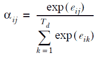
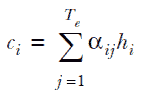
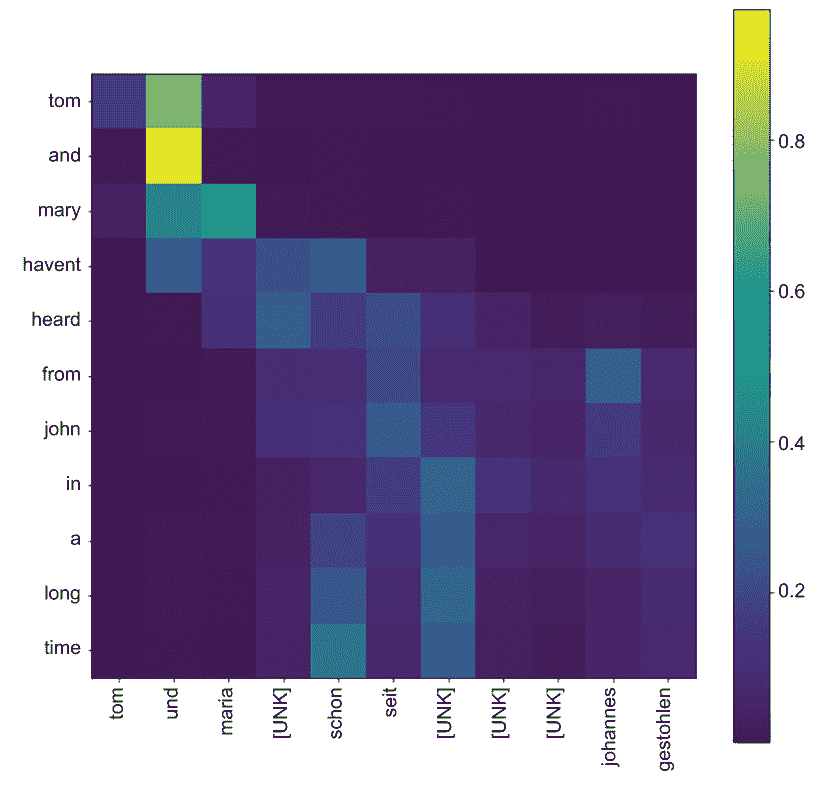
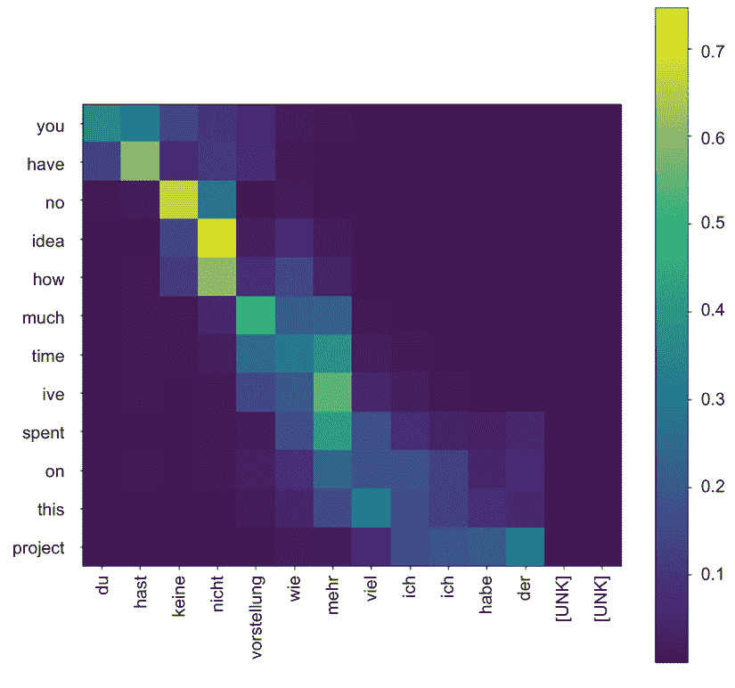

# 第十二章：序列到序列学习：第二部分

本章内容包括

+   实现序列到序列模型的注意力机制

+   从注意力层生成可视化图表以获取模型洞察

在上一章中，我们构建了一个英语到德语的机器翻译器。机器学习模型是一个序列到序列模型，可以学习将任意长的序列映射到其他任意长的序列。它有两个主要组成部分：编码器和解码器。为了达到这个目的，我们首先下载了一个机器翻译数据集，检查了该数据集的结构，并对其进行了一些处理（例如，添加 SOS 和 EOS 标记）以准备好用于模型。接下来，我们使用标准的 Keras 层定义了机器翻译模型。这个模型的一个特殊特点是它能够接受原始字符串并在内部将其转换为数字表示。为了实现这一点，我们使用了 Keras 的 TextVectorization 层。当模型被定义后，我们使用我们处理的数据集进行了训练，并对两个指标进行了评估：生成的序列的每个词的准确率和 BLEU。BLEU 是一个比准确率更高级的指标，它模拟了人类如何评估翻译质量。训练模型时，我们使用了一种称为教师强迫的技术。当使用教师强迫时，我们将目标翻译的解码器提供给目标翻译偏移了 1。这意味着解码器根据前一个词预测目标序列中的下一个词，而不是在不了解目标序列的情况下尝试预测整个目标序列。这导致了更好的性能。最后，我们不得不重新定义我们的模型以适应推断。这是因为我们必须修改解码器，使其一次预测一个词而不是一个序列。这样，我们可以在推断时创建一个递归解码器，该解码器预测一个词并将预测的词作为输入预测序列中的下一个词。

在这一章中，我们将探讨提高模型准确性的方法。为此，我们将使用注意力机制。没有注意力机制，机器翻译模型依赖于处理输入序列后产生的最后输出。通过注意力机制，模型能够在生成翻译过程中从所有时间步骤（处理输入序列时）获得丰富的表示。最后，我们将通过可视化注意力机制来总结本章，以洞察模型在翻译过程中如何关注提供给它的单词。

本章中我们进行的数据和处理与上一章完全相同。因此，我们不会详细讨论数据。您已经提供了在笔记本中加载和处理数据所需的所有代码。但让我们回顾一下我们执行的关键步骤：

+   从[`www.manythings.org/anki/deu-eng.zip`](http://www.manythings.org/anki/deu-eng.zip)手动下载数据集。

+   数据以制表符分隔的格式和<德语短语><制表符><英语短语><制表符><属性>的格式呈现。我们特别关注记录中的前两个制表符分隔的值。我们将预测给定英语短语的德语短语。

+   我们从数据集中随机抽样了 50,000 个数据点，并使用其中的 5,000 个（即 10%）作为验证数据，另外的 5,000 个（即 10%）作为测试数据。

+   我们为每个德语短语添加了一个开始标记（例如，SOS）和一个结束标记（例如，EOS）。这是一个重要的预处理步骤，因为这帮助我们在推断时从我们的递归解码器中递归地推断单词（即，提供 SOS 作为初始种子并继续预测直到模型输出 EOS 或达到最大长度）。

+   我们查看词汇量和序列长度的摘要统计数据，因为这些超参数对我们的 TextVectorization 层非常重要（该层可以在 tensorflow.keras.layers.experimental.preprocessing.TextVectorization*中找到）。

+   词汇量设置为语料库中出现次数超过 10 次的唯一单词数，序列长度设置为两种语言的 99%分位数（再加上 5 的缓冲区）。

## 12.1 着眼于过去：通过注意力改进我们的模型

您有一个可工作的翻译器原型，但仍认为可以通过使用注意力来提高准确性。注意力通过允许解码器查看编码器在整个输入序列上产生的所有输出，为解码器提供了更丰富的输出。您将修改以前实施的模型以包含一个注意力层，该层接受编码器的所有输出（每个时间步长一个）并为每个解码器步骤产生一系列输出，这些输出将与解码器产生的标准输出串联起来。

我们有一个可以从英语翻译成德语的工作机器翻译模型。通过使用所谓的*Bahdanau 注意力*可以进一步提高该模型的性能。 Bahdanau 注意力是由 Bahdanau 等人在论文“Neural Machine Translation by Jointly Learning to Align and Translate”中介绍的（[`arxiv.org/pdf/1409.0473.pdf`](https://arxiv.org/pdf/1409.0473.pdf)）。我们已经在第五章中讨论过自注意力。这两种注意机制的基本原理是相同的。它们都允许模型以更好地理解语言为目的，在序列中获取历史/未来输入的丰富表示。让我们看看如何将注意力机制与我们现有的编码器-解码器模型结合起来。

注意机制为每个解码器时间步产生一个输出，类似于解码器的 GRU 模型在每个时间步产生一个输出。注意力输出与解码器的 GRU 输出相结合，并馈送到解码器中的后续隐藏层。解码器的每个时间步产生的注意力输出结合了来自所有时间步的编码器输出，这为解码器提供了有关英语输入序列的宝贵信息。注意力层被允许以不同的方式混合编码器输出，以产生每个解码器时间步的输出，具体取决于解码器模型在给定时刻正在处理的翻译部分。您应该能够看到注意力机制有多强大。以前，上下文向量是编码器向解码器可访问的唯一输入。这是一个巨大的性能瓶颈，因为使用小型向量编码句子中存在的所有信息对编码器来说是不切实际的。

让我们更深入地探讨一下，在计算注意力输出时发生的具体计算。假设在位置*j*（1 < *j* < *T*[e]）处的编码器输出被表示为*h*[j]，并且在时间*i*（1 < *i* < *T*[d]）的解码器 RNN 输出状态被表示为*s*[i]；那么第*i*次解码步骤的注意力输出*c*[i]由以下计算得出

*e*[ij] = *v*^T *tanh*(*s*[i -1] *W* + *h*[j]*U*)





在这里，W、U 和 v 是权重矩阵（像神经网络权重一样随机初始化）。它们的形状根据隐藏表示 s 和 h 的维度进行定义，这将很快详细讨论。总之，对于给定的解码器位置，这组方程

+   使用小型全连接网络计算能量值，表示每个编码器输出对于该解码步骤的重要程度

+   将能量归一化为表示编码器步骤上的概率分布

+   使用概率分布计算编码器输出的加权和

### 12.1.1 在 TensorFlow 中实现 Bahdanau 注意力

不幸的是，TensorFlow 没有内置的层可供我们在模型中直接使用以启用注意力机制。因此，我们将使用 Keras 子类化 API 实现一个 Attention 层。我们将称之为 DecoderRNNAttentionWrapper，并且必须实现以下函数：

+   __init__—定义层在能够正确操作之前需要进行的各种初始化

+   build()—定义与计算相关联的参数（例如，可训练权重）及其形状

+   调用（call()）—定义应由该层进行的计算和最终输出

__init__() 函数用于初始化层，包括需要正确运行的任何属性。在这种情况下，我们的 DecoderRNNAttentionWrapper 接受一个 cell_fn 作为参数。cell_fn 需要是一个实现了 tf.keras.layers.AbstractRNNCell 接口的 Keras 层对象（[`mng.bz/pO18`](http://mng.bz/pO18)）。有几个选项，例如 tf.keras.layers.GRUCell、tf.keras.layers.LSTMCell 和 tf.keras.layers.RNNCell。在这个例子中，我们将使用 tf.keras.layers.GRUCell。

tf.keras.layers.GRUCell 和 tf.keras.layers.GRU 之间的区别

GRUCell 可以看作是 GRU 层的一个抽象，它包含了 RNN 层中最简化的计算。给定一个输入和上一个状态，它计算下一个输出和下一个状态。这是控制 RNN 层的最原始的计算：

```py
output, next_state = tf.keras.layers.GRUCell(input, state)
```

换句话说，GRUCell 封装了计算输入序列中单个时间步所需的计算。GRU 层是 GRUCell 的完全实现，可以处理整个序列。此外，GRU 层还提供了 return_state 和 return_sequence 等选项来控制 GRU 层产生的输出。

简言之，GRU 层提供了便利的处理输入序列的方式，而 GRUCell 则暴露了更细粒度的实现细节，允许处理序列中的单个时间步。

在这里，我们决定使用 GRU，因为 GRU 模型比 LSTM 简单得多（意味着减少了训练时间），但在 NLP 任务上实现了大致相似的结果：

```py
def __init__(self, cell_fn, units, **kwargs):
    self._cell_fn = cell_fn
    self.units = units
    super(DecoderRNNAttentionWrapper, self).__init__(**kwargs)
```

接下来，定义了 build() 函数。build 函数声明了用于注意力计算的三个权重矩阵：W、U 和 v。参数 input_shape 包含了输入的形状。我们的输入将是一个包含编码器输出和解码器 RNN 输入的元组：

```py
def build(self, input_shape):

    self.W_a = self.add_weight(
        name='W_a',
        shape=tf.TensorShape((input_shape[0][2], input_shape[0][2])),
        initializer='uniform',
        trainable=True
    )

    self.U_a = self.add_weight(
        name='U_a',
        shape=tf.TensorShape((self._cell_fn.units, self._cell_fn.units)),
        initializer='uniform',
        trainable=True
    )

    self.V_a = self.add_weight(
        name='V_a',
        shape=tf.TensorShape((input_shape[0][2], 1)),
        initializer='uniform',
        trainable=True
    )

    super(DecoderRNNAttentionWrapper, self).build(input_shape)
```

注意权重定义中最重要的参数是 shape 参数。我们定义它们的形状为

+   W_a（表示 W）的形状为[<encoder hidden size>, <attention hidden size>]

+   U_a（表示 U）的形状为[<decoder hidden size>, <attention hidden size>]

+   V_a（表示 v）的形状为[<attention hidden size>, 1]

这里，<encoder hidden size> 和 <decoder hidden size> 分别是编码器或解码器的 RNN 层的最终输出中的单元数。我们通常保持编码器和解码器 RNN 大小相同，以简化计算。<attention hidden size>是该层的一个超参数，可以设置为任何值，并表示注意力内部计算的维度。最后，我们定义了 call()方法（见列表 12.1）。call()方法封装了在输入时发生的计算。这是计算注意力输出所需的繁重工作的地方。在高层次上，注意力层需要遍历所有编码器输入（即每个时间步）以及每个解码器输入。

列表 12.1 解码器 RNN 注意力包装中的注意力计算。

```py
def call(self, inputs, initial_state, training=False):

    def _step(inputs, states):
        """ Step function for computing energy for a single decoder state
        inputs: (batchsize * de_in_dim)
        states: [(batchsize * de_latent_dim)]
        """

        encoder_full_seq = states[-1]                                   ❶

        W_a_dot_h = K.dot(encoder_outputs, self.W_a)                    ❷

        U_a_dot_s = K.expand_dims(K.dot(states[0], self.U_a), 1)        ❸

        Wh_plus_Us = K.tanh(W_a_dot_h + U_a_dot_s)                      ❹

        e_i = K.squeeze(K.dot(Wh_plus_Us, self.V_a), axis=-1)           ❺
        a_i = K.softmax(e_i)                                            ❺

        c_i = K.sum(encoder_outputs * K.expand_dims(a_i, -1), axis=1)   ❻

        s, states = self._cell_fn(K.concatenate([inputs, c_i], axis=-1), 
➥ states)                                                              ❼

        return (s, a_i), states

   """ Computing outputs """

   encoder_outputs, decoder_inputs = inputs                             ❽

   _, attn_outputs, _ = K.rnn(
        step_function=_step, inputs=decoder_inputs, 
➥ initial_states=[initial_state], constants=[encoder_outputs]          ❾
   )

   # attn_out => (batch_size, de_seq_len, de_hidden_size)
   # attn_energy => (batch_size, de_seq_len, en_seq_len)
   attn_out, attn_energy = attn_outputs                                 ❿

   return attn_out, attn_energy
```

❶ 在调用 _step 函数时，我们将 encoder_outputs 作为常量传递，因为我们需要访问完整的编码器序列。在 _step 函数内部访问它。

❷ 计算 S.Wa，其中 S 表示所有编码器输出，S=[s0, s1, ..., si]。这产生一个大小为[batch size, en_seq_len, hidden size]的输出。

❸ 计算 hj.Ua，其中 hj 表示第 j 个解码步骤。这产生一个大小为[batch_size, 1, hidden size]的输出。

❹ 计算 tanh(S.Wa + hj.Ua)。这产生一个大小为[batch_size, en_seq_len, hidden size]的输出。

❺ 计算能量并对其进行归一化。产生一个大小为[batch_size, en_seq_len]的输出。

❻ 将最终注意力输出（c_i）计算为 h_j（对所有 j）的加权和，其中权重由 a_i 表示。产生一个大小为[batch_size, hidden_size]的输出。

❼ 将当前输入和 c_i 连接起来，并将其馈送到解码器 RNN 以获得输出。

❽ 注意力层的输入是编码器输出和解码器 RNN 输入。

❾ K.rnn()函数对解码器输入中的每个输入执行 _step()函数，以生成所有解码步骤的注意力输出。

❿ 最终输出有两部分：一个大小为[batch size, de_seq_len, hidden size]的注意力输出，以及一个大小为[batch dize, de_seq_len, en_seq_len]的注意力能量输出。

让我们揭开这个函数中做了什么。这个层的输入是一个两个元素的可迭代对象：编码器输出序列（encoder_outputs）和解码器 RNN 输入序列（decoder_inputs）。接下来，我们使用 Keras 的一个特殊后端函数 K.rnn()（[`mng.bz/OoPR`](http://mng.bz/OoPR)）来迭代这些输入，同时计算所需的最终输出。在我们的例子中，它被称为

```py
_, attn_outputs, _ = K.rnn(
        step_function=_step, inputs=decoder_inputs, initial_states=[initial_state], constants=[encoder_outputs],
   )
```

在这里，它将 step_function 应用于输入张量的每个时间步切片。例如，decoder_inputs 是一个 [<batch size>, <decoder time steps>, <embedding size>] 大小的输入。然后，K.rnn() 函数将 step_function 应用于每个 [<batch size>, <embedding size>] 输出，重复 <decoder time steps> 次。此函数执行的更新是递归更新，意味着它接受一个初始状态并生成一个新状态，直到达到输入序列的结尾。为此，initial_states 提供了起始状态。最后，我们将 encoder_outputs 作为常数传递给 step_function。这非常重要，因为我们需要计算每个解码步骤的注意力时编码器隐藏输出的完整序列。在 step_function 中，常数被附加到状态参数的值之后。因此，您可以将 encoder_outputs 访问为 states 的最后一个元素。

_step 函数执行我们在列表 12.1 中概述的计算，用于单个解码器时间步骤。它接受输入（原始输入的时间维度的一个切片）和状态（在 K.rnn() 函数中用 initial_states 值初始化）。接下来，使用这两个实体计算单个时间步骤的归一化注意力能量（即 α[ij]）（a_i）。随后，计算 c_i，这是由 a_i 加权的编码器输出的加权和。然后，它使用当前输入和状态更新 cell_fn（即 GRUCell）。注意，cell_fn 的当前输入是解码器输入和 c_i 的连接（即编码器输入的加权和）。cell 函数然后输出输出状态以及下一个状态。我们返回此信息。换句话说，_step() 函数输出该时间步的输出（即解码器 RNN 输出和计算编码器输入加权和的归一化能量的元组）以及解码器 RNN 的下一个状态。

最后，您可以使用 K.rnn() 函数获得所有解码器时间步骤的 _step 函数的完整输出，如所示。我们只对输出本身感兴趣（由 attn_outputs 表示），将忽略函数输出的其他内容。

当调用 K.rnn() 函数时，该函数输出以下输出：

+   last_output——step_function 在序列结束时产生的最后输出

+   outputs——step_function 产生的所有输出

+   new_states——step_function 在序列结束时产生的最后状态

最后，call() 函数产生两个输出：

+   attn_out——保存所有解码步骤的注意力输出

+   attn_energy——为一批数据提供归一化能量值，其中一个示例的能量矩阵包含所有编码器时间步的能量值，用于每个解码器时间步

我们已经讨论了 DecoderRNNAttentionWrapper 层的最重要的功能。如果你想查看 DecoderRNNAttentionWrapper 的完整子类实现，请参考 Ch11/11.1_seq2seq_machine_translation.ipynb 中的代码。

### 12.1.2 定义最终模型

在定义最终模型时，get_vectorizer() 和 get_encoder() 函数保持与上一节中显示的相同。所有需要的修改都需要在解码器中进行。因此，让我们定义一个函数，get_final_seq2seq_model_with_attention()，它提供了具有 Bahdanau 注意力的解码器，如下一个列表所示。

列表 12.2 定义具有注意力的最终序列到序列模型

```py
def get_final_seq2seq_model_with_attention(n_vocab, encoder, vectorizer):
    """ Define the final encoder-decoder model """

    e_inp = tf.keras.Input(shape=(1,), dtype=tf.string, name='e_input_final')          
    fwd_state, bwd_state, en_states = encoder(e_inp)                              ❶

    d_inp = tf.keras.Input(shape=(1,), dtype=tf.string, name='d_input')           ❷

    d_vectorized_out = vectorizer(d_inp)                                          ❸

    d_emb_layer = tf.keras.layers.Embedding(
        n_vocab+2, 128, mask_zero=True, name='d_embedding'                        ❹
    )    
    d_emb_out = d_emb_layer(d_vectorized_out)                                     ❹

    d_init_state = tf.keras.layers.Concatenate(axis=-1)([fwd_state, bwd_state])   ❺

    gru_cell = tf.keras.layers.GRUCell(256)                                       ❻
    attn_out, _  = DecoderRNNAttentionWrapper(
        cell_fn=gru_cell, units=512, name="d_attention"
    )([en_states, d_emb_out], initial_state=d_init_state)                         ❼

    d_dense_layer_1 = tf.keras.layers.Dense(512, activation='relu', name='d_dense_1')
    d_dense1_out = d_dense_layer_1(attn_out)                                      ❽

    d_final_layer = tf.keras.layers.Dense(
        n_vocab+2, activation='softmax', name='d_dense_final'
    )
    d_final_out = d_final_layer(d_dense1_out)                                     ❽

    seq2seq = tf.keras.models.Model(
        inputs=[e_inp, d_inp], outputs=d_final_out,                               ❾
        name='final_seq2seq_with_attention'
    )

    return seq2seq
```

❶ 获取所有时间步长的编码器输出。

❷ 输入的形状为（None,1），接受字符串数组。

❸ 将数据向量化（分配标记 ID）。

❹ 定义一个嵌入层，将 ID 转换为单词向量。

❺ 将解码器的初始状态定义为最后一个正向和反向编码器状态的串联。

❻ 定义一个 GRUCell，然后将其用于注意力层。

❼ 获取注意力输出。将 GRUCell 作为 cell_fn 传递，其中输入是 en_states（即所有编码器状态）和 d_emb_out（解码器 RNN 的输入）。

❽ 定义中间和最终 Dense 层的输出。

❾ 定义一个模型，以编码器和解码器输入作为输入，并输出最终预测（d_final_out）。

我们已经做了所有的艰苦工作。因此，对解码器的更改可以总结为两行代码：

```py
    gru_cell = tf.keras.layers.GRUCell(256)
    attn_out, _  = DecoderRNNAttentionWrapper(
        cell_fn=gru_cell, units=512, name="d_attention"
    )(
        [en_states, d_emb_out], initial_state=d_init_state
    )
```

我们首先定义一个具有 256 个隐藏单元的 GRUCell 对象。然后我们定义了 DecoderRNNAttentionWrapper，其中 cell_fn 是我们定义的 GRUCell，而单位设置为 512。DecoderRNNAttentionWrapper 中的单位定义了权重和中间注意力输出的维度。我们传递 en_states（即编码器输出序列）和 d_emb_out（即传递给 RNN 的解码器输入序列），并将初始状态设置为编码器的最终状态（即 d_init_state）。

接下来，和以前一样，我们必须定义一个 get_vectorizer() 函数（请参见下一个列表），以获取英语/德语矢量化器。

列表 12.3 定义用于编码器-解码器模型的 TextVectorizers

```py
def get_vectorizer(
    corpus, n_vocab, max_length=None, return_vocabulary=True, name=None
):

    """ Return a text vectorization layer or a model """

    inp = tf.keras.Input(shape=(1,), dtype=tf.string, name='encoder_input')❶

    vectorize_layer = tf.keras.layers.experimental.preprocessing.TextVectorization(
        max_tokens=n_vocab+2,                                              ❷
        output_mode='int',
        output_sequence_length=max_length,        
        name=name
    )

    vectorize_layer.adapt(corpus)                                          ❸

    vectorized_out = vectorize_layer(inp)                                  ❹

    if not return_vocabulary: 
        return tf.keras.models.Model(inputs=inp, outputs=vectorized_out)   ❺
    else:
        return tf.keras.models.Model(
            inputs=inp, outputs=vectorized_out                             ❻
        ), vectorize_layer.get_vocabulary() 
```

❶ 定义一个输入层，接受字符串列表（或字符串数组）。

❷ 在定义词汇大小时，有两个特殊标记，（填充）和 '[UNK]'（OOV 标记），会自动添加。

❸ 在数据上拟合 vectorizer 层。

❹ 获取输入数据的标记 ID。

❺ 仅返回模型，该模型接受字符串数组并输出标记 ID 的张量。

❻ 除了模型外，返回词汇表。

在下一个列表中显示的 get_encoder() 函数构建了编码器。由于这些已经详细讨论过，因此不会在这里重复。

列表 12.4 返回编码器的函数

```py
def get_encoder(n_vocab, vectorizer):
    """ Define the encoder of the seq2seq model"""

    inp = tf.keras.Input(shape=(1,), dtype=tf.string, name='e_input')  ❶

    vectorized_out = vectorizer(inp)                                   ❷

    emb_layer = tf.keras.layers.Embedding(
        n_vocab+2, 128, mask_zero=True, name='e_embedding'             ❸
    )

    emb_out = emb_layer(vectorized_out)                                ❹

    gru_layer = tf.keras.layers.Bidirectional(
        tf.keras.layers.GRU(128, name='e_gru'),                        ❺
        name='e_bidirectional_gru'
    )

    gru_out = gru_layer(emb_out)                                       ❻
    encoder = tf.keras.models.Model(
        inputs=inp, outputs=gru_out, name='encoder'
    )                                                                  ❼

    return encoder
```

❶ 输入的形状为（None,1），接受字符串数组。

❷ 对数据进行向量化（分配令牌 ID）。

❸ 定义一个嵌入层来将 ID 转换为单词向量。

❹ 获取令牌 ID 的嵌入。

❺ 定义一个双向 GRU 层。编码器同时查看英文文本（即输入）的前向和后向；这将导致更好的性能。

❻ 获取 GRU 层的输出（模型返回的最后一个输出状态向量）。

❼ 定义编码器模型；这将接受一个字符串列表/数组作为输入，并将 GRU 模型的最后输出状态作为输出返回。

作为最后一步，我们定义了最终模型，并使用与之前模型相同的规格进行编译：

```py
# Get the English vectorizer/vocabulary
en_vectorizer, en_vocabulary = 
➥ get_vectorizer(np.array(train_df["EN"].tolist()), en_vocab, max_length=en_seq_length, name='e_vectorizer')
# Get the German vectorizer/vocabulary
de_vectorizer, de_vocabulary = 
➥ get_vectorizer(np.array(train_df["DE"].tolist()), de_vocab, 
➥ max_length=de_seq_length-1, name='d_vectorizer')

# Define the final model with attention
encoder = get_encoder_with_attention(en_vocab, en_vectorizer)
final_model_with_attention = 
➥ get_final_seq2seq_model_with_attention(de_vocab, encoder, de_vectorizer)

# Compile the model
final_model_with_attention.compile(
    loss='sparse_categorical_crossentropy', 
    optimizer='adam', 
    metrics=['accuracy']
)
```

### 12.1.3 训练模型

训练模型非常简单，因为它与以前的情况相同。我们所需要做的就是调用 train_model() 函数，并使用参数模型（一个要训练/评估的 Keras 模型）、矢量化器（将令牌 ID 转换为文本的目标语言矢量化器）、train_df（训练数据）、valid_df（验证数据）、test_df（测试数据）、epochs（表示模型需要训练多少个周期的整数）和 batch_size（训练/评估批次的大小）：

```py
epochs = 5
batch_size = 128

train_model(final_model_with_attention, de_vectorizer, train_df, valid_df, 
➥ test_df, epochs, batch_size)
```

这将输出

```py
Evaluating batch 39/39
Epoch 1/5
    (train) loss: 2.096887740951318 - accuracy: 0.6887444907274002 - 
➥ bleu: 0.00020170408678925458
    (valid) loss: 1.5872839291890461 - accuracy: 0.7375801282051282 - 
➥ bleu: 0.002304922518160425
...

Evaluating batch 39/39
Epoch 5/5
    (train) loss: 0.7739567615282841 - accuracy: 0.8378756006176655 - 
➥ bleu: 0.20010080750506093
    (valid) loss: 0.8180131682982812 - accuracy: 0.837830534348121 - 
➥ bleu: 0.20100039279462362
Evaluating batch 39/39
(test) loss: 0.8390972828253721 - accuracy: 0.8342147454237326 - bleu: 
➥ 0.19782372616582572
```

与我们之前拥有的最后模型相比，这是相当大的改进。我们的验证和测试 BLEU 分数几乎翻了一番。所有这些都可能是因为我们引入了注意机制来缓解编码器-解码器模型中的巨大性能瓶颈。

注意，在一台配备 NVIDIA GeForce RTX 2070 8 GB 的英特尔 Core i5 机器上，训练大约需要五分钟来运行五个周期。

最后，为了以后使用，我们保存了训练好的模型，以及词汇表：

```py
## Save the model
os.makedirs('models', exist_ok=True)
tf.keras.models.save_model(final_model_with_attention, 
➥ os.path.join('models', 'seq2seq_attention'))

# Save the vocabulary
import json
os.makedirs(
    os.path.join('models', 'seq2seq_attention_vocab'), exist_ok=True
)
with open(os.path.join('models', 'seq2seq_attention_vocab', 
➥ 'de_vocab.json'), 'w') as f:
    json.dump(de_vocabulary, f)

with open(os.path.join('models', 'seq2seq_attention_vocab', 
➥ 'en_vocab.json'), 'w') as f:
    json.dump(en_vocabulary, f)
```

英德翻译的最新结果

了解我们模型的位置的一种方法是将其与在英德翻译上取得的最新成果进行比较。在编写本书时的 2021 年，模型已经达到了 0.3514 的 BLEU 分数。该模型在文章“Lessons on Parameter Sharing across Layers in Transformers”中由高瀬等人介绍（[`arxiv.org/pdf/2104.06022v1.pdf`](https://arxiv.org/pdf/2104.06022v1.pdf)）。

这不应被视为与我们模型的确切比较，因为基准模型通常是在 WMT 英德数据集上训练的（[`nlp.stanford.edu/projects/nmt/`](https://nlp.stanford.edu/projects/nmt/)），这是一个更大更复杂的数据集。但是，考虑到我们有一个相对简单的模型，并且没有特殊的训练时间优化，0.1978 是一个不错的分数。

有了这个，我们将讨论如何可视化注意权重以查看模型在解码输入时使用的注意模式。

练习 1

您发明了一种新型的注意力机制称为 AttentionX。与 Bahdanau 注意力不同，这种注意力机制需要编码器输入和解码器的 RNN 输出才能产生最终输出。全连接层使用这个最终输出而不是常规的解码器 RNN 输出。在名为 AttentionX 的层中实现了这种新的注意力机制。对于编码器输入 x 和解码器的 RNN 输出 y，可以调用它：

```py
z = AttentionX()([x, y])
```

最终输出 z 是一个大小为 [<批次大小>，<解码器时间步数>，<隐藏大小>] 的输出。您将如何更改以下解码器以使用这种新的注意力机制？

```py
e_inp = tf.keras.Input(shape=(1,), dtype=tf.string, name='e_input_final')          
fwd_state, bwd_state, en_states = encoder(e_inp)      

d_inp = tf.keras.Input(shape=(1,), dtype=tf.string, name='d_input')     

d_vectorized_out = vectorizer(d_inp)                                

d_emb_layer = tf.keras.layers.Embedding(
    n_vocab+2, 128, mask_zero=True, name='d_embedding'         
)    
d_emb_out = d_emb_layer(d_vectorized_out)     

d_init_state = tf.keras.layers.Concatenate(axis=-1)([fwd_state, bwd_state]) 

gru_out = tf.keras.layers.GRU(256, return_sequences=True)(
    d_emb_out, initial_state=d_init_state
)           

d_dense_layer_1 = tf.keras.layers.Dense(512, activation='relu', name='d_dense_1')
d_dense1_out = d_dense_layer_1(attn_out)         

d_final_layer = tf.keras.layers.Dense(
    n_vocab+2, activation='softmax', name='d_dense_final'
)
d_final_out = d_final_layer(d_dense1_out)   
```

## 12.2 可视化注意力

您已经确定基于注意力机制的模型比没有注意力的模型效果更好。但是您还是有怀疑，并想要了解注意力层是否产生有意义的输出。为此，您将可视化模型为几个输入序列生成的注意力模式。

除了性能之外，注意力机制带给模型的另一个优势就是它带来的可解释性。注意力机制的中间输出之一——规范化能量值，可以提供有力的洞见。由于规范化能量值表示每个编码器输出在每个解码时步骤中对解码/翻译的贡献程度，因此它可以用于生成热力图，突出显示与特定德语单词对应的最重要的英语单词。

如果我们回到 DecoderRNNAttentionWrapper，调用它对某个输入进行操作，将会产生两个输出：

+   解码器 RNN 输出序列

+   每个解码器位置对所有编码器位置的 alpha（即规范化能量值）

我们要获取的是第二个输出。那个张量拥有解锁注意力机制所带来的强大可解释性的关键。

我们编写一个名为 attention_visualizer() 的函数，该函数将加载保存的模型，并输出模型的预测结果以及有助于生成最终热力图的注意力能量。在这个函数中，我们将加载模型并使用训练后的层来重现解码器的中间和最终输出，就像下一个列表中所示的那样。这类似于我们如何重现模型中的各个步骤，从训练好的模型中创建推理模型一样。

代码清单 12.5 可视化输入文本中的注意力模式的模型

```py
def attention_visualizer(save_path):
    """ Define the attention visualizer model """

    model = tf.keras.models.load_model(save_path)                  ❶

    e_inp = tf.keras.Input(
        shape=(1,), dtype=tf.string, name='e_input_final'
    )                                                              ❷
    en_model = model.get_layer("encoder")                          ❷
    fwd_state, bwd_state, en_states = en_model(e_inp)              ❷

    e_vec_out = en_model.get_layer("e_vectorizer")(e_inp)          ❸

    d_inp = tf.keras.Input(
        shape=(1,), dtype=tf.string, name='d_infer_input'
    )                                                              ❹

    d_vec_layer = model.get_layer('d_vectorizer')                  ❺
    d_vec_out = d_vec_layer(d_inp)                                 ❺

    d_emb_out = model.get_layer('d_embedding')(d_vec_out)          ❻

    d_attn_layer = model.get_layer("d_attention")                  ❻

    d_init_state = tf.keras.layers.Concatenate(axis=-1)(
        [fwd_state, bwd_state]
    )                                                              ❻

    attn_out, attn_states = d_attn_layer(
        [en_states, d_emb_out], initial_state=d_init_state
    )                                                              ❻

    d_dense1_out = model.get_layer("d_dense_1")(attn_out)          ❻

    d_final_out = model.get_layer("d_dense_final")(d_dense1_out)   ❻

    visualizer_model = tf.keras.models.Model(                      ❼
        inputs=[e_inp, d_inp], 
        outputs=[d_final_out, attn_states, e_vec_out, d_vec_out]
    )

    return visualizer_model
```

❶ 加载模型。

❷ 为模型定义编码器输入并获取编码器的最终输出。

❸ 获取编码器向量化器（用于解释最终输出）。

❹ 定义解码器输入。

❺ 获取解码器向量器和输出。

❻ 接下来的几个步骤只是重复训练模型中的步骤。我们只需获取相应的层，并将上一步的输出传递给当前步骤即可。

❼ 在这里，我们定义了最终用于可视化注意力模式的模型；我们对 attn_states 输出感兴趣（即，归一化的能量值）。我们还需要向可视化添加向量化的令牌 ID。

注意，我们定义的最终模型返回了四个不同的输出，而不是训练好的模型只返回了预测结果。我们还需要一个 get_vocabulary()函数，它将加载保存的词汇表：

```py
def get_vocabularies(save_dir):
    """ Load the vocabularies """

    with open(os.path.join(save_dir, 'en_vocab.json'), 'r') as f:
        en_vocabulary = json.load(f)

    with open(os.path.join(save_dir, 'de_vocab.json'), 'r') as f:
        de_vocabulary = json.load(f)

    return en_vocabulary, de_vocabulary
```

最后，调用这些函数，使得我们拥有词汇表和模型准备就绪：

```py
print("Loading vocabularies")
en_vocabulary, de_vocabulary = get_vocabularies(
    os.path.join('models', 'seq2seq_attention_vocab')
)

print("Loading weights and generating the inference model")
visualizer_model = attention_visualizer(
    os.path.join('models', 'seq2seq_attention')
)
print("\tDone")
```

接下来，我们将继续可视化 visualizer_model 生成的输出；我们将使用 Python 库 matplotlib 来可视化几个示例的注意力模式。让我们定义一个名为 visualize_attention()的函数，它接受 visualizer_model、两个词汇表、一个样本英文句子和相应的德文翻译（请参见下面的代码）。然后它将对输入进行预测，检索注意力权重，生成热图，并用英文/德文标记两个轴。

清单 12.6 使用输入文本可视化注意力模式

```py
import matplotlib.pyplot as plt
%matplotlib inline

def visualize_attention(visualizer_model, en_vocabulary, de_vocabulary, 
➥ sample_en_text, sample_de_text, fig_savepath):
    """ Visualize the attention patterns """

    print("Input: {}".format(sample_en_text))

    d_pred, attention_weights, e_out, d_out = visualizer_model.predict(
        [np.array([sample_en_text]), np.array([sample_de_text])]
    )                                                              ❶

    d_pred_out = np.argmax(d_pred[0], axis=-1)                     ❷

    y_ticklabels = []                                              ❸
    for e_id in e_out[0]:                                          ❸
        if en_vocabulary[e_id] == "":                              ❸
            break                                                  ❸
        y_ticklabels.append(en_vocabulary[e_id])                   ❸

    x_ticklabels = []                                              ❹
    for d_id in d_pred_out:                                        ❹
        if de_vocabulary[d_id] == 'eos':                           ❹
            break                                                  ❹
        x_ticklabels.append(de_vocabulary[d_id])                   ❹

    fig, ax = plt.subplots(figsize=(14, 14))

    attention_weights_filtered = attention_weights[
        0, :len(y_ticklabels), :len(x_ticklabels)
    ]                                                              ❺

    im = ax.imshow(attention_weights_filtered)                     ❻

    ax.set_xticks(np.arange(attention_weights_filtered.shape[1]))  ❼
    ax.set_yticks(np.arange(attention_weights_filtered.shape[0]))  ❼
    ax.set_xticklabels(x_ticklabels)                               ❼
    ax.set_yticklabels(y_ticklabels)                               ❼

    ax.tick_params(labelsize=20)                                   ❼
    ax.tick_params(axis='x', labelrotation=90)                     ❼

    plt.colorbar(im)                                               ❽
    plt.subplots_adjust(left=0.2, bottom=0.2)

    save_dir, _ = os.path.split(fig_savepath)                      ❾
    if not os.path.exists(save_dir):                               ❾
        os.makedirs(save_dir, exist_ok=True)                       ❾
    plt.savefig(fig_savepath)                                      ❾
```

❶ 获取模型的预测结果。

❷ 获取模型预测结果的令牌 ID。

❸ 我们的 y 轴刻度标签将是输入的英文单词。一旦看到填充标记，我们就停止。

❹ 我们的 x 轴刻度标签将是预测的德文单词。一旦看到 EOS 标记，我们就停止。

❺ 我们将只可视化有用的输入和预测的单词，这样像填充值和 EOS 标记之后的内容都将被丢弃。

❻ 生成注意力热图。

❼ 设置 x 轴刻度、y 轴刻度和刻度标签。

❽ 生成色条以了解热图中的值范围。

❾ 将图保存到磁盘。

首先，我们将英文和德文输入文本输入模型以生成预测。由于我们仍在使用教师强迫模型，因此我们需要输入英文和德文输入文本。你可能会想，“这是否意味着我必须准备好德文翻译，并且只能在训练模式下可视化注意力模式？”当然不是！你可以像我们在本章的前一节中所做的那样定义一个推断模型，并且仍然可以可视化注意力模式。我们正在使用训练好的模型本身来可视化模式，因为我想专注于可视化注意力模式，而不是定义推断模型（我们已经为另一个模型完成了这个任务）。

一旦预测和注意权重得到，我们定义两个列表：x_ticklabels 和 y_ticklabels。它们将是热图中两个轴上看到的标签（即英语/德语单词）。我们将在行维度上有英语单词，列维度上有德语单词（图 12.1）。我们还将进行简单的过滤，以消除填充（即“”）和出现在 EOS 标记之后的德语文本，并获得满足这两个条件的范围内的注意力权重。然后，您只需调用 matplotlib 的 imshow() 函数来生成热图，并设置轴的刻度和这些刻度的标签。最后，将图保存到磁盘上。

让我们试试这个！让我们从我们的测试 DataFrame 中选取几个示例并可视化注意力模式。我们将创建 10 个可视化效果，并确保我们选择的这 10 个示例至少有 10 个英语单词，以确保我们不可视化非常短的短语：

```py
# Generate attention patterns for a few inputs
i = 0
j = 0
while j<9:
    sample_en_text = test_df["EN"].iloc[i]
    sample_de_text = test_df["DE"].iloc[i:i+1].str.rsplit(n=1, 
➥ expand=True).iloc[:,0].tolist()
    i += 1

    if len(sample_en_text.split(" ")) > 10:
        j += 1
    else:
        continue

    visualize_attention(
        visualizer_model, en_vocabulary, de_vocabulary, sample_en_text, 
        sample_de_text, os.path.join('plots','attention_{}.png'.format(i))
    )
```

如果您成功运行此代码，您应该会看到并将 10 个注意力可视化显示并存储在磁盘上。在图 12.1 和 12.2 中，我们展示了两个这样的可视化。



图 12.1 为输入英文文本可视化的注意力模式

在这些图中，颜色越浅，模型就越关注该单词。在图 12.1 中，我们可以看到，当翻译单词“und”和“maria”时，模型主要关注的是“and”和“mary”分别。例如，如果您去谷歌翻译并为“and”这个词做德语翻译，您将会发现这是正确的。在图 12.2 中，我们可以看到，在生成“hast keine nicht”时，模型关注的是短语“have no idea”。我们可以做出的另一个观察是，注意力模式大致呈对角线。这是有道理的，因为这两种语言大致遵循相同的书写风格。



图 12.2 为输入英文文本可视化的注意力模式

我们的讨论到此结束关于序列到序列模型的内容。在下一章中，我们将讨论一个家族的模型，这些模型已经几年来一直处于机器学习的最前沿：transformers。

练习 2

你有一个由 attention_matrix 给出的注意力矩阵，用英语单词表示为 english_text_labels，用德语单词表示为 german_text_labels。你会如何创建类似于图 12.1 的可视化？在这里，您将需要使用 imshow()、set_xticks()、set_yticks()、set_xticklabels() 和 set_yticklabels() 函数。

## 摘要

+   在序列到序列模型中使用注意力可以极大地提高其性能。

+   在每个解码时间步中使用注意力，解码器可以看到编码器的所有历史输出，并选择并混合这些输出，以产生一个综合的（例如，求和）表示，这给出了编码器输入的整体视图。

+   在注意力计算的中间产物之一是归一化的能量值，它给出了每个编码位置对于每个解码步骤的解码时间步骤的重要性的概率分布。换句话说，这是一个矩阵，对于每个编码器时间步和解码器时间步的组合都有一个值。这可以可视化为热图，并且可以用于解释解码器在翻译解码器中的某个令牌时关注了哪些单词。

## 练习答案

**练习 1**

```py
e_inp = tf.keras.Input(
    shape=(1,), dtype=tf.string, name='e_input_final'
)          
fwd_state, bwd_state, en_states = encoder(e_inp)      

d_inp = tf.keras.Input(shape=(1,), dtype=tf.string, name='d_input')     

d_vectorized_out = vectorizer(d_inp)                                

d_emb_layer = tf.keras.layers.Embedding(
    n_vocab+2, 128, mask_zero=True, name='d_embedding'         
)    
d_emb_out = d_emb_layer(d_vectorized_out)     

d_init_state = tf.keras.layers.Concatenate(axis=-1)([fwd_state, bwd_state]) 

gru_out = tf.keras.layers.GRU(256, return_sequences=True)(
    d_emb_out, initial_state=d_init_state
)           

attn_out = AttentionX()([en_states, gru_out])

d_dense_layer_1 = tf.keras.layers.Dense(
    512, activation='relu', name='d_dense_1'
)
d_dense1_out = d_dense_layer_1(attn_out)         

d_final_layer = tf.keras.layers.Dense(
    n_vocab+2, activation='softmax', name='d_dense_final'
)
d_final_out = d_final_layer(d_dense1_out)
```

**练习 2**

```py
im = ax.imshow(attention_matrix)  

ax.set_xticks(np.arange(attention_matrix.shape[1])) 
ax.set_yticks(np.arange(attention_matrix.shape[0])) 

ax.set_xticklabels(german_text_labels)  
ax.set_yticklabels(english_text_labels)
```
