# 第十三章：个 Transformer

本章涵盖

+   实现一个包含所有组件的完整 Transformer 模型

+   使用 TFHub 中预训练的 BERT 模型实现垃圾邮件分类器

+   使用 Hugging Face 的 Transformer 库实现问答模型

在第十一章和第十二章，你学习了序列到序列模型，这是一类强大的模型家族，允许我们将任意长度的序列映射到另一个任意长度的序列。我们通过一个机器翻译任务来举例说明这种能力。序列到序列模型由一个编码器和一个解码器组成。编码器接收输入序列（源语言中的句子）并创建该序列的紧凑表示（称为上下文向量）。解码器接收上下文向量以生成最终的目标（即目标语言中的句子）。但是我们看到上下文向量的限制如何限制了模型，并研究了两种改进模型性能的技术。首先，教师强制允许解码器不仅在给定时间内查看上下文向量，还可以查看目标语言中先前的单词。这为解码器提供了更多的信息，以准确地生成最终的预测。其次，注意机制允许解码器窥视编码器输出历史中的任何部分，并使用该信息来生成输出。然而，LSTM 和 GRU 模型仍然相当受限制，因为它们一次只能看到一个序列输出，并且需要依赖有限的状态向量（即记忆）来记住它们所看到的内容。

但是现在镇上出现了一个新的竞争对手。如果有一个词可以概括最近最先进的自然语言处理（NLP）和计算机视觉研究，那就是 Transformer。Transformer 模型是最新型的深度学习模型，通过被冠以 NLP 许多任务的最新技术而令人难忘，击败了先前的领导者，如基于 LSTM 和 GRU 的模型。受到他们在 NLP 领域取得的空前成功的启发，它们现在正在被引入来解决各种计算机视觉问题。

按设计，Transformer 模型使得记忆或使用长序列数据（例如单词序列）中的信息变得轻而易举。与 LSTM 模型不同，后者必须一次查看一个时间步长，Transformer 模型可以一次看到整个序列。这使得 Transformer 模型比其他模型更好地理解语言。此外，由于纵向（即时间）计算的最小化需要对文本进行顺序处理，Transformer 模型享有高度的可并行性。

在本章中，延续我们在第五章的对话，我们将讨论 Transformer 模型的一些更多细节，以便我们对其有一个全面的理解。我们将看到 Transformer 模型如何使用多个嵌入来表示标记以及这些标记在序列中的位置。然后我们将学习 BERT，这是 Transformer 模型的一个变体，它已经在大型文本语料库上进行了训练，可以作为基础层轻松解决下游 NLP 任务，而不需要复杂的模型。BERT 本质上是 Transformer 模型的编码器部分，使用了两种技术进行大量文本的预训练：掩码语言建模（即，序列中的单词被随机掩码，BERT 必须预测掩码单词）和下一个句子预测（即，给定两个句子 A 和 B，预测 B 是否暗示 A）。当我们使用它在 TensorFlow 中实现一个垃圾邮件分类器时，我们将看到 BERT 在实际中的运行情况。接下来，Hugging Face 的 transformers 库（[`huggingface.co/transformers/`](https://huggingface.co/transformers/)）是实现最先进的 Transformer 模型的热门选择，易于使用。如果您打算在 TensorFlow 中实现 Transformer 模型，那么这是最有价值的库之一。出于这个原因，我们将使用 Hugging Face 的 Transformers 库实现一个问答模型。最后，我们将结束本章，讨论 Transformer 模型在计算机视觉中的应用。

作为第一步，让我们重新审视一下我们已经学过的关于 Transformer 模型的知识（见图 13.1），并进一步扩展我们的理解。

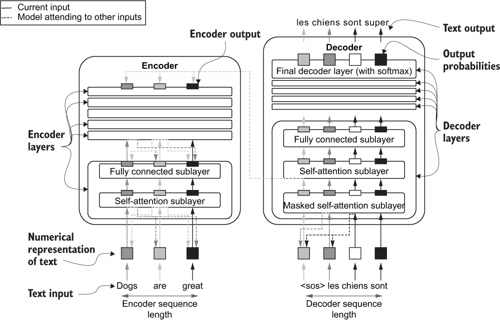

图 13.1 Transformer 模型如何解决 NLP 问题

## 13.1 更详细的 Transformer

你是一名数据科学家，有人建议你在 NLP 工作流中使用 Transformer 模型。你看了 TensorFlow 提供的 Transformer 模型。然而，你很难从文档中理解这个模型。你认为从零开始实现一个 Transformer 网络是理解赋予 Transformer 模型生命的概念的好方法。因此，你决定按照论文“Attention Is All You Need”（[`arxiv.org/pdf/1706.03762.pdf`](https://arxiv.org/pdf/1706.03762.pdf)）中指定的所有组件来实现一个 Transformer 模型。这个模型将具有诸如嵌入层（标记和位置嵌入）、自注意层、归一化层等组件。

### 13.1.1 重新审视 Transformer 的基本组件

在第五章，我们讨论了 Transformer 模型的基础，以实现一个简化的 Transformer。现在让我们深入讨论并查看存在于 Transformer 模型中的所有组件。Transformer 模型是基于编码器-解码器的模型。编码器接受一系列输入（例如，Dogs are great）以创建这些标记的隐藏（或潜在）表示。接下来，解码器使用编码器生成的输入标记的表示，并生成一个输出（例如，输入的法语翻译）。

编码器由一堆层组成，其中每一层包含两个子层：

+   *自注意力层*—为序列中的每个输入标记生成潜在表示。对于每个输入标记，此层查看整个输入序列，并选择序列中的其他标记，以丰富为该标记生成的隐藏输出的语义（即，*关注表示*）。

+   *全连接层*—生成与关注表示相关的逐元素隐藏表示。

解码器由三个子层组成：

+   *掩码自注意力层*—对于每个输入标记，它查看其左侧的所有标记。解码器需要屏蔽右侧的单词，以防止模型看到未来的单词，使得解码器的预测任务变得简单。

+   *编码器-解码器注意力层*—对于解码器中的每个输入标记，它查看编码器的输出以及解码器的掩码关注输出，以生成一个语义丰富的隐藏输出。

+   *全连接层*—生成解码器关注表示的逐元素隐藏表示。

在我们之前的讨论中，最难理解的是自注意力层。因此，值得重新审视自注意力层中发生的计算。自注意力层中的计算围绕着三个权重矩阵展开：

+   查询权重矩阵（*W*[q]）

+   键权重矩阵（*W*[k]）

+   值权重矩阵（*W*[v]）

这些权重矩阵中的每一个对于给定输入序列中的给定标记（在位置*i*）产生三个输出：查询、键和值。让我们刷新一下我们在第五章中对这些实体所说的话：

+   *查询*（*q*[i]）—帮助构建最终用于索引值（*v*）的概率矩阵。查询影响矩阵的行，并表示正在处理的当前单词的索引。

+   *关键*（*k*[i]）—帮助构建最终用于索引值（*v*）的概率矩阵。关键影响矩阵的列，并表示需要根据查询词混合的候选词。

+   *Value*（*v*[i]) ——输入的隐藏（即潜在）表示，用于通过查询和密钥创建的概率矩阵索引计算最终输出。正如前面解释的那样，在位置 *i* 处的最终输出不仅使用第 *i* 个令牌，还使用输入序列中的其他令牌，这增强了最终表示中捕获的语义。

这些元素的高层目的是生成一个被关注的表示（即给定令牌的潜在或隐藏表示，其由输入序列中其他令牌的信息增强）。为此，模型

+   为输入序列中的每个位置生成一个查询

+   对于每个查询，确定每个密钥应该贡献多少（密钥也代表个别令牌）

+   基于给定查询的密钥的贡献，混合与这些密钥对应的值以生成最终的关注表示

查询、密钥和值都是通过将可训练的权重矩阵与输入令牌的数值表示相乘而生成的。所有这些都需要以可微分的方式进行，以确保梯度可以通过模型进行反向传播。论文提出了以下计算来计算输入令牌的自注意力层的最终表示：

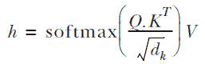

这里，Q 表示查询，K 表示密钥，V 表示批量数据中所有输入和每个输入中所有令牌的值。这就是使 Transformer 模型如此强大的原因：与 LSTM 模型不同，Transformer 模型将所有令牌在一个序列中聚合到一个矩阵乘法中，使得这些模型高度可并行化。

### Transformer 中的嵌入

当我们讨论 Transformer 模型时，有一件事情被忽略了，那就是它使用的嵌入。我们简要地提到了使用的词嵌入。让我们在这里更详细地讨论这个话题。词嵌入根据单词的上下文提供了语义保持的表示。换句话说，如果两个单词在相同的上下文中使用，它们将具有相似的单词向量。例如，“猫”和“狗”将具有相似的表示，而“猫”和“火山”将具有完全不同的表示。

单词向量最初在 Mikolov 等人的论文中被介绍，题为“Efficient Estimation of Word Representations in Vector Space” ([`arxiv.org/pdf/1301.3781.pdf`](https://arxiv.org/pdf/1301.3781.pdf))。它有两个变种，skip-gram 和 continuous bag-of-words（CBOW）。由于 skip-gram 稍微比 CBOW 更广泛地被接受，让我们讨论 skip-gram 算法的要点。

第一步是定义一个大小为 *V* × *E* 的大矩阵，其中 *V* 是词汇表的大小，*E* 是嵌入的大小。嵌入的大小（*E*）是用户定义的超参数，其中更大的 *E* 通常会导致更强大的词嵌入。在实践中，你不需要使嵌入的大小超过 300。

接下来，完全无监督地创建输入和目标。给定大量的文本语料库，选择一个单词形式作为输入（探针词），并以探针词周围的单词作为目标。通过定义固定大小的探针词周围窗口来捕获周围的单词。例如，针对窗口大小为 2（在探针词的每一侧），你可以从句子 “angry John threw a pizza at me.” 生成以下输入-目标对。

```py
(John, angry), (John, threw), (John, a), (threw, angry), (threw, John), (threw, a), (threw, pizza), ..., (at, a), (at, pizza), (at, me)
```

有了带标签的数据，你可以将学习词嵌入的问题框定为分类问题。换句话说，你训练一个模型（即一个词嵌入矩阵的函数），以输入的词为基础预测目标词。该模型包括两个部分，嵌入矩阵和完全连接层，通过 softmax 激活输出预测结果。一旦学习了嵌入，你可以丢弃其周围的其他内容（例如完全连接层），并使用嵌入矩阵用于下游 NLP 任务，例如情感分析、机器翻译等。只需要查找与单词相对应的嵌入向量，即可获得该单词的数字表示。

现代深度学习模型受到原始词向量算法的启发，将学习词嵌入和实际的决策支持 NLP 问题融合到单个模型训练任务中。换句话说，以下一般方法用于将词嵌入纳入到机器学习模型中：

+   定义一个随机初始化的词嵌入矩阵（或提供免费下载的预训练的嵌入）。

+   定义使用单词嵌入作为输入并产生输出（例如情感、语言翻译等）的模型（随机初始化）。

+   在任务上训练整个模型（嵌入 + 模型）。

Transformer 模型中也使用了相同的技术。但是，Transformer 模型中有两个不同的嵌入：

+   Token 嵌入（为模型在输入序列中看到的每个 token 提供唯一的表示）

+   位置嵌入（为输入序列中的每个位置提供唯一的表示）

Token 嵌入（为模型在输入序列中看到的每个 token 提供唯一的表示）

位置嵌入被用来告诉模型一个标记出现的位置。其主要目的是为了让位置嵌入服务器告诉 transformers 模型一个单词出现的位置。这是因为，与 LSTMs/GRUs 不同，transformers 模型没有序列的概念，因为它们一次处理整个文本。此外，单词位置的改变可能会改变句子或单词的含义。例如，在两个版本中

```py
Ralph loves his tennis ball. It likes to chase the ball
Ralph loves his tennis ball. Ralph likes to chase it
```

单词“it”指的是不同的东西，单词“it”的位置可以用作识别这种差异的线索。原始的 transformers 论文使用以下方程式生成位置嵌入：

*PE*(*pos*,2*i*) = sin(*pos*/10000^(21/d[model]))

*PE*(*pos*,2*i +* 1) = cos(*pos*/10000^(21/d[model]))

其中 pos 表示序列中的位置，*i*表示*i*^(th)特征维度（0 ≤ *i* < *d*[model]）。偶数特征使用正弦函数，而奇数特征使用余弦函数。图 13.2 展示了当时间步长和特征位置变化时位置嵌入的变化。可以看到，具有较高索引的特征位置具有较低频率的正弦波。作者确切的方程式并不完全清楚。但是，他们确实提到他们没有看到前一个方程式和让模型在训练期间联合学习位置嵌入之间有显著的性能差异。

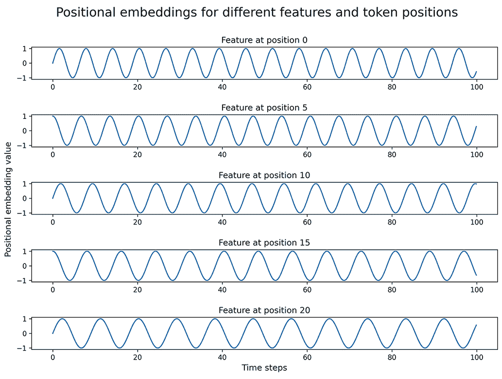

图 13.2 位置嵌入随时间步长和特征位置的变化。偶数特征位置使用正弦函数，而奇数位置使用余弦函数。此外，信号的频率随着特征位置的增加而降低。

需要注意的是，标记嵌入和位置嵌入都具有相同的维度（即*d*[model]）。最后，作为模型的输入，标记嵌入和位置嵌入被求和以形成单个混合嵌入向量（图 13.3）。

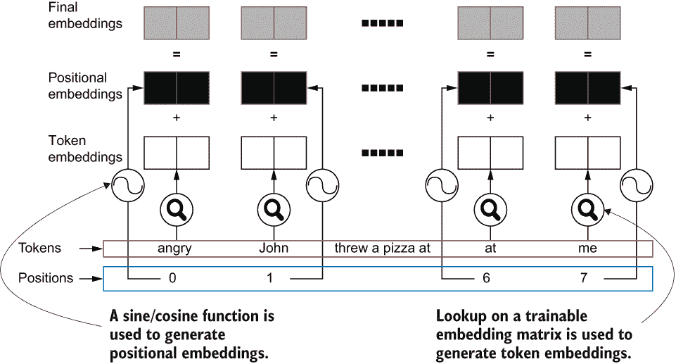

图 13.3 在 transformers 模型中生成的嵌入以及如何计算最终嵌入

### 13.1.3 残差和规范化

transformers 模型的另一个重要特征是残差连接和单个层之间的规范化层的存在。当我们讨论图像分类的高级技术时，我们在第七章中深入讨论了残差连接。让我们简要地重新讨论残差连接的机制和动机。

残差连接是通过将给定层的输出添加到前面一个或多个层的输出而形成的。这反过来形成了模型中的“快捷连接”，并通过减少所谓的*梯度消失*现象提供了更强的梯度流（见图 13.4）。梯度消失导致最靠近输入的层的梯度非常小，以至于这些层的训练受到阻碍。

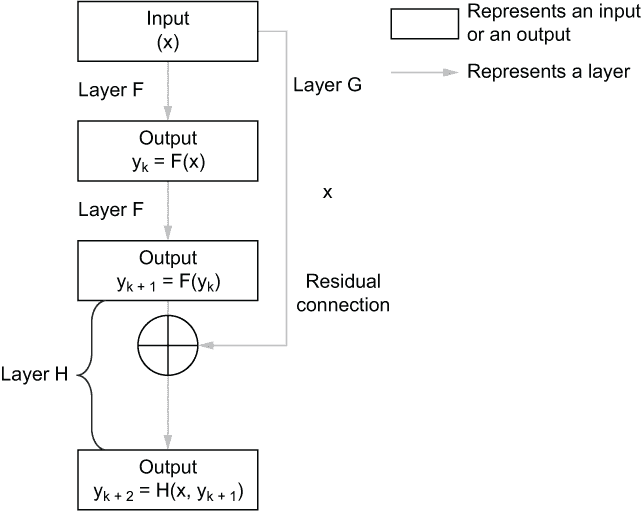

图 13.4 残差连接的数学视角

在 Transformer 模型中，每个层次都会创建残差连接，具体如下：

+   多头自注意力子层的输入被添加到多头自注意力子层的输出中。

+   完全连接子层的输入被添加到完全连接子层的输出中。

接下来，通过残差连接增强的输出经过一层层归一化层。*层归一化*，类似于批归一化，是减少神经网络中“协变量转移”的一种方式，使其能够更快地训练并达到更好的性能。协变量转移是指神经网络激活分布的变化（由数据分布的变化引起），这些变化在模型训练过程中发生。这种分布的变化会在模型训练期间影响一致性，并对模型产生负面影响。层归一化是由 Ba 等人在论文“Layer Normalization”中介绍的（[`arxiv.org/pdf/1607.06450.pdf`](https://arxiv.org/pdf/1607.06450.pdf)）。

批归一化计算激活的均值和方差作为批次中样本的平均值，导致其性能依赖于用于训练模型的小批量大小。

然而，层归一化计算激活的均值和方差（即归一化项）的方式是这样的，即归一化项对每个隐藏单元都是相同的。换句话说，层归一化对于层中的所有隐藏单元都有一个单一的均值和方差值。这与批归一化不同，后者对层中的每个隐藏单元维护单独的均值和方差值。此外，与批归一化不同，层归一化不会对批次中的样本进行平均，而是留下了平均化，对不同的输入具有不同的归一化项。通过每个样本具有一个均值和方差，层归一化摆脱了对小批量大小的依赖。有关此方法的更多细节，请参阅原始论文。

TensorFlow/Keras 中的层归一化

TensorFlow 提供了层归一化算法的方便实现，网址为 [`mng.bz/YGRB`](http://mng.bz/YGRB)。你可以使用 TensorFlow Keras API 定义的任何模型来使用这个层。

图 13.5 展示了在 Transformer 模型中如何使用残差连接和层归一化。

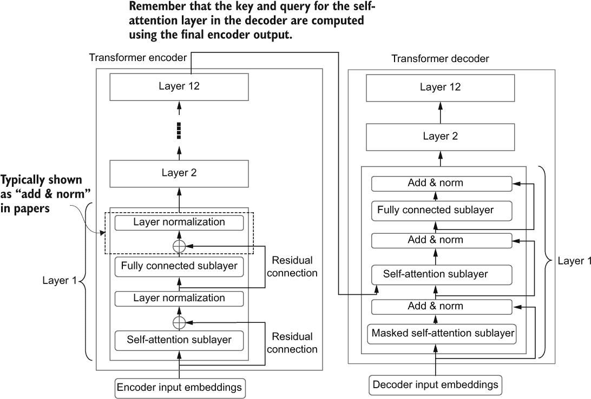

图 13.5 残差连接和层归一化层在 Transformer 模型中的使用方式

讨论关于 Transformer 模型中的组件到此结束。我们已经讨论了 Transformer 模型的所有要点，即自注意力层、全连接层、嵌入（标记和位置）、层归一化和残差连接。在下一节中，我们将讨论如何使用一个称为 BERT 的预训练 Transformer 模型来解决垃圾邮件分类任务。

练习 1

你被给定了以下 Transformer 编码器的代码

```py
import tensorflow as tf

# Defining some hyperparameters
n_steps = 25 # Sequence length
n_en_vocab = 300 # Encoder's vocabulary size
n_heads = 8 # Number of attention heads
d = 512 # The feature dimensionality of each layer

# Encoder input layer
en_inp = tf.keras.layers.Input(shape=(n_steps,))
# Encoder input embedddings
en_emb = tf.keras.layers.Embedding(
    n_en_vocab, d, input_length=n_steps
)(en_inp)

# Two encoder layers
en_out1 = EncoderLayer(d, n_heads)(en_emb)
en_out2 = EncoderLayer(d, n_heads)(en_out1)

model = tf.keras.models.Model(inputs=en_inp, output=en_out2)
```

其中 EncoderLayer 定义了一个典型的 Transformer 编码器层，其中包含自注意力子层和全连接子层。你被要求使用以下方程式集成位置编码

*PE*(*pos*, 2*i*) = sin(*pos*/10000^(2*i*/d[model]))

*pos* 从 0 到 511（d=512 特征），*i* 从 0 到 24（n_steps=25 时间步），表示时间步。换句话说，我们的位置编码将是一个形状为 [n_steps, d] 的张量。你可以使用 tf.math.sin() 逐元素生成张量的 sin 值。你可以将位置嵌入定义为张量，而不是 tf.keras.layers.Layer 的乘积。最终嵌入应通过将标记嵌入和位置嵌入相加来生成。你会如何做？

## 13.2 使用预训练的 BERT 进行垃圾邮件分类

你正在为一家邮件服务公司担任数据科学家，公司渴望实现垃圾邮件分类功能。他们希望在公司内部实现此功能并节省成本。通过阅读关于 BERT 及其在解决 NLP 任务中的强大性能的文章，你向团队解释，你需要做的就是下载 BERT 模型，在 BERT 顶部拟合一个分类层，并在标记的数据上端到端地训练整个模型。标记的数据包括一个垃圾消息和一个指示消息是否为垃圾或正常的标签。你被委托负责实现此模型。

现在我们已经讨论了 Transformer 架构的所有移动元素，这使得我们非常有能力理解 BERT。BERT 是一种基于 Transformer 的模型，由 Devlin 等人在论文 “BERT: Pre-Training of Deep Bidirectional Transformers for Language Understanding” 中介绍（[`arxiv.org/pdf/1810.04805.pdf`](https://arxiv.org/pdf/1810.04805.pdf)），它代表了自然语言处理历史上的一个非常重要的里程碑，因为它是一个先驱性模型，证明了在 NLP 领域应用 “迁移学习”的能力。

BERT 是一个在大量文本数据上以无监督方式预训练的 Transformer 模型。因此，你可以使用 BERT 作为基础，获得丰富、语义上准确的文本输入序列的数字表示，这些表示可以直接提供给下游 NLP 模型。由于 BERT 提供的丰富文本表示，你可以让你的决策支持模型不再需要理解语言，而是可以直接专注于手头的问题。从技术角度来看，如果你正在用 BERT 解决分类问题，你所需要做的就是

+   在 BERT 之上拟合一个分类器（例如逻辑回归层），将 BERT 的输出作为输入

+   在判别性任务上（即 BERT + 分类器）端到端地训练模型

BERT 的历史

在像 BERT 这样的模型出现之前，解决自然语言处理（NLP）任务既重复又耗时。每次都需要从头开始训练一个模型。更糟糕的是，大多数模型都无法处理长文本序列，限制了它们理解语言的能力。

2017 年，NLP 任务的 Transformer 模型在论文“Attention Is All You Need”（[`arxiv.org/pdf/1706.03762.pdf`](https://arxiv.org/pdf/1706.03762.pdf)）中提出。Transformer 模型在一系列 NLP 任务上击败了之前的主导者，如 LSTMs 和 GRUs。与逐字逐句查看并维护状态（即内存）的循环模型不同，Transformer 模型一次查看整个序列。

然后，在 2018 年，NLP（即在 NLP 中进行迁移学习）迎来了“ImageNet 时刻”。ImageNet 时刻是指 ML 从业者意识到，在其他任务（如目标检测、图像分割）上使用已经在大型 ImageNet 图像分类数据集上训练过的计算机视觉模型，可以更快地获得更好的性能。这实际上催生了在计算机视觉领域广泛使用的迁移学习概念。因此，直到 2018 年，NLP 领域还没有一个非常好的方法来利用迁移学习来提升任务性能。论文“通用语言模型微调用于文本分类”（[`arxiv.org/pdf/1801.06146.pdf`](https://arxiv.org/pdf/1801.06146.pdf)）介绍了在语言建模任务上预训练然后在判别性任务上训练模型的思想（例如，分类问题）。这种方法的优势在于，你不需要像从头训练模型那样多的样本。

2018 年，BERT 被引入。这是自然语言处理历史上两个最出色时刻的结合。换句话说，BERT 是一个在大量文本数据上以无监督方式预训练的 Transformer 模型。

现在我们将更详细地了解 BERT 模型。

### 13.2.1 理解 BERT

现在让我们更微观地检查 BERT。正如我之前提到的，BERT 是一个 Transformer 模型。确切地说，它是 Transformer 模型的编码器部分。这意味着 BERT 接受一个输入序列（一组标记）并生成一个编码的输出序列。图 13.6 描述了 BERT 的高层架构。

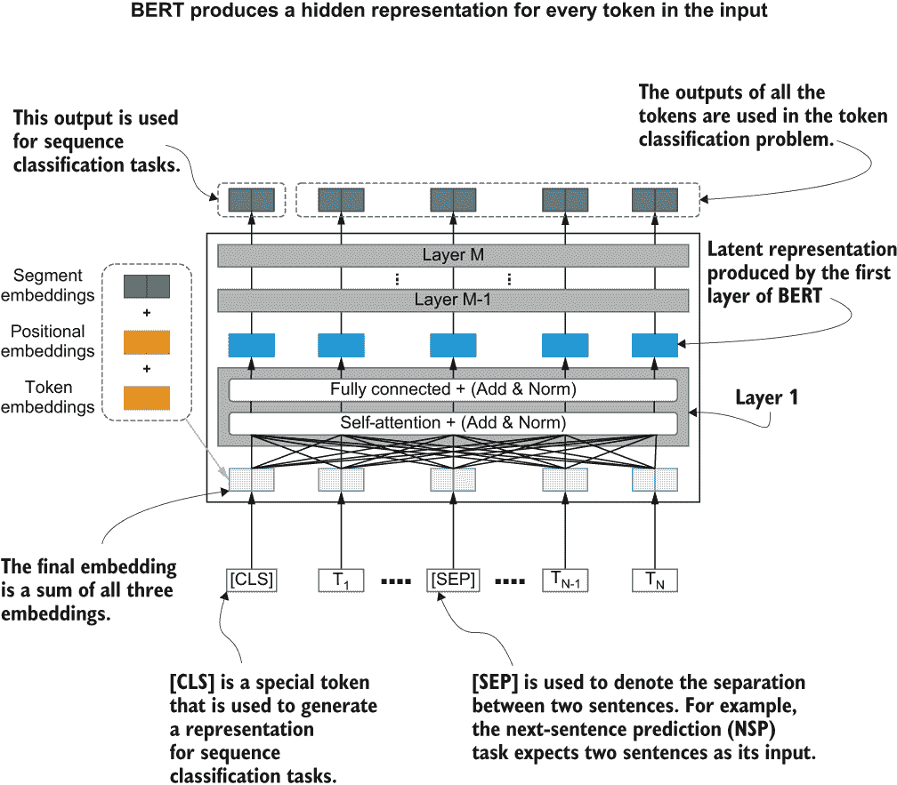

图 13.6 BERT 的高层架构。它接受一组输入标记并生成使用几个隐藏层生成的隐藏表示的序列。

当 BERT 接受一个输入时，它会在输入中插入一些特殊的标记。首先，在开始时，它插入一个[CLS]（分类的缩写形式）标记，用于生成特定类型任务（例如，序列分类）的最终隐藏表示。它表示在关注序列中的所有标记后的输出。接下来，根据输入类型，它还会插入一个[SEP]（即“分隔”）标记。[SEP]标记标记了输入中不同序列的结束和开始。例如，在问答中，模型接受问题和可能包含答案的上下文（例如，段落）作为输入，并且[SEP]在问题和上下文之间使用。

接下来，使用三种不同的嵌入空间生成标记的最终嵌入。标记嵌入为词汇表中的每个标记提供了一个独特的向量。位置嵌入编码了每个标记的位置，如前面讨论的。最后，段落嵌入为输入的每个子组件提供了一个不同的表示。例如，在问答中，问题将具有作为其段落嵌入向量的唯一向量，而上下文将具有不同的嵌入向量。这通过在输入序列中的每个不同组件的*n*个不同嵌入向量来完成。根据输入中为每个标记指定的组件索引，检索相应的段落嵌入向量。*n*需要事先指定。

BERT 的真正价值来自于它是以自监督方式在大型语料库上预训练的事实。在预训练阶段，BERT 在两个不同的任务上进行训练：

+   掩码语言建模（MLM）

+   下一句预测（NSP）

掩码语言建模（MLM）任务灵感来自*填空题*或*填空测验*，其中学生被给出一句带有一个或多个空白的句子，并被要求填写空白。类似地，给定一个文本语料库，单词从句子中被掩码，然后模型被要求预测掩码的标记。例如，句子

```py
I went to the bakery to buy bread
```

可能变成

```py
I went to the [MASK] to buy bread
```

注意：已经有大量基于 Transformer 的模型，每个模型都在前一个模型的基础上进行了构建。您可以在附录 C 中了解更多关于这些模型的信息。

图 13.7 显示了在遮蔽语言建模任务训练过程中 BERT 的主要组成部分。BERT 使用特殊标记（[MASK]）来表示被遮蔽的单词。然后模型的目标将是单词"bakery"。但这给模型带来了实际问题。特殊标记[MASK]在实际文本中不会出现。这意味着模型在关键问题的微调阶段（即在分类问题上训练时）看到的文本将与在预训练阶段看到的文本不同。这有时被称为*预训练-微调不一致性*。因此，BERT 的作者建议采取以下方法来处理这个问题。当屏蔽一个单词时，做以下之一：

+   使用[MASK]标记（使用 80％的概率）。

+   使用随机单词（以 10％的概率）。

+   使用真实的单词（以 10％的概率）。


图 13.7 显示了预训练 BERT 使用的方法。BERT 在两个任务上进行预训练：遮蔽语言建模任务和下一句预测任务。在遮蔽语言建模任务中，输入中的标记被遮蔽，模型被要求预测被遮蔽的标记。在下一句预测任务中，模型被要求预测两个句子是否相邻。

接下来，在下一句预测任务中，模型会得到一对句子 A 和 B（按照顺序），并被要求预测 B 是否是 A 之后的下一句。可以通过在 BERT 之上拟合一个二元分类器，并在选择的句子对上端到端地训练整个模型来完成。以无监督的方式生成模型的输入对是不难的：

+   通过选择相邻的两个句子生成标签为 TRUE 的样本。

+   通过随机选择不相邻的两个句子生成标签为 FALSE 的样本。

按照这种方法，为下一句预测任务生成了一个带标签的数据集。然后，使用带标签的数据集对 BERT 和二元分类器进行端到端的训练。图 13.7 突出显示了下一句预测任务中的数据和模型架构。

您可能已经注意到图 13.6 中输入到 BERT 的是特殊标记。除了我们已讨论过的[MASK]标记之外，还有两个特殊的标记具有特殊的用途。

[CLS]标记被附加到输入到 BERT 的任何输入序列上。它表示输入的开始。它还为放置在 BERT 顶部的分类头上使用的输入提供基础。正如您所知，BERT 对序列中的每个输入标记生成一个隐藏表示。按照惯例，与[CLS]标记对应的隐藏表示被用作放置在 BERT 之上的分类模型的输入。

BERT 解决的任务特定 NLP 任务可以分为四种不同的类别。这些基于 General Language Understanding Evaluation（GLUE）基准任务套件中的任务 ([`gluebenchmark.com`](https://gluebenchmark.com))：

+   *序列分类*—这里，给定一个单一的输入序列，并要求模型为整个序列预测一个标签（例如，情感分析，垃圾邮件识别）。

+   *令牌分类*—这里，给定一个单一的输入序列，并要求模型为序列中的每个令牌预测一个标签（例如，命名实体识别，词性标注）。

+   *问答*—这里，输入包括两个序列：一个问题和一个上下文。问题和上下文之间由一个 [SEP] 令牌分隔。模型被训练来预测属于答案的令牌范围的起始和结束索引。

+   *多选题*—这里的输入由多个序列组成：一个问题，后跟可能是或可能不是问题答案的多个候选项。这些多个序列由令牌 [SEP] 分隔，并作为单个输入序列提供给模型。模型被训练来预测该问题的正确答案（即，类标签）。

BERT 的设计使得它能够在不对基础模型进行任何修改的情况下用于解决这些任务。在涉及多个序列的任务中（例如，问答，多选题），您需要单独告诉模型不同的输入（例如，问题的令牌和问题回答任务中的上下文的令牌）。为了做出这种区分，使用 [SEP] 令牌。[SEP] 令牌在不同序列之间插入。例如，如果您正在解决一个问答任务，您可能会有一个输入如下：

```py
Question: What color is the ball?
Paragraph: Tippy is a dog. She loves to play with her red ball.
```

然后，BERT 的输入可能如下所示

```py
[CLS] What color is the ball [SEP] Tippy is a dog She loves to play with her red ball [SEP]
```

BERT 还使用段落嵌入空间来表示一个令牌属于哪个序列。例如，只有一个序列的输入对于所有令牌具有相同的段落嵌入向量（例如，垃圾邮件分类任务）。具有两个或更多序列的输入使用第一个或第二个空间，取决于令牌属于哪个序列。例如，在问答中，模型将使用唯一的段落嵌入向量来编码问题的令牌，其中将使用不同的段落嵌入向量来编码上下文的令牌。现在我们已经讨论了使用 BERT 成功解决下游 NLP 任务所需的所有要素。让我们重申一下有关 BERT 的关键要点：

+   BERT 是一种基于编码器的 Transformer，经过大量文本的预训练。

+   BERT 使用掩码语言建模和下一句预测任务进行模型的预训练。

+   BERT 为输入序列中的每个令牌输出隐藏表示。

+   BERT 有三个嵌入空间：令牌嵌入，位置嵌入和段落嵌入。

+   BERT 使用特殊标记[CLS]来表示输入的开始，并用作下游分类模型的输入。

+   BERT 旨在解决四种类型的 NLP 任务：序列分类、标记分类、自由文本问答和多项选择题答案。

+   BERT 使用特殊标记[SEP]来分隔序列 A 和序列 B。

接下来，我们将学习如何使用 BERT 对垃圾邮件进行分类。

### 使用 BERT 在 TensorFlow 中对垃圾邮件进行分类

现在是展示您的技能并以最小的努力实现垃圾邮件分类器的时候了。首先，让我们下载数据。我们将在这个练习中使用的数据是一组垃圾邮件和 ham（非垃圾邮件）短信消息，可在[`mng.bz/GE9v`](http://mng.bz/GE9v)获取。下载数据的 Python 代码已在 Ch13-Transormers-with-TF2-and-Huggingface/13.1_Spam_Classification_with_BERT.ipynb 笔记本中提供。

理解数据

一旦您下载并提取数据，我们就可以快速查看数据中的内容。它将是一个单个的制表符分隔的文本文件。文件的前三个条目如下：

```py
ham    Go until jurong point, crazy.. Available only in bugis n great 
➥ world la e buffet... Cine there got amore wat...
ham    Ok lar... Joking wif u oni...
spam        Free entry in 2 a wkly comp to win FA Cup final tkts 21st 
➥ May 2005 ...
```

如图所示，每行以单词 ham 或 spam 开头，表示是否安全或垃圾邮件。然后给出消息中的文本，后跟一个制表符。我们的下一个任务是将此数据加载到内存中，并将输入和标签存储在 NumPy 数组中。以下清单显示了执行此操作的步骤。

清单 13.1 将数据从文本文件加载到 NumPy 数组中

```py
inputs = []                                 ❶
labels = []                                 ❷

n_ham, n_spam = 0,0                         ❸
with open(os.path.join('data', 'SMSSpamCollection'), 'r') as f:
    for r in f:                             ❹

        if r.startswith('ham'):             ❺
            label = 0                       ❻
            txt = r[4:]                     ❼
            n_ham += 1                      ❽
        # Spam input
        elif r.startswith('spam'):          ❾
            label = 1                       ❿
            txt = r[5:]                     ⓫
            n_spam += 1
        inputs.append(txt)                  ⓬
        labels.append(label)                ⓭

# Convert them to arrays
inputs = np.array(inputs).reshape(-1,1)     ⓮
labels = np.array(labels)                   ⓯
```

❶ 输入（消息）存储在这里。

❷ 标签（0/1）存储在这里。

❸ 计算 ham/spam 示例的总数

❹ 读取文件中的每一行。

❺ 如果行以 ham 开头，则为一个 ham 示例。

❻ 将其标记为 0。

❼ 输入是该行中的文本（除了以 ham 开头的单词）。

❽ 增加 n_ham 的计数。

❾ 如果行以 spam 开头，则为垃圾邮件。

❿ 将其标记为 1。

⓫ 输入是该行中的文本（除了以 spam 开头的单词）。

⓬ 将输入文本附加到输入。

⓭ 将标签附加到标签。

⓮ 将输入转换为 NumPy 数组（并将其重新整形为具有一列的矩阵）。

⓯ 将标签列表转换为 NumPy 数组。

您可以打印 n_ham 和 n_spam 变量，并验证有 4827 个 ham 示例和 747 个 spam 示例。换句话说，垃圾邮件示例比 ham 示例少。因此，在训练模型时，我们必须确保考虑到这种不平衡。

处理数据中的类别不平衡

为了抵消类别不平衡，让我们创建平衡的训练/验证和测试数据集。为此，我们将使用 imbalanced-learn 库，这是一个用于操纵不平衡数据集（例如，从不同类别中抽样不同数量的数据）的优秀库。恢复数据集平衡的两种主要策略是：

+   对多数类进行欠采样（从该类中选择较少的样本以用于最终数据集）

+   对少数类进行过采样（为最终数据集生成更多来自该类的样本）

我们将在这里使用第一种策略（即欠采样多数类）。更具体地说，我们将首先

+   通过从数据集中随机抽样数据来创建平衡的测试和验证数据集（每个类别 n 个示例）

+   将剩余的数据分配给训练集，并使用一种称为*near-miss*算法的算法对训练集中的多数类进行欠采样。

创建训练验证和测试数据的过程如图 13.8 所示。

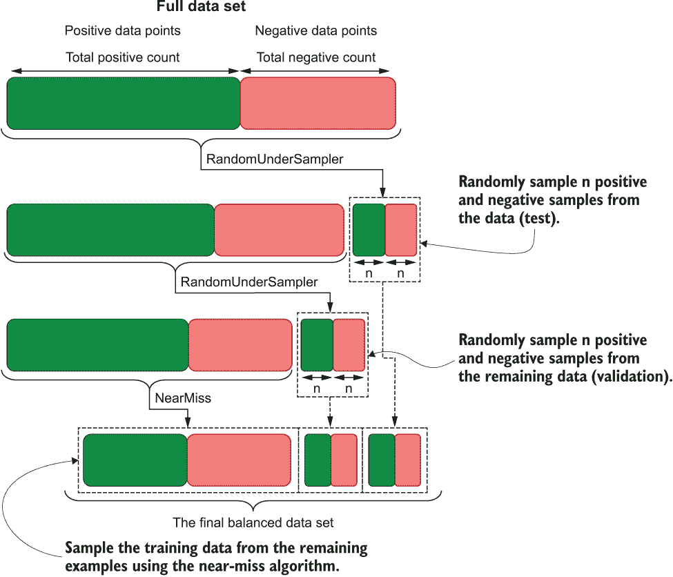

图 13.8 从原始数据集创建训练、验证和测试数据集的过程

首先，让我们从库和 NumPy 库中导入一些欠采样器：

```py
from imblearn.under_sampling import  NearMiss, RandomUnderSampler
import numpy as np
```

接下来，我们将定义一个变量 n，它表示在验证和测试数据集中每个类别要保留多少个样本：

```py
n=100 # Number of instances for each class for test/validation sets
random_seed = 4321
```

接下来我们将定义一个随机欠采样器。最重要的参数是 sampling_strategy 参数，它接受一个字典，其中键是标签，值是该标签所需的样本数量。我们还将通过 random_state 参数传递 random_seed 以确保每次运行代码时都获得相同的结果：

```py
rus = RandomUnderSampler(
    sampling_strategy={0:n, 1:n}, random_state=random_seed
)
```

然后我们调用欠采样器的 fit_resample()函数，使用我们创建的 inputs 和 labels 数组来采样数据：

```py
rus.fit_resample(inputs, labels)
```

一旦您适应了欠采样器，您可以使用欠采样器的 sample_indices_ 属性获取所选样本的索引。使用这些索引，我们将创建一对新的数组 test_x 和 test_y 来保存测试数据：

```py
test_inds = rus.sample_indices_
test_x, test_y = inputs[test_inds], np.array(labels)[test_inds]
```

不在测试数据集中的索引被分配到不同的数组：rest_x 和 rest_y。这些将被用来创建验证数据集和训练数据集：

```py
rest_inds = [i for i in range(inputs.shape[0]) if i not in test_inds]
rest_x, rest_y = inputs[rest_inds], labels[rest_inds]
```

和之前的方法类似，我们从 rest_x 和 rest_y 中欠采样数据来创建验证数据集（valid_x 和 valid_y）。请注意，我们不使用 inputs 和 labels 数组，而是使用这些数组分离出测试数据后剩余的数据：

```py
rus.fit_resample(rest_x, rest_y)
valid_inds = rus.sample_indices_
valid_x, valid_y = rest_x[valid_inds], rest_y[valid_inds]
```

最后，我们创建训练数据集，该数据集将保存在创建测试和验证数据集后剩余的所有元素：

```py
train_inds = [i for i in range(rest_x.shape[0]) if i not in valid_inds]
train_x, train_y = rest_x[train_inds], rest_y[train_inds]
```

我们还必须确保训练数据集是平衡的。为了做到这一点，让我们使用比随机选择元素更智能的方式来欠采样数据。我们将在这里使用的欠采样算法称为 near-miss 算法。near-miss 算法会删除与少数类别中的样本太接近的多数类别中的样本。这有助于增加少数类别和多数类别示例之间的距离。在这里，少数类别指的是数据较少的类别，而多数类别指的是数据较多的类别。为了使用 near-miss 算法，它需要能够计算两个样本之间的距离。因此，我们需要将我们的文本转换为一些数值表示。我们将使用 scikit-learn 的 CountVectorizer 来实现这一点：

```py
from sklearn.feature_extraction.text import CountVectorizer

countvec = CountVectorizer()
train_bow = countvec.fit_transform(train_x.reshape(-1).tolist())
```

train_bow 将包含我们数据的词袋表示。然后我们可以将其传递给 NearMiss 实例。获取数据的方式与之前相同：

```py
from imblearn.under_sampling import  NearMiss

oss = NearMiss()
x_res, y_res = oss.fit_resample(train_bow, train_y)
train_inds = oss.sample_indices_

train_x, train_y = train_x[train_inds], train_y[train_inds]
```

让我们打印出我们数据集的大小，看看它们是否与我们最初想要的大小相匹配：

```py
Test dataset size
1    100
0    100
dtype: int64

Valid dataset size
1    100
0    100
dtype: int64
Train dataset size
1    547
0    547
dtype: int64
```

太棒了！我们的数据集都是平衡的，我们准备继续进行工作流的其余部分。

定义模型

准备好数据后，我们将下载模型。我们将使用的 BERT 模型来自 TensorFlow hub ([`www.tensorflow.org/hub`](https://www.tensorflow.org/hub))。TensorFlow hub 是各种模型训练任务的模型仓库。您可以获得多种任务的模型，包括图像分类、对象检测、语言建模、问答等等。要查看所有可用模型的完整列表，请访问 [`tfhub.dev/`](https://tfhub.dev/)。

为了成功地利用 BERT 来完成自然语言处理任务，我们需要三个重要的工作：

+   *分词器* —— 确定如何将提供的输入序列分割为标记

+   *编码器* —— 接受标记，计算数值表示，并最终为每个标记生成隐藏表示以及汇总表示（整个序列的单一表示）

+   *分类头* —— 接受汇总表示并为输入生成标签

首先，让我们来看一下分词器。分词器接受单个输入字符串或字符串列表，并将其转换为字符串列表或字符串列表，分别将其拆分为较小的元素。例如，可以通过在空格字符上分割来将句子分割为单词。BERT 中的分词器使用一种称为 *WordPiece* 算法的算法 ([`mng.bz/z40B`](https://static.googleusercontent.com/media/research.google.com/en//pubs/archive/37842.pdf))。它使用迭代方法找到数据集中常见的子词（即单词的部分）。WordPiece 算法的细节超出了本书的范围。欢迎查阅原始论文以了解更多细节。对于本讨论而言，分词器的最重要特征是它将给定的输入字符串（例如，句子）分解为较小标记的列表（例如，子词）。

像 WordPiece 算法这样的子词方法的优点

像 WordPiece 算法这样的子词方法学习单词的较小且常见的部分，并使用它们来定义词汇表。与将整个单词放入词汇表相比，此方法有两个主要优点。

使用子词通常可以减少词汇量的大小。假设单词为[“walk”, “act”, “walked”, “acted”, “walking”, “acting”]。如果使用单独的单词，每个单词都需要在词汇表中成为一个单一项目。然而，如果使用子词方法，词汇表可以缩减为[“walk”, “act”, “##ed”, “##ing”]，只有四个单词。在这里，##表示它需要添加另一个子词作为前缀。

第二，子词方法可以处理词汇表中未出现的单词。这意味着子词方法可以通过组合来自词汇表的两个子词（例如，developed = develop + ##ed）来表示出现在测试数据集中但未出现在训练集中的单词。基于单词的方法将无法这样做，而只能使用特殊标记替换看不见的单词。假设子词表[“walk”, “act”, “##ed”, “##ing”, “develop”]。即使训练数据中没有出现“developed”或“developing”这些单词，词汇表仍然可以通过组合来自词汇表的两个子词来表示这些单词。

要设置标记器，让我们首先导入 tf-models-official 库：

```py
import tensorflow_models as tfm
```

然后，您可以按以下方式定义标记器：

```py
vocab_file = os.path.join("data", "vocab.txt")

do_lower_case = True

tokenizer = tfm.nlp.layers.FastWordpieceBertTokenizer(
    vocab_file=vocab_file, lower_case=do_lower_case
)
```

在这里，你首先需要获取词汇文件的位置，并定义一些配置，比如在对文本进行标记化之前是否应该将其转换为小写。词汇文件是一个文本文件，每行都有一个子词。这个标记器使用了 Fast WordPiece Tokenization（[`arxiv.org/abs/2012.15524.pdf`](https://arxiv.org/abs/2012.15524.pdf)），这是原始 WordPiece 算法的高效实现。请注意，vocab_file 和 do_lower_case 是我们将在下一步从 TensorFlow hub 下载的模型工件中找到的设置。但为了方便理解，我们在这里将它们定义为常量。您将在笔记本中找到自动提取它们的代码。接下来，我们可以按照以下方式使用标记器：

```py
tokens = tf.reshape(
    tokenizer(["She sells seashells by the seashore"]), [-1])
print("Tokens IDs generated by BERT: {}".format(tokens))
ids = [tokenizer._vocab[tid] for tid in tokens] 
print("Tokens generated by BERT: {}".format(ids))
```

它返回

```py
Tokens IDs generated by BERT: [ 2016 15187 11915 18223  2015  2011  1996 11915 16892]
Tokens generated by BERT: ['she', 'sells', 'seas', '##hell', '##s', 'by', 'the', 'seas', '##hore']
```

您可以在这里看到 BERT 的标记器如何标记句子。有些单词保持原样，而有些单词则分成子词（例如，seas + ##hell + ##s）。如前所述，##表示它不标记一个单词的开头。换句话说，##表示这个子词需要添加另一个子词作为前缀才能得到一个实际的单词。现在，让我们来看看 BERT 模型使用的特殊标记以及为它们分配的 ID 是什么。这也验证了这些标记存在于标记器中：

```py
special_tokens = ['[CLS]', '[SEP]', '[MASK]', '[PAD]']
ids = [tokenizer._vocab.index(tok) for tok in special_tokens]
for t, i in zip(special_tokens, ids):
    print("Token: {} has ID: {}".format(t, i))
```

这将返回

```py
Token: [CLS] has ID: 101
Token: [SEP] has ID: 102
Token: [MASK] has ID: 103
Token: [PAD] has ID: 0
```

在这里，[PAD]是 BERT 用来表示填充令牌（0）的另一个特殊标记。在 NLP 中，常常使用填充来将不同长度的句子填充到相同的长度，填充的句子是用零填充的。在这里，[PAD]标记对应了零。

了解了标记器的基本功能后，我们可以定义一个名为 encode_sentence()的函数，将给定的句子编码为 BERT 模型所理解的输入（请参见下一个清单）。

清单 13.2 使用 BERT 的标记器对给定的输入字符串进行编码

```py
def encode_sentence(s):
    """ Encode a given sentence by tokenizing it and adding special tokens """

    tokens = list(
        tf.reshape(tokenizer(["CLS" + s + "[SEP]"]), [-1])
    )                   ❶
    return tokens       ❷
```

❶ 将特殊的 [CLS] 和 [SEP] 标记添加到序列中并获取标记 ID。

❷ 返回标记 ID。

在这个函数中，我们返回标记化的输出，首先添加 [CLS] 标记，然后将给定的字符串标记化为子词列表，最后添加 [SEP] 标记来标记句子/序列的结束。例如，句子 “I like ice cream”

```py
encode_sentence("I like ice cream")
```

将返回

```py
[101, 1045, 2066, 3256, 6949, 102]
```

如我们所见，标记 ID 101（即，[CLS]）在开头，而 102（即，[SEP]）在结尾。其余的标记 ID 对应于我们输入的实际字符串。仅仅为 BERT 标记化输入是不够的；我们还必须为模型定义一些额外的输入。例如，句子

```py
"I like ice cream"
```

应该返回一个如下所示的数据结构：

```py
{
    'input_word_ids': [[ 101, 1045, 2066, 3256, 6949,  102,    0,    0]], 
    'input_mask': [[1., 1., 1., 1., 1., 1., 0., 0.]], 
    'input_type_ids': [[0, 0, 0, 0, 0, 0, 0, 0]]
}
```

让我们讨论这个数据结构中的各种元素。BERT 以字典形式接受输入，其中

+   关键 input_ids 表示从之前定义的 encode_sentence 函数中获得的标记 ID

+   关键 input_mask 表示一个与 input_ids 相同大小的掩码，其中 1 表示不应屏蔽的值（例如，输入序列中的实际标记和特殊标记，如 [CLS] 标记 ID 101 和 [SEP] 标记 ID 102），而 0 表示应屏蔽的标记（例如，[PAD] 标记 ID 0）。

+   输入关键 input_type_ids 是一个大小与 input_ids 相同的由 1 和 0 组成的矩阵/向量。这表示每个标记属于哪个句子。请记住，BERT 可以接受两种类型的输入：具有一个序列的输入和具有两个序列 A 和 B 的输入。input_type_ids 矩阵表示每个标记属于哪个序列（A 或 B）。由于我们的输入中只有一个序列，我们简单地创建一个大小与 input_ids 相同的零矩阵。

函数 get_bert_inputs() 将使用一组文档（即，一个字符串列表，其中每个字符串是一个输入；请参见下一个清单）以这种格式生成输入。

列表 13.3 将给定输入格式化为 BERT 接受的格式

```py
def get_bert_inputs(tokenizer, docs,max_seq_len=None):
    """ Generate inputs for BERT using a set of documents """

    packer = tfm.nlp.layers.BertPackInputs(                      ❶
        seq_length=max_seq_length,
        special_tokens_dict = tokenizer.get_special_tokens_dict()
    )

    packed = packer(tokenizer(docs))                             ❷

    packed_numpy = dict(
        [(k, v.numpy()) for k,v in packed.items()]               ❸
    )
    # Final output
    return packed_numpy                                          ❹
```

❶ 使用 BertPackInputs 生成标记 ID、掩码和段 ID。

❷ 为 docs 中的所有消息生成输出。

❸ 将 BertPackInputs 的输出转换为一个键为字符串、值为 numpy 数组的字典。

❹ 返回结果。

这里我们使用 BertPackInputs 对象，它接受一个数组，其中每个项目都是包含消息的字符串。然后 BertPackInputs 生成一个包含以下处理过的输出的字典：

+   input_word_ids ——带有 [CLS] 和 [SEP] 标记 ID 的标记 ID，会自动添加。

+   input_mask ——一个整数数组，其中每个元素表示该位置是真实标记（1）还是填充标记（0）。

+   input_type_ids ——一个整数数组，其中每个元素表示每个标记属于哪个段。在这种情况下，它将是一个全零数组。

BertPackInputs 执行了 BERT 模型需要的许多不同的预处理操作。您可以在 [`www.tensorflow.org/api_docs/python/tfm/nlp/layers/BertPackInputs`](https://www.tensorflow.org/api_docs/python/tfm/nlp/layers/BertPackInputs) 上阅读关于此层接受的各种输入的信息。

要为模型生成准备好的训练、验证和测试数据，只需调用 get_bert_inputs() 函数：

```py
train_inputs = get_bert_inputs(train_x, max_seq_len=80)
valid_inputs = get_bert_inputs(valid_x, max_seq_len=80)
test_inputs = get_bert_inputs(test_x, max_seq_len=80)
```

完成后，让我们作为预防措施对 train_inputs 中的数据进行洗牌。目前，数据是有序的，即垃圾邮件消息在正常邮件消息之后：

```py
train_inds = np.random.permutation(len(train_inputs["input_word_ids"]))
train_inputs = dict(
    [(k, v[train_inds]) for k, v in train_inputs.items()]
)
train_y = train_y[train_inds]
```

记得对输入和标签都使用相同的洗牌方式来保持它们的关联。我们已经做好了为模型准备输入的一切。现在是揭晓模型的大时刻了。我们需要定义一个具有分类头的 BERT，以便模型可以在我们的分类数据集上进行端到端的训练。我们将分两步来完成这个过程。首先，我们将从 TensorFlow hub 下载 BERT 的编码器部分，然后使用 tensorflow-models-official 库中的 tfm.nlp.models.BertClassifier 对象来生成最终的带有分类器头的 BERT 模型。让我们来看看我们如何完成第一部分：

```py
import tensorflow_hub as hub

hub_bert_url = "https://tfhub.dev/tensorflow/bert_en_uncased_L-12_H-768_A-12/4"
max_seq_length = 60
# Contains input token ids
input_word_ids = tf.keras.layers.Input(
    shape=(max_seq_length,), dtype=tf.int32, name="input_word_ids"
)
# Contains input mask values
input_mask = tf.keras.layers.Input(
    shape=(max_seq_length,), dtype=tf.int32, name="input_mask"
)
input_type_ids = tf.keras.layers.Input(
    shape=(max_seq_length,), dtype=tf.int32, name="input_type_ids"
)

# BERT encoder downloaded from TF hub
bert_layer = hub.KerasLayer(hub_bert_url, trainable=True)

# get the output of the encoder
output = bert_layer({
    "input_word_ids":input_word_ids, 
    "input_mask": input_mask, 
    "input_type_ids": input_type_ids
})

# Define the final encoder as with the Functional API
hub_encoder = tf.keras.models.Model(
    inputs={
        "input_word_ids": input_word_ids, 
        "input_mask": input_mask, 
        "input_type_ids": input_type_ids
    }, 
    outputs={
        "sequence_output": output["sequence_output"], 
        "pooled_output": output["pooled_output"]
    }
)
```

在这里，我们首先定义了三个输入层，每个输入层都映射到 BertPackInputs 的一个输出。例如，input_word_ids 输入层将接收到在 get_bert_inputs() 函数生成的字典中键为 input_word_ids 的输出。接下来，我们通过向 hub.KerasLayer 对象传递一个 URL 来下载预训练的 BERT 编码器。这个层会生成两个输出：sequence_output，其中包含所有时间步长的隐藏表示，和 pooled_output，其中包含与 [CLS] 标记位置对应的隐藏表示。对于这个问题，我们需要后者，将其传递给位于编码器顶部的分类头。最后，我们将使用 Functional API 定义一个 Keras 模型。这个模型需要通过字典定义特定的输入和输出签名，如之前所示。我们将使用这个模型来定义一个基于这个编码器的分类器模型：

```py
# Generating a classifier and the encoder
bert_classifier = tfm.nlp.models.BertClassifier(
    network=hub_encoder, num_classes=2
)
```

正如您所见，定义分类器非常简单。我们只需将我们的 hub_encoder 传递给 BertClassifier，并声明我们有两个类别，即垃圾邮件和正常邮件（即 num_classes=2）。

获取 BERT 编码器的另一种方式

还有另一种方法可以获得一个 BERT 编码器。然而，它需要手动加载预训练的权重；因此，我们将保留此方法作为另一种选择。首先，你需要使用包含编码器模型各种超参数的配置文件。我已经为你提供了用于该模型的原始配置的 YAML 文件（Ch12/data/bert_en_uncased_base.yaml）。它包含了 BERT 使用的各种超参数（例如，隐藏维度大小，非线性激活等）。请随意查看它们，以了解用于该模型的不同参数。我们将使用 yaml 库将这些配置加载为字典，并将其存储在 config_dict 中。接下来，我们生成 encoder_config，一个使用我们加载的配置初始化的 EncoderConfig 对象。定义了 encoder_config 后，我们将构建一个 BERT 编码器模型，该模型能够生成标记的特征表示，然后使用此编码器作为网络调用 bert.bert_models.classifier_model()。请注意，此方法得到一个随机初始化的 BERT 模型：

```py
import yaml

with open(os.path.join("data", "bert_en_uncased_base.yaml"), 'r') as stream:
    config_dict = yaml.safe_load(stream)['task']['model']['encoder']['bert']

encoder_config = tfm.nlp.encoders.EncoderConfig({
    'type':'bert',
    'bert': config_dict
})

bert_encoder = tfm.nlp.encoders.build_encoder(encoder_config)

bert_classifier = tfm.nlp.models.BertClassifier(
    network=bert_encoder, num_classes=2
)
```

如果你想要一个类似这样的预训练版本的 BERT，那么你需要下载 TensorFlow checkpoint。你可以通过转到 bert_url 中的链接，然后点击下载来完成这个过程。最后，你使用以下命令加载权重：

```py
checkpoint = tf.train.Checkpoint(encoder=bert_encoder)
checkpoint.read(<path to .ckpt>).assert_consumed()
```

现在你有了一个预训练的 BERT 编码器。

接下来，让我们讨论如何编译构建好的模型。

编译模型

在这里，我们将定义优化器来训练模型。到目前为止，我们在 TensorFlow/Keras 中提供的默认优化器选项中没有太多变化。这次，让我们使用在 tf-models-official 库中提供的优化器。优化器可以通过调用 nlp.optimization.create_optimizer() 函数进行实例化。这在下一列表中有概述。

列表 13.4 在垃圾邮件分类任务上优化 BERT

```py
epochs = 3
batch_size = 56
eval_batch_size = 56

train_data_size = train_x.shape[0]
steps_per_epoch = int(train_data_size / batch_size)
num_train_steps = steps_per_epoch * epochs
warmup_steps = int(num_train_steps * 0.1)

init_lr = 3e-6
end_lr = 0.0

linear_decay = tf.keras.optimizers.schedules.PolynomialDecay(
    initial_learning_rate=init_lr,
    end_learning_rate=end_lr,
    decay_steps=num_train_steps)

warmup_schedule = tfm.optimization.lr_schedule.LinearWarmup(
    warmup_learning_rate = 1e-10,
    after_warmup_lr_sched = linear_decay,
    warmup_steps = warmup_steps
)

optimizer = tf.keras.optimizers.experimental.Adam(
    learning_rate = warmup_schedule
)
```

作为默认优化器，*带权重衰减的 Adam*（[`arxiv.org/pdf/1711.05101.pdf`](https://arxiv.org/pdf/1711.05101.pdf)）被使用。带权重衰减的 Adam 是原始 Adam 优化器的一个变体，但具有更好的泛化性质。num_warmup_steps 表示学习率预热的持续时间。在预热期间，学习率在 num_warmup_steps 内线性增加，从一个小值线性增加到 init_lr（在 linear_decay 中定义）。之后，在 num_train_steps 期间，学习率使用多项式衰减（[`mng.bz/06lN`](http://mng.bz/06lN)）从 init_lr （在 linear_decay 中定义）衰减到 end_lr。这在图 13.9 中有所描述。

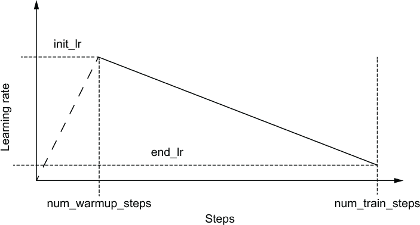

图 13.9 随着训练逐步进行（即迭代步数），学习率的行为

现在我们可以像以前一样编译模型了。我们将定义一个损失（稀疏分类交叉熵损失）和一个指标（使用标签而不是 one-hot 向量计算的准确度），然后将优化器、损失和指标传递给 hub_classifier.compile() 函数：

```py
metrics = [tf.keras.metrics.SparseCategoricalAccuracy('accuracy', 
➥ dtype=tf.float32)]
loss = tf.keras.losses.SparseCategoricalCrossentropy(from_logits=True)

hub_classifier.compile(
    optimizer=optimizer,
    loss=loss,
    metrics=metrics)
```

训练模型

我们已经走了很长的路，现在剩下的就是训练模型。模型训练非常简单，类似于我们使用 tf.keras.Model.fit() 函数训练模型的方式：

```py
hub_classifier.fit(
      x=train_inputs, 
      y=train_y,
      validation_data=(valid_inputs, valid_y),
      validation_batch_size=eval_batch_size,
      batch_size=batch_size,
      epochs=epochs)
```

我们将使用 get_bert_inputs() 函数准备的 train_inputs 传递给参数 x，将 train_y（即一个由 1 和 0 组成的向量，分别表示输入是垃圾邮件还是正常邮件）传递给 y。类似地，我们将 validation_data 定义为一个包含 valid_inputs 和 valid_y 的元组。我们还传入了 batch_size（训练批量大小）、validation_batch_size 和要训练的 epochs 数量。

评估和解释结果

当你运行训练时，你应该得到接近以下结果。这里你可以看到训练损失和准确率，以及验证损失和准确率：

```py
Epoch 1/3
18/18 [==============================] - 544s 29s/step - loss: 0.7082 - 
➥ accuracy: 0.4555 - val_loss: 0.6764 - val_accuracy: 0.5150
Epoch 2/3
18/18 [==============================] - 518s 29s/step - loss: 0.6645 - 
➥ accuracy: 0.6589 - val_loss: 0.6480 - val_accuracy: 0.8150
Epoch 3/3
18/18 [==============================] - 518s 29s/step - loss: 0.6414 - 
➥ accuracy: 0.7608 - val_loss: 0.6391 - val_accuracy: 0.8550
```

控制台输出清楚地显示了训练损失稳步下降，而准确率从 45% 上升到了 76%。模型已达到 85% 的验证准确率。这清楚地展示了像 BERT 这样的模型的强大之处。如果你要从头开始训练一个 NLP 模型，在这么短的时间内达到 85% 的验证准确率是不可能的。由于 BERT 具有非常强的语言理解能力，模型可以专注于学习手头的任务。请注意，由于我们的验证和测试集非常小（每个仅有 200 条记录），你可能会得到与此处所示不同水平的准确率。

注意 在一台配有 NVIDIA GeForce RTX 2070 8 GB 的 Intel Core i5 机器上，训练大约需要 40 秒来运行 3 个 epochs。

最后，让我们通过调用 evaluate() 函数在测试数据上测试模型。

```py
hub_classifier.evaluate(test_inputs, test_y)
```

这将返回

```py
7/7 [==============================] - 22s 3s/step - loss: 0.6432 - accuracy: 0.7950
```

再次，这是一个很棒的结果。仅经过三个 epochs，没有进行任何繁琐的参数调整，我们在测试数据上达到了 79.5% 的准确率。我们所做的一切就是在 BERT 之上拟合了一个逻辑回归层。

下一节将讨论我们如何定义一个能够从段落中找到答案的模型。为此，我们将使用到目前为止最流行的 Transformer 模型库之一：Hugging Face 的 transformers 库。

练习 2

你有一个包含五个类别的分类问题，并且想要修改 bert_classifier。给定正确格式的数据，你将如何更改所定义的 bert_classifier 对象？

## 13.3 使用 Hugging Face 的 Transformers 进行问答

你的朋友计划启动一个使用 ML 来找出开放领域问题答案的初创公司。缺乏 ML 背景，他转向你询问是否可以使用 ML 实现这一点。知道问题回答是机器可学习的，只要有标记数据，你决定使用 BERT 变体创建一个问答原型并进行演示。你将使用 SQUAD v1 问答数据集，并在该数据集上训练 DistilBERT（BERT 的一个变体）。为此，你将使用 Hugging Face 的 transformers 库（[`huggingface.co/transformers/`](https://huggingface.co/transformers/)）。Hugging Face 的 transformers 库提供了不同 Transformer 模型的实现和易于使用的 API 来训练/评估数据集上的模型。

BERT 旨在解决两种不同类型的任务：

+   任务只有一个文本序列作为输入

+   任务有两个文本序列（A 和 B）作为输入

垃圾邮件分类属于第一类。问题回答是一种具有两个输入序列的任务类型。在问题回答中，你有一个问题和一个内容（段落，句子等），其中可能包含问题的答案。然后训练一个模型来预测给定问题和内容的答案。让我们更好地了解一下过程。数据集中的每个记录将包含以下元素：

+   一个问题（文本序列）

+   一个内容（文本序列）

+   答案在内容中的起始索引（整数）

+   答案在内容中的结束索引（整数）

首先，我们需要将问题和内容结合起来，并添加几个特殊标记。在开头，我们需要添加一个[CLS]标记，然后添加一个[SEP]来分隔问题和内容，以及一个[SEP]来标记输入的结尾。此外，问题和内容将使用模型的分词器分解为标记（即子词）。对于具有

问题：狗对什么吠叫

答案：狗吠的是邮递员

如果我们将单个单词视为标记，输入将如下所示：

```py
[CLS], What, did, the, dog, barked, at, [SEP], The, dog, barked, at, the, 
➥ mailman, [SEP]
```

接下来，这些标记被转换为 ID 并馈送到 BERT 模型。BERT 模型的输出连接到两个下游分类层：一个层预测答案的起始索引，而另一个层预测答案的结束索引。这两个分类层各自有自己的权重和偏差。

BERT 模型将为输入序列中的每个标记输出一个隐藏表示。跨越整个内容范围的标记输出表示被馈送给下游模型。每个分类层然后预测每个标记作为答案的起始/结束标记的概率。这些层的权重在时间维度上共享。换句话说，相同的权重矩阵应用于每个输出表示以预测概率。

对于本节，我们将使用 Hugging Face 的 transformers 库。有关更多详细信息，请参阅侧边栏。

Hugging Face 的 transformers 库

Hugging Face 是一家专注于解决 NLP 问题的公司。该公司提供了用于训练 NLP 模型以及托管数据集并在公开可访问的存储库中训练模型的库。我们将使用 Hugging Face 提供的两个 Python 库：transformers 和 datasets。

在撰写本书时，transformers 库（[`huggingface.co/transformers/`](https://huggingface.co/transformers/)）是最通用的 Python 库，提供了对许多已发布的 Transformer 模型（例如，BERT，XLNet，DistilBERT，Albert，RoBERT 等）以及社区发布的 NLP 模型（[`huggingface.co/models`](https://huggingface.co/models)）的即时访问，transformers 库支持 TensorFlow 和 PyTorch 两种深度学习框架。PyTorch（[`pytorch.org/`](https://pytorch.org/)）是另一个类似于 TensorFlow 的深度学习框架，提供了全面的功能套件来实现和生产化深度学习模型。我在 transformers 库中看到的关键优势如下：

+   一个易于理解的 API，用于预训练和微调模型，这对所有模型都是一致的

+   能够下载各种 Transformer 模型的 TensorFlow 版本，并将其用作 Keras 模型

+   能够转换 TensorFlow 和 PyTorch 模型

+   强大的功能，如 Trainer（[`mng.bz/Kx9j`](http://mng.bz/Kx9j)），允许用户以非常灵活的方式创建和训练模型

+   高度活跃的社区-贡献模型和数据集

### 13.3.1 理解数据

如前所述，我们将使用 SQuAD v1 数据集（[`rajpurkar.github.io/SQuAD-explorer/`](https://rajpurkar.github.io/SQuAD-explorer/)）。这是由斯坦福大学创建的问答数据集。您可以使用 Hugging Face 的 datasets 库轻松下载数据集，如下所示：

```py
from datasets import load_dataset
dataset = load_dataset("squad")
```

让我们打印数据集并查看可用的属性：

```py
print(dataset)
```

这将返回

```py
DatasetDict({
    train: Dataset({
        features: ['id', 'title', 'context', 'question', 'answers'],
        num_rows: 87599
    })
    validation: Dataset({
        features: ['id', 'title', 'context', 'question', 'answers'],
        num_rows: 10570
    })
})
```

训练示例有 87,599 个，验证样本有 10,570 个。我们将使用这些示例来创建训练/验证/测试集分割。我们只对特征部分的最后三列感兴趣（即上下文，问题和答案）。其中，上下文和问题只是简单的字符串，而答案是一个字典。让我们进一步分析答案。您可以打印一些答案，如下所示：

```py
dataset["train"]["answers"][:5]
```

这给了

```py
[{'answer_start': [515], 'text': ['Saint Bernadette Soubirous']},
 {'answer_start': [188], 'text': ['a copper statue of Christ']},
 {'answer_start': [279], 'text': ['the Main Building']},
 {'answer_start': [381], 'text': ['a Marian place of prayer and reflection']},
 {'answer_start': [92], 'text': ['a golden statue of the Virgin Mary']}]
```

我们可以看到每个答案都有一个起始索引（基于字符）和包含答案的文本。有了这些信息，我们可以轻松计算答案的结束索引（即，结束索引 = 起始索引 + 文本长度）。

GLUE 基准任务套件

GLUE 基准测试（[`gluebenchmark.com/tasks`](https://gluebenchmark.com/tasks)）是一个用于评估自然语言处理模型的流行任务集合。它在多种任务上测试模型的自然语言理解能力。GLUE 任务集合包括以下任务。

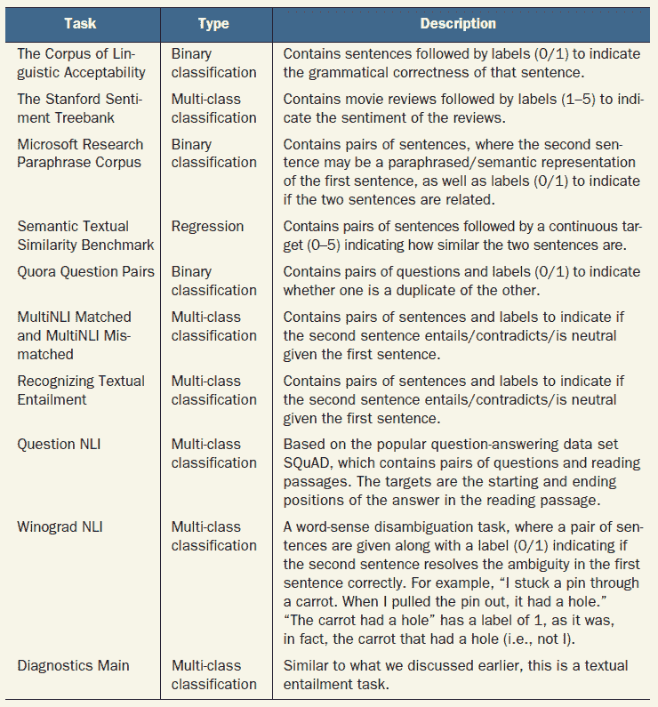

### 13.3.2 处理数据

此数据集存在几个完整性问题需要解决。我们将解决这些问题，然后创建一个 tf.data 流水线来传输数据。需要解决的第一个问题是给定的 answer_start 和实际的 answer_start 之间的对齐问题。一些示例往往在给定的 answer_start 和实际的 answer_start 位置之间存在大约两个字符的偏移。我们将编写一个函数来纠正此偏移，以及添加结束索引。下一节概述了执行此操作的代码。

列表 13.5 修正答案起始/结束索引中的不必要偏移量

```py
def correct_indices_add_end_idx(answers, contexts):
    """ Correct the answer index of the samples (if wrong) """

    n_correct, n_fix = 0, 0                                       ❶
    fixed_answers = []                                            ❷
    for answer, context in zip(answers, contexts):                ❸

        gold_text = answer['text'][0]                             ❹
        answer['text'] = gold_text                                ❹
        start_idx = answer['answer_start'][0]                     ❺
        answer['answer_start'] = start_idx                        ❺
        if start_idx <0 or len(gold_text.strip())==0:
            print(answer)
        end_idx = start_idx + len(gold_text)                      ❻

        # sometimes squad answers are off by a character or two - fix this
        if context[start_idx:end_idx] == gold_text:               ❼
            answer['answer_end'] = end_idx
            n_correct += 1
        elif context[start_idx-1:end_idx-1] == gold_text:         ❽
            answer['answer_start'] = start_idx - 1
            answer['answer_end'] = end_idx - 1     
            n_fix += 1
        elif context[start_idx-2:end_idx-2] == gold_text:         ❾
            answer['answer_start'] = start_idx - 2
            answer['answer_end'] = end_idx - 2 
            n_fix +=1

        fixed_answers.append(answer)

    print(                                                        ❿
        "\t{}/{} examples had the correct answer indices".format(
            n_correct, len(answers)
        )
    )
    print(                                                        ❿
        "\t{}/{} examples had the wrong answer indices".format(
            n_fix, len(answers)
        )
    )
    return fixed_answers, contexts                                ⓫
```

❶ 记录正确并已修正的数量。

❷ 新修正的答案将存储在此变量中。

❸ 迭代每个答案上下文对。

❹ 将答案从字符串列表转换为字符串。

❺ 将答案的起始部分从整数列表转换为整数。

❻ 通过将答案的长度加到 start_idx 上来计算结束索引。

❼ 如果从 start_idx 到 end_idx 的片段与答案文本完全匹配，则不需要更改。

❽ 如果从 start_idx 到 end_idx 的片段需要偏移 1 才能与答案匹配，则相应地偏移。

❾ 如果从 start_idx 到 end_idx 的片段需要偏移 2 才能与答案匹配，则相应地偏移。

❿ 打印正确答案的数量（不需要更改）。

⓫ 打印需要修正的答案数量。

现在我们可以在数据集的两个子集（训练和验证）上调用此函数。我们将使用验证子集作为我们的测试集（未见过的示例）。将一部分训练示例保留为验证样本：

```py
train_questions = dataset["train"]["question"]
train_answers, train_contexts = correct_indices_add_end_idx(
    dataset["train"]["answers"], dataset["train"]["context"]
)

test_questions = dataset["validation"]["question"]
test_answers, test_contexts = correct_indices_add_end_idx(
    dataset["validation"]["answers"], dataset["validation"]["context"]
)
```

当您运行此代码时，您将看到以下统计信息：

+   训练数据修正

    +   87,341/87,599 个示例的答案索引是正确的。

    +   258/87,599 个示例的答案索引是错误的。

+   验证数据修正

    +   10,565/10,570 个示例的答案索引是正确的。

    +   5/10,570 个示例的答案索引是错误的。

我们必须确保所需的修正数量不是非常高。如果修正数量显着高，通常意味着代码中存在错误或者数据加载逻辑存在问题。在这里，我们可以清楚地看到需要修正的示例数量很少。

定义和使用标记器

解决问题所需的所有数据都已经提供给我们了。现在是时候像以前一样对数据进行分词了。请记住，这些预训练的自然语言处理模型分为两部分：分词器和模型本身。分词器将文本分词为较小的部分（例如，子词），并以 ID 序列的形式呈现给模型。然后，模型接收这些 ID，并在它们上执行嵌入查找，以及各种计算，以得出最终的标记表示，这将作为输入传递给下游分类模型（即问答分类层）。在 transformers 库中，你有分词器对象和模型对象：

```py
from transformers import DistilBertTokenizerFast
tokenizer = DistilBertTokenizerFast.from_pretrained('distilbert-base-uncased')
```

你可以看到我们正在使用一个名为 DistilBertTokenizerFast 的分词器。这个分词器来自一个称为 DistilBERT 的模型。DistilBERT 是 BERT 的一个较小版本，表现与 BERT 相似但体积较小。它使用了一种称为*知识蒸馏*的迁移学习技术进行训练（[`devopedia.org/knowledge-distillation`](https://devopedia.org/knowledge-distillation)）。要获得这个分词器，我们只需要调用 DistilBertTokenizerFast.from_pretrained() 函数，传入模型标签（即 distilbert-base-uncased）。这个标签表示模型是一个 DistilBERT 类型的模型，基本大小为（有不同大小的模型可用），并且忽略字符的大小写（由 uncased 表示）。模型标签指向 Hugging Face 的模型仓库中可用的一个模型，并为我们下载它。它将被存储在你的计算机上。

Hugging Face 提供了两种不同的分词器变体：标准分词器（PreTrainedTokenizer 对象；[`mng.bz/95d7`](http://mng.bz/95d7)）和快速分词器（PreTrainedTokenizerFast 对象；[`mng.bz/j2Xr`](http://mng.bz/j2Xr)）。你可以在[`mng.bz/WxEa`](http://mng.bz/WxEa)中了解它们的区别）。在批量编码（即将字符串转换为标记序列）时，它们的速度明显更快。此外，快速分词器还有一些额外的方法，将帮助我们轻松地处理输入，以供问答模型使用。

什么是 DistilBERT？

跟随 BERT，DistilBERT 是 Hugging Face 在 2019 年的论文“DistilBERT, a distilled version of BERT: smaller, faster, cheaper and lighter” by Sanh et al. ([`arxiv.org/pdf/1910.01108v4.pdf`](https://arxiv.org/pdf/1910.01108v4.pdf))中介绍的模型。它是使用知识蒸馏的迁移学习技术训练的。其核心思想是拥有一个教师模型（即 BERT），其中一个较小的模型（即 DistilBERT）试图模仿教师的输出，这成为 DistilBERT 的学习目标。DistilBERT 比 BERT 要小，只有六层，而 BERT 有 12 层。DistilBERT 另一个关键的不同之处在于它仅在遮蔽语言建模任务上进行训练，而不是下一个句子预测任务。这个决定是基于一些研究的支持，这些研究质疑下一个句子预测任务（相比于遮蔽语言建模任务）对于自然语言理解的贡献。

有了下载的分词器，让我们通过提供一些示例文本来检查分词器以及它是如何转换输入的：

```py
context = "This is the context"
question = "This is the question"

token_ids = tokenizer(context, question, return_tensors='tf')
print(token_ids)
```

这将返回

```py
{'input_ids': <tf.Tensor: shape=(1, 11), dtype=int32, numpy=
array([[ 101, 2023, 2003, 1996, 6123,  102, 2023, 2003, 1996, 3160,  102]],
      dtype=int32)>, 
 'attention_mask': <tf.Tensor: shape=(1, 11), dtype=int32, numpy=array([[1, 1, 1, 1, 1, 1, 1, 1, 1, 1, 1]], dtype=int32)>
}
```

接下来，打印与 ID 相对应的令牌

```py
print(tokenizer.convert_ids_to_tokens(token_ids['input_ids'].numpy()[0]))
```

这将给出

```py
['[CLS]', 'this', 'is', 'the', 'context', '[SEP]', 'this', 'is', 'the', 'question', '[SEP]']
```

现在我们可以使用接下来清单中的代码对所有训练和测试数据进行编码。

清单 13.6 编码训练和测试数据

```py
train_encodings = tokenizer(                                          ❶
    train_contexts, train_questions, truncation=True, padding=True, 
➥ return_tensors='tf' 
)
print(
    "train_encodings.shape: {}".format(train_encodings["input_ids"].shape)
)

test_encodings = tokenizer(
    test_contexts, test_questions, truncation=True, padding=True, 
➥ return_tensors='tf'                                                ❷
)
print("test_encodings.shape: {}".format(test_encodings["input_ids"].shape))
```

❶ 编码 train 数据。

❷ 编码测试数据。

注意，我们在调用分词器时使用了几个参数。当启用截断和填充（即设置为 True）时，分词器将根据需要对输入序列进行填充/截断。你可以在创建分词器时传递一个参数（model_max_length）来将文本填充或截断到一定的长度。如果没有提供这个参数，它将使用在预训练时设置的默认长度作为分词器的配置之一。启用填充/截断后，你的输入将经历以下变化之一：

+   如果序列比长度短，则在序列末尾添加特殊令牌[PAD]直到它达到指定的长度。

+   如果序列比长度长，就会被截断。

+   如果序列的长度恰好相同，则不会引入任何更改。

当你运行清单 13.6 中的代码时，会打印

```py
train_encodings.shape: (87599, 512)
test_encodings.shape: (10570, 512)
```

我们可以看到，所有序列都被填充或截断，直到达到在模型预训练期间设置的 512 的长度。让我们看一下在使用 transformers 库定义分词器时需要注意的一些重要参数：

+   model_max_length (int, *optional*)—输入进行填充的最大长度（令牌数）。

+   padding_side (str, *optional*)—模型应用填充的一侧。可以是 ['right', 'left']。默认值从同名的类属性中选择。

+   model_input_names（List[string]，*可选*）—模型前向传递接受的输入列表（例如，“token_type_ids”或“attention_mask”）。默认值从同名类属性中选取。

+   bos_token（str 或 tokenizers.AddedToken，*可选*）—表示句子开头的特殊标记。

+   eos_token（str 或 tokenizers.AddedToken，*可选*）—表示句子结尾的特殊标记。

+   unk_token（str 或 tokenizers.AddedToken，*可选*）—表示词汇表外单词的特殊标记。如果模型遇到以前没有见过的单词，词汇表外单词就很重要。

大多数这些参数可以安全地忽略，因为我们使用的是预训练的分词器模型，在训练之前已经设置了这些属性。

不幸的是，我们还需要做一些事情。我们必须做的一个重要转换是如何表示模型答案的开始和结束。正如我之前所说的，我们给出了答案的起始和结束字符位置。但是我们的模型只理解标记级别的分解，而不是字符级别的分解。因此，我们必须从给定的字符位置找到标记位置。幸运的是，快速分词器提供了一个方便的函数：char_to_token()。请注意，此函数仅适用于快速分词器（即 PreTrainedTokenizerFast 对象），而不适用于标准分词器（即 PreTrainedTokenizer 对象）。char_to_token()函数接受以下参数：

+   batch_or_char_index（int）—批处理中的示例索引。如果批处理有一个示例，则将其用作我们感兴趣的要转换为标记索引的字符索引。

+   char_index（int，可选—如果提供了批索引，则表示我们要转换为标记索引的字符索引。

+   sequence_index（int，可选—如果输入有多个序列，则表示字符/标记所属的序列。

使用此函数，我们将编写 update_char_to_token_positions_inplace()函数将基于字符的索引转换为基于标记的索引（见下一个列表）。

列表 13.7 将 char 索引转换为基于标记的索引

```py
def update_char_to_token_positions_inplace(encodings, answers):
    start_positions = []
    end_positions = []
    n_updates = 0

    for i in range(len(answers)):                                     ❶
        start_positions.append(
            encodings.char_to_token(i, answers[i]['answer_start'])    ❷
        )
        end_positions.append(
            encodings.char_to_token(i, answers[i]['answer_end'] - 1)  ❷
        )

        if start_positions[-1] is None or end_positions[-1] is None:
            n_updates += 1                                            ❸

        # if start position is None, the answer passage has been truncated
        # In the guide, 
➥ https:/ /huggingface.co/transformers/custom_datasets.xhtml#qa-squad
        # they set it to model_max_length, but this will result in NaN 
➥ losses as the last
        # available label is model_max_length-1 (zero-indexed)
        if start_positions[-1] is None:        
            start_positions[-1] = tokenizer.model_max_length -1       ❹

        if end_positions[-1] is None:
            end_positions[-1] = tokenizer.model_max_length -1         ❺

    print("{}/{} had answers truncated".format(n_updates, len(answers)))
    encodings.update({
        'start_positions': start_positions, 'end_positions': end_positions
    })                                                                ❻

update_char_to_token_positions_inplace(train_encodings, train_answers)
update_char_to_token_positions_inplace(test_encodings, test_answers)
```

❶ 遍历所有答案。

❷ 获取起始和结束字符位置的标记位置。

❸ 跟踪缺少答案的样本数量。

❹ 如果找不到起始位置，请将其设置为最后一个可用索引。

❺ 如果找不到结束位置，请将其设置为最后一个可用索引。

❻ 在原地更新编码。

这将打印

```py
10/87599 had answers truncated
8/10570 had answers truncated
```

在列表 13.7 中的代码中，我们遍历数据集中的每个答案，并对每个答案的起始和结束（字符索引）调用 char_to_token()方法。 答案的新起始和结束标记索引分配给新的键 start_positions 和 end_positions。 此外，您可以看到有一个验证步骤，检查起始或结束索引是否为 None（即，在预处理时未找到合适的标记 ID）。 如果是这种情况，我们将序列的最后一个索引分配为位置。

有多少个烂鸡蛋？

您可以看到，我们正在打印需要修改的示例数量（例如，需要纠正）或已损坏的示例数量（截断的答案）。 这是一个重要的健全性检查，因为很高的数字可能表明数据质量存在问题或数据处理工作流中存在错误。 因此，始终打印这些数字并确保它们低到可以安全忽略为止。

我们现在将看到如何定义 tf.data 流水线。

从标记到 tf.data 流水线

经过所有的清洁和必要的转换，我们的数据集就像新的一样好。 我们所剩下的就是从数据创建一个 tf.data.Dataset。 我们的数据流水线将非常简单。 它将创建一个训练数据集，该数据集将被分成两个子集，训练集和验证集，并对数据集进行批处理。 然后创建并批处理测试数据集。 首先让我们导入 TensorFlow：

```py
import tensorflow as tf
```

然后我们将定义一个生成器，将产生模型训练所需的输入和输出。 正如您所看到的，我们的输入是两个项目的元组。 它有

+   填充的输入标记 ID（形状为[<数据集大小>，512]）

+   注意力掩码（形状为[<数据集大小>，512]）

输出将由以下组成

+   起始令牌位置（形状为[<数据集大小>]）

+   结束令牌位置（形状为[<数据集大小>]

```py
def data_gen(input_ids, attention_mask, start_positions, end_positions):
    for inps, attn, start_pos, end_pos in zip(
        input_ids, attention_mask, start_positions, end_positions
    ):

        yield (inps, attn), (start_pos, end_pos)
```

我们的数据生成器以非常特定的格式返回数据。 它返回一个输入元组和一个输出元组。 输入元组按顺序具有标记 ID（input_ids）由标记器返回和注意力掩码（attention_mask）。 输出元组具有所有输入的答案的起始位置（start_positions）和结束位置（end_positions）。

我们必须将我们的数据生成器定义为可调用的（即，它返回一个函数，而不是生成器对象）。 这是我们将要定义的 tf.data.Dataset 的要求。 要从我们之前定义的生成器获取可调用函数，让我们使用 partial()函数。 partial()函数接受一个可调用的、可选的可调用关键字参数，并返回一个部分填充的可调用函数，您只需要提供缺少的参数（即，在部分调用期间未指定的参数）：

```py
from functools import partial

train_data_gen = partial(
    data_gen,
    input_ids=train_encodings['input_ids'],
    attention_mask=train_encodings['attention_mask'],
    start_positions=train_encodings['start_positions'],  
    end_positions=train_encodings['end_positions']
)
```

train_data_gen 可以视为一个没有参数的函数，因为我们已经在部分调用中提供了所有参数。由于我们已经将我们的数据定义为一个生成器的形式，我们可以使用 tf.data.Dataset.from_generator()函数生成数据。请记住，在通过生成器定义数据时，我们必须传递 output_types 参数。我们所有的输出都是 int32 类型。但它们作为一对元组出现：

```py
train_dataset = tf.data.Dataset.from_generator(
    train_data_gen, output_types=(('int32', 'int32'), ('int32', 'int32'))
)
```

接下来，我们对数据进行洗牌以确保没有顺序。确保传递 buffer_size 参数，该参数指定了有多少样本被带入内存进行洗牌。由于我们计划使用其中的 10000 个样本作为验证样本，我们将 buffer_size 设置为 20000：

```py
train_dataset = train_dataset.shuffle(20000)
```

是时候将 train_dataset 分割为训练和验证数据了，因为我们将使用原始验证数据子集作为测试数据。为了将 train_dataset 分割为训练和验证子集，我们将采取以下方法。在洗牌后，将前 10000 个样本定义为验证数据集。我们将使用 tf.data.Dataset.batch()函数进行数据批处理，批处理大小为 8：

```py
valid_dataset = train_dataset.take(10000)
valid_dataset = valid_dataset.batch(8)
```

跳过前 10000 个数据点，因为它们属于验证集，将其余部分作为 train_dataset。我们将使用 tf.data.Dataset.batch()函数对数据进行批处理，批处理大小为 8：

```py
train_dataset = train_dataset.skip(10000)
train_dataset = train_dataset.batch(8)
```

最后，使用相同的数据生成器定义测试数据：

```py
test_data_gen = partial(data_gen,
    input_ids=test_encodings['input_ids'], 
    attention_mask=test_encodings['attention_mask'],
    start_positions=test_encodings['start_positions'], 
    end_positions=test_encodings['end_positions']
)
test_dataset = tf.data.Dataset.from_generator(
    test_data_gen, output_types=(('int32', 'int32'), ('int32', 'int32'))
)
test_dataset = test_dataset.batch(8)
```

接下来我们将着手定义模型。

### 13.3.3 定义 DistilBERT 模型

我们仔细查看了数据，使用标记器进行了清理和处理，并定义了一个 tf.data.Dataset，以便快速检索模型将接受的格式的示例批次。现在是定义模型的时候了。为了定义模型，我们将导入以下模块：

```py
from transformers import TFDistilBertForQuestionAnswering
```

transformers 库为您提供了一个出色的现成模型模板选择，您可以下载并在任务上进行训练。换句话说，您不必费心琢磨如何在预训练 transformers 之上插入下游模型。例如，我们正在解决一个问答问题，我们想要使用 DistilBERT 模型。transformers 库具有 DistilBERT 模型的内置问答适配。您只需导入模块并调用 from_pretrained()函数并提供模型标签即可下载它：

```py
model = TFDistilBertForQuestionAnswering.from_pretrained("distilbert-base-uncased")
```

这将下载该模型并保存在您的本地计算机上。

Transformers 库还提供了哪些其他现成模型可用？

您可以查看[`mng.bz/8Mwz`](http://mng.bz/8Mwz)以了解您可以轻松完成的 DistilBERT 模型的操作。transformers 是一个完整的库，您可以使用它来解决几乎所有常见的 NLP 任务，使用 Transformer 模型。在这里，我们将查看 DistilBERT 模型的选项。

**TFDistilBertForMaskedLM**

这使您可以使用掩码语言建模任务对 DistilBERT 模型进行预训练。在掩码语言建模任务中，给定文本语料库，单词将被随机屏蔽，并要求模型预测屏蔽的单词。

**TFDistilBertForSequenceClassification**

如果您的问题具有单个输入序列，并且您希望为输入预测标签（例如，垃圾邮件分类、情感分析等），您可以使用此模型端到端地训练模型。

**TFDistilBertForMultipleChoice**

使用此变体，DistilBERT 可用于解决多项选择问题。输入包括一个问题和几个答案。这些通常组合成单个序列（即，[CLS] [Question] [SEP] [Answer 1] [SEP] [Answer 2] [SEP]等），并且模型被要求预测问题的最佳答案，通常通过将[CLS]标记的表示传递给分类层来完成，该分类层将预测正确答案的索引（例如，第一个答案、第二个答案等）。

**TFDistilBertForTokenClassification**

命名实体识别或词性标注等任务需要模型为输入序列中的每个标记预测一个标签（例如，人物、组织等）。对于这样的任务，可以简单地使用这种类型的模型。

**TFDistilBertForQuestionAnswering**

这是我们场景中将使用的模型。我们有一个问题和一个上下文，模型需要预测答案（或答案在上下文中的起始/结束位置）。可以使用此模块解决此类问题。

表 13.1 总结了此侧边栏中的模型及其用法。

表 13.1 Hugging Face 的 transformers 库中不同模型及其用法总结

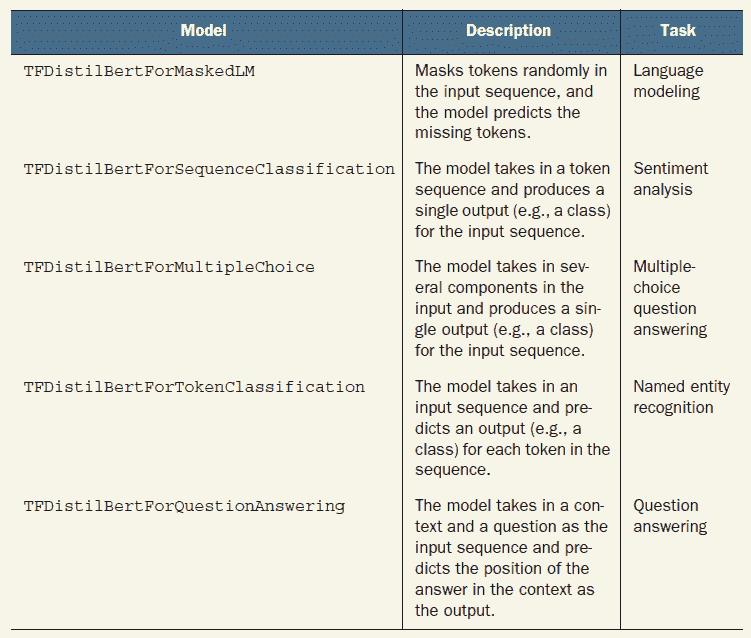

博客[`jalammar.github.io/illustrated-bert/`](http://jalammar.github.io/illustrated-bert/)提供了一张非常详细的图表，展示了 BERT-like 模型如何用于不同的任务（如“特定任务模型”部分所述）。

对这些模型的训练和评估将非常类似于您如果将它们用作 Keras 模型时的使用方式。只要数据格式符合模型期望的正确格式，您就可以对这些模型调用 model.fit()、model.predict()或 model.evaluate()。

要训练这些模型，您还可以使用高级 Trainer（[`mng.bz/EWZd`](http://mng.bz/EWZd)）。我们将在稍后更详细地讨论 Trainer 对象。

这一部分是我在使用该库时的一个警示。通常，一旦定义了模型，你可以像使用 Keras 模型一样使用它。这意味着你可以使用 tf.data.Dataset 调用 model.fit() 并训练模型。当训练模型时，TensorFlow 和 Keras 期望模型输出为张量或张量元组。然而，Transformer 模型的输出是特定对象（继承自 transformers.file_utils.ModelOutput 对象），如 [`mng.bz/N6Rn`](http://mng.bz/N6Rn) 中所述。这将引发类似以下的错误

```py
TypeError: The two structures don't have the same sequence type. 
Input structure has type <class 'tuple'>, while shallow structure has type 
<class 'transformers.modeling_tf_outputs.TFQuestionAnsweringModelOutput'>.
```

为了修复这个问题，transformers 库允许你设置一个名为 return_dict 的特定配置，并确保模型返回一个元组，而不是一个对象。然后，我们定义一个 Config 对象，该对象具有 return_dict=False，并用新的 config 对象覆盖模型的默认 config。例如，对于 DistilBERT 模型，可以这样做

```py
from transformers import DistilBertConfig, TFDistilBertForQuestionAnswering

config = DistilBertConfig.from_pretrained(
    "distilbert-base-uncased", return_dict=False
)
model = TFDistilBertForQuestionAnswering.from_pretrained(
    "distilbert-base-uncased", config=config
)
```

不幸的是，我无法通过使用这种配置使模型表现出我预期的行为。这表明，在编写代码时，即使使用一流的库，你也需要预料到可能出现的问题。最简单的解决方法是让 transformers 库输出一个 ModelOutput 对象，并编写一个包装函数，该函数将提取该对象的所需输出，并从这些输出创建一个 tf.keras.Model。以下清单中的函数为我们执行了这个任务。

[将模型包装在 tf.keras.models.Model 对象中以防止错误](https://wiki.example.org/wrapping_the_model_in_a_tf_keras_model_object_to_prevent_errors)

```py
def tf_wrap_model(model):
    """ Wraps the huggingface's model with in the Keras Functional API """

    # Define inputs
    input_ids = tf.keras.layers.Input(
        [None,], dtype=tf.int32, name="input_ids"
    )                                                  ❶
    attention_mask = tf.keras.layers.Input(
      [None,], dtype=tf.int32, name="attention_mask"   ❷
    )

   out = model([input_ids, attention_mask])            ❸

   wrap_model = tf.keras.models.Model(
     [input_ids, attention_mask], 
     outputs=(out.start_logits, out.end_logits)        ❹
   )

   return wrap_model
```

❶ 定义一个输入层，该层将接收一个令牌序列的批次。

❷ 定义一个输入，用于编码时返回的 attention mask。

❸ 给定输入 id 和 attention_mask 获取模型输出。

❹ 定义一个包装模型，该模型以定义的输入作为输入，并输出开始和结束索引预测层的对数。

你可以通过调用清单 13.8 中的函数来生成生成校正输出的模型：

```py
model_v2 = tf_wrap_model(model)
```

最后，使用损失函数（稀疏分类交叉熵，因为我们使用整数标签）、度量（稀疏准确性）和优化器（Adam 优化器）对模型进行编译：

```py
loss = tf.keras.losses.SparseCategoricalCrossentropy(from_logits=True)
acc = tf.keras.metrics.SparseCategoricalAccuracy()
optimizer = tf.keras.optimizers.Adam(learning_rate=1e-5)

model_v2.compile(optimizer=optimizer, loss=loss, metrics=[acc])
```

视觉中的 Transformer

Transformer 模型通常在自然语言处理领域表现出色。直到最近，人们才开始努力了解它们在计算机视觉领域的位置。然后谷歌和 Facebook AI 发表了几篇重要论文，研究了 Transformer 模型如何在计算机视觉领域中使用。

**视觉 Transformer（ViT）**

想法是将图像分解成 16×16 个小块，并将每个小块视为一个单独的令牌。每个图像路径被展平为一个 1D 向量，并使用位置编码机制对其位置进行编码，类似于原始的 Transformer。需要注意的是，原始 Transformer 中的位置编码是 1D 的。然而，图像是 2D 的。作者认为 1D 的位置编码已足够，且 1D 和 2D 位置编码之间没有太大的性能差异。一旦图像被分成 16×16 的块并展平，每个图像就可以被表示为一个令牌序列，就像文本输入序列一样。

然后，该模型以一种自监督的方式在一个名为 JFT-300M（[`paperswithcode.com/dataset/jft-300m`](https://paperswithcode.com/dataset/jft-300m)）的视觉数据集中进行预训练。在视觉中制定自监督任务并不是一件微不足道的事情，就像在 NLP 中那样。在 NLP 中，您可以简单地形成一个目标，即预测文本序列中的掩蔽令牌。但是，在计算机视觉的上下文中，令牌是一系列连续的值（归一化的像素值）。因此，ViT 预先训练以预测给定图像补丁的平均三位 RGB 颜色。每个通道（即红色，绿色和蓝色）都用三位表示（即每个位的值为 0 或 1），这给出 512 个可能或类。换句话说，对于给定的图像，补丁将被随机遮盖（使用与 BERT 相同的方法），并且要求模型预测该图像补丁的平均三位 RGB 颜色。

首先，Dosovitskiy 等人在 2020 年 10 月发表了题为“一张图片值 16x16 个单词：用于大规模图像识别的 transformers”（An Image Is Worth 16X16 Words: Transformers for Image Recognition at Scale）的文章（[`arxiv.org/pdf/2010.11929.pdf`](https://arxiv.org/pdf/2010.11929.pdf)）。这可以被认为是走向视觉变换器的第一步。在这篇论文中，作者将原始 Transformer 模型适应于计算机视觉，对架构进行了最小限度的修改。这个模型被称为视觉变换器（ViT）。

在预训练后，可以通过在 ViT 的顶部适配一个分类或回归头来针对特定任务的问题进行微调，就像 BERT 一样。ViT 还在序列的开头有[CLS]令牌，该令牌将用作插入到 ViT 上面的下游视觉模型的输入表示。以下图示说明了 ViT 的机制。

ViT 的原始代码是使用一个称为 Jax 的框架编写的（[`github.com/google-research/vision_transformer`](https://github.com/google-research/vision_transformer)）。然而，该模型有几个第三方 TensorFlow 包装器（例如[`github.com/emla2805/vision-transformer`](https://github.com/emla2805/vision-transformer)）。如果使用第三方版本，请确保阅读代码并验证正确性，因为第三方与原始研究团队没有关联。

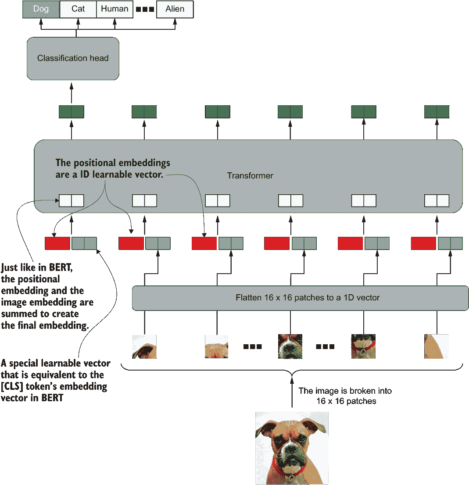

视觉 Transformer（ViT）模型架构及其在下游图像分类任务中的使用方式

统一 Transformer（UniT）

随后，Facebook AI 的一篇更具突破性的论文问世，题为“Transformer 就是你所需要的一切：统一 Transformer 实现多模态多任务学习”（作者：Hu 等）（[`arxiv.org/pdf/2102.10772.pdf`](https://arxiv.org/pdf/2102.10772.pdf)）。该模型被称为统一 Transformer（UniT）。UniT 可以在计算机视觉和自然语言处理领域执行大量任务，只需改变分类头即可。

即使模型很复杂，整体上还是很直观的。有三个 Transformer 模型。一个 Transformer 对图像输入（如果有）进行编码，以生成图像的编码表示。下一个 Transformer 对文本输入（如果有）进行编码。最后，另一个 Transformer 将任务索引作为输入，获取嵌入并将其传递给一个跨自注意力层，该层以连接的图像和文本编码作为查询和键，并将任务嵌入（经过自注意力层后）作为值。这类似于 Transformer 解码器在其编码器-解码器注意力层中使用最后一个编码器输出生成查询和键，并使用解码器的输入作为值。该模型在下一页的图中表示。

UniT 在涉及八个数据集的七项任务上进行了评估。这些任务包括对象检测、视觉问答、对象注释和四个仅语言任务。这四个仅语言任务来自 GLUE 基准数据集，其中包括以下内容：

**任务**

*对象检测*—模型预测图像中存在的对象的矩形坐标（数据集 COCO 和 Visual Genome Detection [VGD]）。

*视觉问答*（VQAv2）—给定一幅图像和一个问题，然后模型预测问题的答案，该答案可以在图像中找到（数据集：VQAv2）。

*视觉蕴涵任务*—一种视觉蕴涵任务，其中给定一幅图像和一个文本序列，模型预测句子是否语义上蕴含图像（SNLI-VE）。

*问题自然语言推理*（QNLI）—通过从给定上下文中提取答案来回答问题。

*Quora 问题对*（QQP）—从给定的问题对中识别重复的问题。

*文本蕴涵*—文本蕴涵着重于预测句子 A 是否蕴含/与句子 B 矛盾/与句子 B 中性（数据集 MNLI）。

*情感分析*—为给定的评论/文本预测情感（正面/负面/中性）（数据集 Stanford Sentiment Treebank [SST-2]）。

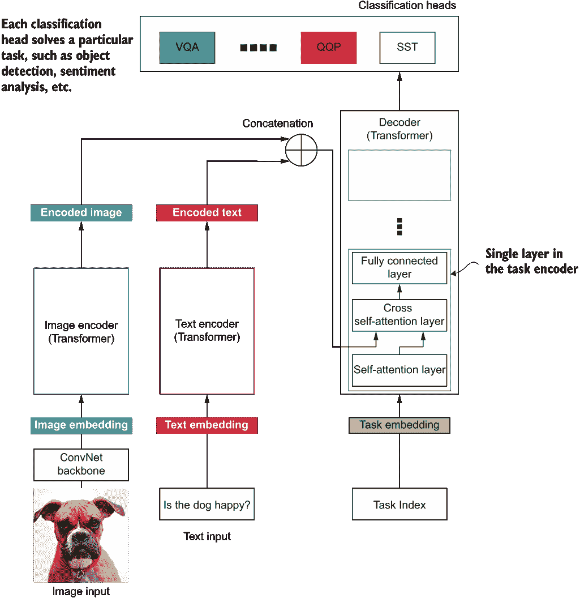

UniT 的整体架构。该模型由三个组件组成：图像编码器、文本编码器和任务解码器。最后，有几个分类头安装在任务解码器之上。

接下来，我们将训练我们刚刚定义的模型。

### 13.3.4 训练模型

我们一直在耐心地解决这个问题，最终，我们可以训练我们刚刚定义的模型，使用之前创建的 train_dataset 数据集，并使用 valid_dataset 来监视模型的准确度：

```py
model_v2.fit(
    train_dataset, 
    validation_data=valid_dataset,    
    epochs=3
)
```

这将打印以下输出：

```py
Epoch 1/3
WARNING:tensorflow:The parameters `output_attentions`, 
➥ `output_hidden_states` and `use_cache` cannot be updated when calling a 
➥ model.They have to be set to True/False in the config object (i.e.: 
➥ `config=XConfig.from_pretrained('name', output_attentions=True)`).

WARNING:tensorflow:The parameter `return_dict` cannot be set in graph mode 
➥ and will always be set to `True`.

9700/9700 [==============================] - 3308s 340ms/step - loss: 
➥ 4.3138 - tf_distil_bert_for_question_answering_loss: 2.2146 - 
➥ tf_distil_bert_for_question_answering_1_loss: 2.0992 - 
➥ tf_distil_bert_for_question_answering_sparse_categorical_accuracy: 
➥ 0.4180 - 
➥ tf_distil_bert_for_question_answering_1_sparse_categorical_accuracy: 
➥ 0.4487 - val_loss: 2.3849 - 
➥ val_tf_distil_bert_for_question_answering_loss: 1.2053 - 
➥ val_tf_distil_bert_for_question_answering_1_loss: 1.1796 - 
➥ val_tf_distil_bert_for_question_answering_sparse_categorical_accuracy: 
➥ 0.6681 - 
➥ val_tf_distil_bert_for_question_answering_1_sparse_categorical_accuracy
➥ : 0.6909

...

Epoch 3/3
9700/9700 [==============================] - 3293s 339ms/step - loss: 
➥ 1.6349 - tf_distil_bert_for_question_answering_loss: 0.8647 - 
➥ tf_distil_bert_for_question_answering_1_loss: 0.7703 - 
➥ tf_distil_bert_for_question_answering_sparse_categorical_accuracy: 
➥ 0.7294 - 
➥ tf_distil_bert_for_question_answering_1_sparse_categorical_accuracy: 
➥ 0.7672 - val_loss: 2.4049 - 
➥ val_tf_distil_bert_for_question_answering_loss: 1.2048 - 
➥ val_tf_distil_bert_for_question_answering_1_loss: 1.2001 - 
➥ val_tf_distil_bert_for_question_answering_sparse_categorical_accuracy: 
➥ 0.6975 - 
➥ val_tf_distil_bert_for_question_answering_1_sparse_categorical_accuracy
➥ : 0.7200
```

训练更新内容相当长，因此让我们将它们分解一下。有两个损失：

+   tf_distil_bert_for_question_answering_loss——测量起始索引预测头的损失

+   tf_distil_bert_for_question_answering_1_loss——测量结束索引预测头的损失

正如之前提到的，对于问答问题，我们有两个分类头：一个用于预测起始索引，另一个用于预测结束索引。对于准确度也有类似的情况。有两个准确度来衡量各自头部的性能：

+   tf_distil_bert_for_question_answering_sparse_categorical_accuracy——测量分类头预测起始索引的准确度

+   tf_distil_bert_for_question_answering_1_sparse_categorical_accuracy——测量分类头预测终结索引的准确度

我们可以看到模型对于起始和结束索引预测的训练准确度大约为 77%，而验证准确度分别为 70%和 72%。鉴于我们只对该模型进行了三次 epochs 的训练，这些准确度是不错的。

注意在一台配备了 NVIDIA GeForce RTX 2070 8GB 的 Intel Core i5 机器上，训练大约需要 2 小时 45 分钟来运行三个 epochs。

您可以看到模型训练过程中产生了几个警告。由于这是一个新库，非常重要的一点是要注意这些警告是否在我们使用这些模型的上下文中具有意义。如果看到错误，你不必担心这些警告，因为警告并不总是指示问题。根据我们要解决的问题，一些警告是不适用的，可以安全地忽略。第一个警告表示在调用模型时无法更新参数 output_attentions、output_hidden_states 和 use_cache，而需要作为 config 对象传递。我们对此并不担心，因为我们对模型不感兴趣引入任何自定义修改，并且我们使用的模型已经设计用于问答问题。

第二个警告表示 return_dict 将始终设置为 TRUE。设置 return_dict=True 意味着 Transformer 模型将返回一个 TensorFlow 或 Keras 无法理解的 ModelOutput 对象。当我们希望使用 Keras API 与模型一起使用时，这将在后续过程中造成问题。这就是我们创建 tf_wrap_model()函数的原因之一：确保我们获得一个总是输出元组而不是 ModelOutput 对象的 tf.keras.Model。

最后，我们将保存模型：

```py
import os

# Create folders
if not os.path.exists('models'):
    os.makedirs('models')
if not os.path.exists('tokenizers'):
    os.makedirs('tokenizers')

tokenizer.save_pretrained(os.path.join('tokenizers', 'distilbert_qa'))

model_v2.get_layer(
    "tf_distil_bert_for_question_answering").save_pretrained(
        os.path.join('models', 'distilbert_qa')
    )
)
```

确保保存分词器和模型。要保存分词器，你可以简单地调用 save_pretrained() 函数并提供一个文件夹路径。分词器将保存在该目录中。保存模型需要更多的工作。我们无法直接保存模型（model_v2），因为当你的模型有一个自定义层时，为了正确保存，该层需要实现 get_config() 函数并指定该层的所有属性。然而，对于作为自定义层存在的 Transformer 模型，这样做将会非常困难。因此，我们只会通过调用 model_v2.get_layer() 函数和层名称（即 tf_distil_bert_for_question_answering）来保存 Transformer 模型，然后使用文件夹路径调用 save_pretrained() 方法。每当我们需要构建完整模型时，我们只需在保存的模型上调用 tf_wrap_model() 函数即可。

### 13.3.5 询问 BERT 一个问题

评估模型也是调用 model_v2.evaluate() 函数与我们之前创建的测试数据集相关的事情：

```py
model_v2.evaluate(test_dataset)
```

这将打印

```py
1322/1322 [==============================] - 166s 126ms/step - loss: 2.4756 
➥ - tf_distil_bert_for_question_answering_loss: 1.2702 - 
➥ tf_distil_bert_for_question_answering_1_loss: 1.2054 - 
➥ tf_distil_bert_for_question_answering_sparse_categorical_accuracy: 
➥ 0.6577 - 
➥ tf_distil_bert_for_question_answering_1_sparse_categorical_accuracy: 
➥ 0.6942
```

这是个好消息！我们在预测答案起始索引时达到了约 65.7%的准确率，而模型能够以大约 69.4%的准确率预测结束索引。需要观察的两件事是起始和结束的准确率都相似，这意味着模型能够以这个准确率正确地获取答案（从开始到结束）。最后，这个准确率接近验证准确率，这意味着我们没有发生异常的过拟合。

正如我多次提到的，仅仅看一个数字通常不足以判断一个模型的性能。在评估对象时，视觉检查一直是人类的自然倾向。因此，作为一个严谨的数据科学家或机器学习工程师，尽可能地将其纳入机器学习工作流程是必要的。在下一个清单中，我们将向我们的模型提供来自测试集的一个问题，看看模型会产生什么。

清单 13.9 推断给定问题的模型的文本答案

```py
i = 5

sample_q = test_questions[i]                                          ❶
sample_c = test_contexts[i]                                           ❶
sample_a = test_answers[i]                                            ❶
sample_input = (
    test_encodings["input_ids"][i:i+1], 
    test_encodings["attention_mask"][i:i+1]
)

def ask_bert(sample_input, tokenizer):

    out = model_v2.predict(sample_input)                              ❷
    pred_ans_start = tf.argmax(out[0][0])                             ❸
    pred_ans_end = tf.argmax(out[1][0])                               ❹
    print(
        "{}-{} token ids contain the answer".format(
            pred_ans_start, pred_ans_end
        )
    )
    ans_tokens = sample_input[0][0][pred_ans_start:pred_ans_end+1]    ❺

    return " ".join(tokenizer.convert_ids_to_tokens(ans_tokens))      ❻

print("Question")                                                     ❼
print("\t", sample_q, "\n")                                           ❼
print("Context")                                                      ❼
print("\t", sample_c, "\n")                                           ❼
print("Answer (char indexed)")                                        ❼
print("\t", sample_a, "\n")                                           ❼
print('='*50,'\n')

sample_pred_ans = ask_bert(sample_input, tokenizer)                   ❽

print("Answer (predicted)")                                           ❾
print(sample_pred_ans)                                                ❾
print('='*50,'\n')
```

❶ 定义一个示例问题、上下文和答案。

❷ 对示例输入进行模型预测。这将返回起始和结束索引的概率向量。

❸ 通过从起始索引概率向量中获取最大索引来获得预测的起始索引。

❹ 通过从结束索引概率向量中获取最大索引来获得预测的结束索引。

❺ 通过获取起始/结束索引之间的文本来获得字符串答案标记。

❻ 返回一个单一字符串形式的标记列表。

❼ 打印模型的输入。

❽ 在定义的输入上调用 ask_bert 函数。

❾ 打印答案。

让我们详细说明清单 13.9 中代码的细节。首先，我们定义一个索引 i。这个索引将用于从测试集中检索一个样本。sample_q、sample_c 和 sample_a 代表我们选择的样本的问题、上下文和答案。有了这些，我们可以定义 sample_input，它将包含模型理解的输入的编码表示。函数 ask_bert()接受一个使用 tokenizer 为模型准备的输入（用 sample_input 表示），以将答案的标记 ID 转换回可读的标记。该函数首先预测输入的输出，并获取答案的起始和结束标记 ID。最后，该函数将这些 ID 以及其中的单词转换为一个可理解的答案并返回文本。如果你打印这个过程的输出，你会得到以下结果：

```py
Question
     What was the theme of Super Bowl 50? 

Context
     Super Bowl 50 was an American football game to determine the 
➥ champion of the National Football League (NFL) for the 2015 season. The 
➥ American Football Conference (AFC) champion Denver Broncos defeated the 
➥ National Football Conference (NFC) champion Carolina Panthers 24-10 to 
➥ earn their third Super Bowl title. The game was played on February 7, 
➥ 2016, at Levi's Stadium in the San Francisco Bay Area at Santa Clara, 
➥ California. As this was the 50th Super Bowl, the league emphasized the 
➥ "golden anniversary" with various gold-themed initiatives, as well as 
➥ temporarily suspending the tradition of naming each Super Bowl game 
➥ with Roman numerals (under which the game would have been known as 
➥ "Super Bowl L"), so that the logo could prominently feature the Arabic 
➥ numerals 50\. 

Answer (char indexed)
     {'answer_start': 487, 'text': '"golden anniversary"', 
➥ 'answer_end': 507} 

================================================== 

98-99 token ids contain the answer
Answer (predicted)
golden anniversary
================================================== 
```

这结束了我们关于使用 Hugging Face 的 Transformer 库实现 Transformer 模型的讨论。我们已经逐步介绍了您在解决任何 NLP 任务时可能遇到的所有步骤。Hugging Face 的 transformers 库仍然以在 TensorFlow 或 PyTorch 中实现 Transformer 模型而享有盛誉。

可视化注意力头

每当我们有机会解释深度学习模型并理解模型为何做出某种决定时，充分利用这个机会就显得很重要。拥有解剖和解释模型的能力有助于在用户之间建立信任。由于存在自注意力层，解释 Transformer 模型变得非常容易。使用自注意力层，我们可以找出模型在生成一个令牌的隐藏表示时注意到了哪些单词。

我们可以使用 bert_viz 库（[`github.com/jessevig/bertviz`](https://github.com/jessevig/bertviz)）来可视化任意层中任意注意力头中的注意力模式。重要的是要注意，bert_viz 不支持 TensorFlow，而是使用 PyTorch 库。尽管有这个小小的技术差异，但使用 bert_viz 很容易和直观。

首先，导入所需的库：

```py
import torch
from bertviz import head_view
```

接下来，定义一个 BERT 模型。确保将 output_attentions=True 配置传递给输出注意力输出，因为默认情况下它是关闭的：

```py
config = BertConfig.from_pretrained(
    'bert-base-uncased', output_attentions=True
)
bert = TFBertModel.from_pretrained(
    "bert-base-uncased", config=config
)
```

编码输入文本，然后获取模型的输出：

```py
encoded_input = tokenizer(text, return_tensors='tf')
output = model(encoded_input)
```

最后调用 head_view()函数。你可以通过简单调用 output.attentions 来获取注意力输出，它将返回一个包含 12 个张量的元组。每个张量对应于 BERT 中的一个单独层。此外，确保将它们转换为 torch 张量。否则，该函数会出错。输出在图 13.10 中可视化。

```py
head_view(
    [torch.from_numpy(layer_attn.numpy()) for layer_attn in output.attentions],
    encoded_tokens
)
```

这结束了我们关于 Transformer 模型的讨论。然而，重要的是要记住，Transformer 模型正在不断发展并变得更好。在下一章中，我们将讨论一个重要的可视化工具，称为 TensorBoard，它与 TensorFlow 一起提供。

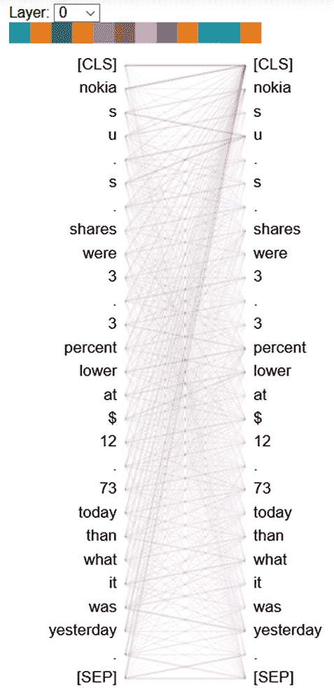

图 13.10 bert_viz 库的注意力输出。您可以从下拉菜单中选择不同的层。不同的阴影代表该层中不同的注意力头，可以打开或关闭。两列之间的线表示模型在生成给定标记的隐藏表示时关注哪些词。

**练习 3**

您被要求实现一个命名实体识别模型。命名实体识别是一个标记分类任务，其中为每个标记分配一个标签（例如，人物、组织、地理、其他等）。有七种不同的标签。如果您想要使用 distilbert-base-uncased 模型进行此操作，您将如何定义模型？请记住，在 transformers 库中，您可以将 num_labels 作为关键字传递以定义输出类的数量。例如，如果您有一个要设置为 "abc" 的配置 "a"，您可以这样做

```py
<model>.from_pretrained(<model_tag>, *"*a*"*= *"*abc*"*)
```

## 概要

+   Transformer 模型的主要子组件包括嵌入（标记和位置）、自注意力子层、完全连接子层、残差连接和层归一化子层。

+   BERT 是一个 Transformer 编码器模型，为输入传递的每个标记生成一个隐藏的（关注的）表示。

+   BERT 使用特殊标记，如 [CLS]（表示开始并用于生成分类头的输出）、[SEP]（用于标记两个子序列之间的分隔；例如，在问答中标记问题和上下文之间的分隔）、[PAD]（表示填充的标记，将所有序列都调整为固定长度）、以及 [MASK]（用于在输入序列中屏蔽标记；例如，填充的标记）。

+   BERT 可以通过在 BERT 的最终输出之上适配一个分类头（例如，逻辑回归层）来用于下游、任务特定的分类任务。根据任务类型，可能需要多个分类头，并且分类头的利用可能有所不同。

+   Hugging Face 的 transformers 库提供了所有与 NLP 相关的 Transformer 模型的实现，并且可以轻松下载和在工作流中使用。可下载的预训练模型具有两个主要组件：分词器，将提供的字符串标记为标记序列；模型，接受标记序列以生成最终的隐藏输出。

## 练习答案

**练习 1**

*PE*(*pos*,2*i* ) = sin(*pos*/10000^(21/d[model]))

```py
import tensorflow as tf

# Defining some hyperparameters
n_steps = 25 # Sequence length
n_en_vocab = 300 # Encoder's vocabulary size
n_heads = 8 # Number of attention heads
d = 512 # The feature dimensionality of each layer

# Encoder input layer
en_inp = tf.keras.layers.Input(shape=(n_steps,))
# Encoder input embedddings
en_emb = tf.keras.layers.Embedding(
    n_en_vocab, 512, input_length=n_steps
)(en_inp)

pos_inp = tf.constant(
    [[p/(10000**(2*i/d)) for p in range(d)] for i in range(n_steps)]
)
pos_inp = tf.expand_dims(pos_inp, axis=0)
en_pos_emb = tf.math.sin(pos_inp)

en_final_emb = en_emb + en_pos_emb

# Two encoder layers
en_out1 = EncoderLayer(d, n_heads)(en_emb)
en_out2 = EncoderLayer(d, n_heads)(en_out1)

model = tf.keras.models.Model(inputs=en_inp, output=en_out2)
```

**练习 2**

```py
hub_classifier, hub_encoder = bert.bert_models.classifier_model(
    bert_config=bert_config, hub_module_url=bert_url, num_labels=5
)
```

**练习 3**

```py
from transformers import TFDistilBertForTokenClassification

model = TFDistilBertForTokenClassification.from_pretrained(
    "distilbert-base-uncased", num_labels=7
*)*
```
