# 第十四章：TensorBoard：TensorFlow 的大兄弟

本章内容包括

+   在 TensorBoard 上运行和可视化图像数据

+   实时监测模型性能和行为

+   使用 TensorBoard 进行性能分析模型建模

+   使用 tf.summary 在自定义模型训练过程中记录自定义指标

+   在 TensorBoard 上可视化和分析词向量

到目前为止，我们已经重点关注了各种模型。我们讨论了全连接模型（例如自动编码器）、卷积神经网络和循环神经网络（例如 LSTM、GRU）。在第十三章，我们谈到了 Transformer，这是一类强大的深度学习模型，为语言理解领域的最新最优性能打下了基础。此外，受到自然语言处理领域的成就启发，Transformer 在计算机视觉领域也引起了轰动。我们已经完成了建模步骤，但还需要通过其他几个步骤来最终收获成果。其中一个步骤是确保向模型提供的数据/特征是正确的，并且模型按预期工作。

在本章中，我们将探索机器学习的一个新方面：利用可视化工具包来可视化高维数据（例如图像、词向量等），以及跟踪和监控模型性能。让我们了解为什么这是一个关键需求。由于机器学习在许多不同领域的成功示范，机器学习已经深深扎根于许多行业和研究领域。因此，这意味着我们需要更快速地训练新模型，并在数据科学工作流程的各个步骤中减少摩擦（例如了解数据、模型训练、模型评估等）。TensorBoard 是迈出这一步的方向。它可以轻松跟踪和可视化数据、模型性能，甚至对模型进行性能分析，了解数据在哪里花费了最多的时间。

通常，您会将数据和模型度量值以及其他要可视化的内容写入日志目录。写入日志目录的内容通常被组织成子文件夹，文件夹的命名包含了日期、时间以及对实验的简要描述。这将有助于在 TensorBoard 中快速识别一个实验。TensorBoard 会不断搜索指定的日志目录以查找更改，并在仪表板上进行可视化。您将在接下来的章节中了解到这些步骤的具体细节。

## 14.1 使用 TensorBoard 可视化数据

假设您是一家时尚公司的数据科学家。他们要求您评估构建一个可以在给定照片中识别服装的模型的可行性。为此，您选择了 Fashion-MNIST 数据集，该数据集包含黑白服装图像，属于 10 个类别之一。一些类别包括 T 恤、裤子和连衣裙。您将首先加载数据并通过 TensorBoard 进行分析，TensorBoard 是一种可视化工具，用于可视化数据和模型。在这里，您将可视化一些图像，并确保在加载到内存后正确分配了类标签。

首先，我们将下载 Fashion-MNIST 数据集。Fashion-MNIST 是一个带有各种服装图片和相应标签/类别的标记数据集。Fashion-MNIST 主要受到了 MNIST 数据集的启发。为了恢复我们的记忆，MNIST 数据集由 28×28 大小的 0-9 数字图像和相应的数字标签构成。由于任务的容易性，许多人建议不再将 MNIST 作为性能基准数据集，因此 Fashion-MNIST 应运而生。与 MNIST 相比，Fashion-MNIST 被认为是一项更具挑战性的任务。

下载 Fashion-MNIST 数据集非常容易，因为它可通过 tensorflow_datasets 库获取：

```py
import tensorflow_datasets as tfds

# Construct a tf.data.Dataset
fashion_ds = tfds.load('fashion_mnist')
```

现在，让我们打印来查看数据的格式：

```py
print(fashion_ds)
```

这将返回

```py
{'test': <PrefetchDataset shapes: {image: (28, 28, 1), label: ()}, types: 
➥ {image: tf.uint8, label: tf.int64}>, 'train': <PrefetchDataset shapes: 
➥ {image: (28, 28, 1), label: ()}, types: {image: tf.uint8, label: 
➥ tf.int64}>}
```

数据集包含两个部分，一个训练数据集和一个测试数据集。训练集有两个项：图像（每个图像尺寸为 28×28×1）和一个整数标签。测试集上也有同样的项。接下来，我们将创建三个 tf.data 数据集：训练集、验证集和测试集。我们将原始训练数据集分为两部分，一个训练集和一个验证集，然后将测试集保持不变（参见下一个代码清单）。

代码清单 14.1 生成训练、验证和测试数据集

```py
def get_train_valid_test_datasets(fashion_ds, batch_size, 
➥ flatten_images=False):

    train_ds = fashion_ds["train"].shuffle(batch_size*20).map(
        lambda xy: (xy["image"], tf.reshape(xy["label"], [-1]))         ❶
    )
    test_ds = fashion_ds["test"].map(
        lambda xy: (xy["image"], tf.reshape(xy["label"], [-1]))         ❷
    )

    if flatten_images:
        train_ds = train_ds.map(lambda x,y: (tf.reshape(x, [-1]), y))   ❸
        test_ds = test_ds.map(lambda x,y: (tf.reshape(x, [-1]), y))     ❸

    valid_ds = train_ds.take(10000).batch(batch_size)                   ❹

    train_ds = train_ds.skip(10000).batch(batch_size)                   ❺

    return train_ds, valid_ds, test_ds
```

❶ 获取训练数据集，对其进行洗牌，并输出一个(image, label)元组。

❷ 获取测试数据集，并输出一个(image, label)元组。

❸ 将图像扁平化为 1D 向量，用于全连接网络。

❹ 将验证数据集设置为前 10,000 个数据点。

❺ 将训练数据集设置为其余数据。

这是一个简单的数据流程。原始数据集中的每个记录都以字典形式提供，包含两个键：image 和 label。首先，我们使用 tf.data.Dataset.map()函数将基于字典的记录转换为(image, label)的元组。然后，如果数据集要用于全连接网络，则可选择性地将 2D 图像扁平化为 1D 向量。换句话说，28 × 28 的图像将变为 784 大小的向量。最后，我们将前 10,000 个数据点（经过洗牌）作为验证集，其余数据作为训练集。

在 TensorBoard 上可视化数据的方式是通过将信息记录到预定义的日志目录中，通过 tf.summary.SummaryWriter()。这个写入器将以 TensorBoard 理解的特殊格式写入我们感兴趣的数据。接下来，您启动一个 TensorBoard 的实例，将其指向日志目录。使用这种方法，让我们使用 TensorBoard 可视化一些训练数据。首先，我们定义一个从标签 ID 到字符串标签的映射：

```py
id2label_map = {
    0: "T-shirt/top",
    1: "Trouser",
    2:"Pullover",
    3: "Dress",
    4: "Coat",
    5: "Sandal",
    6: "Shirt",
    7: "Sneaker",
    8: "Bag",
    9: "Ankle boot"
}
```

这些映射是从 [`mng.bz/DgdR`](http://mng.bz/DgdR) 中获得的。然后我们将定义日志目录。我们将使用日期时间戳来生成不同运行的唯一标识符，如下所示：

```py
log_datetimestamp_format = "%Y%m%d%H%M%S"

log_datetimestamp = datetime.strftime(datetime.now(), 
➥ log_datetimestamp_format)
image_logdir = "./logs/data_{}/train".format(log_datetimestamp)
```

如果你对 log_datetimestamp_format 变量中的奇怪格式感到困惑，那么它是 Python 的 datetime 库使用的标准格式，用于定义日期和时间的格式（[`mng.bz/lxM2`](http://mng.bz/lxM2)），如果你在你的代码中使用它们。具体来说，我们将会得到运行时间（由 datetime.now() 给出）作为一个没有分隔符的数字字符串。我们将得到一天中给定时间的年份（%Y）、月份（%m）、日期（%d）、24 小时制的小时（%H）、分钟（%M）和秒（%S）。然后，我们将数字字符串附加到日志目录中，以根据运行时间创建一个唯一标识符。接下来，我们通过调用以下函数定义一个 tf.summary.SummaryWriter()，并将日志目录作为参数传递。有了这个，我们使用这个摘要写入器所做的任何写入都将被记录在定义的目录中：

```py
image_writer = tf.summary.create_file_writer(image_logdir)
```

接下来，我们打开已定义的摘要写入器作为默认写入器，使用一个 with 子句。一旦摘要写入器打开，任何 tf.summary.<数据类型> 对象都将将该信息记录到日志目录中。在这里，我们使用了一个 tf.summary.image 对象。你可以使用几种不同的对象来记录（[`www.tensorflow.org/api_docs/python/tf/summary`](https://www.tensorflow.org/api_docs/python/tf/summary)）：

+   tf.summary.audio—用于记录音频文件并在 TensorBoard 上听取的对象类型

+   tf.summary.histogram—用于记录直方图并在 TensorBoard 上查看的对象类型

+   tf.summary.image—用于记录图像并在 TensorBoard 上查看的对象类型

+   tf.summary.scalar—用于记录标量值（例如，在几个周期内计算的模型损失）并在 TensorBoard 上显示的对象类型

+   tf.summary.text—用于记录原始文本数据并在 TensorBoard 上显示的对象类型

*在这里，我们将使用* tf.summary.image() *来编写并在 TensorBoard 上显示图像。* tf.summary.image() 接受几个参数：

+   name—摘要的描述。这将在在 TensorBoard 上显示图像时用作标签。

+   data—大小为[b, h, w, c]的图像批次，其中 b 是批次大小，h 是图像高度，w 是图像宽度，c 是通道数（例如，RGB）。

+   step—一个整数，可用于显示属于不同批次/迭代的图像（默认为 None）。

+   max_outputs—在给定时间内显示的最大输出数量。如果数据中的图片数量超过 max_outputs，则将显示前 max_outputs 个图片，其余图片将被静默丢弃（默认为三）。

+   description—摘要的详细描述（默认为 None）

我们将以两种方式编写两组图像数据：

+   首先，我们将从训练数据集中逐个取出 10 张图像，并带有其类标签标记地写入它们。然后，具有相同类标签（即，类别）的图像将被嵌套在 TensorBoard 上的同一部分中。

+   最后，我们将一次写入一批 20 张图像。

```py
with image_writer.as_default():
    for data in fashion_ds["train"].batch(1).take(10):
        tf.summary.image(
            id2label_map[int(data["label"].numpy())], 
            data["image"], 
            max_outputs=10, 
            step=0
        )

# Write a batch of 20 images at once
with image_writer.as_default():
    for data in fashion_ds["train"].batch(20).take(1):
        pass
    tf.summary.image("A training data batch", data["image"], max_outputs=20, step=0)
```

然后，我们就可以开始可视化 TensorBoard 了。在 Jupyter 笔记本代码单元格中只需运行以下命令即可简单地初始化和加载 TensorBoard。您现在已经知道，Jupyter 笔记本由单元格组成，您可以在其中输入文本/代码。单元格可以是代码单元格、Markdown 单元格等：

```py
%load_ext tensorboard
%tensorboard --logdir ./logs --port 6006
```

图 14.1 显示了代码在笔记本单元格中的外观。

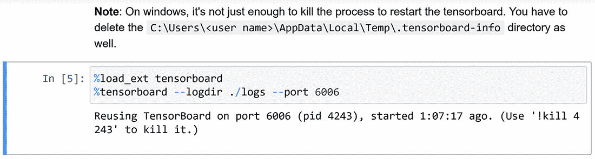

图 14.1 在笔记本单元格中的 Jupyter 魔术命令

您可能会注意到，这不是典型的 Python 语法。以 % 符号开头的命令被称为 Jupyter 魔术命令。请记住，Jupyter 是生成笔记本的 Python 库的名称。您可以在 [`mng.bz/BMd1`](http://mng.bz/BMd1) 查看此类命令的列表。第一个命令加载 TensorBoard Jupyter 笔记本扩展程序。第二个命令使用提供的日志目录（--logdir）参数和端口（--port）参数实例化 TensorBoard。如果不指定端口，则 TensorBoard 默认在 6006（或大于 6006 的第一个未使用的端口）上运行。图 14.2 显示了可视化图像的 TensorBoard 的外观。

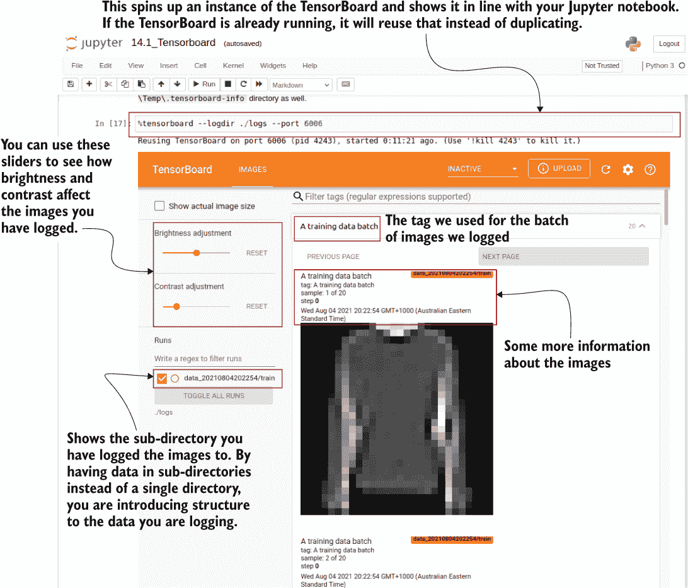

图 14.2 TensorBoard 可视化记录的图像，以内联方式在 Jupyter 笔记本中显示。您可以对图像执行各种操作，例如调整亮度或对比度。此外，数据被记录到的子目录显示在左侧面板上，让您可以轻松地显示/隐藏不同的子目录以便进行更容易的比较。

或者，您还可以将 TensorBoard 可视化为 Jupyter 笔记本之外的浏览器选项卡。在浏览器中运行这两个命令后，打开 http://localhost:6006，将显示 TensorBoard，如图 14.2 所示。在下一节中，我们将看到在模型训练过程中如何使用 TensorBoard 来跟踪和监视模型性能。

练习 1

您有一个名为 step_image_batches 的变量中包含五批图像的列表。列表中的每个项目对应于训练的前五个步骤。您希望在 TensorBoard 中显示这些批次，每个批次都具有正确的步骤值。您可以将每个批次命名为 batch_0、batch_1 等等。您该如何做？

## 14.2 使用 TensorBoard 跟踪和监视模型

通过对 Fashion-MNIST 数据集中的数据有很好的理解，您将使用神经网络在此数据上训练模型，以衡量您能够对不同类型的服装进行多么准确的分类。您计划使用密集网络和卷积神经网络。您将在相同的条件下训练这两个模型（例如，数据集），并在 TensorBoard 上可视化模型的准确性和损失。

TensorBoard 的主要作用是能够在模型训练时可视化模型的性能。深度神经网络以其长时间的训练时间而闻名。毫无疑问，尽早识别模型中的问题是非常值得的。TensorBoard 在其中发挥着至关重要的作用。您可以将模型性能（通过评估指标）导入到 TensorBoard 中实时显示。因此，您可以在花费过多时间之前快速发现模型中的任何异常行为并采取必要的行动。

在本节中，我们将比较全连接网络和卷积神经网络在 Fashion-MNIST 数据集上的性能。让我们将一个小型全连接模型定义为我们想要使用该数据集测试的第一个模型。它将有三层：

+   一个具有 512 个神经元和 ReLU 激活的层，该层接收来自 Fashion-MNIST 数据集的平坦图像

+   一个具有 256 个神经元和 ReLU 激活的层，该层接收前一层的输出

+   一个具有 softmax 激活的具有 10 个输出的层（表示类别）

该模型使用稀疏分类交叉熵损失和 Adam 优化器进行编译。由于我们对模型准确性感兴趣，因此我们将其添加到要跟踪的指标列表中：

```py
from tensorflow.keras import layers, models

dense_model = models.Sequential([
    layers.Dense(512, activation='relu', input_shape=(784,)),
    layers.Dense(256, activation='relu'),
    layers.Dense(10, activation='softmax')
])

dense_model.compile(loss="sparse_categorical_crossentropy", optimizer='adam', metrics=['accuracy'])
```

模型完全定义后，我们对训练数据进行训练，并在验证数据集上进行评估。首先，让我们定义全连接模型的日志目录：

```py
log_datetimestamp_format = "%Y%m%d%H%M%S"
log_datetimestamp = datetime.strftime(
    datetime.now(), log_datetimestamp_format
)

dense_log_dir = os.path.join("logs","dense_{}".format(log_datetimestamp))
```

与以往一样，您可以看到我们不仅将写入子目录而不是普通的平面目录，而且还使用了基于运行时间的唯一标识符。这些子目录中的每一个代表了 TensorBoard 术语中所谓的一个 *run*。

在 TensorBoard 中组织运行

通常，用户在通过 TensorBoard 可视化时利用某种运行组织。除了为多个算法创建多个运行之外，常见的做法是向运行添加日期时间戳，以区分同一算法在不同场合运行的不同运行。

例如，您可能会测试相同的算法与不同的超参数（例如，层数、学习率、优化器等），并且可能希望将它们都放在一个地方查看。假设您想测试具有不同学习率（0.01、0.001 和 0.0005）的全连接层。您将在主日志目录中具有以下目录结构：

```py
./logs/dense/run_2021-05-27-03-14-21_lr=0.01
./logs/dense/run_2021-05-27-09-02-52_lr=0.001
./logs/dense/run_2021-05-27-10-12-09_lr=0.001
./logs/dense/run_2021-05-27-14-43-12_lr=0.0005
```

或者您甚至可以使用更嵌套的目录结构：

```py
./logs/dense/lr=0.01/2021-05-27-03-14-21
./logs/dense/lr=0.001/2021-05-27-09-02-52
./logs/dense/lr=0.001/2021-05-27-10-12-09
./logs/dense/lr=0.0005/2021-05-27-14-43-12
```

我想强调时间戳您的运行很重要，如侧边栏中所述。这样，您将为每次运行都有一个唯一的文件夹，并且可以随时返回到以前的运行以进行比较。接下来，让我们使用 get_train_valid_test（）函数生成训练/验证/测试数据集。请确保设置 flatten_images=True：

```py
batch_size = 64
tr_ds, v_ds, ts_ds = get_train_valid_test_datasets(
    fashion_ds, batch_size=batch_size, flatten_images=True
)
```

将模型指标传递给 TensorBoard 非常简单。在模型训练/评估期间，可以传递一个特殊的 TensorBoard 回调函数：

```py
tb_callback = tf.keras.callbacks.TensorBoard(
    log_dir=dense_log_dir, profile_batch=0
)
```

让我们讨论一些您可以传递给 TensorBoard 回调函数的关键参数。默认的 TensorBoard 回调函数如下所示：

```py
tf.keras.callbacks.TensorBoard(
    log_dir='logs', histogram_freq=0, write_graph=True,
    write_images=False, write_steps_per_second=False, update_freq='epoch',
    profile_batch=2, embeddings_freq=0, embeddings_metadata=None, 
)
```

现在我们将查看所提供的参数：

+   log_dir—用于日志记录的目录。一旦使用该目录（或该目录的父目录）启动了 TensorBoard，可以在 TensorBoard 上可视化信息（默认为“logs”）。

+   histogram_freq—在各个层中创建激活分布的直方图（稍后详细讨论）。此选项指定要多频繁（以 epochs 为单位）记录这些直方图（默认值为 0，即禁用）。

+   write_graph—确定是否将模型以图形的形式写入 TensorBoard 以进行可视化（默认为 True）。

+   write_image—确定是否将模型权重写为图像（即热图）以在 TensorBoard 上可视化权重（默认为 False）。

+   write_steps_per_second—确定是否将每秒执行的步骤数写入 TensorBoard（默认为 False）。

+   update_freq（'batch'、'epoch'或整数）—确定是否每个批次（如果值设置为 batch）或每个 epoch（如果值设置为 epoch）向 TensorBoard 写入更新。传递一个整数，TensorFlow 将解释为“每 x 个批次写入 TensorBoard”。默认情况下，将每个 epoch 写入更新。写入磁盘很昂贵，因此过于频繁地写入将会降低训练速度。

+   profile_batch（整数或两个数字的列表）—确定要用于对模型进行分析的批次。分析计算模型的计算和内存使用情况（稍后详细讨论）。如果传递一个整数，它将分析一个批次。如果传递一个范围（即一个包含两个数字的列表），它将分析该范围内的批次。如果设置为零，则不进行分析（默认为 2）。

+   embedding_freq—如果模型具有嵌入层，则此参数指定可视化嵌入层的间隔（以 epochs 为单位）。如果设置为零，则禁用此功能（默认为 0）。

+   embedding_metadata—一个将嵌入层名称映射到文件名的字典。该文件应包含与嵌入矩阵中每行对应的标记（按顺序排列；默认为 None）。

最后，我们将像以前一样训练模型。唯一的区别是将 tb_callback 作为回调参数传递给模型：

```py
dense_model.fit(tr_ds, validation_data=v_ds, epochs=10, callbacks=[tb_callback])
```

模型应该达到约 85%的验证准确率。现在打开 TensorBoard，访问 http:/ /localhost:6006。它将显示类似于图 14.3 的仪表板。随着日志目录中出现新数据，仪表板将自动刷新。

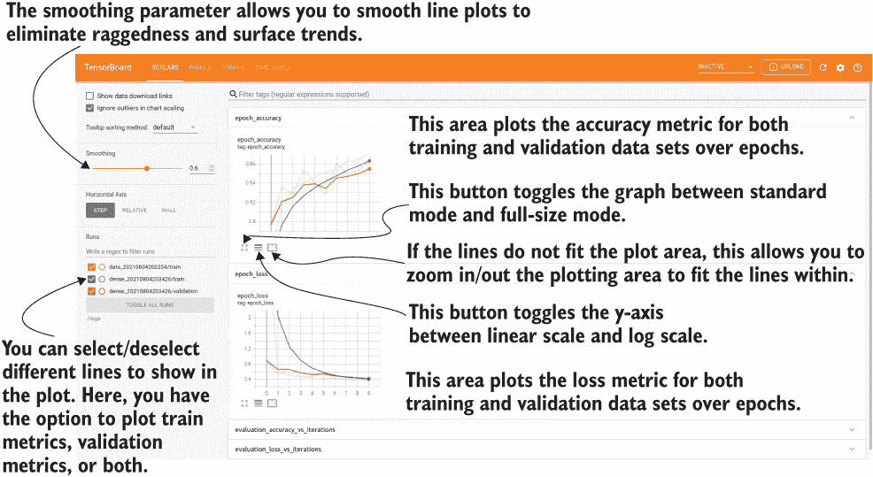

图 14.3 显示了 TensorBoard 上如何显示跟踪的指标。您可以看到训练和验证准确率以及损失值被绘制为折线图。此外，还有各种控件，例如最大化图形，切换到对数刻度 y 轴等等。

TensorBoard 仪表板具有许多控件，可以帮助用户通过记录的指标深入了解他们的模型。您可以打开或关闭不同的运行，具体取决于您要分析的内容。例如，如果您只想查看验证指标，则可以关闭 dense/train 运行，并反之亦然。Data/train 运行不会影响此面板，因为它包含我们从训练数据中记录的图像。要查看它们，可以单击 IMAGES 面板。

接下来，您可以更改平滑参数以控制曲线的平滑程度。通过使用曲线的平滑版本，有助于消除指标中的局部小变化，聚焦于整体趋势。图 14.4 描述了平滑参数对折线图的影响。

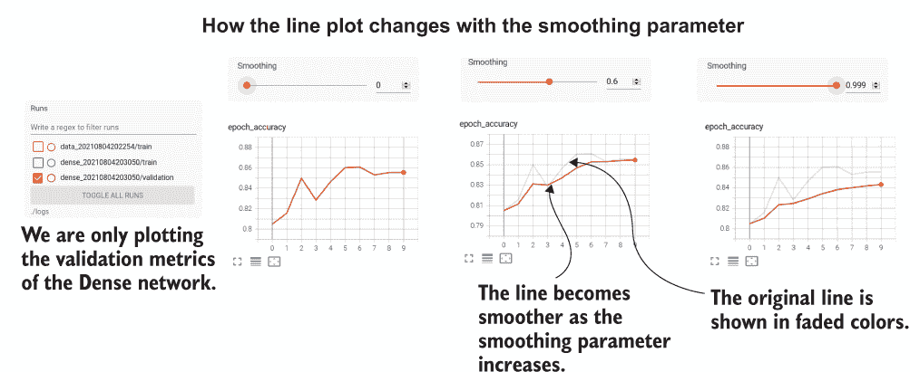

图 14.4 展示了平滑参数如何改变折线图。在这里，我们显示了使用不同平滑参数的相同折线图。您可以看到，随着平滑参数的增加，线条变得更平滑。原始线条以淡色显示。

此外，您还可以进行其他控制，例如切换到对数刻度 y 轴而不是线性。如果指标随时间观察到大幅变化，则这非常有用。在对数刻度下，这些大变化将变得更小。如果您需要更详细地检查图表，还可以在标准大小和全尺寸图之间切换。图 14.3 突出显示了这些控件。

之后，我们将定义一个简单的卷积神经网络，并执行相同的操作。也就是说，我们将首先定义网络，然后在使用回调函数到 TensorBoard 的同时训练模型。

让我们定义下一个我们将与全连接网络进行比较的模型：卷积神经网络（CNN）。同样，我们正在定义一个非常简单的 CNN，它包括

+   一个 2D 卷积层，具有 32 个过滤器，5×5 内核，2×2 步幅和 ReLU 激活，该层接受来自 Fashion-MNIST 数据集的 2D 28×28 大小的图像

+   一个具有 16 个过滤器的 2D 卷积层，具有 3×3 内核，1×1 步幅和 ReLU 激活，该层接受先前层的输出

+   一个扁平化层，将卷积输出压成适用于密集层的 1D 向量

+   具有 10 个输出（表示类别）并具有 softmax 激活的层

```py
conv_model = models.Sequential([
    layers.Conv2D(
       filters=32, 
       kernel_size=(5,5), 
       strides=(2,2), 
       padding='same', 
       activation='relu', 
       input_shape=(28,28,1)
    ),
    layers.Conv2D(
        filters=16, 
        kernel_size=(3,3), 
        strides=(1,1), 
        padding='same', 
        activation='relu'
    ),
    layers.Flatten(),
    layers.Dense(10, activation='softmax')
])

conv_model.compile(
    loss="sparse_categorical_crossentropy", optimizer='adam', 
➥ metrics=['accuracy']
)
conv_model.summary()
```

接下来，我们将 CNN 相关的指标记录到一个名为./logs/conv_{datetimestamp}的单独目录中。这样，我们可以分别绘制完全连接的网络和 CNN 的评估指标。我们将生成训练和验证数据集以及一个 TensorBoard 回调，就像之前做的那样。然后，在调用 fit()方法训练模型时将它们传递给模型：

```py
log_datetimestamp_format = "%Y%m%d%H%M%S"
log_datetimestamp = datetime.strftime(
    datetime.now(), log_datetimestamp_format
)

conv_log_dir = os.path.join("logs","conv_{}".format(log_datetimestamp))

batch_size = 64
tr_ds, v_ds, ts_ds = get_train_valid_test_datasets(
    fashion_ds, batch_size=batch_size, flatten_images=False
)

tb_callback = tf.keras.callbacks.TensorBoard(
    log_dir=conv_log_dir, histogram_freq=2, profile_batch=0
)

conv_model.fit(
    tr_ds, validation_data=v_ds, epochs=10, callbacks=[tb_callback]
)
```

注意我们在训练 CNN 时所做的更改。首先，我们不像训练完全连接的网络时那样将图像展平（即，在 get_train_valid_test_datasets()函数中设置 flatten_ images=False）。接下来，我们向 TensorBoard 回调引入了一个新参数。我们将使用 histogram_freq 参数来记录模型在训练过程中的层激活直方图。我们将很快更深入地讨论层激活直方图。这将在同一张图中显示两个模型（即密集模型和卷积模型）的准确度和损失指标，以便它们可以轻松比较（图 14.5）。

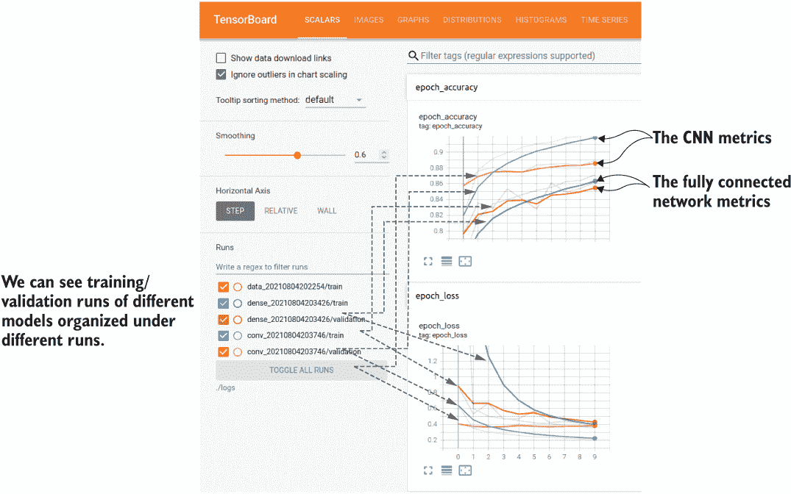

图 14.5 查看密集模型和卷积模型的指标。你可以根据需要比较不同的运行状态。

让我们再次回到激活直方图。激活直方图让我们可以可视化不同层的神经元激活分布随着训练的进行而变化的情况。这是一个重要的检查，它可以让你看到模型在优化过程中是否正在收敛，从而提供关于模型训练或数据质量的问题的见解。

让我们更深入地看一下这些直方图显示了什么。图 14.6 说明了我们训练的 CNN 生成的直方图。我们每两个时代绘制一次直方图。以直方图表示的权重堆叠在一起，这样我们就可以很容易地了解它们随时间的变化情况。直方图中的每个切片显示了给定层和给定时代中的权重分布。换句话说，它将提供诸如“有 x 个输出，其值为 y，大约为 z”的信息。

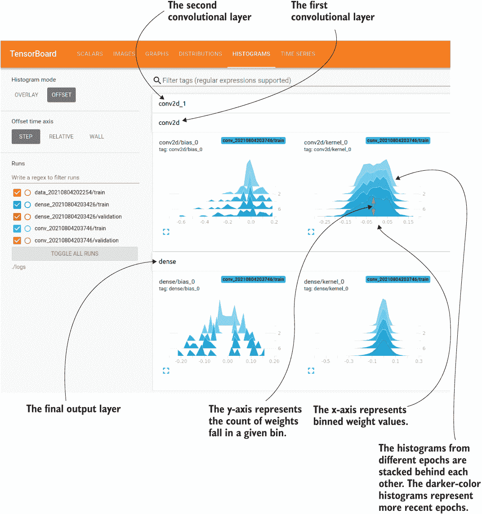

图 14.6 由 TensorBoard 显示的激活直方图。这些图表显示了给定层的激活分布随时间的变化情况（较浅的图表表示更近期的时代）。

通常，如果你有一个值的向量，创建直方图就相当简单。例如，假设值为[0.1, 0.3, 0.35, 0.5, 0.6, 0.61, 0.63]，并且假设你有四个箱子：0.0, 0.2)，[0.2, 0.4)，[0.4, 0.6)，和[0.6, 0.8)。你将得到图 14.7 所示的直方图。如果你看一下连接各条的中点的线，它类似于你在仪表板中看到的内容。

![14-07

图 14.7 生成的序列[0.1, 0.3, 0.35, 0.5, 0.6, 0.61, 0.63]的直方图

然而，当数据很大且稀疏（例如在权重矩阵中）时，计算直方图涉及更复杂的数据操作。例如，在 TensorBoard 中计算直方图涉及使用指数 bin 大小（与示例中的均匀 bin 大小相反），这在接近零时提供了更细粒度的 bin 和远离零时提供了更宽的 bin。然后，它将这些不均匀大小的 bin 重新采样为统一大小的 bin，以便更容易、更有意义地进行可视化。这些计算的具体细节超出了本书的范围。如果您想了解更多细节，请参考[`mng.bz/d26o`](http://mng.bz/d26o)。

我们可以看到，在训练过程中，权重正在收敛于一个近似的正态分布。但是偏差收敛于一个多峰分布，并在许多不同的地方出现峰值。

本节阐述了如何使用 TensorBoard 进行一些主要数据可视化和模型性能跟踪。这些是您在数据科学项目中必须设置的核心检查点的重要组成部分。数据可视化需要在项目早期完成，以帮助您理解数据及其结构。模型性能跟踪非常重要，因为深度学习模型需要更长的训练时间，而您需要在有限的预算（时间和成本）内完成培训。在下一节中，我们将讨论如何记录自定义指标到 TensorBoard 并可视化它们。

练习 2

您有一个由 classif_model 表示的二元分类模型。您想在 TensorBoard 中跟踪此模型的精度和召回率。此外，您想在每个时期可视化激活直方图。您将如何使用 TensorBoard 回调编译模型，并使用 TensorBoard 回调拟合数据以实现此目的？TensorFlow 提供了 tf.keras.metrics.Precision()和 tf.keras.metrics.Recall()来分别计算精度和召回率。您可以假设您直接记录到./logs 目录。假设您已经提供了 tf.data.Dataset 对象的训练数据（tr_ds）和验证数据（v_ds）。

## 14.3 使用 tf.summary 在模型训练期间编写自定义度量

想象一下，您是一名博士研究批量归一化的影响。特别是，您需要分析给定层中的权重均值和标准偏差如何随时间变化，以及有无批量归一化。为此，您将使用一个全连接网络，并在 TensorBoard 上记录每个步骤的权重均值和标准偏差。由于这不是您可以使用 Keras 模型生成的典型指标，因此您将在自定义培训循环中记录每个步骤的模型训练期间的指标。

为了比较批量归一化的效果，我们需要定义两个不同的模型：一个没有批量归一化，一个有批量归一化。这两个模型将具有相同的规格，除了使用批量归一化。首先，让我们定义一个没有批量归一化的模型：

```py
from tensorflow.keras import layers, models
import tensorflow.keras.backend as K

K.clear_session()
dense_model = models.Sequential([
    layers.Dense(512, activation='relu', input_shape=(784,)),    
    layers.Dense(256, activation='relu', name='log_layer'),    
    layers.Dense(10, activation='softmax')
])

dense_model.compile(loss="sparse_categorical_crossentropy", optimizer='adam', metrics=['accuracy'])
```

该模型非常简单，与我们之前定义的完全连接模型相同。它有三个层，分别有 512、256 和 10 个节点。前两层使用 ReLU 激活函数，而最后一层使用 softmax 激活函数。请注意，我们将第二个 Dense 层命名为 log_layer。我们将使用该层来计算我们感兴趣的指标。最后，该模型使用稀疏分类交叉熵损失、Adam 优化器和准确度作为指标进行编译。接下来，我们使用批量归一化定义相同的模型：

```py
dense_model_bn = models.Sequential([
    layers.Dense(512, activation='relu', input_shape=(784,)),
    layers.BatchNormalization(),
    layers.Dense(256, activation='relu', name='log_layer_bn'),
    layers.BatchNormalization(),
    layers.Dense(10, activation='softmax')
])

dense_model_bn.compile(
    loss="sparse_categorical_crossentropy", optimizer='adam', 
➥ metrics=['accuracy']
)
```

引入批量归一化意味着在 Dense 层之间添加 tf.keras.layers.BatchNormalization()层。我们将第二个模型中感兴趣的层命名为 log_layer_bn，因为我们不能同时使用相同名称的两个层。

有了定义好的模型，我们的任务是在每一步计算权重的均值和标准差。为此，我们将观察两个网络的第二层的权重的均值和标准差（log_layer 和 log_layer_bn）。正如我们已经讨论过的，我们不能简单地传递一个 TensorBoard 回调并期望这些指标可用。由于我们感兴趣的指标不常用，我们必须费力确保这些指标在每一步都被记录。

我们将定义一个 train_model()函数，可以将定义的模型传递给它，并在数据上进行训练。在训练过程中，我们将计算每一步权重的均值和标准差，并将其记录到 TensorBoard 中（见下一个清单）。

清单 14.2 在自定义循环中训练模型时编写 tf.summary 对象

```py
def train_model(model, dataset, log_dir, log_layer_name, epochs):    

    writer = tf.summary.create_file_writer(log_dir)                        ❶
    step = 0

    with writer.as_default():                                              ❷

        for e in range(epochs):
            print("Training epoch {}".format(e+1))
            for batch in tr_ds:

                model.train_on_batch(*batch)                               ❸

                weights = model.get_layer(log_layer_name).get_weights()[0] ❹

                tf.summary.scalar("mean_weights",np.mean(np.abs(weights)), ❺
➥ step=step)                                                              ❺
                tf.summary.scalar("std_weights", np.std(np.abs(weights)),  ❺
➥ step=step)                                                              ❺

                writer.flush()                                             ❻

                step += 1
            print('\tDone')

    print("Training completed\n")
```

❶ 定义写入器。

❷ 打开写入器。

❸ 用一个批次进行训练。

❹ 获取层的权重。它是一个数组列表[权重，偏差]，顺序是这样的。因此，我们只取权重（索引 0）。

❺ 记录权重的均值和标准差（对于给定 epoch 是两个标量）。

❻ 从缓冲区刷新到磁盘。

注意我们如何打开一个 tf.summary.writer()，然后使用 tf.summary.scalar()调用在每一步记录指标。我们给指标起了有意义的名称，以确保在 TensorBoard 上可视化时知道哪个是哪个。有了函数定义，我们为我们编译的两个不同模型调用它：

```py
batch_size = 64
tr_ds, _, _ = get_train_valid_test_datasets(
    fashion_ds, batch_size=batch_size, flatten_images=True
)
train_model(dense_model, tr_ds, exp_log_dir + '/standard', "log_layer", 5)

tr_ds, _, _ = get_train_valid_test_datasets(
    fashion_ds, batch_size=batch_size, flatten_images=True
)
train_model(dense_model_bn, tr_ds, exp_log_dir + '/bn', "log_layer_bn", 5)
```

请注意，我们指定不同的日志子目录，以确保出现的两个模型是不同的运行。运行后，您将看到两个新的附加部分，名为 mean_weights 和 std_weights（图 14.8）。似乎当使用批量归一化时，权重的均值和方差更加剧烈地变化。这可能是因为批量归一化在层之间引入了显式归一化，使得层的权重更自由地移动。

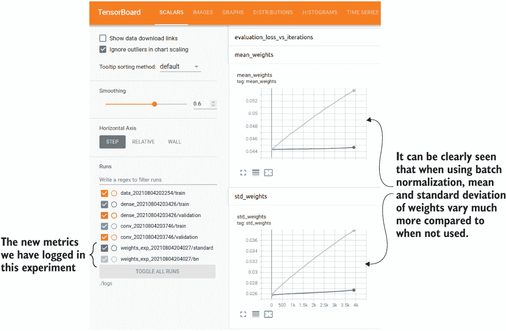

图 14.8 权重的均值和标准差在 TensorBoard 中绘制

接下来的部分详细介绍了如何使用 TensorBoard 来分析模型并深入分析模型执行时时间和内存消耗情况。

练习 3

你计划计算斐波那契数列（即 0, 1, 1, 2, 3, 5, 8, 13, 21, 34, 55 等），其中第 n 个数字 x_n 由 x_n = x_{n - 1} + x_{n - 2} 给出。编写一个代码，计算 100 步的斐波那契数列并在 TensorBoard 中将其绘制为折线图。你可以将名字“fibonacci”作为指标名称。

## 14.4 对模型进行性能瓶颈检测

你现在作为一位数据科学家加入了一家正在识别濒临灭绝的花卉物种的生物技术公司。之前的一位数据科学家开发了一个模型，而你将继续这项工作。首先，你想确定是否存在任何性能瓶颈。为了分析这些问题，你计划使用 TensorBoard 分析器。你将使用一个较小的花卉数据集来训练模型，以便分析器可以捕获各种计算配置文件。

我们从列表 14.3 中的模型开始。这是一个具有四个卷积层的 CNN 模型，中间有池化层，包括三个完全连接的层，最后一个是具有 17 个输出类别的 softmax 层。

列表 14.3 你可用的 CNN 模型

```py
def get_cnn_model():

    conv_model = models.Sequential([                                ❶
        layers.Conv2D(                                              ❷
            filters=64, 
            kernel_size=(5,5), 
            strides=(1,1), 
            padding='same', 
            activation='relu', 
            input_shape=(64,64,3)
        ),
        layers.BatchNormalization(),                                ❸
        layers.MaxPooling2D(pool_size=(3,3), strides=(2,2)),        ❹
        layers.Conv2D(                                              ❺
            filters=128, 
            kernel_size=(3,3), 
            strides=(1,1), 
            padding='same', 
            activation='relu'
        ),
        layers.BatchNormalization(),                                ❺
        layers.Conv2D(                                              ❺
            filters=256, 
            kernel_size=(3,3), 
            strides=(1,1), 
            padding='same', 
            activation='relu'
        ),
        layers.BatchNormalization(),                                ❺
        layers.Conv2D(                                              ❺
            filters=512, 
            kernel_size=(3,3), 
            strides=(1,1), 
            padding='same', 
            activation='relu'
        ),
        layers.BatchNormalization(),                                ❺
        layers.AveragePooling2D(pool_size=(2,2), strides=(2,2)),    ❻
        layers.Flatten(),                                           ❼
        layers.Dense(512),                                          ❽
        layers.LeakyReLU(),                                         ❽
        layers.LayerNormalization(),                                ❽
        layers.Dense(256),                                          ❽
        layers.LeakyReLU(),                                         ❽
        layers.LayerNormalization(),                                ❽
        layers.Dense(17),                                           ❽
        layers.Activation('softmax', dtype='float32')               ❽
    ])
    return conv_model
```

❶ 使用顺序 API 定义一个 Keras 模型。

❷ 定义一个接受大小为 64 × 64 × 3 的输入的第一个卷积层。

❸ 一个批量归一化层

❹ 一个最大池化层

❺ 一系列交替的卷积和批量归一化层

❻ 一个平均池化层，标志着卷积/池化层的结束

❼ 将最后一个池化层的输出展平。

❽ 一组稠密层（带有渗漏线性整流激活），接着是一个具有 softmax 激活的层

我们将使用的数据集是在[`www.robots.ox.ac.uk/~vgg/data/flowers`](https://www.robots.ox.ac.uk/~vgg/data/flowers)找到的花卉数据集，具体来说，是 17 类别数据集。它有一个包含花朵图像的单独文件夹，每个图像文件名上都有一个数字。这些图像按照文件名排序时，前 80 个图像属于类别 0，接下来的 80 个图像属于类别 1，依此类推。你已经提供了下载数据集的代码，位于笔记本 Ch14/14.1_Tensorboard.ipynb 中，我们这里不会讨论。接下来，我们将编写一个简单的 tf.data 流水线，通过读取这些图像来创建数据批次：

```py
def get_flower_datasets(image_dir, batch_size, flatten_images=False):

    # Get the training dataset, shuffle it, and output a tuple of (image, 
➥ label)
    dataset = tf.data.Dataset.list_files(
        os.path.join(image_dir,'*.jpg'), shuffle=False
    )

    def get_image_and_label(file_path):

        tokens = tf.strings.split(file_path, os.path.sep)
        label = (
            tf.strings.to_number(
                tf.strings.split(
                    tf.strings.split(tokens[-1],'.')[0], '_'
                )[-1]
            ) -1
        )//80

        # load the raw data from the file as a string
        img = tf.io.read_file(file_path)
        img = tf.image.decode_jpeg(img, channels=3)

        return tf.image.resize(img, [64, 64]), label

    dataset = dataset.map(get_image_and_label).shuffle(400)

    # Make the validation dataset the first 10000 data
    valid_ds = dataset.take(250).batch(batch_size)
    # Make training dataset the rest
    train_ds = dataset.skip(250).batch(batch_size)
    )

    return train_ds, valid_ds
```

让我们分析一下我们在这里所做的事情。首先，我们从给定文件夹中读取具有.jpg 扩展名的文件。然后我们有一个名为 get_image_and_label()的嵌套函数，它接受一个图像的文件路径，并通过从磁盘中读取该图像产生图像和标签。标签可以通过计算得到

+   提取图像 ID

+   减去 1（即将 ID 减 1，以使其成为从零开始的索引）并除以 80

之后，我们对数据进行洗牌，并将前 250 个数据作为验证数据，其余的作为训练数据。接下来，我们使用定义的这些函数并训练 CNN 模型，同时创建模型的各种计算性能分析。为了使性能分析工作，你需要两个主要的先决条件：

+   安装 Python 包`tensorboard_plugin_profile`。

+   安装 libcupti，CUDA 性能分析工具包接口。

安装 CUDA 性能分析工具包接口（libcupti）

TensorBoard 需要 libcupti CUDA 库才能进行模型性能分析。安装此库需要根据所使用的操作系统的不同步骤。这假设您的计算机配备了 NVIDIA GPU。不幸的是，你将无法在 Mac 上执行此操作，因为 Mac 上没有可用于数据收集的性能分析 API。（查看[`developer.nvidia.com/cupti-ctk10_1u1`](https://developer.nvidia.com/cupti-ctk10_1u1)中的需求部分。）

**在 Ubuntu 上安装 libcupti**

要在 Linux 上安装 libcupti，只需运行`sudo apt-get install libcupti-dev`。

**在 Windows 上安装 libcupti**

在 Windows 上安装 libcupti 需要更多工作：

+   确保你已经安装了推荐的 CUDA 版本（例如 CUDA 11 [>= TensorFlow 2.4.0]）。有关 CUDA 版本的更多信息，请访问[`www.tensorflow.org/install/source#gpu`](https://www.tensorflow.org/install/source#gpu)。

+   接下来，打开 NVIDIA 控制面板（通过右键单击桌面并选择菜单项）进行几项更改（[`mng.bz/rJVJ`](http://mng.bz/rJVJ)）：

    +   确保你点击桌面 > 设置开发者模式，设置开发者模式。

    +   确保你为所有用户启用了 GRU 性能分析，而不仅仅是管理员（图 14.9）。

    +   更多可能遇到的错误，请参考来自官方 NVIDIA 网站的[`mng.bz/VMxy`](http://mng.bz/VMxy)。

+   要安装 libcupti，请访问[`mng.bz/xn2d`](http://mng.bz/xn2d)

    +   将`extras\CUPTI\lib64`中的`libcupti_<version>.dll`、`nvperf_host.dll`和`nvperf_target .dll`文件复制到`bin`文件夹中。确保 libcupti 文件的名称为`libcupti_110.dll`。

    +   将`extras\CUPTI\lib64`中的所有文件复制到`lib\x64`中。

    +   将`extras\CUPTI\include`中的所有文件复制到`include`中。

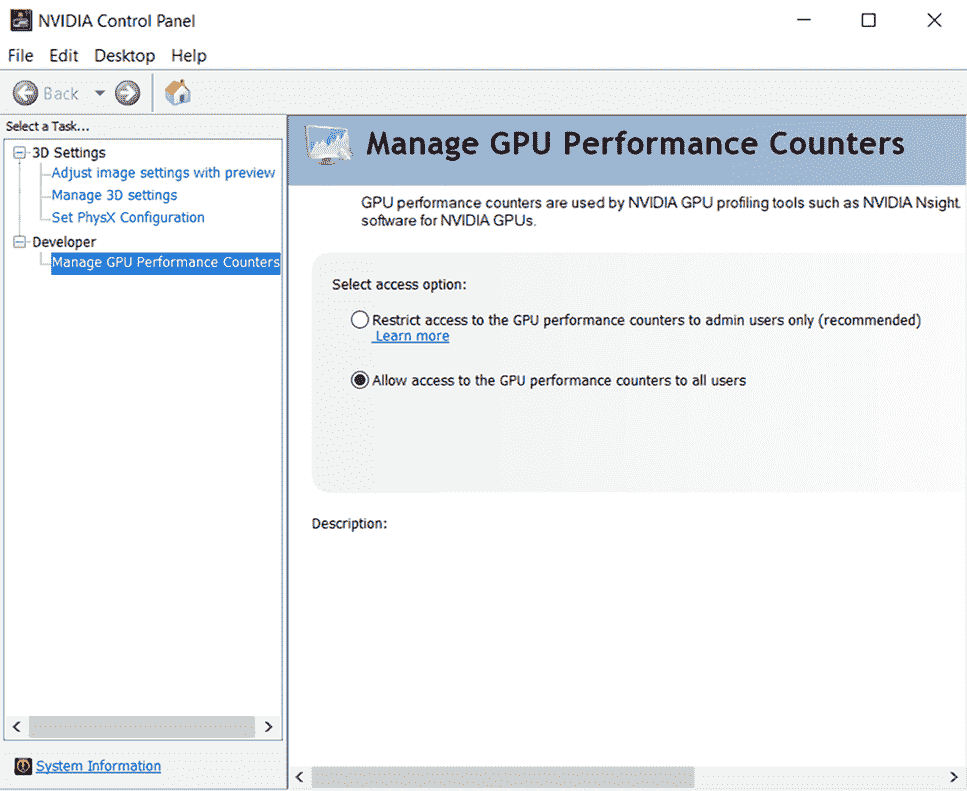

图 14.9 为所有用户启用 GPU 性能分析

确保你已经在你所使用的环境中正确安装了 libcupti（例如 Ubuntu 或 Windows）。否则，你将看不到预期的结果。然后，要启用性能分析，你只需要将参数`profile_batch`传递给 TensorBoard 回调函数。该值是两个数字的列表：起始步骤和结束步骤。通常情况下，性能分析是跨越几个批次进行的，因此值需要一个范围。但是，也可以对单个批次进行性能分析：

```py
batch_size = 32
tr_ds, v_ds = get_flower_datasets(
    os.path.join(
        'data', '17flowers','jpg'), batch_size=batch_size, 
➥ flatten_images=False
)

tb_callback = tf.keras.callbacks.TensorBoard(
    log_dir=profile_log_dir, profile_batch=[10, 20]
)

conv_model.fit(
    tr_ds, validation_data=v_ds, epochs=2, callbacks=[tb_callback]
)
```

训练完成后，您可以在 TensorBoard 上查看结果。TensorBoard 提供了大量有价值的信息和对模型性能的洞察。它将计算分解为更小的子任务，并根据这些子任务提供细粒度的计算时间分解。此外，TensorBoard 提供了关于改进空间的建议（图 14.10）。现在让我们更深入地了解该页面提供的信息。

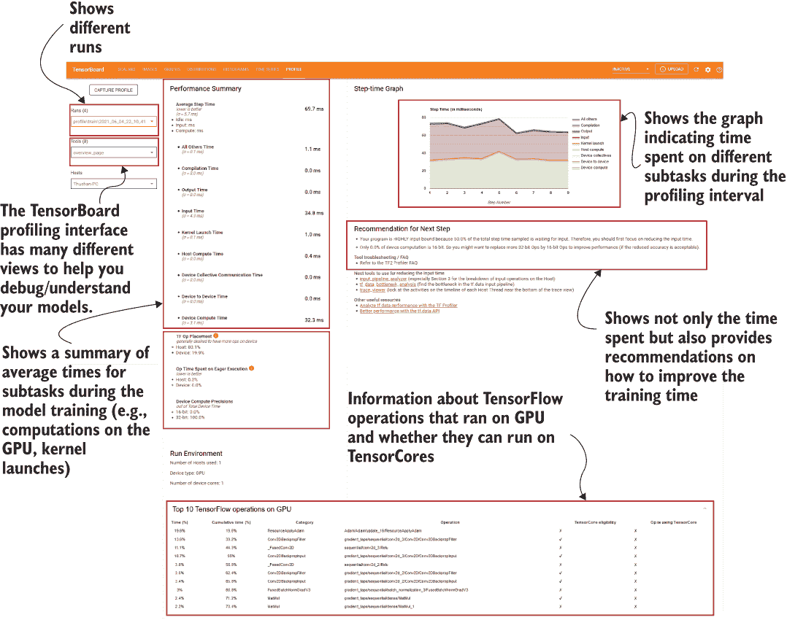

图 14.10 TensorBoard 性能分析界面。它提供了有关在 GPU 上运行模型涉及的各种子任务的宝贵信息。此外，它还提供了改进模型性能的建议。

平均步骤时间是几个较小任务的总和：

+   *输入时间*—用于读取与数据相关的操作（例如，tf.data.Dataset 操作）的时间。

+   *主机计算时间*—在主机上执行的与模型相关的计算（例如，CPU）。

+   *设备到设备时间*—要在 GPU 上运行东西，首先需要将数据传输到 GPU。这个子任务测量了这种传输所花费的时间。

+   *内核启动时间*—为了使 GPU 执行传输的数据上的操作，CPU 需要为 GPU 启动内核。内核封装了对数据执行的原始计算（例如，矩阵乘法）。这测量了启动内核所需的时间。

+   *设备计算时间*—发生在设备上的与模型相关的计算（例如，GPU）。

+   *设备集体通信时间*—与在多设备（例如，多个 GPU）或多节点环境中通信所花费的时间相关。

+   所有其他时间（例如，编译时间、输出时间、所有其他剩余时间）。

在这里，我们可以看到大部分时间都花在了设备计算上。从某种意义上说，这是好的，因为它意味着大多数计算发生在 GPU 上。下一个最大的时间消耗者是输入时间。这是有道理的，因为我们没有对我们的 tf.data 流水线进行任何优化，并且它是一个高度依赖磁盘的流水线，因为图像是从磁盘中读取的。

然后，在下面，您可以看到更多信息。接近 80%的 TensorFlow 操作被放置在此主机上，而仅有 20%在 GPU 上运行。此外，所有操作都是 32 位操作，没有 16 位操作；16 位（半精度浮点）操作比 32 位（单精度浮点）数据类型运行得更快，节省了大量内存。GPU 和 Tensor 处理单元（TPU）是经过优化的硬件，可以比 32 位操作更快地运行 16 位操作。因此，必须尽可能地将它们纳入其中。话虽如此，我们必须小心如何使用 16 位操作，因为不正确的使用可能会严重影响模型性能（例如，模型准确性）。将 16 位操作与 32 位操作一起用于训练模型称为*混合精度训练*。

如果你看推荐部分，你会看到两个主要的建议：

+   优化输入数据管道。

+   在模型训练中利用更多的 16 位操作。

Brain Floating Point 数据类型（bfloat16）

Brain Floating Point 值，或称 bfloat16 值，是 Google 提出的一种数据类型。它与 float16（即，16 位）具有相同的位数，但能够表示 float32 值的动态范围，但在精度上会有一定损失。这种变化是通过增加更多的指数位（小数点左侧）和减少小数位（小数点右侧）来实现的。这种数据类型可以在优化的硬件上获得显著的优势，比如 TPU 和 GPU（假设它们有 Tensor 核心；[`developer.nvidia.com/tensor-cores)`](https://developer.nvidia.com/tensor-cores)）。

让我们看看如何利用这些建议来减少模型训练时间。

### 14.4.1 优化输入管道

为了优化数据管道，我们将对 get_flower_datasets() 函数进行两项更改：

+   使用数据预取以避免模型等待数据可用。

+   在调用 get_image_and_label() 函数时使用并行化的 map 函数。

就这些变化在代码中的体现来说，它们是小变化。在下面的列表中，这些变化用粗体表示。

列表 14.4 从花数据集生成训练/验证数据集的函数

```py
def get_flower_datasets(image_dir, batch_size, flatten_images=False):

    dataset = tf.data.Dataset.list_files(
        os.path.join(image_dir,'*.jpg'), shuffle=False          ❶
    )

    def get_image_and_label(file_path):                         ❷

        tokens = tf.strings.split(file_path, os.path.sep)       ❸
        label = (tf.strings.to_number(
            tf.strings.split(
                tf.strings.split(tokens[-1],'.')[0], '_')[-1]   ❸
            ) - 1
        )//80

        img = tf.io.read_file(file_path)                        ❹
        img = tf.image.decode_jpeg(img, channels=3)             ❹

        return tf.image.resize(img, [64, 64]), label

    dataset = dataset.map(
        get_image_and_label,
        *num_parallel_calls=tf.data.AUTOTUNE        *             ❺
    ).shuffle(400)

    # Make the validation dataset the first 10000 data
    valid_ds = dataset.take(250).batch(batch_size)
    # Make training dataset the rest
    train_ds = dataset.skip(250).batch(batch_size).prefetch(
        tf.data.experimental.AUTOTUNE                           ❻
 )

    return train_ds, valid_ds
```

❶ 获取训练数据集，对其进行洗牌，并输出（图像，标签）元组。

❷ 定义一个函数，根据文件名获取图像和标签。

❸ 获取文件路径中的标记并从图像 ID 计算标签。

❹ 读取图像并转换为张量。

❺ 并行化 map 函数。

❻ 结合预取。

为了并行化 dataset.map() 函数，我们在其后添加了 num_parallel_calls=tf.data .AUTOTUNE 参数，这将导致 TensorFlow 在并行执行 map 函数，其中线程数将由主机在执行时承载的工作量确定。接下来，在批处理后我们调用 prefetch() 函数，以确保模型训练不会因为等待数据可用而受阻。

接下来，我们将设置一个特殊的环境变量，称为 TF_GPU_THREAD_MODE。要理解这个变量的影响，你首先需要弄清楚 GPU 如何高效执行指令。当你在一台带有 GPU 的机器上运行深度学习模型时，大多数数据并行操作（即可以并行执行的数据操作）都会在 GPU 上执行。但数据和指令是如何传输到 GPU 的呢？假设使用 GPU 执行两个矩阵之间的逐元素乘法。由于可以并行地对个别元素进行乘法，这是一个数据并行操作。为了在 GPU 上执行此操作（定义为一组指令并称为*内核*），主机（CPU）首先需要启动内核，以便 GPU 使用该函数对数据进行操作。特别地，CPU 中的一个线程（现代 Intel CPU 每个核心大约有两个线程）将需要触发此操作。想象一下如果 CPU 中的所有线程都非常忙碌会发生什么。换句话说，如果有很多 CPU 绑定的操作正在进行（例如，从磁盘读取大量数据），它可能会导致 CPU 竞争，从而延迟 GPU 内核的启动。这反过来又延迟了在 GPU 上执行的代码。有了 TF_GPU_THREAD_MODE *变量，你可以缓解 CPU 竞争引起的 GPU 延迟*。更具体地说，这个变量控制着 CPU 线程如何分配到 GPU 上启动内核。它可以有三个不同的值：

+   全局—对于为不同的进程分配线程没有特殊的偏好（默认）。

+   gpu_private—分配了一些专用线程来为 GPU 启动内核。这样，即使 CPU 正在执行大量负载，内核启动也不会延迟。如果有多个 GPU，则它们将拥有自己的私有线程。线程的数量默认为两个，并可以通过设置 TF_GPU_THREAD_COUNT 变量进行更改。

+   shared—与 gpu_private 相同，但在多 GPU 环境中，一组线程将在 GPU 之间共享。

我们将此变量设置为 gpu_private。我们将保持专用线程的数量为两个，因此不会创建 TF_GPU_THREAD_COUNT 变量。

设置环境变量

要设置 TF_GPU_THREAD_MODE 环境变量，你可以执行以下操作：

**Linux 操作系统（例如 Ubuntu）**

设置环境变量

+   打开一个终端。

+   运行 export TF_GPU_THREAD_MODE=gpu_private。

+   通过调用 echo $TF_GPU_THREAD_MODE 来验证环境变量是否设置。

+   打开一个新的 shell 并启动 Jupyter 笔记本服务器。

**Windows 操作系统**

环境变量

+   从开始菜单中，选择编辑系统环境变量。

+   单击名为环境变量的按钮。

+   在打开的对话框中添加一个新的环境变量 TF_GPU_THREAD_MODE=gpu_private。

+   打开一个新的命令提示符并启动 Jupyter 笔记本服务器。

**conda 环境（Anaconda）**

在 conda 环境中设置环境变量

+   使用 conda activate manning.tf2 激活 conda 环境。

+   运行 conda env config vars set TF_GPU_THREAD_MODE=gpu_private。

+   停用并重新启用环境以使变量生效。

+   启动 Jupyter 笔记本服务器。

在更改操作系统或 conda 环境中的环境变量后，重启笔记本服务器非常重要。有关更多详细信息，请参阅以下边栏。

重要：设置环境变量后重新启动笔记本服务器。

当您从 shell（例如，Windows 上的命令提示符或 Linux 上的终端）创建笔记本服务器时，笔记本服务器将作为 shell 的子进程创建。在启动笔记本服务器后对环境进行的更改（例如，添加环境变量）将不会反映在该子进程中。因此，您必须关闭任何现有的笔记本服务器，更改环境变量，然后重新启动笔记本服务器以查看效果。

我们对我们的 tf.data 流水线进行了三项优化：

+   预取数据批次

+   使用并行化的 map() 函数而不是标准的 map() 函数

+   通过设置 TF_GPU_THREAD_MODE=gpu_private 使用专用的内核启动线程。

### 14.4.2 混合精度训练

正如前面所解释的，混合精度训练是指在模型训练中采用 16 位和 32 位操作的组合。例如，可训练参数（即变量）保持为 32 位浮点值，而操作（例如，矩阵乘法）产生 16 位浮点输出。

在 Keras 中，启用混合精度训练非常简单。您只需从 Keras 中导入 mixed_precision 命名空间，并创建一个使用 mixed precision 数据类型的策略，通过传递 mixed_float16。最后，将其设置为全局策略。然后，每当您定义一个新模型时，它都会使用此策略来确定模型的数据类型：

```py
from tensorflow.keras import mixed_precision
policy = mixed_precision.Policy('mixed_float16')
mixed_precision.set_global_policy(policy)
```

让我们重新定义我们定义的 CNN 模型并快速检查数据类型，以了解此新策略如何更改模型数据类型：

```py
conv_model = get_cnn_model()
```

现在我们将选择一个层并检查输入/内部参数（例如，可训练权重）和输出的数据类型：

```py
print("Input to the layers have the data type: {}".format(
    conv_model.get_layer("conv2d_1").input.dtype)
)
print("Variables in the layers have the data type: {}".format(
    conv_model.get_layer("conv2d_1").trainable_variables[0].dtype)
)
print("Output of the layers have the data type: {}".format(
    conv_model.get_layer("conv2d_1").output.dtype)
)
```

这将打印。

```py
Input to the layers have the data type: <dtype: 'float16'>
Variables in the layers have the data type: <dtype: 'float32'>
Output of the layers have the data type: <dtype: 'float16'>
```

正如您所见，输入和输出的数据类型为 float16，而变量的数据类型为 float32。这是混合精度训练所采用的设计原则。为了确保在更新权重时保留精度，变量保持为 float32 类型。

损失缩放以避免数值下溢。

使用混合精度训练时，必须小心处理损失。半精度浮点数（float16）值的动态范围比单精度浮点数（float32）值更小。动态范围是指每种数据类型可以表示的值的范围。例如，float16 可以表示的最大值为 65,504 （最小正数为 0.000000059604645），而 float32 可以达到 3.4 × 10³⁸ （最小正数为 1.4012984643 × 10 − 45）。由于 float16 数据类型的动态范围较小，损失值很容易下溢或溢出，导致反向传播时出现数值问题。为了避免这种情况，损失值需要乘以适当的值进行缩放，以使梯度保持在 float16 值的动态范围之内。幸运的是，Keras 会自动处理此问题。

当策略设置为 mixed_float16 且调用 model.compile() 时，优化器会自动包装为 tf.keras.mixed_precision.LossScaleOptimizer() *(*[`mng.bz/Aydo`](http://mng.bz/Aydo)*)*。LossScaleOptimizer() 会在模型优化期间动态缩放损失，以避免数值上的问题。如果您没有使用 Keras 构建模型，则必须手动处理此问题。

现在重新运行模型训练：

```py
batch_size = 32
tr_ds, v_ds = get_flower_datasets(
    os.path.join('data', '17flowers','jpg'), batch_size=batch_size, 
➥ flatten_images=False
)

# This tensorboard call back does the following
# 1\. Log loss and accuracy
# 2\. Profile the model memory/time for 10  batches
tb_callback = tf.keras.callbacks.TensorBoard(
    log_dir=profile_log_dir, profile_batch=[10, 20]
)

conv_model.fit(
    tr_ds, validation_data=v_ds, epochs=2, callbacks=[tb_callback]
)
```

在加入我们介绍的各种优化步骤后运行模型训练。通过改变 TensorBoard 上的运行来进行比较。例如，我们在概览页面上显示了使用和不使用优化技巧的元素的并排比较。我们可以看到，在引入 tf.data pipeline 相关的优化后，时间大大减少（图 14.11）。


图 14.11 显示了使用和不使用数据和模型相关优化的分析概览的并排比较。引入优化后，输入时间大大减少。

你可能认为，使用 16 位操作后设备的计算时间并没有显著降低。使用 16 位操作最大的优势在于减少了 GPU 的内存消耗。TensorBoard 提供了一个称为 *memory profile* 的单独视图，用于分析模型的内存占用情况（图 14.12）。您可以使用此视图来分析模型的内存瓶颈或内存泄漏。

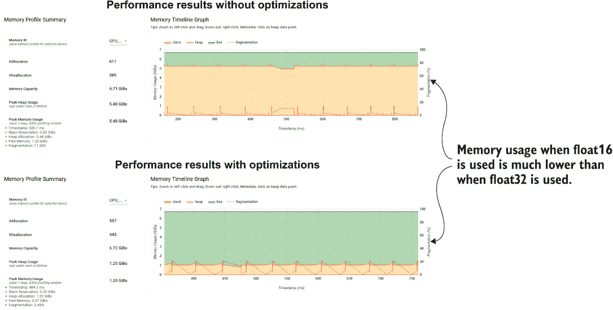

图 14.12 显示了经过优化前后的内存占用情况差异。使用 16 位操作减少了模型的内存消耗。差异非常明显。

可以清楚地看出，在使用混合精度训练后，内存需求显著下降。当使用混合精度训练时（从 5.48 GB 至 1.25 GB），模型对内存的需求降低了约 76%。

图表明了两种类型的内存：*堆*和*栈*。这些是程序用于在执行程序时跟踪变量和函数调用的基本内存空间。从这些中，堆将帮助我们了解内存使用模式或与内存相关的问题，因为在程序执行期间创建的各种对象和变量都保存在其中。例如，如果存在内存泄漏，您将看到堆使用的内存量正在增加。在这里，我们可以看到内存使用情况相当线性，并且可以假设没有重大的内存泄漏。您可以在下一页的侧边栏中阅读有关堆和栈的更多信息。

堆 vs. 栈

程序运行时的内存保持在堆栈或堆中。例如，函数调用保持在堆栈中，其中最后一次调用位于堆栈顶部，最早的调用位于底部。当这些函数调用创建对象时，例如，它们被写入堆中（术语“堆”来自与堆数据结构无关的对象集合）。您可以想象堆中包含许多对象和属性，没有特定顺序（因此术语“堆”）。随着函数调用结束，项目将自动从堆栈中弹出。但是，当对象不再使用时，由程序员释放堆的责任，因为它们在函数调用结束后仍然存在。然而，在现代编程语言中，垃圾收集器会自动处理这个问题。 （请参阅[`mng.bz/VMZ5`](http://mng.bz/VMZ5)和[`mng.bz/ZAER`](http://mng.bz/ZAER)。）

您可能听说过“堆栈溢出”的术语，当代码中的递归函数调用没有合理满足终止条件时，大量的函数调用会溢出堆栈。另外，我们不能忽视一个受开发者欢迎的网站的名称是如何产生的（[stackoverflow.com](http://stackoverflow.com)）。我认为没有比 Stack Overflow 本身更好的资源来解释这个问题了：[`mng.bz/R4ZZ`](http://mng.bz/R4ZZ)。

我们还可以看到有关哪些操作使用了多少内存的细节。例如，我们知道 CNN 的主要瓶颈是在一系列卷积/池化层之后的第一个 Dense 层。表 14.1 证实了这一点。也就是说，它显示了 Dense 层，其形状为 [115200, 512]（即第一个 Dense 层），使用了最多的内存。

表 14.1 内存分解表。该表显示了各种 TensorFlow 操作的内存使用情况以及它们的数据形状。

| **操作名称** | **分配大小（GiBs）** | **请求大小（GiBs）** | **发生次数** | **区域类型** | **数据类型** | **形状** |
| --- | --- | --- | --- | --- | --- | --- |
| 预分配/未知 | 0.743 | 0.743 | 1 | 持久/动态 | 无效 | 未知 |
| gradient_tape/sequential/dense/MatMul/Cast/Cast | 0.220 | 0.220 | 1 | 输出 | 浮点 | [115200,512] |
| gradient_tape/sequential/batch_normalisation_3/FusedBatchNormGradV3 | 0.051 | 0.029 | 1 | temp | half | [32,512,31,31] |
| gradient_tape/sequential/average_pooling2d/AvgPool/AvgPoolGrad | 0.036 | 0.029 | 1 | output | half | [32,31,31,512] |
| gradient_tape/sequential/batch_normalisation_3/FusedBatchNormGradV3 | 0.029 | 0.029 | 1 | output | half | [32,31,31,512] |
| gradient_tape/sequential/batch_normalisation_3/FusedBatchNormGradV3 | 0.029 | 0.029 | 2 | temp | half | [32,512,31,31] |

最后，您可以查看*trace viewer*。这个工具提供了各种操作在 CPU 或 GPU 上是如何执行的纵向视图以及所花费的时间。这提供了关于各种操作何时以及如何被安排和执行的非常详细的视图。

在左侧，您可以看到在 CPU 上执行了什么操作，而在 GPU 上执行了什么操作。例如，您可以看到大多数与模型相关的操作（例如，卷积）在 GPU 上执行，而 tf.data 操作（例如，解码图像）在 GPU 上执行。您还可以注意到，跟踪查看器单独显示了 GPU 私有线程。

TensorBoard 的用途远不止我们在这里列出的。要了解更多，请参考以下侧边栏。

TensorBoard 的其他视图

TensorBoard 有许多不同的视图可用。我们已经讨论了最常用的视图，我将让读者探索我们没有讨论的视图。然而，剩下的视图中有一些值得注意的视图：

**Debugger v2**

Debugger v2 是 TensorFlow 2.3 以后引入的工具。它的主要目的是调试模型中的数值问题。例如，在模型训练过程中出现 NaN 值是深度网络的一个非常常见的问题。Debugger v2 将提供模型中各种元素（例如，输入和输出张量）的全面逐步分解，以及哪些元素产生了数值错误。有关更多信息，请访问[`www.tensorflow.org/tensorboard/debugger_v2`](https://www.tensorflow.org/tensorboard/debugger_v2)。

**HParams**

Hparams 是一个视图，帮助超参数优化，并允许您深入研究个别运行，以了解哪些参数有助于改善模型性能。tensorboard.plugins.hparams.api 提供了各种有用的功能和回调，以轻松优化 Keras 模型的超参数。然后，可以在 HParams 视图中查看超参数优化期间发生的试验。有关更多信息，请访问[`mng.bz/2nKg`](http://mng.bz/2nKg)。

**What-If 工具**

What-If 是一个工具，可以为黑盒模型提供有价值的见解，有助于解释这些模型。例如，您可以使用一些数据运行模型推理。然后，您可以修改数据，并通过 What-If 工具查看输出如何变化。此外，它提供了各种工具，用于分析模型的性能和公平性。有关更多信息，请访问[`mng.bz/AyjW`](http://mng.bz/AyjW)。

在下一节中，我们将讨论如何在 TensorBoard 上可视化和与词向量交互。

练习 4

你已经进行了模型性能分析。你已经看到了以下时间概述：

+   输入时间：1.5 毫秒

+   设备计算时间：6.7 毫秒

+   内核启动时间：9.8 毫秒

+   输出时间：10.1 毫秒

+   主机计算时间：21.2 毫秒

对于这种情况，假设超过 5 毫秒的时间是有改进空间的机会。列出三个代码/环境更改建议以提高模型性能。

## 14.5 使用 TensorBoard 可视化词向量

你正在一家电影推荐公司担任 NLP 工程师，负责开发一种可以在小设备上训练的电影推荐模型。为了减少训练开销，使用了一种技术：使用预训练的词向量并将其冻结（即不进行训练）。你认为 GloVe 词向量将是一个很好的起点，并计划使用它们。但在此之前，你必须确保这些向量充分捕捉到电影特定术语/单词中的语义/关系。为此，你需要在 TensorBoard 上可视化这些单词的词向量，并分析 GloVe 向量是否表示了单词之间的合理关系。

我们需要做的第一件事是下载 GloVe 词向量。你已经在笔记本中提供了下载 GloVe 向量的代码，它与我们过去下载数据集的方式非常相似。因此，我们不会详细讨论下载过程。GloVe 词向量可从[`nlp.stanford.edu/projects/glove/`](https://nlp.stanford.edu/projects/glove/)获取。GloVe 向量有几个不同的版本；它们具有不同的维度和词汇量：

+   使用 Wikipedia 2014 + Gigaword 5 数据集进行训练，共有 60 亿个标记；词汇量为 400,000 个；大小写不敏感的标记；词向量维度为 50D、100D、200D 和 300D

+   使用 Common Crawl 数据集训练，共有 420 亿个标记；词汇量为 1,900,000 个；大小写不敏感的标记；词向量维度为 300D

+   使用 Common Crawl 数据集训练，共有 8400 亿个标记；词汇量为 2,200,000 个；大小写敏感的标记；词向量维度为 300D

+   使用 Twitter 数据集进行训练，共有 20 亿个推文；总标记数为 270 亿个；词汇量为 1,200,000 个；大小写不敏感的标记；词向量维度为 25D、50D、100D 和 200D

GloVe 词向量

GloVe（代表 *Glo*bal *Ve*ctors）是一种单词向量算法，通过查看语料库的全局和局部统计信息生成单词向量。例如，像 Skip-gram 或 Continuous Bag-of-Words 这样的单词向量算法仅依赖于给定单词的局部上下文来学习该单词的单词向量。对单词在较大语料库中的使用情况缺乏全局信息的关注会导致次优的单词向量。GloVe 通过计算一个大型共现矩阵来表示所有单词之间的共现频率（即，如果一个给定单词出现在另一个单词的上下文中）来融合全局统计信息。有关 GloVe 向量的更多信息，请参见 [`mng.bz/1oGX`](http://mng.bz/1oGX)。

我们将使用第一类别（最小的）中的 50 维词向量。一个 50 维词向量将对语料库中的每个标记有 50 个值的向量。一旦在笔记本中运行代码提取数据，你将看到一个名为 glove.6B.50d.txt 的文件出现在数据文件夹中。让我们使用 pd.read_csv() 函数将其加载为 pandas DataFrame：

```py
df = pd.read_csv(
    os.path.join('data', 'glove.6B.50d.txt'), 
    header=None, 
    index_col=0, 
    sep=None, 
    error_bad_lines=False, 
    encoding='utf-8'
)
df.head()
```

这将返回表格 14.2\. 现在我们将下载 IMDB 电影评论数据集（[`ai.stanford.edu/~amaas/data/sentiment/`](https://ai.stanford.edu/~amaas/data/sentiment/)）。由于这个数据集可以轻松地作为 TensorFlow 数据集（通过 tensorflow_datasets 库）获得，我们可以使用它：

```py
review_ds = tfds.load('imdb_reviews')
train_review_ds = review_ds["train"]
```

一旦我们下载了数据，我们将创建一个包含训练集中所有评论（文本）的语料库，以字符串列表的形式：

```py
corpus = []
for data in train_review_ds:      
    txt = str(np.char.decode(data["text"].numpy(), encoding='utf-8')).lower()
    corpus.append(str(txt))
```

接下来，我们想要获取此语料库中最常见的 5,000 个单词，以便我们可以比较这些常见单词的 GloVe 向量，以查看它们是否包含合理的关系。为了获得最常见的单词，我们将使用内置的 Counter 对象。Counter 对象计算词汇表中单词的频率：

```py
from collections import Counter

corpus = " ".join(corpus)

cnt = Counter(corpus.split())
most_common_words = [w for w,_ in cnt.most_common(5000)]
print(cnt.most_common(100))
```

这将打印

```py
[('the', 322198), ('a', 159953), ('and', 158572), ('of', 144462), ('to', 
➥ 133967), ('is', 104171), ('in', 90527), ('i', 70480), ('this', 69714), 
➥ ('that', 66292), ('it', 65505), ('/><br', 50935), ('was', 47024), 
➥ ('as', 45102), ('for', 42843), ('with', 42729), ('but', 39764), ('on', 
➥ 31619), ('movie', 30887), ('his', 29059), 
➥ ... ,
➥ ('other', 8229), ('also', 8007), ('first', 7985), ('its', 7963), 
➥ ('time', 7945), ('do', 7904), ("don't", 7879), ('me', 7722), ('great', 
➥ 7714), ('people', 7676), ('could', 7594), ('make', 7590), ('any', 
➥ 7507), ('/>the', 7409), ('after', 7118), ('made', 7041), ('then', 
➥ 6945), ('bad', 6816), ('think', 6773), ('being', 6390), ('many', 6388), 
➥ ('him', 6385)]
```

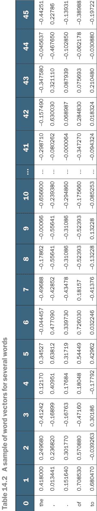

使用了 IMDB 电影评论数据集中最常见的 5,000 个单词的语料库以及 GloVe 向量，我们找到了这两个集合之间的常见标记以进行可视化：

```py
df_common = df.loc[df.index.isin(most_common_words)]
```

这将给出大约 3,600 个在两个集合中都出现的标记列表。

接下来，我们可以在 TensorBoard 上可视化这些向量。再次强调，单词向量是给定语料库中标记的数值表示。这些单词向量的特点（与独热编码单词相反）是它们捕捉了单词的语义。例如，如果计算“cat”和“dog”的单词向量之间的距离，它们会比“cat”和“volcano”更接近。但是在分析更大的一组标记之间的关系时，我们喜欢有一个可视化辅助工具。如果有一种方法可以在二维或三维平面上可视化这些单词向量，那将更容易可视化和理解。有降维算法，如主成分分析（PCA）([`mng.bz/PnZw`](http://mng.bz/PnZw))或 t-SNE([`distill.pub/2016/misread-tsne/`](https://distill.pub/2016/misread-tsne/))可以实现这一点。本书不涉及这些特定算法的使用。好消息是，使用 TensorBoard，你可以做到这一点。TensorBoard 可以将这些高维向量映射到一个更小的投影空间。要做到这一点，我们首先要将这些权重加载为一个 TensorFlow 变量，然后将其保存为 TensorFlow 检查点。然后我们还要将单词或标记保存为一个新文件，每行一个标记，对应于我们刚刚保存的一组单词向量中的每个向量。有了这个，你就可以在 TensorBoard 上可视化单词向量（见下一个列表）。

列表 14.5 在 TensorBoard 上可视化单词向量

```py
from tensorboard.plugins import projector

log_dir=os.path.join('logs', 'embeddings')
weights = tf.Variable(df_common.values)                          ❶

checkpoint = tf.train.Checkpoint(embedding=weights)              ❷
checkpoint.save(os.path.join(log_dir, "embedding.ckpt"))         ❷

with open(os.path.join(log_dir, 'metadata.tsv'), 'w') as f:      ❸
    for w in df_common.index:
        f.write(w+'\n')

config = projector.ProjectorConfig()                             ❹
embedding = config.embeddings.add()
embedding.metadata_path = 'metadata.tsv'                         ❺
projector.visualize_embeddings(log_dir, config)
```

❶ 用我们捕获的嵌入创建一个 tf.Variable。

❷将嵌入保存为 TensorFlow 检查点。

❸ 保存元数据（一个 TSV 文件），其中每个与嵌入对应的单词被附加为新行。

❹创建一个特定于投影仪和嵌入的配置（有关详细信息，请参阅文本）。

❺设置元数据路径，以便 TensorBoard 可以在可视化中包含它。

要可视化来自保存的 TensorFlow 检查点和元数据（即，保存的单词向量对应的标记），我们使用 tensorboard.plugins.projector 对象。然后我们定义一个 ProjectorConfig 对象和一个嵌入配置。我们将保留它们的默认配置，这适合我们的问题。当调用 config.embeddings.add()时，它将生成一个使用默认配置的嵌入配置（类型为 EmbeddingInfo 对象）。ProjectorConfig 包含诸如以下信息：

+   model_checkpoint_directory —— 包含嵌入的检查点的目录

EmbeddingInfo 包含

+   tensor_name —— 如果嵌入使用了特殊的张量名称

+   metadata_path —— 包含嵌入标签的 TSV 文件的路径

要查看可用配置的完整列表，请参考 [`mng.bz/J2Zo`](http://mng.bz/J2Zo) 上的文件。在其当前状态下，投影仪的配置不支持太多的定制。因此，我们将保持默认设置。我们将在 EmbeddingInfo 配置中设置一个配置，即 metadata_path。我们将 metadata_path 设置为包含令牌的文件，最后将其传递给 projecter.visualize_embeddings() 函数。我们给它一个日志目录，投影仪将自动检测 TensorFlow 检查点并加载它。

我们一切都准备就绪。在您的笔记本上，执行以下行以打开 TensorBoard：

```py
%tensorboard --logdir logs/embeddings/ --port 6007
```

要可视化词向量，它们需要在 --logdir 指向的确切目录中（即不在嵌套文件夹中）。因此，我们需要一个新的 TensorBoard 服务器。这行代码将在端口 6007 上打开一个新的 TensorBoard 服务器。图 14.13 描述了在 TensorBoard 中显示的内容。

关于 %tensorboard 魔术命令的有趣事实

%tensorboard 魔术命令足够智能，能够知道何时打开新的 TensorBoard 服务器以及何时不需要。如果您一遍又一遍地执行相同的命令，它将重用现有的 TensorBoard。但是，如果您执行带有不同 --logdir 或 --port 的命令，它将打开一个新的 TensorBoard 服务器。


图 14.13 在 TensorBoard 上的词向量视图。您可以选择使用哪种降维算法（以及参数）来获取词向量的二维或三维表示。在可视化中悬停在点上将显示由该点表示的单词。

您可以在可视化中悬停在显示的点上，它们将显示它们代表的语料库中的哪个单词。您可以通过切换维度控制器来可视化二维或三维空间中的词向量。您可能想知道我们选择的词向量。它们最初有 50 个维度 —— 我们如何在二维或三维空间中可视化这样高维度的数据呢？有一套降维算法可以为我们做到这一点。一些示例是 t-SNE ([`mng.bz/woxO`](http://mng.bz/woxO))，PCA（主成分分析; [`mng.bz/ZAmZ`](http://mng.bz/ZAmZ))，以及 UMAP（Uniform Manifold Approximation and Projection; [`arxiv.org/pdf/1802.03426.pdf`](https://arxiv.org/pdf/1802.03426.pdf))。参考附带的链接以了解更多关于这些算法的信息。

您可以在 TensorBoard 上做的不仅仅是词向量的简单可视化。您可以通过突出显示可视化中的特定单词进行更详细的分析。为此，您可以使用正则表达式。例如，图 14.14 中显示的可视化是使用正则表达式(?:fred|larry|mrs\.|mr\.|michelle|sea|denzel|beach|comedy|theater|idiotic|sadistic|marvelous|loving|gorg|bus|truck|lugosi)生成的。

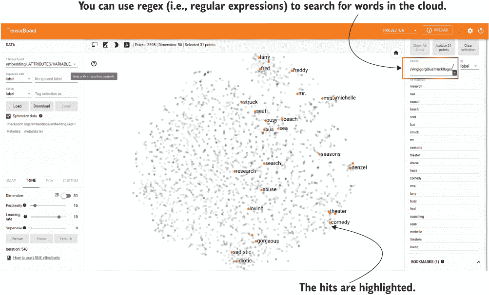

图 14.14 在可视化中搜索单词。您可以使用正则表达式来搜索单词的组合。

这就结束了我们关于 TensorBoard 的讨论。在下一章中，我们将讨论 TensorFlow 如何帮助我们轻松创建机器学习流水线并部署模型。

练习 5

如果您想在 TensorBoard 中显示单词向量时包含唯一标识符，而不仅仅是单词本身，例如，您想要看到“loving; 218”而不是“loving”，其中 218 是给予该单词的唯一标识符。为此，您需要更改写入 metadata.tsv 文件的内容。不仅仅是单词，每行上都写一个用分号分隔的递增 ID。例如，如果单词是[“a”, “b”, “c”]，那么新行应该是[“a;1”, “b;2”, “c;3”]。您如何进行更改？

## 摘要

+   TensorBoard 是一个用于可视化数据（例如图像）和实时跟踪模型性能的优秀工具。

+   在使用 Keras 构建模型时，您可以使用方便的 tf.keras.callbacks.TensorBoard() 回调来记录模型性能、层激活直方图等。

+   如果您有自定义指标想要记录到 TensorBoard 中，您可以在 tf.summary 命名空间中使用相应的数据类型（例如，如果您想要记录随时间变化的模型精度等，可以使用 tf.summary.scalar()）。

+   每次将信息记录到 TensorBoard 中的会话称为一次运行。您应该为不同的运行制定一个可读且健壮的命名约定。一个好的命名约定应该捕捉您所做的主要更改以及运行执行的日期/时间。

+   TensorBoard Profile 提供了各种各样的性能分析结果（使用 NVIDIA 的 libcupti 库），例如模型训练过程中各个子任务所花费的时间（例如，设备计算时间、主机计算时间、输入时间等）、模型使用的内存以及各种操作是如何进行的顺序视图。

+   TensorBoard 是一个用于可视化高维数据（如图像和单词向量）的强大工具。

## 练习答案

**练习 1**

```py
image_writer = tf.summary.create_file_writer(image_logdir)

with image_writer.as_default():
    for bi, batch in enumerate(steps_image_batches):
        tf.summary.image(
            “batch_{}”.format(bi), 
            batch, 
            max_outputs=10, 
            step=bi
        )
```

**练习 2**

```py
log_dir = "./logs "

classif_model.compile(
    loss=’binary_crossentropy', 
    optimizer=’adam’, 
    metrics=[tf.keras.metrics.Precision(), tf.keras.metrics.Recall()]
)

tb_callback = tf.keras.callbacks.TensorBoard(
    log_dir=log_dir, histogram_freq=1, profile_batch=0
)

classif_model.fit(tr_ds, validation_data=v_ds, epochs=10, callbacks=[tb_callback])
```

**练习 3**

```py
 writer = tf.summary.create_file_writer(log_dir)

 x_n_minus_1 = 1
 x_n_minus_2 = 0

 with writer.as_default():        
     for i in range(100):
         x_n = x_n_minus_1 + x_n_minus_2
         x_n_minus_1 = x_n
      x_n_minus_2 = x_n_minus_1

      tf.summary.scalar("fibonacci", x_n, step=i)

      writer.flush()
```

**练习 4**

1.  主机上正在进行大量的计算。这可能是因为设备（例如，GPU）的内存不足。使用混合精度训练将有助于缓解这个问题。此外，可能有太多无法在 GPU 上运行的非 TensorFlow 代码。为此，使用更多的 TensorFlow 操作并将这样的代码转换为 TensorFlow 将获得加速。

1.  内核启动时间增加了。这可能是因为工作负载严重受限于 CPU。在这种情况下，我们可以合并 TF_GPU_THREAD_MODE 环境变量，并将其设置为 gpu_private。这将确保有几个专用线程用于为 GPU 启动内核。

1.  输出时间显著偏高。这可能是因为频繁向磁盘写入过多输出。为解决此问题，我们可以考虑将数据在内存中保存更长时间，并仅在少数时刻将其刷新到磁盘上。

**练习 5**

```py
log_dir=os.path.join('logs', 'embeddings')

weights = tf.Variable(df_common.values)
   checkpoint = tf.train.Checkpoint(embedding=weights)
checkpoint.save(os.path.join(log_dir, "embedding.ckpt"))

with open(os.path.join(log_dir, 'metadata.tsv'), 'w') as f:
    for i, w in enumerate(df_common.index):
        f.write(w+'; '+str(i)+'\n')
```
