# 第十五章：TFX：MLOps 和使用 TensorFlow 部署模型

本章涵盖内容

+   使用 TFX（TensorFlow-Extended）编写端到端数据流水线

+   通过 TFX Trainer API 训练一个简单的神经网络

+   使用 Docker 将模型服务（推理）容器化，并将其作为服务呈现

+   在本地机器上部署模型，以便通过 API 使用

在第十四章，我们研究了一个非常多功能的工具，它与 TensorFlow 捆绑在一起：TensorBoard。TensorBoard 是一个可视化工具，可以帮助你更好地理解数据和模型。除其他外，它可以方便

+   监控和追踪模型性能

+   可视化模型的数据输入（例如图片、音频）

+   对模型进行分析以了解其性能或内存瓶颈

我们学习了如何使用 TensorBoard 来可视化像图片和词向量这样的高维数据。我们探讨了如何将 Keras 回调嵌入到 TensorBoard 中，以便可视化模型性能（准确率和损失）以及自定义指标。然后，我们使用 CUDA 性能分析工具来分析模型的执行，以理解执行模式和内存瓶颈。

在本章中，我们将探索最近引起极大关注的机器学习新领域：MLOps。MLOps 源自 ML 和 DevOps（源自开发和运维）术语。根据亚马逊网络服务（AWS）的说法，“DevOps 是文化哲学、实践和工具的组合，它增加了组织交付应用和服务的能力：以比使用传统软件开发和基础设施管理流程的组织更快的速度进化和改进产品。”还有一个与 MLOps 密切相关的术语，即模型的实际投入使用。很难区分这两个术语，因为它们有重叠之处，有时可以互换使用，但我倾向于这样理解这两个事物：MLOps 定义了一个工作流，将自动化大部分步骤，从收集数据到交付在该数据上训练的模型，几乎不需要人工干预。实际投入使用是部署训练好的模型（在私有服务器或云上），使客户能够以稳健的方式使用模型进行设计目的。它可以包括任务，例如设计可扩展的 API，可以扩展以处理每秒数千个请求。换句话说，MLOps 是一段旅程，让你到达的目的地是模型的实际投入使用。

让我们讨论为什么拥有（大部分）自动化的流水线来开发机器学习模型是重要的。要实现其价值，你必须考虑到规模问题。对于像谷歌、Facebook 和亚马逊这样的公司，机器学习已经深深扎根于他们提供的产品中。这意味着数以百计甚至数千个模型每秒产生预测。此外，对于拥有数十亿用户的公司来说，他们不能容忍他们的模型变得过时，这意味着不断地训练/微调现有模型以适应新数据的收集。MLOps 可以解决这个问题。MLOps 可用于摄取收集的数据、训练模型、自动评估模型，并在它们通过预定义的验证检查后将其推送到生产环境中。验证检查是为了确保模型达到预期的性能标准，并防范对抗不良表现的模型（例如，由于新的入站训练数据发生大幅变化、推送了新的未经测试的超参数变更等，可能会生成不良的模型）。最后，模型被推送到生产环境，通过 Web API 访问以获取输入的预测。具体而言，API 将为用户提供一些端点（以 URL 的形式），用户可以访问这些端点（可选地带上需要完成请求的参数）。话虽如此，即使对于依赖机器学习模型的较小公司来说，MLOps 也可以极大地标准化和加速数据科学家和机器学习工程师的工作流程。这将大大减少数据科学家和机器学习工程师在每次开展新项目时从头开始创建这些工作流程所花费的时间。阅读有关 MLOps 的更多信息，请访问[`mng.bz/Pnd9`](http://mng.bz/Pnd9)。

我们如何在 TensorFlow 中进行 MLOps？无需寻找其他，TFX（TensorFlow 扩展）就是答案。TFX 是一个库，提供了实现摄取数据、将数据转换为特征、训练模型和将模型推送到指定生产环境所需的所有功能。这是通过定义一系列执行非常具体任务的组件来完成的。在接下来的几节中，我们将看看如何使用 TFX 来实现这一目标。

## 使用 TFX 编写数据管道

想象一下，你正在开发一个系统，根据天气条件来预测森林火灾的严重程度。你已经获得了过去观察到的森林火灾的数据集，并被要求创建一个模型。为了确保你能够将模型提供为服务，你决定创建一个工作流程来摄取数据并使用 TFX 训练模型。这个过程的第一步是创建一个能够读取数据（以 CSV 格式）并将其转换为特征的数据管道。作为这个管道的一部分，你将拥有一个数据读取器（从 CSV 生成示例），显示字段的摘要统计信息，了解数据的模式，并将其转换为模型理解的正确格式。

关于环境的重要信息

要运行本章的代码，强烈建议使用 Linux 环境（例如 Ubuntu），并且将提供该环境的说明。TFX 未针对 Windows 环境进行测试([`mng.bz/J2Y0`](http://mng.bz/J2Y0))。另一个重要的事项是我们将使用稍旧版本的 TFX（1.6.0）。撰写时，最新版本为 1.9.0。这是因为在 1.6.0 版本之后的版本中，运行 TFX 在诸如笔记本等交互式环境中所需的关键组件已损坏。此外，本章后面我们将使用一种名为 Docker 的技术。由于对资源的访问受到严格限制，使 Docker 按我们所需的方式运行在 Windows 上可能会相当困难。此外，对于本章，我们将定义一个新的 Anaconda 环境。要执行此操作，请按照以下说明操作：

+   打开一个终端窗口，并进入代码存储库中的 Ch15-TFX-for-MLOps-in-TF2 目录。

+   如果您已经激活了 Anaconda 虚拟环境（例如 manning.tf2），请通过运行 conda deactivate manning.tf2 来停用它。

+   运行 conda create -n manning.tf2.tfx python=3.6 来创建一个新的虚拟 Anaconda 环境。

+   运行 conda activate manning.tf2.tfx 以激活新环境。

+   运行 pip install --use-deprecated=legacy-resolver -r requirements.txt。

+   运行 jupyter notebook。

+   打开 tfx/15.1_MLOps_with_tensorflow.ipynb 笔记本。

第一件事是下载数据集（列表 15.1）。我们将使用一个记录了葡萄牙蒙特西尼奥公园历史森林火灾的数据集。该数据集在[`archive.ics.uci.edu/ml/datasets/Forest+Fires`](http://archive.ics.uci.edu/ml/datasets/Forest+Fires)上免费提供。它是一个 CSV 文件，具有以下特征：

+   *X*—蒙特西尼奥公园地图中的 x 轴空间坐标

+   *Y*—蒙特西尼奥公园地图中的 y 轴空间坐标

+   *month*—一年中的月份

+   *day*—一周中的日期

+   *Fine Fuel Moisture Code* (FFMC)—代表森林树冠阴影下的林地燃料湿度

+   *DMC*—土壤平均含水量的数字评级

+   *Drought Code* (DC)—表示土壤干燥程度的深度

+   *Initial Spread Index* (ISI)—预期的火灾蔓延速率

+   *temp*—摄氏度温度

+   *RH*—相对湿度，单位%

+   *wind*—风速，单位 km/h

+   *rain*—外部降雨量，单位 mm/m2

+   *area*—森林烧毁面积（单位公顷）

选择机器学习模型的特征

选择机器学习模型的特征不是一个微不足道的任务。通常，在使用特征之前，您必须了解特征，特征间的相关性，特征-目标相关性等等，然后就可以判断是否应使用特征。因此，不应该盲目地使用模型的所有给定特征。然而，在这种情况下，重点在于 MLOps，而不是数据科学决策，我们将使用所有特征。使用所有这些特征将稍后有助于解释在定义 MLOps 管道时可用的各种选项。

我们的任务是在给出所有其他特征的情况下预测烧毁面积。请注意，预测连续值（如面积）需要回归模型。因此，这是一个回归问题，而不是分类问题。

图 15.1 下载数据集

```py
import os
import requests
import tarfile

import shutil

if not os.path.exists(os.path.join('data', 'csv', 'forestfires.csv')):    ❶
    url = "http:/ /archive.ics.uci.edu/ml/machine-learning-databases/forest-
➥ fires/forestfires.csv"
    r = requests.get(url)                                                 ❷

    if not os.path.exists(os.path.join('data', 'csv')):                   ❸
        os.makedirs(os.path.join('data', 'csv'))                          ❸

    with open(os.path.join('data', 'csv', 'forestfires.csv'), 'wb') as f: ❸
        f.write(r.content)                                                ❸
else:
    print("The forestfires.csv file already exists.")

if not os.path.exists(os.path.join('data', 'forestfires.names')):         ❹

    url = "http:/ /archive.ics.uci.edu/ml/machine-learning-databases/forest-
➥ fires/forestfires.names"
    r = requests.get(url)                                                 ❹

    if not os.path.exists('data'):                                        ❺
        os.makedirs('data')                                               ❺

    with open(os.path.join('data', 'forestfires.names'), 'wb') as f:      ❺
        f.write(r.content)                                                ❺

else:
    print("The forestfires.names file already exists.")
```

❶ 如果未下载数据文件，请下载该文件。

❷ 此行下载给定 URL 的文件。

❸ 创建必要的文件夹并将下载的数据写入其中。

❹ 如果未下载包含数据集描述的文件，请下载它。

❺ 创建必要的目录并将数据写入其中。

在这里，我们需要下载两个文件：forestfires.csv 和 forestfires.names。forestfires.csv 以逗号分隔的格式包含数据，第一行是标题，其余部分是数据。forestfires.names 包含更多关于数据的信息，以便您想更多地了解它。接下来，我们将分离出一个小的测试数据集以供后续手动测试。拥有一个专用的测试集，在任何阶段都没有被模型看到，将告诉我们模型的泛化情况如何。这将是原始数据集的 5％。其余 95％将用于训练和验证数据：

```py
import pandas as pd

df = pd.read_csv(
    os.path.join('data', 'csv', 'forestfires.csv'), index_col=None, 
➥ header=0
)
train_df = df.sample(frac=0.95, random_state=random_seed)
test_df = df.loc[~df.index.isin(train_df.index), :]

train_path = os.path.join('data','csv','train')
os.makedirs(train_path, exist_ok=True)
test_path = os.path.join('data','csv','test')
os.makedirs(test_path, exist_ok=True)

train_df.to_csv(
    os.path.join(train_path, 'forestfires.csv'), index=False, header=True
)
test_df.to_csv(
    os.path.join(test_path, 'forestfires.csv'), index=False, header=True
)
```

现在，我们将开始 TFX 管道。第一步是定义存储管道工件的根目录。您可能会问什么是管道工件？在运行 TFX 管道时，它会在目录中存储各个阶段的中间结果（在某个子目录结构下）。其中的一个例子是，当您从 CSV 文件中读取数据时，TFX 管道会将数据拆分为训练和验证子集，将这些示例转换为 TFRecord 对象（即 TensorFlow 内部用于数据的对象类型），并将数据存储为压缩文件：

```py
_pipeline_root = os.path.join(
    os.getcwd(), 'pipeline', 'examples', 'forest_fires_pipeline'
)
```

TFX 使用 Abseil 进行日志记录。Abseil 是从 Google 的内部代码库中提取的开源 C ++库集合。它提供了日志记录，命令行参数解析等功能。如果您感兴趣，请在[`abseil.io/docs/python/`](https://abseil.io/docs/python/)阅读有关该库的更多信息。我们将设置日志记录级别为 INFO，以便我们可以在 INFO 级别或更高级别看到日志记录语句。日志记录是具有重要功能的，因为我们可以获得很多见解，包括哪些步骤成功运行以及哪些错误被抛出：

```py
absl.logging.set_verbosity(absl.logging.INFO)
```

完成初始设置后，我们将定义一个 InteractiveContext：

```py
from tfx.orchestration.experimental.interactive.interactive_context import 
➥ InteractiveContext

context = InteractiveContext(
    pipeline_name = "forest_fires", pipeline_root=_pipeline_root
)
```

TFX 在一个上下文中运行流水线。上下文被用来运行你在流水线中定义的各个步骤。它还起着非常重要的作用，就是在我们在流水线中进行过程中管理不同步骤之间的状态。为了管理状态之间的转换并确保流水线按预期运行，它还维护了一个元数据存储（一个小规模的数据库）。元数据存储包含各种信息，如执行顺序、组件的最终状态和产生的错误。你可以在以下侧边栏中了解有关元数据的信息。

元数据中有什么？

一旦创建了 InteractiveContext，你会在流水线根目录中看到一个名为 metadata.sqlite 的数据库。这是一个轻量级、快速的 SQL 数据库（[`www.sqlite.org/index.xhtml`](https://www.sqlite.org/index.xhtml)），专为处理少量数据和传入请求而设计的。该数据库将记录有关输入、输出和执行相关输出的重要信息（组件的运行标识符、错误）。这些信息可以用于调试你的 TFX 流水线。元数据可以被视为不是直接输入或输出，但仍然是正确执行组件所必需的数据，以提供更大的透明度。在具有许多组件以许多不同方式相互连接的复杂 TFX 流水线的调试中，元数据可能非常有帮助。你可以在[`www.tensorflow.org/tfx/guide/mlmd`](https://www.tensorflow.org/tfx/guide/mlmd)上了解更多信息。

我们要开始定义流水线了。本节流水线的主要目的是

+   从 CSV 文件加载数据并拆分为训练和验证数据

+   了解数据的模式（例如各个列、数据类型、最小/最大值等）

+   显示关于各种特征分布的摘要统计和图形

+   将原始列转换为特征，可能需要特殊的中间处理步骤

这些步骤是模型训练和部署的前奏。每个任务都将是流水线中的一个单独组件，在合适的时候我们将详细讨论这些步骤。

### 15.1.1 从 CSV 文件加载数据

第一步是定义一个组件来从 CSV 文件中读取示例并将数据拆分为训练和评估数据。为此，你可以使用 tfx.components.CsvExampleGen 对象。我们所需要做的就是将包含数据的目录提供给 input_base 参数：

```py
from tfx.components import CsvExampleGen

example_gen = CsvExampleGen(input_base=os.path.join('data', 'csv', 'train'))
```

然后我们使用之前定义的 InteractiveContext 来运行示例生成器：

```py
context.run(example_gen)
```

让我们来看看这一步骤产生了什么。要查看数据，请前往 _pipeline_root 目录（例如，Ch15-TFX-for-MLOps-in-TF2/tfx/pipeline）。它应该具有类似于图 15.1 所示的目录/文件结构。

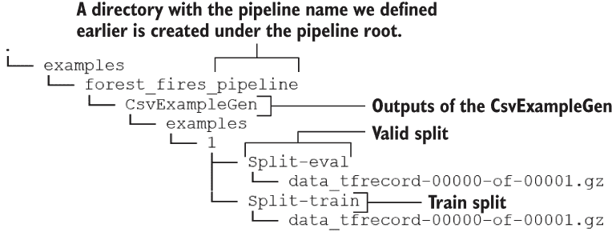

图 15.1 运行 CsvExampleGen 之后的目录/文件结构

您将看到在管道中创建了两个 GZip 文件（即带有 .gz 扩展名）。您会注意到在 CsvExampleGen 文件夹中有两个子目录：Split-train 和 Split-eval，分别包含训练和验证数据。当您运行包含前述代码的笔记本单元时，您还将看到一个输出 HTML 表格，显示 TFX 组件的输入和输出（图 15.2）。

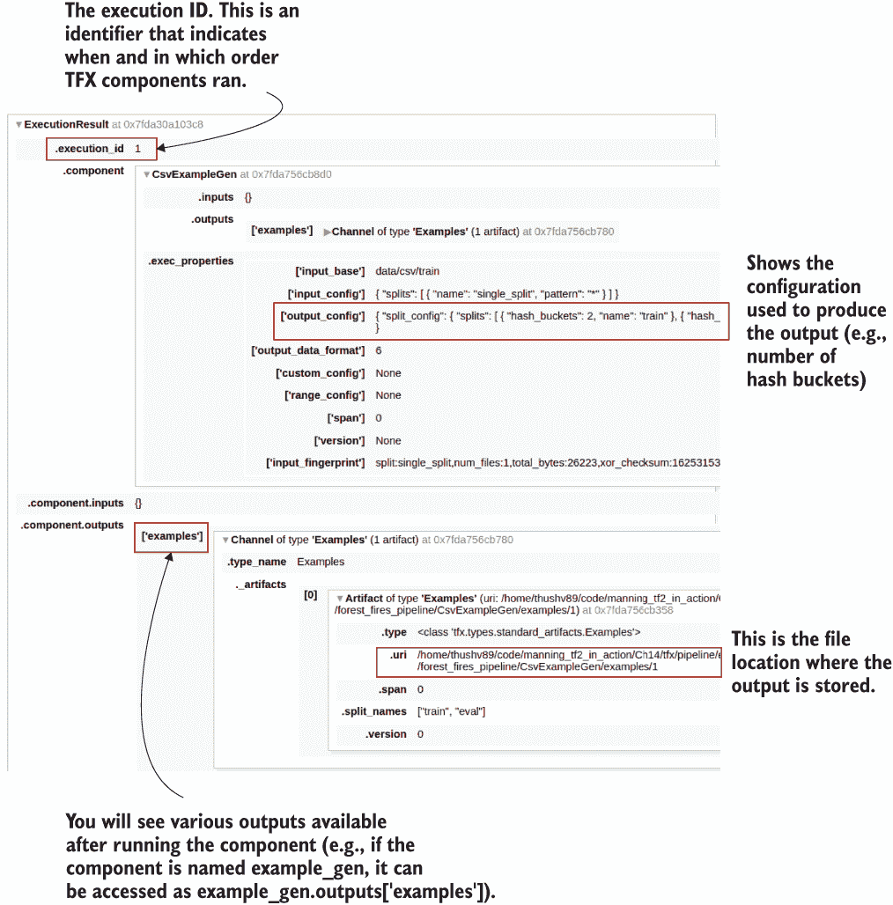

图 15.2 运行 CsvExampleGen 组件生成的输出 HTML 表格

有一些值得注意的事项。首先，您将看到 execution_id，这是一个计数器生成的值，该计数器跟踪您运行 TFX 组件的次数。换句话说，每次运行 TFX 组件（如 CsvExampleGen）时，计数器都会增加 1。如果您继续向下看，您会看到一些关于 CsvExampleGen 如何分割数据的重要信息。如果您查看 component > CsvExampleGen > exec_properties > output_config 下，您会看到类似于

```py
"split_config": { 
    "splits": [ 
        { "hash_buckets": 2, "name": "train" }, 
        { "hash_buckets": 1, "name": "eval" } 
    ] 
} 
```

这里说数据集已被分成两组：train 和 eval。训练集大约占原始数据的三分之二，而评估集大约占原始数据的三分之一。这些信息是通过查看 hash_buckets 属性推断出来的。TFX 使用哈希将数据分成训练集和评估集。默认情况下，它将定义三个哈希桶。然后 TFX 使用每个记录中的值为该记录生成哈希。记录中的值传递给哈希函数以生成哈希。然后使用生成的哈希来将该示例分配到一个桶中。例如，如果哈希值为 7，则 TFX 可以轻松找到具有 7％ 的桶，3 = 1，这意味着它将被分配到第二个桶（因为桶是从零开始索引的）。您可以按以下方式访问 CsvExampleGen 中的元素。

关于哈希的更多信息

有许多哈希函数，例如 MD5、SHA1 等。您可以在 [`blog.jscrambler.com/hashing-algorithms/`](https://blog.jscrambler.com/hashing-algorithms/) 上阅读有关哈希函数的更多信息。在 TensorFlow 中，有两种不同的函数可用于生成哈希：tf.strings.to_hash_bucket_fast ([`mng.bz/woJq`](http://mng.bz/woJq)) 和 tf.strings.to_ hash_bucket_strong ()。强哈希函数速度较慢，但更能抵御可能操纵输入以控制生成的哈希值的恶意攻击。

```py
artifact = example_gen.outputs['examples'].get()[0]

print("Artifact split names: {}".format(artifact.split_names))
print("Artifact URI: {}".format(artifact.uri)
```

这将打印以下输出：

```py
Artifact split names: ["train", "eval"]
Artifact URI: <path to project>/Ch15-TFX-for-MLOps-in-
➥ TF2/tfx/pipeline/examples/forest_fires_pipeline/CsvExampleGen/examples/1
```

之前我们说过，随着我们在管道中的进展，TFX 会将中间输出存储起来。我们看到 CsvExampleGen 组件已将数据存储为 .gz 文件。事实上，它将 CSV 文件中找到的示例存储为 TFRecord 对象。TFRecord 用于将数据存储为字节流。由于 TFRecord 是在使用 TensorFlow 时存储数据的常用方法；这些记录可以轻松地作为 tf.data.Dataset 检索，并且可以检查数据。下一个清单显示了如何做到这一点。

列表 15.2 打印 CsvExampleGen 存储的数据

```py
train_uri = os.path.join(
    example_gen.outputs['examples'].get()[0].uri, 'Split-train'       ❶
) 

tfrecord_filenames = [
    os.path.join(train_uri, name) for name in os.listdir(train_uri)   ❷
]

dataset = tf.data.TFRecordDataset(
    tfrecord_filenames, compression_type="GZIP"
)                                                                     ❸

for tfrecord in dataset.take(2):                                      ❹
  serialized_example = tfrecord.numpy()                               ❺
  example = tf.train.Example()                                        ❻
  example.ParseFromString(serialized_example)                         ❼
  print(example)                                                      ❽
```

❶ 获取代表训练示例的输出工件的 URL，该工件是一个目录。

❷ 获取此目录中的文件列表（所有压缩的 TFRecord 文件）。

❸ 创建一个 TFRecordDataset 来读取这些文件。GZip（扩展名为 .gz）包含一组 TFRecord 对象。

❹ 迭代前两个记录（可以是小于或等于数据集大小的任何数字）。

❺ 从 TFRecord（包含一个示例）获取字节流。

❻ 定义一个知道如何解析字节流的 tf.train.Example 对象。

❼ 将字节流解析为适当可读的示例。

❽ 打印数据。

如果你运行这段代码，你会看到以下内容：

```py
features {
  feature {
    key: "DC"
    value {
      float_list {
        value: 605.7999877929688
      }
    }
  }
  ...
  feature {
    key: "RH"
    value {
      int64_list {
        value: 43
      }
    }
  }
  feature {
    key: "X"
    value {
      int64_list {
        value: 5
      }
    }
  }
  ...
  feature {
    key: "area"
    value {
      float_list {
        value: 2.0
      }
    }
  }
  feature {
    key: "day"
    value {
      bytes_list {
        value: "tue"
      }
    }
  }
  ...
}

...
```

tf.train.Example 将数据保存为一组特征，每个特征都有一个键（列描述符）和一个值。你会看到给定示例的所有特征。例如，DC 特征具有浮点值 605.799，RH 特征具有整数值 43，area 特征具有浮点值 2.0，而 day 特征具有 bytes_list（用于存储字符串）值为 "tue"（即星期二）。

在移动到下一节之前，让我们再次提醒自己我们的目标是什么：开发一个模型，可以根据数据集中的所有其他特征来预测火灾蔓延（以公顷为单位）。这个问题被构建为一个回归问题。

### 15.1.2 从数据生成基本统计信息

作为下一步，我们将更好地理解数据。这称为探索性数据分析（EDA）。EDA 通常不是很明确，并且非常依赖于您正在解决的问题和数据。您还必须考虑到通常在项目交付之前的有限时间。换句话说，您不能测试所有内容，必须优先考虑要测试的内容和要假设的内容。对于我们在这里处理的结构化数据，一个很好的起点是了解类型（数值与分类）以及各列值的分布。TFX 为此提供了一个组件。StatisticsGen 将自动生成这些统计信息。我们很快将更详细地看到此模块提供了什么样的见解：

```py
from tfx.components import StatisticsGen

statistics_gen = StatisticsGen(
    examples=example_gen.outputs['examples'])

context.run(statistics_gen)
```

这将生成一个 HTML 表格，类似于您在运行 CsvExampleGen 后看到的表格（见图 15.3）。


图 15.3 StatisticsGen 组件提供的输出

然而，要检索此步骤的最有价值的输出，您必须运行以下命令：

```py
context.show(statistics_gen.outputs['statistics'])
```

这将在管道根目录中创建以下文件（见图 15.4）。

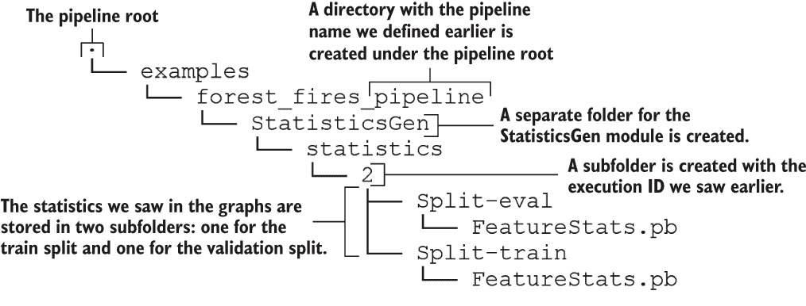

图 15.4 运行 StatisticsGen 后的目录/文件结构

图 15.5 展示了 TFX 提供的有关数据的宝贵信息集合。图 15.5 中的输出图是一个包含丰富数据的金矿，提供了大量关于我们处理的数据的信息。它为你提供了基本但全面的图表套件，提供了有关数据中存在的列的许多信息。让我们从上到下来看。在顶部，你可以选择排序和过滤图 15.5 中显示的输出。例如，你可以改变图表的顺序，选择基于数据类型的图表，或者通过正则表达式进行筛选。

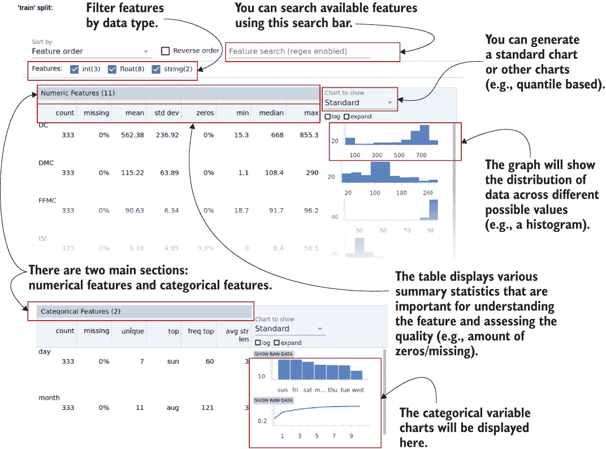

图 15.5 由 StatisticsGen 组件生成的数据的摘要统计图

默认情况下，StatisticsGen 将为训练集和评估集生成图表。然后每个训练和评估部分将有几个子部分；在这种情况下，我们有数值列和分类列的部分。

在左边，你可以看到一些数字统计和特征的评估，而在右边，你可以看到特征分布的视觉表示。例如，拿训练集中的 FFMC 特征来说。我们可以看到它有 333 个例子且 0%的特征缺失值。它的平均值约为 90，标准偏差为 6.34。在图表中，你可以看到分布是相当倾斜的。几乎所有的值都集中在 80-90 范围内。你将看到稍后这可能会给我们制造问题以及我们将如何解决它们。

在分类部分，你可以看到日和月特征的值。例如，日特征有七个唯一值，且 0%缺失。日特征的最频繁值（即模式）出现了 60 次。请注意，日表示为条形图，月表示为线图，因为对于唯一值高于阈值的特征，使用线图可以使图表清晰且减少混乱。

### 15.1.3 从数据推断模式

到目前为止，我们已经从 CSV 文件中加载了数据并探索了数据集的基本统计信息。下一个重要的步骤是推断数据的模式。一旦提供了数据，TFX 可以自动推断数据的模式。如果你使用过数据库，推断出的模式与数据库模式相同。它可以被视为数据的蓝图，表达数据的结构和重要属性。它也可以被视为一组规则，规定数据应该看起来像什么。例如，如果你有了模式，你可以通过参考模式来分类给定的记录是否有效。

不做更多的话，让我们创建一个 SchemaGen 对象。SchemaGen 需要前一步的输出（即 StatisticsGen 的输出）和一个名为 infer_feature_shape 的布尔参数。

```py
from tfx.components import SchemaGen

schema_gen = SchemaGen(
    statistics=statistics_gen.outputs[‘statistics’],
    infer_feature_shape=False)

context.run(schema_gen)
```

在这里，我们将 infer_feature_shape 设置为 False，因为我们将在特征上进行一些转换。因此，我们将有更大的灵活性来自由操作特征形状。然而，设置这个参数（infer_feature_shape）意味着对下游步骤（称为 transform 步骤）的重要改变。当 infer_feature_shape 设置为 False 时，传递给 transform 步骤的张量被表示为 tf.SparseTensor 对象，而不是 tf.Tensor 对象。如果设置为 True，则需要是一个具有已知形状的 tf.Tensor 对象。接下来，要查看 SchemaGen 的输出，可以执行以下操作

```py
context.show(schema_gen.outputs['schema'])
```

这将产生表 15.1 所示的输出。

表 15.1 TFX 生成的模式输出

| **特征名称** | **类型** | **存在** | **价值** | **域** |
| --- | --- | --- | --- | --- |
| **‘day’** | STRING | 必须的 | 单个的 | ‘day’ |
| **‘month’** | STRING | 必须的 | 单个的 | ‘month’ |
| **‘DC’** | FLOAT | 必须的 | 单个的 | - |
| **‘DMC’** | FLOAT | 必须的 | 单个的 | - |
| **‘FFMC’** | FLOAT | 必须的 | 单个的 | - |
| **‘ISI’** | FLOAT | 必须的 | 单个的 | - |
| **‘RH’** | INT | 必须的 | 单个的 | - |
| **‘X’** | INT | 必须的 | 单个的 | - |
| **‘Y’** | INT | 必须的 | 单个的 | - |
| **‘area’** | FLOAT | 必须的 | 单个的 | - |
| **‘rain’** | FLOAT | 必须的 | 单个的 | - |
| **‘temp’** | FLOAT | 必须的 | 单个的 | - |
| **‘wind’** | FLOAT | 必须的 | 单个的 |  |
| **域** | **值** |
| **‘day’** |  |  |  |  |  | ‘fri’ | ‘mon’ | ‘sat’ | ‘sun’ | ‘thu’ | ‘tue’ | ‘wed’ |
| **‘month’** | ‘apr’ | ‘aug’ | ‘dec’ | ‘feb’ | ‘jan’ | ‘jul’ | ‘jun’ | ‘mar’ | ‘may’ | ‘oct’ | ‘sep’ | ‘nov’ |

域定义了给定特征的约束。我们列出了 TFX 中定义的一些最受欢迎的域：

+   *整数域值*（例如，定义整数特征的最小/最大值）

+   *浮点域值*（例如，定义浮点值特征的最小/最大值）

+   *字符串域值*（例如，为字符串特征定义允许的值/标记）

+   *布尔域值*（例如，可以用于定义真/假状态的自定义值）

+   *结构域值*（例如，可以用于定义递归域[域内的域]或具有多个特征的域）

+   *自然语言域值*（例如，为相关语言特征定义一个词汇表[允许的标记集合]）

+   *图像域值*（例如，可以用来限制图像的最大字节大小）

+   *时间域值*（例如，可以用来定义数据/时间特征）

+   *时间值域*（例如，可以用来定义不带日期的时间）

域的列表可在名为 schema.proto 的文件中找到。schema.proto 在[`mng.bz/7yp9`](http://mng.bz/7yp9)上定义。这些文件是使用一个叫做 Protobuf 的库定义的。Protobuf 是一种用于对象序列化的库。您可以阅读下面的侧边栏了解有关 Protobuf 库的更多信息。

Protobuf 库

Protobuf 是由 Google 开发的对象序列化/反序列化库。需要序列化的对象被定义为 Protobuf 消息。消息的模板由 .proto 文件定义。然后，为了进行反序列化，Protobuf 提供了诸如 ParseFromString() 等函数。要了解有关该库的更多信息，请参阅 [`mng.bz/R45P`](http://mng.bz/R45P)。

接下来，我们将看到如何将数据转换为特征。

### 15.1.4 将数据转换为特征

我们已经到达了数据处理管道的最终阶段。最后一步是将我们提取的列转换为对我们的模型有意义的特征。我们将创建三种类型的特征：

+   *密集的浮点数特征*—值以浮点数（例如，温度）的形式呈现。这意味着该值会按原样传递（可以选择进行归一化处理；例如，Z 分数归一化）以创建一个特征。

+   *分桶特征*—根据预定义的分桶间隔对数值进行分桶。这意味着该值将根据其落入的分桶而转换为桶索引（例如，我们可以将相对湿度分成三个值：低[-inf，33)，中[33，66)，高[66，inf)）。

+   *分类特征*（基于整数或字符串）—值是从预定义的值集中选择的（例如，日期或月份）。如果该值尚未是整数索引（例如，日期作为字符串），则将使用将每个单词映射到索引的词汇表将其转换为整数索引（例如，“mon” 被映射为 0，“tue” 被映射为 1，等等）。

我们将向数据集中的每个字段介绍其中一种特征转换：

+   *X*（空间坐标）—以浮点数值表示

+   *Y*（空间坐标）—以浮点数值表示

+   *wind*（风速）—以浮点数值表示

+   *rain*（室外降雨）—以浮点数值表示

+   *FFMC*（燃料湿度）—以浮点数值表示

+   *DMC*（平均含水量）—以浮点数值表示

+   *DC*（土壤干燥深度）—以浮点数值表示

+   *ISI*（预期火灾蔓延速率）—以浮点数值表示

+   *temp*（温度）—以浮点数值表示

+   *RH*（相对湿度）—作为分桶值表示

+   *month*—作为分类特征表示

+   *day*—作为分类特征表示

+   *area*（烧毁面积）—作为数值保留的标签特征

我们首先要定义一些常量，这些常量将帮助我们跟踪哪个特征分配给了哪个类别。此外，我们将保留特定属性（例如，分类特征的最大类数；请参阅下一个列表）。

列表 15.3 定义特征转换步骤中与特征相关的常量

```py
%%writefile forest_fires_constants.py                              ❶

VOCAB_FEATURE_KEYS = ['day','month']                               ❷

MAX_CATEGORICAL_FEATURE_VALUES = [7, 12]                           ❸

DENSE_FLOAT_FEATURE_KEYS = [
    'DC', 'DMC', 'FFMC', 'ISI', 'rain', 'temp', 'wind', 'X', 'Y'   ❹
]

BUCKET_FEATURE_KEYS = ['RH']                                       ❺

BUCKET_FEATURE_BOUNDARIES = [(33, 66)]                             ❻

LABEL_KEY = 'area'                                                 ❼

def transformed_name(key):                                         ❽

    return key + '_xf'
```

❶ 此命令将将此单元格的内容写入文件（阅读侧边栏以获取更多信息）。

❷ 基于词汇（或字符串）的分类特征。

❸ 数据集中假设每个分类特征都有一个最大值。

❹ 密集特征（这些将作为模型输入，或进行归一化处理）。

❺ 分桶特征。

❻ 分桶特征的分桶边界（例如，特征 RH 将被分桶为三个箱子：[0, 33)，[33, 66)，[66，inf))。

❼ 标签特征将保留为数值特征，因为我们正在解决回归问题。

❽ 定义一个函数，将在特征名称后添加后缀。这将帮助我们区分生成的特征和原始数据列。

我们将这些笔记本单元格写为 Python 脚本（或 Python 模块）的原因是因为 TFX 期望运行所需的一些代码部分作为 Python 模块。

%%writefile 魔术命令

%%writefile 是一个 Jupyter 魔术命令（类似于%%tensorboard）。它会导致 Jupyter 笔记本将单元格中的内容写入到新文件中（例如，Python 模块/脚本）。这是从笔记本单元格创建独立 Python 模块的好方法。笔记本很适合进行实验，但对于生产级别的代码，Python 脚本更好。例如，我们的 TFX 管道期望某些函数（例如，如何将原始列预处理为特征）是独立的 Python 模块。我们可以方便地使用%%writefile 命令来实现这一点。

此命令必须指定为要写入文件的单元格中的第一个命令。

接下来，我们将编写另一个模块 forest_fires_transform.py，其中将有一个预处理函数（称为 preprocessing_fn），该函数定义了每个数据列应如何处理以成为特征（请参见下一个列表）。

列表 15.4 定义将原始数据转换为特征的 Python 模块。

```py
%%writefile forest_fires_transform.py                                      ❶

import tensorflow as tf
import tensorflow_transform as tft

import forest_fires_constants                                              ❷

_DENSE_FLOAT_FEATURE_KEYS = forest_fires_constants.DENSE_FLOAT_FEATURE_KEYS❸
_VOCAB_FEATURE_KEYS = forest_fires_constants.VOCAB_FEATURE_KEYS            ❸
_BUCKET_FEATURE_KEYS = forest_fires_constants.BUCKET_FEATURE_KEYS          ❸
_BUCKET_FEATURE_BOUNDARIES = 
➥ forest_fires_constants.BUCKET_FEATURE_BOUNDARIES                        ❸
_LABEL_KEY = forest_fires_constants.LABEL_KEY                              ❸
_transformed_name = forest_fires_constants.transformed_name                ❸

def preprocessing_fn(inputs):                                              ❹

  outputs = {}

  for key in _DENSE_FLOAT_FEATURE_KEYS:                                    ❺
    outputs[_transformed_name(key)] = tft.scale_to_z_score(                ❻
        sparse_to_dense(inputs[key])                                       ❼
    )

  for key in _VOCAB_FEATURE_KEYS:
    outputs[_transformed_name(key)] = tft.compute_and_apply_vocabulary(    ❽
        sparse_to_dense(inputs[key]),
        num_oov_buckets=1)

  for key, boundary in zip(_BUCKET_FEATURE_KEYS,                           ❾
➥ _BUCKET_FEATURE_BOUNDARIES):                                            ❾
    outputs[_transformed_name(key)] = tft.apply_buckets(                   ❾
        sparse_to_dense(inputs[key]), bucket_boundaries=[boundary]         ❾
    )                                                                      ❾

  outputs[_transformed_name(_LABEL_KEY)] = 
➥ sparse_to_dense(inputs[_LABEL_KEY])                                     ❿

  return outputs

def sparse_to_dense(x):                                                    ⓫

    return tf.squeeze(
        tf.sparse.to_dense(
            tf.SparseTensor(x.indices, x.values, [x.dense_shape[0], 1])
        ),
        axis=1
    )
```

❶ 此代码列表中的内容将被写入到单独的 Python 模块中。

❷ 导入先前定义的特征常量。

❸ 导入 forest_fires_constants 模块中定义的所有常量。

❹ 这是 tf.transform 库中必不可少的回调函数，用于将原始列转换为特征。

❺ 对所有密集特征进行处理。

❻ 对密集特征执行基于 Z-score 的缩放（或标准化）。

❼ 因为在 SchemaGen 步骤中 infer_feature_shape 设置为 False，我们的输入是稀疏张量。它们需要转换为密集张量。

❽ 对于基于词汇的特征，构建词汇表并将每个标记转换为整数 ID。

❾ 对待分桶的特征，使用定义的分桶边界，对特征进行分桶。

❿ 标签特征只是简单地转换为密集张量，没有其他特征转换。

⓫ 一个将稀疏张量转换为密集张量的实用函数。

您可以看到该文件被命名为 forest_fires_transform.py。它定义了一个 preprocessing_fn()函数，该函数接受一个名为 inputs 的参数。inputs 是一个从特征键到在 CSV 文件中找到的数据列的映射字典，从 example_gen 输出流动。最后，它返回一个字典，其中特征键映射到使用 tensorflow_transform 库转换的特征。在方法的中间，您可以看到预处理函数执行三项重要工作。

首先，它读取所有密集特征（其名称存储在 _DENSE_FLOAT_FEATURE_KEYS 中），并使用 z 分数对值进行归一化。z 分数将某一列*x*归一化为

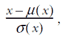

其中，μ(*x*)是列的平均值，σ(*x*)是列的标准差。要对数据进行归一化，可以调用 tensorflow_transform 库中的 scale_to_z_score()函数。您可以阅读有关 tensorflow_transform 的侧边栏，了解更多有关该库提供的内容。然后，该函数使用新的键（通过 _transformed_name 函数生成）将每个特征存储在输出中，该新键衍生自原始特征名称（新键通过在原始特征名称末尾添加 _xf 生成）。

接下来，它处理基于词汇的分类特征（其名称存储在 _VOCAB_FEATURE_KEYS 中），通过使用字典将每个字符串转换为索引。该字典将每个字符串映射到索引，并且可以自动从提供的训练数据中学习。这类似于我们如何使用 Keras 的 Tokenizer 对象学习字典，将单词转换为单词 ID。在 tensorflow_transform 库中，您可以使用 compute_and_apply_vocabulary()函数完成这一操作。对于 compute_and_apply_vocabulary()函数，我们可以通过传递 num_oov_buckets=1 来将任何未见字符串分配给特殊类别（除了已分配给已知类别的类别）。

然后，函数处理待进行桶化的特征。Bucketization 是将连续值应用于桶的过程，其中桶由一组边界定义。使用 apply_buckets()函数可以轻松地对特征进行 bucket 化，该函数将特征（在输入字典中提供）和桶边界作为输入参数。

最后，我们保留包含标签的列不变。通过这样，我们定义了 Transform 组件（[`mng.bz/mOGr`](http://mng.bz/mOGr)）。

tensorflow_transform：将原始数据转换为特征

tensorflow_transform 是 TensorFlow 中的一个子库，主要关注特征转换。它提供了各种功能来计算各种东西：

+   对特征进行桶化（例如，将一系列值分组到预定义的一组桶中）

+   从字符串列中提取词袋特征

+   数据集的协方差矩阵

+   列的均值、标准差、最小值、最大值、计数等

您可以在[`mng.bz/5QgB`](http://mng.bz/5QgB)上阅读有关此库提供的功能的更多信息。

```py
from tfx.components import Transform

transform = Transform(
    examples=example_gen.outputs['examples'],
    schema=schema_gen.outputs['schema'],
    module_file=os.path.abspath('forest_fires_transform.py'),
)

context.run(transform)
```

Transform 组件接受三个输入：

+   CsvExampleGen 组件的输出示例

+   SchemaGen 生成的架构

+   用于将数据转换为特征的 preprocessing_fn()函数的 Python 模块

当涉及到多组件流水线，比如 TFX 流水线时，我们必须尽可能地检查每一个中间输出。这比交给偶然性并祈祷一切顺利要好得多（通常情况下都不是这样）。因此，让我们通过打印运行 Transform 步骤后保存到磁盘上的一些数据来检查输出（见下一列表）。打印数据的代码与使用 CsvExampleGen 组件时打印数据的代码类似。

列表 15.5 检查 TFX Transform 步骤产生的输出

```py
import forest_fires_constants

_DENSE_FLOAT_FEATURE_KEYS = forest_fires_constants.DENSE_FLOAT_FEATURE_KEYS
_VOCAB_FEATURE_KEYS = forest_fires_constants.VOCAB_FEATURE_KEYS
_BUCKET_FEATURE_KEYS = forest_fires_constants.BUCKET_FEATURE_KEYS
_LABEL_KEY = forest_fires_constants.LABEL_KEY

# Get the URI of the output artifact representing the training examples, which is a directory
train_uri = os.path.join(
    transform.outputs['transformed_examples'].get()[0].uri, 'Split-train'
)
tfrecord_filenames = [
    os.path.join(train_uri, name) for name in os.listdir(train_uri)        ❶
]

dataset = tf.data.TFRecordDataset(
    tfrecord_filenames, compression_type="GZIP"
)                                                                          ❷

example_records = []                                                       ❸
float_features = [
    _transformed_name(f) for f in _DENSE_FLOAT_FEATURE_KEYS + [_LABEL_KEY] ❹
]
int_features = [
    _transformed_name(f) for f in _BUCKET_FEATURE_KEYS + 
➥ _VOCAB_FEATURE_KEYS                                                     ❹
]
for tfrecord in dataset.take(5):                                           ❺
  serialized_example = tfrecord.numpy()                                    ❻
  example = tf.train.Example()                                             ❻
  example.ParseFromString(serialized_example)                              ❻
  record = [
    example.features.feature[f].int64_list.value for f in int_features     ❼
  ] + [
    example.features.feature[f].float_list.value for f in float_features   ❼
  ]
  example_records.append(record)                                           ❽
  print(example)
  print("="*50)
```

❶ 获取此目录中文件的列表（所有压缩的 TFRecord 文件）。

❷ 创建一个 TFRecordDataset 来读取这些文件。

❸ 用于存储检索到的特征值（以供以后检查）

❹ 稠密（即，浮点数）和整数（即，基于词汇和分桶）特征

❺ 获取数据集中的前五个示例。

❻ 获取一个 TF 记录并将其转换为可读的 tf.train.Example。

❼ 我们将从 tf.train.Example 对象中提取特征的值以供后续检查。

❽ 将提取的值作为记录（即，值的元组）附加到 example_records 中。

解释的代码将打印特征转换后的数据。每个示例都将整数值存储在属性路径下，例如 example.features.feature[<feature name>] .int64_list.value，而浮点值存储在 example.features.feature [<feature name>].float_list.value 中。这将打印例如

```py
features {
  feature {
    key: "DC_xf"
    value {
      float_list {
        value: 0.4196213185787201
      }
    }
  }

  ...

  feature {
    key: "RH_xf"
    value {
      int64_list {
        value: 0
      }
    }
  }

  ...

  feature {
    key: "area_xf"
    value {
      float_list {
        value: 2.7699999809265137
      }
    }
  }

  ...
}
```

请注意，我们使用 _transformed_name()函数来获取转换后的特征名称。我们可以看到，浮点值（DC_xf）使用 z 分数标准化，基于词汇的特征（day_xf）转换为整数，并且分桶特征（RH_xf）被呈现为整数。

经验法则：尽可能检查您的管道

当使用 TFX 等第三方库提供的组件时，对于底层实际发生的事情几乎没有透明度。TFX 并不是一个高度成熟的工具，并且正在开发过程中，这使问题更加严重。因此，我们总是尝试并入一些代码片段来探查这些组件，这将帮助我们检查这些组件的输入和输出是否正常。

在下一节中，我们将训练一个简单的回归模型，作为我们一直在创建的流水线的一部分。

练习 1

假设你想要做以下事情而不是先前定义的特征转换：

+   *DC*—将数据缩放到[0, 1]的范围内

+   *temp*—利用边界值（-inf，20]，（20，30]和（30，inf）进行分桶处理

一旦特征被转换，将它们添加到名为 outputs 的字典中，其中每个特征都以转换后的特征名称作为键。假设你可以通过调用 _transformed_name('temp') 来获取 temp 的转换后的特征名称。您如何使用 tensorflow_transform 库来实现此目标？您可以使用 scale_to_0_1() 和 apply_buckets() 函数来实现这一点。

## 15.2 训练一个简单的回归神经网络：TFX Trainer API

您已经定义了一个 TFX 数据管道，可以将 CSV 文件中的示例转换为模型准备的特征。现在，您将使用 TFX 定义一个模型训练器，该模型训练器将采用一个简单的两层全连接回归模型，并将其训练在从数据管道流出的数据上。最后，您将使用模型对一些样本评估数据进行预测。

使用 TFX 定义了一个良好定义的数据管道后，我们就可以使用从该管道流出的数据来训练模型。通过 TFX 训练模型一开始可能会稍微费劲，因为它期望的函数和数据的严格结构。但是，一旦您熟悉了您需要遵循的格式，它就会变得更容易。

我们将分三个阶段进行本节的学习。首先，让我们看看如何定义一个适合 TFX Transform 组件中定义的输出特征的 Keras 模型。最终，模型将接收 Transform 组件的输出。接下来，我们将研究如何编写一个封装了模型训练的函数。此函数将使用所定义的模型，并结合几个用户定义的参数，对模型进行训练并将其保存到所需的路径。保存的模型不能只是任意模型；在 TensorFlow 中它们必须具有所谓的 *签名*。这些签名规定了模型在最终通过 API 使用时的输入和输出是什么样子的。API 通过一个服务器提供，该服务器公开一个网络端口供客户端与 API 通信。图 15.6 描述了 API 如何与模型关联。

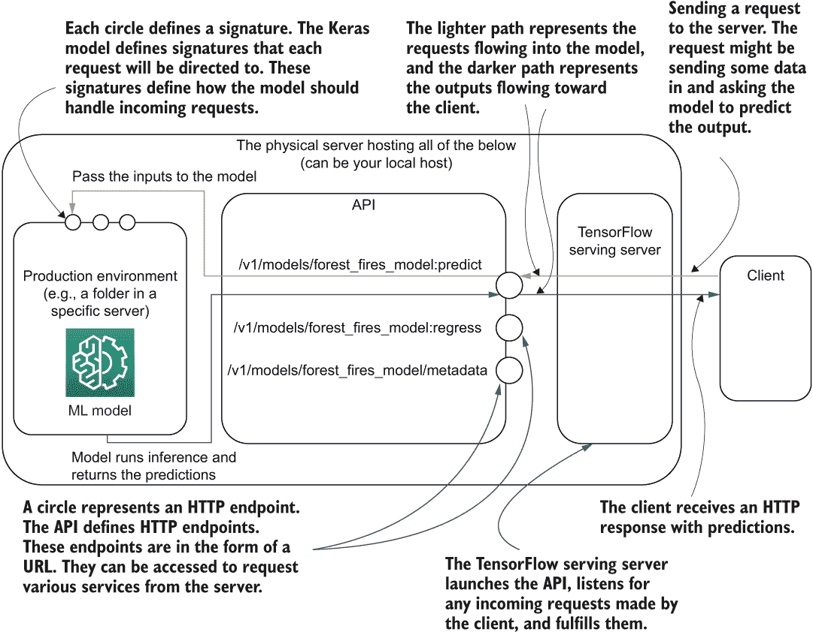

图 15.6 模型如何与 API、TensorFlow 服务器和客户端交互

让我们理解图 15.6 中发生了什么。首先，一个 HTTP 客户端发送请求到服务器。正在监听任何传入请求的服务器（即 TensorFlow 服务服务器）将读取请求并将其指向所需的模型签名。一旦模型签名接收到数据，它将对数据进行必要的处理，将其传递给模型，并生成输出（例如预测）。一旦预测可用，服务器将其返回给客户端。我们将在单独的部分详细讨论 API 和服务器端。在本节中，我们的重点是模型。

TensorFlow 服务中的签名是什么？

在现实生活中，签名的目的是唯一标识一个人。同样，TensorFlow 使用签名来唯一确定当通过 HTTP 请求将输入传递给模型时模型应该如何行为。一个签名有一个键和一个值。键是一个唯一标识符，定义了要激活该签名的确切 URL。值被定义为一个 TensorFlow 函数（即用 @tf.function 装饰的函数）。这个函数将定义如何处理输入并将其传递给模型以获得最终期望的结果。你现在不需要担心细节。我们有一个专门的部分来学习关于签名的内容。

我们将在单独的子部分回顾签名以更详细地理解它们。最后，我们将通过加载模型并向其提供一些数据来直观地检查模型预测。

### 15.2.1 定义 Keras 模型

使用 TFX 训练模型的基石是定义一个模型。有两种方法可以为 TFX 定义模型：使用 Estimator API 或使用 Keras API。我们将使用 Keras API，因为 Estimator API 不推荐用于 TensorFlow 2（有关详细信息，请参见下面的侧边栏）。

Estimator API vs. Keras API

我的观点是，未来，Keras 可能会成为构建模型的首选 API，而 Estimator API 可能会被弃用。TensorFlow 网站上说：

不建议使用 Estimators 编写新代码。Estimators 运行 v1.Session 风格的代码，这更难以编写正确，并且可能表现出乎意料，特别是当与 TF 2 代码结合使用时。Estimators 落在我们的兼容性保证下，但除了安全漏洞之外将不会收到任何修复。详情请参阅迁移指南。

来源：[`www.tensorflow.org/tfx/tutorials/tfx/components`](https://www.tensorflow.org/tfx/tutorials/tfx/components)

我们首先要创建一个名为 _build_keras_model() 的函数，它将执行两项任务。首先，它将为我们在 Transform 步骤中定义的所有特征创建 tf.feature_column 类型的对象。tf.feature_column 是一种特征表示标准，被 TensorFlow 中定义的模型所接受。它是一种用于以列为导向的方式定义数据的便利工具（即，每个特征都表示为一列）。列式表示非常适用于结构化数据，其中每列通常是目标变量的独立预测器。让我们来看一些在 TensorFlow 中找到的具体 tf.feature_column 类型：

+   tf.feature_column.numeric_column——用于表示像温度这样的稠密浮点字段。

+   tf.feature_column.categorical_column_with_identity——用于表示分类字段或桶化字段，其中值是指向类别或桶的整数索引，例如日或月。因为传递给列本身的值是类别 ID，所以使用了“identity”这个术语。

+   tf.feature_column.indicator_column—将 tf.feature_column.categorical_column_with_identity 转换为独热编码表示。

+   tf.feature_column.embedding_column—可以用于从基于整数的列（如 tf.feature_column.categorical_column_with_identity）生成嵌入。它在内部维护一个嵌入层，并将给定整数 ID 返回相应的嵌入。

要查看完整列表，请参考[`mng.bz/6Xeo`](http://mng.bz/6Xeo)。在这里，我们将使用 tf.feature_columns 的前三种类型作为我们待定义模型的输入。以下列表概述了如何使用 tf.feature_columns 作为输入。

第 15.6 节 构建使用特征列的 Keras 模型

```py
def _build_keras_model() -> tf.keras.Model:                     ❶

  real_valued_columns = [                                       ❷
      tf.feature_column.numeric_column(key=key, shape=(1,))
      for key in _transformed_names(_DENSE_FLOAT_FEATURE_KEYS)
  ]

  categorical_columns = [                                       ❸
      tf.feature_column.indicator_column(
          tf.feature_column.categorical_column_with_identity(
              key, 
              num_buckets=len(boundaries)+1
          )
      ) for key, boundaries in zip(
          _transformed_names(_BUCKET_FEATURE_KEYS),
          _BUCKET_FEATURE_BOUNDARIES
      )
  ]

  categorical_columns += [                                      ❹
      tf.feature_column.indicator_column(
          tf.feature_column.categorical_column_with_identity( 
              key,
              num_buckets=num_buckets,
              default_value=num_buckets-1
          )
      ) for key, num_buckets in zip(
              _transformed_names(_VOCAB_FEATURE_KEYS),
              _MAX_CATEGORICAL_FEATURE_VALUES
      )      
  ]

  model = _dnn_regressor(                                       ❺
      columns=real_valued_columns+categorical_columns,          ❻
      dnn_hidden_units=[128, 64]                                ❼
  )

  return model
```

❶ 定义函数签名。它将一个 Keras 模型作为输出返回。

❷ 为密集特征创建 tf.feature_column 对象。

❸ 为分桶特征创建 tf.feature_column 对象。

❹ 为分类特征创建 tf.feature_column 对象。

❺ 使用该函数定义一个深度回归模型。

❻ 使用上面定义的列

❼ 它将有两个中间层：128 个节点和 64 个节点。

让我们看一下存储在 real_valued_columns 中的第一组特征列。我们取密集浮点值列的原始键的转换名称，并为每列创建一个 tf.feature_column.numeric_column。您可以看到我们正在传递

+   *键*（字符串）—特征的名称

+   *形状*（一个列表/元组）—完整形状将派生为[批量大小] + 形状

例如，列 temp 的键将为 temp_xf，形状为(1,)，意味着完整形状为[批量大小，1]。这个形状为[批量大小，1]是有意义的，因为每个密集特征每条记录只有一个值（这意味着我们在形状中不需要特征维度）。让我们通过一个玩具例子来看看 tf.feature_column.numeric_column 的运作：

```py
a = tf.feature_column.numeric_column("a")
x = tf.keras.layers.DenseFeatures(a)({'a': [0.5, 0.6]})
print(x)
```

这将输出

```py
tf.Tensor(
[[0.5]
 [0.6]], shape=(2, 1), dtype=float32)
```

在为分桶特征定义 tf.feature_column.categorical_column_with_identity 时，您需要传递

+   键（字符串）—特征的名称

+   num_buckets（整数）—分桶特征中的桶数

例如，对于被分桶的 RH 特征，其键为 RH_xf，num_buckets = 3，其中桶为[[-inf，33），[33，66），[66，inf]]。由于我们将 RH 的分桶边界定义为(33, 66)，num_buckets 被定义为 len(boundaries) +1 = 3。最后，每个分类特征都包装在 tf.feature_column.indicator_column 中，以将每个特征转换为独热编码表示。同样，我们可以进行一个快速实验来查看这些特征列的效果如何：

```py
b = tf.feature_column.indicator_column(
    tf.feature_column.categorical_column_with_identity('b', num_buckets=10)
)
y = tf.keras.layers.DenseFeatures(b)({'b': [5, 2]})
print(y)
```

这将产生

```py
tf.Tensor(
[[0\. 0\. 0\. 0\. 0\. 1\. 0\. 0\. 0\. 0.]
 [0\. 0\. 1\. 0\. 0\. 0\. 0\. 0\. 0\. 0.]], shape=(2, 10), dtype=float32)
```

最后，基于词汇的分类特征与分桶特征类似处理。对于每个特征，我们获取特征名称和最大类别数，并使用 tf.feature_column.categorical_column_with_identity 列定义一个列，其中

+   键（字符串）—特征的名称。

+   num_buckets（整数）—类别数。

+   default_value（int）—如果遇到以前看不见的类别，将分配该值。

在这里，默认值是一个重要的部分。它将决定测试数据中出现的任何看不见的类别会发生什么，这些类别不是训练数据的一部分。我们问题中基于词汇的分类特征是天和月，分别只能有 7 和 12 个不同的值。但可能会出现这样的情况，训练集只有 11 个月，测试集有 12 个月。为了解决这个问题，我们将任何看不见的类别分配给我们可用的最后一个类别 ID（即，num_buckets - 1）。

现在我们有了一组明确定义的数据列，这些数据列包装在 tf.feature_column 对象中，准备馈送给模型。最后，我们看到一个名为 _dnn_regressor() 的函数，它将创建一个 Keras 模型，如下图所示，并将我们创建的列和一些其他超参数传递给它。现在让我们讨论一下这个函数的具体内容。

列表 15.7 定义回归神经网络

```py
def _dnn_regressor(columns, dnn_hidden_units):                            ❶

  input_layers = {
      colname: tf.keras.layers.Input(
          name=colname, shape=(), dtype=tf.float32
      )                                                                   ❷
      for colname in _transformed_names(_DENSE_FLOAT_FEATURE_KEYS)
  }
  input_layers.update({
      colname: tf.keras.layers.Input(
          name=colname, shape=(), dtype='int32'
      )                                                                   ❸
      for colname in _transformed_names(_VOCAB_FEATURE_KEYS)
  })
  input_layers.update({
      colname: tf.keras.layers.Input(
          name=colname, shape=(), dtype='int32'
      )                                                                   ❹
      for colname in _transformed_names(_BUCKET_FEATURE_KEYS)
  })  

  output = tf.keras.layers.DenseFeatures(columns)(input_layers)           ❺
  for numnodes in dnn_hidden_units:
    output = tf.keras.layers.Dense(numnodes, activation='tanh')(output)   ❻

  output = tf.keras.layers.Dense(1)(output)                               ❼

  model = tf.keras.Model(input_layers, output)                            ❽
  model.compile(
      loss='mean_squared_error',                                          ❾
      optimizer=tf.keras.optimizers.Adam(lr=0.001)
  )
  model.summary(print_fn=absl.logging.info)                               ❿

  return model
```

❶ 定义一个函数，它以一堆列和一列隐藏维度的列表作为输入。

❷ 模型的输入: 输入字典，其中键是特征名称，值是 Keras 输入层

❸ 通过为基于词汇的分类特征创建输入层更新字典。

❹ 通过为分桶特征创建输入层更新字典。

❺ 由于输入层被定义为字典，我们使用 DenseFeatures 层生成单一的张量输出。

❻ 我们通过创建一系列稠密层来递归计算输出。

❼ 创建一个最终的回归层，它有一个输出节点和线性激活。

❽ 使用输入和输出定义模型。

❾ 编译模型。请注意它使用均方误差作为损失函数。

❿ 通过我们在开始定义的 absl 记录器打印模型的摘要。

我们已按列的形式定义了数据，其中每列都是 TensorFlow 特征列。定义数据后，我们使用一个特殊层叫做 tf.keras.layers.DenseFeatures *来处理这些数据。* DenseFeatures *层* 接受

+   特征列列表

+   一个 tf.keras.layers.Input 层的字典，其中每个输入层的键都在特征列列表中找到的列名

有了这些数据，DenseFeatures 层可以将每个输入层映射到相应的特征列，并在最后产生一个单一的张量输出（存储在变量输出中）（图 15.7）。

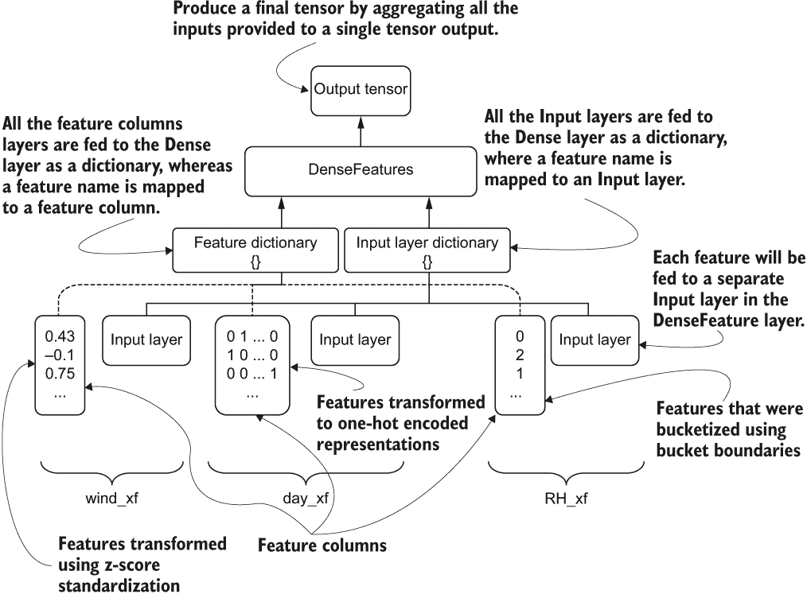

图 15.7 DenseFeatures 层功能概述

然后我们通过将数据通过几个隐藏层流动来递归计算输出。这些隐藏层的大小（一个整数列表）作为参数传递给函数。我们将使用 tanh 非线性激活作为隐藏层。最终的隐藏输出进入具有线性激活的单节点回归层。

最后，我们使用 Adam 优化器和均方损失作为损失函数对模型进行编译。重要的是要注意，我们必须为模型使用与回归兼容的损失函数。均方误差是用于回归问题的非常常见的损失函数。

Python 中的类型提示

您将看到一些函数的定义方式与我们过去所做的方式不同。例如，函数定义为

```py
def _build_keras_model() -> tf.keras.Model:
```

或

```py
def run_fn(fn_args: tfx.components.FnArgs):
```

这是 Python 中的可视类型提示，并且在 Python 中是可用的。这意味着类型不会以任何方式由 Python 解释器强制执行；相反，它们是一种视觉提示，以确保开发人员使用正确的输入和输出类型。在函数中定义参数时，可以使用以下语法定义该参数期望的数据类型 def <function>(<argument>: <type>):。例如，在函数 run_fn() 中，第一个参数 fn_args 必须是 tfx.components.FnArgs 类型。

然后，您还可以将函数返回的输出定义为 def <function> (<argument>: <type>) -> <return type>:。例如，_build_keras_model() 函数返回的对象必须是一个 tf.keras.Model 对象。

有些对象需要使用多种数据类型或自定义数据类型（例如，字符串列表）创建复杂数据类型。对于这一点，您可以使用一个名为 typing 的内置 Python 库。typing 允许您方便地定义数据类型。有关更多信息，请参阅 [`docs.python.org/3/library/typing.xhtml`](https://docs.python.org/3/library/typing.xhtml)。

在列表 15.8 中，我们定义了一个函数，给定一组训练数据文件名和评估数据文件名，生成用于训练和评估数据的 tf.data.Dataset 对象。我们将这个特殊函数定义为 _input_fn()。_input_fn() 接受三个参数：

+   file_pattern — 一组文件路径，其中文件包含数据

+   data_accessor — TFX 中的特殊对象，通过接受文件名列表和其他配置来创建 tf.data.Dataset

+   batch_size — 指定数据批次大小的整数

列表 15.8 用于使用输入文件生成 tf.data.Dataset 的函数

```py
from typing import List, Text                                ❶

def _input_fn(file_pattern: List[Text],                      ❷
              data_accessor: tfx.components.DataAccessor,    ❸
              tf_transform_output: tft.TFTransformOutput,    ❹
              batch_size: int = 200) -> tf.data.Dataset:     ❺

  return data_accessor.tf_dataset_factory(
      file_pattern,
      tfxio.TensorFlowDatasetOptions(
          batch_size=batch_size, label_key=_transformed_name(_LABEL_KEY)),
      tf_transform_output.transformed_metadata.schema)
```

❶ typing 库定义了函数输入的类型。

❷ 输入 tfrecord 文件的路径或模式的列表。它是 Text 类型对象（即字符串）的列表。

❸ DataAccessor 用于将输入转换为 RecordBatch

❹ 一个 TFTransformOutput

❺ 表示要合并为单个批次的返回数据集的连续元素的数量

您可以看到我们如何使用类型提示来标记参数以及返回对象。该函数通过调用 tf_dataset_factory() 函数获取 tf.data.Dataset，该函数使用文件路径列表和数据集选项（如批量大小和标签键）进行调用。标签键对于 data_accessor 来说非常重要，因为它能确定输入字段和目标。您可以看到 data_accessor 也需要从 Transform 步骤获取模式。这有助于 data_accessor 将原始示例转换为特征，然后分离输入和标签。在解释了所有关键函数之后，我们现在继续看看所有这些将如何被编排以进行模型训练。

### 15.2.2 定义模型训练

现在我们需要做的主要任务是模型的实际训练。负责模型训练的 TFX 组件（称为 Trainer）期望有一个名为 run_fn() 的特殊函数，该函数将告诉模型应该如何被训练和最终保存（见清单 15.9）。这个函数接受一个特殊类型的对象 called FnArgs，这是 TensorFlow 中的一个实用对象，可以用来声明需要传递给模型训练函数的与模型训练相关的用户定义参数。

清单 15.9 运行 Keras 模型训练与数据。

```py
def run_fn(fn_args: tfx.components.FnArgs):                        ❶

  absl.logging.info("="*50)
  absl.logging.info("Printing the tfx.components.FnArgs object")   ❷
  absl.logging.info(fn_args)                                       ❷
  absl.logging.info("="*50)

  tf_transform_output = tft.TFTransformOutput(
    fn_args.transform_graph_path
  )                                                                ❸

  train_dataset = _input_fn(
    fn_args.train_files, fn_args.data_accessor, tf_transform_output, 
➥ 40                                                              ❹
  )
  eval_dataset = _input_fn(
    fn_args.eval_files, fn_args.data_accessor, tf_transform_output, 
➥ 40                                                              ❹
  )
  model = _build_keras_model()                                     ❺

  csv_write_dir = os.path.join(
    fn_args.model_run_dir,'model_performance'
)                                                                  ❻
  os.makedirs(csv_write_dir, exist_ok=True)

  csv_callback = tf.keras.callbacks.CSVLogger(
    os.path.join(csv_write_dir, 'performance.csv'), append=False   ❼
  )

  model.fit(                                                       ❽
      train_dataset,
      steps_per_epoch=fn_args.train_steps,
      validation_data=eval_dataset,
      validation_steps=fn_args.eval_steps,
      epochs=10,
      callbacks=[csv_callback]
  )

  signatures = {                                                   ❾
      'serving_default':
          _get_serve_tf_examples_fn(
              model, tf_transform_output
          ).get_concrete_function(
              tf.TensorSpec(
                  shape=[None],
                  dtype=tf.string,
                  name='examples'
              )
          ),

  }
  model.save(fn_args.serving_model_dir, save_format='tf', signatures=signatures)                                        ❿
```

❶ 定义一个名为 run_fn 的函数，该函数以 tfx.components.FnArgs 对象作为输入。

❷ 记录 fn_args 对象中的值。

❸ 加载 tensorflow_transform 图。

❹ 使用函数 _input_fn（即将讨论）将 CSV 文件中的数据转换为 tf.data.Dataset 对象。

❺ 使用先前定义的函数构建 Keras 模型。

❻ 定义一个目录来存储 Keras 回调 CSVLogger 生成的 CSV 日志。

❼ 定义 CSVLogger 回调。

❽ 使用创建的数据集和 fn_args 对象中存在的超参数来拟合模型。

❾ 为模型定义签名。签名告诉模型在模型部署时通过 API 调用时该做什么。

❿ 将模型保存到磁盘。

让我们首先检查 run_fn()的方法签名。run_fn()接受一个 FnArgs 类型的单一参数作为输入。如前所述，FnArgs 是一个实用对象，它存储了对模型训练有用的键值对集合。这个对象中的大部分元素是由 TFX 组件本身填充的。不过，你也有灵活性传递一些值。我们将定义这个对象中一些最重要的属性。但是一旦我们看到 TFX Trainer 组件生成的完整输出，我们将学习更多关于这个对象的属性列表。表 15.2 为你提供了这个对象中存储的内容的概览。如果你对这些元素的用途不是很理解，不要担心。随着我们的学习，它们会变得更清晰。一旦我们运行 Trainer 组件，它将显示用于每一个属性的值，因为我们在其中包含了记录语句来记录 fn_args 对象。这将帮助我们对当前运行的示例将这些属性进行上下文化，并更清晰地理解它们。

表 15.2 fn_args 类型对象中存储的属性概览

| **属性** | **描述** | **示例** |
| --- | --- | --- |
| train_files | 训练文件名列表 | ['.../Transform/transformed_examples/16/Split-train/*'], |
| eval_files | 评估/验证文件名列表 | ['.../Transform/transformed_examples/16/Split-eval/*'] |
| train_steps | 训练步数 | 100 |
| eval_steps | 评估/验证步数 | 100 |
| schema_path | TFX 组件 SchemaGen 生成的模式路径 | '.../SchemaGen/schema/15/schema.pbtxt' |
| transform_graph_path | TFX 组件 Transform 生成的转换图路径 | '.../SchemaGen/schema/15/schema.pbtxt' |
| serve_model_dir | 存储可提供服务的模型的输出目录 | '.../Trainer/model/17/Format-Serving' |
| model_run_dir | 存储模型的输出目录 | '.../Trainer/model_run/17' |

这个函数完成的第一个重要任务是为训练和评估数据生成 tf.data.Dataset 对象。我们定义了一个特殊的函数叫做 _input_fn()来实现这个功能（见 15.8 节）。

定义了数据集之后，我们使用之前讨论过的 _build_keras_model() 函数定义 Keras 模型。然后我们定义了一个 CSVLogger 回调函数来记录性能指标随时间的变化，就像我们之前做的那样。简要回顾一下，tf.keras.callbacks.CSVLogger 会在模型编译期间创建一个 CSV 文件，记录每个周期的所有损失和指标。我们将使用 fn_arg 对象的 model_run_dir 属性来为 CSV 文件创建一个路径，该路径位于模型创建目录内。这样，如果我们运行多个训练试验，每个试验都将与模型一起保存其自己的 CSV 文件。之后，我们像之前无数次那样调用 model.fit() 函数。我们使用的参数很简单，所以我们不会详细讨论它们，也不会不必要地延长这个讨论。

### 15.2.3 SignatureDefs：定义模型在 TensorFlow 外部的使用方式

一旦模型训练完成，我们必须将模型存储在磁盘上，以便以后可以重用。存储此模型的目的是通过基于 Web 的 API（即 REST API）来查询模型使用输入并获取预测结果。这通常是在在线环境中为客户提供服务的机器学习模型的使用方式。为了让模型理解基于 Web 的请求，我们需要定义称为 SignatureDefs 的东西。签名定义了模型的输入或目标是什么样子的（例如，数据类型）。您可以看到我们定义了一个叫做 signatures 的字典，并将其作为参数传递给 model.save()（清单 15.9）。

signatures 字典应该有键值对，其中键是签名名称，值是使用 @tf.function 装饰器装饰的函数。如果您想快速回顾一下此装饰器的作用，请阅读下面的侧边栏。

@tf.function 装饰器

@tf.function 装饰器接受一个执行各种 TensorFlow 操作的函数，该函数使用 TensorFlow 操作数，然后跟踪所有步骤并将其转换为数据流图。在大多数情况下，TensorFlow 需要显示输入和输出如何在操作之间连接的数据流图。尽管在 TensorFlow 1.x 中，您必须显式构建此图，但 TensorFlow 2.x 以后不再让开发人员负责此责任。每当一个函数被 @tf.function 装饰器装饰时，它会为我们构建数据流图。

还要注意，您不能将任意名称用作签名名称。TensorFlow 有一组根据您的需求定义的签名名称。这些在 TensorFlow 的特殊常量模块中定义（[`mng.bz/o2Kd`](http://mng.bz/o2Kd)）。有四种签名可供选择：

+   PREDICT_METHOD_NAME（值：'tensorflow/serving/predict'）—这个签名用于预测传入输入的目标。这不期望目标存在。

+   REGRESS_METHOD_NAME（值为 'tensorflow/serving/regress'）——此签名可用于从示例进行回归。它期望 HTTP 请求体中同时存在输入和输出（即目标值）。

+   CLASSIFY_METHOD_NAME（值为 'tensorflow/serving/classify'）——与 REGRESS_METHOD_NAME 类似，但用于分类。此签名可用于分类示例。它期望 HTTP 请求中同时存在输入和输出（即目标值）。

+   DEFAULT_SERVING_SIGNATURE_DEF_KEY（值为 'serving_default'）——这是默认签名名称。模型至少应该有默认的服务签名才能通过 API 使用。如果没有定义其他签名，则请求将经过此签名。

我们只定义了默认签名。签名采用 TensorFlow 函数（即用 @tf.function 装饰的函数）作为值。因此，我们需要定义一个函数（我们将其称为 _get_serve_tf_examples_fn() ），以告诉 TensorFlow 对输入做什么（请参见下一个清单）。

清单 15.10 解析通过 API 请求发送的示例并从中进行预测。

```py
def _get_serve_tf_examples_fn(model, tf_transform_output):            ❶

  model.tft_layer = tf_transform_output.transform_features_layer()    ❷

  @tf.function
  def serve_tf_examples_fn(serialized_tf_examples):                   ❸
    """Returns the output to be used in the serving signature."""
    feature_spec = tf_transform_output.raw_feature_spec()             ❹
    feature_spec.pop(_LABEL_KEY)                                      ❺
    parsed_features = tf.io.parse_example(serialized_tf_examples, 
➥ feature_spec)                                                      ❻
    transformed_features = model.tft_layer(parsed_features)           ❼
    return model(transformed_features)                                ❽

  return serve_tf_examples_fn                                         ❾
```

❶ 返回一个函数，该函数解析序列化的 tf.Example 并应用特征转换。

❷ 以 Keras 层的形式获取要执行的特征转换。

❸ 被 @tf.function 装饰的函数将被返回。

❹ 获取原始列规范。

❺ 删除标签的特征规范，因为我们不需要在预测中使用它。

❻ 使用特征规范解析序列化示例。

❼ 使用定义的层将原始列转换为特征。

❽ 在提供转换后的特征之后返回模型的输出。

❾ 返回 TensorFlow 函数。

首先要注意的一件重要事情是，_get_serve_tf_examples_fn() 返回一个函数（即 serve_tf_examples_fn ），它是 TensorFlow 函数。_get_serve_tf_examples_fn() 接受两个输入：

+   Model — 我们在训练时建立的 Keras 模型。

+   tf_transform_output——将原始数据转换为特征的转换图。

返回函数应指示 TensorFlow 在模型部署后通过 API 请求传入的数据要执行什么操作。返回的函数以序列化示例作为输入，将它们解析为符合模型输入规范的正确格式，生成并返回输出。我们不会深入解析此功能的输入和输出，因为我们不会直接调用它，而是访问 TFX，在 API 调用时将访问它。

在这个过程中，函数首先获得原始特征规范映射，这是一个列名映射到 Feature 类型的字典。Feature 类型描述了放入特征中的数据类型。例如，对于我们的数据，特征规范将是这样的：

```py
{
  'DC': VarLenFeature(dtype=tf.float32), 
  'DMC': VarLenFeature(dtype=tf.float32),
  'RH': VarLenFeature(dtype=tf.int64), 
  ...
  'X': VarLenFeature(dtype=tf.int64), 
  'area': VarLenFeature(dtype=tf.float32), 
  'day': VarLenFeature(dtype=tf.string), 
  'month': VarLenFeature(dtype=tf.string)
}
```

可以观察到，根据该列中的数据使用了不同的数据类型（例如 float、int、string）。您可以在 [`www.tensorflow.org/api_docs/python/tf/io/`](https://www.tensorflow.org/api_docs/python/tf/io/) 上看到一列特征类型的列表。接下来，我们删除了具有 _LABEL_KEY 的特征，因为它不应该是输入的一部分。然后我们使用 tf.io.parse_example() 函数通过传递特征规范映射来解析序列化的示例。结果被传递给 TransformFeaturesLayer ([`mng.bz/nNRa`](http://mng.bz/nNRa))，它知道如何将一组解析后的示例转换为一批输入，其中每个输入具有多个特征。最后，转换后的特征被传递给模型，该模型返回最终输出（即，预测的森林烧毁面积）。让我们重新审视列表 15.9 中的签名定义：

```py
signatures = {
      'serving_default':
          _get_serve_tf_examples_fn(
              model, tf_transform_output
          ).get_concrete_function(
              tf.TensorSpec(
                  shape=[None],
                  dtype=tf.string,
                  name='examples'
              )
          ),    
  }
```

您可以看到，我们并不只是简单地传递 _get_serve_tf_examples_fn() 的返回 TensorFlow 函数。相反，我们在返回函数（即 TensorFlow 函数）上调用了 get_concrete_function()。如果您还记得我们之前的讨论，当您执行带有 @tf.function 装饰的函数时，它会执行两件事：

+   追踪函数并创建数据流图以执行函数的工作

+   执行图以返回输出

get_concrete_function() 只做第一个任务。换句话说，它返回了追踪的函数。您可以在 [`mng.bz/v6K7`](http://mng.bz/v6K7) 上阅读更多相关内容。

### 使用 TFX Trainer 训练 Keras 模型 15.2.4

我们现在有了训练模型的所有必要条件。再次强调，我们首先定义了一个 Keras 模型，定义了一个运行模型训练的函数，最后定义了指令，告诉模型当通过 API 发送 HTTP 请求时应该如何行事。现在我们将在 TFX 流水线的一部分中训练模型。为了训练模型，我们将使用 TFX Trainer 组件：

```py
from tfx.components import Trainer
from tfx.proto import trainer_pb2
import tensorflow.keras.backend as K

K.clear_session()

n_dataset_size = df.shape[0]
batch_size = 40

n_train_steps_mod = 2*n_dataset_size % (3*batch_size)
n_train_steps = int(2*n_dataset_size/(3*batch_size))
if n_train_steps_mod != 0:
    n_train_steps += 1

n_eval_steps_mod = n_dataset_size % (3*batch_size)
n_eval_steps = int(n_dataset_size/(3*batch_size))
if n_eval_steps != 0:
    n_eval_steps += 1

trainer = Trainer(
    module_file=os.path.abspath("forest_fires_trainer.py"),
    transformed_examples=transform.outputs['transformed_examples'],
    schema=schema_gen.outputs['schema'],
    transform_graph=transform.outputs['transform_graph'],
    train_args=trainer_pb2.TrainArgs(num_steps=n_train_steps),
    eval_args=trainer_pb2.EvalArgs(num_steps=n_eval_steps))

context.run(trainer)
```

在 Trainer 组件之前的代码只是计算了一个周期中所需的正确迭代次数。为了计算这个值，我们首先得到了数据的总大小（记住我们将数据集存储在 DataFrame df 中）。然后我们为训练使用了两个哈希桶，评估使用了一个哈希桶。因此，我们大约有三分之二的训练数据和三分之一的评估数据。最后，如果值不能完全被整除，我们就会加上 +1 来包含数据的余数。

让我们更详细地研究 Trainer 组件的实例化。有几个重要的参数需要传递给构造函数：

+   module_file——包含 run_fn() 的 Python 模块的路径。

+   transformed_examples——TFX Transform 步骤的输出，特别是转换后的示例。

+   schema——TFX SchemaGen 步骤的输出。

+   train_args——指定与训练相关的参数的 TrainArgs 对象。（要查看为该对象定义的 proto 消息，请参见 [`mng.bz/44aw`](http://mng.bz/44aw)。）

+   eval_args—一个指定评估相关参数的 EvalArgs 对象。（要查看为此对象定义的 proto 消息，请参见[`mng.bz/44aw`](http://mng.bz/44aw)。）

这将输出以下日志。由于日志输出的长度，我们已经截断了某些日志消息的部分：

```py
INFO:absl:Generating ephemeral wheel package for 
➥ '/home/thushv89/code/manning_tf2_in_action/Ch15-TFX-for-MLOps-in-
➥ TF2/tfx/forest_fires_trainer.py' (including modules: 
➥ ['forest_fires_constants', 'forest_fires_transform', 
➥ 'forest_fires_trainer']).

...

INFO:absl:Training model.

...

43840.0703WARNING:tensorflow:11 out of the last 11 calls to <function 
➥ recreate_function.<locals>.restored_function_body at 0x7f53c000ea60> 
➥ triggered tf.function retracing. Tracing is expensive and the excessive 
➥ number of tracings could be due to (1) creating @tf.function repeatedly 
➥ in a loop, (2) passing tensors with different shapes, (3) passing 
➥ Python objects instead of tensors. 

INFO:absl:____________________________________________________________________________
INFO:absl:Layer (type)                    Output Shape         Param #    
➥ Connected to                     
INFO:absl:=================================================================
➥ ===========

...

INFO:absl:dense_features (DenseFeatures)  (None, 31)           0           
➥ DC_xf[0][0]                      
INFO:absl:                                                                
➥ DMC_xf[0][0]                     
INFO:absl:                                                               
➥ FFMC_xf[0][0]                    
...
INFO:absl:                                                               
➥ temp_xf[0][0]                    
INFO:absl:                                                               
➥ wind_xf[0][0]                    
INFO:absl:_________________________________________________________________
➥ ___________

...

INFO:absl:Total params: 12,417

...

Epoch 1/10
9/9 [==============================] - ETA: 3s - loss: 43840.070 - 1s 
➥ 32ms/step - loss: 13635.6658 - val_loss: 574.2498
Epoch 2/10
9/9 [==============================] - ETA: 0s - loss: 240.241 - 0s 
➥ 10ms/step - loss: 3909.4543 - val_loss: 495.7877
...
Epoch 9/10
9/9 [==============================] - ETA: 0s - loss: 42774.250 - 0s 
➥ 8ms/step - loss: 15405.1482 - val_loss: 481.4183
Epoch 10/10
9/9 [==============================] - 1s 104ms/step - loss: 1104.7073 - 
➥ val_loss: 456.1211
...

INFO:tensorflow:Assets written to: 
➥ /home/thushv89/code/manning_tf2_in_action/Ch15-TFX-for-MLOps-in-
➥ TF2/tfx/pipeline/examples/forest_fires_pipeline/Trainer/model/5/Format-
➥ Serving/assets
INFO:absl:Training complete. Model written to 
➥ /home/thushv89/code/manning_tf2_in_action/Ch15-TFX-for-MLOps-in-
➥ TF2/tfx/pipeline/examples/forest_fires_pipeline/Trainer/model/5/Format-
➥ Serving. ModelRun written to 
➥ /home/thushv89/code/manning_tf2_in_action/Ch15-TFX-for-MLOps-in-
➥ TF2/tfx/pipeline/examples/forest_fires_pipeline/Trainer/model_run/5
INFO:absl:Running publisher for Trainer
INFO:absl:MetadataStore with DB connection initialized
```

在日志消息中，我们可以看到 Trainer 做了大量的繁重工作。首先，它使用 forest_fires_trainer.py 中定义的模型训练代码创建一个 wheel 包。wheel（扩展名为 .whl）是 Python 打包库的方式。例如，当你执行 pip install tensorflow 时，它会首先下载带有最新版本的 wheel 包并在本地安装。如果你有一个本地下载的 wheel 包，你可以使用 pip install <wheel 的路径>。你可以在 <pipeline 根目录路径>/examples/forest_fires_pipeline/_wheels 目录中找到生成的 wheel 包。然后它打印模型摘要。它为传递给模型的每个特征都有一个输入层。你可以看到 DenseFeatures 层聚合了所有这些输入层，以生成一个 [None, 31] 大小的张量。作为最终输出，模型产生了一个 [None, 1] 大小的张量。然后进行模型训练。你会看到警告，比如

```py
out of the last x calls to <function 
➥ recreate_function.<locals>.restored_function_body at 0x7f53c000ea60> 
➥ triggered tf.function retracing. Tracing is expensive and the excessive 
➥ number of tracings could be due to
```

当 TensorFlow 函数跟踪发生太多次时，就会出现这个警告。这可能是代码编写不佳的迹象（例如，模型在循环内部被重建多次），有时是不可避免的。在我们的案例中，是后者。Trainer 模块的行为导致了这种行为，我们对此无能为力。最后，组件将模型以及一些实用工具写入到管道根目录的一个文件夹中。到目前为止，我们的管道根目录看起来是这样的（图 15.8）。

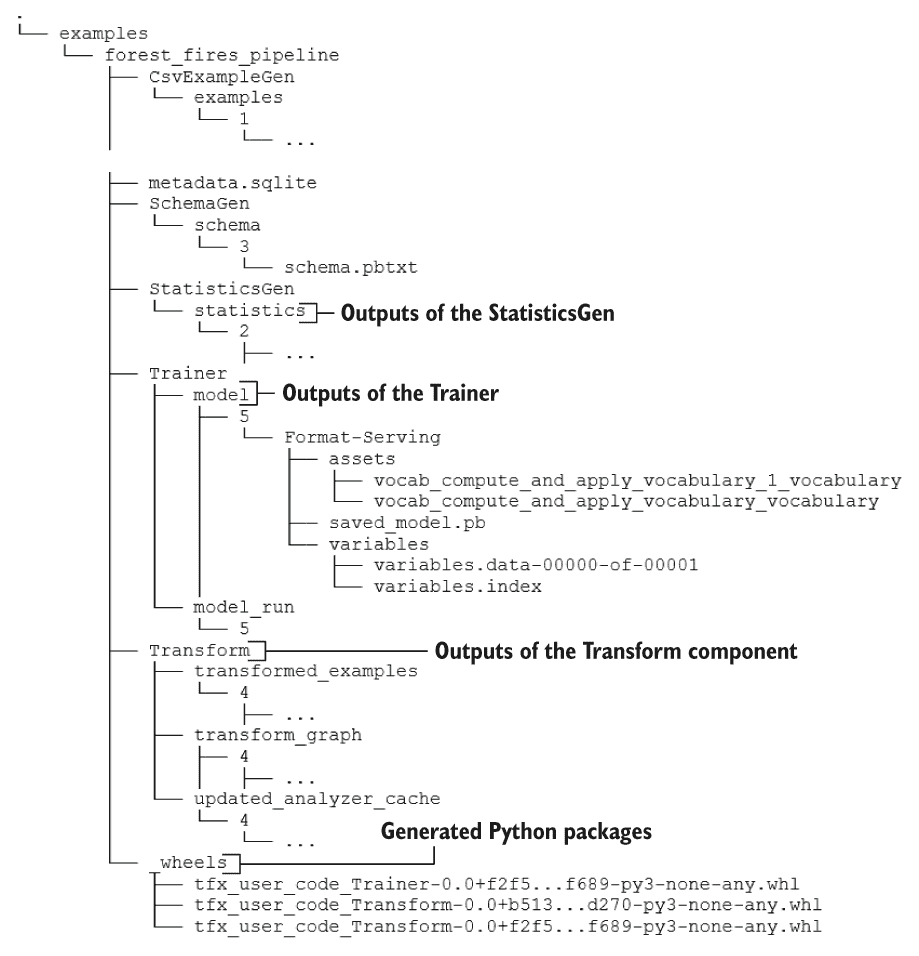

图 15.8 运行 Trainer 后的完整目录/文件结构

在 Trainer 的输出日志中，我们可以注意到一个主要问题是训练和验证损失。对于这个问题，它们相当大。我们使用的是计算得出的均方误差。

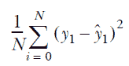

其中 N 是示例的数量，*y*[i] 是第 *i* 个示例，*ŷ*[i] 是第 *i* 个示例的预测值。在训练结束时，我们的平方损失约为 481，意味着每个示例约有 22 公顷（即 0.22 平方公里）的误差。这不是一个小错误。如果你调查这个问题，你会意识到这主要是由数据中存在的异常引起的。有些异常是如此之大，以至于它们可能会使模型严重偏离正确方向。我们将在本章的一个即将到来的部分中解决这个问题。你将能够看到传递给 run_fn() 的 FnArgs 对象中的值：

```py
INFO:absl:==================================================
INFO:absl:Printing the tfx.components.FnArgs object
INFO:absl:FnArgs(
    working_dir=None, 
    train_files=['.../Transform/transformed_examples/16/Split-train/*'], 
    eval_files=['.../Transform/transformed_examples/16/Split-eval/*'], 
    train_steps=100, 
    eval_steps=100, 
    schema_path='.../SchemaGen/schema/15/schema.pbtxt', 
    schema_file='.../SchemaGen/schema/15/schema.pbtxt', 
    transform_graph_path='.../Transform/transform_graph/16', 
    transform_output='.../Transform/transform_graph/16', 
    data_accessor=DataAccessor(
        tf_dataset_factory=<function 
➥ get_tf_dataset_factory_from_artifact.<locals>.dataset_factory at 
➥ 0x7f7a56329a60>, 
        record_batch_factory=<function 
➥ get_record_batch_factory_from_artifact.<locals>.record_batch_factory at 
➥ 0x7f7a563297b8>, 
        data_view_decode_fn=None
    ), 
    serving_model_dir='.../Trainer/model/17/Format-Serving', 
    eval_model_dir='.../Trainer/model/17/Format-TFMA', 
    model_run_dir='.../Trainer/model_run/17', 
    base_model=None, 
    hyperparameters=None, 
    custom_config=None
)
INFO:absl:==================================================
```

以下侧边栏讨论了我们在本讨论中的这一点上如何评估模型。

评估保存的模型

在流水线中，我们的模型将以 URL 形式通过 HTTP 接口提供服务。但是与其等待不如手动加载模型并用它来预测数据。这样做将为我们提供两个优势：

+   验证模型是否按预期工作

+   提供对模型输入和输出格式的深入理解

我们不会在本书中详细介绍这个问题，以保持我们讨论的重点在流水线上。但是，已在 tfv/15.1_MLOps_with_tensorflow.ipynb 笔记本中提供了代码，因此您可以进行实验。

接下来，我们将讨论如何检测数据中存在的异常并将其移除，以创建一个干净的数据集来训练我们的模型。

检测和移除异常值

我们的模型目前显示的验证损失约为 568。这里使用的损失是均方误差。我们已经看到，这意味着每个预测偏差 24 公顷（即 0.24 平方公里）。这不是一个可以忽略的问题。我们的数据中有很多异常值，这可能是我们看到如此大的误差边界的一个关键原因。以下图显示了我们早期创建的统计图。

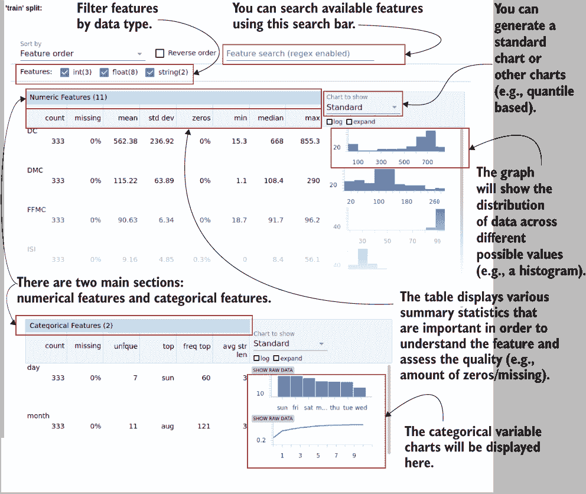

由 StatisticsGen 组件为数据生成的摘要统计图

您可以看到一些列严重偏斜。例如，特征 FFMC 具有最高的密度，约为 80-90，但范围为 18.7-96.2。

为了解决这个问题，我们将使用 tensorflow_data_validation（缩写为 tfdv）库。它提供了有用的功能，如 tfdv.validate_statistics()，可用于根据我们之前生成的数据模式验证数据，以及 tfdv.display_anomalies()函数，以列出异常样本。此外，我们可以编辑模式以修改异常值的标准。例如，要更改允许的 ISI 特征的最大值，您可以执行以下操作：

```py
isi_feature = tfdv.get_feature(schema, 'ISI')
isi_feature.float_domain.max = 30.0
```

最后，您可以使用 tfdv.visualize_statistics()函数可视化原始数据与清理后的数据。最后，您可以使用 TFX 流水线中的 ExampleValidator 对象（[`mng.bz/XZxv`](http://mng.bz/XZxv)）确保数据集中没有异常。

运行此操作后，您应该比以前得到更小的损失。例如，在这个实验中，平均观察到了约 150 的损失。这是之前错误的 75%减少。您可以在 tfv/15.1_MLOps_with_tensorflow.ipynb 笔记本中找到此代码。

接下来，我们将看一看一种名为 Docker 的技术，该技术用于在隔离且便携的环境中部署模型。我们将看看如何将我们的模型部署在所谓的 Docker 容器中。

练习 2

而不是使用 one-hot 编码来表示日和月的特征，并将它们追加到 categorical_columns 变量中，让我们假设你想使用嵌入来表示这些特征。您可以使用特征列 tf.feature_column.embedding_column 来完成这个任务。假设嵌入的维度是 32。你有存储在 _VOCAB_FEATURE_KEYS 中的特征名称（包括['day', 'month']）以及存储在 _MAX_CATEGORICAL_FEATURE_VALUES 中的维度（包括[7, 12]）。

## 15.3 设置 Docker 以提供经过训练的模型

您已经开发了一个数据管道和一个强大的模型，可以根据天气数据预测森林火灾的严重程度。现在，您希望更进一步，通过在一台机器上部署模型并通过 REST API 提供更易访问的服务，这个过程也称为生产化机器学习模型。为了做到这一点，您首先要创建一个专门用于模型服务的隔离环境。您将使用的技术是 Docker。

注意在继续之前，确保您的计算机上已经安装了 Docker。要安装 Docker，请按照此指南：[`docs.docker.com/engine/install/ubuntu/`](https://docs.docker.com/engine/install/ubuntu/)。

在 TFX 中，你可以将你的模型部署为一个容器，而这个容器是由 Docker 提供的。根据官方 Docker 网站的说法，Docker 容器是

软件的标准单元，它打包了代码和所有的依赖项，以便应用程序可以在一个计算环境中快速、可靠地运行，并在另一个计算环境中运行。

源：[`www.docker.com/resources/what-container`](https://www.docker.com/resources/what-container)

Docker 是一种容器技术，它可以帮助您在主机上隔离运行软件（或微服务）。在 Docker 中，您可以创建一个镜像，该镜像将使用各种规格（例如操作系统、库、依赖项）指示 Docker 需要在容器中以正确运行软件。然后，容器就是该镜像的运行时实例。这意味着您可以在一个计算机上创建一个容器，并且可以轻松地在另一台计算机上运行它（只要两台计算机上都安装了 Docker）。虚拟机（VMs）也试图实现类似的目标。有许多资源可以比较和对比 Docker 容器和虚拟机（例如，[`mng.bz/yvNB`](http://mng.bz/yvNB)）。

如我们所说，要运行一个 Docker 容器，首先需要一个 Docker 镜像。Docker 有一个公共镜像注册表（称为 Docker Hub），位于 [`hub.docker.com/`](https://hub.docker.com/)。我们正在寻找的 Docker 镜像是 TensorFlow serving 镜像。这个镜像已经安装了一切用于提供 TensorFlow 模型的服务，使用了 TensorFlow serving ([`github.com/tensorflow/serving`](https://github.com/tensorflow/serving))，这是 TensorFlow 中的一个子库，可以围绕给定的模型创建一个 REST API，以便你可以发送 HTTP 请求来使用模型。你可以通过运行以下命令来下载这个镜像：

```py
docker pull tensorflow/serving:2.6.3-gpu
```

让我们解析一下这条命令的结构。docker pull 是下载镜像的命令。tensorflow/serving 是镜像名称。Docker 镜像是有版本控制的，意味着每个 Docker 镜像都有一个版本标签（如果你没有提供的话，默认为最新版本）。2.6.3-gpu 是镜像的版本。这个镜像相当大，因为它支持 GPU 执行。如果你没有 GPU，你可以使用 docker pull tensorflow/serving:2.6.3，这个版本更轻量级。一旦命令成功执行，你就可以运行

```py
docker images 
```

列出你下载的所有镜像。有了下载的镜像，你可以使用 docker run <options> <Image> 命令来使用给定的镜像启动一个容器。docker run 命令非常灵活，带有许多可以设置和更改的参数。我们使用了其中的几个：

```py
docker run \
  --rm \
  -it \
  --gpus all \
  -p 8501:8501 \
  --user $(id -u):$(id -g) \
  -v ${PWD}/tfx/forest-fires-pushed:/models/forest_fires_model \
  -e MODEL_NAME=forest_fires_model \
  tensorflow/serving:2.6.3-gpu
```

理解这里提供的参数是很重要的。通常，在 shell 环境中定义参数时，使用单划线前缀来表示单字符的参数（例如，-p），使用双划线前缀来表示更详细的参数（例如，--gpus）：

+   --rm—容器是临时运行时，可以在服务运行后移除。--rm 意味着容器将在退出后被移除。

+   -it（简写形式为 -i 和 -t）—这意味着你可以进入容器，并在容器内部交互式地运行命令。

+   --gpus all—这告诉容器确保 GPU 设备（如果存在）在容器内可见。

+   -p—这将容器中的网络端口映射到主机。如果你想将某些服务（例如，用于提供模型的 API）暴露给外部，这一点很重要。例如，TensorFlow serving 默认运行在 8501 端口上。因此，我们将容器的 8501 端口映射到主机的 8501 端口。

+   --user $(id -u):$(id -g)—这意味着命令将以与您在主机上登录的用户相同的用户身份运行。每个用户由用户 ID 标识，并分配给一个或多个组（由组 ID 标识）。您可以按照 --user <用户 ID>:<组 ID> 的语法传递用户和组。例如，您当前的用户 ID 可以通过命令 id -u 给出，而组则由 id -g 给出。默认情况下，容器以 root 用户（即通过 sudo 运行）运行命令，这可能会使您的服务更容易受到外部攻击。因此，我们使用较低特权的用户在容器中执行命令。

+   -v—这将一个目录挂载到容器内的位置。默认情况下，您在容器内存储的东西对外部是不可见的。这是因为容器有自己的存储空间/卷。如果您需要使容器看到主机上的某些内容，或者反之亦然，则需要将主机上的目录挂载到容器内的路径上。这被称为*绑定挂载*。例如，在这里，我们将我们推送的模型（将位于 ./tfx/forest-fires-pushed）暴露到容器内部路径 /models/forest_fires_model。

+   -e—此选项可用于将特殊环境变量传递给容器。例如，TensorFlow 服务服务期望一个模型名称（它将成为从模型获取结果所需命中的 URL 的一部分）。

此命令在 Ch15-TFX-for-MLOps-in-TF2 目录中的 tfx/run_server.sh 脚本中为您提供。让我们运行 run_server.sh 脚本，看看我们将得到什么。要运行脚本

1.  打开一个终端。

1.  将 cd 移动到 Ch15-TFX-for-MLOps-in-TF2/tfx 目录中。

1.  运行 ./run_server.sh。

它将显示类似于以下的输出：

```py
2.6.3-gpu: Pulling from tensorflow/serving
Digest: 
➥ sha256:e55c44c088f6b3896a8f66d8736f38b56a8c5687c105af65a58f2bfb0bf90812
Status: Image is up to date for tensorflow/serving:2.6.3-gpu
docker.io/tensorflow/serving:2.6.3-gpu
2021-07-16 05:59:37.786770: I
tensorflow_serving/model_servers/server.cc:88] Building single TensorFlow 
➥ model file config: model_name: forest_fires_model model_base_path: 
➥ /models/forest_fires_model
2021-07-16 05:59:37.786895: I
tensorflow_serving/model_servers/server_core.cc:464] Adding/updating 
➥ models.
2021-07-16 05:59:37.786915: I
tensorflow_serving/model_servers/server_core.cc:587]  (Re-)adding model: 
➥ forest_fires_model
2021-07-16 05:59:37.787498: W
tensorflow_serving/sources/storage_path/file_system_storage_path_source.cc:
➥ 267] No versions of servable forest_fires_model found under base path 
➥ /models/forest_fires_model. Did you forget to name your leaf directory 
➥ as a number (eg. '/1/')?
...
```

当然，这并不能完全奏效，因为我们提供的目录作为模型位置尚未被填充。我们仍然需要做一些事情，以便将最终模型放置在正确的位置。

在下一节中，我们将完成我们流水线的其余部分。我们将看到如何在流水线中自动评估新训练的模型，如果性能良好，则部署模型，并使用 REST API（即基于 Web 的 API）从模型进行预测。

练习 3

假设您想要下载 TensorFlow Docker 映像（其名称为 tensorflow/tensorflow），版本为 2.5.0，并启动一个容器，将您计算机上的 /tmp/inputs 目录挂载到容器内的 /data 卷中。此外，您希望将容器中的 5000 端口映射到计算机上的 5000 端口。您如何使用 Docker 命令执行此操作？您可以假设您在容器内以 root 用户身份运行命令。

## 15.4 部署模型并通过 API 进行服务

现在，你已经有了一个数据管道、训练好的模型以及一个可以运行包含了运行模型和访问模型的 API 所需的一切的脚本。现在，使用 TFX 提供的一些服务，你将在 Docker 容器中部署模型，并通过 API 进行访问。在这个过程中，你将运行一些步骤来验证基础结构（例如，容器是否可运行且健康）和模型（即在模型的新版本发布时，检查它是否比上一个版本更好），最后，如果一切都好，将模型部署到基础结构上。

这是一个漫长的旅程。让我们回顾一下我们到目前为止取得的成就。我们已经使用了以下 TFX 组件：

+   CsvExampleGen—从 CSV 文件中以 TFRecord 对象的形式加载数据。

+   StatisticsGen—关于 CSV 数据中各列分布的基本统计数据和可视化。

+   SchemaGen—生成数据的模式/模板（例如数据类型、域、允许的最小/最大值等）。

+   Transform—使用 tensorflow_transform 库中提供的操作（例如，独热编码、桶化）将原始列转换为特征。

+   Trainer—定义一个 Keras 模型，使用转换后的数据进行训练，并保存到磁盘。此模型具有一个名为 serving default 的签名，指示模型对于传入的请求应该执行什么操作。

+   ExampleValidator—用于验证训练和评估示例是否符合定义的模式，并可用于检测异常。

### 15.4.1 验证基础结构

使用 TFX，当你拥有一个完全自动化的管道时，几乎可以确保一切工作正常。我们将在这里讨论一个这样的步骤：基础结构验证步骤。在这个步骤中，tfx.components.InfraValidator 将自动进行

+   使用提供的特定版本的 TensorFlow serving 镜像创建一个容器

+   加载并在其中运行模型

+   发送多个请求以确保模型能够响应

+   关闭容器

让我们看一下如何使用这个组件来验证我们在前一节中设置的本地 Docker 配置（请参阅下一个清单）。

Listing 15.11 定义 InfraValidator

```py
from tfx.components import InfraValidator
from tfx.proto import infra_validator_pb2

infra_validator = InfraValidator(
    model=trainer.outputs['model'],                                        ❶

    examples=example_gen.outputs['examples'],                              ❷
    serving_spec=infra_validator_pb2.ServingSpec(                          ❸
        tensorflow_serving=infra_validator_pb2.TensorFlowServing(          ❹
            tags=['2.6.3-gpu']
        ),
        local_docker=infra_validator_pb2.LocalDockerConfig(),              ❺
    ),
    request_spec=infra_validator_pb2.RequestSpec(                          ❻
        tensorflow_serving=infra_validator_pb2.TensorFlowServingRequestSpec(❼
            signature_names=['serving_default']
        ),
        num_examples=5                                                     ❽
    )
)

context.run(infra_validator)
```

❶ InfraValidator 需要验证的模型的位置。

❷ 用于构建对模型的 API 调用的数据来源

❸ 包含一组与对模型进行的具体调用相关的规范

❹ 定义要使用的 TensorFlow serving Docker Image 的版本/标签

❺ 告诉 InfraValidator 我们将使用本地的 Docker 服务进行测试

❻ 包含与对模型进行的特定调用相关的规范集合

❼ 定义要使用的模型签名

❽ 定义了向模型发送的请求数量

InfraValidator 和其他任何 TFX 组件一样，需要准确地提供多个参数才能运行。

+   model—由 Trainer 组件返回的 Keras 模型。

+   examples—由 CSVExampleGen 给出的原始示例。

+   serving_spec—期望一个 ServingSpec protobuf 消息。它将指定 TensorFlow serving Docker 镜像的版本以及是否使用本地 Docker 安装（这里已完成）。

+   request_spec—一个 RequestSpec protobuf 消息，它将指定需要达到的签名以验证模型是否正常工作。

如果此步骤无误完成，您将在管道根目录中看到图 15.9 中显示的文件。

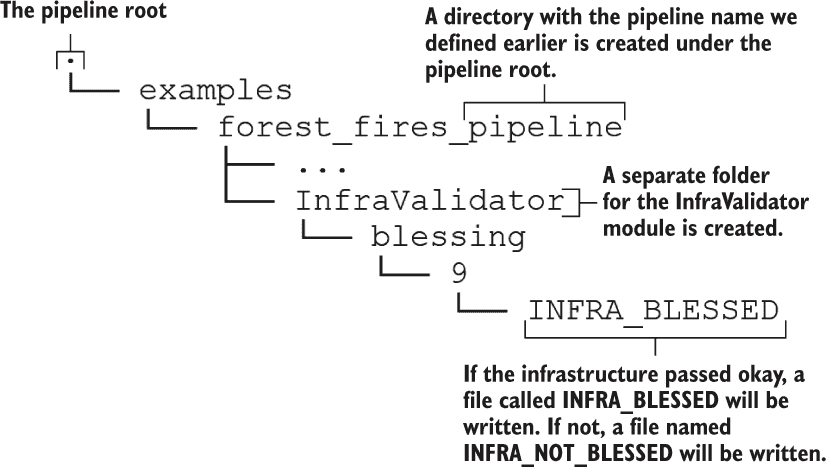

图 15.9 运行 InfraValidator 后的目录/文件结构

您可以看到一个名为 INFRA_BLESSED 的文件出现在 InfraValidator 子目录中。这引出了“祝福”的概念。TFX 将在成功运行流水线中祝福某些元素。一旦被祝福，它将创建一个带有后缀 BLESSED 的文件。如果该步骤失败，那么将创建一个带有后缀 NOT_BLESSED 的文件。祝福有助于区分运行正常和运行失败的事物。例如，一旦被祝福，我们可以确信基础设施按预期工作。这意味着像

+   架设一个容器

+   加载模型

+   达到定义的 API 端点

可以无问题地执行。

### 15.4.2 解析正确的模型

接下来，我们将定义一个解析器。解析器的目的是使用明确定义的策略（例如，使用最低验证错误的模型）解决随时间演变的特殊工件（如模型）。然后，解析器通知后续组件（例如，我们接下来将定义的模型评估器组件）要使用哪个工件版本。正如您可能已经猜到的那样，我们将使用解析器来解析管道中的经过训练的 Keras 模型。因此，如果您多次运行管道，则解析器将确保在下游组件中使用最新和最优秀的模型：

```py
from tfx import v1 as tfx

model_resolver = tfx.dsl.Resolver(
      strategy_class=tfx.dsl.experimental.LatestBlessedModelStrategy,
      model=tfx.dsl.Channel(type=tfx.types.standard_artifacts.Model),
      model_blessing=tfx.dsl.Channel(
          type=tfx.types.standard_artifacts.ModelBlessing
      )
).with_id('latest_blessed_model_resolver')

context.run(model_resolver)
```

在定义验证模型的解析器时，我们将定义三件事：

+   strategy_class（来自 tfx.dsl.components.common.resolver.ResolverStrategy 命名空间的类）—定义解析策略。当前支持两种策略：最新的祝福模型（即通过一组定义的评估检查的模型）和最新的模型。

+   模型（tfx.dsl.Channel）—将 TFX 工件类型的模型包装在一个 tfx.dsl.Channel 对象中。tfx.dsl.Channel 是一个 TFX 特定的抽象概念，连接数据消费者和数据生产者。例如，在管道中选择正确的模型时就需要一个通道，以从可用模型池中选择。

+   model_blessing（tfx.dsl.Channel）—将类型为 ModelBlessing 的 TFX 工件包装在 tfx.dsl.Channel 对象中。

你可以查看各种工件，将其包装在一个 tf.dsl.Channel 对象中，网址为[`mng.bz/2nQX`](http://mng.bz/2nQX)。

### 15.4.3 评估模型

我们将在将模型推送到指定的生产环境之前的最后一步对模型进行评估。基本上，我们将定义几个模型需要通过的评估检查。当模型通过时，TFX 将对模型进行认可。否则，TFX 将使模型保持未认可状态。我们将在后面学习如何检查模型是否被认可。为了定义评估检查，我们将使用 tensorflow_model_analysis 库。第一步是定义一个评估配置，其中指定了检查项：

```py
import tensorflow_model_analysis as tfma

eval_config = tfma.EvalConfig(
    model_specs=[
        tfma.ModelSpec(label_key='area')                                  ❶
    ],
    metrics_specs=[
        tfma.MetricsSpec(
            metrics=[                                                     ❷
                tfma.MetricConfig(class_name='ExampleCount'),             ❸
                tfma.MetricConfig(
                    class_name='MeanSquaredError',                        ❹
                    threshold=tfma.MetricThreshold(                       ❺
                       value_threshold=tfma.GenericValueThreshold(
                           upper_bound={'value': 200.0}
                       ),
                       change_threshold=tfma.GenericChangeThreshold(      ❻
                           direction=tfma.MetricDirection.LOWER_IS_BETTER,
                           absolute={'value': 1e-10}
                       )
                   )
               )
           ]
        )
    ],
    slicing_specs=[                                                       ❼
        tfma.SlicingSpec(),                                               ❽
        tfma.SlicingSpec(feature_keys=['month'])                          ❾
    ])
```

❶ 定义一个包含标签特征名称的模型规范。

❷ 定义一个指标规范列表。

❸ 获取评估的示例数。

❹ 将均方误差定义为一项指标。

❺ 将阈值上限定义为一个检查。

❻ 将误差变化（与先前模型相比）定义为一个检查（即，误差越低越好）。

❼ 切片规范定义了在评估时数据需要如何分区。

❽ 在整个数据集上进行评估，不进行切片（即，空切片）。

❾ 在分区数据上进行评估，其中数据根据月份字段进行分区。

EvalConfig 相当复杂。让我们慢慢来。我们必须定义三件事：模型规范（作为 ModelSpec 对象）、指标规范（作为 MetricsSpec 对象列表）和切片规范（作为 SlicingSpec 对象列表）。ModelSpec 对象可用于定义以下内容：

+   name—可用于在此步骤中标识模型的别名模型名称。

+   model_type—标识模型类型的字符串。允许的值包括 tf_keras、tf_estimator、tf_lite 和 tf_js、tf_generic。对于像我们的 Keras 模型，类型会自动推导。

+   signature_name—用于推断的模型签名。默认情况下使用 serving_default。

+   label_key—示例中标签特征的名称。

+   label_keys—对于多输出模型，使用标签键列表。

+   example_weight_key—如果存在，则用于检索示例权重的可选键（或特征名称）。

有关 ModelSpec 对象的更多信息，请参阅[`mng.bz/M5wW`](http://mng.bz/M5wW)。在 MetricsSpec 对象中，可以设置以下属性：

+   metrics—MetricConfig 对象的列表。每个 MetricConfig 对象将类名作为输入。您可以选择在 tfma.metrics.Metric（[`mng.bz/aJ97`](http://mng.bz/aJ97)）或 tf.keras.metrics.Metric（[`mng.bz/gwmV`](http://mng.bz/gwmV)）命名空间中定义的任何类。

SlicingSpec 定义了评估期间数据需要如何进行分区。例如，对于时间序列问题，您需要查看模型在不同月份或天数上的表现。为此，SlicingSpec 是一个方便的配置。SlicingSpec 具有以下参数：

+   feature_keys—可用于定义一个特征键，以便您可以根据其对数据进行分区。例如，对于特征键月份，它将通过选择具有特定月份的数据来为每个月份创建一个数据分区。如果未传递，它将返回整个数据集。

注意，如果没有提供，TFX 将使用您在管道最开始（即实施 CsvExampleGen 组件时）定义的评估集合。换句话说，所有指标都在数据集的评估集合上进行评估。接下来，它定义了两个评估通过的条件：

+   均方误差小于 200。

+   均方损失改善了 1e - 10。

如果对于一个新训练的模型满足下列两个条件，那么该模型将被标记为“通过”（即通过了测试）。

最后，我们定义了评估器（[`mng.bz/e7BQ`](http://mng.bz/e7BQ)），它将接收一个模型并运行在 eval_config 中定义的评估检查。您可以通过为 examples、model、baseline_model 和 eval_config 参数传入值来定义一个 TFX 评估器。baseline_model 是由 Resolver 解析的：

```py
from tfx.components import Evaluator

evaluator = Evaluator(
    examples=example_gen.outputs['examples'],
    model=trainer.outputs['model'],
    baseline_model=model_resolver.outputs['model'],
    eval_config=eval_config)
context.run(evaluator)
```

不幸的是，运行评估器不会提供您所需的结果。事实上，它会导致评估失败。在日志的底部，您将看到如下输出：

```py
INFO:absl:Evaluation complete. Results written to 
➥ .../pipeline/examples/forest_fires_pipeline/Evaluator/evaluation/14.
INFO:absl:Checking validation results.
INFO:absl:Blessing result False written to 
➥ .../pipeline/examples/forest_fires_pipeline/Evaluator/blessing/14.
```

上面的输出表明，Blessing 结果为 False。鉴于它只显示了约为 150 的损失，而我们将阈值设为 200，为什么模型失败仍然是一个谜。要了解发生了什么，我们需要查看写入磁盘的结果。如果您在<pipeline root>/ examples\forest_fires_pipeline\Evaluator\<execution ID>目录中查看，您会看到像 validation、metrics 等文件。使用 tensorflow_model_analysis 库，这些文件可以提供宝贵的见解，帮助我们理解出了什么问题。tensorflow_model_analysis 库提供了几个方便的函数来加载存储在这些文件中的结果：

```py
import tensorflow_model_analysis as tfma

validation_path = os.path.join(
    evaluator.outputs['evaluation']._artifacts[0].uri, "validations"
)
validation_res = tfma.load_validation_result(validation_path)

print('='*20, " Output stored in validations file ", '='*20)
print(validation_res)
print("="*75)
```

运行结果为：

```py
metric_validations_per_slice {
  slice_key {
    single_slice_keys {
      column: "month"
      bytes_value: "sep"
    }
  }
  failures {
    metric_key {
      name: "mean_squared_error"
    }
    metric_threshold {
      value_threshold {
        upper_bound {
          value: 200.0
        }
      }
    }
    metric_value {
      double_value {
        value: 269.11712646484375
      }
    }
  }
}
validation_details {
  slicing_details {
    slicing_spec {
    }
    num_matching_slices: 12
  }
}
```

您可以清楚地看到发生了什么。它指出，为月份"sep"创建的切片导致了 269 的错误，这就是为什么我们的评估失败了。如果您想要关于所有使用的切片及其结果的详细信息，您可以检查指标文件：

```py
metrics_path = os.path.join(
    evaluator.outputs['evaluation']._artifacts[0].uri, "metrics"
)
metrics_res = tfma.load_metrics(metrics_path)

print('='*20, " Output stored in metrics file ", '='*20)
for r in metrics_res:
    print(r)
    print('-'*75)
print("="*75)
```

运行结果为以下内容。为了节省空间，这里只显示了完整输出的一小部分：

```py
slice_key {
  single_slice_keys {
    column: "month"
    bytes_value: "sep"
  }
}
metric_keys_and_values {
  key {
    name: "loss"
  }
  value {
    double_value {
      value: 269.11712646484375
    }
  }
}
metric_keys_and_values {
  key {
    name: "mean_squared_error"
  }
  value {
    double_value {
      value: 269.11712646484375
    }
  }
}
metric_keys_and_values {
  key {
    name: "example_count"
  }
  value {
    double_value {
      value: 52.0
    }
  }
}

---------------------------------------------------------------------------
slice_key {
}
metric_keys_and_values {
  key {
    name: "loss"
  }
  value {
    double_value {
      value: 160.19691467285156
    }
  }
}
metric_keys_and_values {
  key {
    name: "mean_squared_error"
  }
  value {
    double_value {
      value: 160.19691467285156
    }
  }
}
metric_keys_and_values {
  key {
    name: "example_count"
  }
  value {
    double_value {
      value: 153.0
    }
  }
}
...
```

这个输出让我们对发生了什么有了更多了解。由于我们将示例计数视为指标之一，我们可以看到每个切片中的示例数。例如，在五月份，评估集合中只有一个示例，这很可能是一个异常值。为了解决这个问题，我们将阈值提高到 300。一旦您这样做了，需要重新运行评估器，从评估器的日志中可以看到我们的模型已通过检查：

```py
INFO:absl:Evaluation complete. Results written to 
➥ .../pipeline/examples/forest_fires_pipeline/Evaluator/evaluation/15.
INFO:absl:Checking validation results.
INFO:absl:Blessing result True written to 
➥ .../pipeline/examples/forest_fires_pipeline/Evaluator/blessing/15.
```

解决这个问题的最佳方法是确定为什么“sep” 月份给出的值如此之大，而其他月份与整体损失值持平或低于。确定问题后，我们应该确定纠正措施以更正此问题（例如，重新考虑异常值定义）。在此之后，我们将继续进行管道的下一部分。

### 15.4.4 推送最终模型

我们已经达到管道中的最后步骤。我们需要定义一个推送器。 推送器（[`mng.bz/pOZz`](http://mng.bz/pOZz)）负责将经过评估检查的认可模型（即通过的模型）推送到定义好的生产环境。 生产环境可以简单地是您文件系统中的本地位置：

```py
from tfx.components import Pusher
from tfx.proto import pusher_pb2

pusher = Pusher(
  model=trainer.outputs['model'],
  model_blessing=evaluator.outputs['blessing'],
  infra_blessing=infra_validator.outputs['blessing'],
  push_destination=pusher_pb2.PushDestination(
    filesystem=pusher_pb2.PushDestination.Filesystem(
        base_directory=os.path.join('forestfires-model-pushed'))
  )
)
context.run(pusher)
```

推送器接受以下元素作为参数：

+   model—由 Trainer 组件返回的 Keras 模型

+   model_blessing—Evaluator 组件的认可状态

+   infra_blessing—InfraValidator 的认可状态

+   push_destination—作为 PushDestination protobuf 消息推送的目标

如果这一步运行成功，您将在我们的管道根目录中的称为 forestfires-model-pushed 的目录中保存模型。

### 15.4.5 使用 TensorFlow serving API 进行预测

最后一步是从推送目的地检索模型，并基于我们下载的 TensorFlow 服务镜像启动 Docker 容器。 Docker 容器将提供一个 API，我们可以通过各种请求进行 ping 。

让我们更详细地看一下如何将 API 融入整体架构中（图 15.10）。 机器学习模型位于 API 的后面。 API 定义了各种 HTTP 端点，您可以通过 Python 或类似 curl 的包来 ping 这些端点。 这些端点将以 URL 的形式提供，并且可以在 URL 中期望参数或将数据嵌入请求体中。 API 通过服务器提供。 服务器公开了一个网络端口，客户端可以与服务器进行通信。 客户端可以使用格式<主机名>:<端口>/<端点>向服务器发送请求。 我们将更详细地讨论请求实际的样子。


图 15.10 模型如何与 API、TensorFlow 服务器和客户端交互

要启动容器，只需

1.  打开一个终端

1.  将 cd 移入 Ch15-TFX-for-MLOps-in-TF2/tfx 目录

1.  运行 ./run_server.sh

接下来，在 Jupyter 笔记本中，我们将发送一个 HTTP POST 请求。 HTTP 请求有两种主要类型：GET 和 POST。 如果您对差异感兴趣，请参考侧边栏。 HTTP POST 请求是一个包含了可以请求的 URL 和头信息的请求，也包含了负载，这对 API 完成请求是必要的。 例如，如果我们正在击中与 serving_default 签名对应的 API 端点，我们必须发送一个输入以进行预测。

GET vs. POST 请求

GET 和 POST 是 HTTP 方法。HTTP 是一个定义客户端和服务器应该如何通信的协议。客户端将发送请求，服务器将在特定的网络端口上监听请求。客户端和服务器不一定需要是两台单独的机器。在我们的情况下，客户端和服务器都在同一台机器上。

每当您通过键入 URL 访问网站时，您都在向该特定网站发出请求。一个请求具有以下解剖结构（[`mng.bz/OowE`](http://mng.bz/OowE)）:

+   *方法类型* — GET 或 POST

+   *一个路径* — 到达您想要到达的服务器端点的 URL

+   *一个主体* — 需要客户端完成请求的任何大型有效载荷（例如，用于机器学习预测服务的输入）

+   *一个头部* — 服务器需要的附加信息（例如，发送主体中的数据类型）

主要区别在于 GET 用于请求数据，而 POST 请求用于将数据发送到服务器（可以选择返回某些内容）。GET 请求不会有请求主体，而 POST 请求会有请求主体。另一个区别是 GET 请求可以被缓存，而 POST 请求不会被缓存，这使得它们对于敏感数据更安全。您可以在[`mng.bz/YGZA`](http://mng.bz/YGZA)中了解更多信息。

我们将定义一个请求主体，其中包含我们要击中的签名名称以及我们要为其预测的输入。接下来，我们将使用 Python 中的 requests 库发送一个请求到我们的 TensorFlow 模型服务器（即 Docker 容器）。在此请求中，我们将定义要到达的 URL（由 TensorFlow 模型服务器自动生成）和要携带的有效载荷。如果请求成功，我们应该会得到一个有效的预测作为输出：

```py
import base64
import json
import requests

req_body = {
  "signature_name": "serving_default",

  "instances": 
    [
            str(base64.b64encode(
                b"{\"X\": 7,\"Y\": 
➥ 4,\"month\":\"oct\",\"day\":\"fri\",\"FFMC\":60,\"DMC\":30,\"DC\":200,\
➥ "ISI\":9,\"temp\":30,\"RH\":50,\"wind\":10,\"rain\":0}]")
               )
    ]

}

data = json.dumps(req_body)

json_response = requests.post(
    'http:/ /localhost:8501/v1/models/forest_fires_model:predict', 
    data=data, 
    headers={"content-type": "application/json"}
)
predictions = json.loads(json_response.text)
```

我们首先要做的是用特定的请求主体定义一个请求。对请求主体的要求在[`www.tensorflow.org/tfx/serving/api_rest`](https://www.tensorflow.org/tfx/serving/api_rest)中定义。它是一个键值对字典，应该有两个键：signature_name 和 instances。signature_name 定义要在模型中调用哪个签名，而 instances 将包含输入数据。请注意，我们不是直接传递原始形式的输入数据。相反，我们使用 base64 编码。它将字节流（即二进制输入）编码为 ASCII 文本字符串。您可以在[`mng.bz/1o4g`](http://mng.bz/1o4g)中了解更多信息。您可以看到我们首先将字典转换为字节流（即 b"<data>" 格式），然后在其上使用 base64 编码。如果您还记得我们之前讨论的编写模型服务函数（其中包含 signature def serve_tf_examples_fn(serialized_tf_examples)）时，它期望一组序列化的示例。序列化是通过将数据转换为字节流来完成的。

当数据准备好后，我们使用 requests 库创建一个 POST 请求到 API。首先，我们定义一个头部，以表示我们传递的内容或载荷是 JSON 格式的。接下来，我们通过 requests.post() 方法发送一个 POST 请求，传递 URL，格式为 [`<server’s hostname>:<port>/v1/models/<model name>:predict`](http://<server%E2%80%99s%20hostname%3E:<port%3E/v1/models/<model%20name%3E:predict)，数据（即 JSON 载荷），和头部信息。这不是我们唯一可以使用的 API 端点。我们还有其他端点（[`www.tensorflow.org/tfx/serving/api_rest`](https://www.tensorflow.org/tfx/serving/api_rest)）。主要有四个可用的端点：

+   *http:/ /<server’s hostname>:<port>/v1/models/<model name>:predict* — 使用模型和请求中传递的数据预测输出值。不需要提供给定输入的目标值。

+   *http:*/ /*<server’s hostname>:<port>/v1/models/<model name>:regress* — 用于回归问题。当输入和目标值都可用时使用（即可以计算误差）。

+   *http:*/ /*<server’s hostname>:<port>/v1/models/<model name>:classify* — 用于分类问题。当输入和目标值都可用时使用（即可以计算误差）。

+   *http:*/ /*<server’s hostname>:<port>/v1/models/<model name>/metadata* — 提供有关可用端点/模型签名的元数据。

这将返回一些响应。如果请求成功，将包含响应；否则，会包含 HTTP 错误。您可以在 [`mng.bz/Pn2P`](https://developer.mozilla.org/en-US/docs/Web/HTTP/Status) 上看到各种 HTTP 状态/错误代码。在我们的情况下，我们应该得到类似于

```py
{'predictions': [[2.77522683]]}
```

这意味着我们的模型已成功处理了输入并产生了有效的预测。我们可以看到，模型返回的预测值完全在我们在数据探索期间看到的可能值范围内。这结束了我们对 TensorFlow 扩展（TFX）的讨论。

练习 4

如何将多个输入发送到模型的 HTTP 请求中？假设您有以下两个输入，您想要使用模型进行预测。

|  | **Example 1** | **Example 2** |
| --- | --- | --- |
| X | 9 | 7 |
| Y | 6 | 4 |
| month | aug | aug |
| day | fri | fri |
| FFMC | 91 | 91 |
| DMC | 248 | 248 |
| DC | 553 | 553 |
| ISI | 6 | 6 |
| temp | 20.5 | 20.5 |
| RH | 58 | 20 |
| wind | 3 | 0 |
| rain | 0 | 0 |

要在 HTTP 请求中为该输入传递多个值，可以在 JSON 数据的实例列表中附加更多示例。

## 摘要

+   MLOps 定义了一个工作流程，将自动化大部分步骤，从收集数据到交付对该数据进行训练的模型。

+   生产部署涉及部署一个带有健壮 API 的训练模型，使客户能够使用模型进行其设计目的的操作。该 API 提供几个 HTTP 端点，格式为客户端可以使用与服务器通信的 URL。

+   在 TFX 中，您将 MLOps 管道定义为一系列 TFX 组件。

+   TFX 有组件用于加载数据（CsvExampleGen）、生成基本统计信息和可视化（StatisticsGen）、推断模式（SchemaGen）以及将原始列转换为特征（Transform）。

+   要通过 HTTP 请求提供 Keras 模型，需要签名。

    +   签名定义输入和输出的数据格式，以及通过 TensorFlow 函数（例如，用@tf.function 装饰的函数）生成输出所需的步骤。

+   Docker 是一种容器化技术，可以将一个软件单元封装为一个单一容器，并可以在不同环境（或计算机）之间轻松移植。

+   Docker 在容器中运行一个软件单元。

+   TFX 为验证基础设施和模型提供了验证组件。TFX 可以启动一个容器并确保它按预期运行，还可以确保模型通过各种评估标准（例如，损失小于阈值），从而确保高质量的模型。

+   一旦模型被推送到生产环境，我们会启动一个 Docker 容器（基于 TensorFlow 服务镜像），将模型装入容器并通过 API 提供服务。我们可以发出 HTTP 请求（嵌入输入），以生成预测。

## 练习答案

**练习 1**

```py
  outputs = {}

  # Treating dense features
  outputs[_transformed_name('DC')] = tft.scale_to_0_1(
        sparse_to_dense(inputs['DC'])
    )

  # Treating bucketized features
  outputs[_transformed_name('temp')] = tft.apply_buckets(
        sparse_to_dense(inputs['temp']), bucket_boundaries=[(20, 30)])
```

**练习 2**

```py
categorical_columns = [
      tf.feature_column.embedding_column(
          tf.feature_column.categorical_column_with_identity( 
              key,
              num_buckets=num_buckets,
              default_value=0
          ),
          dimension=32
      ) for key, num_buckets in zip(
              _transformed_names(_VOCAB_FEATURE_KEYS),
              _MAX_CATEGORICAL_FEATURE_VALUES
      )
```

**练习 3**

```py
docker run -v /tmp/inputs:/data -p 5000:5000 tensorflow/tensorflow:2.5.0
```

**练习 4**

```py
req_body = {
  "signature_name": "serving_default",

  "instances": 
    [
        str(base64.b64encode(
            b"{\"X\": 9,\"Y\": 
➥ 6,\"month\":\"aug\",\"day\":\"fri\",\"FFMC\":91,\"DMC\":248,\"DC\":553,
➥ \"ISI\":6,\"temp\":20.5,\"RH\":58,\"wind\":3,\"rain\":0}]")
        ),
        str(base64.b64encode(
            b"{\"X\": 7,\"Y\": 
➥ 4,\"month\":\"aug\",\"day\":\"fri\",\"FFMC\":91,\"DMC\":248,\"DC\":553,
➥ \"ISI\":6,\"temp\":20.5,\"RH\":20,\"wind\":0,\"rain\":0}]")
        ),

    ]

}
```
