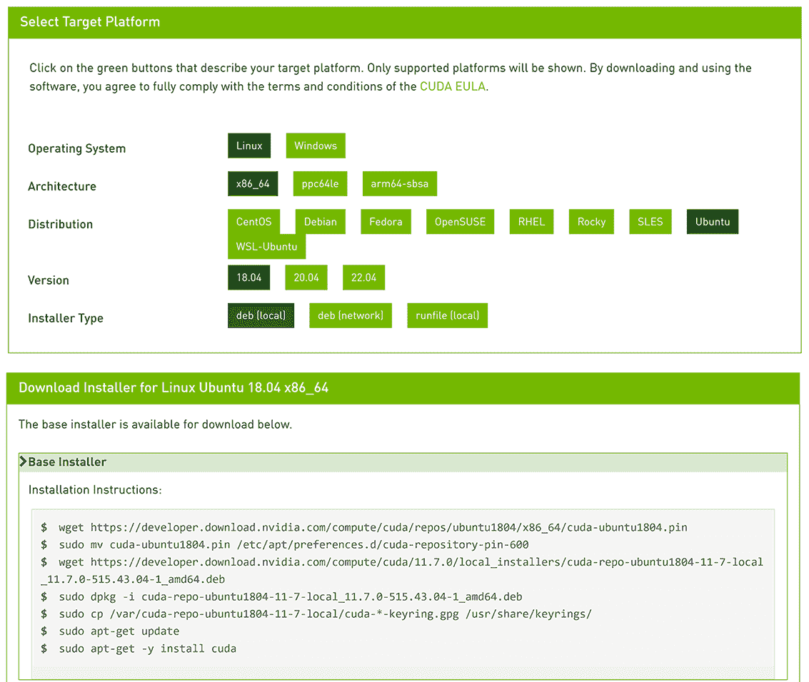
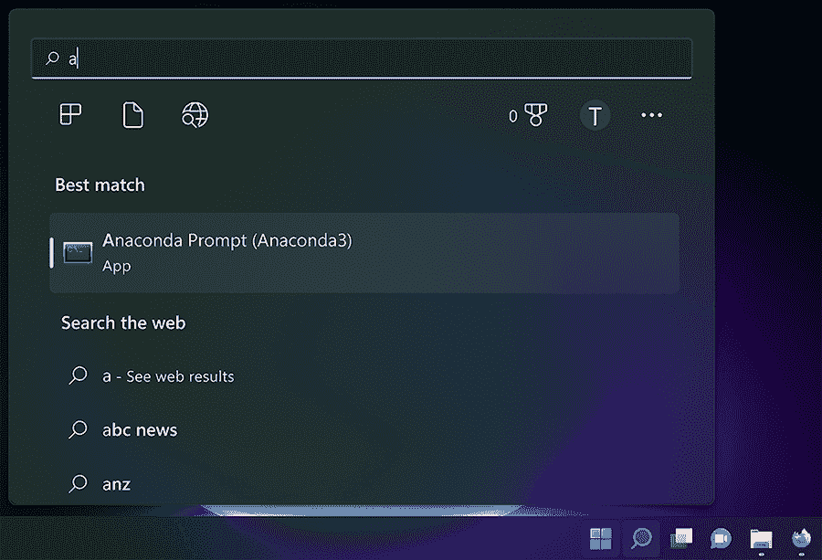
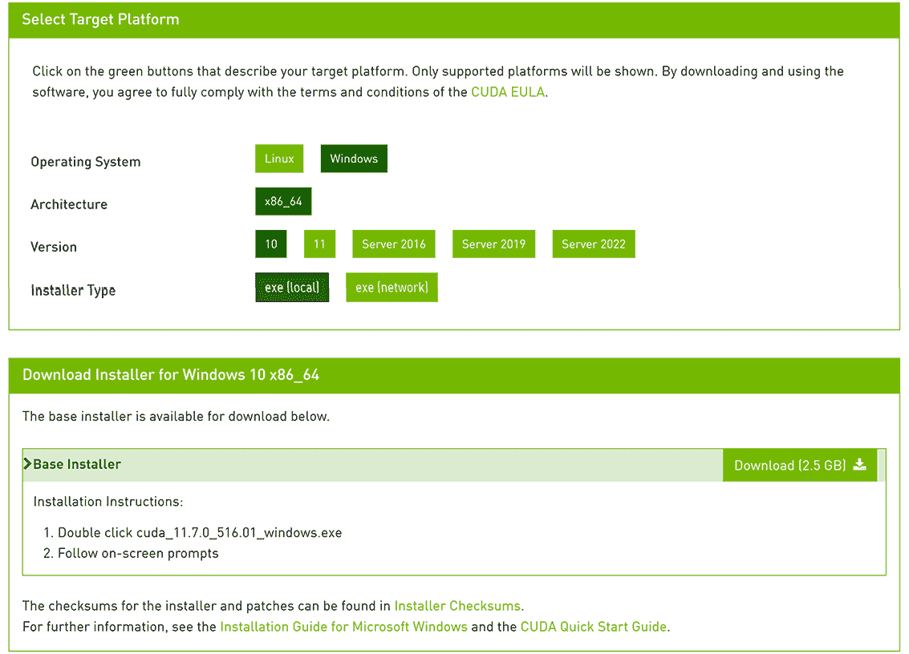
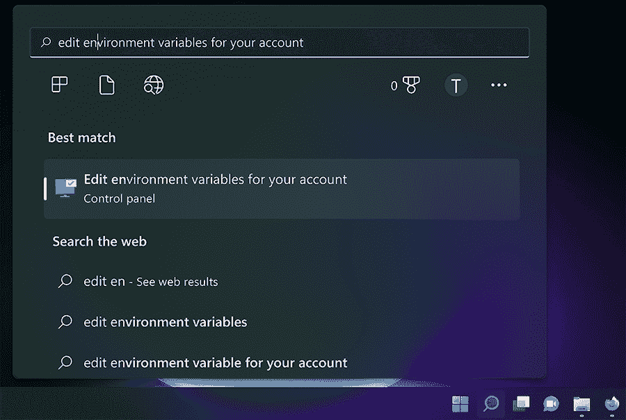
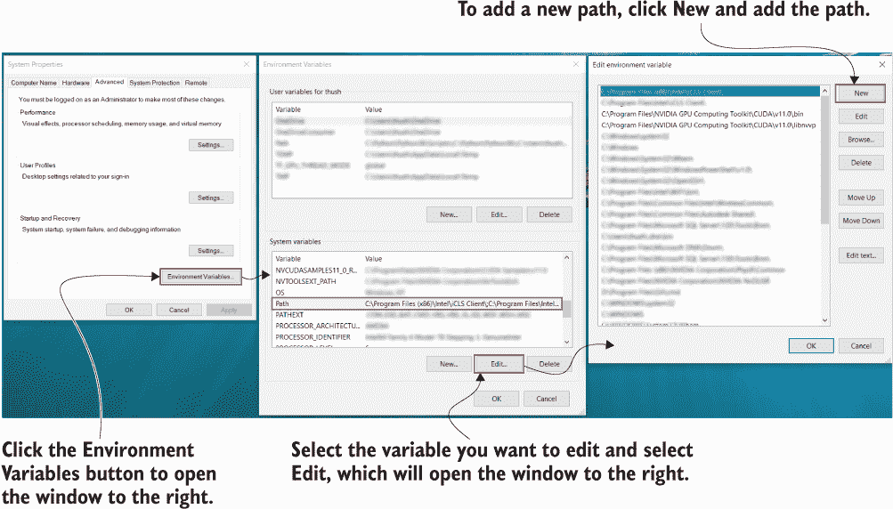
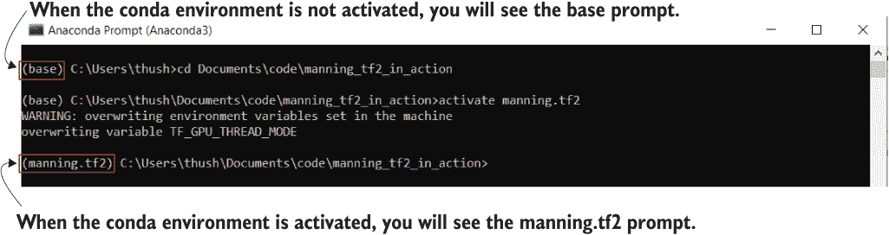
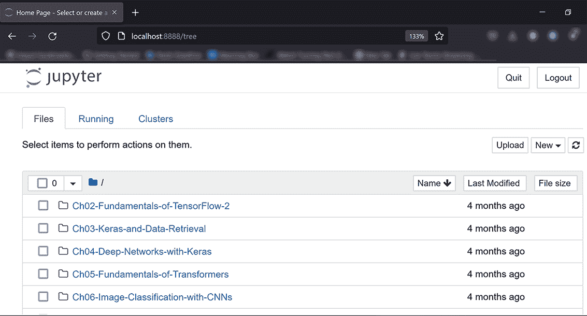
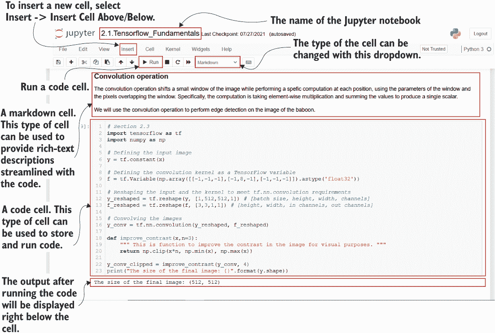

# 附录 A：设置环境

在这个附录中，您将配置计算机上的开发和运行时环境。提供了两个安装过程：一个用于基于 Unix 的环境，另一个用于 Windows 环境。请注意，我们将把 Unix 环境的讨论主要集中在 Ubuntu 上，而不是 MacOS 上。这是因为，对于机器学习和深度学习来说，Ubuntu 比 MacOS 更受欢迎，也得到了更好的支持。但是，我们将列出在 MacOS 上运行此项所需的资源。

## A.1 在基于 Unix 的环境中

我们的讨论将分为三个部分。在第一部分中，我们将讨论设置虚拟 Python 环境以安装运行代码所需的库的步骤。接下来，我们将讨论需要 GPU 支持的事项。最后，我们将讨论在 MacOS 上执行相同操作的情况。

### A.1.1 使用 Anaconda 发行版创建虚拟 Python 环境（Ubuntu）

在本节中，我们将讨论在 Ubuntu 中设置 conda 环境（通过 Anaconda 软件包创建的虚拟 Python 环境的术语）的步骤：

1.  在 Linux 系统上安装 Anaconda（[`docs.anaconda.com/anaconda/install/linux/`](https://docs.anaconda.com/anaconda/install/linux/)）。

1.  打开终端并用您喜欢的文本编辑器打开 ~/.bashrc 文件（例如，对于 vim，请键入 vim ~/.bashrc）。

1.  将以下行添加到文件末尾（带有您路径填充的占位符）：

    ```py
    if ! [[ "$PATH" == *"anaconda3"* ]]; then
      export PATH=${PATH}:<your anaconda3 installation path>/bin
    fi
    ```

1.  保存并关闭编辑器。

1.  打开一个新的命令行终端。

1.  运行 conda create -n manning.tf2 python=3.9 设置一个新的 conda 虚拟环境。

1.  （推荐）在您的主目录中创建一个名为 code 的文件夹，您将在其中存储本地代码，并使用 cd~/code 进入该文件夹。

1.  使用 git clone https://github.com/thushv89/manning_tf2_in_action.git 克隆托管在 Github 上的代码存储库。确保您的操作系统上已安装了 Git。

1.  使用 cd manning_tf2_in_action 进入克隆的代码存储库。

1.  使用以下命令激活环境

    1.  Anaconda < 4.4：source activate manning.tf2

    1.  Anaconda >= 4.4：conda activate manning.tf2

1.  使用 pip install -r requirements.txt 安装所需的库。

### A.1.2 GPU 支持的先决条件（Ubuntu）

安装 NVIDIA 驱动程序

确保您已安装了适用于您的 GPU 的最新 NVIDIA 图形驱动程序。您可以在 [`mng.bz/xnKe`](https://www.nvidia.com/download/index.aspx?lang=en-us) 找到驱动程序安装程序。如果您没有安装最新驱动程序，可能会在随后的步骤中遇到获取 TensorFlow GPU 支持的问题。

安装 CUDA

在本节中，我们将安装 CUDA 11.2，因为我们使用的 TensorFlow 版本高于 2.5.0。但是，您需要选择适合您 TensorFlow 版本的正确 CUDA 版本，如在 [`www.tensorflow.org/install/source#gpu`](https://www.tensorflow.org/install/source#gpu) 中指定的。最新 TensorFlow 版本的 CUDA 版本列在表 A.1 中。

表 A.1 最新 TensorFlow 版本支持的 CUDA 版本

| **TensorFlow 版本** | **CUDA 版本** |
| --- | --- |
| 2.4.x | 11.0 |
| 2.8.x | 11.2 |
| 2.9.x | 11.2 |

要安装所需的 CUDA 版本，请按照以下步骤操作：

1.  转到[`developer.nvidia.com/cuda-toolkit-archive`](https://developer.nvidia.com/cuda-toolkit-archive)页面。这将显示您可以下载的所有 CUDA 版本。

1.  点击所需的 CUDA 版本，您将看到类似于图 A.1 的页面。例如，图 A.1 描绘了用于 Ubuntu 发行版下载 CUDA 版本 11.7 的选项。

1.  确保您对下载的文件拥有执行权限（例如，在 Ubuntu 上，您可以通过终端运行 chmod a+x <路径到下载的文件>来提供执行权限）。

1.  通过命令行终端打开下载的软件包进行安装（例如，在 Ubuntu 上，只需转到下载目录并使用./<文件名>运行安装）。



图 A.1 CUDA 下载页面（Ubuntu 安装）

安装完成后，需要将安装路径添加到特殊的环境变量中：

1.  打开终端，使用您喜欢的文本编辑器（例如，对于 vim，请键入 vim~/.bashrc）打开~/.bashrc 文件。

1.  将以下行添加到文件末尾。例如，路径可能类似于/usr/local/cuda-11.0：

    ```py
    if ! [[ "$PATH" == *"cuda"* ]]; then
      export PATH=${PATH}:<path to CUDA>/bin
    fi

    export LD_LIBRARY_PATH=<path to CUDA>/lib64
    ```

1.  保存并关闭编辑器。

安装 CuDNN

与 CUDA 类似，需要仔细选择 cuDNN 版本。表 A.2 列出了最新 TensorFlow 版本支持的 cuDNN 版本。要获取完整列表，请访问[`www.tensorflow.org/install/source#gpu`](https://www.tensorflow.org/install/source#gpu)。

表 A.2 最新 TensorFlow 版本支持的 cuDNN 版本

| **TensorFlow 版本** | **cuDNN 版本** |
| --- | --- |
| 2.4.x | 8.0 |
| 2.6.x | 8.1 |
| 2.9.x | 8.1 |

首先，按照[`developer.nvidia.com/cudnn`](https://developer.nvidia.com/cudnn)上的说明和提示下载首选的 cuDNN 软件包。要安装 cuDNN，请按照[`mng.bz/AyQK`](http://mng.bz/AyQK)提供的指南进行操作。

### A.1.3 MacOS 注意事项

不幸的是，由于 NVIDIA 不认为 CUDA 是 CUDA 相关开发工作的主要开发环境，因此 CUDA 不再得到积极支持（[`mng.bz/ZAlO`](http://mng.bz/ZAlO)）。您仍然可以安装 Anaconda、创建虚拟环境并安装 TensorFlow 来进行开发工作。但是，您可能无法在 NVIDIA GPU 上运行执行 CUDA 实现的任何 TensorFlow 计算。

在 MacOS 上安装 Anaconda，请按照[`docs.anaconda.com/anaconda/install/mac-os/`](https://docs.anaconda.com/anaconda/install/mac-os/) 提供的指南进行操作。管理 conda 环境的指南在[`mng.bz/R4V0`](http://mng.bz/R4V0)中提供。

## A.2 在 Windows 环境中

在本节中，我们将讨论如何在 Windows 上安装虚拟环境，并确保 GPU 支持。

### A.2.1 创建一个虚拟 Python 环境（Anaconda）

此节讨论了在 Windows 主机上创建 conda 环境的步骤：

1.  在 Windows 系统上安装 Anaconda（[`docs.anaconda.com/anaconda/install/linux/`](https://docs.anaconda.com/anaconda/install/linux/)），这也将安装一个用于执行 Anaconda 特定命令的 CLI（命令行接口）。

1.  在开始菜单的搜索栏中输入 Anaconda Prompt，打开 Anaconda Prompt（如图 A.2 所示）。

1.  在终端中运行 conda create -n manning.tf2 python=3.9 以设置 conda 虚拟环境。

1.  （建议）在您的主文件夹（例如，C:\Users\<username>\Documents）中创建一个名为 code 的文件夹，在其中我们将本地存储代码，并使用 cd C:\Users\<username>\Documents 进入该文件夹。

1.  如果尚未安装，请为 Windows 安装 Git（例如，[`git-scm.com/download/win`](https://git-scm.com/download/win)）。

1.  使用 git clone https://github.com/thushv89/manning_tf2_in_action.git 克隆托管在 Github 上的代码库。

1.  使用 cd manning_tf2_in_action 进入克隆代码库。

1.  使用 conda activate manning.tf2 激活环境。

1.  使用 pip install -r requirements.txt 安装所需的库。



图 A.2：在 Windows 上打开 Anaconda Prompt

### A.2.2 GPU 支持的先决条件

在本节中，我们将讨论确保 GPU 被识别并正常工作的几个先决条件。

安装 NVIDIA 驱动程序

确保您已为您的 GPU 安装了最新的 NVIDIA 图形驱动程序。您可以在[`mng.bz/xnKe`](http://mng.bz/xnKe)找到驱动程序安装程序。如果您不安装最新的驱动程序，您可能会在获取 TensorFlow 的 GPU 支持的后续步骤中遇到问题。

安装 CUDA

在本节中，我们将安装 CUDA 11.2，因为我们使用的是高于 2.5.0 版本的 TensorFlow。但是，您需要选择适合您 TensorFlow 版本的正确 CUDA 版本，如[`www.tensorflow.org/install/source#gpu`](https://www.tensorflow.org/install/source#gpu)中所述。

要安装所需的 CUDA 版本，请完成以下步骤：

1.  转到[`developer.nvidia.com/cuda-toolkit-archive`](https://developer.nvidia.com/cuda-toolkit-archive)页面。这将显示您可以下载的所有 CUDA 版本。

1.  通过单击所需的 CUDA 版本，进入页面如图 A.3 所示。例如，图 A.3 描述了选择 Windows 操作系统获取 CUDA 11.7 的选项。

1.  以管理员身份运行下载的 .exe 文件，并按照提示进行操作。



图 A.3：CUDA 下载页面（Windows 安装）

安装完成后，需要将安装路径添加到特殊环境变量中：

1.  通过从开始菜单中选择“编辑系统环境变量”来打开“环境变量”窗口（图 A.4）。

1.  根据表 A.3 中的说明，将以下路径添加到路径变量中。 图 A.5 显示了如何在 Windows 上添加/修改环境变量。



图 A.4 打开系统属性窗口

表 A.3 需要添加和修改的路径变量

| PATH | <path to your CUDA installation>\bin |
| --- | --- |
| CUDA_PATH | <path to your CUDA installation> |



图 A.5 添加/修改路径变量的步骤

安装 CuDNN

与 CUDA 类似，需要仔细选择 cuDNN 版本。 表 A.4 列出了最新 TensorFlow 版本支持的 cuDNN 版本。 要获取完整列表，请访问[`www.tensorflow.org/install/source#gpu`](https://www.tensorflow.org/install/source#gpu)。

表 A.4 最新 TensorFlow 版本支持的 cuDNN 版本

| **TensorFlow version** | **cuDNN version** |
| --- | --- |
| 2.4.x | 8.1 |
| 2.5.x | 8.1 |
| 2.6.x | 8.0 |

首先，按照[`developer.nvidia.com/cudnn`](https://developer.nvidia.com/cudnn)上的说明和提示下载首选的 cuDNN 软件包。 要安装 cuDNN，请按照[`mng.bz/AyQK`](http://mng.bz/AyQK)上提供的说明操作。

## A.3 激活和停用 conda 环境

一旦 conda 环境被创建，完成以下步骤来激活或停用环境。

在 Windows 上（通过 Anaconda Prompt）（图 A.6）

1.  运行 conda activate <environment name>以激活环境。

1.  运行 conda deactivate 以停用当前活动环境。



图 A.6 激活 conda 环境

在 Ubuntu 上（通过终端）

1.  运行 source activate <environment name>（Anaconda < 4.4）或 conda activate <environment name>（Anaconda >= 4.4）以激活环境。

1.  运行 conda deactivate 以停用当前活动环境。

## A.4 运行 Jupyter Notebook 服务器并创建笔记本

我们将使用 Jupyter Notebook 服务器编写代码并执行它。 具体来说，我们将启动 Jupyter Notebook 服务器，它将为您提供一个仪表板（网页）以创建 Jupyter Notebook。 Jupyter Notebook 是一个交互式 Python 运行时环境。 这意味着您可以在 Jupyter Notebooks 中编写代码，并根据需要运行不同的代码片段。 这是因为代码可以分隔成所谓的*notebook cells*。 让我们看看如何启动 Jupyter Notebook 服务器并开始编码：

1.  打开命令行终端（例如，Ubuntu 终端或 Windows Anaconda Prompt），并激活虚拟环境 manning.tf2（如果尚未激活）。

1.  在 CLI 中使用 cd 命令进入您下载代码的目录（例如，cd C:\Users\<user>\Documents\code\manning_tf2_in_action）。

1.  在 CLI 中运行命令 jupyter notebook。 

1.  这将在您默认的浏览器上打开 Jupyter Notebook 服务器的首页。

1.  现在，您可以在该目录中浏览文件夹结构，打开任何笔记本，并运行它（图 A.7）。

1.  一旦打开了一个笔记本，您就可以进行各种操作，如创建代码单元格、运行代码单元格等（图 A.8）。



图 A.7 Jupyter Notebook 服务器创建的首页



图 A.8 Jupyter Notebook 概览

## A.5 杂项注释

为了让 TensorFlow/Keras 提供的绘图功能正常工作，您安装了一个名为 graphviz 的 Python 包。您可能需要将该库的路径（例如，如果您使用了 Anaconda 安装，则为 <path to Anaconda>\envs\manning.tf2\Library\bin\graphviz）添加到操作系统的 PATH 变量中。
