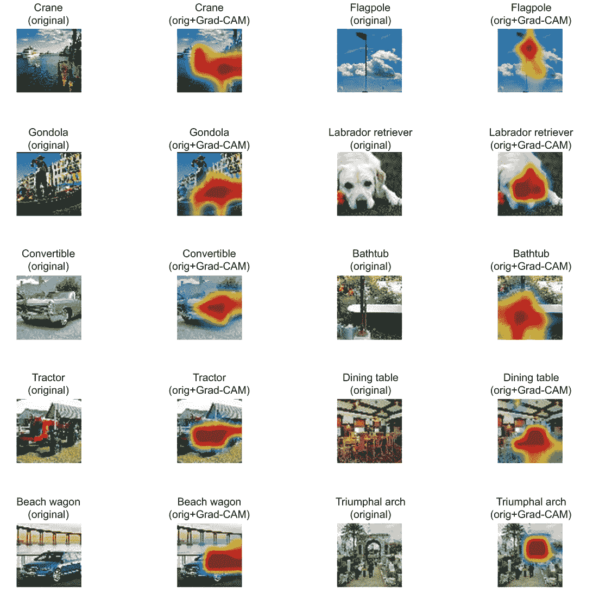
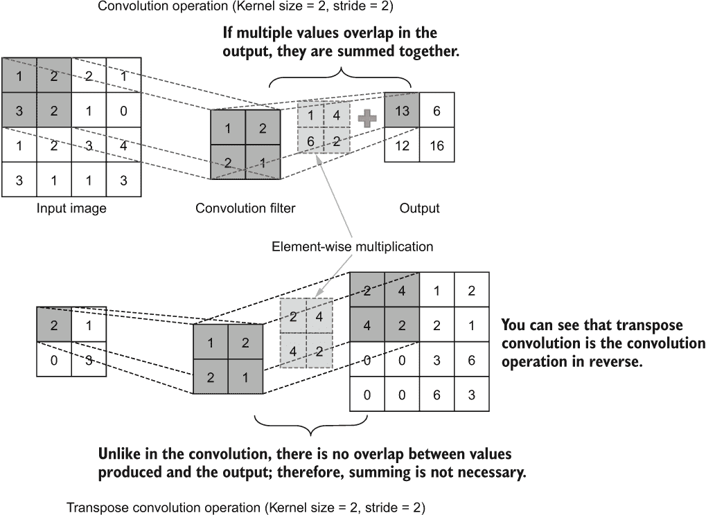
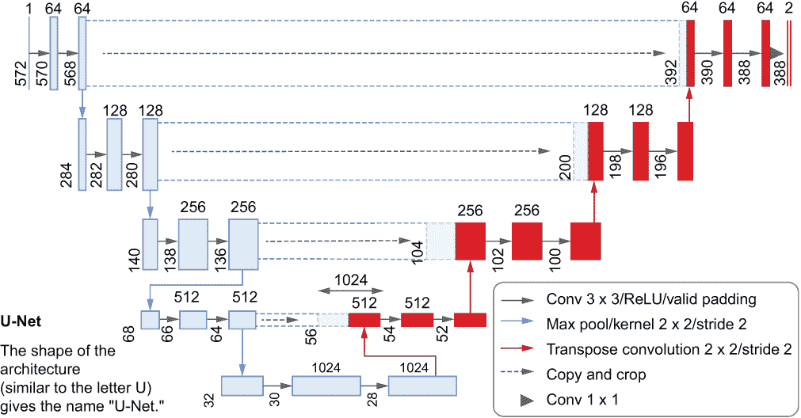
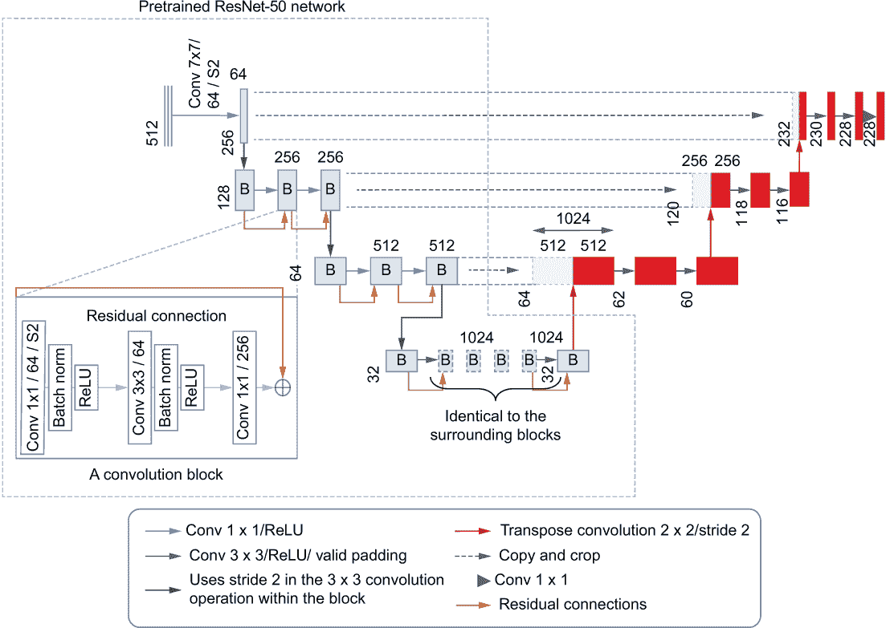

# 附录 B：计算机视觉

## B.1 Grad-CAM：解释计算机视觉模型

Grad-CAM（代表梯度类激活映射）在第七章介绍过，是由 Ramprasaath R. Selvaraju 等人在“Grad-CAM: Visual Explanations from Deep Networks via Gradient-based Localization”（[`arxiv.org/pdf/1610.02391.pdf`](https://arxiv.org/pdf/1610.02391.pdf)）中介绍的一种深度神经网络模型解释技术。深度网络以其难以解释的特性而臭名昭著，因此被称为*黑盒子*。因此，我们必须进行一些分析，并确保模型按预期工作。

让我们在第七章实现的模型上刷新一下记忆：一个名为 InceptionResNet v2 的预训练模型，其顶部是一个具有 200 个节点的 softmax 分类器（即我们的图像分类数据集 TinyImageNet 中的类别数量相同；请参阅下面的列表）。

清单 B.1 我们在第七章定义的 InceptionResNet v2 模型

```py
import tensorflow as tf
import tensorflow.keras.backend as K
from tensorflow.keras.applications import InceptionResNetV2
from tensorflow.keras.models import Sequential
from tensorflow.keras.layers import Input, Dense, Dropout

K.clear_session()

def get_inception_resnet_v2_pretrained():
    model = Sequential([                                       ❶
        Input(shape=(224,224,3)),                              ❷
        InceptionResNetV2(include_top=False, pooling='avg'),   ❸
        Dropout(0.4),                                          ❹
        Dense(200, activation='softmax')                       ❺
    ])
    loss = tf.keras.losses.CategoricalCrossentropy()
    adam = tf.keras.optimizers.Adam(learning_rate=0.0001)
    model.compile(loss=loss, optimizer=adam, metrics=['accuracy'])
    return model 

model = get_inception_resnet_v2_pretrained()
model.summary()
```

❶ 使用 Sequential API 定义一个模型。

❷ 定义一个输入层来接收大小为 224 × 224 × 3 的图像批次。

❸ 下载并使用预训练的 InceptionResNetV2 模型（不包括内置分类器）。

❹ 添加一个 dropout 层。

❺ 添加一个具有 200 个节点的新分类器层。

如果你打印此模型的摘要，你将得到以下输出：

```py
Model: "sequential"
_________________________________________________________________
Layer (type)                 Output Shape              Param #   
=================================================================
inception_resnet_v2 (Model)  (None, 1536)              54336736  
_________________________________________________________________
dropout (Dropout)            (None, 1536)              0         
_________________________________________________________________
dense (Dense)                (None, 200)               307400    
=================================================================
Total params: 54,644,136
Trainable params: 54,583,592
Non-trainable params: 60,544
_________________________________________________________________
```

如您所见，InceptionResNet v2 模型被视为我们模型中的单个层。换句话说，它是一个嵌套模型，其中外层模型（sequential）有一个内层模型（inception_resnet_v2）。但是我们需要更多的透明度，因为我们将要访问 inception_resnet_v2 模型内的特定层，以实现 Grad-CAM。因此，我们将“解开”或移除此嵌套，并且只描述模型的层。我们可以使用以下代码实现这一点：

```py
K.clear_session()

model = load_model(os.path.join('models','inception_resnet_v2.h5'))

def unwrap_model(model):
    inception = model.get_layer('inception_resnet_v2')
    inp = inception.input
    out = model.get_layer('dropout')(inception.output)
    out = model.get_layer('dense')(out)
    return Model(inp, out)   

unwrapped_model = unwrap_model(model)

unwrapped_model.summary()
```

实质上我们正在做的是取现有模型并略微更改其输入。在取得现有模型后，我们将输入更改为 inception_resnet_v2 模型的输入层。然后，我们定义一个新模型（本质上使用与旧模型相同的参数）。然后你将看到以下输出。没有更多的模型在模型内部：

```py
Model: "model"
___________________________________________________________________________
➥ ________________
Layer (type)                    Output Shape         Param #     Connected 
➥ to                     
===========================================================================
➥ ================
input_2 (InputLayer)            [(None, None, None,  0                                            
___________________________________________________________________________
➥ ________________
conv2d (Conv2D)                 (None, None, None, 3 864         
➥ input_2[0][0]                    
___________________________________________________________________________
➥ ________________
batch_normalization (BatchNorma (None, None, None, 3 96          
➥ conv2d[0][0]                     
___________________________________________________________________________
➥ ________________
activation (Activation)         (None, None, None, 3 0           
➥ batch_normalization[0][0]        
___________________________________________________________________________
➥ ________________

...
___________________________________________________________________________
➥ ________________
conv_7b (Conv2D)                (None, None, None, 1 3194880     
➥ block8_10[0][0]                  
___________________________________________________________________________
➥ ________________
conv_7b_bn (BatchNormalization) (None, None, None, 1 4608        
➥ conv_7b[0][0]                    
___________________________________________________________________________
➥ ________________
conv_7b_ac (Activation)         (None, None, None, 1 0           
➥ conv_7b_bn[0][0]                 
___________________________________________________________________________
➥ ________________
global_average_pooling2d (Globa (None, 1536)         0           
➥ conv_7b_ac[0][0]                 
___________________________________________________________________________
➥ ________________
dropout (Dropout)               (None, 1536)         0           
➥ global_average_pooling2d[0][0]   
___________________________________________________________________________
➥ ________________
dense (Dense)                   (None, 200)          307400      
➥ dropout[1][0]                    
===========================================================================
➥ ================
Total params: 54,644,136
Trainable params: 54,583,592
Non-trainable params: 60,544
___________________________________________________________________________
➥ ________________
```

接下来，我们将进行一次更改：向我们的模型引入一个新输出。请记住，我们使用功能 API 来定义我们的模型。这意味着我们可以在我们的模型中定义多个输出。我们需要的输出是 inception_resnet_v2 模型中最后一个卷积层产生的特征图。这是 Grad-CAM 计算的核心部分。您可以通过查看解开模型的模型摘要来获得最后一个卷积层的层名称：

```py
last_conv_layer = 'conv_7b' # This is the name of the last conv layer of the model

grad_model = Model(
    inputs=unwrapped_model.inputs, 
    outputs=[
        unwrapped_model.get_layer(last_conv_layer).output,
        unwrapped_model.output
    ]    
)
```

有了我们的模型准备好后，让我们转向数据。我们将使用验证数据集来检查我们的模型。特别地，我们将编写一个函数（见清单 B.2）来接收以下内容：

+   image_path（str）- 数据集中图像的路径。

+   val_df（pd.DataFrame）—一个包含从图像名称到 wnid（即 WordNet ID）的映射的 pandas 数据框。请记住，wnid 是用于识别特定对象类的特殊编码。

+   class_indices（dict）—一个 wnid（字符串）到类别（0-199 之间的整数）的映射。这保留了关于哪个 wnid 在模型的最终输出层中由哪个索引表示的信息。

+   words（pd.DataFrame）—一个包含从 wnid 到类别的可读描述的映射的 pandas 数据框。

清单 B.2 检索转换后的图像、类别索引和人类可读标签

```py
img_path = 'data/tiny-imagenet-200/val/images/val_434.JPEG'

val_df = pd.read_csv(                                                          ❶
    os.path.join('data','tiny-imagenet-200', 'val', 'val_annotations.txt'),
    sep='\t', index_col=0, header=None
)

with open(os.path.join('data','class_indices'),'rb') as f:                     ❷
    class_indices = pickle.load(f)
words = pd.read_csv(                                                           ❸
    os.path.join('data','tiny-imagenet-200', 'words.txt'), 
    sep='\t', index_col=0, header=None
)

def get_image_class_label(img_path, val_df, class_indices, words):
    """ Returns the normalized input, class (int) and the label name for a given image"""

    img = np.expand_dims(                                                      ❹
        np.asarray(
            Image.open(img_path).resize((224,224)                              ❺
    )

    img /= 127.5                                                               ❻
    img -= 1                                                                   ❻

    if img.ndim == 3:
        img = np.repeat(np.expand_dims(img, axis=-1), 3, axis=-1)              ❼

    _, img_name = os.path.split(img_path)

    wnid = val_df.loc[img_name,1]                                              ❽
    cls = class_indices[wnid]                                                  ❾
    label = words.loc[wnid, 1]                                                 ❿
    return img, cls, label

# Test the function with a test image
img, cls, label = get_image_class_label(img_path, val_df, class_indices, words)⓫
```

❶ 读取 val_annotations.txt。这将创建一个数据框，其中包含从图像文件名到 wnid（即 WordNet ID）的映射。

❷ 加载将 wnid 映射到类索引（整数）的类索引。

❸ 这将创建一个数据框，其中包含从 wnid 到类描述的映射。

❹ 加载由文件路径给出的图像。首先，我们添加一个额外的维度来表示批次维度。

❺ 将图像调整大小为 224×224 大小的图像。

❻ 将图像像素值调整到[-1, 1]的范围内。

❼ 如果图像是灰度的，则在通道维度上将图像重复三次，以与 RGB 图像具有相同的格式。

❽ 获取图像的 wnid。

❾ 获取图像的类别索引。

❿ 获取类的字符串标签。

⓫ 对一个示例图像运行该函数。

get_image_class_label()函数使用指定的参数并加载由 image_path 给出的图像。首先，我们将图像调整大小为 224×224 大小的图像。我们还在开始时添加了一个额外的维度来表示图像作为一个图像批次。然后，它执行特定的数值转换（即，逐元素除以 127.5 并减去 1）。这是用于训练 InceptionResNet v2 模型的特殊转换。然后，我们使用传递给函数的数据框和 class_indices 获取该类的类索引（即，整数）和人类可读的标签。最后，它返回转换后的图像、类索引和图像所属类的标签。

下一个清单显示了如何为图像计算 Grad-CAMs。我们将使用 10 个图像分别计算 Grad-CAMs。

清单 B.3 为 10 个图像计算 Grad-CAM

```py
# Define a sample probe set to get Grad-CAM
image_fnames = [
    os.path.join('data','tiny-imagenet-200', 'val','images',f) \
    for f in [
        'val_9917.JPEG', 'val_9816.JPEG', 'val_9800.JPEG', 'val_9673.JPEG', 
➥ 'val_9470.JPEG',
        'val_4.JPEG', 'val_127.JPEG', 'val_120.JPEG', 'val_256.JPEG', 
➥ 'val_692.JPEG'
    ]
]

grad_info = {}
for fname in image_fnames:                                                      ❶
    img, cls, label = get_image_class_label(fname, val_df, class_indices, words)❷

    with tf.GradientTape() as tape:                                             ❸
        conv_output, preds = grad_model(img)                                    ❸
        loss = preds[:, cls]                                                    ❹

    grads = tape.gradient(loss, conv_output)                                    ❺

    weights = tf.reduce_mean(grads, axis=(1, 2), keepdims=True)                 ❻
    grads *= weights                                                            ❻

    grads = tf.reduce_sum(grads, axis=(0,3))                                    ❼
    grads = tf.nn.relu(grads)                                                   ❼

    grads /= tf.reduce_max(grads)                                               ❽
    grads = tf.cast(grads*255.0, 'uint8')                                       ❽

    grad_info[fname] = {'image': img, 'class': cls, 'label':label, 'gradcam': 
➥ grads}                                                                       ❾
```

❶ 获取每个图像的标准化输入、类别（整数）和标签（字符串）。

❷ 在 GradientTape 环境中计算模型的输出。

❸ 这将使我们能够稍后访问在计算过程中出现的梯度。

❹ 我们只考虑输入图像的类索引对应的损失。

❺ 获取与最后一个卷积特征图相关的损失的梯度。

❻ 计算并应用权重。

❼ 将特征图折叠为单个通道，以获得最终的热图。

❽ 将值归一化为 0-255 的范围内。

❾ 将计算出的 GradCAMs 存储在字典中以便稍后可视化。

要计算一张图像的 Grad-CAM，我们遵循以下步骤。首先，我们获得给定图像路径的转换图像、类索引和标签。

接下来是此计算的最重要步骤！您知道，给定一张图像和一个标签，最终损失被计算为所有可用类别的类特定损失的总和。也就是说，如果您想象一个独热编码的标签和模型输出的概率向量，我们计算每个输出节点之间的损失。这里每个节点代表一个单独的类别。为了计算梯度映射，我们首先仅针对该图像的真实标签计算类特定损失的梯度，关于最后一个卷积层的输出。这给出了一个与最后一个卷积层的输出大小相同的张量。重要的是注意我们使用的典型损失和这里使用的损失之间的区别。通常，我们将所有类别的损失求和，而在 Grad-CAM 中，我们仅考虑与输入的真实类对应的特定节点的损失。

注意我们如何计算梯度。我们使用了一种称为 GradientTape 的东西（*[`mng.bz/wo1Q`](http://mng.bz/wo1Q)*）。这是 TensorFlow 中的一项创新技术。每当在 GradientTape 的上下文中计算某些东西时，它将记录所有这些计算的梯度。这意味着当我们在 GradientTape 的上下文中计算输出时，我们可以稍后访问该计算的梯度。

然后我们进行一些额外的转换。首先，我们计算输出特征图的每个通道的权重。这些权重简单地是该特征图的均值。然后将特征图的值乘以这些权重。然后我们对所有通道的输出进行求和。这意味着我们将得到一个宽度和高度都为一个通道的输出。这本质上是一个热图，其中高值表示在给定像素处更重要。为了将负值剪切为 0，然后在输出上应用 ReLU 激活。作为最终的归一化步骤，我们将所有值带到 0-255 的范围，以便我们可以将其作为热图叠加在实际图像上。然后只需使用 matplotlib 库绘制图像，并将我们生成的 Grad-CAM 输出叠加在图像上。如果您想查看此代码，请参阅 Ch07-Improving-CNNs-and-Explaining/7.3.Interpreting_CNNs_ Grad-CAM.ipynb 笔记本。最终输出将如图 B.1 所示。



图 B.1 几个探测图像的 Grad-CAM 输出可视化。图像中越红的区域，模型就越关注该图像的那部分。您可以看到我们的模型已经学会了理解一些复杂的场景，并分离出需要关注的模型。

## B.2 图像分割：U-Net 模型

在第八章中，我们讨论了 DeepLab v3：一个图像分割模型。在本节中，我们将讨论另一个被称为 U-Net 的图像分割模型。它的架构与 DeepLab 模型不同，并且在实际中非常常用。因此，这是一个值得学习的模型。

### B.2.1 理解和定义 U-Net 模型

U-Net 模型本质上是两个镜像反射的全卷积网络，充当编码器和解码器，还有一些额外的连接，将编码器的部分连接到解码器的部分。

U-Net 的背景

U-Net 是在论文“U-Net: Convolution Networks for Biomedical Image Segmentation”([`arxiv.org/pdf/1505.04597.pdf`](https://arxiv.org/pdf/1505.04597.pdf))中被介绍的，其起源于生物医学图像分割。U-Net 的名称源自于网络的形状。它仍然是生物学/医学领域分割任务中常用的选择，并且已经被证明在更一般的任务中也能很好地工作。

首先，我们将看一下原始的 U-Net 模型，该模型在论文中被介绍。然后，我们稍微调整我们的讨论方向，使其更适合当前问题。原始模型使用的是一个 572 × 572 × 1 大小的图像（即灰度图像），并输出一个 392 × 392 × 2 大小的图像。该网络经过训练，可以识别/分割细胞边界。因此，输出中的两个通道表示像素是否属于细胞边界的二进制输出。

编码器由多个下采样模块组成，逐渐对输入进行下采样。一个下采样模块包括两个卷积层和一个最大池化层。具体来说，一个下采样模块包括：

+   一个 3 × 3 卷积层（valid padding）× 2

+   一个 2 × 2 最大池化层（除了最后一个下采样模块）

一系列这样的下采样层将大小为 572 × 572 × 1 的输入转换为大小为 28 × 28 × 1024 的输出。

接下来，解码器由多个上采样层组成。具体来说，每个解码器上采样模块包括：

+   一个 2 × 2 转置卷积层

+   一个 3 × 3 卷积层（valid padding）× 2

你可能已经想知道，什么是转置卷积层？转置卷积是反向计算卷积层中发生的计算得到的结果。转置卷积不是缩小输出的卷积运算（即使用步长），而是增加输出的大小（即上采样输入）。这也被称为*分数步长*，因为使用转置卷积时，增加步长会产生更大的输出。如图 B.2 所示。



图 B.2 标准卷积与转置卷积的对比。标准卷积的正向步长会导致输出更小，而转置卷积的正向步长会导致输出更大的图像。

最后，有跳跃连接将编码器的中间层连接到解码器的中间层。这是一个重要的架构设计，因为它为解码器提供了所需的空间/上下文信息，否则这些信息将会丢失。特别地，编码器的第 i^(th)级输出与解码器的第 n-i^(th)级输入连接起来（例如，第一级的输出[大小为 568 × 568 × 64]被连接到解码器的最后一级输入上 [大小为 392 × 392 × 64]；图 B.3）。为了做到这一点，编码器的输出首先需要稍微裁剪一下，以匹配相应的解码器层的输出。



图 B.3 原始 U-Net 模型。浅色块代表编码器，深色块代表解码器。垂直数字表示给定位置的输出大小（高度和宽度），顶部的数字表示滤波器数量。

### B.2.2 比编码器更好的是什么？一个预训练的编码器

如果你直接将原始网络用于 Pascal VOC 数据集，你可能会对其性能感到非常失望。这种行为背后可能有几个原因：

+   Pascal VOC 中的数据比原始 U-Net 设计的要复杂得多。例如，与黑白图像中包含简单细胞结构不同，我们有包含现实世界复杂场景的 RGB 图像。

+   作为一个完全卷积网络，U-Net 具有很高的正则化程度（由于参数数量较少）。这个参数数量不足以以足够的准确度解决我们所面临的复杂任务。

+   作为一个从随机初始化开始的网络，它需要学会在没有来自预训练模型的预训练知识的情况下解决任务。

按照这种推理，让我们讨论一下我们将对原始 U-Net 架构进行的一些改变。我们将实现一个具有

+   预训练的编码器

+   每个解码器模块中的滤波器数量更多

我们将使用的预训练编码器是一个 ResNet-50 模型（[`arxiv.org/pdf/1512.03385.pdf`](https://arxiv.org/pdf/1512.03385.pdf)）。几年前，它是计算机视觉社区中引起轰动的开创性残差网络之一。我们只会简单地介绍 ResNet-50，因为我们将在 DeepLab v3 模型的部分详细讨论该模型。ResNet-50 模型由多个卷积块组成，后跟一个全局平均池化层和一个具有 softmax 激活的完全连接的最终预测层。卷积块是该模型的创新部分（在图 B.4 中用 B 表示）。原始模型有 16 个卷积块组织成 5 组。我们将仅使用前 13 个块（即前 4 组）。单个块由三个卷积层（步幅为 2 的 1 × 1 卷积层、3 × 3 卷积层和 1 × 1 卷积层）、批量归一化和残差连接组成，如图 B.4 所示。我们在第七章深入讨论了残差连接。



图 B.4 修改后的 U-Net 架构（最佳查看彩色）。此版本的 U-Net 将 ResNet-50 模型的前四个块作为编码器，并将解码器规格（例如，滤波器数量）增加到与匹配的编码器层的规格相匹配。

实现修改后的 U-Net

通过对模型及其不同组件进行深入的概念理解，是时候在 Keras 中实现它了。我们将使用 Keras 函数式 API。首先，我们定义网络的编码器部分：

```py
inp = layers.Input(shape=(512, 512, 3))
# Defining the pretrained resnet 50 as the encoder
encoder = tf.keras.applications.ResNet50 (
    include_top=False, input_tensor=inp,pooling=None
)
```

接下来，我们讨论解码器的花哨之处。解码器由多个上采样层组成，这些层具有两个重要功能：

+   将输入上采样到更大的输出

+   复制、裁剪和连接匹配的编码器输入

下面的列表中显示的函数封装了我们概述的计算。

列表 B.4 修改后的 UNet 解码器的上采样层

```py
def upsample_conv(inp, copy_and_crop, filters):
    """ Up sampling layer of the U-net """

    # 2x2 transpose convolution layer
    conv1_out = layers.Conv2DTranspose(
        filters, (2,2), (2,2), activation='relu'
    )(inp)
    # Size of the crop length for one side
    crop_side = int((copy_and_crop.shape[1]-conv1_out.shape[1])/2)

    # Crop if crop side is > 0
    if crop_side > 0:
        cropped_copy = layers.Cropping2D(crop_side)(copy_and_crop)
    else:
        cropped_copy = copy_and_crop

    # Concat the cropped encoder output and the decoder output
    concat_out = layers.Concatenate(axis=-1)([conv1_out, cropped_copy])

    # 3x3 convolution layer
    conv2_out = layers.Conv2D(
        filters, (3,3), activation='relu', padding='valid'
    )(concat_out)

    # 3x3 Convolution layer
    out = layers.Conv2D(
        filters, (3,3), activation='relu', padding='valid'
    )(conv2_out)

    return out
```

让我们分析我们编写的函数。它接受以下参数：

+   输入—层的输入

+   copy_and_crop—从编码器复制过来的输入

+   filters—执行转置卷积后的输出滤波器数量

首先，我们执行转置卷积，如下所示：

```py
conv1_out = layers.Conv2DTranspose(
                    filters=filters, kernel_size=(2,2), 
                    strides=(2,2), activation='relu'
    )(inp)
```

Conv2DTranspose 的语法与我们多次使用的 Conv2D 相同。它有一些滤波器、卷积核大小（高度和宽度）、步长（高度和宽度）、激活函数和填充（默认为 valid）。我们将根据转置卷积输出的大小和编码器的输入来计算裁剪参数。然后，根据需要使用 Keras 层 Cropping2D 进行裁剪：

```py
crop_side = int((copy_and_crop.shape[1]-conv1_out.shape[1])/2)
if crop_side > 0:
        cropped_copy = layers.Cropping2D(crop_side)(copy_and_crop)
    else:
        cropped_copy = copy_and_crop
```

在这里，我们首先计算从一侧裁剪多少，方法是从上采样输出 conv1_out 中减去编码器的大小。然后，如果大小大于零，则通过将 crop_side 作为参数传递给 Cropping2D Keras 层来计算 cropped_copy。然后将裁剪后的编码器输出和上采样的 conv1_out 连接起来以产生单个张量。这通过两个具有 ReLU 激活和有效填充的 3 × 3 卷积层产生最终输出。我们现在完全定义解码器（请参见下一个清单）。解码器由三个上采样层组成，这些层使用前一层的输出以及复制的编码器输出。

清单 B.5 修改后的 U-Net 模型的解码器

```py
def decoder(inp, encoder):
    """ Define the decoder of the U-net model """

    up_1 = upsample_conv(inp, encoder.get_layer("conv3_block4_out").output, 
➥ 512) # 32x32

    up_2 = upsample_conv(up_1, 
➥ encoder.get_layer("conv2_block3_out").output, 256) # 64x64

    up_3 = upsample_conv(up_2, encoder.get_layer("conv1_relu").output, 64) 
➥ # 128 x 128    

    return up_3
```

跨越预定义模型的中间输出的复制不是我们以前做过的事情。因此，值得进一步调查。我们不能够诉诸于先前定义的代表编码器输出的变量，因为这是一个通过 Keras 下载的预定义模型，没有用于创建模型的实际变量的引用。

但是访问中间输出并使用它们创建新连接并不那么困难。你只需要知道要访问的层的名称即可。这可以通过查看 encoder.summary() 的输出来完成。例如，在这里（根据图 B.4），我们获得了 conv3、conv2 和 conv1 模块的最后输出。要获取 conv3_block4_out 的输出，你需要做的就是

```py
encoder.get_layer("conv3_block4_out").output
```

将其传递给我们刚刚定义的上采样卷积层。能够执行这样复杂的操作证明了 Keras 函数 API 有多么灵活。最后，你可以在下一个清单中的函数 unet_pretrained_encoder() 中定义完整修改后的 U-Net 模型。

清单 B.6 完整修改后的 U-Net 模型

```py
def unet_pretrained_encoder():
    """ Define a pretrained encoder based on the Resnet50 model """

    # Defining an input layer of size 384x384x3
    inp = layers.Input(shape=(512, 512, 3))
    # Defining the pretrained resnet 50 as the encoder
    encoder = tf.keras.applications.ResNet50 (
        include_top=False, input_tensor=inp,pooling=None
    )

    # Encoder output # 8x8
    decoder_out = decoder(encoder.get_layer("conv4_block6_out").output, encoder)

    # Final output of the model (note no activation)
    final_out = layers.Conv2D(num_classes, (1,1))(decoder_out)    
    # Final model
    model = models.Model(encoder.input, final_out)
    return model
```

这里发生的情况非常清楚。我们首先定义一个大小为 512 × 512 × 3 的输入，将其传递给编码器。我们的编码器是一个没有顶部预测层或全局池化的 ResNet-50 模型。接下来，我们定义解码器，它将 conv4_block6_out 层的输出作为输入（即 ResNet-50 模型的 conv4 块的最终输出），然后逐渐使用转置卷积操作上采样它。此外，解码器复制、裁剪和连接匹配的编码器层。我们还定义一个产生最终输出的 1 × 1 卷积层。最后，我们使用 Keras 函数 API 定义端到端模型。
