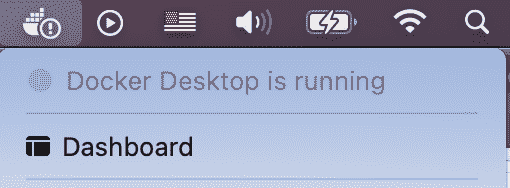
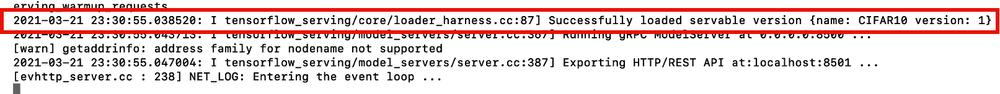

# 第九章：为 TensorFlow 模型提供服务

如果您按顺序阅读本书中的章节，现在您已经了解了如何处理数据工程流水线、构建模型、启动训练例程、在每个时代检查点模型，甚至对测试数据进行评分。到目前为止，所有这些任务大多都被捆绑在一起以进行教学。然而，在本章中，您将更多地了解如何根据保存的格式为 TensorFlow 模型提供服务。

这一章与之前的章节之间的另一个重要区别是，您将学习处理测试数据的数据工程编码模式。以前，您看到测试数据和训练数据在相同的运行时转换。然而，作为一个机器学习工程师，您还必须考虑到您的模型部署的情况。

想象一下，您的模型已经加载到 Python 运行时并准备就绪。您有一批样本或一个样本。您需要对输入数据进行哪些操作，以便模型可以接受它并返回预测？换句话说：您有一个模型和原始测试数据；您如何实现转换原始数据的逻辑？在本章中，您将通过几个示例了解如何为模型提供服务。

# 模型序列化

TensorFlow 模型可以以两种不同的本机格式（没有任何优化）保存：HDF5（h5）或 protobuf（pb）。这两种格式都是 Python 和其他编程语言中的标准数据序列化（保存）格式，用于持久化对象或数据结构；它们不是特定于 TensorFlow 甚至 ML 模型的。在 TensorFlow 2.0 之前，pb 是唯一可用的本机格式。随着 TensorFlow 2.0 的到来，其中 Keras API 是未来的事实高级 API，h5 已成为 pb 的替代品。

如今，这两种格式都可以用于部署，特别是在各种公共云提供商中。这是因为每个云提供商现在都有自己的 API 来包装模型。只要模型保存在您的工作空间中，您就可以通过诸如 RESTful（表述性状态转移）API 之类的网络服务来访问它，这些 API 利用 HTTP 方法在网络上进行请求。因此，无论格式如何，您的模型都可以通过来自客户端程序的 RESTful API 调用进行服务。

让我们从上一章中使用 CIFAR-10 数据构建的图像分类模型开始。如果您还没有完成那一章，可以使用以下代码片段快速构建和训练图像分类器。（顺便说一句，这里的代码是在 Google Colab 中使用一个 GPU 开发的。）

首先导入所有必要的库：

```py
import tensorflow as tf
from tensorflow.keras import datasets, layers, models
import numpy as np
import matplotlib.pylab as plt
import os
from datetime import datetime
```

加载并标准化图像：

```py
(train_images, train_labels), (test_images, test_labels) = 
datasets.cifar10.load_data()

train_images, test_images = train_images / 255.0, 
 test_images / 255.0
```

定义您的图像标签：

```py
CLASS_NAMES = ['airplane', 'automobile', 'bird', 'cat',
               'deer','dog', 'frog', 'horse', 'ship', 'truck']
```

将原始图像转换为数据集。由于测试图像的分区可用，以下代码将该分区中的前 500 个图像分离出来，用作每个训练周期结束时用于验证数据集，并将其余部分保留为测试数据集。所有训练图像都被转换为训练数据集：

```py
validation_dataset = tf.data.Dataset.from_tensor_slices(
(test_images[:500], test_labels[:500]))

test_dataset = tf.data.Dataset.from_tensor_slices(
(test_images[500:], test_labels[500:]))

train_dataset = tf.data.Dataset.from_tensor_slices(
(train_images, train_labels))
```

为确保您知道每个数据集的样本大小，请遍历它们并显示样本大小：

```py
train_dataset_size = len(list(train_dataset.as_numpy_iterator()))
print('Training data sample size: ', train_dataset_size)

validation_dataset_size = len(list(validation_dataset.
as_numpy_iterator()))
print('Validation data sample size: ', validation_dataset_size)

test_dataset_size = len(list(test_dataset.as_numpy_iterator()))
print('Test data sample size: ', test_dataset_size)
```

您应该看到以下输出：

```py
Training data sample size:  50000
Validation data sample size:  500
Test data sample size:  9500
```

为分布式训练定义一个分发策略：

```py
strategy = tf.distribute.MirroredStrategy()
print('Number of devices: {}'.format(
strategy.num_replicas_in_sync))
```

您应该看到一个可用的 GPU：

```py
Number of devices: 1
```

现在设置训练的批次大小：

```py
BUFFER_SIZE = 10000
BATCH_SIZE_PER_REPLICA = 64
BATCH_SIZE = BATCH_SIZE_PER_REPLICA * strategy.num_replicas_in_sync
```

将批次应用于每个数据集，并在评估模型的准确性之前计算每个训练周期的批次数：

```py
train_dataset = train_dataset.repeat().shuffle(BUFFER_SIZE).batch(
                BATCH_SIZE)

validation_dataset = validation_dataset.shuffle(BUFFER_SIZE).batch(
                validation_dataset_size)

test_dataset = test_dataset.batch(test_dataset_size)

STEPS_PER_EPOCH = train_dataset_size // BATCH_SIZE_PER_REPLICA
VALIDATION_STEPS = 1
```

创建一个名为`build_model`的函数来定义模型架构，并在分布式训练策略范围内使用分类损失函数、优化器和指标对其进行编译：

```py
def build_model():
  with strategy.scope():
    model = tf.keras.Sequential([
      tf.keras.layers.Conv2D(32, kernel_size=(3, 3), 
        activation='relu', 
        name = 'conv_1',
        kernel_initializer='glorot_uniform', 
        padding='same', 
        input_shape = (32,32,3)),
      tf.keras.layers.MaxPooling2D(pool_size=(2, 2)),
      tf.keras.layers.Conv2D(64, kernel_size=(3, 3), 
        activation='relu', 
        name = 'conv_2',
        kernel_initializer='glorot_uniform', 
        padding='same'),
      tf.keras.layers.MaxPooling2D(pool_size=(2, 2)),
      tf.keras.layers.Flatten(name = 'flat_1'),
      tf.keras.layers.Dense(256, activation='relu', 
kernel_initializer='glorot_uniform', name = 'dense_64'),
      tf.keras.layers.Dense(10, activation='softmax', 
        name = 'custom_class')
    ])
    model.build([None, 32, 32, 3])

    model.compile(
      loss=tf.keras.losses.SparseCategoricalCrossentropy(
           from_logits=True),
      optimizer=tf.keras.optimizers.Adam(),
      metrics=['accuracy'])
    return model
```

现在通过调用`build_model`创建一个模型实例：

```py
model = build_model()
```

为文件路径定义一个别名，并保存模型检查点：

```py
MODEL_NAME = 'myCIFAR10-{}'.format(datetime.now().strftime(
"%Y%m%d-%H%M%S"))
```

使用`print`语句显示模型名称格式：

```py
print(MODEL_NAME)
myCIFAR10-20210319-214456
```

现在设置您的检查点目录：

```py
checkpoint_dir = './' + MODEL_NAME
checkpoint_prefix = os.path.join(checkpoint_dir, 
    "ckpt-{epoch}")
print(checkpoint_prefix)
```

检查点目录将设置为具有以下模式的目录：

```py
./myCIFAR10-20210319-214456/ckpt-{epoch}
```

在您当前的目录级别中，您将看到一个包含以*ckpt-{epoch}*为前缀的权重文件的*myCIFAR10-20210319-214456*目录，其中*{epoch}*是 epoch 编号。

接下来，定义一个检查点对象。只有在验证数据上的模型性能比上一个 epoch 有所改善时，才在一个 epoch 结束时保存模型权重。将权重保存在相同的目录（*myCIFAR10-20210319-214456*）中，以便最新保存的检查点权重来自最佳 epoch。这样可以节省时间，因为您不需要确定哪个 epoch 呈现了最佳模型。确保`save_weights_only`和`save_best_only`都设置为 True：

```py
myCheckPoint = tf.keras.callbacks.ModelCheckpoint(
    filepath=checkpoint_prefix,
    monitor='val_accuracy',
    mode='max',
    save_weights_only = True,
    save_best_only = True
    )
```

现在将前面的检查点定义传递到列表中，这是`fit`函数所需的：

```py
myCallbacks = [
myCheckPoint
]
```

然后启动训练过程：

```py
model.fit(
    train_dataset,
    epochs=30,
    steps_per_epoch=STEPS_PER_EPOCH,
    validation_data=validation_dataset,
    validation_steps=VALIDATION_STEPS,
    callbacks=myCallbacks)
```

在训练过程中，您可以检查输出。您可能会看到类似于这样的内容：

```py
Epoch 7/30
781/781 [==============================] - 4s 6ms/step 
loss: 0.0202 - accuracy: 0.9972 - val_loss: 10.5573 
val_accuracy: 0.6900
Epoch 8/30
781/781 [==============================] - 4s 6ms/step 
loss: 0.0217 - accuracy: 0.9967 - val_loss: 10.4517 
val_accuracy: 0.7000
Epoch 9/30
781/781 [==============================] - 5s 6ms/step 
loss: 0.0203 - accuracy: 0.9971 - val_loss: 10.4553 
val_accuracy: 0.7080
Epoch 10/30
781/781 [==============================] - 5s 6ms/step 
loss: 0.0232 - accuracy: 0.9966 - val_loss: 11.3774 
val_accuracy: 0.6600
…
Epoch 30/30
781/781 [==============================] - 5s 6ms/step
loss: 0.0221 - accuracy: 0.9971 - val_loss: 11.9106 
val_accuracy: 0.6680
<tensorflow.python.keras.callbacks.History at 0x7fd447ce9a50>
```

在这个例子中，最高的验证准确率出现在第 9 个 epoch，其中`val_accuracy`为 0.7080。

检查检查点目录：

```py
!ls -lrt {checkpoint_dir}
```

您将看到它的内容：

```py
total 87896
-rw-r--r-- 1 root root 12852661 Mar 19 21:45 
ckpt-1.data-00000-of-00001
-rw-r--r-- 1 root root     2086 Mar 19 21:45 ckpt-1.index
-rw-r--r-- 1 root root 12852661 Mar 19 21:45 
ckpt-2.data-00000-of-00001
-rw-r--r-- 1 root root     2086 Mar 19 21:45 ckpt-2.index
-rw-r--r-- 1 root root 12852661 Mar 19 21:45 
ckpt-3.data-00000-of-00001
-rw-r--r-- 1 root root     2086 Mar 19 21:45 ckpt-3.index
-rw-r--r-- 1 root root 12852661 Mar 19 21:45 
ckpt-4.data-00000-of-00001
-rw-r--r-- 1 root root     2086 Mar 19 21:45 ckpt-4.index
-rw-r--r-- 1 root root 12852661 Mar 19 21:46 
ckpt-7.data-00000-of-00001
-rw-r--r-- 1 root root     2086 Mar 19 21:46 ckpt-7.index
-rw-r--r-- 1 root root 12852661 Mar 19 21:46 
ckpt-8.data-00000-of-00001
-rw-r--r-- 1 root root     2086 Mar 19 21:46 ckpt-8.index
-rw-r--r-- 1 root root 12852661 Mar 19 21:46 
ckpt-9.data-00000-of-00001
-rw-r--r-- 1 root root     2086 Mar 19 21:46 ckpt-9.index
-rw-r--r-- 1 root root       69 Mar 19 21:46 checkpoint
```

由于`myCheckpoint`对象的`save_best_only`和`save_weights_only`设置为 True，最后一个权重是`ckpt-9.data-00000-of-00001`。

要在单个目录中从所有保存的权重文件中编程地定位最后一个权重文件，您可以使用`tf.train` API 中的`latest_checkpoint`函数。运行以下命令：

```py
tf.train.latest_checkpoint(checkpoint_dir)
```

这是预期的输出：

```py
./myCIFAR10-20210319-214456/ckpt-9
```

这将标识最后一个权重文件的前缀。然后可以将最佳权重加载到模型中：

```py
model.load_weights(tf.train.latest_checkpoint(checkpoint_dir))
```

现在您有了最佳模型，可以保存为 h5 或 pb 格式。我们先看 h5。

## 将模型保存为 h5 格式

高级`tf.keras` API 使用`save`函数来保存模型为 h5 格式：

```py
KERAS_MODEL_PATH = "/models/HDF5/tfkeras_cifar10.h5"
model.save(KERAS_MODEL_PATH)
```

看一下目录：

```py
!ls -lrt {KERAS_MODEL_PATH}
```

您将看到模型作为一个 h5 文件：

```py
-rw-r--r-- 1 root root 12891752 Mar 20 21:19 
/models/HDF5/tfkeras_cifar10.h5
```

将来，如果您想重新加载此模型进行评分，只需使用`load_model`函数。（确保您还导入了本节开头指示的所有库。）

```py
new_h5_model = tf.keras.models.load_model(
'/models/HDF5/tfkeras_cifar10.h5')
```

为了快速评分，使用您与`training_dataset`同时准备的`test_dataset`：

```py
new_h5_model.predict(test_dataset)
```

它将产生这样的结果：

```py
array([[1.77631108e-07, 8.12380506e-07, 9.94834751e-02, ...,
        4.93609463e-04, 1.97697682e-05, 2.55090754e-06],

       [6.76187535e-12, 6.38716233e-11, 1.67756411e-07, ...,
        9.99815047e-01, 1.25759464e-14, 1.24499985e-11]], 
        dtype=float32)
```

有 9500 个元素；每个元素都是一个概率数组。最大概率的索引映射到`CLASS_NAMES`中的标签。

## 将模型保存为 pb 格式

要将相同的模型保存为 pb 格式，您将使用`tf.saved_model.save`函数：

```py
SAVED_MODEL_PATH = "/models/pb/tfsaved_cifar10"
tf.saved_model.save(model, SAVED_MODEL_PATH)
```

查看`SAVED_MODEL_PATH`中的内容：

```py
!ls -lrt {SAVED_MODEL_PATH}
```

内容应该是这样的：

```py
drwxr-xr-x 2 root root   4096 Mar 20 21:50 variables
drwxr-xr-x 2 root root   4096 Mar 20 21:50 assets
-rw-r--r-- 1 root root 138184 Mar 20 21:50 saved_model.pb
```

权重文件在 variables 目录中。您可以使用此命令检查它：

```py
!ls -lrt {SAVED_MODEL_PATH}/variables
```

这是您将看到的内容（或多或少）：

```py
-rw-r--r-- 1 root root 12856259 Mar 20 21:50 
variables.data-00000-of-00001
-rw-r--r-- 1 root root     2303 Mar 20 21:50 variables.index
```

现在您已经看到了将模型保存为 protobuf 时的文件夹结构，让我们看看如何加载模型 protobuf。在这种情况下，您需要从包含*saved_model.pb*的目录名称加载它：

```py
load_strategy = tf.distribute.MirroredStrategy()
with load_strategy.scope():
  load_options = tf.saved_model.LoadOptions(
              experimental_io_device='/job:localhost')
  loaded_pb = tf.keras.models.load_model(
              SAVED_MODEL_PATH, 
              options=load_options)
```

如果您仔细查看前面的命令，您会注意到，就像在模型训练中一样，模型加载也是在分布策略范围内完成的。如果您正在运行云 TPU 或 GPU（如[Google Colab](https://oreil.ly/ZBYwr)的情况），请将`experimental_io_device`设置为 localhost，即保存模型的节点。然后使用`tf.keras.models.load_model`加载包含*saved_model.pb*的目录：在这种情况下，它是`SAVED_MODEL_PATH`。

现在使用模型`loaded_pb`对`test_dataset`进行评分：

```py
loaded_pb.predict(test_dataset)
```

您将看到与 h5 模型预测中相同的输出：

```py
array([[1.77631108e-07, 8.12380506e-07, 9.94834751e-02, ...,
        4.93609463e-04, 1.97697682e-05, 2.55090754e-06],

       [6.76187535e-12, 6.38716233e-11, 1.67756411e-07, ...,
        9.99815047e-01, 1.25759464e-14, 1.24499985e-11]], 
dtype=float32)
```

同样，每个内部括号都是一个测试图像的概率列表。最大概率的索引可以映射到`CLASS_NAMES`中的正确条目。

正如您所看到的，无论是 h5 还是 pb 格式的模型都可以用于对数据集格式中的测试数据进行评分。该模型还可以对 NumPy 数组格式的测试数据进行评分。回想一下，`test_images[500：]`是原始的 NumPy 测试数据格式；子集从第 500 张图像开始，一直持续下去（总共 9500 张测试图像）。您可以直接将这个 NumPy 数组传递给模型进行评分：

```py
loaded_pb.predict(test_images[500:])
```

您将看到与之前相同的输出：

```py
array([[1.77631108e-07, 8.12380506e-07, 9.94834751e-02, ...,
        4.93609463e-04, 1.97697682e-05, 2.55090754e-06],

       [6.76187535e-12, 6.38716233e-11, 1.67756411e-07, ...,
        9.99815047e-01, 1.25759464e-14, 1.24499985e-11]], 
dtype=float32)
```

## 选择模型格式

您现在已经看到如何使用 h5 和 pb 模型格式对测试数据进行评分。然而，选择使用哪种格式取决于许多因素。从概念上讲，h5 格式非常容易理解；它由一个模型骨架和权重组成，保存为一个单独的文件。这与`pickle`对象或文件的工作方式非常相似：只要导入库，您就可以打开包含重新实例化对象所需的一切的单个文件（在这种情况下，您的模型）。这种方法适用于简单的部署，其中运行 Python 运行时的驱动程序可以简单地使用`tf.keras.models.load_model`加载模型并在测试数据上运行它。

然而，如果模型必须以更复杂的设置运行，则 protobuf 格式是更好的选择。这是因为 pb 格式是与编程语言无关的：它可以被许多其他编程语言读取，除了 Python，还有 Java、JavaScript、C、C++等等。事实上，当您将模型投入生产时，您将使用 TensorFlow Serving 来托管 pb 模型，以通过互联网对测试数据进行评分。在下一节中，您将学习 TensorFlow Serving 的工作原理。

# TensorFlow Serving

TensorFlow Serving（TFS）是专门设计用于在生产环境中运行 ML 模型的框架。由于通过互联网（或在虚拟专用网络中使用 Internet 协议）对测试数据进行评分可能是最常见的模型服务场景，因此需要一个 HTTP 或 HTTPS 端点作为模型的“前门”。将传递测试数据给模型的客户端程序需要通过 HTTP 与模型的端点进行通信。这种通信遵循 RESTful API 的风格，该 API 指定了通过 HTTP 发送数据的一组规则和格式。

TFS 在这里为您处理所有复杂性。接下来，您将看到如何运行 TFS 来在您的本地环境中托管这个模型。

## 使用 Docker 镜像运行 TensorFlow Serving

学习 TFS 的最简单方法是使用 Docker 镜像。如果您需要一些关于 Docker 和一般容器技术的背景知识，请参考 Adrian Mouat（O'Reilly）的[*使用 Docker*](https://oreil.ly/FyJOH)。第一章提供了对 Docker 容器的简明解释，而第二章向您展示如何安装 Docker 引擎并在本地节点上运行它。

简而言之，Docker 镜像是一个轻量级的、独立的、可执行的软件包，包括运行应用程序所需的一切：代码、运行时、系统工具、系统库和设置。要运行 Docker 镜像，您需要一个 Docker 引擎。当您在 Docker 引擎上运行 Docker 镜像时，该镜像就成为一个[*容器*](https://oreil.ly/V8KMi)。

有关安装 Docker 引擎的说明，请查看[Docker 文档](https://oreil.ly/77l6U)。macOS、Windows 10 和 Linux 都有可用的版本。选择适合您环境的版本，并按照安装说明进行操作。在本章的示例和工作流中，我的本地系统运行的是 macOS Big Sur 版本 11.2，我的 Docker 引擎版本是 3.0.3。

现在确保您的 Docker 引擎已经运行起来：通过双击环境中的图标来启动它。当它运行时，在 Mac 上您将在顶部栏中看到 Docker 鲸鱼图标，如图 9-1 所示，或者在 PC 上的通知区域（右下角）。



###### 图 9-1\. Docker 引擎运行状态

安装并运行 Docker 引擎后，将 TFS 的 Docker 镜像作为基础，将 CIFAR-10 模型添加到基础镜像中，然后构建一个新镜像。这个新镜像将通过 HTTP 端点和特定的 TCP/IP 端口提供服务。客户端程序将向此 HTTP 地址和端口发送测试数据。

确保将模型保存为 pb 格式。这次，将其命名为*001*。这个目录不一定要命名为*001*，但必须按照 TFS 所需的层次结构和命名约定进行命名。

继续使用前一节中创建的笔记本，并使用以下命令将模型保存在本地目录中：

```py
SAVED_MODEL_PATH = "./models/CIFAR10/001"
tf.saved_model.save(model, SAVED_MODEL_PATH)
```

这将产生以下目录结构：

```py
models
    CIFAR10
        001
            assets
            saved_model.pb
            variables
```

现在，使用命令终端导航到*models*目录。

现在 Docker 引擎正在运行，您可以开始拉取 TFS 镜像。在*models*目录中输入以下命令：

```py
docker pull tensorflow/serving
```

此命令将 TFS 镜像下载到本地 Docker 环境。现在运行该镜像：

```py
docker run -d --name serv_base_img tensorflow/serving
```

前述命令启动了一个名为`serv_base_img`的容器作为 TFS 镜像。运行以下命令将构建的模型添加到基础镜像中：

```py
docker cp $PWD/CIFAR10 serv_base_img:/models/cifar10
```

将*saved_model.pb*文件视为其他所有内容的参考。请记住，*CIFAR10*是本地目录，距离 pb 文件两级。它们之间是*001*目录。现在，*CIFAR10*被复制到基础镜像中作为*/models/cifar10*。请注意，在 Docker 中，目录名称全部小写。

接下来，提交您对基础镜像所做的更改。运行以下命令：

```py
docker commit --change "ENV MODEL_NAME cifar10model" 
serv_base_img cifar10model\
```

现在您可以停止基础镜像；您不再需要它：

```py
docker kill serv_base_img
```

让我们回顾一下到目前为止您所做的事情。通过将 CIFAR-10 模型添加到 TFS（基础镜像）中，您创建了一个新的 Docker 镜像。该模型现在已部署并在 TFS 容器中运行。一旦运行 TFS 容器，模型就会启动并准备为任何客户端提供服务。

为了提供托管 CIFAR-10 模型的 TFS 容器，请运行以下命令：

```py
docker run -p 8501:8501 \
  --mount type=bind,\
source=$PWD/CIFAR10,\
target=/models/cifar10 \
  -e MODEL_NAME=cifar10 -t tensorflow/serving &
```

这是一个相对较长的命令。让我们稍微解析一下。

首先，将本地端口 8501 映射到 Docker 引擎的端口 8501。您的本地端口号并没有什么神奇之处。如果您的本地环境中使用了 8501 端口，您可以使用不同的端口号，比如 8515。如果是这样，那么命令将是`-p 8515:8501`。由于 TFS 容器始终在端口 8501 上运行，因此前述命令中的第二个目标始终是 8501。

源代码指示当前目录（* $PWD *）下方有一个*CIFAR10*目录，这是模型所在的位置。这个模型被命名为 CIFAR10，`tensorflow/serving`容器已准备好接收输入。

您将看到图 9-2 中显示的输出。它表示您正在运行 CIFAR10 模型版本 1，该版本取自名为*001*的目录。



###### 图 9-2。在命令终端中运行自定义 Docker 容器

### 使用 TensorFlow Serving 对测试数据进行评分

现在您的 TFS 容器正在运行您的模型，您可以准备将测试数据传递给模型。这是通过 HTTP 请求完成的。您可以使用另一个 Jupyter Notebook 作为客户端，将 NumPy 数组发送到 TFS。TFS 的 HTTP 地址是*http://localhost:8501/v1/models/cifar10:predict*。

以下是另一个 Jupyter Notebook 中的客户端代码：

1.  导入所有必要的库：

    ```py
    import tensorflow as tf
    from tensorflow.keras import datasets
    import requests
    import json
    import numpy as np
    ```

1.  加载测试图像并将像素值范围归一化为 0 到 1 之间，然后选择图像。为简单起见，让我们只选择 10 张图像；我们将使用 500 到 510 之间的图像：

    ```py
    (train_images, train_labels), (test_images, test_labels) = 
    datasets.cifar10.load_data()

    # Normalize pixel values to be between 0 and 1
    train_images, test_images = train_images / 255.0, 
     test_images / 255.0
    test_images = test_images[500:510]
    ```

1.  将 NumPy 数组`test_images`转换为 JSON，这是客户端和服务器之间通过 HTTP 进行数据交换的常用格式：

    ```py
    DATA = json.dumps({
        "instances": test_images.tolist()
    })
    ```

    您还需要定义标头：

    ```py
    HEADERS = {"content-type": "application/json"}:
    ```

    现在您已经用适当的格式和标头包装了您的 NumPy 数据，可以将整个包发送到 TFS 了。

1.  构建整个包作为 HTTP 请求：

    ```py
    response = requests.post(
    'http://localhost:8501/v1/models/cifar10:predict', 
    data=DATA, headers=HEADERS)
    ```

    请注意，您使用`post`方法从 TFS 获取响应。TFS 将对`DATA`进行评分，并将结果作为`response`返回。这种通信框架使用 JSON 请求格式和规则来建立和处理客户端和服务器之间的通信，也被称为 RESTful API。

1.  查看 TFS 预测的内容：

    ```py
    response.json()
    ```

    上述命令将解码预测为概率数组：

    ```py
    {'predictions': [[9.83229938e-07,
       1.24386987e-10,
       0.0419323482,
       0.00232415553,
       0.91928196,
       3.26286099e-05,
       0.0276549552,
       0.00877290778,
       8.02750222e-08,
       5.4040652e-09],
    …..
    [2.60355654e-10,
       5.17050935e-09,
       0.000181202529,
       1.92517109e-06,
       0.999798834,
       1.04122219e-05,
       3.32912987e-06,
       4.38272036e-06,
       4.2479078e-09,
       9.54967494e-11]]}
    ```

    在上述代码中，您可以看到第一和第十个测试图像。每个内部数组由 10 个概率值组成，每个值都映射到一个`CLASS_NAME`。

1.  要将每个预测中的最大概率映射回标签，您需要从 Python 字典`response`中检索先前显示的值。您可以通过键名`predictions`检索这些值：

    ```py
    predictions_prob_list = response.json().get('predictions')
    ```

    CIFAR-10 数据的标签是：

    ```py
    CLASS_NAMES = ['airplane', 'automobile', 'bird', 'cat',
                   'deer','dog', 'frog', 'horse', 'ship', 'truck']
    ```

    `CLASS_NAMES`是一个包含 CIFAR-10 标签的列表。

1.  现在将`predictions_prob_list`转换为 NumPy 数组，然后使用`argmax`找到最大概率值的索引：

    ```py
    predictions_array = np.asarray(predictions_prob_list)
    predictions_idx = np.argmax(predictions_array, axis = 0)
    ```

1.  将每个索引（共有 10 个）映射到一个 CIFAR-10 标签：

    ```py
    for i in predictions_idx:
        print(CLASS_NAMES[i])
    ```

    您的输出应该类似于这样：

    ```py
    ship
    ship
    airplane
    bird
    truck
    ship
    automobile
    frog
    ship
    horse
    ```

    这就是您将概率数组解码回标签的方法。

您刚刚在 TFS Docker 容器中运行了自己的图像分类模型，该模型位于 HTTP 端点后面。该容器接受 JSON 有效负载形式的输入数据作为`post`请求。TFS 解包请求正文；提取包含 NumPy 数组的 JSON 有效负载；对每个数组进行评分；并将结果返回给客户端。

# 总结

本章向您展示了模型持久性（保存）和模型服务（评分）的基础知识。TensorFlow 模型灵活，利用`tf.keras` API 提供的简单性将模型保存为单个 HDF5 文件。这种格式易于处理并与他人共享。

对于适用于生产环境的服务框架，通常需要在运行时托管模型，并且该运行时需要通过 HTTP 等基于 Web 的通信协议进行访问。事实证明，TFS 提供了一个处理 HTTP 请求的框架。您只需要将您的 protobuf 模型文件夹复制到 TFS 基础映像中，并提交更改到基础映像。现在，您已经创建了一个包含您的模型的 Docker 映像，并且该模型在 TFS 后面运行。

您学会了如何使用另一个运行时创建正确形状的数值数组，将其包装在 JSON 格式的数据有效负载中，并使用`post`命令将其发送到由 TFS 托管的 HTTP 端点进行评分。

这基本上完成了构建、训练和提供模型的知识循环。在下一章中，您将学习更多关于模型调整和公平性的实践。
