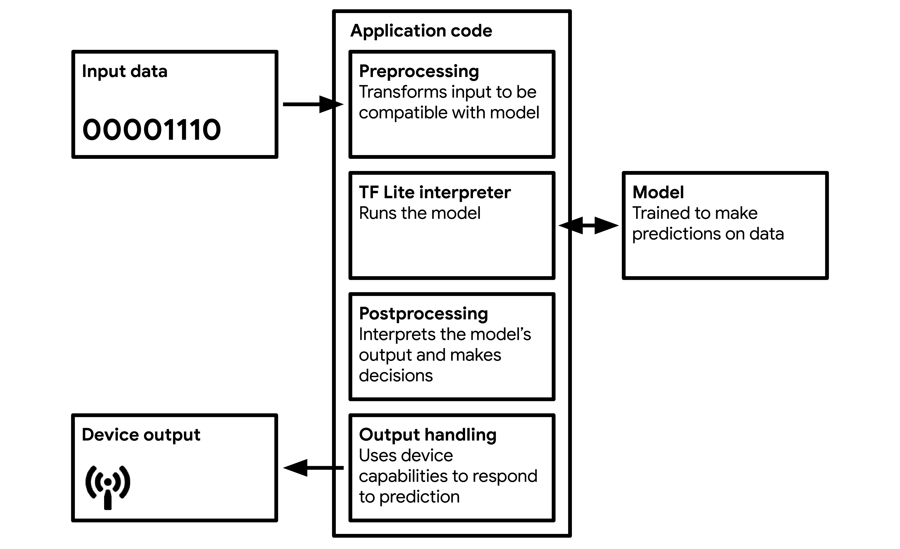

# 第五章：TinyML 的“Hello World”：构建一个应用程序

模型只是机器学习应用程序的一部分。单独来看，它只是一块信息；它几乎什么都做不了。要使用我们的模型，我们需要将其包装在代码中，为其设置必要的运行环境，提供输入，并使用其输出生成行为。图 5-1 显示了模型在右侧如何适配到基本 TinyML 应用程序中。

在本章中，我们将构建一个嵌入式应用程序，使用我们的正弦模型创建一个微小的灯光秀。我们将设置一个连续循环，将一个`x`值输入模型，运行推断，并使用结果来开关 LED 灯，或者控制动画，如果我们的设备有 LCD 显示器的话。

这个应用程序已经编写好了。这是一个 C++ 11 程序，其代码旨在展示一个完整的 TinyML 应用程序的最小可能实现，避免任何复杂的逻辑。这种简单性使它成为学习如何使用 TensorFlow Lite for Microcontrollers 的有用工具，因为您可以清楚地看到需要哪些代码，以及很少的其他内容。它也是一个有用的模板。阅读完本章后，您将了解 TensorFlow Lite for Microcontrollers 程序的一般结构，并可以在自己的项目中重用相同的结构。

本章将逐步介绍应用程序代码并解释其工作原理。下一章将提供详细的构建和部署说明，适用于多种设备。如果您不熟悉 C++，不要惊慌。代码相对简单，我们会详细解释一切。到最后，您应该对运行模型所需的所有代码感到满意，甚至可能在学习过程中学到一些 C++知识。



###### 图 5-1。基本 TinyML 应用程序架构

###### 提示

请记住，由于 TensorFlow 是一个积极开发的开源项目，这里打印的代码与在线代码之间可能存在一些细微差异。不用担心，即使有一些代码行发生变化，基本原则仍然保持不变。

# 测试步骤

在处理应用程序代码之前，编写一些测试通常是一个好主意。测试是演示特定逻辑片段的短代码片段。由于它们由可工作的代码组成，我们可以运行它们来证明代码是否按预期运行。编写完测试后，通常会自动运行测试，以持续验证项目是否仍然按照我们的期望运行，尽管我们可能对其代码进行了任何更改。它们也非常有用，作为如何执行操作的工作示例。

`hello_world`示例有一个测试，在[*hello_world_test.cc*](https://oreil.ly/QW0SS)中定义，加载我们的模型并使用它运行推断，检查其预测是否符合我们的期望。它包含了执行此操作所需的确切代码，没有其他内容，因此这将是学习 TensorFlow Lite for Microcontrollers 的绝佳起点。在本节中，我们将逐步介绍测试，并解释其中的每个部分的作用。阅读完代码后，我们可以运行测试以证明其正确性。

现在让我们逐节来看一下。如果您在电脑上，打开*hello_world_test.cc*并跟着走可能会有帮助。

## 包含依赖项

第一部分，在许可证标题下方（指定任何人都可以在[Apache 2.0](https://oreil.ly/Xa5_x)开源许可下使用或共享此代码），如下所示：

```cpp
#include "tensorflow/lite/micro/examples/hello_world/sine_model_data.h"
#include "tensorflow/lite/micro/kernels/all_ops_resolver.h"
#include "tensorflow/lite/micro/micro_error_reporter.h"
#include "tensorflow/lite/micro/micro_interpreter.h"
#include "tensorflow/lite/micro/testing/micro_test.h"
#include "tensorflow/lite/schema/schema_generated.h"
#include "tensorflow/lite/version.h"
```

`#include`指令是 C++代码指定其依赖的其他代码的一种方式。当使用`#include`引用代码文件时，它定义的任何逻辑或变量将可供我们使用。在本节中，我们使用`#include`导入以下项目：

*tensorflow/lite/micro/examples/hello_world/sine_model_data.h*

我们训练的正弦模型，使用`xxd`转换并转换为 C++

*tensorflow/lite/micro/kernels/all_ops_resolver.h*

一个允许解释器加载我们模型使用的操作的类

*tensorflow/lite/micro/micro_error_reporter.h*

一个可以记录错误并输出以帮助调试的类

* tensorflow/lite/micro/micro_interpreter.h *

将运行我们模型的 TensorFlow Lite for Microcontrollers 解释器

*tensorflow/lite/micro/testing/micro_test.h*

一个用于编写测试的轻量级框架，允许我们将此文件作为测试运行

*tensorflow/lite/schema/schema_generated.h*

定义了 TensorFlow Lite FlatBuffer 数据结构的模式，用于理解*sine_model_data.h*中的模型数据

*tensorflow/lite/version.h*

模式的当前版本号，以便我们可以检查模型是否使用兼容版本定义

当我们深入代码时，我们将更多地讨论其中一些依赖关系。

###### 注意

按照惯例，设计用于与`#include`指令一起使用的 C++代码通常编写为两个文件：一个*.cc*文件，称为*源文件*，以及一个*.h*文件，称为*头文件*。头文件定义了允许代码连接到程序其他部分的接口。它们包含变量和类声明等内容，但几乎没有逻辑。源文件实现了执行计算和使事情发生的实际逻辑。当我们`#include`一个依赖项时，我们指定其头文件。例如，我们正在讨论的测试包括[*micro_interpreter.h*](https://oreil.ly/60uYt)。如果我们查看该文件，我们可以看到它定义了一个类，但没有包含太多逻辑。相反，它的逻辑包含在[*micro_interpreter.cc*](https://oreil.ly/twN7J)中。

## 设置测试

代码的下一部分用于 TensorFlow Lite for Microcontrollers 测试框架。看起来像这样：

```cpp
TF_LITE_MICRO_TESTS_BEGIN

TF_LITE_MICRO_TEST(LoadModelAndPerformInference) {
```

在 C++中，您可以定义特殊命名的代码块，可以通过在其他地方包含它们的名称来重用。这些代码块称为*宏*。这里的两个语句，`TF_LITE_MICRO_TESTS_BEGIN`和`TF_LITE_MICRO_TEST`，是宏的名称。它们在文件[*micro_test.h*](https://oreil.ly/NoGm4)中定义。

这些宏将我们代码的其余部分包装在必要的装置中，以便通过 TensorFlow Lite for Microcontrollers 测试框架执行。我们不需要担心这是如何工作的；我们只需要知道我们可以使用这些宏作为设置测试的快捷方式。

第二个名为`TF_LITE_MICRO_TEST`的宏接受一个参数。在这种情况下，传入的参数是`LoadModelAndPerformInference`。这个参数是测试名称，当运行测试时，它将与测试结果一起输出，以便我们可以看到测试是通过还是失败。

## 准备记录数据

文件中剩余的代码是我们测试的实际逻辑。让我们看一下第一部分：

```cpp
// Set up logging
tflite::MicroErrorReporter micro_error_reporter;
tflite::ErrorReporter* error_reporter = &micro_error_reporter;
```

在第一行中，我们定义了一个`MicroErrorReporter`实例。`MicroErrorReporter`类在[*micro_error_reporter.h*](https://oreil.ly/AkZrm)中定义。它提供了在推理期间记录调试信息的机制。我们将调用它来打印调试信息，而 TensorFlow Lite for Microcontrollers 解释器将使用它来打印遇到的任何错误。

###### 注意

您可能已经注意到每个类型名称之前的`tflite::`前缀，例如`tflite::MicroErrorReporter`。这是一个*命名空间*，只是帮助组织 C++代码的一种方式。TensorFlow Lite 在命名空间`tflite`下定义了所有有用的内容，这意味着如果另一个库恰好实现了具有相同名称的类，它们不会与 TensorFlow Lite 提供的类发生冲突。

第一个声明看起来很简单，但是第二行看起来有点奇怪，带有`*`和`&`字符？为什么我们要声明一个`ErrorReporter`当我们已经有一个`MicroErrorReporter`了？

```cpp
tflite::ErrorReporter* error_reporter = &micro_error_reporter;
```

解释这里发生的事情，我们需要了解一些背景信息。

`MicroErrorReporter`是`ErrorReporter`类的一个子类，为 TensorFlow Lite 中这种调试日志机制应该如何工作提供了一个模板。`MicroErrorReporter`覆盖了`ErrorReporter`的一个方法，用专门为在微控制器上使用而编写的逻辑替换它。

在前面的代码行中，我们创建了一个名为`error_reporter`的变量，它的类型是`ErrorReporter`。它也是一个指针，其声明中使用了*表示。

指针是一种特殊类型的变量，它不是保存一个值，而是保存一个引用，指向内存中的一个值。在 C++中，一个类的指针（比如`ErrorReporter`）可以指向它的一个子类（比如`MicroErrorReporter`）的值。

正如我们之前提到的，`MicroErrorReporter`覆盖了`ErrorReporter`的一个方法。不详细讨论，覆盖这个方法的过程会导致一些其他方法被隐藏。

为了仍然可以访问`ErrorReporter`的未覆盖方法，我们需要将我们的`MicroErrorReporter`实例视为实际上是`ErrorReporter`。我们通过创建一个`ErrorReporter`指针并将其指向`micro_error_reporter`变量来实现这一点。赋值语句中`&`在`micro_error_reporter`前面的意思是我们正在分配它的指针，而不是它的值。

哎呀！听起来很复杂。如果你觉得难以理解，不要惊慌；C++可能有点难以掌握。对于我们的目的，我们只需要知道我们应该使用`error_reporter`来打印调试信息，并且它是一个指针。

## 映射我们的模型

我们立即建立打印调试信息的机制的原因是为了记录代码中发生的任何问题。我们在下一段代码中依赖于这一点：

```cpp
// Map the model into a usable data structure. This doesn't involve any
// copying or parsing, it's a very lightweight operation.
const tflite::Model* model = ::tflite::GetModel(g_sine_model_data);
if (model->version() != TFLITE_SCHEMA_VERSION) {
error_reporter->Report(
    "Model provided is schema version %d not equal "
    "to supported version %d.\n",
    model->version(), TFLITE_SCHEMA_VERSION);
    return 1;
}
```

在第一行中，我们将我们的模型数据数组（在文件[*sine_model_data.h*](https://oreil.ly/m68Wj)中定义）传递给一个名为`GetModel()`的方法。这个方法返回一个`Model`指针，被赋值给一个名为`model`的变量。正如你可能预料的那样，这个变量代表我们的模型。

类型`Model`是一个*struct*，在 C++中与类非常相似。它在[*schema_generated.h*](https://oreil.ly/SGNtU)中定义，它保存我们模型的数据并允许我们查询有关它的信息。

一旦`model`准备好，我们调用一个检索模型版本号的方法：

```cpp
if (model->version() != TFLITE_SCHEMA_VERSION) {
```

然后我们将模型的版本号与`TFLITE_SCHEMA_VERSION`进行比较，这表示我们当前使用的 TensorFlow Lite 库的版本。如果数字匹配，我们的模型是使用兼容版本的 TensorFlow Lite Converter 转换的。检查模型版本是一个好习惯，因为版本不匹配可能导致难以调试的奇怪行为。

###### 注意

在前一行代码中，`version()`是属于`model`的一个方法。注意箭头（->）从`model`指向`version()`。这是 C++的*箭头运算符*，当我们想要访问一个对象的成员时使用。如果我们有对象本身（而不仅仅是一个指针），我们将使用点（.）来访问它的成员。

如果版本号不匹配，我们仍然会继续，但我们会使用我们的`error_reporter`记录一个警告：

```cpp
error_reporter->Report(
    "Model provided is schema version %d not equal "
    "to supported version %d.\n",
    model->version(), TFLITE_SCHEMA_VERSION);
```

我们调用`error_reporter`的`Report()`方法来记录这个警告。由于`error_reporter`也是一个指针，我们使用->运算符来访问`Report()`。

`Report()`方法的设计类似于一个常用的 C++方法`printf()`，用于记录文本。作为它的第一个参数，我们传递一个我们想要记录的字符串。这个字符串包含两个`%d`格式说明符，它们充当变量在消息记录时插入的占位符。我们传递的下两个参数是模型版本和 TensorFlow Lite 模式版本。这些将按顺序插入到字符串中，以替换`%d`字符。

###### 注意

`Report()`方法支持不同的格式说明符，用作不同类型变量的占位符。`%d`应该用作整数的占位符，`%f`应该用作浮点数的占位符，`%s`应该用作字符串的占位符。

## 创建一个 AllOpsResolver

到目前为止一切顺利！我们的代码可以记录错误，我们已经将模型加载到一个方便的结构中，并检查它是否是兼容的版本。鉴于我们一路上在回顾一些 C++概念，我们进展有点慢，但事情开始变得清晰起来了。接下来，我们创建一个`AllOpsResolver`的实例：

```cpp
// This pulls in all the operation implementations we need
tflite::ops::micro::AllOpsResolver resolver;
```

这个类在[*all_ops_resolver.h*](https://oreil.ly/O0qgy)中定义，它允许 TensorFlow Lite for Microcontrollers 解释器访问*操作*。

在第三章中，您了解到机器学习模型由各种数学运算组成，这些运算按顺序运行，将输入转换为输出。`AllOpsResolver`类知道 TensorFlow Lite for Microcontrollers 可用的所有操作，并能够将它们提供给解释器。

## 定义张量区域

我们几乎已经准备好创建一个解释器所需的所有要素。我们需要做的最后一件事是分配一个工作内存区域，我们的模型在运行时将需要这个内存区域：

```cpp
// Create an area of memory to use for input, output, and intermediate arrays.
// Finding the minimum value for your model may require some trial and error.
const int tensor_arena_size = 2 × 1024;
uint8_t tensor_arena[tensor_arena_size];
```

正如注释所说，这个内存区域将用于存储模型的输入、输出和中间张量。我们称之为我们的*张量区域*。在我们的情况下，我们分配了一个大小为 2,048 字节的数组。我们用表达式`2 × 1024`来指定这一点。

那么，我们的张量区域应该有多大呢？这是一个很好的问题。不幸的是，没有一个简单的答案。不同的模型架构具有不同大小和数量的输入、输出和中间张量，因此很难知道我们需要多少内存。数字不需要精确——我们可以保留比我们需要的更多的内存——但由于微控制器的 RAM 有限，我们应该尽可能保持它小，以便为程序的其余部分留出空间。

我们可以通过试错来完成这个过程。这就是为什么我们将数组大小表示为*`n`* `× 1024`：这样可以很容易地通过改变*`n`*来扩大或缩小数字（保持为 8 的倍数）。要找到正确的数组大小，从一个相对较高的数字开始，以确保它有效。本书示例中使用的最大数字是`70 × 1024`。然后，减少数字直到您的模型不再运行。最后一个有效的数字就是正确的数字！

## 创建解释器

现在我们已经声明了`tensor_arena`，我们准备设置解释器。下面是具体步骤：

```cpp
// Build an interpreter to run the model with
tflite::MicroInterpreter interpreter(model, resolver, tensor_arena,
                                     tensor_arena_size, error_reporter);

// Allocate memory from the tensor_arena for the model's tensors
interpreter.AllocateTensors();
```

首先，我们声明一个名为`interpreter`的`MicroInterpreter`。这个类是 TensorFlow Lite for Microcontrollers 的核心：一个神奇的代码片段，将在我们提供的数据上执行我们的模型。我们将迄今为止创建的大部分对象传递给它的构造函数，然后调用`AllocateTensors()`。

在前一节中，我们通过定义一个名为`tensor_arena`的数组来设置了一个内存区域。`AllocateTensors()`方法遍历模型定义的所有张量，并为每个张量从`tensor_arena`中分配内存。在尝试运行推理之前，我们必须调用`AllocateTensors()`，因为否则推理将失败。

## 检查输入张量

在我们创建了一个解释器之后，我们需要为我们的模型提供一些输入。为此，我们将我们的输入数据写入模型的输入张量：

```cpp
// Obtain a pointer to the model's input tensor
TfLiteTensor* input = interpreter.input(0);
```

要获取输入张量的指针，我们调用解释器的`input()`方法。由于一个模型可以有多个输入张量，我们需要向`input()`方法传递一个指定我们想要的张量的索引。在这种情况下，我们的模型只有一个输入张量，所以它的索引是`0`。

在 TensorFlow Lite 中，张量由`TfLiteTensor`结构表示，该结构在[*c_api_internal.h*](https://oreil.ly/Qvhre)中定义。这个结构提供了一个 API 来与张量进行交互和了解张量。在下一段代码中，我们使用这个功能来验证我们的张量看起来和感觉正确。因为我们将经常使用张量，让我们通过这段代码来熟悉`TfLiteTensor`结构的工作方式：

```cpp
// Make sure the input has the properties we expect
TF_LITE_MICRO_EXPECT_NE(nullptr, input);
// The property "dims" tells us the tensor's shape. It has one element for
// each dimension. Our input is a 2D tensor containing 1 element, so "dims"
// should have size 2.
TF_LITE_MICRO_EXPECT_EQ(2, input->dims->size);
// The value of each element gives the length of the corresponding tensor.
// We should expect two single element tensors (one is contained within the
// other).
TF_LITE_MICRO_EXPECT_EQ(1, input->dims->data[0]);
TF_LITE_MICRO_EXPECT_EQ(1, input->dims->data[1]);
// The input is a 32 bit floating point value
TF_LITE_MICRO_EXPECT_EQ(kTfLiteFloat32, input->type);
```

你会注意到的第一件事是一对宏：`TFLITE_MICRO_EXPECT_NE`和`TFLITE_MICRO_EXPECT_EQ`。这些宏是 TensorFlow Lite for Microcontrollers 测试框架的一部分，它们允许我们对变量的值进行*断言*，证明它们具有某些期望的值。

例如，宏`TF_LITE_MICRO_EXPECT_NE`旨在断言它所调用的两个变量不相等（因此其名称中的`_NE`部分表示不相等）。如果变量不相等，代码将继续执行。如果它们相等，将记录一个错误，并标记测试为失败。

我们首先检查的是我们的输入张量是否实际存在。为了做到这一点，我们断言它*不等于*`nullptr`，这是一个特殊的 C++值，表示一个指针实际上没有指向任何数据：

```cpp
TF_LITE_MICRO_EXPECT_NE(nullptr, input);
```

我们接下来检查的是我们输入张量的*形状*。如第三章中讨论的，所有张量都有一个形状，这是描述它们维度的一种方式。我们模型的输入是一个标量值（表示一个单个数字）。然而，由于[Keras 层接受输入的方式](https://oreil.ly/SFiRV)，这个值必须提供在一个包含一个数字的 2D 张量中。对于输入 0，它应该是这样的：

```cpp
[[0]]
```

请注意，输入标量 0 被包裹在两个向量中，使其成为一个 2D 张量。

`TfLiteTensor`结构包含一个`dims`成员，描述张量的维度。该成员是一个类型为`TfLiteIntArray`的结构，也在*c_api_internal.h*中定义。它的`size`成员表示张量的维度数。由于输入张量应该是 2D 的，我们可以断言`size`的值为`2`：

```cpp
TF_LITE_MICRO_EXPECT_EQ(2, input->dims->size);
```

我们可以进一步检查`dims`结构，以确保张量的结构是我们期望的。它的`data`变量是一个数组，每个维度有一个元素。每个元素是一个表示该维度大小的整数。因为我们期望一个包含每个维度一个元素的 2D 张量，我们可以断言两个维度都包含一个单一元素：

```cpp
TF_LITE_MICRO_EXPECT_EQ(1, input->dims->data[0]);
TF_LITE_MICRO_EXPECT_EQ(1, input->dims->data[1]);
```

我们现在可以确信我们的输入张量具有正确的形状。最后，由于张量可以由各种不同类型的数据组成（比如整数、浮点数和布尔值），我们应该确保我们的输入张量具有正确的类型。

张量结构体的`type`变量告诉我们张量的数据类型。我们将提供一个 32 位浮点数，由常量`kTfLiteFloat32`表示，我们可以轻松地断言类型是正确的：

```cpp
TF_LITE_MICRO_EXPECT_EQ(kTfLiteFloat32, input->type);
```

完美——我们的输入张量现在已经保证是正确的大小和形状，适用于我们的输入数据，这将是一个单个浮点值。我们准备好进行推理了！

## 在输入上运行推理

要运行推理，我们需要向我们的输入张量添加一个值，然后指示解释器调用模型。之后，我们将检查模型是否成功运行。这是它的样子：

```cpp
// Provide an input value
input->data.f[0] = 0.;

// Run the model on this input and check that it succeeds
TfLiteStatus invoke_status = interpreter.Invoke();
if (invoke_status != kTfLiteOk) {
 error_reporter->Report("Invoke failed\n");
}
TF_LITE_MICRO_EXPECT_EQ(kTfLiteOk, invoke_status);
```

TensorFlow Lite 的`TfLiteTensor`结构有一个`data`变量，我们可以用来设置输入张量的内容。你可以在这里看到它被使用：

```cpp
input->data.f[0] = 0.;
```

`data`变量是一个`TfLitePtrUnion`——它是一个*union*，是一种特殊的 C++数据类型，允许您在内存中的同一位置存储不同的数据类型。由于给定张量可以包含多种不同类型的数据（例如浮点数、整数或布尔值），union 是帮助我们存储它的完美类型。

`TfLitePtrUnion`联合在[*c_api_internal.h*](https://oreil.ly/v4h7K)中声明。这是它的样子：

```cpp
// A union of pointers that points to memory for a given tensor.
typedef union {
  int32_t* i32;
  int64_t* i64;
  float* f;
  TfLiteFloat16* f16;
  char* raw;
  const char* raw_const;
  uint8_t* uint8;
  bool* b;
  int16_t* i16;
  TfLiteComplex64* c64;
  int8_t* int8;
} TfLitePtrUnion;
```

您可以看到有一堆成员，每个代表一种特定类型。每个成员都是一个指针，可以指向内存中应存储数据的位置。当我们像之前那样调用`interpreter.AllocateTensors()`时，适当的指针被设置为指向为张量分配的内存块，以存储其数据。因为每个张量有一个特定的数据类型，所以只有相应类型的指针会被设置。

这意味着为了存储数据，我们可以在`TfLitePtrUnion`中使用适当的指针。例如，如果我们的张量是`kTfLiteFloat32`类型，我们将使用`data.f`。

由于指针指向一块内存块，我们可以在指针名称后使用方括号(`[]`)来指示程序在哪里存储数据。在我们的例子中，我们这样做：

```cpp
input->data.f[0] = 0.;
```

我们分配的值写为`0.`，这是`0.0`的简写。通过指定小数点，我们让 C++编译器清楚地知道这个值应该是一个浮点数，而不是整数。

您可以看到我们将这个值分配给`data.f[0]`。这意味着我们将其分配为我们分配的内存块中的第一个项目。鉴于只有一个值，这就是我们需要做的。

设置完输入张量后，是时候运行推理了。这是一个一行代码：

```cpp
TfLiteStatus invoke_status = interpreter.Invoke();
```

当我们在`interpreter`上调用`Invoke()`时，TensorFlow Lite 解释器会运行模型。该模型由数学运算图组成，解释器执行这些运算以将输入数据转换为输出。这个输出存储在模型的输出张量中，我们稍后会深入研究。

`Invoke()`方法返回一个`TfLiteStatus`对象，让我们知道推理是否成功或是否有问题。它的值可以是`kTfLiteOk`或`kTfLiteError`。我们检查是否有错误，并在有错误时报告：

```cpp
if (invoke_status != kTfLiteOk) {
    error_reporter->Report("Invoke failed\n");
}
```

最后，我们断言状态必须是`kTfLiteOk`，以便我们的测试通过：

```cpp
TF_LITE_MICRO_EXPECT_EQ(kTfLiteOk, invoke_status);
```

就这样——推理已经运行！接下来，我们获取输出并确保它看起来不错。

## 阅读输出

与输入一样，我们模型的输出通过`TfLiteTensor`访问，获取指向它的指针同样简单：

```cpp
TfLiteTensor* output = interpreter.output(0);
```

输出与输入一样，是一个嵌套在 2D 张量中的浮点标量值。为了测试，我们再次检查输出张量的预期大小、维度和类型：

```cpp
TF_LITE_MICRO_EXPECT_EQ(2, output->dims->size);
TF_LITE_MICRO_EXPECT_EQ(1, input->dims->data[0]);
TF_LITE_MICRO_EXPECT_EQ(1, input->dims->data[1]);
TF_LITE_MICRO_EXPECT_EQ(kTfLiteFloat32, output->type);
```

是的，一切看起来都很好。现在，我们获取输出值并检查它，确保它符合我们的高标准。首先，我们将其分配给一个`float`变量：

```cpp
// Obtain the output value from the tensor
float value = output->data.f[0];
```

每次运行推理时，输出张量将被新值覆盖。这意味着如果您想在程序中保留一个输出值，同时继续运行推理，您需要从输出张量中复制它，就像我们刚刚做的那样。

接下来，我们使用`TF_LITE_MICRO_EXPECT_NEAR`来证明该值接近我们期望的值：

```cpp
// Check that the output value is within 0.05 of the expected value
TF_LITE_MICRO_EXPECT_NEAR(0., value, 0.05);
```

正如我们之前看到的，`TF_LITE_MICRO_EXPECT_NEAR`断言其第一个参数和第二个参数之间的差异小于其第三个参数的值。在这个语句中，我们测试输出是否在 0 的数学正弦输入 0 的 0.05 范围内。

###### 注意

我们期望得到一个接近我们想要的数字的原因有两个，但不是一个精确值。第一个原因是我们的模型只是*近似*真实的正弦值，所以我们知道它不会完全正确。第二个原因是因为计算机上的浮点计算有一个误差范围。误差可能因计算机而异：例如，笔记本电脑的 CPU 可能会产生与 Arduino 稍有不同的结果。通过具有灵活的期望，我们更有可能使我们的测试在任何平台上通过。

如果这个测试通过，情况看起来很好。其余的测试会再次运行推理几次，只是为了进一步证明我们的模型正在工作。要再次运行推理，我们只需要为我们的输入张量分配一个新值，调用 `interpreter.Invoke()`，并从输出张量中读取输出：

```cpp
// Run inference on several more values and confirm the expected outputs
input->data.f[0] = 1.;
interpreter.Invoke();
value = output->data.f[0];
TF_LITE_MICRO_EXPECT_NEAR(0.841, value, 0.05);

input->data.f[0] = 3.;
interpreter.Invoke();
value = output->data.f[0];
TF_LITE_MICRO_EXPECT_NEAR(0.141, value, 0.05);

input->data.f[0] = 5.;
interpreter.Invoke();
value = output->data.f[0];
TF_LITE_MICRO_EXPECT_NEAR(-0.959, value, 0.05);
```

请注意我们如何重复使用相同的 `input` 和 `output` 张量指针。因为我们已经有了指针，所以我们不需要再次调用 `interpreter.input(0)` 或 `interpreter.output(0)`。

在我们的测试中，我们已经证明了 TensorFlow Lite for Microcontrollers 可以成功加载我们的模型，分配适当的输入和输出张量，运行推理，并返回预期的结果。最后要做的是使用宏指示测试的结束：

```cpp
}

TF_LITE_MICRO_TESTS_END
```

有了这些，我们完成了测试。接下来，让我们运行它们！

## 运行测试

尽管这段代码最终将在微控制器上运行，但我们仍然可以在开发计算机上构建和运行我们的测试。这样做可以更轻松地编写和调试代码。与微控制器相比，个人计算机具有更方便的日志记录工具和代码调试工具，这使得更容易找出任何错误。此外，将代码部署到设备需要时间，因此仅在本地运行代码会更快。

构建嵌入式应用程序（或者说，任何类型的软件）的一个好的工作流程是尽可能多地在可以在普通开发计算机上运行的测试中编写逻辑。总会有一些部分需要实际硬件才能运行，但你在本地测试的越多，你的生活就会变得更容易。

实际上，这意味着我们应该尝试在一组测试中编写预处理输入、使用模型运行推理以及处理任何输出的代码，然后再尝试在设备上使其正常工作。在第七章中，我们将介绍一个比这个示例复杂得多的语音识别应用程序。你将看到我们为其每个组件编写了详细的单元测试。

### 获取代码

到目前为止，在 Colab 和 GitHub 之间，我们一直在云端进行所有操作。为了运行我们的测试，我们需要将代码下载到我们的开发计算机并进行编译。

为了做到这一切，我们需要以下软件工具：

+   终端仿真器，如 macOS 中的终端

+   一个 bash shell（在 macOS Catalina 之前和大多数 Linux 发行版中是默认的）

+   [Git](https://git-scm.com/)（在 macOS 和大多数 Linux 发行版中默认安装）

+   Make，版本 3.82 或更高版本

在你拥有所有工具之后，打开一个终端并输入以下命令来下载 TensorFlow 源代码，其中包括我们正在使用的示例代码。它将在你运行它的任何位置创建一个包含源代码的目录：

```cpp
git clone https://github.com/tensorflow/tensorflow.git
```

接下来，切换到刚刚创建的 *tensorflow* 目录：

```cpp
cd tensorflow
```

太棒了 - 我们现在准备运行一些代码！

### 使用 Make 运行测试

从我们的工具列表中可以看到，我们使用一个名为*Make*的程序来运行测试。Make 是一个用于自动化软件构建任务的工具。它自 1976 年以来一直在使用，从计算术语来看几乎是永远的。开发人员使用一种特殊的语言，在名为*Makefiles*的文件中编写，指示 Make 如何构建和运行代码。TensorFlow Lite for Microcontrollers 在[*micro/tools/make/Makefile*](https://oreil.ly/6Kvx5)中定义了一个 Makefile；在第十三章中有更多关于它的信息。

要使用 Make 运行我们的测试，我们可以发出以下命令，确保我们是从使用 Git 下载的*tensorflow*目录的根目录运行。我们首先指定要使用的 Makefile，然后是*target*，即我们要构建的组件：

```cpp
make -f tensorflow/lite/micro/tools/make/Makefile test_hello_world_test
```

Makefile 被设置为为了运行测试，我们提供一个以`test_`为前缀的目标，后面跟着我们想要构建的组件的名称。在我们的情况下，该组件是*`hello_world_test`*，因此完整的目标名称是*`test_hello_world_test`*。

尝试运行这个命令。您应该开始看到大量输出飞过！首先，将下载一些必要的库和工具。接下来，我们的测试文件以及所有依赖项将被构建。我们的 Makefile 已经指示 C++编译器构建代码并创建一个二进制文件，然后运行它。

您需要等待一段时间才能完成这个过程。当文本停止飞过时，最后几行应该是这样的：

```cpp
Testing LoadModelAndPerformInference
1/1 tests passed
~~~ALL TESTS PASSED~~~
```

很好！这个输出显示我们的测试按预期通过了。您可以看到测试的名称`LoadModelAndPerformInference`，如其源文件顶部所定义。即使它还没有在微控制器上，我们的代码也成功地运行了推断。

要查看测试失败时会发生什么，让我们引入一个错误。打开测试文件*hello_world_test.cc*。它将位于相对于目录根目录的路径：

```cpp
tensorflow/lite/micro/examples/hello_world/hello_world_test.cc
```

为了使测试失败，让我们为模型提供不同的输入。这将导致模型的输出发生变化，因此检查我们输出值的断言将失败。找到以下行：

```cpp
input->data.f[0] = 0.;
```

更改分配的值，如下所示：

```cpp
input->data.f[0] = 1.;
```

现在保存文件，并使用以下命令再次运行测试（记得要从*tensorflow*目录的根目录运行）：

```cpp
make -f tensorflow/lite/micro/tools/make/Makefile test_hello_world_test
```

代码将被重建，测试将运行。您看到的最终输出应该如下所示：

```cpp
Testing LoadModelAndPerformInference
0.0486171 near value failed at tensorflow/lite/micro/examples/hello_world/\
  hello_world_test.cc:94
0/1 tests passed
~~~SOME TESTS FAILED~~~
```

输出包含有关测试失败原因的一些有用信息，包括失败发生的文件和行号（`hello_world_test.cc:94`）。如果这是由于真正的错误引起的，这个输出将有助于追踪问题。

# 项目文件结构

借助我们的测试，您已经学会了如何使用 TensorFlow Lite for Microcontrollers 库在 C++中运行推断。接下来，我们将浏览一个实际应用程序的源代码。

如前所述，我们正在构建的程序由一个连续循环组成，该循环将一个`x`值输入模型，运行推断，并使用结果生成某种可见输出（如闪烁 LED 的模式），具体取决于平台。

因为应用程序很复杂，涉及多个文件，让我们看看它的结构以及它们如何相互配合。

应用程序的根目录在*tensorflow/lite/micro/examples/hello_world*中。它包含以下文件：

BUILD

一个列出可以使用应用程序源代码构建的各种内容的文件，包括主应用程序二进制文件和我们之前讨论过的测试。在这一点上，我们不需要太担心它。

Makefile.inc

一个包含有关应用程序内部构建目标信息的 Makefile，包括*hello_world_test*，这是我们之前运行的测试，以及*hello_world*，主应用程序二进制文件。它定义了它们的哪些源文件是其中的一部分。

README.md

一个包含构建和运行应用程序说明的自述文件。

constants.h, constants.cc

一对包含各种*常量*（在程序生命周期中不会改变的变量）的文件，这些常量对于定义程序行为很重要。

create_sine_model.ipynb

在上一章中使用的 Jupyter 笔记本。

hello_world_test.cc

一个使用我们模型运行推断的测试。

main.cc

程序的入口点，在应用部署到设备时首先运行。

main_functions.h, main_functions.cc

一对文件，定义了一个`setup()`函数，执行我们程序所需的所有初始化，以及一个`loop()`函数，包含程序的核心逻辑，并设计为在循环中重复调用。这些函数在程序启动时由*main.cc*调用。

output_handler.h, output_handler.cc

一对文件，定义了一个函数，我们可以用它来显示每次运行推断时的输出。默认实现在*output_handler.cc*中，将结果打印到屏幕上。我们可以覆盖这个实现，使其在不同设备上执行不同的操作。

output_handler_test.cc

一个证明*output_handler.h*和*output_handler.cc*中的代码正常工作的测试。

sine_model_data.h, sine_model_data.cc

一对文件，定义了一个表示我们模型的数据数组，这些数据是在本章的第一部分中使用`xxd`导出的。

除了这些文件外，目录中还包含以下子目录（可能还有更多）：

+   *arduino/*

+   *disco_f76ng/*

+   *sparkfun_edge/*

因为不同的微控制器平台具有不同的功能和 API，我们的项目结构允许我们提供设备特定版本的源文件，如果应用程序为该设备构建，则将使用这些版本而不是默认版本。例如，*arduino*目录包含了定制版本的*main.cc*、*constants.cc*和*output_handler.cc*，以使应用程序能够与 Arduino 兼容。我们稍后会深入研究这些定制实现。

# 源代码解析

现在我们知道了应用程序源代码的结构，让我们深入代码。我们将从[*main_functions.cc*](https://oreil.ly/BYS5k)开始，这里发生了大部分的魔法，并从那里扩展到其他文件。

###### 注意

这段代码中很多内容在*hello_world_test.cc*中会看起来很熟悉。如果我们已经涵盖了某些内容，我们不会深入讨论它的工作原理；我们更愿意主要关注您之前没有见过的内容。

## 从 main_functions.cc 开始

这个文件包含了我们程序的核心逻辑。它从一些熟悉的`#include`语句和一些新的语句开始：

```cpp
#include "tensorflow/lite/micro/examples/hello_world/main_functions.h"
#include "tensorflow/lite/micro/examples/hello_world/constants.h"
#include "tensorflow/lite/micro/examples/hello_world/output_handler.h"
#include "tensorflow/lite/micro/examples/hello_world/sine_model_data.h"
#include "tensorflow/lite/micro/kernels/all_ops_resolver.h"
#include "tensorflow/lite/micro/micro_error_reporter.h"
#include "tensorflow/lite/micro/micro_interpreter.h"
#include "tensorflow/lite/schema/schema_generated.h"
#include "tensorflow/lite/version.h"
```

我们在*hello_world_test.cc*中看到了很多这样的内容。新出现的是*constants.h*和`output_handler.h`，我们在前面的文件列表中了解到了这些。

文件的下一部分设置了将在*main_functions.cc*中使用的全局变量：

```cpp
namespace {
tflite::ErrorReporter* error_reporter = nullptr;
const tflite::Model* model = nullptr;
tflite::MicroInterpreter* interpreter = nullptr;
TfLiteTensor* input = nullptr;
TfLiteTensor* output = nullptr;
int inference_count = 0;

// Create an area of memory to use for input, output, and intermediate arrays.
// Finding the minimum value for your model may require some trial and error.
constexpr int kTensorArenaSize = 2 × 1024;
uint8_t tensor_arena[kTensorArenaSize];
}  // namespace
```

您会注意到这些变量被包裹在一个`namespace`中。这意味着即使它们可以在*main_functions.cc*中的任何地方访问，但在项目中的其他文件中是无法访问的。这有助于防止如果两个不同的文件恰好定义了相同名称的变量时出现问题。

所有这些变量应该在测试中看起来很熟悉。我们设置变量来保存所有熟悉的 TensorFlow 对象，以及一个`tensor_arena`。唯一新的是一个保存`inference_count`的`int`，它将跟踪我们的程序执行了多少次推断。

文件的下一部分声明了一个名为`setup()`的函数。这个函数将在程序首次启动时调用，但之后不会再次调用。我们用它来做所有需要在开始运行推断之前发生的一次性工作。

`setup()`的第一部分几乎与我们的测试中的相同。我们设置日志记录，加载我们的模型，设置解释器并分配内存：

```cpp
void setup() {
  // Set up logging.
  static tflite::MicroErrorReporter micro_error_reporter;
  error_reporter = &micro_error_reporter;

  // Map the model into a usable data structure. This doesn't involve any
  // copying or parsing, it's a very lightweight operation.
  model = tflite::GetModel(g_sine_model_data);
  if (model->version() != TFLITE_SCHEMA_VERSION) {
    error_reporter->Report(
        "Model provided is schema version %d not equal "
        "to supported version %d.",
        model->version(), TFLITE_SCHEMA_VERSION);
    return;
  }

  // This pulls in all the operation implementations we need.
  static tflite::ops::micro::AllOpsResolver resolver;

  // Build an interpreter to run the model with.
  static tflite::MicroInterpreter static_interpreter(
      model, resolver, tensor_arena, kTensorArenaSize, error_reporter);
  interpreter = &static_interpreter;

  // Allocate memory from the tensor_arena for the model's tensors.
  TfLiteStatus allocate_status = interpreter->AllocateTensors();
  if (allocate_status != kTfLiteOk) {
    error_reporter->Report("AllocateTensors() failed");
    return;
  }
```

到目前为止都是熟悉的领域。然而，在这一点之后，事情有点不同。首先，我们获取输入张量和输出张量的指针：

```cpp
  // Obtain pointers to the model's input and output tensors.
  input = interpreter->input(0);
  output = interpreter->output(0);
```

你可能想知道在运行推断之前我们如何与输出交互。请记住，`TfLiteTensor`只是一个结构体，它有一个成员`data`，指向一个已分配用于存储输出的内存区域。即使还没有写入任何输出，结构体及其`data`成员仍然存在。

最后，为了结束`setup()`函数，我们将我们的`inference_count`变量设置为`0`：

```cpp
  // Keep track of how many inferences we have performed.
  inference_count = 0;
}
```

此时，我们所有的机器学习基础设施都已经设置好并准备就绪。我们拥有运行推断并获得结果所需的所有工具。接下来要定义的是我们的应用逻辑。程序实际上要做什么？

我们的模型经过训练，可以预测从 0 到 2π的任何数字的正弦值，这代表正弦波的完整周期。为了展示我们的模型，我们可以只输入这个范围内的数字，预测它们的正弦值，然后以某种方式输出这些值。我们可以按顺序执行这些操作，以展示模型在整个范围内的工作。这听起来是一个不错的计划！

为了做到这一点，我们需要编写一些在循环中运行的代码。首先，我们声明一个名为`loop()`的函数，接下来我们将逐步介绍。我们放在这个函数中的代码将被重复运行，一遍又一遍：

```cpp
void loop() {
```

首先在我们的`loop()`函数中，我们必须确定要传递给模型的值（让我们称之为我们的`x`值）。我们使用两个常量来确定这一点：`kXrange`，它指定最大可能的`x`值为 2π，以及`kInferencesPerCycle`，它定义了我们希望在从 0 到 2π的步骤中执行的推断数量。接下来的几行代码计算`x`值：

```cpp
// Calculate an x value to feed into the model. We compare the current
// inference_count to the number of inferences per cycle to determine
// our position within the range of possible x values the model was
// trained on, and use this to calculate a value.
float position = static_cast<float>(inference_count) /
                    static_cast<float>(kInferencesPerCycle);
float x_val = position * kXrange;
```

前两行代码只是将`inference_count`（到目前为止我们已经做的推断次数）除以`kInferencesPerCycle`，以获得我们在范围内的当前“位置”。下一行将该值乘以`kXrange`，它代表范围中的最大值（2π）。结果`x_val`是我们将传递给模型的值。

###### 注意

`static_cast<float>()`用于将`inference_count`和`kInferencesPerCycle`（两者都是整数值）转换为浮点数。我们这样做是为了能够正确执行除法。在 C++中，如果你将两个整数相除，结果将是一个整数；结果的任何小数部分都会被舍弃。因为我们希望我们的`x`值是一个包含小数部分的浮点数，所以我们需要将被除数转换为浮点数。

我们使用的两个常量，`kInferencesPerCycle`和`kXrange`，在文件*constants.h*和*constants.cc*中定义。在使用这些常量时，C++的惯例是在常量名称前加上`k`，这样它们在代码中使用时很容易识别为常量。将常量定义在单独的文件中可能很有用，这样它们可以在需要的任何地方被包含和使用。

我们代码的下一部分应该看起来很熟悉；我们将我们的`x`值写入模型的输入张量，运行推断，然后从输出张量中获取结果（让我们称之为我们的`y`值）：

```cpp
// Place our calculated x value in the model's input tensor
input->data.f[0] = x_val;

// Run inference, and report any error
TfLiteStatus invoke_status = interpreter->Invoke();
if (invoke_status != kTfLiteOk) {
  error_reporter->Report("Invoke failed on x_val: %f\n",
                         static_cast<double>(x_val));
  return;
}

// Read the predicted y value from the model's output tensor
float y_val = output->data.f[0];
```

现在我们有了一个正弦值。由于对每个数字运行推断需要一点时间，并且这段代码在循环中运行，我们将随时间生成一系列正弦值。这将非常适合控制一些闪烁的 LED 或动画。我们的下一个任务是以某种方式输出它。

以下一行调用了在*output_handler.cc*中定义的`HandleOutput()`函数：

```cpp
// Output the results. A custom HandleOutput function can be implemented
// for each supported hardware target.
HandleOutput(error_reporter, x_val, y_val);
```

我们传入我们的`x`和`y`值，以及我们的`ErrorReporter`实例，我们可以用它来记录事情。要查看接下来会发生什么，让我们来探索*output_handler.cc*。

## 使用 output_handler.cc 处理输出

文件*output_handler.cc*定义了我们的`HandleOutput()`函数。它的实现非常简单：

```cpp
void HandleOutput(tflite::ErrorReporter* error_reporter, float x_value,
                  float y_value) {
  // Log the current X and Y values
  error_reporter->Report("x_value: %f, y_value: %f\n", x_value, y_value);
}
```

这个函数所做的就是使用`ErrorReporter`实例来记录`x`和`y`的值。这只是一个最基本的实现，我们可以用来测试应用程序的基本功能，例如在开发计算机上运行它。

然而，我们的目标是将此应用程序部署到几种不同的微控制器平台上，使用每个平台的专用硬件来显示输出。对于我们计划部署到的每个单独平台，例如 Arduino，我们提供一个自定义替换*output_handler.cc*，使用平台的 API 来控制输出，例如点亮一些 LED。

如前所述，这些替换文件位于具有每个平台名称的子目录中：*arduino/*、*disco_f76ng/*和*sparkfun_edge/*。我们将稍后深入研究特定于平台的实现。现在，让我们跳回*main_functions.cc*。

## 结束 main_functions.cc

我们在`loop()`函数中做的最后一件事是增加我们的`inference_count`计数器。如果它已经达到了在`kInferencesPerCycle`中定义的每个周期的最大推理次数，我们将其重置为 0：

```cpp
// Increment the inference_counter, and reset it if we have reached
// the total number per cycle
inference_count += 1;
if (inference_count 	>= kInferencesPerCycle) inference_count = 0;
```

下一次循环迭代时，这将使我们的`x`值沿着一步移动或者如果它已经达到范围的末尾，则将其包装回 0。

我们现在已经到达了我们的`loop()`函数的末尾。每次运行时，都会计算一个新的`x`值，运行推理，并由`HandleOutput()`输出结果。如果`loop()`不断被调用，它将对范围为 0 到 2π的`x`值进行推理，然后重复。

但是是什么让`loop()`函数一遍又一遍地运行？答案在*main.cc*文件中。

## 理解 main.cc

[C++标准](https://oreil.ly/BfmkW)规定每个 C++程序都包含一个名为`main()`的全局函数，该函数将在程序启动时运行。在我们的程序中，这个函数在*main.cc*文件中定义。这个`main()`函数的存在是*main.cc*代表我们程序入口点的原因。每当微控制器启动时，`main()`中的代码将运行。

文件*main.cc*非常简短而简洁。首先，它包含了一个*main_functions.h*的`#include`语句，这将引入那里定义的`setup()`和`loop()`函数：

```cpp
#include "tensorflow/lite/micro/examples/hello_world/main_functions.h"
```

接下来，它声明了`main()`函数本身：

```cpp
int main(int argc, char* argv[]) {
  setup();
  while (true) {
    loop();
  }
}
```

当`main()`运行时，它首先调用我们的`setup()`函数。它只会执行一次。之后，它进入一个`while`循环，将不断调用`loop()`函数，一遍又一遍。

这个循环将无限运行。天啊！如果您来自服务器或 Web 编程背景，这可能听起来不是一个好主意。循环将阻塞我们的单个执行线程，并且没有退出程序的方法。

然而，在为微控制器编写软件时，这种无休止的循环实际上是相当常见的。因为没有多任务处理，只有一个应用程序会运行，循环继续进行并不重要。只要微控制器连接到电源，我们就继续进行推理并输出数据。

我们现在已经走完了整个微控制器应用程序。在下一节中，我们将通过在开发计算机上运行应用程序代码来尝试该应用程序代码。

## 运行我们的应用程序

为了给我们的应用程序代码进行测试运行，我们首先需要构建它。输入以下 Make 命令以为我们的程序创建一个可执行二进制文件：

```cpp
make -f tensorflow/lite/micro/tools/make/Makefile hello_world
```

当构建完成后，您可以使用以下命令运行应用程序二进制文件，具体取决于您的操作系统：

```cpp
# macOS:
tensorflow/lite/micro/tools/make/gen/osx_x86_64/bin/hello_world

# Linux:
tensorflow/lite/micro/tools/make/gen/linux_x86_64/bin/hello_world

# Windows
tensorflow/lite/micro/tools/make/gen/windows_x86_64/bin/hello_world
```

如果找不到正确的路径，请列出*tensorflow/lite/micro/tools/make/gen/*中的目录。

在运行二进制文件之后，您应该希望看到一堆输出滚动过去，看起来像这样：

```cpp
x_value: 1.4137159*2¹, y_value: 1.374213*2^-2

x_value: 1.5707957*2¹, y_value: -1.4249528*2^-5

x_value: 1.7278753*2¹, y_value: -1.4295994*2^-2

x_value: 1.8849551*2¹, y_value: -1.2867725*2^-1

x_value: 1.210171*2², y_value: -1.7542461*2^-1
```

非常令人兴奋！这些是`output_handler.cc`中`HandleOutput()`函数写入的日志。每次推理都有一个日志，`x_value`逐渐增加，直到达到 2π，然后回到 0 并重新开始。

一旦你体验到足够的刺激，你可以按 Ctrl-C 来终止程序。

###### 注意

你会注意到这些数字以二的幂次方的形式输出，比如`1.4137159*2¹`。这是在微控制器上记录浮点数的高效方式，因为这些设备通常没有浮点运算的硬件支持。

要获得原始值，只需拿出你的计算器：例如，`1.4137159*2¹`计算结果为`2.8274318`。如果你感兴趣，打印这些数字的代码在[*debug_log_numbers.cc*](https://oreil.ly/sb06c)中。

# 总结

我们现在已经确认程序在我们的开发机器上运行正常。在下一章中，我们将让它在一些微控制器上运行！
