# 第七章：唤醒词检测：构建一个应用程序

TinyML 可能是一个新现象，但它最广泛的应用可能已经在你的家中、你的汽车中，甚至在你的口袋里工作。你能猜到它是什么吗？

过去几年见证了数字助手的崛起。这些产品提供了一个旨在提供即时访问信息而无需屏幕或键盘的语音用户界面（UI）。在谷歌助手、苹果的 Siri 和亚马逊的 Alexa 之间，这些数字助手几乎无处不在。几乎每部手机都内置了某种变体，从旗舰型号到专为新兴市场设计的语音优先设备。它们也存在于智能音箱、计算机和车辆中。

在大多数情况下，语音识别、自然语言处理和生成用户查询响应的繁重工作是在云端完成的，运行大型 ML 模型的强大服务器上。当用户提出问题时，它会作为音频流发送到服务器。服务器会弄清楚这意味着什么，查找所需的任何信息，并发送适当的响应。

但助手吸引人的部分是它们总是在线的，随时准备帮助你。通过说“嘿，谷歌”或“Alexa”，你可以唤醒你的助手并告诉它你需要什么，而无需按下按钮。这意味着它们必须时刻倾听你的声音，无论你是坐在客厅里，驾驶在高速公路上，还是在户外手持手机。

尽管在服务器上进行语音识别很容易，但将设备捕获的音频不间断地发送到数据中心是不可行的。从隐私的角度来看，将每秒捕获的音频发送到远程服务器将是一场灾难。即使这样做没问题，也需要大量的带宽，并且会在几小时内耗尽移动数据套餐。此外，网络通信会消耗能量，不间断地发送数据流将迅速耗尽设备的电池。更重要的是，每个请求都要经过服务器来回传输，助手会感觉迟钝和反应迟缓。

助手实际上只需要在唤醒词之后立即跟随的音频（例如“嘿，谷歌”）。如果我们能够在不发送数据的情况下检测到这个词，但在听到它时开始流式传输呢？我们将保护用户隐私，节省电池寿命和带宽，并在不等待网络的情况下唤醒助手。

这就是 TinyML 的用武之地。我们可以训练一个微小的模型来监听唤醒词，并在低功耗芯片上运行它。如果我们将其嵌入到手机中，它可以一直监听唤醒词。当它听到魔法词时，它会通知手机的操作系统（OS），后者可以开始捕获音频并将其发送到服务器。

唤醒词检测是 TinyML 的完美应用。它非常适合提供隐私、效率、速度和离线推理。这种方法，即一个微小、高效的模型“唤醒”一个更大、更耗资源的模型，被称为*级联*。

在本章中，我们将探讨如何使用预训练的语音检测模型，利用微型微控制器提供始终开启的唤醒词检测。在第八章中，我们将探讨模型是如何训练的，以及如何创建我们自己的模型。

# 我们要构建什么

我们将构建一个嵌入式应用程序，使用一个 18 KB 的模型，该模型在语音命令数据集上进行训练，用于分类口头音频。该模型经过训练，可以识别“是”和“否”这两个词，还能够区分未知词和沉默或背景噪音。

我们的应用程序将通过麦克风监听周围环境，并在检测到一个词时通过点亮 LED 或在屏幕上显示数据来指示。理解这段代码将使你能够通过语音命令控制任何电子项目。

###### 注意

与第五章一样，此应用程序的源代码可在[TensorFlow GitHub 存储库](https://oreil.ly/Bql0J)中找到。

我们将按照第五章的类似模式，先浏览测试，然后是应用代码，接着是使样本在各种设备上工作的逻辑。

我们提供了将应用程序部署到以下设备的说明：

+   [Arduino Nano 33 BLE Sense](https://oreil.ly/6qlMD)

+   [SparkFun Edge](https://oreil.ly/-hoL-)

+   [ST Microelectronics STM32F746G Discovery kit](https://oreil.ly/cvm4J)

###### 注意

TensorFlow Lite 定期添加对新设备的支持，所以如果您想要使用的设备不在此列表中，请查看示例的[*README.md*](https://oreil.ly/OE3Pn)。如果您在按照这些步骤操作时遇到问题，也可以在那里查看更新的部署说明。

这是一个比“hello world”示例复杂得多的应用程序，所以让我们从浏览其结构开始。

# 应用程序架构

在前几章中，您已经了解到机器学习应用程序执行以下一系列操作：

1.  获取输入

1.  预处理输入以提取适合输入模型的特征

1.  对处理后的输入进行推断运行

1.  后处理模型的输出以理解它

1.  使用生成的信息来实现一些事情

“hello world”示例以非常直接的方式遵循了这些步骤。它接受一个由简单计数器生成的单个浮点数作为输入。其输出是另一个浮点数，我们直接用来控制可视输出。

由于以下原因，我们的唤醒词应用程序将更加复杂：

+   它将音频数据作为输入。正如您将看到的，这需要在输入模型之前进行大量处理。

+   其模型是一个分类器，输出类别概率。我们需要解析并理解这个输出。

+   它旨在持续进行推断，对实时数据进行处理。我们需要编写代码来理解一系列推断。

+   该模型更大更复杂。我们将推动我们的硬件极限。

因为很多复杂性是由我们将要使用的模型造成的，让我们多了解一些关于它的信息。

## 介绍我们的模型

正如我们之前提到的，本章中使用的模型经过训练，可以识别“yes”和“no”这两个词，同时也能够区分未知词和沉默或背景噪音。

该模型是在一个名为[Speech Commands dataset](https://oreil.ly/qtOSI)的数据集上进行训练的。该数据集包含 65,000 个 30 个短单词的一秒长话语，是在线众包的。

尽管数据集包含 30 个不同的单词，但模型只训练来区分四个类别：单词“yes”和“no”，“未知”单词（指数据集中的其他 28 个单词）以及沉默。

该模型每次接受一秒钟的数据。它输出四个概率分数，分别对应这四个类别，预测数据代表其中一个类别的可能性有多大。

然而，该模型不接受原始音频样本数据。相反，它使用*频谱图*，这是由频率信息片段组成的二维数组，每个片段来自不同的时间窗口。

图 7-1 是从一个说“yes”的一秒音频片段生成的频谱图的可视表示。图 7-2 展示了同样的内容，但是是“no”这个词。

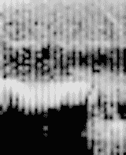

###### 图 7-1\. “yes”的频谱图


###### 图 7-2\. “no”的频谱图

通过在预处理过程中隔离频率信息，我们让模型的生活变得更轻松。在训练过程中，它不需要学习如何解释原始音频数据；相反，它可以使用一个更高层次的抽象来处理最有用的信息。

我们将在本章后面看到如何生成频谱图。现在，我们只需要知道模型将频谱图作为输入。因为频谱图是一个二维数组，我们将其作为 2D 张量输入到模型中。

有一种神经网络架构专门设计用于处理多维张量，其中信息包含在相邻值组之间的关系中。它被称为*卷积神经网络*（CNN）。

这种类型数据最常见的例子是图像，其中一组相邻的像素可能代表一个形状、图案或纹理。在训练过程中，CNN 能够识别这些特征并学习它们代表什么。

它可以学习简单图像特征（如线条或边缘）如何组合成更复杂的特征（如眼睛或耳朵），以及这些特征如何组合形成输入图像，比如人脸的照片。这意味着 CNN 可以学会区分不同类别的输入图像，比如区分人的照片和狗的照片。

尽管它们通常应用于图像，即像素的 2D 网格，但 CNN 可以与任何多维向量输入一起使用。事实证明，它们非常适合处理频谱图数据。

在第八章中，我们将看看这个模型是如何训练的。在那之前，让我们回到讨论我们应用程序的架构。

## 所有的组件

如前所述，我们的唤醒词应用程序比“hello world”示例更复杂。图 7-3 显示了组成它的组件。

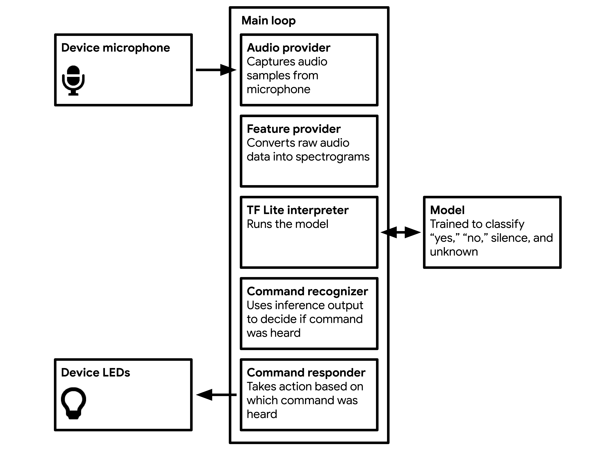

###### 图 7-3。我们唤醒词应用程序的组件

让我们来研究每个部分的功能：

主循环

与“hello world”示例一样，我们的应用程序在一个连续循环中运行。所有后续的过程都包含在其中，并且它们会持续执行，尽可能快地运行，即每秒多次。

音频提供者

音频提供者从麦克风捕获原始音频数据。由于不同设备捕获音频的方法各不相同，这个组件可以被覆盖和定制。

特征提供者

特征提供者将原始音频数据转换为我们模型所需的频谱图格式。它作为主循环的一部分以滚动方式提供，为解释器提供一系列重叠的一秒窗口。

TF Lite 解释器

解释器运行 TensorFlow Lite 模型，将输入的频谱图转换为一组概率。

模型

模型包含在数据数组中，并由解释器运行。该数组位于[*tiny_conv_micro_features_model_data.cc*](https://oreil.ly/XIUz9)中。

命令识别器

由于推断每秒运行多次，`RecognizeCommands`类聚合结果并确定是否平均听到了一个已知的单词。

命令响应器

如果听到了一个命令，命令响应器将使用设备的输出功能让用户知道。根据设备的不同，这可能意味着闪烁 LED 或在 LCD 显示器上显示数据。它可以被覆盖以适应不同的设备类型。

GitHub 上的示例文件包含了每个组件的测试。我们将逐步学习它们是如何工作的。

# 测试过程

就像第五章中一样，我们可以使用测试来了解应用程序的工作原理。我们已经涵盖了很多 C++和 TensorFlow Lite 的基础知识，因此不需要解释每一行代码。相反，让我们专注于每个测试的最重要部分，并解释发生了什么。

我们将探讨以下测试，您可以在[GitHub 存储库](https://oreil.ly/YiSbu)中找到：

[*micro_speech_test.cc*](https://oreil.ly/FiBEN)

展示如何对频谱图数据进行推断并解释结果

[*audio_provider_test.cc*](https://oreil.ly/bQOKd)

展示如何使用音频提供程序

[*feature_provider_mock_test.cc*](https://oreil.ly/V9rK8)

展示如何使用特征提供程序，使用*模拟*（虚假）音频提供程序的实现来传递虚假数据

[*recognize_commands_test.cc*](https://oreil.ly/P9pCG)

展示如何解释模型的输出以决定是否找到了命令

[*command_responder_test.cc*](https://oreil.ly/OqftF)

展示如何调用命令响应器以触发输出

示例中还有许多其他测试，但是探索这些测试将使我们了解关键的移动部分。

## 基本流程

测试*micro_speech_test.cc*遵循我们从“hello world”示例中熟悉的基本流程：加载模型，设置解释器并分配张量。

然而，有一个显著的区别。在“hello world”示例中，我们使用`AllOpsResolver`来引入可能需要运行模型的所有深度学习操作。这是一种可靠的方法，但是它是浪费的，因为给定模型可能并不使用所有数十个可用操作。当部署到设备时，这些不必要的操作将占用宝贵的内存，因此最好只包含我们需要的操作。

为此，我们首先在测试文件的顶部定义我们的模型将需要的操作：

```cpp
namespace tflite {
namespace ops {
namespace micro {
TfLiteRegistration* Register_DEPTHWISE_CONV_2D();
TfLiteRegistration* Register_FULLY_CONNECTED();
TfLiteRegistration* Register_SOFTMAX();
}  // namespace micro
}  // namespace ops
}  // namespace tflite
```

接下来，我们设置日志记录并加载我们的模型，正常进行：

```cpp
// Set up logging.
tflite::MicroErrorReporter micro_error_reporter;
tflite::ErrorReporter* error_reporter = &micro_error_reporter;
// Map the model into a usable data structure. This doesn't involve any
// copying or parsing, it's a very lightweight operation.
const tflite::Model* model =
    ::tflite::GetModel(g_tiny_conv_micro_features_model_data);
if (model->version() != TFLITE_SCHEMA_VERSION) {
  error_reporter->Report(
      "Model provided is schema version %d not equal "
      "to supported version %d.\n",
      model->version(), TFLITE_SCHEMA_VERSION);
}
```

加载模型后，我们声明一个`MicroMutableOpResolver`并使用其方法`AddBuiltin()`来添加我们之前列出的操作：

```cpp
tflite::MicroMutableOpResolver micro_mutable_op_resolver;
micro_mutable_op_resolver.AddBuiltin(
    tflite::BuiltinOperator_DEPTHWISE_CONV_2D,
    tflite::ops::micro::Register_DEPTHWISE_CONV_2D());
micro_mutable_op_resolver.AddBuiltin(
    tflite::BuiltinOperator_FULLY_CONNECTED,
    tflite::ops::micro::Register_FULLY_CONNECTED());
micro_mutable_op_resolver.AddBuiltin(tflite::BuiltinOperator_SOFTMAX,
                                      tflite::ops::micro::Register_SOFTMAX());
```

您可能想知道我们如何知道为给定模型包含哪些操作。一种方法是尝试使用`MicroMutableOpResolver`运行模型，但完全不调用`AddBuiltin()`。推断将失败，并且随附的错误消息将告诉我们缺少哪些操作需要添加。

###### 注意

`MicroMutableOpResolver`在[*tensorflow/lite/micro/micro_mutable_op_resolver.h*](https://oreil.ly/TGVZz)中定义，您需要将其添加到您的`include`语句中。

设置好`MicroMutableOpResolver`后，我们就像往常一样继续，设置解释器及其工作内存：

```cpp
// Create an area of memory to use for input, output, and intermediate arrays.
const int tensor_arena_size = 10 * 1024;
uint8_t tensor_arena[tensor_arena_size];
// Build an interpreter to run the model with.
tflite::MicroInterpreter interpreter(model, micro_mutable_op_resolver, tensor_arena,
                                     tensor_arena_size, error_reporter);
interpreter.AllocateTensors();
```

在我们的“hello world”应用程序中，我们仅为`tensor_arena`分配了 2 * 1,024 字节的空间，因为模型非常小。我们的语音模型要大得多，它处理更复杂的输入和输出，因此需要更多空间（10 1,024）。这是通过试错确定的。

接下来，我们检查输入张量的大小。但是，这次有点不同：

```cpp
// Get information about the memory area to use for the model's input.
TfLiteTensor* input = interpreter.input(0);
// Make sure the input has the properties we expect.
TF_LITE_MICRO_EXPECT_NE(nullptr, input);
TF_LITE_MICRO_EXPECT_EQ(4, input->dims->size);
TF_LITE_MICRO_EXPECT_EQ(1, input->dims->data[0]);
TF_LITE_MICRO_EXPECT_EQ(49, input->dims->data[1]);
TF_LITE_MICRO_EXPECT_EQ(40, input->dims->data[2]);
TF_LITE_MICRO_EXPECT_EQ(1, input->dims->data[3]);
TF_LITE_MICRO_EXPECT_EQ(kTfLiteUInt8, input->type);
```

因为我们的输入是频谱图，所以输入张量具有更多维度——总共四个。第一维只是包含单个元素的包装器。第二和第三代表我们的频谱图的“行”和“列”，恰好有 49 行和 40 列。输入张量的第四个、最内部的维度，大小为 1，保存频谱图的每个单独的“像素”。我们稍后将更详细地查看频谱图的结构。

接下来，我们获取一个“yes”样本频谱图，存储在常量`g_yes_micro_f2e59fea_nohash_1_data`中。该常量在文件[*micro_features/yes_micro_features_data.cc*](https://oreil.ly/rVn8O)中定义，该文件被此测试包含。频谱图存在为 1D 数组，我们只需迭代它将其复制到输入张量中：

```cpp
// Copy a spectrogram created from a .wav audio file of someone saying "Yes"
// into the memory area used for the input.
const uint8_t* yes_features_data = g_yes_micro_f2e59fea_nohash_1_data;
for (int i = 0; i < input->bytes; ++i) {
  input->data.uint8[i] = yes_features_data[i];
}
```

在输入被分配之后，我们运行推断并检查输出张量的大小和形状：

```cpp
// Run the model on this input and make sure it succeeds.
TfLiteStatus invoke_status = interpreter.Invoke();
if (invoke_status != kTfLiteOk) {
  error_reporter->Report("Invoke failed\n");
}
TF_LITE_MICRO_EXPECT_EQ(kTfLiteOk, invoke_status);

// Get the output from the model, and make sure it's the expected size and
// type.
TfLiteTensor* output = interpreter.output(0);
TF_LITE_MICRO_EXPECT_EQ(2, output->dims->size);
TF_LITE_MICRO_EXPECT_EQ(1, output->dims->data[0]);
TF_LITE_MICRO_EXPECT_EQ(4, output->dims->data[1]);
TF_LITE_MICRO_EXPECT_EQ(kTfLiteUInt8, output->type);
```

我们的输出有两个维度。第一个只是一个包装器。第二个有四个元素。这是保存每个四个类别（静音、未知、“是”和“否”）匹配概率的结构。

接下来的代码块检查概率是否符合预期。输出张量的每个元素始终代表一个特定的类别，因此我们知道要检查每个类别的哪个索引。这个顺序在训练期间定义：

```cpp
// There are four possible classes in the output, each with a score.
const int kSilenceIndex = 0;
const int kUnknownIndex = 1;
const int kYesIndex = 2;
const int kNoIndex = 3;

// Make sure that the expected "Yes" score is higher than the other classes.
uint8_t silence_score = output->data.uint8[kSilenceIndex];
uint8_t unknown_score = output->data.uint8[kUnknownIndex];
uint8_t yes_score = output->data.uint8[kYesIndex];
uint8_t no_score = output->data.uint8[kNoIndex];
TF_LITE_MICRO_EXPECT_GT(yes_score, silence_score);
TF_LITE_MICRO_EXPECT_GT(yes_score, unknown_score);
TF_LITE_MICRO_EXPECT_GT(yes_score, no_score);
```

我们传入了一个“是”频谱图，因此我们期望变量`yes_score`包含的概率高于`silence_score`、`unknown_score`和`no_score`。

当我们对“是”满意时，我们用“否”频谱图做同样的事情。首先，我们复制一个输入并运行推断：

```cpp
// Now test with a different input, from a recording of "No".
const uint8_t* no_features_data = g_no_micro_f9643d42_nohash_4_data;
for (int i = 0; i < input->bytes; ++i) {
  input->data.uint8[i] = no_features_data[i];
}
// Run the model on this "No" input.
invoke_status = interpreter.Invoke();
if (invoke_status != kTfLiteOk) {
  error_reporter->Report("Invoke failed\n");
}
TF_LITE_MICRO_EXPECT_EQ(kTfLiteOk, invoke_status);
```

推断完成后，我们确认“no”获得了最高分数：

```cpp
// Make sure that the expected "No" score is higher than the other classes.
silence_score = output->data.uint8[kSilenceIndex];
unknown_score = output->data.uint8[kUnknownIndex];
yes_score = output->data.uint8[kYesIndex];
no_score = output->data.uint8[kNoIndex];
TF_LITE_MICRO_EXPECT_GT(no_score, silence_score);
TF_LITE_MICRO_EXPECT_GT(no_score, unknown_score);
TF_LITE_MICRO_EXPECT_GT(no_score, yes_score);
```

我们完成了！

要运行此测试，请从 TensorFlow 存储库的根目录发出以下命令：

```cpp
make -f tensorflow/lite/micro/tools/make/Makefile \
  test_micro_speech_test
```

接下来，让我们看看所有音频数据的来源：音频提供程序。

## 音频提供程序

音频提供程序是将设备的麦克风硬件连接到我们的代码的部分。每个设备都有不同的机制来捕获音频。因此，[*audio_provider.h*](https://oreil.ly/89FGG)为请求音频数据定义了一个接口，开发人员可以为他们想要支持的任何平台编写自己的实现。

###### 提示

示例包括 Arduino、STM32F746G、SparkFun Edge 和 macOS 的音频提供程序实现。如果您希望此示例支持新设备，可以阅读现有的实现以了解如何实现。

音频提供程序的核心部分是一个名为`GetAudioSamples()`的函数，在*audio_provider.h*中定义。它看起来像这样：

```cpp
TfLiteStatus GetAudioSamples(tflite::ErrorReporter* error_reporter,
                             int start_ms, int duration_ms,
                             int* audio_samples_size, int16_t** audio_samples);
```

如*audio_provider.h*中所述，该函数应返回一个 16 位脉冲编码调制（PCM）音频数据数组。这是数字音频的一种非常常见的格式。

该函数被调用时带有一个`ErrorReporter`实例、一个开始时间（`start_ms`）、一个持续时间（`duration_ms`）和两个指针。

这些指针是`GetAudioSamples()`提供数据的机制。调用者声明适当类型的变量，然后在调用函数时将指针传递给它们。在函数的实现内部，指针被解引用，并设置变量的值。

第一个指针`audio_samples_size`将接收音频数据中 16 位样本的总数。第二个指针`audio_samples`将接收一个包含音频数据本身的数组。

通过查看测试，我们可以看到这一点。[*audio_provider_test.cc*](https://oreil.ly/9XgFg)中有两个测试，但我们只需要查看第一个来学习如何使用音频提供程序：

```cpp
TF_LITE_MICRO_TEST(TestAudioProvider) {
  tflite::MicroErrorReporter micro_error_reporter;
  tflite::ErrorReporter* error_reporter = &micro_error_reporter;

  int audio_samples_size = 0;
  int16_t* audio_samples = nullptr;
  TfLiteStatus get_status =
      GetAudioSamples(error_reporter, 0, kFeatureSliceDurationMs,
                      &audio_samples_size, &audio_samples);
  TF_LITE_MICRO_EXPECT_EQ(kTfLiteOk, get_status);
  TF_LITE_MICRO_EXPECT_LE(audio_samples_size, kMaxAudioSampleSize);
  TF_LITE_MICRO_EXPECT_NE(audio_samples, nullptr);

  // Make sure we can read all of the returned memory locations.
  int total = 0;
  for (int i = 0; i < audio_samples_size; ++i) {
    total += audio_samples[i];
  }
}
```

测试展示了如何使用一些值和一些指针调用`GetAudioSamples()`。测试确认在调用函数后指针被正确赋值。

###### 注意

您会注意到一些常量的使用，`kFeatureSliceDurationMs`和`kMaxAudioSampleSize`。这些是在模型训练时选择的值，您可以在[*micro_features/micro_model_settings.h*](https://oreil.ly/WLuug)中找到它们。

*audio_provider.cc*的默认实现只返回一个空数组。为了证明它的大小是正确的，测试只是简单地循环遍历它以获取预期数量的样本。

除了`GetAudioSamples()`之外，音频提供程序还包含一个名为`LatestAudioTimestamp()`的函数。这个函数旨在返回音频数据最后捕获的时间，以毫秒为单位。特征提供程序需要这些信息来确定要获取哪些音频数据。

要运行音频提供程序测试，请使用以下命令：

```cpp
make -f tensorflow/lite/micro/tools/make/Makefile \
  test_audio_provider_test
```

音频提供程序被特征提供程序用作新鲜音频样本的来源，所以让我们接着看一下。

## 特征提供程序

特征提供者将从音频提供者获取的原始音频转换为可以输入到我们模型中的频谱图。它在主循环中被调用。

其接口在[*feature_provider.h*](https://oreil.ly/59uTO)中定义，如下所示：

```cpp
class FeatureProvider {
 public:
  // Create the provider, and bind it to an area of memory. This memory should
  // remain accessible for the lifetime of the provider object, since subsequent
  // calls will fill it with feature data. The provider does no memory
  // management of this data.
  FeatureProvider(int feature_size, uint8_t* feature_data);
  ~FeatureProvider();

  // Fills the feature data with information from audio inputs, and returns how
  // many feature slices were updated.
  TfLiteStatus PopulateFeatureData(tflite::ErrorReporter* error_reporter,
                                   int32_t last_time_in_ms, int32_t time_in_ms,
                                   int* how_many_new_slices);

 private:
  int feature_size_;
  uint8_t* feature_data_;
  // Make sure we don't try to use cached information if this is the first call
  // into the provider.
  bool is_first_run_;
};
```

要查看它的使用方式，我们可以看一下[*feature_provider_mock_test.cc*](https://oreil.ly/N3YPu)中的测试。

为了使特征提供者能够处理音频数据，这些测试使用了一个特殊的假版本音频提供者，称为模拟，它被设置为提供音频数据。它在[*audio_provider_mock.cc*](https://oreil.ly/aQSP8)中定义。

###### 注意

在测试的构建说明中，模拟音频提供者被真实的东西替代，您可以在[*Makefile.inc*](https://oreil.ly/51m0b)中的`FEATURE_PROVIDER_MOCK_TEST_SRCS`下找到。

文件*feature_provider_mock_test.cc*包含两个测试。这是第一个：

```cpp
TF_LITE_MICRO_TEST(TestFeatureProviderMockYes) {
  tflite::MicroErrorReporter micro_error_reporter;
  tflite::ErrorReporter* error_reporter = &micro_error_reporter;

  uint8_t feature_data[kFeatureElementCount];
  FeatureProvider feature_provider(kFeatureElementCount, feature_data);

  int how_many_new_slices = 0;
  TfLiteStatus populate_status = feature_provider.PopulateFeatureData(
      error_reporter, /* last_time_in_ms= */ 0, /* time_in_ms= */ 970,
      &how_many_new_slices);
  TF_LITE_MICRO_EXPECT_EQ(kTfLiteOk, populate_status);
  TF_LITE_MICRO_EXPECT_EQ(kFeatureSliceCount, how_many_new_slices);

  for (int i = 0; i < kFeatureElementCount; ++i) {
    TF_LITE_MICRO_EXPECT_EQ(g_yes_micro_f2e59fea_nohash_1_data[i],
                            feature_data[i]);
  }
}
```

要创建一个`FeatureProvider`，我们调用它的构造函数，传入`feature_size`和`feature_data`参数：

```cpp
FeatureProvider feature_provider(kFeatureElementCount, feature_data);
```

第一个参数指示频谱图中应该有多少总数据元素。第二个参数是一个指向我们希望用频谱图数据填充的数组的指针。

频谱图中的元素数量是在模型训练时决定的，并在[*micro_features/micro_model_settings.h*](https://oreil.ly/FdUCq)中定义为`kFeatureElementCount`。

为了获取过去一秒钟的音频特征，会调用`feature_provider.PopulateFeatureData()`：

```cpp
TfLiteStatus populate_status = feature_provider.PopulateFeatureData(
      error_reporter, /* last_time_in_ms= */ 0, /* time_in_ms= */ 970,
      &how_many_new_slices);
```

我们提供一个`ErrorReporter`实例，一个表示上次调用此方法的时间的整数（`last_time_in_ms`），当前时间（`time_in_ms`）以及一个指向整数的指针，该指针将更新为我们接收到多少个新的*特征切片*（`how_many_new_slices`）。切片只是频谱图的一行，代表一段时间。

因为我们总是想要最后一秒钟的音频，特征提供者将比较上次调用时的时间（`last_time_in_ms`）和当前时间（`time_in_ms`），从那段时间内捕获的音频创建频谱数据，然后更新`feature_data`数组以添加任何额外的切片并删除超过一秒钟的旧切片。

当`PopulateFeatureData()`运行时，它将从模拟音频提供者请求音频。模拟将提供代表“yes”的音频，特征提供者将处理它并提供结果。

在调用`PopulateFeatureData()`之后，我们检查其结果是否符合预期。我们将生成的数据与由模拟音频提供者提供的“yes”输入的已知频谱图进行比较：

```cpp
TF_LITE_MICRO_EXPECT_EQ(kTfLiteOk, populate_status);
TF_LITE_MICRO_EXPECT_EQ(kFeatureSliceCount, how_many_new_slices);
for (int i = 0; i < kFeatureElementCount; ++i) {
  TF_LITE_MICRO_EXPECT_EQ(g_yes_micro_f2e59fea_nohash_1_data[i],
                          feature_data[i]);
}
```

模拟音频提供者可以根据传入的开始和结束时间提供“yes”或“no”的音频。*feature_provider_mock_test.cc*中的第二个测试与第一个测试完全相同，但表示“no”的音频。

运行测试时，请使用以下命令：

```cpp
make -f tensorflow/lite/micro/tools/make/Makefile \
  test_feature_provider_mock_test
```

### 特征提供者如何将音频转换为频谱图

特征提供者在[*feature_provider.cc*](https://oreil.ly/xzLzE)中实现。让我们来看看它是如何工作的。

正如我们讨论过的，它的工作是填充一个代表一秒钟音频的频谱图的数组。它被设计为在循环中调用，因此为了避免不必要的工作，它只会为现在和上次调用之间的时间生成新的特征。如果它在不到一秒钟之前被调用，它将保留一些先前的输出并仅生成缺失的部分。

在我们的代码中，每个频谱图都表示为一个二维数组，有 40 列和 49 行，其中每一行代表一个 30 毫秒（ms）的音频样本，分成 43 个频率桶。

为了创建每一行，我们通过*快速傅立叶变换*（FFT）算法运行 30 毫秒的音频输入。这种技术分析了样本中音频的频率分布，并创建了一个由 256 个频率桶组成的数组，每个值从 0 到 255。这些被平均成六组，留下 43 个桶。

执行此操作的代码位于文件[*micro_features/micro_features_generator.cc*](https://oreil.ly/HVU2G)中，并由特征提供程序调用。

为了构建整个二维数组，我们将在 49 个连续的 30 毫秒音频片段上运行 FFT 的结果组合在一起，每个片段与上一个片段重叠 10 毫秒。图 7-4 展示了这是如何发生的。

您可以看到 30 毫秒的样本窗口每次向前移动 20 毫秒，直到覆盖完整的一秒样本。生成的频谱图准备传递到我们的模型中。

我们可以在*feature_provider.cc*中了解这个过程是如何发生的。首先，它根据上次调用`PopulateFeatureData()`的时间确定实际需要生成哪些片段：

```cpp
// Quantize the time into steps as long as each window stride, so we can
// figure out which audio data we need to fetch.
const int last_step = (last_time_in_ms / kFeatureSliceStrideMs);
const int current_step = (time_in_ms / kFeatureSliceStrideMs);

int slices_needed = current_step - last_step;
```

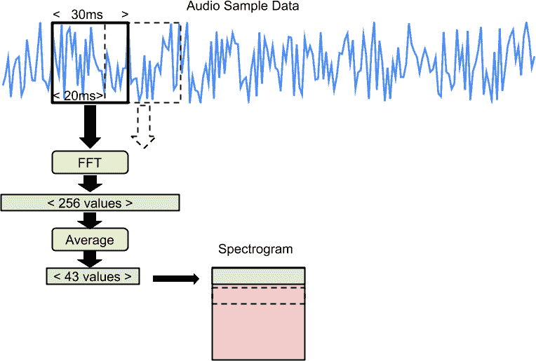

###### 图 7-4。正在处理的音频样本的图表

如果它以前没有运行过，或者它在一秒钟前运行过，它将生成最大数量的片段：

```cpp
if (is_first_run_) {
  TfLiteStatus init_status = InitializeMicroFeatures(error_reporter);
  if (init_status != kTfLiteOk) {
    return init_status;
  }
  is_first_run_ = false;
  slices_needed = kFeatureSliceCount;
}
if (slices_needed > kFeatureSliceCount) {
  slices_needed = kFeatureSliceCount;
}
*how_many_new_slices = slices_needed;
```

生成的数字被写入`how_many_new_slices`。

接下来，它计算应保留多少现有片段，并将数组中的数据移动以为任何新片段腾出空间：

```cpp
const int slices_to_keep = kFeatureSliceCount - slices_needed;
const int slices_to_drop = kFeatureSliceCount - slices_to_keep;
// If we can avoid recalculating some slices, just move the existing data
// up in the spectrogram, to perform something like this:
// last time = 80ms          current time = 120ms
// +-----------+             +-----------+
// | data@20ms |         --> | data@60ms |
// +-----------+       --    +-----------+
// | data@40ms |     --  --> | data@80ms |
// +-----------+   --  --    +-----------+
// | data@60ms | --  --      |  <empty>  |
// +-----------+   --        +-----------+
// | data@80ms | --          |  <empty>  |
// +-----------+             +-----------+
if (slices_to_keep > 0) {
  for (int dest_slice = 0; dest_slice < slices_to_keep; ++dest_slice) {
    uint8_t* dest_slice_data =
        feature_data_ + (dest_slice * kFeatureSliceSize);
    const int src_slice = dest_slice + slices_to_drop;
    const uint8_t* src_slice_data =
        feature_data_ + (src_slice * kFeatureSliceSize);
    for (int i = 0; i < kFeatureSliceSize; ++i) {
      dest_slice_data[i] = src_slice_data[i];
    }
  }
}
```

###### 注意

如果您是经验丰富的 C++作者，您可能会想知道为什么我们不使用标准库来做诸如数据复制之类的事情。原因是我们试图避免不必要的依赖关系，以保持我们的二进制文件大小较小。因为嵌入式平台的内存非常有限，较小的应用程序二进制文件意味着我们有空间容纳更大更准确的深度学习模型。

在移动数据之后，它开始一个循环，每次迭代一次，它都需要一个新的片段。在这个循环中，它首先使用`GetAudioSamples()`从音频提供程序请求该片段的音频：

```cpp
for (int new_slice = slices_to_keep; new_slice < kFeatureSliceCount;
     ++new_slice) {
  const int new_step = (current_step - kFeatureSliceCount + 1) + new_slice;
  const int32_t slice_start_ms = (new_step * kFeatureSliceStrideMs);
  int16_t* audio_samples = nullptr;
  int audio_samples_size = 0;
  GetAudioSamples(error_reporter, slice_start_ms, kFeatureSliceDurationMs,
                  &audio_samples_size, &audio_samples);
  if (audio_samples_size < kMaxAudioSampleSize) {
    error_reporter->Report("Audio data size %d too small, want %d",
                           audio_samples_size, kMaxAudioSampleSize);
    return kTfLiteError;
  }
```

要完成循环迭代，它将数据传递给`GenerateMicroFeatures()`，在*micro_features/micro_features_generator.h*中定义。这是执行 FFT 并返回音频频率信息的函数。

它还传递了一个指针`new_slice_data`，指向新数据应写入的内存位置：

```cpp
  uint8_t* new_slice_data = feature_data_ + (new_slice * kFeatureSliceSize);
  size_t num_samples_read;
  TfLiteStatus generate_status = GenerateMicroFeatures(
      error_reporter, audio_samples, audio_samples_size, kFeatureSliceSize,
      new_slice_data, &num_samples_read);
  if (generate_status != kTfLiteOk) {
    return generate_status;
  }
}
```

在每个片段完成这个过程之后，我们有了整整一秒的最新频谱图。

###### 提示

生成 FFT 的函数是`GenerateMicroFeatures()`。如果您感兴趣，您可以在[*micro_features/micro_features_generator.cc*](https://oreil.ly/L0juB)中阅读其定义。

如果您正在构建自己的应用程序并使用频谱图，您可以直接重用此代码。在训练模型时，您需要使用相同的代码将数据预处理为频谱图。

一旦我们有了频谱图，我们就可以使用模型对其进行推理。发生这种情况后，我们需要解释结果。这项任务属于我们接下来要探讨的类`RecognizeCommands`。

## 命令识别器

在我们的模型输出了一组概率，表明在音频的最后一秒中说出了一个已知的单词之后，`RecognizeCommands`类的工作就是确定这是否表示成功的检测。

这似乎很简单：如果给定类别中的概率超过某个阈值，那么该单词已被说出。然而，在现实世界中，事情变得有点复杂。

正如我们之前建立的，我们每秒运行多个推理，每个推理在一秒钟的数据窗口上运行。这意味着我们将在任何给定单词上多次运行推理，在多个窗口上。

在图 7-5 中，您可以看到单词“noted”被说出的波形，周围有一个代表被捕获的一秒窗口的框。

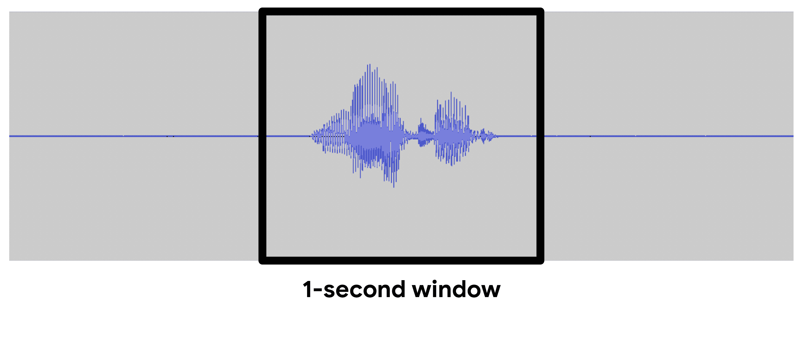

###### 图 7-5。在我们的窗口中捕获到的单词“noted”

我们的模型经过训练，可以检测到“no”一词，并且它知道“noted”一词不是同一回事。如果我们在这一秒钟的窗口上进行推理，它将（希望）输出“no”一词的低概率。但是，如果窗口稍早出现在音频流中，如图 7-6 中所示，会发生什么呢？

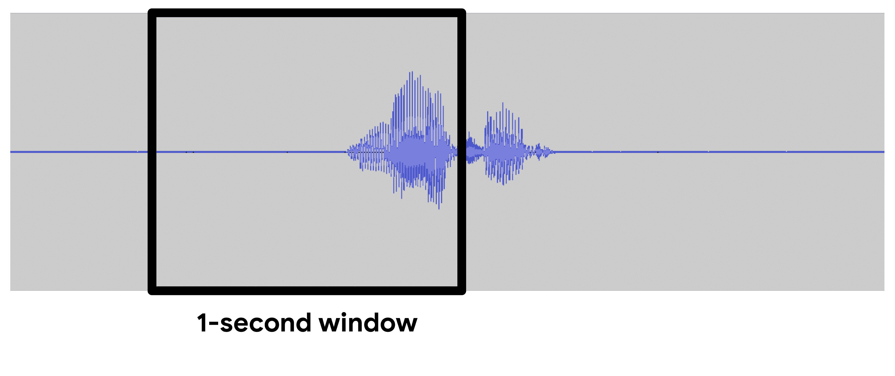

###### 图 7-6。在我们的窗口中捕获到“noted”一词的部分

在这种情况下，“noted”一词的唯一部分出现在窗口中的是它的第一个音节。因为“noted”的第一个音节听起来像“no”，所以模型很可能会将其解释为“no”的概率很高。

这个问题，以及其他问题，意味着我们不能依赖单个推理来告诉我们一个单词是否被说出。这就是`RecognizeCommands`的作用所在！

识别器计算每个单词在过去几次推理中的平均分数，并决定是否高到足以被视为检测。为了做到这一点，我们将每个推理结果传递给它。

你可以在[*recognize_commands.h*](https://oreil.ly/5W3Ea)中看到它的接口，这里部分重现：

```cpp
class RecognizeCommands {
 public:
  explicit RecognizeCommands(tflite::ErrorReporter* error_reporter,
                             int32_t average_window_duration_ms = 1000,
                             uint8_t detection_threshold = 200,
                             int32_t suppression_ms = 1500,
                             int32_t minimum_count = 3);

  // Call this with the results of running a model on sample data.
  TfLiteStatus ProcessLatestResults(const TfLiteTensor* latest_results,
                                    const int32_t current_time_ms,
                                    const char** found_command, uint8_t* score,
                                    bool* is_new_command);
```

类`RecognizeCommands`被定义，以及一个构造函数，为一些默认值进行了定义：

+   平均窗口的长度（`average_window_duration_ms`）

+   作为检测的最低平均分数（`detection_threshold`）

+   在识别第二个命令之前听到命令后等待的时间量（`suppression_ms`）

+   在窗口中需要的最小推理数量，以便结果计数（`3`）

该类有一个方法，`ProcessLatestResults()`。它接受一个指向包含模型输出的`TfLiteTensor`的指针（`latest_results`），并且必须在当前时间（`current_time_ms`）下调用。

此外，它还接受三个指针用于输出。首先，它给出了任何被检测到的单词的名称（`found_command`）。它还提供了命令的平均分数（`score`）以及命令是新的还是在一定时间内的先前推理中已经听到过（`is_new_command`）。

对多次推理结果进行平均是处理时间序列数据时的一种有用且常见的技术。在接下来的几页中，我们将逐步介绍[*recognize_commands.cc*](https://oreil.ly/lAh-0)中的代码，并了解一些它的工作原理。你不需要理解每一行，但了解一些可能对你自己的项目有帮助的工具是有益的。

首先，我们确保输入张量的形状和类型是正确的：

```cpp
TfLiteStatus RecognizeCommands::ProcessLatestResults(
    const TfLiteTensor* latest_results, const int32_t current_time_ms,
    const char** found_command, uint8_t* score, bool* is_new_command) {
  if ((latest_results->dims->size != 2) ||
      (latest_results->dims->data[0] != 1) ||
      (latest_results->dims->data[1] != kCategoryCount)) {
    error_reporter_->Report(
        "The results for recognition should contain %d elements, but there are "
        "%d in an %d-dimensional shape",
        kCategoryCount, latest_results->dims->data[1],
        latest_results->dims->size);
    return kTfLiteError;
  }

  if (latest_results->type != kTfLiteUInt8) {
    error_reporter_->Report(
        "The results for recognition should be uint8 elements, but are %d",
        latest_results->type);
    return kTfLiteError;
  }
```

接下来，我们检查`current_time_ms`以验证它是否在我们的平均窗口中最近的结果之后：

```cpp
if ((!previous_results_.empty()) &&
    (current_time_ms < previous_results_.front().time_)) {
  error_reporter_->Report(
      "Results must be fed in increasing time order, but received a "
      "timestamp of %d that was earlier than the previous one of %d",
      current_time_ms, previous_results_.front().time_);
  return kTfLiteError;
}
```

之后，我们将最新的结果添加到我们将要进行平均的结果列表中：

```cpp
// Add the latest results to the head of the queue.
previous_results_.push_back({current_time_ms, latest_results->data.uint8});
// Prune any earlier results that are too old for the averaging window.
const int64_t time_limit = current_time_ms - average_window_duration_ms_;
while ((!previous_results_.empty()) &&
       previous_results_.front().time_ < time_limit) {
  previous_results_.pop_front();
```

如果我们的平均窗口中的结果少于最小数量（由`minimum_count_`定义，默认为`3`），我们无法提供有效的平均值。在这种情况下，我们将输出指针设置为指示`found_command`是最近的顶级命令，分数为 0，并且该命令不是新的：

```cpp
// If there are too few results, assume the result will be unreliable and
// bail.
const int64_t how_many_results = previous_results_.size();
const int64_t earliest_time = previous_results_.front().time_;
const int64_t samples_duration = current_time_ms - earliest_time;
if ((how_many_results < minimum_count_) ||
    (samples_duration < (average_window_duration_ms_ / 4))) {
  *found_command = previous_top_label_;
  *score = 0;
  *is_new_command = false;
  return kTfLiteOk;
}
```

否则，我们继续通过平均窗口中的所有分数：

```cpp
// Calculate the average score across all the results in the window.
int32_t average_scores[kCategoryCount];
for (int offset = 0; offset < previous_results_.size(); ++offset) {
  PreviousResultsQueue::Result previous_result =
      previous_results_.from_front(offset);
  const uint8_t* scores = previous_result.scores_;
  for (int i = 0; i < kCategoryCount; ++i) {
    if (offset == 0) {
      average_scores[i] = scores[i];
    } else {
      average_scores[i] += scores[i];
    }
  }
}
for (int i = 0; i < kCategoryCount; ++i) {
  average_scores[i] /= how_many_results;
}
```

现在我们有足够的信息来确定哪个类别是我们的赢家。建立这一点是一个简单的过程：

```cpp
// Find the current highest scoring category.
int current_top_index = 0;
int32_t current_top_score = 0;
for (int i = 0; i < kCategoryCount; ++i) {
  if (average_scores[i] > current_top_score) {
    current_top_score = average_scores[i];
    current_top_index = i;
  }
}
const char* current_top_label = kCategoryLabels[current_top_index];
```

最后一部分逻辑确定结果是否是有效检测。为了做到这一点，它确保其分数高于检测阈值（默认为 200），并且它没有在上次有效检测之后发生得太快，这可能是一个错误结果的指示：

```cpp
// If we've recently had another label trigger, assume one that occurs too
// soon afterwards is a bad result.
int64_t time_since_last_top;
if ((previous_top_label_ == kCategoryLabels[0]) ||
    (previous_top_label_time_ == std::numeric_limits<int32_t>::min())) {
  time_since_last_top = std::numeric_limits<int32_t>::max();
} else {
  time_since_last_top = current_time_ms - previous_top_label_time_;
}
if ((current_top_score > detection_threshold_) &&
    ((current_top_label != previous_top_label_) ||
     (time_since_last_top > suppression_ms_))) {
  previous_top_label_ = current_top_label;
  previous_top_label_time_ = current_time_ms;
  *is_new_command = true;
} else {
  *is_new_command = false;
}
*found_command = current_top_label;
*score = current_top_score;
```

如果结果有效，`is_new_command`被设置为`true`。这是调用者可以用来确定一个单词是否真正被检测到。

测试（在[*recognize_commands_test.cc*](https://oreil.ly/rOkMb)中）对存储在平均窗口中的各种不同输入和结果进行了测试。

让我们走一遍`RecognizeCommandsTestBasic`中的一个测试，演示了如何使用`RecognizeCommands`。首先，我们只是创建了该类的一个实例：

```cpp
TF_LITE_MICRO_TEST(RecognizeCommandsTestBasic) {
  tflite::MicroErrorReporter micro_error_reporter;
  tflite::ErrorReporter* error_reporter = &micro_error_reporter;

  RecognizeCommands recognize_commands(error_reporter);
```

接下来，我们创建一个包含一些虚假推理结果的张量，这将由`ProcessLatestResults()`使用来决定是否听到了命令：

```cpp
TfLiteTensor results = tflite::testing::CreateQuantizedTensor(
    {255, 0, 0, 0}, tflite::testing::IntArrayFromInitializer({2, 1, 4}),
    "input_tensor", 0.0f, 128.0f);
```

然后，我们设置一些变量，这些变量将被`ProcessLatestResults()`的输出设置：

```cpp
const char* found_command;
uint8_t score;
bool is_new_command;
```

最后，我们调用`ProcessLatestResults()`，提供这些变量的指针以及包含结果的张量。我们断言该函数将返回`kTfLiteOk`，表示输入已成功处理：

```cpp
TF_LITE_MICRO_EXPECT_EQ(
    kTfLiteOk, recognize_commands.ProcessLatestResults(
                   &results, 0, &found_command, &score, &is_new_command));
```

文件中的其他测试执行了一些更详尽的检查，以确保函数的正确执行。您可以阅读它们以了解更多信息。

要运行所有测试，请使用以下命令：

```cpp
make -f tensorflow/lite/micro/tools/make/Makefile \
  test_recognize_commands_test
```

一旦我们确定是否检测到命令，就是与世界分享我们的结果的时候了（或者至少是我们的板载 LED）。命令响应器就是让这一切发生的原因。

## 命令响应器

我们谜题的最后一块，命令响应器，是产生输出的部分，让我们知道检测到了一个单词。

命令响应器被设计为针对每种类型的设备进行覆盖。我们将在本章后面探讨特定设备的实现。

现在，让我们看一下它非常简单的参考实现，它只是将检测结果记录为文本。您可以在文件[*command_responder.cc*](https://oreil.ly/kMjg2)中找到它：

```cpp
void RespondToCommand(tflite::ErrorReporter* error_reporter,
                      int32_t current_time, const char* found_command,
                      uint8_t score, bool is_new_command) {
  if (is_new_command) {
    error_reporter->Report("Heard %s (%d) @%dms", found_command, score,
                           current_time);
  }
}
```

就是这样！该文件只实现了一个函数：`RespondToCommand()`。作为参数，它期望一个`error_reporter`，当前时间（`current_time`），上次检测到的命令（`found_command`），它收到的分数（`score`）以及命令是否是新听到的（`is_new_command`）。

重要的是要注意，在我们程序的主循环中，每次执行推理时都会调用此函数，即使没有检测到命令。这意味着我们应该检查`is_new_command`以确定是否需要执行任何操作。

在[*command_responder_test.cc*](https://oreil.ly/loLZo)中对此函数的测试同样简单。它只是调用该函数，因为它无法测试生成正确的输出：

```cpp
TF_LITE_MICRO_TEST(TestCallability) {
  tflite::MicroErrorReporter micro_error_reporter;
  tflite::ErrorReporter* error_reporter = &micro_error_reporter;

  // This will have external side-effects (like printing to the debug console
  // or lighting an LED) that are hard to observe, so the most we can do is
  // make sure the call doesn't crash.
  RespondToCommand(error_reporter, 0, "foo", 0, true);
}
```

要运行此测试，请在终端中输入以下内容：

```cpp
make -f tensorflow/lite/micro/tools/make/Makefile \
  test_command_responder_test
```

就是这样！我们已经走过了应用程序的所有组件。现在，让我们看看它们如何在程序中结合在一起。

# 监听唤醒词

您可以在[*main_functions.cc*](https://oreil.ly/n2eD1)中找到以下代码，该代码定义了我们程序的核心`setup()`和`loop()`函数。让我们一起阅读一下！

因为您现在是一个经验丰富的 TensorFlow Lite 专家，所以这些代码对您来说应该很熟悉。让我们试着专注于新的部分。

首先，我们列出要使用的操作：

```cpp
namespace tflite {
namespace ops {
namespace micro {
TfLiteRegistration* Register_DEPTHWISE_CONV_2D();
TfLiteRegistration* Register_FULLY_CONNECTED();
TfLiteRegistration* Register_SOFTMAX();
}  // namespace micro
}  // namespace ops
}  // namespace tflite
```

接下来，我们设置全局变量：

```cpp
namespace {
tflite::ErrorReporter* error_reporter = nullptr;
const tflite::Model* model = nullptr;
tflite::MicroInterpreter* interpreter = nullptr;
TfLiteTensor* model_input = nullptr;
FeatureProvider* feature_provider = nullptr;
RecognizeCommands* recognizer = nullptr;
int32_t previous_time = 0;

// Create an area of memory to use for input, output, and intermediate arrays.
// The size of this will depend on the model you're using, and may need to be
// determined by experimentation.
constexpr int kTensorArenaSize = 10 * 1024;
uint8_t tensor_arena[kTensorArenaSize];
}  // namespace
```

请注意，除了通常的 TensorFlow 组件外，我们还声明了一个`FeatureProvider`和一个`RecognizeCommands`。我们还声明了一个名为`g_previous_time`的变量，用于跟踪我们接收到新音频样本的最近时间。

接下来，在`setup()`函数中，我们加载模型，设置解释器，添加操作并分配张量：

```cpp
void setup() {
  // Set up logging.
  static tflite::MicroErrorReporter micro_error_reporter;
  error_reporter = &micro_error_reporter;

  // Map the model into a usable data structure. This doesn't involve any
  // copying or parsing, it's a very lightweight operation.
  model = tflite::GetModel(g_tiny_conv_micro_features_model_data);
  if (model->version() != TFLITE_SCHEMA_VERSION) {
    error_reporter->Report(
        "Model provided is schema version %d not equal "
        "to supported version %d.",
        model->version(), TFLITE_SCHEMA_VERSION);
    return;
  }

  // Pull in only the operation implementations we need.
  static tflite::MicroMutableOpResolver micro_mutable_op_resolver;
  micro_mutable_op_resolver.AddBuiltin(
      tflite::BuiltinOperator_DEPTHWISE_CONV_2D,
      tflite::ops::micro::Register_DEPTHWISE_CONV_2D());
  micro_mutable_op_resolver.AddBuiltin(
      tflite::BuiltinOperator_FULLY_CONNECTED,
      tflite::ops::micro::Register_FULLY_CONNECTED());
  micro_mutable_op_resolver.AddBuiltin(tflite::BuiltinOperator_SOFTMAX,
                                       tflite::ops::micro::Register_SOFTMAX());

  // Build an interpreter to run the model with.
  static tflite::MicroInterpreter static_interpreter(
      model, micro_mutable_op_resolver, tensor_arena, kTensorArenaSize,
      error_reporter);
  interpreter = &static_interpreter;

  // Allocate memory from the tensor_arena for the model's tensors.
  TfLiteStatus allocate_status = interpreter->AllocateTensors();
  if (allocate_status != kTfLiteOk) {
    error_reporter->Report("AllocateTensors() failed");
    return;
  }
```

在分配张量之后，我们检查输入张量是否具有正确的形状和类型：

```cpp
  // Get information about the memory area to use for the model's input.
  model_input = interpreter->input(0);
  if ((model_input->dims->size != 4) || (model_input->dims->data[0] != 1) ||
      (model_input->dims->data[1] != kFeatureSliceCount) ||
      (model_input->dims->data[2] != kFeatureSliceSize) ||
      (model_input->type != kTfLiteUInt8)) {
    error_reporter->Report("Bad input tensor parameters in model");
    return;
  }
```

接下来是有趣的部分。首先，我们实例化一个`FeatureProvider`，将其指向我们的输入张量：

```cpp
  // Prepare to access the audio spectrograms from a microphone or other source
  // that will provide the inputs to the neural network.
  static FeatureProvider static_feature_provider(kFeatureElementCount,
                                                 model_input->data.uint8);
  feature_provider = &static_feature_provider;
```

然后我们创建一个`RecognizeCommands`实例并初始化我们的`previous_time`变量：

```cpp
  static RecognizeCommands static_recognizer(error_reporter);
  recognizer = &static_recognizer;

  previous_time = 0;
}
```

接下来，是我们的`loop()`函数的时间了。就像前面的例子一样，这个函数将被无限次调用。在循环中，我们首先使用特征提供程序创建一个频谱图：

```cpp
void loop() {
  // Fetch the spectrogram for the current time.
  const int32_t current_time = LatestAudioTimestamp();
  int how_many_new_slices = 0;
  TfLiteStatus feature_status = feature_provider->PopulateFeatureData(
      error_reporter, previous_time, current_time, &how_many_new_slices);
  if (feature_status != kTfLiteOk) {
    error_reporter->Report("Feature generation failed");
    return;
  }
  previous_time = current_time;
  // If no new audio samples have been received since last time, don't bother
  // running the network model.
  if (how_many_new_slices == 0) {
    return;
  }
```

如果自上次迭代以来没有新数据，我们就不会运行推理。

当我们有了输入后，我们只需调用解释器：

```cpp
  // Run the model on the spectrogram input and make sure it succeeds.
  TfLiteStatus invoke_status = interpreter->Invoke();
  if (invoke_status != kTfLiteOk) {
    error_reporter->Report("Invoke failed");
    return;
  }
```

现在，模型的输出张量已经填充了每个类别的概率。为了解释它们，我们使用我们的`RecognizeCommands`实例。我们获取输出张量的指针，然后设置一些变量来接收`ProcessLatestResults()`的输出：

```cpp
  // Obtain a pointer to the output tensor
  TfLiteTensor* output = interpreter->output(0);
  // Determine whether a command was recognized based on the output of inference
  const char* found_command = nullptr;
  uint8_t score = 0;
  bool is_new_command = false;
  TfLiteStatus process_status = recognizer->ProcessLatestResults(
      output, current_time, &found_command, &score, &is_new_command);
  if (process_status != kTfLiteOk) {
    error_reporter->Report("RecognizeCommands::ProcessLatestResults() failed");
    return;
  }
```

最后，我们调用命令响应器的`RespondToCommand()`方法，以便它可以通知用户是否检测到了一个单词：

```cpp
  // Do something based on the recognized command. The default implementation
  // just prints to the error console, but you should replace this with your
  // own function for a real application.
  RespondToCommand(error_reporter, current_time, found_command, score,
                   is_new_command);
}
```

就是这样！调用`RespondToCommand()`是我们循环中的最后一件事。从特征生成开始，一直到之后的所有内容都将无限重复，检查已知单词的音频并在确认时产生一些输出。

我们的`setup()`和`loop()`函数是由我们的`main()`函数调用的，该函数在*main.cc*中定义，当应用程序启动时开始循环：

```cpp
int main(int argc, char* argv[]) {
  setup();
  while (true) {
    loop();
  }
}
```

## 运行我们的应用程序

示例包含一个与 macOS 兼容的音频提供程序。如果您有 Mac，可以在开发机器上运行示例。首先，使用以下命令构建它：

```cpp
make -f tensorflow/lite/micro/tools/make/Makefile micro_speech
```

构建完成后，您可以使用以下命令运行示例：

```cpp
tensorflow/lite/micro/tools/make/gen/osx_x86_64/bin/micro_speech
```

您可能会看到一个弹出窗口询问麦克风访问权限。如果是这样，请授予权限，程序将开始运行。

尝试说“是”和“否”。您应该看到类似以下的输出：

```cpp
Heard yes (201) @4056ms
Heard no (205) @6448ms
Heard unknown (201) @13696ms
Heard yes (205) @15000ms
Heard yes (205) @16856ms
Heard unknown (204) @18704ms
Heard no (206) @21000ms
```

每个检测到的单词后面都是它的得分。默认情况下，命令识别器组件仅在其得分超过 200 时才将匹配视为有效，因此您看到的所有得分都至少为 200。

得分后面的数字是自程序启动以来的毫秒数。

如果您没有看到任何输出，请确保 Mac 的内置麦克风在 Mac 的声音菜单中被选中，并且其输入音量足够高。

我们已经确定程序在 Mac 上运行正常。现在，让我们在一些嵌入式硬件上运行它。

# 部署到微控制器

在本节中，我们将代码部署到三种不同的设备上：

+   [Arduino Nano 33 BLE Sense](https://oreil.ly/ztU5E)

+   [SparkFun Edge](https://oreil.ly/-hoL-)

+   [ST Microelectronics STM32F746G Discovery kit](https://oreil.ly/cvm4J)

对于每个设备，我们将详细介绍构建和部署过程。

因为每个设备都有自己的捕获音频机制，所以对于每个设备都有一个单独的*audio_provider.cc*实现。输出也是如此，因此每个设备也有一个*command_responder.cc*的变体。

*audio_provider.cc*的实现是复杂的，与设备相关，并且与机器学习没有直接关系。因此，在本章中我们不会详细介绍它们。然而，在附录 B 中有 Arduino 变体的详细说明。如果您需要在自己的项目中捕获音频，欢迎在您自己的代码中重用这些实现。

除了部署说明，我们还将为每个设备详细介绍*command_responder.cc*的实现。首先，是 Arduino 的时间。

## Arduino

截至目前，唯一具有内置麦克风的 Arduino 板是[Arduino Nano 33 BLE Sense](https://oreil.ly/hjOzL)，因此我们将在本节中使用它。如果您使用不同的 Arduino 板并连接自己的麦克风，您将需要实现自己的*audio_provider.cc*。

Arduino Nano 33 BLE Sense 还具有内置 LED，这是我们用来指示已识别单词的 LED。

图 7-7 显示了板上的 LED 的图片。

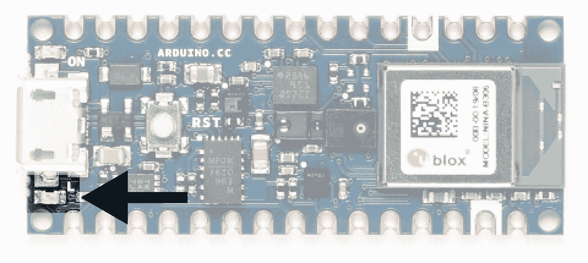

###### 图 7-7。Arduino Nano 33 BLE Sense 板上的 LED 高亮显示

现在让我们看看如何使用这个 LED 来指示已经检测到一个单词。

### 在 Arduino 上响应命令

每个 Arduino 板都有一个内置 LED，并且有一个方便的常量叫做`LED_BUILTIN`，我们可以使用它来获取其引脚号，这在各个板上是不同的。为了保持代码的可移植性，我们将限制自己只使用这个单个 LED 进行输出。

我们要做的是这样的。为了显示推理正在运行，我们将通过每次推理切换 LED 的开关状态来闪烁 LED。但是，当我们听到“yes”这个词时，我们会将 LED 打开几秒钟。

那么“no”这个词呢？嗯，因为这只是一个演示，我们不会太担心它。但是，我们会将所有检测到的命令记录到串行端口，这样我们就可以连接到设备并查看每个匹配项。

Arduino 的替代命令响应器位于[*arduino/command_responder.cc*](https://oreil.ly/URkYi)。让我们浏览一下它的源代码。首先，我们包含命令响应器头文件和 Arduino 平台的库头文件：

```cpp
#include "tensorflow/lite/micro/examples/micro_speech/command_responder.h"
#include "Arduino.h"
```

接下来，我们开始实现我们的函数：

```cpp
// Toggles the LED every inference, and keeps it on for 3 seconds if a "yes"
// was heard
void RespondToCommand(tflite::ErrorReporter* error_reporter,
                      int32_t current_time, const char* found_command,
                      uint8_t score, bool is_new_command) {
```

我们的下一步是将内置 LED 的引脚设置为输出模式，以便我们可以打开和关闭它。我们在一个`if`语句中执行此操作，该语句仅运行一次，这要归功于名为`is_initialized`的`static bool`。请记住，`static`变量在函数调用之间保留其状态：

```cpp
static bool is_initialized = false;
if (!is_initialized) {
  pinMode(LED_BUILTIN, OUTPUT);
  is_initialized = true;
}
```

接下来，我们设置另外两个`static`变量来跟踪上次检测到“yes”的时间以及已执行的推理次数：

```cpp
static int32_t last_yes_time = 0;
static int count = 0;
```

现在是有趣的部分。如果`is_new_command`参数为`true`，我们知道我们听到了什么，因此我们使用`ErrorReporter`实例记录它。但是如果我们听到的是“yes”——我们通过检查`found_command`字符数组的第一个字符来确定——我们存储当前时间并打开 LED：

```cpp
if (is_new_command) {
  error_reporter->Report("Heard %s (%d) @%dms", found_command, score,
                         current_time);
  // If we heard a "yes", switch on an LED and store the time.
  if (found_command[0] == 'y') {
    last_yes_time = current_time;
    digitalWrite(LED_BUILTIN, HIGH);
  }
}
```

接下来，我们实现了在几秒钟后关闭 LED 的行为——确切地说是三秒：

```cpp
// If last_yes_time is non-zero but was >3 seconds ago, zero it
// and switch off the LED.
if (last_yes_time != 0) {
  if (last_yes_time < (current_time - 3000)) {
    last_yes_time = 0;
    digitalWrite(LED_BUILTIN, LOW);
  }
  // If it is non-zero but <3 seconds ago, do nothing.
  return;
}
```

当 LED 关闭时，我们还将`last_yet_time`设置为`0`，这样我们在下次听到“yes”之前不会进入这个`if`语句。`return`语句很重要：如果我们最近听到“yes”，它会阻止任何进一步的输出代码运行，因此 LED 会保持亮起状态。

到目前为止，我们的实现将在听到“yes”时打开 LED 约三秒钟。接下来的部分将通过每次推理切换 LED 的开关状态，除了在“yes”模式下，我们通过前面提到的`return`语句阻止到达这一点。

以下是最终的代码块：

```cpp
// Otherwise, toggle the LED every time an inference is performed.
++count;
if (count & 1) {
  digitalWrite(LED_BUILTIN, HIGH);
} else {
  digitalWrite(LED_BUILTIN, LOW);
}
```

通过为每次推理增加`count`变量，我们跟踪我们执行的总推理次数。在`if`条件中，我们使用`&`运算符对`count`变量和数字`1`进行二进制 AND 运算。

通过对`count`和`1`进行 AND 运算，我们过滤掉`count`的所有位，除了最小的位。如果最小位是`0`，表示`count`是一个奇数，结果将是`0`。在 C++ 的`if 语句`中，这将评估为`false`。

否则，结果将是`1`，表示一个偶数。因为`1`被评估为`true`，我们的 LED 将在偶数值时打开，并在奇数值时关闭。这就是它的切换功能。

就是这样！我们现在已经为 Arduino 实现了命令响应器。让我们运行它，以便看到它的运行情况。

### 运行示例

要部署此示例，我们需要：

+   一个 Arduino Nano 33 BLE Sense 开发板

+   一个 micro-USB 电缆

+   Arduino IDE

###### 提示

由于这本书编写时可能已经发生了变化，因此请查看[*README.md*](https://oreil.ly/7VozJ)获取最新的说明。

本书中的项目作为 TensorFlow Lite Arduino 库中的示例代码可用。如果您尚未安装该库，请打开 Arduino IDE 并从工具菜单中选择管理库。在出现的窗口中，搜索并安装名为 *Arduino_TensorFlowLite* 的库。您应该能够使用最新版本，但如果遇到问题，本书测试过的版本是 1.14-ALPHA。

###### 注意

您还可以从*.zip*文件安装库，您可以从 TensorFlow Lite 团队[下载](https://oreil.ly/blgB8)，或者使用 TensorFlow Lite for Microcontrollers Makefile 自动生成。如果您更喜欢后者，请参阅附录 A。

安装完库后，`micro_speech`示例将显示在文件菜单下的示例→Arduino_TensorFlowLite 中，如图 7-8 所示。

单击“micro_speech”加载示例。它将显示为一个新窗口，每个源文件都有一个选项卡。第一个选项卡中的文件*micro_speech*相当于我们之前讨论过的*main_functions.cc*。

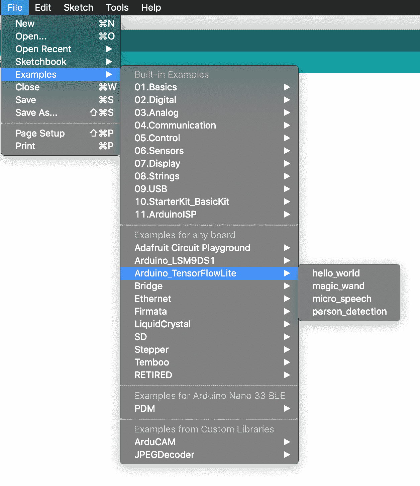

###### 图 7-8。示例菜单

###### 注意

“运行示例”已经解释了 Arduino 示例的结构，所以我们不会在这里再次涉及。

要运行示例，请通过 USB 连接您的 Arduino 设备。确保从“工具”菜单中的板下拉列表中选择了正确的设备类型，如图 7-9 所示。

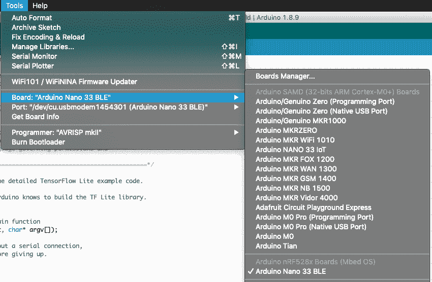

###### 图 7-9。板下拉列表

如果您的设备名称未出现在列表中，则需要安装其支持包。要执行此操作，请单击“Boards Manager”。在弹出的窗口中，搜索您的设备，然后安装相应支持包的最新版本。接下来，请确保设备的端口已在“工具”菜单中的端口下拉列表中选择，如图 7-10 所示。


###### 图 7-10。端口下拉列表

最后，在 Arduino 窗口中，单击上传按钮（在图 7-11 中用白色突出显示）来编译和上传代码到您的 Arduino 设备。


###### 图 7-11。上传按钮，一个向右的箭头

上传成功后，您应该看到 Arduino 板上的 LED 开始闪烁。

要测试程序，请尝试说“yes”。当它检测到“yes”时，LED 将保持稳定点亮约三秒钟。

###### 提示

如果程序无法识别您的“yes”，请尝试连续说几次。

您还可以通过 Arduino 串行监视器查看推断结果。要执行此操作，请从“工具”菜单中打开串行监视器。现在，请尝试说“yes”、“no”和其他单词。您应该看到类似图 7-12 的内容。

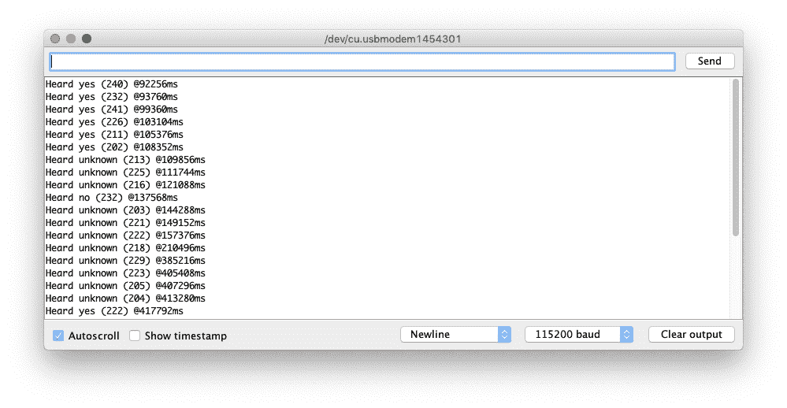

###### 图 7-12。串行监视器显示一些匹配项

###### 注意

我们使用的模型很小且不完美，您可能会注意到它在检测“yes”方面比“no”更好。这是优化微小模型大小可能导致准确性问题的一个例子。我们在第八章中涵盖了这个主题。

### 进行您自己的更改

现在您已部署了应用程序，请尝试玩弄代码！您可以在 Arduino IDE 中编辑源文件。保存时，您将被提示在新位置重新保存示例。在进行更改后，您可以单击 Arduino IDE 中的上传按钮来构建和部署。

以下是您可以尝试的一些想法：

+   将示例切换为在说“no”时点亮 LED，而不是“yes”时，

+   使应用程序响应特定的“yes”和“no”命令序列，如秘密代码短语。

+   使用“yes”和“no”命令来控制其他组件，如额外的 LED 或伺服。

## SparkFun Edge

SparkFun Edge 既有麦克风，又有一排四个彩色 LED 灯—红色、蓝色、绿色和黄色—这将使显示结果变得容易。图 7-13 显示了高亮显示了 SparkFun Edge 的 LED 灯。

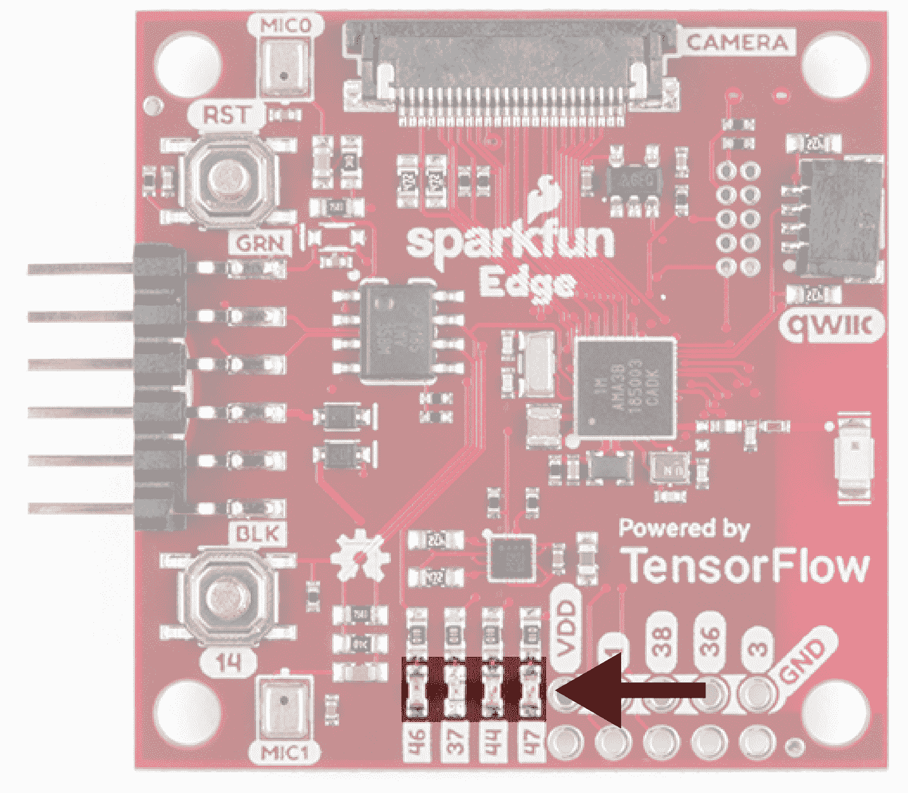

###### 图 7-13。SparkFun Edge 的四个 LED

### 响应 SparkFun Edge 上的命令

为了清楚地表明我们的程序正在运行，让我们在每次推理时切换蓝色 LED 的开关。当听到“是”时，我们将打开黄色 LED，当听到“否”时，我们将打开红色 LED，当听到未知命令时，我们将打开绿色 LED。

SparkFun Edge 的命令响应器实现在[*sparkfun_edge/command_responder.cc*](https://oreil.ly/i-3eJ)中。该文件以一些包含开始：

```cpp
#include "tensorflow/lite/micro/examples/micro_speech/command_responder.h"
#include "am_bsp.h"
```

*command_responder.h*包含了这个文件对应的头文件。*am_bsp.h*是 Ambiq Apollo3 SDK，在上一章中已经看到。

在函数定义内部，我们首先将连接到 LED 的引脚设置为输出：

```cpp
// This implementation will light up the LEDs on the board in response to
// different commands.
void RespondToCommand(tflite::ErrorReporter* error_reporter,
                      int32_t current_time, const char* found_command,
                      uint8_t score, bool is_new_command) {
  static bool is_initialized = false;
  if (!is_initialized) {
    am_hal_gpio_pinconfig(AM_BSP_GPIO_LED_RED, g_AM_HAL_GPIO_OUTPUT_12);
    am_hal_gpio_pinconfig(AM_BSP_GPIO_LED_BLUE, g_AM_HAL_GPIO_OUTPUT_12);
    am_hal_gpio_pinconfig(AM_BSP_GPIO_LED_GREEN, g_AM_HAL_GPIO_OUTPUT_12);
    am_hal_gpio_pinconfig(AM_BSP_GPIO_LED_YELLOW, g_AM_HAL_GPIO_OUTPUT_12);
    is_initialized = true;
  }
```

我们从 Apollo3 SDK 中调用`am_hal_gpio_pinconfig()`函数，将所有四个 LED 引脚设置为输出模式，表示为常量`g_AM_HAL_GPIO_OUTPUT_12`。我们使用`is_initialized` `static`变量确保我们只执行一次！

接下来是将切换蓝色 LED 打开和关闭的代码。我们使用一个`count`变量来执行此操作，方式与 Arduino 实现相同：

```cpp
static int count = 0;
// Toggle the blue LED every time an inference is performed.
++count;
if (count & 1) {
  am_hal_gpio_output_set(AM_BSP_GPIO_LED_BLUE);
} else {
  am_hal_gpio_output_clear(AM_BSP_GPIO_LED_BLUE);
}
```

此代码使用`am_hal_gpio_output_set()`和`am_hal_gpio_output_clear()`函数来切换蓝色 LED 的引脚开关。

通过在每次推理时递增`count`变量，我们可以跟踪我们执行的推理总数。在`if`条件内部，我们使用`&`运算符对`count`变量和数字`1`进行二进制 AND 操作。

通过对`count`和`1`进行 AND 运算，我们过滤掉`count`的所有位，除了最小的位。如果最小位是`0`，表示`count`是奇数，结果将是`0`。在 C++的`if 语句`中，这将评估为`false`。

否则，结果将是`1`，表示偶数。因为`1`评估为`true`，所以我们的 LED 将在偶数值时打开，并在奇数值时关闭。这就是它的切换原理。

接下来，根据刚刚听到的单词点亮适当的 LED。默认情况下，我们清除所有 LED，因此如果最近没有听到单词，则所有 LED 将熄灭：

```cpp
am_hal_gpio_output_clear(AM_BSP_GPIO_LED_RED);
am_hal_gpio_output_clear(AM_BSP_GPIO_LED_YELLOW);
am_hal_gpio_output_clear(AM_BSP_GPIO_LED_GREEN);
```

然后，我们使用一些简单的`if`语句根据听到的命令点亮适当的 LED：

```cpp
if (is_new_command) {
  error_reporter->Report("Heard %s (%d) @%dms", found_command, score,
                         current_time);
  if (found_command[0] == 'y') {
    am_hal_gpio_output_set(AM_BSP_GPIO_LED_YELLOW);
  }
  if (found_command[0] == 'n') {
    am_hal_gpio_output_set(AM_BSP_GPIO_LED_RED);
  }
  if (found_command[0] == 'u') {
    am_hal_gpio_output_set(AM_BSP_GPIO_LED_GREEN);
  }
}
```

正如我们之前看到的，只有当`RespondToCommand()`被调用时传入了一个真正的新命令，`is_new_command`才为`true`，因此如果没有听到新命令，LED 将保持关闭。否则，我们使用`am_hal_gpio_output_set()`函数打开适当的 LED。

### 运行示例

我们已经详细介绍了如何在 SparkFun Edge 上点亮 LED 的示例代码。接下来，让我们启动并运行示例。

###### 提示

建议查看[*README.md*](https://oreil.ly/U3Cgo)以获取最新指令，因为构建过程可能会有变化。

要构建和部署我们的代码，我们需要以下内容：

+   一个 SparkFun Edge 板

+   一个 USB 编程器（我们推荐 SparkFun Serial Basic Breakout，可在[micro-B USB](https://oreil.ly/2GMNf)和[USB-C](https://oreil.ly/lp39T)变体中获得）

+   匹配的 USB 电缆

+   Python 3 和一些依赖项

###### 接下来

第六章展示了如何确认您是否安装了正确版本的 Python。如果您已经这样做了，太好了。如果没有，请翻回到“运行示例”查看一下。

在您的终端中，克隆 TensorFlow 存储库，然后切换到其目录：

```cpp
git clone https://github.com/tensorflow/tensorflow.git
cd tensorflow
```

接下来，我们将构建二进制文件并运行一些命令，使其准备好下载到设备中。为了避免一些打字，您可以从[*README.md*](https://oreil.ly/xY-Rj)中复制并粘贴这些命令。

#### 构建二进制文件

以下命令下载所有所需的依赖项，然后为 SparkFun Edge 编译一个二进制文件：

```cpp
make -f tensorflow/lite/micro/tools/make/Makefile \
  TARGET=sparkfun_edge TAGS=cmsis-nn micro_speech_bin
```

二进制文件被创建为*.bin*文件，在以下位置：

```cpp
tensorflow/lite/micro/tools/make/gen/ \
  sparkfun_edge_cortex-m4/bin/micro_speech.bin
```

要检查文件是否存在，可以使用以下命令：

```cpp
test -f tensorflow/lite/micro/tools/make/gen/ \
  sparkfun_edge_cortex-m4/bin/micro_speech.bin \
  &&  echo "Binary was successfully created" || echo "Binary is missing"
```

如果运行该命令，您应该看到`二进制文件已成功创建`打印到控制台。如果看到`二进制文件丢失`，则构建过程中出现问题。如果是这样，`make`命令的输出中可能有一些指示出了问题的线索。

#### 签署二进制文件

必须使用加密密钥对二进制文件进行签名，以部署到设备。现在让我们运行一些命令来对二进制文件进行签名，以便将其刷写到 SparkFun Edge。这里使用的脚本来自 Ambiq SDK，在运行 Makefile 时下载。

输入以下命令设置一些虚拟加密密钥，以供开发使用：

```cpp
cp tensorflow/lite/micro/tools/make/downloads/AmbiqSuite-Rel2.0.0/ \
  tools/apollo3_scripts/keys_info0.py \
  tensorflow/lite/micro/tools/make/downloads/AmbiqSuite-Rel2.0.0/ \
  tools/apollo3_scripts/keys_info.py
```

接下来，运行以下命令创建一个已签名的二进制文件。如有必要，用`python3`替换`python`：

```cpp
python3 tensorflow/lite/micro/tools/make/downloads/ \
  AmbiqSuite-Rel2.0.0/tools/apollo3_scripts/create_cust_image_blob.py \
  --bin tensorflow/lite/micro/tools/make/gen/ \
  sparkfun_edge_cortex-m4/bin/micro_speech.bin \
  --load-address 0xC000 \
  --magic-num 0xCB -o main_nonsecure_ota \
  --version 0x0
```

这将创建文件*main_nonsecure_ota.bin*。现在运行此命令以创建文件的最终版本，该文件可用于使用下一步中将使用的脚本刷写设备：

```cpp
python3 tensorflow/lite/micro/tools/make/downloads/ \
  AmbiqSuite-Rel2.0.0/tools/apollo3_scripts/create_cust_wireupdate_blob.py \
  --load-address 0x20000 \
  --bin main_nonsecure_ota.bin \
  -i 6 -o main_nonsecure_wire \
  --options 0x1
```

现在应该在运行命令的目录中有一个名为*main_nonsecure_wire.bin*的文件。这是您将要刷写到设备的文件。

#### 刷写二进制文件

SparkFun Edge 将当前运行的程序存储在其 1 兆字节的闪存中。如果要让板运行新程序，需要将其发送到板上，板将将其存储在闪存中，覆盖以前保存的任何程序。

#### 将编程器连接到板上

要将新程序下载到板上，您将使用 SparkFun USB-C 串行基础串行编程器。此设备允许计算机通过 USB 与微控制器通信。

要将此设备连接到板上，请执行以下步骤：

1.  在 SparkFun Edge 的侧面，找到六针排针。

1.  将 SparkFun USB-C 串行基础插入这些引脚，确保每个设备上标有 BLK 和 GRN 的引脚正确对齐，如图 7-14 所示。

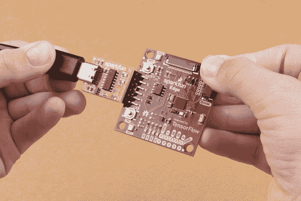

###### 图 7-14\. 连接 SparkFun Edge 和 USB-C 串行基础（由 SparkFun 提供）

#### 将编程器连接到计算机

通过 USB 将板连接到计算机。要对板进行编程，您需要找出计算机分配给设备的名称。最佳方法是在连接之前和之后列出所有计算机设备，然后查看哪个设备是新的。

###### 警告

一些人报告了他们操作系统的默认驱动程序与编程器存在问题，因此我们强烈建议在继续之前安装[驱动程序](https://oreil.ly/kohTX)。

在通过 USB 连接设备之前，运行以下命令：

```cpp
# macOS:
ls /dev/cu*

# Linux:
ls /dev/tty*
```

这应该输出一个附加设备列表，看起来类似于以下内容：

```cpp
/dev/cu.Bluetooth-Incoming-Port
/dev/cu.MALS
/dev/cu.SOC
```

现在，将编程器连接到计算机的 USB 端口，并再次运行命令：

```cpp
# macOS:
ls /dev/cu*

# Linux:
ls /dev/tty*
```

您应该看到输出中有一个额外的项目，如下例所示。您的新项目可能有不同的名称。这个新项目是设备的名称：

```cpp
/dev/cu.Bluetooth-Incoming-Port
/dev/cu.MALS
/dev/cu.SOC
/dev/cu.wchusbserial-1450
```

此名称将用于引用设备。但是，它可能会根据编程器连接到的 USB 端口而更改，因此如果您从计算机断开板然后重新连接，可能需要再次查找其名称。

###### 提示

一些用户报告说列表中出现了两个设备。如果看到两个设备，则应使用以“wch”开头的正确设备；例如，“/dev/wchusbserial-14410”。

确定设备名称后，将其放入 shell 变量以供以后使用：

```cpp
export DEVICENAME=<*your device name here*>

```

这是在后续过程中运行需要设备名称的命令时可以使用的变量。

#### 运行脚本刷写板

要刷写板，必须将其置于特殊的“引导加载程序”状态，以准备接收新的二进制文件。然后运行一个脚本将二进制文件发送到板上。

首先创建一个环境变量来指定波特率，即数据发送到设备的速度：

```cpp
export BAUD_RATE=921600
```

现在将以下命令粘贴到你的终端中，但*不要立即按回车*！命令中的`${DEVICENAME}`和`${BAUD_RATE}`将被替换为你在前面部分设置的值。如果需要，请记得将`python3`替换为`python`：

```cpp
python3 tensorflow/lite/micro/tools/make/downloads/ \
  AmbiqSuite-Rel2.0.0/tools/apollo3_scripts/uart_wired_update.py \
  -b ${BAUD_RATE} ${DEVICENAME} \
  -r 1 -f main_nonsecure_wire.bin \
  -i 6
```

接下来，你将重置板子到引导加载程序状态并刷写板子。在板子上，找到标有`RST`和`14`的按钮，如图 7-15 所示。执行以下步骤：

1.  确保你的板子连接到编程器，并且整个东西通过 USB 连接到你的计算机。

1.  在板子上，按住标有`14`的按钮。*继续按住*。

1.  在继续按住标有`14`的按钮的同时，按下标有`RST`的按钮来重置板子。

1.  按下计算机上的回车键来运行脚本。*继续按住按钮`14`。*

现在你应该在屏幕上看到类似以下内容的东西：

```cpp
Connecting with Corvette over serial port /dev/cu.usbserial-1440...
Sending Hello.
Received response for Hello
Received Status
length =  0x58
version =  0x3
Max Storage =  0x4ffa0
Status =  0x2
State =  0x7
AMInfo =
0x1
0xff2da3ff
0x55fff
0x1
0x49f40003
0xffffffff
[...lots more 0xffffffff...]
Sending OTA Descriptor =  0xfe000
Sending Update Command.
number of updates needed =  1
Sending block of size  0x158b0  from  0x0  to  0x158b0
Sending Data Packet of length  8180
Sending Data Packet of length  8180
[...lots more Sending Data Packet of length  8180...]
```


###### 图 7-15。SparkFun Edge 的按钮

继续按住按钮`14`直到看到`发送数据包长度为 8180`。在看到这个之后你可以释放按钮（但如果继续按住也没关系）。程序将继续在终端上打印行。最终，你会看到类似以下内容的东西：

```cpp
[...lots more Sending Data Packet of length  8180...]
Sending Data Packet of length  8180
Sending Data Packet of length  6440
Sending Reset Command.
Done.
```

这表示刷写成功。

###### 提示

如果程序输出以错误结束，请检查是否打印了`发送重置命令。`。如果是这样，尽管有错误，刷写可能是成功的。否则，刷写可能失败了。尝试再次运行这些步骤（你可以跳过设置环境变量）。

### 测试程序

为了确保程序正在运行，按下`RST`按钮。现在你应该看到蓝色 LED 在闪烁。

要测试程序，尝试说“yes”。当它检测到“yes”时，橙色 LED 会闪烁。该模型还经过训练以识别“no”，以及当说出未知单词时。红色 LED 应该会为“no”闪烁，绿色 LED 为未知。

如果程序无法识别你的“yes”，尝试连续几次说：“yes, yes, yes”。

我们正在使用的模型很小且不完美，你可能会注意到它在检测“yes”方面比“no”更好，而“no”经常被识别为“unknown”。这是一个优化微小模型大小可能导致准确性问题的例子。我们在第八章中涵盖了这个主题。

### 查看调试数据

程序还将成功识别记录到串行端口。要查看这些数据，我们可以使用波特率为 115200 监视板子的串行端口输出。在 macOS 和 Linux 上，以下命令应该有效：

```cpp
screen ${DEVICENAME} 115200
```

你应该最初看到类似以下内容的输出：

```cpp
Apollo3 Burst Mode is Available

                               Apollo3 operating in Burst Mode (96MHz)
```

尝试通过说“yes”或“no”来发出一些命令。你应该看到板子为每个命令打印调试信息：

```cpp
Heard yes (202) @65536ms
```

要停止使用`screen`查看调试输出，按下 Ctrl-A，然后立即按 K 键，然后按 Y 键。

### 制作你自己的更改

现在你已经部署了基本应用程序，尝试玩耍并做一些更改。你可以在*tensorflow/lite/micro/examples/micro_speech*文件夹中找到应用程序的代码。只需编辑并保存，然后重复前面的说明来将修改后的代码部署到设备上。

以下是一些你可以尝试的事情：

+   `RespondToCommand()`的`score`参数显示了预测分数。使用 LED 作为一个表明匹配强度的仪表。

+   使应用程序响应特定的“yes”和“no”命令序列，就像一个秘密代码短语一样。

+   使用“yes”和“no”命令来控制其他组件，比如额外的 LED 或伺服。

## ST 微电子 STM32F746G Discovery Kit

因为 STM32F746G 配备了一个漂亮的 LCD 显示屏，我们可以用它来展示检测到的唤醒词，如图 7-16 所示。

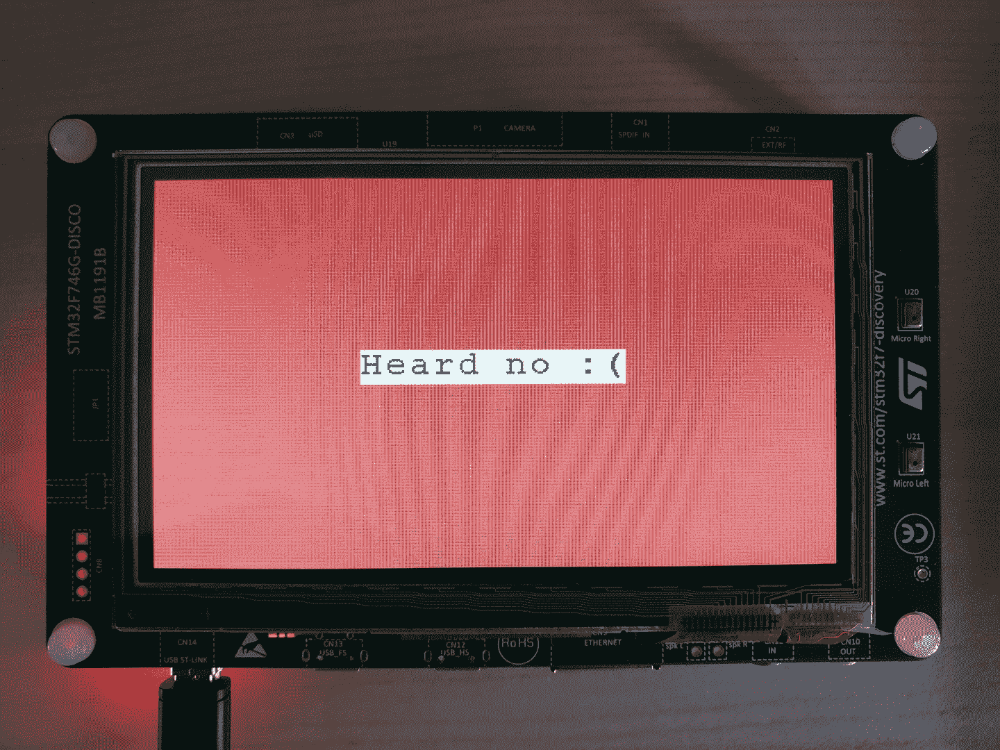

###### 图 7-16\. STM32F746G 显示“否”

### 响应 STM32F746G 上的命令

STM32F746G 的 LCD 驱动程序提供了一些方法，我们可以使用这些方法将文本写入显示器。在这个练习中，我们将使用这些方法显示以下消息之一，具体取决于听到的命令：

+   “听到了是！”

+   “听到了否 :(”

+   “听到了未知”

+   “听到了沉默”

我们还将根据听到的命令设置不同的背景颜色。

首先，我们包含一些头文件：

```cpp
#include "tensorflow/lite/micro/examples/micro_speech/command_responder.h"
#include "LCD_DISCO_F746NG.h"
```

第一个是*command_responder.h*，只是声明了此文件的接口。第二个是*LCD_DISCO_F74NG.h*，为我们提供了控制设备 LCD 显示的接口。您可以在[Mbed 网站](https://oreil.ly/6oirs)上阅读更多信息。

接下来，我们实例化一个`LCD_DISCO_F746NG`对象，其中包含我们用来控制 LCD 的方法：

```cpp
LCD_DISCO_F746NG lcd;
```

在接下来的几行中，声明了`RespondToCommand()`函数，并检查是否已使用新命令调用它：

```cpp
// When a command is detected, write it to the display and log it to the
// serial port.
void RespondToCommand(tflite::ErrorReporter *error_reporter,
                      int32_t current_time, const char *found_command,
                      uint8_t score, bool is_new_command) {
  if (is_new_command) {
    error_reporter->Report("Heard %s (%d) @%dms", found_command, score,
                           current_time);
```

当我们知道这是一个新命令时，我们使用`error_reporter`将其记录到串行端口。

接下来，我们使用一个大的`if`语句来确定每个命令被找到时会发生什么。首先是“是”：

```cpp
if (*found_command == 'y') {
  lcd.Clear(0xFF0F9D58);
  lcd.DisplayStringAt(0, LINE(5), (uint8_t *)"Heard yes!", CENTER_MODE);
```

我们使用`lcd.Clear()`来清除屏幕上的任何先前内容并设置新的背景颜色，就像刷了一层新油漆。颜色`0xFF0F9D58`是一种漂亮的深绿色。

在我们的绿色背景上，我们使用`lcd.DisplayStringAt()`来绘制一些文本。第一个参数指定*x*坐标，第二个指定*y*。为了将文本大致定位在显示器中间，我们使用一个辅助函数`LINE()`来确定对应于屏幕上第五行文本的*y*坐标。

第三个参数是我们将显示的文本字符串，第四个参数确定文本的对齐方式；在这里，我们使用常量`CENTER_MODE`来指定文本是居中对齐的。

我们继续`if`语句以涵盖剩下的三种可能性，“否”，“未知”和“沉默”（由`else`块捕获）：

```cpp
} else if (*found_command == 'n') {
  lcd.Clear(0xFFDB4437);
  lcd.DisplayStringAt(0, LINE(5), (uint8_t *)"Heard no :(", CENTER_MODE);
} else if (*found_command == 'u') {
  lcd.Clear(0xFFF4B400);
  lcd.DisplayStringAt(0, LINE(5), (uint8_t *)"Heard unknown", CENTER_MODE);
} else {
  lcd.Clear(0xFF4285F4);
  lcd.DisplayStringAt(0, LINE(5), (uint8_t *)"Heard silence", CENTER_MODE);
}
```

就是这样！因为 LCD 库为我们提供了如此简单的高级控制显示的方法，所以不需要太多代码来输出我们的结果。让我们部署示例以查看所有这些操作。

### 运行示例

现在我们可以使用 Mbed 工具链将我们的应用程序部署到设备上。

###### 提示

建议检查[*README.md*](https://oreil.ly/1INIO)以获取最新说明，因为构建过程可能会在编写本书时发生变化。

在开始之前，我们需要以下内容：

+   一个 STM32F746G Discovery kit 开发板

+   一个迷你 USB 电缆

+   使用 Arm Mbed CLI（请参考[Mbed 设置指南](https://oreil.ly/tR57j)）

+   Python 3 和`pip`

与 Arduino IDE 类似，Mbed 要求源文件以特定方式结构化。TensorFlow Lite for Microcontrollers Makefile 知道如何为我们做这个，并可以生成适合 Mbed 构建的目录。

为此，请运行以下命令：

```cpp
make -f tensorflow/lite/micro/tools/make/Makefile \
  TARGET=mbed TAGS="cmsis-nn disco_f746ng" generate_micro_speech_mbed_project
```

这将创建一个新目录：

```cpp
tensorflow/lite/micro/tools/make/gen/mbed_cortex-m4/prj/ \
  micro_speech/mbed
```

该目录包含了所有示例的依赖项，以 Mbed 能够构建它的正确方式结构化。

首先，切换到目录，以便您可以在其中运行一些命令：

```cpp
cd tensorflow/lite/micro/tools/make/gen/mbed_cortex-m4/prj/micro_speech/mbed
```

接下来，您将使用 Mbed 下载依赖项并构建项目。

首先，使用以下命令告诉 Mbed 当前目录是 Mbed 项目的根目录：

```cpp
mbed config root .
```

接下来，指示 Mbed 下载依赖项并准备构建：

```cpp
mbed deploy
```

默认情况下，Mbed 使用 C++98 构建项目。然而，TensorFlow Lite 需要 C++11。运行以下 Python 片段修改 Mbed 配置文件，以便使用 C++11。您可以直接在命令行中键入或粘贴：

```cpp
python -c 'import fileinput, glob;
for filename in glob.glob("mbed-os/tools/profiles/*.json"):
  for line in fileinput.input(filename, inplace=True):
    print(line.replace("\"-std=gnu++98\"","\"-std=c++11\", \"-fpermissive\""))'
```

最后，运行以下命令进行编译：

```cpp
mbed compile -m DISCO_F746NG -t GCC_ARM
```

这应该会在以下路径生成一个二进制文件：

```cpp
./BUILD/DISCO_F746NG/GCC_ARM/mbed.bin
```

STM32F746G 开发板的一个好处是部署非常容易。要部署，只需将 STM 板插入并将文件复制到其中。在 macOS 上，您可以使用以下命令来执行此操作：

```cpp
cp ./BUILD/DISCO_F746NG/GCC_ARM/mbed.bin /Volumes/DIS_F746NG/
```

或者，只需在文件浏览器中找到`DIS_F746NG`卷，并将文件拖放过去。

复制文件会启动闪存过程。

### 测试程序

完成后，尝试说“yes”。您应该看到适当的文本出现在显示屏上，背景颜色也会改变。

如果程序无法识别您的“yes”，请尝试连续几次说出来，比如“yes, yes, yes”。

我们正在使用的模型很小且不完美，您可能会注意到它更擅长检测“yes”而不是“no”，后者通常被识别为“unknown”。这是一个示例，说明为微小模型大小进行优化可能会导致准确性问题。我们在第八章中涵盖了这个主题。

### 查看调试数据

该程序还会将成功识别记录到串行端口。要查看输出，请使用波特率 9600 建立与板的串行连接。

在 macOS 和 Linux 上，当您发出以下命令时，设备应该会列出：

```cpp
ls /dev/tty*
```

它看起来会像下面这样：

```cpp
/dev/tty.usbmodem1454203
```

在识别设备后，使用以下命令连接到设备，将<`*/dev/tty.devicename*`>替换为设备在*/dev*中显示的名称：

```cpp
screen /dev/<*tty.devicename 9600*>

```

尝试通过说“yes”或“no”来发出一些命令。您应该看到板子为每个命令打印调试信息：

```cpp
Heard yes (202) @65536ms
```

要停止使用`screen`查看调试输出，请按 Ctrl-A，紧接着按 K 键，然后按 Y 键。

###### 注意

如果您不确定如何在您的平台上建立串行连接，您可以尝试[CoolTerm](https://oreil.ly/FP7gK)，它适用于 Windows、macOS 和 Linux。该板应该会出现在 CoolTerm 的端口下拉列表中。确保将波特率设置为 9600。

### 进行自己的更改

现在您已经部署了应用程序，可以尝试玩耍并进行一些更改。您可以在*tensorflow/lite/micro/tools/make/gen/mbed_cortex-m4/prj/micro_speech/mbed*文件夹中找到应用程序的代码。只需编辑、保存，然后重复前面的说明，将修改后的代码部署到设备上。

以下是您可以尝试的一些事项：

+   `RespondToCommand()`函数的`score`参数显示了预测得分。在 LCD 显示屏上创建一个得分的可视指示器。

+   使应用程序响应特定的“yes”和“no”命令序列，如秘密代码短语。

+   使用“yes”和“no”命令来控制其他组件，如额外的 LED 或伺服。

# 总结

我们已经讨论过的应用程序代码主要涉及从硬件捕获数据，然后提取适合推理的特征。实际上将数据提供给模型并运行推理的部分相对较小，并且与第六章中涵盖的示例非常相似。

这在机器学习项目中是相当典型的。模型已经训练好了，因此我们的工作只是不断为其提供适当类型的数据。作为一个使用 TensorFlow Lite 的嵌入式开发人员，您将花费大部分编程时间捕获传感器数据，将其处理为特征，并响应模型的输出。推理部分本身快速且简单。

但嵌入式应用程序只是整个包的一部分，真正有趣的部分是模型。在第八章中，您将学习如何训练自己的语音模型以侦听不同的单词。您还将了解更多关于它是如何工作的。
