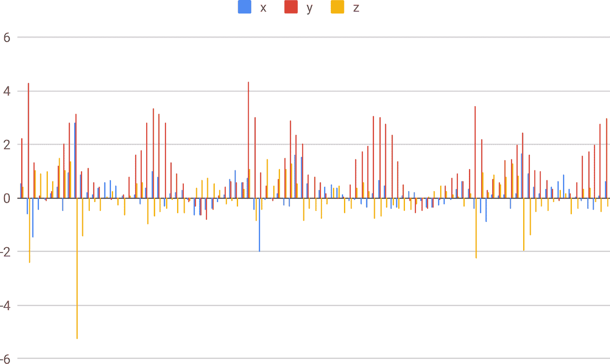
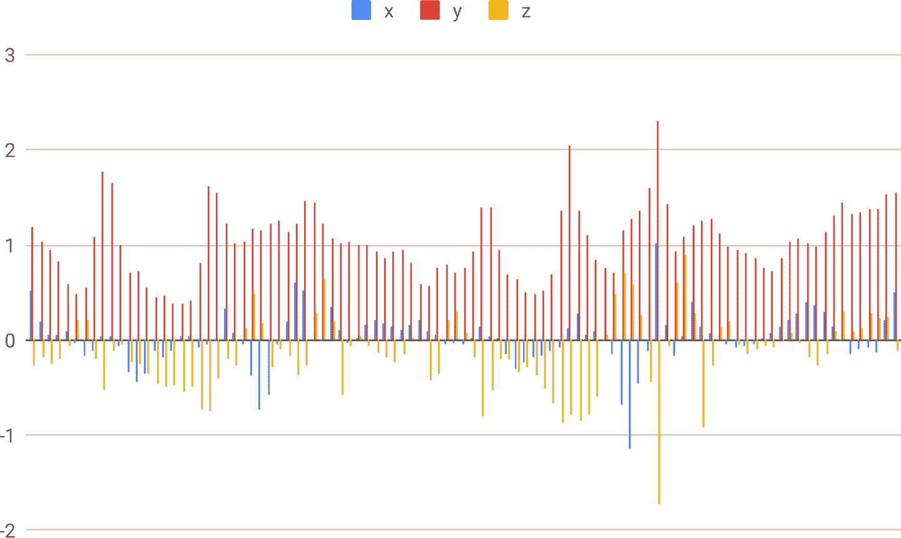
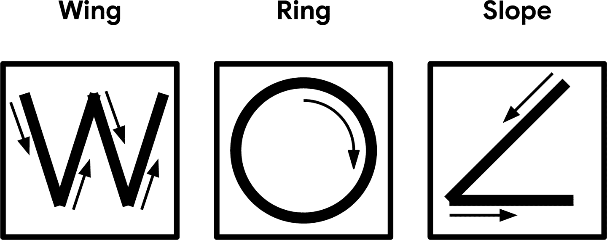
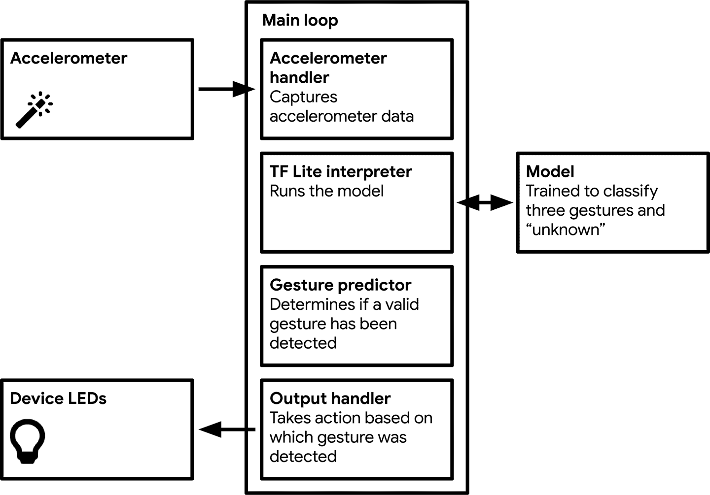
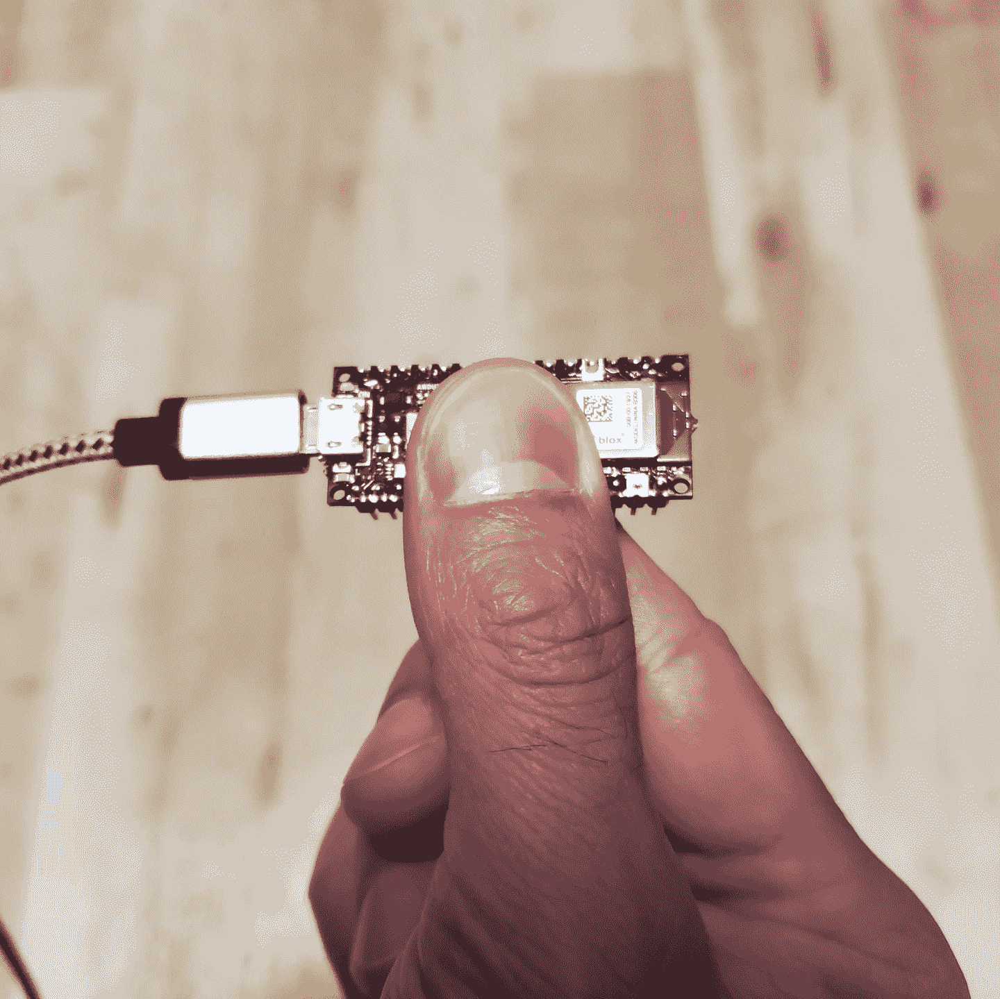
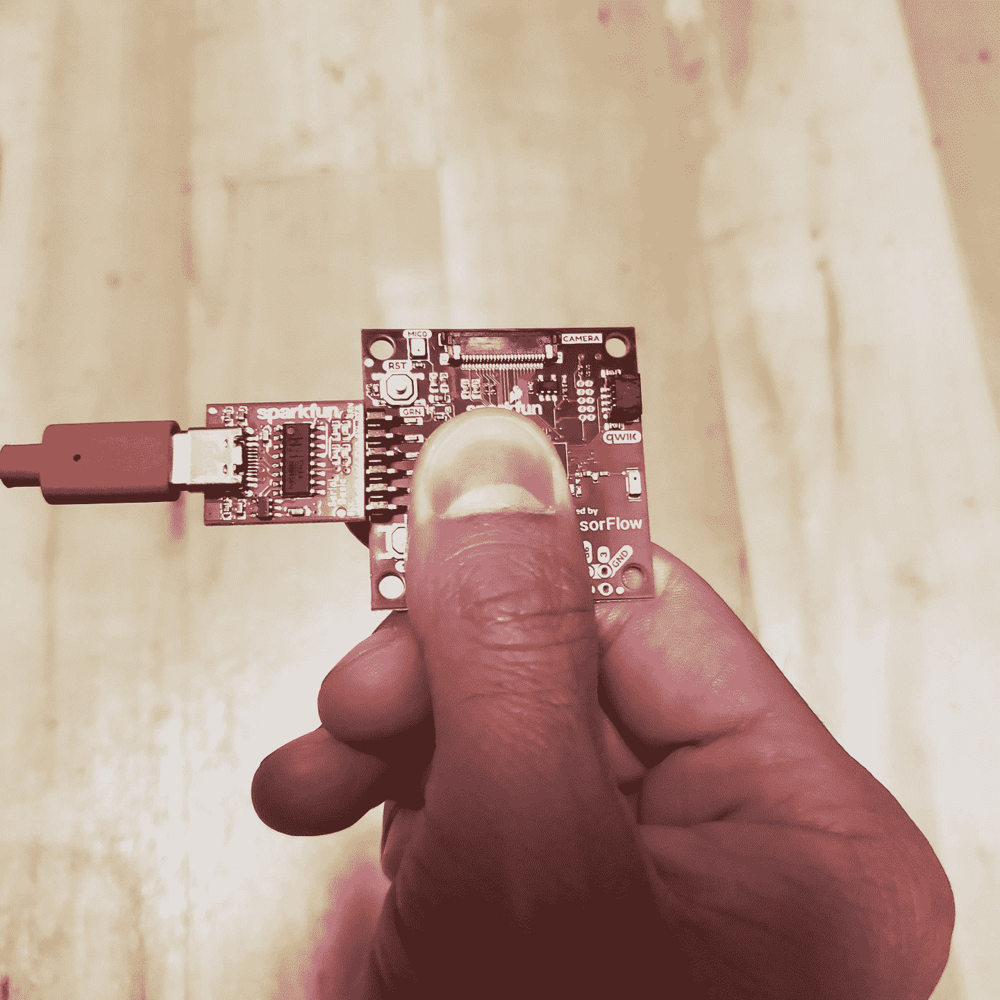

# 第十一章：魔术棒：构建一个应用程序

到目前为止，我们的示例应用程序已经处理了人类可以轻松理解的数据。我们的大脑有整个区域专门用于理解语音和视觉，因此对于我们来说，解释视觉或音频数据并形成对正在发生的事情的想法并不困难。

然而，许多数据并不容易理解。机器及其传感器生成大量信息流，这些信息流不容易映射到我们的人类感官上。即使以视觉方式表示，我们的大脑也可能难以理解数据中的趋势和模式。

例如，图 11-1 和图 11-2 中呈现的两个图表显示了放置在做运动的人前口袋中的手机捕获的传感器数据。所涉及的传感器是*加速度计*，它测量三个维度的加速度（我们稍后会详细讨论这些）。图 11-1 显示了一个正在慢跑的人的加速度数据，而图 11-2 显示了同一个人下楼梯时的数据。

正如您所看到的，即使数据代表一种简单且易于理解的活动，也很难区分这两种活动。想象一下试图区分复杂工业机器的运行状态，该机器可能有数百个传感器测量各种晦涩的属性。

通常可以编写手工制作的算法来理解这种类型的数据。例如，人类步态专家可能会认出上楼梯的特征迹象，并能够将这种知识表达为代码中的函数。这种类型的函数称为*启发式*，在各种应用程序中广泛使用，从工业自动化到医疗设备。



###### 图 11-1。显示慢跑者数据的图表[(MotionSense 数据集)](https://oreil.ly/ZUPV5)



###### 图 11-2。显示下楼梯的人的数据图[(MotionSense 数据集)](https://oreil.ly/ZUPV5)

要创建一个启发式方法，您需要两样东西。第一是领域知识。启发式算法表达了人类的知识和理解，因此要编写一个，您需要已经理解数据的含义。要理解这一点，想象一个根据体温确定一个人是否发烧的启发式方法。创建它的人必须了解指示发烧的体温变化。

构建启发式方法的第二个要求是编程和数学专业知识。尽管很容易确定某人的体温是否过高，但其他问题可能要复杂得多。根据多个数据流中的复杂模式辨别系统的状态可能需要一些高级技术的知识，比如统计分析或信号处理。例如，想象一下根据加速度计数据区分走路和跑步的启发式方法。为了构建这个方法，您可能需要知道如何在数学上过滤加速度计数据以获得步频的估计。

虽然启发式方法可能非常有用，但它们需要领域知识和编程专业知识，这意味着它们可能难以构建。首先，领域知识并不总是可获得的。例如，一家小公司可能没有资源进行必要的基础研究，以了解什么指示一个状态与另一个状态。同样，即使具有领域知识，也不是每个人都具备设计和实现启发式算法所需的专业知识。

机器学习为我们提供了一种捷径，一个在标记数据上训练的模型可以学会识别指示一个类别或另一个类别的信号，这意味着不需要深入的领域知识。例如，一个模型可以学会识别表明发烧的人体温度波动，而无需告诉它哪些具体温度是重要的——它只需要带有“发烧”或“非发烧”标签的温度数据。此外，与可能需要实现复杂启发式算法所需的工程技能相比，学习机器学习可能更容易获得。

机器学习开发人员不再需要从头设计启发式算法，而是可以找到合适的模型架构，收集和标记数据集，并通过训练和评估迭代地创建模型。领域知识仍然非常有帮助，但可能不再是使某些东西运作的先决条件。在某些情况下，最终的模型实际上可能比最佳的手工编码算法更准确。

事实上，最近的一篇论文显示，一个简单的卷积神经网络能够从单个心跳中以 100%的准确率检测出患者的充血性心力衰竭。这比任何先前的诊断技术表现都要好。即使你不理解每个细节，这篇论文也是一篇引人入胜的阅读。

通过训练一个深度学习模型来理解复杂数据并将其嵌入微控制器程序中，我们可以创建智能传感器，能够理解其环境的复杂性并告诉我们，高层次上正在发生什么。这对数十个领域都有巨大的影响。以下只是一些潜在的应用：

+   在网络连接质量差的偏远地区进行环境监测

+   自动调整以实时解决问题的工业流程

+   对复杂外部刺激做出反应的机器人

+   无需医疗专业人员进行疾病诊断

+   理解物理运动的计算机界面

在本章中，我们将构建一个属于最终类别的项目：一个数字“魔杖”，其所有者可以挥舞以施放各种咒语。作为其输入，它接收复杂的、多维的传感器数据，这对人类来说是难以理解的。其输出将是一个简单的分类，提醒我们最近是否发生了几种运动类别中的一种。我们将看看深度学习如何将奇怪的数字数据转化为有意义的信息——产生魔法效果。

# 我们正在构建的东西

我们的“魔杖”可以用来施放几种类型的咒语。持有者只需挥动魔杖进行三种手势中的一种，即“翅膀”、“环”和“斜坡”，如图 11-3 所示。



###### 图 11-3。三个魔杖手势

魔杖将通过点亮 LED 来对每个咒语做出反应。如果电灯的魔法不够令人兴奋，它还将输出信息到其串行端口，该信息可用于控制连接的计算机。

为了理解物理手势，魔杖应用程序使用设备的加速度计收集有关其在空间中运动的信息。加速度计测量当前正在经历的加速度的程度。例如，想象一下，我们已经将一个加速度计连接到一辆停在红灯前准备启动的汽车上。

当灯变绿时，汽车开始向前移动，速度逐渐增加直到达到速度限制。在此期间，加速度计将输出一个值，指示汽车的加速度。汽车达到稳定速度后，它不再加速，因此加速度计将输出零。

SparkFun Edge 和 Arduino Nano 33 BLE Sense 板都配备有三轴加速度计，这些加速度计包含在焊接到每个板上的组件中。它们在三个方向上测量加速度，这意味着它们可以用来跟踪设备在 3D 空间中的运动。为了制作我们的魔杖，我们将把微控制器板固定在一根棍子的末端，这样就可以以巫术般的方式挥动它。然后，我们将加速度计的输出输入到一个深度学习模型中，该模型将执行分类，告诉我们是否进行了已知手势。

我们提供了将此应用程序部署到以下微控制器平台的说明：

+   [Arduino Nano 33 BLE Sense](https://oreil.ly/6qlMD)

+   [SparkFun Edge](https://oreil.ly/-hoL-)

因为[ST Microelectronics STM32F746G Discovery kit](https://oreil.ly/SSsVJ)不包括加速度计（并且太大无法附在魔杖的末端），我们不会在这里展示它。

###### 注意

TensorFlow Lite 定期为新设备添加支持，因此，如果您想使用的设备没有在这里列出，值得检查示例的[*README.md*](https://oreil.ly/dkZfA)。如果遇到问题，您也可以在那里查看更新的部署说明。

在下一节中，我们将看一下我们应用程序的结构，并了解更多关于它的模型是如何工作的。

# 应用程序架构

我们的应用程序将再次遵循现在熟悉的模式，获取输入，运行推断，处理输出，并使用生成的信息来实现一些操作。

三轴加速度计输出三个值，表示设备的 x、y 和 z 轴上的加速度量。SparkFun Edge 板上的加速度计每秒可以做到这一点 25 次（25 Hz 的速率）。我们的模型直接将这些值作为输入，这意味着我们不需要进行任何预处理。

在数据被捕获并推断运行之后，我们的应用程序将确定是否检测到了有效的手势，向终端打印一些输出，并点亮 LED。

## 介绍我们的模型

我们的手势检测模型是一个卷积神经网络，大小约为 20 KB，它接受原始加速度计值作为输入。它一次接收 128 组*x*、*y*和*z*值，以 25 Hz 的速率计算，相当于超过五秒钟的数据。每个值是一个 32 位浮点数，表示该方向上的加速度量。

该模型是在许多人执行的四个手势上进行训练的。它为四个类别输出概率分数：分别代表每个手势（“翅膀”、“戒指”和“斜坡”），以及代表未识别手势的一个。概率分数总和为 1，得分高于 0.8 被认为是有信心的。

因为我们将每秒运行多次推断，我们需要确保在执行手势时单个错误的推断不会使结果产生偏差。我们的机制是只有在经过一定数量的推断确认后才认为检测到了手势。鉴于每个手势执行所需的时间不同，对于每个手势，所需的推断次数也不同，最佳数量是通过实验确定的。同样，不同设备上推断的运行速率也不同，因此这些阈值也是根据设备设置的。

在第十二章中，我们将探讨如何在我们自己的手势数据上训练模型，并深入了解模型的工作原理。在那之前，让我们继续走过我们的应用程序。

## 所有的移动部件

图 11-4 显示了我们魔杖应用程序的结构。

正如您所看到的，这几乎和我们的人体检测应用程序一样简单。我们的模型接受原始加速度计数据，这意味着我们不需要进行任何预处理。

代码的六个主要部分遵循与我们的人员检测示例相似的结构。让我们依次浏览它们：

主循环

我们的应用程序在一个连续循环中运行。由于其模型小而简单，且不需要预处理，我们可以每秒运行多个推理。

加速度计处理程序

该组件从加速度计捕获数据并将其写入模型的输入张量。它使用缓冲区来保存数据。

TF Lite 解释器

解释器运行 TensorFlow Lite 模型，就像我们之前的示例一样。

模型

该模型作为数据数组包含在内，并由解释器运行。它很小，仅 19.5 KB。

手势预测器

该组件获取模型的输出，并根据概率和连续正预测的数量的阈值决定是否检测到手势。

输出处理程序

输出处理程序点亮 LED 并根据识别到的手势在串行端口上打印输出。



###### 图 11-4。我们魔杖应用程序的组件

# 浏览测试

您可以在[GitHub 存储库](https://oreil.ly/h4iYb)中找到应用程序的测试：

[*magic_wand_test.cc*](https://oreil.ly/X0AJP)

展示如何对加速度计数据样本运行推理

[*accelerometer_handler_test.cc*](https://oreil.ly/MwM7g)

展示如何使用加速度计处理程序获取新鲜数据

[*gesture_predictor_test.cc*](https://oreil.ly/cGbim)

展示如何使用手势预测器解释推理结果

[*output_handler_test.cc*](https://oreil.ly/MYwUW)

展示如何使用输出处理程序显示推理结果

让我们从*magic_wand_test.cc*开始，这将向我们展示使用我们的模型进行推理的端到端过程。

## 基本流程

我们在*magic_wand_test.cc*中逐步进行基本流程。

首先，我们列出模型将需要的操作：

```cpp
namespace tflite {
namespace ops {
namespace micro {
TfLiteRegistration* Register_DEPTHWISE_CONV_2D();
TfLiteRegistration* Register_MAX_POOL_2D();
TfLiteRegistration* Register_CONV_2D();
TfLiteRegistration* Register_FULLY_CONNECTED();
TfLiteRegistration* Register_SOFTMAX();
}  // namespace micro
}  // namespace ops
}  // namespace tflite
```

测试本身（通常）通过设置推理所需的所有内容并获取模型输入张量的指针开始：

```cpp
// Set up logging
tflite::MicroErrorReporter micro_error_reporter;
tflite::ErrorReporter* error_reporter = &micro_error_reporter;

// Map the model into a usable data structure. This doesn't involve any
// copying or parsing, it's a very lightweight operation.
const tflite::Model* model =
    ::tflite::GetModel(g_magic_wand_model_data);
if (model->version() != TFLITE_SCHEMA_VERSION) {
error_reporter->Report(
    "Model provided is schema version %d not equal "
    "to supported version %d.\n",
    model->version(), TFLITE_SCHEMA_VERSION);
}

static tflite::MicroMutableOpResolver micro_mutable_op_resolver;
micro_mutable_op_resolver.AddBuiltin(
    tflite::BuiltinOperator_DEPTHWISE_CONV_2D,
    tflite::ops::micro::Register_DEPTHWISE_CONV_2D());
micro_mutable_op_resolver.AddBuiltin(
    tflite::BuiltinOperator_MAX_POOL_2D,
    tflite::ops::micro::Register_MAX_POOL_2D());
micro_mutable_op_resolver.AddBuiltin(
    tflite::BuiltinOperator_CONV_2D,
    tflite::ops::micro::Register_CONV_2D());
micro_mutable_op_resolver.AddBuiltin(
    tflite::BuiltinOperator_FULLY_CONNECTED,
    tflite::ops::micro::Register_FULLY_CONNECTED());
micro_mutable_op_resolver.AddBuiltin(tflite::BuiltinOperator_SOFTMAX,
                                    tflite::ops::micro::Register_SOFTMAX());

// Create an area of memory to use for input, output, and intermediate arrays.
// Finding the minimum value for your model may require some trial and error.
const int tensor_arena_size = 60 * 1024;
uint8_t tensor_arena[tensor_arena_size];

// Build an interpreter to run the model with
tflite::MicroInterpreter interpreter(model, micro_mutable_op_resolver, tensor_arena,
                                    tensor_arena_size, error_reporter);

// Allocate memory from the tensor_arena for the model's tensors
interpreter.AllocateTensors();

// Obtain a pointer to the model's input tensor
TfLiteTensor* input = interpreter.input(0);
```

然后，我们检查输入张量以确保其预期形状：

```cpp
// Make sure the input has the properties we expect
TF_LITE_MICRO_EXPECT_NE(nullptr, input);
TF_LITE_MICRO_EXPECT_EQ(4, input->dims->size);
// The value of each element gives the length of the corresponding tensor.
TF_LITE_MICRO_EXPECT_EQ(1, input->dims->data[0]);
TF_LITE_MICRO_EXPECT_EQ(128, input->dims->data[1]);
TF_LITE_MICRO_EXPECT_EQ(3, input->dims->data[2]);
TF_LITE_MICRO_EXPECT_EQ(1, input->dims->data[3]);
// The input is a 32 bit floating point value
TF_LITE_MICRO_EXPECT_EQ(kTfLiteFloat32, input->type);
```

我们的输入形状是`(1, 128, 3, 1)`。第一个维度只是第二个维度的包装器，其中包含 128 个三轴加速度计读数。每个读数有三个值，分别对应每个轴，每个值都包含在一个单元素张量中。输入都是 32 位浮点值。

在我们确认输入形状后，我们向输入张量写入一些数据：

```cpp
// Provide an input value
const float* ring_features_data = g_circle_micro_f9643d42_nohash_4_data;
error_reporter->Report("%d", input->bytes);
for (int i = 0; i < (input->bytes / sizeof(float)); ++i) {
    input->data.f[i] = ring_features_data[i];
}
```

常量`g_circle_micro_f9643d42_nohash_4_data`在*circle_micro_features_data.cc*中定义；它包含一个浮点值数组，表示一个人尝试执行圆形手势的数据。在`for`循环中，我们遍历这些数据，并将每个值写入输入。我们只写入与输入张量容量相符的`float`值。

接下来，我们以熟悉的方式运行推理：

```cpp
// Run the model on this input and check that it succeeds
TfLiteStatus invoke_status = interpreter.Invoke();
if (invoke_status != kTfLiteOk) {
  error_reporter->Report("Invoke failed\n");
}
TF_LITE_MICRO_EXPECT_EQ(kTfLiteOk, invoke_status);
```

之后，我们调查输出张量以确保它的形状符合我们的预期：

```cpp
// Obtain a pointer to the output tensor and make sure it has the
// properties we expect.
TfLiteTensor* output = interpreter.output(0);
TF_LITE_MICRO_EXPECT_EQ(2, output->dims->size);
TF_LITE_MICRO_EXPECT_EQ(1, output->dims->data[0]);
TF_LITE_MICRO_EXPECT_EQ(4, output->dims->data[1]);
TF_LITE_MICRO_EXPECT_EQ(kTfLiteFloat32, output->type);
```

它应该具有两个维度：一个单元素包装器和一组四个值，表示我们的四个概率（“翅膀”，“环”，“斜坡”和未知）。每个值都是 32 位浮点数。

然后，我们可以测试我们的数据，以确保推理结果符合我们的预期。我们传入了圆形手势的数据，因此我们期望“环”得分最高：

```cpp
// There are four possible classes in the output, each with a score.
const int kWingIndex = 0;
const int kRingIndex = 1;
const int kSlopeIndex = 2;
const int kNegativeIndex = 3;

// Make sure that the expected "Ring" score is higher than the other
// classes.
float wing_score = output->data.f[kWingIndex];
float ring_score = output->data.f[kRingIndex];
float slope_score = output->data.f[kSlopeIndex];
float negative_score = output->data.f[kNegativeIndex];
TF_LITE_MICRO_EXPECT_GT(ring_score, wing_score);
TF_LITE_MICRO_EXPECT_GT(ring_score, slope_score);
TF_LITE_MICRO_EXPECT_GT(ring_score, negative_score);
```

然后我们为“斜坡”手势重复整个过程：

```cpp
  // Now test with a different input, from a recording of "Slope".
  const float* slope_features_data = g_angle_micro_f2e59fea_nohash_1_data;
  for (int i = 0; i < (input->bytes / sizeof(float)); ++i) {
    input->data.f[i] = slope_features_data[i];
  }

  // Run the model on this "Slope" input.
  invoke_status = interpreter.Invoke();
  if (invoke_status != kTfLiteOk) {
    error_reporter->Report("Invoke failed\n");
  }
  TF_LITE_MICRO_EXPECT_EQ(kTfLiteOk, invoke_status);

  // Make sure that the expected "Slope" score is higher than the other classes.
  wing_score = output->data.f[kWingIndex];
  ring_score = output->data.f[kRingIndex];
  slope_score = output->data.f[kSlopeIndex];
  negative_score = output->data.f[kNegativeIndex];
  TF_LITE_MICRO_EXPECT_GT(slope_score, wing_score);
  TF_LITE_MICRO_EXPECT_GT(slope_score, ring_score);
  TF_LITE_MICRO_EXPECT_GT(slope_score, negative_score);
```

就是这样！我们已经看到了如何对原始加速度计数据运行推理。与之前的示例一样，我们可以避免预处理，使事情变得简单明了。

要运行此测试，请使用以下命令：

```cpp
make -f tensorflow/lite/micro/tools/make/Makefile test_magic_wand_test
```

## 加速度计处理程序

我们的下一个测试展示了加速度计处理程序的接口。该组件的任务是为每次推理填充输入张量的加速度计数据。

由于这两个因素取决于设备的加速计工作方式，因此为每个单独的设备提供了不同的加速计处理程序实现。我们稍后将介绍这些实现，但现在，位于[*accelerometer_handler_test.cc*](https://oreil.ly/MwM7g)中的测试将展示我们应该如何调用处理程序。

第一个测试非常简单：

```cpp
TF_LITE_MICRO_TEST(TestSetup) {
  static tflite::MicroErrorReporter micro_error_reporter;
  TfLiteStatus setup_status = SetupAccelerometer(&micro_error_reporter);
  TF_LITE_MICRO_EXPECT_EQ(kTfLiteOk, setup_status);
}
```

`SetupAccelerometer()`函数执行一次性设置，以便从加速计获取值。测试展示了如何调用该函数（带有指向`ErrorReporter`的指针），以及它返回一个指示设置成功的`TfLiteStatus`。

下一个测试展示了如何使用加速计处理程序填充输入张量的数据：

```cpp
TF_LITE_MICRO_TEST(TestAccelerometer) {
  float input[384] = {0.0};
  tflite::MicroErrorReporter micro_error_reporter;
  // Test that the function returns false before insufficient data is available
  bool inference_flag =
      ReadAccelerometer(&micro_error_reporter, input, 384, false);
  TF_LITE_MICRO_EXPECT_EQ(inference_flag, false);

  // Test that the function returns true once sufficient data is available to
  // fill the model's input buffer (128 sets of values)
  for (int i = 1; i <= 128; i++) {
    inference_flag =
        ReadAccelerometer(&micro_error_reporter, input, 384, false);
  }
  TF_LITE_MICRO_EXPECT_EQ(inference_flag, true);
}
```

首先，我们准备一个名为`input`的`float`数组来模拟模型的输入张量。因为有 128 个三轴读数，所以总大小为 384 字节（128 * 3）。我们将数组中的每个值初始化为`0.0`。

然后我们调用`ReadAccelerometer()`。我们提供一个`ErrorReporter`实例，我们希望数据写入的数组（`input`），以及我们想要获取的数据总量（384 字节）。最后一个参数是一个布尔标志，指示`ReadAccelerometer()`在读取更多数据之前是否清除缓冲区，这需要在成功识别手势后执行。

当调用`ReadAccelerometer()`函数时，会尝试将 384 字节的数据写入传递给它的数组。如果加速计刚开始收集数据，可能还没有完整的 384 字节可用。在这种情况下，函数将不执行任何操作，并返回一个值`false`。我们可以利用这一点，避免在没有数据可用时运行推理。

位于[*accelerometer_handler.cc*](https://oreil.ly/MwM7g)中的加速计处理程序的虚拟实现模拟每次调用时都有另一个读数可用。通过调用它额外 127 次，我们确保它将累积足够的数据开始返回`true`。

要运行这些测试，请使用以下命令：

```cpp
make -f tensorflow/lite/micro/tools/make/Makefile \
  test_gesture_accelerometer_handler_test
```

## 手势预测器

推理完成后，我们的输出张量将填充概率，告诉我们哪种手势（如果有的话）被执行。然而，由于机器学习并非精确科学，任何单个推理都有可能导致误报。

为了减少误报的影响，我们可以规定要识别手势，必须在至少一定数量的连续推理中检测到。鉴于我们每秒运行多次推理，我们可以快速确定结果是否有效。这是手势预测器的工作。

它定义了一个名为`PredictGesture()`的函数，以模型的输出张量作为输入。为了确定是否检测到手势，该函数执行两项操作：

1.  检查手势的概率是否达到最小阈值

1.  检查手势是否在一定数量的推理中被一致地检测到

所需的最小推理次数因手势而异，因为有些手势执行时间较长。它还因设备而异，因为更快的设备能够更频繁地运行推理。为 SparkFun Edge 开发板调整的默认值位于[*constants.cc*](https://oreil.ly/ktGgw)中：

```cpp
const int kConsecutiveInferenceThresholds[3] = {15, 12, 10};
```

这些值的定义顺序与模型输出张量中手势出现的顺序相同。其他平台，如 Arduino，有包含针对其性能调整的设备特定版本的文件。

让我们浏览一下[*gesture_predictor.cc*](https://oreil.ly/f3I6U)中的代码，看看这些是如何使用的。

首先，我们定义一些变量，用于跟踪上次看到的手势以及连续记录的相同手势数量：

```cpp
// How many times the most recent gesture has been matched in a row
int continuous_count = 0;
// The result of the last prediction
int last_predict = -1;
```

接下来，我们定义`PredictGesture()`函数，并确定最近推断中是否有任何手势类别的概率大于 0.8：

```cpp
// Return the result of the last prediction
// 0: wing("W"), 1: ring("O"), 2: slope("angle"), 3: unknown
int PredictGesture(float* output) {
  // Find whichever output has a probability > 0.8 (they sum to 1)
  int this_predict = -1;
  for (int i = 0; i < 3; i++) {
    if (output[i] > 0.8) this_predict = i;
  }
```

我们使用`this_predict`来存储预测到的手势的索引。

变量`continuous_count`用于跟踪最近发现的手势连续预测的次数。如果没有手势类别满足 0.8 的概率阈值，我们通过将`continuous_count`设置为`0`和`last_predict`设置为`3`（“未知”类别的索引）来重置任何正在进行的检测过程，表示最近的结果不是已知手势：

```cpp
  // No gesture was detected above the threshold
  if (this_predict == -1) {
    continuous_count = 0;
    last_predict = 3;
    return 3;
  }
```

接下来，如果最近的预测与之前的预测一致，我们增加`continuous_count`。否则，我们将其重置为`0`。我们还将最近的预测存储在`last_predict`中：

```cpp
  if (last_predict == this_predict) {
    continuous_count += 1;
  } else {
    continuous_count = 0;
  }
  last_predict = this_predict;
```

在`PredictGesture()`的下一部分中，我们使用`should_continuous_count`来检查当前手势是否已经达到其阈值。如果没有，我们返回一个`3`，表示一个未知手势：

```cpp
  // If we haven't yet had enough consecutive matches for this gesture,
  // report a negative result
  if (continuous_count < kConsecutiveInferenceThresholds[this_predict]) {
    return 3;
  }
```

如果我们通过了这一点，这意味着我们确认了一个有效的手势。在这种情况下，我们重置所有变量：

```cpp
  // Otherwise, we've seen a positive result, so clear all our variables
  // and report it
  continuous_count = 0;
  last_predict = -1;
  return this_predict;
}
```

函数通过返回当前预测结束。这将由我们的主循环传递给输出处理程序，显示结果给用户。

手势预测器的测试位于[*gesture_predictor_test.cc*](https://oreil.ly/5BZzt)中。第一个测试展示了一个成功的预测：

```cpp
TF_LITE_MICRO_TEST(SuccessfulPrediction) {
  // Use the threshold from the 0th gesture
  int threshold = kConsecutiveInferenceThresholds[0];
  float probabilities[4] = {1.0, 0.0, 0.0, 0.0};
  int prediction;
  // Loop just too few times to trigger a prediction
  for (int i = 0; i <= threshold - 1; i++) {
    prediction = PredictGesture(probabilities);
    TF_LITE_MICRO_EXPECT_EQ(prediction, 3);
  }
  // Call once more, triggering a prediction
  // for category 0
  prediction = PredictGesture(probabilities);
  TF_LITE_MICRO_EXPECT_EQ(prediction, 0);
}
```

`PredictGesture()`函数被提供了一组概率，强烈表明第一个类别应该匹配。然而，在它被调用`threshold`次数之前，它返回一个`3`，表示一个“未知”结果。在它被调用`threshold`次数之后，它为类别`0`返回一个正面预测。

接下来的测试展示了如果一个类别的连续高概率运行被另一个类别的高概率中断会发生什么：

```cpp
TF_LITE_MICRO_TEST(FailPartWayThere) {
  // Use the threshold from the 0th gesture
  int threshold = kConsecutiveInferenceThresholds[0];
  float probabilities[4] = {1.0, 0.0, 0.0, 0.0};
  int prediction;
  // Loop just too few times to trigger a prediction
  for (int i = 0; i <= threshold - 1; i++) {
    prediction = PredictGesture(probabilities);
    TF_LITE_MICRO_EXPECT_EQ(prediction, 3);
  }
  // Call with a different prediction, triggering a failure
  probabilities[0] = 0.0;
  probabilities[2] = 1.0;
  prediction = PredictGesture(probabilities);
  TF_LITE_MICRO_EXPECT_EQ(prediction, 3);
}
```

在这种情况下，我们输入了一组连续的类别`0`高概率，但不足以满足阈值。然后我们改变概率，使类别`2`最高，这导致类别`3`的预测，表示一个“未知”手势。

最终的测试展示了`PredictGesture()`如何忽略低于其阈值的概率。在循环中，我们输入了恰好正确数量的预测以满足类别`0`的阈值。然而，尽管类别`0`的概率最高，但其值为 0.7，低于`PredictGesture()`的内部阈值 0.8。这导致类别`3`的“未知”预测：

```cpp
TF_LITE_MICRO_TEST(InsufficientProbability) {
  // Use the threshold from the 0th gesture
  int threshold = kConsecutiveInferenceThresholds[0];
  // Below the probability threshold of 0.8
  float probabilities[4] = {0.7, 0.0, 0.0, 0.0};
  int prediction;
  // Loop the exact right number of times
  for (int i = 0; i <= threshold; i++) {
    prediction = PredictGesture(probabilities);
    TF_LITE_MICRO_EXPECT_EQ(prediction, 3);
  }
}
```

要运行这些测试，请使用以下命令：

```cpp
make -f tensorflow/lite/micro/tools/make/Makefile \
  test_gesture_predictor_test
```

## 输出处理程序

输出处理程序非常简单；它只是获取`PredictGesture()`返回的类索引，并将结果显示给用户。在[*output_handler_test.cc*](https://oreil.ly/QWkeL)中展示了它的接口：

```cpp
TF_LITE_MICRO_TEST(TestCallability) {
  tflite::MicroErrorReporter micro_error_reporter;
  tflite::ErrorReporter* error_reporter = &micro_error_reporter;
  HandleOutput(error_reporter, 0);
  HandleOutput(error_reporter, 1);
  HandleOutput(error_reporter, 2);
  HandleOutput(error_reporter, 3);
}
```

要运行此测试，请使用以下命令：

```cpp
make -f tensorflow/lite/micro/tools/make/Makefile \
  test_gesture_output_handler_test
```

# 检测手势

所有这些组件都在[*main_functions.cc*](https://oreil.ly/ggNtD)中汇聚，其中包含我们程序的核心逻辑。首先设置通常的变量，以及一些额外的变量：

```cpp
namespace tflite {
namespace ops {
namespace micro {
TfLiteRegistration* Register_DEPTHWISE_CONV_2D();
TfLiteRegistration* Register_MAX_POOL_2D();
TfLiteRegistration* Register_CONV_2D();
TfLiteRegistration* Register_FULLY_CONNECTED();
TfLiteRegistration* Register_SOFTMAX();
}  // namespace micro
}  // namespace ops
}  // namespace tflite

// Globals, used for compatibility with Arduino-style sketches.
namespace {
tflite::ErrorReporter* error_reporter = nullptr;
const tflite::Model* model = nullptr;
tflite::MicroInterpreter* interpreter = nullptr;
TfLiteTensor* model_input = nullptr;
int input_length;

// Create an area of memory to use for input, output, and intermediate arrays.
// The size of this will depend on the model you're using, and may need to be
// determined by experimentation.
constexpr int kTensorArenaSize = 60 * 1024;
uint8_t tensor_arena[kTensorArenaSize];

// Whether we should clear the buffer next time we fetch data
bool should_clear_buffer = false;
}  // namespace
```

`input_length`变量存储模型输入张量的长度，`should_clear_buffer`变量是一个标志，指示加速度计处理程序的缓冲区在下次运行时是否应该被清除。在成功检测结果之后清除缓冲区，以便为后续推断提供一个干净的基础。

接下来，`setup()`函数执行所有通常的清理工作，以便我们准备好运行推断：

```cpp
void setup() {
  // Set up logging. Google style is to avoid globals or statics because of
  // lifetime uncertainty, but since this has a trivial destructor it's okay.
  static tflite::MicroErrorReporter micro_error_reporter; //NOLINT
  error_reporter = &micro_error_reporter;

  // Map the model into a usable data structure. This doesn't involve any
  // copying or parsing, it's a very lightweight operation.
  model = tflite::GetModel(g_magic_wand_model_data);
  if (model->version() != TFLITE_SCHEMA_VERSION) {
    error_reporter->Report(
        "Model provided is schema version %d not equal "
        "to supported version %d.",
        model->version(), TFLITE_SCHEMA_VERSION);
    return;
  }

  // Pull in only the operation implementations we need.
  // This relies on a complete list of all the ops needed by this graph.
  // An easier approach is to just use the AllOpsResolver, but this will
  // incur some penalty in code space for op implementations that are not
  // needed by this graph.
  static tflite::MicroMutableOpResolver micro_mutable_op_resolver; // NOLINT
  micro_mutable_op_resolver.AddBuiltin(
      tflite::BuiltinOperator_DEPTHWISE_CONV_2D,
      tflite::ops::micro::Register_DEPTHWISE_CONV_2D());
  micro_mutable_op_resolver.AddBuiltin(
      tflite::BuiltinOperator_MAX_POOL_2D,
      tflite::ops::micro::Register_MAX_POOL_2D());
  micro_mutable_op_resolver.AddBuiltin(
      tflite::BuiltinOperator_CONV_2D,
      tflite::ops::micro::Register_CONV_2D());
  micro_mutable_op_resolver.AddBuiltin(
      tflite::BuiltinOperator_FULLY_CONNECTED,
      tflite::ops::micro::Register_FULLY_CONNECTED());
  micro_mutable_op_resolver.AddBuiltin(tflite::BuiltinOperator_SOFTMAX,
                                       tflite::ops::micro::Register_SOFTMAX());

  // Build an interpreter to run the model with
  static tflite::MicroInterpreter static_interpreter(model,
                                                     micro_mutable_op_resolver,
                                                     tensor_arena,
                                                     kTensorArenaSize,
                                                     error_reporter);
  interpreter = &static_interpreter;

  // Allocate memory from the tensor_arena for the model's tensors
  interpreter->AllocateTensors();

  // Obtain pointer to the model's input tensor
  model_input = interpreter->input(0);
  if ((model_input->dims->size != 4) || (model_input->dims->data[0] != 1) ||
      (model_input->dims->data[1] != 128) ||
      (model_input->dims->data[2] != kChannelNumber) ||
      (model_input->type != kTfLiteFloat32)) {
    error_reporter->Report("Bad input tensor parameters in model");
    return;
  }

  input_length = model_input->bytes / sizeof(float);

  TfLiteStatus setup_status = SetupAccelerometer(error_reporter);
  if (setup_status != kTfLiteOk) {
    error_reporter->Report("Set up failed\n");
  }
}
```

更有趣的事情发生在`loop()`函数中，这仍然非常简单：

```cpp
void loop() {
  // Attempt to read new data from the accelerometer
  bool got_data = ReadAccelerometer(error_reporter, model_input->data.f,
                                    input_length, should_clear_buffer);
  // Don't try to clear the buffer again
  should_clear_buffer = false;
  // If there was no new data, wait until next time
  if (!got_data) return;
  // Run inference, and report any error
  TfLiteStatus invoke_status = interpreter->Invoke();
  if (invoke_status != kTfLiteOk) {
    error_reporter->Report("Invoke failed on index: %d\n", begin_index);
    return;
  }
  // Analyze the results to obtain a prediction
  int gesture_index = PredictGesture(interpreter->output(0)->data.f);
  // Clear the buffer next time we read data
  should_clear_buffer = gesture_index < 3;
  // Produce an output
  HandleOutput(error_reporter, gesture_index);
}
```

首先，我们尝试从加速度计中读取一些值。尝试之后，我们将`should_clear_buffer`设置为`false`，以确保暂时停止尝试清除它。

如果获取新数据失败，`ReadAccelerometer()` 将返回一个 `false` 值，然后我们将从 `loop()` 函数返回，以便下次调用时再次尝试。

如果 `ReadAccelerometer()` 返回的值是 `true`，我们将在我们新填充的输入张量上运行推断。我们将结果传递给 `PredictGesture()`，它会给出检测到的手势的索引。如果索引小于 `3`，则手势有效，因此我们设置 `should_clear_buffer` 标志，以便在下次调用 `ReadAccelerometer()` 时清除缓冲区。然后我们调用 `HandleOutput()` 报告任何结果给用户。

在 *main.cc* 中，`main()` 函数启动我们的程序，运行 `setup()`，并在循环中调用 `loop()` 函数：

```cpp
int main(int argc, char* argv[]) {
  setup();
  while (true) {
    loop();
  }
}
```

就是这样！要在开发计算机上构建程序，请使用以下命令：

```cpp
make -f tensorflow/lite/micro/tools/make/Makefile magic_wand
```

然后，要运行程序，请输入以下内容：

```cpp
./tensorflow/lite/micro/tools/make/gen/osx_x86_64/bin/magic_wand
```

该程序不会产生任何输出，因为没有可用的加速度计数据，但您可以确认它构建并运行。

接下来，我们将逐个平台的代码，该代码捕获加速度计数据并生成输出。我们还展示如何部署和运行应用程序。

# 部署到微控制器

在本节中，我们将将代码部署到两个设备：

+   [Arduino Nano 33 BLE Sense](https://oreil.ly/6qlMD)

+   [SparkFun Edge](https://oreil.ly/-hoL-)

让我们从 Arduino 实现开始。

## Arduino

Arduino Nano 33 BLE Sense 具有三轴加速度计以及蓝牙支持，体积小巧轻便，非常适合制作魔杖。

让我们逐步了解一些应用程序关键文件的 Arduino 特定实现。

### Arduino 常量

常量 `kConsecutiveInferenceThresholds` 在文件 [*arduino/constants.cc*](https://oreil.ly/5bBt0) 中重新定义：

```cpp
// The number of expected consecutive inferences for each gesture type.
// Established with the Arduino Nano 33 BLE Sense.
const int kConsecutiveInferenceThresholds[3] = {8, 5, 4};
```

正如本章前面提到的，此常量存储了每个手势被视为检测到所需的连续正推断数量。该数字取决于每秒运行多少次推断，这取决于设备。因为默认数字是为 SparkFun Edge 校准的，Arduino 实现需要自己的一组数字。您可以修改这些阈值，使推断更难或更容易触发，但将它们设置得太低将导致误报。

### 在 Arduino 上捕获加速度计数据

Arduino 加速度计处理程序位于 [*arduino/accelerometer_handler.cc*](https://oreil.ly/jV_Qm)。它的任务是从加速度计捕获数据并将其写入模型的输入缓冲区。

我们使用的模型是使用 SparkFun Edge 板的数据进行训练的。Edge 的加速度计以每秒 25 次的速率提供一组读数。为了正常工作，它需要提供以相同速率捕获的数据。事实证明，Arduino Nano 33 BLE Sense 板上的加速度计以每秒 119 次的速率返回测量值。这意味着除了捕获数据外，我们还需要对其进行 *下采样* 以适应我们的模型。

尽管听起来非常技术化，但下采样实际上非常简单。为了降低信号的采样率，我们可以丢弃一些数据。我们将在以下代码中看到这是如何工作的。

首先，实现包括自己的头文件，以及一些其他文件：

```cpp
#include "tensorflow/lite/micro/examples/magic_wand/
  accelerometer_handler.h"

#include <Arduino.h>
#include <Arduino_LSM9DS1.h>

#include "tensorflow/lite/micro/examples/magic_wand/constants.h"
```

文件 *Arduino.h* 提供对 Arduino 平台一些基本功能的访问。文件 *Arduino_LSM9DS1.h* 是 [Arduino_LSM9DS1](https://oreil.ly/eb3Zs) 库的一部分，我们将使用它与板的加速度计通信。

接下来，我们设置一些变量：

```cpp
// A buffer holding the last 200 sets of 3-channel values
float save_data[600] = {0.0};
// Most recent position in the save_data buffer
int begin_index = 0;
// True if there is not yet enough data to run inference
bool pending_initial_data = true;
// How often we should save a measurement during downsampling
int sample_every_n;
// The number of measurements since we last saved one
int sample_skip_counter = 1;
```

这些包括我们将用数据填充的缓冲区 `save_data`，以及一些用于跟踪缓冲区中当前位置和是否有足够数据开始运行推断的变量。最有趣的两个变量 `sample_every_n` 和 `sample_skip_counter` 用于下采样过程。我们稍后将更仔细地看一下这个。

接下来在文件中，程序的主循环调用`SetupAccelerometer()`函数，准备好捕获数据的板：

```cpp
TfLiteStatus SetupAccelerometer(tflite::ErrorReporter* error_reporter) {
  // Wait until we know the serial port is ready
  while (!Serial) {
  }

  // Switch on the IMU
  if (!IMU.begin()) {
    error_reporter->Report("Failed to initialize IMU");
    return kTfLiteError;
  }
```

因为我们将输出一条消息来指示一切都准备就绪，它首先确保设备的串行端口准备就绪。然后打开*惯性测量单元*（IMU），这是包含加速度计的电子组件。`IMU`对象来自 Arduino_LSM9DS1 库。

下一步是开始考虑降采样。我们首先查询 IMU 库以确定板的采样率。当我们得到这个数字后，我们将其除以我们的目标采样率，该目标采样率在[*constants.h*](https://oreil.ly/rQaSw)中的`kTargetHz`中定义：

```cpp
  // Determine how many measurements to keep in order to
  // meet kTargetHz
  float sample_rate = IMU.accelerationSampleRate();
  sample_every_n = static_cast<int>(roundf(sample_rate / kTargetHz));
```

我们的目标速率是 25 Hz，板的采样率是 119 Hz；因此，我们的除法结果是 4.76。这让我们知道我们需要保留多少个 119 Hz 样本，以达到 25 Hz 的目标采样率：每 4.76 个样本中的 1 个。

因为保留一个分数个样本很困难，我们使用`roundf()`函数四舍五入到最近的数字 5。因此，为了降采样我们的信号，我们需要保留每五个测量值中的一个。这将导致一个有效的采样率为 23.8 Hz，这是一个足够接近的近似值，使我们的模型应该能够很好地工作。我们将这个值存储在`sample_every_n`变量中以供以后使用。

现在我们已经确定了降采样的参数，我们向用户发送一条消息，告诉他们应用程序已经准备好了，然后从`SetupAccelerometer()`函数返回：

```cpp
  error_reporter->Report("Magic starts!");

  return kTfLiteOk;
}
```

接下来，我们定义`ReadAccelerometer()`。这个函数的任务是捕获新数据并将其写入模型的输出张量。它从一些代码开始，用于在成功识别手势后清除其内部缓冲区，为任何后续手势做好准备：

```cpp
bool ReadAccelerometer(tflite::ErrorReporter* error_reporter, float* input,
                       int length, bool reset_buffer) {
  // Clear the buffer if required, e.g. after a successful prediction
  if (reset_buffer) {
    memset(save_data, 0, 600 * sizeof(float));
    begin_index = 0;
    pending_initial_data = true;
  }
```

接下来，我们使用 IMU 库在循环中检查是否有可用数据。如果有数据可用，我们读取它：

```cpp
  // Keep track of whether we stored any new data
  bool new_data = false;
  // Loop through new samples and add to buffer
  while (IMU.accelerationAvailable()) {
    float x, y, z;
    // Read each sample, removing it from the device's FIFO buffer
    if (!IMU.readAcceleration(x, y, z)) {
      error_reporter->Report("Failed to read data");
      break;
    }
```

Arduino Nano 33 BLE Sense 板上的加速度计配备有一个称为[*FIFO 缓冲区*](https://oreil.ly/kFEa0)的东西。这是一个特殊的内存缓冲区，位于加速度计本身上，保存最近的 32 个测量值。由于它是加速度计硬件的一部分，FIFO 缓冲区在我们的应用程序代码运行时继续积累测量值。如果没有 FIFO 缓冲区，我们可能会丢失很多数据，这意味着我们将无法准确记录所做手势。

当我们调用`IMU.accelerationAvailable()`时，我们正在查询加速度计，看看其 FIFO 缓冲区中是否有新数据可用。使用我们的循环，我们继续从缓冲区中读取所有数据，直到没有剩余数据为止。

接下来，我们实现我们超级简单的降采样算法：

```cpp
    // Throw away this sample unless it's the nth
    if (sample_skip_counter != sample_every_n) {
      sample_skip_counter += 1;
      continue;
    }
```

我们的方法是保留每*n*个样本中的一个，其中*n*存储在`sample_every_n`中。为了做到这一点，我们维护一个计数器，`sample_skip_counter`，它让我们知道自上次保留的样本以来已经读取了多少个样本。对于我们读取的每个测量值，我们检查它是否是第*n*个。如果不是，我们将`continue`循环，而不将数据写入任何地方，有效地将其丢弃。这个简单的过程导致我们的数据被降采样。

如果执行超过这一点，我们计划保留数据。为了做到这一点，我们将数据写入我们的`save_data`缓冲区中的连续位置：

```cpp
    // Write samples to our buffer, converting to milli-Gs
    // and flipping y and x order for compatibility with
    // model (sensor orientation is different on Arduino
    // Nano BLE Sense compared with SparkFun Edge)
    save_data[begin_index++] = y * 1000;
    save_data[begin_index++] = x * 1000;
    save_data[begin_index++] = z * 1000;
```

我们的模型按顺序接受加速度计测量值 *x*、*y*、*z*。您会注意到这里我们在将 *x* 值写入缓冲区之前将 *y* 值写入。这是因为我们的模型是在 SparkFun Edge 板上捕获的数据进行训练的，其加速度计的轴指向的物理方向与 Arduino 上的不同。这种差异意味着 SparkFun Edge 的 x 轴等同于 Arduino 的 y 轴，反之亦然。通过在我们的代码中交换这些轴的数据，我们可以确保我们的模型正在接收可以理解的数据。

我们循环的最后几行做一些家务，设置一些在我们循环中使用的状态变量：

```cpp
    // Since we took a sample, reset the skip counter
    sample_skip_counter = 1;
    // If we reached the end of the circle buffer, reset
    if (begin_index >= 600) {
      begin_index = 0;
    }
    new_data = true;
  }
```

我们重置我们的降采样计数器，确保我们不会超出样本缓冲区的末尾，并设置一个标志以指示已保存新数据。

获取这些新数据后，我们进行更多的检查。这次，我们确保我们有足够的数据来执行推理。如果没有，或者这次没有捕获到新数据，我们将在不执行任何操作的情况下从函数中返回：

```cpp
  // Skip this round if data is not ready yet
  if (!new_data) {
    return false;
  }

  // Check if we are ready for prediction or still pending more initial data
  if (pending_initial_data && begin_index >= 200) {
    pending_initial_data = false;
  }

  // Return if we don't have enough data
  if (pending_initial_data) {
    return false;
  }
```

当没有新数据时返回`false`，我们确保调用函数知道不要运行推理。

如果我们走到这一步，我们已经获得了一些新数据。我们复制适当数量的数据，包括我们的新样本，到输入张量中：

```cpp
  // Copy the requested number of bytes to the provided input tensor
  for (int i = 0; i < length; ++i) {
    int ring_array_index = begin_index + i - length;
    if (ring_array_index < 0) {
      ring_array_index += 600;
    }
    input[i] = save_data[ring_array_index];
  }

  return true;
}
```

就是这样！我们已经填充了输入张量，并准备运行推理。推理运行后，结果被传递到手势预测器，该预测器确定是否已经发现了有效手势。结果被传递到输出处理程序，接下来我们将详细介绍。

### 在 Arduino 上响应手势

输出处理程序在[*arduino/output_handler.cc*](https://oreil.ly/kdVLW)中定义。它非常简单：根据检测到的手势记录信息到串行端口，并在每次运行推理时切换板上的 LED。

函数第一次运行时，LED 被配置为输出：

```cpp
void HandleOutput(tflite::ErrorReporter* error_reporter, int kind) {
  // The first time this method runs, set up our LED
  static bool is_initialized = false;
  if (!is_initialized) {
    pinMode(LED_BUILTIN, OUTPUT);
    is_initialized = true;
  }
```

接下来，LED 在每次推理时切换开关：

```cpp
  // Toggle the LED every time an inference is performed
  static int count = 0;
  ++count;
  if (count & 1) {
    digitalWrite(LED_BUILTIN, HIGH);
  } else {
    digitalWrite(LED_BUILTIN, LOW);
  }
```

最后，我们根据匹配的手势打印一些漂亮的 ASCII 艺术：

```cpp
  // Print some ASCII art for each gesture
  if (kind == 0) {
    error_reporter->Report(
        "WING:\n\r*         *         *\n\r *       * *       "
        "*\n\r *     *   *     *\n\r *   *     *   *\n\r * *       "
        "* *\n\r *         *\n\r");
  } else if (kind == 1) {
    error_reporter->Report(
        "RING:\n\r *\n\r *     *\n\r *         *\n\r "
        "   *           *\n\r *         *\n\r *     *\n\r "
        "    *\n\r");
  } else if (kind == 2) {
    error_reporter->Report(
        "SLOPE:\n\r *\n\r *\n\r *\n\r *\n\r "
        "*\n\r *\n\r *\n\r * * * * * * * *\n\r");
  }
```

现在很难阅读，但当您将应用程序部署到您的板上时，您将获得完整的输出荣耀。

### 运行示例

要部署此示例，我们需要以下内容：

+   一个 Arduino Nano 33 BLE Sense 板

+   一个 micro-USB 电缆

+   Arduino IDE

###### 提示

建议检查[*README.md*](https://oreil.ly/Zkd3x)以获取最新说明，因为构建过程可能会在本书编写后发生变化。

本书中的项目作为 TensorFlow Lite Arduino 库中的示例代码可用。如果您尚未安装该库，请打开 Arduino IDE 并从工具菜单中选择管理库。在出现的窗口中，搜索并安装名为 TensorFlowLite 的库。您应该能够使用最新版本，但如果遇到问题，本书测试的版本是 1.14-ALPHA。

###### 注意

您还可以从 *.zip* 文件安装库，您可以从 TensorFlow Lite 团队[下载](https://oreil.ly/blgB8)或使用 TensorFlow Lite for Microcontrollers Makefile 生成自己的 *.zip* 文件。如果您更喜欢后者，请参阅附录 A。

安装完库后，`magic_wand`示例将显示在文件菜单下的 Examples→Arduino_TensorFlowLite 中，如图 11-5 所示。

单击“magic_wand”加载示例。它将显示为一个新窗口，每个源文件都有一个选项卡。第一个选项卡中的文件 *magic_wand* 相当于我们之前介绍的 *main_functions.cc*。

###### 注意

“运行示例”已经解释了 Arduino 示例的结构，所以我们不会在这里再次介绍。


###### 图 11-5\. 示例菜单

除了 TensorFlow 库，我们还需要安装和修补 Arduino_LSM9DS1 库。默认情况下，该库不启用示例所需的 FIFO 缓冲区，因此我们需要对其代码进行一些修改。

在 Arduino IDE 中，选择 Tools→Manage Libraries，然后搜索 Arduino_LSM9DS1。为了确保以下说明有效，你必须安装驱动程序的 1.0.0 版本。

###### 注意

可能在你阅读本章时，驱动程序已经修复。你可以在[*README.md*](https://oreil.ly/pk61J)中找到最新的部署说明。

驱动程序将安装到*Arduino/libraries*目录中，子目录为*Arduino_LSM9DS1*。

打开*Arduino_LSM9DS1/src/LSM9DS1.cpp*驱动源文件，然后转到名为`LSM9DS1Class::begin()`的函数。在函数末尾插入以下行，即在`return 1`语句之前立即插入：

```cpp
// Enable FIFO (see docs https://www.st.com/resource/en/datasheet/DM00103319.pdf)
// writeRegister(LSM9DS1_ADDRESS, 0x23, 0x02);
// Set continuous mode
writeRegister(LSM9DS1_ADDRESS, 0x2E, 0xC0);
```

接下来，找到名为`LSM9DS1Class::accelerationAvailable()`的函数。你会看到以下几行：

```cpp
if (readRegister(LSM9DS1_ADDRESS, LSM9DS1_STATUS_REG) & 0x01) {
  return 1;
}
```

注释掉那些行，然后用以下内容替换它们：

```cpp
// Read FIFO_SRC. If any of the rightmost 8 bits have a value, there is data.
if (readRegister(LSM9DS1_ADDRESS, 0x2F) & 63) {
  return 1;
}
```

保存文件。补丁现在已经完成！

要运行示例，请通过 USB 插入 Arduino 设备。在工具菜单中，确保从 Board 下拉列表中选择正确的设备类型，如图 11-6 所示。

如果你的设备名称不在列表中，你需要安装支持包。要做到这一点，点击 Boards Manager，然后在弹出的窗口中搜索你的设备并安装相应支持包的最新版本。

接下来，确保设备的端口在 Port 下拉列表中被选中，也在 Tools 菜单中，如图 11-7 所示。


###### 图 11-6\. Board 下拉列表


###### 图 11-7\. 端口下拉列表

最后，在 Arduino 窗口中点击上传按钮（在图 11-8 中用白色标出）来编译并上传代码到你的 Arduino 设备。


###### 图 11-8\. 上传按钮

上传成功后，你应该看到 Arduino 板上的 LED 开始闪烁。

要尝试一些手势，请在 Tools 菜单中选择 Serial Monitor。最初你应该看到以下输出：

```cpp
Magic starts!
```

现在你可以尝试做一些手势。用一只手举起板，组件朝上，USB 适配器朝向左边，如图 11-9 所示。



###### 图 11-9\. 手势执行时如何握住板

图 11-10 展示了如何执行每个手势的图表。因为该模型是在连接到魔杖时收集数据进行训练的，你可能需要几次尝试才能使它们起作用。


###### 图 11-10\. 三个魔杖手势

最容易开始的是“wing”。你应该快速移动手，大约需要一秒钟来执行手势。如果成功了，你应该看到以下输出，红色 LED 应该点亮：

```cpp
WING:
*         *         *
 *       * *       *
  *     *   *     *
   *   *     *   *
    * *       * *
     *         *
```

恭喜，你已经使用 Arduino 施展了你的第一个魔法咒语！

###### 注意

此时，你可以选择创意地将板连接到魔杖的尖端，离手最远的地方。任何长度约一英尺（30 厘米）的棍子、尺子或其他家用物品都应该很好用。

确保设备牢固连接，并且朝向相同，组件朝上，USB 适配器朝向左边。选择一个坚固的魔杖，而不是一个灵活的；任何摇晃都会影响加速度计读数。

接下来，尝试“环”手势，用手（或魔杖的尖端）画一个顺时针圆圈。再次，尽量花费一秒钟执行手势。您应该看到以下内容如同魔术般出现：

```cpp
RING:
          *
       *     *
     *         *
    *           *
     *         *
       *     *
          *
```

SparkFun Edge

```cpp
SLOPE:
        *
       *
      *
     *
    *
   *
  *
 * * * * * * * *
```

就像任何好的魔法咒语一样，您可能需要练习一下才能每次都完美地执行它们。您可以在[*README.md*](https://oreil.ly/O1LqD)中看到手势的视频演示。

### 制作您自己的更改

现在您已经部署了基本应用程序，请尝试玩耍并对代码进行一些更改。只需在 Arduino IDE 中编辑文件并保存，然后重复之前的说明以将修改后的代码部署到设备上。

以下是您可以尝试的一些事情：

+   尝试在[*arduino/constants.cc*](https://oreil.ly/H49iS)中调整阈值值，以使手势更容易或更难执行（以增加误报或漏报的代价）。

+   在您的计算机上编写一个程序，让您可以使用物理手势执行任务。

+   扩展程序以通过蓝牙传输检测结果。有一些示例显示如何做到这一点，这些示例包含在[ArduinoBLE 库](https://oreil.ly/xW4SN)中，您可以通过 Arduino IDE 下载。

## [*sparkfun_edge/accelerometer_handler.cc*](https://oreil.ly/yZi0v)中包含捕获加速度计数据的代码。其中很多是特定于设备的，但我们将跳过实现细节，专注于重要的内容。

对于最后一个手势，在空中画一个三角形的角。最好通过 ASCII 艺术演示来描述，如下所示：

### 您会注意到调用一个名为`initAccelerometer()`的函数。这在[SparkFun Edge BSP 的加速度计示例](https://oreil.ly/JC0b6)中定义，当我们的项目构建时，它作为依赖项被下载下来。它执行各种任务来打开和配置板载加速度计。

捕获 SparkFun Edge 上的加速度计数据

捕获加速度计数据的第一步是配置硬件。`SetupAccelerometer()`函数通过设置加速度计所需的各种低级参数来启动这个过程：

```cpp
TfLiteStatus SetupAccelerometer(tflite::ErrorReporter* error_reporter) {
  // Set the clock frequency.
  am_hal_clkgen_control(AM_HAL_CLKGEN_CONTROL_SYSCLK_MAX, 0);

  // Set the default cache configuration
  am_hal_cachectrl_config(&am_hal_cachectrl_defaults);
  am_hal_cachectrl_enable();

  // Configure the board for low power operation.
  am_bsp_low_power_init();

  // Collecting data at 25Hz.
  int accInitRes = initAccelerometer();
```

SparkFun Edge 配有三轴加速度计、电池支架和蓝牙支持。这使它非常适合用作魔杖，因为它可以无线操作。

加速度计运行后，我们启用其[FIFO 缓冲区](https://oreil.ly/kFEa0)。这是一个特殊的内存缓冲区，位于加速度计本身上，可以保存最后 32 个数据点。通过启用它，我们能够在我们的应用程序代码忙于运行推断时继续收集加速度计测量数据。函数的其余部分设置缓冲区并在出现问题时记录错误：

```cpp
  // Enable the accelerometer's FIFO buffer.
  // Note: LIS2DH12 has a FIFO buffer which holds up to 32 data entries. It
  // accumulates data while the CPU is busy. Old data will be overwritten if
  // it's not fetched in time, so we need to make sure that model inference is
  // faster than 1/25Hz * 32 = 1.28s
  if (lis2dh12_fifo_set(&dev_ctx, 1)) {
    error_reporter->Report("Failed to enable FIFO buffer.");
  }

  if (lis2dh12_fifo_mode_set(&dev_ctx, LIS2DH12_BYPASS_MODE)) {
    error_reporter->Report("Failed to clear FIFO buffer.");
    return 0;
  }

  if (lis2dh12_fifo_mode_set(&dev_ctx, LIS2DH12_DYNAMIC_STREAM_MODE)) {
    error_reporter->Report("Failed to set streaming mode.");
    return 0;
  }

  error_reporter->Report("Magic starts!");

  return kTfLiteOk;
}
```

初始化完成后，我们可以调用`ReadAccelerometer()`函数来获取最新数据。这将发生在每次推断之间。

首先，如果`reset_buffer`参数为`true`，`ReadAccelerometer()`会对其数据缓冲区进行重置。在检测到有效手势后执行此操作，以便为进一步手势提供一个干净的基础。作为这个过程的一部分，我们使用`am_util_delay_ms()`让我们的代码等待 10 毫秒。没有这个延迟，当读取新数据时代码经常会挂起（截至目前为止，原因尚不清楚，但如果您确定有更好的修复方法，TensorFlow 开源项目欢迎拉取请求）：

```cpp
bool ReadAccelerometer(tflite::ErrorReporter* error_reporter, float* input,
                       int length, bool reset_buffer) {
  // Clear the buffer if required, e.g. after a successful prediction
  if (reset_buffer) {
    memset(save_data, 0, 600 * sizeof(float));
    begin_index = 0;
    pending_initial_data = true;
    // Wait 10ms after a reset to avoid hang
    am_util_delay_ms(10);
  }
```

重置主缓冲区后，`ReadAccelerometer()`会检查加速度计的 FIFO 缓冲区中是否有任何新数据可用。如果还没有可用的数据，我们就从函数中返回：

```cpp
  // Check FIFO buffer for new samples
  lis2dh12_fifo_src_reg_t status;
  if (lis2dh12_fifo_status_get(&dev_ctx, &status)) {
    error_reporter->Report("Failed to get FIFO status.");
    return false;
  }

  int samples = status.fss;
  if (status.ovrn_fifo) {
    samples++;
  }

  // Skip this round if data is not ready yet
  if (samples == 0) {
    return false;
  }
```

我们的应用程序的主循环将继续调用，这意味着一旦有数据可用，我们就可以继续执行。

函数的下一部分循环遍历新数据并将其存储在另一个更大的缓冲区中。首先，我们设置一个特殊类型为`axis3bit16_t`的结构体，用于保存加速度计数据。然后我们调用`lis2dh12_acceleration_raw_get()`来填充下一个可用的测量值。如果此函数失败，将返回零，此时我们会显示错误：

```cpp
  // Load data from FIFO buffer
  axis3bit16_t data_raw_acceleration;
  for (int i = 0; i < samples; i++) {
    // Zero out the struct that holds raw accelerometer data
    memset(data_raw_acceleration.u8bit, 0x00, 3 * sizeof(int16_t));
    // If the return value is non-zero, sensor data was successfully read
    if (lis2dh12_acceleration_raw_get(&dev_ctx, data_raw_acceleration.u8bit)) {
      error_reporter->Report("Failed to get raw data.");
```

如果成功获取了测量值，我们将其转换为毫 G，这是模型期望的测量单位，然后将其写入`save_data[]`，这是一个我们用作缓冲区以存储将用于推理的值的数组。加速度计每个轴的值是连续存储的：

```cpp
    } else {
      // Convert each raw 16-bit value into floating point values representing
      // milli-Gs, a unit of acceleration, and store in the current position of
      // our buffer
      save_data[begin_index++] =
          lis2dh12_from_fs2_hr_to_mg(data_raw_acceleration.i16bit[0]);
      save_data[begin_index++] =
          lis2dh12_from_fs2_hr_to_mg(data_raw_acceleration.i16bit[1]);
      save_data[begin_index++] =
          lis2dh12_from_fs2_hr_to_mg(data_raw_acceleration.i16bit[2]);
      // Start from beginning, imitating loop array.
      if (begin_index >= 600) begin_index = 0;
    }
  }
```

我们的`save_data[]`数组可以存储 200 组三轴值，因此当达到 600 时，我们将`begin_index`计数器设置回 0。

我们现在已经将所有新数据合并到我们的`save_data[]`缓冲区中。接下来，我们检查是否有足够的数据进行预测。在测试模型时，发现我们总缓冲区大小的三分之一是可靠预测所需的最少数据量；因此，如果我们至少有这么多数据，我们将`pending_initial_data`标志设置为`false`（默认为`true`）：

```cpp
  // Check if we are ready for prediction or still pending more initial data
  if (pending_initial_data && begin_index >= 200) {
    pending_initial_data = false;
  }
```

接下来，如果仍然没有足够的数据来运行推理，我们将返回`false`：

```cpp
  // Return if we don't have enough data
  if (pending_initial_data) {
    return false;
  }
```

如果我们走到这一步，缓冲区中有足够的数据来运行推理。函数的最后部分将请求的数据从缓冲区复制到`input`参数中，该参数是指向模型输入张量的指针：

```cpp
  // Copy the requested number of bytes to the provided input tensor
  for (int i = 0; i < length; ++i) {
    int ring_array_index = begin_index + i - length;
    if (ring_array_index < 0) {
      ring_array_index += 600;
    }
    input[i] = save_data[ring_array_index];
  }
  return true;
```

变量`length`是传递给`ReadAccelerometer()`的参数，用于确定应复制多少数据。因为我们的模型以 128 个三轴读数作为输入，所以*main_functions.cc*中的代码调用`ReadAccelerometer()`，长度为 384（128 * 3）。

此时，我们的输入张量已填充新的加速度计数据。将运行推理，手势预测器将解释结果，并将结果传递给输出处理程序显示给用户。

### 响应 SparkFun Edge 上的手势

输出处理程序位于[*sparkfun_edge/output_handler.cc*](https://oreil.ly/ix1o1)，非常简单。第一次运行时，我们为 LED 配置输出：

```cpp
void HandleOutput(tflite::ErrorReporter* error_reporter, int kind) {
  // The first time this method runs, set up our LEDs correctly
  static bool is_initialized = false;
  if (!is_initialized) {
    am_hal_gpio_pinconfig(AM_BSP_GPIO_LED_RED, g_AM_HAL_GPIO_OUTPUT_12);
    am_hal_gpio_pinconfig(AM_BSP_GPIO_LED_BLUE, g_AM_HAL_GPIO_OUTPUT_12);
    am_hal_gpio_pinconfig(AM_BSP_GPIO_LED_GREEN, g_AM_HAL_GPIO_OUTPUT_12);
    am_hal_gpio_pinconfig(AM_BSP_GPIO_LED_YELLOW, g_AM_HAL_GPIO_OUTPUT_12);
    is_initialized = true;
  }
```

接下来，我们每次推理时切换黄色 LED：

```cpp
  // Toggle the yellow LED every time an inference is performed
  static int count = 0;
  ++count;
  if (count & 1) {
    am_hal_gpio_output_set(AM_BSP_GPIO_LED_YELLOW);
  } else {
    am_hal_gpio_output_clear(AM_BSP_GPIO_LED_YELLOW);
  }
```

之后，我们检查检测到了哪个手势。对于每个单独的手势，我们点亮一个 LED，清除所有其他 LED，并通过串行端口输出一些漂亮的 ASCII 艺术。以下是处理“翼”手势的代码：

```cpp
  // Set the LED color and print a symbol (red: wing, blue: ring, green: slope)
  if (kind == 0) {
    error_reporter->Report(
        "WING:\n\r*         *         *\n\r *       * *       "
        "*\n\r *     *   *     *\n\r *   *     *   *\n\r * *       "
        "* *\n\r *         *\n\r");
    am_hal_gpio_output_set(AM_BSP_GPIO_LED_RED);
    am_hal_gpio_output_clear(AM_BSP_GPIO_LED_BLUE);
    am_hal_gpio_output_clear(AM_BSP_GPIO_LED_GREEN);
```

在串行端口监视器上，输出将如下所示：

```cpp
WING:
*         *         *
 *       * *       *
  *     *   *     *
   *   *     *   *
    * *       * *
     *         *
```

每个手势使用不同的串行输出和 LED。

### 运行示例

我们现在已经看到了 SparkFun Edge 代码的工作原理。接下来，让我们在我们的硬件上运行它。

###### 提示

建议检查[*README.md*](https://oreil.ly/Ts6MT)以获取最新指令，因为构建过程可能会有变化。

构建和部署我们的代码，我们需要以下内容：

+   带有[Himax HM01B0 breakout](https://oreil.ly/f23oa)的 SparkFun Edge 板

+   一个 USB 编程器（我们推荐 SparkFun Serial Basic Breakout，可在[micro-B USB](https://oreil.ly/KKfyI)和[USB-C](https://oreil.ly/ztUrB)变体中获得）

+   匹配的 USB 电缆

+   Python 3 和一些依赖项

###### 注意

如果您不确定是否安装了正确版本的 Python，“运行示例”中有检查方法的说明。

打开一个终端窗口，克隆 TensorFlow 存储库，然后切换到其目录：

```cpp
git clone https://github.com/tensorflow/tensorflow.git
cd tensorflow
```

接下来，我们将构建二进制文件，并运行一些命令，使其准备好下载到设备中。为了避免一些打字，您可以从[*README.md*](https://oreil.ly/MQmWw)中复制并粘贴这些命令。

#### 构建二进制文件

以下命令下载所有必需的依赖项，然后为 SparkFun Edge 编译一个二进制文件：

```cpp
make -f tensorflow/lite/micro/tools/make/Makefile \
 TARGET=sparkfun_edge magic_wand_bin
```

二进制文件将被创建为一个*.bin*文件，位于以下位置：

```cpp
tensorflow/lite/micro/tools/make/gen/
 sparkfun_edge_cortex-m4/bin/magic_wand.bin
```

要检查文件是否存在，您可以使用以下命令：

```cpp
test -f tensorflow/lite/micro/tools/make/gen/sparkfun_edge_ \
  cortex-m4/bin/magic_wand.bin &&  echo "Binary was successfully created" || \
  echo "Binary is missing"
```

如果运行该命令，您应该看到`二进制文件已成功创建`打印到控制台。

如果看到`二进制文件丢失`，则构建过程中出现问题。如果是这样，很可能在`make`命令的输出中有一些关于出错原因的线索。

#### 对二进制文件进行签名

二进制文件必须使用加密密钥进行签名才能部署到设备上。让我们运行一些命令来对二进制文件进行签名，以便可以将其刷入 SparkFun Edge。此处使用的脚本来自 Ambiq SDK，在运行 Makefile 时下载。

输入以下命令设置一些虚拟加密密钥，供开发使用：

```cpp
cp tensorflow/lite/micro/tools/make/downloads/AmbiqSuite-Rel2.0.0/ \
  tools/apollo3_scripts/keys_info0.py
  tensorflow/lite/micro/tools/make/downloads/AmbiqSuite-Rel2.0.0/ \
  tools/apollo3_scripts/keys_info.py
```

接下来，运行以下命令以创建一个已签名的二进制文件。如果需要，将`python3`替换为`python`：

```cpp
python3 tensorflow/lite/micro/tools/make/downloads/ \
  AmbiqSuite-Rel2.0.0/tools/apollo3_scripts/create_cust_image_blob.py \
  --bin tensorflow/lite/micro/tools/make/gen/ \
  sparkfun_edge_cortex-m4/bin/micro_vision.bin \
  --load-address 0xC000 \
  --magic-num 0xCB \
  -o main_nonsecure_ota \
  --version 0x0
```

这将创建文件*main_nonsecure_ota.bin*。现在，运行此命令创建文件的最终版本，您可以使用该文件刷写设备，使用下一步中将使用的脚本：

```cpp
python3 tensorflow/lite/micro/tools/make/downloads/ \
AmbiqSuite-Rel2.0.0/tools/apollo3_scripts/create_cust_wireupdate_blob.py \
--load-address 0x20000 \
--bin main_nonsecure_ota.bin \
-i 6 \
-o main_nonsecure_wire \
--options 0x1
```

现在，您应该在运行命令的目录中有一个名为*main_nonsecure_wire.bin*的文件。这是您将要刷写到设备的文件。

#### 刷写二进制文件

SparkFun Edge 将当前运行的程序存储在其 1 兆字节的闪存中。如果您希望板运行一个新程序，您需要将其发送到板上，该程序将存储在闪存中，覆盖以前保存的任何程序。这个过程称为刷写。

#### 将编程器连接到板上

要下载新程序到板上，您将使用 SparkFun USB-C 串行基本串行编程器。该设备允许您的计算机通过 USB 与微控制器通信。

要将此设备连接到您的板上，请执行以下步骤：

1.  在 SparkFun Edge 的一侧，找到六针排针。

1.  将 SparkFun USB-C 串行基本插入这些引脚，确保每个设备上标记为 BLK 和 GRN 的引脚正确对齐。

您可以在图 11-11 中看到正确的排列方式。


###### 图 11-11\. 连接 SparkFun Edge 和 USB-C 串行基本（图片由 SparkFun 提供）

#### 将编程器连接到计算机

接下来，通过 USB 将板连接到计算机。要对板进行编程，您需要确定计算机给设备的名称。最好的方法是在连接设备之前和之后列出所有计算机的设备，然后查看哪个设备是新的。

###### 警告

一些人报告了他们的操作系统默认驱动程序与编程器存在问题，因此我们强烈建议在继续之前安装[驱动程序](https://oreil.ly/vLavS)。

在通过 USB 连接设备之前，请运行以下命令：

```cpp
# macOS:
ls /dev/cu*

# Linux:
ls /dev/tty*
```

这应该输出一个附加设备列表，看起来类似于以下内容：

```cpp
/dev/cu.Bluetooth-Incoming-Port
/dev/cu.MALS
/dev/cu.SOC
```

现在，将编程器连接到计算机的 USB 端口，并再次运行命令：

```cpp
# macOS:
ls /dev/cu*

# Linux:
ls /dev/tty*
```

您应该在输出中看到一个额外的项目，就像以下示例一样。您的新项目可能有不同的名称。这个新项目是设备的名称：

```cpp
/dev/cu.Bluetooth-Incoming-Port
/dev/cu.MALS
/dev/cu.SOC
/dev/cu.wchusbserial-1450
```

这个名称将用于引用设备。但是，它可能会根据编程器连接到哪个 USB 端口而改变，因此如果您从计算机断开板然后重新连接，您可能需要再次查找其名称。

###### 提示

一些用户报告列表中出现了两个设备。如果看到两个设备，则正确的设备名称以“wch”开头；例如，“/dev/wchusbserial-14410”。

确定设备名称后，将其放入一个 shell 变量以供以后使用：

```cpp
export DEVICENAME=<*your device name here*>

```

这是在后续过程中运行需要设备名称的命令时可以使用的变量。

#### 运行脚本刷写您的板

要刷写板子，您需要将其置于特殊的“引导加载程序”状态，以准备接收新的二进制文件。然后您可以运行一个脚本将二进制文件发送到板子上。

首先创建一个环境变量来指定波特率，即数据发送到设备的速度：

```cpp
export BAUD_RATE=921600
```

现在将以下命令粘贴到您的终端中，但*不要按 Enter*！命令中的`${DEVICENAME}`和`${BAUD_RATE}`将替换为您在前几节中设置的值。如有必要，请将`python3`替换为`python`：

```cpp
python3 tensorflow/lite/micro/tools/make/downloads/ \
  AmbiqSuite-Rel2.0.0/tools/apollo3_scripts/uart_wired_update.py -b \
  ${BAUD_RATE} ${DEVICENAME} -r 1 -f main_nonsecure_wire.bin -i 6
```

接下来您将重置板子到引导加载程序状态并刷写板子。

在板子上，找到标记为`RST`和`14`的按钮，如图 11-12 所示。


###### 图 11-12\. SparkFun Edge 的按钮

执行以下步骤：

1.  确保您的板子连接到编程器，并且整个设备通过 USB 连接到计算机。

1.  在板子上，按住标记为`14`的按钮。*继续按住。*

1.  在仍然按住标记为`14`的按钮的同时，按下标记为`RST`的按钮重置板子。

1.  在计算机上按 Enter 键运行脚本。*继续按住按钮`14`。*

现在您应该会看到类似以下内容出现在屏幕上：

```cpp
Connecting with Corvette over serial port /dev/cu.usbserial-1440...
Sending Hello.
Received response for Hello
Received Status
length =  0x58
version =  0x3
Max Storage =  0x4ffa0
Status =  0x2
State =  0x7
AMInfo =
0x1
0xff2da3ff
0x55fff
0x1
0x49f40003
0xffffffff
[...lots more 0xffffffff...]
Sending OTA Descriptor =  0xfe000
Sending Update Command.
number of updates needed =  1
Sending block of size  0x158b0  from  0x0  to  0x158b0
Sending Data Packet of length  8180
Sending Data Packet of length  8180
[...lots more Sending Data Packet of length  8180...]
```

继续按住按钮`14`，直到看到`Sending Data Packet of length 8180`。在看到这个后可以释放按钮（但如果您继续按住也没关系）。

程序将继续在终端上打印行。最终，您会看到类似以下内容：

```cpp
[...lots more Sending Data Packet of length  8180...]
Sending Data Packet of length  8180
Sending Data Packet of length  6440
Sending Reset Command.
Done.
```

这表示刷写成功。

###### 提示

如果程序输出以错误结束，请检查是否打印了`Sending Reset Command.`。如果是，则尽管有错误，刷写很可能成功。否则，刷写可能失败。尝试再次运行这些步骤（您可以跳过设置环境变量）。

### 测试程序

首先按下`RST`按钮确保程序正在运行。当程序运行时，黄色 LED 灯会每次推断时闪烁一次。

接下来，使用以下命令开始打印设备的串行输出：

```cpp
screen ${DEVICENAME} 115200
```

最初您应该会看到以下输出：

```cpp
Magic starts!
```

现在您可以尝试做一些手势。用一只手举起板子，组件朝上，USB 适配器朝向左侧，如图 11-13 所示。



###### 图 11-13\. 手势执行时如何握住板子

图 11-14 展示了如何执行每个手势的图表。由于模型是在板子连接到魔杖时收集的数据上进行训练的，您可能需要尝试几次才能使它们正常工作。


###### 图 11-14\. 三个魔杖手势

最容易开始的是“翅膀”。您应该将手移动得足够快，以便大约一秒钟完成手势。如果成功，红色 LED 灯应该会亮起，并且您应该会看到以下输出：

```cpp
WING:
*         *         *
 *       * *       *
  *     *   *     *
   *   *     *   *
    * *       * *
     *         *
```

恭喜，您已经使用 SparkFun Edge 施展了您的第一个魔法咒语！

###### 注意

此时，您可以选择发挥创造力，将板子连接到魔杖的尖端，距离手最远的地方。任何棍子、尺子或其他长度约为一英尺（30 厘米）的家用物品都应该很好用。

确保设备牢固连接，并且朝向相同，组件朝上，USB 适配器朝向左侧。选择一个坚固的魔杖，而不是一个灵活的魔杖，因为任何摇晃都会影响加速度计读数。

接下来尝试“环”手势，用手（或魔杖的尖端）顺时针画一个圆圈。再次，尽量花大约一秒钟来执行手势。您应该会看到以下内容，仿佛是魔法般出现的：

```cpp
RING:
          *
       *     *
     *         *
    *           *
     *         *
       *     *
          *
```

对于最后一个手势，在空中画一个三角形的角。最好通过 ASCII 艺术演示来描述，如下所示：

```cpp
SLOPE:
        *
       *
      *
     *
    *
   *
  *
 * * * * * * * *
```

就像任何好的魔法咒语一样，您可能需要练习一下，才能每次都完美地执行它们。您可以在[*README.md*](https://oreil.ly/ilGJY)中看到手势的视频演示。

### 进行您自己的更改

现在您已经部署了基本应用程序，请尝试玩耍并进行一些更改。您可以在*tensorflow/lite/micro/examples/magic_wand*文件夹中找到应用程序的代码。只需编辑并保存，然后重复之前的说明以将修改后的代码部署到设备上。

以下是您可以尝试的一些事项：

+   尝试在[*constants.cc*](https://oreil.ly/s5bdg)中调整阈值，使手势更容易或更难执行（以更多的误报或漏报为代价）。

+   在您的计算机上编写一个程序，让您可以使用物理手势执行任务。

+   扩展程序以通过蓝牙传输检测结果。在[Ambiq SDK](https://oreil.ly/Bci3a)中有一个如何做到这一点的示例，在*AmbiqSuite-Rel2.0.0/boards/apollo3_evb/examples/uart_ble_bridge*中。构建魔法棒应用程序时，SDK 将下载到*tensorflow/tensorflow/lite/micro/tools/make/downloads/AmbiqSuite-Rel2.0.0*中。

# 总结

在本章中，您看到了一个有趣的例子，即嵌入式机器学习应用程序如何将模糊的传感器数据解释为更有用的形式。通过观察噪声中的模式，嵌入式机器学习模型使设备能够理解周围的世界并警示我们事件，即使原始数据对人类来说可能很难消化。

在第十二章中，我们探讨了我们的魔法棒模型是如何工作的，并学习如何收集数据并训练我们自己的魔法咒语。

¹ Mihaela Porumb 等人，“一种卷积神经网络方法来检测充血性心力衰竭。”*生物医学信号处理和控制*（2020 年 1 月）。[*https://oreil.ly/4HBFt*](https://oreil.ly/4HBFt)
