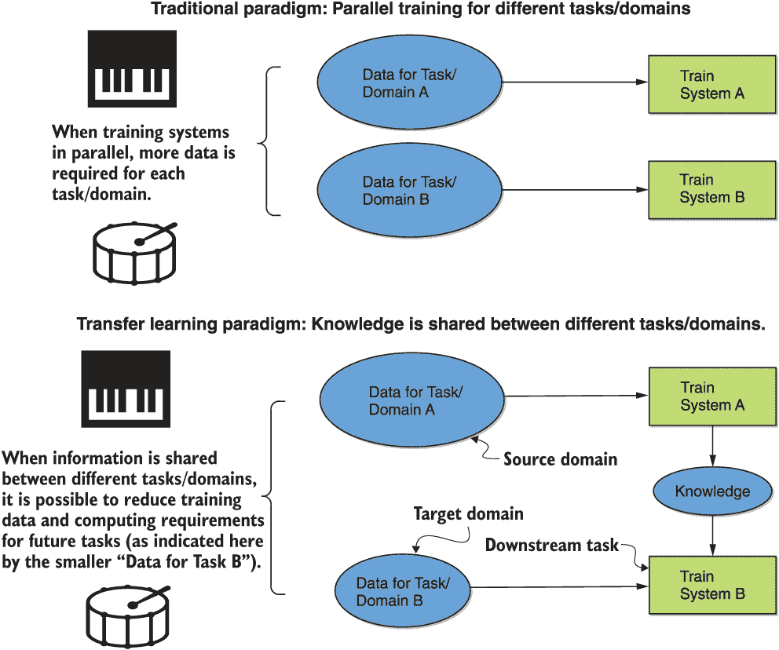
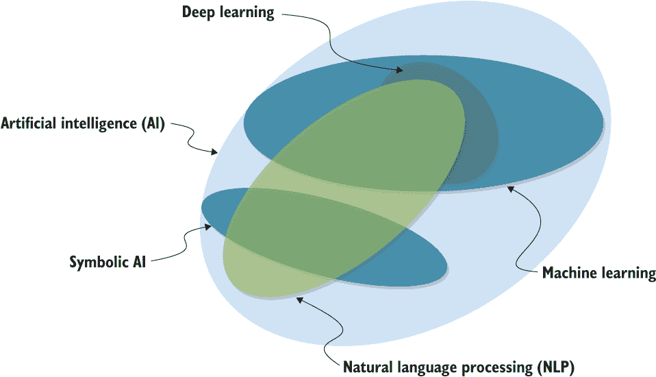
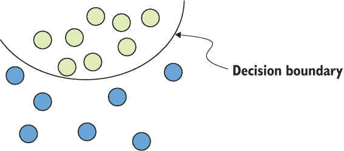
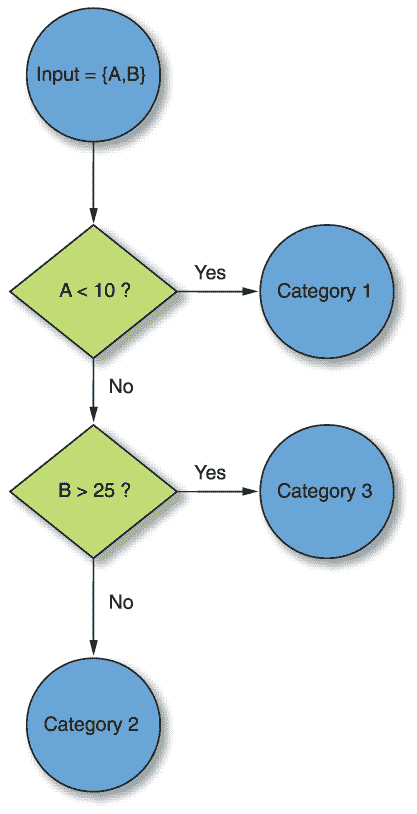
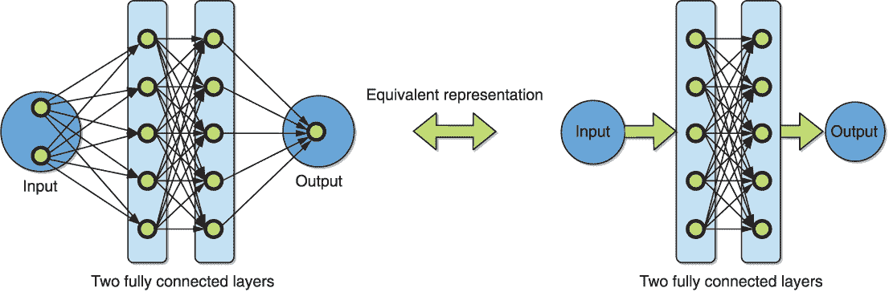
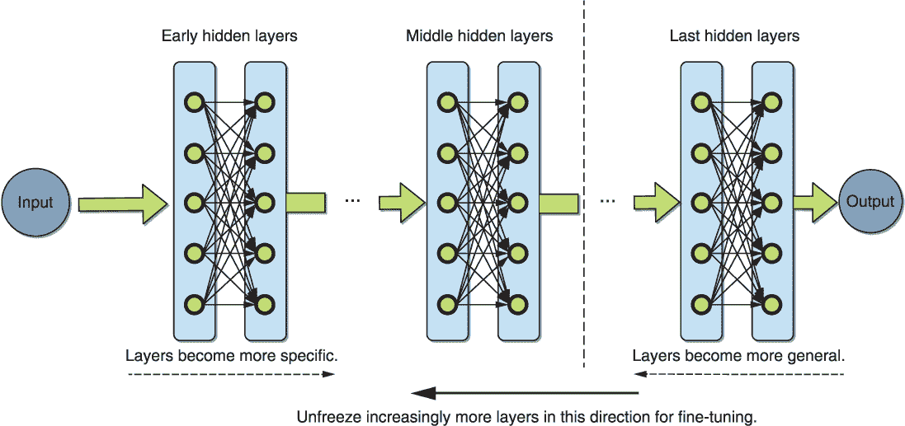

# 第一章：什么是迁移学习？

本章涵盖了

+   迁移学习在人工智能（AI）中的普遍含义，以及在自然语言处理（NLP）的上下文中的含义

+   典型 NLP 任务及 NLP 迁移学习进展的相关年表

+   计算机视觉中的迁移学习概述

+   近年来 NLP 迁移学习技术日益普及的原因

人工智能（AI）已经以戏剧性的方式改变了现代社会。现在，机器执行了人类曾经做过的任务，而且它们做得更快、更便宜，有些情况下甚至更有效。流行的例子包括计算机视觉应用，教会计算机如何理解图像和视频，例如监控摄像头视频中的罪犯检测。其他计算机视觉应用包括从患者器官图像中检测疾病以及从植物叶片中定义植物物种。人工智能的另一个重要分支，自然语言处理（NLP），特别涉及人类自然语言数据的分析和处理。NLP 应用的例子包括语音转文本转录和各种语言之间的翻译。

AI 机器人技术和自动化的技术革命最新演变—一些人将其称为第四次工业革命¹—是由几个因素的交汇引发的：针对训练大型神经网络的算法进步，通过互联网获取大量数据的可行性，以及最初是为个人游戏市场开发的大规模并行能力通过图形处理单元（GPUs）的可获得性。最近对依赖人类感知的任务自动化的快速进步，特别是计算机视觉和 NLP，需要这些神经网络理论和实践的进步。这一领域的增长促进了对输入数据和所需输出信号的复杂表示的开发，以处理这些困难问题。

与此同时，人们对 AI 能够实现的预期大大超出了实践中所取得的成就。我们被警告说，将来可能会有一个末日般的未来，将消灭大部分人类工作并取代我们所有人，甚至可能对我们构成存在威胁。NLP 并没有被排除在这种猜测之外，因为它今天是 AI 内最活跃的研究领域之一。我希望阅读本书能帮助你更好地了解从 AI、机器学习和 NLP 中现实可能期待的东西。然而，本书的主要目的是向读者提供一组与最近在 NLP 中变得重要的范式相关的可行技能—迁移学习。

迁移学习旨在利用不同设置的先前知识——无论是不同的任务、语言还是领域——来帮助解决手头的问题。它受到人类学习的启发，因为我们通常不会为了任何给定的问题从头学习事物，而是建立在可能相关的先前知识上。例如，学习演奏一种乐器，在已经知道如何演奏另一种乐器的情况下被认为更容易。显然，乐器越相似——比如风琴与钢琴——先前的知识越有用，学习新乐器也会更容易。然而，即使乐器非常不同——如鼓和钢琴——一些先前知识仍然有用，虽然作用较小，比如遵循节奏的练习。

大型研究实验室，如劳伦斯利弗莫尔国家实验室或桑迪亚国家实验室，以及大型互联网公司，如谷歌和 Facebook，能够通过在数十亿字和数百万图片上训练深层神经网络来学习大规模复杂模型。例如，谷歌的 NLP 模型 BERT（*双向编码器表示转换*），将在下一章介绍，是在英文版本的维基百科（25 亿字）和 BookCorpus（8 亿字）上进行了预训练。² 同样，深度卷积神经网络（CNNs）已经在 ImageNet 数据集的超过 1400 万张图片上进行了训练，学习的参数已经被许多组织广泛应用。从头开始训练这样的模型需要的资源量通常不会被普通的神经网络从业者所使用，比如在较小企业工作的 NLP 工程师或在较小学校读书的学生。这是否意味着较小的参与者无法取得其问题的最先进成果？绝对不是——值得庆幸的是，如果正确应用，迁移学习的概念承诺解决这个问题。

为什么迁移学习如此重要？

迁移学习使您能够将从一组任务和/或领域中获得的知识调整或转移到另一组任务和/或领域。这意味着，曾经开源的、经过大量资源包括数据、计算能力、时间和成本训练的模型可以通过更广泛的工程社区进行微调和重复使用，而使用的资源成本仅为原始资源成本的一小部分。这对于 NLP 甚至更广泛的 AI 的民主化代表了一个重要进步。图 1.1 说明了这种范式，以学习如何演奏乐器为例。从图中可以看出，不同任务/领域之间的信息共享可以使后续任务 B 所需的数据量减少，以实现相同的性能，或者*下游*任务 B。

图 1.1 转移学习范式优势的示意图—显示在底部面板—在不同任务/领域训练的系统之间共享信息，与传统范式—显示在顶部面板—其中任务/领域之间同时进行训练相比。在转移学习范式中，通过信息/知识共享可以实现减少数据和计算需求。例如，如果一个人先学会弹钢琴，我们预期他们学会打鼓会更容易些。

## 1.1 代表性自然语言处理任务概述

自然语言处理的目标是使计算机能够理解自然人类语言。您可以将其视为将自然语言文本系统地编码为准确反映其含义的数值表示的过程。尽管存在各种典型自然语言处理任务的分类法，但以下非尽述性列表提供了一个框架，用于思考问题的范围，并适当地构建本书将讨论的各种示例。请注意，其中一些任务可能需要（或不需要，具体取决于所选择的特定算法）列表中其他更难的任务：

+   *词性标注（POS）*—在文本中标记词语的词性；可能的标记包括动词、形容词和名词。

+   *命名实体识别（NER）*—在非结构化文本中检测实体，如人名、组织名和地名。请注意，词性标注可能是 NER 流水线的一部分。

+   *句子/文档分类*—使用预定义的类别对句子或文档进行标记，例如情感{“积极”，“消极”}、各种主题{“娱乐”，“科学”，“历史”}或一些其他预定义的类别集。

+   *情感分析*—为一个句子或文档分配其中表达的情感，例如，{“积极”，“消极”}。事实上，您可以将其视为句子/文档分类的特例。

+   *自动摘要*—总结一系列句子或文档的内容，通常用几句话或关键词概括。

+   *机器翻译*—将句子/文档从一种语言翻译成另一种语言或一系列语言。

+   *问答系统*—确定对人类提出的问题的合适答案；例如，问题：加纳的首都是什么？答案：阿克拉。

+   *闲聊机器人/聊天机器人*—与人类进行一段有说服力的对话，可能旨在实现某个目标，例如最大化对话长度或从人类那里提取某些特定信息。请注意，闲聊机器人可以被构建为问答系统。

+   *语音识别*—将人类语音的音频转换为其文本表示。尽管已经投入了大量的工作使语音识别系统更加可靠，但在本书中，假设已经存在了语言感兴趣的文本表示。

+   *语言建模* —— 确定人类语言中一系列单词的概率分布，其中知道一个序列中最有可能的下一个单词对于语言生成——预测下一个单词或句子——尤为重要。

+   *依赖解析* —— 将一句话分成一个表示其语法结构和单词之间关系的*依赖树*。请注意，POS 标记在这里可能很重要。

## 1.2 在 AI 背景下理解 NLP

在继续本书的其余部分之前，了解自然语言处理这个术语，并正确地将其与其他常见术语，如人工智能、机器学习和深度学习相联系非常重要。流行媒体经常将这些术语赋予的含义与机器学习科学家和工程师使用它们的含义不匹配。因此，在我们使用这些术语时，通过图 1.2 中的部分图解精确定义这些术语非常重要。

图 1.2：自然语言处理（NLP）、人工智能（AI）、机器学习和深度学习相互关系的维恩图解。具有符号 AI 的其他相关内容也在图中显示。

如您所见，深度学习是机器学习的子集，而机器学习又是 AI 的子集。NLP 也是 AI 的子集，与深度学习和机器学习有非空交集。本图扩展了 François Chollet 提出的图表³。请参阅他的书中的第六章和第 8.1 节，了解神经网络在文本中的应用综述。符号 AI 也在图表中显示，并将在下一小节中描述。

### 1.2.1 人工智能（AI）

人工智能这一领域起源于 20 世纪中叶，旨在使计算机模仿和执行人类通常执行的任务。最初的方法侧重于手动推导和硬编码显式规则，以处理每种感兴趣情况的输入数据。这个范式通常被称为*符号 AI*。它适用于像棋类这样明确定义的问题，但在遇到属于感知类别的问题，如视觉和语音识别时，明显遇到了困难。需要一种新的范式，其中计算机可以从数据中学习新规则，而不是让人类主管明确指定它们。这导致了机器学习的崛起。

### 1.2.2 机器学习

在 20 世纪 90 年代，机器学习的范式成为了人工智能的主导趋势。计算机不再为每种可能的情景明确地编程，而是通过看到许多相应的输入输出对的示例来*训练*计算机将输入与输出信号关联起来。机器学习使用了大量的数学和统计机制，但由于它往往涉及大型和复杂的数据集，该领域更多地依赖于实验、经验观察和工程，而不是数学理论。

机器学习算法学习一种将输入数据转换为适当输出的表示。为此，它需要一组数据，例如句子分类任务中的一组句子输入，以及一组相应的输出，例如句子分类的标签，如{“positive”，“negative”}。还需要一个*损失函数*，它衡量机器学习模型当前输出与数据集预期输出的距离有多远。为了帮助理解，考虑一个二元分类任务，其中机器学习的目标可能是选择一个名为*决策边界*的函数，它将清晰地将不同类型的数据点分开，如图 1.3 所示。这个决策边界应该*泛化*到超出训练数据的未见示例。为了使这个边界更容易找到，您可能希望首先对数据进行预处理或转换，使其更易于分离。我们从被允许的一组称为*假设集*的函数中寻求这样的转换。自动确定这样一个转换，使得机器学习的最终目标更容易实现，具体来说就是所谓的*学习*。

图 1.3 机器学习中一个重要的激励任务的示例：在假设集中找到一个决策边界，以有效地将不同类型的点彼此分开。在本图所示的情况下，假设集可能是弧的集合。

机器学习自动化了在一些预定义的假设集中搜索最佳输入输出转换的过程，利用损失函数所体现的一些反馈信号的指导。假设集的性质确定了考虑的算法类别，我们接下来会概述。

*经典机器学习*是以概率建模方法为起点，例如*朴素贝叶斯*。在这里，我们做出一个*朴素*假设，即输入数据特征都是相互独立的。*逻辑回归*是一个相关方法，通常是数据科学家在数据集上尝试的第一个方法，以其为基准。这两类方法的假设集都是线性函数的集合。

*神经网络*最初是在 20 世纪 50 年代发展起来的，但直到 20 世纪 80 年代才发现了训练大型网络的有效方法——反向传播算法与随机梯度下降算法相结合。虽然反向传播提供了计算网络梯度的方法，但随机梯度下降则利用这些梯度来训练网络。我们在附录 B 中简要回顾了这些概念。第一个成功的实际应用发生在 1989 年，当时贝尔实验室的 Yann LeCun 构建了一个识别手写数字的系统，这个系统后来被美国邮政部门大量使用。

*核方法* 在 20 世纪 90 年代变得流行起来。这些方法试图通过找到好的决策边界来解决分类问题，就像在图 1.3 中概念化的那样。最受欢迎的方法是*支持向量机*（SVM）。通过将数据映射到一个新的高维表示，然后在这个表示中超平面就是有效的边界。然后最大化每个类中最近数据点与超平面之间的距离。在高维空间中操作的高计算成本通过*核技巧*来减轻。这个方法类别受到坚实的理论支持，并且可以进行数学分析，当核是线性函数时，这样的分析是线性的。然而，在感知机器学习问题上的表现仍有待改善，因为这些方法首先需要手动进行*特征工程*，这使方法变得脆弱且容易出错。

*决策树*及相关方法是另一类仍然被广泛使用的算法类别。决策树是一种决策支持辅助工具，可以将决策及其后果建模为*树*，即一个两个节点之间只有一条路径连接的图。另外，可以将树定义为将输入值转换为输出类别的流程图。决策树的流行度在 2010 年代上升，当依赖它们的方法开始被更喜欢于核方法时。这种流行度得益于它们易于可视化、理解和解释。为了帮助理解，图 1.4 展示了一个示例决策树结构，如果 A<10 则将输入 {A,B} 分类为类别 1，如果 A>=10 且 B<25 则分类为类别 2，否则分类为类别 3。

图 1.4 示例决策树结构，如果 A<10 则将输入 {A,B} 分类为类别 1，如果 A>=10 且 B<25 则分类为类别 2，否则分类为类别 3

*随机森林*为应用决策树提供了一种实用的机器学习方法。该方法涉及生成大量的专门树并结合它们的输出。随机森林非常灵活且广泛适用，通常在逻辑回归之后作为基线的第二种算法尝试。当 Kaggle 开放竞赛平台在 2010 年启动时，随机森林迅速成为该平台上最广泛使用的算法。在 2014 年，*梯度提升机*接管了这一地位。它们迭代地学习新的基于决策树的模型，解决了上一轮迭代中模型的弱点。在撰写本文时，它们被普遍认为是解决非感知机器学习问题的最佳类方法。它们在 Kaggle 上仍然非常受欢迎。

大约在 2012 年，GPU 训练的深度卷积神经网络（CNNs）开始在每年的 ImageNet 比赛中获胜，标志着当前深度学习“黄金时代”的开始。CNNs 开始主导所有主要的图像处理任务，如对象识别和对象检测。同样，我们可以在处理人类自然语言，即 NLP 方面找到应用。神经网络通过对输入数据的一系列越来越有意义的分层表示进行学习。这些*层*的数量指定了模型的*深度*。这就是术语*深度学习*——训练深度神经网络的过程来自哪里。为了区分它们与深度学习，所有前述的机器学习方法通常被称为*浅层*或*传统*学习方法。请注意，深度较小的神经网络也将被分类为浅层，但不是传统的。深度学习已经主导了机器学习领域，成为感知问题的明显首选，并引发了能够处理的问题复杂度的革命。

尽管神经网络受到神经生物学的启发，但它们并不是我们神经系统工作方式的直接模型。神经网络的每一层都由一组数字参数化，称为该层的权重，准确指定了它如何转换输入数据。在深度神经网络中，参数的总数可以轻易达到百万级别。前面提到的反向传播算法是用来找到正确参数集的算法引擎，也就是*学习*网络的过程。图 1.5 展示了一个具有两个全连接隐藏层的简单神经网络的可视化。右侧还显示了同样的总结性可视化，我们经常会使用。一个深度神经网络可能有许多这样的层。一个显著的神经网络架构，不符合*前馈*性质的是*长短期记忆*（LSTM）循环神经网络（RNN）架构。与图 1.5 中的前馈架构不同，该架构接受长度为 2 的固定长度输入，而 LSTMs 可以处理任意长度的输入序列。

图 1.5 显示了一个具有两个全连接隐藏层的简单前馈神经网络的可视化（左）。右侧是一个总结性的等效表示，我们经常会用来简化图表。

正如之前提到的，引发深度学习最近兴趣的因素是硬件的跨度，大量数据的可用性以及算法的进步。GPU 最初是为视频游戏市场开发的，互联网的成熟开始为该领域提供前所未有的质量和数量的数据。维基百科、YouTube 和 ImageNet 是数据源的具体例子，其可用性推动了计算机视觉和自然语言处理的许多进步。神经网络消除了昂贵的手工特征工程的需求——这是将浅层学习方法成功应用于感知数据所需的——这可以说是影响了深度学习易于采纳的因素。由于自然语言处理是一个感知问题，它也将是本书中讨论的最重要的机器学习算法类别之一，尽管不是唯一的。

接下来，我们的目标是深入了解自然语言处理（NLP）领域的历史和进展。

### 1.2.3 自然语言处理（NLP）

语言是人类认知中最重要的方面之一。毋庸置疑的是，为了创建真正的人工智能，机器需要被教导如何解释、理解、处理和作出对人类语言的反应。这强调了自然语言处理对人工智能和机器学习领域的重要性。

就像人工智能的其他子领域一样，处理自然语言处理问题的初始方法，如句子分类和情感分析，都是基于显式规则或符号型人工智能。这种系统通常无法推广到新的任务，并且很容易崩溃。自从 20 世纪 90 年代核方法诞生以来，人们一直致力于特征工程——将输入数据手动转化为浅层学习方法可以用来产生有用预测的形式。这种方法非常耗时、任务特定且对非专家来说难以接触。深度学习的出现（大约在 2012 年）引发了自然语言处理的真正革命。神经网络能够在其某些层自动设计合适的特征，降低了这些方法对新任务和问题的适用性门槛。然后，人们将精力集中在为特定任务设计适当的神经网络架构，以及调整训练过程中的各种超参数设置上。

训练自然语言处理系统的标准方式是收集一组大量的数据点，每个数据点都可靠地注释了输出标签，比如情感分析任务中的“积极”或“消极”的句子或文档。然后将这些数据点提供给机器学习算法，学习最佳的输入到输出信号的表示或转换，可以推广到新的数据点。在自然语言处理和机器学习的其他子领域中，这个过程通常被称为“监督学习”范式。标注过程通常是手动完成的，为学习代表性转换提供“监督信号”。另一方面，从无标签数据中学习表示转换被称为“无监督学习”。

虽然今天的机器学习算法和系统并非生物学习系统的直接复制品，也不应被认为是这种系统的模型，但它们的某些方面受到了进化生物学的启发，而在过去，从生物学中汲取的灵感引导了显著的进步。基于这一点，似乎不合逻辑的是，对于每个新的任务、语言或应用领域，监督学习过程传统上都是从零开始重复。这一过程在某种程度上与自然系统学习的方式背道而驰——建立在之前获得的知识之上并进行再利用。尽管如此，从零开始学习感知任务仍取得了重大进展，特别是在机器翻译、问答系统和聊天机器人领域，虽然其中仍存在一些缺点。尤其是，当样本分布发生重大变化时，现有系统在处理时的稳定性较差。换句话说，系统学会了在特定类型的输入上表现良好。如果我们改变输入类型，这可能导致性能显著下降，甚至完全失效。此外，为了完全民主化人工智能，并使自然语言处理对小型企业的普通工程师——或对没有大型互联网公司所拥有的资源的人——变得更易获得，能够下载和重复使用其他地方获得的知识将是极其有益的。这对于生活在官方语言可能与英语或其他流行语言不同的国家的人，以及从事可能在他们所在地区独特的任务或从未有人探索过的任务的人来说，也非常重要。迁移学习提供了一种解决这些问题的方法。

迁移学习使人们能够从一个*环境*——我们定义为特定任务、领域和语言的组合——转移知识到另一个不同的环境。原始环境自然被称为*源环境*，而最终的环境称为*目标环境*。迁移过程的难易程度和成功程度取决于源环境和目标环境的相似性。很自然地，如果目标环境在某种意义上与源环境“相似”，在这本书的后面我们将对此做出定义，那么迁移将会更加容易且成功。

转移学习在自然语言处理中的隐式使用时间比大多数从业者意识到的要长得多，因为常见做法是使用预训练的嵌入，如*word2vec*或*sent2vec*（在下一节中会更详细介绍）对单词进行向量化。 浅层学习方法通常被应用于这些向量作为特征。 我们将在接下来的章节和第四章中更详细地介绍这两种技术，并在整本书中以各种方式应用它们。 这种流行的方法依赖于一个无监督的预处理步骤，首先用于训练这些嵌入而不需要任何标签。 然后，从这一步中获取的知识被转移到特定的应用程序中，在监督设置中，通过使用浅层学习算法在一小部分标记示例上对所说的知识进行改进和专业化，以解决手头的问题。 传统上，将无监督和监督学习步骤相结合的这种范式被称为*半监督学习*。

接下来，我们将详细介绍自然语言处理进展的历史进程，特别关注转移学习最近在这一重要的人工智能和机器学习子领域中所起的作用。

## 1.3 自然语言处理进展简史

要框架化你对自然语言处理中转移学习的状态和重要性的理解，首先了解历史上对这个人工智能子领域重要的任务和技术可以是有帮助的。 本节介绍了这些任务和技术，并以自然语言处理转移学习最近的进展概述告终。 这个概述将帮助你适当地将转移学习在自然语言处理中的影响放入背景，并理解为什么它现在比以往任何时候都更重要。

### 1.3.1 概述

自然语言处理诞生于 20 世纪中叶，与人工智能同时出现。 自然语言处理的一个重要历史里程碑是 1954 年的乔治城实验，在该实验中，大约 60 个俄语句子被翻译成英语。 在 20 世纪 60 年代，麻省理工学院（MIT）的自然语言处理系统 ELIZA 成功模拟了一名心理医生。 同样在 20 世纪 60 年代，信息表示的向量空间模型被开发出来，其中单词被表示为实数向量，这些向量可进行计算。 20 世纪 70 年代，基于处理输入信息的复杂手工规则集的一系列闲聊机器人/聊天机器人概念被开发出来。

在 1980 年代和 1990 年代，我们看到了将系统化的机器学习方法应用于自然语言处理的出现，计算机发现了规则，而不是人类制定了规则。这一进步与当时机器学习的普及爆炸同时发生，正如我们在本章前面已经讨论过的那样。1980 年代末，将*奇异值分解*（SVD）应用于向量空间模型，导致*潜在语义分析*—一种无监督的确定语言中单词关系的技术。

在 2010 年代初，神经网络和深度学习在该领域的崛起，彻底改变了自然语言处理。这些技术被证明在最困难的自然语言处理任务中取得了最先进的结果，例如机器翻译和文本分类。2010 年代中期见证了 word2vec 模型的发展，以及其变种 sent2vec、doc2vec 等等。这些基于神经网络的技术将单词、句子和文档（分别）向量化，以一种确保生成的向量空间中向量之间距离代表相应实体之间的差异的方式，即单词、句子和文档。事实上，这些嵌入的一些有趣属性允许处理类比—在诱导的向量空间中，单词*Man*和*King*之间的距离大约等于单词*Woman*和*Queen*之间的距离，例如。用于训练这些基于神经网络的模型的度量来自语言学领域，更具体地说是*分布语义学*，不需要标记数据。一个单词的含义被假定与其上下文相关联，即周围的单词。

各种嵌入文本单元的方法，例如单词、句子、段落和文档，成为现代自然语言处理的关键基石。一旦文本样本被嵌入到适当的向量空间中，分析通常可以简化为对真实向量操作的众所周知的浅层统计/机器学习技术的应用，包括聚类和分类。这可以看作是一种*隐式迁移学习*的形式，以及一种半监督机器学习流水线—嵌入步骤是无监督的，学习步骤通常是监督的。无监督的预训练步骤实质上降低了标记数据的要求，从而减少了实现给定性能所需的计算资源—我们将在本书中学习如何利用迁移学习来为更广泛的情景提供服务。

大约在 2014 年，*序列到序列*模型⁷被开发出来，并在困难任务，如机器翻译和自动摘要中取得显著改进。特别是，尽管在神经网络之前的 NLP 流水线由几个明确的步骤组成，例如词性标注、依存句法分析和语言建模，但后来表明机器翻译可以进行“序列到序列”的处理。在这里，深度神经网络的各个层自动执行了所有这些中间步骤。这些模型学会了通过一个将输入序列（例如一种语言中的源句子）与一个输出序列（例如该句子的另一种语言的翻译）相关联的方法，通过将输入转换成上下文向量的编码器和将其转换成目标序列的解码器。编码器和解码器通常被设计为*循环神经网络*（RNNs）。这些能够在输入句子中编码顺序信息，这是早期模型（如词袋模型）无法做到的，从而显著提高了性能。

然而，人们发现，长输入序列更难处理，这促使了被称为*注意力*的技术的发展。这一技术通过让模型关注输入序列中最相关的部分，显著改善了机器翻译序列模型的性能。一个叫做*transformer*的模型进一步定义了*自注意力层*，用于编码器和解码器，使两者都能相对于输入序列中的其他文本段构建更好的上下文。这种架构在机器翻译方面取得了显著的改进，并且观察到它更适合在大规模并行硬件上进行训练，将训练速度提高了一个数量级。

直到 2015 年左右，大多数自然语言处理的实用方法都集中在*词级别*，这意味着整个单词被视为不可分割的原子实体，并被赋予一个特征向量。这种方法有几个缺点，尤其是如何处理从未见过或*词汇外*的单词。当模型遇到这样的单词时，比如单词拼写错误时，该方法会失败，因为无法对其进行向量化。此外，社交媒体的兴起改变了什么被视为自然语言的定义。现在，数十亿人通过表情符号、新发明的俚语和故意拼错的单词在线表达自己。不久之后，人们意识到，许多这些问题的解决方案自然地来自于以字符级别处理语言。在这个范式中，每个字符都将被向量化，只要人类使用可接受的字符表达自己，就可以成功生成向量特征，并成功应用算法。Zhang 等人⁹在字符级别 CNN 用于文本分类的背景下展示了这一点，并展示了对拼写错误的显著鲁棒性。

### 1.3.2 最近的迁移学习进展

传统上，针对任何给定的问题设置——任务、领域和语言的特定组合——学习都是以完全监督或完全无监督的方式进行的，从头开始。如前所述，半监督学习早在 1999 年就在 SVM 的背景下被认识到，作为一种解决可能有限标记数据可用性的方式。对更大规模的未标记数据集进行初始无监督预训练步骤使下游监督学习更容易。对此的变体被研究用于解决可能存在噪声——可能不正确——标签的情况，这种方法有时被称为*弱监督学习*。然而，通常假设标记数据集和未标记数据集的采样分布是相同的。

迁移学习放宽了这些假设。1995 年，在神经信息处理系统会议（NeurIPS）上，迁移学习被普遍认为是“学习学习”。基本上，它规定智能机器需要具有终身学习能力，以重复利用学到的知识进行新任务。此后，这一点已经在几个不同的名称下进行了研究，包括*学习学习*、*知识转移*、*归纳偏差*和*多任务学习*。在多任务学习中，算法被训练以在多个任务上同时表现良好，从而发现可能更普遍有用的特征。然而，直到 2018 年左右，才开发出了实用且可扩展的方法来解决 NLP 中最困难的感知问题。

2018 年可谓是自然语言处理领域的一场革命。对于如何最好地将文本集合表示为向量的理解发生了巨大变革。此外，人们普遍认识到开源模型可以进行微调或转移到不同的任务、语言和领域。与此同时，一些大型互联网公司发布了更多、更大的自然语言处理模型，用于计算这些表示，并且指定了明确定义的微调程序。突然之间，即使是普通从业者，甚至是独立从业者，也能够获得自然语言处理方面的最新成果。有人称之为自然语言处理的“ImageNet 时刻”，这是在 2012 年之后看到的计算机视觉应用的爆发，当时一个 GPU 训练的神经网络赢得了 ImageNet 计算机视觉竞赛。就像最初的 ImageNet 时刻一样，预训练模型库首次为大量的自然语言处理数据提供了支持，以及对使用标记数据集微调到特定任务的明确定义技术，其数据集大小明显小于否则所需的大小。本书的目的是描述、阐明、评估、可证明地应用、比较和对比属于此类别的各种技术。我们接下来简要概述这些技术。

早期对自然语言处理的迁移学习的探索主要集中在类比于计算机视觉，后者在过去十多年中已经成功使用了。其中一种模型——本体建模语义推理（SIMOn）[¹⁰]——采用了字符级卷积神经网络（CNN）与双向 LSTM 结合的结构语义文本分类。SIMOn 方法展示了直接类比于计算机视觉的自然语言处理迁移学习方法。计算机视觉应用的丰富知识库激发了这种方法。该模型学到的特征被证明对无监督学习任务有用，并且在社交媒体语言数据上表现良好，这种语言有些特殊，与维基百科和其他大型基于书籍的数据集上的语言非常不同。

原始的 word2vec 公式中一个显著的弱点是消歧。无法区别在不同上下文中可能具有不同含义的单词的各种用法，例如同音异形词的情况——鸭子（姿势）与鸭子（鸟类）或公平（一次集会）与公平（有正义）。在某种意义上，原始的 word2vec 公式通过单词的平均向量表示来代表一个单词中这些不同同音异形词的向量的平均值。*从语言模型中嵌入*(¹¹ ELMo)——以受欢迎的*Sesame Street*角色命名-试图使用双向 LSTM 开发单词的上下文化嵌入。在这个模型中，一个单词的嵌入非常依赖于它的上下文，相应的数值表示对于每个这样的上下文是不同的。ELMo 通过训练来预测单词序列中的下一个词，这与本章开头介绍的语言建模概念有很大关系。大型数据集，如维基百科和各种书籍数据集，可用于此框架的训练。

*通用语言模型微调*（Universal Language Model Fine-Tuning, ULMFiT ）¹² 方法被提出来为了微调任何一种基于神经网络的语言模型以适应特定任务，并在文本分类的情况下被初步证明。这种方法背后的一个重要概念是*有区别的微调*，其中网络的不同层以不同的速率进行训练。OpenAI 的*生成式预训练变换器*（Generative Pretrained Transformer, GPT）改变了变换器的编码器-解码器架构，以实现 NLP 微调语言模型。它放弃了编码器，并保留了解码器及其自我注意力子层。来自变形金刚的双向编码器表征¹³ (Bidirectional Encoder Representations from Transformers, BERT) 则相反，修改了变换器的结构，保留了编码器并丢弃了解码器，还依赖于单词*掩蔽*，需要准确预测训练指标。这些概念将在接下来的章节中详细讨论。

在所有这些基于语言模型的方法中——ELMo、ULMFiT、GPT 和 BERT，都表明生成的嵌入可以针对特定的下游 NLP 任务进行微调，只需相对较少的标记数据点即可。对语言模型的关注是有意义的：假设它们诱导的假设集是普遍有用的，并且已知为大规模训练准备了数据。

接下来，我们重点介绍计算机视觉中的迁移学习的关键方面，以更好地理解在 NLP 中的迁移学习，并看看是否可以为我们的目的学到和借鉴一些知识。这些知识将成为本书剩余部分中驱动我们对 NLP 迁移学习探索的丰富类比的来源。

## 1.4 计算机视觉中的迁移学习

尽管本书的目标是自然语言处理，但将 NLP 迁移学习放在计算机视觉迁移学习的背景下进行框架化有助于理解。这样做的原因之一是，来自 AI 的这两个子领域的神经网络架构可能具有某些相似的特征，因此可以借鉴计算机视觉的方法，或者至少用它们来指导 NLP 的技术。事实上，计算机视觉领域中这些技术的可用性被认为是最近 NLP 迁移学习研究的一个重要驱动因素。研究人员可以访问一个定义良好的计算机视觉方法库，以在相对未被探索的 NLP 领域进行实验。然而，这些技术直接可转移的程度是一个开放的问题，有几个重要的区别需要注意。一个这样的区别是，NLP 神经网络通常比计算机视觉中使用的神经网络要浅。

### 1.4.1 总体概述

计算机视觉或视觉机器人的目标是使计算机理解数字图像和/或视频，包括获取、处理和分析图像数据，并根据它们的派生表示做出决策。视频分析通常可以通过将视频分成帧来进行，然后可以将其视为图像分析问题。因此，理论上计算机视觉可以被提出为图像分析问题而不失一般性。

计算机视觉诞生于 20 世纪中期，与人工智能一起出现。显然，视觉是认知的重要部分，因此致力于建造智能机器人的研究人员早期就认识到它的重要性。上世纪六十年代，首批方法试图模仿人类视觉系统，而上世纪七十年代人们更加关注提取边缘和场景中形状建模。上世纪八十年代，各个方面的计算机视觉方法越来越成熟，尤其是人脸识别和图像分割，到了上世纪九十年代出现了数学严谨的方法。这个时期正值机器学习流行的时期，正如我们前面所提到的。接下来的几十年，致力于为图像开发更好的特征提取方法。在应用浅层机器学习技术之前，进行努力和重心在此。2012 年的“ImageNet 时刻”，当 GPU 加速的神经网络第一次在广受关注的 ImageNet 比赛中大幅领先时，标志着该领域的革命。

- ImageNet¹⁴ 最初于 2009 年发布，并迅速成为测试目标识别最佳方法的竞赛基础。著名的 2012 年神经网络条目指出了深度学习作为计算机视觉特别是机器学习中感知问题的前进之路。对我们来说，一些研究人员很快意识到，来自预训练的 ImageNet 模型的神经网络权重可以用于初始化其他有时看似无关的任务的神经网络模型，并显著提高性能。

### - 1.4.2 预训练的 ImageNet 模型

- 在 ImageNet 每年的标志性比赛中获胜的各个团队非常慷慨地共享了他们的预训练模型。以下是一些值得注意的 CNN 模型示例。

- VGG 架构最初是在 2014 年引入的，具有 VGG16（深度为 16）和 VGG19（深度为 19 层）两个变种。为了使更深的网络在训练过程中收敛，需要首先训练较浅的网络直至收敛，然后使用它的参数初始化更深的网络。该架构被发现在训练过程中有些慢，而且参数总数相对较大——约为 1.3 亿至 1.5 亿个参数。

- 2015 年 ResNet 架构解决了其中一些问题。尽管更深层，但参数数量显著减少——最小的变种 ResNet50 深 50 层，约有 5000 万个参数。实现这种减少的关键是通过一种称为 *最大池化* 的技术进行正则化，并通过子构建块的模块化设计。

- 其他值得注意的例子包括 Inception 及其扩展 Xception，分别于 2015 年和 2016 年提出，旨在通过在同一网络模块中堆叠多个卷积来创建多个级别的特征提取。这两个模型都进一步显著减小了模型大小。

### - 1.4.3 微调预训练的 ImageNet 模型

- 由于已经提出了预训练的 CNN ImageNet 模型，因此从头开始训练计算机视觉模型是不常见的。目前更常见的方法是下载其中一个这些开源模型，并在有限的标记数据上使用它来初始化类似的架构，例如 *微调* 一部分层，或者将其用作固定的特征提取器。

在图 1.6 中显示了在前馈神经网络中选择要微调的一部分层的可视化。随着目标领域中的数据量增加，阈值从输出（向输入）移动，阈值和输出之间的层被重新训练。这种变化是因为增加的数据量可以有效地用于训练更多的参数，而否则是无法完成的。此外，阈值的移动方向必须是从右到左，即远离输出端，接近输入端。这种移动方向使我们能够保留编码接近输入端的一般特征的层，同时重新训练接近输出端的层，它们编码源领域特定特征。而且，当源领域和目标领域高度不同的时候，一些阈值右侧的更具体的参数/层可以被丢弃。

另一方面，特征提取涉及仅移除网络的最后一层，该层不再产生数据标签，而是产生一组数值向量，可以通过浅层机器学习方法（如支持向量机 SVM）进行训练，就像以前一样。

在重新训练或*微调*方法中，先前的预训练权重并不全部保持不变，而是允许其中的一个子集根据新的标记数据进行改变。然而，重要的是要确保在有限的新数据上训练的参数数量不会导致过度拟合，这促使我们冻结一些参数以减少正在训练的参数的数量。通常是以经验的方式来选择要冻结的层数，图 1.6 中的启发式方法指导了这一点。

图 1.6 表现了在计算机视觉中适用于前馈神经网络架构的各种迁移学习启发式方法的可视化，在 NLP 中我们将尽可能利用它。随着目标领域中的训练数据的增加，阈值向左移动，它右侧的所有参数都被重新训练，除了那些由于源领域和目标领域越来越不同而被丢弃的参数。

在 CNN 中已经确定，靠近输入层的早期层—执行更一般的图像处理任务的功能，例如检测图像中的任何边缘。 靠近输出层的后期层—执行更特定于手头任务的功能，例如将最终的数值输出映射到特定标签。 这种安排导致我们首先解冻和微调靠近输出层的层，然后逐渐解冻和微调接近输入层的层，如果发现性能不满意，这个过程将继续，只要目标任务的可用标记数据集能够支持训练参数的增加。

这个过程的一个推论是，如果目标任务的标记数据集非常大，整个网络可能都需要被微调。另一方面，如果目标数据集很小，就需要仔细考虑目标数据集与源数据集的相似程度。如果非常相似，模型体系结构可以直接初始化为预训练权重进行微调。如果非常不同，当初始化时，放弃一些网络的后续层的预训练权重可能会对目标任务没有任何相关性。此外，由于数据集不是很大，在微调时应该只解冻剩余后续层的一小部分。

我们将进行计算实验，以进一步探索这些启发式方法。

## 1.5 为什么 NLP 迁移学习是一个令人兴奋的研究课题？

现在我们已经在整体人工智能和机器学习领域的背景下框定了 NLP 的当前状态，我们可以很好地总结为什么本书的主题重要，以及为什么您作为读者应该非常关心这个主题。

到目前为止，显而易见的是，近年来这一领域的进展迅速加速。许多预训练语言模型首次提供，同时也提供了明确定义的程序，用于对其进行更具体的任务或领域的微调。人们发现可以类比于计算机视觉领域进行迁移学习的方式，一些研究小组能够迅速借鉴现有的计算机视觉技术，推动我们对 NLP 迁移学习的了解的进展。这项工作取得了重要的优势，即为那些没有大量资源的普通从业者减少了这些问题的计算和训练时间要求。

目前该领域存在着大量的激动人心的研究，并且大量的研究人员正在从事这个问题领域的研究。在这个新颖的学科中存在许多未解决的问题，这为机器学习研究人员通过帮助推动知识水平的提高而使自己出名提供了机会。同时，社交媒体已经成为人类互动中越来越重要的因素，它带来了在自然语言处理中以前未曾见过的新挑战。这些挑战包括俚语/行话和表情符号的使用，这些在通常用于训练语言模型的更正式语言中可能找不到。一个示例是在社交媒体自然语言生态系统中发现的严重漏洞——尤其是关于主权民主国家针对其他外国政府的选举干预指控，比如剑桥分析丑闻。此外，对“假新闻”问题恶化的一般感觉增加了人们对该领域的兴趣，并推动了在构建这些系统时应考虑的道德问题的讨论。所有这些，加上在各个领域不断增长的越来越复杂的聊天机器人的增加，以及相关的网络安全威胁，意味着自然语言处理中的迁移学习问题有望继续增长其重要性。

## 总结

+   人工智能（AI）承诺着从根本上改变我们的社会。为了使这种转变的好处普及化，我们必须确保最新的进展对每个人都是可访问的，无论其语言、获取大规模计算资源的能力和出生国是什么。

+   机器学习是人工智能中主要的现代范式，它不是为每种可能的情况明确地编程计算机，而是通过看到许多这样对应的输入-输出对的例子，*训练*它将输入与输出信号关联起来。

+   自然语言处理（NLP）是我们将在本书中讨论的人工智能的子领域，它涉及对人类自然语言数据的分析和处理，是当今人工智能研究中最活跃的领域之一。

+   近年来在自然语言处理领域中流行的一种范式，迁移学习，使你能够将从一个任务或领域中获得的知识适应或迁移到另一个任务或领域。这对于自然语言处理的民主化以及更广泛地说是人工智能，是一个重要的进步，使得知识可以在新环境中以前所需资源的一小部分重新使用，而这些资源可能并不是所有人都能得到的。

+   关键的建模框架，使得在自然语言处理中实现迁移学习成为可能，包括 ELMo 和 BERT。

+   社交媒体重要性的近期上升改变了什么被认为是自然语言的定义。现在，数十亿人在网上使用表情符号、新创造的俚语和故意拼写错误的单词来表达自己。所有这些都提出了新的挑战，在开发新的自然语言处理迁移学习技术时我们必须考虑到这些挑战。

+   在计算机视觉中，迁移学习相对较为成熟，因此在尝试新的自然语言处理迁移技术时，我们应尽可能借鉴这一知识体系。

1. K. Schwab，《第四次工业革命》（日内瓦：世界经济论坛，2016 年）。

2. J. Devlin 等人，“BERT: 深度双向转换器的预训练”，arXiv (2018)。

3. F. Chollet，《Python 深度学习》（纽约：Manning Publications，2018 年）。

4. T. Mikolov 等人，“词表示在向量空间中的高效估计”，*arXiv* (2013)。

5. M. Pagliardini 等人，“使用组合 n-Gram 特征的句子嵌入的无监督学习”，NAACL-HLT 论文集 (2018)。

6. Q. V. Le 等人，“句子和文档的分布式表示”，*arXiv* (2014)。

7. I. Sutskever 等人，“序列到序列学习的神经网络”，NeurIPS 论文集 (2014)。

8. A. Vaswani 等人，“注意力就是一切”，NeurIPS 论文集 (2017)。

9. X. Zhang 等人，“用于文本分类的字符级卷积网络”，NeurIPS 论文集 (2015)。

10. P. Azunre 等人，“基于字符级卷积神经网络的表格数据集的语义分类”，arXiv (2019)。

11. M. E. Peters 等人，“深层上下文化词表示”，NAACL-HLT 论文集 (2018)。

12. J. Howard 等人，“通用语言模型微调用于文本分类”，第 56 届计算语言学年会论文集 (2018)。

13. J. Devlin 等人，“BERT: 深度双向转换器的预训练”，NAACL-HLT 论文集 (2019)。

14. J. Deng 等人，“ImageNet：一个大规模分层图像数据库”，NAACL-HLT 论文集 (2019)。

15. K. Schaffer，《数据与民主：大数据算法如何塑造观点并改变历史进程》（纽约：Apress，2019 年）。
