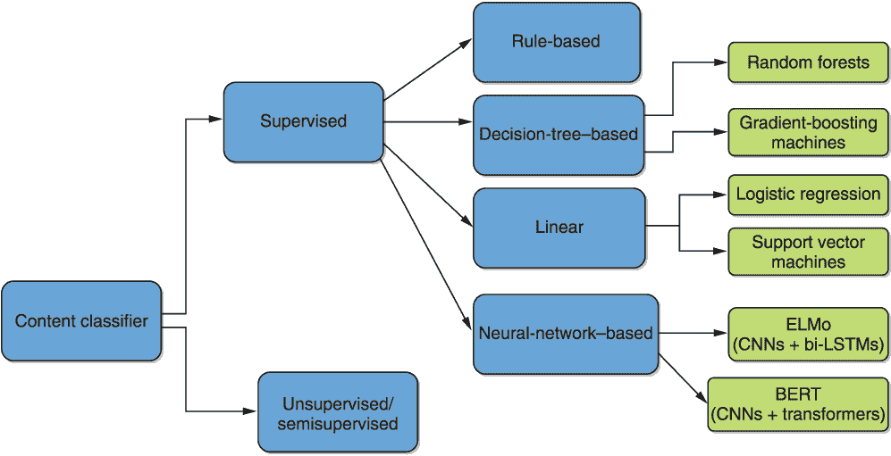
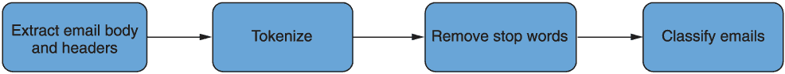
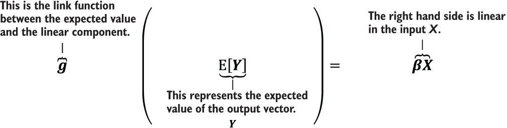
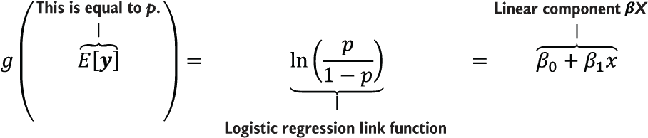
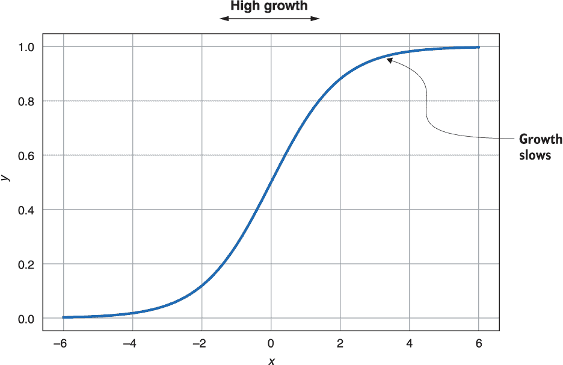

# 第二章：开始使用基线：数据预处理

本章包括

+   介绍一对自然语言处理（NLP）问题

+   获取和预处理用于此类问题的自然语言处理数据

+   使用关键的*广义线性方法*为这些问题建立基线

在本章中，我们直接着手解决自然语言处理问题。这将是一个分为两部分的练习，横跨本章和下一章。我们的目标是为一对具体的自然语言处理问题建立一组基线，以便稍后用于衡量利用越来越复杂的迁移学习方法获得的渐进改进。在此过程中，我们旨在提升您的一般自然语言处理直觉，并更新您对为此类问题设置问题解决流程所涉及的典型程序的理解。您将复习从分词到数据结构和模型选择等技术。我们首先从头开始训练一些传统的机器学习模型，为这些问题建立一些初步的基线。我们在第三章中完成练习，在那里我们将最简单形式的迁移学习应用于一对最近流行的深度预训练语言模型。这涉及在目标数据集上仅微调每个网络的最终几层。这项活动将作为本书主题——自然语言处理的迁移学习的实际动手介绍的一种形式。

我们将专注于一对重要的代表性示例自然语言处理问题：电子邮件的垃圾分类和电影评论的情感分类。这个练习将装备您一些重要的技能，包括一些获取、可视化和预处理数据的技巧。我们将涵盖三种主要的模型类别：广义线性模型，如逻辑回归，基于决策树的模型，如随机森林，以及基于神经网络的模型，如 ELMo。这些类别另外由具有线性核的支持向量机（SVM），梯度提升机（GBM）和 BERT 所代表。要探索的不同类型的模型如图 2.1 所示。请注意，我们不明确讨论基于规则的方法。这些方法的一个广泛使用的示例是简单的关键词匹配方法，该方法会将包含某些预先选择的短语的所有电子邮件标记为垃圾邮件，例如，“免费彩票”作为垃圾邮件，“了不起的电影”作为正面评价。这些方法通常作为许多工业应用中解决自然语言处理问题的首次尝试，但很快被发现脆弱且难以扩展。因此，我们不再深入讨论基于规则的方法。我们在本章讨论这些问题的数据及其预处理，并引入和应用广义线性方法。在下一章，作为整体练习的第二部分，我们将决策树方法和神经网络方法应用于数据。



图 2.1 本章和下一章将探讨文本分类示例中不同类型的监督模型。

我们为每个示例和模型类别提供了代码示例，让你能快速掌握这些技术的要点，同时也可以培养编码技巧，以便能够直接应用到自己的问题中。所有代码都以渲染后的 Jupyter 笔记本形式提供在本书的伴随 GitHub 代码库，以及 Kaggle 笔记本/内核中。你可以在几分钟内开始运行 Kaggle 笔记本/内核，而无需处理任何安装或依赖问题。渲染后的 Jupyter 笔记本提供了在正确执行时可以预期的输出示例，而 Kaggle 提供了基于浏览器的 Jupyter 执行环境，同时还提供了有限的免费 GPU 计算资源。虽然 Google Colab 是 Jupyter 的主要替代方案之一，但我们选择在这里使用 Kaggle。你也可以使用 Anaconda 在本地轻松安装 Jupyter，并欢迎将笔记本转换为 .py 脚本以供本地执行，如果你更喜欢的话。然而，我们推荐使用 Kaggle 笔记本来执行这些方法，因为它们可以让你立即开始，无需任何设置延迟。此外，在撰写本文时，该服务提供的免费 GPU 资源扩大了所有这些方法的可访问性，使那些可能没有本地强大 GPU 资源的人们也能够使用，与关于 NLP 迁移学习的“人工智能民主化”议程保持一致，这激发了很多人的兴趣。附录 A 提供了一个 Kaggle 快速入门指南，以及作者对如何最大化平台价值的个人建议。然而，我们预计大多数读者应该可以很轻松地开始使用它。请注意在下面的注释中附带的重要技术注意事项。 

注意 Kaggle 经常更新依赖项，即其 Docker 镜像上安装的库的版本。为了确保您使用的是我们编写代码时使用的相同依赖项——以保证代码可以直接使用而进行最小更改，请确保对感兴趣的每个笔记本选择“复制并编辑内核”，这些笔记本的链接列在本书的伴随存储库中。如果您将代码复制粘贴到一个新的笔记本中，并且不遵循此推荐过程，您可能需要针对创建它时为该笔记本安装的特定库版本稍微调整代码。如果选择在本地环境中安装，请注意我们在伴随存储库中共享的冻结依赖要求列表，该列表将指导您需要哪些库的版本。请注意，此要求文件旨在记录并完全复制在 Kaggle 上实现书中报告结果的环境；在不同的基础设施上，它只能用作指南，并且您不应期望它直接使用，因为可能存在许多潜在的与架构相关的依赖冲突。此外，对于本地安装，大多数要求都不是必需的。最后，请注意，由于在撰写本文时 ELMo 尚未移植到 TensorFlow 2.x，我们被迫使用 TensorFlow 1.x 来公平比较它和 BERT。在伴随存储库中，我们确实提供了如何在 TensorFlow 2.x 中使用 BERT 进行垃圾邮件分类示例的示例。我们在后续章节中从 TensorFlow 和 Keras 过渡到使用 TensorFlow 2.x 的 Hugging Face transformers 库。您可以将第二章和第三章中的练习视为早期为 NLP 迁移学习开发的早期软件包的历史记录和体验。这个练习同时帮助您将 TensorFlow 1.x 与 2.x 进行对比。

## 2.1 预处理电子邮件垃圾分类示例数据

在本节中，我们介绍了本章将要讨论的第一个示例数据集。在这里，我们有兴趣开发一个算法，它可以在规模上检测任何给定的电子邮件是否为垃圾邮件。为此，我们将从两个独立的来源构建数据集：流行的恩隆电子邮件语料库作为非垃圾邮件的代理，以及一系列“419”欺诈邮件作为垃圾邮件的代理。

我们将把这看作是一个监督分类任务，在这个任务中，我们将首先在一组被标记为垃圾邮件或非垃圾邮件的电子邮件上训练一个分类器。虽然在线上存在一些标记数据集用于训练和测试，与这个问题密切相关，但我们将采取另一种方式，从一些其他知名的电子邮件数据源创建我们自己的数据集。这样做的原因是更贴近实践中数据收集和预处理通常发生的方式，其中数据集首先必须被构建和筛选，而不是文献中这些过程通常被简化的方式。

尤其是，我们将采样安然公司语料库——最大的公开电子邮件收集，与臭名昭著的安然金融丑闻有关——作为非垃圾邮件的代理，以及采样“419”欺诈邮件，代表最为知名的垃圾邮件类型，作为垃圾邮件的代理。这两种类型的电子邮件都可以在 Kaggle 上公开获取，³,⁴，这是一个流行的数据科学竞赛平台，这使得在那里运行示例特别容易，而不需要太多的本地资源。

安然语料库包含大约五十万封由安然公司员工撰写的电子邮件，由联邦能源委员会收集，用于调查该公司的倒闭。这个语料库在文献中被广泛用于研究用于电子邮件应用的机器学习方法，并且通常是研究人员与电子邮件一起进行初步算法原型实验的首选数据源。在 Kaggle 上，它作为一个单列.csv 文件提供，每行一个电子邮件。请注意，与许多实际应用中可能找到的情况相比，此数据仍然更干净。

图 2.2 显示了在这个示例中将在每封电子邮件上执行的步骤序列。电子邮件的正文将首先与电子邮件的标头分开，将提取一些关于数据集的统计信息以了解数据的情况，将从电子邮件中删除停用词，然后将其分类为垃圾邮件或非垃圾邮件。



图 2.2 对输入电子邮件数据执行的预处理任务序列

### 2.1.1 加载和可视化安然公司语料库

我们需要做的第一件事是使用流行的 Pandas 库加载数据，并查看数据的一个切片，以确保我们对数据的外观有一个良好的了解。清单 2.1 展示了一旦获取了安然公司语料库数据集并放置在变量`filepath`指定的位置（在这种情况下，它指向我们 Kaggle 笔记本中的位置）后，要执行的代码。在导入之前，请确保所有库都已通过以下命令进行 PIP 安装：

```py
pip install <package name>
```

清单 2.1 加载安然公司语料库

```py
import numpy as np                      ❶
import pandas as pd                     ❷

filepath = "../input/enron-email-dataset/emails.csv"

emails = pd.read_csv(filepath)          ❸

print("Successfully loaded {} rows and {} columns!".format(emails.shape[0],  emails.shape[1]))                  ❹
print(emails.head(n=5))
```

❶ 线性代数

❷ 数据处理，CSV 文件输入输出（例如，pd.read_csv）

❸ 将数据读入名为 emails 的 Pandas DataFrame 中

❹ 显示状态和一些加载的电子邮件

执行代码成功后将确认加载的列数和行数，并显示加载的 Pandas *DataFrame* 的前五行，输出如下所示:

```py
Successfully loaded 517401 rows and 2 columns!

                       file                                            message
0     allen-p/_sent_mail/1\.  Message-ID: <18782981.1075855378110.JavaMail.e...
1    allen-p/_sent_mail/10\.  Message-ID: <15464986.1075855378456.JavaMail.e...
2   allen-p/_sent_mail/100\.  Message-ID: <24216240.1075855687451.JavaMail.e...
3  allen-p/_sent_mail/1000\.  Message-ID: <13505866.1075863688222.JavaMail.e...
4  allen-p/_sent_mail/1001\.  Message-ID:<30922949.1075863688243.JavaMail.e...
```

尽管这个练习让我们对结果 DataFrame 有了一个了解，并形成了一个很好的形状感觉，但还不太清楚每封单独的电子邮件是什么样子。为了达到这个目的，我们通过下一行代码仔细检查第一封电子邮件

```py
print(emails.loc[0]["message"])
```

产生以下输出:

```py
Message-ID: <18782981.1075855378110.JavaMail.evans@thyme>
Date: Mon, 14 May 2001 16:39:00 -0700 (PDT)
From: phillip.allen@enron.com
To: tim.belden@enron.com
Subject: 
Mime-Version: 1.0
Content-Type: text/plain; charset=us-ascii
Content-Transfer-Encoding: 7bit
X-From: Phillip K Allen
X-To: Tim Belden <Tim Belden/Enron@EnronXGate>
X-cc: 
X-bcc: 
X-Folder: \Phillip_Allen_Jan2002_1\Allen, Phillip K.\'Sent Mail
X-Origin: Allen-P
X-FileName: pallen (Non-Privileged).pst

Here is our forecast
```

我们发现消息都包含在结果 DataFrame 的 *message* 列中，每条消息开头的额外字段——包括 *Message ID*、*To*、*From* 等——被称为消息的 *头信息* 或简称*头部*。

传统的垃圾邮件分类方法是从头信息中提取特征来对消息进行分类。在这里，我们希望仅基于消息内容执行相同的任务。采用该方法的一个可能动机是，由于隐私问题和法规的原因，电子邮件训练数据在实践中经常会被去标识化，因此头部信息是不可用的。因此，我们需要在数据集中将头部信息与消息分离。我们通过下面的函数来实现这一点。它使用了 Python 预装的电子邮件包来处理电子邮件消息（因此无需通过 PIP 进行安装）。

列表 2.2 头信息分离和提取电子邮件正文

```py
import email

def extract_messages(df):
    messages = []
    for item in df["message"]:
        e = email.message_from_string(item)      ❶
        message_body = e.get_payload()           ❷
        messages.append(message_body)
    print("Successfully retrieved message body from emails!")
    return messages
```

❶ 从字符串返回消息对象结构

❷ 获取消息正文

现在我们执行提取电子邮件正文的代码如下:

```py
bodies = extract_messages(emails)
```

通过以下文本确认成功打印到屏幕:

```py
Successfully retrieved message body from emails!
```

然后我们可以通过以下方式显示一些已处理的电子邮件：

```py
bodies_df = pd.DataFrame(bodies)
print(bodies_df.head(n=5))
```

显示确认成功执行，输出如下:

```py
                                                  0
0                 Here is our forecast\n\n 
1                Traveling to have a business meeting takes the...
2                 test successful.  way to go!!!
3                Randy,\n\n Can you send me a schedule of the s...
4                Let's shoot for Tuesday at 11:45\. 
```

### 2.1.2 加载和可视化欺诈邮件语料库

加载了 Enron 电子邮件之后，让我们对“419”欺诈邮件语料库做同样的操作，这样我们就可以在训练集中有一些代表垃圾邮件类别的示例数据。从前面呈现的 Kaggle 链接获取数据集，确保相应调整`filepath`变量（或者直接使用我们的 Kaggle 笔记本，已经包含了数据），然后按照列表 2.3 中所示重复执行步骤。

注意 因为这个数据集是以 .txt 文件格式提供的，而不是 .csv 文件，因此预处理步骤略有不同。首先，我们必须在读取文件时指定编码为 Latin-1；否则，默认编码选项 UTF-8 会失败。实际上经常出现这样的情况，需要尝试多种不同的编码方式，其中前面提到的两种是最受欢迎的，来使一些数据集能够正确读取。此外，需要注意的是，由于这个 .txt 文件是一大列带有标题的电子邮件（用换行符和空白分隔），并且没有很好地分隔成每行一个电子邮件，而并不像 Enron 语料库那样整齐地分隔成各行各个邮件，我们无法像之前那样使用 Pandas 将其整齐地加载。我们将所有的邮件读入一个字符串，然后根据出现在每封邮件标题开头附近的代码词进行分割，例如，“From r.” 请查看我们在 GitHub 或 Kaggle 上呈现的笔记本来验证此数据上是否存在这个独特代码词出现在每封此数据集中的诈骗邮件的开头附近。

列表 2.3 加载“419”诈骗邮件语料库

```py
filepath = "../input/fraudulent-email-corpus/fradulent_emails.txt"
with open(filepath, 'r',encoding="latin1") as file:
    data = file.read()

fraud_emails = data.split("From r")     ❶

print("Successfully loaded {} spam emails!".format(len(fraud_emails)))
```

❶ 在每封电子邮件开头附近的代码词上进行分割

以下输出证实了加载过程的成功：

```py
Successfully loaded 3978 spam emails!
```

现在，伪造的数据已经以列表的形式加载，我们可以将其转换为 Pandas DataFrame，以便用我们已经定义的函数来处理，具体如下：

```py
fraud_bodies = extract_messages(pd.DataFrame(fraud_emails,columns=["message"],dtype=str))
fraud_bodies_df = pd.DataFrame(fraud_bodies[1:])
print(fraud_bodies_df.head())
```

成功执行此代码段将导致输出，让我们对加载的前五封邮件有所了解，如下所示：

```py
Successfully retrieved message body from e-mails!
                                                   0
0  FROM:MR. JAMES NGOLA.\nCONFIDENTIAL TEL: 233-27-587908.\nE-MAIL: (james_ngola2002@maktoob.com).\n\nURGENT BUSINESS ASSISTANCE AND PARTNERSHIP.\n\n\nDEAR FRIEND,\n\nI AM ( DR.) JAMES NGOLA, THE PERSONAL ASSISTANCE TO THE LATE CONGOLESE (PRESIDENT LAURENT KABILA) WHO WAS ASSASSINATED BY HIS BODY G...
1  Dear Friend,\n\nI am Mr. Ben Suleman a custom officer and work as Assistant controller of the Customs and Excise department Of the Federal Ministry of Internal Affairs stationed at the Murtala Mohammed International Airport, Ikeja, Lagos-Nigeria.\n\nAfter the sudden death of the former Head of s...
2  FROM HIS ROYAL MAJESTY (HRM) CROWN RULER OF ELEME KINGDOM \nCHIEF DANIEL ELEME, PHD, EZE 1 OF ELEME.E-MAIL \nADDRESS:obong_715@epatra.com  \n\nATTENTION:PRESIDENT,CEO Sir/ Madam. \n\nThis letter might surprise you because we have met\nneither in person nor by correspondence. But I believe\nit is...
3  FROM HIS ROYAL MAJESTY (HRM) CROWN RULER OF ELEME KINGDOM \nCHIEF DANIEL ELEME, PHD, EZE 1 OF ELEME.E-MAIL \nADDRESS:obong_715@epatra.com  \n\nATTENTION:PRESIDENT,CEO Sir/ Madam. \n\nThis letter might surprise you because we have met\nneither in person nor by correspondence. But I believe\nit is...
4  Dear sir, \n \nIt is with a heart full of hope that I write to seek your help in respect of the context below. I am Mrs. Maryam Abacha the former first lady of the former Military Head of State of Nigeria General Sani Abacha whose sudden death occurred on 8th of June 1998 as a result of cardiac ...
```

在加载了两个数据集之后，我们现在准备从每个数据集中抽样电子邮件到一个单独的 DataFrame 中，该 DataFrame 将代表覆盖两类电子邮件的整体数据集。在这样做之前，我们必须决定从每个类别中抽取多少样本。理想情况下，每个类别中的样本数量将代表野外电子邮件的自然分布——如果我们希望我们的分类器在部署时遇到 60% 的垃圾邮件和 40% 的非垃圾邮件，那么 600 和 400 的比率可能是有意义的。请注意，数据的严重不平衡，例如 99% 的非垃圾邮件和 1% 的垃圾邮件，可能会过度拟合以大多数时间预测非垃圾邮件，这是在构建数据集时需要考虑的问题。由于这是一个理想化的实验，我们没有任何关于类别自然分布的信息，我们将假设是 50/50 的分布。我们还需要考虑如何对电子邮件进行标记化，即将电子邮件分割成文本的子单元——单词、句子等等。首先，我们将标记化为单词，因为这是最常见的方法。我们还必须决定每封电子邮件的最大标记数和每个标记的最大长度，以确保偶尔出现的极长电子邮件不会拖慢分类器的性能。我们通过指定以下通用超参数来完成所有这些工作，稍后将通过实验调整以根据需要提高性能：

```py
Nsamp = 1000         ❶
maxtokens = 50       ❷
maxtokenlen = 20     ❸
```

❶ 每个类别生成的样本数——垃圾邮件和非垃圾邮件

❷ 每个文档的最大标记数

❸ 每个标记的最大长度

有了这些指定的超参数，我们现在可以为全局训练数据集创建一个单独的 DataFrame。让我们利用这个机会执行剩余的预处理任务，即删除停用词、标点符号和标记化。

让我们通过定义一个函数来对邮件进行标记化，将它们分割成单词，如下列表所示。

列表 2.4 将每封电子邮件标记化为单词

```py
def tokenize(row):
    if row in [None,'']:
        tokens = ""
    else:
        tokens = str(row).split(" ")[:maxtokens]    ❶
    return tokens
```

❶ 按空格分割每个电子邮件字符串，以创建单词标记列表。

再次查看前两页的电子邮件，我们发现它们包含大量的标点符号，并且垃圾邮件往往是大写的。为了确保分类仅基于语言内容进行，我们定义了一个函数，用于从电子邮件中删除标点符号和其他非单词字符。我们通过使用 Python 的 *regex* 库来使用正则表达式实现这一点。我们还通过使用 Python 字符串函数 `.lower()` 将单词转换为小写来规范化单词。预处理函数如下列表所示。

列表 2.5 从电子邮件中删除标点符号和其他非单词字符

```py
import re
def reg_expressions(row):
    tokens = []
    try:
        for token in row:
            token = token.lower()
            token = re.sub(r'[\W\d]', "", token)    ❶
            token = token[:maxtokenlen]             ❷
            tokens.append(token)
    except:
        token = ""
        tokens.append(token)
    return tokens
```

❶ 匹配并移除任何非单词字符。

❷ 截断标记

最后，让我们定义一个函数来移除*停用词*—在语言中频繁出现但对分类没有用的词。这包括诸如“the”和“are”等词，在流行的库 NLTK 中提供了一个被广泛使用的列表，我们将使用它。停用词移除函数在下一个清单中展示。请注意，NLTK 还有一些用于去除标点的方法，作为清单 2.5 所做的替代方法。

列表 2.6 移除停用词

```py
import nltk

nltk.download('stopwords')
from nltk.corpus import stopwords
stopwords = stopwords.words('english')    

def stop_word_removal(row):
    token = [token for token in row if token not in stopwords]    ❶
    token = filter(None, token)                                   ❷
    return token
```

❶ 这就是从标记列表中实际移除停用词的地方。

❷ 同样移除空字符串—''，None 等等

现在我们将把所有这些功能整合在一起，构建代表两个类别的单一数据集。该过程在下一个代码清单中演示。在那段代码中，我们将合并的结果转换为 NumPy 数组，因为这是许多我们将使用的库所期望的输入数据格式。

列表 2.7 将预处理步骤组合在一起构建电子邮件数据集

```py
import random

EnronEmails = bodies_df.iloc[:,0].apply(tokenize)              ❶
EnronEmails = EnronEmails.apply(stop_word_removal)
EnronEmails = EnronEmails.apply(reg_expressions)
EnronEmails = EnronEmails.sample(Nsamp)                        ❷

SpamEmails = fraud_bodies_df.iloc[:,0].apply(tokenize)
SpamEmails = SpamEmails.apply(stop_word_removal)
SpamEmails = SpamEmails.apply(reg_expressions)
SpamEmails = SpamEmails.sample(Nsamp)

raw_data = pd.concat([SpamEmails,EnronEmails], axis=0).values  ❸
```

❶ 应用预定义的处理函数

❷ 从每个类别中抽取正确数量的电子邮件样本

❸ 转换为 NumPy 数组

现在让我们来看一眼结果，确保事情正在按预期进行：

```py
print("Shape of combined data represented as NumPy array is:")
print(raw_data.shape)
print("Data represented as NumPy array is:")
print(raw_data)
```

这产生了如下输出：

```py
Shape of combined data represented as NumPy array is:
(2000, )
Data represented as NumPy array is:
'got' ... ]
 ['dear', 'friend' ' my' ...]
 ['private’, ‘confidential' 'friend', 'i' ... ]
 ...
```

我们看到生成的数组已经将文本分割成了单词单位，正如我们想要的。

让我们创建相应的与这些电子邮件对应的头，包括`Nsamp`=1000 封垃圾邮件，然后是`Nsamp`=1000 封非垃圾邮件，如下所示：

```py
Categories = ['spam','notspam']
header = ([1]*Nsamp)
header.extend(([0]*Nsamp))
```

现在我们已经准备将这个 NumPy 数组转换为可以实际输入到分类算法中的数值特征。

### 2.1.3 将电子邮件文本转换为数字

在本章中，我们首先采用了通常被认为是最简单的将单词*向量化*的方法，即将它们转换为数字向量——*袋词模型*。该模型简单地计算每封电子邮件中包含的单词标记的频率，从而将其表示为这种频率计数的向量。我们在清单 2.8 中提供了组装电子邮件的词袋模型的函数。请注意，通过这样做，我们只保留出现超过一次的标记，如变量`used_tokens`所捕获的那样。这使我们能够将向量维度保持得比其他情况下低得多。还请注意，可以使用流行的库 scikit-learn 中的各种内置矢量化器来实现这一点（我们的 Jupyter 笔记本展示了如何做到这一点）。但是，我们专注于清单 2.8 中所展示的方法，因为我们发现这比使用实现相同功能的黑匣子函数更具说明性。我们还注意到，scikit-learn 的向量化方法包括计算任意*n*个单词序列或*n-gram*的出现次数，以及*tf-idf*方法—如果有生疏的话，这些是您应该复习的重要基本概念。在这里展示的问题中，当使用这些向量化方法时，我们并未注意到与使用词袋模型方法相比的改进。

清单 2.8 组装词袋表示

```py
def assemble_bag(data):
    used_tokens = []
    all_tokens = []

    for item in data:
        for token in item:
            if token in all_tokens:             ❶
                if token not in used_tokens:
                    used_tokens.append(token)
            else:
                all_tokens.append(token)

    df = pd.DataFrame(0, index = np.arange(len(data)), columns = used_tokens)

    for i, item in enumerate(data):             ❷
        for token in item:
            if token in used_tokens:
                df.iloc[i][token] += 1    
    return df
```

❶ 如果标记之前已经见过，将其附加到用过的标记输出列表

❷ 创建 Pandas DataFrame 计数词汇单词的频率——对应于每封电子邮件的列——对应于行

定义了`assemble_bag`函数之后，让我们使用它来实际执行向量化并将其可视化如下：

```py
EnronSpamBag = assemble_bag(raw_data)
print(EnronSpamBag)
predictors = [column for column in EnronSpamBag.columns]
```

输出 DataFrame 的一个片段如下所示：

```py
     fails  report s  events   may   compliance  stephanie  
0         0         0        0     0           0          0  
1         0         0        0     0           0          0  
2         0         0        0     0           0          0  
3         0         0        0     0           0          0  
4         0         0        0     0           0          0  
...     ...       ...      ...   ...         ...        ...  
1995      1         2        1     1           1          0  
1996      0         0        0     0           0          0  
1997      0         0        0     0           0          0  
1998      0         0        0     0           0          1  
1999      0         0        0     0           0          0  

[2000 rows x 5469 columns]
```

列标签指示词袋模型的词汇中的单词，每行中的数字条目对应于我们数据集中 2000 封电子邮件中每个此类单词的频率计数。请注意，这是一个极为稀疏的 DataFrame——它主要由值`0`组成。

将数据集完全向量化后，我们必须记住它与类别无关的洗牌；也就是说，它包含`Nsamp` = 1000 封垃圾邮件，然后是相同数量的非垃圾邮件。根据如何拆分此数据集——在我们的情况下，通过选择前 70％用于训练，剩余部分用于测试——这可能导致训练集仅由垃圾邮件组成，这显然会导致失败。为了在数据集中创建类样本的随机排序，我们需要与标头/标签列表一起洗牌数据。下一个清单中显示了实现此目的的函数。同样，可以使用内置的 scikit-learn 函数实现相同的效果，但我们发现下一个清单中显示的方法更具说明性。

清单 2.9 与标头/标签列表一起洗牌数据

```py
def unison_shuffle_data(data, header):
    p = np.random.permutation(len(header))
    data = data[p]
    header = np.asarray(header)[p]
    return data, header
```

作为准备电子邮件数据集以供基线分类器训练的最后一步，我们将其分割为独立的训练和测试，或验证集。这将允许我们评估分类器在未用于训练的一组数据上的性能——这是机器学习实践中必须确保的重要事情。我们选择使用 70％ 的数据进行训练，然后进行 30％ 的测试/验证。下面的代码调用了同步洗牌函数，然后执行了训练/测试分割。生成的 NumPy 数组变量`train_x`和`train_y`将直接传递给本章后续部分中的分类器：

```py
data, header = unison_shuffle_data(EnronSpamBag.values, header)
idx = int(0.7*data.shape[0])       ❶
train_x = data[:idx]
train_y = header[:idx]
test_x = data[idx:]                ❷
test_y = header[idx:]
```

❶ 使用 70％ 的数据进行训练

❷ 使用剩余 30% 进行测试

希望这个为机器学习任务构建和预处理 NLP 数据集的练习现在已经完成，使您具备了可应用于自己项目的有用技能。现在我们将继续处理第二个说明性示例的预处理，该示例将在本章和下一章中使用，即互联网电影数据库（IMDB）电影评论的分类。鉴于 IMDB 数据集比我们组装的电子邮件数据集更为准备充分，因此该练习将更为简短。然而，鉴于数据按类别分开放置在不同文件夹中，这是一个突出显示不同类型预处理要求的机会。

## 2.2 预处理电影情感分类示例数据

在本节中，我们对将在本章中分析的第二个示例数据集进行预处理和探索。这第二个示例涉及将 IMDB 中的电影评论分类为正面或负面情绪表达。这是一个典型的情感分析示例，在文献中被广泛使用来研究许多算法。我们提供了预处理数据所需的代码片段，并鼓励您在阅读时运行代码以获得最佳的教育价值。

对于此，我们将使用一个包含 25,000 条评论的流行标记数据集，⁵该数据集是通过从流行的电影评论网站 IMDB 抓取数据并将每条评论对应的星级数量映射到 0 或 1（如果它小于或大于 10 颗星），而组装而成。⁶这个数据集在先前的 NLP 文献中被广泛使用，我们选择它作为基线的说明性示例的原因之一就是因为人们对它熟悉。

在分析每个 IMDB 电影评论之前使用的预处理步骤序列与图 2.2 中呈现的用于电子邮件垃圾邮件分类示例非常相似。第一个主要的区别是这些评论没有附加电子邮件标题，因此无需进行标题提取步骤。此外，由于包括“no”和“not”等一些停用词可能会改变消息的情感，因此从目标列表中删除停用词的步骤可能需要特别小心。我们确实尝试了从列表中删除这些单词，并且发现对结果几乎没有影响。这可能是因为评论中的其他非停用词非常具有预测特征，使得这一步骤变得无关紧要。因此，尽管我们在 Jupyter 笔记本中向您展示了如何做到这一点，但我们在这里不再讨论这个问题。

让我们直接着手准备 IMDB 数据集，就像我们在上一节中组装电子邮件数据集那样。您可以通过以下 shell 命令在我们的 Jupyter 笔记本中下载并提取 IMDB 数据集：

```py
!wget -q "http:/ /ai.stanford.edu/~amaas/data/sentiment/aclImdb_v1.tar.gz"
!tar xzf aclImdb_v1.tar.gz
```

注意，命令开头的感叹号标志`!`告诉解释器这些是 shell 命令，而不是 Python 命令。还要注意，这是一个 Linux 命令。如果您在 Windows 上本地运行此代码，则可能需要手动从提供的链接下载和解压文件。这将生成两个子文件夹 - aclImdb/pos/ 和 aclImdb/neg/ - 我们使用以下列表中的函数和其调用脚本对其进行标记化，删除停用词和标点，并进行随机处理，并将其加载到 NumPy 数组中。

列表 2.10 将 IMDB 数据加载到 NumPy 数组中

```py
def load_data(path):
    data, sentiments = [], []
    for folder, sentiment in (('neg', 0), ('pos', 1)):
        folder = os.path.join(path, folder)
        for name in os.listdir(folder):                        ❶
            with open(os.path.join(folder, name), 'r') as reader:
                  text = reader.read()
            text = tokenize(text)                              ❷
            text = stop_word_removal(text)
            text = reg_expressions(text)
            data.append(text)
            sentiments.append(sentiment)                       ❸
    data_np = np.array(data)                                   ❹
    data, sentiments = unison_shuffle_data(data_np, sentiments)

    return data, sentiments

train_path = os.path.join('aclImdb', 'train')                  ❺
raw_data, raw_header = load_data(train_path)
```

❶ 遍历当前文件夹中的每个文件

❷ 应用分词和停用词分析程序

❸ 跟踪相应的情感标签

❹ 转换为 NumPy 数组

❺ 对数据调用上面的函数

注意，在 Windows 上，您可能需要在清单 2.10 的 `open` 函数调用中指定参数 `encoding=utf-8`。检查加载数据的维度，以确保一切按预期运行，如下所示：

```py
print(raw_data.shape)
print(len(raw_header))
```

这将产生以下结果：

```py
(25000,)
25000
```

接下来，我们取加载数据的`Nsamp*2`个随机条目用于训练，如下所示：

```py
random_indices = np.random.choice(range(len(raw_header)),size=(Nsamp*2,),replace=False)
data_train = raw_data[random_indices]
header = raw_header[random_indices]
```

在继续之前，我们需要检查所得数据在类方面的平衡情况。通常情况下，我们不希望其中一个标签代表大多数数据集，除非这是实践中预期的分布。使用以下代码检查标签分布：

```py
unique_elements, counts_elements = np.unique(header, return_counts=True)
print("Sentiments and their frequencies:")
print(unique_elements)
print(counts_elements)
```

这将产生以下结果：

```py
Sentiments and their frequencies:
[0 1]
[1019  981]
```

在确保数据在两个类之间大致平衡，并且每个类大致代表数据集的一半后，使用下面的代码组装和可视化词袋表示：

```py
MixedBagOfReviews = assemble_bag(data_train)
print(MixedBagOfReviews)
```

通过这段代码片段生成的结果 DataFrame 的一个切片如下所示：

```py
      ages  i  series         the  dream  the  movie  film  plays  ...  \
0        2  2       0     0     0      0    0      1     0      0  ...   
1        0  0       0     0     0      0    0      0     0      1  ...   
2        0  0       2     2     2      2    2      0     1      0  ...   
3        0  2       0     1     0      0    0      1     1      1  ...   
4        0  2       0     0     0      0    1      0     0      0  ...   
...    ... ..     ...   ...   ...    ...  ...    ...   ...    ...  ...   
1995     0  0       0     0     0      0    0      2     1      0  ...   
1996     0  0       0     0     0      0    0      1     0      0  ...   
1997     0  0       0     0     0      0    0      0     0      0  ...   
1998     0  3       0     0     0      0    1      1     1      0  ...   
1999     0  1       0     0     0      0    0      1     0      0  ... 
```

请注意，在此之后，您仍然需要将这个数据结构分割成训练集和验证集，类似于我们为垃圾邮件检测示例所做的操作。出于简洁起见，我们不在这里重复，但这段代码包含在配套的 Kaggle 笔记本中。

有了这个数值表示准备好后，我们现在继续在后续部分为这两个示例数据集构建基线分类器。我们从下一节开始使用广义线性模型。

## 2.3 广义线性模型

传统上，在任何应用数学领域模型的发展都是从线性模型开始的。这些模型是保留输入和输出空间中的加法和乘法的映射。换句话说，对一对输入的净响应将是对每个单独输入的响应的总和。这个属性使得相关的统计和数学理论显著减少。

在这里，我们使用了来自统计学的线性的宽松定义，即*广义线性模型*。设 Y 是输出变量或响应的向量，X 是独立变量的向量，β 是要由我们的分类器进行训练的未知参数的向量。广义线性模型由图 2.3 中的方程定义。



图 2.3 广义线性模型方程

在这里，*E*[] 代表所包含数量的*期望值*，右侧在 X 中是线性的，并且 g 是将这个线性数量链接到 Y 的期望值的函数。

在本节中，我们将应用一对最广泛使用的广义线性机器学习算法到前一节介绍的一对示例问题上——逻辑回归和带有线性核的支持向量机（SVM）。其他流行的广义线性机器学习模型不包括简单的带有线性激活函数的感知器神经架构、潜在狄利克雷分配（LDA）和朴素贝叶斯。

### 2.3.1 逻辑回归

逻辑回归通过使用*逻辑函数*估计概率，对分类输出变量和一组输入变量之间的关系进行建模。假设存在单个输入变量 x 和单个输出二进制变量 y，其相关概率为 P(y=1)=*p*，则逻辑方程可以表达为图 2.4 中的方程。



图 2.4 逻辑回归方程

这可以重新组织，以得到图 2.5 中显示的典型逻辑曲线方程。


图 2.5 重组后的典型逻辑回归方程

这个方程在图 2.6 中绘制。从历史上看，这条曲线起源于对细菌种群增长的研究，初始生长缓慢，中间爆炸性增长，随着资源耗尽，生长逐渐减弱。



图 2.6 典型的逻辑曲线绘图

现在让我们继续使用流行的库 scikit-learn 构建我们的分类器，使用下一节中显示的函数。

列表 2.11 构建逻辑回归分类器

```py
from sklearn.linear_model import LogisticRegression

def fit(train_x,train_y):
    model = LogisticRegression()      ❶

    try:
        model.fit(train_x, train_y)   ❷
    except:
        pass
    return model
```

❶ 实例化模型

❷ 将模型拟合到准备好的、标记的数据上

要将这个模型拟合到我们的数据中，无论是电子邮件还是 IMDB 分类示例，我们只需要执行以下一行代码：

```py
model = fit(train_x,train_y)
```

这应该在任何现代 PC 上只需几秒钟。要评估性能，我们必须在为每个示例准备的“保留”测试/验证集上进行测试。这可以使用以下代码执行：

```py
predicted_labels = model.predict(test_x)
from sklearn.metrics import accuracy_score
acc_score = accuracy_score(test_y, predicted_labels)
print("The logistic regression accuracy score is::")
print(acc_score)
```

对于电子邮件分类示例，这将产生：

```py
The logistic regression accuracy score is::
0.9766666666666667
```

对于 IMDB 语义分析示例，这将产生：

```py
The logistic regression accuracy score is::
0.715
```

这似乎表明我们设置的垃圾邮件分类问题比 IMDB 电影评论问题更容易解决。在下一章的结尾，我们将讨论改进 IMDB 分类器性能的潜在方法。

在继续之前，解决使用准确度作为评估性能的指标是很重要的。准确度被定义为正确识别的样本的比率——真正例和真负例的比率与总样本数的比率。这里可以使用的其他潜在指标包括精确度——真正例与所有预测正例的比率——以及召回率——真正例与所有实际正例的比率。如果假阳性和假阴性的成本特别重要，这两个度量可能很有用。至关重要的是，F1 分数——精确度和召回率的调和平均值——在两者之间取得平衡，对于不平衡的数据集特别有用。这是实际中最常见的情况，因此这个指标非常重要。然而，记住我们迄今为止构建的数据集大致是平衡的。因此，在我们的情况下，准确度是一个合理的度量。

### 2.3.2 支持向量机（SVM）

SVM，在第一章中已经提到，一直是最受欢迎的核方法。这些方法尝试通过将数据映射到高维空间来找到好的决策边界，使用超平面作为决策边界，并使用核技巧来降低计算成本。当核函数是线性函数时，SVM 不仅是广义线性模型，而且确实是线性模型。

让我们继续使用下一版示例中的代码构建和评估 SVM 分类器在我们的两个运行示例问题上。请注意，由于该分类器的训练时间比逻辑回归分类器稍长，我们使用内置的 Python 库 time 来确定训练时间。

列表 2.12 训练和测试 SVM 分类器

```py
import time
from sklearn.svm import SVC # Support Vector Classification model

clf = SVC(C=1, gamma="auto", kernel='linear',probability=False)     ❶

start_time = time.time()                                            ❷
clf.fit(train_x, train_y)
end_time = time.time()
print("Training the SVC Classifier took %3d seconds"%(end_time-start_time))

predicted_labels = clf.predict(test_x)                              ❸
acc_score = accuracy_score(test_y, predicted_labels)
print("The SVC Classifier testing accuracy score is::")
print(acc_score)
```

❶ 创建具有线性内核的支持向量分类器

❷ 使用训练数据拟合分类器

❸ 测试和评估

在电子邮件数据上训练 SVM 分类器共花费了 64 秒，并获得 0.670 的准确率得分。在 IMDB 数据上训练分类器花费 36 秒，并获得 0.697 的准确率得分。我们看到，对于电子垃圾邮件分类问题，SVM 的表现明显不如逻辑回归，而对于 IMDB 问题，它的表现虽然较低，但几乎可以相提并论。

在下一章中，我们将应用更加复杂的方法来对这两个分类问题进行基线处理，并比较各种方法的性能。特别是，我们将探索基于决策树的方法，以及流行的神经网络方法 ELMo 和 BERT。

## 摘要

+   在任何感兴趣的问题上尝试各种算法以找到模型复杂度和性能的最佳组合以符合您特定的情况是很常见的。

+   基线通常从最简单的算法开始，例如逻辑回归，并逐渐变得越来越复杂，直到得到正确的性能/复杂性权衡。

+   机器学习实践的一大部分涉及为您的问题组装和预处理数据，目前这可能是该过程中最重要的部分。

+   重要的模型设计选择包括评估性能的指标、指导训练算法的损失函数以及最佳验证实践等，这些因模型和问题类型而异。

1. [`github.com/azunre/transfer-learning-for-nlp`](https://github.com/azunre/transfer-learning-for-nlp)

2. [`www.kaggle.com/azunre/tlfornlp-chapters2-3-spam-bert-tf2`](https://www.kaggle.com/azunre/tlfornlp-chapters2-3-spam-bert-tf2)

3. [`www.kaggle.com/wcukierski/enron-email-dataset`](https://www.kaggle.com/wcukierski/enron-email-dataset)

4. [`www.kaggle.com/rtatman/fraudulent-email-corpus`](https://www.kaggle.com/rtatman/fraudulent-email-corpus)

5. [ai.stanford.edu/~amaas/data/sentiment](http://ai.stanford.edu/~amaas/data/sentiment)

6. A.L. Maas 等人，“学习词向量进行情感分析”，NAACL-HLT 会议论文集 (2018)。
