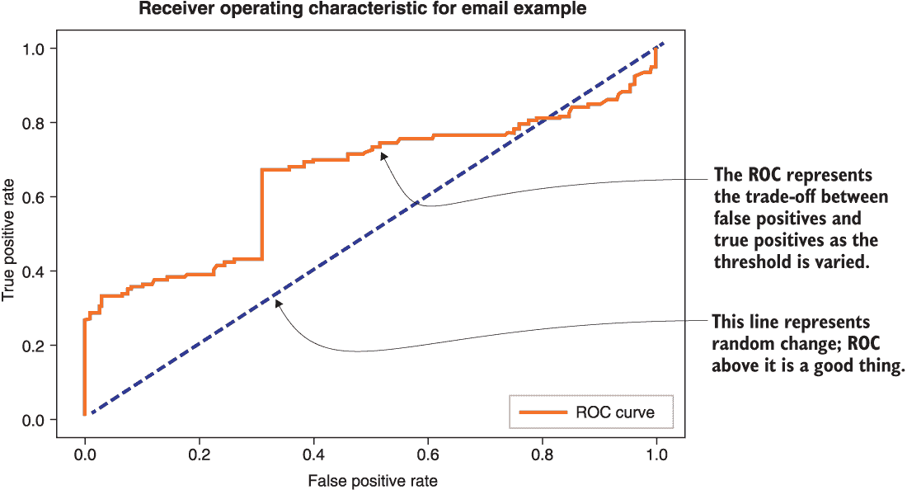
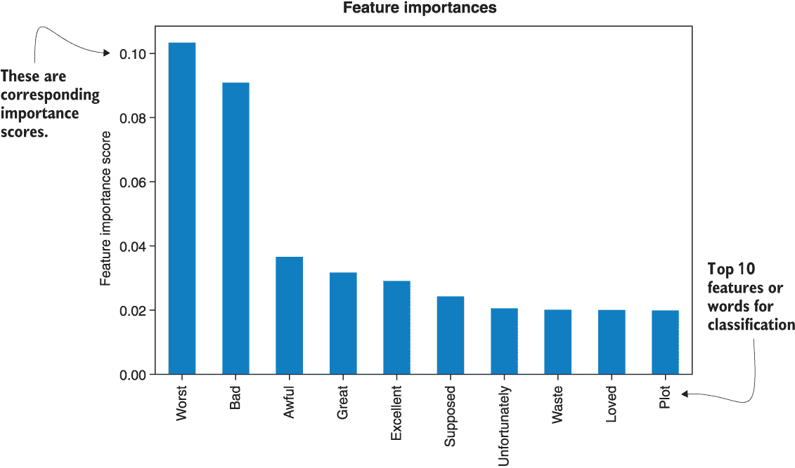
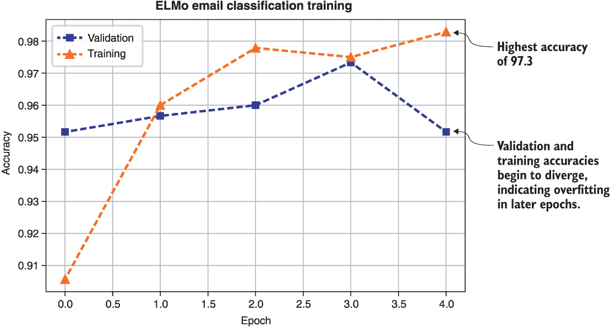
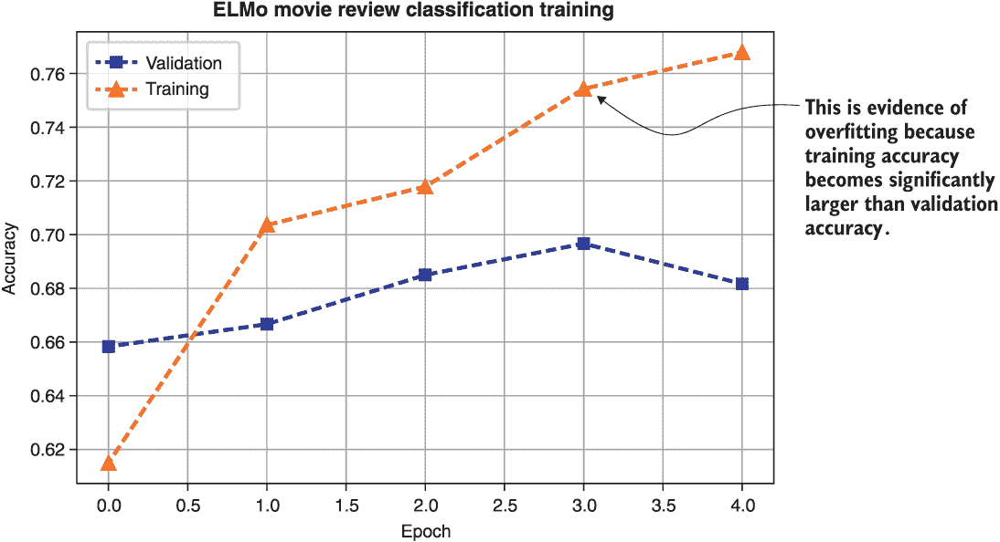

# 第三章：开始基线: 基准测试和优化

本章内容包括

+   分析一对自然语言处理（NLP）问题

+   使用关键的传统方法建立问题基线

+   使用代表性的深度预训练语言模型 ELMo 和 BERT 进行基线

在本章中，我们继续直接深入解决 NLP 问题，这是我们在上一章开始的。我们继续追求建立一套具体 NLP 问题的基线，稍后我们将能够利用这些基线来衡量从越来越复杂的迁移学习方法中获得的逐渐改进。我们完成了我们在第二章开始的练习，那里我们介绍了一对实际问题，预处理了相应的数据，并通过探索一些广义线性方法开始了基线。特别是，我们介绍了电子邮件垃圾邮件和互联网电影数据库（IMDB）电影评论分类示例，并使用了逻辑回归和支持向量机（SVM）来建立它们的基线。

在本章中，我们探讨基于决策树和基于神经网络的方法。我们研究的基于决策树的方法包括随机森林和梯度提升机。关于基于神经网络的方法，我们将最简单形式的迁移学习应用到了一对最近流行的深度预训练语言模型 ELMo 和 BERT 上。这项工作只涉及在目标数据集上对每个网络的最后几层进行微调。这项活动将作为本书主题的应用性实践介绍，即 NLP 的迁移学习。此外，我们探索通过超参数调优来优化模型的性能。

我们将在下一节中探讨基于决策树的方法。

## 3.1 基于决策树的模型

决策树是一种决策支持工具，它将决策及其后果建模为*树*——一个图，其中任意两个节点都由一条路径连接。树的另一种定义是将输入值转换为输出类别的流程图。有关这种类型模型的更多详细信息，请参阅第一章。

在本节中，我们将两种最常见的基于决策树的方法——随机森林和梯度提升机——应用到我们的两个正在运行的问题上。

### 3.1.1 随机森林（RFs）

*随机森林*（RFs）通过生成大量专门的树并收集它们的输出，为应用决策树提供了一种实用的机器学习方法。RFs 非常灵活和广泛适用，通常是从逻辑回归后从业者尝试的第二种算法用于建立基线。有关 RFs 及其历史背景的更详细讨论，请参阅第一章。

让我们使用流行的库 scikit-learn 来构建我们的分类器，如下所示。

列出 3.1 训练和测试随机森林分类器

```py
from sklearn.ensemble import RandomForestClassifier          ❶

clf = RandomForestClassifier(n_jobs=1, random_state=0)       ❷

start_time = time.time()                                     ❸
clf.fit(train_x, train_y)
end_time = time.time()
print("Training the Random Forest Classifier took %3d seconds"%(end_time-start_time))

predicted_labels = clf.predict(test_x)

acc_score = accuracy_score(test_y, predicted_labels)

print("The RF testing accuracy score is::")
print(acc_score)
```

❶ 加载 scikit 的随机森林分类器库

❷ 创建一个随机森林分类器

❸ 训练分类器，以了解训练特征与训练响应变量的关系

用这段代码在我们的实验中，对电子邮件示例数据进行 RF 分类器的训练只需不到一秒钟的时间，并且达到了 0.945 的准确率分数。类似地，在 IMDB 示例上进行训练也只需不到一秒钟，并且达到了 0.665 的准确率分数。这个练习进一步证实了上一章的最初猜测，即 IMDB 评论问题比电子邮件分类问题更难。

### 3.1.2 梯度提升机（GBMs）

这种基于决策树的机器学习算法的变体迭代地学习新的基于决策树的模型，以解决前次迭代模型的弱点。在撰写本文时，它们被普遍认为是解决非感知机器学习问题的最佳类方法。不幸的是，它们确实存在一些缺点，包括较大的模型大小、过拟合的风险更高以及比其他一些决策树模型更少的可解释性。

训练梯度提升机（GBM）分类器的代码显示在下一个列表中。同样，我们使用 scikit-learn 中这些模型的实现。请注意，Python 库 XGBoost 中的实现被普遍认为更具有内存效率，并且更容易扩展/并行化。

列表 3.2 训练/测试梯度提升机分类器

```py
from sklearn.ensemble import GradientBoostingClassifier        ❶
from sklearn import metrics                                   ❷
from sklearn.model_selection import cross_val_score

def modelfit(alg, train_x, train_y, predictors, test_x, performCV=True, cv_folds=5):
    alg.fit(train_x, train_y)                                 ❸
    predictions = alg.predict(train_x)                        ❹
    predprob = alg.predict_proba(train_x)[:,1]
    if performCV:                                             ❺
        cv_score = cross_val_score(alg, train_x, train_y, cv=cv_folds, scoring='roc_auc')

    print("\nModel Report")                                  ❻
    print("Accuracy : %.4g" % metrics.accuracy_score(train_y,predictions))
    print("AUC Score (Train): %f" % metrics.roc_auc_score(train_y, predprob))
    if performCV:
        print("CV Score : Mean - %.7g | Std - %.7g | Min - %.7g | Max - %.7g" % 
(np.mean(cv_score),np.std(cv_score),np.min(cv_score),np.max(cv_score)))

    return alg.predict(test_x),alg.predict_proba(test_x)      ❼
```

❶ GBM 算法

❷ 附加的 sklearn 函数

❸ 在整体数据上拟合算法

❹ 预测训练集

❺ 执行 k 折交叉验证

❻ 打印模型报告

❼ 预测测试数据

注意，在列表 3.2 中，除了通常的训练准确率分数外，我们还报告了 *k 折交叉验证* 和 *受试者工作特征曲线*（ROC）下的 *曲线下面积* 来评估模型。这是必要的，因为 GBMs 特别容易过拟合，报告这些指标有助于我们监控这种风险。另一个原因是，这个练习可以让你复习这些概念。

更具体地说，k 折交叉验证（默认值为 k=5 折）将训练数据集随机分为 k 个分区或折叠，并在 k-1 个分区上训练模型，同时在剩余的第 k 个分区上评估/验证性能，重复这个过程 k 次，每个分区都作为验证集。然后，它使用这些 k 次评估迭代的统计数据报告性能。这个过程允许我们减少模型在数据集的某些部分过拟合和在其他部分表现不佳的风险。

简而言之，过拟合是指将太多参数拟合到太少的数据中。这种情况会损害模型对新数据的泛化能力，并且通常表现为改善训练指标但验证指标没有改善。可以通过收集更多数据、简化模型以减少训练参数的数量以及本书中我们将重点介绍的其他方法来减轻这种情况。

以下代码可用于调用函数并在两个运行示例中对其进行评估：

```py
gbm0 = GradientBoostingClassifier(random_state=10)
start_time = time.time()
test_predictions, test_probs = modelfit(gbm0, train_x, train_y, predictors, test_x)
end_time = time.time()
print("Training the Gradient Boosting Classifier took %3d seconds"%(end_time-start_time))

predicted_labels = test_predictions
acc_score = accuracy_score(test_y, predicted_labels)
print("The Gradient Boosting testing accuracy score is::")
print(acc_score)
```

对于电子邮件垃圾邮件分类示例，这产生了以下结果：

```py
Model Report
Accuracy : 0.9814
AUC Score (Train): 0.997601
CV Score : Mean - 0.9854882 | Std - 0.006275645 | Min - 0.9770558 | Max - 0.9922158
Training the Gradient Boosting Classifier took 159 seconds
The Gradient Boosting testing accuracy score is::

```

对于 IMDB 电影评论分类示例，这产生了以下结果：

```py
Model Report
Accuracy : 0.8943
AUC Score (Train): 0.961556
CV Score : Mean - 0.707521 | Std - 0.03483452 | Min - 0.6635249 | Max - 0.7681968
Training the Gradient Boosting Classifier took 596 seconds
The Gradient Boosting testing accuracy score is::
0.665   
```

乍一看，看着这些结果，人们可能会倾向于认为与我们之前看过的先前方法相比，GBM 数值实验更昂贵——在 Kaggle 上 IMDB 示例完成需要将近 10 分钟。然而，我们必须考虑到当进行 k 折交叉验证练习时，模型会被训练 k=5 次以获得更可靠的性能估计。因此，每次训练大约需要两分钟——这并不像不考虑 k 折交叉验证而推断出的训练时间增加那么剧烈。

我们可以看到一些过拟合的证据——第一个示例的测试准确度低于 k 折训练准确度。此外，在 IMDB 示例中，k 折交叉验证分数明显低于整个数据集的训练分数，强调了在这种模型类型中使用 k 折交叉验证方法跟踪过拟合的重要性。我们在本章的倒数第二节中讨论了一些进一步提高分类器准确性的方法。

那么 ROC 曲线究竟是什么呢？它是假正率（FPR）与真正率（TPR）的曲线图，是用来评估和调整分类器的重要特征。它显示了这些分类器重要特性的权衡，当决策阈值——预测置信度开始被分类为给定类别的成员的概率值——在 0 和 1 之间变化时。现在可以使用以下代码来绘制这条曲线：

```py
test_probs_max = []                                                        ❶
for i in range(test_probs.shape[0]):
    test_probs_max.append(test_probs[i,test_y[i]])

fpr, tpr, thresholds = metrics.roc_curve(test_y, np.array(test_probs_max))  ❷

import matplotlib.pyplot as plt                                            ❸
fig,ax = plt.subplots()
plt.plot(fpr,tpr,label='ROC curve')
plt.plot([0, 1], [0, 1], color='navy', linestyle='--')
plt.xlabel('False Positive Rate')
plt.ylabel('True Positive Rate')
plt.title('Receiver Operating Characteristic for Email Example')
plt.legend(loc="lower right")
plt.show()
```

❶ 我们首先需要找到每个示例的最大概率。

❷ 计算 ROC 曲线值

❸ 使用 matplotlib 库生成标记的 ROC 曲线图

邮件分类示例的结果 ROC 曲线如图 3.1 所示。斜率为 1 的直线代表 FPR 与 TPR 之间的权衡对应于随机机会。ROC 曲线越远离此线的左侧，分类器性能越好。因此，ROC 曲线下面积可用作性能的度量。



图 3.1 邮件分类示例的 ROC 曲线

决策树方法的一个重要特性是它们可以提供特征的重要性得分，这可以用来检测给定数据集中最重要的特征。我们通过在列表 3.2 函数的返回语句之前插入几行代码来做到这一点，如列表 3.3 中所示。

列表 3.3 梯度提升机分类代码和特征重要性分数

```py
from sklearn.ensemble import GradientBoostingClassifier               ❶
from sklearn import metrics                                          ❷
from sklearn.model_selection import cross_val_score

def modelfit(alg, train_x, train_y, predictors, test_x, performCV=True, cv_folds=5):
    alg.fit(train_x, train_y)                                        ❸
    predictions = alg.predict(train_x)                               ❹
    predprob = alg.predict_proba(train_x)[:,1]
    if performCV:                                                     ❺
        cv_score = cross_val_score(alg, train_x, train_y, cv=cv_folds, scoring='roc_auc')

    print("\nModel Report")                                          ❻
    print("Accuracy : %.4g" % metrics.accuracy_score(train_y,predictions))
    print("AUC Score (Train): %f" % metrics.roc_auc_score(train_y, predprob))
    if performCV:
        print("CV Score : Mean - %.7g | Std - %.7g | Min - %.7g | Max - %.7g" % 
(np.mean(cv_score),np.std(cv_score),np.min(cv_score),np.max(cv_score)))

    feat_imp = pd.Series(alg.feature_importances_, predictors).sort_values(ascending=False) 
    feat_imp[:10].plot(kind='bar',title='Feature Importances')        ❼

    return alg.predict(test_x),alg.predict_proba(test_x)              ❽
```

❶ GBM 算法

❷ 其他 sklearn 函数

❸ 在整体数据上拟合算法

❹ 预测训练集

❺ 执行 k 折交叉验证

❻ 打印模型报告

❼ 添加新的代码来计算特征的重要性

❽ 预测测试数据

对于 IMDB 示例，这产生了图 3.2 的绘图。我们看到像“worst”和“awful”这样的词对分类决策非常重要，这在定性上是有意义的，因为可以想象负面评论家使用这些词。另一方面，“loved”这样的词可能会被积极的评论者使用。

注意：重要性分数在这个示例中似乎效果很好，但不应该一味地相信它们。例如，已经广泛认识到这些重要性分数可能对连续变量以及高基数分类变量有偏见。

现在我们开始应用一些神经网络模型到我们两个运行的示例中，可以说神经网络是当今自然语言处理中最重要的模型类别之一。

## 3.2 神经网络模型

正如我们在第一章讨论的那样，神经网络是处理感知问题（如计算机视觉和自然语言处理）最重要的机器学习算法类别之一。

在本节中，我们将在本章和上一章中基线化的两个示例问题上训练两个代表性的预训练神经网络语言模型。我们考虑来自语言模型的嵌入 (ELMo) 和来自 transformers 的双向编码器表示 (BERT)。



图 3.2 在 IMDB 分类示例中由梯度提升机分类器发现的各种标记的重要性分数

ELMo 包含卷积和循环（特别是*长短期记忆* [LSTM]）元素，而合适命名的 BERT 是基于 transformers 的。这些术语在第一章中介绍过，并将在后续章节中更详细地讨论。我们采用了最简单的迁移学习微调形式，在对应的预训练嵌入之上，通过我们前几节的标签数据集训练了一个单独的密集分类层。

### 3.2.1 语言模型的嵌入 (ELMo)

语言模型嵌入（ELMo）模型以热门的*Sesame Street*角色命名，是最早证明在一般 NLP 任务中将预训练的语言模型知识转移的有效性的模型之一。该模型被训练以预测一系列单词中的下一个单词，在非监督的大型语料库上可以进行，结果显示得到的权重可以推广到各种其他 NLP 任务。我们将不会在本节详细讨论该模型的架构--我们将在后面的章节中讨论该问题。在这里，我们专注于建立直觉,但足够提到的是，该模型利用了字符级卷积来构建每个单词标记的初步嵌入，接着是双向 LSTM 层，将上下文信息引入模型产生的最终嵌入中。

简要介绍了 ELMo 之后，让我们开始为两个运行示例数据集中的每个数据集训练它。ELMo 模型可以通过 TensorFlow Hub 获得，TensorFlow Hub 提供了一个简单的平台用于共享 TensorFlow 模型。我们将使用使用 TensorFlow 作为后端的 Keras 来构建我们的模型。为了使 TensorFlow Hub 模型可以被 Keras 使用，我们需要定义一个自定义的 Keras 层，以正确的格式实例化它。下面的代码段展示了如何实现这个功能。

代码段 3.4：将 TensorFlow Hub ELMo 实例化为自定义的 Keras 层

```py
import tensorflow as tf                                                 ❶
import tensorflow_hub as hub
from keras import backend as K
import keras.layers as layers
from keras.models import Model, load_model
from keras.engine import Layer
import numpy as np

sess = tf.Session()                                                     ❷
K.set_session(sess)

class ElmoEmbeddingLayer(Layer):                                        ❸
    def __init__(self, **kwargs):
        self.dimensions = 1024
        self.trainable=True
        super(ElmoEmbeddingLayer, self).__init__(**kwargs)

    def build(self, input_shape):
        self.elmo =hub.Module('https:/ /tfhub.dev/google/elmo/2', trainable=self.trainable,
                               name="{}_module".format(self.name))      ❹

        self.trainable_weights += 
                         K.tf.trainable_variables(scope="^{}_module/.*".format(self.name))  ❺
        super(ElmoEmbeddingLayer, self).build(input_shape)

    def call(self, x, mask=None):
        result = self.elmo(K.squeeze(K.cast(x, tf.string), axis=1),
                      as_dict=True,
                      signature='default',
                      )['default']
        return result

    def compute_output_shape(self, input_shape):                        ❻
        return (input_shape[0], self.dimensions)
```

❶ 导入所需的依赖项

❷ 初始化会话

❸ 创建一个自定义层，允许我们更新权重

❹ 从 TensorFlow Hub 下载预训练的 ELMo 模型

❺ 提取可训练参数--ELMo 模型层加权平均值中的四个权重；更多详细信息请参阅之前的 TensorFlow Hub 链接

❻ 指定输出的形状

在使用这个函数来训练模型之前，我们需要对我们的预处理数据进行一些调整，以适应这个模型结构。特别是，回想一下，我们为传统模型组装了变量`raw_data`的词袋表示，该变量由第 2.7 节的代码生成，并且这是一个包含每封电子邮件的单词标记列表的 NumPy 数组。在这种情况下，我们将使用第 3.5 节的函数和代码将每个这样的列表合并成一个单一的文本字符串。这是 ELMo TensorFlow Hub 模型期望的输入格式，我们很高兴满足要求。

注意 深度学习实践中，由于人工神经网络极具发现重要性和非重要性的神奇能力，通常不需要去除停用词这一步骤。但在我们的情况下，因为我们试图比较不同模型类型在这个问题上的优点和缺点，对所有算法应用相同的预处理是有意义的，同时也可以说是正确的方法。然而，需要注意的是，ELMo 和 BERT 都是在包含停用词的语料库上进行预训练的。

列表 3.5 将数据转换为 ELMo TensorFlow Hub 模型所需的形式

```py
def convert_data(raw_data,header):                              ❶
    converted_data, labels = [], []
    for i in range(raw_data.shape[0]):
        out = ' '.join(raw_data[i])                             ❷
        converted_data.append(out)
        labels.append(header[i])
    converted_data = np.array(converted_data, dtype=object)[:, np.newaxis]

    return converted_data, np.array(labels)

raw_data, header = unison_shuffle(raw_data, header)             ❸

idx = int(0.7*data_train.shape[0])
train_x, train_y = convert_data(raw_data[:idx],header[:idx])    ❹
test_x, test_y = convert_data(raw_data[idx:],header[idx:])      ❺
```

❶ 将数据转换为正确的格式

❷ 将每封邮件的标记连接成一个字符串

❸ 首先对原始数据进行洗牌

❹ 将 70%的数据转换为训练数据

❺ 将剩余的 30%的数据转换为测试数据

在将数据转换为正确的格式之后，我们使用下一个列表中的代码构建和训练 Keras ELMo TensorFlow Hub 模型。

列表 3.6 使用列表 3.4 中定义的自定义层构建 ELMo Keras 模型

```py
def build_model(): 
  input_text = layers.Input(shape=(1,), dtype="string")
  embedding = ElmoEmbeddingLayer()(input_text)
  dense = layers.Dense(256, activation='relu')(embedding)    ❶
  pred = layers.Dense(1, activation='sigmoid')(dense)        ❷

  model = Model(inputs=[input_text], outputs=pred)

  model.compile(loss='binary_crossentropy', optimizer='adam',
                                 metrics=['accuracy'])       ❸
  model.summary()                                            ❹

  return model

# Build and fit
model = build_model()
model.fit(train_x,                                           ❺
          train_y,
          validation_data=(test_x, test_y),
          epochs=5,
          batch_size=32)
```

❶ 输出 256 维特征向量的新层

❷ 分类层

❸ 损失、度量和优化器选择

❹ 显示模型架构以进行检查

❺ 对模型进行五个时期的拟合

在这里需要注意几点，因为这是我们第一次接触深度学习设计的一些详细方面。首先，注意到我们在预训练的 ELMo 嵌入之上添加了一个额外的层，产生了 256 维的特征向量。我们还添加了一个输出维数为 1 的分类层。激活函数`sigmoid`将其输入转换为 0 到 1 之间的区间，并且在本质上是图 2.6 中的逻辑曲线。我们可以将其输出解释为正类别的概率，并且当它超过某个预先指定的阈值（通常为 0.5）时，我们可以将相应的网络输入分类为正类别。

模型在整个数据集上进行了五个“主要步骤”或时期的拟合。列表 3.6 中的 Keras 代码语句`model.summary()`打印出模型的详细信息，并产生以下输出：

```py
_________________________________________________________________
Layer (type)                 Output Shape              Param #   
=================================================================
input_2 (InputLayer)         (None, 1)                 0         
_________________________________________________________________
elmo_embedding_layer_2 (Elmo (None, 1024)              4         
_________________________________________________________________
dense_3 (Dense)              (None, 256)               262400    
_________________________________________________________________
dense_4 (Dense)              (None, 2)                 514       
=================================================================
Total params: 262,918
Trainable params: 262,918
Non-trainable params: 0
```

我们注意到——不深入进一步的细节，因为这将在第四章中讨论——在这种情况下，大多数可训练参数（大约 26 万个）来自于我们添加在自定义 ELMo 模型之上的层。这是我们第一个使用迁移学习的实例：在 ELMo 的创建者共享的预训练模型之上学习一对新的层。对于大多数神经网络实验而言，使用强大的 GPU 是非常重要的，并且`batch_size`参数的值（指定每一步向 GPU 输入的数据量）对于收敛速度非常重要。它将根据所使用的 GPU 或缺少 GPU 而有所不同。在实践中，可以增加这个参数的值，直到典型问题实例的收敛速度不再因增加而获益，或者 GPU 的内存在算法的一次迭代中已经不足以容纳单个数据批次为止。此外，在处理多 GPU 的情况下，已经实验证明¹批大小的最佳扩展计划与 GPU 的数量呈线性关系。

通过 Kaggle Kernel（请看我们的配套 GitHub 存储库²获得 Kaggle 笔记本链接）上的一个免费的 NVIDIA Tesla K80 GPU，在我们的电子邮件数据集上，我们在图 3.3 中显示了前五个时代的典型运行性能。我们发现`batch_size`为 32 在那个环境中能很好地工作。



图 3.3 显示了在电子邮件分类示例中训练 ELMo 模型的前五个时代的验证和训练准确性比分的趋势。

每个时代需要大约 10 秒来完成——这些信息是由我们的代码打印的。我们看到第四个时代达到了约 97.3%的验证准确性（意味着在不到一分钟的时间内达到了结果）。这个性能与 Logistic Regression 方法的性能相当，后者只稍好一点，为 97.7%（也见表 3.1）。我们注意到这个算法的行为是随机的——它的运行在每次运行时都表现出不同的行为。因此，即使在与我们使用的类似的架构上，你自己的收敛性也会有所不同。实践中通常尝试几次运行算法，并在随机和不同的结果中选择最佳的参数集。最后，我们注意到训练和验证准确性的背离表明了过拟合的开始，正如图中所示的那样。这证实了将通过增加超参数`maxtokenlen`指定的标记长度以及通过`maxtokens`指定的每封电子邮件的标记数量来增加信号量的数量可能会进一步提高性能的假设。自然地，通过打开`Nsamp`来增加每类样本的数量也应该有助于提高性能。

对于 IMDB 示例，ELMo 模型代码产生了图 3.4 所示的收敛输出。



图 3.4 显示了在 IMDB 电影评论分类示例上训练 ELMo 模型的前五个时代的验证和训练准确性比分的趋势。

每个时代再次需要大约 10 秒，并且在第二个时代不到一分钟的时间内就实现了约 70%左右的验证准确性。我们将看到如何在本章的下一个和最后一个部分提高这些模型的性能。请注意，在第三个以及之后的时代，可以观察到一些过拟合的证据，因为训练准确性继续提高——对数据的拟合改善了，而验证准确性仍然较低。

### 3.2.2 双向编码器表示来自转换（BERT）

双向编码器表示来自变换器（BERT）模型也是以流行的*Sesame Street*角色命名的，以向 ELMo 开始的趋势致敬。在撰写本文时，其变体在将预训练语言模型知识转移到下游自然语言处理任务方面取得了一些最佳性能。该模型同样被训练来预测词语序列中的词语，尽管确切的*masking*过程略有不同，将在本书后面详细讨论。它也可以在非常大的语料库上以无监督的方式进行，并且生成的权重同样适用于各种其他自然语言处理任务。可以说，要熟悉自然语言处理中的迁移学习，熟悉 BERT 也是不可或缺的。

就像我们对 ELMo 所做的那样，在本节中我们将避免完全详细讨论这个深度学习模型的架构——我们将在后面的章节中涵盖这个话题。在这里提一下，模型利用字符级卷积来构建词元的初步嵌入，然后是基于变换器的编码器，其中包含自注意层，为模型提供周围单词的上下文。变换器在功能上取代了 ELMo 所采用的双向 LSTM 的作用。回顾第一章中，变换器相对于 LSTM 在训练可扩展性方面具有一些优势，我们可以看到这个模型背后的一些动机。同样，我们将使用带有 TensorFlow 后端的 Keras 来构建我们的模型。

简要介绍了 BERT 之后，让我们继续为两个运行示例数据集中的每一个训练它。BERT 模型也可以通过 TensorFlow Hub 获得。为了使 hub 模型能够被 Keras 使用，我们同样定义了一个自定义 Keras 层，以正确的格式实例化它，如下一个清单所示。

[使用自定义 Keras 层实例化 TensorFlow Hub BERT](https://wiki.example.org/instantiating_tensorflow_hub_bert_as_custom_keras_layer)

```py
import tensorflow as tf
import tensorflow_hub as hub
from bert.tokenization import FullTokenizer
from tensorflow.keras import backend as K

# Initialize session
sess = tf.Session()

class BertLayer(tf.keras.layers.Layer):
    def __init__(
        self,
        n_fine_tune_layers=10,                                             ❶
        pooling="mean",                                                    ❷
        bert_path="https:/ /tfhub.dev/google/bert_uncased_L-12_H-768_A-12/1",❸
        **kwargs,
    ):
        self.n_fine_tune_layers = n_fine_tune_layers
        self.trainable = True
        self.output_size = 768                                             ❹
        self.pooling = pooling
        self.bert_path = bert_path

        super(BertLayer, self).__init__(**kwargs)

    def build(self, input_shape):
        self.bert = hub.Module(
            self.bert_path, trainable=self.trainable, name=f"{self.name}_module"
        )

        trainable_vars = self.bert.variables                               ❺
        if self.pooling == "first":
            trainable_vars = [var for var in trainable_vars if not "/cls/" in var.name]
            trainable_layers = ["pooler/dense"]

        elif self.pooling == "mean":
            trainable_vars = [
                var
                for var in trainable_vars
                if not "/cls/" in var.name and not "/pooler/" in var.name
            ]
            trainable_layers = []
        else:
            raise NameError("Undefined pooling type")

        for i in range(self.n_fine_tune_layers):                           ❻
            trainable_layers.append(f"encoder/layer_{str(11 - i)}")

        trainable_vars = [
            var
            for var in trainable_vars
            if any([l in var.name for l in trainable_layers])
        ]

        for var in trainable_vars:                                         ❼
            self._trainable_weights.append(var)

        for var in self.bert.variables:
            if var not in self._trainable_weights:
                self._non_trainable_weights.append(var)

        super(BertLayer, self).build(input_shape)

    def call(self, inputs):
        inputs = [K.cast(x, dtype="int32") for x in inputs]
        input_ids, input_mask, segment_ids = inputs
        bert_inputs = dict(
            input_ids=input_ids, input_mask=input_mask, segment_ids=segment_ids                                               ❽
        )
        if self.pooling == "first":
            pooled = self.bert(inputs=bert_inputs, signature="tokens", as_dict=True)[
                "pooled_output"
            ]
        elif self.pooling == "mean":
            result = self.bert(inputs=bert_inputs, signature="tokens", as_dict=True)[
                "sequence_output"
            ]

            mul_mask = lambda x, m: x * tf.expand_dims(m, axis=-1)         ❾
            masked_reduce_mean = lambda x, m: tf.reduce_sum(mul_mask(x, m), axis=1) / (
                    tf.reduce_sum(m, axis=1, keepdims=True) + 1e-10)
            input_mask = tf.cast(input_mask, tf.float32)
            pooled = masked_reduce_mean(result, input_mask)
        else:
            raise NameError("Undefined pooling type")

        return pooled

    def compute_output_shape(self, input_shape):
        return (input_shape[0], self.output_size)
```

❶ 默认要解冻的顶层数量进行训练

❷ 正则化类型的选择

❸ 要使用的预训练模型；这是模型的大型、不区分大小写的原始版本。

❹ BERT 嵌入维度，即生成的输出语义向量的大小

❺ 移除未使用的层

❻ 强制执行要微调的解冻层的数量

❼ 可训练权重

❽ 输入到 BERT 采用非常特定的三元组形式；我们将在下一个清单中展示如何生成它。

❾ BERT“masks”一些词语，然后尝试将它们预测为学习目标。

类似于我们在前一小节为 ELMo 所做的工作，我们对前几节的数据执行一系列类似的后处理步骤，将其放入 BERT 模型所需的格式中。除了我们在列表 3.5 中所做的将词袋标记表示连接成字符串列表之外，我们随后需要将每个连接的字符串转换为三个数组——*输入 ID*、*输入掩码* 和 *段 ID*——然后再将它们馈送到 BERT 模型中。这样做的代码在列表 3.8 中显示。将数据转换为正确格式后，我们使用同一列表 3.8 中的剩余代码构建和训练 Keras BERT TensorFlow Hub 模型。

列表 3.8 将数据转换为 BERT 所期望的格式，构建和训练模型

```py
def build_model(max_seq_length):                                           ❶
    in_id = tf.keras.layers.Input(shape=(max_seq_length,), name="input_ids")
    in_mask = tf.keras.layers.Input(shape=(max_seq_length,), name="input_masks")
    in_segment = tf.keras.layers.Input(shape=(max_seq_length,), name="segment_ids")
    bert_inputs = [in_id, in_mask, in_segment]
    bert_output = BertLayer(n_fine_tune_layers=0)(bert_inputs)             ❷
    dense = tf.keras.layers.Dense(256, activation="relu")(bert_output)
    pred = tf.keras.layers.Dense(1, activation="sigmoid")(dense)

    model = tf.keras.models.Model(inputs=bert_inputs, outputs=pred)
    model.compile(loss="binary_crossentropy", optimizer="adam", metrics=["accuracy"])
    model.summary()

    return model

def initialize_vars(sess):                                                 ❸
    sess.run(tf.local_variables_initializer())
    sess.run(tf.global_variables_initializer())
    sess.run(tf.tables_initializer())
    K.set_session(sess)

bert_path = "https:/ /tfhub.dev/google/bert_uncased_L-12_H-768_A-12/1"
tokenizer = create_tokenizer_from_hub_module(bert_path)                    ❹

train_examples = convert_text_to_examples(train_x, train_y)                ❺
test_examples = convert_text_to_examples(test_x, test_y)

# Convert to features
(train_input_ids,train_input_masks,train_segment_ids,train_labels) =       ❻
     convert_examples_to_features(tokenizer, train_examples,               ❻
     max_seq_length=maxtokens)                                             ❻
(test_input_ids,test_input_masks,test_segment_ids,test_labels) = 
     convert_examples_to_features(tokenizer, test_examples,  
     max_seq_length=maxtokens)

model = build_model(maxtokens)                                             ❼

initialize_vars(sess)                                                      ❽

history = model.fit([train_input_ids, train_input_masks, train_segment_ids],❾
train_labels,validation_data=([test_input_ids, test_input_masks, 
test_segment_ids],test_labels), epochs=5, batch_size=32)
```

❶ 用于构建模型的函数

❷ 我们不重新训练任何 BERT 层，而是将预训练模型用作嵌入，并在其上重新训练一些新层。

❸ Vanilla TensorFlow 初始化调用

❹ 使用 BERT 源代码库中的函数创建兼容的分词器

❺ 使用 BERT 源代码库中的函数将数据转换为“InputExample”格式

❻ 使用 BERT 源代码库中的函数将 InputExample 格式转换为最终的 BERT 输入格式

❼ 构建模型

❽ 实例化变量

❾ 训练模型

类似于我们在前一小节中构建的 ELMo 模型，我们在预训练模型之上放置了一对层，并且仅对这些层进行训练，这大约有 20 万个参数。通过将超参数设置为与之前的所有方法相当的值，我们在电子邮件和电影评论分类问题上分别获得了约为 98.3% 和 71% 的验证准确率（在五个时期内）。

## 3.3 优化性能

在查看本章前几节以及上一章的各种算法的性能结果时，我们可能会立即得出关于我们研究的每个问题中哪种算法表现最佳的结论。例如，我们可能会得出结论，对于电子邮件分类问题，BERT 和逻辑回归是最佳算法，准确率约为 98%，而 ELMo 的准确率也不远，然后是基于决策树的方法和 SVM 排在最后。另一方面，对于 IMDB 电影评论分类问题，BERT 看起来是赢家，性能约为 71%，其次是 ELMo，然后才是逻辑回归。

但是我们必须记住，我们只有在最初评估算法时才能确定这一点是真实的——`Nsamp`=`1000`，`maxtokens`=`50`，`maxtokenlen`=`20`——以及任何特定于算法的默认参数值。要有信心地作出一般性的陈述，我们需要更彻底地探索超参数空间，通过在许多超参数设置下评估所有算法的性能，这个过程通常称为*超参数调优*或*优化*。也许通过这个过程找到的每个算法的最佳性能会改变它们的性能排名，而且一般来说，这将帮助我们为我们感兴趣的问题获得更好的准确性。

### 3.3.1 手动超参数调整

超参数调优通常最初是通过直觉进行手动操作的。我们在这里描述了这样一种方法，用于超参数`Nsamp`、`maxtokens`和`maxtokenlen`，这些超参数在所有算法中都是通用的。

让我们首先假设初始训练数据量——比如`Nsamp`=1000——就是我们拥有的全部数据。我们假设，如果我们增加每个文档中的数据令牌数量——`maxtokens`——并增加任何此类令牌的最大长度——`maxtokenlen`——我们将能够增加用于做出分类决策的信号量，从而提高结果的准确性。

对于电子邮件分类问题，我们首先将这两个值从分别为 50 和 20 的值增加到 100。对于逻辑回归（LR）、支持向量机（SVM）、随机森林（RF）、梯度提升机（GBM）、ELMo 和 BERT 执行此操作的准确性结果显示在表 3.1 的第二行。此外，我们将`maxtokens`增加到 200，以得到表 3.1 的第三行的结果。

表 3.1 比较了手动调整过程中探索的电子邮件分类示例的不同通用超参数设置下算法的准确性

| 通用超参数设置 | LR | SVM | RF | GBM | ELMo | BERT |
| --- | --- | --- | --- | --- | --- | --- |
| Nsamp = 1000 maxtokens = 50 maxtokenlen = 20 | 97.7% | 70.2% | 94.5% | 94.2% | 97.3% | 98.3% |
| Nsamp = 1000 maxtokens = 100 maxtokenlen = 100 | 99.2% | 72.3% | 97.2% | 97.3% | 98.2% | 98.8% |
| Nsamp = 1000, maxtokens = 200, maxtokenlen = 100 | 98.7% | 90.0% | 97.7% | 97.2% | 99.7% | 98.8% |

根据这个结果，我们可以看到，虽然 SVM 显然是这个问题中表现最差的分类器，但 logistic 回归、ELMo 和 BERT 几乎可以达到完美的性能。还要注意，ELMo 在更多信号存在时表现最好——这是我们在没有优化步骤的情况下可能会错过的东西。但是，logistic 回归的简单性和速度可能导致它被选为此电子邮件分类问题的生产中首选的分类器。

现在，我们对 IMDB 电影评论分类问题进行了类似的超参数测试步骤。我们首先将`maxtokens`和`maxtokenlen`都增加到 100，然后将`maxtokens`进一步增加到 200。得到的算法性能列在表 3.2 中，同时列出了初始超参数设置时的性能。

表 3.2 IMDB 电影评论分类示例中手动调整过程中探索的不同通用超参数设置的算法准确度比较

| 通用超参数设置 | 逻辑回归 | 支持向量机 | 随机森林 | 梯度提升机 | ELMo | BERT |
| --- | --- | --- | --- | --- | --- | --- |
| Nsamp = 1000 maxtokens = 50 maxtokenlen = 20 | 69.1% | 66.0% | 63.9% | 67.0% | 69.7% | 71.0% |
| Nsamp = 1000 maxtokens = 100 maxtokenlen = 100 | 74.3% | 72.5% | 70.0% | 72.0% | 75.2% | 79.1% |
| Nsamp = 1000 maxtokens = 200 maxtokenlen = 100 | 79.0% | 78.3% | 67.2% | 77.5% | 77.7% | 81.0% |

对于这个问题，BERT 似乎是最佳模型，其次是 ELMo 和逻辑回归。注意，这个问题有更多的改进空间，这与我们早期观察到的这个问题比电子邮件分类问题更难的观察一致。这使我们假设，预训练知识转移对更难的问题有更大的影响，这是直观的。这个概念也符合一般建议，即在有大量标记数据可用时，神经网络模型可能优于其他方法，假设要解决的问题足够复杂，需要额外的数据。

### 3.3.2 系统化超参数调整

存在一些工具用于对超参数范围进行更系统化和全面的搜索。这些包括 Python 方法`GridSearchCV`，它对指定的参数网格执行全面搜索，以及`HyperOpt`，它在参数范围上进行随机搜索。在这里，我们提供了使用`GridSearchCV`来调整所选算法的代码，作为一个说明性示例。请注意，在这个练习中，我们只调整了一些特定于算法的内部超参数，而将上一小节中我们调整的通用超参数固定，以简化说明。

我们选择使用初始通用超参数设置的 RF 进行电子邮件分类作为我们的说明性示例。之所以做出这个选择，是因为对于这个问题的每次拟合大约需要一秒钟，由于网格搜索将执行大量的拟合，这个例子可以快速执行，以便读者获得最大的学习价值。

我们首先导入所需方法，并检查 RF 超参数可用于调整如下：

```py
from sklearn.model_selection import GridSearchCV       ❶
print("Available hyper-parameters for systematic tuning available with RF:") 
print(clf.get_params())                                ❷
```

❶ GridSearchCV scikit-learn 导入语句

❷ clf 是列表 2.13 中的 RF 分类器。

这产生了以下输出：

```py
{'bootstrap': True, 'class_weight': None, 'criterion': 'gini', 'max_depth': None, 'max_features': 'auto', 'max_leaf_nodes': None, 'min_impurity_decrease': 0.0, 'min_impurity_split': None, 'min_samples_leaf': 1, 'min_samples_split': 2, 'min_weight_fraction_leaf': 0.0, 'n_estimators': 10, 'n_jobs': 1, 'oob_score': False, 'random_state': 0, 'verbose': 0, 'warm_start': False}
```

我们选择了其中三个超参数进行搜索，并为每个参数指定了三个值，如下所示：

```py
param_grid = {
    'min_samples_leaf': [1, 2, 3],
    'min_samples_split': [2, 6, 10],
    'n_estimators': [10, 100, 1000]

```

然后我们使用以下代码进行网格搜索，确保打印出最终的测试准确性和最佳的超参数值：

```py
grid_search = GridSearchCV(estimator = clf, param_grid = param_grid, 
                          cv = 3, n_jobs = -1, verbose = 2)     ❶

grid_search.fit(train_x, train_y)                               ❷

print("Best parameters found:")                                 ❸
print(grid_search.best_params_)

print("Estimated accuracy is:")
acc_score = accuracy_score(test_y, grid_search.best_estimator_.predict(test_x))
print(acc_score)
```

❶ 使用指定的超参数网格定义网格搜索对象

❷ 将网格搜索适配到数据

❸ 显示结果

这个实验需要在 3*3*3=27 个点上训练分类器，因为每个超参数网格上有三个请求的点。整个实验不到五分钟就完成了，并且准确率达到了 95.7%。这比原始得分 94.5%提高了超过 1%。代码的原始输出如下，指定了最佳的超参数值：

```py
Best parameters found:
{'min_samples_leaf': 2, 'min_samples_split': 10, 'n_estimators': 1000}
Estimated accuracy is:

```

的确，当我们在所有分类器上进行全面调整时，我们发现可以将每个分类器的性能提升 1-2%，而不会影响在前一小节中达到的每个问题的最佳分类器的结论。

## 摘要

+   通常会尝试多种算法来解决感兴趣的任何问题，以找到模型复杂性和性能的最佳组合，以适应您的情况。

+   基线通常从最简单的算法开始，例如逻辑回归，然后逐渐变得更复杂，直到达到正确的性能/复杂性折衷。

+   重要的模型设计选择包括用于评估性能的指标，用于指导训练算法的损失函数以及最佳验证实践，等等，这些可以根据模型和问题类型而异。

+   超参数调整是模型开发流程的重要步骤，因为初始超参数设置可能严重误代表通过调整可以找到的最佳性能。

+   简单模型在可用数据量不大和/或问题较简单时往往效果最佳，而复杂的神经网络模型在有更多数据可用时往往表现更好，因此值得额外复杂性，当更多数据可用时。

1. P. Goyal 等人，“准确的、大型小批次 SGD：在 1 小时内训练 ImageNet”，*arXhiv*（2018 年）。

2. [`github.com/azunre/transfer-learning-for-nlp`](https://github.com/azunre/transfer-learning-for-nlp)
