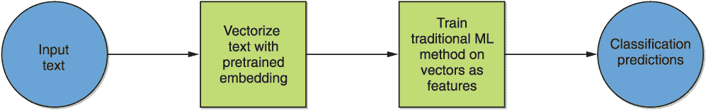
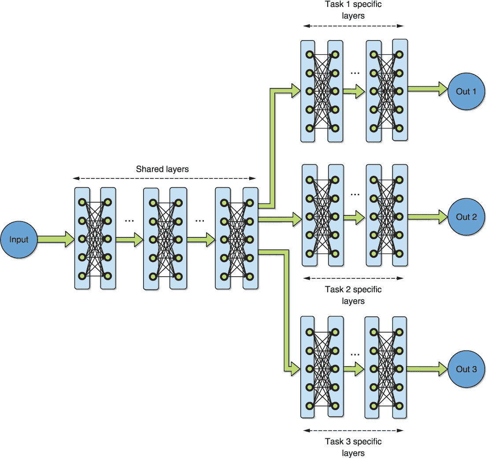
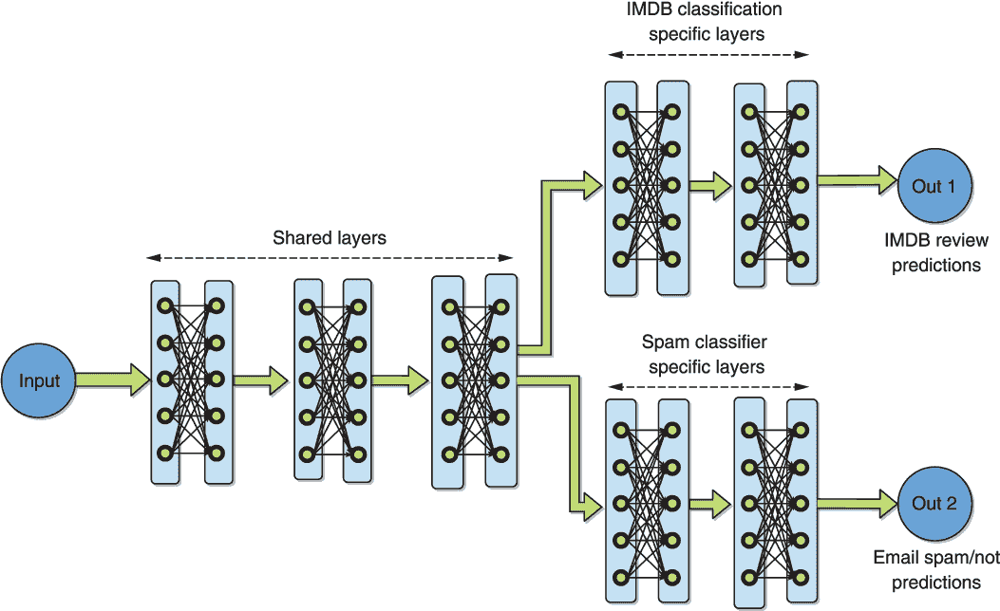
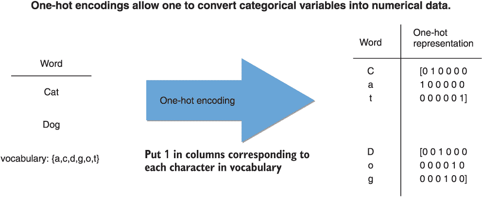

# 第四章：自然语言处理的浅层迁移学习

本章包括

+   以半监督的方式使用预训练的词嵌入将预训练知识转移到问题中

+   以半监督的方式使用预训练的较大文本部分的嵌入来将预训练知识转移到问题中

+   使用多任务学习来开发性能更好的模型

+   修改目标域数据以重用来自资源丰富的源域的知识

在本章中，我们将涵盖一些重要的浅层迁移学习方法和概念。这使我们能够探索迁移学习中的一些主要主题，同时在感兴趣的最终类别——浅层神经网络类别的背景下进行。几位作者已经提出了将迁移学习方法分类到不同组别中的各种分类系统。¹,²,³ 大致来说，分类是基于迁移是否发生在不同的语言、任务或数据域之间。每种类型的分类通常相应地被称为 *跨语言学习*、*多任务学习* 和 *领域自适应*，如图 4.1 所示。


图 4.1 将迁移学习划分为多任务学习、领域自适应和跨语言学习的可视化分类

我们将在这里看到的方法涉及到某种程度上是神经网络的组件，但不像第三章中讨论的那样，这些神经网络没有很多层。这就是为什么标签“浅层”适合描述这些方法集合的原因。与上一章一样，我们将这些方法放在特定的实际例子的背景下，以促进您的实际自然语言处理技能的提升。跨语言学习将在本书的后续章节中讨论，因为现代神经机器翻译方法通常是深层的。我们将在本章中简要探讨另外两种迁移学习。

我们首先探讨了一种常见的半监督学习形式，它使用了预训练的词嵌入，如 word2vec，将其应用于本书前两章中的一个示例。请回忆第一章，这些方法与第三章中的方法不同，因为它们产生每个单词一个向量，而不考虑上下文。

我们重新访问了 IMDB 电影评论情感分类。回想一下，此示例涉及将 IMDB 的电影评论根据表达的情感分为积极或消极。这是一个典型的情感分析示例，在文献中被广泛使用来研究许多算法。我们将由预训练的单词嵌入生成的特征向量与一些传统的机器学习分类方法相结合，即随机森林和逻辑回归。然后，我们演示了使用更高级别的嵌入，即将更大的文本部分——句子、段落和文档级别——向量化，可以提高性能。将文本向量化，然后将传统的机器学习分类方法应用于生成的向量的一般思想在图 4.2 中可视化。



图 4.2 使用单词、句子或文档嵌入进行半监督学习的典型步骤序列

随后，我们将涵盖多任务学习，并学习如何同时训练单个系统来执行多个任务——在我们的案例中，分别由上一章的两个示例代表，即电子邮件垃圾分类和 IMDB 电影评论情感分析。你可以从多任务学习中获得几个潜在的好处。通过为多个任务训练单个机器学习模型，可以在更大更多样的来自合并数据池的数据上学习共享表示，这可能导致性能提升。此外，广泛观察到，这种共享表示具有更好的泛化能力，可以推广到未经训练的任务，而且可以在不增加模型大小的情况下实现此改进。我们在我们的示例中探索了其中一些好处。具体地，我们专注于浅层神经多任务学习，其中为设置中的每个特定任务训练了一个额外的密集层以及分类层。不同的任务还共享它们之间的一层，这种设置通常被称为*硬参数共享*。

最后，我们引入了一个流行的数据集作为本章的另一个运行示例。这就是多领域情感数据集，描述了[Amazon.com](http://Amazon.com)的一组不同产品的产品评论。我们使用此数据集来探索领域自适应。假设我们有一个*源*领域，它可以被定义为特定任务的特定数据分布，并且已经训练好在该领域中的数据上表现良好的分类器。领域自适应的目标是修改或适应不同*目标*领域的数据，以使源领域的预训练知识可以帮助在目标领域中学习。我们应用了一种简单的*自动编码*方法来将目标领域中的样本“投影”到源领域特征空间中。

自编码器是一个系统，它通过将输入编码成一个有效的潜在表示，然后学习有效解码该表示，从而学习以非常高的准确度重构输入。它们传统上在模型减少应用中被广泛使用，因为潜在表示通常比编码发生的原始空间的维度要小，所选维度值也可以为计算效率和准确度的正确平衡而选择。⁴ 在极端情况下，在目标域中使用无标签数据进行训练可以获得改进，这通常称为 *零样本域适应*，其中学习发生在目标域中没有标记的数据。在我们的实验中，我们演示了一个例子。

## 4.1 带有预训练单词嵌入的半监督学习

单词嵌入的概念是自然语言处理领域的核心。它是给需要分析的每个单词产生一组实数向量的技术集合的名称。在单词嵌入设计中一个重要的考虑因素是生成向量的维度。更高维度的向量通常可以更好地代表语言中的单词，在许多任务上表现更好，但计算成本也自然更高。选择最优维度需要在这些竞争因素之间取得平衡，通常是经验性的，尽管一些最近的方法提出了更彻底的理论优化方法。⁵

如本书第一章所述，这个重要的 NLP 研究子领域有着丰富的历史，起源于 60 年代的术语向量模型的信息检索。这一领域的顶峰是在 2010 年代中期，出现了预训练的浅层神经网络技术，例如 fastText、GloVe 和 word2vec，它们有多个变体，包括连续词袋（CBOW）和 Skip-Gram。CBOW 和 Skip-Gram 都是从受过不同目标训练的浅层神经网络中提取的。Skip-Gram 尝试预测滑动窗口中任何目标单词周围的单词，而 CBOW 尝试预测给定邻居的目标单词。GloVe，即全局向量，尝试扩展 word2vec 通过将全局信息纳入嵌入中。它通过优化嵌入，使得单词之间的余弦积反映它们共现的次数，其目标是使得结果向量更加可解释。技术 fastText 尝试通过在字符 n-gram（而不是单词 n-gram）上重复 Skip-Gram 方法，从而能够处理以前看不见的单词。每个预训练嵌入的变体都有其优点和缺点，并在表 4.1 中总结。

表 4.1 比较各种流行单词嵌入方法的优缺点

| 词嵌入方法 | 优势 | 劣势 |
| --- | --- | --- |
| Skip-Gram word2vec | 适用于小型训练数据集和罕见词 | 训练速度慢，且对常见词准确性较低 |
| CBOW word2vec | 训练速度几倍快于，并对常见词提供更好的准确性 | 在处理少量训练数据和罕见词方面效果不佳 |
| GloVe | 向量比其他方法更容易解释 | 训练期间需要更高的内存存储词语共现情况 |
| fastText | 能够处理词汇外的词 | 计算成本更高；模型更大更复杂 |

需要强调的是，fastText 以处理词汇外的词而闻名，这源自它的设计初衷即嵌入子词字符 n-gram 或*子词*（与 word2vec 的整个词相对应）。这使得它能够通过聚合组成的字符 n-gram 嵌入来为以前未见过的词构建嵌入。这一优点是以更大的预先训练嵌入和更高的计算资源需求和成本为代价的。因此，在本节中，我们将使用 fastText 软件框架以 word2vec 输入格式加载嵌入，而没有子词信息。这可以降低计算成本，使读者更容易进行练习，同时展示如何处理词汇外问题，并提供一个坚实的体验平台，让读者可以进入子词嵌入的领域。

让我们开始计算实验！我们需要做的第一件事是获得适当的预训练词嵌入文件。因为我们将使用 fastText 框架，我们可以从作者的官方网站⁶获取这些预训练文件，该网站提供多种格式的嵌入文件。请注意，这些文件非常庞大，因为它们试图捕获语言中所有可能单词的向量化信息。例如，针对英语语言的.wec 格式嵌入，是在维基百科 2017 年数据集上训练的，提供了在不处理子词和词汇外词的情况下的向量化信息，大约为 6GB。相应的.bin 格式嵌入，包含了着名的 fastText 子词信息，能够处理词汇外词，大约大 25%，约为 7.5GB。我们还注意到，维基百科嵌入提供了高达 294 种语言，甚至包括传统上未解决的非洲语言，例如特威语、埃维语和豪萨语。但已经表明，对于许多包括低资源语言，这些嵌入的质量并不是很好。⁷

由于这些嵌入的大小，建议使用我们在 Kaggle 上托管的推荐云笔记本来执行此示例（而不是在本地运行），因为其他用户已经将嵌入文件在云环境中公开托管。因此，我们可以简单地将它们附加到正在运行的笔记本上，而无需获取并在本地运行文件。

一旦嵌入可用，我们可以使用以下代码段加载它，确保计时加载函数调用：

```py
import time
from gensim.models import FastText, KeyedVectors

start=time.time()
FastText_embedding = KeyedVectors.load_word2vec_format("../input/jigsaw/wiki.en.vec")   ❶
end = time.time()
print("Loading the embedding took %d seconds"%(end-start))
```

❶ 加载以“word2vec”格式（不含子词信息）预训练的 fastText 嵌入。

在我们用于执行的 Kaggle 环境中，第一次加载嵌入需要超过 10 分钟。实际上，在这种情况下，通常将嵌入加载到内存中一次，然后使用诸如 Flask 之类的方法提供对它的访问，只要需要。这也可以通过本书本章附带的 Jupyter 笔记本来实现。

获得并加载了预训练的嵌入后，让我们回顾一下 IMDB 电影评论分类示例，在本节中我们将对其进行分析。特别是，在管道的预处理阶段，我们直接从 2.10 清单开始，生成了一个包含电影评论的单词级标记表示的 NumPy 数组`raw_data`，其中删除了停用词和标点符号。为了读者的方便，我们接下来再次展示 2.10 清单。

2.10 清单（从第二章复制）将 IMDB 数据加载到 NumPy 数组中。

```py
def load_data(path):
    data, sentiments = [], []
    for folder, sentiment in (('neg', 0), ('pos', 1)):
        folder = os.path.join(path, folder)
        for name in os.listdir(folder):                  ❶
            with open(os.path.join(folder, name), 'r') as reader:
                  text = reader.read()
            text = tokenize(text)                        ❷
            text = stop_word_removal(text)
            text = reg_expressions(text)
            data.append(text)
            sentiments.append(sentiment)                ❸
    data_np = np.array(data)                            ❹
    data, sentiments = unison_shuffle_data(data_np, sentiments)

    return data, sentiments

train_path = os.path.join('aclImdb', 'train')           ❺
raw_data, raw_header = load_data(train_path)
```

❶ 遍历当前文件夹中的每个文件。

❷ 应用标记化和停用词分析例程。

❸ 跟踪相应的情感标签。

❹ 转换为 NumPy 数组。

❺ 在数据上调用上述函数。

如果您已经完成了第二章，您可能还记得在 2.10 清单之后，我们继续为输出 NumPy 数组生成了一个简单的词袋表示，该表示只是计算了每个评论中可能单词标记的出现频率。然后，我们使用生成的向量作为进一步机器学习任务的数值特征。在这里，我们不使用词袋表示，而是从预训练的嵌入中提取相应的向量。

因为我们选择的嵌入框架不能直接处理词汇表外的单词，所以我们要做的下一步是开发一种解决这种情况的方法。最简单的方法自然是简单地跳过任何这样的单词。因为当遇到这样的单词时，fastText 框架会报错，我们将使用一个*try and except*块来捕获这些错误而不中断执行。假设您有一个预训练的输入嵌入，用作字典，其中单词作为键，相应的向量作为值，并且有一个单词列表在评论中。接下来的清单显示了一个函数，该函数生成一个二维 NumPy 数组，其中每行代表评论中每个单词的嵌入向量。

列表 4.1 生成电影评论单词嵌入向量的 2-D Numpy 数组

```py
def handle_out_of_vocab(embedding,in_txt):
    out = None
    for word in in_txt:                                  ❶
        try:
            tmp = embedding[word]                        ❷
            tmp = tmp.reshape(1,len(tmp))

            if out is None:                              ❸
                out = tmp
            else:
                out = np.concatenate((out,tmp),axis=0)   ❹
        except:                                          ❺
            pass

    return out
```

❶ 循环遍历每个单词

❷ 提取相应的嵌入向量，并强制“行形状”

❸ 处理第一个向量和一个空数组的边缘情况

❹ 将行嵌入向量连接到输出 NumPy 数组

❺ 在发生词汇表外错误时跳过当前单词的执行，并从下一个单词继续执行

此列表中的函数现在可以用来分析由变量`raw_data`捕获的整个数据集。但在此之前，我们必须决定如何将评论中单词的嵌入向量组合或*聚合*成代表整个评论的单个向量。实践中发现，简单地对单词进行平均通常可以作为一个强有力的基准。由于嵌入是以一种确保相似单词在生成的向量空间中彼此更接近的方式进行训练的，因此它们的平均值代表了该集合的平均含义在直觉上是有意义的。摘要/聚合的平均基准经常被推荐作为从单词嵌入中嵌入更大文本部分的第一次尝试。这也是我们在本节中使用的方法，正如列表 4.2 中的代码所示。实际上，该代码在语料库中的每个评论上重复调用列表 4.1 中的函数，对输出进行平均，并将结果向量连接成一个单一的二维 NumPy 数组。该结果数组的行对应于每个评论的通过平均聚合的嵌入向量。

列表 4.2 将 IMDB 数据加载到 NumPy 数组中

```py
def assemble_embedding_vectors(data):
    out = None
    for item in data:                                         ❶
        tmp = handle_out_of_vocab(FastText_embedding,item)    ❷
        if tmp is not None:
            dim = tmp.shape[1]
            if out is not None:
                vec = np.mean(tmp,axis=0)                     ❸
                vec = vec.reshape((1,dim))
                out = np.concatenate((out,vec),axis=0)        ❹
            else:
                out = np.mean(tmp,axis=0).reshape((1,dim))                                            
        else:
            pass                                              ❺

    return out
```

❶ 循环遍历每个 IMDB 评论

❷ 提取评论中每个单词的嵌入向量，确保处理词汇表外的单词

❸ 对每个评论中的单词向量进行平均

❹ 将平均行向量连接到输出 NumPy 数组

❺ 词汇表外边缘情况处理

现在我们可以使用下一个函数调用为整个数据集组装嵌入向量：

```py
EmbeddingVectors = assemble_embedding_vectors(data_train)
```

现在，这些可以作为特征向量用于相同的逻辑回归和随机森林代码，就像列表 2.11 和 3.1 中分别使用的那样。 使用这些代码来训练和评估这些模型时，当超参数`maxtokens`和`maxtokenlen`分别设置为 200 和 100 时，我们发现对应的准确率分别为 77%和 66%，而`Nsamp`—每个类的样本数—等于 1,000。 这些只比在前几章最初开发的基于词袋的基线稍低一些（分别对应准确率为 79%和 67%）。 我们假设这种轻微的降低可能是由于聚合个别单词向量的天真平均方法造成的。 在下一节中，我们尝试使用专门设计用于在更高文本级别嵌入的嵌入方法来执行更智能的聚合。

## 4.2 使用更高级别的表示进行半监督学习

受 word2vec 启发，有几种技术试图以这样一种方式将文本的较大部分嵌入向量空间，以使具有相似含义的句子在诱导的向量空间中更接近彼此。 这使我们能够对句子执行算术运算，以推断类比、合并含义等等。 一个著名的方法是段落向量，或者*doc2vec*，它利用了从预训练词嵌入中汇总单词时的连接（而不是平均）来总结它们。 另一个是 sent2vec，它通过优化单词和单词 n-gram 嵌入以获得准确的平均表示，将 word2vec 的经典连续词袋（CBOW）—在滑动窗口中训练浅层网络以预测上下文中的单词—扩展到句子。 在本节中，我们使用一个预训练的 sent2vec 模型作为一个说明性的代表方法，并将其应用于 IMDB 电影分类示例。

您可以在网上找到几个 sent2vec 的开源实现。 我们正在使用一个基于 fastText 构建的使用频繁的实现。 要直接从托管的 URL 安装该实现，请执行以下命令：

```py
pip install git+https:/ /github.com/epfml/sent2vec
```

很自然地，就像在预训练词嵌入的情况下一样，下一步是获取预训练的 sent2vec 句子嵌入，以供我们已安装的特定实现/框架加载。 这些由框架的作者在他们的 GitHub 页面上托管，并由其他用户在 Kaggle 上托管。 为简单起见，我们选择了最小的 600 维嵌入`wiki_unigrams.bin`，大约 5 GB 大小，仅捕获了维基百科上的单字信息。 请注意，预训练模型的大小明显更大，在书籍语料库和 Twitter 上预训练，还包括双字信息。

在获得预训练嵌入后，我们使用以下代码片段加载它，确保像以前一样计时加载过程。

```py
import time
import sent2vec

model = sent2vec.Sent2vecModel()
start=time.time()
model.load_model('../input/sent2vec/wiki_unigrams.bin')     ❶
end = time.time()
print("Loading the sent2vec embedding took %d seconds"%(end-start))
```

❶ 加载 sent2vec 嵌入

值得一提的是，我们发现首次执行时的加载时间少于 10 秒——相比于 fastText 单词嵌入的加载时间超过 10 分钟，这是一个显着的改进。这种增加的速度归因于当前包的实现比我们在上一节中使用的 gensim 实现要高效得多。在实践中，尝试不同的包以找到最有效的包对于你的应用程序并不罕见。

接下来，我们定义一个函数来生成一系列评论的向量。它本质上是列表 4.2 中呈现的预训练单词嵌入函数的简化形式。它更简单，因为我们不需要担心词汇表外的单词。该函数如下列表所示。

列表 4.3 将 IMDB 数据加载到 NumPy 数组中

```py
def assemble_embedding_vectors(data):
    out = None
    for item in data:                                   ❶
        vec = model.embed_sentence(" ".join(item))      ❷
        if vec is not None:                             ❸
            if out is not None:
                out = np.concatenate((out,vec),axis=0)
            else:
                out = vec
        else:
            pass

    return out
```

❶ 遍历每个 IMDB 评论

❷ 提取每个评论的嵌入向量

❸ 处理边缘情况

现在，我们可以使用此函数提取每个评论的 sent2vec 嵌入向量，如下所示：

```py
EmbeddingVectors = assemble_embedding_vectors(data_train)
```

我们也可以像以前一样将此分为训练集和测试集，并在嵌入向量的基础上训练 logistic 回归和随机森林分类器，使用类似于列表 2.11 和 3.1 中所示的代码。在 logistic 回归和随机森林分类器的情况下，准确率分别为 82% 和 68%（与上一节中相同的超参数值）。与上一节中基于词袋的基线的对应值为 79% 和 67% 相比，对于 logistic 回归分类器与 sent2vec 结合起来的这个值是一个改进，同时也是对于上一节中的平均词嵌入方法的改进。

## 4.3 多任务学习

传统上，机器学习算法一次只能训练执行一个任务，所收集和训练的数据对于每个单独的任务是独立的。这在某种程度上与人类和其他动物学习的方式相矛盾，人类和其他动物的学习方式是同时进行多个任务的训练，从而一个任务的训练信息可能会影响和加速其他任务的学习。这些额外的信息不仅可能提高当前正在训练的任务的性能，还可能提高未来任务的性能，有时甚至在没有关于这些未来任务的标记数据的情况下也可能如此。在目标域中没有标记数据的迁移学习场景通常被称为零样本迁移学习。

在机器学习中，多任务学习在许多场景中历史上出现过，从*多目标优化*到*l2*和其他形式的*正则化*（本身可以被构造为一种多目标优化形式）。图 4.3 展示了我们将要使用的神经多任务学习的形式，其中一些层/参数在所有任务之间共享，即*硬参数共享*。¹¹



图 4.3 我们将使用的神经多任务学习的一般形式——硬参数共享（在本例中有三个任务）

在另一种突出的神经多任务学习类型中，*软参数共享*，所有任务都有自己的层/参数，不进行共享。相反，通过对各个任务的特定层施加的各种约束，鼓励它们相似。我们不再进一步讨论这种类型的多任务学习，但了解它的存在对于您自己未来的潜在文献调研是很有好处的。

让我们继续进行本节的实例说明，通过在下一个小节中设置和基线化它。

### 4.3.1 问题设置和浅层神经单任务基线

再次考虑图 4.3，但只有两个任务——第一个任务是前两节中的 IMDB 电影评论分类，第二个任务是前一章中的电子邮件垃圾邮件分类。所得到的设置代表了我们将在本节中解决的具体示例。为了促进概念化，这个设置在图 4.4 中显示。



图 4.4 我们将使用的神经多任务硬参数共享的具体形式，显示了两个特定任务——IMDB 评论和电子邮件垃圾邮件分类

在继续之前，我们必须决定如何将输入转换为用于分析的数字。一种流行的选择是使用字符级别的独热编码对输入进行编码，其中每个字符被维度等于可能字符总数的稀疏向量替换。这个向量在与字符对应的列中包含 1，其他位置为 0。图 4.5 显示了这种方法的插图，旨在帮助您简洁地可视化独热编码过程。



图 4.5 将字符进行独热编码以行向量表示的过程的可视化。该过程将词汇表中的每个字符替换为与词汇表大小相等的稀疏向量。1 被放置在与词汇表字符索引相对应的列中。

从内存角度来看，这种方法可能会很昂贵，因为维度显著增加，并且因此，通过专门的神经网络层“即时”执行一键编码是常见的。在这里，我们采用了更简单的方法：我们将每个评论通过 sent2vec 嵌入函数，并将嵌入向量作为输入特征传递给图 4.4 所示的设置。

在继续进行图 4.4 所示的准确的双任务设置之前，我们进行了另一个基准测试。我们将仅使用 IMDB 电影分类任务，以查看任务特定的浅层神经分类器与上一节中的模型相比如何。与这个浅层神经基线相关的代码将显示在下一个列表中。

清单 4.4 浅层单任务 Keras 神经网络

```py
from keras.models import Model
from keras.layers import Input, Dense, Dropout

input_shape = (len(train_x[0]),)
sent2vec_vectors = Input(shape=input_shape)                  ❶
dense = Dense(512, activation='relu')(sent2vec_vectors)      ❷
dense = Dropout(0.3)(dense)                                  ❸
output = Dense(1, activation='sigmoid')(dense)               ❹
model = Model(inputs=sent2vec_vectors, outputs=output)
model.compile(loss='binary_crossentropy', optimizer='adam', metrics=['accuracy']) 
history = model.fit(train_x, train_y, validation_data=(test_x, test_y), batch_size=32, nb_epoch=10, shuffle=True)
```

❶ 输入必须匹配 sent2vec 向量的维度。

❷ 在 sent2vec 向量之上训练的密集神经层

❸ 应用 dropout 减少过拟合

❹ 输出指示一个单一的二元分类器——评论是“积极”还是“消极”？

我们发现，在上一节中指定的超参数值下，该分类器的性能约为 82%。这高于基于词袋结合逻辑回归的基线，大约等于上一节中的 sent2vec 结合逻辑回归。

### 4.3.2 双任务实验

现在我们介绍另一个任务：上一章的电子邮件垃圾分类问题。我们不会在这里重复预处理步骤和相关代码，这是一个辅助任务；有关这些详细信息，请参阅第二章。假设数据样本中的邮件对应的 sent2vec 向量 `train`_`x2` 可用，清单 4.5 显示了如何创建一个多输出的浅层神经模型，同时对其进行训练，用于电子邮件垃圾分类和 IMDB 电影评论的分类，通过硬参数共享。

清单 4.5 浅层双任务硬参数共享 Keras 神经网络

```py
from keras.models import Model
from keras.layers import Input, Dense, Dropout
from keras.layers.merge import concatenate

input1_shape = (len(train_x[0]),)
input2_shape = (len(train_x2[0]),)
sent2vec_vectors1 = Input(shape=input1_shape)
sent2vec_vectors2 = Input(shape=input2_shape)
combined = concatenate([sent2vec_vectors1,sent2vec_vectors2])             ❶
dense1 = Dense(512, activation='relu')(combined)                          ❷
dense1 = Dropout(0.3)(dense1)
output1 = Dense(1, activation='sigmoid',name='classification1')(dense1)   ❸
output2 = Dense(1, activation='sigmoid',name='classification2')(dense1)
model = Model(inputs=[sent2vec_vectors1,sent2vec_vectors2], outputs=[output1,output2])
```

❶ 将不同任务的 sent2vec 向量连接起来

❷ 共享的密集神经层

❸ 两个任务特定的输出，每个都是二元分类器

已经为涉及 IMDB 电影评论和电子邮件垃圾分类的两任务多任务场景定义了硬参数共享设置，我们可以通过以下方式编译和训练生成的模型：

```py
model.compile(loss={'classification1': 'binary_crossentropy',              ❶
                    'classification2': 'binary_crossentropy'},
              optimizer='adam', metrics=['accuracy'])
history = model.fit([train_x,train_x2],[train_y,train_y2],
                    validation_data=([test_x,test_x2],[test_y,test_y2]),   ❷
        batch_size=8,nb_epoch=10, shuffle=True)
```

❶ 指定两个损失函数（在我们的情况下都是 binary_crossentropy）

❷ 指定每个输入的训练和验证数据

对于这个实验，我们将超参数 `maxtokens` 和 `maxtokenlen` 都设置为 100，`Nsamp`（每个类别的样本数）的值设置为 1,000（与上一节相同）。

我们发现，在训练多任务系统时，IMDB 分类性能略有下降，从清单 4.4 中单任务浅层设置的约 82% 下降到约 80%。电子邮件分类的准确性同样从 98.7% 下降到 98.2%。鉴于性能下降，人们可能会合理地问：这一切的意义何在？

首先要注意的是，训练好的模型可以独立地用于每个任务，只需将省略的任务输入替换为零以尊重预期的整体输入维度，并忽略相应的输出。此外，我们期望多任务设置中的共享预训练层 `dense1` 比清单 4.4 中的更容易泛化到任意新任务。这是因为它已经在更多种类和更一般的数据和任务上进行了训练以进行预测。

为了更具体地说明这一点，考虑将任务特定层中的一个或两个替换为新的层，将共享层`dense1`初始化为前一个实验的预训练权重，并在新的任务数据集上对结果模型进行微调。通过观察更广泛范围的任务数据，可能与新添加的任务类似，这些共享权重更有可能包含有用信息，可用于考虑的下游任务。

我们将在本书的后面回到多任务学习的概念，这将为我们提供进一步研究和思考这些现象的机会。本节的实验希望为您提供了进一步探索所需的基础。

## 4.4 域自适应

在本节中，我们简要探讨了*域自适应*的概念，这是转移学习中最古老和最显着的想法之一。机器学习实践者经常做出的一个隐含假设是，推断阶段的数据将来自用于训练的相同分布。当然，实践中很少有这种情况发生。

进入域自适应以尝试解决这个问题。让我们将域定义为针对特定任务的数据的特定分布。假设我们有一个*源*域和一个经过训练以在该域中表现良好的算法。域自适应的目标是修改或调整不同*目标*域中的数据，以便来自源域的预训练知识可以适用于更快的学习和/或直接推断目标域中的情况。已经探索了各种方法，从多任务学习（如前一节介绍的）—在不同数据分布上同时进行学习—到协同变换—这些方法能够在单个组合特征空间上进行更有效的学习—再到利用源域和目标域之间相似性度量的方法，帮助我们选择哪些数据应该用于训练。

我们采用简单的*自编码*方法将目标域中的样本“投射”到源域特征空间中。自编码器是一种可以学习以高准确度重构输入的系统，通常是通过将它们编码成高效的潜在表示来学习解码所述表示。描述重构输入过程的技术方法是“学习身份函数”。自编码器在模型维度缩减应用中传统上被大量使用，因为潜在表示通常比编码发生的原始空间的维度小，并且所述维度值也可以被选择为在计算效率和准确性之间达到正确平衡。在极端有利的情况下，您可以在目标域中不需要标记数据的情况下获得改进，这通常被称为*零样本域自适应*。

零样本迁移学习的概念在许多情境中都出现过。您可以将其视为一种转移学习的“圣杯”，因为在目标域中获取标记数据可能是一项昂贵的任务。在这里，我们探讨了一个分类器是否可以用来预测 IMDB 电影评论的极性，以预测来自完全不同数据源的书评或 DVD 评论的极性，例如，是否可以使用在 IMDB 评论数据上训练的分类器来预测书评或 DVD 评论的极性？

在当今世界，一个自然的备选评论来源是亚马逊。鉴于这家电子商务网站在产品类别和数据量方面的多样性，以及它被许多美国人视为基本日常需求购买的主要来源，相比于传统的实体店而言，它具有更多的商业额。这里有一个丰富的评论库。事实上，自然语言处理领域中最显著和深度探索的数据集之一就是亚马逊不同产品类别的评论集合——多领域情感数据集。这个数据集包含 25 个类别，我们从中选择了图书评论的产品类别，认为它与 IMDB 评论足够不同，可以提供一个具有挑战性的测试案例。

该数据集中的数据以标记语言格式存储，其中标签用于定义各种元素，并且按类别和极性组织到单独的文件中。对于我们的目的来说，值得注意的是评论包含在适当命名的`<review_text>...</review_text>`标签内。在获得这些信息后，下一个清单中的代码可以用于加载积极和消极的图书评论，并为其准备分析。

在加载来自多领域情感数据集的评论时，清单 4.6

```py
def parse_MDSD(data):
    out_lst = []
    for i in range(len(data)):
    txt = ""
    if(data[i]=="<review_text>\n"):              ❶
                    j=i
            while(data[j]!="</review_text>\n"):
                txt = txt+data[j]
                j = j+1
            text = tokenize(txt)
            text = stop_word_removal(text)
            text = remove_reg_expressions(text)
            out_lst.append(text)

    return out_lst

input_file_path = \
"../input/multi-domain-sentiment-dataset-books-and-dvds/books.negative.review"
with open (input_file_path, "r", encoding="latin1") as myfile:   
    data=myfile.readlines()
neg_books = parse_MDSD(data)                     ❷

input_file_path = \
"../input/multi-domain-sentiment-dataset-books-and-dvds/books.positive.review"
with open (input_file_path, "r", encoding="latin1") as myfile:
    data=myfile.readlines()
pos_books = parse_MDSD(data)

header = [0]*len(neg_books)                      ❸
header.extend([1]*len(pos_books))
neg_books.extend(pos_books)                      ❹
MDSD_data = np.array(neg_books)
data, sentiments = unison_shuffle_data(np.array(MDSD_data), header)
EmbeddingVectors = assemble_embedding_vectors(data)
```

❶ 定位评论的第一行，并将所有后续字符组合到结束标记中，形成评论文本

❷ 通过利用定义的函数，从源文本文件中读取正面和负面评论。

❸ 为正面和负面类别创建标签。

❹ 追加、洗牌并提取相应的 sent2vec 向量。

在加载了书评文本并准备进行进一步处理之后，我们现在直接在目标数据上测试之前部分训练的 IMDB 分类器，看看它在没有任何处理的情况下的准确性，使用以下代码：

```py
print(model.evaluate(x=EmbeddingVectors,y=sentiments))
```

这产生了约 74%的准确性。虽然这与 IMDB 数据上相同分类器的 82%的性能相比有所减少，但仍足够高来证明从电影评论任务到书评任务的零-shot 知识转移的一个实例。让我们尝试通过自编码器进行零-shot 域适应来提高这个数字。

请注意，零-shot 域转移越是“相似”的源和目标域，成功的可能性就越大。相似性可以通过应用于两个域的 sent2vec 向量的余弦相似度等技术来衡量。建议的课后练习是探索 MDSD 余弦相似度在一些领域之间的应用，以及在此处描述的零-shot 转移实验之间的有效性。scikit-learn 库有一个简单的方法来计算余弦相似度。

我们训练一个自编码器来重构 IMDB 数据。自编码器采用了一个类似于我们在上一部分中使用的多任务层的浅层神经网络。Keras Python 代码在 4.7 节中显示。与以前的神经网络的一个主要区别是，因为这是一个回归问题，输出层没有激活。编码维度`encoding_dim`是通过经验调整以获得正确的准确性和计算成本的平衡。

4.7 Keras 浅层神经自编码器列表

```py
encoding_dim = 30

input_shape = (len(train_x[0]),)                                  ❶
sent2vec_vectors = Input(shape=input_shape)
encoder = Dense(encoding_dim, activation='relu')(sent2vec_vectors)
dropout = Dropout(0.1)(encoder)                                   ❷
decoder = Dense(encoding_dim, activation='relu')(dropout)
dropout = Dropout(0.1)(decoder)
output = Dense(len(train_x[0]))(dropout)                          ❸
autoencoder = Model(inputs=sent2vec_vectors, outputs=output)
```

❶ 输入大小必须与 sent2vec 向量的维度相同。

❷ 编码到指定的潜在维度空间，编码维度为 encoding_dim。

❸ 从指定的潜在维度空间解码回到 sent2vec 空间。

我们训练自编码器 50 个 epochs，只需要几秒钟，通过将输入和输出都设置为前一章节中的 IMDB sent2vec 向量，如下所示通过编译和训练代码：

```py
autoencoder.compile(optimizer='adam',loss='mse',metrics=["mse","mae"])
autoencoder.fit(train_x,train_x,validation_data=(test_x, test_x),
batch_size=32,nb_epoch=50, shuffle=True)
```

我们在这个回归问题中使用均方误差（mse）作为损失函数，和平均绝对误差（mae）作为额外的度量。最小验证 mae 值约为 0.06。

接下来，我们使用训练好的自编码器将书评投影到 IMDB 特征空间中，该自编码器是经过训练来重构刚刚描述的特征。这意味着我们使用自编码器对书评特征向量进行预处理。然后我们将 IMDB 分类器的准确性评估实验重复在这些预处理的向量上作为输入，如下所示：

```py
EmbeddingVectorsScaledProjected = autoencoder.predict(EmbeddingVectors)
print(model.evaluate(x=EmbeddingVectorsScaledProjected,y=sentiments))
```

现在观察到的准确率约为 75%，表明改进约为 1%，并且实现了零-shot 领域适应的一个实例。重复多次后，我们发现改进始终保持在 0.5-1%左右，这让我们确信自动编码领域适应的确导致了一些积极的迁移。

## 总结

+   预训练的词嵌入，以及文本更高层次的嵌入——如句子，已经在自然语言处理中变得无处不在，并且可以用来将文本转换为数字/向量。这简化了进一步从中提取含义的处理过程。

+   这种提取代表了一种半监督浅层迁移学习，它已经在实践中被广泛使用，并取得了巨大成功。

+   像硬参数共享和软参数共享这样的技术使我们能够创建多任务学习系统，其中包括简化的工程设计、改进的泛化和减少的过拟合风险。

+   有时可能会在目标领域没有标记数据的情况下实现零-shot 迁移学习，这是一种理想的情况，因为标记数据收集可能很昂贵。

+   有时可能会修改或调整目标领域的数据，使其更类似于源领域的数据，例如，通过自编码器等投影方法，这可以提高性能。

1. S. J. Pan and Q. Yang, “迁移学习综述”，IEEE Knowledge and Data Engineering Transactions（2009）。

2. S. Ruder, “自然语言处理的神经迁移学习”，爱尔兰国立大学，高威（2019）。

3. D. Wang and T. F. Zheng, “语音和语言处理的迁移学习”，2015 年亚太信号和信息处理协会年度峰会和会议（APSIPA）。

4. Jing Wang, Haibo Hea Danil 和 V.Prokhorov, “用于降维的折叠神经网络自动编码器”，计算机科学会议文献 13 (2012): 120-27.

5. Z. Yin and Y. Shen, “关于词嵌入的维度性”，32 届神经信息处理系统会议(NeurIPS 2018)，加拿大蒙特利尔。

6. [`fasttext.cc/docs/en/english-vectors.html`](https://fasttext.cc/docs/en/english-vectors.html)

7. J. Alabi 等，“大规模词嵌入与策划词嵌入对低资源语言的影响。约鲁巴语和特威语的情况”，语言资源和评估国际会议（LREC 2020），法国马赛。

8. [`www.kaggle.com/yangjia1991/jigsaw`](https://www.kaggle.com/yangjia1991/jigsaw)

9. [`github.com/epfml/sent2vec`](https://github.com/epfml/sent2vec)

10. [`www.kaggle.com/maxjeblick/sent2vec`](https://www.kaggle.com/maxjeblick/sent2vec)

11. S. Ruder, “自然语言处理的神经迁移学习”，爱尔兰国立大学，高威（2019）。

12. Hal Daumé III，“令人沮丧地简单领域自适应”，计算语言学协会第 45 届年会论文集（2007），捷克布拉格。

13. S. Ruder 和 B. Plank，“使用贝叶斯优化学习选择数据的迁移学习方法”，2017 年自然语言处理实证方法会议论文集（2017），丹麦哥本哈根。

14. Jing Wang、Haibo Hea Danil 和 V.Prokhorov，“用于降维的折叠神经网络自动编码器”，Procedia Computer Science 13（2012）：120-127。

15. [`www.cs.jhu.edu/~mdredze/datasets/sentiment/`](https://www.cs.jhu.edu/~mdredze/datasets/sentiment/)
