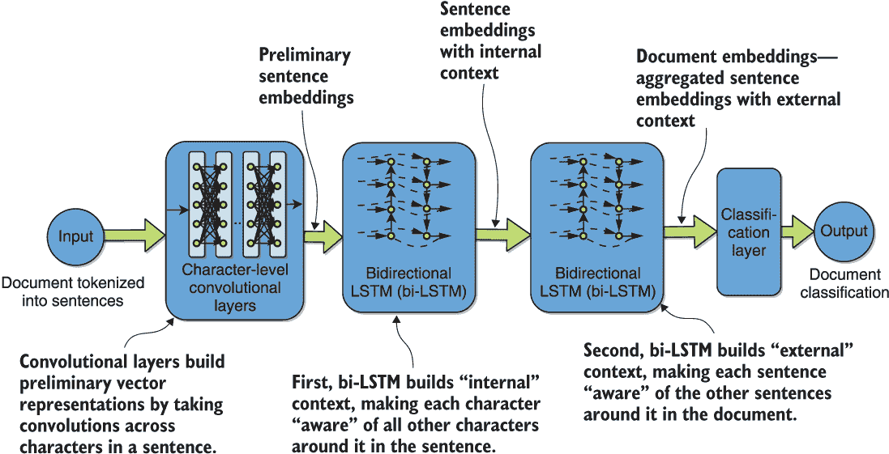
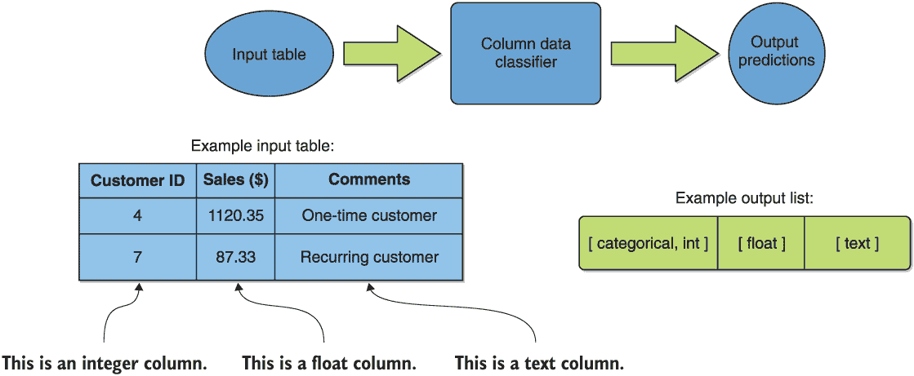
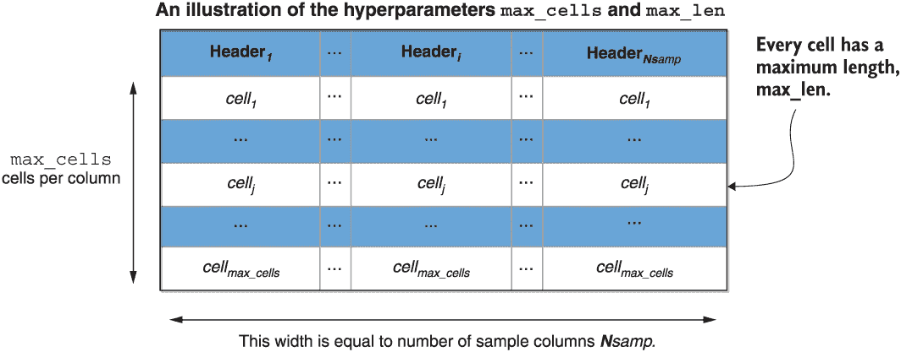

# 第五章：处理数据以用于循环神经网络深度迁移学习实验

本章涵盖

+   循环神经网络（RNNs）在 NLP 迁移学习中的建模架构概述

+   处理和建模表格文本数据

+   分析一对新的代表性 NLP 问题

在上一章中，我们详细研究了一些在 NLP 迁移学习中重要的浅层神经网络架构，包括 word2vec 和 sent2vec。 还要记住，这些方法产生的向量是静态和非上下文的，也就是说，它们对所讨论的词或句子产生相同的向量，无论周围上下文如何。这意味着这些方法无法消歧或区分词或句子的不同可能含义。

在这一章和下一章中，我们将介绍一些代表性的自然语言处理（NLP）深度迁移学习建模架构，这些架构依赖于循环神经网络（RNNs）的关键功能。具体来说，我们将研究建模框架 SIMOn，¹ ELMo，² 和 ULMFiT.³ 这些方法所使用的更深层次的神经网络的性质将使得所得到的嵌入是具有上下文的，即产生依赖上下文的词嵌入并实现消歧。回想一下，我们在第三章首次遇到了 ELMo。在下一章中，我们将更加深入地研究它的架构。

为了对本体进行建模的语义推理（SIMOn）是在 DARPA 的数据驱动模型发现（D3M）计划期间开发的，该计划旨在自动化数据科学家面临的一些典型任务，⁴ 包括自动构建用于数据清洗、特征提取、特征重要性排名和为任何给定数据科学问题选择模型的处理管道。这些任务通常被称为*自动机器学习*或*AutoML*。具体来说，该模型试图将表格数据集中的每一列分类为基本类型，比如整数、字符串、浮点数或地址。其想法是 AutoML 系统可以根据这些信息决定如何处理输入的表格数据——这是实践中遇到的一种重要数据。人们可以从前述 D3M 计划网页下载程序中开发的各种工具的预打包的 Docker 镜像，包括 SIMOn。

SIMOn 的开发受到了计算机视觉中的迁移学习的类比的启发，这些内容在第一章的结尾进行了讨论。它的训练过程展示了如何使用迁移学习来使用模拟数据来补充少量手动标记的数据。将处理的类别集扩展到最初进行训练的类别之外是另一个在这个框架中生动地使用迁移学习的任务。这个模型在 D3M 中被大量使用，在本章中作为一个相对简单的实际例子，说明了如何利用迁移学习来解决真正的、实际的挑战。SIMOn 还被用于在社交媒体上检测潜在有害的沟通。#pgfId-1096624 列类型分类被用作这个建模框架的一个生动例子。

我们从一个介绍列数据类型分类示例的章节开始本章。在那一节中，相关的模拟数据生成和预处理过程也得到了简要的涉及。我们接着描述等效步骤用于“假新闻”检测示例，在下一章中将用于 ELMo 的一个实例。 

在图 5.1 中展示了 SIMOn 架构的可视化，在表格列类型分类示例的背景下。粗略地说，它使用卷积神经网络（CNNs）来为句子构建初步的嵌入，使用一对 RNNs 来首先为句子中的字符构建内部上下文，然后为文档中的句子构建外部上下文。



图 5.1 在表格列类型分类示例中展示了 SIMOn 架构的可视化

从图中我们可以看到，这种架构由字符级卷积神经网络（CNNs）和双向长短期记忆（bi-LSTM）网络元素组成，这是一种递归神经网络（RNN）的类型。在这个框架中，值得强调的是输入文本被分词成句子，而不是单词。另外，将每个句子视为对应给定文档的列的单元，能够将非结构化文本转换为框架考虑的表格数据集上下文。

语言模型嵌入（ELMo）可以说是与正在进行的 NLP 迁移学习革命相关联的最受欢迎的早期预训练语言模型。它与 SIMOn 有许多架构上的相似之处，也由字符级 CNNs 与 bi-LSTMs 组成。这种相似性使得在介绍 SIMOn 之后深入挖掘 ELMo 的架构成为一个自然的下一步。我们将把 ELMo 应用到一个用于说明的问题上，即“假新闻”检测，以提供一个实际的背景。

图 5.2 显示了在表格列类型分类的背景下可视化的 ELMo 架构。 两个框架之间的一些相似之处和差异立即显而易见。 我们可以看到，两个框架都使用字符级 CNN 和双向 LSTM。 但是，虽然 SIMOn 有两个用于 RNN 的上下文构建阶段——一个用于句子中的字符，另一个用于文档中的句子——而 ELMo 只有一个阶段，重点是为输入文档中的单词建立上下文。


图 5.2 在表格列类型分类示例的背景下可视化了 ELMo 架构。

最后，我们将介绍通用语言模型微调（ULMFiT）框架，该框架引入并演示了一些关键技术和概念，使预训练语言模型能够更有效地适应新环境，如区分微调和逐步解冻。 区分性微调规定，由于语言模型的不同层包含不同类型的信息，因此应以不同的速率进行调整。 逐步解冻描述了一种逐渐微调更多参数的过程，旨在减少过拟合的风险。 ULMFiT 框架还包括在适应过程中以独特方式改变学习率的创新。 我们将在下一章介绍 ELMo 之后介绍该模型，以及其中的几个概念。

## 5.1 预处理表格列类型分类数据

在本节中，我们介绍了在本章和随后的章节中将探讨的第一个示例数据集。 在这里，我们有兴趣开发一种算法，该算法可以接收表格数据集，并为用户确定每列中的基本类型，即确定哪些列是整数、字符串、浮点数、地址等。 这样做的关键动机是，自动机器学习系统可以根据这些信息决定如何处理输入的表格数据——这是实践中遇到的一种重要数据类型。 例如，检测到的纬度和经度坐标值可以绘制在地图上并显示给用户。 检测到的浮点列可能是回归问题的潜在候选输入或输出，而分类列是分类问题的依赖变量的候选项。 我们用图 5.3 中的一个简单示例可视化了这个问题的本质。



图 5.3 使用简单示例可视化表格列数据类型分类问题

我们强调这是一个多标签、多类问题，因为每个输入示例都有多种可能的类别，并且每个输入样本可以分配多个这样的类别。例如，在图 5.3 中，第一列客户 ID 具有多个输出标签，即`categorical`和`int`。这还有助于处理输入列不是“干净”的情况，即它们包含多种类型。这些列可以带有所有存在的类型标签，并传递给相关解析器进行进一步清洁。

现在，我们对于这个问题有了更好的理解，让我们开始获取一些表格数据，用于本节的实验。

### 5.1.1 获取和可视化表格数据

我们将使用两个简单的数据集来说明下一章中的表格列类型分类示例。这两个数据集中的第一个是由 OpenML 提供的棒球球员统计数据集。⁶该数据集描述了一组球员的棒球统计数据，以及他们是否最终进入名人堂。

在 Linux 系统上，我们可以按如下方式获取数据集：

```py
!wget https:/ /www.openml.org/data/get_csv/3622/dataset_189_baseball.arff
```

从以前的章节中可以回忆到，“!”符号仅在执行 Jupyter 环境（例如我们建议在这些练习中使用的 Kaggle 环境）时需要，当在终端中执行时，应该将其删除。同时请注意，对于我们的目的，`.arff`格式与`.csv`格式在功能上是等效的。

获取了感兴趣的数据集后，让我们像往常一样使用 Pandas 进行预览：

```py
import pandas as pd
raw_baseball_data = pd.read_csv('dataset_189_baseball.arff', dtype=str)   ❶
print(raw_baseball_data.head())
```

❶对于我们的目的，`.arff`格式与`.csv`格式在功能上是等效的。

这将显示 DataFrame 的前五行，如下所示：

```py
         Player Number_seasons Games_played At_bats  Runs  Hits Doubles  \
0    HANK_AARON             23         3298   12364  2174  3771     624   
1   JERRY_ADAIR             13         1165    4019   378  1022     163   
2  SPARKY_ADAMS             13         1424    5557   844  1588     249   
3   BOBBY_ADAMS             14         1281    4019   591  1082     188   
4    JOE_ADCOCK             17         1959    6606   823  1832     295   

  Triples Home_runs  RBIs Walks Strikeouts Batting_average On_base_pct  \
0      98       755  2297  1402       1383           0.305       0.377   
1      19        57   366   208        499           0.254       0.294   
2      48         9   394   453        223           0.286       0.343   
3      49        37   303   414        447           0.269        0.34   
4      35       336  1122   594       1059           0.277       0.339   

  Slugging_pct Fielding_ave     Position Hall_of_Fame  
0        0.555         0.98     Outfield            1  
1        0.347        0.985  Second_base            0  
2        0.353        0.974  Second_base            0  
3        0.368        0.955   Third_base            0  
4        0.485        0.994   First_base            0  
```

我们可以看到这是一组广告中所述的突击手棒球统计数据集。

现在我们获取另一个表格数据集。不多赘述，这个数据集将用于扩展我们的 SIMOn 分类器，超越预训练模型所设计的类别集合。这个练习将为转移学习提供一个有趣的使用案例，可以激发你自己应用的创意。

我们将要查看的第二个数据集是多年的不列颠哥伦比亚省公共图书馆统计数据集，我们从 BC 数据目录⁷获得，但也将其附加到我们的伴随 Kaggle 笔记本上，以方便你使用。要使用 Pandas 加载数据集，我们执行以下命令，其中我们 Kaggle 环境中该文件的位置应该替换为您本地的路径，如果选择在本地工作：

```py
raw_data = pd.read_csv('../input/20022018-bc-public-libraries-open-data-v182/2002-2018-bc-public-libraries-open-data-csv-v18.2.csv', dtype=str)
```

我们可以使用以下命令查看数据集：

```py
print(raw_data.head())
```

输出结果为：

```py
   YEAR                           LOCATION                      LIB_NAME  \
0  2018  Alert Bay Public Library & Museum      Alert Bay Public Library   
1  2018       Beaver Valley Public Library  Beaver Valley Public Library   
2  2018        Bowen Island Public Library   Bowen Island Public Library   
3  2018             Burnaby Public Library        Burnaby Public Library   
4  2018          Burns Lake Public Library     Burns Lake Public Library   

                     LIB_TYPE SYMBOL        Federation             lib_ils  \
0  Public Library Association   BABM    Island Link LF     Evergreen Sitka   
1  Public Library Association   BFBV       Kootenay LF     Evergreen Sitka   
2           Municipal Library    BBI      InterLINK LF     Evergreen Sitka   
3           Municipal Library     BB      InterLINK LF  SirsiDynix Horizon   
4  Public Library Association   BBUL  North Central LF     Evergreen Sitka   

  POP_SERVED srv_pln STRAT_YR_START  ... OTH_EXP    TOT_EXP EXP_PER_CAPITA  \
0        954     Yes          2,013  ...    2488      24439        25.6174   
1      4,807     Yes          2,014  ...   15232  231314.13       48.12027   
2      3,680     Yes          2,018  ...   20709  315311.17       85.68238   
3    232,755     Yes          2,019  ...  237939   13794902       59.26791   
4      5,763     Yes          2,018  ...     NaN     292315       50.72271   

  TRANSFERS_TO_RESERVE AMORTIZATION EXP_ELEC_EBOOK EXP_ELEC_DB  \
0                    0            0              0         718   
1                11026            0        1409.23      826.82   
2                11176        40932           2111       54.17   
3                    0      2614627         132050           0   
4                  NaN          NaN              0           0   

  EXP_ELEC_ELEARN EXP_ELEC_STREAM EXP_ELEC_OTHER  
0               0               0            752  
1         1176.11               0        1310.97  
2            3241               0              0  
3               0               0         180376  
4               0               0           7040  

[5 rows x 235 columns]
```

我们只对百分比和整数这一对列感兴趣，我们可以按以下方式提取并显示：

```py
COLUMNS = ["PCT_ELEC_IN_TOT_VOLS","TOT_AV_VOLS"]    ❶
raw_library_data = raw_data[COLUMNS]
print(raw_library_data)
```

❶这个数据集有很多列，我们只关注这两列。

这将产生以下输出，展示我们将使用的另外两列：

```py
     PCT_ELEC_IN_TOT_VOLS TOT_AV_VOLS
0                  90.42%          57
1                  74.83%       2,778
2                  85.55%       1,590
3                   9.22%      83,906
4                  66.63%       4,261
...                   ...         ...
1202                0.00%      35,215
1203                0.00%     109,499
1204                0.00%         209
1205                0.00%      18,748
1206                0.00%        2403

[1207 rows x 2 columns]
```

### 5.1.2 预处理表格数据

现在让我们将获取的表格数据预处理成 SIMOn 框架可以接受的形式。由于我们将使用一个预训练模型，该模型预先包含一个编码器，我们将应用于此目的，因此我们需要首先安装 SIMOn，使用以下命令：

```py
!pip install git+https:/ /github.com/algorine/simon
```

完成这些之后，我们还需要导入一些必需的模块，如下所示：

```py
from Simon import Simon              ❶
from Simon.Encoder import Encoder    ❷
```

❶ 导入 SIMOn 模型类

❷ 导入 SIMOn 数据编码器类，用于将输入文本转换为数字

这些导入分别代表了 SIMOn 模型类、数据编码器类、将所有输入数据标准化为固定长度的实用程序，以及生成模拟数据的类。

接下来，我们获取一个预训练的 SIMOn 模型，它带有自己的编码器，用于将文本转换为数字。该模型由两个文件组成：一个包含编码器和其他配置，另一个包含模型权重。我们使用以下命令获取这些文件：

```py
!wget https:/ /raw.githubusercontent.com/algorine/simon/master/Simon/scripts/❶pretrained_models/Base.pkl                                              ❶
!wget https:/ /raw.githubusercontent.com/algorine/simon/master/Simon/scripts/❷pretrained_models/text-class.17-0.04.hdf5                               ❷
```

❶ 预训练的 SIMOn 模型配置、编码器等

❷ 对应的模型权重

在我们加载模型权重之前，首先需要加载它们的配置，这些配置包括编码器，通过以下一系列命令：

```py
checkpoint_dir = ""                                                    ❶
execution_config = "Base.pkl"                                          ❷
Classifier = Simon(encoder={})                                         ❸
config = Classifier.load_config(execution_config, checkpoint_dir)      ❹
encoder = config['encoder']                                            ❺
checkpoint = config['checkpoint']                                      ❻
```

❶ 模型权重位于当前级别。

❷ 下载的预训练模型配置的名称

❸ 创建一个文本分类器实例，用于从模型配置中加载编码器。

❹ 加载模型配置

❺ 提取编码器

❻ 提取检查点名称

为了确保我们下载了正确的权重集，通过以下方式双重检查模型所需的权重文件：

```py
print(checkpoint)
```

通过打印以下内容，应确认我们获取了正确的文件：

```py
text-class.17-0.04.hdf5
```

最后，我们需要为建模表格数据指定两个关键参数。参数`max_cells`指定表格每列的最大单元格数。参数`max_len`指定每个单元格的最大长度。这在图 5.4 中有所体现。



图 5.4 可视化表格数据建模参数。参数`max_cells`指定表格中每列的最大单元格或行数。参数`max_len`指定每个单元格或行的最大长度。

每列的最大单元格数必须与训练中使用的 500 的值匹配，并且可以从编码器中提取，如下所示：

```py
max_cells = encoder.cur_max_cells
```

另外，我们将`max_len`设置为 20，以与预训练模型设置保持一致，并提取预训练模型支持的类别，如下所示：

```py
max_len = 20 # maximum length of each tabular cell
Categories = encoder.categories
category_count = len(Categories)      ❶
print(encoder.categories)
```

❶ 预训练模型支持的类别数量

我们发现处理的类别如下：

```py
['address', 'boolean', 'datetime', 'email', 'float', 'int', 'phone', 'text', 'uri']
```

### 5.1.3 将预处理数据编码为数字

现在我们将使用编码器将表格数据转换为 SIMOn 模型可以用来进行预测的一组数字。这涉及将每个输入字符串中的每个字符转换为该字符在模型编码方案中表示的唯一整数。

因为卷积神经网络（CNNs）需要所有输入都是固定的、预先指定的长度，所以编码器还将标准化每个输入列的长度。这一步骤会复制短于`max_cells`的列中的随机单元，并丢弃一些长列中的随机单元。这确保了所有列的长度恰好为`max_cells`。此外，如果需要，所有单元都标准化为长度`max_len`，并添加填充。我们不会过于担心这些细节，因为 SIMOn API 会在幕后为我们处理它。

我们对棒球数据集进行编码，并使用以下代码显示其形状：

```py
X_baseball = encoder.encodeDataFrame(raw_baseball_data)   ❶
print(X_baseball.shape)                                   ❷
print(X_baseball[0])                                      ❸
```

❶ 编码数据（标准化、转置、转换为 NumPy 数组）

❷ 显示了编码数据的形状

❸ 显示了编码的第一列

执行此操作会产生以下输出，其中首先显示输出形状元组，然后显示编码的第一列：

```py
(18, 500, 20)
[[-1 -1 -1 ... 50 37 44]
 [-1 -1 -1 ... 54 41 46]
 [-1 -1 -1 ... 37 52 55]
 ...
 [-1 -1 -1 ... 49 45 46]
 [-1 -1 -1 ... 51 54 43]
 [-1 -1 -1 ... 38 37 43]]
```

我们看到每个编码列都是一个`max_cells=500`乘以`max_len=20`的数组，正如预期的那样。我们还注意到编码列的-1 条目代表了短于`max_len`的单元的填充。

我们还对图书馆数据进行编码，以便以后使用：

```py
X_library = encoder.encodeDataFrame(raw_library_data)
```

在这个阶段，我们已经将示例输入数据集转换成了适当形状的 NumPy 数组。这将文本编码为适合 SIMOn 神经网络第一阶段——生成初步输入句子嵌入的 CNN 的摄入和分析的数字。

## 5.2 预处理事实检验示例数据

在这一节中，我们介绍了将在本章和后续章节中研究的第二个示例数据集。在这里，我们感兴趣的是开发一种算法，用于区分事实新闻和潜在的错误信息或虚假信息。这个应用领域变得越来越重要，并经常被称为“自动假新闻检测”。

对我们来说很方便的是，Kaggle⁸上有一个适用的数据集。该数据集包含超过 40,000 篇文章，分为两类：“假”和“真”。真实的文章来自一家名声显赫的新闻网站 reuters.com。而假新闻则来自 PolitiFact 标记为不可靠的各种来源。这些文章大多涉及政治和世界新闻。

### 5.2.1 特殊问题考虑

可以称为假的主题无疑是一个值得讨论的敏感话题。可以肯定的是，准备训练数据标签的人的偏见可能会转移到分类系统中。在这样敏感的语境下，标签的有效性需要特别注意和考虑如何创建。

此外，尽管我们在本节的目的是开发一个基于内容的分类系统，用于区分真实文章与潜在虚假文章，但重要的是要强调，现实场景要复杂得多。换句话说，检测潜在错误信息传播只是检测*影响行动*问题的一个方面。要理解两者之间的区别，请考虑即使真实信息也可以用来影响意见，从而损害品牌，如果将其放在错误的上下文或不自然地放大。

检测影响行动可以自然地被构造为一个异常检测问题，⁹ 但这样的系统只有作为缓解策略的一部分时才能有效。它必须是跨平台的，尽可能监控和分析尽可能多的潜在信息渠道中的异常情况。此外，今天的大多数实用系统都嵌入了人类，即检测系统只标记聚合的可疑活动，并将最终行动呼叫留给人类分析员。

### 5.2.2 加载和可视化事实检查数据

现在，我们直接跳转到加载事实检查数据并使用 ELMo 建模框架对其进行分类的步骤。回想一下第 3.2.1 节，我们在那里将 ELMo 应用于垃圾邮件检测和电影评论情感分析，该模型期望将每个输入文档作为单个字符串。这使得事情变得更容易——不需要分词。还要注意，数据集已经附加到了 Kaggle 上的伴随 Jupyter 笔记本上。

我们使用列表 5.1 中的代码从数据集中加载真假数据。请注意，我们选择在此加载每种 1,000 个样本，以保持与第 3.2.1 节的一致性。

列表 5.1 加载每种 1,000 个真假文章样本

```py
import numpy as np
import pandas as pd

DataTrue = pd.read_csv("/kaggle/input/fake-and-real-news-dataset/True.csv")❶
DataFake = pd.read_csv("/kaggle/input/fake-and-real-news-dataset/Fake.csv")❷

Nsamp =1000                                                                ❸
DataTrue = DataTrue.sample(Nsamp)
DataFake = DataFake.sample(Nsamp)
raw_data = pd.concat([DataTrue,DataFake], axis=0).values                   ❹

raw_data = [sample[0].lower() + sample[1].lower() + sample[3].lower() for sample in raw_data]                                                   ❺

Categories = ['True','False']                                              ❻
header = ([1]*Nsamp)
header.extend(([0]*Nsamp))
```

❶ 将真实新闻数据读入 Pandas DataFrame

❷ 将假新闻数据读入 Pandas DataFrame

❸ 每个类别生成的样本数——真实，虚假

❹ 连接的真假样本

❺ 将标题、正文和主题组合成每个文档的一个字符串

❻ 对应的标签

其次，我们使用以下代码将数据洗牌并将其分为 70% 的训练/30% 的验证，以方便起见，这些代码在此处从第 3.2.1 节复制：

```py
def unison_shuffle(a, b):                             ❶
    p = np.random.permutation(len(b))
    data = np.asarray(a)[p]
    header = np.asarray(b)[p]
    return data, header

raw_data, header = unison_shuffle(raw_data, header)   ❷

idx = int(0.7*raw_data.shape[0])                      ❸

train_x = raw_data[:idx]                              ❹
train_y = header[:idx]
test_x = raw_data[idx:]                               ❺
test_y = header[idx:]
```

❶ 一个用于与标签头一起洗牌数据的函数，以消除任何潜在的顺序偏差

❷ 通过调用先前定义的函数来洗牌数据

❸ 分成独立的 70% 训练和 30% 测试集

❹ 70% 的数据用于训练

❺ 剩余 30% 用于验证

在介绍和预处理示例问题数据之后，我们将在下一章中将章节开头概述的三个基于 RNN 的神经网络模型应用于示例问题数据。

## 总结

+   与单词级模型相比，字符级模型可以处理拼写错误和其他社交媒体特征，如表情符号和小众俚语。

+   双向语言建模是构建意识到其局部上下文的词嵌入的关键。

+   SIMOn 和 ELMo 都采用字符级 CNN 和双向 LSTM，后者有助于实现双向上下文建模。

1. P. Azunre 等人，“基于字符级卷积神经网络的表格数据集的语义分类”，*arXiv*（2019 年）。

2. M. E. Peters 等人，“Deep Contextualized Word Representations”，NAACL-HLT 会议论文集（2018 年）。

3. J. Howard 等人，“文本分类的通用语言模型微调”，第 56 届计算语言学年会论文集（2018 年）。

4. [`docs.datadrivendiscovery.org/`](https://docs.datadrivendiscovery.org/)

5. N. Dhamani 等人，“利用深度网络和迁移学习解决虚假信息问题”，AI for Social Good ICML 研讨会（2019 年）。

6. [`www.openml.org/d/185`](https://www.openml.org/d/185)

7. [`catalogue.data.gov.bc.ca/dataset/bc-public-libraries-statistics-2002-present`](https://catalogue.data.gov.bc.ca/dataset/bc-public-libraries-statistics-2002-present)

8. [`www.kaggle.com/clmentbisaillon/fake-and-real-news-dataset`](https://www.kaggle.com/clmentbisaillon/fake-and-real-news-dataset)

9. P. Azunre 等人，“虚假信息：检测到阻断”，真相和信任在线会议 1 卷 1 期（2019 年）。
