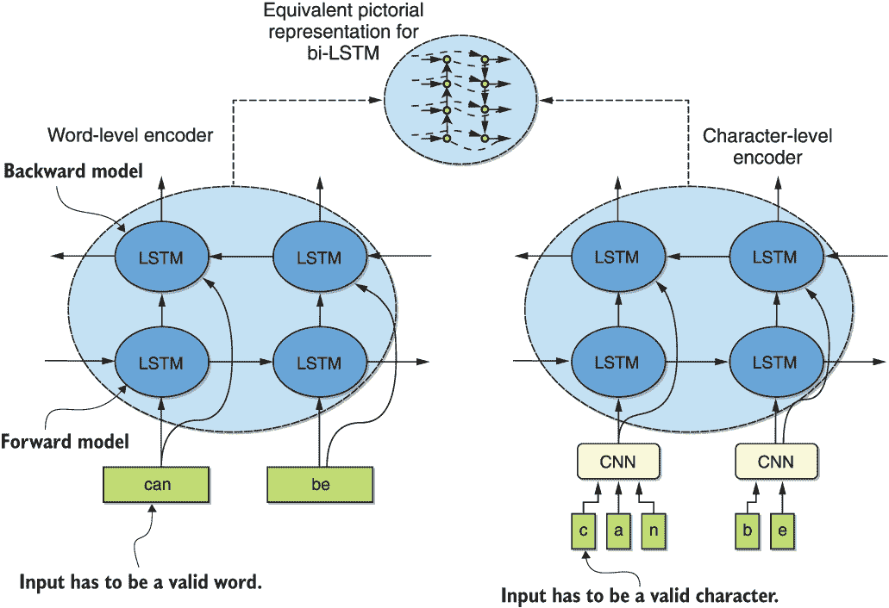
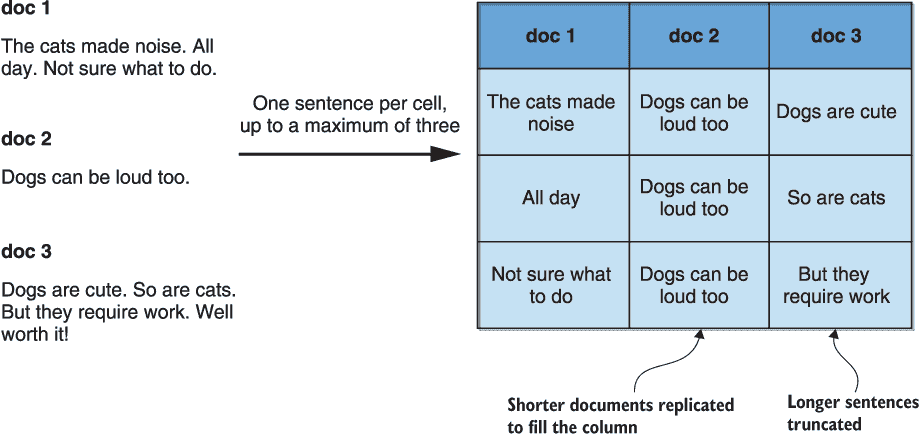
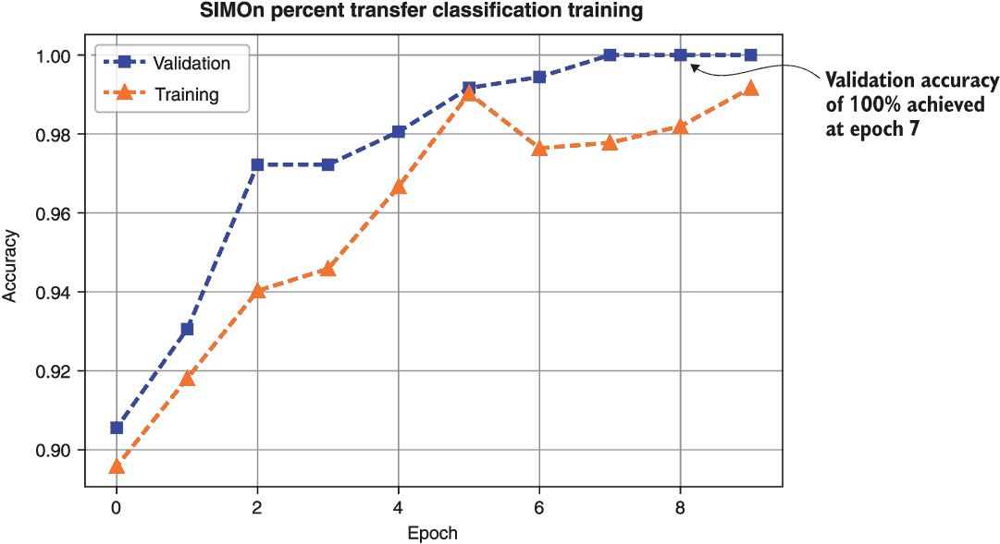
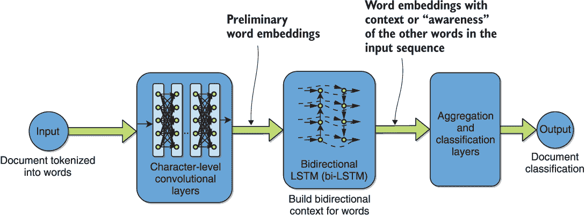
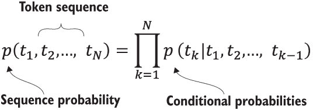
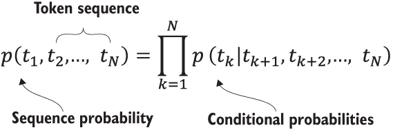
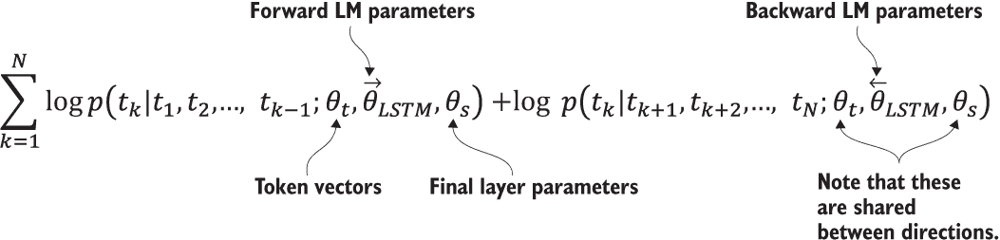
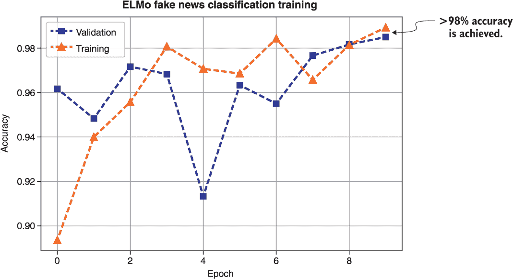
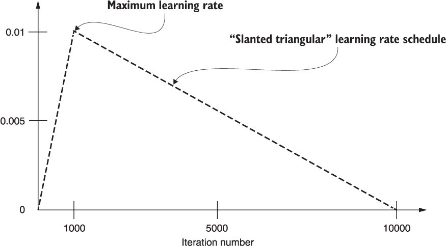

# 第六章：.循环神经网络用于自然语言处理的深度迁移学习

本章内容包括

+   依赖于 RNN 的自然语言处理迁移学习的三种代表性建模架构

+   将这些方法应用于上一章中介绍的两个问题

+   将在模拟数据训练中获得的知识传递到真实标记数据

+   介绍一些更复杂的模型适应策略，通过 ULMFiT

在上一章中，我们介绍了两个用于本章实验的例子问题——列类型分类和虚假新闻检测。回顾一下，实验的目标是研究依赖于循环神经网络（RNN）的深度迁移学习方法，以用于自然语言处理的关键功能。具体而言，我们将重点研究三种方法——SIMOn、ELMo 和 ULMFiT，这些方法在上一章中已经简要介绍过。在下一节中，我们将从 SIMOn 开始，将它们应用于示例问题。

## 6.1 语义推理用于本体建模（SIMOn）

正如我们在上一章中简要讨论的那样，SIMOn 是作为自动机器学习（AutoML）管道的一个组成部分而设计的，用于数据驱动的模型发现（D3M）DARPA 计划。它被开发为用于表格数据集中列类型的分类工具，但也可以看作是一个更一般的文本分类框架。我们将首先在任意文本输入的环境下介绍该模型，然后将其专门用于表格案例。

SIMOn 是一个字符级模型，而不是单词级模型，以处理拼写错误和其他社交媒体特征，如表情符号和专业知识的口头语。因为它以字符级别编码输入文本，所以输入只需要用于分类的允许字符即可。这使得模型能够轻松适应社交媒体语言的动态特性。模型的字符级本质在图 6.1 中与单词级模型进行对比。在图的左侧，我们展示了单词级编码器，其输入必须是一个有效的单词。显然，由于拼写错误或行话，一个词汇表外的词是无效的输入。对于字符级编码器，如 ELMo 和 SIMOn 所示，输入只需要是一个有效的字符，这有助于处理拼写错误。



图 6.1 对比基于单词级和字符级的文本分类模型

### 6.1.1 通用神经架构概述

该网络可以分为两个主要耦合的部分，将一个被分割为句子的文档作为输入。第一个部分是一个用于编码每个独立句子的网络，而第二个部分则使用编码的句子创建整个文档的编码。

句子编码器首先对输入句子进行字符级的独热编码，使用了一个包含 71 个字符的字典。这包括所有可能的英文字母，以及数字和标点符号。输入句子也被标准化为长度为`max_len`。然后通过一系列的卷积、最大池化、失活和双向 LSTM 层。请参考图 5.1 的前两个阶段，这里为了方便起见重复一次，进行一个摘要可视化。卷积层在每个句子中实质上形成了“词”的概念，而双向 LSTM“查看”一个词周围的两个方向，以确定其局部上下文。这一阶段的输出是每个句子的默认维度为 512 的嵌入向量。还可以比较图 5.1 和图 6.1 中双向 LSTM 的等效图示来使事情具体化。


图 5.1（为了方便起见，从上一章中重复）在表格列类型分类示例中可视化 SIMOn 架构

文档编码器将句子嵌入向量作为输入，类似地通过一系列的随机失活和双向 LSTM 层来处理它们。每个文档的长度被标准化为`max_cells`个这样的嵌入向量。可以将这看作是从句子中形成更高级的“概念”或“主题”的过程，这些概念与文档中存在的其他概念相关联。这为每个文档产生了一个嵌入向量，然后通过一个分类层传递，输出每种不同类型或类的概率。

### 6.1.2 对表格数据进行建模

对表格数据进行建模出人意料的简单；它只需要将表格数据集中每个单元格都视为一个句子。当然，每个这样的列被视为要进行分类的一个文档。

这意味着要将 SIMOn 框架应用到非结构化文本，只需将文本转换成一张表，每列一个文档，每个单元格一个句子。这个过程的示意图在图 6.2 中展示。请注意，在这个简单的例子中，我们选择`max_cells`等于 3，只是为了示例。



图 6.2 将非结构化文本转换为 SIMOn 可消化的过程

### 6.1.3 将 SIMOn 应用于表格列类型分类数据

在其原始形式中，SIMOn 最初是在一组基础类的模拟数据上进行训练的。然后转移到一组手工标记的较小数据。了解如何生成模拟数据可能是有用的，因此我们用以下一组命令简要地说明了这个过程，这些命令在底层使用了库 Faker：

```py
from Simon.DataGenerator import DataGenerator      ❶

data_cols = 5                                      ❷
data_count = 10                                    ❸

try_reuse_data = False                             ❹
simulated_data, header = DataGenerator.gen_test_data((data_count, data_cols), try_reuse_data)
print("SIMULATED DATA")                            ❺
print(simulated_data)
print("SIMULATED DATA HEADER:")
print(header)
```

❶ 模拟/伪造数据生成实用工具（使用库 Faker）

❷ 生成的列数，为了简单起见任意选择

❸ 每列的单元格/行数，为了简单说明而任意选择

❹ 不要重用数据，而是为数据集中的变化性生成新鲜数据。

❺ 打印结果

执行此代码会产生以下输出，显示各种数据类型的生成样本及其相应的标签：

```py
SIMULATED DATA:
[['byoung@hotmail.com' 'Jesse' 'True' 'PPC' 'Lauraview']
 ['cindygilbert@gmail.com' 'Jason' 'True' 'Intel' 'West Brandonburgh']
 ['wilsonalexis@yahoo.com' 'Matthew' 'True' 'U; Intel'
  'South Christopherside']
 ['cbrown@yahoo.com' 'Andrew' 'False' 'U; PPC' 'Loganside']
 ['christopher90@gmail.com' 'Devon' 'True' 'PPC' 'East Charlesview']
 ['deanna75@gmail.com' 'Eric' 'False' 'U; PPC' 'West Janethaven']
 ['james80@hotmail.com' 'Ryan' 'True' 'U; Intel' 'Loriborough']
 ['cookjennifer@yahoo.com' 'Richard' 'True' 'U; Intel' 'Robertsonchester']
 ['jonestyler@gmail.com' 'John' 'True' 'PPC' 'New Kevinfort']
 ['johnsonmichael@gmail.com' 'Justin' 'True' 'U; Intel' 'Victormouth']]
SIMULATED DATA HEADER:
[list(['email', 'text']) list(['text']) list(['boolean', 'text'])
 list(['text']) list(['text'])]
```

SIMOn 仓库的顶层包含了 types.json 文件，该文件指定了从 Faker 库类到先前显示的类别的映射。例如，前一个示例中名称的第二列被标记为“文本”，因为我们不需要为我们的目的识别名称。您可以快速更改此映射，并为您自己的项目和类别集生成模拟数据。

我们这里不使用模拟数据进行训练，因为该过程可能需要几个小时，而我们已经可以访问捕捉到这些知识的预训练模型。但是，我们会进行一项说明性的迁移学习实验，涉及扩展支持的类别集合，超出了预训练模型中可用的类别。

回想一下，在第 5.1.2 节中加载了 SIMOn 分类器类以及模型配置，包括编码器。然后我们可以生成一个 Keras SIMOn 模型，将下载的权重加载到其中，并使用以下命令序列进行编译：

```py
model = Classifier.generate_model(max_len, max_cells, category_count)   ❶
Classifier.load_weights(checkpoint, None, model, checkpoint_dir)        ❷
model.compile(loss='binary_crossentropy',optimizer='adam', metrics=['accuracy'])                                              ❸
```

❶ 生成模型

❷ 加载权重

❸ 编译模型，使用二元交叉熵损失进行多标签分类

在继续之前，查看模型架构是个好主意，我们可以使用以下命令来做到这一点：

```py
model.summary() 
```

这将显示以下输出，并允许您更好地了解内部发生的情况：

```py
______________________________________________________________________________________
Layer (type)                    Output Shape         Param #   Connected to           
======================================================================================
input_1 (InputLayer)            (None, 500, 20)      0                                
______________________________________________________________________________________
time_distributed_1 (TimeDistrib (None, 500, 512)     3202416   input_1[0][0]          
______________________________________________________________________________________
lstm_3 (LSTM)                   (None, 128)          328192    time_distributed_1[0][0]
______________________________________________________________________________________
lstm_4 (LSTM)                   (None, 128)          328192    time_distributed_1[0][0]
______________________________________________________________________________________
concatenate_2 (Concatenate)     (None, 256)          0         lstm_3[0][0]           
                                                               lstm_4[0][0]           
______________________________________________________________________________________
dropout_5 (Dropout)             (None, 256)          0         concatenate_2[0][0]    
______________________________________________________________________________________
dense_1 (Dense)                 (None, 128)          32896     dropout_5[0][0]        
______________________________________________________________________________________
dropout_6 (Dropout)             (None, 128)          0         dense_1[0][0]          
______________________________________________________________________________________
dense_2 (Dense)                 (None, 9)            1161      dropout_6[0][0]        
```

`time_distributed_1` 层是应用于每个输入句子的句子编码器。我们看到其后是前向和后向的 LSTM，它们被连接在一起，一些通过 dropout 进行的正则化，以及来自 `dense_2` 层的输出概率。回想一下，预训练模型处理的类别数恰好为 9，这与输出 `dense_2` 层的维度匹配。还要注意的是，巧合的是，模型总共有 9 层。

通过执行以下一系列命令，我们已经对编译模型的架构有了一定的了解，现在让我们继续查看它认为棒球数据集列的类型是什么。我们通过执行以下命令序列来实现这一点：

```py
p_threshold = 0.5                                       ❶
y = model.predict(X_baseball)                           ❷
result = encoder.reverse_label_encode(y,p_threshold)    ❸
print("Recall that the column headers were:")           ❹
print(list(raw_baseball_data))
print("The predicted classes and probabilities are respectively:")
print(result)
```

❶ 用于决定类成员身份的概率阈值

❷ 预测棒球数据集列的类别

❸ 将概率转换为类别标签

❹ 显示输出

对应的代码输出如下所示：

```py
Recall that the column headers were:
['Player', 'Number_seasons', 'Games_played', 'At_bats', 'Runs', 'Hits', 'Doubles', 'Triples', 'Home_runs', 'RBIs', 'Walks', 'Strikeouts', 'Batting_average', 'On_base_pct', 'Slugging_pct', 'Fielding_ave', 'Position', 'Hall_of_Fame']
The predicted classes and probabilities are respectively:
([('text',), ('int',), ('int',), ('int',), ('int',), ('int',), ('int',), ('int',), ('int',), ('int',), ('int',), ('int',), ('float',), ('float',), ('float',), ('float',), ('text',), ('int',)], [[0.9970826506614685], [0.9877430200576782], [0.9899477362632751], [0.9903284907341003], [0.9894667267799377], [0.9854978322982788], [0.9892633557319641], [0.9895514845848083], [0.989467203617096], [0.9895854592323303], [0.9896339178085327], [0.9897230863571167], [0.9998295307159424], [0.9998230338096619], [0.9998272061347961], [0.9998039603233337], [0.9975670576095581], [0.9894945025444031]])
```

回顾第 5.1.1 节以显示此数据的切片，我们在此复制，我们看到模型以高置信度完全正确地获取了每一列：

```py
         Player Number_seasons Games_played At_bats  Runs  Hits Doubles  \
0    HANK_AARON             23         3298   12364  2174  3771     624   
1   JERRY_ADAIR             13         1165    4019   378  1022     163   
2  SPARKY_ADAMS             13         1424    5557   844  1588     249   
3   BOBBY_ADAMS             14         1281    4019   591  1082     188   
4    JOE_ADCOCK             17         1959    6606   823  1832     295   

  Triples Home_runs  RBIs Walks Strikeouts Batting_average On_base_pct  \
0      98       755  2297  1402       1383           0.305       0.377   
1      19        57   366   208        499           0.254       0.294   
2      48         9   394   453        223           0.286       0.343   
3      49        37   303   414        447           0.269        0.34   
4      35       336  1122   594       1059           0.277       0.339   

  Slugging_pct Fielding_ave     Position Hall_of_Fame  
0        0.555         0.98     Outfield            1  
1        0.347        0.985  Second_base            0  
2        0.353        0.974  Second_base            0  
3        0.368        0.955   Third_base            0  
4        0.485        0.994   First_base            0  
```

现在，假设我们有兴趣在项目中检测具有百分比值的列。我们如何快速使用预训练模型来实现这一点呢？我们可以使用上一章中准备的第二个表格数据集来调查这种情况——多年来的不列颠哥伦比亚公共图书馆统计数据集。当然，第一步是直接使用预训练模型预测这些数据。以下一系列命令实现了这一点：

```py
X = encoder.encodeDataFrame(raw_library_data)          ❶
y = model.predict(X)                                   ❷
result = encoder.reverse_label_encode(y,p_threshold)   ❸
print("Recall that the column headers were:")
print(list(raw_library_data))
print("The predicted class/probability:")
print(result)
```

❶ 使用原始框架对数据进行编码

❷ 预测类别

❸ 将概率转换为类标签

这将产生以下输出：

```py
Recall that the column headers were:
['PCT_ELEC_IN_TOT_VOLS', 'TOT_AV_VOLS']
The predicted class/probability:
([('text',), ('int',)], [[0.7253058552742004], [0.7712462544441223]])
```

回顾 5.1.1 节的一个数据切片，我们看到整数列被正确识别，而百分比列被识别为文本：

```py
     PCT_ELEC_IN_TOT_VOLS TOT_AV_VOLS
0                  90.42%          57
1                  74.83%       2,778
2                  85.55%       1,590
3                   9.22%      83,906
4                  66.63%       4,261
...                   ...         ...
1202                0.00%      35,215
1203                0.00%     109,499
1204                0.00%         209
1205                0.00%      18,748
1206                0.00%        2403

[1207 rows x 2 columns]
```

那并不是不正确，但也不完全是我们正在寻找的，因为它不够具体。

我们将快速将预训练模型转移到一个非常小的包含百分比样本的训练数据集。首先让我们使用以下命令了解原始库 DataFrame 的大小：

```py
print(raw_library_data.shape)
```

我们发现尺寸为(1207,2)，这似乎是足够构建一个小数据集的行数！

在清单 6.1 中，我们展示了可用于将此数据集分割为许多每个 20 个单元格的更小列的脚本。数字 20 是任意选择的，是为了创建足够多的唯一列——大约 50 个——在生成的数据集中。此过程产生一个新的 DataFrame，`new_raw_data`，大小为 20 行 120 列——前 60 列对应于百分比值，后 60 列对应于整数值。它还生成一个相应的`header`标签列表。

清单 6.1 将长库数据转换为许多较短样本列

```py
                                                                           ❶
percent_value_list = raw_library_data['PCT_ELEC_IN_TOT_VOLS'].values.tolist()
int_value_list = raw_library_data['TOT_AV_VOLS'].values.tolist()

                                                                           ❷
original_length = raw_data.shape[0]                                        ❸
chunk_size = 20 # length of each newly generated column
header_list = list(range(2*original_length/ /chunk_size))                   ❹
new_raw_data = pd.DataFrame(columns = header_list)                         ❺
for i in range(original_length/ /chunk_size):                               ❻
    new_raw_data[i] = percent_value_list[i:i+chunk_size]                   ❼
    new_raw_data[original_length/ /chunk_size+i] = int_value_list[i:i+chunk_size]                                        ❽

header = [("percent",),]*(original_length/ /chunk_size)                     ❾
header.extend([("int",),]*(original_length/ /chunk_size))
```

❶ 将数据转换为两个列表

❷ 将其分解为每个样本列 20 个单元格

❸ 原始长度，1207

❹ 新列的索引列表

❺ 初始化新的 DataFrame 以保存新数据

❻ 使用新的 DataFrame 填充

❼ 使用百分比值填充 DataFrame

❽ 使用*整数*值填充 DataFrame

❾ 让我们为我们的训练数据创建相应的标题。

记得预训练模型的最后一层具有输出维度为 9，与处理的类的数量相匹配。要添加另一个类，我们需要将输出维度增加到大小为 10。我们还应该将这个新维度的权重初始化为文本类的权重，因为这是预训练模型处理的最相似的类。这是在我们之前使用预训练模型将百分比数据预测为文本时确定的。这是通过下一个清单中显示的脚本完成的。在脚本中，我们将百分比添加到支持的类别列表中，将输出维度增加 1 以容纳此添加，然后将相应维度的权重初始化为最接近的类别文本值的权重。

清单 6.2 创建最终输出层的新权重，包括百分比类

```py
import numpy as np

old_weights = model.layers[8].get_weights()                          ❶
old_category_index = encoder.categories.index('text')                ❷
encoder.categories.append("percent")                                 ❸
encoder.categories.sort()                                            ❹
new_category_index = encoder.categories.index('percent')             ❺

new_weights = np.copy(old_weights)                                   ❻
new_weights[0] = np.insert(new_weights[0], new_category_index, old_weights[0][:,old_category_index], axis=1)                   ❼
new_weights[1] = np.insert(new_weights[1], new_category_index, 0)    ❽
```

❶ 抓取初始化的最后一层权重

❷ 找到最接近类别的旧权重索引—文本

❸ 使用新的类别列表更新编码器

❹ 对新列表按字母顺序排序

❺ 找到新类别的索引

❻ 将新权重初始化为旧权重

❼ 在百分比权重位置插入文本权重

❽ 在百分比偏差位置插入文本偏差

在执行清单 6.2 中的代码之后，您应该仔细检查数组`old_weights`和`new_weights`的形状。如果一切按预期进行，您应该会发现前者是（128,9），而后者是（128,10）。

现在我们已经准备好在预训练之前用来初始化新模型的权重，让我们实际构建和编译这个新模型。SIMOn API 包含以下函数，使构建模型非常容易：

```py
model = Classifier.generate_transfer_model(max_len, max_cells, category_count, category_count+1, checkpoint, checkpoint_dir)
```

通过此函数返回的转移模型与我们之前构建的模型完全类似，唯一的区别是最终层现在具有新的维度，由输入`category_count+1`指定。另外，因为我们没有为新创建的输出层提供任何初始化信息，所以这一层目前被初始化为全零权重。

在我们可以训练这个新的转移模型之前，让我们确保只有最终输出层是可训练的。我们通过以下代码片段完成这一点，并编译模型：

```py
for layer in model.layers:                                                      ❶
    layer.trainable = False
model.layers[-1].trainable = True                                               ❷

model.layers[8].set_weights(new_weights)                                        ❸

model.compile(loss='binary_crossentropy',optimizer='adam', metrics=['accuracy'])❹
```

❶ 开始时使所有层都不可训练

❷ 只有最后一层应该是可训练的。

❸ 将最终层的权重设置为先前确定的初始化值

❹ 编译模型

现在我们可以使用以下清单中的代码在新数据上训练构建的、初始化的和编译的转移模型。

清单 6.3 训练初始化和编译的新转移模型

```py
import time

X = encoder.encodeDataFrame(new_raw_data)                                          ❶
y = encoder.label_encode(header)                                                   ❷
data = Classifier.setup_test_sets(X, y)                                            ❸

batch_size = 4
nb_epoch = 10
start = time.time()
history = Classifier.train_model(batch_size, checkpoint_dir, model, nb_epoch, data)❹
end = time.time()
print("Time for training is %f sec"%(end-start)) 
```

❶ 编码新数据（标准化、转置、转换为 NumPy 数组）

❷ 编码标签

❸ 准备预期格式的数据 -> 60/30/10 训练/验证/测试数据拆分

❹ 训练数据

我们在图 6.3 中可视化了此代码生成的收敛信息。我们看到在第七个时期实现了 100％的验证准确率，训练时间为 150 秒。看来我们的实验成功了，我们已成功地微调了预训练模型以处理新的数据类！我们注意到，为了使这个新模型能够准确地处理所有 10 个类，我们需要在转移步骤中的训练数据中包含每个类的一些样本。在这个阶段，微调的模型只适用于预测包含在转移步骤中的类——`整数`和`百分比`。因为我们这里的目标仅仅是说明性的，我们将此作为读者的警告，并不进一步关注。



图 6.3 百分比类转移表格数据实验收敛可视化

作为转移实验的最后一步，让我们通过比较测试集的预测标签和真实标签来深入了解其性能。可以通过以下代码片段来完成这个任务：

```py
y = model.predict(data.X_test)                                        ❶
result = encoder.reverse_label_encode(y,p_threshold)                  ❷

print("The predicted classes and probabilities are respectively:")    ❸
print(result) 
print("True labels/probabilities, for comparision:") print(encoder.reverse_label_encode(data.y_test,p_threshold))
```

❶预测类别

❷将概率转换为类标签

❸ 检查

生成的输出如下： 

```py
The predicted classes and probabilities are respectively:
([('percent',), ('percent',), ('int',), ('int',), ('percent',), ('int',), ('percent',), ('int',), ('int',), ('percent',), ('percent',), ('int',)], [[0.7889140248298645], [0.7893422842025757], [0.7004106640815735], [0.7190601229667664], [0.7961368560791016], [0.9885498881340027], [0.8160757422447205], [0.8141483068466187], [0.5697212815284729], [0.8359809517860413], [0.8188782930374146], [0.5185337066650391]])
True labels/probabilities, for comparision:
([('percent',), ('percent',), ('int',), ('int',), ('percent',), ('int',), ('percent',), ('int',), ('int',), ('percent',), ('percent',), ('int',)], [[1], [1], [1], [1], [1], [1], [1], [1], [1], [1], [1], [1]])
```

我们发现，微调模型已经完全正确地预测了每个例子，进一步验证了我们的迁移学习实验。

最后要记住，通过在 6.1.2 节中描述的适应过程，SIMOn 框架可以应用于任意输入文本，而不仅仅是表格数据。几个应用示例取得了有希望的结果。¹希望本节的练习已经充分准备您在自己的分类应用程序中部署它，并通过迁移学习将生成的分类器适应新情况。

现在我们将继续探讨将 ELMo 应用于虚假新闻分类示例的情况。

## 6.2 来自语言模型的嵌入（ELMo）

如前一章节简要提到的，来自语言模型的嵌入（ELMo）可以说是与正在进行的 NLP 迁移学习革命相关的最受欢迎的早期预训练语言模型之一。它与 SIMOn 有一些相似之处，因为它也由字符级 CNN 和双向 LSTM 组成。请参考图 5.2，这里重复了一遍，以便鸟瞰这些建模组件。



图 5.2（重复）在表格列类型分类示例的背景下可视化 ELMo 架构

还要查看图 6.1，特别是比图 5.2 更详细的相当于双向 LSTM 的图示。如果您按照本书的时间顺序阅读，那么您也已经在 3.2.1 节中将 ELMo 应用于垃圾邮件检测和 IMDB 电影评论情感分类问题。正如您现在可能已经了解到的那样，ELMo 产生的词表示是整个输入句子的函数。换句话说，该模型是上下文感知的词嵌入。

本节深入探讨了 ELMo 的建模架构。ELMo 确切地对输入文本做了什么来构建上下文和消岐？为了回答这个问题，首先介绍了使用 ELMo 进行双向语言建模，接着将该模型应用于虚假新闻检测问题以使问题具体化。

### 6.2.1 ELMo 双向语言建模

请记住，语言建模试图对一个令牌的出现概率进行建模，通常是一个词，在给定序列中出现。考虑这样一个情景，我们有一个*N*令牌的序列，例如，句子或段落中的单词。一个以单词为单位的前向语言模型通过取序列中每个令牌在其从左到右的历史条件下的概率的乘积来计算序列的联合概率，如图 6.4 所示。考虑这个简短的句子，“*你可以*”。根据图 6.4 中的公式，前向语言模型计算句子的概率为第一个词在句子中是“*你*”的概率乘以第二个词是“*可以*”的概率，假设第一个词是“*你*”，再乘以第三个词是“*是*”的概率，假设前两个词是“*你可以*”。



图 6.4 前向语言模型方程

一个以单词为单位的反向语言模型做的是相同的事情，但是反过来，如图 6.5 中的方程所示。它通过对每个令牌在右到左令牌历史条件下的概率的乘积来建模序列的联合概率。



图 6.5 反向语言模型方程。

再次考虑这个简短的句子，“*你可以*”。根据图 6.5 中的公式，反向语言模型计算句子的概率为最后一个词在句子中是“*是*”的概率乘以第二个词是“*可以*”的概率，假设最后一个词是“*是*”，再乘以第一个词是“*你*”的概率，假设其他两个词是“*可以是*”。

一个双向语言模型结合了前向和后向模型。ELMo 模型特别寻求最大化两个方向的联合对数似然——在图 6.6 中显示的量。请注意，尽管为前向和后向语言模型保留了单独的参数，但令牌向量和最终层参数在两者之间是共享的。这是第四章讨论的软参数共享多任务学习场景的一个例子。



图 6.6 ELMo 用于为序列中的任何给定令牌构建双向上下文的联合双向语言建模（LM）目标方程

每个令牌的 ELMo 表示来自双向 LSTM 语言模型的内部状态。对于任何给定任务，它是与目标令牌对应的所有 LSTM 层（两个方向上的）的内部状态的线性组合。

将所有内部状态组合在一起，与仅使用顶层不同，例如在 SIMOn 中，具有显著的优势。尽管 LSTM 的较低层使得在基于句法的任务（如词性标注）上具有良好的性能，但较高层使得在含义上进行上下文相关的消歧。学习每个任务在这两种表示类型之间的线性组合，允许最终模型选择它需要的任务类型的信号。

### 6.2.2 应用于假新闻检测的模型

现在让我们继续构建一个 ELMo 模型，用于我们在第 5.2 节中组装的假新闻分类数据集。对于已经阅读过第三章和第四章的读者来说，这是 ELMo 建模框架对实际示例的第二个应用。

由于我们已经构建了 ELMo 模型，我们将能够重用一些在第三章中已经定义的函数。请参考第 3.4 节的代码，该代码利用 TensorFlow Hub 平台加载了 ELMo 作者提供的权重，并使用`ElmoEmbeddingLayer`类构建了一个适用于 Keras 的模型。定义了这个类之后，我们可以通过以下代码训练我们所需的用于假新闻检测的 ELMo 模型（与第 3.6 节稍作修改的代码）：

```py
def build_model(): 
  input_text = layers.Input(shape=(1,), dtype="string")
  embedding = ElmoEmbeddingLayer()(input_text)
  dense = layers.Dense(256, activation='relu')(embedding)    ❶
  pred = layers.Dense(1, activation='sigmoid')(dense)        ❷

  model = Model(inputs=[input_text], outputs=pred)

  model.compile(loss='binary_crossentropy', optimizer='adam',
                                 metrics=['accuracy'])       ❸
  model.summary()                                            ❹

  return model

# Build and fit
model = build_model()
model.fit(train_x,                                           ❺
          train_y,
          validation_data=(test_x, test_y),
          epochs=10,
          batch_size=4)
```

❶ 输出 256 维特征向量的新层

❷ 分类层

❸ 损失、度量和优化器的选择

❹ 显示用于检查的模型架构

❺ 将模型拟合 10 个 epochs

让我们更仔细地查看模型结构，该结构由前述代码片段中的`model.summary()`语句输出：

```py
_________________________________________________________________
Layer (type)                 Output Shape              Param #   
=================================================================
input_1 (InputLayer)         (None, 1)                 0         
_________________________________________________________________
elmo_embedding_layer_1 (Elmo (None, 1024)              4         
_________________________________________________________________
dense_1 (Dense)              (None, 256)               262400    
_________________________________________________________________
dense_2 (Dense)              (None, 1)                 257       
=================================================================
Total params: 262,661
Trainable params: 262,661
Non-trainable params: 0
```

`dense_1`和`dense_2`层是添加到第 3.4 节产生的预训练嵌入之上的新的全连接层。预训练嵌入是`elmo_embedding_layer_1`。请注意，打印的模型摘要显示它有四个可训练参数。这四个参数是前面子节中描述的内部双向 LSTM 状态的线性组合中的权重。如果您像我们这样使用 TensorFlow Hub 方法使用预训练的 ELMo 模型，则 ELMo 模型的其余部分不可训练。然而，可以使用模型库的另一个版本构建一个完全可训练的基于 TensorFlow 的 ELMo 模型。

当我们在假新闻数据集上执行前述代码时所达到的收敛结果如图 6.7 所示。我们看到，达到了超过 98%的准确率。



图 6.7 ELMO 模型在假新闻数据集上训练的收敛结果

## 6.3 通用语言模型微调（ULMFiT）

在 ELMo 等技术出现的时候，人们意识到 NLP 语言模型在各种方面与计算机视觉模型不同。将计算机视觉的相同技术应用于微调 NLP 语言模型会带来一些不利之处。例如，这个过程常常遭受到预训练知识的灾难性遗忘，以及在新数据上的过度拟合。这导致的后果是在训练期间失去了任何现存的预训练知识，以及在训练集之外的任何数据上的模型通用性差。名为通用语言模型微调（ULMFiT）的方法开发了一套技术，用于微调 NLP 语言模型以减轻这些不利之处。

更具体地说，该方法规定了在微调过程中对一般预训练语言模型的各层使用一些可变的学习率安排。它还为微调语言模型的任务特定层提供了一套技术，以实现更高效的迁移。尽管这些技术是作者在分类和基于 LSTM 的语言模型的背景下演示的，但这些技术意在更一般的情况下使用。

在本节中，我们会涉及到该方法引入的各种技术。但是，我们并没有在本节中实际实现它的代码。我们将延迟对 ULMFiT 的数值研究，直到第九章，在那里我们将探讨各种预训练模型适应新场景的技术。我们将使用由 ULMFiT 作者编写的 fast.ai 库,³来进行这项工作。

为了讨论接下来的程序，我们假定我们有一个在大型普通文本语料库（如维基百科）上预训练的语言模型。

### 6.3.1 目标任务语言模型微调

无论最初的预训练模型有多普通，最后的部署阶段可能会涉及来自不同分布的数据。这促使我们在新分布的小型数据集上对一般预训练模型进行微调，以适应新场景。ULMFiT 的作者发现，*辨别性微调*和*倾斜学习率*的技术减轻了研究人员在此过程中遇到的过拟合和灾难性遗忘的双重问题。

辨别性微调规定，由于语言模型的不同层捕捉了不同的信息，因此它们应该以不同的速率进行微调。特别是，作者们经验性地发现，首先微调最后一层并注意其最佳学习率是有益的。一旦他们得到了这个基本速率，他们将这个最佳速率除以 2.6，这样就得到了以下层所建议的速率。通过以相同的因数进行逐步除法，可以得到越来越低的下层速率。

在适应语言模型时，我们希望模型在开始阶段快速收敛，然后进入较慢的细化阶段。作者发现，实现这一点的最佳方法是使用倾斜三角形学习率，该学习率线性增加，然后线性衰减。特别地，他们在迭代的初始 10%期间线性增加速率，直到最大值为 0.01。他们建议的速率时间表如图 6.8 所示，针对总迭代次数为 10,000 的情况。



图 6.8 建议的 ULMFiT 速率时间表，适用于总迭代次数为 10,000 的情况。速率线性增加了总迭代次数的 10%（即 1,000），最高值为 0.01，然后线性下降至 0。

### 6.3.2 目标任务分类器微调

除了在小型数据集上微调语言模型以表示新场景的数据分布的技术外，ULMFiT 还提供了两种用于优化任务特定层的技术：*concat pooling*和*gradual unfreezing*。

在 ULMFiT 开发时，将基于 LSTM 的语言模型的最终单元的隐藏状态传递给任务特定层是标准做法。作者建议将这些最终隐藏状态与所有时间步的最大池化和平均池化隐藏状态串联起来（尽可能多地适应内存）。在双向上下文中，他们分别为前向和后向语言模型执行此操作，并平均预测结果。他们称之为*concat pooling*的过程与 ELMo 描述的双向语言建模方法执行类似的功能。

为了减少微调时灾难性遗忘的风险，作者建议逐渐解冻和调整。这个过程从最后一层开始，该层包含最少的通用知识，并且在第一个 epoch 时是唯一解冻和精炼的层。在第二个 epoch 中，将解冻一个额外的层，并重复该过程。该过程持续到所有任务特定层都在该渐进解冻过程的最后迭代中解冻和微调。

作为提醒，这些技术将在第九章的代码中探讨，该章节将涵盖各种适应策略。

## 摘要

+   与词级模型相反，字符级模型可以处理拼写错误和其他社交媒体特征，例如表情符号和小众俚语。

+   双向语言建模对于构建具有意识到其局部上下文的词嵌入至关重要。

+   SIMOn 和 ELMo 都使用字符级 CNN 和双向 LSTM，后者有助于实现双向上下文建模。

+   将预训练语言模型适应新场景可能会受益于对模型的不同层进行不同速率的微调，这应根据倾斜三角形时间表首先增加然后减少。

+   将任务特定的层适应新情境可能会受益于逐渐解冻和微调不同的层，从最后一层开始解冻，逐渐解冻更多层，直到所有层都被精细调整。

+   ULMFiT 采用辨别微调，倾斜三角形学习率和渐进解冻来缓解微调语言模型时的过拟合和灾难性遗忘。

1. N. Dhamani 等人，“使用深度网络和迁移学习解决虚假信息问题”，AI for Social Good ICML Workshop（2019 年）。

2. [`github.com/allenai/bilm-tf`](https://github.com/allenai/bilm-tf)

3. [`nlp.fast.ai/ulmfit`](http://nlp.fast.ai/ulmfit)
