# 第七章：深度迁移学习与转换器和 GPT 的自然语言处理

本章涵盖：

+   理解转换器神经网络架构的基础知识

+   使用生成预训练转换器（GPT）生成文本

在本章和接下来的一章中，我们涵盖了一些依赖于最近流行的神经架构——*转换器*¹——进行关键功能的自然语言处理（NLP）的代表性深度迁移学习建模架构。这可以说是当今自然语言处理（NLP）中最重要的架构。具体来说，我们将研究诸如 GPT,² 双向编码器表示来自转换器（BERT）³ 和多语言 BERT（mBERT）⁴ 等建模框架。这些方法使用的神经网络比我们在前两章中看到的深度卷积和循环神经网络模型具有更多的参数。尽管体积更大，但这些框架因在并行计算架构上相对更有效地扩展而变得越来越受欢迎。这使得在实践中可以开发出更大更复杂的模型。为了使内容更易理解，我们将这些模型的覆盖范围分为两个章节/部分：本章我们涵盖了转换器和 GPT 神经网络架构，而在下一章中，我们将专注于 BERT 和 mBERT。

在转换器到来之前，主导的 NLP 模型依赖于循环和卷积组件，就像我们在前两章中看到的一样。此外，最好的*序列建模*和*转导*问题，例如机器翻译，依赖于具有*注意机制*的编码器-解码器架构，以检测输入的哪些部分影响输出的每个部分。转换器的目标是完全用注意力替换循环和卷积组件。

本章和接下来的章节的目标是为您提供对这一重要模型类的工作理解，并帮助您建立起关于其一些有益属性来自何处的良好认识。我们引入了一个重要的库——名为*transformers*——使得在 NLP 中分析、训练和应用这些类型的模型特别易于使用。此外，我们使用*tensor2tensor* TensorFlow 包来帮助可视化注意力功能。每个基于转换器的模型架构——GPT、BERT 和 mBERT——的介绍都后跟应用它们于相关任务的代表性代码。

GPT，由 OpenAI 开发，⁵ 是一个基于转换器的模型，它以*因果建模目标*训练：预测序列中的下一个单词。它也特别适用于文本生成。我们展示了如何使用预训练的 GPT 权重来实现这一目的，使用 transformers 库。

BERT 是一个基于 transformer 的模型，在第三章我们简要介绍过它。它是用*掩码建模目标*进行训练的：填补空白。此外，它还通过*下一个句子预测*任务进行了训练：确定给定句子是否是目标句子后的一个合理的后续句子。虽然不适用于文本生成，但这个模型在其他一般语言任务上表现良好，如分类和问答。我们已经比较详细地探讨了分类问题，因此我们将使用问答任务来更详细地探索这个模型架构，而不像第三章中那样简略。

mBERT，即多语言 BERT，实际上是同时在 100 多种语言上预训练的 BERT。自然地，这个模型特别适用于跨语言迁移学习。我们将展示多语言预训练检查点如何促进为甚至在最初的多语言训练语料库中未包含的语言创建 BERT 嵌入。BERT 和 mBERT 都是由 Google 创建的。

我们在本章开始时回顾了基本的架构组件，并通过 tensor2tensor 软件包详细展示了它们。接着，我们介绍了 GPT 架构的概述部分，以文本生成作为预训练权重的代表应用。第八章的第一部分涵盖了 BERT，我们将其应用于非常重要的问答应用作为一个独立部分的代表示例。第八章以一项实验结束，展示了从 mBERT 预训练权重转移到新语言的 BERT 嵌入的知识传递。这种新语言最初并不包含在用于生成预训练 mBERT 权重的多语言语料库中。在这种情况下，我们以加纳语 Twi 作为示例语言。这个例子也提供了进一步探索在新语料库上微调预训练 BERT 权重的机会。请注意，Twi 是*低资源语言*的一个示例——高质量的训练数据很少，如果有的话。

## 7.1 transformer

在本节中，我们更仔细地观察了本章所涵盖的神经模型系列背后的基本 transformer 架构。这个架构是在 Google⁶ 开发的，并受到了这样一个观察的启发，即到目前为止表现最佳的翻译模型使用了卷积和循环组件，并与一个叫做*注意力*的机制结合使用。

更具体地，这些模型采用编码器-解码器架构，其中编码器将输入文本转换为一些中间数值向量表示，通常称为上下文向量，并且解码器将该向量转换为输出文本。通过对输出和输入之间的依赖关系进行建模，注意力允许这些模型实现更好的性能。通常情况下，注意力被与循环组件耦合在一起。因为这些组件本质上是顺序的--给定任何位置`t`的内部隐藏状态都取决于前一位置`t-1`的隐藏状态--对于处理长的输入序列的并行处理不是一个选择。另一方面，跨这样的输入序列进行并行化处理很快就会遇到 GPU 内存限制。

转换器舍弃了循环并用注意力替换所有功能。更具体地说，它使用了一种称为自我注意的注意味道。自我注意实质上是之前描述过但应用于相同序列的输入和输出的注意。这使得它能够学习到序列的每个部分与同一序列的每个其他部分之间的依赖关系。图 7.3 将重新访问并详细说明这个想法，所以如果您还无法完全可视化它，请不要担心。与前面提到的循环模型相比，这些模型具有更好的并行性。展望未来，在 7.1.2 节中，我们将使用例如“他不想在手机上谈论细胞，因为他觉得这很无聊”的例句来研究基础设施的各个方面是如何工作的。

现在我们了解了这种架构背后的基本动机，让我们看一下各种构建块的简化鸟瞰图表示，如图 7.1 所示。

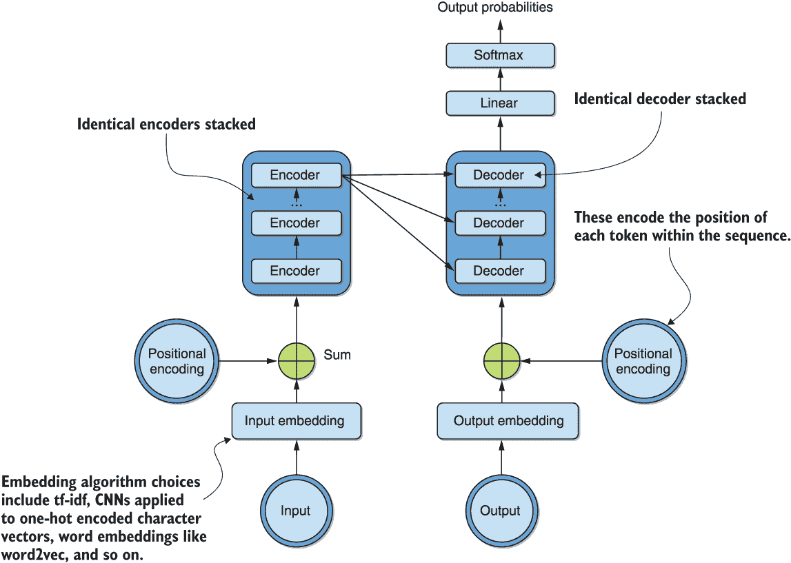

图 7.1：转换器架构的高级表示，显示堆叠的编码器、解码器、输入/输出嵌入和位置编码

我们从图中可以看到，在架构的编码或左侧上堆叠了相同的编码器。堆叠编码器的数量是一个可调的超参数，原始论文中使用了六个。同样，在解码或右侧上，堆叠了六个相同的解码器。我们还看到，使用所选的嵌入算法将输入和输出转换为向量。这可以是诸如 word2vec 的词嵌入算法，甚至可以是应用于使用 one-hot 编码的字符向量的类似于我们在前一章中遇到的那些卷积神经网络。此外，我们使用位置编码来编码输入和输出的顺序性。这使我们可以舍弃循环组件，同时保持顺序感知性。

每个编码器都可以粗略地分解为一个自注意层，紧随其后是一个前馈神经网络，如图 7.2 所示。

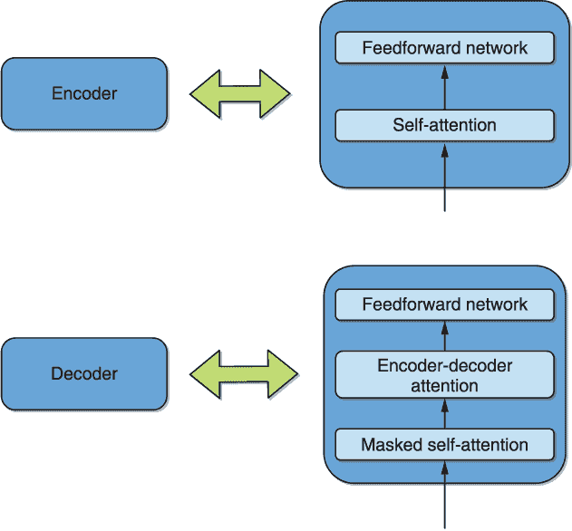

图 7.2 编码器和解码器的简化分解，包括自注意力、编码器-解码器注意力和前馈神经网络。

如图所示，每个解码器都可以类似地分解，增加了一个在自注意力层和前馈神经网络之间的编码器-解码器注意力层。需要注意的是，在解码器的自注意力中，在计算该标记的注意力时，“未来标记”会被“屏蔽”--我们将在更合适的时间回到这个问题。而自注意力学习其输入序列的每个部分与同一序列的每个其他部分之间的依赖关系，编码器-解码器注意力学习编码器和解码器输入之间的类似依赖关系。这个过程类似于注意力最初被用于序列到序列的循环翻译模型的方式。

图 7.2 中的自注意力层可以进一步细化为*多头注意力* -- 自注意力的多维模拟，可以带来更好的性能。我们将在接下来详细分析自注意力，并借此来介绍多头注意力。*bertviz*包⁷用于可视化目的，以提供进一步的见解。后来我们关闭这一章，通过 transformers 库加载一个代表性的 transformer 翻译模型，并使用它快速将几个英文句子翻译成低资源的加纳语 Twi。

### 7.1.1 对 transformers 库和注意力可视化的介绍

在我们详细讨论多头注意力各组件是如何工作之前，让我们以例句“他不想谈论手机上的细胞，因为他觉得这很无聊”进行可视化。这个练习也让我们介绍了 Hugging Face 的 transformers Python 库。进行这个过程的第一步是使用以下命令获取必要的依赖项：

```py
!pip install tensor2tensor
!git clone https:/ /github.com/jessevig/bertviz.git
```

注意：回想一下前面的章节，感叹号(!)只在 Jupyter 环境中执行时需要，比如我们推荐的 Kaggle 环境中。在通过终端执行时，它应该被去掉。

tensor2tensor 包含了 transformers 架构的原始作者实现，以及一些可视化工具。bertviz 库是这些可视化工具对 transformers 库中大量模型的扩展。注意，要渲染可视化内容需要激活 JavaScript（我们会在相关 Kaggle 笔记本中告诉你如何做）。

transformers 库可以通过以下方式安装：

```py
!pip install transformers
```

注意，它已经安装在 Kaggle 上的新笔记本中。

为了我们的可视化目的，我们看看了 BERT 编码器的自注意力。这可以说是基于 transformer 架构最流行的一种变体，类似于原始架构图 7.1 中编码器-解码器架构中的编码器。我们将在第 8.1 节的图 8.1 中明确可视化 BERT 体系结构。现在，您需要注意的是 BERT 编码器与 transformer 的编码器完全相同。

对于您想在 transformers 库中加载的任何预训练模型，需要使用以下命令加载标记器以及模型：

```py
from transformers import BertTokenizer, BertModel                                         ❶
model = BertModel.from_pretrained('bert-base-uncased', output_attentions=True)            ❷
tokenizer = BertTokenizer.from_pretrained('bert-base-uncased', do_lower_case=True)        ❸
```

❶ transformers BERT 标记器和模型

❷ 加载不区分大小写的 BERT 模型，确保输出注意力

❸ 加载不区分大小写的 BERT 标记器

请注意，我们在这里使用的不区分大小写的 BERT 检查点与我们在第三章（清单 3.7）中使用的相同，即当我们通过 TensorFlow Hub 首次遇到 BERT 模型时。

您可以对我们正在运行的示例句子进行标记化，将每个令牌编码为其在词汇表中的索引，并使用以下代码显示结果：

```py
sentence = "He didnt want to talk about cells on the cell phone because he considered it boring"
inputs = tokenizer.encode(sentence, return_tensors='tf', add_special_tokens=True)                            ❶
print(inputs)
```

❶ 将 return_tensors 更改为“pt”将返回 PyTorch 张量。

这产生以下输出：

```py
tf.Tensor(
[[  101  2002  2134  2102  2215  2000  2831  2055  4442  2006  1996  3526
   3042  2138  2002  2641  2009 11771   102]], shape=(1, 19), dtype=int32)
```

我们可以通过在`inputs`变量上执行以下代码轻松地返回一个 PyTorch 张量，只需设置`return_tensors='pt'`。要查看这些索引对应的标记，可以执行以下代码：

```py
tokens = tokenizer.convert_ids_to_tokens(list(inputs[0]))     ❶
print(tokens)
```

❶ 从输入列表的列表中提取批次索引 0 的示例

这产生以下输出：

```py
['[CLS]', 'he', 'didn', '##t', 'want', 'to', 'talk', 'about', 'cells', 'on', 'the', 'cell', 'phone', 'because', 'he', 'considered', 'it', 'boring', '[SEP]']
```

我们立即注意到，通过编码`inputs`变量时通过`add_special_tokens`参数请求的“特殊令牌”指的是此案例中的`'[CLS]'`和`'[SEP]'`令牌。前者表示句子/序列的开头，而后者表示多个序列的分隔点或序列的结束（如在此案例中）。请注意，这些是 BERT 相关的，您应该检查您尝试的每种新架构的文档以查看它使用的特殊令牌。我们从这次标记化练习中注意到的另一件事是分词是*次词*—请注意`didn`如何被分成`didn`和`##t`，即使没有撇号（’），我们刻意省略掉了。

让我们继续通过定义以下函数来可视化我们加载的 BERT 模型的自注意力层：

```py
from bertviz.bertviz import head_view                           ❶

def show_head_view(model, tokenizer, sentence):                 ❷
    input_ids = tokenizer.encode(sentence, return_tensors='pt', add_special_tokens=True)                                   ❸
    attention = model(input_ids)[-1]                            ❹
    tokens = tokenizer.convert_ids_to_tokens(list(input_ids[0]))    
    head_view(attention, tokens)                                ❺

show_head_view(model, tokenizer, sentence)                      ❻
```

❶ bertviz 注意力头可视化方法

❷ 功能用于显示多头注意力

❸ 一定要在 bertviz 中使用 PyTorch。

❹ 获取注意力层

❺ 调用内部 bertviz 方法来显示自注意力

❻ 调用我们的函数来渲染可视化

图 7.3 显示了我们示例句子的最终 BERT 层的自注意力可视化的结果。您应该使用可视化并滚动浏览各层各个词的可视化。注意，并非所有注意力可视化都像这个示例那样容易解释，这可能需要一些练习来建立直觉。

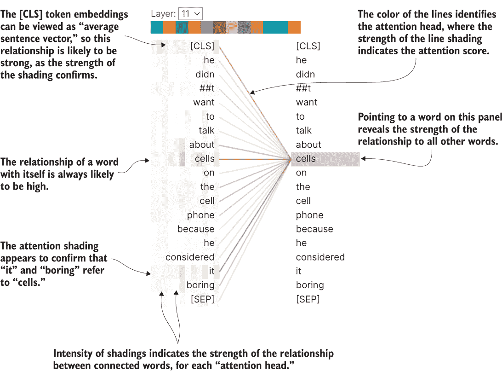

图 7.3 我们示例句子的预训练非大小写 BERT 模型的最终编码层中的自注意可视化。它显示“细胞”与“它”和“无聊”相关联。请注意，这是一个多头视图，每个单列中的阴影代表一个头。多头注意力在第 7.1.2 节中详细讨论。

就是这样！现在我们对自注意力的作用有了一定的了解，通过在图 7.3 中进行可视化，让我们进入它的数学细节。我们首先从下一小节中的自注意力开始，然后在之后将我们的知识扩展到完整的多头上下文中。

### 7.1.2 自注意力

再次考虑例句，“他不想谈论手机上的细胞，因为他认为这很无聊。”假设我们想弄清楚形容词“boring”描述的是哪个名词。能够回答这样的问题是机器需要具备的理解上下文的重要能力。我们知道它指的是“它”，而“它”指的是“细胞”，很自然。这在我们在图 7.3 中的可视化中得到了证实。机器需要被教会这种上下文意识。自注意力是在 transformers 中实现这一点的方法。当输入中的每个标记被处理时，自注意力会查看所有其他标记以检测可能的依赖关系。回想一下，在上一章中我们通过双向 LSTM 实现了相同的功能。

那么自注意力是如何实际工作以实现这一目标的呢？我们在图 7.4 中可视化了这个关键思想。在图中，我们正在计算单词“boring”的自注意力权重。在进一步详细说明之前，请注意一旦获取了各个单词的各种查询、键和值向量，它们就可以被独立处理。

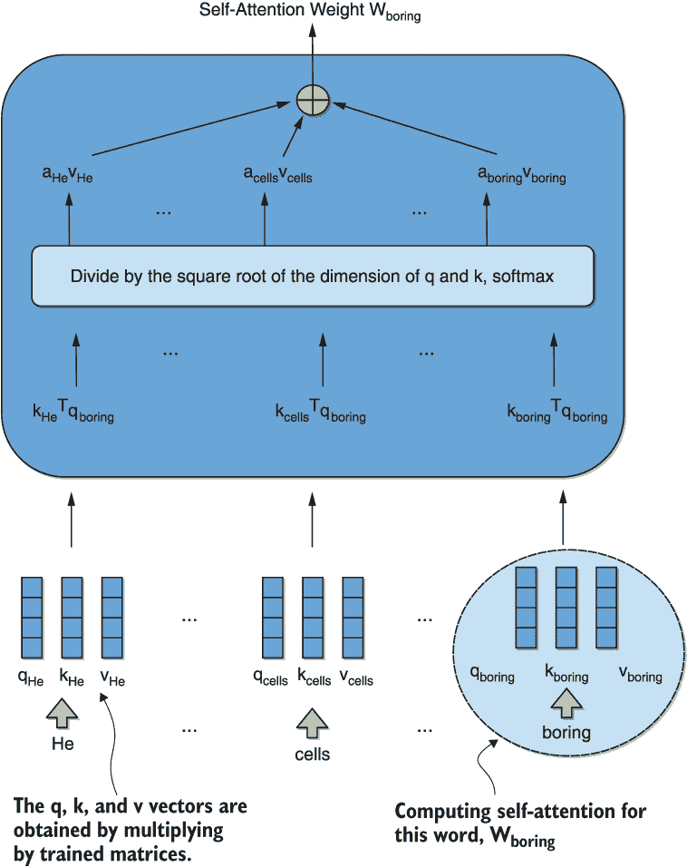

图 7.4 我们示例句子中单词“boring”的自注意力权重计算的可视化。请注意，一旦创建了键、值和查询向量，可以独立地计算这些单词的不同权重的计算。这是 transformers 在循环模型之上增加的可并行性的根源。注意系数是图 7.3 中多头注意力中任何给定列的阴影强度的可视化。

每个单词都与一个*查询*向量（q）、一个*键*向量（k）和一个*值*向量（v）相关联。这些向量是通过将输入嵌入向量与在训练过程中学习到的三个矩阵相乘得到的。这些矩阵在所有输入标记中都是固定的。如图所示，当前单词 "boring" 的查询向量与每个单词的键向量进行点积。结果被一个固定常数——键和值向量维度的平方根——进行缩放，并输入到一个 softmax 函数中。输出向量产生的注意力系数表示当前标记 "boring" 与序列中每个其他标记之间关系的强度。请注意，该向量的条目表示我们在图 7.3 中可视化的多头注意力中任何给定单列中阴影的强度。接下来，为了方便起见，我们重复了图 7.3，这样您就可以检查不同行之间阴影变化的可变性。

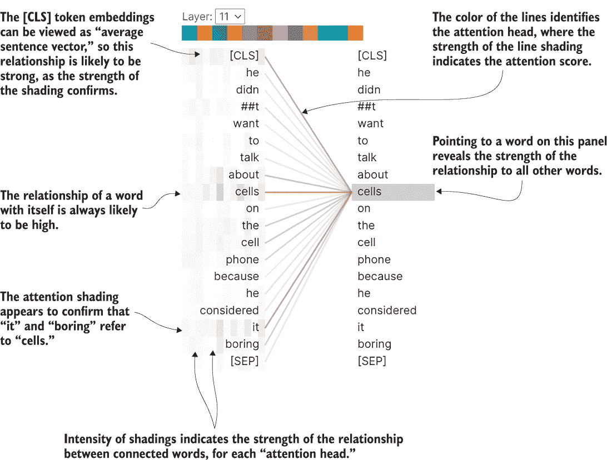

图 7.3（重复）预训练的不分大小写 BERT 模型在我们示例句子的最终编码层中的自注意可视化。它显示了 "cells" 与 "it" 和 "boring" 相关联。请注意，这是一个多头视图，每个单列中的阴影代表一个头。

现在我们有了足够的条件来理解为什么 transformers 比循环模型更具并行性。回想一下我们的介绍，不同单词的自注意力权重的计算可以在创建键、值和查询向量后独立进行。这意味着对于长输入序列，可以并行化这些计算。回想一下，循环模型本质上是顺序的——任何给定位置 `t` 处的内部隐藏状态取决于前一个位置 `t-1` 处的隐藏状态。这意味着无法在循环模型中并行处理长输入序列，因为步骤必须依次执行。另一方面，对于这样的输入序列，跨序列的并行化很快就会遇到 GPU 内存限制。transformers 模型比循环模型的另一个优势是由注意力可视化提供的增加的可解释性，比如图 7.3 中的可视化。

请注意，可以独立地计算序列中每个标记的权重，尽管通过键和值向量存在一些计算之间的依赖关系。这意味着我们可以使用矩阵对整体计算进行向量化，如图 7.5 所示。在该方程中，矩阵 Q、K 和 V 简单地是由查询、键和值向量堆叠在一起形成的矩阵。

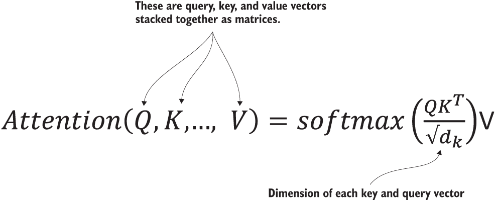

图 7.5 使用矩阵对整个输入序列进行向量化的自注意力计算

到底多头注意力有什么作用？既然我们已经介绍了自注意力，那么现在是一个很好的时机来解决这个问题。从单列的角度，我们已经将多头注意力隐式地作为自注意力的一般化呈现，如图 7.3 中的阴影部分，变为了多列。让我们思考一下，当我们寻找与“无聊”相关的名词时，我们具体做了什么。从技术上讲，我们是在寻找名词-形容词的关系。假设我们有一个跟踪这类关系的自注意力机制。如果我们还需要跟踪主-谓关系呢？还有其他可能的关系呢？多头注意力通过提供多个表示维度来解决这个问题，而不仅仅是一个。

### 7.1.3 残差连接、编码器-解码器注意力和位置编码

Transformer 是一种复杂的架构，具有许多特性，我们将不像自注意力那样详细介绍。精通这些细节对于您开始将 Transformer 应用于自己的问题并不是至关重要的。因此，我们在这里只是简要总结它们，并鼓励您随着获得更多经验和直觉的时间不断深入学习原始资源材料。

作为第一个这样的特性，我们注意到图 7.2 中简化的编码器表示中没有显示编码器中每个自注意层和接下来的规范化层之间的附加残差连接。这在图 7.6 中有所说明。

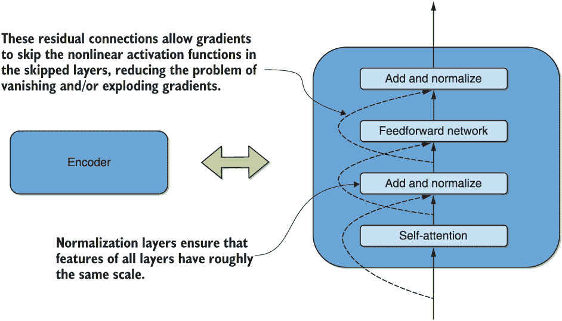

图 7.6 更详细和准确地拆分每个 Transformer 编码器，现在包括残差连接和规范化层

如图所示，每个前馈层在其后都有一个残差连接和一个规范化层。类似的说明也适用于解码器。这些残差连接使得梯度能够跳过层内的非线性激活函数，缓解了梯度消失和/或梯度爆炸的问题。简单地说，规范化确保所有层的输入特征的尺度大致相同。

在解码器端，回顾图 7.2 中编码器-解码器注意力层的存在，这一点我们还没有讨论到。接下来，我们复制图 7.2 并突出显示该层以方便您查看。

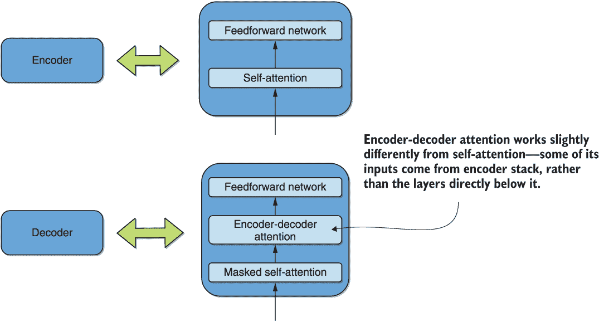

图 7.2（复制，突出显示编码器-解码器注意力）将编码器和解码器简化为自注意、编码器-解码器注意力和前馈神经网络的分解形式

它的工作方式类似于所描述的自我关注层。重要的区别在于，表示键和值的每个解码器的输入向量来自编码器堆栈的顶部，而查询向量来自直接位于其下面的层。如果您再次查看图 7.4，并记住这个更新后的信息，您应该会发现这种变化的效果是计算每个输出标记和每个输入标记之间的注意力，而不是像自我关注层的情况那样在输入序列的所有标记之间计算。接下来我们将复制图 7.4——稍作调整以适用于编码器-解码器注意力——让您自己看一看。

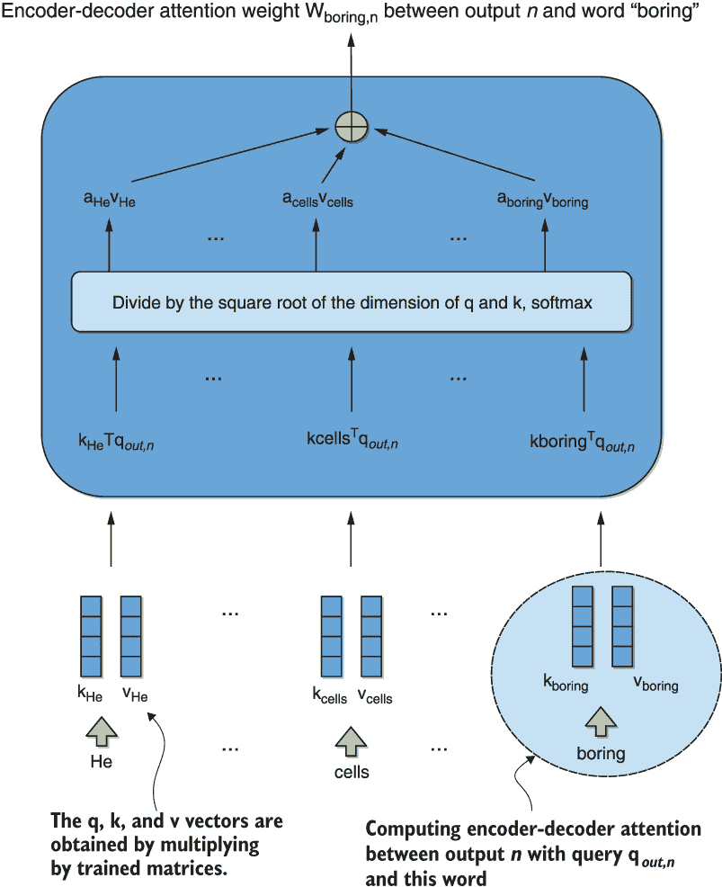

图 7.4（重复，稍作调整以计算编码器-解码器注意力）显示了我们的例句中单词“boring”和位置 n 处输出之间的编码器-解码器注意力权重计算的可视化。注意，一旦创建了键、值和查询向量，就可以独立地计算不同单词的这些权重。这是转换器相对于递归模型具有更高并行性的根源。

从图 7.1 中回顾一下，在编码器和解码器两侧都存在位置编码，我们现在对其进行解释。由于我们处理的是序列，因此对于每个序列中的每个标记建模和保留相对位置非常重要。到目前为止，我们对转换器操作的描述没有涉及“位置编码”，并且对输入的标记按顺序使用的顺序未定义。位置编码通过将等大小的向量添加到每个标记输入嵌入中来解决此问题，这些向量是该标记在序列中位置的特殊函数。作者使用了位置相关的正弦和余弦函数来生成这些位置嵌入。

这就是我们对转换器架构的阐述。为了让事情具体化，我们在本节中通过使用预训练的编码器-解码器模型将几个英语句子翻译为低资源语言来进行结论。

### 7.1.4 预训练编码器-解码器在翻译中的应用

本小节的目标是让您了解转换器库中提供的大量翻译模型。赫尔辛基大学语言技术研究组⁸提供了 1000 多个预训练模型。在撰写本文时，这些模型是许多低资源语言仅有的可用开源模型。在这里，我们以流行的加纳语 Twi 为例。它是在 JW300 语料库⁹上进行训练的，该语料库包含许多低资源语言的唯一现有平行翻译数据集。

不幸的是，JW300 是极具偏见的数据，是由耶和华见证人组织翻译的宗教文本。然而，我们的调查发现，这些模型作为进一步迁移学习和精炼的初始基线是相当不错的。我们在这里没有明确地在更好的数据上对基线模型进行改进，原因是数据收集的挑战和缺乏现有的合适数据集。然而，我们希望与下一章的倒数第二节一起来看——在那里我们将在单语特威语数据上对多语言 BERT 模型进行微调——您将获得一套强大的工具，用于进一步的跨语言迁移学习研究。

不多说了，让我们使用以下代码加载预训练的英语到特威语的翻译模型和分词器：

```py
from transformers import MarianMTModel, MarianTokenizer

model = MarianMTModel.from_pretrained("Helsinki-NLP/opus-mt-en-tw")
tokenizer = MarianTokenizer.from_pretrained("Helsinki-NLP/opus-mt-en-tw")
```

`MarianMTModel` 类是从 C++ 库 MarianNMT 移植而来的编码器-解码器 transformers 架构。¹⁰ 请注意，如果研究小组提供了相应的代码，你可以通过简单地更改语言代码 `en` 和 `tw` 来更改源语言和目标语言。例如，加载一个法语到英语的模型将会改变输入配置字符串为 `Helsinki-NLP/opus-mt-fr-en`。

如果我们在网上与加纳的朋友聊天，并想知道如何用介绍的方式写“我的名字是保罗”，我们可以使用以下代码计算并显示翻译：

```py
text = "My name is Paul"                                      ❶
inputs = tokenizer.encode(text, return_tensors="pt")          ❷
outputs = model.generate(inputs)                              ❸
decoded_output = [tokenizer.convert_ids_to_tokens(int(outputs[0][i])) for i in range(len(outputs[0]))]                               ❹
print("Translation:")                                         ❺
print(decoded_output)
```

❶ 输入要翻译的英语句子

❷ 将输入编码为标记 ID

❸ 生成输出的标记 ID

❹ 将输出的标记 ID 解码为实际输出标记

❺ 显示翻译

运行代码后得到的输出结果如下所示：

```py
Translation:
['<pad>', '▁Me', '▁din', '▁de', '▁Paul']
```

我们立即注意到的第一件事是输出中存在一个我们以前没有见过的特殊标记 `<pad>`，以及每个单词前面的下划线。这与第 7.1.1 节中 BERT 分词器产生的输出不同。技术原因是 BERT 使用了一个称为 WordPiece 的分词器，而我们这里的编码器-解码器模型使用了 SentencePiece。虽然我们在这里没有详细讨论这些分词器类型之间的差异，但我们利用这个机会再次警告您，务必查阅有关您尝试的任何新分词器的文档。

翻译“Me din de Paul”恰好是完全正确的。太好了！这并不太难，是吗？然而，对于输入句子“How are things?”的重复练习却得到了翻译“*Ɔ*kwan b*ɛ*n so na nne*ɛ*ma te saa?”，它直译成“事情是什么样的？”我们可以看到，虽然这个翻译的语义看起来很接近，但翻译是错误的。然而，语义相似性表明，该模型是一个很好的基线，如果有好的平行英文-特威语数据可用，可以通过迁移学习进一步改进。此外，将输入句子改写为“How are you?”则从这个模型得到了正确的翻译“Wo ho te d*ɛ*n?”。总的来说，这个结果是非常令人鼓舞的，我们希望一些读者受到启发，致力于将这些基线模型扩展到一些以前未解决的低资源语言的优秀开源转换器模型。

接下来，我们来看一下生成式预训练转换器（GPT），这是一种基于转换器的模型，用于文本生成，在自然语言处理（NLP）社区中变得非常有名。

## 7.2 生成式预训练转换器

生成式预训练转换器（Generative Pretrained Transformer）[¹¹]（GPT）是由 OpenAI 开发的，并且是最早将转换器架构应用于本书讨论的半监督学习场景的模型之一。通过这个，我们指的当然是在大量文本数据上无监督（或自监督）预训练语言理解模型，然后在最终感兴趣的目标数据上进行监督微调。作者发现在四种类型的语言理解任务上的性能得到了显著提升。这些任务包括自然语言推理、问答、语义相似度和文本分类。值得注意的是，在通用语言理解评估（GLUE）基准上的表现，该基准包括这些以及其他困难和多样化的任务，提高了超过 5 个百分点。

GPT 模型已经经历了几次迭代——GPT、GPT-2，以及最近的 GPT-3。事实上，在撰写本文时，GPT-3 恰好是已知的最大的预训练语言模型之一，具有 1750 亿个参数。它的前身 GPT-2 具有 15 亿个参数，在其发布的前一年也被认为是最大的。在 2020 年 6 月发布 GPT-3 之前，最大的模型是微软的图灵-NLG，该模型具有 170 亿个参数，并于 2020 年 2 月发布。在某些指标上的进展速度之快令人难以置信，并且这些记录很可能很快就会过时。事实上，当最初披露 GPT-2 时，作者认为不完全开源技术是正确的做法，考虑到可能会被恶意行为者滥用的潜力。

虽然在最初发布时，GPT 成为了大多数上述任务的最先进技术，但它通常更受青睐作为一种文本生成模型。与 BERT 及其衍生模型不同，后者已经主导了大多数其他任务，GPT 是以因果建模目标（CLM）进行训练的，其中预测下一个标记，而不是 BERT 的掩码语言建模（MLM）填空类型的预测目标，我们将在下一章更详细地介绍。

在下一小节中，我们简要描述了 GPT 架构的关键方面。接着介绍了 transformers 库中用于最常见任务的预训练模型的最小执行的*pipelines* API 概念。我们将此概念应用于 GPT 在其擅长的任务——文本生成方面。与前一节关于编码器-解码器 transformers 和翻译的内容一样，我们在此处不会明确地在更特定的目标数据上对预训练的 GPT 模型进行改进。然而，结合下一章的最后一节——我们在单语 Twi 数据上对多语言 BERT 模型进行微调——您将获得一套用于进一步文本生成迁移学习研究的强大工具。

### 7.2.1 架构概述

您可能还记得 7.1.1 节中我们可视化 BERT 自注意力的情况，BERT 本质上是原始编码器-解码器 transformers 架构的一组叠加编码器。从这个意义上讲，GPT 本质上是它的反义词，它将解码器堆叠起来。从图 7.2 中可以看出，除了编码器-解码器注意力之外，transformers 解码器的另一个显著特征是其自注意力层是“掩码的”，即在计算给定标记的注意力时，“未来标记”被“掩码”了。我们复制图 7.2 供您参考，突出显示此掩码层。

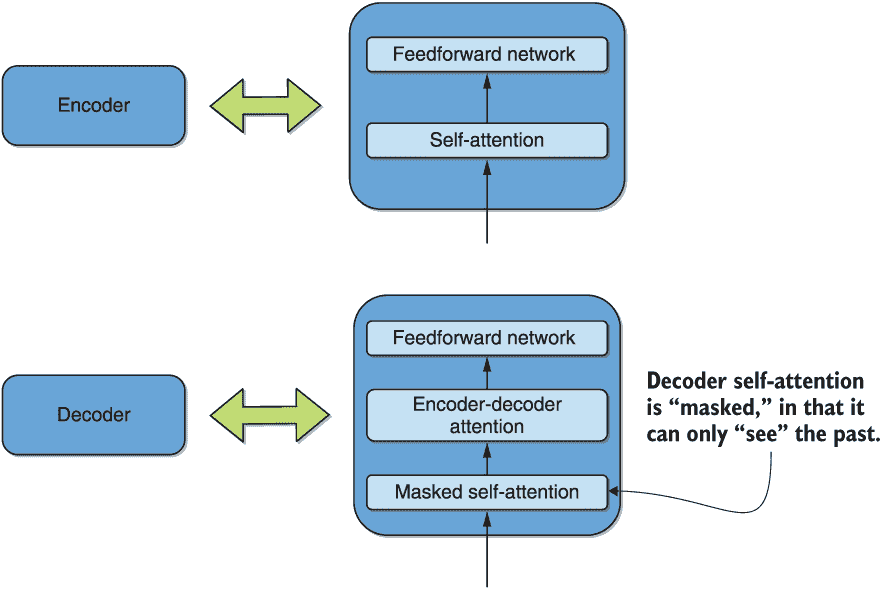

图 7.2（重复，突出显示掩码层）将编码器和解码器简化为自注意力、编码器-解码器注意力和前馈神经网络的分解形式

在我们在图 7.3 中经历的注意力计算中，这只意味着在计算中只包括“他不想谈论细胞”中的标记，并忽略其余的标记。我们稍后复制图 7.3，稍作修改，以便您清楚地看到未来标记被掩盖的情况。

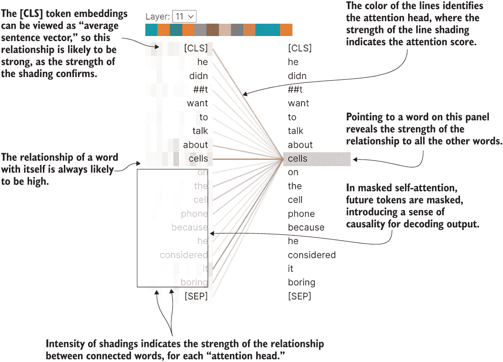

图 7.3（再次重复，为掩码自注意力修改）我们示例句子的掩码自注意力可视化，显示了因果关系中未来标记的被掩盖情况。

这为系统引入了因果关系的感觉，并适用于文本生成，或预测下一个标记。由于没有编码器，编码器-解码器注意力也被删除了。考虑到这些因素，我们在图 7.7 中展示了 GPT 的架构。

请注意图 7.7 中，同样的输出可以用于一些其他任务的文本预测/生成和分类。事实上，作者设计了一个输入转换方案，使得多个任务可以通过相同的架构处理，而不需要任何架构更改。例如，考虑到 *文本蕴涵* 任务，它大致对应于确定一个 *前提* 陈述是否暗示另一个 *假设* 陈述。输入转换会将前提和假设陈述连接起来，用一个特殊的分隔符标记分隔，然后将结果的单一连续字符串馈送到相同的未修改架构，以分类是否存在蕴涵。另一方面，考虑到重要的问答应用。在这里，给定一些上下文文档、一个问题和一组可能的答案，任务是确定哪个答案是问题的最佳潜在答案。在这里，输入转换是将上下文、问题和每个可能的答案连接在一起，然后通过相同的模型将每个结果的连续字符串传递，并对相应的输出执行 softmax，以确定最佳答案。类似的输入转换也适用于句子相似性任务。

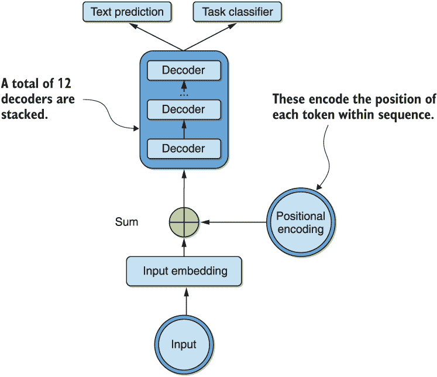

图 7.7 GPT 架构的高级表示，显示了堆叠的解码器、输入嵌入和位置编码。顶部的输出可以用于文本预测/生成和分类。

简要介绍了 GPT 的架构之后，让我们使用它的一个预训练版本进行一些有趣的编码实验。我们首先使用它生成一些开放式文本，给定一个提示。然后，在下一小节中，我们还将使用由微软构建的 GPT 的修改版本——DialoGPT¹²，来执行与聊天机器人的多轮对话。

### 7.2.2 转换器流水线介绍及应用于文本生成

在本小节中，我们将首先使用 GPT 生成一些开放式文本。我们还将利用这个机会介绍管道——一个 API，用于推断中暴露预训练模型在 transformers 库中的 API，甚至比我们在第 7.1.4 节中进行的翻译更简单。transformers 作者的声明目标是，这个 API 可以摒弃一些常用任务的复杂代码，包括命名实体识别、遮蔽语言建模、情感分析和问答。适合我们在本小节中的目的，文本生成也是一种选择。

让我们通过以下两行代码初始化转换器管道到 GPT-2 模型：

```py
from transformers import pipeline
gpt = pipeline('text-generation',model='gpt2')
```

提醒一下，GPT 最初的形式非常适合于开放式文本生成，比如创造性地写出一些文本段落来补充之前的文本。让我们看看当模型以“在彩虹的那边……”为提示，生成最多 100 个标记时，模型生成了什么，通过以下命令：

```py
gpt("Somewhere over the rainbow", max_length=100)
```

这生成了以下文本：

```py
[{'generated_text': "Somewhere over the rainbow people live! I wonder how they get to know each other... They just have a wonderful community out there - but when they see each other as two of the best in school they never even realize them, just love, family, friends, and friends. I'm really proud of their talent and dedication to life. I've seen a lot of people that were raised by their mother and grandma in the Midwest and didn't understand there was such an opportunity and I truly cannot"}]
```

即使消息有些不连贯，这似乎在语义上非常正确。您可以想象一位创意作家使用它来生成想法以克服写作困境！现在，让我们看看是否可以用一些不太“创意”的东西来启动模型，一些更技术性的东西，以查看它的表现。让我们通过以下代码将模型启动文本设置为“迁移学习是一门研究领域”：

```py
gpt("Transfer learning is a field of study", max_length=100)
```

这产生了以下输出：

```py
[{'generated_text': "Transfer learning is a field of study that has been around for centuries, and one that requires a thorough grounding in mathematics in order to understand the complexities of these systems. If you go to the library for your high school physics course, you know you're on the right track. The only problem with this position is that people don't ask questions. The only thing they really do ask is: how do we figure out how to apply these processes to the rest of physics and other sciences?\n\nIn"}]
```

再次，我们可以看到，从语义连贯性、语法结构、拼写、标点等方面来看，这段文字非常好——实际上，甚至有点诡异。然而，随着它的继续，它变得可能事实上不正确。我们都可以同意，要真正理解迁移学习，需要对数学有扎实的基础，甚至可以说它已经存在了几个世纪——通过我们，人类！然而，它不是物理学的一个领域，即使在需要掌握它的技能方面可能有些类似。我们可以看到，模型的输出允许它说话的时间越长，就越不可信。

请务必进行更多实验，以了解模型的优缺点。例如，您可以尝试使用我们的示例句子提示模型，“他不想在手机上谈论细胞，因为他认为这很无聊。”我们发现这在创意写作空间和技术写作空间中都是一个可信的应用，`max_length`设置为较小的数值。对许多作者来说，它已经是一个可信的辅助工具。在撰写本文时，我们只能想象 GPT-3 能够做到什么。未来确实非常令人兴奋。

玩弄文本生成后，让我们看看是否可以以某种方式使用它来创建聊天机器人。

### 7.2.3 聊天机器人的应用

直觉上应该能够无需对此应用进行重大修改即可采用 GPT。幸运的是，微软的人员已经通过模型 DialoGPT 完成了这一点，该模型最近也被包含在 transformers 库中。它的架构与 GPT 相同，只是增加了特殊标记，以指示对话中参与者的回合结束。在看到这样的标记后，我们可以将参与者的新贡献添加到启动上下文文本中，并通过直接应用 GPT 来生成聊天机器人的响应，迭代重复这个过程。自然地，预训练的 GPT 模型在会话文本上进行了微调，以确保响应是适当的。作者们使用 Reddit 主题进行了微调。

让我们继续构建一个聊天机器人吧！在这种情况下，我们不会使用管道，因为在撰写本文时，该模型尚未通过该 API 公开。这使我们能够对比调用这些模型进行推理的不同方法，这对你来说是一个有用的练习。

首先要做的事情是通过以下命令加载预训练模型和分词器：

```py
from transformers import GPT2LMHeadModel, GPT2Tokenizer      ❶
import torch                                                 ❷

tokenizer = GPT2Tokenizer.from_pretrained("microsoft/DialoGPT-medium")
model = GPT2LMHeadModel.from_pretrained("microsoft/DialoGPT-medium")
```

❶ 请注意，DialoGPT 模型使用 GPT-2 类。

❷ 我们在这里使用 Torch 而不是 TensorFlow，因为 transformers 文档中默认选择的是 Torch 平台。

此处值得强调几点。首先，请注意我们使用的是 GPT-2 模型类，这与我们先前讨论的 DialoGPT 作为该架构的直接应用是一致的。另外，请注意我们可以与这些 GPT 特定的模型类交换使用`AutoModelWithLMHead`和`AutoTokenizer`类。这些实用程序类会检测用于加载指定模型的最佳类别，例如，在这种情况下，它们将检测到最佳要使用的类别为`GPT2LMHeadModel`和`GPT2Tokenizer`。浏览 transformers 库文档时，你可能会遇到这些实用程序类，了解它们的存在对你的代码更一般化是有好处的。最后请注意，这里使用的是 GPT 的“LMHead”版本。这意味着从普通 GPT 得到的输出将通过一个线性层和一个归一化层，然后转换成一个维度等于词汇表大小的概率向量。最大值对应于模型正确训练的情况下下一个最有可能的令牌。

与我们加载的预训练 DialoGPT 模型进行对话的代码如列表 7.1 所示。我们首先指定最多五个回应的最大数量。然后，我们编码用户在每个轮次的对话，将对话添加到聊天历史记录中，并将其传递给加载的预训练 DialoGPT 模型，以生成下一个响应。

列表 7.1 与预训练 DialoGPT 模型进行对话，最多五个聊天机器人响应

```py
conversation_length = 5                                                                                           ❶
for step in range(conversation_length):
    new_user_inputs_ids = tokenizer.encode(input("User: ") + tokenizer.eos_token, return_tensors='pt')            ❷
    bot_input_ids = torch.cat([chat_history_ids, new_user_inputs_ids], dim=1)                                     ❸
     if step > 0 else new_user_inputs_ids   
    chat_history_ids = model.generate(bot_input_ids, max_length=1000, pad_token_id=tokenizer.eos_token_id)        ❹
    print("DialoGPT: {}".format(tokenizer.decode(chat_history_ids[:, bot_input_ids.shape[-1]:][0], skip_special_tokens=True)))               ❺
```

❶ 五行聊天

❷ 编码新用户输入，添加一个句子结束标记，并返回张量

❸ 将新输入添加到聊天历史记录中

❹ 使用聊天历史记录作为上下文生成最多 max_length 令牌的响应

❺ 显示响应

一个人可能整天都和这个机器人玩耍！我们很开心地向它提问各种问题，并以各种方式提示它。我们在这里包括了其中一个交流以供您娱乐：

```py
User: Hi there.
DialogGPT: Hi there.
User: How are you today?
DialogGPT: I'm good, how are you?
User: Good! How much money do you have?
DialogGPT: I have about 100k.
User: What will you spend it on?
DialogGPT: I'm not sure, I'm not sure what I want to spend it on.
User: Make a decision, life is short.
DialogGPT: I'm going to go with a lot of things.
```

接下来这短暂对话的另一端很可能是一个人，不是吗？那是否意味着它通过了图灵测试？并非如此，下面的交流说明了这一点：

```py
User: Hi robot.
DialogGPT: Hello, human.
User: Huh?
DialogGPT: I'm a bot.
User: OK, what is your name?
DialogGPT: Robot. I'm a robot.
User: All right then.
DialogGPT: Robot. I'm a robot.
User: Say something else.
DialogGPT: Robot. I'm a robot.
```

当你增加允许的对话轮次数量时，你会发现机器人会陷入重复的与话题无关的回复中。这类似于 GPT 开放式文本生成随着生成文本长度的增加变得更加荒谬。改善这一点的一个简单方法是保持固定的局部上下文大小，其中模型只受到该上下文内的对话历史的提示。当然，这意味着对话不总是考虑整个对话的上下文——这是必须对任何给定应用进行实验探索的一个权衡。

想象一下 GPT-3 在这些问题上的表现会有多好，是不是令人兴奋？在本书的最后一章中，我们将简要讨论更多关于 GPT-3 的细节，并介绍一个最近推出的更小但同样值得关注的开源替代品：EleutherAI 的 GPT-Neo。它已经可以在 transformers 库中使用，并且可以通过将 `model` 字符串设置为 EleutherAI 提供的模型名称之一来直接使用。[¹³]我们还附上了一个伴随笔记本，在其中展示了它在本章练习中的应用。经过检查，你应该会发现它的性能更好，但自然也会有显著更高的成本（最大模型的权重超过 10 GB！）。

在下一章中，我们将讨论 transformers 家族中可能最重要的成员——BERT。

## 总结

+   transformers 架构使用自注意力机制来构建文本的双向上下文。这使得它成为了近期在自然语言处理中占主导地位的语言模型。

+   transformers 允许对序列中的令牌进行独立处理。这比处理顺序的双向 LSTM 实现了更大的并行性。

+   transformers 是翻译应用的不错选择。

+   在训练过程中，生成预训练 transformers 使用因果建模目标。这使得它成为文本生成的首选模型，例如聊天机器人应用。

1. A. Vaswani 等人，“Attention Is All You Need”，NeurIPS（2017）。

2. A. Radford 等人，“通过生成预训练来改善语言理解”，arXiv（2018）。

3. M. E. Peters 等人，“BERT：用于语言理解的深度双向 transformers 的预训练”，NAACL-HLT（2019）。

4. [`github.com/google-research/bert/blob/master/multilingual.md`](https://github.com/google-research/bert/blob/master/multilingual.md)

5. A. Radford 等人，“通过生成预训练来改善语言理解”，arXiv（2018）。

6. A. Vaswani 等人，“Attention Is All You Need”，NeurIPS（2017）。

7. [`github.com/jessevig/bertviz`](https://github.com/jessevig/bertviz)

8. [`huggingface.co/Helsinki-NLP`](https://huggingface.co/Helsinki-NLP)

9. [`opus.nlpl.eu/JW300.php`](http://opus.nlpl.eu/JW300.php)

10. [`marian-nmt.github.io/`](https://marian-nmt.github.io/)

11. A. Radford 等人，“通过生成式预训练提高语言理解能力”，*arXiv*（2018）。

12. Y. Zhang 等人，“DialoGPT：面向对话回应生成的大规模生成式预训练”，*arXiv*（2019）。

13. [`huggingface.co/EleutherAI`](https://huggingface.co/EleutherAI)
