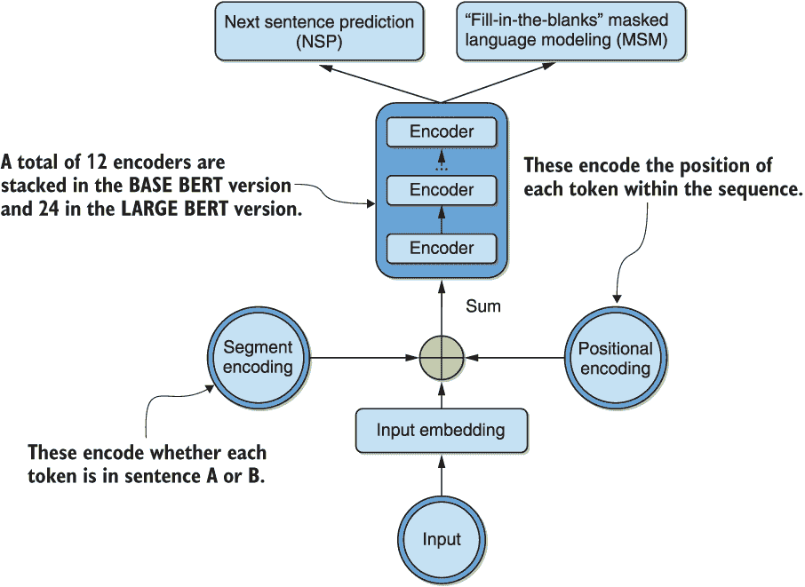
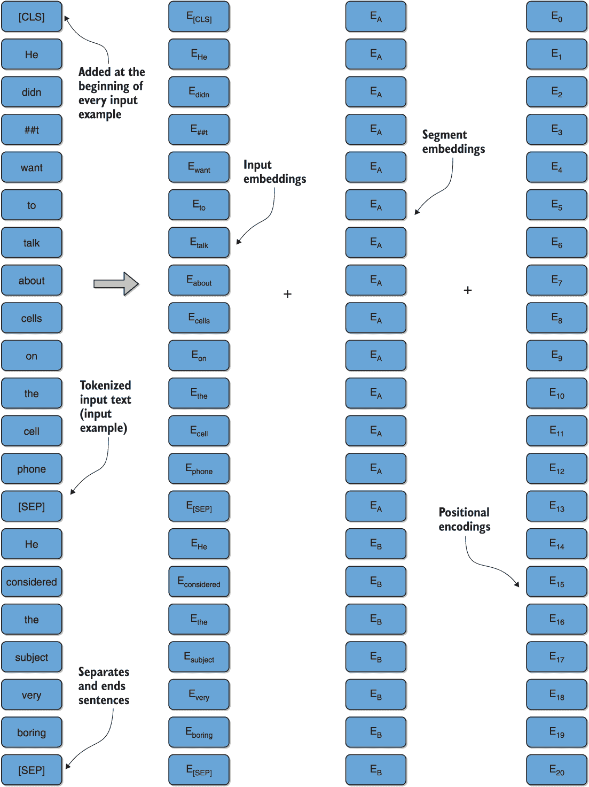

# 第八章：使用 BERT 和多语言 BERT 的 NLP 深度迁移学习

本章包括

+   使用预训练的双向编码器表示来自变换器（BERT）架构来执行一些有趣的任务

+   使用 BERT 架构进行跨语言迁移学习

在这一章和上一章，我们的目标是介绍一些代表性的深度迁移学习建模架构，这些架构依赖于最近流行的神经架构——*transformer*¹——来进行关键功能的自然语言处理（NLP）。这可以说是当今 NLP 中最重要的架构。具体来说，我们的目标是研究一些建模框架，例如生成式预训练变换器（GPT），² 双向编码器表示来自变换器（BERT），³ 和多语言 BERT（mBERT）。⁴ 这些方法使用的神经网络的参数比我们之前介绍的深度卷积和循环神经网络模型更多。尽管它们体积更大，但由于它们在并行计算架构上的比较效率更高，它们的流行度急剧上升。这使得实际上可以开发出更大更复杂的模型。为了使内容更易理解，我们将这些模型的覆盖分成两章/部分：我们在上一章中介绍了变换器和 GPT 神经网络架构，而在接下来的这章中，我们将专注于 BERT 和 mBERT。

作为提醒，BERT 是基于 transformer 的模型，我们在第三章和第七章中简要介绍过。它是使用*masked modeling objective*进行训练来填补空白。此外，它还经过了“下一个句子预测”任务的训练，以确定给定句子是否是目标句子后的合理跟随句子。mBERT，即“多语言 BERT”，实际上是针对 100 多种语言同时预训练的 BERT。自然地，这个模型特别适用于跨语言迁移学习。我们将展示多语言预训练权重检查点如何促进为初始未包含在多语言训练语料库中的语言创建 BERT 嵌入。BERT 和 mBERT 均由 Google 创建。

本章的第一节深入探讨了 BERT，并将其应用于重要的问答应用作为一个独立的示例。该章节通过实验展示了预训练知识从 mBERT 预训练权重转移到新语言的 BERT 嵌入的迁移。这种新语言最初并未包含在用于生成预训练 mBERT 权重的多语料库中。在这种情况下，我们使用加纳语 Twi 作为示例语言。

让我们在下一节继续分析 BERT。

## 8.1 双向编码器表示来自变换器（BERT）

在本节中，我们介绍了可能是最受欢迎和最具影响力的基于 Transformer 的神经网络架构，用于自然语言处理的迁移学习——双向编码器表示的 Transformer（BERT）模型，正如我们之前提到的，它也是以流行的*Sesame Street*角色命名的，向 ELMo 开创的潮流致敬。回想一下 ELMo 本质上就是 transformers 做的事情，但是使用的是循环神经网络。我们在第一章首次遇到了这两种模型，在我们对自然语言处理迁移学习历史的概述中。我们还在第三章中使用了它们进行了一对分类问题，使用了 TensorFlow Hub 和 Keras。如果您不记得这些练习，可能有必要在继续本节之前进行复习。结合上一章，这些模型的预览使您对了解模型的更详细功能处于一个很好的位置，这是本节的目标。

BERT 是早期预训练语言模型，开发于 ELMo 和 GPT 之后，但在普通语言理解评估（GLUE）数据集的大多数任务中表现出色，因为它是*双向训练*的。我们在第六章讨论了 ELMo 如何将从左到右和从右到左的 LSTM 组合起来实现双向上下文。在上一章中，我们还讨论了 GPT 模型的掩码自注意力如何通过堆叠 transformers 解码器更适合因果文本生成。与这些模型不同，BERT 通过堆叠 transformers 编码器而不是解码器，为每个输入标记*同时*实现双向上下文。回顾我们在第 7.2 节中对 BERT 每个层中的自注意力的讨论，每个标记的计算都考虑了两个方向上的每个其他标记。而 ELMo 通过将两个方向放在一起实现了双向性，GPT 是一种因果单向模型。BERT 每一层的同时双向性似乎给了它更深层次的语言上下文感。

BERT 是通过掩码语言建模（MLM）填空预测目标进行训练的。在训练文本中，标记被随机掩码，模型的任务是预测掩码的标记。为了说明，再次考虑我们示例句子的略微修改版本，“他不想在手机上谈论细胞，他认为这个话题很无聊。” 为了使用 MLM，我们可以将其转换为“他不想在手机上谈论细胞，一个[MASK]，他认为这个话题很无聊。” 这里的[MASK]是一个特殊标记，指示哪些词已被省略。然后，我们要求模型根据其在此之前观察到的所有文本来预测省略的词。经过训练的模型可能会预测掩码词 40%的时间是“conversation”，35%的时间是“subject”，其余 25%的时间是“topic”。在训练期间重复执行这个过程，建立了模型对英语语言的知识。

另外，BERT 的训练还使用了下一句预测（NSP）目标。在这里，训练文本中的一些句子被随机替换为其他句子，并要求模型预测句子 B 是否是句子 A 的合理续篇。为了说明，让我们将我们的示例句子分成两个句子：“他不想谈论手机上的细胞。他认为这个话题很无聊。” 然后我们可能删除第二个句子，并用略微随机的句子替换它，“足球是一项有趣的运动。” 一个经过适当训练的模型需要能够检测前者作为潜在的合理完成，而将后者视为不合理的。我们通过具体的编码练习示例来讨论 MLM 和 NSP 目标，以帮助您理解这些概念。

在下一小节中，我们简要描述了 BERT 架构的关键方面。我们接着介绍了将 transformers 库中的管道 API 概念应用于使用预训练 BERT 模型进行问答任务。我们随后通过示例执行填空 MLM 任务和 NSP 任务。对于 NSP 任务，我们直接使用 transformers API 来帮助您熟悉它。与上一章节类似，我们在这里没有明确地在更具体的目标数据上对预训练的 BERT 模型进行调优。然而，在本章的最后一节中，我们将在单语 Twi 数据上微调多语言 BERT 模型。

### 8.1.1 模型架构

您可能还记得第 7.1.1 节中我们可视化了 BERT 自注意力时，BERT 本质上是图 7.1 中原始编码器-解码器变换器架构的一组叠加编码器。BERT 模型架构如图 8.1 所示。



图 8.1 BERT 架构的高级表示，显示堆叠的编码器、输入嵌入和位置编码。顶部的输出在训练期间用于下一句预测和填空遮蔽语言建模目标。

正如我们在介绍中讨论的，并且如图所示，在训练期间，我们使用下一句预测（NSP）和遮蔽语言建模（MSM）目标。BERT 最初以两种风味呈现，BASE 和 LARGE。如图 8.1 所示，BASE 堆叠了 12 个编码器，而 LARGE 堆叠了 24 个编码器。与之前一样——在 GPT 和原始 Transformer 中——通过输入嵌入将输入转换为向量，并向它们添加位置编码，以给出输入序列中每个标记的位置感。为了考虑下一句预测任务，其中输入是句子 A 和 B 的一对，添加了额外的段编码步骤。段嵌入指示给定标记属于哪个句子，并添加到输入和位置编码中，以产生输入到编码器堆栈的输出。我们的示例句对的整个输入转换在图 8.2 中可视化：“他不想在手机上谈论细胞。他认为这个主题非常无聊。”



图 8.2 BERT 输入转换可视化

此时提到`[CLS]`和`[SEP]`特殊标记的简要说明值得一提。回想一下，`[SEP]`标记分隔句子并结束它们，如前几节所讨论的。另一方面，`[CLS]`特殊标记被添加到每个*输入示例*的开头。输入示例是 BERT 框架内部用来指代标记化的输入文本的术语，如图 8.2 所示。`[CLS]`标记的最终隐藏状态用作分类任务的聚合序列表示，例如蕴涵或情感分析。`[CLS]`代表“分类”。

在继续查看以下小节中使用一些这些概念的具体示例之前，请记得，在第三章中首次遇到 BERT 模型时，我们将输入首先转换为输入示例，然后转换为特殊的三元组形式。这些是*输入 ID*，*输入掩码*和*段 ID*。我们在这里复制了列表 3.8 以帮助你记忆，因为当时这些术语尚未被介绍。

列表 3.8（从第三章复制）将数据转换为 BERT 期望的形式，训练

```py
def build_model(max_seq_length):                                          ❶
    in_id = tf.keras.layers.Input(shape=(max_seq_length,), name="input_ids")
    in_mask = tf.keras.layers.Input(shape=(max_seq_length,), name="input_masks")
    in_segment = tf.keras.layers.Input(shape=(max_seq_length,), name="segment_ids")
    bert_inputs = [in_id, in_mask, in_segment]

    bert_output = BertLayer(n_fine_tune_layers=0)(bert_inputs)            ❷
    dense = tf.keras.layers.Dense(256, activation="relu")(bert_output)
    pred = tf.keras.layers.Dense(1, activation="sigmoid")(dense)

    model = tf.keras.models.Model(inputs=bert_inputs, outputs=pred)
    model.compile(loss="binary_crossentropy", optimizer="adam", metrics=["accuracy"])
    model.summary()

    return model

def initialize_vars(sess):                                                ❸
    sess.run(tf.local_variables_initializer())
    sess.run(tf.global_variables_initializer())
    sess.run(tf.tables_initializer())
    K.set_session(sess)

bert_path = "https:/ /tfhub.dev/google/bert_uncased_L-12_H-768_A-12/1"
tokenizer = create_tokenizer_from_hub_module(bert_path)                   ❹

train_examples = convert_text_to_examples(train_x, train_y)               ❺
test_examples = convert_text_to_examples(test_x, test_y)
# Convert to features
(train_input_ids,train_input_masks,train_segment_ids,train_labels) =       ❻
     convert_examples_to_features(tokenizer, train_examples,               ❻
     max_seq_length=maxtokens)                                             ❻
(test_input_ids,test_input_masks,test_segment_ids,test_labels) = 
     convert_examples_to_features(tokenizer, test_examples, 
     max_seq_length=maxtokens)

model = build_model(maxtokens)                                             ❼

initialize_vars(sess)                                                      ❽

history = model.fit([train_input_ids, train_input_masks, train_segment_ids], ❾
train_labels,validation_data=([test_input_ids, test_input_masks, 
test_segment_ids],test_labels), epochs=5, batch_size=32)
```

❶ 用于构建模型的函数

❷ 我们不重新训练任何 BERT 层，而是将预训练模型用作嵌入，并在其上重新训练一些新层。

❸ Vanilla TensorFlow 初始化调用

❹ 使用 BERT 源代码库中的函数创建兼容的分词器

❺ 使用 BERT 源代码库中的函数将数据转换为 InputExample 格式

❻ 将 InputExample 格式转换为三元 BERT 输入格式，使用 BERT 源存储库中的函数

❼ 构建模型

❽ 实例化变量

❾ 训练模型

如前一章节所述，输入 ID 只是词汇表中对应标记的整数 ID——对于 BERT 使用的 WordPiece 分词，词汇表大小为 30,000。由于变换器的输入长度是由列表 3.8 中的超参数 `max_seq_length` 定义的，因此需要对较短的输入进行填充，对较长的输入进行截断。输入掩码只是相同长度的二进制向量，其中 0 对应填充标记 (`[PAD]`)，1 对应实际输入。段 ID 与图 8.2 中描述的相同。另一方面，位置编码和输入嵌入由 TensorFlow Hub 模型在内部处理，用户无法访问。可能需要再次仔细阅读第三章才能充分理解这种比较。

尽管 TensorFlow 和 Keras 仍然是任何自然语言处理工程师工具箱中至关重要的组件——具有无与伦比的灵活性和效率——但 *transformers* 库无疑使这些模型对许多工程师和应用更加易于接近和使用。在接下来的小节中，我们将使用该库中的 BERT 应用于问题回答、填空和下一个句子预测等关键应用。

### 8.1.2 问题回答的应用

自然语言处理领域的开端以来，问题回答一直吸引着计算机科学家的想象力。它涉及让计算机在给定某些指定上下文的情况下自动回答人类提出的问题。潜在的应用场景仅受想象力限制。突出的例子包括医学诊断、事实检查和客户服务的聊天机器人。事实上，每当你在谷歌上搜索像“2010 年超级碗冠军是谁？”或“2006 年谁赢得了 FIFA 世界杯？”这样的问题时，你正在使用问题回答。

让我们更加仔细地定义问题回答。更具体地说，我们将考虑 *抽取式问题回答*，定义如下：给定上下文段落 p 和问题 q，问题回答的任务是产生 p 中答案所在的起始和结束整数索引。如果 p 中不存在合理的答案，系统也需要能够指示这一点。直接尝试一个简单的例子，如我们接下来使用预训练的 BERT 模型和 transformers pipelines API 做的，将帮助你更好地具体了解这一点。

我们从世界经济论坛⁵中选择了一篇有关口罩和其他封锁政策对美国 COVID-19 大流行的有效性的文章。我们选择文章摘要作为上下文段落。请注意，如果没有文章摘要可用，我们可以使用相同库中的摘要流水线快速生成一个。以下代码初始化了问答流水线和上下文。请注意，这种情况下我们使用了 BERT LARGE，它已经在斯坦福问答数据集（SQuAD）⁶上进行了微调，这是迄今为止最广泛的问答数据集。还请注意，这是 transformers 默认使用的任务，默认模型，我们不需要显式指定。但是，我们为了透明度而这样做。

```py
from transformers import pipeline

qNa= pipeline('question-answering', model= 'bert-large-cased-whole-word-masking-finetuned-squad', tokenizer='bert-large-cased-whole-word-masking-finetuned-squad')          ❶

paragraph = 'A new study estimates that if the US had universally mandated masks on 1 April, there could have been nearly 40% fewer deaths by the start of June. Containment policies had a large impact on the number of COVID-19 cases and deaths, directly by reducing transmission rates and indirectly by constraining people’s behaviour. They account for roughly half the observed change in the growth rates of cases and deaths.'
```

❶ 这些模型通常会被默认加载，但我们明确指出以保持透明度。使用已在 SQuAD 上进行了微调的模型非常重要；否则，结果将很差。

在初始化了流水线之后，让我们首先看看是否能够通过询问文章的主题来自动提取文章的精髓。我们用以下代码来实现：

```py
ans = qNa({'question': 'What is this article about?','context': f'{paragraph}'})
print(ans)
```

这产生了以下输出，我们可能会认为这是一个合理的回答：

```py
{'score': 0.47023460869354494, 'start': 148, 'end': 168, 'answer': 'Containment policies'}
```

注意，0.47 相对较低的分数表明答案缺少一些上下文。类似“遏制政策对 COVID-19 的影响”可能是更好的回答，但因为我们正在进行提取式问答，而这个句子不在上下文段落中，所以这是模型能做到的最好的。低分数可以帮助标记此回答进行人工双重检查和/或改进。

为什么不问一些更多的问题？让我们看看模型是否知道文章中描述的是哪个国家，使用以下代码：

```py
ans = qNa({'question': 'Which country is this article about?',
           'context': f'{paragraph}'})
print(ans)
```

这产生了以下输出，正如以前的分数约为 0.8 所示，完全正确：

```py
{'score': 0.795254447990601, 'start': 34, 'end': 36, 'answer': 'US'}
```

讨论的是哪种疾病？

```py
ans = qNa({'question': 'Which disease is discussed in this article?',
           'context': f'{paragraph}'})
print(ans)
```

输出完全正确，信心甚至比之前更高，达到了 0.98，如下所示：

```py
{'score': 0.9761025334558902, 'start': 205, 'end': 213, 'answer': 'COVID-19'}
```

那时间段呢？

```py
ans = qNa({'question': 'What time period is discussed in the article?',
           'context': f'{paragraph}'})
print(ans)
```

与输出相关联的 0.22 的低分数表明结果质量差，因为文章中讨论了 4 月至 6 月的时间范围，但从未在连续的文本块中讨论，可以为高质量答案提取，如下所示：

```py
{'score': 0.21781831588181433, 'start': 71, 'end': 79, 'answer': '1 April,'}
```

然而，仅选择一个范围的端点能力已经是一个有用的结果。这里的低分数可以提醒人工检查此结果。在自动化系统中，目标是这样的较低质量答案成为少数，总体上需要很少的人工干预。

在介绍了问答之后，在下一小节中，我们将解决 BERT 训练任务的填空和下一句预测。

### 8.1.3 应用于填空和下一句预测任务

我们在这一节的练习中使用了上一小节的文章。让我们立即开始编写一个用于填写空白的流程，使用以下代码：

```py
from transformers import pipeline

fill_mask = pipeline("fill-mask",model="bert-base-cased",tokenizer="bert-base-cased")
```

注意，在这里我们使用的是 BERT BASE 模型。这些任务对任何 BERT 模型的训练来说都是基本的，所以这是一个合理的选择，不需要特殊的微调模型。初始化适当的流程后，我们现在可以将它应用于上一小节中文章的第一句话。我们通过用适当的掩码标记`[MASK]`来删除“cases”这个词，并使用以下代码向模型提供已省略的词进行预测：

```py
fill_mask("A new study estimates that if the US had universally mandated masks on 1 April, there could have been nearly 40% fewer [MASK] by the start of June")
```

输出显示，最高的是“deaths”，这是一个可能合理的完成。即使剩下的建议也可以在不同的情境下起作用！

```py
[{'sequence': '[CLS] A new study estimates that if the US had universally mandated masks on 1 April, there could have been nearly 40% fewer deaths by the start of June [SEP]',
  'score': 0.19625532627105713,
  'token': 6209},
 {'sequence': '[CLS] A new study estimates that if the US had universally mandated masks on 1 April, there could have been nearly 40% fewer executions by the start of June [SEP]',
  'score': 0.11479416489601135,
  'token': 26107},
 {'sequence': '[CLS] A new study estimates that if the US had universally mandated masks on 1 April, there could have been nearly 40% fewer victims by the start of June [SEP]',
  'score': 0.0846652239561081,
  'token': 5256},
 {'sequence': '[CLS] A new study estimates that if the US had universally mandated masks on 1 April, there could have been nearly 40% fewer masks by the start of June [SEP]',
  'score': 0.0419488325715065,
  'token': 17944},
 {'sequence': '[CLS] A new study estimates that if the US had universally mandated masks on 1 April, there could have been nearly 40% fewer arrests by the start of June [SEP]',
  'score': 0.02742016687989235,
  'token': 19189}] 
```

我们鼓励你尝试从各种句子中省略各种单词，以确信这几乎总是非常有效的。在节省篇幅的情况下，我们的附带笔记本会为几个更多的句子做到这一点，但我们不在这里打印这些结果。

然后我们继续进行下一个句子预测（NSP）任务。在写作本文时，此任务尚未包含在 pipelines API 中。因此，我们将直接使用 transformers API，这也将让您更加熟悉它。我们首先需要确保已安装 transformers 3.0.0 以上的版本，因为该任务仅在该阶段的库中包含。我们使用以下代码实现这一点；在写作本文时，Kaggle 默认安装了较早的版本：

```py
!pip install transformers==3.0.1 # upgrade transformers for NSP
```

升级版本后，我们可以使用以下代码加载一个 NSP-specific BERT：

```py
from transformers import BertTokenizer, BertForNextSentencePrediction   ❶
import torch
from torch.nn.functional import softmax                                 ❷

tokenizer = BertTokenizer.from_pretrained('bert-base-cased')
model = BertForNextSentencePrediction.from_pretrained('bert-base-cased')
model.eval()                                                            ❸
```

❶ NSP-specific BERT

❷ 计算原始输出的最终概率

❸ PyTorch 模型默认是可训练的。为了更便宜的推断和可执行重复性，将其设置为“eval”模式，如此处所示。通过 model.train()将其设置回“train”模式。对于 TensorFlow 模型不适用！

作为健全性检查，首先我们要确定第一句和第二句是否从模型的角度来看是合理的完成。我们使用以下代码进行检查：

```py
prompt = "A new study estimates that if the US had universally mandated masks on 1 April, there could have been nearly 40% fewer deaths by the start of June."
next_sentence = "Containment policies had a large impact on the number of COVID-19 cases and deaths, directly by reducing transmission rates and indirectly by constraining people’s behavior."
encoding = tokenizer.encode(prompt, next_sentence, return_tensors='pt')
logits = model(encoding)[0]                                              ❶
probs = softmax(logits)                                                  ❷
print("Probabilities: [not plausible, plausible]")
print(probs)
```

❶ 输出是一个元组；第一项描述了我们追求的两个句子之间的关系。

❷ 从原始数字计算概率

注意代码中的术语`logits`。这是 softmax 函数的原始输入。通过 softmax 将`logits`传递，可以得到概率。代码的输出确认找到了正确的关系，如下所示：

```py
Probabilities: [not plausible, plausible]
tensor([[0.1725, 0.8275]], grad_fn=<SoftmaxBackward>)
```

现在，让我们将第二个句子替换为一个有点随机的“Cats are independent.” 这将产生以下结果：

```py
Probabilities: [not plausible, plausible]
tensor([0.7666, 0.2334], grad_fn=<SoftmaxBackward>)
```

看起来一切都如预期的那样工作！

现在，你应该已经非常清楚 BERT 在训练中解决哪些任务了。需要注意的是，本章我们还没有将 BERT 调整到任何新域或任务特定的数据上进行微调。这是有意为之的，以帮助你在没有任何干扰的情况下了解模型架构。在下一节中，我们会演示如何进行微调，通过进行跨语言迁移学习实验。对于我们已经介绍过的所有其他任务，都可以采用类似的迁移学习方式进行，通过完成下一节练习，您将有很好的发挥空间去自己实践。

## 8.2 基于多语言 BERT（mBERT）的跨语言学习

在本节中，我们将进行本书中第二个整体和第一个主要的跨语言实验。更具体地说，我们正在进行一个迁移学习实验，该实验涉及从多语言 BERT 模型中转移知识到其原始训练中不包含的语言。与之前一样，我们在实验中使用的语言将是 Twi 语，这是一种被认为是“低资源”的语言，因为缺乏多种任务的高质量训练数据。

多语言 BERT（mBERT）本质上是指应用前一节中所描述的 BERT，并将其应用于约 100 个连接在一起的语言维基百科⁷ 语料库。最初的语言集合是前 100 大维基百科，现已扩展到前 104 种语言。该语言集合不包括 Twi，但包括一些非洲语言，如斯瓦希里语和约鲁巴语。由于各种语言语料库的大小差异很大，因此会应用一种“指数平滑”过程来对高资源语言（如英语）进行欠采样，对低资源语言（如约鲁巴语）进行过采样。与之前一样，使用了 WordPiece 分词。对于我们而言，它足以提醒你，这种分词过程是子词级别的，正如我们在之前的章节中所看到的。唯一的例外是中文、日文的汉字和韩文汉字，它们通过在每个字符周围加上空格的方式被转换为有效的字符分词。此外，为了在精度和模型效率之间做出权衡选择，mBERT 作者消除了重音词汇。

我们可以直观地认为，一个在 100 多种语言上训练的 BERT 模型包含了可以转移到原始训练集中未包含的语言的知识。简单来说，这样的模型很可能会学习到所有语言中共同的特征。这种共同特征的一个简单例子是单词和动词-名词关系的概念。如果我们将提出的实验框架设定为多任务学习问题，正如我们在第四章中讨论的那样，我们期望对以前未见过的新场景的泛化性能得到改善。在本节中，我们将基本证明这一点。我们首先使用预训练的分词器将 mBERT 转移到单语 Twi 数据上。然后，我们通过从头开始训练相同的 mBERT/BERT 架构以及训练适当的分词器来重复实验。比较这两个实验将允许我们定性地评估多语言转移的有效性。我们为此目的使用 JW300 数据集的 Twi 子集⁸。

本节的练习对于你的技能集具有超越多语言转移的影响。这个练习将教会你如何从头开始训练你自己的分词器和基于 transformer 的模型。它还将演示如何将一个检查点转移到这样一个模型的新领域/语言数据。之前的章节和一点冒险/想象力将为你提供基于 transformer 的迁移学习超能力，无论是用于领域自适应、跨语言转移还是多任务学习。

在接下来的小节中，我们简要概述了 JW300 数据集，然后是执行跨语言转移和从头开始训练的小节。

### 8.2.1 JW300 数据集简介

JW300 数据集是一个面向低资源语言的广泛覆盖的平行语料库。正如之前提到的，它是一个可能具有偏见的样本，由耶和华见证人翻译的宗教文本组成。然而，对于许多低资源语言研究而言，它是一个起点，通常是唯一可用的平行数据的开放来源。然而，重要的是要记住这种偏见，并在这个语料库上进行任何训练时配备第二阶段，该阶段可以将第一阶段的模型转移到一个更少偏见和更具代表性的语言和/或任务样本。

尽管它本质上是一个平行语料库，但我们只需要 Twi 数据的单语语料库进行我们的实验。Python 包 opustools-pkg 可以用于获取给定语言对的平行语料库。为了让您的工作更容易，我们已经为英语-Twi 语对进行了这项工作，并将其托管在 Kaggle 上。⁹要为其他低资源语言重复我们的实验，您需要稍微调整一下*opustools-pkg*并获取一个等价的语料库（如果您这样做，请与社区分享）。我们只使用平行语料库的 Twi 部分进行我们的实验，并忽略英语部分。

让我们继续将 mBERT 转移到单语低资源语言语料库。

### 8.2.2 将 mBERT 转移到单语 Twi 数据与预训练的标记器

首先要做的是初始化一个 BERT 标记器到来自 mBERT 模型中的预训练检查点。这次我们使用的是大小写版本，如下代码所示：

```py
from transformers import BertTokenizerFast                                   ❶
tokenizer = BertTokenizerFast.from_pretrained("bert-base-multilingual-cased")❷
```

❶ 这只是 BertTokenizer 的一个更快的版本，你可以用这个替代它。

❷ 使用了预训练的 mBERT 标记器

准备好了标记器后，让我们按以下方法将 mBERT 检查点加载到 BERT 遮蔽语言模型中，并显示参数数量：

```py
from transformers import BertForMaskedLM                                  ❶

model = BertForMaskedLM.from_pretrained("bert-base-multilingual-cased")   ❷

print("Number of parameters in mBERT model:")
print(model.num_parameters())
```

❶ 使用了遮蔽语言建模

❷ 初始化到了 mBERT 检查点

输出表明模型有 1.786 亿个参数。

接下来，我们使用 transformers 附带的方便的 `LineByLineTextDataset` 方法，使用单语 Twi 文本的标记器来构建数据集，如下所示：

```py
from transformers import LineByLineTextDataset

dataset = LineByLineTextDataset(
    tokenizer=tokenizer,
    file_path="../input/jw300entw/jw300.en-tw.tw",
    block_size=128)                                  ❶
```

❶ 指示一次读取多少行

如下代码所示，接下来我们需要定义一个“data collator” —— 一个帮助方法，通过一批样本数据行（长度为`block_size`）创建一个特殊对象。 这个特殊对象适用于 PyTorch 进行神经网络训练：

```py
from transformers import DataCollatorForLanguageModeling

data_collator = DataCollatorForLanguageModeling(
    tokenizer=tokenizer,
    mlm=True, mlm_probability=0.15)                  ❶
```

❶ 使用了遮蔽语言建模，并以 0.15 的概率遮蔽单词

在这里，我们使用了遮蔽语言建模，就像前一节所描述的一样。在我们的输入数据中，有 15% 的单词被随机遮蔽，模型在训练期间被要求对它们进行预测。

定义标准的训练参数，比如输出目录和训练批量大小，如下所示：

```py
from transformers import TrainingArguments

training_args = TrainingArguments(
    output_dir="twimbert",
    overwrite_output_dir=True,
    num_train_epochs=1,
    per_gpu_train_batch_size=16,
    save_total_limit=1,
)
```

然后使用先前定义的数据集和数据收集器定义一个“训练器”来进行数据上的一个训练周期。注意，数据包含了超过 600,000 行，因此一次遍历所有数据是相当大量的训练！

```py
trainer = Trainer(
    model=model,
    args=training_args,
    data_collator=data_collator,
    train_dataset=dataset,
    prediction_loss_only=True)
```

训练并计算训练时间，如下所示：

```py
import time
start = time.time()
trainer.train()
end = time.time()
print("Number of seconds for training:")
print((end-start))
```

模型在所示的超参数下大约需要三个小时才能完成一个周期，并且损失大约为 0.77。

按如下进行模型保存：

```py
trainer.save_model("twimbert")
```

最后，我们从语料库中取出以下句子 —— “Eyi de *ɔ*haw k*ɛ*se baa sukuu h*ɔ*” —— 它的翻译是 “这在学校中提出了一个大问题。” 我们遮蔽了一个单词，sukuu（在 Twi 中意思是“学校”），然后应用 pipelines API 来预测遗漏的单词，如下所示：

```py
from transformers import pipeline

fill_mask = pipeline(                                 ❶
    "fill-mask",
    model="twimbert",
    tokenizer=tokenizer)

print(fill_mask("Eyi de ɔhaw kɛse baa [MASK] hɔ."))   ❷
```

❶ 定义了填空管道

❷ 预测被遮蔽的标记

这将产生如下输出：

```py
[{'sequence': '[CLS] Eyi de ɔhaw kɛse baa me hɔ. [SEP]', 'score': 0.13256989419460297, 'token': 10911}, {'sequence': '[CLS] Eyi de ɔhaw kɛse baa Israel hɔ. [SEP]', 'score': 0.06816119700670242, 'token': 12991}, {'sequence': '[CLS] Eyi de ɔhaw kɛse baa ne hɔ. [SEP]', 'score': 0.06106790155172348, 'token': 10554}, {'sequence': '[CLS] Eyi de ɔhaw kɛse baa Europa hɔ. [SEP]', 'score': 0.05116277188062668, 'token': 11313}, {'sequence': '[CLS] Eyi de ɔhaw kɛse baa Eden hɔ. [SEP]', 'score': 0.033920999616384506, 'token': 35409}]
```

你立刻就能看到结果中的宗教偏见。“以色列”和“伊甸园”被提议为前五个完成之一。话虽如此，它们算是比较有说服力的完成 —— 因为它们都是名词。总的来说，表现可能还算不错。

如果你不会说这种语言，不用担心。在下一节中，我们将从头开始训练 BERT，并将损失值与我们在这里获得的值进行比较，以确认我们刚刚执行的转移学习实验的功效。我们希望您能尝试在其他您感兴趣的低资源语言上尝试这里概述的步骤。

### 8.2.3 在单语 Twi 数据上从零开始训练的 mBERT 和分词器

要从头开始训练 BERT，我们首先需要训练一个分词器。我们可以使用下一节代码中的代码初始化、训练和保存自己的分词器到磁盘。

代码清单 8.1 从头初始化、训练和保存我们自己的 Twi 分词器

```py
from tokenizers import BertWordPieceTokenizer 

paths = ['../input/jw300entw/jw300.en-tw.tw']

tokenizer = BertWordPieceTokenizer()                                 ❶

tokenizer.train(                                                     ❷
    paths,
    vocab_size=10000,
    min_frequency=2,
    show_progress=True,
    special_tokens=["[PAD]", "[UNK]", "[CLS]", "[SEP]", "[MASK]"],   ❸
    limit_alphabet=1000,
    wordpieces_prefix="##")

!mkdir twibert                                                       ❹

tokenizer.save("twibert") 
```

❶ 初始化分词器

❷ 自定义训练，并进行训练

❸ 标准 BERT 特殊标记

❹ 将分词器保存到磁盘

要从刚刚保存的分词器中加载分词器，我们只需要执行以下操作：

```py
from transformers import BertTokenizerFast
tokenizer = BertTokenizerFast.from_pretrained("twibert", max_len=512)    ❶
```

❶ 使用我们刚刚训练的语言特定的分词器，max_len=512，以保持与上一小节一致

请注意，我们使用最大序列长度为 512，以保持与上一小节一致——这也是预训练的 mBERT 使用的长度。还要注意，保存分词器将在指定文件夹中创建词汇文件 vocab.txt 文件。

从这里开始，我们只需初始化一个全新的 BERT 模型来进行掩码语言建模，如下所示：

```py
from transformers import BertForMaskedLM, BertConfig
model = BertForMaskedLM(BertConfig())                  ❶
```

❶ 不要初始化为预训练的；创建一个全新的。

否则，步骤与上一小节相同，我们不在此处重复代码。重复相同的步骤在一个时代后大约 1.5 小时产生大约 2.8 的损失，并在两个时代后的大约 3 小时产生 2.5 的损失。这显然不如前一小节的 0.77 损失值好，证实了在那种情况下转移学习的功效。请注意，这次实验每个时代的时间较短，因为我们构建的分词器完全专注于 Twi，因此其词汇量比 104 种语言的预训练 mBERT 词汇表小。

去吧，改变未来！

## 摘要

+   transformer 架构使用自注意力机制来构建文本的双向上下文以理解文本。这使得它最近在 NLP 中成为主要的语言模型。

+   transformer 允许序列中的标记独立于彼此进行处理。这比按顺序处理标记的 bi-LSTM 实现了更高的可并行性。

+   transformer 是翻译应用的一个不错选择。

+   BERT 是一种基于 transformer 的架构，对于其他任务，如分类，是一个不错的选择。

+   BERT 可以同时在多种语言上进行训练，生成多语言模型 mBERT。该模型捕获的知识可转移到原本未包含在训练中的语言。

1. A. Vaswani 等人，“注意力就是一切”，NeurIPS (2017)。

2. A. Radford 等人，“通过生成式预训练改善语言理解”，arXiv (2018)。

3. M. E. Peters et al., “BERT: Pre-Training of Deep Bidirectional Transformers for Language Understanding,” Proc. of NAACL-HLT (2019): 4171-86.

4. [`github.com/google-research/bert/blob/master/multilingual.md`](https://github.com/google-research/bert/blob/master/multilingual.md)

5. [`www.weforum.org/agenda/2020/07/口罩命令和其他封锁政策减少了在美国的 COVID-19 传播`](https://www.weforum.org/agenda/2020/07/mask-mandates-and-other-lockdown-policies-reduced-the-spread-of-covid-19-in-the-us).

6. P. Rajpurkar et al., “SQuAD: 100,000+ Questions for Machine Comprehension of Text,” arXiv (2016).

7. [`github.com/google-research/bert/blob/master/multilingual.md`](https://github.com/google-research/bert/blob/master/multilingual.md)

8. [`opus.nlpl.eu/JW300.php`](http://opus.nlpl.eu/JW300.php)

9. [`www.kaggle.com/azunre/jw300entw`](https://www.kaggle.com/azunre/jw300entw)
