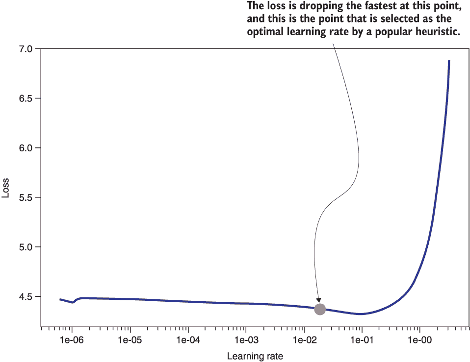
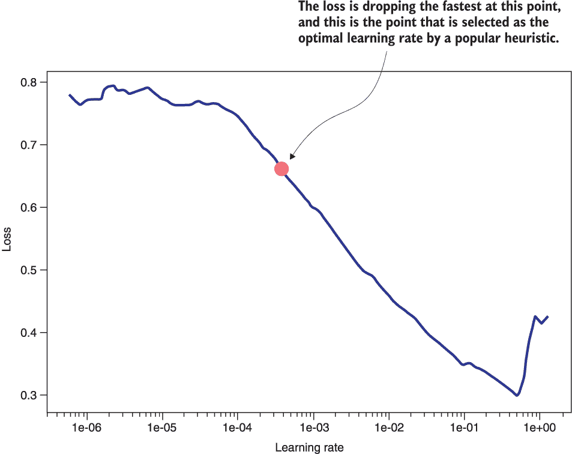
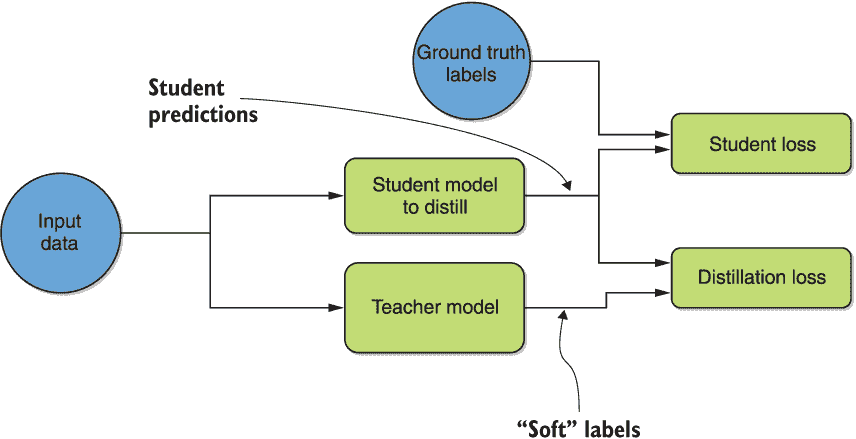

# 第九章：ULMFiT 和知识蒸馏适应策略

本章包括

+   实施*判别微调*和*逐步解冻*等策略。

+   在*教师*和*学生*BERT 模型之间执行*知识蒸馏*

在本章和下一章中，我们将介绍迄今为止已涵盖的深度*NLP*迁移学习建模架构的一些适应策略。换句话说，鉴于预训练架构如 ELMo、BERT 或 GPT，我们如何更有效地进行迁移学习？我们可以在这里采取几种效率措施。我们选择关注*参数效率*，即目标是在减少性能的同时产生尽可能少的参数模型。这样做的目的是使模型更小、更容易存储，从而更容易在智能手机设备上部署。另外，智能适应策略可能需要在某些困难的迁移情况下达到可接受的性能水平。

在第六章中，我们描述了 ULMFiT¹方法，即通用语言模型微调。该方法引入了*判别微调*和*逐步解冻*的概念。简而言之，逐步解冻逐渐增加网络中*解冻*或微调的子层的数量。另一方面，判别微调为网络中的每一层指定了可变的学习率，从而实现更有效的迁移。我们在第六章的代码中没有实施这些方法，因为作为适应策略，我们认为它们最适合放在本章中。在本章中，我们使用 ULMFiT 作者编写的*fast.ai*库来演示预训练的循环神经网络（RNN）语言模型的概念。

一些模型压缩方法通常被应用于大型神经网络以减小其大小。一些著名的方法包括权重修剪和量化。在这里，我们将重点关注适应策略，即*NLP*领域最近备受关注的*知识蒸馏*。该过程本质上试图使用显著较小的*学生*模型模拟来自较大的*教师*模型的输出。特别是，我们使用 transformers 库中的 DistilBERT²方法的实现来演示通过这种方法可以将 BERT 的大小减半以上。

让我们从下一节开始 ULMFiT。

## 9.1 逐步解冻和判别微调

在本节中，我们将在代码中实现 ULMFiT 方法，将语言模型适应于新的数据领域和任务。我们首先在第六章的最后讨论了这种方法的概念，因为从历史上看，它首先是在递归神经网络（RNNs）的背景下引入的。然而，我们将实际的编码练习推迟到现在，以强调在其核心，ULMFiT 是一组与架构无关的适应技术。这意味着它们也可以应用于基于 transformer 的模型。然而，为了与源材料保持一致，我们在 RNN-based 语言模型的背景下进行练习编码。我们将编码练习集中在我们在第六章中看到的假新闻检测示例上。

作为提醒，辨别微调指定网络中每一层的可变学习率。此外，学习率在学习过程中不是恒定的。相反，它们是*倾斜三角形*的——在开始时线性增加到一定程度，然后线性衰减。换句话说，这意味着快速增加学习率，直到达到最大速率，然后以较慢的速度减小。这个概念在图 6.8 中有所说明，我们在这里为了您的方便重复了它。


图 6.8（从第六章复制）建议的倾斜三角形 ULMFiT 学习率时间表，对于总迭代次数为 10,000 的情况。学习率在总迭代次数的 10%（即 1,000）上线性增加，最高达 0.01，然后线性减少到 0。

请注意，图中标有“最大学习率”的点在我们的情况下会有所不同（不是 0.01）。迭代的总数也将与图中显示的 10,000 次不同。这个时间表会产生更有效的转移和更具一般性的模型。

渐进解冻，另一方面，逐渐增加网络的子层的数量*解冻*，这样可以减少过拟合，同时也会产生更有效的转移和更具一般性的模型。所有这些技术在第六章的最后一节中都有详细讨论，可能在着手本节其余部分之前，简要回顾该讨论会有益处。

我们将在这里使用第 5.2 节的说明性示例——事实核查示例。回想一下，这个数据集包含超过 40,000 篇文章，分为两类：“假”和“真”。真实文章是从 reuters.com，一个声誉良好的新闻网站收集来的。另一方面，假文章则是从 PolitiFact 标记为不可靠的各种来源收集来的。在第 6.2 节，我们在预训练的 ELMo 模型导出的特征向量上训练了一个二元分类器。这个分类器预测一篇给定的文章是真实的（1）还是假的（0）。使用由每个类别的 1,000 篇文章组成的数据集，获得了 98%+ 的准确率。在这里，我们将看看是否可以通过 ULMFiT 方法取得更好的效果。

在本节中，我们将该方法分为两个小节。第一个小节涉及在目标任务数据上微调预训练语言模型的第一阶段 ULMFiT。斜三角形学习率在这里发挥作用，以及分层微调的概念。一些数据预处理和模型架构讨论也自然地融入到这个第一个小节中。第二个小节涵盖了第二阶段，涉及在目标任务数据上微调目标任务分类器——它位于微调语言模型之上——的阶段。逐步解冻程序的有效性由此得到证明。

请注意，本节中呈现的代码采用 fast.ai 版本 1 语法编写。选择这样做的原因是该库的第 2 版更改了输入数据的处理方式，提供了将其分割为训练集和验证集的内部函数，而不是允许您自己指定。为了与我们在前几章中的工作保持一致，在那里我们自己分割了数据，我们在这里坚持使用版本 1。我们还在 Kaggle 笔记本中提供了等效的 fast.ai 版本 2 语法代码³，您应该运行并与此处呈现的版本 1 代码进行比较。最后，请注意，版本 1 的文档托管在 [`fastai1.fast.ai/`](https://fastai1.fast.ai/)，而版本 2 的文档托管在 [`docs.fast.ai/`](https://docs.fast.ai/)。

### 9.1.1 预训练语言模型微调

第 5.2 节已经描述了我们需要对事实核查示例数据集进行的初始数据预处理步骤。特别地，我们对文章文本数据进行了洗牌，并将其加载到 NumPy 数组`train_x`和`test_x`中。我们还构建了相应的标签 NumPy 数组`train_y`和`test_y`，其中包含每篇文章是否为真实的信息，当文章为真时标记为 1，否则为 0。如同第 5.2 节一样，保持 1,000 个样本和测试/验证比例为 30%，得到的训练数组——`train_x`，`train_y`——长度为 1,400，测试数组——`test_x`，`test_y`——长度为 600。

我们需要做的第一件事是准备 fast.ai 库所期望的数据形式。其中一种数据格式是一个两列的 Pandas DataFrame，第一列包含标签，第二列包含数据。我们可以相应地构建训练和测试/验证数据框，如下所示：

```py
train_df = pd.DataFrame(data=[train_y,train_x]).T 
test_df = pd.DataFrame(data=[test_y,test_x]).T
```

这些数据框应该分别有 1,400 行和 600 行，每个都对应于相应数据样本中的每篇文章，并且在继续之前，最好用通常的`.shape`命令检查一下，如下所示：

```py
train_df.shape
test_df.shape
```

预期输出分别为`(1400, 2)`和`(600, 2)`。

fast.ai 中的数据使用`TextLMDataBunch`类进行消耗，这些实例可以使用我们刚刚准备的 DataFrame 格式构建，使用以下命令：

```py
data_lm = TextLMDataBunch.from_df(train_df = train_df, valid_df = test_df, path = "")
```

另一方面，fast.ai 中的数据由一个特定于任务的分类器使用`TextClasDataBunch`类进行消耗。我们构建此类的一个实例，准备进入下一小节，使用以下类似的命令从我们的数据框中：

```py
data_clas = TextClasDataBunch.from_df(path = "", train_df = train_df, valid_df = test_df, vocab=data_lm.train_ds.vocab)
```

现在我们准备在目标数据上微调我们的语言模型！为此，我们需要使用以下命令创建`language_model_learner` fast.ai 类的一个实例：

```py
learn = language_model_learner(data_lm, AWD_LSTM, drop_mult=0.3)     ❶
```

❶ 使用 30%的权重丢失率初始化预训练的权重丢失 LSTM。这是在 WikiText-103 基准数据集上预训练的。

这里，`AWD_LSTM`代表*ASGD 权重丢失 LSTM*。⁴这只是通常的 LSTM 架构，其中一些权重已被随机丢弃，就像通常的 dropout 层对神经网络激活所做的那样，与权重相反。这是最类似于 fast.ai 库中原始 ULMFiT 论文中所做的架构选择。此外，如果您检查上一个命令的执行日志，您应该能够确认它还从在 WikiText-103 基准数据集上训练的检查点加载预训练权重。⁶这个数据集，官方称为“WikiText 长期依赖语言建模数据集”，是一组由人类判断为“好”的维基百科文章。这是一个很好的、干净的无监督数据来源，已被许多自然语言处理论文用于基准测试。

现在我们已经加载了一个模型实例和一些预训练权重，我们将尝试确定用于微调语言模型的最佳或最优学习率。fast.ai 中一个称为`lr_find`的巧妙实用方法可以自动为我们完成这项工作。它会迭代一系列学习率，并检测结果损失与学习率曲线上损失函数下降最快的点。等价地，这是损失梯度最小的地方。⁷我们可以使用我们的语言模型学习器`learn`快速进行如下操作：

```py
learn.lr_find()                        ❶
learn.recorder.plot(suggestion=True)   ❷
```

❶ 寻找最佳/最优学习率

❷ 绘制它

结果的损失与学习率曲线，突出显示了最佳率，如图 9.1 所示。



图 9.1 fast.ai 库用于语言模型微调步骤中的最佳学习率找寻过程的结果，用于虚假新闻检测示例。通过多次迭代不同的学习率，并选择在曲线上损失下降最快的点作为最佳学习率。

我们可以通过以下命令程序化地检索这个学习率，并显示它：

```py
rate = learn.recorder.min_grad_lr    ❶
print(rate)                          ❷
```

❶ 检索最佳率

❷ 显示它

在我们执行代码时，返回的最佳学习率约为 4.0e-2。

找到最佳学习率后，我们现在可以使用下面的命令对我们的预训练的权重丢弃 LSTM 模型进行微调，使用 `fit_one_cycle` fast.ai 命令如下所示：

```py
learn.fit_one_cycle(1, rate)      ❶
```

❶ 这个命令在底层使用了斜三角形学习率。它以 epochs 的数量和期望的最大学习率作为输入。

执行命令，在单个 Kaggle GPU 上进行大约 26 秒的微调，得到了 0.334 的准确度。

获得了基准值后，我们想要找出是否差异化微调能够带来改善。我们首先通过使用 `unfreeze` 命令解冻所有层，然后使用 `slice` 方法指定学习率范围的上限和下限。这个命令将最接近输出的层的最大学习率设置为上限，并通过除以一个常数因子几何地减少每个后续层的最大学习率到下限。下面展示了执行这个操作的确切代码：

```py
learn.unfreeze()                               ❶
learn.fit_one_cycle(1, slice(rate/100,rate))   ❷
```

❶ 确保所有层都解冻以进行微调

❷ 在最终层中的最佳率和比该最佳率小两个数量级的值之间以几何方式变化

从代码可以看出，我们任意选择了将学习率从最大最优值变化到比该值小两个数量级的值。这个调度背后的直觉是，随后的层包含的信息更为一般化，与任务无关，因此它应该比最接近输出的层从这个特定目标数据集中学到的更少。

执行所提出的差异化微调代码，得到了一个准确度分数为 0.353，明显优于我们在没有使用它时得到的 0.334 的值。使用以下命令保存微调后的语言模型以供以后使用：

```py
learn.save_encoder('fine-tuned_language_model')
```

通过斜三角形学习率和差异化微调调整了我们的预训练语言模型后，让我们看看我们能得到多好的目标任务分类器——也就是虚假新闻检测器。我们在下一小节对微调后的语言模型之上微调一个分类器。

### 9.1.2 目标任务分类器微调

请回想在前一小节中，我们创建了一个用于目标任务分类器的数据消费对象。我们将这个变量称为`data_clas`。作为微调我们的目标任务分类器的下一步，我们需要实例化一个分类器学习器的实例，方法恰当地命名为`text_classifier_learner`，在 fast.ai 中。下面的代码完成了这一步：

```py
learn = text_classifier_learner(data_clas, AWD_LSTM, drop_mult=0.3)   ❶
learn.load_encoder('fine-tuned_language_model')                       ❷
```

❶ 实例化目标任务分类器学习的一个实例。使用我们微调过的语言模型相同的设置，因此我们可以无问题地加载。

❷ 载入我们微调过的语言模型

作为下一步，我们再次使用实用的 fast.ai 方法`lr_find`来找到最佳学习率，使用以下代码：

```py
learn.lr_find()                           ❶
learn.recorder.plot(suggestion=True)      ❷
```

❶ 寻找最佳速率

❷ 绘制它

执行该代码得到的是图 9.2 中显示的损失与学习率曲线。



图 9.2 从 fast.ai 库获取目标任务分类器微调步骤中用于找到最佳学习率的结果的过程。通过几个学习率进行迭代，并选择最佳学习率，即在曲线上损失下降最快的点。

我们看到最佳速率约为 7e-4。我们使用倾斜三角形学习率，通过以下代码对分类器学习器进行一轮训练：

```py
rate = learn.recorder.min_grad_lr      ❶
learn.fit_one_cycle(1, rate)           ❷
```

❶ 提取最佳的最大学习率

❷ 使用确定的最大学习率在倾斜三角形学习率计划中微调目标任务分类器

执行该代码得到的准确率约为 99.5%。这已经比我们在第六章（第 6.2 节）通过在 ELMo 嵌入之上训练分类器得到的 98%+的结果更好了。我们还能做些什么来进一步提高它呢？

幸运的是，我们还有一个底牌：渐进式解冻。再次提醒，这是当我们仅解冻一层，微调它，解冻一个额外的较低层，微调它，并重复此过程一定次数时。ULMFiT 的作者发现，在目标任务分类器阶段应用此方法显着改善了结果。举个简单的例子，要执行此过程直到 2 层深度，我们需要以下代码：

```py
depth = 2                           ❶
for i in range(1,depth+1):          ❷
    learn.freeze_to(-i)             ❸
    learn.fit_one_cycle(1, rate)    ❹
```

❶ 我们仅执行渐进式解冻，直到解冻两个层为止。

❷ 逐渐解冻更多层，首先一个，然后两个，每次使用倾斜三角形学习率进行一轮训练

❸ 此命令解冻了顶部 i 层。

❹ 执行一次倾斜三角形学习率，如已经介绍的

请注意，命令 `learn.freeze_to``(-i)` 冻结前 `i` 层对于本次操作至关重要。在我们对虚假新闻检测示例上执行代码时，我们发现在第一步中准确性达到了 99.8％，当解冻了前两层时，准确性达到了惊人的 100％。这些结果充分说明了自己，似乎表明 ULMFiT 方法是一套非常有用的技术。请注意，如果有必要，我们可以继续解冻更深层次的层次——第 3 层，第 4 层等等。

奇妙的事情！看来在我们适应新场景时，聪明地调整模型可以带来显著的好处！在接下来的章节中，我们将介绍另一种实现这一点的方法——知识蒸馏。

## 9.2 知识蒸馏

知识蒸馏是一种神经网络压缩方法，旨在教授一个较小的学生模型大型教师模型所包含的知识。这种方法近年来在 NLP 社区中变得流行，本质上是试图通过学生来模仿教师的输出。此方法也与模型无关——教师和学生可以是基于 transformers 的、基于循环神经网络的或其他结构，并且彼此之间可以完全不同。

在 NLP 领域中，对此方法的最初应用是由于对双向 LSTM（bi-LSTMs）的表示能力与基于 transformers 的架构之间的比较的疑问。⁸ 作者想要知道单个 bi-LSTM 层是否能够捕捉到 BERT 的多少信息。令人惊讶的是，研究人员发现，在某些情况下，预训练的基于 transformers 的语言模型的参数数量可以减少 100 倍，推理时间可以减少 15 倍，同时不损失标准性能指标。这是一个巨大的尺寸和时间上的减少，可以决定这些方法是否可以实际部署！知识蒸馏的过程在图 9.3 中简要概述。



图 9.3 是知识蒸馏的一般过程的示意图。教师模型产生的“软”标签被用于通过蒸馏损失鼓励学生模型表现出类似的行为。同时，学生损失被训练成与通过学生损失的标准地面真实情况行为类似。

如图所示，传统上，教师产生的标签被用于计算“软”标签，通过与学生的输出进行比较来确定蒸馏损失。这种损失促使学生模型跟踪教师模型的输出。此外，学生还通过学生损失同时学习“硬”的真实标签。我们将通过 Hugging Face 的 *transformers* 库来快速展示如何使用这个想法实现。

已经提出了几种架构来减小预训练的 NLP 语言模型的尺寸，包括 TinyBERT ⁹ 和 DistilBERT. ¹⁰ 我们选择专注于 DistilBERT，因为它在 transformers 库中已经准备就绪。 DistilBERT 是由 Hugging Face 开发的，这是与编写 transformers 库相同的团队。 与以前一样，我们对这个主题的覆盖并不意味着是全面的，而是举例说明。 在像这样快速发展的领域中保持进一步开发和文献的更新仍然很重要。 我们希望这里所呈现的内容能让您做到这一点。

DistilBERT 研究的目标是特别生成 BERT 模型的较小版本。 学生架构被选择为与 BERT 相同-在第 7 和第八章中描述的堆叠 transformers 编码器。 学生的层数减少了一半，只有六层的模型。 这是大部分尺寸节省的地方。 作者发现在这种框架中，内部隐藏维度的变化对效率几乎没有影响，因此，在教师和学生之间都是相似的。 过程的一个重要部分是将学生初始化到适当的一组权重，从中收敛会相对较快。 因为教师和学生的所有层的尺寸都是相似的，作者可以简单地使用对应层中的预训练教师权重来初始化学生，并发现这样做效果良好。

作者对 GLUE 等基准进行了广泛的实验证明，我们将在下一章中看到，并在 SQuAD 上进行了实验证明。 他们发现，由结果产生的 DistilBERT 模型在 GLUE 基准上的性能保持了 BERT 教师模型的 97% ，但参数个数只有教师的 40%. 它在 CPU 上的推理时间也快了 60%，而在 iPhone 等移动设备上快了 71%。 如您所见，这是一项明显的改进。

执行实际蒸馏的脚本可在官方 transformers 存储库中找到。¹¹ 要训练自己的 DistilBERT 模型，你需要创建一个每行一个文本样本的文件，并执行该页面提供的一系列命令，这些命令准备数据并蒸馏模型。因为作者已经提供了各种检查点可供直接加载——所有检查点都列在了该页面上——而我们的重点是迁移学习，我们在这里不重复从头开始训练的步骤。相反，我们使用了一个类似于我们在第八章中用于跨语言迁移学习实验的 mBERT 检查点。这样可以直接比较使用蒸馏架构与原始 mBERT 的性能和好处，同时还教会你如何开始在自己的项目中使用这个架构。这也为你提供了另一个机会，即在自定义语料库上微调预训练的基于 transformer 的模型——直接修改具有不同架构、预训练检查点和自定义数据集的代码应该适用于你自己的用例。

更具体地说，我们将重复我们在第 8.2.2 节中进行的实验，即通过在来自 JW300 数据集的语料库上进行微调，将 mBERT 中包含的知识转移到单语 Twi 场景中。我们执行使用检查点中包含的预训练 tokenizer 的实验变体，而不是从头开始训练一个新的，为了简单起见。

### 9.2.1 使用预训练 tokenizer 将 DistilmBERT 转移到单语 Twi 数据

在本小节中，我们的目标是从一个在超过 100 种语言上训练过的模型中生成一个用于加纳语 Twi 的 DistilBERT 模型，不包括 Twi 在内。BERT 的多语言等效版本称为 mBERT；因此，DistilBERT 的多语言等效版本可预见地称为 DistilmBERT。这个 DistilmBERT 模型直接类比于我们在第八章中实验过的 mBERT 模型。我们当时发现，即使 Twi 没有包含在原始训练中，从这个检查点开始是有益的。在这里，我们基本上会复制相同的步骤序列，将每个 mBERT 实例替换为 DistilmBERT。这样可以直接比较两者，并因此直观地了解知识蒸馏的好处，同时学习如何在自己的项目中使用 DistilBERT。与之前一样，我们会在 JW300 数据集的单语 Twi 子集上对模型进行微调。¹²

我们首先初始化一个 DistilBERT tokenizer，使用 DistilmBERT 模型的预训练检查点。这次我们使用 cased 版本，如下所示：

```py
from transformers import DistilBertTokenizerFast                                                           ❶
tokenizer = DistilBertTokenizerFast.from_pretrained("distilbert-base-multilingual-cased")                  ❷
```

❶ 这只是 DistilBertTokenizer 的一个更快的版本，你可以用它来代替。

❷ 使用预训练的 DistilmBERT tokenizer

准备好 tokenizer 后，将 DistilmBERT 检查点加载到 DistilBERT 掩码语言模型中，并按照以下方式显示参数的数量：

```py
from transformers import DistilBertForMaskedLM                                                         ❶

model = DistilBertForMaskedLM.from_pretrained("distilbert-base-multilingual-cased")                    ❷

print("Number of parameters in DistilmBERT model:")
print(model.num_parameters())
```

❶ 使用掩码语言建模

❷ 初始化为 mBERT 检查点

输出表明，与我们在第八章中发现的 BERT 模型的 178.6 百万个参数相比，该模型具有 1.355 亿个参数。 因此，DistilBERT 模型的大小仅为等效 BERT 模型的 76％。

接下来，使用 transformers 中方便的 `LineByLineTextDataset` 方法从单语 Twi 文本构建数据集，具体方法如下所示：

```py
from transformers import LineByLineTextDataset

dataset = LineByLineTextDataset(
    tokenizer=tokenizer,
    file_path="../input/jw300entw/jw300.en-tw.tw",    ❶
    block_size=128)                                   ❷
```

❶ 我们在第 8.2.1 节中介绍的英语到 Twi JW300 数据集

❷ 一次读取多少行

随后，按照下面的代码片段中所示的方式定义“数据集整理器”——这是一个帮助程序，它将一批样本数据行（长度为 `block_size`）创建成一个特殊对象，这个特殊对象可以被 PyTorch 用于神经网络训练：

```py
from transformers import DataCollatorForLanguageModeling

data_collator = DataCollatorForLanguageModeling(
    tokenizer=tokenizer,
    mlm=True, mlm_probability=0.15)        ❶
```

❶ 使用掩码语言建模，并掩码单词的概率为 0.15

在这里，我们使用了掩码语言建模的方法——将我们输入数据中的 15% 的单词随机掩码，要求模型在训练过程中进行预测。

接下来，按照以下方式定义标准的训练参数，例如输出目录（我们选择为 `twidistilmbert`）和训练批次大小：

```py
from transformers import TrainingArguments

training_args = TrainingArguments(
    output_dir="twidistilmbert",
    overwrite_output_dir=True,
    num_train_epochs=1,
    per_gpu_train_batch_size=16,
    save_total_limit=1,
)
```

然后，使用已定义的数据集和数据整理器定义“训练器”，并在数据上进行一个训练时代，具体方法如下。请记住，Twi 数据包含超过 600,000 行，因此在所有数据上进行一遍训练是相当费力的！

```py
trainer = Trainer(
    model=model,
    args=training_args,
    data_collator=data_collator,
    train_dataset=dataset,
    prediction_loss_only=True)
```

最后，按照以下方式进行训练并计算训练所需的时间：

```py
import time
start = time.time()
trainer.train()
end = time.time()
print("Number of seconds for training:")
print((end-start))
```

一如既往地，一定要保存模型：

```py
trainer.save_model("twidistilmbert")
```

我们发现，与第八章中等效教师完成每个时代所需的 3 小时相比，该模型花费了大约 2 小时和 15 分钟完成该时代。 因此，学生的训练时间只有老师的 75％。 显著提高！

此外，损失函数的值达到了约 0.81，而 mBERT 的等效模型在第八章中的损失为约 0.77。就绝对值而言，性能差异可以粗略地量化为大约 5％——我们看到 DistilBERT 达到了 BERT 性能的 95％。 这非常接近 DistilBERT 作者在论文中报告的基准数字 97％。

最后一步，从语料库中取出以下句子：“Eyi de *ɔ*haw k*ɛ*se baa sukuu h*ɔ。” 掩盖一个单词，sukuu（在 Twi 中表示“学校”），然后将管道 API 应用于以下预测所删除的单词：

```py
from transformers import pipeline

fill_mask = pipeline(                                ❶
    "fill-mask",
    model="twidistilmbert",
    tokenizer=tokenizer)

print(fill_mask("Eyi de ɔhaw kɛse baa [MASK] hɔ."))   ❷
```

❶ 定义了填空管道

❷ 预测掩码标记

这会产生以下输出：

```py
[{'sequence': '[CLS] Eyi de ɔhaw kɛse baa fie hɔ. [SEP]', 'score': 0.31311026215553284, 'token': 29959}, {'sequence': '[CLS] Eyi de ɔhaw kɛse baa me hɔ. [SEP]', 'score': 0.09322386980056763, 'token': 10911}, {'sequence': '[CLS] Eyi de ɔhaw kɛse baa ne hɔ. [SEP]', 'score': 0.05879712104797363, 'token': 10554}, {'sequence': '[CLS] Eyi de ɔhaw kɛse baa too hɔ. [SEP]', 'score': 0.052420321851968765, 'token': 16683}, {'sequence': '[CLS] Eyi de ɔhaw kɛse baa no hɔ. [SEP]', 'score': 0.04025224596261978, 'token': 10192}]
```

这确实是可信的完成。值得注意的是，我们在第 8.2.2 节中看到的结果中的宗教偏见似乎已经在模型中得到了缓解。像“以色列”和“伊甸园”这样的完成，在第 8.2.2 节的 mBERT 等价模型中建议，现在已经不再存在了。这可以通过两者之间参数数量的显著差异来解释。由于这一点，DistilBERT 不太可能过拟合，而 BERT 则更有可能这样做。

现在你知道如何在自己的项目中使用 DistilBERT 了！我们再次强调，你刚刚进行的练习教会了你如何在自定义语料库上微调预训练的基于 transformer 的模型——只需修改代码以应用于你自己的用例，包括不同的架构、预训练检查点和自定义数据集。

在下一章的第一节中，我们将有机会在英语中再次微调一个基于 transformer 的模型，这次是在自定义语料库上进行！我们将讨论 ALBERT 架构背后的适应性思想——一种轻量级的 BERT——并将其微调到来自 Multi-Domain Sentiment Dataset 的一些评论中。回想一下，在第四章我们玩过这个数据集。这是亚马逊 25 个产品类别的评论数据集，我们将重点关注书评，就像第四章一样。

## 摘要

+   ULMFiT 的策略，如倾斜三角形学习率、*差异微调*和*逐步解冻*，可以导致明显更有效的迁移。

+   执行*知识蒸馏*一个较大的*教师*BERT 模型会产生一个明显*更小的学生*BERT 模型，性能损失最小。

1. [`nlp.fast.ai/ulmfit`](http://nlp.fast.ai/ulmfit)

2. V. Sanh 等人，“DistilBERT，BERT 的精简版本：更小、更快、更便宜、更轻”，EMC²：与 NeurIPS 合办的第 5 版（2019 年）。

3. [`www.kaggle.com/azunre/tlfornlp-chapter9-ulmfit-adaptation-fast-aiv2`](https://www.kaggle.com/azunre/tlfornlp-chapter9-ulmfit-adaptation-fast-aiv2)

4. S. Merity 等人，“正则化和优化 LSTM 语言模型”，ICLR（2018 年）。

5. [`nlp.fast.ai/ulmfit`](http://nlp.fast.ai/ulmfit)

6. [`www.salesforce.com/ca/products/einstein/ai-research/the-wikitext-dependency-language-modeling-dataset/`](https://www.salesforce.com/ca/products/einstein/ai-research/the-wikitext-dependency-language-modeling-dataset/)

7. L. Smith 等人，“神经网络超参数的一种纪律方法：第一部分——学习率、批大小、动量和权重衰减”，arXiv（2018 年）。

8. R. Tang 等人，“从 BERT 中提炼任务特定知识到简单神经网络”，arXiv（2018 年）。

9. X. Jiao 等人，“TinyBERT：BERT 的精炼”，arXiv（2020 年）。

10. V. Sanh 等人，“DistilBERT，BERT 的精简版本：更小、更快、更便宜、更轻”，EMC²：与 NeurIPS 合办的第 5 版（2019 年）。

11. [`github.com/huggingface/transformers/blob/master/examples/research_projects/distillation`](https://github.com/huggingface/transformers/blob/master/examples/research_projects/distillation)

12. [`opus.nlpl.eu/JW300.php`](http://opus.nlpl.eu/JW300.php)

13. [`www.cs.jhu.edu/~mdredze/datasets/sentiment/`](https://www.cs.jhu.edu/~mdredze/datasets/sentiment/)
