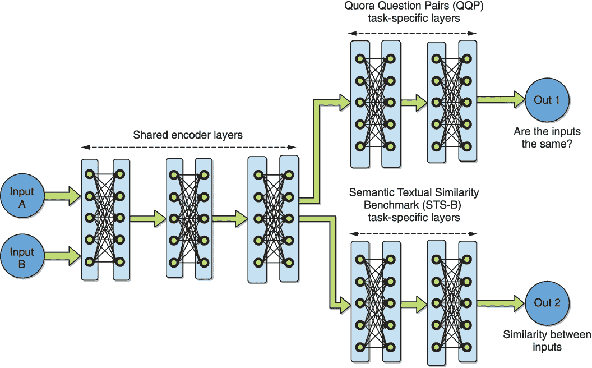
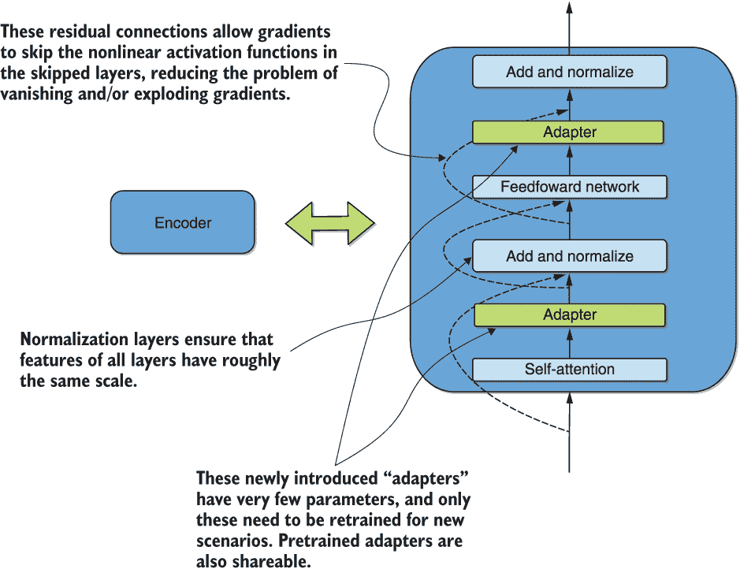

# 第十章：ALBERT，适配器和多任务适配策略

本章介绍

+   对嵌入因子分解和层间参数共享进行应用

+   在多个任务上对 BERT 系列模型进行微调

+   将迁移学习实验分成多个步骤

+   对 BERT 系列模型应用适配器

在上一章中，我们开始介绍了到目前为止我们所涵盖的深度 NLP 迁移学习建模架构的一些适配策略。换句话说，给定一个预训练的架构，如 ELMo、BERT 或 GPT，如何更有效地进行迁移学习？我们涵盖了 ULMFiT 方法背后的两个关键思想，即*区分性微调*和*逐渐解冻*的概念。

我们在本章中将要讨论的第一个适配策略围绕着两个目标展开，旨在创建更有利于具有更大词汇量和更长输入长度的基于 transformer 的语言模型。第一个想法实质上涉及巧妙的因子分解，或者将更大的权重矩阵分解为两个较小的矩阵，使您可以增加一个的维度而不影响另一个的维度。第二个想法涉及在所有层之间共享参数。这两个策略是 ALBERT 方法的基础，即 A Lite BERT。我们使用 transformers 库中的实现来获得这种方法的一些实际经验。

在第四章中，我们介绍了多任务学习的概念，即模型被训练为同时执行多种任务。由此产生的模型通常对新场景更具泛化能力，并且可能导致更好的迁移效果。毫不奇怪，这个想法在预训练的 NLP 语言模型的适配策略的背景下再次出现。当面临转移场景时，没有足够的训练数据来微调给定任务时，为什么不在多个任务上进行微调呢？讨论这个想法为介绍(GLUE)数据集提供了一个很好的机会：一个包含了几个代表人类语言推理任务的数据集。这些任务包括检测句子之间的相似性、问题之间的相似性、释义、情感分析和问答。我们展示了如何利用 transformers 库快速进行多任务微调使用这个数据集。这个练习还演示了如何在一个来自这些重要问题类别的自定义数据集上类似地微调 BERT 系列模型。

在第四章中，我们还讨论了领域自适应，在那里我们发现源域和目标域的相似性对于迁移学习的有效性起着至关重要的作用。更大的相似性通常意味着更容易的迁移学习过程。当源和目标过于不相似时，你可能会发现在一个步骤中执行该过程是不可能的。在这种情况下，可以使用“**顺序适应**”的概念将整体所需的转移分解成更简单、更易管理的步骤。例如，一个语言工具在西非和东非之间无法转移，但可以先在西非和中非之间成功转移，然后在中非和东非之间转移成功。在本章中，我们将“填空”目标预训练 BERT 顺序适应到一个低资源句子相似度检测场景中，首先适应到一个数据丰富的问题相似度场景。

我们将探讨的最终适应策略是使用所谓的*适应模块*或*适配器*。这些是预训练神经网络层之间只有少量参数的新引入模块。对于新任务微调这个修改后的模型只需要训练这几个额外的参数。原始网络的权重保持不变。通常情况下，当每个任务只增加 3-4% 的额外参数时，与微调整个模型相比，性能几乎没有损失。这些适配器也是模块化的，并且很容易在研究人员之间共享。

## 10.1 嵌入因子分解和跨层参数共享

我们在本节讨论的适应策略围绕着两个想法，旨在创建具有更大词汇表和更长最大输入长度的基于 transformer 的语言模型。第一个想法基本上涉及将一个更大的权重矩阵巧妙地分解为两个较小的矩阵，使得其中一个可以在不影响另一个维度的情况下增加维度。第二个想法涉及在所有层之间共享参数。这两种策略是 ALBERT 方法的基础。我们再次使用 transformers 库中的实现来获取一些与该方法有关的实际经验。这既可以让你对所获得的改进有所了解，也可以让你有能力在自己的项目中使用它。我们将使用第四章中的 Multi-Domain Sentiment Dataset 中的亚马逊图书评论作为我们这次实验的自定义语料库。这将使您能够进一步体验在自定义语料库上微调预训练的基于 transformer 的语言模型，这次是用英语！

第一个策略，即嵌入因子分解，受到了观察的启发，即在 BERT 中，输入嵌入的大小与其隐藏层的维度密切相关。分词器为每个标记创建一个 one-hot 编码的向量——该向量在与标记对应的维度上等于 1，在其他维度上等于 0。这个 one-hot 编码向量的维度等于词汇表的大小，*V*。输入嵌入可以被看作是一个维度为*V*乘以*E*的矩阵，将 one-hot 编码的向量乘以它并投影到大小为*E*的维度中。在早期的模型（如 BERT）中，这等于隐藏层的维度*H*，因此这个投影直接发生在隐藏层中。

这意味着当隐藏层的大小增加时，输入嵌入的维度也必须增加，这可能非常低效。另一方面，ALBERT 的作者观察到，输入嵌入的作用是学习上下文无关的表示，而隐藏层的作用是学习上下文相关的表示——这是一个更难的问题。受此启发，他们提出将单一输入嵌入矩阵分成两个矩阵：一个是*V*乘以*E*，另一个是*E*乘以*H*，允许*H*和*E*完全独立。换句话说，one-hot 编码的向量可以首先投影到较小尺寸的中间嵌入中，然后再馈送到隐藏层。即使隐藏层的尺寸很大或需要扩展，这也使得输入嵌入可以具有显着较小的尺寸。仅此设计决策就导致将投影 one-hot 嵌入向量到隐藏层的矩阵/矩阵的尺寸减少了 80%。

第二个策略，即跨层参数共享，与我们在第四章中讨论的*软参数共享多任务学习*场景相关。在学习过程中，通过对它们施加适当的约束，鼓励所有层之间的相应权重彼此相似。这起到了正则化的效果，通过减少可用自由度的数量来降低过拟合的风险。这两种技术的结合使得作者能够构建出在当时（2020 年 2 月）超越了 GLUE 和 SQuAD 记录性能的预训练语言模型。与 BERT 相比，在参数大小上实现了约 90%的减少，而性能只有轻微的下降（在 SQuAD 上不到 1%）。

再次，因为多种检查点可用于直接加载，我们不在此重复从头开始的训练步骤，因为我们的重点是迁移学习。相反，我们使用类似于我们在前一章和第八章中用于我们的跨语言迁移学习实验的“基础”BERT 检查点。这使我们能够直接比较使用这种架构与原始 BERT 的性能和效益，并教你如何开始在自己的项目中使用这种架构。

### 10.1.1 在 MDSD 书评上对预训练的 ALBERT 进行微调

我们准备数据的步骤与第 4.4 节中的步骤相同，我们在此不再重复。这些步骤也在本书附带的 Kaggle 笔记本中重复出现。我们从列表 4.6 生成的变量`data`开始。假设与第 4.4 节相同的超参数设置，这是一个由 2,000 本书评文本组成的 NumPy 数组。

使用以下代码将这个 NumPy 数组写入 Pandas 到文件中：

```py
import pandas as pd

train_df = pd.DataFrame(data=data)
train_df.to_csv("albert_dataset.csv")
```

我们首先初始化一个 Albert 分词器，使用基本 ALBERT 模型中的预训练检查点，如下所示。我们使用版本 2 是因为它是目前可用的最新版本。你可以在 Hugging Face 网站上随时找到所有可用的 ALBERT 模型列表。⁶

```py
from transformers import AlbertTokenizer                          ❶
tokenizer = AlbertTokenizer.from_pretrained("albert-base-v2")     ❷
```

❶ 加载 ALBERT 分词器

❷ 使用预训练的 ALBERT 分词器

准备好分词器后，将基础 ALBERT 检查点加载到 ALBERT 遮盖语言模型中，并显示参数数量如下：

```py
from transformers import AlbertForMaskedLM                    ❶

model = AlbertForMaskedLM.from_pretrained("albert-base-v2")   ❷

print("Number of parameters in ALBERT model:")
print(model.num_parameters())
```

❶ 使用遮盖语言建模

❷ 初始化到 ALBERT 检查点

输出表明模型有 1180 万个参数——与第八章的 BERT 的 178.6 万个参数和直接 BERT 的 135.5 万个参数相比，这是一个巨大的缩小。事实上，这是与 BERT 模型相比的 15 倍缩小。哇！

然后，像之前一样，使用 transformers 中提供的方便的`LineByLineTextDataset`方法，使用单语 Twi 文本中的分词器构建数据集，如下所示：

```py
from transformers import LineByLineTextDataset

dataset = LineByLineTextDataset(
    tokenizer=tokenizer,
    file_path="albert_dataset.csv",
    block_size=128)                    ❶
```

❶ 每次读取多少行

定义一个“数据收集器”——一个帮助方法，将一个样本数据行批量（`block_size`长度）创建成一个特殊对象——如下所示。这个特殊对象可以被 PyTorch 用于神经网络训练：

```py
from transformers import DataCollatorForLanguageModeling

data_collator = DataCollatorForLanguageModeling(
    tokenizer=tokenizer,
    mlm=True, mlm_probability=0.15)       ❶
```

❶ 使用遮盖语言建模，并用 0.15 的概率遮盖单词

在这里，我们使用了以 15%的概率对我们的输入数据进行随机遮盖的遮盖语言建模，并要求模型在训练过程中对它们进行预测。

定义标准的训练参数，如输出目录和训练批量大小，如下代码片段所示。注意，这一次我们训练 10 次，因为数据集比前一章中使用的超过 60,000 个单语 Twi 样本要小得多：

```py
from transformers import Trainer, TrainingArguments

training_args = TrainingArguments(
    output_dir="albert",
    overwrite_output_dir=True,
    num_train_epochs=10,
    per_gpu_train_batch_size=16,
    save_total_limit=1,
)
```

然后，使用之前定义的数据集和整理器来定义一个“训练器”，以跨数据进行一个训练 epoch，如下所示：

```py
trainer = Trainer(
    model=model,
    args=training_args,
    data_collator=data_collator,
    train_dataset=dataset,
    prediction_loss_only=True,
)
```

按照以下步骤训练并计时训练时间：

```py
import time
start = time.time()
trainer.train()
end = time.time()
print("Number of seconds for training:")
print((end-start))
```

在这个小数据集上，10 个 epochs 大约只需约五分钟就能完成训练。损失值达到约 1。

按以下方式保存模型：

```py
trainer.save_model("albert_fine-tuned")
```

最后，让我们按照以下步骤应用管道 API 来预测虚构书评中的遮蔽词：

```py
from transformers import pipeline

fill_mask = pipeline(                                      ❶
    "fill-mask",
    model="albert_fine-tuned",
    tokenizer=tokenizer
)

print(fill_mask("The author fails to [MASK] the plot."))   ❷
```

❶ 定义填空管道

❷ 预测遮蔽的标记

这产生了以下非常合理的输出：

```py
[{'sequence': '[CLS] the author fails to describe the plot.[SEP]', 'score': 0.07632581889629364, 'token': 4996}, {'sequence': '[CLS] the author fails to appreciate the plot.[SEP]', 'score': 0.03849967569112778, 'token': 8831}, {'sequence': '[CLS] the author fails to anticipate the plot.[SEP]', 'score': 0.03471902385354042, 'token': 27967}, {'sequence': '[CLS] the author fails to demonstrate the plot.[SEP]', 'score': 0.03338927403092384, 'token': 10847}, {'sequence': '[CLS] the author fails to identify the plot.[SEP]', 'score': 0.032832834869623184, 'token': 5808}]
```

到目前为止，您可能已经观察到，我们在此处对自定义书评语料库对 ALBERT 进行微调的步骤序列与我们在上一章中使用 DistilBERT 的步骤序列非常相似。这一系列步骤反过来又与我们在第八章中使用的 mBERT 的步骤序列非常相似。我们再次强调，这个配方可以用作 transformers 中几乎任何其他架构的蓝图。虽然我们无法提供在每种可能的应用类型上微调的示例，但这个配方应该可以推广，或者至少作为许多用例的良好起点。例如，考虑一种情况，您想要教 GPT-2 以某种选择的风格写作。只需复制我们在这里使用的相同代码，将数据集路径指向您选择的写作风格的语料库，并将标记器和模型引用从 `AlbertTokenizer` / `AlbertForMaskedLM` 更改为 `GPT2Tokenizer` / `GPT2LMHeadModel`。

需要注意的一点是，所有 PyTorch transformers 模型默认情况下都会解冻所有层进行训练。要冻结所有层，您可以执行以下代码片段：

```py
for param in model.albert.parameters():
    param.requires_grad = False
```

您可以使用类似的代码片段仅冻结一些参数。

在下一节中，我们将讨论多任务微调，我们将有另一个机会来看看这些类型模型的微调，这次是针对各种任务。

## 10.2 多任务微调

在第四章的第三部分中，我们介绍了多任务学习的概念，其中模型被训练执行各种任务，而不仅仅是一个任务。结果模型通常对新场景更具一般性，并且可以实现更好的转移和性能。毫不奇怪，这个想法再次出现在预训练 NLP 语言模型的适应策略的背景下，微调在多个任务上的模型观察到更加健壮和有效。⁷

我们在这里讨论这个想法提供了一个很好的机会来介绍*通用语言理解评估*（GLUE）数据集，⁸这是一个包含几个人类语言推理代表性任务数据的集合。这个数据集包括检测句子相似性、问题相似性、释义、情感分析和问题回答等任务。在本节中，我们演示了如何快速利用 transformers 库对我们讨论的各种基于 transformers 的预训练模型在 GLUE 数据集的各种任务上进行微调。这个练习还演示了如何按类似方式微调来自 BERT 系列的模型，以解决 GLUE 中包含的重要问题类别之一的自定义数据集。

我们还演示了*顺序适应*——将总体所需的转移实验过程分解成更简单、更易管理的步骤的过程。考虑一个假设的情景，即基于语言的工具在西非和东非之间无法完成转移——首先它可能在西非和中非之间成功转移，然后在中非和东非之间成功转移。这与多任务微调的想法相关，因为它本质上是按顺序进行的，一步接一步进行。与通常理解的多任务微调方法不同，顺序适应首先在一个任务上进行微调，然后再在另一个任务上进行微调。

在本节中，我们通过在 GLUE 数据集的几个任务上对一些预训练的基于 transformers 的语言模型进行多任务微调和顺序适应来演示。具体来说，我们关注的是一个被称为*Quora 问题对*（QQP）任务的问题相似度任务，以及用于衡量一对句子之间相似性的*语义文本相似性基准*（SST-B）任务。

### 10.2.1 通用语言理解数据集（GLUE）

通用语言理解数据集（GLUE）旨在提供一系列多样的自然语言理解任务的具有挑战性的基准数据集。这些任务被选中，以代表多年来在自然语言处理领域研究人员之间达成的一种关于什么构成有趣、具有挑战性和相关问题的隐含共识。在表 10.1 中，我们总结了数据集中可用任务和每个任务的数据计数。

表 10.1 原始通用语言理解数据集（GLUE）中提供的任务、描述和数据计数列表

| 任务名称 | 数据量 | 描述 |
| --- | --- | --- |
| 语言可接受性语料库（CoLA） | 训练 8,500，测试 1,000 | 确定一个英语句子是否符合语法规范 |
| 斯坦福情感树库（SST2） | 训练 67,000，测试 1800 | 检测给定句子的情感-积极或消极 |
| Microsoft Research Paraphrase Corpus (MRPC) | 3,700 train, 1,700 test | 确定一个句子是否是另一个句子的释义 |
| Semantic Textual Similarity Benchmark (STS-B) | 7,000 train, 1,400 test | 预测一对句子之间的相似度分数，范围在 1 到 5 之间 |
| Quora Question Pairs (QQP) | 3,640,000 train, 391,000 test | 确定一对 Quora 问题是否语义上等同 |
| Multi-Genre Natural Language Inference (MultiNLI) | 393,000 train, 20,000 test | 确定一个前提句子是暗示/蕴含还是与一个假设句子相矛盾 |
| Question-Answering Natural Language Inference (QNLI) | 105,000 train, 5,400 test | 检测上下文句子是否包含对问题的答案 |
| Recognizing Textual Entailment (RTE) | 2,500 train, 3,000 test | 测量前提和假设之间的文本蕴含关系，类似于 MultiNLI |
| Winograd Schema Challenge (WNLI) | 634 train, 146 test | 确定模棱两可的代词指的是一组可能选项中的哪一个名词 |

从表中可以看出，原始的 GLUE 数据集涵盖了各种任务，并且可用的数据量不同。这是为了鼓励不同任务之间的知识共享，这也是我们在本章节中探讨的多任务微调理念的核心。接下来我们简要描述表中的各项任务。

前两个任务——*Corpus of Linguistic Acceptability* (CoLA) 和 *Stanford Sentiment Treebank* (SST2)——是单句任务。前者试图确定一个给定的英文句子是否语法正确，而后者试图检测句子中表达的情感是积极还是消极。

以下三项任务——*Microsoft Research Paraphrase Corpus* (MRPC)、*Semantic Textual Similarity Benchmark* (STS-B) 和 *Quora Question Pairs* (QQP)——被归类为相似性任务。这些任务涉及以各种方式比较两个句子。MRPC 试图检测一个句子是否是另一个句子的释义，即是否表达了相同的概念。STS-B 在连续范围 1 到 5 之间测量一对句子的相似度。QQP 试图检测一个 Quora 问题是否等同于另一个。

剩下的四个任务被分类为推理任务。*多体裁自然语言推理*（MultiNLI）任务试图确定给定的句子是否暗示另一个句子或是否与之矛盾――它衡量*蕴涵*。*问答自然语言推理*（QNLI）任务类似于我们讨论并在第八章中用于说明问答的 SQuAD⁹数据集。提醒一下，该数据集由上下文段落、对其提出的问题以及答案在上下文段落中的开始和结束位置指示符组成，如果存在的话。QNLI 基本上将这个想法转化为一个句对任务，通过将每个上下文句子与问题配对，并尝试预测答案是否在该上下文句子中。*识别文本蕴涵*（RTE）任务类似于 MultiNLI，因为它衡量两个句子之间的蕴涵关系。最后，*Winograd Schema Challenge*（WNLI）数据集试图检测一个含糊指代词在句子中指代可用选项中的哪个名词。

自 GLUE 成立以来，还引入了另一个名为 SuperGLUE¹⁰的数据集。这个新版本是必要的，因为最近的现代方法在 GLUE 的许多部分几乎达到了完美的性能。SuperGLUE 的开发是为了更具挑战性，因此为比较方法提供更多的“动态范围”。我们在这里关注 GLUE，但我们认为在您成为 NLP 专家时，牢记 SuperGLUE 的存在是很重要的。

接下来，我们将以 QQP 和 STS-B GLUE 任务做一些实验，作为本节的说明性示例。首先，在下一小节中，我们展示如何对我们提出的任何任务中的一个任务进行微调预训练的 BERT。我们强调，虽然在这种情况下，我们使用 STS-B 作为示例微调任务，但对于任何呈现的任务，相同的步骤序列直接适用。我们还提醒您，此练习是为了准备您在自己的自定义数据集上对 BERT 进行微调，该数据集来自我们提出的任何任务类别。

### 10.2.2 在单个 GLUE 任务上进行微调

在本小节中，我们看到如何快速微调 transformers 家族中的预训练模型，以处理 GLUE 基准集中的任务。回想一下，BERT 是在“填空”和“下一个句子预测”目标上进行预训练的。在这里，我们进一步微调这个预训练的 BERT 来处理 GLUE 数据上的 STS-B 相似性任务。这个练习作为如何在 GLUE 的任何其他任务以及属于这些重要问题类别之一的任何自定义数据集上进行操作的示例。

我们要做的第一件事是克隆 transformers 存储库，并使用以下代码安装必要的要求：

```py
!git clone --branch v3.0.1 https:/ /github.com/huggingface/transformers  ❶
!cd transformers
!pip install -r transformers/examples/requirements.txt                  ❷
!pip install transformers==3.0.1                                        ❸
```

❶ 克隆（指定版本的）transformers 存储库

❷ 安装必要的要求

❸ 为了可重现性，固定 transformers 版本

请注意在我们的 Kaggle 笔记本中忽略依赖冲突消息——这些消息与我们在此处使用的库无关，只要您复制我们的笔记本而不是从头开始创建一个新的。

接下来，按以下方式下载 GLUE 数据：

```py
!mkdir GLUE
!python transformers/utils/download_glue_data.py --data_dir GLUE --tasks all❶
```

❶ 下载所有任务的 GLUE 数据

这会创建一个名为 GLUE 的目录，其中包含一个子目录，该子目录以每个 GLUE 任务命名，并包含该任务的数据。我们可以按以下方式查看 GLUE/STS-B 中包含的内容：

```py
!ls GLUE/STS-B 
```

这产生了以下输出：

```py
LICENSE.txt  dev.tsv  original    readme.txt  test.tsv  train.tsv
```

此外，我们可以用以下方式查看一部分 STS-B 训练数据：

```py
!head GLUE/STS-B/train.tsv
```

这产生以下输出：

```py
index genre   filename year old_index source1 source2 sentence1 sentence2 score

0    main-captions    MSRvid    2012test    0001    none    none    A plane is taking off.    An air plane -is taking off.    5.000

1    main-captions    MSRvid    2012test    0004    none    none    A man is playing a large flute.    A man is playing a flute.    3.800

2    main-captions    MSRvid    2012test    0005    none    none    A man is spreading shreddedcheese on a pizza.    A man is spreading shredded cheese on an uncooked pizza.    3.800

3    main-captions    MSRvid    2012test    0006    none    none    Three men are playing chess.    Two men are playing chess.    2.600

4    main-captions    MSRvid    2012test    0009    none    none    A man is playing the cello.A man seated is playing the cello.    4.250

5    main-captions    MSRvid    2012test    0011    none    none    Some men are fighting.    Two men are fighting.    4.250

6    main-captions    MSRvid    2012test    0012    none    none    A man is smoking.    A man is skating.    0.500

7    main-captions    MSRvid    2012test    0013    none    none    The man is playing the piano.    The man is playing the guitar.    1.600

8    main-captions    MSRvid    2012test    0014    none    none    A man is playing on a guitar and singing.    A woman is playing an acoustic guitar and singing.    2.200
```

在继续之前，我们注意到，为了使用这里讨论的脚本来在您自己的自定义数据上对模型进行精细调优，您只需要将您的数据转换为所示格式并指定脚本所在的位置即可！

要在 STS-B GLUE 任务上对“vanilla” `bert-base-cased` BERT checkpoint 进行三轮训练——批量大小为 32，最大输入序列长度为 256，学习率为 2e-5——我们执行以下命令：

```py
%%time                                                            ❶
!python transformers/examples/text-classification/run_glue.py --model_name_or_path bert-base-cased --task_name STS-B --do_train --do_eval --data_dir GLUE/STS-B/ --max_seq_length 256 --per_gpu_train_batch_size 32 --learning_rate 2e-5 --num_train_epochs 3.0 --output_dir /tmp/STS-B/
```

❶ 这是 Jupyter 笔记本中计时的“魔法”命令。

这一操作执行时间不超过 10 分钟。请注意，在代码中，我们指定了输出目录为 /tmp/STS-B/。该文件夹包含了经过精细调优的模型和评估结果。然后，为了查看所取得的性能，我们只需执行以下命令将结果打印到屏幕上：

```py
!cat /tmp/STS-B/eval_results_sts-b.txt
```

这产生以下输出：

```py
eval_loss = 0.493795601730334
eval_pearson = 0.8897041761974835
eval_spearmanr = 0.8877572577691144
eval_corr = 0.888730716983299
```

这些代表了用于此问题的度量标准的最终数值，即皮尔逊相关系数和斯皮尔曼相关系数。不深入细节，这些系数衡量了数据集中提供的真实相似度与我们在测试集上精细调优模型获得的相似度之间的相关性。这些系数的较高值表明了更好的模型，因为它们与真实结果的关联更大。我们看到对于这两个系数都达到了接近 89% 的性能。在撰写本文时（2020 年 10 月初），当前的 GLUE 排行榜¹¹显示，在全球范围内，排名前 20 的性能大约在 87% 到 93% 之间变化。这些排名靠前的性能也在 GLUE 的其他任务上表现良好，尽管我们目前只对一个任务进行了精细调优。但我们可以快速取得如此接近最新技术水平的性能仍然令人印象深刻。请注意从表 10.1 中得知，用于此任务的训练数据量仅为 7,000 个样本。

在下一小节中，我们将进一步在另一个任务——Quora 问题对（QQP）上对模型进行精细调优，并进一步阐明多任务学习和顺序适应的概念。

### 10.2.3 顺序适应

在本小节中，我们将看到在 STS-B 任务上进行微调之前，在 Quora 问答对（QQP）任务上进行微调是否会产生更好的性能。请回顾表 10.1，其中 QQP 有 364,000 个训练样本，而 STS-B 有 7,000 个样本。显然，QQP 具有更多的数据。首先在 QQP 上训练可以被解释为应用一种顺序适应多任务学习策略来处理一个低资源的场景，其中训练数据量不理想：只有 7,000 个样本。

我们开始本练习，假设已经克隆了 transformers 存储库，已安装了必要的要求，并已下载了 GLUE 数据，如前一小节所示。现在，要做的下一件事是在 QQP GLUE 任务上对“普通”的`bert-base-cased` BERT 检查点进行微调，一次迭代，批处理大小为 32，最大输入序列长度为 256，学习率为 2e-5。请注意，这次我们只使用一个迭代，而不是前一小节中的三个，因为训练数据现在要大得多。现在每个迭代（涉及一次通过训练集）涵盖了 364,000 个样本，我们认为这已足够。我们使用以下代码：

```py
!python transformers/examples/text-classification/run_glue.py --model_name_or_path bert-base-cased --task_name QQP --do_train --do_eval --data_dir GLUE/QQP/ --max_seq_length 256 --per_gpu_train_batch_size 32 --learning_rate 2e-5 --num_train_epochs 1 --output_dir /tmp/QQP/
```

训练时长约为 2 小时 40 分钟。与以前一样，我们可以检查 QQP 任务上的性能如下：

```py
!cat /tmp/QQP/eval_results_qqp.txt
```

这达到了以下性能：

```py
eval_loss = 0.24864352908579548
eval_acc = 0.8936433341578036
eval_f1 = 0.8581700639883898
eval_acc_and_f1 = 0.8759066990730967
epoch = 1.0
```

然后我们可以按以下方式加载 QQP 微调的模型：

```py
from transformers import BertForSequenceClassification, BertConfig     ❶

qqp_model = BertForSequenceClassification.from_pretrained("/tmp/QQP")  ❷
```

❶ 初始化为我们的微调模型检查点

❷ 这次使用序列分类，因为这是问题的形式

在加载了微调模型之后，让我们提取其编码器，以便我们可以在后续模型中使用它，然后可以进一步在 STS-B 任务上进行微调。请注意，这类似于我们在第四章中分析的硬参数共享场景。我们在图 10.1 中说明了这种情况。



图 10.1 我们在本节探讨的硬参数共享多任务学习场景。模型首先在 QQP 上进行微调，这是一个数据丰富的场景，然后是 STS-B，这是一个资源稀缺的场景。这个实验的顺序性质将其分类为顺序适应。

图中清楚地显示了任务之间共享的编码器。编码器被提取并用于初始化一个模型，以进行在 STS-B 上的微调，代码片段如下：

```py
shared_encoder = getattr(qqp_model, "bert")                  ❶

configuration = BertConfig()
configuration.vocab_size = qqp_model.config.vocab_size       ❷
configuration.num_labels = 1                                 ❸

stsb_model = BertForSequenceClassification(configuration)    ❹

setattr(stsb_model, "bert", shared_encoder)                  ❺
```

❶ 获取经过微调的 QQP 模型编码器

❷ 确保 STS-B 配置的词汇量和输出大小设置一致

❸ STS-B 是一个回归问题，只需要一个输出；QQP 是一个二元分类任务，因此有两个输出。

❹ 用与 QQP 类似的设置初始化 STS-B 模型

[设置其编码器为 QQP 编码器](https://wiki.example.org/set_qqp_encoder)

将初始化的 STS-B 模型保存以供进一步微调，方法如下：

```py
stsb_model.save_pretrained("/tmp/STSB_pre")
```

确保从 QQP 模型中获取了词汇表，如下所示：

```py
!cp /tmp/QQP/vocab.txt /tmp/STSB_pre 
```

现在，使用与前一小节相同的设置，在 STS-B 上微调先前微调的 QQP 模型，操作如下：

```py
!python transformers/examples/text-classification/run_glue.py --model_name_or_path /tmp/STSB_pre --task_name STS-B --do_train --do_eval --data_dir GLUE/STS-B/ --max_seq_length 256 --per_gpu_train_batch_size 32 --learning_rate 2e-5 --num_train_epochs 3 --output_dir /tmp/STS-B/
```

这三个训练时代只需大约七分半钟即可执行，只有 7,000 个训练集大小。像往常一样，我们使用以下内容来检查获得的性能：

```py
!cat /tmp/STS-B/eval_results_sts-b.txt
```

观察到以下性能：

```py
eval_loss = 0.49737201514158474
eval_pearson = 0.8931606380447263
eval_spearmanr = 0.8934618150816026
eval_corr = 0.8933112265631644
epoch = 3.0
```

我们已经取得了比之前的小节更好的表现，只是在 STS-B 上进行微调。那里的`eval_corr`约为 88.9％，而我们在这里达到了 89.3％。因此，连续适应的多任务学习实验被证明具有益处，并导致性能的可衡量提高。

在下一节中，我们将探讨是否可以比我们在这里做得更加高效地将模型微调到新的情况。我们将研究在预训练语言模型的层之间引入称为适应模块或适配器的方法，以适应新情况。这种方法很有前途，因为引入的参数数量非常少，可以有效地预训练和分享 NLP 社区。 

## 10.3 适配器

我们探索的下一个适应策略是使用所谓的适配模块或适配器。它们背后的关键思想如图 10.2 所示，介绍了它们作为第七章中图 7.6 中香草 transformers 编码器中的附加层。



图 10.2 在“香草”transformers 编码器的图 7.6 中新引入的适配器层

如图所示，这些适配器是预训练神经网络层之间仅有几个参数的新引入模块。为了将修改后的模型微调到新任务上，只需要训练这些少量的额外参数——原始网络的权重保持不变。与微调整个模型相比，通常仅添加每个任务 3-4％的额外参数，几乎没有性能损失。¹² 实际上，这些额外参数相当于大约 1 兆字节的磁盘空间，这在现代标准下非常低。

这些适配器是模块化的，允许易于扩展和研究人员之间的经验共享。实际上，一个名为 AdapterHub¹³的项目是在我们使用的 transformers 库上构建的，旨在成为共享这些模块的中央存储库。在该部分中，我们将使用此项目构建在斯坦福情感树库（SST2）任务上微调的 BERT 模型。这相当于我们在先前的小节中微调 STS-B GLUE 子集所做的事情，将使您迅速了解适配器框架所提供的优势与我们之前所做的有何不同。

让我们按以下方式安装 AdapterHub 库：

```py
pip install adapter-transformers
```

导入所需类并仅使用三行代码加载所需的适配器，如下所示：

```py
from transformers import BertForSequenceClassification, BertTokenizer
model = BertForSequenceClassification.from_pretrained("bert-base-uncased") ❶
model.load_adapter("sentiment/sst-2@ukp")                                  ❷
```

❶要微调的检查点

❷ 任务特定的适配器选择规范

适配器和使用说明在 AdapterHub 网站上列出 ¹⁴ 这就是我们要对 BERT 检查点适应 SST2 情感分类任务所做的一切。将这与上一节的微调步骤进行比较，就可以显而易见地看出适配器方法的实用性。我们无需进行微调，只需加载附加的模块即可继续前进！

请注意，在我们的代码中，我们使用了`bert-base-uncased`检查点，并且我们要加载的适配器是在 UKP 句子论证挖掘语料库上进行了微调 ¹⁵，这是因为目前 AdapterHub 存储库中只有部分可用的内容。AdapterHub 是一个早期项目，我们预计随着时间的推移会提供更多的适配器。在撰写本文的 2020 年 10 月，已经有接近 200 个适配器可用。¹⁶

作为本节和本章的最终行动，让我们通过以下代码片段来确信我们构建的模型实际上作为情感分类引擎运行。我们使用以下两个句子的情感进行比较：“那是非常出色的贡献，好！”和“那对环境非常糟糕。”

```py
import torch

tokenizer = BertTokenizer.from_pretrained("bert-base-uncased")            ❶
tokensA = tokenizer.tokenize("That was an amazing contribution, good!")   ❷
input_tensorA = torch.tensor([tokenizer.convert_tokens_to_ids(tokensA)])
tokensB = tokenizer.tokenize("That is bad for the environment.")          ❸
input_tensorB = torch.tensor([tokenizer.convert_tokens_to_ids(tokensB)])
outputsA = model(input_tensorA,adapter_names=['sst-2'])                   ❹
outputsB = model(input_tensorB,adapter_names=['sst-2'])                   ❺
print("The prediction for sentence A - That was an amazing contribution, good! - is:")
print(torch.nn.functional.softmax(outputsA[0][0]))                        ❻
print("The prediction for sentence B - That is very bad for the environment. - is:")
print(torch.nn.functional.softmax(outputsB[0][0]))                        ❼
```

❶ 使用常规预训练的分词器

❷ 句子 A

❸ 句子 B

❹ 进行了 A 的预测

❺ 进行了 B 的预测

❻ 显示了句子 A 的预测概率

❼ 显示了句子 B 的预测概率

这产生了以下输出：

```py
The prediction for sentence A - That was an amazing contribution, good! - is:
tensor([0.0010, 0.9990], grad_fn=<SoftmaxBackward>)
The prediction for sentence B - That is very bad for the environment. - is:
tensor([0.8156, 0.1844], grad_fn=<SoftmaxBackward>)
```

所示的预测可以被解释为一对概率，第一个指示了输入是“负面”的概率，第二个是“正面”的概率。我们看到句子“那是非常出色的贡献，好！”有 99.9%的强烈正面概率。另一方面，句子“那对环境非常糟糕。”则是负面的，概率为 81.6%。这当然是合理的，并验证了我们的实验。

## 总结

+   应用嵌入因子分解和层间参数共享可以产生更加参数高效的模型。

+   在 BERT 系列模型上同时进行多任务微调，也就是多任务微调，会产生更具一般性的模型。

+   在 BERT 系列模型上使用适配器可以简化微调。

1. Z. Lan 等人，“ALBERT:自监督学习语言表示的 Lite BERT”，ICLR(2020)。

2. A. Wang 等人，“GLUE:自然语言理解多任务基准和分析平台”，ICLR(2019)。

3. N. Houlsby 等人，“NLP 参数高效迁移学习”，ICML(2019)。

4. Z. Lan 等人，“ALBERT:自监督学习语言表示的 Lite BERT”，ICLR(2020)。

5. [`www.cs.jhu.edu/~mdredze/datasets/sentiment/`](https://www.cs.jhu.edu/~mdredze/datasets/sentiment/)

6. [`huggingface.co/models?filter=albert`](https://huggingface.co/models?filter=albert)

7. X. Liu 等，“用于自然语言理解的多任务深度神经网络”，ACL 会议记录（2019）。

8. A. Wang 等，“GLUE：自然语言理解的多任务基准和分析平台”，ICLR（2019）。

9. P. Rajpurkar 等，“SQuAD：用于机器文本理解的 100,000+问题”，arXiv（2016）。

10. A. Wang 等，“GLUE：自然语言理解的多任务基准和分析平台”，ICLR（2019）。

11. [`gluebenchmark.com/leaderboard`](https://gluebenchmark.com/leaderboard)

12. N. Houlsby 等，“用于 NLP 的参数高效迁移学习”，ICML（2019）。

13. [`adapterhub.ml/`](https://adapterhub.ml/)

14. [`adapterhub.ml/explore`](https://adapterhub.ml/explore)

15. [`mng.bz/7j0e`](http://mng.bz/7j0e)

16. [`adapterhub.ml/explore`](https://adapterhub.ml/explore)
