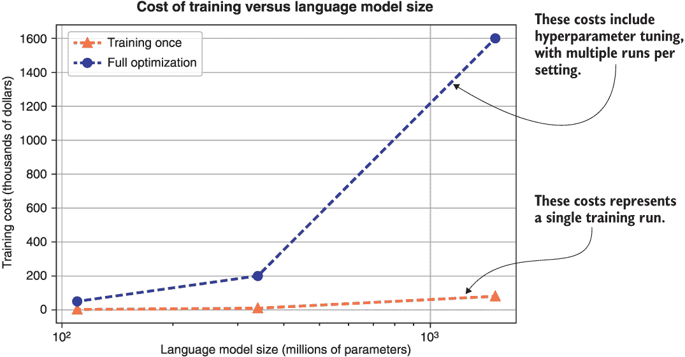
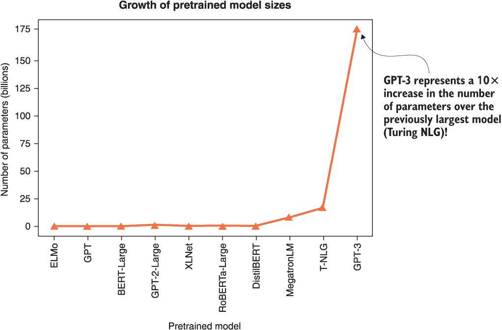
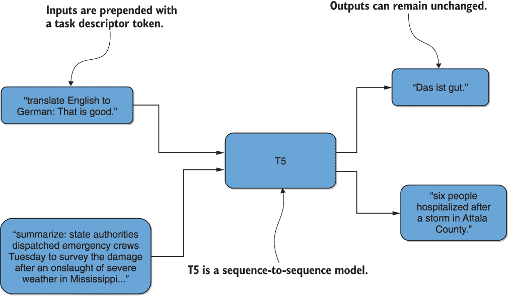

# 第十一章：结论

本章包括

+   总结本书涵盖的重要概念

+   总结相关的重要新兴概念

+   考虑自然语言处理中关于迁移学习方法的局限性以及环境和伦理考虑

+   展望自然语言处理中的迁移学习未来

+   跟上该领域的最新发展

在前面的章节中，我们涵盖了大量的材料——我们希望它们既具信息性又引人入胜。这一结论性章节试图对我们所做的一切进行有意义的总结，并展望该领域的未来和新兴的研究趋势。由于该领域的多产产出和快速发展的性质，我们当然没有涵盖每一个有影响力的架构或有前途的研究方向。为了减轻这一点，我们对我们在本书中没有机会涵盖的各种研究趋势进行了简要讨论，尽可能与已涵盖的材料进行联系和框架化。

在本章中，我们还试图通过涉及一些传统上没有受到太多关注的新兴问题，例如伦理考虑和各种模型的环境影响，提供更广泛的背景。这些与对这些模型的局限性的认识密切相关，我们在本章中尽可能突出这一点。

至关重要的是，我们讨论了在这样一个快速发展的领域中保持最新的各种提示。强调掌握了本书内容后，您现在只是开始您在该领域的旅程。所提出的工具和技能会随时间变化，并且它们的每个独特应用可能需要您的创造力或者尚未开发的新技术。在这样一个快速发展的领域中保持竞争优势确实是一次旅程，而不是一个目的地。我们鼓励读者对正在进行的研究保持探究的态度，并在某种程度上继续为其发展做出贡献。

让我们通过概述关键概念来开始这一最后一章。

## 11.1 关键概念概述

迁移学习旨在利用不同设置中的先前知识——无论是不同的任务、语言还是领域——来帮助解决手头的问题。它受到人类学习方式的启发，因为我们通常不会从头开始学习任何给定的问题，而是建立在可能相关的先前知识上。使没有实质计算资源的从业者能够达到最先进的性能被认为是向民主化获得正在进行的技术革命成果的重要一步。作为更具体的动机，考虑一下训练不同大小的 BERT 模型的代表性成本，如图 11.1 所示。¹

图 11.1 BERT 不同规模的训练成本。展示了两种代表性成本——单次运行和包括超参数调整在内的整个训练过程。15 亿参数的最大规模单次运行成本为$80k，而所有优化步骤计算下的成本为$1.6 百万！

正如图所示，最大规模的 BERT 训练成本可能高达数百万美元。迁移学习确实可以让您在几小时内，最坏情况下花费几美元用于微调，将这些宝贵的知识重复利用于您的个人计算项目中。

在计算机视觉中推广的迁移学习最近开始被自然语言处理（NLP）社区大量使用。而计算机视觉涉及教计算机如何理解和处理图像和视频，NLP 则考虑如何处理人类语音，无论是文本还是语音音频。在本书中，我们关注的是文本。我们特别感兴趣的一些 NLP 任务包括文档分类、机器翻译和问答。

尽管在历史上，这些任务最初是通过试图为每种情况制定固定规则来解决的——这种范式现在被称为符号 AI——但机器学习现在已成为主导趋势。计算机不再为每种可能的情况明确编程，而是通过看到许多这种相应的输入-输出对的示例来*训练*计算机将输入与输出信号相关联。传统上用于*学习*适当的输入-输出关系的方法包括决策树、随机森林、诸如 SVM 的核方法和神经网络。神经网络最近已成为解决感知问题（即计算机视觉和 NLP）的表示学习方法的首选。因此，这是我们在本书中探讨的最重要的方法类别。

在深入研究现代 NLP 的迁移学习方法之前，我们进行了一项关于传统机器学习方法的回顾性实验。具体来说，我们采用了以下方法：

+   逻辑回归

+   支持向量机

+   随机森林

+   梯度提升机

以解决两个重要问题：电子邮件垃圾检测和互联网电影数据库（IMDB）电影评论分类。为了将文本转换为数字，我们使用了词袋模型。该模型简单地计算了每封电子邮件中包含的单词标记的频率，从而将其表示为这些频率计数的向量。

现代自然语言处理（NLP）方法学主要集中在将文本部分（词语、子词、句子等）向量化上，采用诸如 word2vec 和 sent2vec 之类的技术。然后将得到的数值向量进一步处理，作为传统机器学习方法的特征，例如用于随机森林分类。

正如本书第一章所概述的，这一重要的自然语言处理研究子领域起源于 20 世纪 60 年代的*信息检索术语向量模型*。这在预训练的浅层神经网络技术方面达到了高潮，包括以下内容:

+   fastText

+   GloVe

+   word2vec，在 2010 年代中期推出了几个变体，包括连续词袋（CBOW）和 Skip-Gram

CBOW 和 Skip-Gram 都来自于训练用于各种目标的浅层神经网络。Skip-Gram 试图预测滑动窗口中任何目标词附近的单词，而 CBOW 试图预测给定邻居的目标词。GloVe，代表“全局向量”，试图通过将全局信息合并到嵌入中来扩展 word2vec。它优化了嵌入，使得单词之间的余弦乘积反映它们共同出现的次数，从而使得结果向量更具可解释性。fastText 技术试图通过对字符 n-gram（而不是单词 n-gram）重复 Skip-Gram 方法来增强 word2vec，从而能够处理以前未见过的单词。这些预训练嵌入的每个变体都有其优点和缺点。作为这类方法的数值演示，我们使用 fastText 词嵌入来重新访问 IMDB 电影分类示例，那里将词袋模型替换为 fastText 以将文本转化为数字。

几种技术受 word2vec 的启发，试图将较大的文本部分嵌入到向量空间中，以便在诱导向量空间中含义类似的文本部分彼此靠近。这使得可以在这些文本部分上进行算术运算，以进行关于类比、组合含义等推理。这样的方法包括以下内容:

+   段落向量，或*doc2vec*，利用了从预训练词嵌入中摘要单词的连接（而不是平均）。

+   *Sent2vec*扩展了 word2vec 的经典连续词袋（CBOW）—其中一个浅层神经网络被训练以从其上下文中的滑动窗口中预测一个词—到通过优化词和词 n-gram 的嵌入来对句子进行准确的平均表示。

作为这类方法的数值演示，我们使用了一个基于 fastText 而非词袋模型的 sent2vec 的实现来执行 IMDB 电影分类实验。

一些作者², ³, ⁴提出了各种分类系统，将迁移学习方法归类到不同的组别中。粗略地说，分类是基于迁移是否发生在不同的语言、任务或数据领域之间。通常，这些分类类型对应着以下内容:

+   *跨语言学习*

+   *多任务学习*

+   *领域自适应*

我们进行了一系列多任务迁移学习实验，使用了 IMDB 分类和电子邮件垃圾邮件检测这些熟悉的任务来说明这个概念。为了通过示例说明领域自适应，我们使用了自动编码器来调整一个在 IMDB 电影评论分类上训练的模型，以适应亚马逊图书评论的领域。这个练习还允许我们说明了零-shot 迁移学习的一个实例，即在亚马逊图书评论领域不需要微调就可以开始提供有价值的结果。

序列到序列建模的进展为诸如机器翻译之类的任务带来了革命。该设置中的编码器和解码器最初是循环神经网络（RNNs）。由于输入序列过长的问题，发展了一种称为注意力的技术，允许输出仅关注输入的相关部分。尽管最初这与 RNNs 结合使用，但它发展成为了使用自注意力构建编码器和解码器的技术。自注意力与最初的注意力公式不同，因为它寻求序列的部分与同一序列的其他部分之间的关联，而不是两个不同输入和输出序列的部分之间的关联。自注意力取代注意力的架构被称为 *transformers*，它在并行计算架构上比早期基于 RNN 的序列到序列模型更具可伸缩性。这种改进的可扩展性推动了它在竞争架构中的广泛采用。我们使用了一个预训练的英文到加纳语 Twi 的翻译 transformers 模型来探索这一重要架构的效能和其他特性。

NLP 的迁移学习的早期探索侧重于与计算机视觉的类比，而计算机视觉在此方面已经成功使用了一段时间。其中一个模型——SIMOn——采用了字符级卷积神经网络（CNNs）结合双向 LSTM 用于结构语义文本分类。SIMOn 代表 *本体建模的语义推理*。它是在 DARPA 的数据驱动模型发现（D3M）⁵ 计划中开发的，该计划是为了自动化数据科学家面临的一些典型任务。它展示了与计算机视觉中使用的方法直接类似的 NLP 迁移学习方法。该模型学到的特征还被证明对无监督学习任务也有用，并且在社交媒体语言数据上表现良好，这些数据可能有些特殊，与维基百科和其他大型基于书籍的数据集上的语言非常不同。列类型分类被用作该建模框架的说明性示例。

作为提醒，计算机视觉中微调的启发式大致如下：

+   随着目标域中的数据越来越多，阈值从输出中移动（并朝向输入）。在阈值和输出之间的参数被*解冻*并进行训练，而其余参数保持不变。这是由于增加的数据量可以有效地用于训练更多的参数，而否则无法完成。

+   另外，阈值的移动必须远离输出并朝向输入，因为这样可以保留编码靠近输入的通用特征的参数，同时重新训练更靠近输出的层，这些层编码源域特定特征。

+   此外，当源和目标高度不同时，一些更具体的参数/层可以完全丢弃。

早期嵌入方法（如 word2vec）的一个主要弱点是消歧义 - 区分一个词的各种用法，这些用法根据上下文可能有不同的含义。这些词在技术上被称为同形异义词，例如，duck（姿势）与 duck（鸟）和 fair（集会）与 fair（公平）。*来自语言模型的嵌入* - 在流行的*Sesame Street*角色之后缩写为 ELMo - 是最早尝试开发单词的上下文化嵌入的方法之一，使用双向*长短期记忆网络*（bi-LSTMs）。ELMo 可以说是与正在进行的 NLP 迁移学习革命相关联的最流行的早期预训练语言模型之一。它与 SIMOn 具有许多架构相似之处，后者由字符级 CNNs 和 bi-LSTMs 组成。这个模型中一个词的嵌入取决于其上下文，ELMo 通过被训练来预测单词序列中的下一个单词来实现这一点。大量数据集，如维基百科和各种图书数据集，被用来训练这个模型。我们将 ELMo 应用于一个说明性的示例问题，即假新闻检测，作为一个实际演示。

*通用语言模型微调*（ULMFiT）进一步提出了一种方法，为任何特定任务微调基于神经网络的语言模型。该框架介绍并演示了一些关键的技术和概念，以更有效地适应预训练语言模型的新设置。这些包括区分性微调和渐进解冻。区分性微调规定，因为语言模型的不同层包含不同类型的信息，它们应该以不同的速率进行微调。渐进解冻描述了一种逐渐地以渐进方式微调更多参数的过程，目的是减少过拟合的风险。ULMFiT 框架还包括在适应过程中以独特方式改变学习率的创新。我们使用 fast.ai 库对这些概念进行了数值上的说明。

-   OpenAI 的*生成式预训练 transformers*（GPT）修改了 transformers 的编码器-解码器架构，以实现 NLP 的可微调语言模型。它丢弃了编码器，保留了解码器及其自注意子层。它是以*因果建模目标*进行训练的——预测序列中的下一个词。它特别适用于文本生成。我们展示了如何使用 Hugging Face 的 transformers 库快速使用预训练的 GPT-2 模型进行文本生成，该库在本书中早已介绍过。

-   从转换器的双向编码器表示（BERT）可以说是相反的，通过保留编码器并丢弃解码器来修改转换器架构，还依赖于*掩码*词语，然后需要准确预测作为训练度量的这些词语。更具体地说，它是以*掩码建模目标*训练的——填补空白。此外，它还通过*下一个句子预测*任务进行训练——确定给定句子是否是目标句子之后的一个合理的跟随句子。虽然不适用于文本生成，但该模型在其他一般语言任务（如分类和问题回答）上表现非常好。我们将其应用于问题回答和文档分类的两个重要应用。文档分类用例是垃圾邮件检测。我们还展示了它在填补空白和检测一个句子是否是另一个句子的合理的下一个句子方面的应用。

-   mBERT 模型，代表“多语言 BERT”，实际上是同时在 100 多种语言上预训练的 BERT。自然地，这个模型特别适合跨语言迁移学习。我们展示了多语言预训练权重检查点如何有助于为原本未包含在多语言训练语料库中的语言创建 BERT 嵌入。BERT 和 mBERT 都是由 Google 创建的。

-   在所有这些基于语言模型的方法——ELMo、ULMFiT、GPT 和 BERT 中——都显示出生成的嵌入可以用相对较少的标记数据点进行特定下游 NLP 任务的微调。这解释了 NLP 社区对语言模型的关注：它验证了它们诱导的假设集通常是有用的。

我们还介绍了一些关于已覆盖的深度 NLP 迁移学习建模架构的适应策略。换句话说，针对预训练架构，如 ELMo、BERT 或 GPT，如何更有效地进行迁移学习？我们专注于*参数效率*，目标是在尽可能减少参数的情况下产生一个性能损失最小的模型。这样做的目的是让模型更小、更容易存储，从而更容易在智能手机等设备上部署。或者，智能的适应策略可能仅仅是为了在一些困难的转移情况下达到可接受的性能水平。我们介绍的适应策略有：

+   我们探索的第一种适应策略是前面提到的 ULMFiT 技术，即*逐步解冻*和*区分微调*，使用的是 fast.ai 库。

+   然后我们探索了被称为*知识蒸馏*的模型压缩方法，因为它最近在 NLP 领域显赫一时。这个过程本质上试图通过显著更小的*学生*模型来模拟更大*教师*模型的输出。特别是，我们使用 transformers 库中知识蒸馏方法 DistilBERT 的实现来证明通过这种方式可以将 BERT 模型的大小减少一半以上。

+   我们接触到的下一个适应策略围绕着两个想法，旨在创建更有利于更大词汇量和更长输入长度的基于 transformers 的语言模型。第一种方法涉及巧妙的因式分解，或者将一个更大的权重矩阵分解为两个较小的矩阵，允许你增加一个维度而不影响另一个维度。第二种想法涉及跨所有层共享参数。这两种策略是 ALBERT（A Lite BERT）方法的基础。我们使用 transformers 库中的实现来亲身体验这一方法。

因此，我们基于多任务学习的想法，即模型被训练以同时执行多种任务，并产生更具有普遍性的模型。当面临转移场景时，我们没有足够的训练数据来在给定任务上进行微调时，为什么不在多个任务上进行微调？讨论这个想法给我们提供了一个很好的机会来介绍*通用语言理解评估*（GLUE）数据集，这是一组代表人类语言推理的几项任务的数据集，例如检测句子之间的相似性，问题之间的相似性，释义，情感分析和问题回答。我们展示了如何使用这个数据集快速利用 transformers 库进行多任务微调。这个练习还演示了如何类似地在来自这些重要问题类别之一的自定义数据集上微调来自 BERT 系列的模型。

我们还建立在领域自适应的思想上，特别是源域和目标域的相似性对于迁移学习的有效性起着至关重要的作用。更大的相似性通常意味着一般情况下更容易进行迁移学习。当源域和目标域之间相差太大时，可能无法在单一步骤中执行该过程。在这种情况下，可能会使用*顺序自适应*的想法将所需的整体迁移分解为更简单、更易管理的步骤。举例来说，我们首先将一个“填空”目标预训练的 BERT 逐步适应到一个低资源的句子相似度检测场景中，再适应到一个数据丰富的问题相似度场景中。实验中两个场景的数据都来自 GLUE 数据集。

我们探讨的最终适应策略是使用所谓的*适应模块*或*适配器*。这些是仅在预训练神经网络的层之间具有少量参数的新引入的模块。对于新任务微调这个修改过的模型只需要训练这几个额外的参数。原始网络的权重保持不变。与微调整个模型相比，通常只添加了 3-4% 的额外参数时往往几乎没有性能损失。这些适配器也是模块化的，并且容易在研究人员之间共享。我们使用了 AdapterHub 框架来加载其中一些适配器，并展示它们如何用于将通用 BERT 模型适应为在情感分类任务上表现良好的模型。

## 11.2 其他新兴研究趋势

在整本书中，我们试图强调，在诸如 NLP 的迁移学习这样的快速发展领域中，像这样一本单独的书籍完全涵盖每种架构或创新是不可能的。相反，我们采取的方法是专注于我们认为是基础的架构和技术。未来的创新很可能在某种程度上是从这些架构和技术中派生出来的，因此读者可能通过自己的一些努力来学习它们。为了进一步促进这一点，我们将这一部分重点放在了我们在这本书中没有涵盖但在该领域中已经有些影响的各种研究趋势的简要讨论上。我们尽可能将它们置于我们已经涵盖的内容的背景中，以便您在需要时更轻松地学习这些主题。

我们首先通过概述 RoBERTa⁷——Robustly Optimized BERT Approach——来开始这个练习，它采用了一些优化技巧来提高 BERT 的效率。

### 11.2.1 RoBERTa

所讨论的研究试图复制 BERT，同时特别关注各种训练超参数和设置以及它们对结果的影响。总的来说，观察到通过谨慎的设计选择可以显著改善原始 BERT 的性能。这样的选择之一是去除下一句预测（NSP）任务，同时保留掩码语言建模（MLM）— 填空— 任务。换句话说，他们发现 NSP 会降低下游任务的性能，并显示去除它是有益的。其他设计选择包括在训练过程中使用较大的学习率和小批量。它是由我们在本书中介绍的 Hugging Face 的 transformers 库中实现的。

接下来，我们将看看迄今为止开发的最大语言模型之一 — GPT-3，最近引起了很多关注，并在 NeurIPS 2020 虚拟研究会议（2020 年 12 月）上获得了最佳论文奖。

### 11.2.2 GPT-3

您可能还记得我们的报道，GPT 模型经历了几次迭代 — GPT、GPT-2，最近是 GPT-3。在撰写时，GPT-3 恰好是拥有 1750 亿参数的最大的预训练语言模型之一。它的前身 GPT-2 拥有 15 亿参数，在发布时也被认为是最大的，仅仅在前一年发布。在 2020 年 6 月发布 GPT-3 之前，最大的模型是微软的图灵 NLG，拥有 170 亿参数，并于 2020 年 2 月发布。这些指标的进展速度之快令人震惊，这些记录往往很快就会被打破。为了比较，这些参数爆炸在图 11.2 中有所体现。

图 11.2 模型参数数量随时间增长的趋势。如图所示，模型大小的爆炸趋势似乎在加速，其中最近的一个进步 — GPT-3 — 表示了 10 倍的增长因子。

如图所示，GPT-3 相比之前最大的图灵 NLG 增长了超过 10 倍，这是一次超越以往进步的飞跃。实际上，一种称为 Switch Transformer 的架构，通过为不同的输入分配单独的 transformer 块部分利用了稀疏性，并声称在 2021 年 1 月达到了 1 万亿参数的规模。由于在撰写时仍在进行同行评审，我们没有在图 11.2 中包含这种架构。然而，很明显，这种模型大小增长的趋势似乎正在加速。

在 GPT-3 论文中，作者展示了这个巨大的模型可以在很少的样本情况下执行广泛的任务。例如，只需看几个示例翻译，它就可以被启动以将一种语言翻译成另一种语言，或者只需看几个示例垃圾邮件，即可检测垃圾邮件。 事实上，一些意想不到的应用，例如从编码的描述中编写代码，已经被广泛报道。目前，该模型尚未由 OpenAI 作者发布给公众，只有通过邀请和付费 API 向少数早期采用者提供。 OpenAI 限制接入的理由是监控使用，从而限制这种技术的任何潜在有害应用。 GPT-3 的早期采用者是一款名为 Shortly 的应用程序，它为创意写作提供了 GPT-3 访问权限，任何人都可以以少量费用尝试。

此外，一个最近更小但功能强大的 GPT-3 开源替代品已经在 transformers 库中可用：EleutherAI 的 GPT-Neo。该组织旨在构建一个与全尺寸 GPT-3 相当的模型，并在开放许可下向公众提供。他们的存储库中提供了不同大小的模型，您也可以使用 Hugging Face 托管的推理 API，通过浏览器测试这些模型。我们还提供了伴随 Kaggle 笔记本，演示了我们在第七章中进行的练习的运行情况。通过检查，您应该会发现其性能更好，但自然而然地，成本也更高。 （最大型号的重量超过 10 GB！）

关于 GPT-3 工作的一个重要事项是，作者本人在论文中认识到，使语言模型更大的好处已接近极限。即便在极限下，处理某些类型的任务（例如关于对常识物理的理解的文本生成）的性能仍然较差。因此，虽然它确实代表了一项重要的技术突破，但在建模方法（而不是简单地扩大模型规模）上的创新必须成为前进的道路。

接下来，我们将看一组旨在改善基于 transformer 的模型在更长输入序列上的性能的方法。这很重要，因为香草 transformer 模型会随着输入长度呈平方级别的运行时间和内存使用。

### 11.2.3 XLNet

XLNet¹³是在类似早期模型 Transformer-XL¹⁴的基础上构建的，旨在更好地处理更长的输入序列。其中一个关键组成部分的想法是因果语言建模（CLM），我们在讨论 GPT 时已经讨论过，它涉及到预测序列中下一个词的经典语言建模任务。请注意，此方法中的未来标记已被屏蔽。XLNet 论文的作者等效地将其称为自回归语言建模。XLNet 的另一个关键组成部分是对输入序列的所有可能排列执行 CLM。这个想法有时被称为排列语言建模（PLM）。通过结合 PLM 和 CLM，实现了双向性，因为所有标记都有机会在某个排列中作为过去标记被包含。XLNet 和 Transformer-XL 都没有序列长度限制，并且由 Hugging Face 的 transformers 库实现。

有了这种对 XLNet 的看法，让我们继续考虑 BigBird¹⁵，这是一种引入*稀疏注意机制*的创新，以实现更高的计算效率。

### 11.2.4 BigBird

BigBird 通过引入一种稀疏注意机制将传统基于 Transformer 的模型的二次依赖关系减少到线性，该机制被证明能够近似并保持原始完整注意力的性质。与一次应用完整注意力到整个输入序列不同，稀疏注意力逐个查看序列标记，允许它更加智能地且舍弃一些连接。可以处理长达传统基于 Transformer 模型处理的八倍长度的序列，且可在类似硬件上处理。它是由 Hugging Face 的 transformers 库实现的。

接下来，我们将介绍 Longformer¹⁶，这是对 Transformer 传统完整自注意力的另一项创新，能够更好地随着输入长度的增加而扩展。

### 11.2.5 Longformer

Longformer 是针对传统 Transformer 注意力的二次缩放的又一尝试。这里的创新是将局部窗口注意力与全局任务导向注意力相结合。局部注意力用于上下文表示，而全局注意力用于构建在预测中使用的完整序列表示。所达到的缩放在输入序列长度方面是线性的，类似于 BigBird。Longformer 是由 Hugging Face 的 transformers 库实现的。

我们接下来介绍 Reformer¹⁷，这是另一种减轻原始自注意力二次缩放的方法。

### 11.2.6 Reformer

Reformer 引入了两种技术来对抗原始 Transformer 输入长度的二次扩展的计算时间和内存消耗。用局部敏感哈希替换原始的完全自注意力机制，减少了冗余计算和时间复杂度从二次到 O(L*log*L)（其中 L 是输入序列长度）。一种称为*可逆层*的技术允许只存储激活一次。在实践中，这意味着，与为具有*N*层的模型存储激活*N*次相比，只使用了一小部分内存。根据*N*的值，内存节省可能非常大。Reformer 是由 Hugging Face 实现的 transformers 库中的一个模型。

显然，使基于 Transformer 的模型在处理更长的输入长度时表现更好已成为一个元研究趋势。我们在这里可能没有包括所有关于此主题的重要研究，如果你自己深入研究，可能会发现更多。

接下来，我们将谈论最近重新出现的序列到序列建模方法。这些尝试将本书中遇到的各种问题统一到一个文本到文本建模框架中。

### 11.2.7 T5

你可能还记得在本书中我们讨论过，序列到序列模型在自然语言处理中发挥了重要作用。首次出现在循环神经网络（RNN）模型的背景下，它们也被翻译应用领域在原始 Transformer 架构的背景下所探索。T5，“文本到文本转换 Transformer”，是将各种自然语言处理问题统一到一个序列到序列框架中的尝试。它允许对每个任务应用相同的模型、目标、训练过程和解码过程。处理的问题类别包括从摘要到情感分析和问答等众多领域。英语和罗马尼亚语、德语、法语之间的语言对翻译被包括在训练中。一些代表性的数据转换，使得可以在多种任务上训练单一模型，如图 11.3 所示的翻译和摘要（灵感来源于 T5 论文的图 1）。

图 11.3 T5 是一个序列到序列模型，它采用了一系列转换，使得可以同时在各种任务上训练单一模型、解码过程和目标。它可以被看作是多任务学习的一个有趣变体。

如图所示，任务数据通过在原始文本数据前加上标准任务描述符来转换。训练数据包括 GLUE 和 SuperGLUE 数据集、用于抽象摘要的 CNN/Daily Mail 数据集等。目标是处理包含的多样化的自然语言理解任务，而不修改模型。从这个意义上说，它可以被看作是我们在整本书中一直提到的多任务学习思想的一个有趣变体或迭代。同时学习如此多种任务的包含可能会实现参数共享和生成模型的更好泛化能力。关键是，模型最初是在作者称之为“巨大干净爬行语料库”（C4）的数据集上使用蒙版语言建模或自动编码目标进行训练，然后在上述各种任务上进行微调。基本上，所有标记的 15% 被丢弃，结果被送入输入，而未损坏的输入被送入输出以进行预测。请注意，C4 语料库本质上是目标语言（英语）的互联网，其中过滤掉了色情材料、代码和其他“垃圾数据”。用于训练的模型架构类似于我们在第七章中用于翻译的转换器架构。由所得模型在许多包含的任务上实现了最先进的结果。

除了原始的 T5 模型之外，还开发了一个多语言版本，不足为奇地称为 mT5，通过同时对 101 种语言进行训练。T5 和 mT5 都在 Hugging Face 的 transformers 库中实现。

接下来，我们简要介绍 BART，它与 T5 类似，都是基于转换器的序列到序列建模框架。

### 11.2.8 BART

BART，即双向自回归转换器，可以被视为 T5 减去单一统一变换的模型，以使未经修改的模型能够应用于各种任务。相反，首先对标准的转换器编码器-解码器架构进行预训练，以通过各种噪声方法重现损坏的输入。这包括蒙版语言建模，如 BERT 和 T5，以及排列语言建模，如 XLNet 等。然后，该模型被修改用于各种任务，例如 SQuAD、摘要等，并针对每个任务分别进行微调，类似于我们对传统 BERT 所做的操作。这个模型在语言生成任务中表现特别好，例如摘要、翻译和对话。同时也开发了一个多语言版本 mBART，通过同时对 25 种语言进行训练而获得。BART 和 mBART 都在 Hugging Face 的 transformers 库中实现。

在下一个小节中，我们将审视一种最新的跨语言模型，它不仅仅是同时在多种语言上进行训练，还通过在有并行数据时修改语言建模目标来显式建模跨语言转移。

### 11.2.9 XLM

XLM,²² 其作者用来指代“跨语言语言模型”，是一个结合单语和并行数据的跨语言学习方法的建模框架。在不同语言上学习得到的单语嵌入可以使用已知数值表示的小词汇表进行*对齐*。如果有并行数据可用，作者提出了一种他们称之为*翻译语言建模*（TLM）的方法，并同时利用它进行跨语言学习。本质上，这涉及将并行数据的连接序列应用掩码语言建模，在两种语言的连接序列的各个部分中，让一些单词消失并预测它们。

在跨语言学习任务中观察到显著的改进。它还激发了许多类似模型的产生，特别是 XLM-R,²³ 它将 XLM 的思想与 RoBERTa 的思想结合起来，以提高性能。XLM 和 XLM-R 都在 Hugging Face 的 transformers 库中实现。

最后，我们简要谈到了一种在书中遇到的重要问题数据类别——表格数据的专门模型。

### 11.2.10 TAPAS

在第五章和第六章中，我们讨论了 SIMOn 方法及其对表格数据类型分类的处理——这是数据科学家通常会遇到的一个重要问题类别。TAPAS²⁴ 是尝试将基于变换器的模型的建模优势扩展到这一重要问题类别的一种尝试，通过显式地为表格数据中的问答建模和专门化。TAPAS 代表表格解析器。在第八章中，我们讨论了将 BERT 应用于问答任务。结果专门化模型的输出是输入上下文段落中感兴趣问题的潜在答案的开始和结束位置。除此之外，TAPAS 还学会检测表格中哪个单元可能包含可以从中提取答案的上下文段落，且起始和结束索引类似。与本节中讨论的其他大多数模型一样，该模型在 Hugging Face 的 transformers 库中实现。

这标志着我们对本书中尚未有机会详细分析的近期工作的概述之旅的结束。这些模型架构大多可以通过与我们在 transformers 库中使用 BERT 和 DistilBERT 非常相似的代码来使用。

在下一节中，我们将尝试对这个领域下一步可能的走向做出有根据的猜测——鉴于当前和新兴的研究趋势，哪些主题可能保持或变得流行。

## 11.3 NLP 中转移学习的未来

在本节中，我们尝试通过预测该领域即将出现的形态来推断前面两节描述的趋势。

对过去两节的批判性分析揭示了两个可以说是正交的元趋势——一个是将模型尽可能地变大，另一个是开发更高效的更大模型的推动。

GPT-3，目前我们观察到的参数数量迈出的最大一步——是以前的 10 倍，最初引起了一些研究人员对研究公司开始将重点放在规模而不是巧妙建模上的担忧。然而，正如我们在上一节讨论的那样，扩大模型的局限性很快变得明显，GPT-3 论文的作者们承认已经达到了可能的极限。考虑到 GPT-3 目前仅通过有限的付费 API 可用，我们可以预期空间中的其他参与者将尝试很快构建更大的模型，因为他们有货币激励这样做（我们已经提到正在进行同行评审的拥有万亿参数的 Switch Transformer）。这场竞赛很可能最终将导致谷歌和/或 Facebook 发布一个类似的模型，这很可能会推动 GPT-3 完全开源（类似的情况在 GPT-2 历史上已经发生过）。除此之外，我们预计会有更多资源开始致力于实现类似性能的更有效方法。

在 NLP 迁移学习的即将到来的有趣问题中，大多数可能都在被一些人称为*TinyML*的运动中。这可以被定义为一个将模型大小缩小到可以适应较小硬件的通用目标。我们在第九章演示了一个例子，即通过 DistilBERT 等方法可以将 BERT 的大小大致缩小一半，而性能损失很小。我们在第十章取得了类似的成就的另一种方法是 ALBERT，它实现了模型大小的 90%缩减。现在全球大部分人口都拥有智能手机，可以运行这些先进模型的较小版本。这给物联网（IoT）等领域带来的机会是巨大的，其中设备形成智能网络，每个节点都能独立地执行复杂功能。尽管今天许多手机应用程序可能都包含翻译和其他工具的服务器后端，用于进行实际的翻译和其他计算，但在没有互联网连接的情况下在智能手机上本地运行这些算法的能力正在成为更可行和更普遍的范式。我们预计在未来几年内，在使 BERT 及其衍生产品更小和更具参数效率的努力将继续如火如荼。

另一个你可能从前一节中注意到的趋势是对跨语言模型的日益关注。事实上，过去一年全球对所谓的“低资源”语言的方法的投资有所增加。我们在第七章中通过一个例子提到了这一点，当时我们使用了一个 transformers 架构将低资源的西非语言特威（Twi）翻译成了英语。许多流行的经济模型预测，非洲市场正在出现一个日益重要的消费者群体，这很可能是引起对这一领域突然兴趣和投资的至少一个推动因素。对于许多低资源语言来说，应用我们讨论的所有方法的初始障碍往往是数据的可用性。因此，我们可以预期在接下来的一年左右，适当的多语言数据开发将受到很多关注，随后将进行对语言特定方法的深入研究。值得关注的地方，特别是涉及非洲语言的地方，包括 NLP Ghana，Masakhane，EthioNLP，Zindi Africa，AfricaNLP 和 Black in AI。

语音是另一个即将迎来转折时刻的 NLP 研究前沿。直到最近，自动语音识别模型，将语音转录成文本，需要大量的平行语音文本数据才能取得良好的结果。Facebook 最近的一种架构 Wav2Vec2 展示了，同时在许多语言上对语音进行预训练可以极大地减少所需的平行数据量。这类似于我们在本书中探讨的文本中使用的 mBERT 的功能。Wav2Vec2 模型已经在 transformers 库中提供，并且可以通过只使用几个小时的标注语音数据对新语言进行微调。我们预计这将在接下来的一年内首次推动多种语言的语音识别工具的开发。此外，我们预计类似的事情也将在不久的将来出现在另一个方向上：文本到语音，也就是从文本生成语音。

在第一章中，我们描述了 NLP 中的迁移学习是如何受到计算机视觉的进展的启发的。有趣的是，最近 NLP 迁移学习的进展似乎又激发了计算机视觉的进一步发展。一个具体的例子是 DALL-E，这是一个在文本描述 - 图像对上训练的 GPT-3 的版本，它已经学会了从文本提示中生成图像。一个更广泛的趋势是构建上下文情景的对象嵌入，试图从场景中其他可观察到的对象预测缺失的对象，类似于 BERT 和类似的遮蔽语言模型所使用的填空词目标。

另一个最近似乎越来越受到关注的研究问题是：这些模型的环境和道德影响是什么？在最近的研究高潮初期，研究人员似乎满足于发布只改善技术指标的模型，但随着时间的推移，这个领域开始重视对潜在道德影响的详细探讨。与之相关的是对可解释性的提高兴趣：我们能否真正解释模型是如何做出决定的，以确保它不会歧视？我们将在下一节进一步探讨这些道德问题。

## 11.4 道德和环境考虑

你可能还记得我们在第五章和第六章讨论关于假新闻检测的问题时提出了所谓的假新闻是什么是一个有争议的观点。如果在数据标签的质量上不加注意，那么准备训练数据标签的人身上植入的偏见很可能会转移到分类系统上。这是我们首次遭遇到了在部署这些模型到可能会显著影响人类生活的情况下，充分意识到潜在局限性的重要性。

当我们在第八章用 Jehovah's Witnesses 准备的 JW300 数据集对 mBERT 进行微调时，我们发现它会以有偏见的方式填补空白。当我们试图预测一个基本名词“学校”时，它会提供像伊甸园这样的词作为合理的补充。这表明了强烈的宗教偏见，这是我们在旅程中第二次被提醒到，盲目地将这些模型应用于某些数据可能会产生有偏见和意想不到的结果。

在这一部分，我们将从更广泛的角度讨论这个问题，考虑到可能需要放在从业者脑后的道德和环境考虑因素。这是一个近来受到越来越多关注的话题，但在机器学习领域并不算新鲜。

早期关于偏见的知名机器学习研究可预见地发生在计算机视觉领域。具有里程碑意义的作品，“性别和肤色”，³⁴研究了商业性别分类系统在种族和性别维度上的准确性。它发现，与较浅肤色的男性相比，这些系统在较深肤色的女性身上表现不佳，绝对百分比高达 35 个百分点。这对少数族裔社区有着巨大的实际影响，在一些地区可能会受到一些自动计算机视觉系统的监控。错误的分类或检测可能意味着错误的逮捕，即使被清除，也可能意味着在最脆弱的社区中失去工作。有多次广泛报道这种情况发生在真实的人身上。一个愤世嫉俗的力量失衡在那些打着“客观”和“科学”旗号的系统背后被揭露出来，在这些系统被开发的更富裕的社区和它们的经济利益主要是被搬走的地方并没有遭受到对较贫困的社区造成的伤害。这项工作及相关研究的影响是巨大的，最近美国国会最近出台了相关的减轻监管措施，可以说这是直接后果。像 IBM 和亚马逊这样的公司也被迫重新审视他们与执法机构分享这些技术的方式，IBM 甚至完全停止了这项服务。

最近对预训练的自然语言处理语言模型存在偏见的担忧也很高。实际上，GPT-3 论文³⁵专门包括了一个研究的部分，涵盖了几个方面，即种族、性别和宗教。最近越来越常见地看到学术文章做这样的研究，这是非常令人鼓舞的。特别是 GPT-3 的研究探讨了模型从训练数据中学到的与各个关注维度的关联。例如，他们发现通常与较高教育水平相关联的职业在填空时更倾向于与男性代词相关联。同样，暗示专业能力的提示更有可能由男性代词和说明者完成。这很可能是模型直接从互联网学到的性别偏见，我们可能无法指望互联网是一个无偏见的信息来源。另一方面，积极的描述词更有可能被“亚洲”和“白人”等词引导的名词以比“黑人”人物高得多的速度分配。同样，模型显然从互联网学到了种族偏见，而对模型的盲目应用只会传播这种偏见。在宗教维度上，“伊斯兰”一词与“恐怖主义”一词相关联，是最有可能的完成之一。作为这种偏见的直接现实影响，考虑一下那位巴勒斯坦人的善意“早上好”Facebook 帖子被错误地翻译为“攻击他们”，并导致了重大的不公平后果。³⁶

预训练的自然语言处理语言模型可能无意中影响贫困社区的另一种方式是通过气候变化。实际上，这些模型最近被发现具有相当大的碳足迹。³⁷, ³⁸虽然发现单个 BERT 模型的一次训练的碳足迹相当于纽约到旧金山的一个普通往返航班，但在微调和超参数优化期间，模型实际上会进行多次训练。如果模型通过 *神经架构搜索* 部署，其中各种架构超参数被详尽地变化，然后选择性能最佳的模型，研究人员发现单个模型部署的碳足迹相当于五辆普通汽车的寿命。再次强调，这是严重的，特别是因为与这些碳足迹直接相关的气候变化影响最严重的是贫困社区，而这些社区并没有体验到这些模型的直接好处。很明显，在评估这些模型时，这些成本需要纳入考虑。这一认识可以说是驱使该领域朝着更具参数效率的模型发展的力量之一。

预训练语言模型及深度学习普遍存在的一个长期批评是，这些模型往往不太*可解释*——很难解释模型是如何在特定情景下得出预测的。这与本节早些时候讨论的偏见问题有关——让模型解释其对教育相关联的决策是如何做出的，例如，可以帮助检测这样的决定是否基于种族或性别变量。最值得注意的最近的方法之一是 bertviz，³⁹试图在第七章中探索的注意力可视化基础上进行改进。然而，这仍然没有解决训练数据透明度缺失的问题：语言模型的训练规模如此之大，以至于研究人员几乎无法确保其是无偏的。因此，我们期望看到人们投入时间和精力开发出可以从更小、精心策划的数据集中执行相当的方法。

通过我们对一些应该记住的伦理问题的简要讨论完成后，我们在下一节中提供一些关于如何在这个快速发展的领域中保持时效性的建议。

## 11.5 保持时效性

正如我们在本章中一再强调的那样，NLP 中的迁移学习方法的状况更新速度很快。本书涵盖的材料应该仅被视为一个平台，用于继续跟踪最新发展。在本节中，我们提供了一些关于如何实现这一目标的基本提示。总的来说，在 Kaggle 和/或 Zindi 平台上参加各种相关竞赛可能是一个处理现实情况的好方法，但数据足够干净且与时俱进。跟踪 *arXiv* 上的最新论文是必不可少的，尽管新闻和社交媒体的报道可能夸张并且不可靠，但它仍然有助于及早发现有影响力的论文。

### 11.5.1 Kaggle 和 Zindi 竞赛

在整本书中，我们鼓励您使用 Kaggle 来运行所呈现的各种代码。尽管该平台提供的免费 GPU 计算和易用的设置立即成为其优点，但最大的好处可能直到现在才被明确说明。可以说，Kaggle 平台最强大的方面是可以访问该平台上众多持续进行和归档供后人参考的竞赛。

各种顶级公司面临各种技术挑战，使用该平台来刺激对这些问题的解决方案的研究和开发，通过提供现金奖励，有时可达数千美元的头等奖。这意味着通过跟踪这些竞赛，您可以了解到行业中最紧迫的问题是什么，同时可以访问代表性数据进行即时测试和实验。您可以按主题浏览当前和过去的竞赛，以找到测试任何想法所需的数据——您所需要做的就是将数据集附加到本书中使用的笔记本上，更改一些路径，然后您可能已经准备好产生一些初步的见解了。当然，如果您能够做到这一点，赢得竞赛是很好的，但您从实验、失败和再试中获得的学习价值才是真正无价的。实际上，根据我的经验，一个在排行榜上可能被认为是平庸的竞赛问题解决方案，如果在实践中易于部署和扩展，可能会导致真正的现实影响。我们在附录 A 中提供了一些使用 Kaggle 的具体提示，以帮助初学者入门。

我们还强调了 NLP 中对低资源语言的关注日益增加。因此，重要的是提到 Zindi Africa 平台，该平台提供与 Kaggle 类似的许多功能，但专注于非洲语言和问题。如果您是一位研究人员，想要了解您的方法在这些类型的语言中可能的表现，那么这个平台将是一个寻找相关竞赛和实验数据的好地方。

### 11.5.2 arXiv

机器学习，以及延伸开来的自然语言处理，可以说是当今最开放的研究领域。除了几个例外，一般来说，结果通常在一旦出现后立即在开放平台*arXiv*上发表。这使研究团队能够提前对任何发现进行申请，同时进行完善和论文出版手续。这意味着，如果你能找到它的话，最前沿的研究已经对你可用。*arXiv*由 Google Scholar 存档，因此你可以在那里设定关键词的警报，帮助你及早发现相关的论文。

*arXiv*平台上传的论文数量巨大，要找到与你相关的最重要的论文可能会有些困难。为了解决这个问题，我建议关注你喜欢的论文的作者在社交媒体上的动态——Twitter 似乎是这一领域的研究人员比较喜欢的平台。关注媒体报道也可能会有所帮助，只要你对所有声明持保留态度。接下来我们会多说几句关于这个问题。

### 11.5.3 新闻和社交媒体（Twitter）

总的来说，把科学主题的新闻和社交媒体报道看作可能具有煽动性和技术上不可靠是件好事。如果我们考虑一个媒体机构可能与报道技术相关的激励以及通常记者对主题可能没有技术背景的事实，这就说得通了。然而，经过核实的新闻可能是关于特定论文或主题的社区兴奋的一个良好指标，这总是一个需要考虑的好事。

如果你使用像谷歌新闻这样的平台，你可以在你的订阅中设置“语言模型”等主题的警报。你可能会得到很多信息，而且并非所有信息都值得关注。通常，我只会在这些论坛上深入研究一篇论文，只有在我认为一段时间内一直“可靠”的场所出现后，我才会深入研究一篇论文，这使我对这些论点至少经受了一段时间的公开评审产生了信心。GPT-3 的情况正好是个最近的例子——通过谷歌新闻上的这个启发式方法，我立刻就能体会到其影响。

关于社交媒体，Twitter 似乎是机器学习研究科学家的选择平台。事实上，许多人对他们的工作非常开放，并且如果你向他们提问，他们会很乐意在平台上直接回答你。这也是我最喜欢在这个领域工作的原因之一。请随时在@pazunre 上联系我。你最喜欢的作家或科学家可能会在他们的订阅中分享他们最新最喜欢的论文，通过关注他们，你可以直接收到这些信息。在这一领域，你可能会对以下一些受欢迎的账户感兴趣：@fchollet，@seb_ruder 和@huggingface。

除了竞赛、阅读 *arXiv* 上的论文、追踪新闻和社交媒体，没有什么比使用这些工具解决实际的挑战更好的了。对于许多人来说，这可能意味着在机器学习和/或自然语言处理领域拥有一份工作，并且每天都在解决一个实际的应用。实际的经验是这个领域大多数潜在雇主最重视的。如果你还没有在这个领域获得这样的实际经验，并且希望进入，那么开源项目可能是一个很好的途径——看看 TensorFlow、PyTorch、Hugging Face、NLP Ghana、Masakhane 等等。列表是无穷尽的，有很多有趣的问题可以解决和贡献，同时也可能使每个人受益。

我希望这些提示能帮助你进入你的机器学习和自然语言处理的未来，让你有能力对你的社会产生重大的积极影响。能够与你分享你旅程的一部分是我的荣幸。

## 11.6 最后的话

这就是了！你做到了——你已经读完了整本书。在写作过程中，我度过了难忘的时光，与许多研究人员互动，讨论思想并克服了许多挑战。我真诚地希望你享受这个旅程，就像我一样。当你带着这些工具改变世界的时候，请记得善待你周围的人，不要伤害生态系统，并且保持警惕，以防技术被滥用。通过与这个领域中一些杰出头脑互动的短暂时间内，我真诚地相信大多数人对于将这些技术突破变成善良的源头都感到兴奋。因此，我每天都迫不及待地关注研究新闻，渴望看到我们集体的人类思维将会产生什么样的惊喜。我只能希望你也能分享一些这种兴奋。

## 概要

+   你只是在这个迅速发展的领域中旅程的开端；保持竞争优势是一个旅程，而不是一个终点。

+   通过学习这本书所掌握的技能，使你处于一个良好的位置，能够通过持续的努力保持更新。

+   我们涵盖的一些关键的基础预训练迁移学习启用的语言建模架构包括 Transformer、BERT、mBERT、ELMo 和 GPT。

+   将这些更大的模型变得更小、更高效的愿望导致了像 ALBERT、DistilBERT 和 ULMFiT 这样的架构/技术的发展，我们也进行了介绍。

+   新兴的体系结构是前述模型的后代，书中没有详细介绍但你应该知道的，包括 BART、T5、Longformer、Reformer、XLNet 等等。

+   在实践中部署这些模型时，意识到它们可能带来的潜在的道德和环境影响是很重要的。

+   近期对道德和环境影响的关注，以及希望将模型能力应用于智能手机和物联网，很可能会在不久的将来继续推动更高效的 transformers 架构的开发。

1. Sharir O.等，“训练 NLP 模型的成本：简要概述”，arXiv（2020）。

2. S.J. Pan 和 Q. Yang，“迁移学习概述”，IEEE 知识与数据工程交易（2009）。

3. S. Ruder，“自然语言处理的神经迁移学习”，爱尔兰加尔韦国立大学（2019）。

4. D. Wang 和 T. F. Zheng，“语音和语言处理的迁移学习”，2015 年亚太信号与信息处理协会年度峰会和会议（APSIPA）论文集。

5. Lipmann Richard 等，“DARPA 数据驱动模型发现（D3M）计划概述”，第 29 届神经信息处理系统（NeurIPS）会议论文集（2016）。

6. [`datadrivendiscovery.org/`](https://datadrivendiscovery.org/)

7. Yinhan Liu 等，“RoBERTa：稳健优化的 BERT 预训练方法”，arXiv（2019）。

8. Tom B. Brown 等，“语言模型是少样本学习者”，NeurIPS（2020）。

9. W. Fedus 等，“Switch transformers：用简单高效的稀疏性扩展到万亿参数模型”，arXiv（2021）。

10. [`www.eleuther.ai/projects/gpt-neo/`](https://www.eleuther.ai/projects/gpt-neo/)

11. [`huggingface.co/EleutherAI`](https://huggingface.co/EleutherAI)

12. [`www.kaggle.com/azunre/tlfornlp-chapter7-gpt-neo`](https://www.kaggle.com/azunre/tlfornlp-chapter7-gpt-neo)

13. Z. Yang 等，“XLNet：用于语言理解的广义自回归预训练”，NeurIPS（2019）。

14. Z. Dai 等，“Transformer-XL：超越固定长度上下文的关注语言模型”，ACL（2019）。

15. M. Zaheer 等，“BigBird：更长序列的 transformers”，arXiv（2020）。

16. I. Beltagy 等，“Longformer：长文档 transformers”，arXiv（2020）。

17. N. Kitaev 等，“Reformer：高效 transformers”，arXiv（2020）。

18. C. Raffel 等，“探索统一文本到文本 transformers 的迁移学习极限”，arXiv（2020）。

19. L. Xue 等，“mT5：大规模多语言预训练文本到文本 transformers”，arXiv（2019）。

20. M. Lewis 等，“BART：用于自然语言生成、翻译和理解的去噪序列到序列预训练”，arXiv（2020）。

21. Y. Liu 等，“用于神经机器翻译的多语言去噪预训练”，arXiv（2020）。

22. G. Lample 和 A. Conneau，“跨语言语言模型预训练”，arXiv（2019）。

23. A. Conneau 等，“规模化的无监督跨语言表示学习”，arXiv（2019）。

24. J. Herzig 等，“TaPas：通过预训练进行弱监督表解析”，arXiv（2020）。

25. [`ghananlp.org/`](https://ghananlp.org/)

26. [`www.masakhane.io/`](https://www.masakhane.io/)

27. [`ethionlp.github.io/`](https://ethionlp.github.io/)

28. [`zindi.africa/`](https://zindi.africa/)

29. [`www.k4all.org/project/language-dataset-fellowship/`](https://www.k4all.org/project/language-dataset-fellowship/)

30. [`blackinai.github.io/`](https://blackinai.github.io/)

31. [`huggingface.co/facebook/wav2vec2-large-xlsr-53`](https://huggingface.co/facebook/wav2vec2-large-xlsr-53)

32. [`openai.com/blog/dall-e/`](https://openai.com/blog/dall-e/)

33. A. Dosovitskiy et al, “An Image Is Worth 16x16 Words: Transformers for Image Recognition at Scale,” arXiv (2020).

34. J. Builamwini and T. Gebru, “Gender Shades: Intersectional Accuracy Disparities in Commercial Gender Classification,” Journal of Machine Learning Research 81 (2018).

35. Tom B. Brown et al., “Language Models Are Few-Shot Learners,” NeurIPS (2020).

36. [`mng.bz/w0V2`](http://mng.bz/w0V2)

37. E. Strubell et al., “Energy and Policy Considerations for Deep Learning in NLP,” ACL (2019).

38. E. Bender et al., “On the Dangers of Stochastic Parrots: Can Language Models Be Too Big?” FAccT (2021).

39. Jesse Vig, “A Multiscale Visualization of Attention in the Transformer Model,” ACL (2019).
