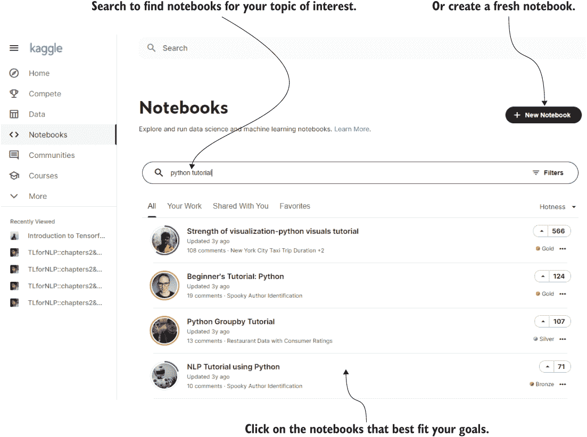
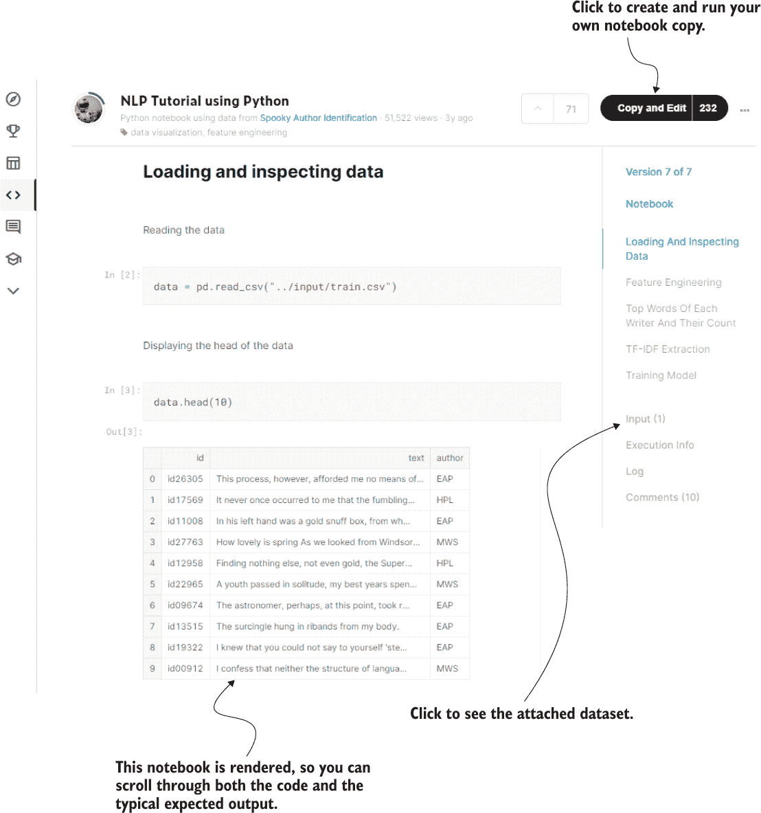
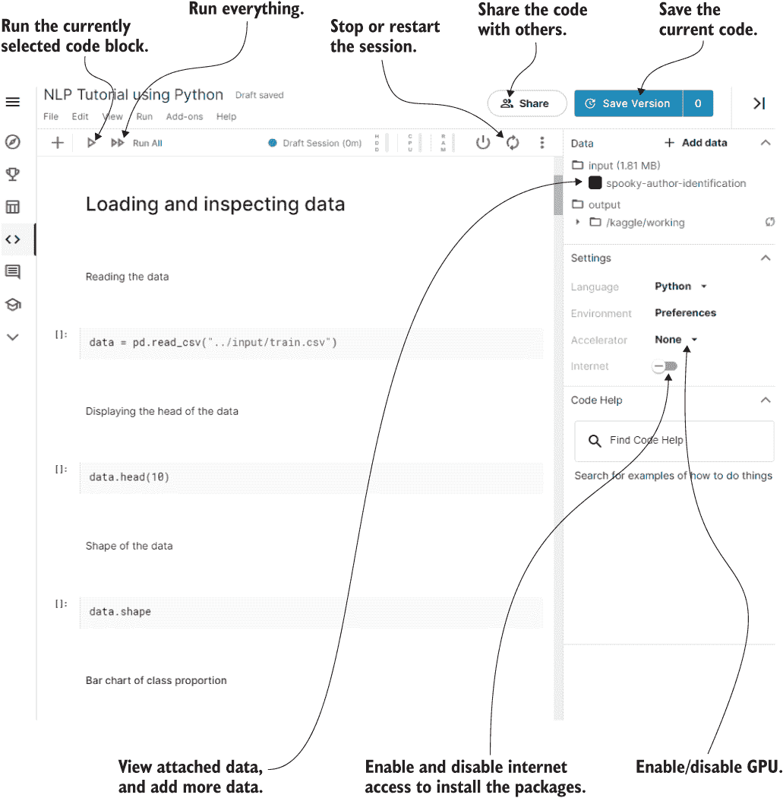
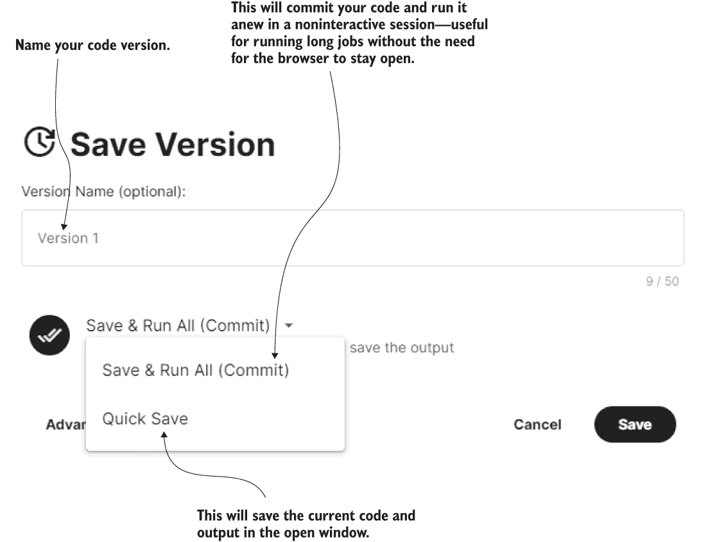
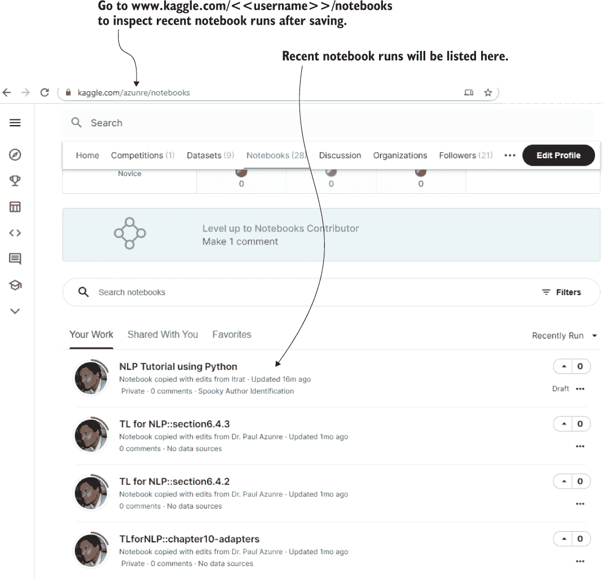
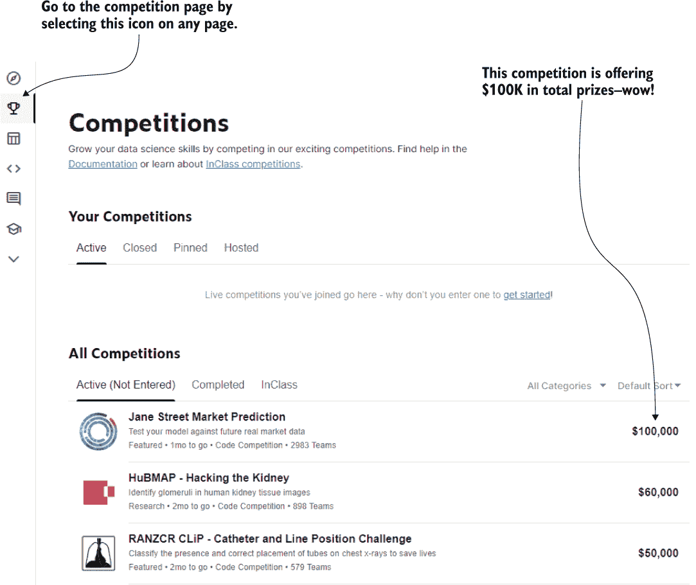
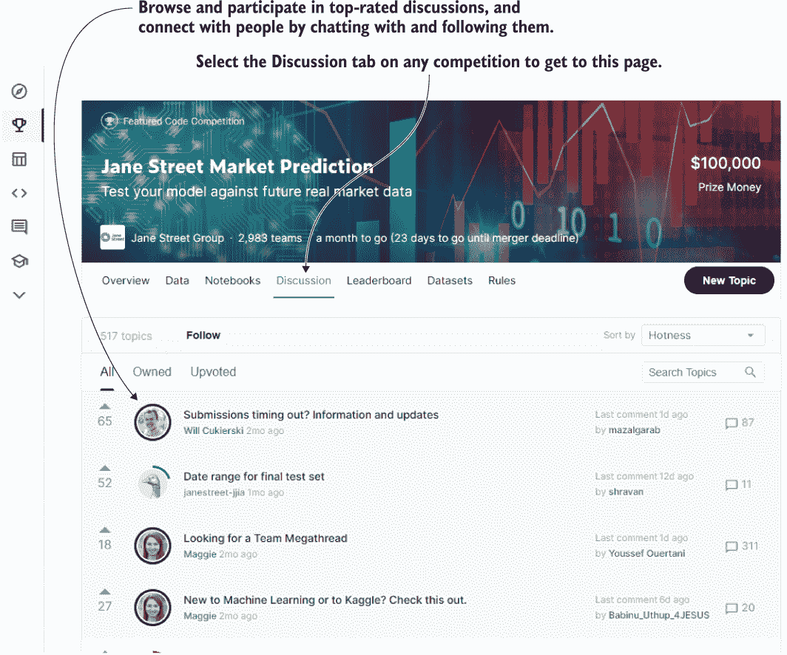

# 附录 A：Kaggle 入门指南

Kaggle 平台为数据科学和机器学习初学者提供了一个学习基本技能的绝佳途径。通过恰当地利用该平台，你有机会在各种数据集上练习各种问题，并与其他机器学习工程师展示和讨论你的工作。这有可能帮助你扩展你的专业网络。重要的是，该平台允许你在云中直接运行 Python 笔记本，这可以显著消除初学者的系统设置障碍。它还每周提供有限的免费 GPU 计算。这进一步使得本书讨论的工具和方法更加民主化。在全书中，我们鼓励你使用 Kaggle 来运行所呈现的代码。

另一个工具——Google Colab——同样提供免费的 GPU 计算，同时与 Google Drive 集成。然而，如果你必须选择一个工具，我会推荐 Kaggle，因为它具有社交性质，可以访问数据集、讨论和竞赛，这些都是非常宝贵的学习资源。当然，在实际情况下，大多数工程师可能会在某个时候同时使用两者，例如为了增加每周的免费 GPU 配额。

在这个附录中，我们试图提供一个简要的入门指南，可以帮助初学者逐步了解 Kaggle 的各种功能。我们将其分为两个部分。首先讨论 Kaggle 内核的概念以运行笔记本，然后查看竞赛、相关讨论和 Kaggle 博客功能。

## A.1 Kaggle 内核提供的免费 GPU

如前所述，你可以在 Kaggle 免费使用云中直接运行 Python 代码。这些云笔记本有时被称为*Kaggle 内核*。在撰写本文时（2021 年 1 月），Kaggle 每周提供约 36 小时的 GPU 时数，你可以为任何你认为可能需要的笔记本启用它。我们将通过演示如何开始，逐步介绍一个对 Python 初学者有用的简单场景。

假设你是一个初学者，并且有兴趣使用这些内核学习基本的 Python 语法。一个很好的开始地方是访问[`www.kaggle.com/kernels`](https://www.kaggle.com/kernels)，然后搜索“Python 教程”。这个搜索结果可能如图 A.1 所示。

图 A.1 开始学习 Kaggle 内核和启动相关笔记本来学习新知识的最佳地点。前往[`www.kaggle.com/kernels`](https://www.kaggle.com/kernels)，然后搜索你感兴趣的主题。在图表中，我们展示了这样一个查询的结果列表，供初学者开始学习 Python 时参考。选择最合适的结果继续。或者使用新笔记本按钮创建一个新笔记本。

如图所示，搜索将返回一系列结果，您可以选择最符合您需求的一个。在这种情况下，初学者可能希望教程直接以 NLP 为重点开始，考虑到书籍的内容，因此可能会选择突出显示的教程笔记本。点击它将会显示相关的渲染笔记本，其中代表性视图如图 A.2 所示。

图 A.2 渲染笔记本的视图，突出显示可以执行的一些关键操作

请注意，所示的视图代表了您在单击书籍存储库中我们的伴随笔记本链接之一时将遇到的第一个视图。¹ 如图所示，笔记本已呈现，这意味着即使不运行代码，您也可以滚动并查看所有代码的代表性输出。

要运行代码，请点击复制并编辑按钮以创建自己版本的笔记本。生成的笔记本将具有相同的依赖项——在 Kaggle 环境中预安装的 Python 库版本和用于生成代表性笔记本输出的库。请注意，如果您点击了图 A.1 中的新笔记本按钮而不是选择复制现有笔记本，则依赖项将是 Kaggle 指定的最新依赖项。因此，您可能需要修改原始代码以使其正常工作，这会增加难度。要完成复制和编辑，或分叉，过程，将要求您提供登录信息。您可以注册您的电子邮件地址，也可以直接使用谷歌等社交账号登录。

为了精确复制我们为本书的伴随笔记本所使用的 Kaggle 环境，我们在伴随书籍存储库中包含了需求文件。请注意，这些需求文件仅用于在 Kaggle 笔记本上复制 Kaggle 环境的目的。如果您试图在本地计算机上使用它们，根据本地架构的不同，您可能会遇到额外的问题，并且可能需要对其进行修改。我们不支持这种模式，如果您正在追求它，请仅将需求文件用作指南。还要记住，并非每个列出的要求都需要在您的本地安装中使用。

单击“复制并编辑”将带您进入主工作区，如图 A.3 所示。如图所示，您可以通过左上角的按钮运行当前选择的单元格，也可以运行笔记本中的所有代码。在右侧面板上，您可以启用或禁用您的互联网连接。下载数据或安装软件包可能需要互联网连接。此右侧面板还包含在当前笔记本中启用 GPU 加速的选项，您需要在合理的时间内训练神经网络。您还将看到当前附加到笔记本的数据集，并且可以单击其中任何一个以转到数据集的描述。单击“添加数据”将打开一个搜索查询框，您将能够按关键字搜索感兴趣的数据集，以添加到当前笔记本。对于本书的所有伴侣笔记本，必要的数据已经附加到笔记本中。

图 A.3 使用 Kaggle 内核时的主工作区。在左上角，是运行笔记本的按钮。在右上角，是共享、保存、重新启动和关闭笔记本的选项。右侧面板包含连接到互联网的选项（用于安装软件包或下载数据）、启用/禁用当前笔记本的 GPU 加速以及添加数据。

在右上角，您可以选择笔记本的共享设置——根据您的项目需要，您可以将笔记本设置为仅自己可见，与其他用户私下共享，或者对外公开。我们所有的伴侣笔记本都是公开的，这样任何人都可以访问，但您可以将它们的分支设置为私有。重要的是，也在右上角，选择保存版本将弹出对话框以保存您的工作，如图 A.4 所示。

图 A.4 笔记本的保存选项。您可以提交代码并让其后续非交互式运行以供以后检查，也可以直接快速保存代码和当前输出。

正如图所示，有两种保存模式。快速保存模式将在版本名称文本博客中保存当前代码和输出。如果当前输出需要几个小时来生成，这将是正确的选择。保存并运行所有选项将保存代码并在后台非交互式地运行它。当运行长时间的训练作业时，例如五六个小时时，这特别有用。您可以关闭会话和所有窗口，并在需要检查结果时随时返回。最近运行/保存的检查通常可以在个性化的 URL www.kaggle.com/<username>/notebooks 上进行，其中 <username> 是您的用户名。对于我的用户名 `azunre`，此页面的视图如图 A.5 所示。

图 A.5 近期运行/保存的检查通常可以在个性化 URL www.kaggle.com/<username>/notebooks 进行，其中 <username> 是您的用户名（此处显示的是我的用户名 `azunre`）。

我们已经介绍了您需要了解的本书练习的主要特性。我们还没有涵盖的许多其他特性，Kaggle 经常会添加更多。通常，快速的谷歌搜索和一些坚持和实验的愿望就足以弄清楚如何使用任何这样的特性。

在下一节中，我们简要讨论 Kaggle 比赛。

## A.2 比赛、讨论和博客

面对技术挑战的领先企业利用 Kaggle 通过为顶级创新提供重大奖金来刺激解决方案的研究和开发。让我们通过选择任何 Kaggle 页面左侧面板上可见的奖杯图标来检查 Kaggle 比赛页面，如图 A.6 所示。

图 A.6 通过选择任何 Kaggle 页面左侧面板上的奖杯图标进入比赛页面。我们可以看到一个比赛提供了总共 $100,000 的奖金——这个问题很可能对该行业非常有价值，以激励这样的投资！

您可以追踪这些比赛，了解行业中最紧迫的问题，同时可以访问基础数据以进行即时测试和实验。您可以按主题浏览当前和过去的比赛，以找到测试您可能有的任何想法的数据。您所需要做的就是将数据集附加到上一节介绍的笔记本中，更改一些路径，然后您应该准备产生一些初步的见解了。当然，如果您能够做到，赢得比赛对于获得金钱奖励来说是很棒的，但是您从实验、失败和再次尝试中获得的学习价值才是真正无价的。事实上，在我看来，通过排行榜的位置可能被认为是中等的比赛问题的解决方案，如果在实践中更容易部署和扩展，那么可能会导致实际影响。这是我个人关心的事情，因此我倾向于将精力集中在对我最感兴趣但我了解最少的问题上，以获取最大的学习价值。

点击任何比赛都会打开一个专门页面，在这里您可以浏览其描述、数据、排行榜，以及重要的是，图 A.7 中显示的“讨论”功能。

图 A.7 讨论功能使您能够与 Kaggle 社区的其他成员就您感兴趣的特定主题进行交流。聊天，扩展您的网络！

正如您可能在图 A.7 中看到的那样，这是一个与问题相关的讨论论坛。人们发布提示和入门笔记，提出重要问题，甚至可能由竞赛组织者回答。例如，如果您遇到特定竞赛数据的任何问题，您很有可能在这里找到答案。许多比赛提供最有价值贡献的奖励——通常是通过点赞来衡量的——这激励人们提供帮助。获胜者经常发布他们的解决方案，有时甚至作为您可以直接重新利用的笔记本。您甚至可以在此建立未来挑战的团队，并建立友谊。参与社区，并回馈一些您从中得到的东西，您可能会学到比其他方式更多。归根结底，科学仍然是一项社会活动，这使得 Kaggle 的这个功能尤为宝贵。

最后，Kaggle 在[`medium.com/kaggle-blog`](https://medium.com/kaggle-blog)上运行一个博客。大型比赛的获胜者经常在这里接受采访，分享他们可以与他人分享的技巧。教程经常发布在各种关键主题上。及时了解这些内容，以确保了解数据科学中最新的新兴研究趋势。

我们希望这个附录是一个有用的练习，并让您跟上了进展。继续前进，Kaggle！

1. [https:/github.com/azunre/transfer-learning-for-nlp](https://github.com/azunre/transfer-learning-for-nlp)
