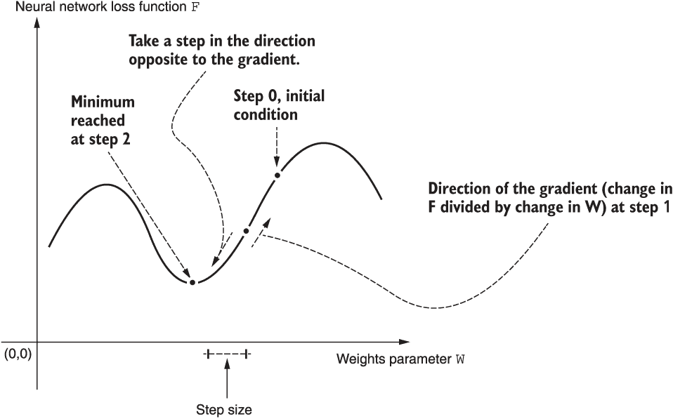
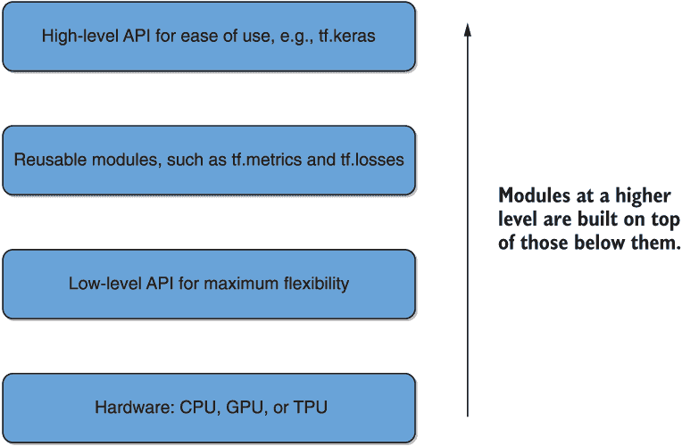

# 附录 B：初级深度学习工具介绍

本附录涵盖

+   介绍本书中使用的五种基本算法和软件工具

+   对训练神经网络使用的算法——随机梯度下降进行概述

+   以 TensorFlow 开始进行神经网络建模

+   以 PyTorch 开始进行神经网络建模

+   对较高级别的神经网络建模框架 Keras、fast.ai 和 Hugging Face transformers 进行概述

在本附录中，我们试图对本书中使用的一些基本工具和概念提供一个简要的入门。对这些工具的简要介绍并不绝对必要，以便理解并充分从本书中受益。不过，阅读它们可以帮助一个新的深度学习领域的人快速融入，并且对他们可能是最有用的。

具体来说，我们首先向读者介绍了我们目前经历的深度学习革命背后的基本算法。当然，这就是用于训练神经网络的*随机梯度下降算法*。接着我们介绍了两种基本的神经网络建模框架，PyTorch 和 TensorFlow。然后我们介绍了这两个建模框架之上构建的三种工具，以提供一个更高级别的接口：Keras、fast.ai 和 Hugging Face transformers。这些工具相互补充，你可能在职业生涯的某个时候都会用到它们。我们对概念的阐述并不是穷尽的；它提供了一个“鸟瞰”为什么这些工具是需要的以及它们如何相互比较和相互补充。我们涉及了介绍性的概念，并引用了精心筛选的参考资料，以便深入研究。如果你觉得自己对这些工具的经验很少，你可能需要在开始阅读本书之前深入研究一下它们。

让我们从深度学习革命背后的算法引擎开始，即随机梯度下降算法。

## B.1 随机梯度下降

神经网络有一组参数，称为*权重*，确定它将如何将输入数据转换为输出数据。确定哪组权重允许网络最接近地逼近一组训练数据称为*训练*网络。随机梯度下降是实现这一目标的方法。

让我们用`W`表示权重，`x`表示输入数据，`y`表示输出数据。我们还用`y_pred`表示神经网络对输入`x`预测的输出数据。损失函数，用于衡量`y`与`y_pred`之间的接近程度，被表示为函数`f`。注意它是`x`、`y`和`W`的函数。随机梯度下降算法被制定为一个过程，以找到`f`的最小值，即预测尽可能接近训练数据的位置。如果`f`的梯度，用`f'`表示，存在——如果它是一个*可微*函数——我们知道在这样的点上`f'=0`。算法试图使用以下步骤序列找到这样的点：

+   从训练集中随机抽取一个输入-输出批次`x-y`的数据。这种随机性是算法被称为*随机*的原因。

+   使用当前`W`的值将输入通过网络以获得`y_pred`*.*。

+   计算相应的损失函数值`f`。

+   计算损失函数相对于`W`的相应梯度`f'`。

+   稍微改变`W`的方向以降低`f`。步长的大小由算法的*学习率*决定，这是收敛的一个非常重要的超参数。

对于过度简单的单个权重的情况，该过程在图 B.1 中的第 2 步找到了算法的最小值。这张图受到弗朗索瓦·朱利叶的优秀书籍《深度学习与 Python》（Manning Publications，2018）中图 2.11 的启发，你也应该查看这本书以获得对该算法非常直观的解释。



图 B.1 展示了随机梯度下降在单个权重的过度简单情况下的示意图。在每一步中，计算相对于`W`的梯度，并采取预先确定大小的步骤，由学习率决定，沿着损失函数梯度的相反方向。在这个假设的情景中，最小值在第 2 步找到。

有许多此算法的变体存在，包括 Adam、RMSprop 和 Adagrad。这些算法倾向于专注于避免局部最小值，并以各种方式（如学习率）进行自适应，以更快地收敛。*动量*的概念——它表现为每一步`W`更新中的额外加法项——被几种这样的变体用来避免局部最小值。以下是一些最流行的变体及简要描述。

*Adagrad* 根据参数遇到的频率调整学习率。罕见的参数会以更大的步长进行更新，以实现平衡。该技术被用于训练 GloVe 静态词嵌入，该词嵌入在本书的第四章中描述。在这种情况下，它需要适当处理语言中的稀有单词。

*RMSprop*是为了解决 Adagrad 的学习速率经常过快下降的问题而开发的。我们可以通过将更新缩放为平方梯度的指数衰减平均值来部分缓解这个问题。

*Adam*表示*自适应矩估计*，也针对不同参数变化学习率。它与 RMSprop 具有相似之处，因为它使用衰减平方梯度平均值来执行更新。衰减平方梯度平均值的第一和二个时刻被估计，更新，然后用于在每个步骤中更新参数。这是尝试解决许多问题的流行算法。

*Nadam*是*Nesterov 加速 Adam*的缩写，采用称为*Nesterov 加速梯度*的创新来进一步改善 Adam 的收敛性。

因为这里的介绍只是一个简短的介绍，而不是详细的处理，所以我们不会更深入地探讨这些变体。这个主题已经被许多优秀的参考文献详细覆盖了¹，²，我们鼓励您深入研究以获得更好的理解。即使您可以在不深入了解这些变体的情况下使用现代框架，更好地了解它们可以帮助您调整超参数，并最终部署更好的模型。

## B.2 TensorFlow

如前一节所述，了解损失函数相对于神经网络权重的梯度对于训练网络至关重要。由于现代神经网络是巨大的，达到数十亿个参数，因此手动计算此梯度函数将是不可能的。相反，使用 TensorFlow 等基本神经网络建模工具，通过应用取导数的链式法则自动找到梯度来计算它。这个过程被称为*自动微分*。

Tensorflow 中的基本数据结构是*张量*，通过构建一个*计算图*来对其进行操作。在框架的 1.x 版本中，通过多种 API 调用`tf.*`来构建图，并使用`Session`对象编译和执行它以产生数值。示例 B.1 中演示了使用此 API 定义图形并执行其梯度计算的说明性示例。具体来说，我们需要计算矩阵乘积`z = x*y`，其中`x`是简单的列向量，而`y`是简单的行向量。我们还希望自动计算它相对于`x`和`y`的梯度。

示例 B.1 使用 TensorFlow 1 计算矩阵乘积 z = x * y 及其梯度

```py
import tensorflow as tf                                                   ❶

tf.compat.v1.disable_eager_execution()                                    ❷

x = tf.compat.v1.placeholder(tf.float32, name = "x")                      ❸
y = tf.compat.v1.placeholder(tf.float32, name = "y")

z = tf.multiply(x, y) # Define vector product graph
gradient = tf.gradients(z,[x, y],grad_ys=tf.eye(2))                       ❹

with tf.compat.v1.Session() as session:                                   ❺
    z = session.run(z, feed_dict={x: [[1., 1.]], y: [[5.], [5.]]})        ❻
    zG = session.run(gradient,feed_dict={x: [[1.,1.]], y: [[5.],[5.]]})   ❼

print("Product:")                                                         ❽
print(z)                       
print("\n\n")                  
print("Gradient of Product:")  
print(zG)                      
print("\n\n")                  
```

❶总是先导入 TensorFlow

❷Eager 执行在 2.0 之前作为非默认值引入，因此在此确保其关闭。

❸定义留给后面分配值的向量变量占位符

❹ 定义了乘积的向量导数图，相对于 x 和 y。参数 `grad_ys` 乘以输出，可用于取链导数，因此我们将其设置为单位矩阵以无效果。

❺ 使用 Session 对象执行图

❻ 运行函数，指定占位符的值

❼ 运行梯度，指定占位符的值

❽ 显示结果

执行此代码将产生以下输出。您应该能够手动验证这些值是否正确，使用您的基本线性代数知识，这是本书的先决条件。我们还在书的伴随存储库中包含了一个 Kaggle 内核笔记本，执行这些命令。³

```py
Product:
[[5\. 5.]
 [5\. 5.]]

Gradient of Product:
[array([[5., 5.]], dtype=float32), array([[1.],
       [1.]], dtype=float32)]
```

框架的 2.0 版及更高版本将更“Pythonic”的 *eager execution* 模式作为默认模式，这使得框架更易于使用。它现在还包括了 Keras，使得使用各种高级功能更加容易。下一个列表中显示了使用此 API 定义和执行与列表 B.1 中相同图形的说明性示例。更易于访问性立即变得明显，eager 模式使得立即执行变得可能，而不是通过图上的 `Session` 对象。

列表 B.2 计算矩阵乘积 z = x*y 及其在 TensorFlow 2 中的梯度

```py
import tensorflow as tf

x = tf.convert_to_tensor([[1., 1.]])            ❶
y = tf.convert_to_tensor([[5.], [5.]])          ❷

with tf.GradientTape() as g:                    ❸
    g.watch(x)
    z = tf.multiply(x, y)
    dz_dx = g.gradient(z, x, output_gradients=tf.eye(2))

with tf.GradientTape() as g:                    ❹
    g.watch(y)
    z = tf.multiply(x, y)
    dz_dy = g.gradient(z, y, output_gradients=tf.eye(2))

print("Dot Product:")                           ❺
print(z)
print("\n\n")
print("Gradient of Product (dz_dx):")
print(dz_dx)
print("\n\n")
print("Gradient of Product (dz_dy):")
print(dz_dy)
```

❶ 列向量

❷ 行向量

❸ 这是如何相对于 x 计算自动导数的。这里的“Tape”一词表示所有状态都被“记录”，可以播放回来以检索我们需要的信息。

❹ 这是如何相对于 y 计算自动导数的。参数 `output_gradients` 乘以输出，可用于取链导数，因此我们将其设置为单位矩阵以无效果。

❺ 显示结果

执行此代码应产生与之前相同的输出值。

框架按层次结构组织，具有高级和低级 API，如图 B.2 所示。



图 B.2 TensorFlow 框架的分层组织示意图

此图受官方 TensorFlow 文档第 1 图的影响。⁴ 如果您是初学者，并且想更详细地浏览此参考资料，这可能会有所帮助。在附录的最后一节将进一步讨论 TensorFlow 版本的 Keras，该版本也显示在图中。

更好地了解 TensorFlow 各种特性的方法是动手尝试相关的 Kaggle 内核/笔记本教程，如附录 A 中所述。特别是，只需访问 kaggle.com 并搜索“TensorFlow 教程”即可找到大量精彩的教程，您可以选择最适合您的学习风格和经验水平的内容。[`www.kaggle.com/akashkr/tensorflow-tutorial`](https://www.kaggle.com/akashkr/tensorflow-tutorial) 上的教程似乎对初学者很有帮助。

## B.3 PyTorch

这个框架在 TensorFlow 之后发布（2016 年对比 2015 年）。然而，它很快就成为许多研究人员首选的框架，如 TensorFlow 相对 PyTorch 在学术论文引用方面的相对流行度下降所证明的那样。⁵ 这种增加的流行度被普遍认为是因为该框架能够在运行时以编程方式修改各种 PyTorch 模型对象，从而在研究过程中更容易进行代码优化。事实上，TensorFlow 2.0 中的急切模式的引入被普遍认为受到了 PyTorch 成功的影响。尽管在 TensorFlow 2.0 发布后，这两个平台之间的差异变得更小了，但普遍的观点是，研究人员更喜欢 PyTorch，而 TensorFlow 更适用于在生产中部署。

作为例证，我们在 PyTorch 中执行与清单 B.1 和 B.2 相同的操作序列 —— 向量乘法及其导数，这是神经网络模型的核心 —— 并在下一个清单中展示相应的代码。

清单 B.3 在 PyTorch 中计算矩阵乘积 z = x*y 及其梯度

```py
import torch                                                               ❶
from torch.autograd import grad                                            ❷
import numpy as np # tensors will be built from numpy arrays

x = torch.from_numpy(np.array([[1., 1.]]))                                 ❸
y = torch.from_numpy(np.array([[5.], [5.]]))                               ❹

x.requires_grad = True                                                     ❺
y.requires_grad = True

z = torch.mul(x, y)                                                        ❻

zGx = grad(outputs=z, inputs=x,grad_outputs=torch.eye(2),retain_graph=True)❼
zGy = grad(outputs=z, inputs=y,grad_outputs=torch.eye(2))                  ❽

print("Dot Product")                                                       ❾
print(z)
print("Gradient of Product(dz_dx)")
print(zGx)
print("\n\n")
print("Gradient of Product (dz_dy):")
print(zGy)
```

❶ 总是首先导入 PyTorch。

❷ 导入 grad 函数进行自动微分

❸ 列向量

❹ 行向量

❺ 这确保了可以针对 x 计算梯度。

❻ 计算乘积

❼ 针对 x 计算自动导数。retain_graph 确保我们可以继续进行导数计算；否则，“Tape” 将被丢弃，无法回放。

❽ 针对 y 计算自动导数。参数 grad_outputs 乘以输出，可以用于进行链式导数，因此我们将其设置为单位矩阵以无效果。

❾ 显示结果

执行此代码应该产生与前一节相同的结果。我们还在本书的伴随存储库中包含了一个 Kaggle 内核笔记本，执行这些命令。

和以前一样，我们建议通过一些 Kaggle 内核来熟悉 PyTorch 的各个方面，如果你觉得自己可能需要更多经验的话。[`www.kaggle.com/kanncaa1/pytorch-tutorial-for-deep-learning-lovers`](https://www.kaggle.com/kanncaa1/pytorch-tutorial-for-deep-learning-lovers) 上的教程似乎是初学者的好选择。

## B.4 由 Hugging Face 提供的 Keras、fast.ai 和 Transformers

正如在附录中早前提到的，Keras 库是一个更高级的神经网络建模框架，现在也包含在 TensorFlow 2.0 及更高版本中。通过使用它，你可以在 TensorFlow 和 PyTorch 中指定神经网络架构，只需从一个 API 中切换后端即可！它与 TensorFlow 预先打包在一起，如我们在图 B.2 中所示。与 TensorFlow 和 PyTorch 相比，其 API 相对简单，这使得它非常受欢迎。存在许多优秀的学习资源，也许最好的资源之一是作者自己的书籍。这也是学习 TensorFlow 和神经网络的绝佳参考资料，如果你觉得需要复习这些主题，我们强烈推荐它。你也可以通过一些 Kaggle 内核来学习一些基础知识，例如 [`www.kaggle.com/prashant111/keras-basics-for-beginners`](https://www.kaggle.com/prashant111/keras-basics-for-beginners) 上的教程只是一个很好的例子。

在该领域另一个流行的高级建模 API 是 fast.ai。这个库是作为同名大型在线课程（MOOC）的伴侣而开发的，并以一种极易使用的方式实现了最先进的方法。其动机之一是将这些工具普及到发展中国家。该库的一个受欢迎功能是其学习率确定实用程序，我们在本书的第九章中使用了它。该框架用于自然语言处理和计算机视觉，并运行在 PyTorch 上。自然，学习该库的最佳参考资料是 fast.ai MOOC 本身。这门免费课程涵盖了神经网络和深度学习的基础知识，是另一个我们强烈推荐的精彩资源。该库通过定义其自己的一套数据结构来实现简单化，这些数据结构处理了用户的大量样板代码。另一方面，这可能会使其对非标准用例的定制更加困难。在作者的经验中，这是一个拥有的绝佳工具。

最后，Hugging Face 的 Transformers 是一个专门针对基于 Transformer 模型的高级建模框架。这些模型已经成为现代自然语言处理中可能是最重要的架构。你将在整本书中准确了解其中的原因。这个库可能是当今领域中最受欢迎的库，因为使用它部署这些模型非常简单。在这个库存在之前，使用 Keras、TensorFlow 和/或 PyTorch 部署 Transformer 模型相当繁琐。该库在某些情况下简化了这个过程，只需几行 Python 代码，导致其受欢迎程度激增，并被认为是现代自然语言处理从业者不可或缺的工具。由于 API 的透明度和简单性，你可能只需阅读本书并通过相关示例进行工作，甚至无需任何先前的使用经验即可。如需进一步参考，请查看作者在 GitHub 上的入门笔记⁹以及官方快速入门文档¹⁰。

1. F. Chollet，《Deep Learning with Python》（Manning Publications，2018）。

2. S. Ruder，“梯度下降优化算法概述”，arXiv（2016）。

3. [`github.com/azunre/transfer-learning-for-nlp`](https://github.com/azunre/transfer-learning-for-nlp)

4. [`developers.google.com/machine-learning/crash-course/first-steps-with-tensorflow/toolkit`](https://developers.google.com/machine-learning/crash-course/first-steps-with-tensorflow/toolkit)

5. [`en.wikipedia.org/wiki/TensorFlow`](https://en.wikipedia.org/wiki/TensorFlow)

6. [`github.com/azunre/transfer-learning-for-nlp`](https://github.com/azunre/transfer-learning-for-nlp)

7. F. Chollet，《Deep Learning with Python》（Manning Publications，2018）。

8. [`www.fast.ai/`](https://www.fast.ai/)

9. [`github.com/huggingface/transformers/tree/master/notebooks`](https://github.com/huggingface/transformers/tree/master/notebooks)

10. [`huggingface.co/transformers/quicktour.html`](https://huggingface.co/transformers/quicktour.html)
