# 第一章：机器学习简介

“世界上只有模式，模式之上的模式，影响其他模式的模式。被模式隐藏的模式。模式中的模式。” - 查克·帕拉尼克

我们喜欢模式。无论是我们的业务还是我们的生活，我们都会发现模式，并且（通常）倾向于坚持它们。我们有自己喜欢购买的杂货，使用的电信运营商和通话套餐，关注的新闻文章，电影类型和音轨 - 这些都是我们喜好模式的例子。我们热爱模式，而且比模式更喜欢的是发现它们，整理它们，也许习惯于它们！

有一句俗语流传开来 - “数据是新的电力”。数据确实宝贵；这一点无人能否认。但纯粹的数据将毫无用处。我们必须清洗数据，分析和可视化数据，然后我们才能从中获得见解。数据科学、机器学习和人工智能正在帮助我们揭示这些模式 - 从而使我们在活动和业务中能够做出更具洞察力和平衡的决策。

在这本书中，我们将解决一些这样的奥秘。我们将研究一种被称为无监督学习的机器学习分支。无监督学习解决方案是正在改变行业面貌的最有影响力的方法之一。它们被应用于银行和金融、零售、保险、制造业、航空、医学科学、电信等几乎每个行业。

在整本书中，我们讨论了无监督学习的概念 - 算法的基本构建块，它们的细节，背景过程和数学基础。我们审视了这些概念，研究了最佳实践，分析了常见的错误和陷阱，并以案例研究为基础的方法来补充学习。与此同时，我们正在编写解决这些问题的实际 Python 代码。所有的代码都附有逐步解释和注释。

本书分为三个部分。第一部分探讨了无监督学习的基础知识，并涵盖了更简单的概念，如 k 均值聚类、层次聚类、主成分分析等。这一部分为你未来的旅程温和地做了准备。如果你已经精通这些主题，可以直接开始阅读本书的第二部分。建议你快速阅读这些章节，以便刷新概念。

第二部分处于中级水平。我们从关联规则算法如 apriori、ECLAT 和序列规则挖掘开始。然后我们加快步伐，研究更复杂的算法和概念 - 光谱聚类、GMM 聚类、t-SNE、多维缩放（MDS）等。然后我们在下一章节处理文本数据。

第三部分也是最后一部分是高级内容。我们正在讨论像受限玻尔兹曼机、自编码器、生成对抗网络等复杂主题。我们还在书的最后一章中考察了端到端模型开发，包括模型部署、最佳实践和常见陷阱。

当您完成本书时，您将对基于无监督技术的机器学习、各种算法、算法依赖的数学和统计基础、业务用例、Python 实现以及遵循的最佳实践有很好的理解。

本书适合希望深入了解无监督学习算法的学生和研究人员。它适合追求数据科学职业的专业人士，他们希望了解遵循的最佳实践和常见挑战的解决方案。内容非常适合希望在与团队和客户交流时保持信心的经理和领导。最重要的是，适合有好奇心的人，他们打算接受有关无监督学习算法的教育，并开发 Python 经验来解决案例研究。

建议您具有基本的编程理解，比如 C ++、Java、Objective-C 等面向对象的语言。我们将在整本书中使用 Python，所以如果您熟悉 Python，肯定会有所帮助。对数学和几何的基本理解将有助于可视化结果，并且对数据相关用例的一些了解将有助于与业务用例联系起来。最重要的是，全书各章节都需要保持开放的心态来吸收知识。

第一章旨在向您介绍机器学习的概念。在这一开篇章节中，我们将涵盖以下主题：

1.  数据、数据类型、数据管理和质量

1.  数据分析、机器学习、人工智能和深度学习

1.  机器学习的基本知识

1.  不同类型的机器学习算法

1.  可用的技术工具包

1.  总结

让我们首先了解我们拥有的最小颗粒——“数据”作为第一个主题。欢迎来到第一章，祝你一切顺利！

## 1.1 数据、数据类型、数据管理和质量

我们从一切的主角“*数据*”开始。数据可以被称为为执行任何类型的分析或研究而收集的事实和统计数据。但是数据有自己的特性、属性、质量措施和管理原则。它被存储、导出、加载、转换和测量。

我们现在将研究所有这些内容——从数据的定义开始。然后我们将继续讨论不同类型的数据、它们各自的示例以及使数据有用且质量良好的属性是什么。

### 1.1.1 什么是数据

“数据”是无处不在的。使用移动网络打电话 - 你正在产生数据。预订即将到来的假期的机票和酒店 - 正在创建数据。进行银行交易，浏览社交媒体和在线购物网站，购买保险政策，或购买汽车 -任何地方都会产生数据。它从一种形式转变为另一种形式，被储存、清理、管理和分析。

正式地说 - 数据是一组事实、观察、测量、文字、数字、图像和视频。它可能是干净的或不干净的，有序的或无序的，包含混合数据类型的，或者完全纯粹的和历史的或实时的。

##### 图 1.1 我们如何将原始数据转化为信息、知识，最终洞见，可以在业务中用来推动决策和行动

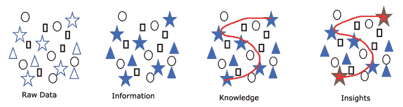

数据本身是没有用的，直到我们清理它、整理它、分析它并从中得出见解。我们可以在（图 1.1）中可视化这种转变。原始数据转换为信息，当我们可以在其中找到区别时。当我们相关术语并*“串联数据”*时，同一段信息变成了知识。洞察力是我们能找到主要中心和显著点的阶段。一个洞察力必须是可操作的，简明扼要和直接的。例如，如果一个电信运营商的客户保留团队被告知那些 9 天内没有打电话的客户较之打电话的客户流失的几率要大 30%，这将是一个有用的洞察力，他们可以加以工作并尝试解决。同样，如果一个制造工厂中的线路技术员被告知使用 Mould ABC 比使用 Mould PQR 导致的瑕疵多 60%，他们就会避免使用这种组合。对于企业团队来说, 洞察力非常有用，因此他们可以采取纠正措施。

我们现在知道什么是数据。让我们研究各种类型的数据及其属性，深入了解数据。

### 1.1.2 不同类型的数据

数据是我们进行的所有交易中生成的，无论是在线还是线下，正如我们在本章的开始讨论的那样。我们可以把数据大致分类如下图 1.2 所示：

##### 图 1.2 数据可以划分为定量和定性类别，再进行进一步的细分

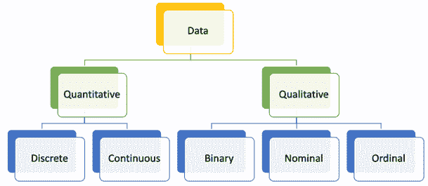

1.  **定性数据**是一种无法测量或称重的数据类型，例如口味、颜色、气味、健身、名称等。它们只能以主观方式观察。正式地说，当我们对某物进行分类或对其进行分类时，生成的数据是定性的。例如，彩虹中的颜色，国家中的城市，产品的质量，性别等。它们也被称为*categorical*变量。定性数据可以进一步细分为二进制、名义和序数数据集。

1.  二进制数据, 顾名思义, 只有两个互斥的类。例如, 是 / 否, 干燥 / 湿润, 硬 / 软, 好/坏, 真/假等。

1.  名义数据可描述为分类的数据类型，但它没有任何顺序或顺序。例如，一个国家使用不同的语言，一道彩虹中的颜色，客户可用的服务类型，一个国家中的城市等。

1.  顺序数据与名义数据类似，只是我们可以按顺序排列它。例如，快速/中等/慢，积极/中立/消极等。

1.  **定量数据**：所有可以测量、称重、量化、记录等的数据点都是定量数据。例如，身高、收入、客户数量、需求量、面积、体积等。它们是最常见的数据形式，也允许对它们进行数学和统计操作。定量数据进一步细分为离散和连续：

1.  离散数据是精确的、直截了当的，且为整数。例如，飞机上的乘客数量或城市的人口不能是小数。

1.  连续数据点可以取任何值，通常在一个范围内。例如，身高可以取小数值，或者产品价格不一定是整数。

任何数据点通常都会落入上述讨论的类别中。这些类别基于变量及其类型。还可以使用来源和用途进行更多的逻辑分组，这在解决业务问题时非常有意义。这种分组允许我们设计针对数据类型定制的解决方案。

根据来源和用途的不同，我们还可以将数据分为两大类：非结构化数据和结构化数据。

1.  **结构化数据**：可以轻松表示为行列结构的数据集是结构化数据集。例如，零售店中 5 位客户的交易可以存储如下所示的表格（表 1.1）：

##### 表 1.1 结构化数据集的示例，具有金额、日期、城市、商品等属性。

| 客户 ID | 交易日期 | 金额（美元） | 物品数量 | 付款方式 | 城市 |
| --- | --- | --- | --- | --- | --- |
| 1001 | 2020 年 6 月 1 日 | 100 | 5 | 现金 | 新德里 |
| 1002 | 2020 年 6 月 2 日 | 101 | 6 | 卡 | 纽约 |
| 1003 | 2020 年 6 月 3 日 | 102 | 7 | 卡 | 伦敦 |
| 1004 | 2020 年 6 月 4 日 | 103 | 8 | 现金 | 都柏林 |
| 1005 | 2020 年 6 月 5 日 | 104 | 9 | 现金 | 东京 |

在上表中，对于每个唯一的客户 ID，我们有交易日期、花费金额、购买物品数量、付款方式和交易所在城市。这种数据类型可以扩展到员工详细信息、通话记录、银行交易等。

##### 注意

分析和模型构建中使用的大多数数据是结构化的。结构化数据更容易以图表和图形的形式存储、分析和可视化。

我们有很多针对结构化数据的算法和技术 - 在日常现实世界的语言中，我们主要指的是结构化数据。

1.  **非结构化数据**：非结构化数据可以是文本、音频、图像或视频。非结构化数据及其相应来源的示例如下图 1.3 所示，我们在其中解释了非结构化数据的主要类型：文本、图像、音频和视频以及它们的示例：

##### 图 1.3 非结构化数据及其各种类型和示例。这些数据通常很难分析，并且通常需要基于深度学习的算法。

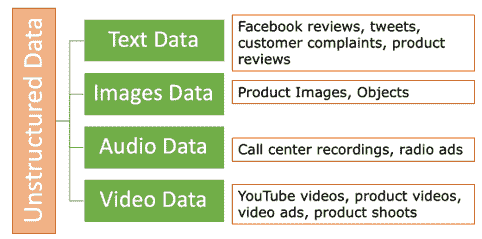

值得注意的是，我们的计算机和处理器只能理解二进制数字。因此，这些非结构化数据点仍然需要表示为数字，以便我们可以对其进行数学和统计计算。例如，一幅图像由像素组成。如果是彩色图像，每个像素将具有 RGB（红、绿、蓝）值，而每个 RGB 可以取值范围为（0-255）。因此，我们可以将图像表示为矩阵，进而进行更多的数学计算。类似地，文本、音频和视频也可以被表示。

##### 注意

大多数基于深度学习的解决方案，如 CNN 和 RNN，都用于处理非结构化数据。我们将在本书的后期阶段处理文本和图像数据。

非结构化数据的表示如下例所示（见图 1.4）。我们展示了一张吸尘器的图片。如果将图像的一部分表示为矩阵，将会是这样的。这仅用于说明目的，而不是实际值。

##### 图 1.4 一个示例非结构化数据的图像可以表示为一个矩阵以进行分析

同样，我们可以有文本、音频或视频数据的表示。由于规模庞大和维度众多，非结构化数据处理和建模复杂，因此大多数基于深度学习的模型能够胜任。这些深度学习模型构成了基于人工智能的解决方案的基础。

这些是数据的广义类型。我们可以有更多的类别，如比率或标度，可以用来定义一个变量与另一个变量的关系。所有这些数据点（无论是结构化还是非结构化）都是根据它们在现实生活中生成的方式来定义的。

所有这些数据点都必须被捕获、存储和管理。有很多工具可用于管理数据，我们将在适当的时候讨论其中的一些。但在此之前，让我们先研究一个最关键但往往不被过多谈论的主题 - *数据质量*。

### 1.1.3 数据质量

“垃圾进，垃圾出” - 这个原则总结了良好质量数据的重要性。如果数据不干净、可用、正确和相关，我们将无法解决手头的业务问题。但是，“良好质量”是什么意思呢？我们在下面的图 1.5 中展示了数据质量的主要组成部分，让我们逐一探讨它们。

##### 图 1.5 数据质量至关重要，优质数据的属性如图所示。

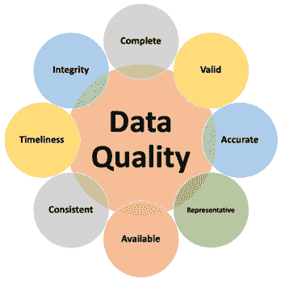

优质数据的主要属性有：

1.  **完整性**：我们期望我们的数据集是完整的，不缺少任何值。例如，如果我们正在处理一年的销售数据，良好的数据将具有所有 12 个月的所有值。那么它将是一个完整的数据源。数据集的完整性确保我们没有漏掉重要的变量或数据点。

1.  **有效性**：数据的有效性是指其符合我们用例中存在和正在分析的属性、特征和变化的程度。有效性表明我们捕获的观察和测量是否可靠和有效。例如，如果研究的范围是 2015-2019 年，那么使用 2014 年的数据将是无效的。

1.  **准确性**：准确性是数据正确性的属性。如果我们有不准确的数据，我们将生成不准确的见解，行动将是错误的。一个好的做法是通过生成 KPI（关键绩效指标）来开始项目，并将它们与业务报告的数字进行比较，以检查我们手头的数据的真实性。

1.  **代表性**：这是数据中最重要的属性之一。但通常也是最被低估的。数据的代表性意味着所使用的数据真正捕捉到业务需求，而不是有偏见的。如果数据集存在偏见或代表性不够，生成的模型将无法对新的和未见过的数据进行预测，整个工作将付诸东流。

1.  **可用性**：数据的不可用性是我们经常面临的挑战。数据可能无法为业务问题提供，然后我们面临是否继续使用案例的困境。有时我们面临操作挑战，无法访问数据库或面临权限问题，或者数据可能根本不可用于某个特定变量，因为它没有被捕获。在这种情况下，我们必须使用现有的数据，并使用替代变量。例如，想象一下我们正在解决一个需求生成的问题。我们想要预测在即将到来的销售季节期间可以预期在特定商店的顾客人数。但我们没有记录过去几个月访问的客户数量。然后我们可以使用收入作为替代字段，并为我们合成缺失的数据点。

1.  **一致性**：在这里，我们检查数据点在系统和界面之间是否一致。不应该出现一个系统报告不同的收入数字，而另一个系统显示完全不同的值的情况。面对这种问题时，我们根据我们手头的数据生成相应的 KPI，并向业务团队寻求指导。

1.  **及时性**：这意味着我们在此时拥有所有所需的数据。如果数据集目前不可用，但将来可能会变得可用，那么最好等待到那时。

1.  **完整性**：我们拥有的数据表和变量彼此关联和相互关联。例如，员工的详细信息可能分布在多个表中，这些表使用员工 ID 相互关联。数据完整性解决了这一要求，并确保表之间和各个实体之间的所有这些关系是一致的。

数据的良好质量至关重要。在务实的日常业务中，我们经常*无法*获得高质量的数据。由于多种挑战，很难在系统中找到良好、干净、可访问、一致、代表性和完整的数据。

质量的降低可能是由于数据捕获和收集、导出或加载、所进行的转换等过程中的挑战所导致的。下面列出了一些问题：

1.  我们可能会在某些列中得到整数作为名称，或者得到特殊字符如“#$!&”，或者得到空值、空白或 NaN（不是一个数字）作为一些值。

1.  记录中的重复也是我们面临的问题之一。

1.  异常值是我们经常需要处理的问题之一。例如，假设一个在线零售商的平均日交易量为 1000。有一天，由于服务器问题，没有进行交易。这是一个异常值情况。又比如，有一天，交易数量是 1,000,000。这又是一个异常值的例子。

1.  然后有关于一天中的时间和一周中的日子的季节性变化和运动 - 所有这些都应该在数据集中足够具有代表性。

1.  日期格式的不一致会导致在我们尝试合并多个数据源时出现多种挑战。来源 1 可能使用 DD/MM/YYYY，而另一个可能使用 MM/DD/YYYY。这在数据加载步骤中要加以注意。

所有这些异常和质量问题都必须得到彻底解决和清理。我们将在整本书中解决这些数据问题，并分享应遵循的最佳实践。

##### 注意

您的原始数据的质量以及在清理过程中表现出的严谨性 - 定义了您最终分析的影响和解决方案的成熟度。

我们现在已经定义了数据的主要属性。我们现在将研究用于数据工程和管理的广泛过程和技术。

### 1.1.4 数据工程和管理

强大的数据工程流程和成熟的数据管理实践是成功的机器学习模型解决方案的先决条件。请参考下面的图 1.6，在其中描述了从数据捕获、数据管道和数据加载的过程直到准备好进行分析的点的端到端数据旅程。

##### 图 1.6 数据工程为数据分析铺平了道路。它涉及数据加载、转换、丰富、清理、准备等过程，从而产生了准备好进行分析的数据。

在数据工程步骤中，数据经过清洗、整理、重塑、转换和摄入。通常情况下，我们有一个服务器，最终的数据存储在那里，准备好进行访问。最常用的过程是创建一个 ETL（导出，转换，加载）过程。然后我们使数据准备好进行分析。我们创建新的变量，处理空值，使用方法丰富数据，最后我们继续到分析/建模阶段。

##### 提示

了解数据工程的基础知识是一个不错的主意，以补充关于数据科学的知识，因为两者是相辅相成的。

因此，我们已经学习了什么是数据，以及好数据的特点。数据被用于分析、建模、可视化、仪表板和洞察力的生成。很多时候，我们发现在业务中数据分析、数据科学、机器学习、数据挖掘、人工智能、商业智能、大数据等术语被相当互换地使用。澄清它们是一个不错的主意 – 这是下一节的主题。我们会讨论到为每个特定功能所提供的大量工具。我们还将了解软件工程在整个过程中的作用。

## 1.2 数据分析、机器学习、人工智能和商业智能

数据及其重要性在市场上开辟了新的机会，并创造了大量的工作机会。与此同时，机器学习和人工智能是相对较新的领域，因此在工作范围上存在较少的标准化和区分。这导致这些领域的定义和区分不太清晰。我们正在研究这些领域 – 它们在哪些地方有重叠，它们在哪些地方不同，以及一个领域如何赋予另一个领域动力。可以通过下面的图表来可视化（图 1.7）：

每个功能相互赋予动力，并相互补充。

##### 图 1.7 各个领域是如何相互关联的，以及它们如何相互依赖的

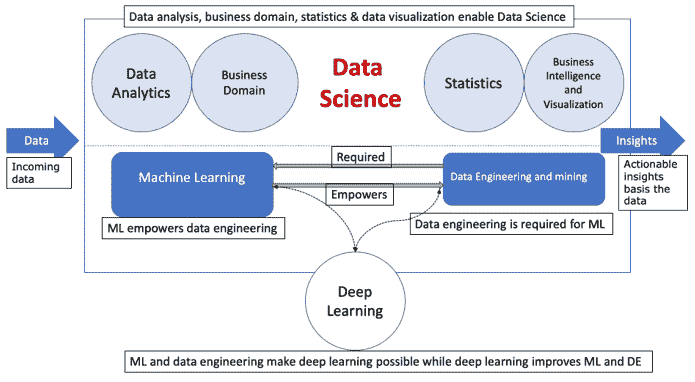

数据挖掘和数据工程通过提供分析所需的数据来启动它。它还导出、转换、清理和加载，以便所有相关的功能可以使用。商业智能和可视化使用这些数据生成报告和仪表板。数据分析使用数据生成洞察和趋势。数据科学建立在数据分析、统计学、商业智能、统计学、数据可视化、机器学习和数据挖掘的基础上。机器学习创建统计和数学模型。人工智能进一步推动了能力。

机器学习使用传统编码。编码是用传统语言完成的，因此计算机科学和软件工程的所有逻辑和规则在机器学习中也是有效的。机器学习帮助我们理解我们否则无法理解的数据。在这个方面，它是一个了不起的解决方案。它可以与历史趋势相关联。机器学习最吸引人的优点是其能够处理视频、音频、图像、文本或传感器生成的复杂数据集等非常复杂和高维的数据点。它使我们能够超越表面的看法。现在人工智能可以实现以前被认为完全不可能的壮举。比如自动驾驶汽车、聊天机器人像人类一样对话、语音转文本和翻译成其他选择的语言、自动评分文章、图片标题等等。

现在我们清楚了各个领域之间的差异以及它们之间的相互联系，以及机器学习与传统软件工程的区别。这是我们讨论的主题的基础，进一步探讨了机器学习及其各个组成部分，不同类型的机器学习算法以及它们各自的用例。

## 1.3 机器学习的要领

想象一下。如果一个孩子要学会如何打开门把手，我们会向她展示几次确切的步骤。孩子试图打开它，但失败了。再试一次，又失败了。但在随后的每次尝试中，孩子都在改进方法。过了一段时间，孩子就能打开门把手了。或者当我们试图学会开车时，我们会犯错误，我们从中学习，我们改进。*机器学习*的工作方式类似——统计算法查看历史数据并找到模式和见解。该算法揭示了关系和异常、趋势和偏差、相似性和差异，然后将可操作的结果返回给我们。

正式来说，机器学习可以被称为一种计算机算法的分支或研究，它通过历史数据生成见解并帮助做出数据驱动的决策。这些算法基于统计和数学基础，因此具有合理的逻辑解释。机器学习算法需要编码，可以使用任何可用的语言和工具进行，如 Python、R、SPSS、SAS、MATLAB、Weka、Julia、Java 等。它还需要对业务领域有一定的理解。

##### 注意

语言只是达到目的的手段。即使在不同的语言中使用，所有语言对机器学习算法生成的结果都是相似的。

所以每当你在网上购物买裙子时，网站为你推荐配饰，或者你在预订机票时，旅行运营商根据你的需求和计划为你展示一份定制的优惠 – 机器学习都在背后。它学习了你的偏好并将其与你的历史趋势进行比较。它还在寻找你与行为几乎相同的其他客户的相似之处。基于所有这些分析，算法向你做出了智能的推荐。相当迷人，对吧？

许多时候我们会问这个问题，为什么我们需要机器学习，为什么它能超越人类智慧？原因是，我们人类只能同时分析两个或者也许三个维度。但是机器学习算法可以同时处理 50、60 或者也许是 100 个维度。它可以处理任何类型的数据，无论是结构化的还是非结构化的，并且可以帮助自动化任务。因此它生成的模式和见解对于人类大脑来说是相当难以可视化的。

与任何其他项目一样，机器学习需要一个专家团队，他们密切合作，并互补彼此的技能。如下图 1.8 所示，机器学习项目需要以下角色：

+   **业务利益相关者和主题专家（SME）：** 他们为项目定义业务问题。他们拥有解决方案，对要求有清晰的理解，并且有一个明确的可衡量目标。他们在团队混淆时进行纠正，并作为业务流程和运营的深度了解的专家。他们是营销经理、产品所有者、流程工程师、质量专家、风险分析师、投资组合负责人等。

##### 注意

业务利益相关者从第一天起与团队紧密联系是至关重要的。

+   **运营团队：** 这个团队由 Scrum Master、项目经理、业务分析师等组成。该团队的角色可以与典型的项目管理团队相比较，其跟踪进度，维护记录，报告日常活动，并保持整个项目在正确的轨道上。他们创建用户故事，并充当业务团队和数据团队之间的桥梁。

##### 图 1.8 数据科学项目所需的团队及其彼此之间的相互作用

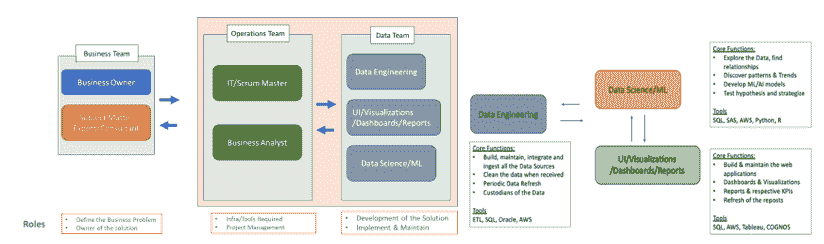

+   **数据团队：** 创建解决方案、进行编码并以模型、仪表板、报告和见解的形式生成输出的核心团队是数据团队。它包括三个主要支柱：数据工程、UI/可视化团队和数据科学团队。他们的职能如下：

+   数据工程团队负责构建、维护、集成和接入所有数据点。他们定期进行数据刷新，并充当数据的主要保管者。他们使用 ETL、SQL、AWS、Kafka 等。

+   UI/可视化团队构建仪表板、报告、交互式模块和 Web 应用程序。他们使用 SQL 和 Tableau。Qlik、Power BI 等。

+   数据科学团队负责所有数据分析和模型构建任务。他们发现模式和见解，测试假设并生成最终输出，最终将被所有人消费。最终输出可以是一个机器学习模型，该模型将用于解决业务问题。在不可能使用机器学习模型的情况下，团队可能生成对业务有用的可操作见解。该团队需要 SQL、Python、R、SAS、SPSS 等来完成他们的工作。

我们已经了解了数据科学项目的典型团队结构。我们将不会检查数据科学项目中的广泛步骤。

数据科学项目的运行方式与其他任何项目都一样，有截止日期、阶段、测试、阶段等。原材料是数据，经过各个阶段进行清洗、分析和建模。

我们在下面（图 1.9）看到了一个数据科学项目阶段的示例图。

##### 图 1.9 数据科学项目与其他项目一样，有阶段和截止日期，依赖关系和过程

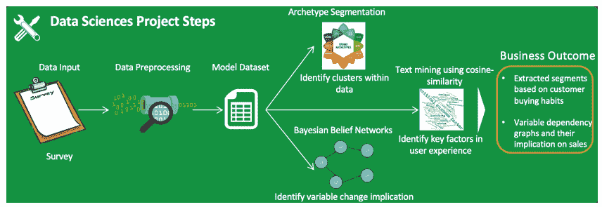

项目从项目的业务问题定义开始。业务问题必须简洁、清晰、可衡量和可实现。下表（表 1-2）显示了一个糟糕的业务问题和一个好的业务问题的示例。

##### 表 1.2 如何定义业务问题使其清晰、简洁和可衡量的示例

| 不明确的业务问题示例 | 好的业务问题示例 |
| --- | --- |
| 增加产量 | 优化各种成本项（A、B、C 和 D）并确定最佳组合，以便在接下来的 6 个月内将成本降低 1.2% |
| 降低成本 |
| 在一个月内将收入增加 80% | 从过程中的各种缺陷因素（X、Y、Z）中，识别出最重要的因素，以便在接下来的 3 个月内将缺陷率降低 1.8% |
| 自动化整个流程 |

然后我们进入数据发现阶段，在此阶段我们列出所有数据源并将它们托管。识别和访问所有各种数据集，如客户详情、购买历史、社交媒体数据、投资组合等。在此步骤中，确定要使用的数据表，并且大多数情况下，我们会创建一个数据库供我们工作、测试和学习。

我们进行数据预处理。它涉及清理数据，如去除空值、异常值、重复项、垃圾值等。前一步和这一步可能占据项目时间的 60-70%。

在探索性数据分析阶段我们创建一些报告并生成初步见解。这些见解与业务利益相关者讨论，并征求他们的指导进行调整。

数据现在已准备好进行建模。测试了很多版本的解决方案。根据需求选择最佳版本。主要根据准确率和统计指标（如精确率和召回率）来选择模型。我们将在本书的后面章节中探讨选择最佳模型的过程以及精确率和召回率这样的术语。

最终模型被选择，现在我们准备在生产环境中部署模型，它将处理未知数据。

这是一个机器学习项目的大致步骤。和其他项目一样，它有一个代码存储库，最佳实践，编码标准，常见错误，陷阱等等，我们将在整本书中讨论这些内容。

现在我们将转向一个重要的主题，即机器学习算法的类型，我们现在正在讨论它。

## 1.4 机器学习算法的类型

机器学习模型正在影响决策，并遵循一种统计方法来解决业务问题。它使用历史数据并分析和建模以生成预测算法。可用的历史数据和要解决的业务问题使我们能够将机器学习算法广泛分为四个类别：**有监督学习，无监督学习，半监督学习和强化学习**，如下图 1.10 所示。现在我们正在详细讨论这四种类型，重点是无监督学习，这也是本书的主题。

##### 图 1.10 机器学习算法可以分为有监督学习算法，无监督学习算法，半监督学习算法和强化学习算法。

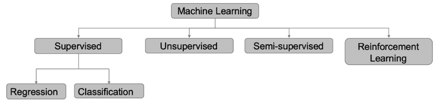

### 1.4.1 有监督学习

顾名思义，有监督学习算法有一个“指导”或“监督”来指导我们朝着预测未来的业务目标前进。

严格来说，有监督模型是使用输入数据和期望的输出一起来预测未来的统计模型。输出是我们希望预测的值，被称为*目标变量*，用于进行预测的数据被称为*训练数据*。目标变量有时被称为*标签*。数据中存在的各种属性或变量被称为*独立变量*。历史数据点或*训练示例*中包含这些独立变量和相应的目标变量。有监督学习算法为未来的未知数据做出预测。解决方案的准确性取决于训练和从标记的历史数据中学到的模式。描述该概念的示例将在下一节中介绍。

监督学习问题被用于需求预测、信用卡欺诈检测、客户流失预测、保费估算等等。它们在零售、电信、银行和金融、航空、保险等行业被广泛使用。

监督学习算法可以进一步分为回归算法和分类算法。我们将首先处理回归问题。

#### 回归算法

回归算法是监督学习算法，即它们需要被预测的目标变量。这些算法用于预测*连续*变量的值。例如，收入、降雨量、交易数量、生产产量等等。在监督分类问题中，我们预测一个分类变量，比如是否会下雨（是/否）、信用卡交易是否欺诈等等。这是分类和回归问题之间的主要区别。

让我们通过一个例子来理解回归问题。如果我们假设一个人的体重只取决于身高，而不取决于其他参数如性别、种族、饮食等。在这种情况下，我们希望根据身高预测一个人的体重。数据集可能如下所示，对应的数据图会如图 1.11 所示。

回归模型将能够找到数据中的固有模式并拟合描述关系的数学方程。然后它可以将身高作为输入并预测体重。这里身高是自变量，体重是因变量或我们想要预测的标签。

##### 图 1.11 数据和身高与体重之间关系的绘图，用于回归问题

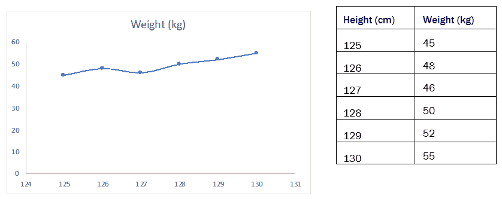

有许多算法可用于回归问题，主要的算法如下所示：

1.  线性回归

1.  决策树

1.  随机森林

1.  K 近邻

1.  提升算法

1.  神经网络

我们可以使用任何算法来解决这个问题。我们将通过使用**线性回归**来更深入地探索解决这个问题。

线性回归算法通过假设因变量和目标变量之间存在线性关系来建模它们之间的关系。线性回归算法会得出一个问题的数学方程，如方程（1-1）所示。

##### (方程式 1.1)

权重 = β[0] * 身高 + β[1]

一般来说，线性回归用于拟合描述因变量和自变量之间关系的数学方程，如（1-2）所示。

##### (方程式 1.2)

Y = β0 + β1 x1 + β2x2 + ….+ε

Y 是我们想要预测的目标变量。

+   x[1] 是第一个自变量

    +   x[2] 是第二个自变量

    +   ε 是方程中的误差项

+   β[0] 是方程的截距

简单的线性回归问题的可视化如图 1.12 所示。在这里，我们有自变量 x 和因变量 Y，其中 x 是独立变量，Y 是目标变量。线性回归问题的目标是找到*最佳拟合线*，能够解释数据中存在的随机性。

##### 图 1.12 需要建模的原始数据在左侧。使用回归，识别出最佳拟合线

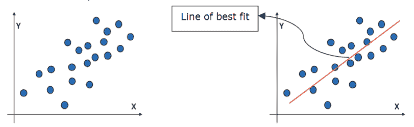

这个方程用于对未知数据进行预测。线性回归也有变体，如简单线性回归、多元线性回归、非线性回归等。根据手头的数据，我们选择正确的算法。复杂的数据集可能需要各种变量之间的非线性关系。

我们讨论的下一个回归算法是**基于树的解决方案**。对于基于树的算法，如决策树、随机森林等，算法将从顶部开始，然后像“if-else”块一样迭代地分裂，以创建节点和子节点，直到达到终端节点。可以通过图 1.13 更好地理解。在决策树图中，我们从顶部开始，根节点，然后分裂直到达到终点，即终端节点。

##### 图 1.13 决策树有一个根节点，在分裂后我们得到一个决策节点，终端节点是最终节点，不能进一步分裂

决策树非常容易理解和实施，并且训练速度快。它们的可用性在于它们足够直观，适合所有人理解。

还有其他著名的回归算法，如 k 近邻、梯度提升和基于深度学习的解决方案。根据业务问题和相应的准确性，我们更喜欢一个回归算法而不是另一个。

要理解回归使用案例的影响，行业中实施了一些与业务相关的使用案例：

1.  一个机场运营团队正在评估人员需求，并希望估计预期的乘客流量。这个估计将帮助团队为未来制定计划。它将导致所需资源的优化。回归算法可以帮助预测乘客数量。

1.  零售商想要了解即将到来的销售季节的预期需求，以便为各种商品规划库存。这将导致成本节约并避免断货。回归算法可以帮助进行这种规划。

1.  制造厂希望提高现有各种模具和原材料使用的产量。回归解决方案可以建议最佳模具组合，并预测预期产量。

1.  一家银行向其客户提供信用卡。考虑新客户的信用额度是如何计算的。基于客户的属性，如年龄、职业、收入和以往的交易历史 - 回归算法可以帮助推荐客户级别的信用额度。

1.  一个保险公司希望利用历史索赔来为其客户制定一个保险费率表。风险可以根据有关驾驶员详细信息、车辆信息等的历史数据来评估。回归肯定可以帮助解决这类问题。

回归问题是监督学习问题的基础，而且在工业界被广泛使用。它们与分类算法一起，是我们正在讨论的大多数预测问题的首选解决方案。

#### 分类算法

简而言之，分类算法用于预测作为因变量的分类变量的值。这个目标变量可以是二元的（是/否，好/坏，欺诈/真实，通过/失败等）或多类的（肯定/否定/中性，是/否/不知道等）。分类算法将通过为目标变量生成概率分数，确定目标事件是否会发生。

在模型已经通过历史数据进行训练之后，分类算法将为未见数据集生成一个概率分数，可用于做出最终决定。根据目标变量中存在的类数，我们的业务决策将有所不同。

让我们看一个分类问题的用例。

想象一下。一个电信运营商正面临着其不断减少的订户基础的问题。现有订户数量正在减少，电信运营商希望制止这种订户流失。为此，设想了一种机器学习模型。

在这种情况下，用于模型构建的历史数据或训练数据可以看起来像下表所示（表 1-3）。这些数据点仅用于说明，不是详尽无遗的。还有其他许多重要变量可用。

##### 表 1.3 电信运营商的结构化数据集示例，显示了多个数据属性

| ID | 收入（美元） | 服务期限（年） | 平均费用 | 月使用量（天） | 流失（是/否） |
| --- | --- | --- | --- | --- | --- |
| 1001 | 100 | 1.1 | 0.10 | 10 | Y |
| 1002 | 200 | 4.1 | 0.09 | 25 | N |
| 1003 | 300 | 5.2 | 0.05 | 28 | N |
| 1004 | 200 | 0.9 | 0.25 | 11 | Y |
| 1005 | 100 | 0.5 | 0.45 | 12 | Y |

在上面的示例中，数据集包括订户的过去使用数据。最后一列（流失）显示了该订户是否流失出系统。就像订户＃1001 流失了，而 1002 没有。因此，业务问题是，我们希望基于此历史数据构建一个机器学习模型，并预测新的未见客户是否会流失。

这里，“流失”状态（是/否）是目标变量。也被称为因变量。像收入、持续时间、平均成本、月度使用量等其他属性是用来创建机器学习模型的自变量。历史数据称为训练数据。在模型训练后，训练好的监督学习模型将为新客户生成预测概率。

对于分类问题，有很多可用的算法，主要列举如下：

1.  逻辑回归

1.  决策树

1.  随机森林

1.  K 最近邻

1.  朴素贝叶斯

1.  支持向量机

1.  提升算法

1.  神经网络

我们将讨论一种最流行的分类算法之一，称为**逻辑回归**。逻辑回归使用 logit 函数来建模分类问题。如果我们正在解决二元分类问题，它将是二元逻辑回归，否则是多元逻辑回归。

与线性回归类似，逻辑回归也拟合一个方程，不同之处在于它使用 S 形函数生成事件发生与否的概率分数。

S 形函数是具有特征“S”形曲线或 S 形曲线的数学函数。S 形函数的数学方程是：

S(x) = 1/(1 + e^x)，可以重写为 S(x) = e^x/(e^x + 1)

逻辑回归使用 S 形函数。逻辑回归问题中使用的方程是：

log (p/1-p) = β[0] + β[1] x[1]

其中 p：事件发生的概率

+   β[0]：截距项

    +   β[1]：自变量 x[1] 的系数

+   log(p/1-p)称为 logit，(p/1-p)称为比率

如下图 1.14 所示，如果我们尝试为概率函数拟合线性回归方程，效果不佳。我们想要获得概率分数（即介于 0 和 1 之间的值）。线性回归不仅会返回介于 0 和 1 之间的值，还会返回大于 1 或小于 0 的概率分数。因此，我们有了右侧的 S 形函数，它为我们生成了仅在 0 和 1 之间的概率分数。

##### 图 1.14 线性回归模型无法胜任（左），因此我们有了逻辑回归进行分类。线性回归还可以生成大于 1 或小于 0 的概率分数，这在数学上是不正确的。而 S 形函数仅生成 0 和 1 之间的概率分数。

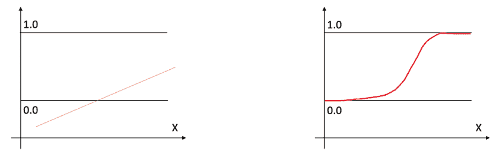

逻辑回归算法是最广泛使用的分类问题技术之一。它易于训练和部署，并且通常是我们启动任何监督分类学习项目时的基准算法。

基于树的算法，如决策树和随机森林，也可以用于分类问题。根据需求还可以使用其他算法。

我们简要研究了监督学习算法。我们现在将在下一节讨论无监督学习算法 - 本书的主要主题，然后转移到半监督学习算法。

### 1.4.2 无监督算法

想象一下，你被给了一些如下图图 1.15 所示的纸标签。任务是使用一些相似性来排列它们。现在有多种方法来解决这个问题。您可以使用颜色，形状或大小。在这里，我们没有任何标签可以指导我们进行这种排列。这是无监督算法的区别。

##### 图 1.15 使用不同参数可以将各种形状聚合在一起的示例

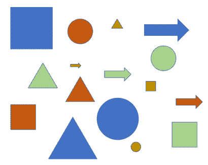

正式地说，无监督学习仅采用输入数据，然后在其中找到模式，而不引用目标变量。因此，无监督学习算法会根据数据集中的模式的存在或缺失做出反应。

无监督学习因此被用于模式检测，探索数据集中的洞见和了解其结构，分割以及异常检测。

我们可以通过下面的 (图 1.16) 来理解无监督学习算法。左侧的图显示了以向量空间图表示的原始数据点。右边是使用无监督学习算法进行的聚类。

##### 图 1.16 无监督学习算法在左侧的数据中发现模式，并在右侧生成簇。

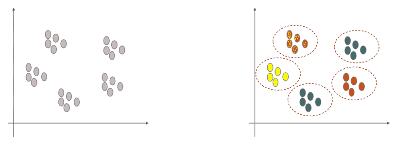

无监督算法的用例有：

1.  一个零售集团希望更好地了解客户。任务是提高客户的粘性，收入，访问次数，购物篮大小等。在这里可以使用无监督学习进行客户细分。根据客户的属性，如收入，访问次数，上次访问日期，加入年龄，人口属性等。细分将导致可以个性化定位的簇。结果将是改善客户体验，增加客户生命周期价值等。

1.  网络提供商需要创建异常检测系统。历史数据将用作异常数据。无监督学习算法将能够找到模式，并且算法将提供异常值。显著的异常将是需要解决的异常。

1.  一个医疗产品公司希望查找其患者图像数据中是否存在任何潜在模式。如果有任何模式和因素，这些患者可以得到更好的治疗，也许需要不同的方法。无监督学习可以帮助处理图像数据，从而更好地处理患者。

1.  数字营销公司希望了解传入客户数据中的“未知因素”，如社交媒体互动、页面点击、评论、星级等。这种理解将有助于改善客户的推荐和整体购买体验。

无监督学习算法在发现模式时提供了灵活性和性能。它们可用于各种数据 - 结构化数据、文本或图像或文本。

无监督学习算法的数量比监督学习少。主要的无监督学习算法有：

1.  聚类算法

1.  k-means 聚类

1.  分层聚类

1.  DB Scan 聚类

1.  光谱聚类

1.  主成分分析

1.  奇异值分解

1.  关联规则

1.  t-SNE（t 分布随机邻域嵌入）

1.  自动编码器

我们将在接下来的章节中详细介绍所有这些算法。我们将审查数学概念、隐藏过程、Python 实现以及整本书的最佳实践。

让我们通过一个案例研究来理解。

零售商希望深入了解其消费者群体。然后希望通过使用属性（如人物、以前的购买、回应、外部数据等）对整个客户数据集进行分段。

对于用例，在无监督学习项目中遵循的步骤如下图 1.17 所示。

**步骤 1**：我们通过定义业务问题来启动项目。我们希望更好地了解客户群体。客户分割方法可以是一个好的解决方案。我们想要使用数学 KPI（关键绩效指标）区分的分段。

##### 图 1.17 从数据源到部署就绪的最终解决方案的无监督学习算法步骤

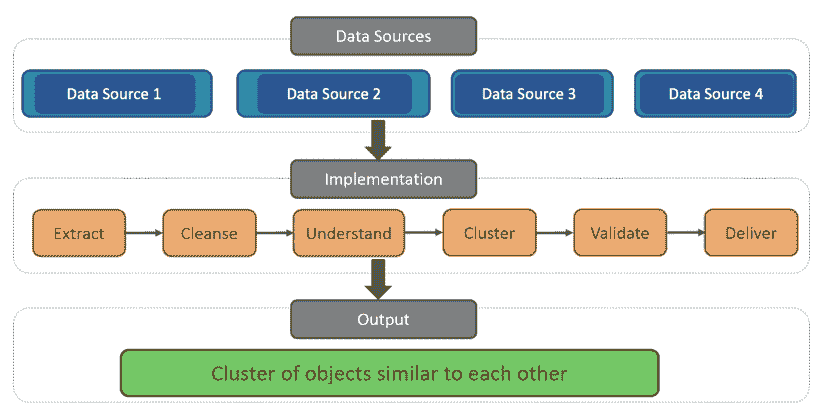

**步骤 2**：这是数据发现阶段。识别和访问所有各种数据集，如客户详细信息、购买历史、社交媒体数据、投资组合等。在这一步中确定要使用的数据表。然后所有数据表通常加载到一个共同的数据库中，我们将用来分析、测试和学习。

**步骤 3**：现在我们可以访问数据了。下一步是清理数据并使其可用。

我们将处理所有空值、NAN、垃圾值、重复项等。

**步骤 4**：一旦数据清理干净并准备好使用，我们将对其进行探索性数据分析。通常，在探索性分析期间，我们识别模式、循环、异常、最大-最小范围、标准差等。EDA 阶段的输出将是见解和理解。我们还将生成一些图表和图表，如下图 1.18 所示：

##### 图 1.18 数据探索性分析图表示例

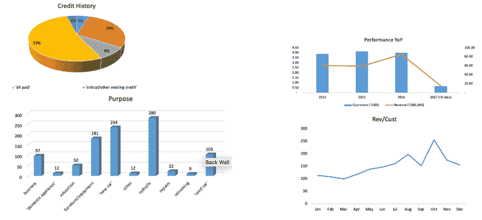

**步骤 5**：我们现在将开始无监督的方法。我们想要实现聚类方法，因此我们可以尝试几种聚类方法，如 k 均值，层次聚类等。基于他们的各种属性，聚类算法将产生客户的同质化分段。

在案例研究中，我们将使用过去 2-3 年的数据，这是训练数据。由于我们使用的是无监督方法，这里没有目标变量。该算法将根据他们的交易模式、人口统计模式和购买偏好将行为相似的客户段合并起来。在图 1.19 中会呈现如下形式：

##### 图 1.19 聚类算法的输出，在此我们可以使用各种属性对客户进行分段

**步骤 6**：我们现在将检查各种算法的表现，换句话说，我们将比较每种算法的准确性。选择的最终聚类算法将产生客户的同质化分段，可以针对并提供定制优惠。

**步骤 7**：我们将与业务利益相关者讨论结果。有时，利用业务眼光，我们会合并或拆分一些细分市场。

**步骤 8**：将解决方案部署到生产环境中，我们准备好处理新的未见过的数据集了。

这些是无监督问题中的广泛步骤。算法的创建和选择是一项繁琐的任务。我们将在书中详细研究它。

到目前为止，我们已经讨论了监督和无监督问题。接下来，我们将转向半监督算法，它位于监督和无监督算法的并列位置。

### 1.4.3 半监督算法

半监督学习是两种方法的中间路径。半监督方法的主要原因是缺乏完整的*标记*数据集进行训练。

正式地说，半监督方法同时使用监督和无监督方法 - 监督用于对数据点进行分类，无监督用于将它们分组。

在半监督学习中，我们最初使用监督算法对较少数量的标记数据点进行训练。然后，我们使用它来标记或*伪标记*新的数据点。两个数据集（标记和伪标记）被合并在一起，我们进一步使用这个数据集进行分析。

半监督算法在数据集部分可用的情况下使用，例如医疗行业中的图像。如果我们通过分析患者的图像来创建癌症检测解决方案，可能不会有足够的训练图像样本集。在这种情况下，半监督方法可能会有所帮助。

现在我们将讨论机器学习中的最后一类，称为强化学习。

### 1.4.4 强化学习

想象一下你正在与计算机下棋。就像这样：

第一轮：你在 5 步后获胜

第二轮：你在 8 步后获胜

第三轮：你在 14 步后获胜

第四轮：你赢了，共进行了 21 步

第五轮：计算机获胜！

这里发生的是，算法根据每次交互进行自我训练，并进行纠正/改进。

形式上，强化学习解决方案是自我维持的解决方案，它们使用一系列试错来进行自我训练。一个序列跟着另一个序列。强化学习的核心是奖励信号。如果动作是积极的，那么奖励就是积极的，表示继续下去。如果动作是消极的，奖励将惩罚该活动。因此，解决方案将始终纠正自己并向前移动，从而通过迭代改进自己。

自动驾驶汽车是强化学习算法的最佳例子。它们会检测何时左转或右转，何时移动以及何时停止。现代视频游戏也使用强化学习算法。强化学习使我们能够突破技术的障碍，并想象以前被认为是不可能的事情。

这样一来，我们就涵盖了不同类型的机器学习算法。它们共同利用数据的真正力量，对我们的生活产生了持久的影响。

但解决方案的核心是技术，我们尚未讨论过。我们现在将转向制作这些解决方案所需的技术堆栈。

## 1.5 技术工具包

以下工具用于项目的不同方面：

1.  数据工程：Hadoop，Spark，Scala，Java，C++，SQL，AWS Redshift，Azure

1.  数据分析：SQL，R，Python，Excel

1.  机器学习：SQL，R，Python，Excel，Weka，Julia，MATLAB，SPSS，SAS

1.  可视化：Tableau，Power BI，Qlik，COGNOS

1.  模型部署：docker，flask，Amazon S3

1.  云服务：Azure，AWS，GCP

在这本书中，我们将使用 Python 进行工作。建议您在系统上安装最新版本的 Python。建议使用 Python 版本(3.5+)。我们将使用 Jupyter Notebook，因此建议您在系统上安装 Anaconda。

##### 注意

所有代码和数据集将在 GitHub 存储库中签入。您应该复制它们并尝试重现结果。

最常见的问题是：R 和 Python 哪个更好？两者都是出色的语言。两者都被广泛使用。但是在 TensorFlow、Keras 等人工智能库引入后，Python 稍微占优势了一些。

通过这一点，我们结束了对技术的讨论。技术与概念一起使机器学习算法为我们工作。我们将在整本书中探讨所有这些更精细的方面。

祝贺！您已经完成了您迈向学习无监督机器学习技术的第一步。是时候结束并转向摘要了。

## 1.6 总结

机器学习和人工智能确实是开创性的。它们正在改变我们的出行方式，我们点餐，我们规划，我们购买，我们看医生或订购处方 - 它们无处不在地产生影响。机器学习确实是一种强大的能力，正在为未来铺平道路，并且在模式识别、异常检测、定制和自动化任务方面表现比现有技术栈要好得多。自动驾驶，癌症检测，欺诈识别，人脸识别，图像字幕和聊天机器人是机器学习和人工智能超越传统技术的几个例子。现在是进入该领域的最佳时机。该领域吸引了几乎所有业务功能的投资。该领域为整个光谱创造了大量的就业机会。确实令人难以置信和令人印象深刻！

与此同时，该领域缺乏经过训练的专业人才 - 数据分析师、数据工程师、可视化专家、数据科学家和数据从业者。他们现在都是稀有品种。该领域需要定期培养新人才，他们将成为明天的领袖，并将做出数据驱动的决策。但是我们只是初步了解了数据的力量 - 还有很长的路要走。

在本书的引言章节中，我们向您介绍了机器学习和数据科学的概念。我们比较了各种流程，数据科学项目的步骤以及所需的团队。我们重点考虑了无监督学习算法的类型和各自的用例。

在下一章中，我们将更深入地探讨无监督学习中聚类的概念。我们将讨论所有的数学和统计基础、实用案例研究、Python 实现。第二章涉及更简单的聚类算法 - K-means 聚类、层次聚类和 DBSCAN。在本书的后续章节中，我们将研究更复杂的聚类主题，如 GMM 聚类、时间序列聚类、模糊聚类等。

您现在可以进入问题部分了！

#### 问题

Q1：为什么机器学习如此强大，以至于现在被大量使用？

Q2：机器学习算法有哪些不同类型，它们之间有何不同？

Q3：机器学习项目中的步骤是什么？

Q4：数据工程的作用是什么，为什么它很重要？

Q5：机器学习有哪些可用工具？
