# 第二章：聚类技术

### 在这第二章中，我们将涵盖以下主题：

+   行业中的聚类技术及其显著用例

+   可用的各种聚类算法

+   K 均值、层次聚类和 DBSCAN 聚类

+   在 Python 中实现算法

+   聚类分析案例研究

*“简单是最终的精妙”* – 列奥纳多·达·芬奇

大自然崇尚简单，教导我们走同样的路。大多数时候，我们的决定都是简单的选择。简单的解决方案更容易理解，耗时更少，更容易维护和思考。机器学习世界也不例外。一个优雅的机器学习解决方案不是最复杂的可用算法，而是解决业务问题的一个。一个强大的机器学习解决方案易于理解，并且实施起来实用。聚类解决方案通常更容易被理解。

在上一章中，我们定义了无监督学习，并讨论了可用的各种无监督算法。随着我们在本书中的工作，我们将涵盖每一种算法；在这第二章中，我们将专注于其中的第一个：聚类算法。

我们将首先定义聚类，然后学习不同类型的聚类技术。我们将检查每种算法的数学基础、准确度测量以及优缺点。我们将使用 Python 代码在数据集上实现其中三种算法，以补充理论知识。本章结束时，我们将探讨聚类技术在实际业务场景中的各种用例，为进入实际业务世界做准备。这种技术在整本书中都在使用，我们首先学习概念，然后实现实际代码以提高 Python 技能，并深入研究实际的业务问题。

本章我们将学习基本的聚类算法，包括 K 均值聚类、层次聚类和 DBSCAN 聚类。这些聚类算法通常是我们研究聚类时的起点。在本书的后面章节中，我们将探讨更复杂的算法，如谱聚类、高斯混合模型、时间序列聚类、模糊聚类等。如果你对 K 均值聚类、层次聚类和 DBSCAN 有很好的理解 - 你可以跳到下一章。但建议你读完本章一次 - 你可能会发现一些有用的东西来更新你的概念！

让我们首先了解一下“*聚类*”是什么意思。祝你在掌握基于无监督学习的聚类技术的旅程中一切顺利！

## 2.1 技术工具箱

本章我们将使用 Python 的 3.6+版本。我们期望你对 Python 和代码执行有基本的了解。建议你复习面向对象编程和 Python 概念。

本书始终使用 Jupyter 笔记本执行代码。Jupyter 在执行和调试方面提供了灵活性，因此被广泛使用。它非常用户友好，可以在任何平台或操作系统上使用。所以，无论你使用 Windows、Mac OS 还是 Linux，Jupyter 都可以正常工作。

所有数据集和代码文件都已经检入到 Github 代码库中（`github.com/vverdhan/UnsupervisedLearningWithPython/tree/main/Chapter2`）。你需要安装以下 Python 库来执行代码 – `numpy`, `pandas`, `matplotlib`, `scipy`, `sklearn`。CPU 足够执行，但如果遇到一些计算延迟，并且想加快执行速度，切换到 GPU 或 Google 协作平台（colab）。Google 协作平台为机器学习解决方案提供免费计算。建议你了解更多关于谷歌协作平台以及如何用它来训练机器学习算法的内容。

现在，我们将在下一节开始聚类。

## 2.2 聚类

想象一下这样的情景。一群孩子被要求将房间中的物品分成不同的部分。每个孩子都可以使用自己的逻辑。有人可能根据重量来分类物品，其他孩子可能使用材料，而另一些人可能同时使用重量、材料和颜色。排列组合很多，取决于用于分组的 *参数*。在这里，一个孩子根据所选择的逻辑对物品进行分组或 *clustering*。

正式来说，*clustering* 用于将具有相似属性的对象分组到同一段中，具有不同属性的对象分到不同段中。结果的聚类在自身之间具有相似性，而它们在彼此之间更加异质。我们可以通过下图（图 2.1）更好地理解它。

##### 图 2.1 聚类是将具有相似属性的对象分组到逻辑段中。分组是基于不同观测共享的相似性特征，因此它们被分组到一组中。在这里，我们使用形状作为聚类的变量。

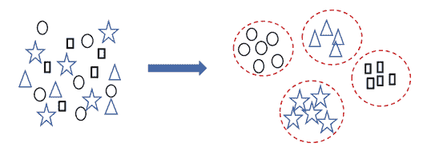

聚类分析不是单个算法或解决方案，而是用于解决实际业务场景中的问题的机制。它们是无监督学习下的一类算法。这是一个迭代过程，遵循逻辑方法和定性业务输入。它导致对数据的深入理解、其中的逻辑模式、模式发现和信息检索。作为一种无监督方法，聚类不需要目标变量。它通过分析数据集中的潜在模式来进行分段，这些模式通常是多维的，因此难以用传统方法分析。

理想情况下，我们希望聚类算法具有以下特点：

+   输出的聚类应该易于解释和理解，可用且应该具有商业意义。聚类数目不应该太少或太多。例如，如果我们只有 2 个聚类，分割就不够清晰和明确。或者如果我们有 20 个聚类，处理将变得很有挑战性。

    +   算法不应过于敏感于异常值、缺失值或数据集中的噪声。通常来说，一个好的解决方案应该能够处理多种数据类型。

    +   一个好的解决方案对于用于聚类目的的输入参数需要较少的领域理解。这允许具有较少领域理解的分析师训练聚类算法。

    +   算法应该独立于输入参数的顺序。如果顺序很重要，那么聚类就会对顺序产生偏见，因此会给过程增加更多的混乱。

+   随着我们持续生成新的数据集，聚类必须能够适应新的训练示例，并且不应该是一个耗时的过程。

众所周知，聚类输出将取决于用于分组的属性。在下面所示的（图 2.2）中，对于相同的数据集，可以有两个逻辑分组，而且两者都是同样有效的。因此，明智地选择用于聚类的属性或*变量*通常取决于手头的业务问题。

##### 图 2.2 使用不同的属性进行聚类会得到相同数据集的不同聚类结果。因此，选择正确的属性集定义我们将实现的最终结果。

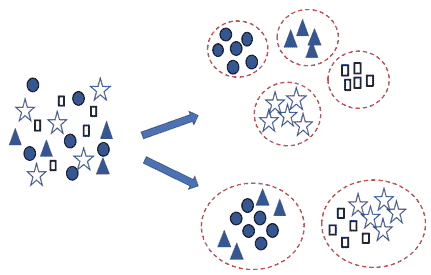

除了用于聚类的属性之外，所使用的实际技术也会产生很大影响。研究人员已经开发了相当多（事实上超过 80 个）的聚类技术。对于感兴趣的观众，我们在附录中提供了所有聚类算法的列表。我们将在下一节开始学习不同的聚类技术。

### 2.2.1 聚类技术

聚类可以通过各种算法实现。这些算法使用不同的方法来定义对象之间的相似性。例如，基于密度的聚类，基于中心点的聚类，基于分布的方法等。甚至在衡量对象之间距离时，也有多种技术，如欧氏距离，曼哈顿距离等。选择距离测量方法会导致不同的相似度分数。我们将在后面的部分研究这些相似度测量参数。

在高层次上，我们可以确定两种广义的聚类方法：*硬聚类*和*软聚类*（见图 2.3）。当决定非常明确一个对象属于某个类或簇时，称为硬聚类。在硬聚类中，算法非常确定对象的类。另一方面，软聚类为对象被归属于某个特定簇分配了可能性得分。因此，软聚类方法不会将对象放入一个簇中，而是一个对象可以属于多个簇。有时软聚类也被称为*模糊*聚类。

##### 图 2.3 硬聚类具有明显的簇，而在软聚类的情况下，数据点可以属于多个簇，我们得到数据点属于簇的可能性分数。左边的第一个图是硬聚类，右边的图是软聚类。

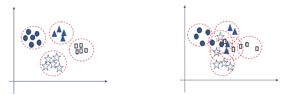

我们可以如下图所示广义地将聚类技术进行分类：

##### 表 2.1 聚类方法的分类、简要描述和示例

| 序号 | 聚类方法 | 方法的简要描述 | 示例 |
| --- | --- | --- | --- |
| 1 | 基于质心的聚类 | 到指定质心的距离 | k-means |
| 2 | 基于密度的模型 | 数据点在向量空间的密集区域内连接 | DBSCAN, OPTICS |
| 3 | 基于连接性的聚类 | 距离连接性是行动方式 | 分层聚类, BIRCH |
| 4 | 分布模型 | 建模基于统计分布 | 高斯混合模型 |
| 5 | 深度学习模型 | 无监督的基于神经网络的 | 自组织映射 |

表 2.1 中描述的方法并不是唯一可用的方法。我们可以有基于图的模型、重叠的聚类、子空间模型等。

通常，工业中使用的六种流行的聚类算法如下：

1.  K 均值聚类（带有诸如 k-中值、k-中心点之类的变种）

1.  凝聚式聚类或者分层聚类

1.  DBSCAN (基于密度的空间应用聚类)

1.  光谱聚类

1.  高斯混合模型或 GMM

1.  BIRCH（平衡迭代减少 & 使用层次聚类）

还有多种其他可用的算法，如 Chinese whisper，canopy 聚类，SUBCLU，FLAME 等。我们在本章中学习前三种算法以及书中后续章节中的一些高级算法。

  快速测验-回答这些问题以检查你的理解.. 答案在书的末尾

1.   DBSCAN 聚类是基于质心的聚类技术。TRUE or FALSE.

2.   聚类是一种监督学习技术，具有固定的目标变量。TRUE or FALSE.

3.   硬聚类和软聚类有什么区别？

在下一节中，我们将开始学习基于质心的聚类方法，其中我们将学习 k-means 聚类。

## 2.3 基于质心的聚类

基于重心的算法根据对象到聚类重心的距离来衡量它们的相似性。距离是针对聚类的特定数据点到重心的距离来衡量的。距离越小，相似度越高。我们可以通过接下来的图 2.4 来理解这个概念。右侧的图表示了每个聚类组的相应重心。

##### 注意

要更清楚地了解重心和其他数学概念，请参考末尾的附录。

##### 图 2.4 基于重心的聚类方法为各自的聚类创建一个重心，并根据到重心的距离来衡量相似度。在这种情况下，我们有 5 个重心。因此，这里有五个不同的聚类。

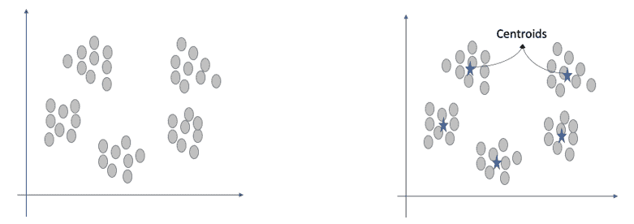

在聚类中，距离起着核心作用，因为许多算法将其用作度量相似性的度量。在基于重心的聚类中，距离是在点之间和重心之间进行衡量的。有多种方法来度量距离。最常用的是下面列出的：

1.  **欧几里德距离**：它是最常用的距离度量。它表示空间中两点之间的直线距离，是两点之间的最短路径。如果我们想计算点 P[1]和 P[2]之间的距离，其中 P[1]的坐标为(x[1], y[1])，P[2]的坐标为(x[2], y[2])，那么欧几里德距离由下面的（方程式 2.1）给出。几何表示如图 2.5 所示

##### (方程式 2.1)

距离 = √(y[2] – y[1])² + (x[2] – x[1])²

##### 如果你想复习几何概念（坐标几何），请参考附录。

1.  **切比雪夫距离**：以俄罗斯数学家*帕夫努蒂·切比雪夫*的名字命名，它被定义为两点之间的距离，以便它们的差异在任何坐标维度上的最大值。数学上，我们可以在下面的（方程式 2.2）中表示切比雪夫距离，并在（图 2.5）中显示：

##### (方程式 2.2)

距离[切比雪夫] = max (|y[2] – y[1]|, |x[2] – x[1]|)

1.  **曼哈顿距离**：曼哈顿距离是一个非常简单的概念。它只是计算网格路径上两点之间的距离，因此距离是沿着右角轴测量的。因此，有时它也被称为城市街区距离或出租车度量。数学上，我们可以在（方程式 2.3）中表示曼哈顿距离，并如图 2.5 所示：

##### (方程式 2.3)

距离[曼哈顿] = (|y[2] – y[1]| + |x[2] – x[1]|)

曼哈顿距离以 L1 范数形式而欧几里德距离以 L2 范数形式。您可以参考附录详细学习 L1 范数和 L2 范数。如果数据集中有大量的维度或变量，曼哈顿距离比欧几里德距离更好。这是由于本书第三章将要学习的*维度诅咒*。

1.  **余弦距离**：余弦距离用于测量向量空间图中两点之间的相似性。在三角学中，0 度的余弦是 1，90 度的余弦是 0。因此，如果两个点彼此相似，则它们之间的角度将为零，因此余弦将为 1，这意味着这两个点彼此非常相似，反之亦然。从数学上讲，余弦相似性可以表示为（公式 2.4）。如果我们想要测量向量 A 和 B 之间的余弦值，则余弦是

##### （公式 2.4）

距离 [余弦] = (A . B) / (||A|| ||B||)

##### 如果您想刷新向量分解的概念，请参考附录。

##### 图 2.5 欧氏距离、曼哈顿距离、切比雪夫距离和余弦相似度是主要使用的距离度量。请注意，使用这些度量标准时，两个点之间的距离是不同的。在欧氏距离中，直接距离被测量为左侧第一张图所示的两点之间的距离。

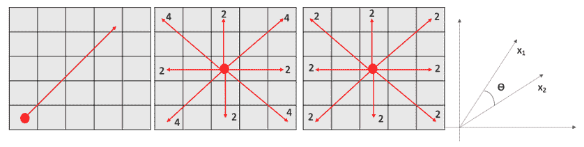

还有其他距离度量标准，如汉明距离、Jaccard 距离等。在我们实际的业务问题中，通常使用欧氏距离，但有时也会使用其他距离度量标准。

##### 注意

上述距离度量标准对其他聚类算法也适用。建议您使用本书中的 Python 代码测试不同的距离度量标准，并比较性能。

现在我们已经了解了各种距离度量标准，我们将继续学习 k-means 聚类，这是最广泛使用的算法。

### 2.3.1 K-means 聚类

k-means 聚类是一种简单直接的方法。它可以说是最广泛使用的聚类方法，用于分段数据点并创建非重叠聚类。我们必须指定我们希望创建的聚类数“k”作为输入，算法将将每个观察结果关联到 k 个聚类中的一个。

##### 注意

有时人们会将 k-means 聚类与 k 最近邻分类器（knn）混淆。虽然两者之间存在一定的关系，但 knn 用于分类和回归问题。

这是一种相当优雅的方法，它从一些初始的聚类中心开始，然后迭代地将每个观察结果分配给最接近的中心。在这个过程中，中心点被重新计算为聚类中的点的平均值。让我们通过下面的图表（图 2.6）逐步学习所使用的方法。为了简单起见，我们假设数据集中有三个聚类。

**步骤 1**：让我们假设我们有如下所示的所有数据点。

##### 图 2.6 步骤 1 代表原始数据集。在步骤 2 中，算法初始化三个随机质心，因为我们已经给定了三个聚类的输入数。在步骤 3 中，质心的所有相邻点都被分配到同一个聚类中。

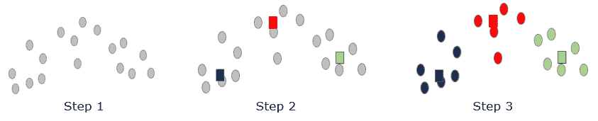

**第二步**：初始时随机初始化了三个中心，如三个方块所示-蓝色、红色和绿色。这个三是我们希望最后的簇的数量。

**第三步**：计算所有数据点到中心的距离，并将点分配给最近的中心。注意，由于它们最接近相应的中心，点的颜色变为蓝色、红色和绿色。

**第四步**：在这一步中，重新调整了三个中心。中心被重新计算为该簇中点的平均值，如图 2.7 所示。我们可以看到，在第四步中，与第三步相比，三个方块的位置发生了变化。

##### 图 2.7 是在第 4 步重新计算质心。在第 5 步中，数据点再次被重新分配新中心。在第 6 步中，根据新的计算结果，质心再次进行调整。

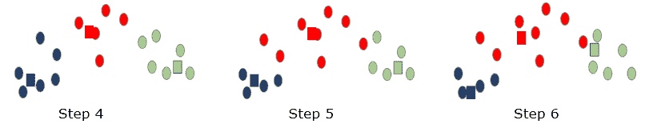

**第五步**：再次重新计算所有数据点到新中心的距离，并将点重新分配给最近的中心。请注意，在这一步中，两个蓝色数据点变成了红色，而一个红点变成了绿色。

**第六步**：中心再次进行调整，与第四步类似。

##### 图 2.8 是重新计算质心，并且这个过程一直持续到无法进一步改善聚类为止。然后过程停止，如第 8 步所示

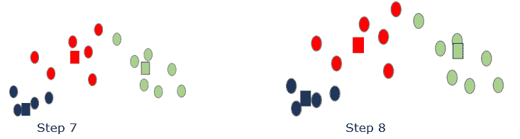

**第七步**：数据点再次被分配到新的簇中，如前图（图 2.8）所示。

**第八步**：该过程将继续，直到达到收敛。换句话说，该过程将继续，直到不再重新分配数据点。因此，我们无法进一步改进聚类，已实现最终聚类。

k-means 聚类的目标是确保簇内变化尽可能小，而簇之间的差异尽可能大。换句话说，同一簇的成员彼此最相似，而不同簇的成员则不相似。一旦结果不再改变，我们可以得出结论，已达到局部最优，聚类可以停止。因此，最终的簇在内部是同质的，而在彼此之间是异质的。

有两点需要注意：

1.  由于 k-means 聚类是随机初始化中心点，因此它只能找到局部最优解，而非全局最优解。因此，建议多次迭代解决方案，并从所有结果中选择最佳输出。迭代意味着多次重复该过程，因为在每次迭代中，随机选择的质心将不同。

1.  我们必须输入我们希望的最终簇数“k”，它会显著改变输出。与数据规模相比，如果 k 值非常小，结果将是多余的簇，因为没有任何用处。换句话说，如果相对于庞大的数据具有非常小的 k 值，具有不同特征的数据点将被混合在几个群中。具有非常高的 k 值将创建微不同的簇。此外，具有非常高数量的簇将难以在长期内管理和更新。让我们通过一个例子来研究。如果一个电信运营商有 100 万订阅者，那么如果我们将簇数设为 2 或 3，得到的簇的规模将非常大。它还可能导致将不同的客户分类到相同的段中。另一方面，如果我们将簇数设为 50 或 60，由于簇数庞大，输出变得难以管理、分析和维护。

使用不同的“k”值，我们会得到不同的结果，因此我们需要了解如何为数据集选择最佳簇数。现在，让我们研究如何测量聚类解决方案的准确性的过程。

### 2.3.2 测量聚类的准确性

聚类的一个目标是找到最干净的簇。理论上（虽然不理想），如果我们有与观察数量相同的簇数，结果将完全准确。换句话说，如果有 100 万客户，最纯净的聚类将有 100 万个簇 - 每个客户在一个单独的簇中。但这并不是最佳方法，也不是一种实用的解决方案。聚类旨在在一个簇中创建相似观察结果的组，并且我们使用相同的原理来衡量解决方案的准确性。

1.  **簇内平方和(WCSS)或聚合**：这个指标衡量数据点相对于它们距离簇质心的距离的变异性。这个指标是每个数据点距离簇的质心的平均距离，对每个数据点重复。如果值太大，表明数据扩散很大，而较小的值表示数据点非常相似和均匀，因此簇是紧凑的。

有时，这个簇内距离也被称为该簇的*惯性*。它简单地是所有距离的总和。惯性值越低，簇就越好。

##### 图 2.9 簇内距离与簇间距离 - 两者都用于衡量最终簇的纯度和聚类解决方案的性能

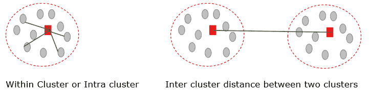

1.  **聚类间平方和**：此度量用于衡量所有聚类质心之间的距离。为了得到它，我们测量所有聚类的质心之间的距离，并将其除以聚类的数量以获得平均值。它越大，聚类越好，表明聚类是异质的，并且彼此可以区分，正如我们在（图 2.9）中所表示的那样。

1.  **轮廓系数**是衡量聚类成功的指标之一。它的取值范围从-1 到+1，数值越高越好。它衡量了数据点与其所属聚类中其他数据点相似程度，与其他聚类相比。作为第一步，对于每个观察值——我们计算与同一聚类中所有数据点的平均距离，我们称之为 x[i]。然后我们计算与最近聚类中所有数据点的平均距离，我们称之为 y[i]。然后我们通过下面的方程（方程 2.5）计算系数

##### （方程 2.5）

轮廓系数 = （y[i] - x[i]）/ max（y[i]，x[i]）

如果系数的值为-1，则意味着观察点位于错误的聚类中。

如果为 0，则该观察点与相邻聚类非常接近。

如果系数的值为+1，则意味着该观察点与相邻聚类之间存在距离。

因此，我们期望获得系数的最高值以获得良好的聚类解决方案。

1.  **Dunn 指数**也可用于衡量聚类的效果。它使用了点 2 和点 3 中定义的聚类间距离和聚类内距离测量，并由下面的方程（方程 2.6）给出

##### （方程 2.6）

Dunn 指数 = min（聚类间距离）/max（聚类内距离）

显然，我们会努力最大化 Dunn 指数的值。为了实现这一点，分子应尽可能大，意味着聚类之间相距较远，而分母应尽可能低，表明聚类非常健壮且紧密排列。

现在我们已经检验了衡量算法性能的方法。我们现在将转向寻找 k-means 聚类的最佳“k”值。

### 2.3.3 寻找最佳的“k”值

选择最优的聚类数量并不容易。正如我们之前所说，最好的聚类是当聚类数量等于观察数量时——但是正如我们在上一节中所学到的，这在实际中是不可能的。但是我们必须将聚类数量“k”作为算法的输入提供。

##### 图 2.10 肘方法寻找最优聚类数量。红色圆圈表示转折点。但最终的聚类数量取决于业务逻辑，通常根据业务知识合并/拆分聚类。维护聚类的便利性在其中也扮演了至关重要的角色

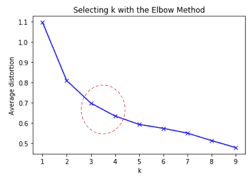

或许找到“k”的最优值最广泛使用的方法是*Elbow Method*。在这种方法中，我们计算不同“k”值的簇内平方和或 WCSS。该过程与上一节中讨论的相同。然后，将 WCSS 绘制在图表上，针对不同的“k”值。在我们观察到一个弯曲或肘部的地方，如（图 2.10）所示，它就是数据集的最优簇数。注意（图 2.10）中描绘的锋利边缘。

 测验 - 回答这些问题来检查你的理解。书的结尾有答案。

1. K-means 聚类不需要作为输入的簇数- 真 或 假

2. Knn 和 k-means 聚类是一回事 - 真 或 假

3. 描述一种可能的找到最优“k”值的过程

但这并不意味着这是我们建议用于业务问题的最终簇数。根据落入每个簇的观测数量，几个簇可能被合并或分解成子簇。我们还考虑创建簇所需的计算成本。簇的数量越多，计算成本和所需时间就越大。

我们也可以使用前面讨论过的 Silhouette Coefficient 找到最优的簇数。

##### 注意：

探讨合并几个簇或拆分几个簇的业务逻辑是至关重要的。最终，解决方案必须在实际的业务场景中实施。

通过这个，我们已经研究了 k-means 聚类的点点滴滴 - 数学概念和过程，各种距离度量以及确定最佳 k 值。现在我们将研究 k-means 算法为我们提供的优势。

### 2.3.4 k-means 聚类的优缺点

k-means 算法是一个非常流行和广泛实施的聚类解决方案。该解决方案提供以下优势：

+   与其他算法相比，它简单易懂且相对容易实现。距离测量计算使得即使是非统计背景的用户也很容易理解。

    +   如果维度的数量很大，k-means 算法比其他聚类算法更快，创建的簇更紧凑。因此，如果维度的数量相当大，则更倾向于使用它。

    +   它很快适应新的观察结果，并且能够非常好地概括各种形状和大小的簇。

+   解决方案通过一系列重新计算的迭代产生结果。大多数情况下使用欧氏距离度量，这使得计算成本较低。它还确保算法一定会收敛并产生结果。

K-means 在现实生活中的业务问题中被广泛使用。尽管 k-means 聚类有明显的优点，但我们确实面临着算法的某些挑战：

+   选择最佳聚类数目并不容易。我们必须将其作为输入提供。使用不同的“k”值，结果会完全不同。选择最佳“k”值的过程在上一节中已经探讨过。

    +   解决方案取决于质心的初始值。由于质心是随机初始化的，因此每次迭代的输出都将不同。因此，建议运行多个解决方案的版本并选择最佳的一个。

    +   该算法对异常值非常敏感。它们可能会破坏最终结果，因此在开始聚类之前，我们必须处理异常值。我们还可以实现 k 均值算法的其他变体，如*k-modes*聚类，以应对异常值的问题。我们将在后续章节讨论处理异常值的方法。

+   由于 k 均值聚类的基本原理是计算距离，因此该解决方案不直接适用于分类变量。换句话说，我们不能直接使用分类变量，因为我们可以计算数字值之间的距离，但不能对分类变量进行数学计算。为了解决这个问题，我们可以使用独热编码将分类变量转换为数字变量，这是我们在本章末尾讨论的内容之一。

尽管存在这些问题，k 均值聚类是最常用的聚类解决方案之一，因其简单性和易于实现。还有一些不同版本的 k 均值算法，如 k-medoids、k-中位数等，有时用于解决所面临的问题。

1.  如其名，**k-中位数聚类**是基于数据集中位数而不是 k 均值中心的。这增加了计算时间，因为只有在数据排序之后才能找到中位数。但与此同时，k 均值对异常值很敏感，而 k 中位数对它们的影响较小。

1.  接下来，我们有**k-medoids 聚类**作为 k 均值算法的变体之一。Medoids 与均值类似，只是它们始终来自同一数据集，并且在难以获得均值的情况下实施，比如图像。Medoid 可以被认为是簇中最核心的点，与簇中的所有其他成员最不相似。K-medoids 选择实际观测值作为中心，而不是 k 均值，其中质心甚至可能不是数据的一部分。与 k 均值聚类算法相比，它对异常值的敏感性较低。

还有其他版本，如 kmeans++、小批量 k 均值等。一般来说，在工业界，大多数聚类解决方案都使用 k 均值。如果结果不理想或计算时间太长，您可以探索其他选项，如 kmeans++、小批量 k 均值等。此外，使用不同的距离测量指标可能会为 k 均值算法产生不同的结果。

本节结束了我们对 k-means 聚类算法的讨论。是时候进入实验室，开发真正的 Python 代码了！

### 2.3.5 使用 Python 实现 k-means 聚类

我们现在将为 k-means 聚类创建一个 Python 解决方案。在这种情况下，我们使用了链接中的数据集

`github.com/vverdhan/UnsupervisedLearningWithPython/tree/main/Chapter2`

这个数据集包含了四种车型的特征信息。基于车辆的特征，我们将把它们分成不同的群。

**第 1 步：** 将库和数据集导入到一个数据框中。在这里，vehicles.csv 是输入数据文件。如果数据文件不在与 Jupyter 笔记本相同的文件夹中，您需要提供文件的完整路径。Dropna 用于删除可能存在的缺失值。

```py
import pandas as pd
vehicle_df = pd.read_csv('vehicle.csv').dropna()
```

**第 2 步：** 对数据进行一些初始检查，比如形状、信息、前五行、类别分布等。这是为了确保我们已经加载了完整的数据集，并且在加载数据集时没有损坏。`Shape`命令将给出数据中的行数和列数，`info`将描述所有变量及其类型，`head`将显示前 5 行。`value_counts`显示`class`变量的分布。换句话说，`value_counts`返回唯一值的计数。

```py
vehicle_df.shape
vehicle_df.info()
vehicle_df.head()
pd.value_counts(vehicle_df['class'])
```

**第 3 步：** 让我们为变量`“class”`生成两个图表。数据集中的汽车示例更多，而对于公共汽车和货车，数据是平衡的。我们使用 matplotlib 库来绘制这些图表。图表的输出如下所示。

```py
import matplotlib.pyplot as plt
%matplotlib inline
pd.value_counts(vehicle_df["class"]).plot(kind='bar')
pd.value_counts(vehicle_df['class']).hist(bins=300)
```

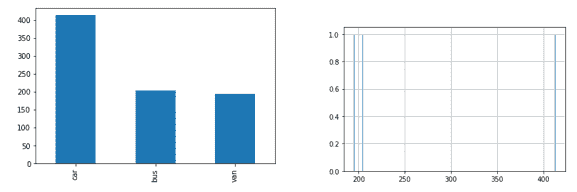

**第 4 步：** 现在我们将检查数据集中是否有任何缺失的数据点。我们的数据集中没有缺失的数据点，因为我们已经处理过了。

```py
vehicle_df.isna().sum()
```

##### 注意

我们将在后面的章节中讨论处理缺失值的方法，因为删除缺失值通常不是最好的方法。

**第 5 步：** 现在我们将对数据集进行标准化。对于聚类来说，标准化数据集是一个很好的实践。这是很重要的，因为不同的维度可能处于不同的尺度，如果某个维度的值自然上比其他维度的值要大得多，那么一个维度可能会在距离计算中占据主导地位。下面使用`zscore`和`StandardScaler()`函数来实现。请参考书的附录，了解`zscore`和`StandardScaler()`函数之间的区别。

```py
vehicle_df_1 = vehicle_df.drop('class', axis=1)
from scipy.stats import zscore
vehicle_df_1_z = vehicle_df_1.apply(zscore)
from sklearn.preprocessing import StandardScaler
import numpy as np
sc = StandardScaler()
X_standard = sc.fit_transform(vehicle_df_1)
```

**第 6 步：** 我们现在要快速查看数据集，生成一个散点图。该图显示了我们在上一步中创建的`X_standard`的所有数据点的分布。

```py
plt.scatter(X_standard[:,0], X_standard[:,1])
plt.show()
```

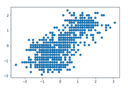

**步骤 7：** 我们现在将执行 k-means 聚类。首先，我们必须使用肘部法选择最佳聚类数。从 sklearn 库中，我们导入 KMeans。在一个 for 循环中，我们对聚类值从 1 到 10 进行迭代。换句话说，算法将创建 1、2、3、4 到 10 个聚类，然后生成结果供我们选择最优 k 值。

在下面的代码片段中，模型对象包含了在上一步生成的 X_standard 上适配的 KMeans 算法的输出。这里，欧几里得距离被用作距离度量。

```py
from sklearn.cluster import KMeans
from scipy.spatial.distance import cdist
clusters=range(1,10)
meanDistortions=[]
for k in clusters:
    model=KMeans(n_clusters=k)
    model.fit(X_standard)
    prediction=model.predict(X_standard)
    meanDistortions.append(sum(np.min(cdist(X_standard, model.cluster_centers_, 'euclidean'), axis=1)) / X_standard
                           .shape[0])
plt.plot(clusters, meanDistortions, 'bx-')
plt.xlabel('k')
plt.ylabel('Average distortion')
plt.title('Selecting k with the Elbow Method')
```

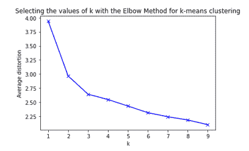

**步骤 8：** 正如我们所观察到的，最佳聚类数为 3\. 这是一个尖锐转折点，在图表中清晰可见。我们将使用 3 个聚类数进行 k-means 聚类。尽管这里的数字 3 没有特别之处，但它最适合这个数据集，我们也可以使用 4 或 5 个聚类数。`random_state` 是一个用于确定质心初始化的参数。我们将其设置为一个值以使随机性变得确定性。

```py
kmeans = KMeans(n_clusters=3, n_init = 15, random_state=2345) 
kmeans.fit(X_standard)
```

**步骤 9：** 获取聚类的质心

```py
centroids = kmeans.cluster_centers_
centroids
```

**步骤 10：** 现在我们将使用质心，以便它们可以按列进行分析。

```py
centroid_df = pd.DataFrame(centroids, columns = list(X_standard) )
```

**步骤 11：** 我们现在将创建一个仅用于创建标签的 `dataframe`，然后将其转换为分类变量。

```py
dataframe_labels = pd.DataFrame(kmeans.labels_ , columns = list(['labels']))
dataframe_labels['labels'] = dataframe_labels['labels'].astype('category')
```

**步骤 12：** 在这一步中，我们将两个 `dataframes` 进行连接

```py
dataframe_labeled = vehicle_df_1.join(dataframe_labels)
```

**步骤 13：** 执行 group by 操作以创建用于分析的数据框

```py
dataframe_analysis = (dataframe_labeled.groupby(['labels'] , axis=0)).head(1234)
dataframe_labeled['labels'].value_counts()  
```

**步骤 14：** 现在，我们将为我们定义的聚类创建可视化。这是使用 `mpl_toolkits` 库完成的。逻辑很容易理解。数据点根据相应的标签着色。其余的步骤与调整标签、标题、刻度等有关的细节。由于在绘图中不可能绘制所有的 18 个变量，我们选择了 3 个变量来显示在图中。

```py
from mpl_toolkits.mplot3d import Axes3D
fig = plt.figure(figsize=(8, 6))
ax = Axes3D(fig, rect=[0, 0, .95, 1], elev=20, azim=60)
kmeans.fit(vehicle_df_1_z)
labels = kmeans.labels_
ax.scatter(vehicle_df_1_z.iloc[:, 0], vehicle_df_1_z.iloc[:, 1], vehicle_df_1_z.iloc[:, 3],c=labels.astype(np.float), edgecolor='k')
ax.w_xaxis.set_ticklabels([])
ax.w_yaxis.set_ticklabels([])
ax.w_zaxis.set_ticklabels([])
ax.set_xlabel('Length')
ax.set_ylabel('Height')
ax.set_zlabel('Weight')
ax.set_title('3D plot of KMeans Clustering on vehicles dataset')
```


我们也可以用多个其他值对上述代码进行测试。我们已经创建了使用不同值的代码。出于空间考虑，我们将不同值的测试代码放在了 github 位置。

在上面的例子中，我们首先对数据集进行了小型的探索性分析。

##### 注意

探索性数据分析（EDA）是实现稳健机器学习解决方案和成功项目的关键。在随后的章节中，我们将为数据集创建详细的 EDA。

接下来是确定最佳聚类数，本例中为三。然后我们实施了 k-means 聚类。您应该迭代不同的初始化 k-means 解决方案并比较结果，迭代不同的 k 值，并可视化以分析数据点的移动。在本章后面，我们将使用 Python 创建层次聚类的相同数据集。

基于质心的聚类是最推荐的解决方案之一，因为其逻辑较少，易于实现，灵活性高且易于维护。每当我们需要聚类作为解决方案时，大多数情况下我们都会从创建一个作为基准的 k 均值聚类解决方案开始。该算法非常受欢迎，通常是聚类的首选解决方案之一。然后我们会测试并迭代其他算法。

这标志着对基于质心的聚类算法的讨论结束。我们现在将继续前进，讨论连接性解决方案，并在下一节中讨论层次聚类。

## 2.4 基于连接性的聚类

“物以类聚”是连接性聚类中遵循的原则。核心概念是-彼此连接的对象相似。因此，根据这些对象之间的连接性，它们被组合成簇。图 2.11 中展示了这种表示的一个示例，我们可以迭代地对观察进行分组。例如，我们从所有事物开始，分成生物和非生物等等。这种表示最好使用右侧的图表展示，称为*Dendrogram*。

##### 图 2.11 层次聚类利用迭代地对相似对象进行分组。右侧是聚类的可视化表示，称为树状图。

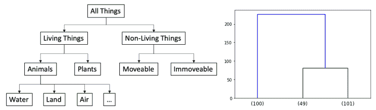

由于存在树状结构，连接性聚类有时被称为*层次*聚类。

层次聚类很好地符合人类直觉，因此我们容易理解它。与 k 均值聚类不同，在层次聚类中，我们不必输入最终聚类的数量，但该方法确实需要一个终止条件，即聚类应何时停止。同时，层次聚类不建议聚类的最佳数量。从生成的层次结构/树状图中，我们必须自己选择最佳的聚类数。在接下来的部分中，当我们为其创建 Python 代码时，我们将更多地探讨它。

层次聚类可以通过图 2.12 来理解，如下所示。这里第一个节点是根节点，然后迭代地分裂成节点和子节点。每当一个节点不能再进一步分裂时，它被称为终端节点或*叶子*。

##### 图 2.12 层次聚类具有一个根节点，分裂为节点和子节点。不能再进一步分裂的节点称为叶子。在自底向上的方法中，将合并叶子节点

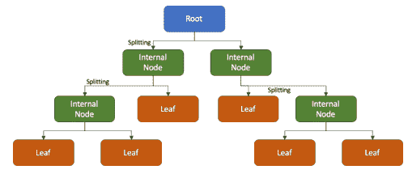

由于将观察结果合并成簇的过程或逻辑不止一个，我们可以生成大量的树状图，如下所示的(Equation 2.7)：

##### (Equation 2.7)

树状图数量 = (2n-3)!/[2^((n-2)) (n-2)!]

其中 n 是观察数或叶子数。所以如果我们只有 2 个观察，我们只能有 1 个树状图。如果有 5 个观察，我们可以有 105 个树状图。因此，根据观察数，我们可以生成大量的树状图。

根据用于创建观察值分组的过程，层次聚类可以进一步分类，我们将在下面探讨这一点。

### 2.4.1 层次聚类的类型

基于分组策略，层次聚类可以细分为两种类型：*聚合*聚类和*分裂*聚类。

| 序号 | 聚合方法 | 分裂方法 |
| --- | --- | --- |
| 1 | 自底向上方法 | 自顶向下方法 |
| 2 | 每次观察都会创建自己的群集，然后随着算法的进行而进行合并 | 我们从一个群集开始，然后观察被迭代地分割以创建类似树状的结构 |
| 3 | 采用贪婪方法进行合并（下面描述了贪婪方法） | 采用贪婪方法进行分割 |
| 4 | 观察会找到最佳配对进行合并，当所有观察都与彼此合并时，流程完成 | 一开始会取全部观察，然后根据分裂条件进行分割，直到所有观察都被用完或达到终止条件 |

##### 图 2.13 中层次聚类的步骤。从左到右是聚合聚类（节点的分裂），从右到左是分裂聚类（节点的合并）

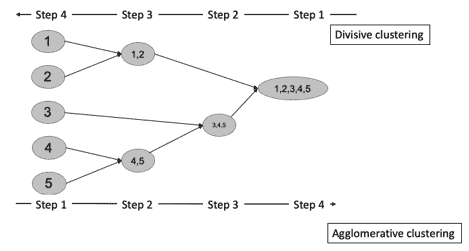

让我们先探讨*贪婪方法*的含义。贪婪方法或贪婪算法是指在每一步都会做出最佳选择，而不考虑对未来状态的影响。换句话说，我们活在当下，并从当下可用的选择中选择最佳选项。当前选择与未来选择无关，算法会在以后解决子问题。贪婪方法可能*不会*提供最优解，但通常在合理时间内会提供接近最优解的局部最优解。层次聚类在合并或分割节点时遵循这种贪婪方法。

我们现在将审查层次聚类方法中的步骤：

**第一步：** 如上图（图 2.13）所示，假设我们的数据集中有五个观察值– 1, 2, 3, 4 和 5。

**第二步：** 在这一步中，观察 1 和 2 被分为一组，4 和 5 被合并成一组。3 没有被合并到任何一组中。

**第三步：** 现在，在这一步中，我们将前一步中 4,5 的输出和观察 3 分为一个群集。

**第四步：** 步骤 3 的输出与 1,2 的输出结合成为一个单一的群集。

在这种方法中，从左到右，我们有一种自下而上的方法，而从右到左则是一种自上而下的方法。在自下而上的方法中，我们正在合并观测结果，而在自上而下的方法中，我们正在分割观测结果。我们可以同时使用自下而上或自上而下的方法进行层次聚类。分割性聚类是一种详尽的方法，有时可能比其他方法花费更多时间。

与 k-means 聚类类似，在这里用于测量距离的距离度量标准起着重要作用。我们知道并了解如何测量数据点之间的距离，但是有多种方法来定义该距离，我们现在正在研究这些方法。

### 2.4.2 距离测量的链接标准

我们知道我们可以使用欧氏距离、曼哈顿距离或切比雪夫距离等距离度量标准来衡量两个观测之间的距离。同时，我们可以采用各种方法来定义该距离。根据这个输入标准，得到的聚类结果将不同。定义距离度量标准的各种方法包括：

+   **最近邻或单链接** 使用不同聚类中两个最近点之间的距离。计算不同聚类中最近邻的距离，并用于确定下一个分裂/合并。通过对所有成对进行穷举搜索来完成。

    +   **最远邻或完全链接** 是最近邻方法的相反。在这里，我们不是考虑最近邻，而是专注于不同聚类中的最远邻。换句话说，我们确定聚类之间的距离是通过两个对象之间的最大距离计算的。

    +   **群体平均链接** 计算两个不同聚类中所有可能的对象对之间距离的平均值。

+   **Ward 链接** 方法旨在最小化合并为一体的聚类的方差。

在我们为层次聚类开发实际代码时，我们可以使用这些距离度量的选项，并比较准确度以确定数据集的最佳距离度量。在算法训练期间，算法将合并最小化所选择的链接标准的观测。

##### 注意

算法的这些输入被称为超参数。这些是我们向算法提供的参数，以根据我们的要求生成结果。超参数的一个例子是 k-means 聚类中的“k”。

我们可以在下面的图 2.14 中可视化各种链接。

##### 图 2.14（i）单链接是最近邻（ii）完全链接是最远邻（iii）群体平均是聚类之间距离的平均值

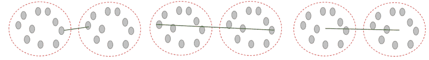

通过这个，我们已经理解了层次聚类中的工作机制。但我们仍然没有解决使用层次聚类确定最优聚类数量的机制，我们正在研究这个问题。

### 2.4.3 最佳聚类数量

回想一下，在 k 均值聚类中，我们必须将聚类的数量作为算法的输入。我们使用肘部法确定最佳聚类数量。在层次聚类中，我们不必向算法指定聚类的数量，但仍然必须确定我们希望拥有的最终聚类数量。我们使用树状图来解决这个问题。

假设我们总共有 10 个数据点显示在图 2.15 底部。聚类会迭代地合并，直到我们得到一个最终聚类在顶部。树状图的高度，在两个聚类相互合并时表示向量空间图中的两个聚类之间的相应距离。

##### 图 2.15 树状图用于确定最佳聚类数量。X 和 Y 之间的距离大于 A＆B 和 P＆Q，因此我们选择该位置作为切割点来创建聚类，并选择聚类数量为 5。x 轴表示聚类，y 轴表示两个聚类之间的距离（不相似度）。

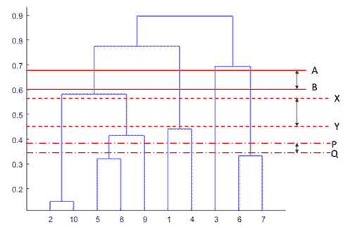

从树状图中，聚类的数量由水平线切割的垂直线数量决定。*最佳*聚类数量由树状图中被水平线切割的垂直线数量给出，使得它与最高的垂直线相交。或者如果切割从垂直线的一端移动到另一端，那么所覆盖的长度是最大的。树状图利用聚类的分支显示各个数据点之间的关系密切程度。在树状图中，位于相同高度水平的聚类比位于不同高度水平的聚类之间更密切相关。

在图 2.15 中显示的示例中，我们展示了三个潜在的切割点 - AB，PQ 和 XY。如果我们在 AB 上方切割，将导致两个非常宽泛的聚类，而在 PQ 下方切割，将导致九个聚类，这将变得难以进一步分析。

这里，X 和 Y 之间的距离大于 A＆B 和 P＆Q。因此，我们可以得出结论，X 和 Y 之间的距离最大，因此我们可以将其确定为最佳切割。该切割在五个不同点相交，因此我们应该有五个聚类。因此，树状图中切割的高度类似于 k 均值聚类中的 k 值。在 k 均值聚类中，“k”确定聚类的数量。在层次聚类中，最佳切割确定我们希望拥有的聚类数量。

类似于 k 均值聚类，最终的聚类数量并不仅取决于算法的选择。商业眼光和实用逻辑在确定最终聚类数量方面起着至关重要的作用。回顾一下，聚类的重要属性之一是它们的可用性，我们在之前的第 2.2 节中已经讨论过。

 小测验——回答这些问题来检验你的理解力。答案在书的结尾。

1. 层次聚类中使用的贪婪方法是什么？

2. 完全连接法用于查找最接近邻居的距离——正确还是错误？

3. 群组联接与瓦德联接有什么区别？

4.   描述找到“k”最优值的过程

我们已经讨论了层次聚类的背景以及如何确定聚类。现在我们将讨论我们在层次聚类中面临的优势和挑战。

### 2.4.4 层次聚类的优缺点

层次聚类是一种强大的聚类技术，也很受欢迎。类似于 K 均值，它也使用距离作为衡量相似性的度量。同时，该算法也存在一些挑战。我们正在讨论层次聚类的利与弊。层次聚类的优势包括：

+   也许我们在层次聚类中最大的优势就是结果的可重现性。回顾一下，在 K 均值聚类中，过程始于对中心点的随机初始化，因而会得到不同的结果。而在层次聚类中，我们可以重现结果。

    +   在层次聚类中，我们不需要输入要对数据进行分段的聚类数。

    +   实施是容易实现和理解的。由于它遵循类似树的结构，因此可以向非技术背景的用户解释清楚。

+   生成的树状图可以通过可视化来解释数据并产生非常好的理解。

与此同时，我们在使用层次聚类算法时面临一些挑战：

+   层次聚类最大的挑战是收敛所需的时间。K 均值的时间复杂度是线性的，而层次聚类是二次的。举例来说，如果我们有“n”个数据点，那么对于 K 均值聚类，时间复杂度将是 O(n)，而对于层次聚类，则是 O(n³)。

##### 如果你想学习 O(n)，可以参考本书的附录。

+   由于时间复杂度为 O(n³)，这是一个耗时的任务。此外，计算所需的内存至少是 O(n²)，使得层次聚类成为一个非常耗时和内存密集型的过程。即使数据集是中等大小，这也是一个问题。如果我们使用高端处理器，则计算可能不是一个挑战，但对于普通计算机来说可能会成为一个问题。

    +   有时树状图的解释可能会有主观性，因此在解释树状图时需要谨慎。解释树状图的关键是注重任何两个数据点连接的高度。由于不同的分析人员可能会解释出不同的切割点并试图证明他们的方法，因此解释可能存在主观性。因此，建议在数学的光线下解释结果，并将结果与现实世界的业务问题相结合。

    +   层次聚类无法撤销其之前所做的步骤。如果我们觉得某个连接不正确，应该撤销，但目前还没有机制可以移除连接。

+   该算法对异常值和混乱的数据集非常敏感。异常值、NULL、缺失值、重复项等使数据集变得混乱。因此，结果可能不正确，也不是我们预期的。

尽管存在种种挑战，层次聚类是最常用的聚类算法之一。通常，我们为同一数据集创建 k-means 聚类和层次聚类，以比较两者的结果。如果建议的簇的数量和各自簇的分布看起来相似，我们对所使用的聚类方法更有信心。

我们已经涵盖了对层次聚类的理论理解。现在是行动的时候，跳入 Python 进行编码。

### 使用 Python 的层次聚类案例研究

现在，我们将为层次聚类创建一个 Python 解决方案，使用与 k-means 聚类相同的数据集。

**步骤 1-6：** 加载所需的库和数据集。为此，请按照我们在 k-means 算法中所遵循的步骤 1 到 6 进行操作。

**步骤 7：** 接下来，我们将使用三种链接方法（平均、Ward 和完全）创建层次聚类。然后对簇进行绘图。该方法的输入是 X_Standard 变量、使用的链接方法和距离度量。然后，使用 matplotlib 库，我们绘制树状图。在代码片段中，只需将方法从“average”更改为“ward”和“complete”，就可以得到相应的结果。

```py
from scipy.cluster.hierarchy import dendrogram, linkage
Z_df_average = linkage(X_standard, 'average', metric='euclidean')
Z_df_average.shape
plt.figure(figsize=(30, 12))
dendrogram(Z_df_average)
plt.show()
```

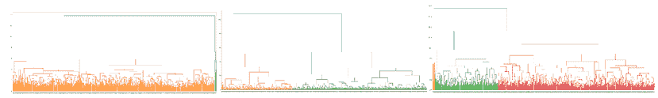

**步骤 8：** 现在，我们想要选择我们希望拥有的簇的数量。为此目的，让我们通过对最后 10 个合并的簇进行子集划分来重新创建树状图。我们选择了 10，因为这通常是一个最佳选择，建议您也尝试其他值。

```py
dendrogram(
    Z_df_complete,
    truncate_mode='lastp',    p=10,)
plt.show()
```

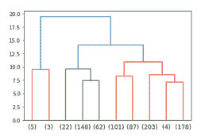

**步骤 9：** 我们可以观察到，最优距离是 10。

**步骤 10：** 将数据聚类到不同的组中。通过使用上一节描述的逻辑，最优簇的数量被确定为四个。

```py
from scipy.cluster.hierarchy import fcluster
hier_clusters = fcluster(Z_df_complete, max_distance, criterion='distance')
hier_clusters
len(set(hier_clusters)) 
```

**步骤 11：** 使用 matplotlib 库绘制不同的簇。

```py
plt.scatter(X_standard[:,0], X_standard[:,1], c=hier_clusters)  
plt.show()
```

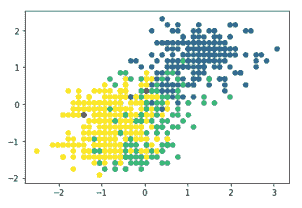

**步骤 12：** 对于不同的距离值，簇的数量会改变，因此图表会呈现不同的样子。我们展示了距离为 5、15、20 的不同结果，并且每次迭代生成的簇的数量也不同。在这里，我们可以观察到，当我们从左到右移动时，对于不同距离值，我们得到完全不同的结果。在选择距离值时，我们必须要谨慎，有时候，我们可能需要多次迭代才能得到最佳值。

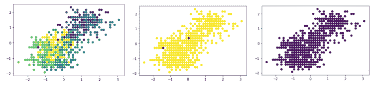

因此，我们可以观察到，使用分层聚类，我们已将数据从图 2 下面的左侧分割到右侧。左侧是原始数据的表示，而右侧是聚类数据集的表示。

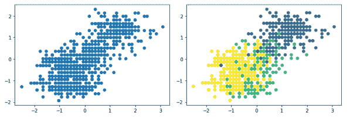

分层聚类是一种强大的方法，也是一种高度推荐的方法。与 k-means 一起，它为基于聚类的解决方案建立了良好的基础。大多数情况下，至少这两种技术在我们创建聚类解决方案时会被考虑。然后，我们会继续尝试其他方法。

这标志着对基于连通性的聚类算法的讨论的结束。我们现在将前进到基于密度的解决方案，并在下一节讨论 DBSCAN 聚类。

## 2.5 基于密度的聚类

我们在早期章节中学习了 k-means。回想一下它如何使用基于质心的方法将聚类分配给每个数据点。如果一个观测值是异常值，异常值将质心拉向自己，并像正常观测值一样分配到一个聚类中。这些异常值不一定为聚类带来信息，并且可能会不成比例地影响其他数据点，但仍然被作为聚类的一部分。此外，如图 2.16 所示，使用 k-means 算法获取任意形状的聚类是一项挑战。基于密度的聚类方法为我们解决了这个问题。

##### 图 2.16 DBSCAN 非常适用于不规则形状的聚类。通过 k-means，我们通常会得到球形聚类，而 DBSCAN 可以为我们解决这个问题。

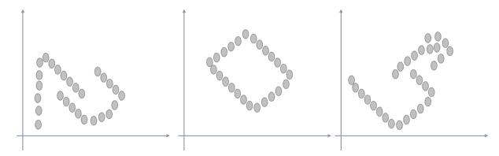

在基于密度的聚类算法中，我们解决了所有这些问题。在基于密度的方法中，将那些与数据集的其他部分相比具有更高密度的区域标识为聚类。换句话说，在表示数据点的向量空间图中 - 一个聚类由高密度点的相邻区域或邻近区域定义。该聚类将被低密度点的区域与其他聚类分开。在稀疏区域或分隔区域中的观测被视为数据集中的噪音或异常值。密度基础聚类的几个示例显示在（图 2.16）中。

我们提到了两个术语 - “邻域”和“密度”。为了理解基于密度的聚类，我们将在下一节中学习这些术语。

### 2.5.1 邻域和密度

想象我们在一个向量空间中表示数据观测。我们有一个点 P。现在我们为这个点 P 定义邻域。表示如下所示：图 2.17。

##### 图 2.17 数据点在向量空间图中的表示。在右侧，我们有一个点 P，绘制的圆是半径 ε。因此，对于 ε > 0，点 P 的邻域由距离点 P 小于等于 ε 的点集定义。

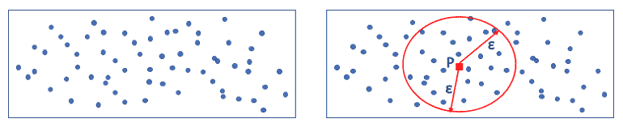

正如我们从上面的图 2.17 中可以看出的那样，对于一个点 P，我们已经为其定义了 ε - 邻域，这些点与 P 等距。在二维空间中，它由一个圆表示，在三维空间中它是一个球体，在 n 维空间中它是以 P 为中心和半径 ε 的 n-球体。这定义了*邻域*的概念。

现在，让我们来探讨术语*密度*。回想密度是质量除以体积（质量/体积）。质量越大，密度越高，质量越低，密度越低。反之，体积越小，密度越高，体积越大，密度越低。

在上文的背景下，质量是邻域中的点数。在下面的图 2.18 中，我们可以观察到 ε 对数据点或质量的数量的影响。

##### 图 2.18 对半径 ε 的影响，左侧的点数比右侧多。因此，右侧的质量较低，因为它包含较少的数据点。

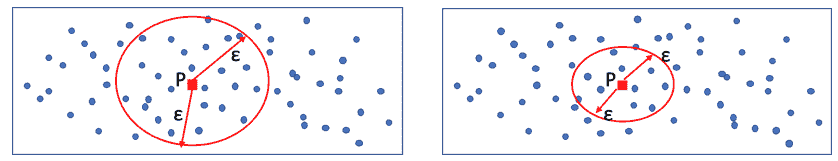

当涉及到体积时，在二维空间的情况下，体积是 πr²，而对于三维的球体，它是 4/3 πr³。对于 n 维度的球体，我们可以根据维度的数量计算相应的体积，这将是 π 乘以一个数值常数的维度数次方。

所以，在图 2.18 中显示的两种情况下，对于一个点“P”，我们可以得到点（质量）和体积的数量，然后我们可以计算相应的密度。但是这些密度的绝对值对我们来说没有任何意义，而是它们与附近区域的相似性（或不同）如何。它用于对具有相似密度的点进行聚类。换句话说，处于同一邻域并具有相似密度的点可以被归为一个簇。

在理想情况下，我们希望拥有具有最大数量点的高密度簇。在下面图 2.19 中显示的两种情况下，我们有一个左侧显示较少密集簇，右侧显示高密集簇。

##### 图 2.19 密集簇优于较少密集簇。理想情况下，我们希望从聚类中获得具有最大数据点数量的密集簇。

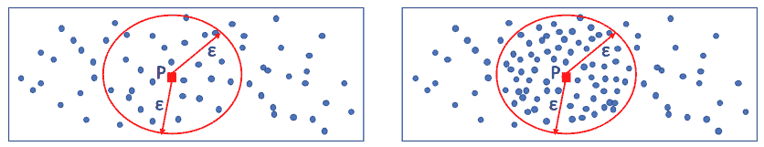

从上面的讨论中，我们可以得出结论：

1.  如果我们*增加* ε 的值，我们将得到*更大*的体积，但不一定会得到*更多*的点（质量）。这取决于数据点的分布。

1.  同样，如果我们*减小* ε 的值，我们将得到*更小*的体积，但不一定会得到*更少*的点（质量）。

这些是我们遵循的基本要点。因此，在选择簇时，选择具有高密度并覆盖最大数量邻近点的簇是至关重要的。

因此，我们已经总结了密度聚类的概念。这些概念是我们接下来讨论的 DBSCAN 聚类的基石！

### 2.5.2 DBSCAN 聚类

具有噪声的基于密度的空间聚类应用，或者称为 DBSCAN 聚类，是高度推荐的基于密度的算法之一。它对密集人口区域紧密打包的数据观察进行聚类，但不考虑低密度区域的异常值。与 k 均值不同，我们不需要指定簇的数量，该算法能够识别不规则形状的簇，而 k 均值通常提出球形簇。与层次聚类类似，它通过连接数据点工作，但是只有满足密度标准或阈值的观察。更多内容可以在我们下面描述的步骤中了解。

##### 注意：

DBSCAN 是由 Martin Ester, Hans-Peter Kriegal, Jörg Sander 和 Xiaowei Xu 于 1996 年提出的。该算法于 2014 年在 ACM SIGKDD 获得了时间测试奖。可以在[http://citeseerx.ist. psu.edu/viewdoc/summary?doi=10.1.1.71.1980]（viewdoc.html）中查阅论文。

DBSCAN 基于我们在上一节讨论的邻域概念。我们现在将深入研究 DBSCAN 的工作方法和构建模块。

#### DBSCAN 聚类的实质

我们现在将对 DBSCAN 聚类的核心构建模块进行检查。我们知道这是一个基于密度的聚类算法，因此邻域概念在这里适用。

假设我们有一些数据观察结果需要进行聚类。我们还要找到一个数据点“P”。然后，我们可以轻松地定义两个超参数术语：

1.  P 周围邻域的半径，即我们在上一节中讨论的*ε*。

1.  我们希望在 P 的邻域内至少有 minPts 个点，或者换句话说，需要至少有一定数量的点来创建一个密集区域。这被称为*minPts*。这是我们可以通过在 minPts 上应用阈值来输入的参数之一。

基于以上概念，我们可以将观察结果分为三大类 - 核心点、边界点或可达点和异常值：

1.  **核心点**：如果至少有 minPts 个点与它的ε距离以内（包括 x 本身），则任何数据点“x”都可以被称为核心点，如下面的（图 2.20）所示。它们是我们聚类的构建模块，因此被称为核心点。我们为每个点使用相同的半径值（ε），因此每个邻域的*体积*保持不变。但是点的数量会有所变化，因此*质量*会有所变化。因此密度也会发生变化。由于我们使用 minPoints 设置阈值，我们正在对密度进行限制。因此，我们可以得出结论，核心点满足最低密度阈值要求。需要注意的是，我们可以选择不同的ε和 minPts 值来迭代和微调簇。

##### 图 2.20 核心点显示为方形，边界点显示为填充圆，而噪声显示为未填充圆。这三者共同是 DBSCAN 聚类的构建模块

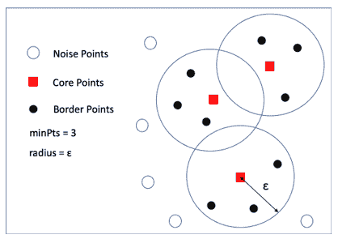

1.  **边界点或可达点**：在簇中不是核心点的点称为边界点，如图 2.20 中的填充圆所示。

如果点“y”距离核心点 x 的距离在ε范围内，则点“y”直接从 x 可达。一个点只能从核心点到达，这是必须遵循的主要条件或规则。只有核心点才能到达非核心点，反之不成立。换句话说，非核心点只能被其他核心点到达，它无法到达其他任何点。在图 2.20 中，边界点表示为黑色圆圈。

为了更好地理解过程，我们必须理解*密度可达*或*连接性*这个术语。如下图 2.21 所示，我们有两个核心点 X 和 Y。我们可以直接从 X 到 Y。点 Z 不在 X 的邻域内，但是在 Y 的邻域内。所以，我们不能直接从 X 到达 Z。但是我们可以确实从 X 通过 Y 到达 Z，换句话说，使用 Y 的邻域，我们可以从 X 到达 Z。我们不能从 Z 到达 Z，因为 Z 是边界点，并且如前所述，我们不能从边界点出发。

##### 图 2.21 中的 X 和 Y 是核心点，我们可以从 X 到 Y。虽然 Z 不在 X 的直接邻域内，但我们仍然可以通过 Y 从 X 到达 Z。这是密度连接点的核心概念。

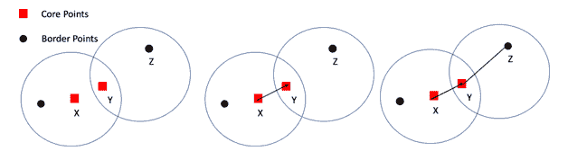

1.  **离群值**：所有其他点都是离群值。换句话说，如果它不是核心点或不是可达点，则它是离群值，如上图 2.20 中的未填充圆所示。它们不被分配任何簇。

现在我们已经定义了 DBSCAN 的构建模块。我们现在将在下一节中继续介绍 DBSCAN 的流程。

#### DBSCAN 聚类的步骤

现在我们已经定义了 DBSCAN 的构建模块。我们将现在检查 DBSCAN 中遵循的步骤：

1.  我们首先为ε和创建簇所需的最小点数（minPts）分配值。

1.  我们首先选择一个随机点，比如说“P”，该点尚未被分析并分配任何簇。

1.  然后我们分析 P 的邻域。如果它包含足够数量的点，即高于 minPts，则满足开始一个簇的条件。如果是这样，我们将点 P 标记为*核心点*。如果一个点不能被识别为核心点，我们将为其分配*离群值*或*噪声*的标签。我们应该注意到这一点后来可以成为不同簇的一部分。然后我们回到步骤 2。

1.  一旦找到了这个核心点“P”，我们就开始通过添加所有从 P 直接可达的点来创建这个簇，然后通过添加更多从 P 直接可达的点来增加这个簇的大小。然后我们通过迭代所有这些点来将所有点添加到簇中，这些点可以使用邻域包含。如果我们将一个离群值点添加到簇中，则离群值点的标签将更改为边界点。

1.  这个过程会一直持续，直到密度聚类完成。然后我们找到一个新的未分配点并重复这个过程。

1.  一旦所有点都被分配到一个簇或称为异常值，我们就停止我们的聚类过程。

在过程中进行迭代。一旦聚类结束，我们就利用业务逻辑来合并或拆分一些簇。

 小测验 - 回答这些问题来检查你的理解。答案在本书末尾

1. 将 DBSCAN 聚类的重要性与 kmeans 聚类进行比较和对比。

2. 非核心点可以到达核心点，反之亦然 - 真或假？

3. 解释邻域和 minPts 的重要性。

4. 描述找到“k”的最优值的过程

现在我们清楚了 DBSCAN 聚类的过程。在创建 Python 解决方案之前，我们将检查 DBSCAN 算法的优缺点。

#### DBSCAN 聚类的优缺点

DBSCAN 具有以下优点：

+   与 k-means 不同，我们不需要为 DBSCAN 指定簇的数量。

    +   该算法对不干净的数据集是一种相当强大的解决方案。与其他算法不同，它可以有效地处理异常值。

    +   我们也可以确定不规则形状的簇。可以说，这是 DBSCAN 聚类的最大优势。

+   算法只需要半径和 minPts 的输入。

DBSCAN 面临以下挑战：

+   使用 DBSCAN 时，聚类的差异有时并不明显。根据处理观察的顺序，一个点可以改变其簇。换句话说，如果边界点 P 可以被多个簇访问，P 可以属于任一簇，这取决于处理数据的顺序。

    +   如果数据集不同区域的密度差异很大，则确定 ε 和 minPts 的最佳组合将变得困难，因此，DBSCAN 将无法生成有效结果。

    +   使用的距离度量在包括 DBSCAN 在内的聚类算法中发挥了非常重要的作用。可以说，最常用的度量是欧几里得距离，但如果维度的数量相当大，则计算将变得很困难。

+   该算法对 ε 和 minPts 的不同取值非常敏感。有时，找到最优值成为一项挑战。

我们现在将为 DBSCAN 聚类创建一个 Python 解决方案。

#### DBSCAN 聚类的 Python 解决方案

我们将使用与 k-means 和层次聚类相同的数据集。

**第 1-6 步：** 加载库和数据集，直到 k-means 算法的第 6 步。

**第 7 步：** 导入额外的库

```py
from sklearn.cluster import DBSCAN 
from sklearn.preprocessing import StandardScaler 
from sklearn.preprocessing import normalize 
from sklearn.neighbors import NearestNeighbors
```

**第 8 步：** 我们正在使用 minDist 和半径的值来拟合模型。

```py
db_default = DBSCAN(eps = 0.0375, min_samples = 6).fit(X_standard) 
labels = db_default.labels_
```

**第 9 步：** 不同的簇数为 1。

```py
list(set(labels))
```

**第 10 步：** 我们在这里得不到任何聚类的结果。换句话说，由于我们没有提供 minPts 和 ε 的最优值，所以聚类没有任何逻辑结果。

**步骤 11：** 现在，我们将找出ε的最佳值。为此，我们将计算每个点的最近点距离，然后对结果进行排序和绘制。无论何时弯曲程度最大，它就是ε的最佳值。对于 minPts，通常 minPts ≥ d+1，其中 d 是数据集中的维数。

```py
neigh = NearestNeighbors(n_neighbors=2)
nbrs = neigh.fit(X_standard)
distances, indices = nbrs.kneighbors(X_standard)
distances = np.sort(distances, axis=0)
distances = distances[:,1]
plt.plot(distances)
```

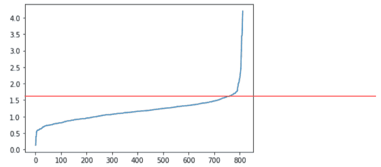

##### 注

建议你阅读链接中的文章，进一步研究如何为 DBSCAN 选择半径的值`iopscience.iop.org/article/10.1088/1755-1315/31/1/012012/pdf`

**步骤 12：** 最佳值为 1.5，正如上面观察到的缺陷点所示。我们将使用它，并将 minPts 设置为 5，通常视为标准。

```py
db_default = DBSCAN(eps=1.5, min_samples=5)
db_default.fit(X_standard)
clusters = db_default.labels_
```

**步骤 13：** 现在我们可以观察到我们得到了不止一个簇。

```py
list(set(clusters))
```

**步骤 14：** 让我们绘制这些簇。

```py
colors = ['blue', 'red', 'orange', 'green', 'purple', 'black', 'brown', 'cyan', 'yellow', 'pink']
vectorizer = np.vectorize(lambda x: colors[x % len(colors)]) 
plt.scatter(X_standard[:,0], X_standard[:,1], c=vectorizer(clusters))
```

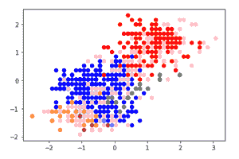

我们使用了 DBSCAN 创建了一个解决方案。建议你比较来自所有三种算法的结果。在现实世界的情景中，我们测试使用多种算法的解决方案，用超参数进行迭代，然后选择最佳解决方案。

基于密度的聚类是相当高效且在一定程度上非常有效的解决方案。如果怀疑簇的形状是不规则的，强烈建议使用它。

通过这些内容，我们结束了对 DBSCAN 聚类的讨论。在下一节中，我们将解决一个关于聚类的业务用例。在案例研究中，重点不太在技术概念上，而更多地在商业理解和解决方案生成上。

## 2.6 使用聚类的案例研究

现在我们将定义一个使用聚类作为解决方案之一的案例研究。案例研究的目标是让你了解实际的商业世界。这种基于案例研究的方法也在与工作相关的面试中使用，在面试阶段会讨论一个案例。因此，强烈建议你了解我们如何在实际的商业场景中实施机器学习解决方案。

一个案例研究通常涉及一个商业问题，可用的数据集，可以使用的各种解决方案，面临的挑战以及最终选择的解决方案。我们还讨论在实际商业中实施解决方案时遇到的问题。

所以，让我们开始使用无监督学习进行聚类的案例研究。在案例研究中，我们关注解决案例研究所采取的步骤，而不是技术算法，因为对于特定问题可能存在多个技术解决方案。

**商业背景**：我们考虑的行业可能是零售、电信、银行金融保险、航空、医疗保健。基本上，任何涉及客户的业务（几乎所有业务都有客户）。对于任何业务，目标都是为业务产生更多收入，最终增加业务的整体利润。为了增加收入，业务希望拥有越来越多的新客户。业务也希望现有的消费者购买更多，更经常购买。因此，业务始终努力让消费者参与其中，让他们感到满意，并增加他们与自己的交易价值。

为了实现这一目标，业务应该彻底了解消费者群体，了解他们的偏好、口味、价格点、对类别的喜好等。一旦业务详细审查并理解了消费者群体，那么：

+   产品团队可以根据消费者的需求改进产品特性。

    +   定价团队可以通过将产品价格与客户的首选价格对齐来改进产品价格。价格可以根据客户定制，或者提供忠诚度折扣。

    +   市场营销团队和客户关系团队（CRM）可以通过定制的优惠向消费者推广。

    +   团队可以挽回那些即将流失或停止购买业务的消费者，可以增加他们的消费、增加粘性并增加客户生命周期价值。

+   总的来说，不同的团队可以根据生成的对消费者的理解来调整其提供的内容。最终消费者会更加幸福，更加投入，更加忠诚于业务，从而使消费者参与更加富有成果。

因此，业务必须深入研究消费者的数据，并生成对基础的理解。客户数据可能看起来像下一节中所示的样子。

**用于分析的数据集**：我们以服装零售商（H&M、优衣库等）为例。拥有忠诚计划的零售商保存客户的交易明细。各种（不是详尽）数据来源如下所示：

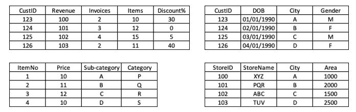

我们可以有存储详细信息的商店细节，如商店 ID、商店名称、城市、地区、员工数量等。我们可以有项目层次结构表，其中包含价格、类别等项目的所有详细信息。然后我们可以有客户人口统计详细信息，如年龄、性别、城市和客户与我们过去的销售的交易历史的详细信息。显然，通过联合这些表，我们将能够创建一个将所有详细信息放在一个地方的主表。

##### 注意

建议您培养良好的 SQL 技能。几乎所有与数据相关的领域都需要它——无论是数据科学、数据工程还是数据可视化，SQL 都是无处不在的。

我们在下面展示了一个主表的例子。它不是变量的详尽列表，变量的数量可能比下面的这些要多得多。主表中包括一些原始变量，如收入、发票等，以及衍生变量，如平均交易金额和平均购物篮大小等。

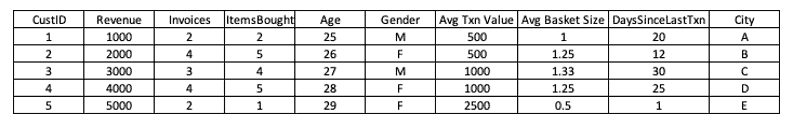

我们还可以以电信运营商为例。在这种情况下，我们将分析的属性包括用户使用情况、通话率、收入、在网络上停留的天数、数据使用等。因此，根据手头的业务领域，数据集可能会发生变化。

一旦我们获取到数据集，通常我们会从中创建衍生属性。例如，平均交易金额属性是总收入除以发票数量。除了已有的原始变量之外，我们会创建这样的属性。

**建议的解决方案**：对于这个问题可能有多种解决方案，我们以下描述其中的一些：

1.  我们可以创建一个仪表盘来展示主要的关键绩效指标（KPI）。它将允许我们分析历史数据并根据分析结果采取必要的行动。但这个解决方案更多是报告性质的，包括我们已经熟悉的趋势和 KPI。

1.  我们可以使用在前几节解决方案中使用的一些技术进行数据分析。这将解决问题的一部分，而且同时考虑多个维度是困难的。

1.  我们可以创建预测模型来预测客户在未来几个月是否会购物或在接下来的 X 天内流失，但这并不能完全解决问题。要明确，这里的流失指的是客户在接下来的 X 天内不再与零售商购物。在这里，持续时间 X 根据业务领域的不同而有所差异。例如，在电信领域，X 的时间会比保险领域短。这是因为人们每天都在使用手机，而在保险领域，大部分客户可能一年只支付一次保费。因此，与保险业务相比，客户的互动较少。

1.  我们可以创建客户分割解决方案，根据客户的历史趋势和属性将客户分组。这是我们用来解决这个业务问题的解决方案。

**问题的解决方案**：回想一下第一章中的图 1.9，我们讨论了机器学习算法中的步骤。一切都始于定义业务问题，然后进行数据发现、预处理等。对于以上案例研究，我们将采用类似的策略。我们已经定义了业务问题；数据发现已经完成，我们已经完成了数据的探索性数据分析和预处理。我们希望使用聚类创建一个分割解决方案。

**步骤 1：** 我们从确定要提供给聚类算法的数据集开始。我们可能已经创建了一些派生变量，处理了一些缺失值或异常值等。在案例研究中，我们想要知道交易、发票、购买商品的最小/最大/平均值等。我们对性别和年龄分布感兴趣。我们也想知道这些变量之间的相互关系，比如女性客户是否比男性客户更多地使用在线模式。所有这些问题都作为这一步的一部分得到回答。

在 Github 存储库中提交了一个 Python Jupyter 笔记本，提供了探索性数据分析（EDA）和数据预处理的详细步骤和代码。快去看看吧！

**步骤 2：** 我们使用 k 均值聚类和层次聚类创建第一个解决方案。对于每个算法，通过更改超参数进行迭代。在案例研究中，我们将选择访问次数、总收入、购买的不同类别、在线/离线交易比率、性别、年龄等作为聚类参数。

**步骤 3：** 选择算法的最终版本以及相应的超参数。根据业务理解进一步分析聚类。

**步骤 4：** 更常见的情况是，根据观察的大小和它们所包含属性的性质，对聚类进行合并或分割。例如，如果总客户群有 100 万人，要对 100 个人的聚类采取行动将非常困难。同时，要管理 70 万人的聚类同样也很困难。

**步骤 5：** 然后，我们分析最终得到的聚类。检查变量的聚类分布，理解它们的区别因素，并为聚类赋予逻辑名称。我们可以期待在下面的（图 3-）中看到这样的聚类输出。

在下面示例的聚类中，我们描述了消费模式、对之前活动的反应、生命周期阶段和整体参与度等几个维度。还展示了每个维度的相应子细分。聚类将是这些维度的逻辑组合。实际的维度可能会更多。

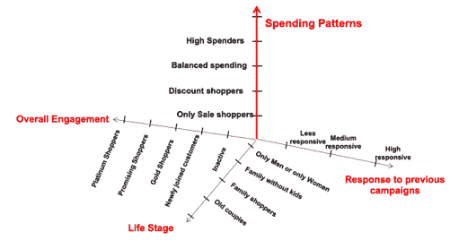

上面显示的细分可以用于多个领域和业务。参数和属性可能会改变，业务背景不同，可用数据的范围可能会有所不同，但总体方法保持相似。

除了上一节中看到的少数应用之外，我们现在正在研究一些用例：

1.  市场研究利用聚类将消费者分组为市场细分。然后可以更好地分析这些组的偏好。产品摆放可以改进，定价可以更紧密，地理选择将更加科学。

1.  在生物信息学和医疗行业，聚类可用于将基因分组为不同的类别。基因组可以被划分为不同的组，并且可以通过分析组的属性来进行比较。

1.  它被用作在创建使用监督学习解决方案的算法之前的有效数据预处理步骤。它还可以通过关注属于一个聚类的数据点来减少数据大小。

1.  它被用于跨结构化和非结构化数据集的模式检测。我们已经研究了结构化数据集的情况。对于文本数据，它可以用于对类似类型的文档、期刊、新闻等进行分类。我们还可以利用聚类来处理并为图像开发解决方案。我们将在后续章节中研究文本和图像的无监督学习解决方案。

1.  由于算法基于相似性度量，因此可以用于将传入的数据集分段为欺诈或真实数据，这可以用来减少犯罪活动的数量。

聚类的使用案例相当多。我们只讨论了其中一些突出的案例。它是一种改变工作方法并在数据周围生成大量见解的算法之一。它被广泛应用于电信、零售、银行保险、航空等领域。

与此同时，该算法也存在一些问题。接下来我们将在下一节中讨论我们在聚类中常见的问题。

## 2.7 聚类中面临的常见挑战

聚类并不是一个完全直截了当、没有任何挑战的解决方案。与世界上任何其他解决方案类似，聚类也面临着自己的一些问题。我们正在讨论我们在聚类中面临的最常见的挑战，它们包括：

1.  有时，数据的数量非常大且有许多维度可用。在这种情况下，难以管理数据集。计算能力可能是有限的，而且像任何项目一样，时间是有限的。为了解决这个问题，我们可以：

1.  通过使用监督学习回归方法或决策树算法等方法找到最重要的变量，尝试通过减少维度数量。

1.  通过使用主成分分析（PCA）或奇异值分解（SVD）等方法来减少维度数量。

1.  嘈杂的数据集：“垃圾进了，垃圾出”-这个陈词滥调对于聚类也是真实的。如果数据集混乱，会引发很多问题。问题可能包括：

1.  缺失值，即 NULL、NA、?、空白等。

1.  数据集中存在异常值。

1.  数据集中存在类似#€¶§^等垃圾值。

1.  数据中存在错误的输入。例如，如果将名称输入到收入字段中，那就是一个错误的输入。

我们将在每个章节讨论解决这些问题的步骤和过程。在本章中，我们正在研究 - 如何处理分类变量

1.  分类变量：回想一下，在讨论中我们讨论过 k-means 无法使用分类变量的问题。我们正在解决这个问题。

要将分类变量转换为数值变量，我们可以使用*独热编码*。该技术在下图（Figure 2.）中显示的变量 `city` 有唯一值 `London` 和 `NewDelhi`。我们可以观察到已创建了两个额外的列，用于填充值为 0 或 1。

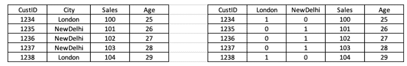

但是使用独热编码并不能始终保证有效和高效的解决方案。想象一下，如果上述例子中的城市数量是 100，那么数据集中将会有 100 个额外的列，而且其中大部分值都将填充为零。因此，在这种情况下，建议对几个值进行分组。

1.  距离度量：使用不同的距离度量可能会得到不同的结果。虽然没有“一刀切”，但大多数情况下，欧几里德距离被用于测量距离。

1.  对聚类的解释是非常主观的。通过使用不同的属性，可以对相同的数据集进行完全不同的聚类。正如前面讨论的那样，重点应该放在解决手头的业务问题上。这是选择超参数和最终算法的关键。

1.  耗时：由于同时处理了许多维度，有时算法的收敛需要很长时间。

但是尽管面临所有这些挑战，聚类仍然是一种广泛认可和使用的技术。我们在最后一节中讨论了聚类在现实世界中的应用案例。

这标志着本章关于聚类的讨论结束。让我们用一些总结思考来结束本章。

## 2.8 总结思考

无监督学习不是一项易事。但它肯定是一项非常有吸引力的工作。它不需要任何目标变量，解决方案自身识别模式，这是无监督学习算法最大的优点之一。并且这些实现已经在商业世界产生了巨大的影响。在本章中，我们研究了一类称为聚类的解决方案。

聚类是一种无监督学习解决方案，用于模式识别、探索性分析和数据点的分割。组织机构广泛使用聚类算法，并继续深入了解消费者数据。可以提供更好的价格、提供更相关的优惠、提高消费者参与度，并改善整体客户体验。毕竟，满意的消费者是任何企业的目标。不仅可以对结构化数据使用聚类，还可以对文本数据、图像、视频和音频使用聚类。由于其能够使用大量维度在多个数据集中找到模式，聚类是想要一起分析多个维度时的解决方案。

在本书的第二章中，我们介绍了基于无监督的聚类方法的概念。我们研究了不同类型的聚类算法——k 均值聚类、层次聚类和 DBSCAN 聚类，以及它们的数学概念、各自的用例以及优缺点，重点放在为相同数据集创建实际 Python 代码上。

在接下来的章节中，我们将研究像 PCA 和 SVD 这样的降维技术。将对技术的构建模块、它们的数学基础、优点和缺点、用例以及实际的 Python 实现进行讨论。

现在您可以进入问题部分了！

#### 实用的下一步和建议阅读材料

1.  从链接获取在线零售数据（`www.kaggle.com/hellbuoy/online-retail-customer-clustering`）。这个数据集包含了一个总部位于英国的零售商在 2010 年 12 月 1 日至 2011 年 12 月 9 日期间发生的所有在线交易。应用本章描述的三种算法，确定公司应该针对哪些客户以及为什么。

1.  从链接获取 IRIS 数据集（`www.kaggle.com/uciml/iris`）。它包括三种鸢尾花品种，每种 50 个样本，具有一些花的特性。使用 kmeans 和 DBSCAN 并比较结果。

1.  探索 UCI 的聚类数据集（`archive.ics.uci.edu/ml/index.php`）

1.  研究关于 kmeans 聚类、层次聚类和 DBSCAN 聚类的以下论文

a) Kmeans 算法:

i.   `www.ee.columbia.edu/~dpwe/papers/PhamDN05-kmeans.pdf`

ii.   `www.researchgate.net/publication/271616608_A_Clustering_Method_Based_on_K-Means_Algorithm`

iii.   `ieeexplore.ieee.org/document/1017616`

b) 层次聚类

i.   `ieeexplore.ieee.org/document/7100308`

ii.   `papers.nips.cc/paper/7200-hierarchical-clustering-beyond-the-worst-case.pdf`

iii.   `papers.nips.cc/paper/8964-foundations-of-comparison-based-hierarchical-clustering.pdf`

c) DBSCAN 聚类

i.   `arxiv.org/pdf/1810.13105.pdf`

ii.   `citeseerx.ist.psu.edu/viewdoc/summary?doi=10.1.1.121.9220`

## 2.9 摘要

+   我们讨论了一种称为聚类的无监督学习技术。通过聚类，我们找出数据集中的潜在模式，并找出数据中的自然分组。

    +   我们了解到，聚类在各行业中都被用于各种目的，包括零售、电信、金融、制药等。聚类解决方案被用于客户分割和营销分割，以更好地理解客户群体，从而进一步提高对客户的定位。

    +   我们学习并理解了基于方法论的多种聚类技术。一些示例包括 k 均值聚类、层次聚类、DBSCAN、模糊聚类等。

    +   我们详细介绍了 K 均值聚类、层次聚类和 DBSCAN 聚类算法。

    +   我们学习了 k 均值（kmeans）是基于聚类的质心，而层次聚类是一种凝聚式聚类技术。DBSCAN 是一种基于密度的聚类算法。

    +   我们还详细讨论了这些聚类算法的优缺点。例如，对于 k 均值，我们必须指定聚类的数量，层次聚类非常耗时，而 DBSCAN 的输出取决于观测数据处理的顺序。

+   我们介绍了用于测量聚类技术准确性的方法，包括 WCSS（组内平方和）、轮廓系数和 Dunn 指数。

    我们为每种技术实现了基于 Python 的解决方案。主要使用的库是 sklearn。

+   在本章末尾，我们提供了实际案例研究来补充学习。
