# 第三章：降维

### 本章内容包括

+   维数灾难及其缺点

+   不同的降维方法

+   主成分分析（PCA）

+   奇异值分解（SVD）

+   PCA 和 SVD 的 Python 解决方案

+   降维的案例研究

“知识是事实的累积过程；智慧则在于它们的简化。”– 马丁·H·菲舍尔

我们在生活中面临复杂的情况。生活给我们提供了多种选择，我们从中选择一些可行的选项。这种筛选的决定基于每个选项的重要性、可行性、效用和预期利润。符合条件的选项随后被选中。一个完美的例子就是选择度假目的地。基于天气、旅行时间、安全、食物、预算等多种选项，我们选择了一些地方作为下一个假期的目的地。在本章中，我们正在学习同样的东西–如何在数据科学和机器学习世界中减少选项的数量。

在上一章中，我们涵盖了主要的聚类算法。我们还在那里进行了一个案例研究。在这些真实案例的数据集中，有很多变量。有时，数据中可能有超过 100 个变量或*维度*。但并非所有变量都重要；并非所有变量都显著。数据集中有很多维度被称为“*维数灾难*”。为了进行进一步的分析，我们从所有维度或变量中选择了一些。在这一章中，我们将学习降维的必要性，各种降维技术，以及各自的优缺点。我们将深入研究主成分分析（PCA）和 SVD（奇异值分解）的概念，它们的数学基础，并用 Python 实现。延续上一章的结构，我们将在最后探讨电信行业的一个真实案例研究。在后面的章节中，我们还将探索其他高级的降维技术，比如 t-SNE 和 LDA。

聚类和降维是无监督学习的主要类别。上一章我们学习了主要的聚类方法，而本章将涵盖降维。有了这两种解决方案，我们将在无监督学习领域取得很大的进展。但是还有更多的高级话题需要涵盖，这些是本书后面章节的内容。

让我们先了解一下“*维数灾难*”是什么意思。

## 3.1 技术工具包

我们将使用与上一章相同的 Python 3.6+版本。Jupyter Notebook 在本章中也将被使用。

所有数据集和代码文件都位于 GitHub 存储库中（`github.com/vverdhan/UnsupervisedLearningWithPython/tree/main/Chapter3`）。您需要安装以下 Python 库才能执行`numpy`、`pandas`、`matplotlib`、`scipy`、`sklearn`等。由于您在上一章中已经使用了相同的软件包，所以无需再安装它们。CPU 足以执行，但如果遇到一些计算问题，请切换到 GPU 或 Google Colab。如果在安装这些包中遇到任何问题，请参考本书的附录。

现在，让我们开始在以下部分进一步了解“*维数灾难*”。

## 3.2 维数灾难

继续使用我们先前介绍的度假目的地示例。目的地的选择取决于许多参数 - 安全性、可用性、餐食、夜生活、天气、预算、健康等等。有太多的参数需要决定，这是一个令人困惑的想法。我们通过一个现实生活的例子来理解。

想象一下：一家零售商想要在市场上推出一款新的鞋类产品。为此，需要选择一个目标客户群体，这个客户群体将通过电子邮件、通讯等方式进行接触。业务目标是引诱这些客户购买新发布的鞋类产品。从整个客户群体中，可以基于诸如客户年龄、性别、消费能力、首选类别、平均开销、购物频率等变量选择目标客户群体。这么多变量或*维度*使我们在基于有效的数据分析技术进行客户筛选时受到困扰，需要同时分析过多参数，检验每个参数对客户购物概率的影响，因此这个任务变得非常繁琐和困惑。这是真实世界的数据科学项目中我们所面临的*维数灾难*问题。我们还可以在另一种情况下遇到维度灾难现象，即当观察值的数量小于变量的数量时。考虑一个数据集，其中观察值的数量为 X，而变量的数量超过了 X，这种情况下我们就面临维度灾难。

通过可视化是理解任何数据集的简单方法。让我们在一个向量空间图中可视化一个数据集。如果数据集中只有一个属性或特征，我们可以用一个维度表示它。如图 3.1(i)所示。例如，我们可能希望只用一个维度来捕捉一个物体的高度。如果我们有两个属性，我们需要两个维度，如图 3.1(ii)所示，在这种情况下，为了得到一个物体的面积，我们将需要长度和宽度。如果我们有三个属性，例如，为了计算需要长度、宽度和高度的体积，它需要一个三维空间，如图 3.1(iii)所示。这个需求将根据属性的数量而继续增长。

##### 图 3.1 (i) 只需要一个维度来表示数据点，例如，表示物体的高度 (ii) 我们需要两个维度来表示一个数据点。每个数据点可以对应一个物体的长度和宽度，用于计算面积 (iii) 三个维度用于展示一个点。这里，需要长度、宽度和高度来获得物体的体积。这个过程根据数据中存在的维度数量而继续。

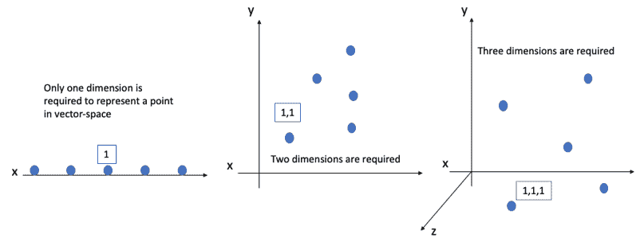

现在想象一下，如果我们总共有 20 个要分析的数据点。如果我们只有一个属性，我们可以将它表示为 x[1]、x[2]、x[3]、x[4]、x[5] …. x[20]，因此，20 维空间足以表示这些点。在第二个例子中，我们需要两个维度，我们将需要(x[1,]y[1])、(x[2,]y[2])、(x[3,]y[3])、(x[4,]y[4])、(x[5,]y[5])….. (x[20,]y[20])，换句话说是 20*20 = 400 维空间。对于三维空间，我们将表示一个点为(x[1,]y[1,]z[1])、(x[2,]y[2,]z[2])、(x[3,]y[3,]z[3])、(x[4,]y[4,]z[4])、(x[5,]y[5,]z[5])….. (x[20,]y[20,]z[20])，我们将需要 20*20*20 = 800 维空间。这个过程将继续下去。

因此，我们很容易得出结论，随着维度数量的增加，所需的空间量会大幅增加。这被称为*维度灾难*。这个术语是由理查德·E·贝尔曼引入的，用来指代数据集中有太多变量的问题——其中一些是重要的，而很多可能不太重要。

还有另一个众所周知的理论，即*休斯现象*如图 3.2 所示。一般来说，在数据科学和机器学习中，我们希望有尽可能多的变量来训练我们的模型。观察到，监督学习分类器算法的性能会增加到一定的极限，随着最适数量的变量达到顶峰。但是，使用相同数量的训练数据，并增加维度数量，监督分类算法的性能会下降。换句话说，如果变量对解决方案的准确性没有贡献，最好不要将其包含在数据集中，并应将这些变量从数据集中删除。

##### 图 3.2 Hughes 现象显示，随着维度数量的增加，机器学习模型的性能会在初期得到提升。但是随着进一步增加，模型的性能会下降。

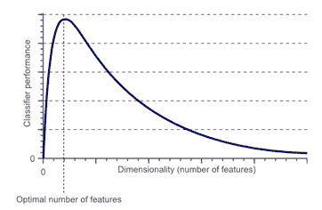

维度数量的增加对机器学习模型的影响如下：

+   由于模型处理了更多的变量，数学复杂度也会增加。例如，在上一章讨论的 k 均值聚类方法中，当变量数量更多时，各个点之间的距离计算将变得更加复杂。因此，整体模型会更加复杂。

    +   在较大维度空间生成的数据集相对于较少变量来说可能更加稀疏。数据集将变得更稀疏，因为有些变量将会有缺失值、NULL 等。因此，空间更为空，数据集更加稀疏，少数变量与之相关联的值更少。

    +   随着模型复杂度的增加，所需的处理时间也会增加。系统在处理如此多维度的情况下将感到压力。

+   整体解决方案变得更加复杂和难以理解和执行。回顾第一章中我们讨论过的监督学习算法。由于维度数量较高，我们可能会在监督学习模型中面临过拟合问题。

当监督学习模型在训练数据上有很好的准确度，但在未知数据上准确度较低时，这就被称为过拟合。过拟合是一个麻烦，因为机器学习模型的目的是在未知数据上表现良好，而过拟合则违背了这一目的。

让我们将事物与一个现实世界的例子联系起来。考虑一个保险公司提供不同类型的保险政策，如人寿保险、车辆保险、健康保险、家庭保险等。该公司希望利用数据科学并执行聚类用例来增加客户群和销售的总保单数量。他们拥有客户的详细信息，如年龄、性别、职业、保单金额、历史交易、持有的保单数量、年收入、保单类型、历史违约次数等。同时，让我们假设还捕捉到是否客户是左撇子还是右撇子、穿黑鞋还是棕鞋、使用的洗发水品牌、头发颜色和最喜欢的餐厅等变量。如果我们将所有变量包括在数据集中，那么结果数据集中的变量总数将会相当高。对于 k-means 聚类算法，距离计算将变得更加复杂，处理时间将增加，整体解决方案将变得相当复杂。

还有一点必须注意，*并非*所有的维度或变量都是重要的。因此，从我们拥有的所有变量中筛选出重要的变量至关重要。记住，自然总是倾向于简单的解决方案！在上述讨论的情况下，像头发颜色和最喜欢的餐厅等变量很可能不会影响结果。因此，我们最好减少维度以简化复杂性并减少计算时间。同时，还必须注意，降维并不总是需要的。它取决于数据集的类型和我们希望解决的业务问题。在本章后续部分的案例研究中，我们将进一步探讨这个问题。

 小测验 - 回答这些问题来检查你的理解。答案在书的最后。

1.   维度灾难指的是数据规模很大。TRUE 或 FALSE。

2.   在数据集中拥有大量变量将始终提高解决方案的准确性。TRUE 或 FALSE。

3.   数据集中有大量变量会如何影响模型？

我们已经确定，拥有许多维度对我们来说是一个挑战。我们现在正在研究各种减少维度的方法。

## 3.3 维度减少方法

在上一节中，我们研究了拥有非常高维数据的缺点。维度较少可能会导致数据结构更简单，这将提高计算效率。同时，我们应该小心减少变量的数量。降维方法的输出应该足够完整以代表原始数据，不应导致任何信息损失。换句话说，如果原本我们有 500 个变量，我们将它降低到 120 个显著变量，那么这 120 个变量*应该*足够强大，能*几乎*捕捉到所有信息。让我们通过一个简单的例子来理解。

想象一下：我们希望预测下个月一个城市会接收到多少降雨量。该城市的降雨预测可能取决于一段时间内的温度、风速测量、压力、距离海洋的距离、海拔等。如果我们想要预测降雨，这些变量是有意义的。同时，例如城市中电影院的数量、城市是否是国家的首都或城市中红色汽车的数量可能不会影响降雨的预测。在这种情况下，如果我们不使用城市中电影院的数量来预测降雨量，那么它将不会降低系统的性能。解决方案很有可能仍然能够表现良好。因此，在这种情况下，通过放弃这样的变量不会丢失任何信息，当然，我们可以将其从数据集中删除。另一方面，移除温度或距离海洋的变量很可能会对预测产生负面影响。这是一个非常简单的例子，用于强调减少变量数量的必要性。

维度或变量数量可以通过手动和基于算法的方法的组合来减少。但在详细研究它们之前，我们应该了解一些数学术语和组件，然后再继续，下面我们将对此进行讨论。

### 3.3.1 数学基础

有很多数学术语是必须掌握的，以便全面了解降维方法。

我们正在尝试减少数据集的维度。数据集只是一个值矩阵——因此很多概念与矩阵操作方法、它们的几何表示以及对这些矩阵进行变换有关。数学概念在本书的附录数学基础中进行了讨论。您还需要理解特征值和特征向量。这些概念将在整本书中被重复使用，因此它们已经放在附录中供快速查阅。在继续之前，建议您先阅读这些内容。现在我们将探讨一些手动的降维方法，然后再转向基于算法的方法。

## 3.4 手动降维方法

为了解决维度灾难，我们希望减少数据集中的变量数量。可以通过从数据集中移除变量来实现减少。或者，一个非常简单的解决方案是合并那些可以逻辑分组或用共同的数学运算表示的变量。

例如，如下表 3.1 所示，数据可以来自零售商店，不同的客户产生了不同的交易。我们将获得每个客户一段时间内的销售额、发票数和购买的商品数量。在下表中，客户 1 产生了两张发票，总共购买了 5 件商品，并产生了 100 的销售额。

如果我们希望减少变量的数量，我们可以将三个变量合并为两个变量。在这里，我们引入了变量 ATV（平均交易价值）和 ABS（平均篮子大小），其中 ATV = 销售额/发票数，ABS = 商品数量/发票数。

因此，在第二个表中，对于客户 1，我们有 ATV 为 50，ABS 为 2.5。因此，变量的数量已经从三个减少到两个。该过程只是一个示例，展示了如何可以结合各种变量。这并不意味着我们应该用 ATV 替换销售额作为一个变量。

表 3.1 在第一张表中，我们有销售额、发票和商品数量作为变量。在第二个表中，它们被合并为创建新变量。

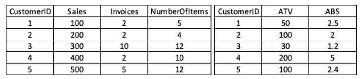

这个过程可以继续减少变量的数量。同样地，对于一个电信用户，我们将拥有一个月内手机通话的分钟数。我们可以将它们相加，创建一个单一的变量 - *一个月内使用的分钟数*。上面的例子是非常基础的，用于起步。使用手动过程，我们可以采用另外两种常用的方法 - 手动选择和使用相关系数。

### 3.4.1 手动特征选择

继续上一节中讨论的降雨预测示例 - 数据科学家可能能够去掉一些变量。这将基于对手头的业务问题和相应数据集的深刻理解。然而，这是一个潜在的假设，即数据科学家能够充分理解数据集，并对业务领域有深刻理解。大部分时间，业务利益相关者将能够指导这样的方法。同样重要的是，变量是独特的，并且不存在太多的依赖性。

如下表 3.2 所示，我们可以删除一些对于预测降雨可能没有用的变量。

表 3.2 在第一个表中，我们有数据集中所有的变量。使用业务逻辑，一些可能没有太多用处的变量在第二个表中被丢弃了。但这需要谨慎处理。最好的方法是从业务利益相关者那里得到指导。

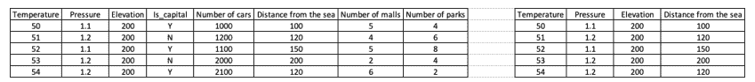

有时，特征选择方法也被称为*包装器方法*。在这里，机器学习模型使用变量的子集进行包装或拟合。在每次迭代中，我们将得到不同的结果集。选择生成最佳结果的集合用于最终模型。

接下来的方法是基于各种属性之间的相关性而存在的。

### 3.4.2 相关系数

两个变量之间的相关性简单地意味着它们彼此具有相互关系。一个变量值的变化将影响另一个变量的值，这意味着一个变量的数值相似的数据点也在另一个变量中具有相似的数值。高度相关的变量彼此提供类似的信息，因此其中一个可以被舍弃。

相关性在书的附录数学基础中有详细描述。

例如，对于零售店，一天内产生的发票数量与产生的销售额将高度相关，因此可以舍弃其中之一。另一个例子是 - 学习时间更长的学生通常比学习时间较短的学生成绩更好（大多数情况下！）。

但在放弃变量时我们应该小心，不应仅仅依赖相关性。在做出任何决定之前，应该充分了解变量的业务背景。

在从研究中删除任何变量之前，与业务利益相关者讨论是个好主意。

基于相关性的方法有时被称为*过滤方法*。使用相关系数，我们可以过滤并选择最重要的变量。

 自测题 – 回答这些问题以检查你的理解。答案在书的末尾

1.   如果我们觉得一个变量不需要，我们可以简单地将其舍弃。是或否。

2.   如果两个变量相关，总是舍弃其中一个。是或否。

手动方法是更简单的解决方案，可以相当高效地执行。数据集的大小被减小，我们可以继续进行分析。但是手动方法有时是主观的，并且在很大程度上取决于手头的业务问题。许多时候，不可能使用手动方法进行降维。在这种情况下，我们有基于算法的方法，我们将在下一节中学习。

### 3.4.3 基于算法的降维方法

在上一节中，我们讨论了手动方法。从那里继续，我们将在本节中研究基于算法的方法。基于算法的技术是基于更数学的基础的，因此证明是更科学的方法。在现实世界的业务问题中，我们使用手动和基于算法的技术的组合。与基于算法的技术相比，手动方法执行起来更直接。此外，我们无法评论两种技术的比较，因为它们基于不同的基础。但与此同时，你必须在实施基于算法的技术时尽职尽责。

降维中使用的主要技术如下所示。我们将在本书中探讨其中大部分。

1.  主成分分析（PCA）

1.  奇异值分解（SVD）

1.  线性判别分析（LDA）

1.  广义判别分析（GDA）

1.  非负矩阵分解（NMF）

1.  多维缩放（MDS）

1.  局部线性嵌入（LLE）

1.  等距映射

1.  自编码器

1.  t-SNE（T 分布随机邻域嵌入）

这些技术被用于一个共同的最终目标 - 将数据从高维空间转换为低维空间。一些数据转换是线性的，而一些是非线性的。

我们将在本章详细讨论主成分分析（PCA）和奇异值分解（SVD）。在本书的后续章节中，将探讨其他主要技术。也许，PCA 是我们在下一节中探讨的最常引用的降维方法。

## 3.5 主成分分析（PCA）

想象一下：你正在处理一个有 250 个变量的数据集。几乎不可能可视化这样一个高维空间。这 250 个变量中的一些可能彼此相关，一些可能不相关，并且有必要减少变量的数量而不丢失太多信息。主成分分析或 PCA 允许我们在数学上选择最重要的特征并留下其他特征。PCA 确实减少了维数，但也保留了变量之间最重要的关系和数据集中的重要结构。因此，变量的数量减少了，但数据集中的重要信息得到了保留。

主成分分析（PCA）是将高维数据投影到低维空间的过程。简单来说，我们将一个 n 维空间降维到一个 m 维空间（其中 n > m），同时保持原始数据集的本质和基本特征。在这个过程中，旧的变量被降维为新的变量，同时保持了原始数据集的关键信息，新创建的变量称为*主成分*。主成分是原始变量的线性组合。由于这种转换，第一个主成分捕获了数据集中的最大随机性或最高方差。创建的第二个主成分与第一个主成分正交。

如果两条直线彼此正交，意味着它们相互成`90⁰`的角度，

这个过程一直持续到第三个成分等等。正交性使我们能够保持后续主成分之间没有相关性。

PCA 利用数据集的线性变换，这样的方法有时被称为特征投影。结果数据集或投影用于进一步的分析。

让我们通过一个例子更好地理解。在下面（表 3.3）所示的例子中，我们用一些变量来表示一个家庭的总感知价值。这些变量包括面积（平方米）、卧室数、阳台数、距离机场的距离、距离火车站的距离等等——我们有 100 多个变量。

表 3.3 房价估算的基于的变量

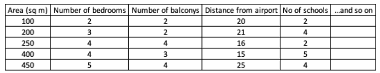

我们可以数学上和逻辑上结合一些变量。PCA 将创建一个新变量，它是一些变量的线性组合，如下面的示例所示。它将得到原始变量的最佳*线性*组合，以便新变量能够捕获数据集的最大方差。方程式 3.1 仅是为了说明目的而显示的一个示例，在这个示例中我们展示了一个新变量，它是其他变量的组合。

##### （方程式 3.1）

new_variable = a*面积 – b*卧室数 + c*距离 – d*学校数

现在让我们通过视觉概念来理解这个概念。在矢量空间图中，我们可以如下图 3.3 所示地表示数据集。第一张图代表了原始数据，我们可以在 x-y 图表中可视化变量。如上所述，我们希望创建变量的线性组合。换句话说，我们希望创建一个数学方程，能够解释 x 和 y 之间的关系。

这种过程的输出将是一条直线，如图 3.3 中的第二张图所示。这条直线有时被称为*最佳拟合线*。利用这条最佳拟合线，我们可以预测给定 x 值的 y 值。这些预测实际上就是数据点在直线上的投影。

如下图 3.3 中的第三个图所示，实际值与投影之间的差异是误差。这些误差的总和被称为总投影误差。

##### 图 3.3 (i) 数据集可以在向量空间图中表示 (ii) 直线可以称为最佳拟合线，其具有所有数据点的投影 (iii) 实际值与投影之间的差异是误差项。

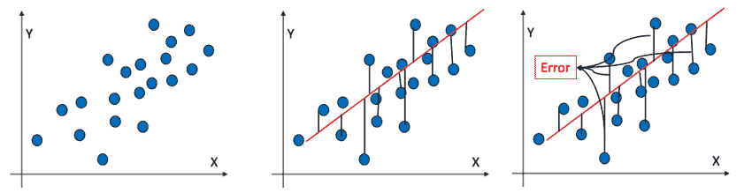

如下图 3.4 所示，这条直线可以有多种选项。这些不同的直线将具有不同的误差和捕捉到的方差值。

##### 图 3.4 数据集可以用多条直线来捕捉，但并非所有直线都能捕捉到最大的方差。给出最小误差的方程将被选定。

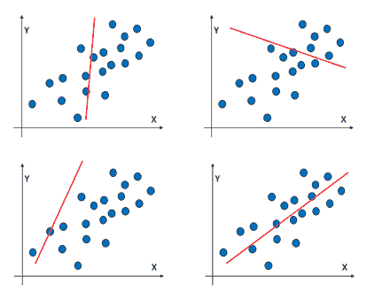

能够捕捉最大方差的直线将被选定。换句话说，它给出了最小的误差。它将是*第一个主成分*，最大扩展方向将是*主轴*。

第二主成分将以类似的方式导出。由于我们知道第一个主轴，我们可以从总方差中减去沿着该主轴的方差以获得残差方差。换句话说，使用第一个主成分，我们将在数据集中捕捉一些方差。但数据集中仍有部分总方差尚未由第一个主成分解释。未解释的总方差部分是残差方差。使用第二主成分，我们希望尽可能多地捕捉方差。

使用相同的过程来捕捉最大方差的方向，我们将得到第二个主成分。第二主成分可以与第一个主成分呈多个角度，如图 3.5 所示。数学上已经证明，如果第二主成分与第一个主成分正交，那么我们可以使用两个主成分来捕捉最大方差。在图 3.5 中，我们可以观察到两个主成分彼此之间呈 90⁰ 角。

##### 图 3.5 (i) 左侧的第一个图是第一个主成分。 (ii) 第二主成分可以相对于第一个主成分处于不同角度。我们必须找到第二主成分，它允许捕捉最大方差 (iii) 为了捕捉最大方差，第二主成分应与第一个主成分正交，因此组合方差被最大化。

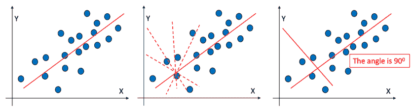

第三、第四个主成分等依此类推。随着主成分的增多，向量空间中的表示变得难以可视化。你可以将其想象成一个带有多个轴的向量空间图。一旦所有主成分都被导出，数据集就会投影到这些轴上。这个转换后的数据集中的列是*主成分*。创建的主成分数量会少于原始变量的数量，并且捕获数据集中存在的最大信息。

在我们深入研究 PCA 过程之前，让我们先了解其重要特性：

+   PCA 的目标是减少结果数据集中的维数。

    +   PCA 生成的主成分旨在通过最大化特征方差来减少数据集中的噪声。

    +   同时，主成分减少了数据集中的冗余。这是通过最小化特征对之间的协方差实现的。

    +   原始变量不再存在于新创建的数据集中。相反，使用这些变量创建新变量。

    +   主成分不一定会与数据集中的所有变量一一对应。它们是现有变量的新组合。因此，它们可以是一个主成分中多个不同变量的组合（如方程式 3.1 所示）。

    +   从数据集创建的新特征不共享相同的列名。

    +   原始变量可能彼此相关，但新创建的变量彼此不相关。

    +   新创建的变量数量少于原始变量的数量。我们选择主成分数量的过程已在 Python 实现部分进行了描述。毕竟，降维的整个目的就在于此。

    +   如果 PCA 用于减少训练数据集中的变量数量，则必须使用 PCA 减少测试/验证数据集。

+   PCA 不等同于降维。它可以用于许多其他用途。一般来说，仅仅将 PCA 用于降维是错误的。

我们现在将研究在实现 PCA 时采用的方法，然后我们将使用 PCA 开发一个 Python 解决方案。虽然我们在开发代码时不需要应用所有步骤，因为这些重活已经由包和库完成。下面给出的步骤已由这些包处理，但仍然必须理解这些步骤，以正确理解 PCA 的工作原理。

PCA 所遵循的步骤是：

1.  在 PCA 中，我们首先**对数据集进行标准化**。 这确保我们所有的变量都具有共同的表示并且可比较。 我们有方法在 Python 中执行标准化，我们将在开发代码时学习。 要更多了解数据集的标准化，请参考附录数学基础。

1.  在标准化数据集中**获取协方差**。 这使我们能够研究变量之间的关系。 我们通常创建如下所示的协方差矩阵，如下一节的 Python 示例所示。

1.  然后我们可以计算协方差矩阵的特征向量和特征值。

1.  然后，我们按照特征值的降序对特征值进行排序。 选择与最大特征值对应的特征向量。 因此所选的组件将能够捕获数据集中的最大方差。 还有其他方法来列出主要组件，我们将在开发 Python 代码时进行探讨。

 快速测验 - 回答这些问题以检查您的理解。 书的末尾有答案

1. PCA 将导致数据集中变量的数量相同。 真还是假。

2. PCA 将能够在数据集中捕获 100％的信息。 真还是假。

3. 选择 PCA 中主要组件的逻辑是什么？

因此，从本质上讲，主成分是原始变量的线性组合。 这种线性组合中的权重是满足最小二乘法误差标准的特征向量。 我们现在正在研究特征值分解，而奇异值分解将在下一节（3.6）中介绍。

### 3.5.1 特征值分解

我们在上一节中学习了 PCA，我们说主要组件是原始变量的线性组合。 现在我们将探讨 PCA 的特征值分解。

在 PCA 的上下文中，特征向量将表示矢量的方向，特征值将是沿着该特征向量捕获的方差。 下面的图 3.6 可以说明，我们正在将原始的 nxn 矩阵分解为组件。

##### 图 3.6 使用特征值分解，原始矩阵可以分解为特征向量矩阵，特征值矩阵和特征向量矩阵的逆。 我们使用这种方法实现 PCA。

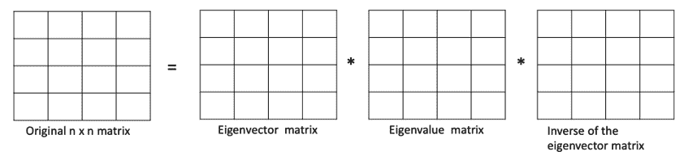

从数学上讲，我们可以通过方程式 3.2 来表示关系。

##### （方程式 3.2）

A*v = λ*v

其中 A 是方阵，v 是特征向量，λ是特征值。 在这里，重要的是要注意特征向量矩阵是正交矩阵，其列是特征向量。 特征值矩阵是对角线矩阵，其特征值是对角线元素。 最后一个组件是特征向量矩阵的逆。 一旦我们有了特征值和特征向量，我们就可以选择显著的特征向量来获取主成分。

我们在本书中将 PCA 和 SVD 作为两种单独的方法进行介绍。这两种方法都用于将高维数据降维到较少的维度，并在此过程中保留数据集中的最大信息量。两者的区别在于 - SVD 存在于任何类型的矩阵（矩形或方形），而特征值分解仅适用于方形矩阵。等我们在本章后面介绍 SVD 时，你会更好地理解它。

我们现在将使用特征值分解创建一个 Python 解决方案。

### 3.5.2 使用 PCA 的 Python 解决方案

我们已经学习了 PCA 的概念和使用特征值分解的过程。现在是时候进入 Python 并在数据集上开发一个 PCA 解决方案了。我们将向你展示如何在数据集上创建特征向量和特征值。为了实现 PCA 算法，我们将使用`sklearn`库。库和包提供了一种更快的实现算法的解决方案。

我们将使用鸢尾花数据集来解决这个问题。这是用于机器学习问题的最受欢迎的数据集之一。该数据集包含三种鸢尾花的数据，每种鸢尾花有 50 个样本，并且具有每朵花的特性 - 如花瓣长度，萼片长度等。问题的目标是使用花的特性来预测物种。因此，独立变量是花的特性，而变量“物种”是目标变量。数据集和代码已经提交到 GitHub 仓库。在这里，我们使用内置的 PCA 函数来减少实现 PCA 所需的工作量。

**步骤 1：** 首先加载所有必要的库。我们将使用 numpy、pandas、seaborn、matplotlib 和 sklearn。请注意，我们从 sklearn 中导入 PCA。

这些是最标准的库。你会发现几乎所有的机器学习解决方案都会在解决方案笔记本中导入这些库。

```py
import numpy as np
import pandas as pd
import seaborn as sns
import matplotlib.pyplot as plt
from sklearn.decomposition import PCA
from sklearn.preprocessing import StandardScaler
```

**步骤 2：** 现在加载数据集。它是一个.csv 文件。

```py
iris_df = pd.read_csv('IRIS.csv')
```

**步骤 3：** 现在我们将对数据集进行基本检查 - 查看前五行，数据的形状，变量的分布等。我们在这里不进行详尽的探索性数据分析，因为这些步骤在第二章中已经覆盖了。数据集有 150 行和 6 列。

```py
iris_df.head()
```

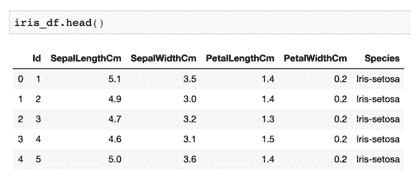

```py
iris_df.describe()
```

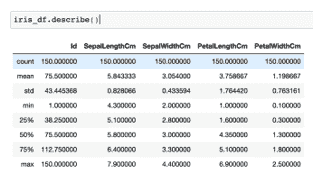

```py
iris_df.shape
```

**步骤 4：** 这里我们需要将数据集分成自变量和因变量。X_variables 代表自变量，它们位于数据集的前 4 列，而 y_variable 是因变量，在这种情况下是物种，是数据集中的最后一列。回想一下，我们希望使用其他属性来预测花的物种。因此，我们将目标变量物种和其他自变量分开。

```py
X_variables = iris_df.iloc[:,1:5]
X_variables
y_variable = iris_df.iloc[:,5]
```

**步骤 5：** 现在我们正在对数据集进行标准化。StandardScalar() 内置方法可以很容易地完成这项工作。

StandardScalar 方法为我们对数据集进行了归一化处理。它从变量中减去均值，然后除以标准差。有关归一化的更多细节，请参阅附录数学基础知识。

我们调用该方法，然后在我们的数据集上使用它来获得转换后的数据集。由于我们正在处理自变量，所以这里使用了 X_variables。首先我们调用了 StandardScalar()方法。然后使用 fit_transform 方法。fit_transform 方法首先将转换器拟合到 X 和 Y，然后返回 X 的转换版本。

```py
sc = StandardScaler()
transformed_df = sc.fit_transform(X_variables)
```

**第 6 步：** 现在我们将计算协方差矩阵，并将其打印出来，输出如下所示。使用 numpy 很容易得到协方差矩阵。

```py
covariance_matrix = np.cov(transformed_df.T)
covariance_matrix
```

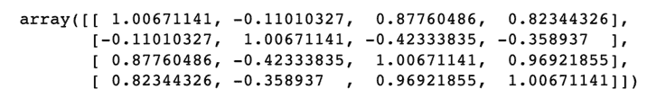

**第 7 步：** 现在，在这一步中正在计算特征值。在 numpy 库中，我们有内置功能来计算特征值。然后我们按降序对特征值进行排序。为了筛选主成分，我们可以选择大于 1 的特征值。这个标准被称为*Kaiser 准则*。我们也在探索其他方法。

特征值代表一个成分作为数据摘要的优劣程度。如果特征值为 1，意味着该成分包含与单个变量相同数量的信息。因此我们选择大于 1 的特征值。

在此代码中，我们首先获得`eigen_values`和`eigen_vectors`。然后按降序排列它们。

```py
eigen_values, eigen_vectors = np.linalg.eig(covariance_matrix)
eigen_pairs = [(np.abs(eigen_values[i]), eigen_vectors[:,i]) for i in range(len(eigen_values))]
print('Eigenvalues arranged in descending order:')
for i in eigen_pairs:
    print(i[0])
```

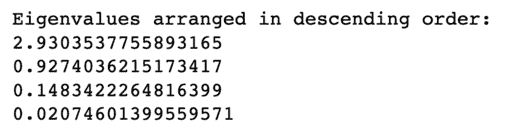

**第 8 步：** 现在，我们将从`sklearn`库中调用 PCA 方法。该方法用于在这里拟合数据。需要注意的是，我们尚未确定在这个问题中希望使用多少个主成分。

```py
pca = PCA()
pca = pca.fit(transformed_df)
```

**第 9 步：** 主成分现在已经被确定。让我们来看看它们解释的方差。我们可以观察到第一个成分解释了 72.77%的变化，第二个解释了 23.03%的变化，依此类推。

```py
explained_variance = pca.explained_variance_ratio_
explained_variance
```

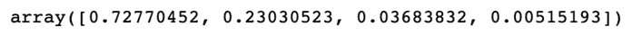

**第 10 步：** 现在我们正在绘制一个条形图来展现这些成分以获得更好的可视化效果。

```py
dataframe = pd.DataFrame({'var':pca.explained_variance_ratio_,
             'PC':['PC1','PC2','PC3','PC4']})
sns.barplot(x='PC',y="var", 
           data=dataframe, color="b");
```

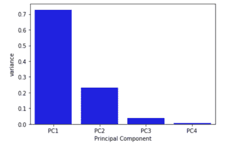

**第 11 步：** 我们绘制一个屏风图来可视化主成分解释的累积方差。

```py
plt.plot(np.cumsum(pca.explained_variance_ratio_))
plt.xlabel('number of components')
plt.ylabel('cumulative explained variance')
plt.show()
```

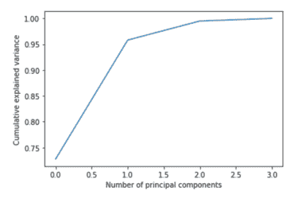

**第 12 步：** 在这个案例研究中，如果我们选择前两个主成分作为最终解决方案，因为这两个成分捕获了数据集中 95.08%的总方差。

```py
pca_2 = PCA(n_components =2 )
pca_2 = pca_2.fit(transformed_df)
pca_2d = pca_2.transform(X_variables)
```

**第 13 步：** 现在，我们将根据两个主成分来绘制数据集。对于此操作，有一个要求，即物种必须被映射回物种变量的实际值，即山鸢尾、变色鸢尾和维吉尼亚鸢尾。在这里，0 对应山鸢尾，1 对应变色鸢尾，2 对应维吉尼亚鸢尾。在下面的代码中，首先使用上述映射替换了物种变量的值。

```py
iris_df['Species'] = iris_df['Species'].replace({'Iris-setosa':0, 'Iris-versicolor':1, 'Iris-virginica':2})
```

**第 14 步：** 现在我们将对两个主成分绘制结果。这个图表显示了刚刚创建的数据集被减少到两个主成分。这些主成分能够捕捉 95.08%的数据集方差。图中，第一主成分代表图表的 x 轴，而第二主成分代表图表的 y 轴。颜色代表了不同类别的物种。

```py
plt.figure(figsize=(8,6))
plt.scatter(pca_2d[:,0], pca_2d[:,1],c=iris_df['Species'])
plt.show()
```

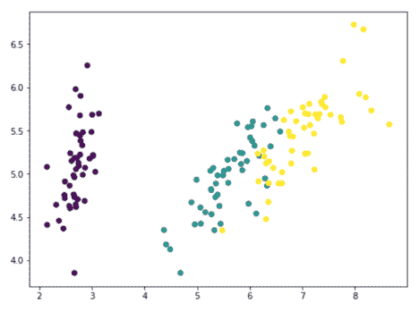

以上解决方案将成分数量从四减少到 2，并且仍能保留大部分信息。在这里，我们已经检查了三种选择主成分的方法 - 基于凯撒标准、捕获的方差以及剪切图。

让我们快速分析一下使用 PCA 我们所取得的成果。图 3.7 展示了同一数据集的两种表示形式。左边是 X 变量的原始数据集。它有四个变量和 150 行。右边是 PCA 的输出。它有 150 行，但只有两个变量。回顾一下，我们已经将维度从四减少到了两。因此观测数量仍然是 150，而变量的数量已经从四个减少到两个。

##### 图 3.7 左侧的图展示了原始数据集，它有 150 行和 4 个变量。在实施 PCA 后，变量的数量已被减少到了两个。行数仍然是 150，这由 pca_2d 的长度表明。

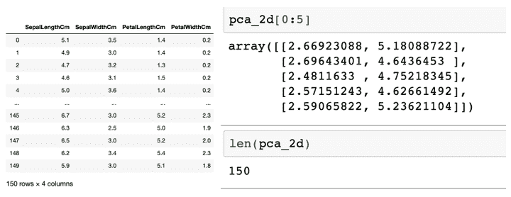

一旦我们减少了成分的数量，我们可以继续实施监督学习或无监督学习的解决方案。我们可以将以上解决方案应用于其他真实世界问题中，这些问题中我们的目标是减少维度。您将在案例研究部分进一步探讨这个问题。

通过这一部分，我们已经学习了 PCA。Github 仓库中包含了一个带有变量和相应图表的非常有趣的 PCA 分解。接下来我们将在下一节探讨奇异值分解（SVD）。

## 3.6 奇异值分解（SVD）

在上一节中，我们学习了主成分分析（PCA）。PCA 线性地转换数据并生成彼此不相关的主成分。但是特征值分解的过程只能应用于*方阵*。而奇异值分解（SVD）可以应用于任何 m x n 矩阵。我们现在将更详细地学习这一点。

让我们考虑我们有一个矩阵 A。A 的形状是 m x n，或者包含 m 行和 n 列。A 的转置可以表示为 A^T。

我们可以使用 A 和 A^T 创建另外两个矩阵作为*A A*^T 和*A*^T*A*。这些结果矩阵*A A*^T 和*A*^T*A*具有一些特殊的性质，这些特性如下所列。这些性质的数学证明超出了本书的范围。

*A A*^T 和 *A*^T*A* 的性质是：

+   它们都是对称的方阵。

    +   它们的特征值要么是正的，要么是零。

    +   A A^T 和 A^TA（带上▲）具有相同的特征值。

+   A A^T 和 A^TA 的秩与原矩阵 A 相同。

A A^T 和 A^TA 的特征向量分别被称为 A 的**奇异向量**。它们的特征值的平方根被称为**奇异值**。

由于这两个矩阵（A A^T 和 A^TA）都是对称的，它们的特征向量互相正交。换句话说，由于是对称的，特征向量是相互垂直的，并且可以具有单位长度。

现在，有了这种数学理解，我们可以定义 SVD。根据奇异值分解方法，可以将任何矩阵 A 分解为

##### （公式 3.3）

A = U * S * V^T

在这里，A 是原始矩阵，

U 和 V 是正交矩阵，它们的正交特征向量来自于 A A^T 或 A^TA，分别是

S 是对角矩阵，其 r 个元素等于奇异值。

简单地说，SVD 可以被视为使用特征值分解对 PCA 方法进行增强。

奇异值分解比特征值分解更好，且在数值上更健壮。

PCA 被定义为使用主成分对输入变量进行线性转换。所有线性转换、选择最佳成分等概念都保持相同。主要的过程步骤保持相似，除了在 SVD 中，我们使用了稍微不同的方法，其中特征值分解被替换为使用奇异向量和奇异值。通常建议在数据集稀疏时使用 SVD，在数据集较密集时使用 PCA。

 小测验——回答这些问题以检查您的理解力。本书末尾将给出答案。

1.   SVD 基于特征值分解技术。是真还是假？

2.   PCA 比 SVD 更具鲁棒性。是真还是假？

3.   SVD 中奇异值和奇异向量是什么？

接下来，在下一节中，我们将使用 SVD 创建一个 Python 解决方案。

### 3.6.1 使用 SVD 的 Python 解决方案。

在此案例研究中，我们使用的是“蘑菇”数据集。该数据集包含 23 个烤蘑菇物种的描述。有两个类别——蘑菇是可食用的，“e”，否则蘑菇是有毒的，“p”。

**步骤 1:** 导入库。我们正在导入

```py
import numpy as np
import pandas as pd
import seaborn as sns
import matplotlib.pyplot as plt
from sklearn.preprocessing import LabelEncoder, StandardScaler
```

**步骤 2：** 导入数据集并检查形状、头等。

```py
mushrooms_df = pd.read_csv('mushrooms.csv')
mushrooms_df.shape
mushrooms_df.head()
```

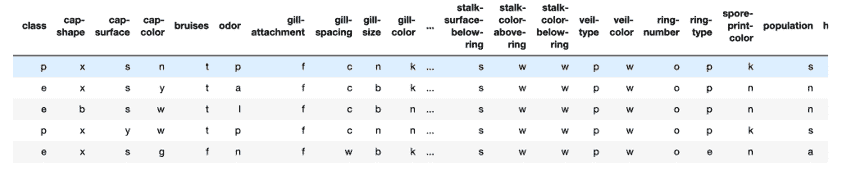

**步骤 3：** 我们可以观察到，数据集中的值是分类的。它们必须首先被编码为数字值。这不是处理分类变量的唯一方法。本书的最后一章将探讨其他技术。我们将深入探索这些技术。

首先，我们调用 LabelEncoder，然后将其应用到数据集中的所有列。LabelEncoder 使用一种独热编码方法将分类变量转换为数字变量。

```py
encoder = LabelEncoder()
for col in mushrooms_df.columns:
    mushrooms_df[col] = encoder.fit_transform(mushrooms_df[col])
```

**步骤 4:** 重新查看数据集。所有分类值都已转换为数字值。

```py
mushrooms_df.head()
```

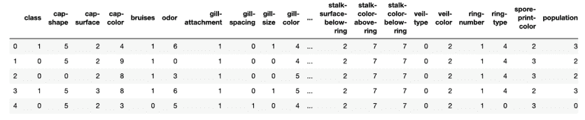

**第 5 步：** 接下来的两步与上一个案例研究相同，在这两步中，我们将数据集分解为 X 变量和 y 标签。然后对数据集进行标准化。

```py
X_variables = mushrooms_df.iloc[:,1:23]
y_label = mushrooms_df.iloc[:, 0]
scaler = StandardScaler()
X_features = scaler.fit_transform(X_variables)
```

**第 6 步：** 在这一步中，我们实现了 SVD。在 numpy 中有一个实现 SVD 的方法。输出是 u、s 和 v，其中 u 和 v 是奇异向量，s 是奇异值。如果您愿意，您可以分析它们各自的形状和维度。

```py
u, s, v = np.linalg.svd(X_features, full_matrices=True)
```

**第 7 步：** 我们知道奇异值允许我们计算每个奇异向量解释的方差。我们现在将分析每个奇异向量解释的%方差，并绘制出来。结果显示到小数点后三位。然后我们将结果绘制成直方图。在 x 轴上是奇异向量，而在 y 轴上是%解释的方差。

```py
variance_explained = np.round(s**2/np.sum(s**2), decimals=3)
variance_explained
sns.barplot(x=list(range(1,len(variance_explained)+1)),
            y=variance_explained, color="blue")
plt.xlabel('SVs', fontsize=16)
plt.ylabel('Percent of the variance explained', fontsize=15)
```

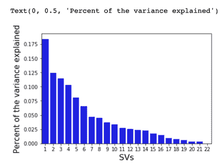

**第 8 步：** 现在我们将创建一个数据框。这个新的数据框 svd_df 包含了前两个奇异向量和元数据。然后我们使用 head 命令打印前 5 行。

```py
col_labels= ['SV'+str(i) for i in range(1,3)]
svd_df = pd.DataFrame(u[:,0:2], index=mushrooms_df["class"].tolist(), columns=col_labels)
svd_df=svd_df.reset_index()
svd_df.rename(columns={'index':'Class'}, inplace=True)
svd_df.head()
```

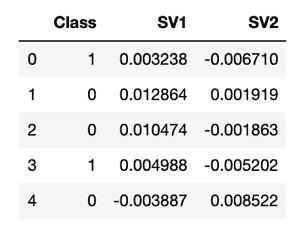

**第 9 步：** 与上一案例类似，我们将数值替换为实际的类标签。1 代表可食用，而 0 代表有毒。

```py
svd_df['Class'] = svd_df['Class'].replace({1:'Edible', 0:'Poison'})
```

**第 10 步：** 我们现在正在绘制两个组件解释的方差。这里我们只选择了前两个组件。建议您使用上一节描述的方法选择最佳的组件数量，并绘制相应的散点图。在这里，x 轴上显示了第一个奇异向量 SV1，而 y 轴上显示了第二个奇异向量 SV2。

```py
color_dict = dict({'Edible':'Black',
                   'Poison': 'Red'})
sns.scatterplot(x="SV1", y="SV2", hue="Class", 
                palette=color_dict, 
                data=svd_df, s=105,
                alpha=0.5)
plt.xlabel('SV 1: {0}%'.format(variance_explained[0]*100), fontsize=15)
plt.ylabel('SV 2: {0}%'.format(variance_explained[1]*100), fontsize=15)
```


我们可以观察两个类别相对于两个组件的分布情况。两个类别 - 可食用和有毒 - 被分别以黑色和红色编码。正如我们上面所指出的，我们只选择了两个组件来展示使用可视化图的影响。建议您使用上一个案例研究中描述的方法选择最佳的组件数量，然后使用不同的奇异向量来可视化结果。这个解决方案可以用来在实际数据集中减少维度。

这就结束了我们对 SVD 的讨论。我们将在下一节中观察 PCA 和 SVD 的优势和挑战。

## 3.7 维度缩减的优缺点

在本章的开头部分，我们讨论了维度诅咒的缺点。在最后几节中，我们了解了 PCA 和 SVD，并使用 Python 进行了实现。在当前部分，我们将审查这些技术的优势和挑战。

实施 PCA 或 SVD 时我们获得的主要优势如下：

+   **降低维度**会减少数据集的复杂性。相关特征被移除并进行了转换。手动处理相关变量是一项相当手动和令人沮丧的工作。PCA 和 SVD 等技术可以很容易地帮助我们完成这项工作。相关特征的数量被最小化，并且整体维度被降低。

    +   如果维度较少，数据集的**可视化**效果会更好。极高维度的数据集很难进行可视化。

    +   如果移除相关变量，机器学习模型的**准确性**会得到改善。这些变量不会对模型的性能有所贡献。

    +   **训练时间减少**因为数据集的复杂性较低。因此，需要较少的计算力和时间。

+   在监督机器学习模型中，**过拟合**是一个讨厌的问题。这是一种情况，模型在训练数据集上表现良好，但在测试/验证数据集上却表现不佳。这意味着模型可能无法在真实世界的未知数据集上表现良好。而这违背了构建机器学习模型的整个目的。PCA/SVD 通过减少变量数量来帮助解决过拟合问题。

与此同时，我们在降维技术中面临一些挑战，如下所述：

+   PCA/SVD 创建的新组件**不太可解释**。它们是数据集中独立变量的组合，实际上与真实世界没有关系，因此很难将它们与真实世界的情况联系起来。

    +   PCA/SVD 需要**数值变量**。因此，所有分类变量必须以数值形式表示。

    +   在实施解决方案之前，需要对数据集进行**归一化/标准化**。

+   当使用 PCA 或 SVD 时可能会发生**信息损失**。主成分*无法*取代原始数据集，因此在实施这些方法时可能会有一些信息损失。

但尽管存在一些挑战，PCA 和 SVD 用于降低数据集的维度。它们是最受欢迎的方法之一，也被广泛使用。与此同时，必须注意的是，这些都是线性方法，我们将在本书的后期部分介绍非线性方法。

通过这样，我们已经涵盖了在降维中使用的两种重要技术。我们将在后面的章节中探讨更高级的技术。是时候转到案例研究了，这是本章的下一部分内容。

## 3.8 降维案例研究

现在我们将探索一个真实案例，以了解 PCA 和 SVD 在真实商业场景中的使用。

想象一下：你正在为一个电信服务提供商工作。你有一个订户基础，并希望根据许多参数对消费者进行聚类。但挑战在于需要分析的庞大维度。

目标是使用降维算法减少属性的数量。消费者数据集可以如下所示。

1.  订户的人口统计详情将包括年龄、性别、职业、家庭规模、婚姻状况等。下面显示的列表并不全面。

表格 3.4 订户的人口统计详情，如年龄、性别、婚姻状况、家庭规模、城市等。

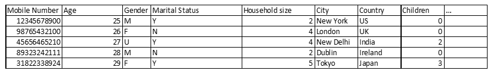

1.  消费者的订阅详情可能如下表所示。下面显示的列表并不全面。

表格 3.5 订户的订阅详情，如服务期限、预付费/后付费连接等。

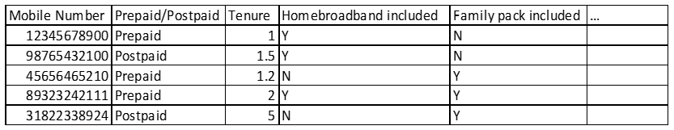

1.  消费者的使用情况将描述分钟数、通话费率、数据使用情况、服务等。下面显示的列表并不全面。

表格 3.6 订户的使用情况指定了使用的分钟数、发送的短信、使用的数据、在网络中度过的天数、国内或国际使用情况等。

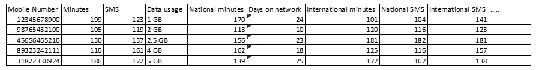

1.  订户的付款和交易详情将涉及到所做的各种交易、付款方式、付款频率、自上次付款以来的天数等。

表格 3.7 展示了订户的交易详情，包括金额、模式等的所有详情。

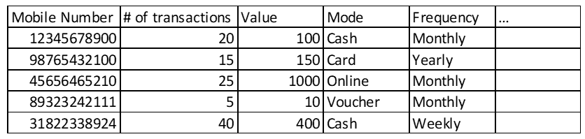

数据集可能有更多属性。到目前为止，我们已经确定所涉及的变量数量确实很高。一旦我们汇总了所有这些数据点，最终数据的维数就可能非常庞大。

表格 3.8 最终数据集是所有上述数据集的组合。这将是一个庞大的、真正高维的数据集，需要进行分析。

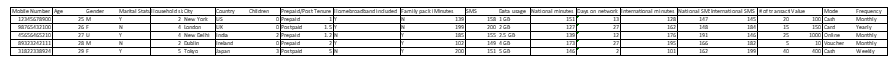

在我们能够进行任何监督或无监督解决方案之前，我们必须减少属性的数量。在本章中，我们专注于降维技术，因此步骤涵盖了该过程的这一方面。在后面的章节中，我们将更详细地研究探索性分析。

作为第一步，我们将对数据集进行健全性检查并进行数据清理。我们将检查数据点的数量，缺失值的数量，重复值，存在的垃圾值等。这将使我们能够删除可能非常稀疏或包含不多信息的任何变量。例如，如果性别仅适用于客户基数的 0.01％，则去除该变量可能是个不错的主意。或者如果所有客户的性别都为男性，该变量对我们没有添加任何新信息，因此可以丢弃。有时，使用业务逻辑，可能会从数据集中删除一个变量。在前面的部分中已经讨论了一个例子。在这一步骤中，我们可能会组合一些变量。例如，我们可能通过将总支出金额除以总交易数来创建一个新变量作为平均交易值。以这种方式，我们将能够减少一些维度。

一个 Python Jupyter 笔记本可在 Github 存储库中找到，我们在那里提供了对数据清理步骤的非常详细的解决方案。

基本数据清洗完成后，我们开始进行探索性数据分析。作为探索性分析的一部分，我们检查变量的分布、其分布情况，数值变量的平均数/中位数/众数。这有时被称为*单变量分析*。这一步骤允许我们测量变量的分散程度，了解中心趋势，检查分类变量的不同类别的分布，并查找值中的任何异常情况。例如，使用上述提到的数据集，我们将有兴趣分析数据使用的最高/最低/平均值，或者性别或年龄的％分布。我们想知道最受欢迎的交易方式，我们也对交易的最高/最低/平均金额感兴趣。等等，这个列表还可以继续下去。

然后我们探索变量之间的关系，这被称为*双变量分析*。交叉表，数据分布是双变量分析的一部分。在这一步骤, 创建了一个相关矩阵。需要仔细研究高度相关的变量。根据业务逻辑, 其中一个变量可能会被丢弃。这一步骤有助于可视化和理解一个变量在其他变量存在的情况下的行为。我们可以检查它们的相互关系和关系的强度。在本案例研究中, 我们将回答诸如 - 对比使用更多数据的订阅者与发送更多短信的订阅者, 是否在网络上花费更多时间。或假设 - 使用在线模式进行交易的订阅者是否比使用现金进行交易的订阅者产生更多收入。或者性别/年龄与数据使用之间是否存在关系。在项目的这个阶段, 将回答许多这样的问题。

Github 存储库中提供了 Python Jupyter 笔记本，提供了单变量和双变量阶段的详细步骤和代码。来看一下吧！

在此阶段，我们拥有一个具有大量维度的数据集，并希望减少维数。现在是实施 PCA 或 SVD 的好时机。这些技术将减少维数，并使数据集准备好在过程的下一步中使用，如图 3.8 所示。这张图仅是一个代表性的结构，用于描述维数约简方法的影响。请注意，左图中的大量黑线正在缩减为右图中较少的红线。

##### 图 3.8 非常高维的数据集将通过捕获数据集中的最大方差来减少到低维度

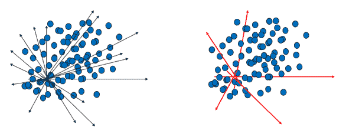

降维方法的输出将是一个少于原始变量数量的数据集。该数据集可以用于监督学习或无监督学习。我们已经在本章前面的章节中介绍了使用 Python 的例子。

这结束了我们关于电信用户的案例研究。这种情况可以扩展到其他领域，如零售、银行金融、航空、医疗保健、制造等。

现在我们将进入本章的总结。

## 3.9 总结

数据无处不在，以各种形式、层次、维度呈现，具有不同的复杂程度。人们经常提到“数据越多越好”。在一定程度上这确实是正确的。但是，如果维度非常高，从中获取有用信息将会非常困难。数据分析可能会出现偏差，并且处理起来非常复杂。我们在本章探讨了维数灾难。PCA / SVD 可以帮助减少这种复杂性。他们使数据集准备好下一步。

但是维数约简并不像看起来那么简单。这不是一个容易完成的任务。但它确实是一个非常有回报的任务。并需要商业眼光、逻辑和常识的结合来处理。结果数据集可能仍需要一些额外的工作。但这是建立机器学习模型的一个很好的起点。

这标志着第三章的结束。同时也结束了本书的第一部分。在本部分中，我们介绍了更基础的算法。我们从本书的第一章开始探究机器学习的基础和基本知识。在第二章中，我们探讨了三个聚类算法。在第三章中，我们探索了 PCA 和 SVD。

在书的第二部分，我们正在转向并学习更先进的话题。我们将在下一章开始研究关联规则。然后我们进入高级聚类方法，比如时间序列聚类、模糊聚类、GMM 聚类等等。接着是一章关于高级的降维算法，比如 t-SNE、LDA。然后，在第二部分的结束，我们将研究无监督学习在文本数据集上的应用。书的第三部分更加先进，我们将深入基于神经网络的解决方案并使用图像数据集。所以还有很长的路要走！敬请关注！

现在你可以进入问题部分了！

#### 实际的下一步和建议的阅读

1.  使用上一章节使用的车辆数据集进行聚类，并在其上实施 PCA 和 SVD。比较在实施 PCA 和 SVD 之前和之后进行聚类的性能。

1.  从 (`data.world/datasets/pca`) 获取数据集。在这里，你会发现许多数据集，比如联邦计划网络安全、比萨数据集等等。比较在这些数据集上实施 PCA 和 SVD 的性能。

1.  阅读下面关于主成分分析（PCA）的论文

1.  `www.sciencedirect.com/science/article/pii/009830049390090R`

1.  `web.stanford.edu/~hastie/Papers/spc_jcgs.pdf`

1.  `web.cs.ucdavis.edu/~vemuri/papers/pcaVisualization.pdf`

1.  `cseweb.ucsd.edu/~ravir/papers/pca/pamifinal.pdf`

1.  阅读一下关于奇异值分解的研究论文

1.  `people.maths.ox.ac.uk/porterm/papers/s4.pdf`

1.  `papers.nips.cc/paper/3473-quic-svd-fast-svd-using-cosine-trees.pdf`

1.  `arxiv.org/pdf/1211.7102.pdf`

1.  `glaros.dtc.umn.edu/gkhome/fetch/papers/sarwar_SVD.pdf`

## 3.10 总结

+   我们了解到，在数据集中拥有很多维度会引发一个问题，即维度灾难。由于维度灾难的存在，数据集变得非常复杂，处理起来也变得更加耗时。

    +   我们还提到了可以有多种技术来解决维度灾难的问题，比如 PCA、LDA、SVD、自编码器、t-SNE、等等。

    +   我们详细介绍了主成分分析（PCA），在其中我们学到，一个主成分是各种变量的线性组合。使用这种方法，通过具有捕捉数据集中最大方差的主成分，可以减少总维数。

    +   然后我们转向奇异值分解，在这一部分，大部分过程与 PCA 相同，只是 PCA 中的特征值分解被奇异向量和奇异值在 SVD 中替换了。

    +   我们还学到，当得到主成分后，虽然解决了维度灾难的问题，但原始变量却丢失了。

+   最后，我们使用 sklearn 库对这些技术进行了 Python 实现。
