# 第四章：关联规则

### 本章内容包括

+   关联规则学习

+   不同类型的关联规则算法

+   不同关联规则算法的实现

+   使用 SPADE 进行序列学习

+   案例研究

“关联的力量比美的力量更强大；因此关联的力量就是美的力量– 约翰·罗斯金”

恭喜你完成了本书的第一部分！你探索了无监督学习的基础知识以及 k-means 聚类、层次聚类、DBSCAN、主成分分析等算法。预计你已经掌握了第一部分的数学概念，并创建了解决每章末尾练习的 Python 代码。

欢迎来到本书的第二部分，在这一部分中，我们将利用第一部分学到的概念，并探索稍微复杂一些的主题。我们将从本书的第四章开始学习关联规则。祝你好运！

下次你去附近的杂货店时，看看店内各种物品的摆放。你会发现架子上摆放着牛奶、鸡蛋、面包、糖、洗衣粉、肥皂、水果、蔬菜、饼干和其他各种物品。你有没有想过这种摆放的逻辑是什么，以及这些物品是如何摆放的？为什么某些产品放在一起，而另一些则相距很远？显然，这种摆放不可能是随意的，背后必须有科学的原理。或者你是否想知道，Netflix 是如何根据你的观影历史为你推荐电影的？我们将在本章中找到这些问题的答案。和往常一样，我们将先学习概念。我们将通过数学逻辑来讨论不同算法的优缺点，并使用 Python 进行实际实现。本章末尾提供了一个商业案例研究来补充知识。

欢迎来到第四章，祝一切顺利！

## 4.1 技术工具包

我们将继续使用迄今为止使用的相同版本的 Python 和 Jupyter 笔记本。本章使用的代码和数据集已经存储在此位置。

本章需要安装几个 Python 库 – apyori、pyECLAT、fpgrowth_py 和 pyspade。除此之外，我们还需要 numpy 和 pandas。使用库，我们可以很快地实现这些算法。否则，编写这些算法将是一项耗时且痛苦的任务。

让我们开始关联规则的学习。

## 4.2 关联规则学习

你可能听说过著名的“*啤酒和尿布故事*”。根据这个轶事，超市的顾客（主要是年轻男子）购买尿布的同时也购买啤酒在同一张发票上。换句话说，购买尿布给他们的宝宝的年轻男子在同一笔交易中购买啤酒的概率相当高。我们不评论这个故事的真实性，但是可以归因于此故事的逻辑是*关联规则学习*。

正式来说 - 关联规则可以用来发现数据集中存在的变量之间的有力关系。我们可以使用关联规则来测量数据集中变量之间的相关性和共同出现。在上述示例中（假设故事是真实的），人们可以分析每日的顾客交易。如果啤酒和尿布之间存在关系，这对超市来说是非常强大的洞察力，可以让他们定制啤酒和尿布的摆放位置，或者调整营销策略，甚至改变价格。

我们可以通过超市中的另一个例子来理解。考虑下面的例子。假设通过分析在超市生成的五张发票，我们得到了如下表 4.1 所示的数据。在这个例子中，发票编号 1001 购买了牛奶，因此它的值为 1，而奶酪没有购买，因此它是 0。

##### 表 4.1 超市生成的发票示例。第一个发票编号是 1001，在该发票中购买了牛奶。因此，在牛奶前面有 1。而奶酪在 1001 中没有购买，因此，在奶酪前面有 0。

| 发票编号 | 牛奶 | 鸡蛋 | 面包 | 奶酪 |
| --- | --- | --- | --- | --- |
| 1001 | 1 | 1 | 1 | 0 |
| 1002 | 0 | 0 | 0 | 1 |
| 1003 | 1 | 1 | 1 | 0 |
| 1004 | 0 | 1 | 0 | 1 |
| 1005 | 1 | 1 | 0 | 1 |

因此，在发票编号 1001 中，购买了牛奶、鸡蛋和面包，而在发票编号 1002 中只购买了奶酪。在这里，我们可以看到每当牛奶和鸡蛋一起购买时，面包总是在同一张发票中购买。这确实是一个重要的发现。

现在将这种理解扩展到一天内数千笔交易。这将导致非常强大的关系，人眼通常忽视，但关联规则算法可以为我们揭示它们。它可以导致更好的产品摆放、产品更好的价格和更优化的营销支出。这些模式将提升客户体验，并且被证明对于改善整体客户满意度非常有用。

我们可以将关联规则可视化，如图 4.1 所示。在这里，有一些表示为节点 1、2、3、4 等的传入变量。这些节点之间存在关联，如箭头所示。它们之间的这种关系导致了规则 A 和 B 的产生。如果我们回顾一下本节开头提到的啤酒/尿布故事，规则 A 可能是，当年轻男性顾客购买尿布时，他们也经常购买啤酒；而规则 B 可能是，当购买牛奶和鸡蛋时，经常也会购买面包。

##### 图 4.1 关联规则可以被视为数据集中各种变量之间的关系。这些变量之间相互关联，并建立了重要的关系。

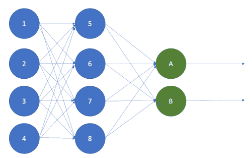

上面讨论的超市示例有时被称为*市场篮子分析*。但是关联规则不仅适用于杂货零售。它们在生物信息学、医疗行业、入侵检测等其他领域的效用已被证明。Netflix 或 Spotify 可以利用它们分析历史用户行为，然后推荐用户最有可能喜欢的内容。Web 开发人员可以分析客户在其网站上的历史点击和使用情况。通过识别模式，他们可以找出用户倾向于点击的内容和哪些功能将最大化他们的参与度。医生可以使用关联规则更好地诊断患者。医生可以比较症状与其他症状之间的关系的概率，并提供更准确的诊断。用例跨越多个业务领域和业务功能。

我们现在将了解关联规则的构建模块。

## 4.3 关联规则的构建模块

我们在上一节中介绍了关联规则的定义。

现在让我们了解关联规则背后的数学概念。假设我们在零售店有以下数据集-

1.  让 X = {x[, x[2], x[3], x[4], x[5] …., x[n]} 代表零售店中可用的*n*种商品。例如，它们可以是牛奶、鸡蛋、面包、奶酪、苹果等等。

1.  让 Y = {y[, y[2], y[3], y[4], y[5] …., y[m]} 代表在该零售店生成的*m*笔交易。每笔交易可能包含来自零售店的全部或部分商品。

显然，交易中的每个商品都只能从零售店购买。换句话说，在集合 Y 中的交易中的每个商品都是集合 X 中商品的子集。同时，每个商品都会附带一个唯一的标识符，每个交易都会附带一个唯一的发票号码。

现在，我们有兴趣分析模式并发现关系。这将用于生成任何规则或见解。因此，让我们首先定义规则的含义。

1.  假设我们发现一条规则，即每当购买列表 P 中的商品时，列表 Q 中的商品也会被购买。这条规则可以写成如下形式：

1.  规则是**P -> Q**。这意味着当购买了 P 中定义的物品时，也会购买 Q。

1.  P 中的物品将是 X 的子集或**P** **Í** X。

1.  同样，Q 中的物品将是 X 的子集或**Q** **Í** X。

1.  P 和 Q 不能有任何共同的元素，即**P** **Ç** Q = 0

现在，让我们通过一个实际案例来理解这些数学概念。

假设 X = {牛奶，香蕉，鸡蛋，奶酪，苹果，面包，盐，糖，饼干，黄油，冷饮料，水}。这是零售店中所有可用的物品。

Y = {1001, 1002, 1003, 1004, 1005}。这是在该零售店生成的五张发票。每张发票中购买的相应物品如表 4.2 所示。

表 4.2 零售店生成的五张发票示例。请注意，对于每张发票，我们对每个物品都有 0 和 1 相关联。这些发票仅用于说明目的。实际发票中物品的数量可以更多。

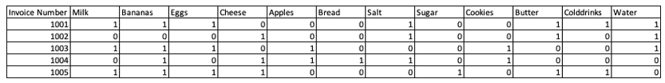

使用这个数据集，让我们假设我们创建了两个规则：{牛奶，香蕉} -> {鸡蛋}和{牛奶，香蕉} -> {面包}。

第一个规则意味着每当购买牛奶和香蕉，鸡蛋也会在同一次交易中购买。第二个规则意味着每当购买牛奶和香蕉，面包也会在同一次交易中购买。通过分析上述数据集，我们可以清楚地看到规则 1 始终为真，而规则 2 不是。

左边的物品称为*前项*或 LHS，右边的物品称为*后项*或 RHS。

在现实世界中，对于任何这样的规则来说，同样的模式必须在数百甚至数千个交易中重复出现。只有在这种情况下，我们才会得出这个规则确实是真实存在的，并且可以推广到整个数据库。

与此同时，可能会有很多这样的规则。在一个每天生成数千份发票的零售店中，可能会有数百个这样的规则。我们如何发现哪些规则是重要的，哪些是不重要的呢？这可以通过我们将在下一节学习的支持度、置信度和提升度的概念来理解。

### 4.3.1 支持度、置信度、提升度和确信度

在上一节中，我们确定了关联规则中规则的含义。我们也理解，基于事务数据集，可能会有数百条规则。在本节中，我们将探讨如何测量这些规则的有效性，并筛选出最有趣的规则。这可以通过支持度、置信度、提升度和确信度的概念来实现。

回顾上一节我们讨论了规则的泛化。支持度、置信度、提升度和确信度可以帮助我们衡量泛化程度。简而言之，使用这四个参数，我们可以确定规则在我们实际的商业中有多么有用。毕竟，如果一个规则不实用或者不够强大，就没有必要实施。支持度、置信度、提升度和确信度是检查规则效力的参数。我们现在将详细介绍这些概念。

我们将使用表 4.3 中的以下数据集来理解支持度、置信度和提升度的概念。

##### 表 4.3 我们将用来理解支持度、置信度和提升度概念的数据集。第一张发票 1001 包含牛奶、鸡蛋和面包，而奶酪没有购买。同样，为了这个例子，我们总共只考虑了 4 个项目。

| 发票号码 | 牛奶 | 鸡蛋 | 面包 | 奶酪 |
| --- | --- | --- | --- | --- |
| 1001 | 1 | 1 | 1 | 0 |
| 1002 | 0 | 1 | 1 | 1 |
| 1003 | 1 | 1 | 1 | 0 |
| 1004 | 0 | 1 | 0 | 1 |
| 1005 | 0 | 1 | 1 | 0 |

在这里，对于一个发票，1 表示该发票中是否有购买该商品，而 0 则表示该发票中没有购买该商品。例如，发票编号 1001 包含牛奶、鸡蛋和面包，而 1002 包含鸡蛋、面包和奶酪。

现在让我们研究支持度。

#### 支持

支持度测量数据集中项目的频率百分比。换句话说，它测量了项目在数据集中出现的交易百分比。

支持度可以表示如下

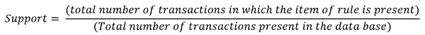

参考表 4.3，如果我们对规则 {牛奶, 鸡蛋} -> {面包} 感兴趣。在这种情况下，有两笔交易中同时包含这三种项目（牛奶、鸡蛋和面包）。总交易数为五笔。因此，该规则的支持度为 2 / 5，即 0.4 或 40%。

如果我们对规则 {面包, 鸡蛋} -> {奶酪} 感兴趣。在这种情况下，只有一笔交易中同时包含这三种商品。总交易数为五笔。因此，该规则的支持度为 1 / 5，即 0.2 或 20%。

支持度越高，规则越好。通常，我们设定一个最低阈值来获取支持度。最低阈值通常是与业务利益相关者协商确定的。

现在我们将研究规则的置信度。

#### 置信度

置信度测量规则的真实频率。换句话说，它测量了包含前提的交易中也包含结果的百分比。

因此，如果我们想要测量规则 A->B 的置信度

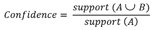

这里，分子在交易中同时存在 A 和 B 时为支持度，而分母则指的是仅 A 的支持度。

##### 表 4.3 我们将用于理解支持度、确信度和提升度概念的数据集。第一张发票 1001 有牛奶、鸡蛋和面包，而奶酪没有购买。同样，为了本例，我们只考虑了总共 4 个物品。

| 发票号码 | 牛奶 | 鸡蛋 | 面包 | 奶酪 |
| --- | --- | --- | --- | --- |
| 1001 | 1 | 1 | 1 | 0 |
| 1002 | 0 | 1 | 1 | 1 |
| 1003 | 1 | 1 | 1 | 0 |
| 1004 | 0 | 1 | 0 | 1 |
| 1005 | 0 | 1 | 1 | 0 |

参考表 4.3，如果我们对规则 {牛奶，鸡蛋} -> {面包}感兴趣。在这种情况下，有两个交易中同时存在牛奶和鸡蛋。因此，支持度为 2/5 = 0.4。这是分母。有两个交易中同时存在三个物品（牛奶，鸡蛋，面包）。因此，支持度为 2/5 = 0.4，这是分子。放入上面的方程，规则 {牛奶，鸡蛋} -> {面包}的确信度为 0.4/0.4 = 1。

如果我们对规则 {鸡蛋，面包} -> {奶酪}感兴趣。在这种情况下，有三个交易中存在 (鸡蛋，面包)。总交易数为五。所以，这意味着支持度为 3/5，即 0.6。只有一个交易中同时存在三个物品（鸡蛋，面包，奶酪）。所以，支持度为 1/5 = 0.2。因此，规则 {鸡蛋，面包} -> {奶酪}的确信度为 0.2/0.6 = 0.33。

对于规则的信心越高，它就越好。像支持一样，我们对确信度设置了最低阈值。

有时，它也被称为 A 在 B 上的*条件概率*。它可以理解为在 A 已经发生的情况下 B 发生的概率，并且可以写成 P(A|B)。因此，在上面引用的例子中，提前购买了鸡蛋、面包的情况下购买奶酪的概率为 33%，而购买了牛奶、鸡蛋的情况下购买面包的概率为 100%。

到目前为止，我们已经涵盖了信心和支持。现在我们将研究提升度和确信度，这是评估规则的真正标准。

#### 提升度和确信度

提升度是一种非常重要的规则测量标准。规则 A-> B 的提升度可以定义为

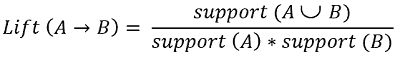

在这里，分子在交易中同时存在 A 和 B 时得到支持，而分母则是指 A 的支持乘以 B 的支持。

##### 表 4.3 我们将用于理解支持度、确信度和提升度概念的数据集。第一张发票 1001 有牛奶、鸡蛋和面包，而奶酪没有购买。同样，为了本例，我们只考虑了总共 4 个物品。

| 发票号码 | 牛奶 | 鸡蛋 | 面包 | 奶酪 |
| --- | --- | --- | --- | --- |
| 1001 | 1 | 1 | 1 | 0 |
| 1002 | 0 | 1 | 1 | 1 |
| 1003 | 1 | 1 | 1 | 0 |
| 1004 | 0 | 1 | 0 | 1 |
| 1005 | 0 | 1 | 1 | 0 |

参考表 4.3，如果我们对规则{牛奶，鸡蛋} -> {面包}感兴趣。在这种情况下，有两个交易中都存在所有三个（牛奶，鸡蛋，面包）。因此，支持度再次为 2/5 = 0.4，这是分子。有两个交易中只有（牛奶，鸡蛋）存在，所以支持度为 2/5 = 0.4。有四个交易中存在面包，因此支持度为 4/5 = 0.8。将其代入上述方程中，规则{牛奶，鸡蛋} -> {面包}的提升度为 0.4/(0.4x0.8) = 1.25。

如果我们对规则{鸡蛋，面包} -> {奶酪}感兴趣。在这种情况下，只有一个交易中存在（鸡蛋，面包，奶酪）。总交易数为五。因此，支持度为 1 / 5，即 0.2。有两个交易中存在（奶酪）。因此，支持度为 2/5 = 0.4。有四个交易中存在（鸡蛋，面包），因此支持度为 4/5 = 0.8。将其代入上述方程中，规则{鸡蛋，面包} -> {奶酪}的提升度为 0.2/(0.4x0.8) = 0.625。

如果提升度的值*等于 1*，则意味着前项和后项彼此独立，不能从中得出任何规则。

如果提升度的值*大于 1*，则意味着前项和后项是相互依赖的。此规则可用于预测未来交易中的前项。这是我们想要从数据集中得出的见解。

提升度的值*小于 1*，意味着前项和后项是彼此替代的。其中一个的存在可能对另一个产生负面影响。这也是业务团队进行战略规划的重要洞察。

在评估任何规则时，使用提升度时，必须将领域知识应用于其中。例如，如果我们评估规则{鸡蛋，面包} -> {奶酪}，它表明鸡蛋、面包可以替代奶酪。我们知道这在现实生活中是不正确的。因此，在这种情况下，我们不能对此规则做出任何决定。我们必须借助领域知识来对该规则进行任何结论。

同时，规则{牛奶，鸡蛋} -> {面包}可能是一个可以多次成立的规则。对于许多客户，当他们一起购买牛奶和鸡蛋时，面包很可能也会在同一交易中购买。因此，对于这样的客户来说，这个规则更有意义。目标是有一个强有力的业务逻辑来支持或否定使用算法识别的规则。

**信心**是一个重要的参数，其公式如下

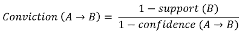

例如，如果我们对规则 {鸡蛋，面包} -> {奶酪} 感兴趣。在这种情况下，只有一个交易中存在 (奶酪)。总交易数为五。所以，支持度是 1/5，即 0.2，并将用于分子。我们已经计算出置信度为 0.625。放回公式中，我们可以计算说服力为 (1-0.2)/(1-0.625) = 2.13

我们可以将说服力解释为 - 规则 {鸡蛋，面包} -> {奶酪} 如果 {鸡蛋，面包，奶酪} 之间的关联纯粹是随机选择的，那么它的错误率将是 2.13 倍。

在大多数业务场景中，提升度是使用的测量标准。还有其他测量参数，如杠杆、集体强度等。但是大多数情况下，置信度、支持度和提升度被用来衡量任何规则的有效性。

 小测验 - 回答这些问题来检查你的理解.. 答案在书的末尾

1.   支持度测量规则在数据集中出现的频率。是或否。

2.   如果提升度大于 1，则表示两个项目彼此独立。是或否。

3.   降低置信度值，规则就越好。是或否。

在分析数据集时，我们评估任何规则时，大多数情况下都会为置信度、支持度和提升度设置阈值。这使我们能够减少规则数量并过滤掉不相关的规则。换句话说，我们只关注那些非常频繁的规则。当我们为数据集创建 Python 解决方案时，我们将更详细地研究它。

现在我们将研究关联规则中使用的各种算法。第一个这样的算法是 Apriori 算法，这是下一个主题。

## 4.4 Apriori 算法

Apriori 算法是用于关联规则的最流行算法之一。它由 Agrawal 和 Shrikant 在 1994 年提出。本章末尾给出了论文链接。

Apriori 用于理解和分析交易数据库中的频繁项。它利用“自下而上”的方法，首先根据子集的频率生成候选项。让我们通过一个示例来理解整个过程。

我们将使用我们之前讨论过的相同数据集。

##### 表 4.3 我们将用来理解支持度、置信度和提升度概念的数据集。第一个发票 1001 有牛奶、鸡蛋和面包，而奶酪没有购买。

| 发票编号 | 牛奶 | 鸡蛋 | 面包 | 奶酪 |
| --- | --- | --- | --- | --- |
| 1001 | 1 | 1 | 1 | 0 |
| 1002 | 0 | 1 | 1 | 1 |
| 1003 | 1 | 1 | 1 | 0 |
| 1004 | 0 | 1 | 0 | 1 |
| 1005 | 0 | 1 | 1 | 0 |

Apriori 算法中使用的过程看起来像图 4.2 中下面的过程。

##### 图 4.2 Apriori 算法过程可以如下所示。

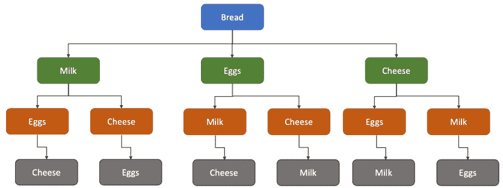

假设我们想要分析面包与数据集中所有其他项目的关系。在这种情况下，级别 1 是面包，我们找到其出现的频率。

然后我们转移到下一层，即第 2 层。现在我们找到面包与其他每个物品 - 牛奶、鸡蛋和奶酪（在第 2 层）的关系。在这里，我们再次找到所有可能组合的出现频率，即 {面包，牛奶}，{面包，鸡蛋} 和 {面包，奶酪}。可以在图 4.3 中显示。

##### 图 4.3 我们在 1 级有面包，而其他物品（牛奶、鸡蛋和奶酪）都放在 2 级。面包放在 1 级，因为我们希望分析面包与所有其他物品的关系。

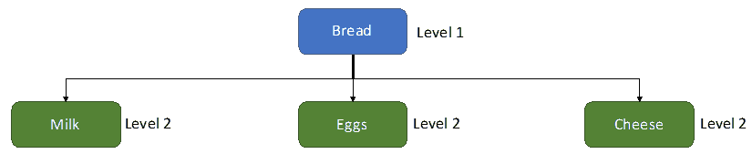

分析完第 2 层后，我们转移到第三层、第四层等。这个过程会一直持续，直到我们达到最后一层，其中所有的物品都被用完。

通过这个过程，我们可以计算所有可能组合的支持度。例如，我们可以得到

{面包} -> {牛奶}，

{面包} -> {鸡蛋} 和

{面包} -> {奶酪}。

对于下一层，我们还会得到支持

{面包，牛奶} -> {鸡蛋}，

{面包，鸡蛋} -> {牛奶}，

{面包，牛奶} -> {奶酪}，

{面包，奶酪} -> {牛奶}，

{面包，奶酪} -> {鸡蛋} 和

{面包，鸡蛋} -> {奶酪}。

现在，使用同样的过程，计算下一层的所有可能组合。例如，{面包，鸡蛋，牛奶} -> {奶酪}，{面包，鸡蛋，奶酪} -> {牛奶} 等。

当所有的项集都用完时，这个过程将停止。完整的架构可以看起来像图 4.4。

##### 图 4.4 Apriori 算法的完整架构。在这里，我们将计算所有可能组合的支持度。探索所有项目之间的关系，由于整个数据库的扫描，Apriori 的速度受到影响。

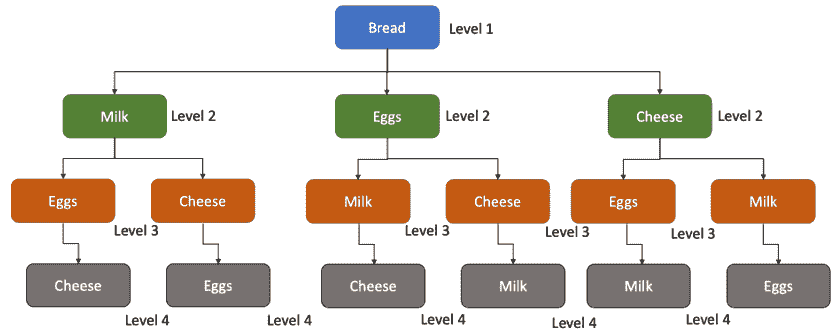

现在，我们可以轻松理解可能的组合数量相当高，这是 Apriori 的挑战之一。Apriori 算法还有一些其他缺点，我们将在后面学习。但现在是用 Python 实现 Apriori 的时候了。

### 4.4.1 Python 实现

现在我们将继续使用 Python 实现 Apriori 算法。数据集和 Python Jupyter 笔记本已经上传到 GitHub 代码库。

你可能需要安装 apyori。

安装这些库很简单，只需按照以下步骤进行。

```py
import sys
!{sys.executable} -m pip install apyori
```

**步骤 1：** 导入用例所需的库。我们导入了 numpy、pandas。为了实现 Apriori，我们还有一个叫做 apyori 的库也被导入了。

```py
import numpy as np
import pandas as pd
from apyori import apriori
```

**步骤 2：** 现在，我们导入数据集 store_data.csv 文件。

```py
store_dataset = pd.read_csv('store_data.csv')
```

你还建议查看打开 .csv 文件的数据集。它会像下面的截图一样。截图显示了前 25 行。每一行代表一个发票。

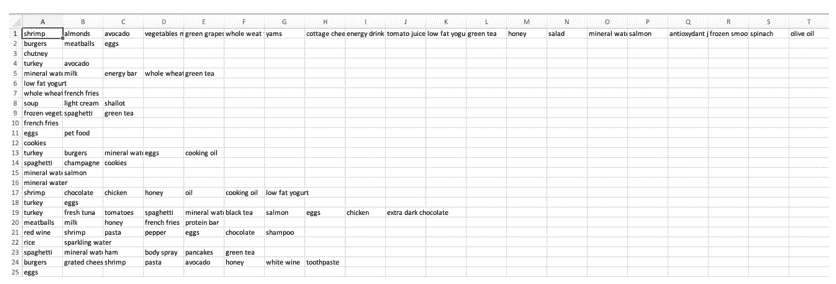

**步骤 3：** 让我们通过 `.info`，`.head` 命令对数据进行一些基本检查。

```py
store_dataset.info()
```

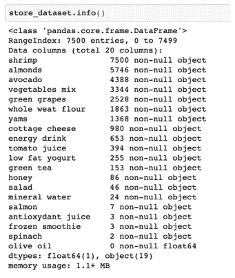

```py
store_dataset.head()
```

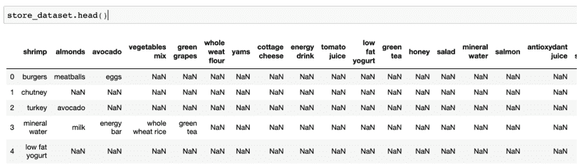

**第 4 步：** 在这里我们可以看到，代码已将第一个交易作为标题考虑。因此，我们将重新导入数据，但这次他会指定标题等于 None。

```py
store_dataset = pd.read_csv('store_data.csv', header=None)
```

**第 5 步：** 让我们再次看一下头部。这次看起来是正确的。

```py
store_dataset.head()
```

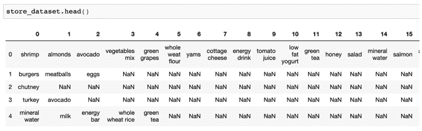

**第 6 步：** 我们用于代码的库接受数据集作为列表的列表。整个数据集必须是一个大列表，而每个交易是大列表中的内部列表。因此，为了实现它，我们首先将我们的 store_dataset 数据框转换为列表。

```py
all_records = []
for i in range(0, 7501):
    all_records.append([str(store_dataset.values[i,j]) for j in range(0, 20)])
```

**第 7 步：** 接下来，我们实施 Apriori 算法。

对于算法，我们正在处理我们在第 6 步创建的 `all_records` 列表。指定的最小支持度为 0.5 或 50%，最小置信度为 25%，最小提升为 4，规则的最小长度为 2。

此步骤的输出是 `apriori_rules` 类对象。然后将此对象转换为我们可以理解的列表。最后，我们打印此列表。

```py
apriori_rules = apriori(all_records, min_support=0.5, min_confidence=0.25, min_lift=4, min_length=2)
apriori_rules = list(apriori_rules)
print(len(apriori_rules))
```

代码的输出将为 0。这意味着不存在满足我们设置的规则条件的规则。

我们再次尝试执行相同的代码，尽管将最小支持度减少到 25%。

```py
apriori_rules = apriori(all_records, min_support=0.25, min_confidence=0.25, min_lift=4, min_length=2)
apriori_rules = list(apriori_rules)
print(len(apriori_rules))
```

再次，没有生成任何规则，输出为零。即使将最小支持度降低到 10%，也不会产生任何规则。

```py
apriori_rules = apriori(all_records, min_support=0.1, min_confidence=0.25, min_lift=4, min_length=2)
apriori_rules = list(apriori_rules)
print(len(apriori_rules))
```

现在，我们将最小提升减少到 2。这次我们得到的输出是 200。这意味着有 200 个满足条件的规则。

```py
apriori_rules = apriori(all_records, min_support=0.25, min_confidence=0.25, min_lift=2, min_length=2)
apriori_rules = list(apriori_rules)
print(len(apriori_rules))
```

**第 8 步：** 让我们看一下第一条规则。

```py
print(apriori_rules[0])
```


规则解释了杏仁和汉堡之间的关系。支持率为 0.005，置信度为 0.25。提升为 2.92 表明此规则本身相当强大。

**第 9 步：** 我们现在将详细查看所有规则。为此，循环遍历规则并从每次迭代中提取信息。每个规则都有构成规则的项目以及支持、置信度和提升的相应值。我们在第 8 步中展示了一个示例。现在在第 9 步中，我们只是使用 for 循环从所有规则中提取该信息。

```py
for rule in apriori_rules:
    item_pair = rule[0] 
    items = [x for x in item_pair]
    print("The apriori rule is: " + items[0] + " -> " + items[1])
    print("The support for the rule is: " + str(rule[1]))
    print("The confidence for the rule is: " + str(rule[2][0][2]))
    print("The lift for the rule is: " + str(rule[2][0][3]))
    print("************************")
```

此步骤的输出如下所示。在这里，我们可以观察到每个规则及其支持、置信度和提升的相应值。

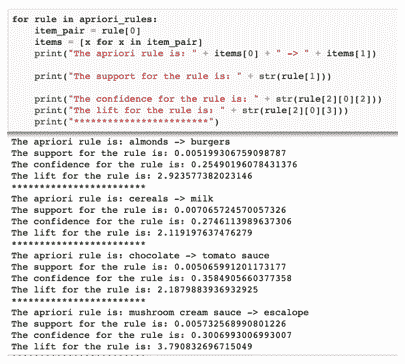

我们可以轻松解释这些规则。例如，规则杏仁->汉堡包的提升为 2.92，置信度为 25.49%，支持率为 0.51%。这完成了我们使用 Python 的实现。此示例可以扩展到任何其他真实业务数据集。

并非所有生成的规则都适合使用。在本章的最后一节中，我们将探讨如何从生成的所有规则中获取最佳规则。

Apriori 算法是一种稳健且非常有见地的算法。但像任何其他解决方案一样，它也有一些缺点，我们现在正在讨论。

### 4.4.2 Apriori 算法的挑战

我们在前面的部分已经讨论过 Apriori 算法生成的子集数量相当大。

##### 图 4.5 数据集的完全扫描被多次进行，因此速度显著下降。

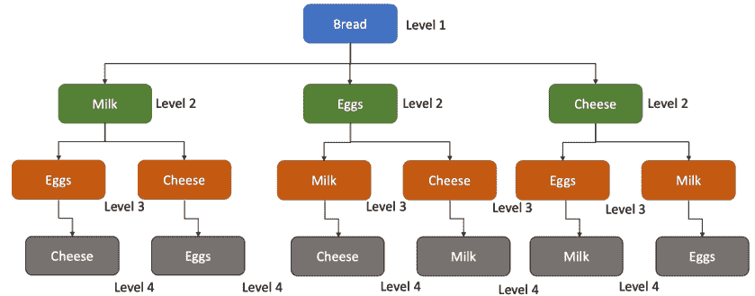

生成候选项集非常繁琐，因此分析数据集变得相当繁重。Apriori 多次扫描整个数据集，因此需要将数据库加载到内存中。我们可以肯定地得出结论，它需要大量时间才能进行计算。当处理非常大的数据集时，这个问题就会被放大。事实上，在现实世界的问题中，会产生数百万次交易，会产生相当多的候选项集，因此在整个数据集上使用 Apriori 是非常耗时的。

因此，一般情况下，会设定一个最小支持值来减少可能的规则数量。在上面给出的例子中，我们可以根据表 4.4 中所示计算级别 1 组合的支持，如果我们将最小支持值设为 0.5，只有一个规则会被列入候选名单。

##### 表 4.4 对每种商品的组合都进行了支持计算。例如，对于牛奶和面包-交易次数为 2，而总交易次数为 5。所以，支持率为 2/5，即 0.4。

| 组合 | 交易次数 | 总交易次数 | 支持率 |
| --- | --- | --- | --- |
| 牛奶，鸡蛋 | 2 | 5 | 0.4 |
| 牛奶，面包 | 2 | 5 | 0.4 |
| 牛奶，奶酪 | 0 | 5 | 0 |
| 鸡蛋，面包 | 4 | 5 | 0.8 |
| 鸡蛋，奶酪 | 2 | 5 | 0.4 |
| 面包，奶酪 | 1 | 5 | 0.2 |

设定一个最小支持值是一个明智的策略，可以使规则更易管理。这样可以减少时间，生成更有意义的规则。毕竟，从分析生成的规则应该足够通用，以至于可以应用于整个数据库。

 快速测验 - 回答这些问题来检查你的理解。书末有答案。

1.   Apriori 算法只扫描数据库一次。是真还是假？

2.   如果香蕉在 12 次交易中出现了 5 次，那么香蕉的支持率就是 5/12。正确还是错误？

但 Apriori 算法是一种开创性的解决方案。它仍然非常受欢迎，通常是讨论关联规则时的第一个算法。

数据准备是关键步骤之一，也是一个挑战，我们将在本章最后的案例研究中探讨这一挑战。  

我们接下来会学习下一个算法，也就是 ECLAT 算法。

## 4.5 等价类聚类和自底向上格遍历(ECLAT)

接下来我们会在这一节学习等价类聚类和自底向上格遍历算法，或者称之为 ECLAT，有人认为这个算法在速度和实现的方便性方面比 Apriori 更好。

ECLAT 使用深度优先搜索方法。这意味着 ECLAT 沿着数据集以纵向方式进行搜索。它从根节点开始。然后进入更深的一层，并继续直到达到第一个终端注释。假设终端节点在 X 级。一旦到达终端节点，算法然后返回一步，并到达级别（X-1），并继续直到再次找到终端节点。让我们通过表 4.6 中显示的树状图来理解这个过程。

##### 图 4.6 ECLAT 算法过程的树状图。 它从 1 开始，直到 16 结束。

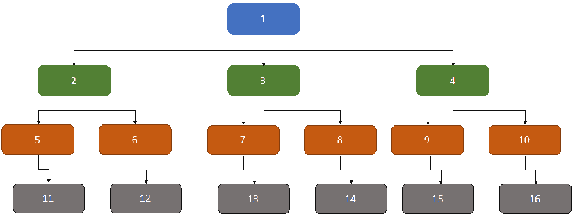

ECLAT 将采取以下步骤：

1.  算法从根节点 1 开始。

1.  然后它向根节点 2 深入一层。

1.  然后它会继续向更深的一层，直到达到终端节点 11。

1.  一旦它到达终端注释 11，然后退回一步，到达节点 5。

1.  然后算法搜索是否有可用的节点。在节点 5 处，我们可以看到没有可用的节点。

1.  因此，算法再次退回一步，它达到了节点 2。

1.  在节点 2 处，算法再次探索。它发现可以到达注释 6。

1.  因此，算法进入节点 6，并开始探索，直到达到终端节点 12。

1.  这个过程会一直持续，直到所有组合耗尽。

显然，计算速度取决于数据集中存在的不同项目的总数。这是因为不同项目的数量定义了树的宽度。每笔交易中购买的商品将定义每个节点之间的关系。

在执行 ECLAT 时，将分析每个商品（单独或成对）。让我们使用我们已经用于 Apriori 的相同示例来更好地理解 ECLAT，如表 4.5 所示。

##### 表 4.5 我们将用来理解 ECLAT 的数据集。 第一张发票 1001 有牛奶、鸡蛋和面包，而奶酪没有购买。

| 发票号 | 牛奶 | 鸡蛋 | 面包 | 奶酪 |
| --- | --- | --- | --- | --- |
| 1001 | 1 | 1 | 1 | 0 |
| 1002 | 0 | 1 | 1 | 1 |
| 1003 | 1 | 1 | 1 | 0 |
| 1004 | 0 | 1 | 0 | 1 |
| 1005 | 0 | 1 | 1 | 0 |

ECLAT 将经历以下步骤来分析数据集：

1.  在第一次运行中，ECLAT 将找到所有单个商品的发票号。换句话说，它会找到所有商品的个别发票号。可以在下面的表 4.6 中显示，其中牛奶在发票号 1001 和 1003 中出现，而鸡蛋出现在所有发票中。

##### 表 4.6 每个商品所在的相应发票。牛奶出现在 1001 和 1003 号发票中，而鸡蛋出现在五张发票中。

| 商品 | 发票号 |
| --- | --- |
| Milk | 1001,1003 |
| Eggs | 1001, 1002, 1003, 1004, 1005 |
| Bread | 1001, 1002, 1003, 1005 |
| Cheese | 1002, 1004 |

1.  现在在下一步中，所有两个项目数据集都将如下所示地进行探索，如表 4.7 所示。例如，牛奶和鸡蛋出现在发票号码 1001 和 1003 中，而牛奶和奶酪没有出现在任何发票中。

##### 表 4.7 现在探索了两个项目数据集。牛奶和鸡蛋出现在发票号码 1001 和 1003 中，而没有牛奶和奶酪的发票。

| 项目 | 发票号码 |
| --- | --- |
| 牛奶，鸡蛋 | 1001, 1003 |
| 牛奶，面包 | 1001, 1003 |
| 牛奶，奶酪 | - |
| 鸡蛋，面包 | 1001, 1002, 1003, 1005 |
| 鸡蛋，奶酪 | 1002, 1004 |
| 面包，奶酪 | 1002 |

1.  在接下来的步骤中，所有三个项目数据集都将如表 4.8 所示进行探索。

##### 表 4.8 在这一步中分析了三个项目数据集。我们只有两个组合。

| 项目 | 发票号码 |
| --- | --- |
| 牛奶，鸡蛋，面包 | 1001, 1003 |
| 鸡蛋，面包，奶酪 | 1002 |

1.  在我们的数据集中没有包含四个项目的发票。

1.  现在根据我们设置的支持计数值的阈值，我们可以选择规则。因此，如果我们希望使规则为真的最小交易次数等于三，那么只有一个规则符合条件，即{鸡蛋，面包}。如果我们将最小交易次数的阈值设定为两，则诸如{牛奶，鸡蛋，面包}，{牛奶，鸡蛋}，{牛奶，面包}，{鸡蛋，面包}和{鸡蛋，奶酪}等规则都符合条件。

现在我们将为 ECLAT 创建一个 Python 解决方案。

### 4.5.1 Python 实现

现在我们将使用 Python 进行 ECLAT 的执行。我们在这里使用 pyECLAT 库。数据集如下所示：

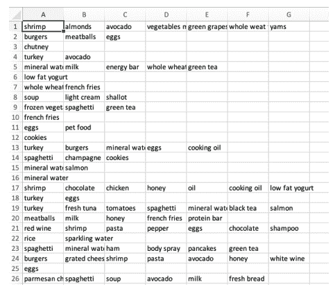

**步骤 1：** 我们将在这里导入库。

```py
import numpy as np
import pandas as pd
from pyECLAT import ECLAT
```

**步骤 2：** 现在导入数据集

```py
data_frame = pd.read_csv('Data_ECLAT.csv', header = None)
```

**步骤 3：** 这里我们正在生成一个 ECLAT 实例。

```py
eclat = ECLAT(data=data_frame)
```

在上一步生成的 ECLAT 实例 `eclat` 中有一些属性，如 eclat.df_bin 是一个二进制数据框，eclat.uniq_ 是所有唯一项目的列表。

**步骤 4：** 现在我们将适配模型。我们在这里给出了最小支持度为 0.02。之后我们将打印支持度。

```py
get_ECLAT_indexes, get_ECLAT_supports = eclat.fit(min_support=0.02,
                                                           min_combination=1,
                                                           max_combination=3,
                                                           separator=' & ')
get_ECLAT_supports
```

输出是

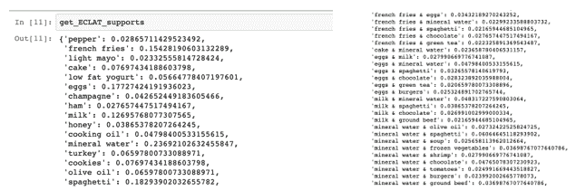

我们可以根据支持度提供的结果进行解释。对于每个项目和项目组合，我们都得到了支持度的值。例如，对于炸薯条和鸡蛋，支持度的值为 3.43%。

ECLAT 相对于 Apriori 算法具有一些优势。由于它使用深度搜索方法，因此比 Apriori 更快，计算所需的内存更少。它不会迭代地扫描数据集，因此使其比 Apriori 更快。在我们学习了最后一个算法之后，我们将再次比较这些算法。

现在我们将转向第三个算法：F-P 生长算法。

## 4.6 频繁模式生长算法（F-P 算法）

F-P 算法或频繁模式增长算法是本章要讨论的第三个算法。它是对 Apriori 算法的改进。回想一下，在 Apriori 中，我们面临计算耗时和昂贵的挑战。FP 通过将数据库表示为一种名为频繁模式树或 FP 树的树来解决这些问题。因为这种频繁模式，所以没有必要像 Apriori 算法那样生成候选项。现在让我们详细讨论一下 FP。

FP 树或频繁模式树是一个树形结构，它挖掘数据集中最频繁出现的项。见图 4.7。

##### 图 4.7 FP 算法可以用树状图结构表示。我们将逐步创建这个树。每个节点代表一个唯一的项。根节点为空。

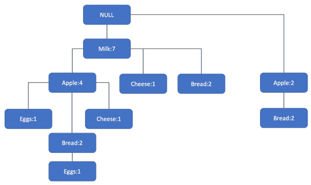

每个节点表示数据集中的唯一项。树的根节点通常保持为空。树中的其他节点是数据集中的项。如果它们在同一发票中，则节点彼此连接。我们将逐步学习整个过程。

假设我们使用如表 4.9 所示的数据集。因此，我们有唯一的项：苹果，牛奶，鸡蛋，奶酪和面包。总共有 9 个交易，每个交易中的相应项如表 4.9 所示。

##### 表 4.9 我们将使用的数据集，以了解 FP 算法的概念。这里有九个交易，例如在 T1 中我们有苹果，牛奶和鸡蛋。

| 交易 | 项集 |
| --- | --- |
| T1 | 苹果，牛奶，鸡蛋 |
| T2 | 牛奶，奶酪 |
| T3 | 牛奶，面包 |
| T4 | 苹果，牛奶，奶酪 |
| T5 | 苹果，面包 |
| T6 | 牛奶，面包 |
| T7 | 苹果，面包 |
| T8 | 苹果，牛奶，面包，鸡蛋 |
| T9 | 苹果，牛奶，面包 |

现在让我们将 FP 算法应用于该数据集。

**步骤 1：** 就像 Apriori 算法一样，我们首先扫描整个数据集。记录每个项出现的次数并生成频率计数。结果如表 4.10 所示。我们按照整个数据集中各项的频率或对应的支持计数从大到小排列。

##### 表 4.10 各项集的相应频率。例如，苹果已被购买了六次。

| 项 | 频率或支持计数 |
| --- | --- |
| 牛奶 | 7 |
| 苹果 | 6 |
| 面包 | 6 |
| 奶酪 | 2 |
| 鸡蛋 | 2 |

如果两个项的频率完全相同，则任何一个都可以排在前面。在上面的例子中，面包和苹果的频率相同。因此，我们可以将面包或苹果作为第一个。

**步骤 2：** 让我们开始构建 FP 树。我们从根节点开始创建，通常是图 4.8 中的空节点。

##### 图 4.8 FP 树的根节点通常保持为空。


**第 3 步：** 现在分析第一个交易 T1。在这里，我们有苹果、牛奶和鸡蛋在第一笔交易中。其中牛奶有最高的支持计数，为 7。因此，从根节点延伸到牛奶的连接，并用 Milk:1 表示。我们在图 4.9 中展示了。

##### 图 4.9 从根节点到牛奶的连接。牛奶有最高的支持，因此我们选择了牛奶。


**第 4 步：** 现在我们来看看 T1 中的其他项目。苹果的支持计数为 6，鸡蛋的支持计数为 2。所以，我们将从牛奶到苹果延伸连接，并命名为 Apple:1，然后从苹果到鸡蛋并称之为 Eggs:1。我们在图 4.10 中展示了。  

##### 图 4.10 过程的第 4 步，我们已经完成了 T1 中的所有项目。所有的项目牛奶、苹果和鸡蛋现在都彼此连接。

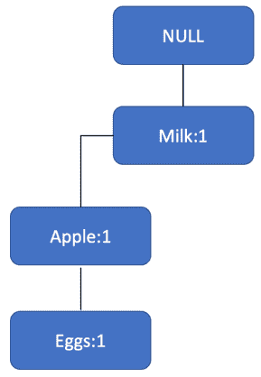

**第 5 步：** 现在让我们看看 T2。它有牛奶和奶酪。牛奶已经连接到根节点。所以，牛奶的计数变成 2，变成了 Milk:2。我们接下来会从牛奶到奶酪创建一个分支，并称之为 Cheese:1。增加的部分显示在图 4.11 中。

##### 图 4.11 过程的第 5 步，我们开始分析 T2。牛奶已经连接，所以它的计数增加了 2，同时奶酪被添加到树中。


**第 6 步：** 现在轮到 T3。T3 有牛奶和面包。所以，类似于第 5 步，牛奶的计数是 3，变成了 Milk: 3。与第 5 步类似，我们从牛奶到面包添加另一个连接，称为 Bread:1。更新后的树显示在图 4.12 中。

##### 图 4.12 在第 6 步，现在分析 T3。牛奶的计数增加了一个，变成了 3，而面包被添加为一个新的连接。

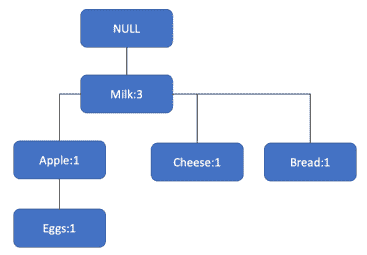

**第 7 步：** 在 T4 中，我们有苹果、牛奶和奶酪。牛奶的计数现在变成了 4，苹果现在是 2。然后我们创建了一个从苹果到奶酪的分支，称之为 Cheese:1。我们在图 4.13 中展示。

##### 图 4.13 在过程的第 7 步中，正在分析 T4。牛奶的计数变成了 4，苹果的计数增加到了 2，并添加了一个新的从苹果到奶酪的分支。

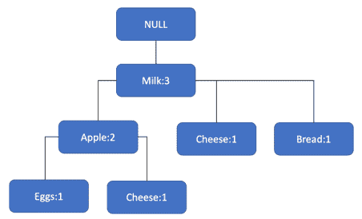

**第 8 步：** 我们可以在 T5 中发现，我们有苹果和面包。两者都不直接连接到根节点，频率相等为 6。因此，我们可以任选其一连接到根节点。图更新为图 4.14。

##### 图 4.14 在分析完 T5 之后，图示如下所示发生了变化。我们有苹果和面包被添加到树中。

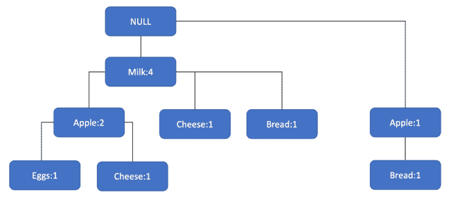

**第 9 步：** 这个过程会继续，直到我们耗尽所有的交易，最终的图形如图 4.15 所示。

##### 图 4.15 一旦我们耗尽了所有可能的组合，最终的树就是这样。但是在此之后还有更多的步骤。到目前为止，我们只创建了树。现在我们需要生成数据集，如表 4.11 所示。

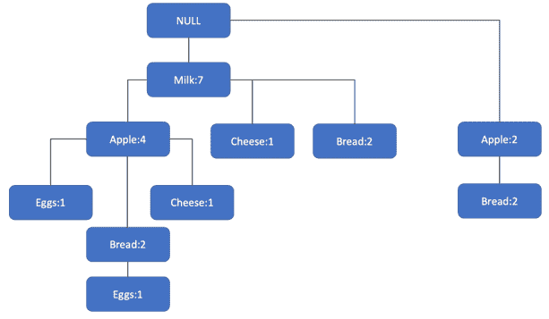

到目前为止，做得很棒！但是，过程还没有结束。我们刚刚建立了数据集中项目之间的连接。现在我们需要填写一个看起来像表 4.11 的表。

##### 表 4.11 FP 算法要完成的表。这是我们希望生成的输出。

| 项目 | 条件模式基 | 条件 FP 树 | 频繁模式生成 |
| --- | --- | --- | --- |
| 奶酪 |  |  |  |
| 面包 |  |  |  |
| 鸡蛋 |  |  |  |
| 苹果 |  |  |  |

也许你会想为什么只列出了 4 个项目。由于牛奶直接源自根节点，没有其他到达它的方式，我们不需要为牛奶单独设置一行。

**第 10 步：** 在继续之前，我们将最小支持计数固定为 2，以便接受任何规则。由于数据集相当小，我们这样做是为了简单起见。

对于现实生活中的业务问题，建议您尝试多个甚至更高的支持计数值，否则生成的规则数量可能会非常多。

让我们从奶酪作为第一个项目开始。我们可以通过{NULL-牛奶-奶酪}和{NULL-牛奶-苹果-奶酪}到达奶酪。对于这两条路径，奶酪的计数为 1。因此，（如果我们忽略 NULL）我们的条件模式基为{牛奶-奶酪}或{牛奶:1}和{牛奶-苹果-奶酪}或{牛奶-苹果:1}。完整的条件模式基变为{{牛奶:1},{牛奶-苹果:1}}。这些信息添加到表 4.12 的第二列。

##### 表 4.12 过程的第 10 步，我们已经填写了奶酪的第一个单元格。我们填写了奶酪的第一个单元格。

| 项目 | 条件模式基 | 条件 FP 树 | 频繁模式生成 |
| --- | --- | --- | --- |
| 奶酪 | {{牛奶:1},{牛奶-苹果:1}} |  |  |
| 面包 |  |  |  |
| 鸡蛋 |  |  |  |
| 苹果 |  |  |  |

**第 11 步：** 现在，如果我们在条件模式基中添加两个值，我们会得到牛奶为 2，苹果为 1。由于我们已经为频率计数设置了 2 的阈值，我们将忽略苹果的计数。条件 FP 树的值，即表中的第三列，变为{牛奶:2}。现在我们只需将原始项目添加到此项中，变为频繁模式生成或第 4 列。现在表是 4-13。

##### 表 4.13 过程的第 11 步，在这一步中我们完成了奶酪项目的详细信息。同样，所有其他项目都将被分析并添加到表中。

| 项目 | 条件模式基 | 条件 FP 树 | 频繁模式生成 |
| --- | --- | --- | --- |
| 奶酪 | {{牛奶:1},{牛奶-苹果:1}} | {牛奶:2} | {牛奶-奶酪:2} |
| 面包 |  |  |  |
| 鸡蛋 |  |  |  |
| 苹果 |  |  |  |

**第 12 步：** 以类似的方式填写表中的所有其他单元格，最终表为表 4.14。

##### 我们分析了所有项目的组合后，表 4.14 是最终表。

| 项目 | 条件模式基 | 条件 FP 树 | 频繁模式生成 |
| --- | --- | --- | --- |
| 奶酪 | {{牛奶:1},{牛奶-苹果:1}} | {牛奶:2} | {牛奶-奶酪:2} |
| 面包 | {{牛奶-苹果:2}, {牛奶:2}, {苹果:2}} | {{牛奶:4, 苹果:2}, {苹果:2}} | {牛奶-面包:4}, {苹果-面包:4}, {牛奶-苹果-面包:2} |
| 鸡蛋 | {{牛奶-苹果:1},{牛奶-苹果-面包:1}} | {牛奶:2, 苹果:2} | {牛奶-鸡蛋:2},{牛奶-苹果:2},{牛奶-苹果:2} |
| 苹果 | {牛奶:4} | {牛奶:4} | {牛奶-苹果:4} |

这确实是一个复杂的过程。但是一旦步骤清晰，就会变得非常简单。

通过这个练习，我们已经得到了最终的规则集，如最后一列频繁模式生成所示。

请注意，所有的规则都彼此不同。

我们将使用最后一列“频繁模式生成”作为我们数据集的规则。

使用 FP 增长算法的 Python 实现非常简单，并且使用库进行计算很容易。出于空间考虑，我们已将 Jupyter 笔记本上传到了本章的 GitHub 存储库中。

我们现在将探讨另一个有趣的主题，即序列规则挖掘。这是一个非常强大的解决方案，使企业能够根据客户的需求量身定制他们的营销策略和产品推荐。

## 4.7 序列规则挖掘

想象一下。Netflix 会有一个包含顾客随时间订购的所有电影的交易数据库。如果他们分析并发现 65%的购买了战争电影 X 的客户在接下来的一个月也购买了浪漫喜剧 Y，这是非常有见地和可操作的信息。这将使他们能够向客户推荐他们的产品，并且他们可以定制他们的营销策略。不是吗？

到目前为止，在这一章中，我们已经涵盖了三种关联规则算法。但是所有的数据点都限于相同的数据集，并且没有涉及到序列。序列模式挖掘允许我们分析一组事件发生的数据集。通过分析数据集，我们可以找到统计上相关的模式，这使我们能够解读整个事件序列。显然，事件序列是按照特定顺序排列的，这是序列规则挖掘过程中非常重要的一个属性。

序列规则挖掘不同于时间序列分析。要了解更多关于时间序列分析的信息，请参阅附录。

序列规则挖掘被应用于多个领域和功能。它可以在生物学中用于在 DNA 测序期间提取信息，也可以用于了解用户的在线搜索模式。序列规则挖掘将帮助我们了解用户接下来要搜索什么。在讨论关联规则时，我们使用了购买牛奶、面包、鸡蛋的同一交易中的交易。序列规则挖掘是对此的扩展，其中我们分析连续的交易，并试图解读是否存在序列。

在研究 SPADE 算法时，我们将学习构成该算法基础的数学概念。这些概念有点复杂，可能需要多次阅读才能掌握。

### 4.7.1 SPADE

我们现在正在使用等价类进行顺序模式挖掘（Sequential Pattern Discovery using Equivalence classes）或 SPADE 探索序列规则挖掘。这是由穆罕默德·J·扎基（Mohammed J. Zaki）提出的，文章链接在本章末尾。

我们了解到，我们希望分析事件的顺序。例如，顾客购买了手机和充电器。一周后买了耳机，两周后买了手机壳和手机屏幕保护壳。因此，在每次交易中都购买了项目。并且每次交易都可以称为一个事件。让我们更详细地了解一下。

假设我们有讨论所需的所有项目的完整列表。I 将包含像 i[1]、i[2]、i[3]、i[4]、i[5] 等项目。因此，我们可以写成

I = {i[1], i[2], i[3], i[4], i[5]………, i[n]}，其中我们总共有 n 个不同的项目。

项目可以是任何东西。如果我们考虑杂货店的例子，项目可以是牛奶、鸡蛋、奶酪、面包等等。

一个事件将是在同一交易中的项目集合。一个事件可以包含像（i[1], i[5], i[4], i[8）这样的项目。例如，一个事件可以包含在同一交易中购买的项目（牛奶, 糖, 奶酪, 面包）。我们将用 ⍺ 表示一个事件。

接下来让我们了解一下序列。序列只是按顺序的事件。换句话说，⍺[1] -> ⍺[2] ->⍺[3] ->⍺[4] 可以被称为事件序列。例如，（牛奶, 奶酪）->（面包, 鸡蛋）->（奶酪, 面包, 糖）->（牛奶, 面包）是一系列交易。这意味着在第一次交易中购买了牛奶和奶酪。在接下来的交易中，购买了面包和鸡蛋，依此类推。

包含 k 个项目的序列是一个 k 项目序列。例如，序列（牛奶, 面包）->（鸡蛋）包含 3 个项目。

我们现在将逐步了解 SPADE 算法。

假设我们生成了以下序列。在第一个序列 1001 的交易中，第一个交易中购买了牛奶。第二个交易中购买了牛奶、鸡蛋和面包。紧随其后购买了牛奶和面包。在第四个序列中只购买了糖。在序列 1001 的第五个和最后一个交易中，购买了面包和苹果。并且这适用于所有相应的序列。

##### 表 4.15 序列挖掘的数据集。在序列 ID 1001 中，我们有多个事件。在第一次购买中，购买了牛奶。然后购买了（牛奶, 鸡蛋, 面包）等等。

| 序列 ID | 序列 |
| --- | --- |
| 1001 | <(牛奶) (牛奶, 鸡蛋, 面包) (牛奶, 面包) (糖)(面包, 苹果)> |
| 1002 | <(牛奶, 糖) (面包) (鸡蛋, 面包) (牛奶, 奶酪)> |
| 1003 | <(奶酪, 苹果) (牛奶, 鸡蛋) (糖, 苹果) (面包) (鸡蛋)> |
| 1004 | <(奶酪, 香蕉)(牛奶, 苹果)(面包)(鸡蛋)(面包)> |

这个（表 4.15 ）可以转换成垂直数据格式，如表 4.16 所示。在这一步中，我们计算单个项目的频率，即仅包含一个项目的序列。这仅需要进行一次数据库扫描。

##### 表 4.16 表 4.15 的垂直格式。我们只是得到了每个项目的序列 ID 和项目 ID，并在此处表示它。

| 序列 ID | 元素 ID | 项目 |
| --- | --- | --- |
| 1001 | 1 | 牛奶 |
| 1001 | 2 | 牛奶, 鸡蛋, 面包 |
| 1001 | 3 | 牛奶, 面包 |
| 1001 | 4 | 糖 |
| 1001 | 5 | 面包, 苹果 |
| 1002 | 1 | 牛奶, 糖 |
| 1002 | 2 | 面包 |
| 1002 | 3 | 鸡蛋, 面包 |
| 1002 | 4 | 牛奶, 奶酪 |
| 1003 | 1 | 奶酪, 苹果 |
| 1003 | 2 | 牛奶, 鸡蛋 |
| 1003 | 3 | 糖, 苹果 |
| 1003 | 4 | 面包 |
| 1003 | 5 | 鸡蛋 |
| 1004 | 1 | 奶酪, 香蕉 |
| 1004 | 2 | 牛奶, 苹果 |
| 1004 | 3 | 面包 |
| 1004 | 4 | 鸡蛋 |
| 1004 | 5 | 面包 |

表 4.16 只是表 4.15 的垂直制表符号表示。例如，在序列 ID 1001 中，元素 ID 1 是牛奶。对于序列 ID 1001，元素 ID 2 是牛奶，鸡蛋，面包等。

为了解释的目的，我们只考虑两个项目 0 牛奶和鸡蛋以及支持阈值为 2。

然后，在下一步中，我们将对每个项目进行分解。例如，牛奶出现在序列 ID 1001 和元素 ID 1，序列 ID 1001 和元素 ID 2，序列 ID 1001 和元素 ID 3，序列 ID 1002 和元素 ID 1 等中。它会产生类似表 4.17 的表格，我们在其中显示了牛奶和鸡蛋。它需要应用到数据集中的所有项目。

##### 表 4.17 中相应的牛奶和鸡蛋序列 ID。同样的方法可以应用到所有项目和序列中。

| 牛奶 | 鸡蛋 |
| --- | --- |
| 序列 ID | 元素 ID | 序列 ID | 元素 ID |
| 1001 | 1 | 1001 | 2 |
| 1001 | 2 | 1002 | 3 |
| 1001 | 3 | 1003 | 2 |
| 1002 | 1 | 1003 | 5 |
| 1002 | 4 | 1004 | 5 |
| 1003 | 2 |  |  |
| 1004 | 3 |  |  |

现在，我们希望计算 2-序列或具有 2 项序列。我们可以有两个序列 - 要么是牛奶 -> 鸡蛋，要么是鸡蛋 -> 牛奶。让我们先来看看牛奶-> 鸡蛋。

对于牛奶 -> 鸡蛋，我们需要在鸡蛋前面放牛奶。对于相同的序列 ID，如果牛奶的元素 ID 小于鸡蛋的元素 ID，则它是一个合格的序列。在上面的示例中，对于序列 ID 1002，牛奶的元素 ID 是 1，而鸡蛋的元素 ID 是 2。因此，我们可以将其添加为第一个合格对，如下表 4.18 的第一行所示。对于序列 ID 1002 也是如此。在表 4.17 中，第 4 行我们有序列 ID 1002。牛奶的元素 ID 是 1，而第 2 行的鸡蛋的元素 ID 是 3。同样，牛奶的元素 ID 小于鸡蛋的元素 ID，因此它变为第二个条目。进程继续。

##### 表 4.18 序列牛奶鸡蛋可以写在这里。关键点是在比较牛奶和鸡蛋的相应元素 ID 时具有相同的序列 ID。

| 牛奶 鸡蛋 |
| --- |
| 序列 ID | 元素 ID（牛奶） | 元素 ID（鸡蛋） |
| 1001 | 1 | 2 |
| 1002 | 1 | 3 |
| 1003 | 2 | 5 |
| 1004 | 3 | 5 |

使用相同的逻辑，我们可以创建表格，例如鸡蛋 -> 牛奶，如下所示在下表 4.19 中显示。

##### 表 4.19：序列鸡蛋牛奶可以在此处写下。关键在于比较牛奶和鸡蛋的各自元素 ID 时保持相同的序列 ID。

| 美纪牛奶 |
| --- |
| 序列 ID | 元素 ID（牛奶） | 元素 ID（鸡蛋） |
| 1001 | 2 | 3 |
| 1002 | 3 | 4 |

可以对所有可能的组合都进行此操作。现在我们将转向创建 3 项序列，我们将创建 Milk，Eggs -> Milk。为此，我们必须合并这两个表。

表 4.20：结合序列，即牛奶->鸡蛋和鸡蛋->牛奶，以合并表格。

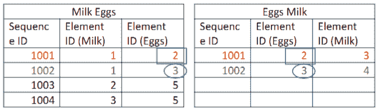

结合的逻辑是匹配序列 ID 和元素 ID。我们已经用红色和绿色分别突出显示匹配的部分。对于序列 ID 1001，左表中鸡蛋的元素 ID 和右表中鸡蛋的元素 ID 匹配，这成为表 4.21 的第一条目。同样对于序列 ID 1002，元素 ID 3 匹配。这导致了表 4.21 的生成。

##### 表 4.21：在分析了所有物品的组合后的最终表。 

| 牛奶，鸡蛋 -> 牛奶 |
| --- |
| 序列 ID | 元素 ID（牛奶） | 元素 ID（鸡蛋） | 元素 ID（牛奶） |
| 1001 | 1 | 2 | 3 |
| 1002 | 1 | 3 | 4 |

这个过程将继续进行。当找不到频繁序列时算法停止。

我们将使用 Python 在数据集上实现 SPADE。我们使用`pyspade`库，因此我们必须加载数据集并调用函数。它会为我们生成结果。这里支持率设置为 0.6，然后我们打印结果。

```py
from pycspade.helpers import spade, print_result
spade_result = spade(filename='SPADE_dataset.txt', support=0.6, parse=True)
print_result(spade_result)
```

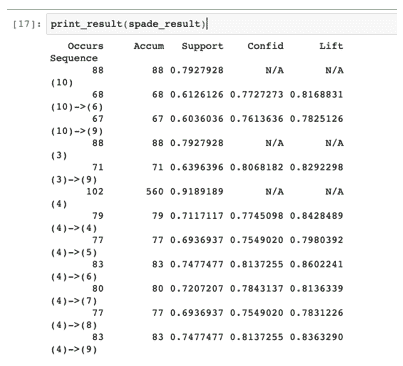

这结束了我们在本章中要讨论的四种算法。现在我们将转向案例研究，为您提供真实的体验。

## 4.8 关联规则案例研究

关联规则挖掘是一个非常有用和强大的解决方案。我们将使用关联规则解决一个实际案例研究。 

回想一下，在本章的开头，我们建议研究杂货店的模式。这种店铺摆设的逻辑是什么呢？

想象一下：你在像沃尔玛、乐购、Spar 或 Marks & Spencer 等杂货零售商工作。他们必须规划新店的视觉布局。显然，零售商要明智地利用店内空间，充分利用最大的容量。与此同时，至关重要的是不妨碍顾客的活动。顾客应该可以接触到所有展示的物品，并能够轻松地导航。你可能会有一些经历过一些店铺让我们感到窒息和陈列品充斥，而另一些则整齐摆放的情况。

我们如何解决这个问题呢？

这个问题可能有多种解决方案。一些零售商可能希望根据商品类别对物品进行分组。他们可能希望将所有烘焙产品都放在一个架子上，或者根据任何其他条件使用。我们在这里学习的是机器学习的例子。

使用购物篮分析，我们可以生成规则，指示各种商品之间的相关关系。我们可以预测哪些商品经常一起购买，并且可以将它们放在店里的一起。例如，如果我们知道牛奶和面包经常一起购买，那么面包可以放在牛奶柜台附近。购买牛奶的顾客可以轻松找到面包并继续购买。

但事情并不像听起来那么简单。让我们逐步解决这个案例。

1.  **业务问题定义**：第一步是明确定义我们清楚的业务问题。我们希望发现各种商品之间的关系，以便可以更好地安排商店内的布局。在这里，*陈列计划* 变得很重要。陈列计划帮助零售商以明智的方式规划商店内的空间利用，使顾客也可以轻松导航和访问产品。它可以被视为商店的视觉布局。示例如图 4.16 所示。

##### 图 4.16 显示了一个陈列计划的示例。陈列计划对于视觉营销非常有用。

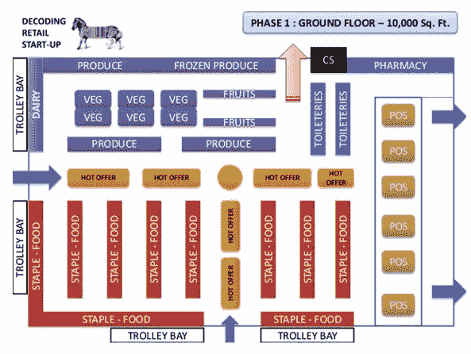

在图中，我们可以看到每个商品类别都有特定的区域。关联规则非常有洞察力，可以帮助生成陈列计划的方向。

1.  **数据发现**：下一步是数据发现，其中历史交易被搜索并加载到数据库中。通常，一笔交易看起来像表 4.22。

##### 表 4.22 实际零售店生成的发票示例。将这种数据格式转换为可以被关联规则算法消费的格式是相当具有挑战性的。

| 发票编号 | 日期 | 商品 | 金额 |
| --- | --- | --- | --- |
| 1001 | 01-Jun-21 | 牛奶，鸡蛋，奶酪，面包 | $10 |
| 1002 | 01-Jun-21 | 面包，香蕉，苹果，黄油 | $15 |
| 1003 | 01-Jun-21 | 黄油，胡萝卜，奶酪，鸡蛋，面包，牛奶，香蕉 | $19 |
| 1004 | 01-Jun-21 | 牛奶 | $1 |
| 1005 | 01-Jun-21 | 面包 | $0.80 |

1.  **数据准备**：这一步也许是最困难的一步。正如你可能意识到的那样，关联规则模型的创建是一项非常简单的任务。我们有可以为我们处理繁重工作的库。但是它们期望的数据集是以特定格式存在的。这是一项繁琐的任务，非常耗时，并且需要大量的数据预处理技能。

    在准备数据集时，有几个注意事项你必须记住，它们是：

1.  有时在数据准备阶段我们会得到**NULL**或**空值**。数据集中的缺失值可能会导致计算时出现问题。在其他机器学习解决方案中，我们建议处理缺失值。在关联规则的情况下，我们建议忽略相应的交易，并且不在最终数据集中考虑它。

1.  很多时候，我们在数据中会得到**垃圾值**。数据集中会发现像!@%^&*()_ 这样的特殊字符。这可能是由系统中不正确的输入导致的。因此，需要进行数据清洗。

1.  我们在书的附录中非常详细地介绍了数据预处理步骤，在这里我们处理 NULL 值和垃圾值。

1.  将表格转换为关联规则学习算法可以理解和使用的格式是一项必不可少但又艰巨的步骤。深入了解 SQL 数据透视的概念以更好地理解这个概念。否则，你可能需要某人（一位数据工程师）为你创建数据集。

1.  **模型准备：** 或许最容易的步骤之一就是建模。我们已经为不同的算法解决了 Python 解决方案。所以，你应该对此相当熟悉。

1.  **模型解释：** 创建模型可能很容易，但解释规则却不是。大多数时候，你可以得到如下规则：

1.  #NA -> (牛奶，奶酪) - 这样的规则显然是不可用的，也没有任何意义。它表明数据准备不正确，数据集中仍然存在一些垃圾值。

1.  （某些物品）->（包装材料）- 或许是最明显的规则，但同样不可用。这个规则表明，无论何时购物，都会购买包装材料，相当明显对吧？

1.  （土豆，番茄）->（洋葱）：这种规则看起来可能是正确的，但这是零售商已经知道的常识。显然，大多数购买蔬菜的顾客都会一起购买土豆、番茄和洋葱。这样的规则可能对业务价值增加不多。

1.  支持、置信度和提升阈值允许过滤出最重要的规则。我们可以按提升的降序排序规则，然后移除最明显的规则。

1.  **业务主题专家：** 业务利益相关者和主题专家参与每一个步骤是至关重要的。在这个案例研究中，运营团队、视觉营销团队、产品团队和营销团队是关键参与者，他们应该在每一个步骤都密切配合。

1.  一旦规则生成并得到接受，我们就可以使用它们来改善零售空间的陈列方案。零售商可以利用它们来改善营销策略并改进产品促销活动。例如，如果接受了像（A，B）->（C）这样的规则，零售商可能希望将产品捆绑在一起并作为一个单一实体出售。这将增加同一交易中购买的平均物品数量。

1.  这个案例研究可以扩展到任何其他领域或业务功能。例如，如果我们希望检查用户在网页上的移动，可以使用相同的步骤。网页开发人员可以分析客户在其网站上的历史点击和使用情况。通过识别模式，他们可以找出用户倾向于点击什么以及哪些功能会最大化他们的参与度。医生可以使用关联规则更好地诊断患者。医生可以比较与其他症状的概率相关的症状，并提供更准确的诊断。

现在，我们将研究这些算法的局限性以及关联规则和序列规则的其他可用解决方案。

## 4.9 总结思考

在我们研究的关联规则和序列规则中，存在一些假设和限制。

+   在生成规则时，忽略了物品的各自重要性。例如，如果一个顾客在一次交易中购买了 5 罐牛奶和一公斤苹果，那么它被类似地对待于一张发票，其中购买了一罐牛奶和五公斤苹果。因此，我们必须记住物品的各自*重要性*没有被考虑。

    +   商品的成本反映了产品的感知价值。一些昂贵的产品更为重要，因此，如果顾客购买了它们，就可以产生更多的收入。在分析发票时，我们忽略了物品的成本。

    +   在分析序列时，我们没有考虑两个交易之间的各自时间段。例如，在 T1 和 T2 之间有 10 天，而在 T2 和 T3 之间有 40 天 - 这两个时间段被视为相同。

    +   在所有的分析中，我们将不同类别视为相同。易腐烂商品和不易腐烂商品被以类似方式处理。例如，保质期为 2-3 天的新鲜牛奶被类似对待于保质期无限的洗衣粉。

    +   许多时候，我们在分析后得到了不感兴趣的规则。这些结果来自常识（土豆，西红柿）->（洋葱）。这样的规则并不太有用。我们很多时候都面临这样的问题。

    +   虽然不感兴趣的规则是一个挑战，但发现的大量规则又是问题之一。我们得到了成百上千的规则，要理解和分析每一个都变得困难。在这里，阈值变得很有用。

    +   计算所需的时间和内存需求是巨大的。这些算法需要多次扫描数据集，因此是非常耗时的练习。

+   生成的规则取决于用于分析的数据集。例如，如果我们仅在夏季生成的数据集上进行分析，我们就不能将规则应用于冬季，因为消费者的偏好会随着不同季节而变化。此外，随着时间的流逝，宏观和微观经济因素也会发生变化，因此算法也应随之更新。

还有一些其他算法也很有趣。对于关联规则，我们可以有多关系关联规则、k-最佳模式发现、近似频繁数据集、广义关联规则、高阶模式发现等。对于序列挖掘，我们有广义序列模式、FreeSpan、PrefixSpan、挖掘相关模式等。这些算法非常有趣，可以用于增强知识。

关联规则和序列挖掘是非常有趣的主题。各个商业领域和功能越来越多地使用关联规则来理解事件的模式。这些见解使团队能够做出明智而科学的决策，以改善客户体验和整体参与度。本章是本书第二部分的第一章。我们在本章中探讨了关联规则和序列挖掘。这些是使用 Apriori、FP 和 ECLAT 算法进行研究的，而序列挖掘则使用了 SPADE。

在下一章中，我们将研究高级聚类算法。敬请关注！

您现在可以继续问题部分。

#### 实际的下一步和建议的阅读

1.  请阅读以下关联规则算法的研究论文

1.  关联规则的快速发现（`www.cs.bme.hu/~marti/adatbanya/apriori_hashtree.pdf`）

1.  用于挖掘关联规则的快速算法（`rakesh.agrawal-family.com/papers/vldb94apriori.pdf`）

1.  模式和关联规则挖掘方法的高效分析（`arxiv.org/pdf/1402.2892.pdf`）

1.  关于其保护隐私能力的关联规则挖掘技术综述（`www.ripublication.com/ijaer17/ijaerv12n24_216.pdf`）

1.  对于序列挖掘，请阅读以下研究论文：

1.  SPADE：用于挖掘频繁序列的高效算法（`link.springer.com/content/pdf/10.1023/A:1007652502315.pdf`）

1.  顺序挖掘：模式与算法分析（`arxiv.org/pdf/1311.0350.pdf`）

1.  基于趣味性的顺序模式挖掘算法（`ieeexplore.ieee.org/document/8567170`）

1.  一种解决顺序模式挖掘问题的新方法（`link.springer.com/chapter/10.1007/978-3-642-34630-9_6`）

## 4.10 总结

+   我们研究了关联规则，这些规则可用于发现数据集中存在的变量之间的引人注目的关系

    +   我们介绍了支持度、置信度、提升度和确信度的概念，用于衡量生成的规则的效果。

    +   然后我们转向了 apriori 算法，该算法利用了“自下而上”的方法，首先根据子集的频率生成候选项。Apriori 算法会迭代地扫描整个数据，因此需要很长时间。

    +   我们讨论了 ECLAT，这是一种深度优先搜索方法。它在整个数据集上以垂直方式执行搜索。由于它不会迭代地扫描数据集，因此比 apriori 更快。

    +   我们还介绍了频繁模式增长算法，该算法通过将数据库表示为称为频繁模式树或 FP 树的树来工作。由于这种频繁模式，无需像 Apriori 算法中那样生成候选项，因此它所需的时间较少。

    +   我们接着介绍了一种名为 SPADE 的基于序列的学习技术，其中我们也考虑了各种事件发生的具体顺序。

+   最后，我们使用 apyori、pyECLAT、fpgrowth_py 和 pyspade 实现了 Python 技术。
