# 第五章：聚类 (高级)

“在复杂中寻找简单- 爱因斯坦”

有时生活很简单，有时我们会遇到相当复杂的情况。我们在两种情况下都能应对，并根据情况调整我们的方法。

在本书的第一部分中，我们涵盖了更简单、更简单的主题。这使您为前进的旅程做好了准备。我们目前处于第二部分，比第一部分稍微复杂一些。第三部分比前两部分更加高级。因此，随着每一章的进行，难度将稍微增加，期望也会增加。

我们在本书的第一部分中学习了聚类算法。我们了解到聚类是一种无监督学习技术，我们希望通过发现数据集中的有趣模式来将数据点分组。我们深入研究了聚类解决方案的含义、聚类算法的不同类别以及最后的案例研究。在那一章中，我们深入探讨了 kmeans 聚类、层次聚类和 DBSCAN 聚类的数学背景、过程、Python 实现以及优缺点。在开始本章之前，建议您复习第二章。

你可能会遇到许多次不符合简单形式和形状的数据集。此外，我们在选择最终要实现的算法之前必须找到最佳匹配项。在这里，我们可能需要更复杂的聚类算法的帮助；这就是本章的主题。在本章中，我们将再次研究三种这样的复杂聚类算法 - 谱聚类、高斯混合模型 (GMM) 聚类和模糊聚类。一如既往，Python 实现将遵循数学和理论概念。本章在数学概念上稍微有些复杂。您不需要成为数学博士，但有时了解算法如何在后台工作是很重要的。与此同时，您会惊讶地发现这些算法的 Python 实现并不乏味。本章没有任何案例研究。

在本书的第五章中，我们将涵盖以下主题：

1.  谱聚类

1.  模糊聚类

1.  高斯混合模型 (GMM) 聚类

1.  总结

欢迎来到第五章，祝你一切顺利！

## 5.1 技术工具包

我们将继续使用到目前为止所使用的相同版本的 Python 和 Jupyter 笔记本。本章中使用的代码和数据集已经上传到 GitHub (`github.com/vverdhan/UnsupervisedLearningWithPython/tree/main/Chapter%205`)。

我们将继续使用到目前为止所使用的常规 Python 库 - numpy、pandas、sklearn、seaborn、matplotlib 等等。在本章中，您需要安装几个 Python 库，它们是 - skfuzzy 和 network 。使用库，我们可以非常快速地实现算法。否则，编写这些算法是相当耗时且繁琐的任务。

让我们开始重新了解一下聚类！

## 5.2 聚类

回顾第二章，聚类用于将相似的对象或数据点分组。它是一种无监督学习技术，我们的目的是在数据中找到自然分组，如图 5-1 所示。

##### 图 5-1 将对象结果聚类为自然分组。

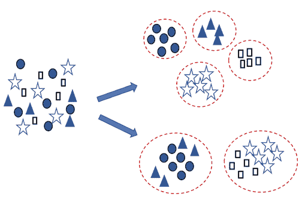

在这里，我们可以观察到，在左侧我们有未分组的数据，在右侧数据点已经被分组成逻辑组。我们还可以观察到，可以有两种方法来进行分组或*聚类*，而且两者都会产生不同的聚类。聚类作为一种技术，在业务解决方案中被广泛应用，如客户细分、市场细分等。

我们在第二章中理解了 kmeans、层次和 DBSCAN 聚类。我们还涵盖了各种距离测量技术和用于衡量聚类算法性能的指标。建议您重新查看这些概念。

在本章中，我们将专注于高级聚类方法。我们将在下一节开始使用谱聚类。

## 5.3 谱聚类

谱聚类是独特的聚类算法之一。在这个领域进行了一些高质量的研究。像杨安东教授、迈克尔·乔丹教授、雅尔·韦斯教授、施坚博教授、杰特恩德拉·马利克教授等著名的研究人员。我们在本章的最后一节引用了一些论文。

让我们首先定义谱聚类。谱聚类基于数据点的相似性而不是绝对位置进行聚类。因此，在数据处于复杂形状的任何地方，谱聚类都是答案。我们在图 5-2 中展示了一些谱聚类可以提供合理解决方案的示例。

##### 图 5-2 各种复杂数据形状的示例，可以使用谱聚类进行聚类。

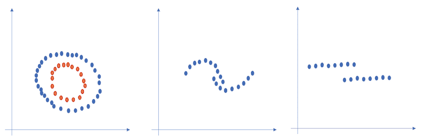

对于图 5-2，我们也可以使用其他算法，如 k 均值聚类。但它们可能无法充分反映数据的复杂形状。正式地说，像 kmeans 聚类这样的算法利用数据点的紧密程度。换句话说，点之间的接近程度和向群集中心的紧密程度驱动 kmeans 中的聚类。另一方面，在谱聚类中，*连通性*是驱动逻辑。在连通性中，数据点要么彼此紧密相邻，要么以某种方式连接。这种基于连接性的聚类示例已在图 5-2 中描述。

观察图 5-3(i)，数据点呈现出环形图案。可能有数据点遵循这种环形图案。这是一个复杂的模式，我们需要对这些数据点进行聚类。想象一下，通过使用聚类方法，红色圆圈被划分为同一簇，如图 5-3(ii)所示。毕竟，它们彼此靠近。但是如果我们仔细观察，这些点是呈圆形排列的，存在一种模式，因此实际的簇应该如图 5-3(iii)所示。

##### 图 5-3 (i) 我们可以有这样一种复杂的数据点表示需要进行聚类。观察环形（ii）一个非常简单的解释可能导致将红点视为同一簇的一部分，但显然，它们并不属于同一簇（iii）我们这里有两个圆。内圆中的点属于一个簇，而外部的点属于另一个簇。

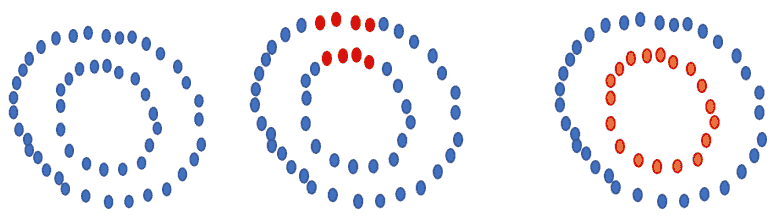

图 5-3 中显示的示例旨在描述谱聚类的优势。

正如我们之前所说的，谱聚类利用连接方法进行聚类。在谱聚类中，立即相邻的数据点在图中被识别出来。这些数据点有时被称为*节点*。然后，这些数据点或节点被映射到低维空间。低维空间实际上就是在这个过程中，谱聚类使用从数据集派生的特征值、亲和力矩阵、拉普拉斯矩阵和度矩阵。然后，低维空间可以被分成多个簇。

谱聚类利用连接方法进行聚类，它依赖于图论，在这里我们根据连接它们的边来识别节点的簇。

我们将详细研究这个过程。但在检查这个过程之前，有一些重要的数学概念构成了谱聚类的基础，我们现在将进行介绍。

### 5.3.1 谱聚类的构建模块

我们知道聚类的目标是将相似的数据点分组到一个簇中，而不相似的数据点分组到另一个簇中。我们应该了解一些数学概念。我们将从相似性图的概念开始，这是数据点的一种相当本质的表示。

#### 相似性图

图是表示数据点的一种最简单和直观的方法之一。在图 5-4(i)中，我们展示了一个图的示例，它只是数据点之间的连接，用边来表示。现在，如果两个数据点之间的相似性是正的，或者它高于某个阈值，那么它们就会连接起来，如图 5-4(ii)所示。我们可以使用相似性的权重而不是绝对值。因此，在图 5-4(ii)中，由于点 1 和 2 相对于点 1 和 3 更相似，因此点 1 和 2 之间的连接权重高于点 1 和 3 之间的连接权重。

##### 图 5-4(i) 图是数据点的简单表示。如果它们非常相似，则点或节点彼此连接（ii）如果数据点之间的相似性高，则权重较高，否则对于不相似的数据点，权重较低。

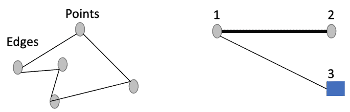

所以，我们可以得出结论——使用相似性图，我们希望对数据点进行聚类，使得

+   数据点的边具有较高的权重值，因此彼此相似，因此它们在同一簇中。

+   数据点的边具有较低的权重值，因此彼此不相似，因此它们在不同的簇中。

除了相似性图之外，我们还应该了解**特征值和特征向量**的概念，我们已经在前一章中详细介绍了。建议您进行复习。我们现在将转向邻接矩阵的概念。

#### 邻接矩阵

仔细看图 5-5。我们可以看到从 1 到 5 的各个点彼此连接。然后我们在矩阵中表示连接。该矩阵称为*邻接矩阵*。

正式地说，在邻接矩阵中，行和列分别是相应的节点。矩阵内部的值表示连接——如果值为 0，则表示没有连接，如果值为 1，则表示存在连接。

##### 图 5-5 邻接矩阵表示各个节点之间的连接，如果值为 1，则表示行和列中的相应节点连接。如果值为 0，则表示它们不连接。例如，节点 1 和节点 5 之间存在连接，因此该值为 1，而节点 1 和节点 4 之间没有连接，因此相应的值为 0。

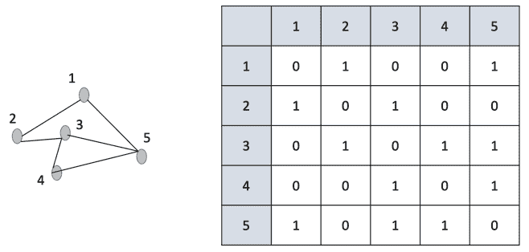

所以对于邻接矩阵，我们只关心两个数据点之间是否存在连接。如果我们扩展邻接矩阵的概念，我们得到度矩阵，这是我们的下一个概念。

#### 度矩阵

正式地说，度矩阵是一个对角矩阵，其中沿对角线的节点的度数是连接到它的边的数量。如果我们使用上述相同的示例，我们可以将度矩阵表示为图 5-6 所示。节点 3 和 5 各自有三个连接，它们在对角线上得到 3 作为值，而其他节点各自只有两个连接，因此它们在对角线上得到 2 作为值。

##### 图 5-6 虽然邻接矩阵表示各个节点之间的连接，但度矩阵是每个节点的连接数。例如，节点 5 有三个连接，因此其前面有 3，而节点 1 只有两个连接，所以它有 2。

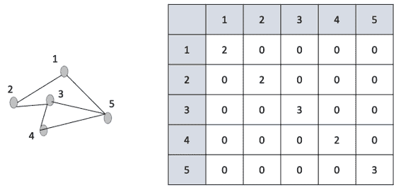

你可能会想为什么我们要使用矩阵？矩阵提供了数据的优雅表示，并且可以清楚地描述两个点之间的关系。

现在我们已经涵盖了邻接矩阵和度矩阵，我们可以转向拉普拉斯矩阵。

#### 拉普拉斯矩阵

拉普拉斯矩阵有很多变体，但如果我们采用最简单的形式，即拉普拉斯矩阵是度矩阵减去邻接矩阵。换句话说，L = D – A。我们可以在图 5-7 中展示它。

##### 图 5-7 拉普拉斯矩阵相当容易理解。要获得拉普拉斯矩阵，我们只需将邻接矩阵从度矩阵中减去，如上例所示。这里，D 表示度矩阵，A 是邻接矩阵，L 是拉普拉斯矩阵。

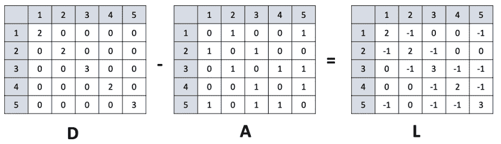

拉普拉斯矩阵是非常重要的，我们使用 L 的特征值来开发谱聚类。一旦我们获得了特征值和特征向量，我们可以定义另外两个值 – 谱间隙和 Fielder 值。第一个非零特征值是 *谱间隙*，它定义了图的密度。*Fielder 值* 是第二个特征值，它提供了将图分割成两个组件所需的最小切割的近似值。Fielder 值的相应向量称为 *Fielder 矢量*。

Fielder 矢量具有正负组件，它们的结果总和为零。

我们将在下一节详细学习谱聚类的过程时使用这个概念。在转向谱聚类的过程之前，我们现在将介绍亲和力矩阵的另一个概念。

#### 亲和力矩阵

在邻接矩阵中，如果我们用权重的相似性替换连接的数量，我们将得到亲和力矩阵。如果点完全不相似，则亲和力为 0，否则如果它们完全相似，则亲和力为 1。矩阵中的值表示数据点之间不同水平的相似性。

 快速测验 – 回答这些问题以检查你的理解。答案在书的末尾

1.   度矩阵是通过计算连接数量创建的。真还是假。

2.   拉普拉斯矩阵是否是度和邻接矩阵之间的转置的除法。真还是假。

3.   在纸上写下一个矩阵，然后推导出它的邻接和度矩阵。

我们现在已经掌握了谱聚类的所有构建模块。我们现在可以转向谱聚类的过程。

### 5.3.2 谱聚类的过程

现在我们已经掌握了谱聚类的所有构建模块。在高层次上，各个步骤可以总结如下：

1.  我们获得数据集并计算其度矩阵和邻接矩阵。

1.  使用它们，我们得到拉普拉斯矩阵。

1.  然后我们计算拉普拉斯矩阵的前 k 个特征向量。k 个特征向量实际上就是对应于 k 个最小特征值的向量。

1.  这样形成的矩阵用于在 k 维空间中对数据点进行聚类。

现在我们将介绍使用示例来覆盖谱聚类的过程，如图 5-8 所示。这些步骤通常在实际实现中不会遵循，因为我们有包和库来实现它。这里涵盖了这些步骤，以便让您了解如何从零开始开发算法的想法。对于 Python 实现，我们将仅使用库和包。虽然可能从头开始开发实现，但重新发明轮子不够高效。

##### 图 5-8 考虑所示的示例，其中我们有一些数据点，它们彼此连接。我们将对这些数据执行谱聚类。

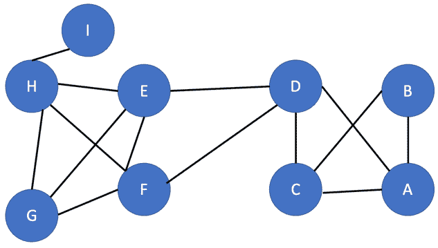

现在当我们希望对这些数据进行谱聚类时。

1.  我们将把创建邻接矩阵和度矩阵的工作留给您。

1.  下一步是创建拉普拉斯矩阵。我们在图 5-9 中分享了输出的拉普拉斯矩阵。

##### 图 5-9 展示了数据的拉普拉斯矩阵。建议您创建度矩阵和邻接矩阵并检查输出。

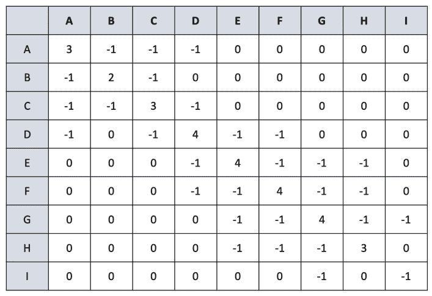

1.  现在，Fielder 向量如图 5-10 所示，用于上述拉普拉斯矩阵。我们创建 Fielder 向量，如上一节所述。观察矩阵的和为零。

##### 图 5-10 Fielder 向量是拉普拉斯矩阵的输出，在这里观察到矩阵的和为零。

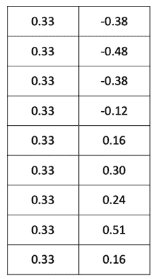

1.  我们可以看到有一些正值和一些负值，根据这些值，我们可以创建两个不同的簇。这是一个非常简单的示例，用来说明谱聚类的过程。

##### 图 5-11 识别了两个簇。这是一个非常简单的示例，用来说明谱聚类的过程。

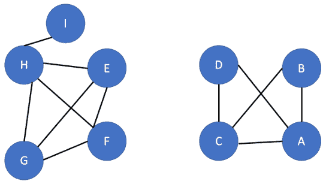

上述过程是谱聚类的一个非常简单的表示。谱聚类对图像分割、语音分析、文本分析、实体解析等非常有用。这是一种非常简单直观的方法，不对数据的形状做出任何假设。像 kmeans 这样的方法假设点在聚类中心周围呈球形分布，而在谱聚类中没有这样的强假设。

另一个重要的区别是，在谱聚类中，与其他方法相比，数据点不需要具有凸边界，其中紧凑性驱动聚类。谱聚类有时会很慢，因为需要计算特征值、拉普拉斯等。随着数据集的增大，复杂性增加，因此谱聚类可能会变慢，但是当我们有一个稀疏的数据集时，它是一种快速的方法。

我们现在将进行谱聚类算法的 Python 实现。

### 5.2.1     谱聚类的 Python 实现

到目前为止，我们已经涵盖了谱聚类的理论细节，现在是时候进入代码了。为此，我们将创建一个数据集并运行 k-means 算法，然后使用谱聚类来比较结果。

第一步：首先导入所有必要的库。这些库是标准库，除了我们将要介绍的几个。`sklearn` 是最著名和最受欢迎的库之一，我们从中导入 `SpectralClustering`、`make_blobs` 和 `make_circles`。

```py
from sklearn.cluster import SpectralClustering
from sklearn.datasets import make_blobs
import matplotlib.pyplot as plt
from sklearn.datasets import make_circles
from numpy import random
import numpy as np
from sklearn.cluster import SpectralClustering, KMeans
from sklearn.metrics import pairwise_distances
from matplotlib import pyplot as plt
import networkx as nx
import seaborn as sns
```

第二步：我们现在将创建一个数据集。我们使用的是 `make_circles` 方法。在这里，我们取 2000 个样本，并将它们表示成一个圆。结果如下所示。

```py
data, clusters = make_circles(n_samples=2000, noise=.01, factor=.3, random_state=5)
plt.scatter(data[:,0], data[:,1]) 
```

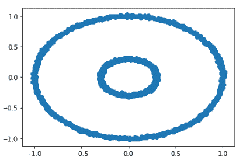

第三步：我们现在将使用 kmeans 聚类测试这个数据集。两种颜色显示两个不同的重叠的簇。

```py
kmeans = KMeans(init='k-means++', n_clusters=2)
km_clustering = kmeans.fit(data)
plt.scatter(data[:,0], data[:,1], c=km_clustering.labels_, cmap='prism', alpha=0.5, edgecolors='g')
```

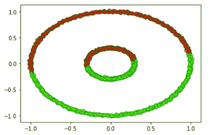

第四步：我们现在用谱聚类运行相同的数据，发现两个簇在这里被单独处理。

```py
spectral = SpectralClustering(n_clusters=2, affinity='nearest_neighbors', random_state=5)
sc_clustering = spectral.fit(data)
plt.scatter(data[:,0], data[:,1], c=sc_clustering.labels_, cmap='prism', alpha=0.5, edgecolors='g')
```

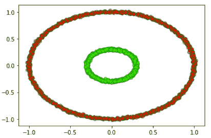

我们可以观察到同一数据集在两个算法中的处理方式不同。谱聚类在处理分离的圆圈时表现更好，分离的圆圈被独立的表示出来。

第五步：你可以尝试改变数据集中的值并运行算法，模拟不同的情况，进而比较结果。

第一部分的算法已经讲解完成。下一部分我们会讲解模糊聚类。

#### 5.3 模糊聚类

到目前为止，我们已经涵盖了相当多的聚类算法。你是否想过为什么一个数据点只能属于一个聚类？为什么一个数据点不能属于多个聚类？看一下图 5-12。

##### 图 5-12 左侧的图表示所有数据点。红点可以属于多个聚类。实际上，我们可以给每个点分配多个聚类。可以给一个点赋予属于特定聚类的概率分数。

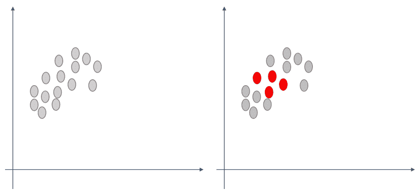

我们知道聚类是根据对象之间的相似度将其分为同一个组的方法。相似的项在同一簇中，而不同的项在不同的簇中。聚类的思想是确保同一簇中的项应该尽可能相似。当对象只能在一个簇中时，称为*硬聚类*。K-means 聚类是硬聚类的经典例子。但是，如果回顾图 5-12，我们可以观察到一个对象可以属于多个簇。这也被称为*软聚类*。

创建模糊边界比创建硬聚类更经济。

在模糊聚类中，一个项目可以被分配给多个聚类。靠近聚类中心的项目可能比靠近聚类边缘的项目更多地属于该聚类。这被称为*成员关系*。它采用最小二乘解决方案找到一个物品的最佳位置。这个最佳位置可能是两个或多个聚类之间的概率空间。我们将在详细介绍模糊聚类过程时详细讨论这个概念，现在我们将转向模糊聚类算法的类型。

### 5.3.3 模糊聚类的类型

模糊聚类可以进一步分为经典模糊算法和基于形状的模糊算法，我们通过图 5-13 来展示。

##### 图 5-13 模糊算法可以分为经典模糊算法和基于形状的模糊算法。

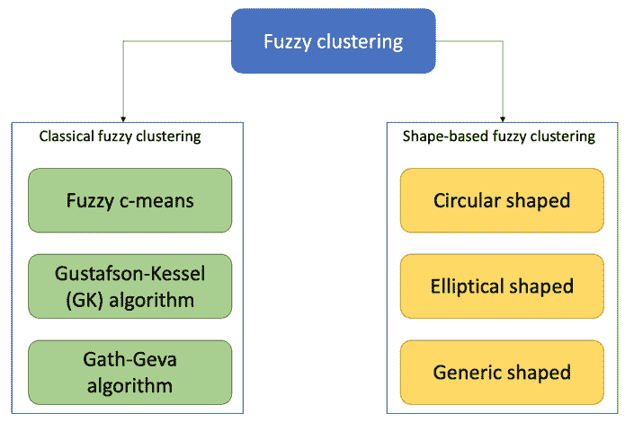

我们将在这里详细介绍模糊 c 均值算法。其他算法我们将简要介绍。

1.  *高斯塔夫松-凯塞尔算法*，有时称为 GK 算法，通过将一个项目与一个聚类和一个矩阵相关联。通过使用协方差矩阵，GL 会生成椭圆形聚类，并根据数据集中的各种结构进行修改。它允许算法捕捉聚类的椭圆形属性。GK 可以导致更窄的聚类，并且在项目数较多的地方，这些区域可能更加薄。

1.  Gath-Geva 算法不基于目标函数。聚类可以导致任何形状，因为它是统计估计值的模糊化。

1.  基于形状的聚类算法根据其名称自解释。圆形模糊聚类算法将导致圆形的聚类，依此类推。

1.  模糊 c 均值算法或 FCM 算法是最流行的模糊聚类算法。它最初由 J.C. Dunn 于 1973 年开发，之后进行了多次改进。它与 k 均值聚类非常相似。这里有一个成员关系的概念，我们将在下面介绍。

参考图 5-14。在第一幅图中，我们有一些项目或数据点。这些数据点可以是聚类数据集的一部分，如客户交易等。在第二幅图中，我们为这些数据点创建了一个聚类。在创建该聚类时，为每个数据点分配成员关系成绩。这些成员关系成绩表明数据点属于聚类的程度或级别。我们将很快介绍计算这些值的数学函数。

我们不应该混淆程度和概率。如果我们对这些程度进行求和，可能得不到 1，因为这些值在 0 和 1 之间对所有项目进行了归一化。

在第三幅图中，我们可以观察和比较点 1 靠近聚类中心，因此比点 2 更多地属于该聚类的程度，而点 2 靠近聚类的边界或边缘。

##### 图 5-14 (i) 我们这里有一些数据点，可以被聚类 (ii) 数据点可以被分成两个簇。对于第一个簇，聚类中心用加号表示。(iii) 我们可以观察到这里点 1 相对于点 2 更接近聚类中心。因此，我们可以得出结论，点 1 属于这个聚类的程度高于聚类 2。

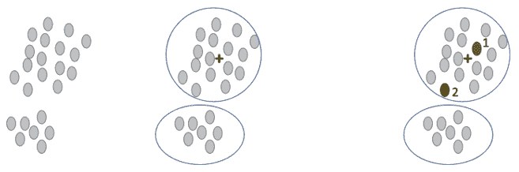

现在我们将深入探讨算法的技术细节。尽管可能有点数学重，但本节可以作为可选内容。

假设我们有一组 *n* 个项目

X = {x[1], x[2], x[3], x[4], x[5]…. x[n]}

我们将 FCM 算法应用于这些项。这些 n 项根据某些标准被聚类成 *c* 个模糊聚类。假设我们从算法中获得了一个 c 个聚类中心的列表，表示为 C = {c[1], c[2], c[3], c[4], c[5]…. c[c]}

算法还返回一个可以定义为下述的划分矩阵。

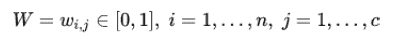

这里，每个元素 w[i,j] 表示元素 X 中每个元素属于聚类 c[j] 的程度。这是划分矩阵的目的。

数学上，我们可以得到 w[i,j] 如方程式 5-1 所示。方程的证明超出了本书的范围。


该算法还为聚类生成聚类中心。聚类的中心是该聚类中所有点的平均值，平均值由它们各自的属于该聚类的程度加权得到。如果我们用数学表示，我们可以写成方程式 5-2。

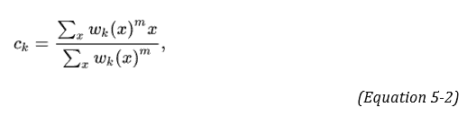

在方程式 5-1 和 5-2 中，有一个非常重要的术语“m”。m 是用于控制聚类模糊性的超参数。m 的值 ≥ 1，通常可以保持为 2。

m 值越高，我们将获得更模糊的聚类。

现在我们将逐步检查 FCM 算法的过程：

1.  首先，我们像 k-means 聚类一样开始。我们选择我们希望在输出中拥有的聚类数量。

1.  然后，将系数随机分配给每个数据点。

1.  现在我们希望迭代直到算法收敛。回想一下 k-means 算法如何收敛，我们通过随机分配聚类数量来启动该过程。然后，我们迭代地计算每个聚类的中心。这就是 kmeans 如何收敛的。对于 FCM，我们将使用类似的过程，尽管有细微的差异。我们增加了一个成员值 w[i,j] 和 m。

1.  对于 FCM，为了使算法收敛，我们根据方程式 5-2 计算每个聚类的中心。

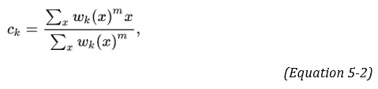

1.  对于每个数据点，我们还计算其在特定聚类中的系数。我们将使用方程式 5-1。

1.  现在我们必须迭代直到 FCM 算法收敛。我们希望最小化的成本函数由 () 给出。

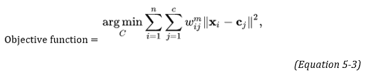

一旦这个函数被最小化，我们就可以得出结论，即 FCM 算法已经收敛。换句话说，我们可以停止进程，因为算法已经完成处理。

现在是与 k 均值算法进行比较的好时机了。在 k 均值中，我们有一个严格的目标函数，它只允许一个聚类成员身份，而对于 FCM 聚类，我们可以根据概率分数得到不同的聚类成员身份。

FCM 在边界不清晰且严格的业务案例中非常有用。考虑在生物信息学领域中，一个基因可以属于多个聚类。或者如果我们有重叠的数据集，比如在营销分析、图像分割等领域。与 k 均值相比，FCM 可以给出相对更稳健的结果。

我们现在将在下一节继续进行 FCM 聚类的 Python 实现。

 小测验 - 回答这些问题以检查你的理解。答案在本书末尾。

1.   模糊聚类允许我们创建重叠的聚类。真或假。

2.   一个数据点只能属于一个聚类。真或假。

3.   如果“m”的值较低，则我们会得到更清晰的聚类。真或假。

### 5.3.4 FCM 的 Python 实现

我们在上一节已经介绍了 FCM 的过程。本节我们将着手讨论 FCM 的 Python 实现。

步骤 1：导入必要的库。

```py
import skfuzzy as fuzz
import pandas as pd
import numpy as np
import matplotlib.pyplot as plt
import seaborn as sns
%matplotlib inline
```

步骤 2：我们现在将声明一个颜色调色板，稍后将用于对聚类进行颜色编码。

```py
color_pallete = ['r','m','y','c', 'brown', 'orange','m','k', 'gray','purple','seagreen']
```

步骤 3：我们将定义聚类中心。

```py
cluster_centers = [[1, 1],
           [2, 4],
           [5, 8]]
```

步骤 4：

```py
sigmas = [[0.5, 0.6],
          [0.4, 0.5],
          [0.1, 0.6]]
```

步骤 5：

```py
np.random.seed(5)  

xpts = np.zeros(1)
ypts = np.zeros(1)
labels = np.zeros(1)
for i, ((xmu, ymu), (xsigma, ysigma)) in enumerate(zip(cluster_centers, sigmas)):
    xpts = np.hstack((xpts, np.random.standard_normal(500) * xsigma + xmu))
    ypts = np.hstack((ypts, np.random.standard_normal(500) * ysigma + ymu))
    labels = np.hstack((labels, np.ones(500) * i))
```

步骤 6：

```py
fig0, ax0 = plt.subplots()
for label in range(5):
    ax0.plot(xpts[labels == label], ypts[labels == label], '.')
ax0.set_title('Data set having 500 points.')
plt.show()
```


步骤 7：

```py
fig1, axes1 = plt.subplots(3, 3, figsize=(10, 10))
alldata = np.vstack((xpts, ypts))
fpcs = []

for ncenters, ax in enumerate(axes1.reshape(-1), 2):
    cntr, u, u0, d, jm, p, fpc = fuzz.cluster.cmeans(
        alldata, ncenters, 2, error=0.005, maxiter=1000, init=None)

    # Store fpc values for later
    fpcs.append(fpc)

    # Plot assigned clusters, for each data point in training set
    cluster_membership = np.argmax(u, axis=0)
    for j in range(ncenters):
        ax.plot(xpts[cluster_membership == j],
                ypts[cluster_membership == j], '.', color=colors[j])

    # Mark the center of each fuzzy cluster
    for pt in cntr:
        ax.plot(pt[0], pt[1], 'rs')

    ax.set_title('cluster_centers = {0}; FPC = {1:.2f}'.format(ncenters, fpc), size=12)
    ax.axis('off')

fig1.tight_layout()
```

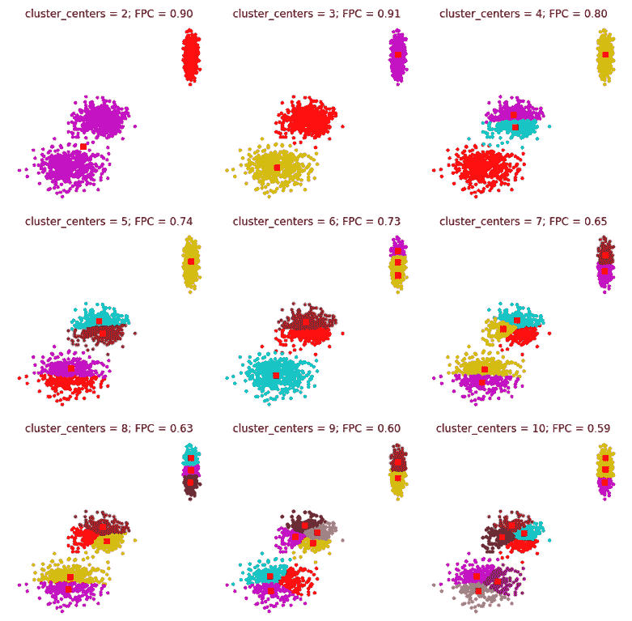

通过这个我们结束了模糊聚类，我们可以在下一节转到高斯混合模型。

## 5.4 高斯混合模型

我们将继续我们在上一节中关于软聚类的讨论。回想一下，我们在那里介绍了高斯混合模型。现在我们将对其进行详细说明。我们将研究这个概念，并对其进行 Python 实现。

首先让我们重新理解*高斯分布*，有时也被称为*正态分布*。你可能听说过钟形曲线，它指的是同一件事情。

在图 5-15 中，观察µ（平均值）为 0，σ²（标准差）为 1 的分布。这是一个完美的正态分布曲线。比较这里不同曲线上的分布。

（图片来源 - 维基百科）

##### 图 5-15 高斯分布是最著名的分布之一。观察均值和标准差值的变化及其对应曲线的影响。

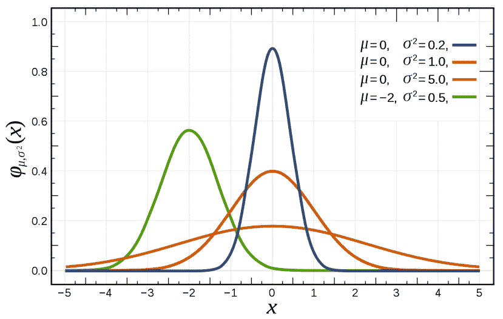

高斯分布的数学表达式为

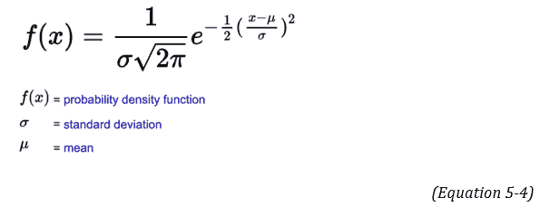

上面的方程也被称为**概率密度函数 (pdf)**。在图 5-15 中，观察到当 µ 为 0，σ² 为 1 时的分布。这是一个完美的正态分布曲线。通过改变均值和标准差的值，我们在图 5-15 中比较不同曲线中的分布，从而得到不同的图形。

你可能想知道为什么我们在这里使用高斯分布。这里有一个非常著名的统计定理叫做*中心极限定理*。我们在这里简要解释该定理。根据该定理，我们收集的数据越多，分布就越趋向于高斯分布。这种正态分布可以在化学、物理、数学、生物学或任何其他学科中观察到。这就是高斯分布的美妙之处。

在图 5-15 中显示的图是一维的。我们也可以有多维高斯分布。在多维高斯分布的情况下，我们将得到图 5-16 中显示的 3D 图。我们的输入是一维的标量。现在，我们的输入不再是标量，而是一个向量，均值也是一个向量，代表数据的中心。因此，均值的维度与输入数据相同。方差现在是协方差矩阵 ∑。该矩阵不仅告诉我们输入的方差，还评论了不同变量之间的关系。换句话说，如果 x 的值发生变化，y 的值会受到影响。请看下面的图 5-16。我们可以理解这里的 x 和 y 变量之间的关系。

(图片来源 – 维基百科)

##### 图 5-16 展示了高斯分布的三维表示。

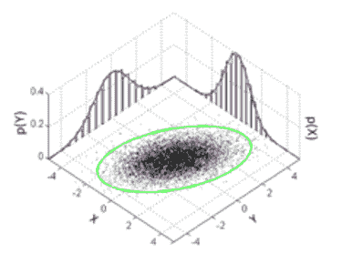

协方差在这里起着重要作用。K-means 不考虑数据集的协方差，而在 GMM 模型中使用。

让我们来研究 GMM 聚类的过程。想象我们有一个包含 *n* 个项目的数据集。当我们使用 GMM 聚类时，我们不是使用质心方法来找到聚类，而是对手头的数据集拟合一组 *k* 个高斯分布。换句话说，我们有 *k* 个聚类。我们必须确定每个高斯分布的参数，包括聚类的均值、方差和权重。一旦确定了每个分布的参数，我们就可以找到每个项目属于 *k* 个聚类的相应概率。

从数学上讲，我们可以根据方程 5-5 计算概率。该方程用于告诉我们一个特定点 x 是 k 个高斯分布的线性组合。Φ[j] 术语用于表示高斯的强度，并且可以看到第二个方程中这种强度的总和等于 1。

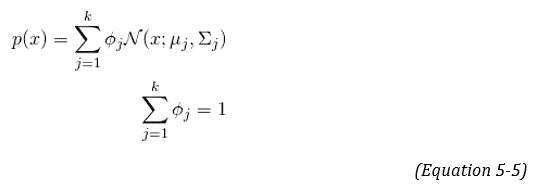

对于谱聚类，我们必须确定 Φ、∑ 和 µ 的值。正如你所想象的，获取这些参数的值可能是一项棘手的任务。确实有一种稍微复杂的叫做期望最大化技术或 EM 技术，我们现在将介绍它。这一部分涉及的数学概念比较深，是可选的。

### 5.4.1 期望最大化（EM）技术

EM 是确定模型正确参数的统计和数学解决方案。有很多流行的技术，也许最著名的是最大似然估计。但同时，最大似然估计也可能存在一些挑战。数据集可能有缺失值，或者换句话说，数据集是不完整的。或者数据集中的一个点可能是由两个不同的高斯分布生成的。因此，确定生成数据点的分布将非常困难。在这里，EM 可以提供帮助。

k-means 只使用平均值，而 GMM 利用数据的平均值和方差。

用于生成数据点的过程被称为*潜在变量*。由于我们不知道这些潜在变量的确切值，EM 首先使用当前数据估计这些潜在变量的最佳值。一旦完成了这一步，然后估计模型参数。使用这些模型参数，再次确定潜在变量。并且使用这些新的潜在变量，推导出新的模型参数。这个过程持续进行，直到获得足够好的潜在值和模型参数，使其很好地适应数据。现在让我们更详细地研究一下。

我们将使用上一节中的相同示例。

想象一下我们有一个包含 *n* 个项的数据集。当我们使用 GMM 聚类时，我们不是使用质心方法找到簇，而是将一组 *k* 个高斯分布拟合到手头的数据集。换句话说，我们有 *k* 个簇。我们必须确定每个高斯分布的参数，即簇的平均值、方差和权重。假设均值为 µ[1]、µ[2]、µ[3]、µ[4]…. µ[k]，协方差为 ∑[1]、∑[2]、∑[3]、∑[4]…. ∑[k]。我们还可以有一个参数来表示分布的密度或强度，可以用符号 Φ 表示。

现在我们将从期望步骤或 E 步开始。在这一步中，每个数据点都以概率分配到一个簇。因此，对于每个点，我们计算其属于一个簇的概率，如果这个值很高，则该点在正确的簇中，否则该点在错误的簇中。换句话说，我们正在计算每个数据点由每个 k 个高斯分布生成的概率。

由于我们正在计算概率，因此这些被称为软分配。

概率是使用方程式 5-6 计算的。如果我们仔细观察，分子是概率，然后我们通过分母进行归一化。分子与我们在方程式 5-5 中看到的相同。

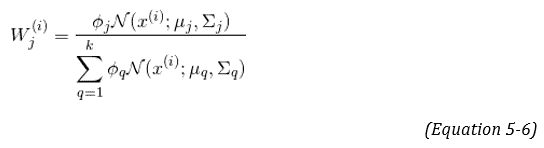

在上面的期望步骤中，对于数据点 x[i,j]，其中 i 是行，j 是列，我们得到一个矩阵，其中行由数据点表示，列由它们对应的高斯值表示。

现在期望步骤已经完成，我们将执行最大化或 M 步骤。在这一步中，我们将使用方程式 5-7 下面的公式更新 µ、∑ 和 Φ 的值。回想一下，在 k-means 聚类中，我们只是取数据点的平均值并继续前进。我们在这里做了类似的事情，尽管使用了我们在上一步中计算的概率或期望。

三个值可以使用下面的方程式计算。方程式 5-7 是协方差 ∑[j] 的计算，在其中我们计算所有点的协方差，然后以该点由高斯 j 生成的概率加权。数学证明超出了本书的范围。

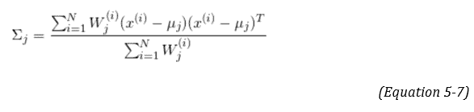

均值 µ[j] 由方程式 5-8 确定。在这里，我们确定所有点的均值，以该点由高斯 j 生成的概率加权。

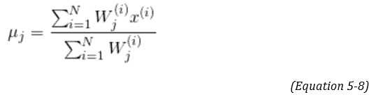

类似地，密度或强度是由方程式 5-9 计算的，其中我们将每个点生成为高斯 j 的概率相加，然后除以总点数 N。

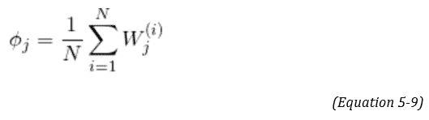

根据这些值，推导出新的 ∑、µ 和 Φ 的值，并且该过程继续直到模型收敛。当我们能够最大化对数似然函数时，我们停止。

这是一个复杂的数学过程。我们已经涵盖了它，以便让您深入了解统计算法背后发生的事情。Python 实现比我们现在将要介绍的数学概念要简单得多。

 POP QUIZ – 回答这些问题以检查您的理解。答案在书的末尾。

1.   高斯分布的均值等于 1，标准差等于 0。是或否。

2.   GMM 模型不考虑数据的协方差。是或否。

### 5.4.2 GMM 的 Python 实现

我们首先导入数据，然后将使用 kmeans 和 GMM 进行结果比较。

步骤 1：我们将导入所有的库并导入数据集。

```py
import pandas as pd
data = pd.read_csv('vehicle.csv')
import matplotlib.pyplot as plt
```

步骤 2：我们现在将从数据集中删除任何 NA。

```py
data = data.dropna()
```

步骤 3：我们现在将拟合一个 `kmeans` 算法。我们将聚类数保持为 5。请注意，我们并不是说它们是理想的聚类数。这些聚类数仅用于说明目的。我们声明一个变量 kmeans，然后使用五个聚类，然后是下一个拟合数据集。

```py
from sklearn.cluster import KMeans
kmeans = KMeans(n_clusters=5)
kmeans.fit(data)
```

步骤 4：我们现在将绘制聚类。首先，在数据集上进行预测，然后将值添加到数据框作为新列。然后，用不同颜色表示不同的聚类绘制数据。

输出显示在下图中。

```py
pred = kmeans.predict(data)
frame = pd.DataFrame(data)
frame['cluster'] = pred

color=['red','blue','orange', 'brown', 'green']
for k in range(0,5):
    data = frame[frame["cluster"]==k]
    plt.scatter(data["compactness"],data["circularity"],c=color[k])
plt.show()
```

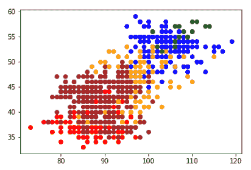

步骤 4：我们现在将拟合一个 GMM 模型。请注意，代码与 kmeans 算法相同，只是算法的名称从 kmeans 更改为 GaussianMixture。

```py
from sklearn.mixture import GaussianMixture
gmm = GaussianMixture(n_components=5)
gmm.fit(data)

#predictions from gmm
labels = gmm.predict(data)
frame = pd.DataFrame(data)
frame['cluster'] = labels
```

步骤 5：我们现在将绘制结果。输出如下所示。

```py
color=['red','blue','orange', 'brown', 'green']
for k in range(0,5):
    data = frame[frame["cluster"]==k]
    plt.scatter(data["compactness"],data["circularity"],c=color[k])
plt.show()
```

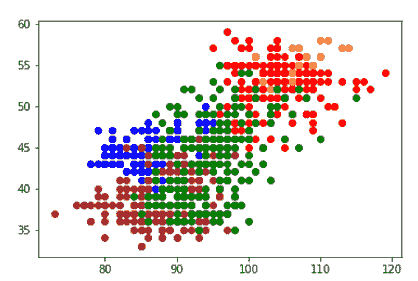

步骤 6：建议您使用不同的聚类值运行代码以观察差异。下面的图中，左边是具有两个聚类的 kmeans，右边是具有两个聚类的 GMM。

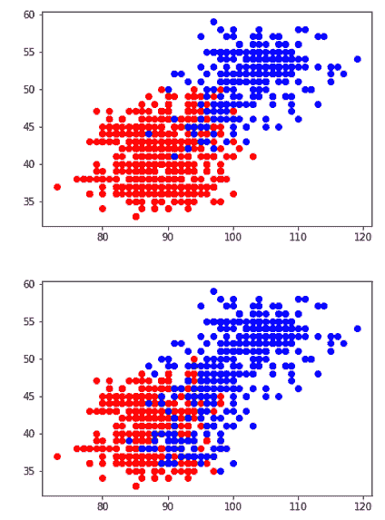

高斯分布是最广泛使用的数据分布之一。如果我们比较 kmeans 和 GMM 模型，我们会发现 kmeans 并不考虑数据的正态分布。kmeans 也不考虑各个数据点之间的关系。

Kmeans 是基于距离的算法，GMM 是基于分布的算法。

简而言之，使用 GMM 模型创建聚类尤其有利，特别是当我们有重叠的数据集时。这是一个在金融和价格建模、基于 NLP 的解决方案等方面非常有用的技术。

通过这个，我们已经涵盖了本章的所有算法。我们现在可以转到总结。

## 5.5 总结

在本章中，我们探讨了三种复杂的聚类算法。你可能觉得数学概念有点沉重。它们确实很沉重，但能更深入地理解过程。并不是说这些算法对每个问题都是最好的。在现实世界的业务问题中，理想情况下，我们应该首先使用经典的聚类算法 - kmeans、层次聚类和 DBSCAN。如果我们得不到可接受的结果，那么我们可以尝试复杂的算法。

许多时候，将数据科学问题等同于算法的选择，其实并不是这样。算法当然是整个解决方案的重要组成部分，但不是唯一的部分。在现实世界的数据集中，有很多变量，数据量也相当大。数据有很多噪音。当我们筛选算法时，我们必须考虑所有这些因素。算法的维护和更新也是我们心中的主要问题之一。所有这些细节在书的最后一章中都有详细介绍。

我们将在下一章介绍复杂的降维技术。你现在可以转到问题。

#### 实际下一步和建议阅读

1.  在第二章中，我们使用了各种技术进行聚类。使用那里的数据集，并执行谱聚类、GMM 和 FCM 聚类以比较结果。

1.  第二章末尾提供了数据集，可以用于聚类。

1.  从此 Kaggle 链接获取用于聚类的信用卡数据集(`www.kaggle.com/vipulgandhi/spectral-clustering-detailed-explanation`)，以及我们之前也使用过的著名的 IRIS 数据集。

1.  有一本由亨利·赫克斯莫尔（Henry Hexmoor）撰写的《计算网络科学》是研究数学概念的好书。

1.  从下面的链接获取光谱聚类论文并学习它们：

1.  关于光谱聚类：分析与算法`proceedings.neurips.cc/paper/2001/file/801272ee79cfde7fa5960571fee36b9b-Paper.pdf`

1.  具有特定特征值选择的光谱聚类`www.eecs.qmul.ac.uk/~sgg/papers/XiangGong-PR08.pdf`

1.  光谱聚类背后的数学及其与主成分分析的等价性`arxiv.org/pdf/2103.00733v1.pdf`

1.  从以下链接获取 GMM 论文并探索它们：

1.  用于聚类的特定高斯混合模型`citeseerx.ist.psu.edu/viewdoc/download?doi=10.1.1.79.7057&rep=rep1&type=pdf`

1.  在数据流中应用复合高斯混合模型`ieeexplore.ieee.org/document/5620507`

1.  从以下链接获取 FCM 论文并学习它们：

1.  FCM：模糊 c 均值聚类算法`www.sciencedirect.com/science/article/pii/0098300484900207`

1.  对模糊 c 均值聚类技术进行调查`www.ijedr.org/papers/IJEDR1704186.pdf`

1.  模糊 c 均值和可能性 c 均值聚类算法的实现，聚类倾向分析和聚类验证`arxiv.org/pdf/1809.08417.pdf`
